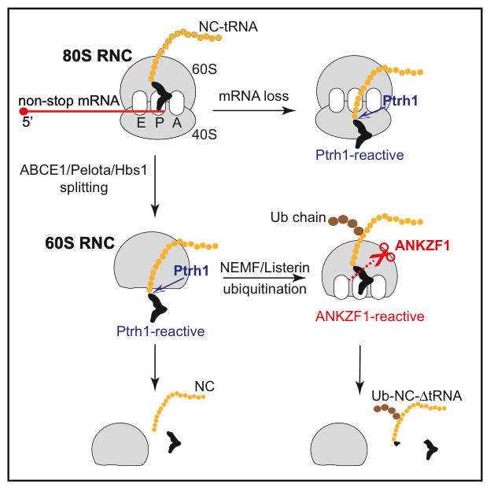

## Question

# Gene Research for Functional Annotation

## ⚠️ CRITICAL: Gene/Protein Identification Context

**BEFORE YOU BEGIN RESEARCH:** You MUST verify you are researching the CORRECT gene/protein. Gene symbols can be ambiguous, especially for less well-characterized genes from non-model organisms.

### Target Gene/Protein Identity (from UniProt):
- **UniProt Accession:** Q9H8Y5
- **Protein Description:** RecName: Full=tRNA endonuclease ANKZF1 {ECO:0000305}; EC=3.1.-.- {ECO:0000269|PubMed:30244831, ECO:0000269|PubMed:31011209}; AltName: Full=Ankyrin repeat and zinc finger domain-containing protein 1 {ECO:0000305}; AltName: Full=Zinc finger protein 744 {ECO:0000305};
- **Gene Information:** Name=ANKZF1 {ECO:0000303|PubMed:21896481, ECO:0000312|HGNC:HGNC:25527}; Synonyms=ZNF744 {ECO:0000303|PubMed:21896481};
- **Organism (full):** Homo sapiens (Human).
- **Protein Family:** Belongs to the ANKZF1/VMS1 family. {ECO:0000255|PROSITE-
- **Key Domains:** Ankyrin_rpt. (IPR002110); Ankyrin_rpt-contain_sf. (IPR036770); ANKZ1/VMS1. (IPR047139); VATC. (IPR041540); VLRF1/Vms1. (IPR041175)

### MANDATORY VERIFICATION STEPS:

1. **Check if the gene symbol "ANKZF1" matches the protein description above**
2. **Verify the organism is correct:** Homo sapiens (Human).
3. **Check if protein family/domains align with what you find in literature**
4. **If you find literature for a DIFFERENT gene with the same or similar symbol, STOP**

### If Gene Symbol is Ambiguous or You Cannot Find Relevant Literature:

**DO NOT PROCEED WITH RESEARCH ON A DIFFERENT GENE.** Instead:
- State clearly: "The gene symbol 'ANKZF1' is ambiguous or literature is limited for this specific protein"
- Explain what you found (e.g., "Found extensive literature on a different gene with the same symbol in a different organism")
- Describe the protein based ONLY on the UniProt information provided above
- Suggest that the protein function can be inferred from domain/family information

### Research Target:

Please provide a comprehensive research report on the gene **ANKZF1** (gene ID: ANKZF1, UniProt: Q9H8Y5) in human.

The research report should be a detailed narrative explaining the function, biological processes, and localization of the gene product. Citations should be given for all claims.

You should prioritize authoritative reviews and primary scientific literature when conducting research. You can supplement
this with annotations you find in gene/protein databases, but these can be outdated or inaccurate.

We are specifically interested in the primary function of the gene - for enzymes, what reaction is catalyzed, and what is the substrate specificity? For transporters, what is the substrate? For structural proteins or adapters, what is the broader structural role? For signaling molecules, what is the role in the pathway.

We are interested in where in or outside the cell the gene product carries out its function.

We are also interested in the signaling or biochemical pathways in which the gene functions. We are less interested in broad pleiotropic effects, except where these elucidate the precise role.

Include evidence where possible. We are interested in both experimental evidence as well as inference from structure, evolution, or bioinformatic analysis. Precise studies should be prioritized over high-throughput, where available.

## Output

Question: You are an expert researcher providing comprehensive, well-cited information.

Provide detailed information focusing on:
1. Key concepts and definitions with current understanding
2. Recent developments and latest research (prioritize 2023-2024 sources)
3. Current applications and real-world implementations
4. Expert opinions and analysis from authoritative sources
5. Relevant statistics and data from recent studies

Format as a comprehensive research report with proper citations. Include URLs and publication dates where available.
Always prioritize recent, authoritative sources and provide specific citations for all major claims.

# Gene Research for Functional Annotation

## ⚠️ CRITICAL: Gene/Protein Identification Context

**BEFORE YOU BEGIN RESEARCH:** You MUST verify you are researching the CORRECT gene/protein. Gene symbols can be ambiguous, especially for less well-characterized genes from non-model organisms.

### Target Gene/Protein Identity (from UniProt):
- **UniProt Accession:** Q9H8Y5
- **Protein Description:** RecName: Full=tRNA endonuclease ANKZF1 {ECO:0000305}; EC=3.1.-.- {ECO:0000269|PubMed:30244831, ECO:0000269|PubMed:31011209}; AltName: Full=Ankyrin repeat and zinc finger domain-containing protein 1 {ECO:0000305}; AltName: Full=Zinc finger protein 744 {ECO:0000305};
- **Gene Information:** Name=ANKZF1 {ECO:0000303|PubMed:21896481, ECO:0000312|HGNC:HGNC:25527}; Synonyms=ZNF744 {ECO:0000303|PubMed:21896481};
- **Organism (full):** Homo sapiens (Human).
- **Protein Family:** Belongs to the ANKZF1/VMS1 family. {ECO:0000255|PROSITE-
- **Key Domains:** Ankyrin_rpt. (IPR002110); Ankyrin_rpt-contain_sf. (IPR036770); ANKZ1/VMS1. (IPR047139); VATC. (IPR041540); VLRF1/Vms1. (IPR041175)

### MANDATORY VERIFICATION STEPS:

1. **Check if the gene symbol "ANKZF1" matches the protein description above**
2. **Verify the organism is correct:** Homo sapiens (Human).
3. **Check if protein family/domains align with what you find in literature**
4. **If you find literature for a DIFFERENT gene with the same or similar symbol, STOP**

### If Gene Symbol is Ambiguous or You Cannot Find Relevant Literature:

**DO NOT PROCEED WITH RESEARCH ON A DIFFERENT GENE.** Instead:
- State clearly: "The gene symbol 'ANKZF1' is ambiguous or literature is limited for this specific protein"
- Explain what you found (e.g., "Found extensive literature on a different gene with the same symbol in a different organism")
- Describe the protein based ONLY on the UniProt information provided above
- Suggest that the protein function can be inferred from domain/family information

### Research Target:

Please provide a comprehensive research report on the gene **ANKZF1** (gene ID: ANKZF1, UniProt: Q9H8Y5) in human.

The research report should be a detailed narrative explaining the function, biological processes, and localization of the gene product. Citations should be given for all claims.

You should prioritize authoritative reviews and primary scientific literature when conducting research. You can supplement
this with annotations you find in gene/protein databases, but these can be outdated or inaccurate.

We are specifically interested in the primary function of the gene - for enzymes, what reaction is catalyzed, and what is the substrate specificity? For transporters, what is the substrate? For structural proteins or adapters, what is the broader structural role? For signaling molecules, what is the role in the pathway.

We are interested in where in or outside the cell the gene product carries out its function.

We are also interested in the signaling or biochemical pathways in which the gene functions. We are less interested in broad pleiotropic effects, except where these elucidate the precise role.

Include evidence where possible. We are interested in both experimental evidence as well as inference from structure, evolution, or bioinformatic analysis. Precise studies should be prioritized over high-throughput, where available.

## Comprehensive Research Report: Human **ANKZF1** (UniProt **Q9H8Y5**) — Functional Annotation

### 1) Target verification (gene/protein identity)

**ANKZF1** (also published as **ZNF744**) is the human ortholog of yeast **Vms1**, and the retrieved literature consistently uses this identity in the context of **ribosome-associated quality control (RQC)**, **p97/VCP cofactor biology**, and **stress-responsive mitochondrial quality control** (stapf2011thegeneraldefinition pages 2-3, stapf2011thegeneraldefinition pages 1-1, haaftenvisser2017ankyrinrepeatand pages 1-2). ANKZF1 is therefore the correct human target corresponding to the UniProt accession **Q9H8Y5** provided by the user.

A key identity-defining feature is the presence of a **VCP/p97-interacting motif (VIM)** within ANKZF1/ZNF744, which binds the **N-terminal domain of p97/VCP**; this motif family was formalized by a minimal consensus **RX5AAX2R**, and ANKZF1/ZNF744 is explicitly included among VIM-containing p97 cofactors (stapf2011thegeneraldefinition pages 2-3, stapf2011thegeneraldefinition pages 1-1).

### 2) Key concepts and definitions (current understanding)

#### 2.1 Ribosome-associated quality control (RQC)
RQC is a conserved surveillance system that resolves **stalled translation** and targets incomplete nascent polypeptides for clearance. In mammals, stalled/collided ribosomes are recognized by the E3 ligase **ZNF598**, which ubiquitinates 40S proteins and promotes downstream splitting into a **peptidyl‑tRNA–bound 60S** complex that becomes a substrate for RQC processing (inada2020qualitycontrolsinduced pages 5-5, miscicka2024ribosomalcollisionis pages 1-2).

#### 2.2 ANKZF1 biochemical role within RQC
Across primary and review literature, ANKZF1 is positioned as the factor that **liberates nascent chains from 60S peptidyl‑tRNA complexes** during RQC, enabling subsequent **p97/VCP-driven extraction** and **proteasomal degradation** of aberrant translation products (inada2020qualitycontrolsinduced pages 5-5, inada2020qualitycontrolsinduced pages 5-6).

A mechanistic point of emphasis is that ANKZF1 is best-supported as a **tRNA-cleaving endonuclease-like activity** acting on the **acceptor arm/CCA end** of P-site peptidyl‑tRNAs on 60S RQC complexes, rather than a canonical eRF1-like peptidyl‑tRNA hydrolase in mammals (kuroha2018releaseofubiquitinated pages 2-4, yip2020elac1repairstrnas pages 1-3). This difference has led to mixed terminology (“peptidyl‑tRNA hydrolase” in some reviews vs “tRNA endonuclease/acceptor-arm cleavage” in reconstitution studies), but both descriptions converge on the same functional outcome: **release of the nascent chain from the tRNA/60S complex** as a prerequisite for clearance (kuroha2018releaseofubiquitinated pages 2-4, inada2020qualitycontrolsinduced pages 5-6, inada2020qualitycontrolsinduced pages 5-5).

### 3) Primary molecular function (enzyme activity, substrates, products)

#### 3.1 Substrate specificity
The experimentally supported substrate is the **peptidyl‑tRNA resident on stalled 60S ribosome–nascent chain complexes** that arise after stalled ribosomes are split and RQC factors assemble (yip2020elac1repairstrnas pages 1-3, inada2020qualitycontrolsinduced pages 5-6).

#### 3.2 Reaction outcome and products
Evidence supports that ANKZF1 cleaves the **tRNA 3′ end / acceptor-arm region**, removing the universally conserved **CCA (positions 74–76)** and generating a tRNA product that carries a **2′,3′-cyclic phosphate** at the discriminator base **N73** (yip2020elac1repairstrnas pages 1-3, inada2020qualitycontrolsinduced pages 5-6). 

A quantitative detail from in vitro mammalian reconstitution is that the released ubiquitinated nascent chain can remain linked to a **short 3′ terminal tRNA remnant**; one reported value is **four 3′-terminal tRNA nucleotides** remaining attached to released ubiquitinated nascent chains (Ub‑NCs) (kuroha2018releaseofubiquitinated pages 1-2). Other mechanistic frameworks/reviews reiterate release of Ub‑NCs linked to **three 3′ terminal nucleotides** (miscicka2024ribosomalcollisionis pages 1-2), highlighting that the exact remnant length can be described slightly differently depending on experimental context and citation lineage.

#### 3.3 Downstream tRNA repair/recycling
Because ANKZF1 cleavage generates a noncanonical tRNA end (including a cyclic phosphate), the tRNA must be repaired before reuse. In mammals, **ELAC1** is supported as the repair enzyme: purified ELAC1 can process the cyclic-phosphate-ended tRNA species into a form that becomes a substrate for the CCA-adding enzyme **TRNT1**, enabling tRNA recycling (yip2020elac1repairstrnas pages 4-6). 

### 4) Pathways and mechanistic placement (step-by-step)

A current mammalian pathway model consistent with the retrieved evidence is:

1. **Stalling/collision sensing**: translation stress yields stalled/collided ribosomes; ZNF598 ubiquitinates small subunit proteins (inada2020qualitycontrolsinduced pages 5-5, miscicka2024ribosomalcollisionis pages 1-2).
2. **Ribosome splitting**: the stalled ribosome is dissociated to generate a peptidyl‑tRNA–bound **60S** complex (mcgirr2025dysregulatedribosomequality pages 2-4, miscicka2024ribosomalcollisionis pages 1-2).
3. **60S RQC assembly**: **NEMF** associates with 60S and helps recruit the E3 ligase **Listerin/LTN1** to ubiquitinate the nascent chain (yip2020elac1repairstrnas pages 1-3, inada2020qualitycontrolsinduced pages 5-5).
4. **ANKZF1-catalyzed nascent chain release**: ANKZF1 acts on the peptidyl‑tRNA on the 60S complex to free the nascent chain for clearance (inada2020qualitycontrolsinduced pages 5-6, kuroha2018releaseofubiquitinated pages 1-2).
5. **Extraction and degradation**: the AAA ATPase **p97/VCP** (with UFD1/NPLOC4) extracts ubiquitinated substrates for delivery to the proteasome (inada2020qualitycontrolsinduced pages 5-5, inada2020qualitycontrolsinduced pages 5-6).
6. **tRNA repair**: tRNA fragments produced by ANKZF1 cleavage are repaired by **ELAC1** and then re-CCA’d by **TRNT1** (yip2020elac1repairstrnas pages 4-6, inada2020qualitycontrolsinduced pages 5-6).

A visual summary of this mechanism (contrasting ANKZF1-mediated processing with Ptrh1-mediated release of non-ubiquitinated substrates) is shown in the graphical abstract of Kuroha et al. 2018 (kuroha2018releaseofubiquitinated media cd140b48).

### 5) Key interaction partners and complex biology

#### 5.1 p97/VCP interaction via VIM
ANKZF1 contains a VIM that mediates interaction with p97/VCP. The motif consensus **RX5AAX2R** was defined as a minimal p97-binding element, and experimental approaches including pull-downs, yeast two-hybrid, and NMR mapping support VIM-mediated binding to the **p97 N-domain** (stapf2011thegeneraldefinition pages 2-3, stapf2011thegeneraldefinition pages 3-4). This interaction is central to positioning ANKZF1 within p97-linked proteostasis networks.

#### 5.2 RQC factor coupling
ANKZF1 function is coupled with core RQC factors including **NEMF**, **Listerin/LTN1**, and the p97/VCP extraction module, with ANKZF1 acting after 60S RQC complex formation to enable downstream degradation (yip2020elac1repairstrnas pages 1-3, inada2020qualitycontrolsinduced pages 5-5).

### 6) Subcellular localization (where ANKZF1 acts)

**Baseline localization:** In human cells, ANKZF1 is reported as **diffuse/cytosolic** under basal conditions (haaftenvisser2017ankyrinrepeatand pages 1-2).

**Stress-induced relocalization:** Under cellular stress (notably oxidative stress), ANKZF1 translocates to **mitochondria**, and this can occur together with **VCP** (haaftenvisser2017ankyrinrepeatand pages 3-4, haaftenvisser2017ankyrinrepeatand pages 1-2). Functionally, ANKZF1 depletion reduces mitochondrial integrity and respiration under stress conditions, linking its localization dynamics to mitochondrial homeostasis (haaftenvisser2017ankyrinrepeatand pages 2-3, haaftenvisser2017ankyrinrepeatand pages 1-2).

### 7) Recent developments (prioritizing 2023–2024)

#### 7.1 2024: ANKZF1 suppresses RAN translation from GC-rich repeats (C9ALS/FTD model)
A 2024 Nucleic Acids Research study found that depletion of ANKZF1 (alongside other RQC factors) increases accumulation of **repeat-associated non-AUG (RAN)** translation products from **G4C2** (C9ORF72) and **CGG** (FMR1) repeats, while overexpression of ANKZF1 reduces RAN products in reporters and decreases GP dipeptide repeat abundance in **C9 patient iPSC-derived neurons** (tseng2024ribosomalqualitycontrol pages 16-18). The same study reports that **loss of ANKZF1 had the greatest impact** among tested modifiers on RAN product accumulation, supporting ANKZF1 as a potent limiter of toxic repeat translation outputs (tseng2024ribosomalqualitycontrol pages 18-20).

#### 7.2 2024: Mitochondrial stress engages RQC steps that include ANKZF1
A 2024 Nature Communications paper (focused on ZNF598 regulation) explicitly situates ANKZF1 within mitochondrial-stress-responsive RQC steps: stalled translation triggers downstream quality control events including release of stalled nascent chains from the peptidyl‑tRNA/60S complex by ANKZF1 (geng2024stalledtranslationby pages 1-2).

#### 7.3 2024: ANKZF1 is a HIF-1α target gene that contributes to angiogenic programs
A 2024 Protein & Cell study using genome-edited human ESC-derived vascular lineages reports that ANKZF1 acts as a **novel HIF‑1α target gene** in human mesenchymal stem cells (hMSCs). ANKZF1 knockout hMSCs displayed reduced migration and tube formation under hypoxia, consistent with ANKZF1 contributing to pro-angiogenic processes (lei2024humanescderivedvascular pages 10-11).

### 8) Current applications and real-world implementations

#### 8.1 Human genetics / disease mechanism: infantile-onset inflammatory bowel disease (IO-IBD)
Biallelic ANKZF1 mutations were associated with **infantile-onset inflammatory bowel disease**, and patient-derived cellular phenotypes included increased apoptosis and reduced mitochondrial respiration; mechanistically, wild-type ANKZF1 is cytosolic but translocates to mitochondria upon stress, whereas at least one patient allele (R585Q) showed impaired stress-induced translocation (haaftenvisser2017ankyrinrepeatand pages 1-2, haaftenvisser2017ankyrinrepeatand pages 3-4). This represents a direct human disease link and provides a functional assay framework (stress-induced mitochondrial recruitment/respiration) for variant interpretation.

#### 8.2 Oncology: prognostic biomarker in colon cancer (TCGA-based)
A TCGA-based survival analysis reported that high ANKZF1 expression is associated with poorer outcomes in colon cancer: **overall survival HR 2.094 (95% CI 1.188–3.689; p=0.011)** and **recurrence-free survival HR 1.762 (95% CI 1.021–3.042; p=0.042)** (zhou2019highankzf1expression pages 1-2). Additional models reported significant associations for CRC overall (e.g., OS HR 1.661, p=0.007; RFS HR 1.969, p=0.001) and colon-specific analyses (zhou2019highankzf1expression pages 2-4). These results motivate ANKZF1 as a candidate prognostic biomarker and as a gene to integrate into angiogenesis/proteostasis pathway models.

#### 8.3 RQC modulation as a therapeutic concept (preclinical)
The 2024 repeat-expansion work proposes that augmenting RQC (including ANKZF1 activity) might reduce toxic repeat-derived products, suggesting a translational hypothesis relevant to currently untreatable repeat expansion disorders (tseng2024ribosomalqualitycontrol pages 1-5, tseng2024ribosomalqualitycontrol pages 16-18). This is still preclinical (cellular/iPSC-derived neuron systems), but it defines a clear experimental intervention: overexpression or enhancement of RQC factors.

#### 8.4 Platform-level evidence and screening readouts
Open Targets reports ANKZF1 associations with inflammatory bowel disease, neurodegenerative disease, lysosomal storage disease, Alzheimer disease, and Parkinson disease, with scores (e.g., neurodegenerative disease score ~0.555) driven largely by pathway-perturbation signals in CRISPRi screens in neuronal contexts (OpenTargets Search: -ANKZF1). This supports prioritization of ANKZF1 in functional genomics pipelines, although it should be interpreted as associative/screen-derived rather than causal clinical proof.

### 9) Expert opinion and authoritative synthesis (reviews and mechanistic framing)

Mechanistic reviews place ANKZF1/Vms1 as the factor responsible for releasing nascent chains from peptidyl‑tRNA on 60S RQC complexes, upstream of p97/VCP extraction and proteasomal degradation, and emphasize that RQC intersects with organelle-localized translation/proteostasis (inada2020qualitycontrolsinduced pages 5-6, inada2020qualitycontrolsinduced pages 5-5). A key expert-level nuance is that mammalian biochemical reconstitution supports a cleavage mechanism in the tRNA acceptor arm/CCA end rather than a canonical GGQ-like hydrolysis mechanism, explaining persistent terminology differences while preserving agreement on functional role (kuroha2018releaseofubiquitinated pages 2-4, yip2020elac1repairstrnas pages 1-3).

### 10) Relevant statistics and data highlights

* **Colon cancer prognosis:** high ANKZF1 expression associated with worse OS and RFS with hazard ratios and confidence intervals (e.g., OS HR 2.094; RFS HR 1.762) (zhou2019highankzf1expression pages 1-2).
* **Open Targets disease association scores:** neurodegenerative disease 0.555; lysosomal storage disease 0.428; inflammatory bowel disease 0.374; Alzheimer disease 0.240; Parkinson disease 0.233 (OpenTargets Search: -ANKZF1).
* **Biochemical product detail:** Ub-nascent chains released by ANKZF1 can remain linked to **four 3′ terminal tRNA nucleotides** in one mammalian reconstitution context (kuroha2018releaseofubiquitinated pages 1-2).

### Evidence map (summary table)

| Category | Evidence summary | Key citations | Publication date & URL |
|---|---|---|---|
| Identity/domains | Human ANKZF1 corresponds to UniProt Q9H8Y5 and the literature synonym ZNF744; it is the mammalian ortholog of yeast Vms1 and contains ankyrin repeats, zinc-finger regions, a mitochondrial targeting domain (MTD), and a VCP/p97-interacting motif (VIM). The VIM consensus was defined as RX5AAX2R and is necessary/sufficient for p97 binding. | (stapf2011thegeneraldefinition pages 2-3, stapf2011thegeneraldefinition pages 1-1, kuroha2018releaseofubiquitinated pages 2-4) | 2011-11-04, https://doi.org/10.1074/jbc.m111.274472; 2018-10-11, https://doi.org/10.1016/j.molcel.2018.08.022 |
| Enzymatic activity | ANKZF1 is experimentally supported as an RQC-associated tRNA-cleaving factor that releases stalled nascent chains from 60S complexes. In mammalian systems it cleaves the acceptor arm/CCA end of peptidyl-tRNA, although some reviews describe the overall outcome as peptidyl-tRNA hydrolysis; the mechanistic consensus is release of nascent chains by ANKZF1 at stalled 60S ribosomes. | (kuroha2018releaseofubiquitinated pages 2-4, yip2020elac1repairstrnas pages 1-3, inada2020qualitycontrolsinduced pages 5-6, inada2020qualitycontrolsinduced pages 5-5) | 2018-10-11, https://doi.org/10.1016/j.molcel.2018.08.022; 2020-02-18, https://doi.org/10.1016/j.celrep.2020.01.082; 2020-01-27, https://doi.org/10.1093/nar/gkz1201 |
| Substrate & products | The substrate is peptidyl-tRNA on stalled 60S ribosome–nascent chain complexes in RQC. ANKZF1 removes CCA74-76, generating a tRNA with a 2',3'-cyclic phosphate at discriminator base N73, and released nascent chains remain attached to a short tRNA remnant reported as 3-4 terminal nucleotides depending on assay/context. | (yip2020elac1repairstrnas pages 1-3, kuroha2018releaseofubiquitinated pages 1-2, miscicka2024ribosomalcollisionis pages 1-2) | 2020-02-18, https://doi.org/10.1016/j.celrep.2020.01.082; 2018-10-11, https://doi.org/10.1016/j.molcel.2018.08.022; 2024-02-29, https://doi.org/10.1093/nar/gkae087 |
| Pathway context (RQC steps) | In canonical mammalian RQC, ribosome stalling/collision triggers ZNF598-mediated 40S ubiquitination and ASCC-dependent splitting; NEMF and Listerin act on the 60S nascent-chain complex, and ANKZF1 then releases the stalled nascent chain for downstream p97/VCP extraction and proteasomal degradation. Cleaved tRNAs are repaired by ELAC1 and then re-CCA-added by TRNT1. | (inada2020qualitycontrolsinduced pages 5-5, inada2020qualitycontrolsinduced pages 5-6, yip2020elac1repairstrnas pages 4-6, miscicka2024ribosomalcollisionis pages 1-2) | 2020-01-27, https://doi.org/10.1093/nar/gkz1201; 2020-02-18, https://doi.org/10.1016/j.celrep.2020.01.082; 2024-02-29, https://doi.org/10.1093/nar/gkae087 |
| Key interactors | Key pathway partners include VCP/p97 (via the VIM), NEMF/Rqc2, Listerin/LTN1, UFD1/NPLOC4, ELAC1, and TRNT1. Evidence supports direct VIM-dependent p97 binding through the p97 N-domain and functional coupling of ANKZF1 to ubiquitinated 60S RQC substrates. | (stapf2011thegeneraldefinition pages 2-3, stapf2011thegeneraldefinition pages 3-4, yip2020elac1repairstrnas pages 1-3, inada2020qualitycontrolsinduced pages 5-5) | 2011-11-04, https://doi.org/10.1074/jbc.m111.274472; 2020-02-18, https://doi.org/10.1016/j.celrep.2020.01.082; 2020-01-27, https://doi.org/10.1093/nar/gkz1201 |
| Subcellular localization | Basally, human ANKZF1 is predominantly diffuse/cytosolic, but upon cellular or mitochondrial stress it relocalizes to mitochondria, often together with VCP. Loss-of-function alleles can impair this stress-induced mitochondrial translocation and are associated with reduced mitochondrial integrity/respiration. | (haaftenvisser2017ankyrinrepeatand pages 1-2, haaftenvisser2017ankyrinrepeatand pages 3-4, haaftenvisser2017ankyrinrepeatand pages 2-3) | 2017-05-12, https://doi.org/10.1074/jbc.m116.772038 |
| Recent 2023-2024 developments | In 2024, ANKZF1 was identified as a strong suppressor of toxic RAN translation from GC-rich repeats in reporter systems and C9ALS/FTD patient iPSC-derived neurons; loss of ANKZF1 had among the largest effects on RAN product accumulation. Other 2024 work placed ANKZF1 within mitochondrial-stress-responsive RQC and identified it as a HIF-1α target contributing to angiogenic phenotypes in human MSCs. | (tseng2024ribosomalqualitycontrol pages 18-20, tseng2024ribosomalqualitycontrol pages 16-18, geng2024stalledtranslationby pages 1-2, lei2024humanescderivedvascular pages 1-2, lei2024humanescderivedvascular pages 10-11) | 2024-02-29, https://doi.org/10.1093/nar/gkae137; 2024-02-22, https://doi.org/10.1038/s41467-024-45525-3; 2024-05-08, https://doi.org/10.1093/procel/pwad027 |
| Disease/translational relevance | Biallelic ANKZF1 mutations are associated with infantile-onset inflammatory bowel disease with apoptosis and mitochondrial respiration defects in patient cells. High ANKZF1 expression is also associated with worse colon cancer outcomes, and platform-level evidence links ANKZF1 to neurodegenerative, lysosomal, Alzheimer, and Parkinson disease contexts. | (haaftenvisser2017ankyrinrepeatand pages 1-2, zhou2019highankzf1expression pages 1-2, OpenTargets Search: -ANKZF1, tseng2024ribosomalqualitycontrol pages 16-18) | 2017-05-12, https://doi.org/10.1074/jbc.m116.772038; 2019-06, https://doi.org/10.2217/fon-2018-0920; 2025, Open Targets Platform reference in Nucleic Acids Research |
| Key quantitative stats | Colon cancer studies reported high ANKZF1 expression associated with poorer overall survival and recurrence-free survival: HR 2.094 (95% CI 1.188-3.689; p=0.011) and HR 1.762 (95% CI 1.021-3.042; p=0.042); broader CRC analyses also reported OS HR 1.661 (95% CI 1.145-2.408; p=0.007) and RFS HR 1.969 (95% CI 1.299-2.984; p=0.001). Open Targets disease association scores included neurodegenerative disease 0.555, lysosomal storage disease 0.428, inflammatory bowel disease 0.374, Alzheimer disease 0.240, and Parkinson disease 0.233. | (zhou2019highankzf1expression pages 8-9, zhou2019highankzf1expression pages 2-4, OpenTargets Search: -ANKZF1) | 2019-06, https://doi.org/10.2217/fon-2018-0920; 2025, Open Targets Platform reference in Nucleic Acids Research |

*Table: This table summarizes experimentally supported functions, pathway context, localization, interactors, and translational relevance for human ANKZF1/Q9H8Y5. It is designed as a compact evidence map for downstream functional annotation and report writing.*

### Limitations and open questions (evidence-based)

1. **Mechanistic nomenclature:** Primary reconstitution work supports endonucleolytic cleavage of tRNA acceptor arm/CCA end, while some reviews generalize this as peptidyl‑tRNA hydrolysis; future structural/kinetic work could further unify these descriptions (kuroha2018releaseofubiquitinated pages 2-4, inada2020qualitycontrolsinduced pages 5-6).
2. **Quantitative effect sizes in recent 2024 studies:** The retrieved text chunks for some 2024 papers (e.g., RAN translation modulation and angiogenesis phenotypes) described statistical significance but did not include the numeric effect sizes in the extracted pages; these are likely in figures/supplement and would require targeted figure/table extraction for exact values (tseng2024ribosomalqualitycontrol pages 16-18, lei2024humanescderivedvascular pages 10-11).

### Key references (URLs and dates)

* Stapf et al. 2011-11 (J Biol Chem): VIM consensus RX5AAX2R; ANKZF1/ZNF744 as p97 cofactor. https://doi.org/10.1074/jbc.m111.274472 (stapf2011thegeneraldefinition pages 2-3)
* van Haaften‑Visser et al. 2017-05 (J Biol Chem): ANKZF1 mutations in infantile-onset IBD; cytosol→mitochondria stress translocation; mitochondrial respiration defects. https://doi.org/10.1074/jbc.m116.772038 (haaftenvisser2017ankyrinrepeatand pages 1-2)
* Kuroha et al. 2018-10 (Mol Cell): mammalian reconstitution; ANKZF1 releases Ub‑NCs by tRNA acceptor-arm cleavage; graphical abstract. https://doi.org/10.1016/j.molcel.2018.08.022 (kuroha2018releaseofubiquitinated pages 1-2, kuroha2018releaseofubiquitinated media cd140b48)
* Inada 2020-01 (NAR, review): RQC pathway framework including ANKZF1 placement and downstream p97 extraction. https://doi.org/10.1093/nar/gkz1201 (inada2020qualitycontrolsinduced pages 5-6)
* Yip et al. 2020-02 (Cell Reports): ELAC1 repairs tRNAs cleaved by ANKZF1 during RQC. https://doi.org/10.1016/j.celrep.2020.01.082 (yip2020elac1repairstrnas pages 4-6)
* Tseng et al. 2024-02 (NAR): ANKZF1 suppresses RAN products in GC-rich repeat translation; effects in C9 patient iPSC-derived neurons. https://doi.org/10.1093/nar/gkae137 (tseng2024ribosomalqualitycontrol pages 16-18)
* Geng et al. 2024-02 (Nat Commun): mitochondrial stress upregulates ZNF598 axis; RQC steps include ANKZF1-mediated release. https://doi.org/10.1038/s41467-024-45525-3 (geng2024stalledtranslationby pages 1-2)
* Lei et al. 2024-05 (Protein & Cell): ANKZF1 is a HIF‑1α target; ANKZF1 KO hMSCs show reduced angiogenic phenotypes. https://doi.org/10.1093/procel/pwad027 (lei2024humanescderivedvascular pages 10-11)
* Zhou et al. 2019-06 (Future Oncology): colon cancer prognosis HRs for ANKZF1 expression. https://doi.org/10.2217/fon-2018-0920 (zhou2019highankzf1expression pages 1-2)
* Open Targets Platform (database): disease association scores (IBD, neurodegenerative diseases, etc.). (OpenTargets Search: -ANKZF1)

References

1. (stapf2011thegeneraldefinition pages 2-3): Christopher Stapf, Edward Cartwright, Mark Bycroft, Kay Hofmann, and Alexander Buchberger. The general definition of the p97/valosin-containing protein (vcp)-interacting motif (vim) delineates a new family of p97 cofactors. Journal of Biological Chemistry, 286:38670-38678, Nov 2011. URL: https://doi.org/10.1074/jbc.m111.274472, doi:10.1074/jbc.m111.274472. This article has 81 citations and is from a domain leading peer-reviewed journal.

2. (stapf2011thegeneraldefinition pages 1-1): Christopher Stapf, Edward Cartwright, Mark Bycroft, Kay Hofmann, and Alexander Buchberger. The general definition of the p97/valosin-containing protein (vcp)-interacting motif (vim) delineates a new family of p97 cofactors. Journal of Biological Chemistry, 286:38670-38678, Nov 2011. URL: https://doi.org/10.1074/jbc.m111.274472, doi:10.1074/jbc.m111.274472. This article has 81 citations and is from a domain leading peer-reviewed journal.

3. (haaftenvisser2017ankyrinrepeatand pages 1-2): Désirée Y. van Haaften-Visser, Magdalena Harakalova, Enric Mocholi, Joris M. van Montfrans, Abdul Elkadri, Ester Rieter, Karoline Fiedler, Peter M. van Hasselt, Emily M.M. Triffaux, Mieke M. van Haelst, Isaac J. Nijman, Wigard P. Kloosterman, Edward E.S. Nieuwenhuis, Aleixo M. Muise, Edwin Cuppen, Roderick H.J. Houwen, and Paul J. Coffer. Ankyrin repeat and zinc-finger domain-containing 1 mutations are associated with infantile-onset inflammatory bowel disease. Journal of Biological Chemistry, 292:7904-7920, May 2017. URL: https://doi.org/10.1074/jbc.m116.772038, doi:10.1074/jbc.m116.772038. This article has 39 citations and is from a domain leading peer-reviewed journal.

4. (inada2020qualitycontrolsinduced pages 5-5): Toshifumi Inada. Quality controls induced by aberrant translation. Nucleic Acids Research, 48:1084-1096, Jan 2020. URL: https://doi.org/10.1093/nar/gkz1201, doi:10.1093/nar/gkz1201. This article has 136 citations and is from a highest quality peer-reviewed journal.

5. (miscicka2024ribosomalcollisionis pages 1-2): Anna Miścicka, Alexander G Bulakhov, Kazushige Kuroha, Alexandra Zinoviev, Christopher U T Hellen, and Tatyana V Pestova. Ribosomal collision is not a prerequisite for znf598-mediated ribosome ubiquitination and disassembly of ribosomal complexes by ascc. Nucleic Acids Research, 52:4627-4643, Feb 2024. URL: https://doi.org/10.1093/nar/gkae087, doi:10.1093/nar/gkae087. This article has 21 citations and is from a highest quality peer-reviewed journal.

6. (inada2020qualitycontrolsinduced pages 5-6): Toshifumi Inada. Quality controls induced by aberrant translation. Nucleic Acids Research, 48:1084-1096, Jan 2020. URL: https://doi.org/10.1093/nar/gkz1201, doi:10.1093/nar/gkz1201. This article has 136 citations and is from a highest quality peer-reviewed journal.

7. (kuroha2018releaseofubiquitinated pages 2-4): Kazushige Kuroha, Alexandra Zinoviev, Christopher U.T. Hellen, and Tatyana V. Pestova. Release of ubiquitinated and non-ubiquitinated nascent chains from stalled mammalian ribosomal complexes by ankzf1 and ptrh1. Molecular cell, 72 2:286-302.e8, Oct 2018. URL: https://doi.org/10.1016/j.molcel.2018.08.022, doi:10.1016/j.molcel.2018.08.022. This article has 127 citations and is from a highest quality peer-reviewed journal.

8. (yip2020elac1repairstrnas pages 1-3): Matthew C.J. Yip, Simonas Savickas, Steven P. Gygi, and Sichen Shao. Elac1 repairs trnas cleaved during ribosome-associated quality control. Cell reports, 30 7:2106-2114.e5, Feb 2020. URL: https://doi.org/10.1016/j.celrep.2020.01.082, doi:10.1016/j.celrep.2020.01.082. This article has 47 citations and is from a highest quality peer-reviewed journal.

9. (kuroha2018releaseofubiquitinated pages 1-2): Kazushige Kuroha, Alexandra Zinoviev, Christopher U.T. Hellen, and Tatyana V. Pestova. Release of ubiquitinated and non-ubiquitinated nascent chains from stalled mammalian ribosomal complexes by ankzf1 and ptrh1. Molecular cell, 72 2:286-302.e8, Oct 2018. URL: https://doi.org/10.1016/j.molcel.2018.08.022, doi:10.1016/j.molcel.2018.08.022. This article has 127 citations and is from a highest quality peer-reviewed journal.

10. (yip2020elac1repairstrnas pages 4-6): Matthew C.J. Yip, Simonas Savickas, Steven P. Gygi, and Sichen Shao. Elac1 repairs trnas cleaved during ribosome-associated quality control. Cell reports, 30 7:2106-2114.e5, Feb 2020. URL: https://doi.org/10.1016/j.celrep.2020.01.082, doi:10.1016/j.celrep.2020.01.082. This article has 47 citations and is from a highest quality peer-reviewed journal.

11. (mcgirr2025dysregulatedribosomequality pages 2-4): Tom McGirr, Okan Onar, and Seyed Mehdi Jafarnejad. Dysregulated ribosome quality control in human diseases. The Febs Journal, 292:936-959, Jul 2025. URL: https://doi.org/10.1111/febs.17217, doi:10.1111/febs.17217. This article has 20 citations.

12. (kuroha2018releaseofubiquitinated media cd140b48): Kazushige Kuroha, Alexandra Zinoviev, Christopher U.T. Hellen, and Tatyana V. Pestova. Release of ubiquitinated and non-ubiquitinated nascent chains from stalled mammalian ribosomal complexes by ankzf1 and ptrh1. Molecular cell, 72 2:286-302.e8, Oct 2018. URL: https://doi.org/10.1016/j.molcel.2018.08.022, doi:10.1016/j.molcel.2018.08.022. This article has 127 citations and is from a highest quality peer-reviewed journal.

13. (stapf2011thegeneraldefinition pages 3-4): Christopher Stapf, Edward Cartwright, Mark Bycroft, Kay Hofmann, and Alexander Buchberger. The general definition of the p97/valosin-containing protein (vcp)-interacting motif (vim) delineates a new family of p97 cofactors. Journal of Biological Chemistry, 286:38670-38678, Nov 2011. URL: https://doi.org/10.1074/jbc.m111.274472, doi:10.1074/jbc.m111.274472. This article has 81 citations and is from a domain leading peer-reviewed journal.

14. (haaftenvisser2017ankyrinrepeatand pages 3-4): Désirée Y. van Haaften-Visser, Magdalena Harakalova, Enric Mocholi, Joris M. van Montfrans, Abdul Elkadri, Ester Rieter, Karoline Fiedler, Peter M. van Hasselt, Emily M.M. Triffaux, Mieke M. van Haelst, Isaac J. Nijman, Wigard P. Kloosterman, Edward E.S. Nieuwenhuis, Aleixo M. Muise, Edwin Cuppen, Roderick H.J. Houwen, and Paul J. Coffer. Ankyrin repeat and zinc-finger domain-containing 1 mutations are associated with infantile-onset inflammatory bowel disease. Journal of Biological Chemistry, 292:7904-7920, May 2017. URL: https://doi.org/10.1074/jbc.m116.772038, doi:10.1074/jbc.m116.772038. This article has 39 citations and is from a domain leading peer-reviewed journal.

15. (haaftenvisser2017ankyrinrepeatand pages 2-3): Désirée Y. van Haaften-Visser, Magdalena Harakalova, Enric Mocholi, Joris M. van Montfrans, Abdul Elkadri, Ester Rieter, Karoline Fiedler, Peter M. van Hasselt, Emily M.M. Triffaux, Mieke M. van Haelst, Isaac J. Nijman, Wigard P. Kloosterman, Edward E.S. Nieuwenhuis, Aleixo M. Muise, Edwin Cuppen, Roderick H.J. Houwen, and Paul J. Coffer. Ankyrin repeat and zinc-finger domain-containing 1 mutations are associated with infantile-onset inflammatory bowel disease. Journal of Biological Chemistry, 292:7904-7920, May 2017. URL: https://doi.org/10.1074/jbc.m116.772038, doi:10.1074/jbc.m116.772038. This article has 39 citations and is from a domain leading peer-reviewed journal.

16. (tseng2024ribosomalqualitycontrol pages 16-18): Yi-Ju Tseng, Amy Krans, Indranil Malik, Xiexiong Deng, Evrim Yildirim, Sinem Ovunc, Elizabeth M H Tank, Karen Jansen-West, Ross Kaufhold, Nicolas B Gomez, Roger Sher, Leonard Petrucelli, Sami J Barmada, and Peter K Todd. Ribosomal quality control factors inhibit repeat-associated non-aug translation from gc-rich repeats. Nucleic Acids Research, 52:5928-5949, Feb 2024. URL: https://doi.org/10.1093/nar/gkae137, doi:10.1093/nar/gkae137. This article has 21 citations and is from a highest quality peer-reviewed journal.

17. (tseng2024ribosomalqualitycontrol pages 18-20): Yi-Ju Tseng, Amy Krans, Indranil Malik, Xiexiong Deng, Evrim Yildirim, Sinem Ovunc, Elizabeth M H Tank, Karen Jansen-West, Ross Kaufhold, Nicolas B Gomez, Roger Sher, Leonard Petrucelli, Sami J Barmada, and Peter K Todd. Ribosomal quality control factors inhibit repeat-associated non-aug translation from gc-rich repeats. Nucleic Acids Research, 52:5928-5949, Feb 2024. URL: https://doi.org/10.1093/nar/gkae137, doi:10.1093/nar/gkae137. This article has 21 citations and is from a highest quality peer-reviewed journal.

18. (geng2024stalledtranslationby pages 1-2): Ji Geng, Shuangxi Li, Yu Li, Zhihao Wu, Sunil Bhurtel, Suman Rimal, Danish Khan, Rani Ohja, Onn Brandman, and Bingwei Lu. Stalled translation by mitochondrial stress upregulates a cnot4-znf598 ribosomal quality control pathway important for tissue homeostasis. Nature Communications, Feb 2024. URL: https://doi.org/10.1038/s41467-024-45525-3, doi:10.1038/s41467-024-45525-3. This article has 20 citations and is from a highest quality peer-reviewed journal.

19. (lei2024humanescderivedvascular pages 10-11): Jinghui Lei, Xiaoyu Jiang, Daoyuan Huang, Ying Jing, Shanshan Yang, Lingling Geng, Yupeng Yan, Fangshuo Zheng, Fang Cheng, Weiqi Zhang, Juan Carlos Izpisua Belmonte, Guang-Hui Liu, Si Wang, and Jing Qu. Human esc-derived vascular cells promote vascular regeneration in a hif-1α dependent manner. Protein & Cell, 15:36-51, May 2024. URL: https://doi.org/10.1093/procel/pwad027, doi:10.1093/procel/pwad027. This article has 14 citations and is from a peer-reviewed journal.

20. (zhou2019highankzf1expression pages 1-2): Xin Zhou, Yan-Na Shang, Ran Lu, Chuan-Wen Fan, and Xian-Ming Mo. High <i>ankzf1</i> expression is associated with poor overall survival and recurrence-free survival in colon cancer. Jun 2019. URL: https://doi.org/10.2217/fon-2018-0920, doi:10.2217/fon-2018-0920. This article has 29 citations and is from a peer-reviewed journal.

21. (zhou2019highankzf1expression pages 2-4): Xin Zhou, Yan-Na Shang, Ran Lu, Chuan-Wen Fan, and Xian-Ming Mo. High <i>ankzf1</i> expression is associated with poor overall survival and recurrence-free survival in colon cancer. Jun 2019. URL: https://doi.org/10.2217/fon-2018-0920, doi:10.2217/fon-2018-0920. This article has 29 citations and is from a peer-reviewed journal.

22. (tseng2024ribosomalqualitycontrol pages 1-5): Yi-Ju Tseng, Amy Krans, Indranil Malik, Xiexiong Deng, Evrim Yildirim, Sinem Ovunc, Elizabeth M H Tank, Karen Jansen-West, Ross Kaufhold, Nicolas B Gomez, Roger Sher, Leonard Petrucelli, Sami J Barmada, and Peter K Todd. Ribosomal quality control factors inhibit repeat-associated non-aug translation from gc-rich repeats. Nucleic Acids Research, 52:5928-5949, Feb 2024. URL: https://doi.org/10.1093/nar/gkae137, doi:10.1093/nar/gkae137. This article has 21 citations and is from a highest quality peer-reviewed journal.

23. (OpenTargets Search: -ANKZF1): Open Targets Query (-ANKZF1, 5 results). Buniello, A. et al. (2025). Open Targets Platform: facilitating therapeutic hypotheses building in drug discovery. Nucleic Acids Research.

24. (lei2024humanescderivedvascular pages 1-2): Jinghui Lei, Xiaoyu Jiang, Daoyuan Huang, Ying Jing, Shanshan Yang, Lingling Geng, Yupeng Yan, Fangshuo Zheng, Fang Cheng, Weiqi Zhang, Juan Carlos Izpisua Belmonte, Guang-Hui Liu, Si Wang, and Jing Qu. Human esc-derived vascular cells promote vascular regeneration in a hif-1α dependent manner. Protein & Cell, 15:36-51, May 2024. URL: https://doi.org/10.1093/procel/pwad027, doi:10.1093/procel/pwad027. This article has 14 citations and is from a peer-reviewed journal.

25. (zhou2019highankzf1expression pages 8-9): Xin Zhou, Yan-Na Shang, Ran Lu, Chuan-Wen Fan, and Xian-Ming Mo. High <i>ankzf1</i> expression is associated with poor overall survival and recurrence-free survival in colon cancer. Jun 2019. URL: https://doi.org/10.2217/fon-2018-0920, doi:10.2217/fon-2018-0920. This article has 29 citations and is from a peer-reviewed journal.

## Artifacts

- [Edison artifact artifact-00](ANKZF1-deep-research-falcon_artifacts/artifact-00.md)

## Citations

1. kuroha2018releaseofubiquitinated pages 1-2
2. miscicka2024ribosomalcollisionis pages 1-2
3. haaftenvisser2017ankyrinrepeatand pages 1-2
4. tseng2024ribosomalqualitycontrol pages 16-18
5. tseng2024ribosomalqualitycontrol pages 18-20
6. geng2024stalledtranslationby pages 1-2
7. lei2024humanescderivedvascular pages 10-11
8. stapf2011thegeneraldefinition pages 2-3
9. inada2020qualitycontrolsinduced pages 5-6
10. stapf2011thegeneraldefinition pages 1-1
11. inada2020qualitycontrolsinduced pages 5-5
12. kuroha2018releaseofubiquitinated pages 2-4
13. mcgirr2025dysregulatedribosomequality pages 2-4
14. stapf2011thegeneraldefinition pages 3-4
15. haaftenvisser2017ankyrinrepeatand pages 3-4
16. haaftenvisser2017ankyrinrepeatand pages 2-3
17. tseng2024ribosomalqualitycontrol pages 1-5
18. lei2024humanescderivedvascular pages 1-2
19. https://doi.org/10.1074/jbc.m111.274472;
20. https://doi.org/10.1016/j.molcel.2018.08.022
21. https://doi.org/10.1016/j.molcel.2018.08.022;
22. https://doi.org/10.1016/j.celrep.2020.01.082;
23. https://doi.org/10.1093/nar/gkz1201
24. https://doi.org/10.1093/nar/gkae087
25. https://doi.org/10.1093/nar/gkz1201;
26. https://doi.org/10.1074/jbc.m116.772038
27. https://doi.org/10.1093/nar/gkae137;
28. https://doi.org/10.1038/s41467-024-45525-3;
29. https://doi.org/10.1093/procel/pwad027
30. https://doi.org/10.1074/jbc.m116.772038;
31. https://doi.org/10.2217/fon-2018-0920;
32. https://doi.org/10.1074/jbc.m111.274472
33. https://doi.org/10.1016/j.celrep.2020.01.082
34. https://doi.org/10.1093/nar/gkae137
35. https://doi.org/10.1038/s41467-024-45525-3
36. https://doi.org/10.2217/fon-2018-0920
37. https://doi.org/10.1074/jbc.m111.274472,
38. https://doi.org/10.1074/jbc.m116.772038,
39. https://doi.org/10.1093/nar/gkz1201,
40. https://doi.org/10.1093/nar/gkae087,
41. https://doi.org/10.1016/j.molcel.2018.08.022,
42. https://doi.org/10.1016/j.celrep.2020.01.082,
43. https://doi.org/10.1111/febs.17217,
44. https://doi.org/10.1093/nar/gkae137,
45. https://doi.org/10.1038/s41467-024-45525-3,
46. https://doi.org/10.1093/procel/pwad027,
47. https://doi.org/10.2217/fon-2018-0920,