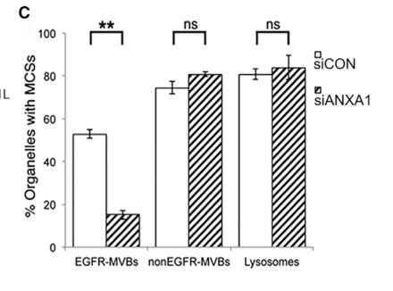

## Question

# Gene Research for Functional Annotation

## ⚠️ CRITICAL: Gene/Protein Identification Context

**BEFORE YOU BEGIN RESEARCH:** You MUST verify you are researching the CORRECT gene/protein. Gene symbols can be ambiguous, especially for less well-characterized genes from non-model organisms.

### Target Gene/Protein Identity (from UniProt):
- **UniProt Accession:** P04083
- **Protein Description:** RecName: Full=Annexin A1; AltName: Full=Annexin I; AltName: Full=Annexin-1; AltName: Full=Calpactin II; AltName: Full=Calpactin-2; AltName: Full=Chromobindin-9; AltName: Full=Lipocortin I {ECO:0000303|PubMed:1832554}; AltName: Full=Phospholipase A2 inhibitory protein; AltName: Full=p35; Contains: RecName: Full=Annexin Ac2-26 {ECO:0000303|PubMed:22879591};
- **Gene Information:** Name=ANXA1; Synonyms=ANX1, LPC1;
- **Organism (full):** Homo sapiens (Human).
- **Protein Family:** Belongs to the annexin family. {ECO:0000255|PROSITE-
- **Key Domains:** Annexin. (IPR001464); Annexin_repeat. (IPR018502); Annexin_repeat_CS. (IPR018252); Annexin_sf. (IPR037104); ANX1. (IPR002388)

### MANDATORY VERIFICATION STEPS:

1. **Check if the gene symbol "ANXA1" matches the protein description above**
2. **Verify the organism is correct:** Homo sapiens (Human).
3. **Check if protein family/domains align with what you find in literature**
4. **If you find literature for a DIFFERENT gene with the same or similar symbol, STOP**

### If Gene Symbol is Ambiguous or You Cannot Find Relevant Literature:

**DO NOT PROCEED WITH RESEARCH ON A DIFFERENT GENE.** Instead:
- State clearly: "The gene symbol 'ANXA1' is ambiguous or literature is limited for this specific protein"
- Explain what you found (e.g., "Found extensive literature on a different gene with the same symbol in a different organism")
- Describe the protein based ONLY on the UniProt information provided above
- Suggest that the protein function can be inferred from domain/family information

### Research Target:

Please provide a comprehensive research report on the gene **ANXA1** (gene ID: ANXA1, UniProt: P04083) in human.

The research report should be a detailed narrative explaining the function, biological processes, and localization of the gene product. Citations should be given for all claims.

You should prioritize authoritative reviews and primary scientific literature when conducting research. You can supplement
this with annotations you find in gene/protein databases, but these can be outdated or inaccurate.

We are specifically interested in the primary function of the gene - for enzymes, what reaction is catalyzed, and what is the substrate specificity? For transporters, what is the substrate? For structural proteins or adapters, what is the broader structural role? For signaling molecules, what is the role in the pathway.

We are interested in where in or outside the cell the gene product carries out its function.

We are also interested in the signaling or biochemical pathways in which the gene functions. We are less interested in broad pleiotropic effects, except where these elucidate the precise role.

Include evidence where possible. We are interested in both experimental evidence as well as inference from structure, evolution, or bioinformatic analysis. Precise studies should be prioritized over high-throughput, where available.

## Output

Question: You are an expert researcher providing comprehensive, well-cited information.

Provide detailed information focusing on:
1. Key concepts and definitions with current understanding
2. Recent developments and latest research (prioritize 2023-2024 sources)
3. Current applications and real-world implementations
4. Expert opinions and analysis from authoritative sources
5. Relevant statistics and data from recent studies

Format as a comprehensive research report with proper citations. Include URLs and publication dates where available.
Always prioritize recent, authoritative sources and provide specific citations for all major claims.

# Gene Research for Functional Annotation

## ⚠️ CRITICAL: Gene/Protein Identification Context

**BEFORE YOU BEGIN RESEARCH:** You MUST verify you are researching the CORRECT gene/protein. Gene symbols can be ambiguous, especially for less well-characterized genes from non-model organisms.

### Target Gene/Protein Identity (from UniProt):
- **UniProt Accession:** P04083
- **Protein Description:** RecName: Full=Annexin A1; AltName: Full=Annexin I; AltName: Full=Annexin-1; AltName: Full=Calpactin II; AltName: Full=Calpactin-2; AltName: Full=Chromobindin-9; AltName: Full=Lipocortin I {ECO:0000303|PubMed:1832554}; AltName: Full=Phospholipase A2 inhibitory protein; AltName: Full=p35; Contains: RecName: Full=Annexin Ac2-26 {ECO:0000303|PubMed:22879591};
- **Gene Information:** Name=ANXA1; Synonyms=ANX1, LPC1;
- **Organism (full):** Homo sapiens (Human).
- **Protein Family:** Belongs to the annexin family. {ECO:0000255|PROSITE-
- **Key Domains:** Annexin. (IPR001464); Annexin_repeat. (IPR018502); Annexin_repeat_CS. (IPR018252); Annexin_sf. (IPR037104); ANX1. (IPR002388)

### MANDATORY VERIFICATION STEPS:

1. **Check if the gene symbol "ANXA1" matches the protein description above**
2. **Verify the organism is correct:** Homo sapiens (Human).
3. **Check if protein family/domains align with what you find in literature**
4. **If you find literature for a DIFFERENT gene with the same or similar symbol, STOP**

### If Gene Symbol is Ambiguous or You Cannot Find Relevant Literature:

**DO NOT PROCEED WITH RESEARCH ON A DIFFERENT GENE.** Instead:
- State clearly: "The gene symbol 'ANXA1' is ambiguous or literature is limited for this specific protein"
- Explain what you found (e.g., "Found extensive literature on a different gene with the same symbol in a different organism")
- Describe the protein based ONLY on the UniProt information provided above
- Suggest that the protein function can be inferred from domain/family information

### Research Target:

Please provide a comprehensive research report on the gene **ANXA1** (gene ID: ANXA1, UniProt: P04083) in human.

The research report should be a detailed narrative explaining the function, biological processes, and localization of the gene product. Citations should be given for all claims.

You should prioritize authoritative reviews and primary scientific literature when conducting research. You can supplement
this with annotations you find in gene/protein databases, but these can be outdated or inaccurate.

We are specifically interested in the primary function of the gene - for enzymes, what reaction is catalyzed, and what is the substrate specificity? For transporters, what is the substrate? For structural proteins or adapters, what is the broader structural role? For signaling molecules, what is the role in the pathway.

We are interested in where in or outside the cell the gene product carries out its function.

We are also interested in the signaling or biochemical pathways in which the gene functions. We are less interested in broad pleiotropic effects, except where these elucidate the precise role.

Include evidence where possible. We are interested in both experimental evidence as well as inference from structure, evolution, or bioinformatic analysis. Precise studies should be prioritized over high-throughput, where available.

# Human ANXA1 (annexin A1): functional annotation research report

**Identity and scope.** The specified target is **human ANXA1**, UniProt **[P04083](https://www.uniprot.org/uniprotkb/P04083/entry)**, also called annexin I and lipocortin 1. The supplied identity agrees with the literature: ANXA1 is a 346-amino-acid, approximately 37-kDa member of the annexin family, distinct from the related genes **ANXA2** and **ANXA11**. Its conserved core contains four approximately 70-residue annexin repeats; its divergent amino terminus helps determine protein interactions and biological specificity. ANXA2’s characteristic endothelial fibrinolytic role, for example, should not be assigned to ANXA1. The accession itself comes from the supplied UniProt record; the cited literature independently corroborates the protein name, human family membership, architecture, and lipocortin designation. (araujo2021annexina1as pages 6-7, gerke2024annexins—afamilyof pages 1-2, moss2004theannexins pages 1-2, moss2004theannexins pages 5-6)

## Primary molecular function

**ANXA1 is a calcium-regulated membrane-binding scaffold and an extracellular pro-resolution signal—not a metabolic enzyme or transporter.** Calcium binds sites in its annexin core and helps bridge its convex surface to negatively charged membrane phospholipids, including phosphatidylserine; membrane lipid composition affects association. The distinctive N-terminal region mediates interactions with partners, notably S100A11, and contains the activity reproduced by the experimental N-acetylated peptide **Ac2–26**. This architecture supports membrane apposition and remodeling inside cells, while externalized ANXA1 can engage formyl peptide receptors on other cells. These are related but spatially distinct activities. (gerke2024annexins—afamilyof pages 4-5, gerke2024annexins—afamilyof pages 1-2, ashraf2022theresealingfactor pages 1-2, qin2022formylpeptidereceptor2 pages 4-5)

The historical designation *phospholipase A2 inhibitory protein* describes **regulation of phospholipase activity**, not a reaction catalyzed by ANXA1. Cellular and biochemical studies associate ANXA1 with inhibition of cytosolic phospholipase A2 (cPLA2), including reported physical interaction and reduced cPLA2 phosphorylation or activation. cPLA2—not ANXA1—cleaves the *sn*-2 bond of phospholipids, releasing fatty acids such as arachidonic acid for inflammatory lipid-mediator synthesis. ANXA1–cPLA2 interactions are cell-dependent; inhibition must not be treated as ANXA1’s universal or sole mechanism, nor as evidence that ANXA1 has an enzymatic substrate specificity. (lim2007annexin1the pages 2-3)

## Where the protein acts, and in which pathways

**At rest and during membrane stress.** ANXA1 is principally cytosolic, with regulated association with the plasma membrane and endosomal membranes. In human neutrophils, a pool resides in gelatinase granules and moves to the surface during activation and endothelial interaction; glucocorticoids increase its expression and/or externalization in relevant settings. ANXA1 lacks a conventional secretory signal sequence, so surface exposure and release involve nonclassical routes, including granule mobilization and extracellular vesicles. Serine-27 phosphorylation has been implicated in secretion. A human chronic-kidney-disease study illustrates why localization matters: patients’ neutrophils had **more intracellular but less membrane-associated ANXA1**, alongside impaired effective extracellular release, despite increased FPR2 expression. (ansari2018therapeuticpotentialof pages 3-4, gavins2012annexina1and pages 2-3, gerke2024annexins—afamilyof pages 8-9, scharf2024gpcrsoverexpressionand pages 1-2, scharf2024gpcrsoverexpressionand pages 7-10, d’acquisto2008annexin‐a1apivotal pages 5-6)

**Outside the cell: ANXA1 → FPR2/ALX → inflammation resolution.** The best-established organism-level role is to limit excessive leukocyte recruitment and promote the *active resolution* of inflammation. Externalized full-length ANXA1 preferentially activates human **FPR2/ALX**, a cell-surface G-protein-coupled receptor. In leukocyte and tissue models, this signaling limits neutrophil rolling, adhesion and tissue accumulation, supports neutrophil apoptosis, and facilitates macrophage clearance of apoptotic cells (*efferocytosis*). ANXA1 and its peptide are **not pharmacologically interchangeable**: an authoritative IUPHAR review reports detectable full-length ANXA1 binding to human FPR1 only at approximately **10 µM**, versus a reported FPR2 EC₅₀ of **0.15 µM**; Ac2–26 acts at both FPR1 and FPR2, with approximately **1 µM** EC₅₀ values. Mouse Fpr2/3 biology must likewise not be equated without qualification to the human receptor. (sugimoto2016annexina1and pages 2-3, qin2022formylpeptidereceptor2 pages 4-5, qin2022formylpeptidereceptor2 pages 2-4)

This is a defined signaling interaction, not a claim that every FPR2 ligand is anti-inflammatory. In a primary receptor study, full-length ANXA1, unlike pro-inflammatory serum amyloid A, changed the signal from pre-existing FPR2 homodimers. ANXA1 activated a **p38–MAPKAPK–HSP27** pathway and increased anti-inflammatory **IL-10** release from human monocytes; the IL-10 response to injected ANXA1 was approximately **threefold** in mice and absent in the corresponding Fpr2/3-knockout animals. Ac2–26 also engaged an FPR1–FPR2-associated **JNK/caspase-3** pathway that promoted human neutrophil apoptosis. The observations support ligand- and receptor-context-dependent signaling, rather than a single downstream pathway for every cell. (cooray2013ligandspecificconformationalchange pages 1-2, cooray2013ligandspecificconformationalchange pages 3-4, qin2022formylpeptidereceptor2 pages 4-5)

**Inside the cell: membrane-contact tethering and receptor sorting.** A particularly precise ANXA1-specific structural role is at contacts between the endoplasmic reticulum (ER) and **EGFR-positive multivesicular endosomes**. There, endosomal ANXA1 and ER-associated **S100A11** help tether the two membranes. In human HeLa cells, ANXA1 depletion selectively reduced these contacts and caused **increased, prolonged EGFR tyrosine phosphorylation**: contacts normally allow ER-associated phosphatase **PTP1B** access to endosomal EGFR and support its sorting into intraluminal vesicles. When endosomal LDL-derived cholesterol is scarce, these contacts also enable **ER-to-endosome cholesterol delivery**, needed for vesicle formation; **ORP1L interacting with ER VAP proteins**, rather than ANXA1 itself, is implicated in the sterol-transfer step. This distinction is essential: ANXA1 is a contact-site organizer, **not a demonstrated cholesterol transporter or phosphatase**. Eden and colleagues’ Figure 1 provides visual evidence of ANXA1 at the contacts and of reduced contacts—but *increased* EGFR phosphorylation—after ANXA1 knockdown. (eden2016annexina1tethers pages 1-4, eden2016annexina1tethers pages 6-8, eden2016annexina1tethers pages 4-6, eden2016annexina1tethers media 28ac0583)

**At damaged plasma membranes and endothelial junctions.** Calcium influx can recruit ANXA1 to plasma-membrane wounds, where membrane organization and interaction with S100A11 may aid repair. This is a **context-dependent**, not universally indispensable, function: experiments in endothelial cells distinguish ANXA1 from ANXA2 because loss of S100A11 substantially impairs **ANXA2**, but not **ANXA1**, recruitment to wounds; S100A11 can also promote resealing through extended synaptotagmin-1 independently of its annexin-binding function. A 2024 expert review additionally cautions that ANXA1 can be dispensable for immediate myofiber resealing while contributing to subsequent regeneration. At cerebral microvascular endothelium, experimental evidence links ANXA1 to cell-contact/cortical-actin organization and barrier integrity. A **December 2024** mouse sepsis study found that ANXA1 deficiency worsened blood–brain-barrier leakage; Ac2–26 restored endothelial **occludin and ZO-1** and reduced permeability in a murine endothelial-cell model, with VEGF-A counteracting protection. These experiments do not establish the same therapeutic effect in patients. (gerke2024annexins—afamilyof pages 6-8, ashraf2022theresealingfactor pages 1-2, li2024annexina1mitigates pages 5-8, mcarthur2016therestorativerole pages 4-5, li2024annexina1mitigates pages 8-11)

## Recent mechanistic developments and applications, 2023–2024

**Extracellular-vesicle signaling, May 2024.** Vesicles obtained from **human bronchial epithelial cells** contained ANXA1. In inflamed epithelial-cell experiments, recombinant ANXA1 suppressed NF-κB phosphorylation, and the FPR2 antagonist **WRW4** reversed vesicle-associated suppression of NF-κB in bronchial and alveolar type II epithelial cells. Intratracheal delivery of these vesicles reduced inflammatory readouts in **mice** with acute lung injury. Vesicles also carried immunomodulatory microRNAs; the study did **not** genetically deplete vesicular ANXA1 to establish that it alone caused the entire therapeutic effect. This is an experimental application, not a clinical treatment. [Fujita *et al.*, *Communications Biology*, May 2024; DOI: **10.1038/s42003-024-06197-3**](https://doi.org/10.1038/s42003-024-06197-3). (fujita2024mitigationofacute pages 1-2, fujita2024mitigationofacute pages 7-9)

**Intracellular adipogenesis pathway, August 2024.** ANXA1 binds **PDLIM7** in adipose stromal vascular cells, competing with **MYCBP2** for that partner. The resulting availability of MYCBP2 promotes **K48-linked ubiquitination and proteasomal loss of SMAD4**, reducing **PPARγ** expression and adipocyte differentiation. Interaction, knockdown, ubiquitination, proteasome-inhibition and pathway-epistasis experiments support this more specific intracellular mechanism. Ac2–26 also interacted with PDLIM7 in the reported experiments. Human obese adipose tissue showed elevated ANXA1, whereas the protective deletion/overexpression and treatment tests were chiefly cellular and **mouse** experiments. The study did not establish that its PDLIM7 effects require—or do not require—FPR2. [Fang *et al.*, *Signal Transduction and Targeted Therapy*, August 2024; DOI: **10.1038/s41392-024-01930-0**](https://doi.org/10.1038/s41392-024-01930-0). (fang2024annexina1binds pages 1-2, fang2024annexina1binds pages 10-12, fang2024annexina1binds pages 12-13, fang2024annexina1binds pages 8-10)

**Metabolic FPR2 signaling, December 2024.** In obese mice and palmitate-challenged cardiomyocytes, Ac2–26 activated an **FPR2–AMPK** pathway associated with enhanced fatty-acid oxidation, less lipid deposition and lower atrial-fibrillation susceptibility; FPR2 antagonism and myocardial AMPK knockdown weakened protection. Human atrial transcriptomes and a serum comparison of **30 atrial-fibrillation patients and 26 controls** supplied associations, **not evidence that treating human AF with ANXA1 is effective**. [Liu *et al.*, *Cardiovascular Diabetology*, December 2024; DOI: **10.1186/s12933-024-02545-z**](https://doi.org/10.1186/s12933-024-02545-z). (liu2024anxa1fpr2axismitigates pages 6-7, liu2024anxa1fpr2axismitigates pages 1-2)

**Investigational diagnostics and therapeutics.** In a **November 2024** periodontal case–control study (**25 patients and 25 controls**), salivary and serum ANXA1 were lower with periodontitis (*p* = **0.0177** and **<0.0001**, respectively); this establishes an association, not a validated diagnostic test. A **May 2024** laryngeal-cancer study found compartment-dependent results: exosomal ANXA1 was increased across combined stages, approximately **2.5-fold** by validation ELISA, whereas whole-serum ANXA1 was reduced at several earlier stages. The authors called for larger validation. In a separate **January 2024** preclinical study, the ANXA1-binding antibody **MDX-124** reduced proliferation of ANXA1-expressing cancer cell lines (*p* < **0.013**) and tumor growth in two mouse models (*p* < **0.0001**). None of these findings alone establishes routine clinical use of an ANXA1 assay, ANXA1 peptide or anti-ANXA1 antibody. [Yilmaz *et al.*, *Scientific Reports*, November 2024; DOI: **10.1038/s41598-024-80418-x**](https://doi.org/10.1038/s41598-024-80418-x); [Schuster *et al.*, *Cancers*, May 2024; DOI: **10.3390/cancers16112028**](https://doi.org/10.3390/cancers16112028); [Al-Ali *et al.*, *Oncogene*, January 2024; DOI: **10.1038/s41388-023-02919-9**](https://doi.org/10.1038/s41388-023-02919-9). (schuster2024exosomalserumbiomarkers pages 14-15, yilmaz2024annexinlevelsin pages 1-2, alali2024atherapeuticantibody pages 1-2, schuster2024exosomalserumbiomarkers pages 7-8)

## Interpretation and confidence

The strongest functional annotation is **a calcium-responsive phospholipid-binding adaptor with two established spatial modes of action**: intracellular membrane organization/tethering, and extracellular signaling—principally via **FPR2**—that regulates leukocyte traffic and inflammatory resolution. Perturbation and localization experiments directly support the endosome-contact mechanism; human-cell signaling experiments support FPR2-dependent effects; much disease-protection evidence still comes from mice. Effects are **not uniformly protective**: a **2023** mouse study found that Ac2–26 activated platelets via Fpr2/3, increasing fibrinogen binding, P-selectin exposure and platelet–leukocyte aggregates, while ANXA1 derived from neutrophils enhanced melanoma-cell invasion in an experimental tumor setting. Consequently, the protein’s **location, intact versus peptide form, receptor repertoire and cellular setting** are necessary parts of any functional annotation. [Zharkova *et al.*, *International Journal of Molecular Sciences*, February 2023; DOI: **10.3390/ijms24043424**](https://doi.org/10.3390/ijms24043424); [Sandri *et al.*, *Cells*, January 2023; DOI: **10.3390/cells12030425**](https://doi.org/10.3390/cells12030425). (gerke2024annexins—afamilyof pages 4-5, eden2016annexina1tethers pages 4-6, cooray2013ligandspecificconformationalchange pages 1-2, qin2022formylpeptidereceptor2 pages 2-4, zharkova2023deletionofannexin pages 4-7, sandri2023roleofannexin pages 1-2)

References

1. (araujo2021annexina1as pages 6-7): Thaise Gonçalves Araújo, Sara Teixeira Soares Mota, Helen Soares Valença Ferreira, Matheus Alves Ribeiro, Luiz Ricardo Goulart, and Lara Vecchi. Annexin a1 as a regulator of immune response in cancer. Cells, 10:2245, Aug 2021. URL: https://doi.org/10.3390/cells10092245, doi:10.3390/cells10092245. This article has 129 citations.

2. (gerke2024annexins—afamilyof pages 1-2): Volker Gerke, Felicity N. E. Gavins, Michael Geisow, Thomas Grewal, Jyoti K. Jaiswal, Jesper Nylandsted, and Ursula Rescher. Annexins—a family of proteins with distinctive tastes for cell signaling and membrane dynamics. Nature Communications, Feb 2024. URL: https://doi.org/10.1038/s41467-024-45954-0, doi:10.1038/s41467-024-45954-0. This article has 179 citations and is from a highest quality peer-reviewed journal.

3. (moss2004theannexins pages 1-2): Stephen E Moss and Reg O Morgan. The annexins. Genome Biology, 5:219-219, Mar 2004. URL: https://doi.org/10.1186/gb-2004-5-4-219, doi:10.1186/gb-2004-5-4-219. This article has 699 citations and is from a highest quality peer-reviewed journal.

4. (moss2004theannexins pages 5-6): Stephen E Moss and Reg O Morgan. The annexins. Genome Biology, 5:219-219, Mar 2004. URL: https://doi.org/10.1186/gb-2004-5-4-219, doi:10.1186/gb-2004-5-4-219. This article has 699 citations and is from a highest quality peer-reviewed journal.

5. (gerke2024annexins—afamilyof pages 4-5): Volker Gerke, Felicity N. E. Gavins, Michael Geisow, Thomas Grewal, Jyoti K. Jaiswal, Jesper Nylandsted, and Ursula Rescher. Annexins—a family of proteins with distinctive tastes for cell signaling and membrane dynamics. Nature Communications, Feb 2024. URL: https://doi.org/10.1038/s41467-024-45954-0, doi:10.1038/s41467-024-45954-0. This article has 179 citations and is from a highest quality peer-reviewed journal.

6. (ashraf2022theresealingfactor pages 1-2): Arsila P. K. Ashraf and Volker Gerke. The resealing factor s100a11 interacts with annexins and extended synaptotagmin-1 in the course of plasma membrane wound repair. Frontiers in Cell and Developmental Biology, Sep 2022. URL: https://doi.org/10.3389/fcell.2022.968164, doi:10.3389/fcell.2022.968164. This article has 16 citations.

7. (qin2022formylpeptidereceptor2 pages 4-5): Cheng Xue Qin, Lucy V. Norling, Elizabeth A. Vecchio, Eoin P. Brennan, Lauren T. May, Denise Wootten, Catherine Godson, Mauro Perretti, and Rebecca H. Ritchie. Formylpeptide receptor 2: nomenclature, structure, signalling and translational perspectives: iuphar review 35. British Journal of Pharmacology, 179:4617-4639, Jul 2022. URL: https://doi.org/10.1111/bph.15919, doi:10.1111/bph.15919. This article has 86 citations and is from a highest quality peer-reviewed journal.

8. (lim2007annexin1the pages 2-3): Lina H. K. Lim and Shazib Pervaiz. Annexin 1: the new face of an old molecule. The FASEB Journal, 21:968-975, Apr 2007. URL: https://doi.org/10.1096/fj.06-7464rev, doi:10.1096/fj.06-7464rev. This article has 562 citations.

9. (ansari2018therapeuticpotentialof pages 3-4): Junaid Ansari, Gaganpreet Kaur, and Felicity Gavins. Therapeutic potential of annexin a1 in ischemia reperfusion injury. International Journal of Molecular Sciences, 19:1211, Apr 2018. URL: https://doi.org/10.3390/ijms19041211, doi:10.3390/ijms19041211. This article has 71 citations.

10. (gavins2012annexina1and pages 2-3): Felicity N. E. Gavins and Michael J. Hickey. Annexin a1 and the regulation of innate and adaptive immunity. Frontiers in Immunology, Nov 2012. URL: https://doi.org/10.3389/fimmu.2012.00354, doi:10.3389/fimmu.2012.00354. This article has 241 citations and is from a peer-reviewed journal.

11. (gerke2024annexins—afamilyof pages 8-9): Volker Gerke, Felicity N. E. Gavins, Michael Geisow, Thomas Grewal, Jyoti K. Jaiswal, Jesper Nylandsted, and Ursula Rescher. Annexins—a family of proteins with distinctive tastes for cell signaling and membrane dynamics. Nature Communications, Feb 2024. URL: https://doi.org/10.1038/s41467-024-45954-0, doi:10.1038/s41467-024-45954-0. This article has 179 citations and is from a highest quality peer-reviewed journal.

12. (scharf2024gpcrsoverexpressionand pages 1-2): Pablo Scharf, Silvana Sandri, Felipe Rizzetto, Luana Filippi Xavier, Daniela Grosso, Rebeca D. Correia-Silva, Pedro S. Farsky, Cristiane D. Gil, and Sandra Helena Poliselli Farsky. Gpcrs overexpression and impaired fmlp-induced functions in neutrophils from chronic kidney disease patients. Frontiers in Immunology, Aug 2024. URL: https://doi.org/10.3389/fimmu.2024.1387566, doi:10.3389/fimmu.2024.1387566. This article has 10 citations and is from a peer-reviewed journal.

13. (scharf2024gpcrsoverexpressionand pages 7-10): Pablo Scharf, Silvana Sandri, Felipe Rizzetto, Luana Filippi Xavier, Daniela Grosso, Rebeca D. Correia-Silva, Pedro S. Farsky, Cristiane D. Gil, and Sandra Helena Poliselli Farsky. Gpcrs overexpression and impaired fmlp-induced functions in neutrophils from chronic kidney disease patients. Frontiers in Immunology, Aug 2024. URL: https://doi.org/10.3389/fimmu.2024.1387566, doi:10.3389/fimmu.2024.1387566. This article has 10 citations and is from a peer-reviewed journal.

14. (d’acquisto2008annexin‐a1apivotal pages 5-6): F. D’Acquisto, M. Perretti, and R. J. Flower. Annexin‐a1: a pivotal regulator of the innate and adaptive immune systems. British Journal of Pharmacology, 155:152-169, Sep 2008. URL: https://doi.org/10.1038/bjp.2008.252, doi:10.1038/bjp.2008.252. This article has 262 citations and is from a highest quality peer-reviewed journal.

15. (sugimoto2016annexina1and pages 2-3): Michelle Amantéa Sugimoto, Juliana Priscila Vago, Mauro Martins Teixeira, and Lirlândia Pires Sousa. Annexin a1 and the resolution of inflammation: modulation of neutrophil recruitment, apoptosis, and clearance. Journal of Immunology Research, 2016:1-13, Jan 2016. URL: https://doi.org/10.1155/2016/8239258, doi:10.1155/2016/8239258. This article has 492 citations and is from a peer-reviewed journal.

16. (qin2022formylpeptidereceptor2 pages 2-4): Cheng Xue Qin, Lucy V. Norling, Elizabeth A. Vecchio, Eoin P. Brennan, Lauren T. May, Denise Wootten, Catherine Godson, Mauro Perretti, and Rebecca H. Ritchie. Formylpeptide receptor 2: nomenclature, structure, signalling and translational perspectives: iuphar review 35. British Journal of Pharmacology, 179:4617-4639, Jul 2022. URL: https://doi.org/10.1111/bph.15919, doi:10.1111/bph.15919. This article has 86 citations and is from a highest quality peer-reviewed journal.

17. (cooray2013ligandspecificconformationalchange pages 1-2): Sadani N. Cooray, Thomas Gobbetti, Trinidad Montero-Melendez, Simon McArthur, Dawn Thompson, Adrian J. L. Clark, Roderick J. Flower, and Mauro Perretti. Ligand-specific conformational change of the g-protein–coupled receptor alx/fpr2 determines proresolving functional responses. Proceedings of the National Academy of Sciences, 110:18232-18237, Oct 2013. URL: https://doi.org/10.1073/pnas.1308253110, doi:10.1073/pnas.1308253110. This article has 366 citations and is from a highest quality peer-reviewed journal.

18. (cooray2013ligandspecificconformationalchange pages 3-4): Sadani N. Cooray, Thomas Gobbetti, Trinidad Montero-Melendez, Simon McArthur, Dawn Thompson, Adrian J. L. Clark, Roderick J. Flower, and Mauro Perretti. Ligand-specific conformational change of the g-protein–coupled receptor alx/fpr2 determines proresolving functional responses. Proceedings of the National Academy of Sciences, 110:18232-18237, Oct 2013. URL: https://doi.org/10.1073/pnas.1308253110, doi:10.1073/pnas.1308253110. This article has 366 citations and is from a highest quality peer-reviewed journal.

19. (eden2016annexina1tethers pages 1-4): Emily R. Eden, Elena Sanchez-Heras, Anna Tsapara, Andrzej Sobota, Tim P. Levine, and Clare E. Futter. Annexin a1 tethers membrane contact sites that mediate er to endosome cholesterol transport. Developmental Cell, 37:473-483, Jun 2016. URL: https://doi.org/10.1016/j.devcel.2016.05.005, doi:10.1016/j.devcel.2016.05.005. This article has 202 citations and is from a highest quality peer-reviewed journal.

20. (eden2016annexina1tethers pages 6-8): Emily R. Eden, Elena Sanchez-Heras, Anna Tsapara, Andrzej Sobota, Tim P. Levine, and Clare E. Futter. Annexin a1 tethers membrane contact sites that mediate er to endosome cholesterol transport. Developmental Cell, 37:473-483, Jun 2016. URL: https://doi.org/10.1016/j.devcel.2016.05.005, doi:10.1016/j.devcel.2016.05.005. This article has 202 citations and is from a highest quality peer-reviewed journal.

21. (eden2016annexina1tethers pages 4-6): Emily R. Eden, Elena Sanchez-Heras, Anna Tsapara, Andrzej Sobota, Tim P. Levine, and Clare E. Futter. Annexin a1 tethers membrane contact sites that mediate er to endosome cholesterol transport. Developmental Cell, 37:473-483, Jun 2016. URL: https://doi.org/10.1016/j.devcel.2016.05.005, doi:10.1016/j.devcel.2016.05.005. This article has 202 citations and is from a highest quality peer-reviewed journal.

22. (eden2016annexina1tethers media 28ac0583): Emily R. Eden, Elena Sanchez-Heras, Anna Tsapara, Andrzej Sobota, Tim P. Levine, and Clare E. Futter. Annexin a1 tethers membrane contact sites that mediate er to endosome cholesterol transport. Developmental Cell, 37:473-483, Jun 2016. URL: https://doi.org/10.1016/j.devcel.2016.05.005, doi:10.1016/j.devcel.2016.05.005. This article has 202 citations and is from a highest quality peer-reviewed journal.

23. (gerke2024annexins—afamilyof pages 6-8): Volker Gerke, Felicity N. E. Gavins, Michael Geisow, Thomas Grewal, Jyoti K. Jaiswal, Jesper Nylandsted, and Ursula Rescher. Annexins—a family of proteins with distinctive tastes for cell signaling and membrane dynamics. Nature Communications, Feb 2024. URL: https://doi.org/10.1038/s41467-024-45954-0, doi:10.1038/s41467-024-45954-0. This article has 179 citations and is from a highest quality peer-reviewed journal.

24. (li2024annexina1mitigates pages 5-8): Yao Li, Fang Zhou, Jiyue You, and Xin-Yuan Gong. Annexin a1 mitigates blood–brain barrier disruption in a sepsis‐associated encephalopathy model by enhancing the expression of occludin and zonula occludens‐1 (zo‐1). CNS Neuroscience & Therapeutics, Dec 2024. URL: https://doi.org/10.1111/cns.70173, doi:10.1111/cns.70173. This article has 17 citations and is from a peer-reviewed journal.

25. (mcarthur2016therestorativerole pages 4-5): Simon McArthur, Rodrigo Azevedo Loiola, Elisa Maggioli, Mariella Errede, Daniela Virgintino, and Egle Solito. The restorative role of annexin a1 at the blood–brain barrier. Fluids and Barriers of the CNS, Sep 2016. URL: https://doi.org/10.1186/s12987-016-0043-0, doi:10.1186/s12987-016-0043-0. This article has 60 citations and is from a peer-reviewed journal.

26. (li2024annexina1mitigates pages 8-11): Yao Li, Fang Zhou, Jiyue You, and Xin-Yuan Gong. Annexin a1 mitigates blood–brain barrier disruption in a sepsis‐associated encephalopathy model by enhancing the expression of occludin and zonula occludens‐1 (zo‐1). CNS Neuroscience & Therapeutics, Dec 2024. URL: https://doi.org/10.1111/cns.70173, doi:10.1111/cns.70173. This article has 17 citations and is from a peer-reviewed journal.

27. (fujita2024mitigationofacute pages 1-2): Yu Fujita, Tsukasa Kadota, Reika Kaneko, Yuta Hirano, Shota Fujimoto, Naoaki Watanabe, Ryusuke Kizawa, Takashi Ohtsuka, Kazuyoshi Kuwano, Takahiro Ochiya, and Jun Araya. Mitigation of acute lung injury by human bronchial epithelial cell-derived extracellular vesicles via anxa1-mediated fpr signaling. Communications Biology, May 2024. URL: https://doi.org/10.1038/s42003-024-06197-3, doi:10.1038/s42003-024-06197-3. This article has 29 citations and is from a peer-reviewed journal.

28. (fujita2024mitigationofacute pages 7-9): Yu Fujita, Tsukasa Kadota, Reika Kaneko, Yuta Hirano, Shota Fujimoto, Naoaki Watanabe, Ryusuke Kizawa, Takashi Ohtsuka, Kazuyoshi Kuwano, Takahiro Ochiya, and Jun Araya. Mitigation of acute lung injury by human bronchial epithelial cell-derived extracellular vesicles via anxa1-mediated fpr signaling. Communications Biology, May 2024. URL: https://doi.org/10.1038/s42003-024-06197-3, doi:10.1038/s42003-024-06197-3. This article has 29 citations and is from a peer-reviewed journal.

29. (fang2024annexina1binds pages 1-2): Lu Fang, Changjie Liu, Zong-zhe Jiang, Mengxiao Wang, Kang Geng, Yangkai Xu, Yujie Zhu, Yiwen Fu, Jing Xue, Wenxin Shan, Qi Zhang, Jie Chen, Jiahong Chen, Mingming Zhao, Yuxuan Guo, K. W. Michael Siu, Y. Eugene Chen, Yong Xu, Donghui Liu, and Lemin Zheng. Annexin a1 binds pdz and lim domain 7 to inhibit adipogenesis and prevent obesity. Signal Transduction and Targeted Therapy, Aug 2024. URL: https://doi.org/10.1038/s41392-024-01930-0, doi:10.1038/s41392-024-01930-0. This article has 24 citations and is from a peer-reviewed journal.

30. (fang2024annexina1binds pages 10-12): Lu Fang, Changjie Liu, Zong-zhe Jiang, Mengxiao Wang, Kang Geng, Yangkai Xu, Yujie Zhu, Yiwen Fu, Jing Xue, Wenxin Shan, Qi Zhang, Jie Chen, Jiahong Chen, Mingming Zhao, Yuxuan Guo, K. W. Michael Siu, Y. Eugene Chen, Yong Xu, Donghui Liu, and Lemin Zheng. Annexin a1 binds pdz and lim domain 7 to inhibit adipogenesis and prevent obesity. Signal Transduction and Targeted Therapy, Aug 2024. URL: https://doi.org/10.1038/s41392-024-01930-0, doi:10.1038/s41392-024-01930-0. This article has 24 citations and is from a peer-reviewed journal.

31. (fang2024annexina1binds pages 12-13): Lu Fang, Changjie Liu, Zong-zhe Jiang, Mengxiao Wang, Kang Geng, Yangkai Xu, Yujie Zhu, Yiwen Fu, Jing Xue, Wenxin Shan, Qi Zhang, Jie Chen, Jiahong Chen, Mingming Zhao, Yuxuan Guo, K. W. Michael Siu, Y. Eugene Chen, Yong Xu, Donghui Liu, and Lemin Zheng. Annexin a1 binds pdz and lim domain 7 to inhibit adipogenesis and prevent obesity. Signal Transduction and Targeted Therapy, Aug 2024. URL: https://doi.org/10.1038/s41392-024-01930-0, doi:10.1038/s41392-024-01930-0. This article has 24 citations and is from a peer-reviewed journal.

32. (fang2024annexina1binds pages 8-10): Lu Fang, Changjie Liu, Zong-zhe Jiang, Mengxiao Wang, Kang Geng, Yangkai Xu, Yujie Zhu, Yiwen Fu, Jing Xue, Wenxin Shan, Qi Zhang, Jie Chen, Jiahong Chen, Mingming Zhao, Yuxuan Guo, K. W. Michael Siu, Y. Eugene Chen, Yong Xu, Donghui Liu, and Lemin Zheng. Annexin a1 binds pdz and lim domain 7 to inhibit adipogenesis and prevent obesity. Signal Transduction and Targeted Therapy, Aug 2024. URL: https://doi.org/10.1038/s41392-024-01930-0, doi:10.1038/s41392-024-01930-0. This article has 24 citations and is from a peer-reviewed journal.

33. (liu2024anxa1fpr2axismitigates pages 6-7): Peng Liu, Lu Wang, Yixin Wang, Linyan Jin, Haoyu Gong, Jiali Fan, Yudi Zhang, Haiquan Li, Bowen Fu, Qiaozhu Wang, Yuping Fu, Boyuan Fan, Xiaoli Li, Hongtao Wang, Xinghua Qin, and Qiangsun Zheng. Anxa1-fpr2 axis mitigates the susceptibility to atrial fibrillation in obesity via rescuing ampk activity in response to lipid overload. Cardiovascular Diabetology, Dec 2024. URL: https://doi.org/10.1186/s12933-024-02545-z, doi:10.1186/s12933-024-02545-z. This article has 11 citations and is from a peer-reviewed journal.

34. (liu2024anxa1fpr2axismitigates pages 1-2): Peng Liu, Lu Wang, Yixin Wang, Linyan Jin, Haoyu Gong, Jiali Fan, Yudi Zhang, Haiquan Li, Bowen Fu, Qiaozhu Wang, Yuping Fu, Boyuan Fan, Xiaoli Li, Hongtao Wang, Xinghua Qin, and Qiangsun Zheng. Anxa1-fpr2 axis mitigates the susceptibility to atrial fibrillation in obesity via rescuing ampk activity in response to lipid overload. Cardiovascular Diabetology, Dec 2024. URL: https://doi.org/10.1186/s12933-024-02545-z, doi:10.1186/s12933-024-02545-z. This article has 11 citations and is from a peer-reviewed journal.

35. (schuster2024exosomalserumbiomarkers pages 14-15): Johannes Schuster, Olaf Wendler, Vanessa-Vivien Pesold, Michael Koch, Matti Sievert, Matthias Balk, Robin Rupp, and Sarina Katrin Mueller. Exosomal serum biomarkers as predictors for laryngeal carcinoma. Cancers, 16:2028, May 2024. URL: https://doi.org/10.3390/cancers16112028, doi:10.3390/cancers16112028. This article has 7 citations.

36. (yilmaz2024annexinlevelsin pages 1-2): Melis Yilmaz, İpek Bal, Sena Hanli, Emrah Turkmen, Nur Balci, and Hilal Uslu Toygar. Annexin levels in gcf determine the imbalance of periodontal inflammatory regulation. Scientific Reports, Nov 2024. URL: https://doi.org/10.1038/s41598-024-80418-x, doi:10.1038/s41598-024-80418-x. This article has 10 citations and is from a peer-reviewed journal.

37. (alali2024atherapeuticantibody pages 1-2): Hussein N. Al-Ali, Scott J. Crichton, Charlene Fabian, Chris Pepper, David R. Butcher, Fiona C. Dempsey, and Christopher N. Parris. A therapeutic antibody targeting annexin-a1 inhibits cancer cell growth in vitro and in vivo. Oncogene, 43:608-614, Jan 2024. URL: https://doi.org/10.1038/s41388-023-02919-9, doi:10.1038/s41388-023-02919-9. This article has 43 citations and is from a domain leading peer-reviewed journal.

38. (schuster2024exosomalserumbiomarkers pages 7-8): Johannes Schuster, Olaf Wendler, Vanessa-Vivien Pesold, Michael Koch, Matti Sievert, Matthias Balk, Robin Rupp, and Sarina Katrin Mueller. Exosomal serum biomarkers as predictors for laryngeal carcinoma. Cancers, 16:2028, May 2024. URL: https://doi.org/10.3390/cancers16112028, doi:10.3390/cancers16112028. This article has 7 citations.

39. (zharkova2023deletionofannexin pages 4-7): Olga Zharkova, Maryam F. Salamah, Maria V. Babak, Elanchezhian Rajan, Lina H. K. Lim, Frans Andrade, Cristiane D. Gil, Sonia M. Oliani, Leonardo A. Moraes, and Sakthivel Vaiyapuri. Deletion of annexin a1 in mice upregulates the expression of its receptor, fpr2/3, and reactivity to the anxa1 mimetic peptide in platelets. International Journal of Molecular Sciences, 24:3424, Feb 2023. URL: https://doi.org/10.3390/ijms24043424, doi:10.3390/ijms24043424. This article has 10 citations.

40. (sandri2023roleofannexin pages 1-2): Silvana Sandri, Cristina Bichels Hebeda, Milena Fronza Broering, Marina de Paula Silva, Luciana Facure Moredo, Milton José de Barros e Silva, André Sapata Molina, Clóvis Antônio Lopes Pinto, João Pedreira Duprat Neto, Chris P. Reutelingsperger, Cristiane Damas Gil, and Sandra Helena Poliselli Farsky. Role of annexin a1 secreted by neutrophils in melanoma metastasis. Cells, 12:425, Jan 2023. URL: https://doi.org/10.3390/cells12030425, doi:10.3390/cells12030425. This article has 22 citations.

## Artifacts

## Citations

1. moss2004theannexins pages 1-2
2. moss2004theannexins pages 5-6
3. ashraf2022theresealingfactor pages 1-2
4. ansari2018therapeuticpotentialof pages 3-4
5. scharf2024gpcrsoverexpressionand pages 1-2
6. scharf2024gpcrsoverexpressionand pages 7-10
7. cooray2013ligandspecificconformationalchange pages 1-2
8. cooray2013ligandspecificconformationalchange pages 3-4
9. mcarthur2016therestorativerole pages 4-5
10. fujita2024mitigationofacute pages 1-2
11. fujita2024mitigationofacute pages 7-9
12. schuster2024exosomalserumbiomarkers pages 14-15
13. yilmaz2024annexinlevelsin pages 1-2
14. alali2024atherapeuticantibody pages 1-2
15. schuster2024exosomalserumbiomarkers pages 7-8
16. zharkova2023deletionofannexin pages 4-7
17. sandri2023roleofannexin pages 1-2
18. P04083
19. Fujita *et al.*, *Communications Biology*, May 2024; DOI: **10.1038/s42003-024-06197-3**
20. Fang *et al.*, *Signal Transduction and Targeted Therapy*, August 2024; DOI: **10.1038/s41392-024-01930-0**
21. Liu *et al.*, *Cardiovascular Diabetology*, December 2024; DOI: **10.1186/s12933-024-02545-z**
22. Yilmaz *et al.*, *Scientific Reports*, November 2024; DOI: **10.1038/s41598-024-80418-x**
23. Schuster *et al.*, *Cancers*, May 2024; DOI: **10.3390/cancers16112028**
24. Al-Ali *et al.*, *Oncogene*, January 2024; DOI: **10.1038/s41388-023-02919-9**
25. Zharkova *et al.*, *International Journal of Molecular Sciences*, February 2023; DOI: **10.3390/ijms24043424**
26. Sandri *et al.*, *Cells*, January 2023; DOI: **10.3390/cells12030425**
27. https://www.uniprot.org/uniprotkb/P04083/entry
28. https://doi.org/10.1038/s42003-024-06197-3
29. https://doi.org/10.1038/s41392-024-01930-0
30. https://doi.org/10.1186/s12933-024-02545-z
31. https://doi.org/10.1038/s41598-024-80418-x
32. https://doi.org/10.3390/cancers16112028
33. https://doi.org/10.1038/s41388-023-02919-9
34. https://doi.org/10.3390/ijms24043424
35. https://doi.org/10.3390/cells12030425
36. https://doi.org/10.3390/cells10092245,
37. https://doi.org/10.1038/s41467-024-45954-0,
38. https://doi.org/10.1186/gb-2004-5-4-219,
39. https://doi.org/10.3389/fcell.2022.968164,
40. https://doi.org/10.1111/bph.15919,
41. https://doi.org/10.1096/fj.06-7464rev,
42. https://doi.org/10.3390/ijms19041211,
43. https://doi.org/10.3389/fimmu.2012.00354,
44. https://doi.org/10.3389/fimmu.2024.1387566,
45. https://doi.org/10.1038/bjp.2008.252,
46. https://doi.org/10.1155/2016/8239258,
47. https://doi.org/10.1073/pnas.1308253110,
48. https://doi.org/10.1016/j.devcel.2016.05.005,
49. https://doi.org/10.1111/cns.70173,
50. https://doi.org/10.1186/s12987-016-0043-0,
51. https://doi.org/10.1038/s42003-024-06197-3,
52. https://doi.org/10.1038/s41392-024-01930-0,
53. https://doi.org/10.1186/s12933-024-02545-z,
54. https://doi.org/10.3390/cancers16112028,
55. https://doi.org/10.1038/s41598-024-80418-x,
56. https://doi.org/10.1038/s41388-023-02919-9,
57. https://doi.org/10.3390/ijms24043424,
58. https://doi.org/10.3390/cells12030425,