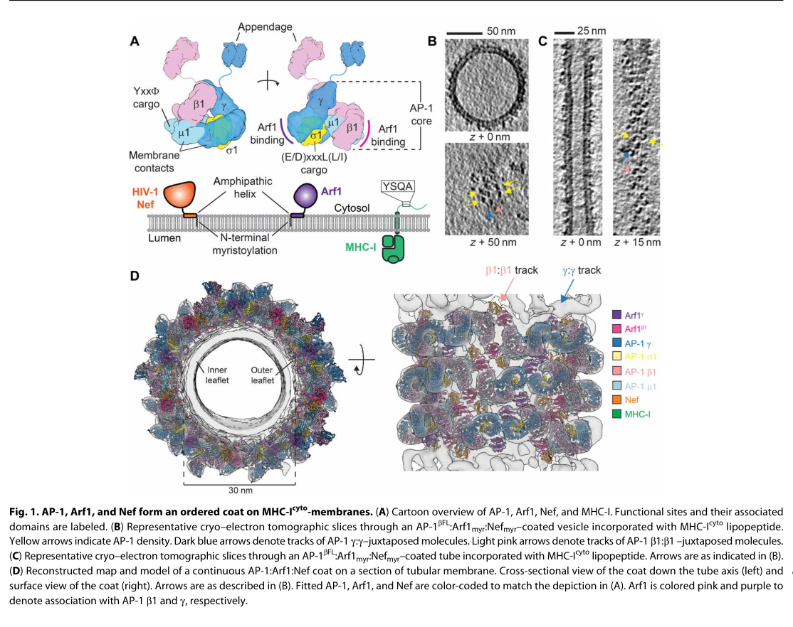

## Question

# Gene Research for Functional Annotation

## ⚠️ CRITICAL: Gene/Protein Identification Context

**BEFORE YOU BEGIN RESEARCH:** You MUST verify you are researching the CORRECT gene/protein. Gene symbols can be ambiguous, especially for less well-characterized genes from non-model organisms.

### Target Gene/Protein Identity (from UniProt):
- **UniProt Accession:** P84077
- **Protein Description:** RecName: Full=ADP-ribosylation factor 1; EC=3.6.5.2 {ECO:0000269|PubMed:10022920, ECO:0000269|PubMed:10102276, ECO:0000269|PubMed:15107860, ECO:0000269|PubMed:8253837};
- **Gene Information:** Name=ARF1;
- **Organism (full):** Homo sapiens (Human).
- **Protein Family:** Belongs to the small GTPase superfamily. Arf family.
- **Key Domains:** Arf1-5-like. (IPR045872); P-loop_NTPase. (IPR027417); Small_GTP-bd. (IPR005225); Small_GTPase_ARF. (IPR024156); Small_GTPase_ARF/SAR. (IPR006689)

### MANDATORY VERIFICATION STEPS:

1. **Check if the gene symbol "ARF1" matches the protein description above**
2. **Verify the organism is correct:** Homo sapiens (Human).
3. **Check if protein family/domains align with what you find in literature**
4. **If you find literature for a DIFFERENT gene with the same or similar symbol, STOP**

### If Gene Symbol is Ambiguous or You Cannot Find Relevant Literature:

**DO NOT PROCEED WITH RESEARCH ON A DIFFERENT GENE.** Instead:
- State clearly: "The gene symbol 'ARF1' is ambiguous or literature is limited for this specific protein"
- Explain what you found (e.g., "Found extensive literature on a different gene with the same symbol in a different organism")
- Describe the protein based ONLY on the UniProt information provided above
- Suggest that the protein function can be inferred from domain/family information

### Research Target:

Please provide a comprehensive research report on the gene **ARF1** (gene ID: ARF1, UniProt: P84077) in human.

The research report should be a detailed narrative explaining the function, biological processes, and localization of the gene product. Citations should be given for all claims.

You should prioritize authoritative reviews and primary scientific literature when conducting research. You can supplement
this with annotations you find in gene/protein databases, but these can be outdated or inaccurate.

We are specifically interested in the primary function of the gene - for enzymes, what reaction is catalyzed, and what is the substrate specificity? For transporters, what is the substrate? For structural proteins or adapters, what is the broader structural role? For signaling molecules, what is the role in the pathway.

We are interested in where in or outside the cell the gene product carries out its function.

We are also interested in the signaling or biochemical pathways in which the gene functions. We are less interested in broad pleiotropic effects, except where these elucidate the precise role.

Include evidence where possible. We are interested in both experimental evidence as well as inference from structure, evolution, or bioinformatic analysis. Precise studies should be prioritized over high-throughput, where available.

## Output

Question: You are an expert researcher providing comprehensive, well-cited information.

Provide detailed information focusing on:
1. Key concepts and definitions with current understanding
2. Recent developments and latest research (prioritize 2023-2024 sources)
3. Current applications and real-world implementations
4. Expert opinions and analysis from authoritative sources
5. Relevant statistics and data from recent studies

Format as a comprehensive research report with proper citations. Include URLs and publication dates where available.
Always prioritize recent, authoritative sources and provide specific citations for all major claims.

# Gene Research for Functional Annotation

## ⚠️ CRITICAL: Gene/Protein Identification Context

**BEFORE YOU BEGIN RESEARCH:** You MUST verify you are researching the CORRECT gene/protein. Gene symbols can be ambiguous, especially for less well-characterized genes from non-model organisms.

### Target Gene/Protein Identity (from UniProt):
- **UniProt Accession:** P84077
- **Protein Description:** RecName: Full=ADP-ribosylation factor 1; EC=3.6.5.2 {ECO:0000269|PubMed:10022920, ECO:0000269|PubMed:10102276, ECO:0000269|PubMed:15107860, ECO:0000269|PubMed:8253837};
- **Gene Information:** Name=ARF1;
- **Organism (full):** Homo sapiens (Human).
- **Protein Family:** Belongs to the small GTPase superfamily. Arf family.
- **Key Domains:** Arf1-5-like. (IPR045872); P-loop_NTPase. (IPR027417); Small_GTP-bd. (IPR005225); Small_GTPase_ARF. (IPR024156); Small_GTPase_ARF/SAR. (IPR006689)

### MANDATORY VERIFICATION STEPS:

1. **Check if the gene symbol "ARF1" matches the protein description above**
2. **Verify the organism is correct:** Homo sapiens (Human).
3. **Check if protein family/domains align with what you find in literature**
4. **If you find literature for a DIFFERENT gene with the same or similar symbol, STOP**

### If Gene Symbol is Ambiguous or You Cannot Find Relevant Literature:

**DO NOT PROCEED WITH RESEARCH ON A DIFFERENT GENE.** Instead:
- State clearly: "The gene symbol 'ARF1' is ambiguous or literature is limited for this specific protein"
- Explain what you found (e.g., "Found extensive literature on a different gene with the same symbol in a different organism")
- Describe the protein based ONLY on the UniProt information provided above
- Suggest that the protein function can be inferred from domain/family information

### Research Target:

Please provide a comprehensive research report on the gene **ARF1** (gene ID: ARF1, UniProt: P84077) in human.

The research report should be a detailed narrative explaining the function, biological processes, and localization of the gene product. Citations should be given for all claims.

You should prioritize authoritative reviews and primary scientific literature when conducting research. You can supplement
this with annotations you find in gene/protein databases, but these can be outdated or inaccurate.

We are specifically interested in the primary function of the gene - for enzymes, what reaction is catalyzed, and what is the substrate specificity? For transporters, what is the substrate? For structural proteins or adapters, what is the broader structural role? For signaling molecules, what is the role in the pathway.

We are interested in where in or outside the cell the gene product carries out its function.

We are also interested in the signaling or biochemical pathways in which the gene functions. We are less interested in broad pleiotropic effects, except where these elucidate the precise role.

Include evidence where possible. We are interested in both experimental evidence as well as inference from structure, evolution, or bioinformatic analysis. Precise studies should be prioritized over high-throughput, where available.

## Research report: Human **ARF1** (UniProt **P84077**) — functional annotation

### 0) Target verification (gene/protein identity)
Human **ARF1** encodes **ADP-ribosylation factor 1**, a **Class I ARF-family small GTPase** that is **N‑myristoylated** and undergoes **GDP↔GTP cycling** to control membrane association and effector recruitment central to membrane trafficking. (li2023thearffamily pages 1-3, jackson2023anevolutionaryperspective pages 1-5, dejgaard2025arfsonthe pages 1-2)

The specific UniProt accession **P84077** is explicitly referenced as the human Arf1 sequence used for structural modeling (AlphaFold2 model) in a high-quality primary structural study. (hooy2022selfassemblyandstructure media 42a5c13d)

### 1) Key concepts and definitions (current understanding)

#### 1.1 ARF1 as a membrane-coupled GTPase cycle (enzymology)
**ARF1 is a GTPase (EC 3.6.5.2)** that catalyzes **GTP hydrolysis** in its active state; like many small GTPases, its intrinsic hydrolysis is low and is **accelerated by ARF GTPase-activating proteins (ARF GAPs)**, while activation requires **guanine nucleotide exchange factors (ARF GEFs)** that promote GDP release and GTP loading. (dejgaard2025arfsonthe pages 1-2, nikolatou2023thearfgtpase pages 1-3)

A defining ARF-family feature is an **N-terminal amphipathic helix with N‑myristoylation** that is **sequestered in a hydrophobic pocket in the GDP state** and becomes **exposed upon GTP binding**, allowing stable membrane insertion/association; ARF1 is therefore comparatively soluble in the GDP state and membrane-bound in the GTP state. (li2023thearffamily pages 1-3, jackson2023anevolutionaryperspective pages 1-5)

Functionally, ARF•GTP–dependent coat recruitment is not simply “switch on/off”; **productive trafficking requires GTP hydrolysis**, and blocking hydrolysis causes trafficking defects (highlighting the importance of cycling). (turn2025arfthemost pages 6-7)

#### 1.2 Domain architecture and family context
ARF-family proteins (including ARF1) share a conserved small GTPase fold with **switch regions** (effector/regulator interfaces) and an N-terminal membrane-binding module (myristoylated helix). (nikolatou2023thearfgtpase pages 1-3, hirschenberger2023arf1preventsaberranta pages 1-2)

### 2) ARF1 primary cellular functions (what ARF1 does)

#### 2.1 Core role: vesicle biogenesis and coat/adaptor recruitment
ARF1’s canonical role is to initiate vesicle formation by **recruiting coats and adaptors** to membranes when in its GTP-bound, membrane-associated state. (li2023thearffamily pages 1-3, dejgaard2025arfsonthe pages 1-2)

**COPI / early secretory pathway.** A widely supported model is that ARF1-GTP at the Golgi recruits **COPI** to drive retrograde trafficking (Golgi→ER) and related early secretory steps. (li2023thearffamily pages 3-5, torii2024myelinationbysignaling pages 2-2)

**AP-1 / TGN–endosome sorting (and clathrin-independent coats).** ARF1-GTP recruits and activates AP complexes, notably **AP‑1** at TGN/endosomal membranes. A structural reconstitution study shows **myristoylated, GTP-bound Arf1 recruits AP‑1 to membranes and stabilizes AP‑1 in an active conformation**, and that AP‑1:Arf1 can form a **tubular coat without clathrin** (a mechanistic basis for a class of tubulovesicular coats). (hooy2022selfassemblyandstructure pages 1-2)

A recent review emphasizing ArfGEF compartmentalization states that **BIG1-mediated ARF1 activation drives clathrin/AP‑1–positive vesicle budding from the trans-Golgi** toward endosomes and/or plasma membrane, while **GBF-family GEFs activate ARF1 at the cis-Golgi to regulate COPI-positive budding**. (torii2024myelinationbysignaling pages 3-3)

#### 2.2 Lipid microdomain control and membrane identity (substrate specificity in context)
ARF1 modulates membrane identity partly by controlling lipid enzymes. In a 2023 review, **human ARF1 is described as directly activating PI4KB**, stimulating **PI4P production**, and more broadly ARF-family proteins regulate lipid-metabolic enzymes and phosphoinositide landscapes that support coat recruitment and membrane curvature. (li2023thearffamily pages 5-6, li2023thearffamily pages 3-5)

#### 2.3 Beyond trafficking: nutrient signaling and organelle homeostasis
A 2023 review summarizes evidence that ARF1 contributes to **amino-acid–dependent mTORC1 signaling**, affecting **lysosomal localization/activation of mTORC1**; in that framework **Brefeldin A (an ARF GEF inhibitor)** disrupts amino-acid–induced lysosomal localization of mTORC1, and **ArfGAP1 binds mTORC1 to inhibit its lysosomal localization/activation**. (li2023thearffamily pages 5-6)

### 3) Subcellular localization (where ARF1 acts)

#### 3.1 Golgi/ERGIC axis
Recent synthesis highlights that ARF1 is found at **ER–Golgi interface compartments (cis-Golgi/ERGIC)** and also on **TGN and TGN-derived tubules**, with localization/function linked to specific ARFGEFs. (torii2024myelinationbysignaling pages 2-2)

GBF1 is described as a **preferential ARF1 GEF** localized to **ER exit sites** and regulating the **COPI complex** involved in ER–Golgi and Golgi-to-ER transport. (torii2024myelinationbysignaling pages 2-2)

#### 3.2 TGN/endosomes and trafficking intermediates
ARF1 localizes to and functions at the **TGN/endosomal interface** where it recruits AP complexes (AP‑1 emphasized). (hooy2022selfassemblyandstructure pages 1-2, torii2024myelinationbysignaling pages 3-3)

A cancer/metastasis-focused review further notes ARF1 functions beyond the Golgi in **early endocytic compartments**, **recycling endosomes** (including retrograde transport back to the TGN), and **ER–TGN steps**. (nikolatou2023thearfgtpase pages 1-3)

#### 3.3 Mitochondria-related locations / contact sites
The same 2023 review reports ARF1 at **mitochondria–ER contact sites** and links ARF1 to broader organelle dynamics. (nikolatou2023thearfgtpase pages 1-3)

### 4) Recent developments (prioritizing 2023–2024)

#### 4.1 ARF1 in innate immunity: controlling cGAS–STING signaling (2023)
A 2023 Nature Communications study identifies ARF1 as a **negative regulator of cGAS–STING type I interferon signaling** and reports that **heterozygous, GTPase-defective ARF1 missense mutations (e.g., R99C/R99H)** cause a **type I interferonopathy** with elevated interferon-stimulated gene expression. Mechanistically, mutant ARF1 perturbs **mitochondrial morphology** (promoting mitochondrial DNA release and cGAS activation) and causes **accumulation of active STING at Golgi/ERGIC** due to defective retrograde transport, indicating a dual role for ARF1 in **mitochondrial integrity** and **STING recycling**. (hirschenberger2023arf1preventsaberranta pages 1-2)

#### 4.2 Metabolism/mitochondria: ARF1 integrates fatty-acid metabolism with mitochondrial homeostasis (2023)
A 2023 Nature Cell Biology study links Arf1 activity to **fatty-acid storage/utilization** and **mitochondrial morphology/ATP synthesis**. In yeast, a hyperactive Arf1 mutant caused **fatty-acid accumulation in lipid droplets**, **mitochondrial fragmentation**, and **decreased ATP synthesis**, and the authors report that Arf1’s role in fatty-acid metabolism is **conserved in mammals**, implicating Arf1 in metabolic–organelle coupling (potentially via contact sites). (enkler2023arf1coordinatesfatty pages 1-2)

#### 4.3 Compartment-specific ARF1 activation via GEFs in physiology (2024)
A 2024 Journal of Neurochemistry review emphasizes ArfGEF-defined spatial control: **GBF activates Arf1 at cis-Golgi for COPI-positive budding**, whereas **BIG1 activates Arf1 at trans-Golgi/TGN for clathrin/AP‑1–positive budding** toward endosomes/plasma membrane, and notes distinct Arf distributions resolved by advanced imaging. (torii2024myelinationbysignaling pages 3-3, torii2024myelinationbysignaling pages 2-2)

### 5) Applications and real-world implementations

#### 5.1 Pathogen exploitation of ARF1-dependent trafficking
**HIV-1 immune evasion:** A structural/mechanistic study shows HIV-1 **Nef hijacks AP‑1 with Arf1** to sequester **MHC-I**, with AP‑1:Arf1:Nef:MHC-I forming a continuous tubular coat on membranes without clathrin—providing a concrete mechanism for immune evasion rooted in ARF1-dependent sorting machinery. (hooy2022selfassemblyandstructure pages 1-2)

#### 5.2 Chemical biology and therapeutic exploration targeting the ARF pathway
**NAV-2729 as an ARF-pathway probe (2023):** A 2023 Journal of Biological Chemistry study concludes NAV‑2729 has a **complex target profile**, inhibiting multiple **ARF GEFs and ARF GAPs** (often via PH-domain interactions) rather than binding ARFs directly in their assays. Reported quantitative data include: NAV‑2729 cytotoxicity **EC50 ~8–11 μM**, inhibition of specific regulators (e.g., **Brag2Sec7-PH IC50 ~7.1 μM**, **AGAP1 ~2.7 μM**, **ASAP1PZA ~4.6 μM**, **ASAP3PZA ~9.1 μM**, among others), and a thermal shift proteomics result of **45 proteins** with significant shifts (20 increased stability, 25 decreased). (rosenberg2023thesmallmolecule pages 3-4, rosenberg2023thesmallmolecule pages 13-14)

**Brefeldin A (BFA) and GBF1/BIG inhibition:** The same 2023 JBC paper notes BFA inhibits ARF1 GEFs **GBF1 and BIG1/2**, and reports BFA was broadly toxic with an approximately **10-fold higher potency in human vs mouse cells** in their referenced comparisons. (rosenberg2023thesmallmolecule pages 1-3)

**Computational/repurposing pipeline suggesting ARF1 as a drug target (2023):** A 2023 Nature Communications paper proposes ARF1 as a target of the proton pump inhibitor **rabeprazole**, supported by multiple orthogonal assays (thermal shift, nucleotide exchange assays with ARNO, and cellular ARF1 activity assays), and reports ARF1 knockdown abolishes several rabeprazole-linked phenotypes (lipid droplet accumulation, tumor growth suppression, immune effects), consistent with ARF1-dependent pharmacology in that model. (chen2023sequencebaseddrugdesign pages 8-9)

### 6) Disease associations and expert consensus views

A contemporary perspective argues ARFs are often oversimplified as binary “molecular switches,” and emphasizes that **cycling itself (including GAP-stimulated hydrolysis) is integral to ARF function**, particularly in membrane traffic. (turn2025arfthemost pages 6-7)

Database-level disease/trait associations from Open Targets link **ARF1** to multiple disease areas (e.g., HIV infection and neurodegenerative disease categories, and periventricular nodular heterotopia phenotypes), providing a structured map of reported associations and supporting literature pointers. (OpenTargets Search: -ARF1)

### 7) Evidence figure (structural/functional context)
A representative figure set from the AP‑1:Arf1 tubular coat study provides visual support for ARF1’s role in coat assembly at membranes and confirms use of the **human Arf1 (UniProt P84077)** structural model in analysis. (hooy2022selfassemblyandstructure media 42a5c13d)

### 8) Summary: functional annotation of ARF1 (P84077)
ARF1 (P84077) is a **myristoylated ARF-family small GTPase** that couples a **GTPase cycle** to **membrane recruitment** and **effector assembly**. Its primary, best-supported function is to orchestrate **vesicle biogenesis and sorting** through recruitment of **COPI** (cis-Golgi/ERGIC; GBF1-defined) and **AP complexes such as AP‑1** (TGN/endosomes; BIG1-defined), while shaping lipid environments via enzymes such as **PI4KB**. Recent work expands ARF1 biology into **innate immune control (cGAS–STING)** and **metabolic/mitochondrial homeostasis**, and chemical-biology studies highlight both the tractability and the complexity of pharmacologically perturbing the ARF system. (li2023thearffamily pages 3-5, torii2024myelinationbysignaling pages 3-3, hooy2022selfassemblyandstructure pages 1-2, hirschenberger2023arf1preventsaberranta pages 1-2, enkler2023arf1coordinatesfatty pages 1-2)

### 9) Key cited sources (URLs; publication dates)
- Hooy RM et al. *Science Advances* (2022-10). https://doi.org/10.1126/sciadv.add3914 (hooy2022selfassemblyandstructure pages 1-2)
- Li F-L, Guan K-L. *BioEssays* (2023-03). https://doi.org/10.1002/bies.202200214 (li2023thearffamily pages 1-3)
- Nikolatou K et al. *Biochem Soc Trans* (2023-08). https://doi.org/10.1042/bst20221355 (nikolatou2023thearfgtpase pages 1-3)
- Hirschenberger M et al. *Nature Communications* (2023-11). https://doi.org/10.1038/s41467-023-42150-4 (hirschenberger2023arf1preventsaberranta pages 1-2)
- Enkler L et al. *Nature Cell Biology* (2023-07). https://doi.org/10.1038/s41556-023-01180-2 (enkler2023arf1coordinatesfatty pages 1-2)
- Rosenberg EM et al. *J Biol Chem* (2023-03). https://doi.org/10.1016/j.jbc.2023.102992 (rosenberg2023thesmallmolecule pages 3-4)
- Torii T et al. *Journal of Neurochemistry* (2024-06). https://doi.org/10.1111/jnc.16141 (torii2024myelinationbysignaling pages 3-3)

References

1. (li2023thearffamily pages 1-3): Fu‐Long Li and Kun‐Liang Guan. The arf family gtpases: regulation of vesicle biogenesis and beyond. BioEssays, Mar 2023. URL: https://doi.org/10.1002/bies.202200214, doi:10.1002/bies.202200214. This article has 18 citations and is from a peer-reviewed journal.

2. (jackson2023anevolutionaryperspective pages 1-5): Catherine L. Jackson, Julie Ménétrey, Mandeep Sivia, Joel B. Dacks, and Marek Eliáš. An evolutionary perspective on arf family gtpases. Current Opinion in Cell Biology, 85:102268, Dec 2023. URL: https://doi.org/10.1016/j.ceb.2023.102268, doi:10.1016/j.ceb.2023.102268. This article has 14 citations and is from a peer-reviewed journal.

3. (dejgaard2025arfsonthe pages 1-2): Selma Yilmaz Dejgaard and John F. Presley. Arfs on the golgi: four conductors, one orchestra. Frontiers in Molecular Biosciences, Jul 2025. URL: https://doi.org/10.3389/fmolb.2025.1612531, doi:10.3389/fmolb.2025.1612531. This article has 6 citations.

4. (hooy2022selfassemblyandstructure media 42a5c13d): Richard M. Hooy, Yuichiro Iwamoto, Dan A. Tudorica, Xuefeng Ren, and James H. Hurley. Self-assembly and structure of a clathrin-independent ap-1:arf1 tubular membrane coat. Science Advances, Oct 2022. URL: https://doi.org/10.1126/sciadv.add3914, doi:10.1126/sciadv.add3914. This article has 29 citations and is from a highest quality peer-reviewed journal.

5. (nikolatou2023thearfgtpase pages 1-3): Konstantina Nikolatou, David M. Bryant, and Emma Sandilands. The arf gtpase regulatory network in collective invasion and metastasis. Biochemical Society Transactions, 51:1559-1569, Aug 2023. URL: https://doi.org/10.1042/bst20221355, doi:10.1042/bst20221355. This article has 3 citations and is from a peer-reviewed journal.

6. (turn2025arfthemost pages 6-7): Rachel E. Turn, Joel Bryan Dacks, Eric M. Rosenberg, Olivier Soubias, John K. Northup, and Paul A. Randazzo. Arf: the most misunderstood gtpase i ever knew - why study arf gaps. Frontiers in Molecular Biosciences, Oct 2025. URL: https://doi.org/10.3389/fmolb.2025.1668286, doi:10.3389/fmolb.2025.1668286. This article has 0 citations.

7. (hirschenberger2023arf1preventsaberranta pages 1-2): Maximilian Hirschenberger, Alice Lepelley, Ulrich Rupp, Susanne Klute, Victoria Hunszinger, Lennart Koepke, Veronika Merold, Blaise Didry-Barca, Fanny Wondany, Tim Bergner, Tatiana Moreau, Mathieu P. Rodero, Reinhild Rösler, Sebastian Wiese, Stefano Volpi, Marco Gattorno, Riccardo Papa, Sally-Ann Lynch, Marte G. Haug, Gunnar Houge, Kristen M. Wigby, Jessica Sprague, Jerica Lenberg, Clarissa Read, Paul Walther, Jens Michaelis, Frank Kirchhoff, Carina C. de Oliveira Mann, Yanick J. Crow, and Konstantin M. J. Sparrer. Arf1 prevents aberrant type i interferon induction by regulating sting activation and recycling. Nature Communications, Nov 2023. URL: https://doi.org/10.1038/s41467-023-42150-4, doi:10.1038/s41467-023-42150-4. This article has 54 citations and is from a highest quality peer-reviewed journal.

8. (li2023thearffamily pages 3-5): Fu‐Long Li and Kun‐Liang Guan. The arf family gtpases: regulation of vesicle biogenesis and beyond. BioEssays, Mar 2023. URL: https://doi.org/10.1002/bies.202200214, doi:10.1002/bies.202200214. This article has 18 citations and is from a peer-reviewed journal.

9. (torii2024myelinationbysignaling pages 2-2): Tomohiro Torii, Yuki Miyamoto, and Junji Yamauchi. Myelination by signaling through arf guanine nucleotide exchange factor. Journal of Neurochemistry, 168:2201-2213, Jun 2024. URL: https://doi.org/10.1111/jnc.16141, doi:10.1111/jnc.16141. This article has 8 citations and is from a domain leading peer-reviewed journal.

10. (hooy2022selfassemblyandstructure pages 1-2): Richard M. Hooy, Yuichiro Iwamoto, Dan A. Tudorica, Xuefeng Ren, and James H. Hurley. Self-assembly and structure of a clathrin-independent ap-1:arf1 tubular membrane coat. Science Advances, Oct 2022. URL: https://doi.org/10.1126/sciadv.add3914, doi:10.1126/sciadv.add3914. This article has 29 citations and is from a highest quality peer-reviewed journal.

11. (torii2024myelinationbysignaling pages 3-3): Tomohiro Torii, Yuki Miyamoto, and Junji Yamauchi. Myelination by signaling through arf guanine nucleotide exchange factor. Journal of Neurochemistry, 168:2201-2213, Jun 2024. URL: https://doi.org/10.1111/jnc.16141, doi:10.1111/jnc.16141. This article has 8 citations and is from a domain leading peer-reviewed journal.

12. (li2023thearffamily pages 5-6): Fu‐Long Li and Kun‐Liang Guan. The arf family gtpases: regulation of vesicle biogenesis and beyond. BioEssays, Mar 2023. URL: https://doi.org/10.1002/bies.202200214, doi:10.1002/bies.202200214. This article has 18 citations and is from a peer-reviewed journal.

13. (enkler2023arf1coordinatesfatty pages 1-2): Ludovic Enkler, Viktoria Szentgyörgyi, Mirjam Pennauer, Cristina Prescianotto-Baschong, Isabelle Riezman, Aneta Wiesyk, Reut Ester Avraham, Martin Spiess, Einat Zalckvar, Roza Kucharczyk, Howard Riezman, and Anne Spang. Arf1 coordinates fatty acid metabolism and mitochondrial homeostasis. Nature Cell Biology, 25:1157-1172, Jul 2023. URL: https://doi.org/10.1038/s41556-023-01180-2, doi:10.1038/s41556-023-01180-2. This article has 84 citations and is from a highest quality peer-reviewed journal.

14. (rosenberg2023thesmallmolecule pages 3-4): Eric M. Rosenberg, Xiaoying Jian, Olivier Soubias, Hye-Young Yoon, Mukesh P. Yadav, Sarah Hammoudeh, Sandeep Pallikkuth, Itoro Akpan, Pei-Wen Chen, Tapan K. Maity, Lisa M. Jenkins, Marielle E. Yohe, R. Andrew Byrd, and Paul A. Randazzo. The small molecule inhibitor nav-2729 has a complex target profile including multiple adp-ribosylation factor regulatory proteins. Mar 2023. URL: https://doi.org/10.1016/j.jbc.2023.102992, doi:10.1016/j.jbc.2023.102992. This article has 24 citations and is from a domain leading peer-reviewed journal.

15. (rosenberg2023thesmallmolecule pages 13-14): Eric M. Rosenberg, Xiaoying Jian, Olivier Soubias, Hye-Young Yoon, Mukesh P. Yadav, Sarah Hammoudeh, Sandeep Pallikkuth, Itoro Akpan, Pei-Wen Chen, Tapan K. Maity, Lisa M. Jenkins, Marielle E. Yohe, R. Andrew Byrd, and Paul A. Randazzo. The small molecule inhibitor nav-2729 has a complex target profile including multiple adp-ribosylation factor regulatory proteins. Mar 2023. URL: https://doi.org/10.1016/j.jbc.2023.102992, doi:10.1016/j.jbc.2023.102992. This article has 24 citations and is from a domain leading peer-reviewed journal.

16. (rosenberg2023thesmallmolecule pages 1-3): Eric M. Rosenberg, Xiaoying Jian, Olivier Soubias, Hye-Young Yoon, Mukesh P. Yadav, Sarah Hammoudeh, Sandeep Pallikkuth, Itoro Akpan, Pei-Wen Chen, Tapan K. Maity, Lisa M. Jenkins, Marielle E. Yohe, R. Andrew Byrd, and Paul A. Randazzo. The small molecule inhibitor nav-2729 has a complex target profile including multiple adp-ribosylation factor regulatory proteins. Mar 2023. URL: https://doi.org/10.1016/j.jbc.2023.102992, doi:10.1016/j.jbc.2023.102992. This article has 24 citations and is from a domain leading peer-reviewed journal.

17. (chen2023sequencebaseddrugdesign pages 8-9): Lifan Chen, Zi-sheng Fan, Jie Chang, Rui-rui Yang, Hui Hou, Hao Guo, Ying-hui Zhang, Tianbiao Yang, Chenmao Zhou, Qibang Sui, Zhengyang Chen, Chenni Zheng, Xinyue Hao, Keke Zhang, Rongrong Cui, Zehong Zhang, Hudson Ma, Yiluan Ding, Naixia Zhang, Xiaojie Lu, Xiaomin Luo, Hualiang Jiang, Sulin Zhang, and M. Zheng. Sequence-based drug design as a concept in computational drug design. Nature Communications, Jul 2023. URL: https://doi.org/10.1038/s41467-023-39856-w, doi:10.1038/s41467-023-39856-w. This article has 143 citations and is from a highest quality peer-reviewed journal.

18. (OpenTargets Search: -ARF1): Open Targets Query (-ARF1, 11 results). Buniello, A. et al. (2025). Open Targets Platform: facilitating therapeutic hypotheses building in drug discovery. Nucleic Acids Research.

## Artifacts

## Citations

1. turn2025arfthemost pages 6-7
2. hooy2022selfassemblyandstructure pages 1-2
3. torii2024myelinationbysignaling pages 3-3
4. li2023thearffamily pages 5-6
5. torii2024myelinationbysignaling pages 2-2
6. nikolatou2023thearfgtpase pages 1-3
7. rosenberg2023thesmallmolecule pages 1-3
8. chen2023sequencebaseddrugdesign pages 8-9
9. li2023thearffamily pages 1-3
10. rosenberg2023thesmallmolecule pages 3-4
11. jackson2023anevolutionaryperspective pages 1-5
12. dejgaard2025arfsonthe pages 1-2
13. li2023thearffamily pages 3-5
14. rosenberg2023thesmallmolecule pages 13-14
15. https://doi.org/10.1126/sciadv.add3914
16. https://doi.org/10.1002/bies.202200214
17. https://doi.org/10.1042/bst20221355
18. https://doi.org/10.1038/s41467-023-42150-4
19. https://doi.org/10.1038/s41556-023-01180-2
20. https://doi.org/10.1016/j.jbc.2023.102992
21. https://doi.org/10.1111/jnc.16141
22. https://doi.org/10.1002/bies.202200214,
23. https://doi.org/10.1016/j.ceb.2023.102268,
24. https://doi.org/10.3389/fmolb.2025.1612531,
25. https://doi.org/10.1126/sciadv.add3914,
26. https://doi.org/10.1042/bst20221355,
27. https://doi.org/10.3389/fmolb.2025.1668286,
28. https://doi.org/10.1038/s41467-023-42150-4,
29. https://doi.org/10.1111/jnc.16141,
30. https://doi.org/10.1038/s41556-023-01180-2,
31. https://doi.org/10.1016/j.jbc.2023.102992,
32. https://doi.org/10.1038/s41467-023-39856-w,