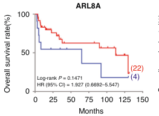

## Question

# Gene Research for Functional Annotation

## ⚠️ CRITICAL: Gene/Protein Identification Context

**BEFORE YOU BEGIN RESEARCH:** You MUST verify you are researching the CORRECT gene/protein. Gene symbols can be ambiguous, especially for less well-characterized genes from non-model organisms.

### Target Gene/Protein Identity (from UniProt):
- **UniProt Accession:** Q96BM9
- **Protein Description:** RecName: Full=ADP-ribosylation factor-like protein 8A; AltName: Full=ADP-ribosylation factor-like protein 10B; AltName: Full=Novel small G protein indispensable for equal chromosome segregation 2;
- **Gene Information:** Name=ARL8A; Synonyms=ARL10B, GIE2;
- **Organism (full):** Homo sapiens (Human).
- **Protein Family:** Belongs to the small GTPase superfamily. Arf family.
- **Key Domains:** Arl8a/8b. (IPR044154); P-loop_NTPase. (IPR027417); Small_GTP-bd. (IPR005225); Small_GTPase_ARF/SAR. (IPR006689); Arf (PF00025)

### MANDATORY VERIFICATION STEPS:

1. **Check if the gene symbol "ARL8A" matches the protein description above**
2. **Verify the organism is correct:** Homo sapiens (Human).
3. **Check if protein family/domains align with what you find in literature**
4. **If you find literature for a DIFFERENT gene with the same or similar symbol, STOP**

### If Gene Symbol is Ambiguous or You Cannot Find Relevant Literature:

**DO NOT PROCEED WITH RESEARCH ON A DIFFERENT GENE.** Instead:
- State clearly: "The gene symbol 'ARL8A' is ambiguous or literature is limited for this specific protein"
- Explain what you found (e.g., "Found extensive literature on a different gene with the same symbol in a different organism")
- Describe the protein based ONLY on the UniProt information provided above
- Suggest that the protein function can be inferred from domain/family information

### Research Target:

Please provide a comprehensive research report on the gene **ARL8A** (gene ID: ARL8A, UniProt: Q96BM9) in human.

The research report should be a detailed narrative explaining the function, biological processes, and localization of the gene product. Citations should be given for all claims.

You should prioritize authoritative reviews and primary scientific literature when conducting research. You can supplement
this with annotations you find in gene/protein databases, but these can be outdated or inaccurate.

We are specifically interested in the primary function of the gene - for enzymes, what reaction is catalyzed, and what is the substrate specificity? For transporters, what is the substrate? For structural proteins or adapters, what is the broader structural role? For signaling molecules, what is the role in the pathway.

We are interested in where in or outside the cell the gene product carries out its function.

We are also interested in the signaling or biochemical pathways in which the gene functions. We are less interested in broad pleiotropic effects, except where these elucidate the precise role.

Include evidence where possible. We are interested in both experimental evidence as well as inference from structure, evolution, or bioinformatic analysis. Precise studies should be prioritized over high-throughput, where available.

## Output

Question: You are an expert researcher providing comprehensive, well-cited information.

Provide detailed information focusing on:
1. Key concepts and definitions with current understanding
2. Recent developments and latest research (prioritize 2023-2024 sources)
3. Current applications and real-world implementations
4. Expert opinions and analysis from authoritative sources
5. Relevant statistics and data from recent studies

Format as a comprehensive research report with proper citations. Include URLs and publication dates where available.
Always prioritize recent, authoritative sources and provide specific citations for all major claims.

# Gene Research for Functional Annotation

## ⚠️ CRITICAL: Gene/Protein Identification Context

**BEFORE YOU BEGIN RESEARCH:** You MUST verify you are researching the CORRECT gene/protein. Gene symbols can be ambiguous, especially for less well-characterized genes from non-model organisms.

### Target Gene/Protein Identity (from UniProt):
- **UniProt Accession:** Q96BM9
- **Protein Description:** RecName: Full=ADP-ribosylation factor-like protein 8A; AltName: Full=ADP-ribosylation factor-like protein 10B; AltName: Full=Novel small G protein indispensable for equal chromosome segregation 2;
- **Gene Information:** Name=ARL8A; Synonyms=ARL10B, GIE2;
- **Organism (full):** Homo sapiens (Human).
- **Protein Family:** Belongs to the small GTPase superfamily. Arf family.
- **Key Domains:** Arl8a/8b. (IPR044154); P-loop_NTPase. (IPR027417); Small_GTP-bd. (IPR005225); Small_GTPase_ARF/SAR. (IPR006689); Arf (PF00025)

### MANDATORY VERIFICATION STEPS:

1. **Check if the gene symbol "ARL8A" matches the protein description above**
2. **Verify the organism is correct:** Homo sapiens (Human).
3. **Check if protein family/domains align with what you find in literature**
4. **If you find literature for a DIFFERENT gene with the same or similar symbol, STOP**

### If Gene Symbol is Ambiguous or You Cannot Find Relevant Literature:

**DO NOT PROCEED WITH RESEARCH ON A DIFFERENT GENE.** Instead:
- State clearly: "The gene symbol 'ARL8A' is ambiguous or literature is limited for this specific protein"
- Explain what you found (e.g., "Found extensive literature on a different gene with the same symbol in a different organism")
- Describe the protein based ONLY on the UniProt information provided above
- Suggest that the protein function can be inferred from domain/family information

### Research Target:

Please provide a comprehensive research report on the gene **ARL8A** (gene ID: ARL8A, UniProt: Q96BM9) in human.

The research report should be a detailed narrative explaining the function, biological processes, and localization of the gene product. Citations should be given for all claims.

You should prioritize authoritative reviews and primary scientific literature when conducting research. You can supplement
this with annotations you find in gene/protein databases, but these can be outdated or inaccurate.

We are specifically interested in the primary function of the gene - for enzymes, what reaction is catalyzed, and what is the substrate specificity? For transporters, what is the substrate? For structural proteins or adapters, what is the broader structural role? For signaling molecules, what is the role in the pathway.

We are interested in where in or outside the cell the gene product carries out its function.

We are also interested in the signaling or biochemical pathways in which the gene functions. We are less interested in broad pleiotropic effects, except where these elucidate the precise role.

Include evidence where possible. We are interested in both experimental evidence as well as inference from structure, evolution, or bioinformatic analysis. Precise studies should be prioritized over high-throughput, where available.

## Research report: Human **ARL8A** (UniProt **Q96BM9**) — functional annotation

### 1) Target verification (gene/protein identity and disambiguation)

**Target**: *Homo sapiens* **ARL8A** (UniProt Q96BM9), a small Arf-family GTPase, also described as ADP-ribosylation factor-like protein 8A. ARL8A is one of two vertebrate paralogs (ARL8A and ARL8B) that are ~91% identical and are generally treated as an ARL8 family module regulating lysosome dynamics. (rizalar2022investigationofbiogenesis pages 30-33, khatter2015arflikegtpasearl8 pages 5-8)

**Disambiguation note**: The strongest mechanistic literature base is for **ARL8B**, but multiple key studies and reviews explicitly treat **ARL8A/ARL8B together** (e.g., combined knockdown/double KO), and ARL8A is consistently described as a lysosome-localized paralog with overlapping effector interactions and functions. Where evidence is ARL8B-only, this report flags it as paralog-inferred for ARL8A. (khatter2015arflikegtpasearl8 pages 5-8, shelke2023inhibitionofendolysosome pages 1-2, guardia2016borcfunctionsupstream pages 5-6)

### 2) Key concepts and definitions (current understanding)

#### 2.1 ARL8A is a lysosome-associated small GTPase
ARL8A (with ARL8B) is described as a conserved small GTPase that localizes to lysosomes (co-localizing with lysosomal markers such as **CD63** and **LAMP2**, not early endosome marker **EEA1**). (rizalar2022investigationofbiogenesis pages 30-33)

**Membrane targeting mechanism**: Unlike many Arf-family proteins, ARL8 proteins do not use a canonical N-myristoyl glycine at position 2; instead they have an N-terminal amphipathic helix and are described as relying on **N-terminal acetylation** (NatC) for proper membrane targeting to lysosomes. (khatter2015arflikegtpasearl8 pages 5-8, rizalar2022investigationofbiogenesis pages 30-33)

#### 2.2 Functional definition: “Master organizer” of lysosome positioning and trafficking
Across foundational reviews and mechanistic studies, ARL8 proteins are positioned as central regulators that:
1) couple lysosomes/endolysosomes to microtubule motors for long-range movement, and
2) promote fusion/tethering of late endocytic carriers with lysosomes through recruitment of tethering factors. (khatter2015arflikegtpasearl8 pages 8-10, guardia2016borcfunctionsupstream pages 1-3)

### 3) Molecular mechanism and pathways (primary function, partners, localization)

#### 3.1 Upstream recruitment to lysosomes: BORC → ARL8
A core organizing pathway is **BORC → ARL8 → motor/tether recruitment**. BORC is an 8-subunit complex on the cytosolic face of lysosomes that functions upstream to recruit ARL8 proteins, enabling outward transport. Loss of BORC subunits detaches ARL8 from lysosomes and causes juxtanuclear lysosome clustering. (khatter2015arflikegtpasearl8 pages 5-8, guardia2016borcfunctionsupstream pages 5-6)

Guardia et al. (Cell Reports, 2016-11; https://doi.org/10.1016/j.celrep.2016.10.062) experimentally place BORC upstream of ARL8 and show that BORC-dependent ARL8 function is required for kinesin-dependent lysosome dispersal; critically, in an ARL8B-KO background, siRNA against **ARL8A** removes the residual ability of kinesin constructs to disperse lysosomes, directly supporting that **both ARL8A and ARL8B contribute** to the transport program. (guardia2016borcfunctionsupstream pages 5-6)

#### 3.2 Anterograde (plus-end) lysosome transport: ARL8-GTP → SKIP/PLEKHM2 → kinesin-1
**Primary transport function**: In the GTP-bound state, ARL8 recruits **SKIP/PLEKHM2**, which binds kinesin light chain **KLC2** and enables **kinesin-1 (KIF5B)**-driven plus-end movement of lysosomes toward the cell periphery. Depletion of ARL8B or SKIP (and family-level ARL8 perturbation) leads to perinuclear lysosome clustering, while overexpression of ARL8 proteins or SKIP promotes peripheral redistribution. (khatter2015arflikegtpasearl8 pages 8-10, rizalar2022investigationofbiogenesis pages 30-33, guardia2016borcfunctionsupstream pages 4-5)

**Quantitative phenotype example**: In HeLa cells, knockdown of **KIF5B** or **KIF1B** caused lysosome clustering/“collapse” in ~40% and ~85% of cells, respectively, highlighting the major role of kinesins in centrifugal lysosome positioning downstream of ARL8/BORC. (guardia2016borcfunctionsupstream pages 4-5)

#### 3.3 Kinesin-3 coupling and track specialization: ARL8 → KIF1A/KIF1Bβ
BORC and ARL8 function upstream of both kinesin-1 and kinesin-3 classes. Guardia et al. show kinesin-1 (KIF5B) and kinesin-3 (KIF1A/KIF1Bβ) can drive lysosome dispersal but operate on different microtubule subsets: KIF5B is enriched on more central acetylated tracks, whereas KIF1A/KIF1Bβ aligns with more peripheral tyrosinated tracks—supporting a “regional transport routing” model for lysosomes. (guardia2016borcfunctionsupstream pages 1-3, guardia2016borcfunctionsupstream pages 10-11)

Shelke et al. (J Cell Biol, 2023-05; https://doi.org/10.1083/jcb.202209084) further summarize that ARL8 effectors include motor-coupling partners for both anterograde and retrograde programs, including direct kinesin-3 coupling (KIF1A/KIF1Bβ) within the BORC–ARL8 pathway framework. (shelke2023inhibitionofendolysosome pages 1-2)

#### 3.4 Fusion/tethering and degradative trafficking: ARL8 → HOPS (and related effectors)
ARL8 proteins are also described as recruiting **HOPS** tethering components to lysosomes to promote fusion with late endosomes and autophagic cargo carriers, impacting degradative trafficking (e.g., delivery of endocytic cargo and receptor downregulation). This is emphasized in authoritative reviews as a central lysosomal function of ARL8, though often demonstrated most directly for ARL8B. (khatter2015arflikegtpasearl8 pages 8-10, sharma2019emergingrolesof pages 10-11)

A concrete pathway readout of ARL8–HOPS function is cholesterol handling:
- Anderson et al. (Mol Biol Cell, 2022-08; https://doi.org/10.1091/mbc.e21-11-0595-t) show that depletion/KO of **BORC, ARL8, or HOPS** causes **free cholesterol accumulation in lysosomes**, reduced cholesteryl ester storage, decreased association of luminal cholesterol transporter **NPC2** with lysosomes, increased NPC2 secretion, and increased lysosomal degradation of **CI-MPR**. The authors conclude the **BORC–ARL8–HOPS ensemble** is required for NPC2 trafficking and cholesterol egress. (anderson2022borcarl8hopsensembleis pages 1-2)

#### 3.5 Bidirectional lysosome positioning (2024 update): ARL8 also contributes to retrograde programs
While ARL8 is historically framed as an anterograde lysosome dispersal GTPase, recent work expands ARL8-associated machinery to include **retrograde** positioning programs:
- Kumar et al. (Nat Commun, 2024-01; https://doi.org/10.1038/s41467-024-44957-1) identify **DENND6A** as an ARL8B effector that activates **Rab34**, leading to recruitment of **RILP/dynein-dynactin** and retrograde lysosome transport. Loss of DENND6A impairs autophagic flux readouts (LC3B-II changes under EBSS ± BafA1) and disrupts degradative trafficking. Although centered on ARL8B, the study reports that **double knockdown of ARL8A and ARL8B** reduces DENND6A localization phenotypes, consistent with an ARL8-family requirement for this positioning cascade. (kumar2024dennd6alinksarl8b pages 12-13)

### 4) Recent developments and latest research (prioritizing 2023–2024)

#### 4.1 Exosome secretion controlled by BORC–ARL8–HOPS-dependent endolysosome fusion (2023)
Shelke et al. (J Cell Biol, 2023-05; https://doi.org/10.1083/jcb.202209084) show that **disruption of BORC–ARL8–HOPS** increases exosome secretion, interpreted as impaired fusion of multivesicular endosomes with lysosomes, leaving intraluminal vesicles available for extracellular release. This work used **ARL8A/ARL8B double knockout** HeLa models as part of the mechanistic perturbation set, making it particularly relevant to ARL8A (not just ARL8B). (shelke2023inhibitionofendolysosome pages 1-2)

#### 4.2 Human genetics links lysosome positioning machinery upstream of ARL8A to neurodevelopment (2024)
De Pace et al. (Brain, 2024-12; https://doi.org/10.1093/brain/awad427) report **biallelic BORCS8 variants** in **five children** from three families with severe early-infantile neurodegenerative/neurodevelopmental disease. The paper frames BORC as an upstream lysosomal complex that recruits ARL8 and kinesin motors to drive anterograde lysosome transport to the periphery and distal axon, and shows patient variants impair BORC assembly/function and reduce the ability to restore peripheral lysosome distribution in BORCS8-KO cells. (pace2024biallelicborcs8variants pages 1-2, pace2024biallelicborcs8variants pages 15-16)

This provides strong translational evidence that the **BORC→ARL8→kinesin axis** is physiologically critical in humans, even though the causal gene in this study is upstream of ARL8A itself. (pace2024biallelicborcs8variants pages 1-2)

#### 4.3 Cancer cohort associations (2024): ARL8A expression shows a non-significant survival trend
Nturubika et al. (Br J Cancer, 2024-08; https://doi.org/10.1038/s41416-024-02829-x) examined lysosomal trafficking gene expression in prostate cancer cohorts. In Kaplan–Meier analyses, **ARL8A** showed a non-significant association with outcome (Log-rank **P = 0.1471**, **HR = 1.927**, 95% CI 0.6692–5.547) in the plotted cohort context. (nturubika2024alteredexpressionof pages 5-5, nturubika2024alteredexpressionof media 25d4e50c)

### 5) Current applications and real-world implementations

#### 5.1 Research-use manipulation of lysosome positioning and function
Across modern cell biology, ARL8 pathway components are used as **experimental control points** to:
- reposition lysosomes (peripheral vs juxtanuclear),
- modulate endolysosomal fusion (via HOPS recruitment pathways),
- influence exosome secretion (via endolysosome fusion competence), and
- modulate cholesterol egress phenotypes (NPC2 trafficking) and degradative flux. (shelke2023inhibitionofendolysosome pages 1-2, anderson2022borcarl8hopsensembleis pages 1-2, guardia2016borcfunctionsupstream pages 5-6)

#### 5.2 Translational maturity
Within the retrieved literature set, there is **no evidence of an approved ARL8A-targeted therapy** or diagnostic. Translational relevance is presently strongest at the **pathway level** (BORC/ARL8/HOPS/motor systems) in neurodevelopmental disease mechanisms and in cancer lysosome biology hypotheses. (pace2024biallelicborcs8variants pages 1-2, nturubika2024alteredexpressionof pages 5-5)

### 6) Expert opinions / authoritative synthesis

Two influential syntheses frame ARL8 proteins as central lysosomal regulators:
- Khatter et al. (Cellular Logistics, 2015-07; https://doi.org/10.1080/21592799.2015.1086501) emphasize ARL8 as moving “to the center of lysosomal biology,” highlighting lysosome motility and fusion functions and the key effectors SKIP (kinesin-1 coupling) and HOPS (fusion). (khatter2015arflikegtpasearl8 pages 1-5, khatter2015arflikegtpasearl8 pages 8-10)
- Sharma et al. (2019; https://doi.org/10.16943/ptinsa/2019/49574) synthesize the evidence that ARL8 paralogs localize to lysosomes (not mitotic spindle) and function in BORC-dependent positioning and fusion programs, integrating immune-cell and disease-relevant contexts. (sharma2019emergingrolesof pages 10-11)

### 7) Statistics and quantitative data highlights (from included studies)

- **Prostate cancer survival association (ARL8A)**: HR 1.927 (95% CI 0.6692–5.547); log-rank P = 0.1471 (Kaplan–Meier plot); cohort example noted as Glinsky cohort n=79 in the figure caption context. (nturubika2024alteredexpressionof pages 5-5, nturubika2024alteredexpressionof media 25d4e50c)
- **Kinesin perturbation phenotype in lysosome distribution**: KIF5B or KIF1B knockdown caused lysosome clustering in ~40% and ~85% of cells, respectively (HeLa). (guardia2016borcfunctionsupstream pages 4-5)
- **Human neurogenetics upstream of ARL8A**: five affected children with biallelic BORCS8 variants; cellular rescue assays show patient alleles reduce ability to restore peripheral lysosome distribution and affect LC3B marker levels in BORCS8-KO cells. (pace2024biallelicborcs8variants pages 1-2, pace2024biallelicborcs8variants pages 11-12)

### 8) Functional summary (what ARL8A “does”)

**Primary molecular function**: ARL8A is a small lysosome-associated GTPase that, when in its active state and localized to lysosomal membranes, **recruits effector proteins** that couple lysosomes/endolysosomes to **microtubule motors** (kinesin-1 via SKIP/PLEKHM2; kinesin-3 via ARL8-dependent coupling) and coordinates lysosomal fusion competence via tethering machinery (HOPS-related pathways). This enables spatial organization of lysosomes and efficient trafficking/fusion with endocytic and autophagic carriers, with downstream impacts on degradative flux, cholesterol handling, and extracellular vesicle release. (rizalar2022investigationofbiogenesis pages 30-33, guardia2016borcfunctionsupstream pages 5-6, anderson2022borcarl8hopsensembleis pages 1-2, shelke2023inhibitionofendolysosome pages 1-2)

**Cellular localization**: cytosolic-facing lysosomal membrane association mediated by N-terminal amphipathic helix and acetylation. (khatter2015arflikegtpasearl8 pages 5-8, rizalar2022investigationofbiogenesis pages 30-33)

**Pathways**: BORC→ARL8→(SKIP/KLC2/KIF5B and KIF1A/KIF1Bβ) for positioning; ARL8→HOPS for fusion; BORC/ARL8/HOPS→NPC2 trafficking for cholesterol egress; BORC/ARL8/HOPS perturbation→exosome secretion increase; ARL8B (family)→DENND6A→Rab34→RILP/dynein for retrograde repositioning/autophagy coupling. (guardia2016borcfunctionsupstream pages 5-6, anderson2022borcarl8hopsensembleis pages 1-2, shelke2023inhibitionofendolysosome pages 1-2, kumar2024dennd6alinksarl8b pages 12-13)

### Embedded summary artifact

| Aspect | Key findings (1-2 sentences) | Evidence type (review/primary; cell line/animal/human cohort) | Key molecules/complexes | Representative sources with year+DOI/URL | Notes on ARL8A vs ARL8B specificity |
|---|---|---|---|---|---|
| Definition | ARL8A is the human ADP-ribosylation factor-like protein 8A, a small Arf-family GTPase and one of two vertebrate ARL8 paralogs; ARL8A and ARL8B are ~91% identical and share the core role of regulating lysosome dynamics. Family reviews place ARL8 proteins at the center of lysosomal positioning, trafficking, and fusion control. (rizalar2022investigationofbiogenesis pages 30-33, khatter2015arflikegtpasearl8 pages 5-8, khatter2015arflikegtpasearl8 pages 1-5) | Review plus family-level experimental summary; mammalian cell biology | ARL8A/ARL8B, Arf family small GTPases | Khatter et al., 2015, doi:10.1080/21592799.2015.1086501, https://doi.org/10.1080/21592799.2015.1086501; Rizalar, 2022, doi:10.17169/refubium-36173, https://doi.org/10.17169/refubium-36173 | Much of the direct mechanistic literature is stronger for ARL8B, but family sources explicitly include ARL8A as the closely related human paralog. |
| Localization | ARL8A/ARL8B localize predominantly to lysosomes, showing high co-localization with lysosomal markers such as CD63 and LAMP2 rather than early endosome marker EEA1. Membrane association depends on an N-terminal amphipathic helix and N-terminal acetylation rather than canonical Arf myristoylation. (rizalar2022investigationofbiogenesis pages 30-33, khatter2015arflikegtpasearl8 pages 5-8) | Review and experimental localization studies; mammalian cells | Lysosome, CD63, LAMP2, amphipathic helix, NatC-mediated acetylation | Khatter et al., 2015, doi:10.1080/21592799.2015.1086501, https://doi.org/10.1080/21592799.2015.1086501; Rizalar, 2022, doi:10.17169/refubium-36173, https://doi.org/10.17169/refubium-36173 | Evidence explicitly names both ARL8A and ARL8B for lysosomal localization; acetylation data are best established for ARL8B but are generally discussed at the ARL8-family level. |
| Upstream recruitment to lysosomes | BORC acts upstream of ARL8 proteins and is required for ARL8A/ARL8B recruitment to lysosomes; BORC loss causes juxtanuclear lysosome clustering and prevents normal centrifugal dispersal. Forced kinesin attachment can bypass BORC deficiency, supporting a motor-recruitment role upstream of transport. (khatter2015arflikegtpasearl8 pages 5-8, guardia2016borcfunctionsupstream pages 1-3, guardia2016borcfunctionsupstream pages 5-6, guardia2016borcfunctionsupstream pages 6-7) | Primary mechanistic studies in HeLa cells; review support | BORC, myrlysin/BORCS5, diaskedin, ARL8A/ARL8B | Guardia et al., 2016, doi:10.1016/j.celrep.2016.10.062, https://doi.org/10.1016/j.celrep.2016.10.062; Khatter et al., 2015, doi:10.1080/21592799.2015.1086501, https://doi.org/10.1080/21592799.2015.1086501 | Guardia et al. directly tested Arl8a/Arl8b together in motor-dependence experiments; older reviews often emphasize ARL8B as the best-characterized paralog. |
| Anterograde lysosome motility | In the GTP-bound state, ARL8 recruits SKIP/PLEKHM2, which binds kinesin light chain KLC2 and enables kinesin-1-dependent plus-end transport of lysosomes toward the cell periphery. Overexpression of ARL8 proteins or SKIP promotes peripheral lysosome redistribution, whereas depletion causes perinuclear clustering. (rizalar2022investigationofbiogenesis pages 30-33, khatter2015arflikegtpasearl8 pages 8-10, guardia2016borcfunctionsupstream pages 5-6, guardia2016borcfunctionsupstream pages 4-5) | Primary cell-line studies plus reviews; mammalian cells | SKIP/PLEKHM2, KLC2, kinesin-1/KIF5B | Guardia et al., 2016, doi:10.1016/j.celrep.2016.10.062, https://doi.org/10.1016/j.celrep.2016.10.062; Khatter et al., 2015, doi:10.1080/21592799.2015.1086501, https://doi.org/10.1080/21592799.2015.1086501 | Core mechanism is usually demonstrated with ARL8B, but family evidence and knockdown/KO logic indicate ARL8A contributes and can overlap functionally with ARL8B. |
| Kinesin-3 and track-specific transport | BORC-ARL8 functions upstream of kinesin-3 as well as kinesin-1; KIF1A/KIF1Bβ drive lysosome movement on more peripheral, tyrosinated microtubules, whereas KIF5B favors more central, acetylated microtubules. This establishes regional routing of lysosomes along different microtubule tracks. (shelke2023inhibitionofendolysosome pages 1-2, guardia2016borcfunctionsupstream pages 1-3, guardia2016borcfunctionsupstream pages 10-11, guardia2016borcfunctionsupstream pages 7-10) | Primary mechanistic cell-line studies | KIF1A, KIF1Bβ, KIF5B, acetylated vs tyrosinated microtubules, BORC-ARL8 | Guardia et al., 2016, doi:10.1016/j.celrep.2016.10.062, https://doi.org/10.1016/j.celrep.2016.10.062; Shelke et al., 2023, doi:10.1083/jcb.202209084, https://doi.org/10.1083/jcb.202209084 | Direct kinesin-3 binding is commonly described for ARL8 family members; the literature usually does not isolate ARL8A-specific biochemistry from ARL8B here. |
| Retrograde positioning / bidirectional control | Although ARL8 is best known for outward movement, newer work shows it also participates in retrograde programs through effectors such as RUFY3/RUFY4 and DENND6A-Rab34-RILP-dynein, helping reposition lysosomes toward the juxtanuclear region under specific conditions. This reframes ARL8 as a bidirectional organizer rather than a purely anterograde factor. (kumar2024dennd6alinksarl8b pages 12-13, shelke2023inhibitionofendolysosome pages 1-2) | Primary mechanistic studies; mammalian cells | RUFY3, RUFY4, DENND6A, Rab34, RILP, dynein-dynactin | Kumar et al., 2024, doi:10.1038/s41467-024-44957-1, https://doi.org/10.1038/s41467-024-44957-1; Shelke et al., 2023, doi:10.1083/jcb.202209084, https://doi.org/10.1083/jcb.202209084 | Recent retrograde work is mostly centered on ARL8B or combined ARL8A/ARL8B depletion; ARL8A-specific contribution remains less resolved. |
| Fusion and degradative trafficking | ARL8 recruits HOPS-related machinery to lysosomes and promotes fusion of lysosomes with late endosomes and autophagic cargo carriers, supporting degradative trafficking. Disrupting ARL8-HOPS function impairs endolysosomal fusion and cargo degradation. (sharma2019emergingrolesof pages 11-13, khatter2015arflikegtpasearl8 pages 8-10, khatter2015arflikegtpasearl8 pages 1-5, anderson2022borcarl8hopsensembleis pages 1-2) | Review plus primary cellular studies | HOPS, VPS41, VPS39, PLEKHM1, late endosomes, autophagosomes | Marwaha et al., 2017, doi:10.1083/jcb.201607085, https://doi.org/10.1083/jcb.201607085; Anderson et al., 2022, doi:10.1091/mbc.e21-11-0595-t, https://doi.org/10.1091/mbc.e21-11-0595-t; Khatter et al., 2015, doi:10.1080/21592799.2015.1086501, https://doi.org/10.1080/21592799.2015.1086501 | Direct binding/fusion studies are largely ARL8B-focused; ARL8A is inferred as a paralog with overlapping lysosomal functions unless otherwise specified. |
| Cholesterol egress pathway | The BORC-ARL8-HOPS ensemble is required for lysosomal cholesterol egress by enabling proper NPC2 delivery/retention in the endolysosomal system and supporting CI-MPR-dependent trafficking. Loss of BORC, ARL8, or HOPS leads to cholesterol accumulation in lysosomes and increased NPC2 secretion. (anderson2022borcarl8hopsensembleis pages 1-2) | Primary cell-line study with trafficking assays | BORC, ARL8, HOPS, NPC2, CI-MPR, lysosomal cholesterol | Anderson et al., 2022, doi:10.1091/mbc.e21-11-0595-t, https://doi.org/10.1091/mbc.e21-11-0595-t | Study examines ARL8 in a pathway context rather than isolating ARL8A alone; evidence supports ARL8-family relevance to cholesterol homeostasis. |
| Exosome secretion | Inhibition of BORC-ARL8-HOPS-dependent endolysosome fusion increases exosome secretion because multivesicular endosomes are less able to fuse with lysosomes and instead remain available for extracellular vesicle release. HeLa ARL8A/ARL8B double-KO cells were used in this mechanistic framework. (shelke2023inhibitionofendolysosome pages 1-2) | Primary cell-line study; HeLa KO models | BORC, ARL8A/ARL8B, HOPS, MVEs, exosomes | Shelke et al., 2023, doi:10.1083/jcb.202209084, https://doi.org/10.1083/jcb.202209084 | This is one of the clearer recent settings where ARL8A/ARL8B are explicitly studied together via double knockout rather than ARL8B alone. |
| Autophagy | ARL8-dependent positioning intersects with autophagy: nutrient or pH shifts alter ARL8-associated lysosome localization, and perturbing ARL8-linked pathways can affect autophagic flux and LC3B accumulation. BORCS8 disease alleles that impair the BORC-ARL8 axis also cause lysosome clustering and LC3B accumulation, consistent with defective lysosome-autophagosome fusion. (khatter2015arflikegtpasearl8 pages 8-10, kumar2024dennd6alinksarl8b pages 12-13, pace2024biallelicborcs8variants pages 15-16, pace2024biallelicborcs8variants pages 11-12) | Reviews plus primary cell-line and disease-model studies | LC3B, BORC, DENND6A, lysosome-autophagosome fusion | Kumar et al., 2024, doi:10.1038/s41467-024-44957-1, https://doi.org/10.1038/s41467-024-44957-1; De Pace et al., 2024, doi:10.1093/brain/awad427, https://doi.org/10.1093/brain/awad427 | ARL8A-specific autophagy evidence is limited; most current evidence supports an ARL8-family role or uses BORC perturbation upstream of ARL8A/ARL8B. |
| Immune and specialized cell functions | ARL8-family lysosomal transport influences antigen presentation and specialized lysosome-related organelle positioning, including lysosome tubulation in macrophages/dendritic cells and trafficking relevant to CD1d/MHC II presentation. More recent phagocyte work links ARL8-positive endolysosome positioning to immune activation programs, although that literature is centered on ARL8B-positive compartments. (khatter2015arflikegtpasearl8 pages 8-10, sharma2019emergingrolesof pages 10-11) | Review and immune-cell primary studies | CD1d, MHC II, lytic granules, macrophage lysosome tubules | Khatter et al., 2015, doi:10.1080/21592799.2015.1086501, https://doi.org/10.1080/21592799.2015.1086501; Sharma et al., 2019, doi:10.16943/ptinsa/2019/49574, https://doi.org/10.16943/ptinsa/2019/49574 | Direct immune-function studies overwhelmingly emphasize ARL8B; ARL8A is usually implicated by paralogy rather than direct assay. |
| Neuronal / axonal relevance | ARL8-family proteins participate in long-range neuronal transport, and BORC-dependent recruitment of ARL8 and kinesins is important for distal axon lysosome transport. Human and zebrafish BORCS8 disease data underscore the importance of this pathway for CNS development and function. (rizalar2022investigationofbiogenesis pages 30-33, pace2024biallelicborcs8variants pages 1-2, pace2024biallelicborcs8variants pages 16-17, pace2024biallelicborcs8variants pages 11-12) | Experimental neurobiology and human genetics; animal models and human families | BORC, ARL8, kinesin-1, kinesin-3, distal axon lysosomes | De Pace et al., 2024, doi:10.1093/brain/awad427, https://doi.org/10.1093/brain/awad427; Rizalar, 2022, doi:10.17169/refubium-36173, https://doi.org/10.17169/refubium-36173 | Pathway-level evidence is strong, but ARL8A-specific neuronal assays in human remain sparse relative to ARL8-family or BORC-level evidence. |
| Human disease association | No monogenic human disease is established here for ARL8A itself, but ARL8 pathway disruption is disease-relevant: biallelic BORCS8 variants in five children caused severe infantile-onset neurodegenerative disease with impaired lysosome dispersal, and prostate cancer datasets showed a non-significant ARL8A survival trend. These data support translational relevance of the pathway more strongly than ARL8A as a standalone disease gene. (nturubika2024alteredexpressionof pages 5-5, pace2024biallelicborcs8variants pages 1-2, pace2024biallelicborcs8variants pages 12-13, nturubika2024alteredexpressionof media 25d4e50c) | Human cohort/genetics plus cell validation | BORCS8, ARL8 pathway, prostate cancer cohorts | De Pace et al., 2024, doi:10.1093/brain/awad427, https://doi.org/10.1093/brain/awad427; Nturubika et al., 2024, doi:10.1038/s41416-024-02829-x, https://doi.org/10.1038/s41416-024-02829-x | ARL8A-specific human association in prostate cancer was not statistically significant: log-rank P=0.1471, HR 1.927 (95% CI 0.6692-5.547); disease evidence is stronger for upstream BORC genes than for ARL8A itself. |
| Applications / real-world implementation | Current applications are mainly mechanistic and translational rather than clinical: ARL8 pathway components are used experimentally to manipulate lysosome positioning, degradative flux, cholesterol handling, and exosome release. In cancer and neurodegeneration research, this pathway is being studied as a systems-level vulnerability rather than as an established ARL8A-targeted therapy. (shelke2023inhibitionofendolysosome pages 1-2, kumar2024dennd6alinksarl8b pages 12-13, anderson2022borcarl8hopsensembleis pages 1-2, nturubika2024alteredexpressionof pages 5-5) | Primary research applications in cell biology, cancer biology, and neurobiology | Exosomes, cholesterol trafficking, autophagy, lysosome positioning | Shelke et al., 2023, doi:10.1083/jcb.202209084, https://doi.org/10.1083/jcb.202209084; Kumar et al., 2024, doi:10.1038/s41467-024-44957-1, https://doi.org/10.1038/s41467-024-44957-1; Anderson et al., 2022, doi:10.1091/mbc.e21-11-0595-t, https://doi.org/10.1091/mbc.e21-11-0595-t | There is no evidence in the gathered set for an approved ARL8A-directed diagnostic or therapy; implementations are presently research-use and pathway-oriented. |

*Table: This table summarizes the strongest gathered evidence for human ARL8A functional annotation, emphasizing where evidence is direct for ARL8A versus inferred from the closely related paralog ARL8B or shared ARL8-family studies.*

### Figure evidence (example quantitative association)

A cropped Kaplan–Meier panel for **ARL8A** from Nturubika et al. 2024 is available and shows **Log-rank P = 0.1471** and **HR = 1.927 (0.6692–5.547)**. (nturubika2024alteredexpressionof media 25d4e50c)

### Limitations of the current evidence set

- Many high-resolution mechanistic studies prioritize **ARL8B**, and ARL8A-specific biochemistry (distinct GEFs/GAPs, unique effectors, tissue-specific non-redundant roles) is not strongly resolved in the retrieved texts; therefore, some ARL8A conclusions are **paralog-inferred** based on ARL8-family experiments and double-KD/double-KO logic. (khatter2015arflikegtpasearl8 pages 5-8, guardia2016borcfunctionsupstream pages 5-6, kumar2024dennd6alinksarl8b pages 12-13)
- Some quantitative details for BORCS8 patient-variant cellular assays (exact peripheral LAMP1 percentages) were described as analyzed but not numerically present in the excerpted text segments available here. (pace2024biallelicborcs8variants pages 12-13, pace2024biallelicborcs8variants pages 4-5)

References

1. (rizalar2022investigationofbiogenesis pages 30-33): Filiz Sila Rizalar. Investigation of biogenesis of the presynaptic compartments using human ipsc-derived neurons. Text, Jan 2022. URL: https://doi.org/10.17169/refubium-36173, doi:10.17169/refubium-36173. This article has 0 citations and is from a peer-reviewed journal.

2. (khatter2015arflikegtpasearl8 pages 5-8): Divya Khatter, Aastha Sindhwani, and Mahak Sharma. Arf-like gtpase arl8: moving from the periphery to the center of lysosomal biology. Cellular Logistics, 5:e1086501, Jul 2015. URL: https://doi.org/10.1080/21592799.2015.1086501, doi:10.1080/21592799.2015.1086501. This article has 111 citations.

3. (shelke2023inhibitionofendolysosome pages 1-2): Ganesh Vilas Shelke, Chad D. Williamson, Michal Jarnik, and Juan S. Bonifacino. Inhibition of endolysosome fusion increases exosome secretion. The Journal of Cell Biology, May 2023. URL: https://doi.org/10.1083/jcb.202209084, doi:10.1083/jcb.202209084. This article has 57 citations.

4. (guardia2016borcfunctionsupstream pages 5-6): Carlos M. Guardia, Ginny G. Farías, Rui Jia, Jing Pu, and Juan S. Bonifacino. Borc functions upstream of kinesins 1 and 3 to coordinate regional movement of lysosomes along different microtubule tracks. Cell reports, 17 8:1950-1961, Nov 2016. URL: https://doi.org/10.1016/j.celrep.2016.10.062, doi:10.1016/j.celrep.2016.10.062. This article has 307 citations and is from a highest quality peer-reviewed journal.

5. (khatter2015arflikegtpasearl8 pages 8-10): Divya Khatter, Aastha Sindhwani, and Mahak Sharma. Arf-like gtpase arl8: moving from the periphery to the center of lysosomal biology. Cellular Logistics, 5:e1086501, Jul 2015. URL: https://doi.org/10.1080/21592799.2015.1086501, doi:10.1080/21592799.2015.1086501. This article has 111 citations.

6. (guardia2016borcfunctionsupstream pages 1-3): Carlos M. Guardia, Ginny G. Farías, Rui Jia, Jing Pu, and Juan S. Bonifacino. Borc functions upstream of kinesins 1 and 3 to coordinate regional movement of lysosomes along different microtubule tracks. Cell reports, 17 8:1950-1961, Nov 2016. URL: https://doi.org/10.1016/j.celrep.2016.10.062, doi:10.1016/j.celrep.2016.10.062. This article has 307 citations and is from a highest quality peer-reviewed journal.

7. (guardia2016borcfunctionsupstream pages 4-5): Carlos M. Guardia, Ginny G. Farías, Rui Jia, Jing Pu, and Juan S. Bonifacino. Borc functions upstream of kinesins 1 and 3 to coordinate regional movement of lysosomes along different microtubule tracks. Cell reports, 17 8:1950-1961, Nov 2016. URL: https://doi.org/10.1016/j.celrep.2016.10.062, doi:10.1016/j.celrep.2016.10.062. This article has 307 citations and is from a highest quality peer-reviewed journal.

8. (guardia2016borcfunctionsupstream pages 10-11): Carlos M. Guardia, Ginny G. Farías, Rui Jia, Jing Pu, and Juan S. Bonifacino. Borc functions upstream of kinesins 1 and 3 to coordinate regional movement of lysosomes along different microtubule tracks. Cell reports, 17 8:1950-1961, Nov 2016. URL: https://doi.org/10.1016/j.celrep.2016.10.062, doi:10.1016/j.celrep.2016.10.062. This article has 307 citations and is from a highest quality peer-reviewed journal.

9. (sharma2019emergingrolesof pages 10-11): Emerging Roles of Arf-Like GTP-Binding Proteins: From Membrane Trafficking to Cytoskeleton Dynamics and Beyond This article has 11 citations.

10. (anderson2022borcarl8hopsensembleis pages 1-2): Jacob Anderson, Gerard Walker, and Jing Pu. Borc-arl8-hops ensemble is required for lysosomal cholesterol egress through npc2. Aug 2022. URL: https://doi.org/10.1091/mbc.e21-11-0595-t, doi:10.1091/mbc.e21-11-0595-t. This article has 22 citations and is from a domain leading peer-reviewed journal.

11. (kumar2024dennd6alinksarl8b pages 12-13): Rahul Kumar, Maleeha Khan, Vincent Francis, Adriana Aguila, Gopinath Kulasekaran, Emily Banks, and Peter S. McPherson. Dennd6a links arl8b to a rab34/rilp/dynein complex, regulating lysosomal positioning and autophagy. Nature Communications, Jan 2024. URL: https://doi.org/10.1038/s41467-024-44957-1, doi:10.1038/s41467-024-44957-1. This article has 27 citations and is from a highest quality peer-reviewed journal.

12. (pace2024biallelicborcs8variants pages 1-2): Raffaella De Pace, Reza Maroofian, Adeline Paimboeuf, Mina Zamani, Maha S Zaki, Saeid Sadeghian, Reza Azizimalamiri, Hamid Galehdari, Jawaher Zeighami, Chad D Williamson, Emily Fleming, Dihong Zhou, Jennifer L Gannon, Isabelle Thiffault, Emmanuel Roze, Mohnish Suri, Giovanni Zifarelli, Peter Bauer, Henry Houlden, Mariasavina Severino, Shunmoogum A Patten, Emily Farrow, and Juan S Bonifacino. Biallelic borcs8 variants cause an infantile-onset neurodegenerative disorder with altered lysosome dynamics. Brain : a journal of neurology, 147:1751-1767, Dec 2024. URL: https://doi.org/10.1093/brain/awad427, doi:10.1093/brain/awad427. This article has 24 citations.

13. (pace2024biallelicborcs8variants pages 15-16): Raffaella De Pace, Reza Maroofian, Adeline Paimboeuf, Mina Zamani, Maha S Zaki, Saeid Sadeghian, Reza Azizimalamiri, Hamid Galehdari, Jawaher Zeighami, Chad D Williamson, Emily Fleming, Dihong Zhou, Jennifer L Gannon, Isabelle Thiffault, Emmanuel Roze, Mohnish Suri, Giovanni Zifarelli, Peter Bauer, Henry Houlden, Mariasavina Severino, Shunmoogum A Patten, Emily Farrow, and Juan S Bonifacino. Biallelic borcs8 variants cause an infantile-onset neurodegenerative disorder with altered lysosome dynamics. Brain : a journal of neurology, 147:1751-1767, Dec 2024. URL: https://doi.org/10.1093/brain/awad427, doi:10.1093/brain/awad427. This article has 24 citations.

14. (nturubika2024alteredexpressionof pages 5-5): Bukuru D. Nturubika, Carlos M. Guardia, David C. Gershlick, Jessica M. Logan, Carmela Martini, Jessica K. Heatlie, Joanna Lazniewska, Courtney Moore, Giang T. Lam, Ka L. Li, Ben S-Y Ung, Robert D. Brooks, Shane M. Hickey, Andrew G. Bert, Philip A. Gregory, Lisa M. Butler, John J. O’Leary, Douglas A. Brooks, and Ian R. D. Johnson. Altered expression of vesicular trafficking machinery in prostate cancer affects lysosomal dynamics and provides insight into the underlying biology and disease progression. British Journal of Cancer, 131:1263-1278, Aug 2024. URL: https://doi.org/10.1038/s41416-024-02829-x, doi:10.1038/s41416-024-02829-x. This article has 10 citations and is from a domain leading peer-reviewed journal.

15. (nturubika2024alteredexpressionof media 25d4e50c): Bukuru D. Nturubika, Carlos M. Guardia, David C. Gershlick, Jessica M. Logan, Carmela Martini, Jessica K. Heatlie, Joanna Lazniewska, Courtney Moore, Giang T. Lam, Ka L. Li, Ben S-Y Ung, Robert D. Brooks, Shane M. Hickey, Andrew G. Bert, Philip A. Gregory, Lisa M. Butler, John J. O’Leary, Douglas A. Brooks, and Ian R. D. Johnson. Altered expression of vesicular trafficking machinery in prostate cancer affects lysosomal dynamics and provides insight into the underlying biology and disease progression. British Journal of Cancer, 131:1263-1278, Aug 2024. URL: https://doi.org/10.1038/s41416-024-02829-x, doi:10.1038/s41416-024-02829-x. This article has 10 citations and is from a domain leading peer-reviewed journal.

16. (khatter2015arflikegtpasearl8 pages 1-5): Divya Khatter, Aastha Sindhwani, and Mahak Sharma. Arf-like gtpase arl8: moving from the periphery to the center of lysosomal biology. Cellular Logistics, 5:e1086501, Jul 2015. URL: https://doi.org/10.1080/21592799.2015.1086501, doi:10.1080/21592799.2015.1086501. This article has 111 citations.

17. (pace2024biallelicborcs8variants pages 11-12): Raffaella De Pace, Reza Maroofian, Adeline Paimboeuf, Mina Zamani, Maha S Zaki, Saeid Sadeghian, Reza Azizimalamiri, Hamid Galehdari, Jawaher Zeighami, Chad D Williamson, Emily Fleming, Dihong Zhou, Jennifer L Gannon, Isabelle Thiffault, Emmanuel Roze, Mohnish Suri, Giovanni Zifarelli, Peter Bauer, Henry Houlden, Mariasavina Severino, Shunmoogum A Patten, Emily Farrow, and Juan S Bonifacino. Biallelic borcs8 variants cause an infantile-onset neurodegenerative disorder with altered lysosome dynamics. Brain : a journal of neurology, 147:1751-1767, Dec 2024. URL: https://doi.org/10.1093/brain/awad427, doi:10.1093/brain/awad427. This article has 24 citations.

18. (guardia2016borcfunctionsupstream pages 6-7): Carlos M. Guardia, Ginny G. Farías, Rui Jia, Jing Pu, and Juan S. Bonifacino. Borc functions upstream of kinesins 1 and 3 to coordinate regional movement of lysosomes along different microtubule tracks. Cell reports, 17 8:1950-1961, Nov 2016. URL: https://doi.org/10.1016/j.celrep.2016.10.062, doi:10.1016/j.celrep.2016.10.062. This article has 307 citations and is from a highest quality peer-reviewed journal.

19. (guardia2016borcfunctionsupstream pages 7-10): Carlos M. Guardia, Ginny G. Farías, Rui Jia, Jing Pu, and Juan S. Bonifacino. Borc functions upstream of kinesins 1 and 3 to coordinate regional movement of lysosomes along different microtubule tracks. Cell reports, 17 8:1950-1961, Nov 2016. URL: https://doi.org/10.1016/j.celrep.2016.10.062, doi:10.1016/j.celrep.2016.10.062. This article has 307 citations and is from a highest quality peer-reviewed journal.

20. (sharma2019emergingrolesof pages 11-13): Emerging Roles of Arf-Like GTP-Binding Proteins: From Membrane Trafficking to Cytoskeleton Dynamics and Beyond This article has 11 citations.

21. (pace2024biallelicborcs8variants pages 16-17): Raffaella De Pace, Reza Maroofian, Adeline Paimboeuf, Mina Zamani, Maha S Zaki, Saeid Sadeghian, Reza Azizimalamiri, Hamid Galehdari, Jawaher Zeighami, Chad D Williamson, Emily Fleming, Dihong Zhou, Jennifer L Gannon, Isabelle Thiffault, Emmanuel Roze, Mohnish Suri, Giovanni Zifarelli, Peter Bauer, Henry Houlden, Mariasavina Severino, Shunmoogum A Patten, Emily Farrow, and Juan S Bonifacino. Biallelic borcs8 variants cause an infantile-onset neurodegenerative disorder with altered lysosome dynamics. Brain : a journal of neurology, 147:1751-1767, Dec 2024. URL: https://doi.org/10.1093/brain/awad427, doi:10.1093/brain/awad427. This article has 24 citations.

22. (pace2024biallelicborcs8variants pages 12-13): Raffaella De Pace, Reza Maroofian, Adeline Paimboeuf, Mina Zamani, Maha S Zaki, Saeid Sadeghian, Reza Azizimalamiri, Hamid Galehdari, Jawaher Zeighami, Chad D Williamson, Emily Fleming, Dihong Zhou, Jennifer L Gannon, Isabelle Thiffault, Emmanuel Roze, Mohnish Suri, Giovanni Zifarelli, Peter Bauer, Henry Houlden, Mariasavina Severino, Shunmoogum A Patten, Emily Farrow, and Juan S Bonifacino. Biallelic borcs8 variants cause an infantile-onset neurodegenerative disorder with altered lysosome dynamics. Brain : a journal of neurology, 147:1751-1767, Dec 2024. URL: https://doi.org/10.1093/brain/awad427, doi:10.1093/brain/awad427. This article has 24 citations.

23. (pace2024biallelicborcs8variants pages 4-5): Raffaella De Pace, Reza Maroofian, Adeline Paimboeuf, Mina Zamani, Maha S Zaki, Saeid Sadeghian, Reza Azizimalamiri, Hamid Galehdari, Jawaher Zeighami, Chad D Williamson, Emily Fleming, Dihong Zhou, Jennifer L Gannon, Isabelle Thiffault, Emmanuel Roze, Mohnish Suri, Giovanni Zifarelli, Peter Bauer, Henry Houlden, Mariasavina Severino, Shunmoogum A Patten, Emily Farrow, and Juan S Bonifacino. Biallelic borcs8 variants cause an infantile-onset neurodegenerative disorder with altered lysosome dynamics. Brain : a journal of neurology, 147:1751-1767, Dec 2024. URL: https://doi.org/10.1093/brain/awad427, doi:10.1093/brain/awad427. This article has 24 citations.

## Artifacts

- [Edison artifact artifact-00](ARL8A-deep-research-falcon_artifacts/artifact-00.md)

## Citations

1. rizalar2022investigationofbiogenesis pages 30-33
2. guardia2016borcfunctionsupstream pages 5-6
3. guardia2016borcfunctionsupstream pages 4-5
4. shelke2023inhibitionofendolysosome pages 1-2
5. sharma2019emergingrolesof pages 10-11
6. guardia2016borcfunctionsupstream pages 1-3
7. guardia2016borcfunctionsupstream pages 10-11
8. nturubika2024alteredexpressionof pages 5-5
9. guardia2016borcfunctionsupstream pages 6-7
10. guardia2016borcfunctionsupstream pages 7-10
11. sharma2019emergingrolesof pages 11-13
12. https://doi.org/10.1016/j.celrep.2016.10.062
13. https://doi.org/10.1083/jcb.202209084
14. https://doi.org/10.1091/mbc.e21-11-0595-t
15. https://doi.org/10.1038/s41467-024-44957-1
16. https://doi.org/10.1093/brain/awad427
17. https://doi.org/10.1038/s41416-024-02829-x
18. https://doi.org/10.1080/21592799.2015.1086501
19. https://doi.org/10.16943/ptinsa/2019/49574
20. https://doi.org/10.1080/21592799.2015.1086501;
21. https://doi.org/10.17169/refubium-36173
22. https://doi.org/10.1016/j.celrep.2016.10.062;
23. https://doi.org/10.1038/s41467-024-44957-1;
24. https://doi.org/10.1083/jcb.201607085;
25. https://doi.org/10.1091/mbc.e21-11-0595-t;
26. https://doi.org/10.1093/brain/awad427;
27. https://doi.org/10.1083/jcb.202209084;
28. https://doi.org/10.17169/refubium-36173,
29. https://doi.org/10.1080/21592799.2015.1086501,
30. https://doi.org/10.1083/jcb.202209084,
31. https://doi.org/10.1016/j.celrep.2016.10.062,
32. https://doi.org/10.1091/mbc.e21-11-0595-t,
33. https://doi.org/10.1038/s41467-024-44957-1,
34. https://doi.org/10.1093/brain/awad427,
35. https://doi.org/10.1038/s41416-024-02829-x,