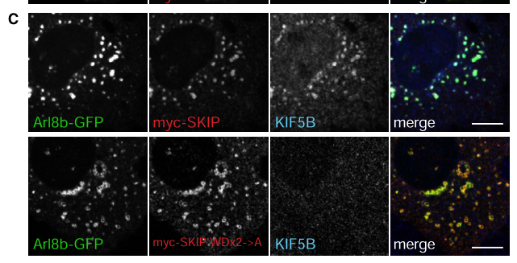

## Question

# Gene Research for Functional Annotation

## ⚠️ CRITICAL: Gene/Protein Identification Context

**BEFORE YOU BEGIN RESEARCH:** You MUST verify you are researching the CORRECT gene/protein. Gene symbols can be ambiguous, especially for less well-characterized genes from non-model organisms.

### Target Gene/Protein Identity (from UniProt):
- **UniProt Accession:** Q9NVJ2
- **Protein Description:** RecName: Full=ADP-ribosylation factor-like protein 8B {ECO:0000305}; EC=3.6.5.2 {ECO:0000269|PubMed:15331635, ECO:0000269|PubMed:16537643}; AltName: Full=ADP-ribosylation factor-like protein 10C; AltName: Full=Novel small G protein indispensable for equal chromosome segregation 1;
- **Gene Information:** Name=ARL8B {ECO:0000312|HGNC:HGNC:25564}; Synonyms=ARL10C, GIE1;
- **Organism (full):** Homo sapiens (Human).
- **Protein Family:** Belongs to the small GTPase superfamily. Arf family.
- **Key Domains:** Arl8a/8b. (IPR044154); P-loop_NTPase. (IPR027417); Small_GTP-bd. (IPR005225); Small_GTPase_ARF/SAR. (IPR006689); Arf (PF00025)

### MANDATORY VERIFICATION STEPS:

1. **Check if the gene symbol "ARL8B" matches the protein description above**
2. **Verify the organism is correct:** Homo sapiens (Human).
3. **Check if protein family/domains align with what you find in literature**
4. **If you find literature for a DIFFERENT gene with the same or similar symbol, STOP**

### If Gene Symbol is Ambiguous or You Cannot Find Relevant Literature:

**DO NOT PROCEED WITH RESEARCH ON A DIFFERENT GENE.** Instead:
- State clearly: "The gene symbol 'ARL8B' is ambiguous or literature is limited for this specific protein"
- Explain what you found (e.g., "Found extensive literature on a different gene with the same symbol in a different organism")
- Describe the protein based ONLY on the UniProt information provided above
- Suggest that the protein function can be inferred from domain/family information

### Research Target:

Please provide a comprehensive research report on the gene **ARL8B** (gene ID: ARL8B, UniProt: Q9NVJ2) in human.

The research report should be a detailed narrative explaining the function, biological processes, and localization of the gene product. Citations should be given for all claims.

You should prioritize authoritative reviews and primary scientific literature when conducting research. You can supplement
this with annotations you find in gene/protein databases, but these can be outdated or inaccurate.

We are specifically interested in the primary function of the gene - for enzymes, what reaction is catalyzed, and what is the substrate specificity? For transporters, what is the substrate? For structural proteins or adapters, what is the broader structural role? For signaling molecules, what is the role in the pathway.

We are interested in where in or outside the cell the gene product carries out its function.

We are also interested in the signaling or biochemical pathways in which the gene functions. We are less interested in broad pleiotropic effects, except where these elucidate the precise role.

Include evidence where possible. We are interested in both experimental evidence as well as inference from structure, evolution, or bioinformatic analysis. Precise studies should be prioritized over high-throughput, where available.

## Output

Question: You are an expert researcher providing comprehensive, well-cited information.

Provide detailed information focusing on:
1. Key concepts and definitions with current understanding
2. Recent developments and latest research (prioritize 2023-2024 sources)
3. Current applications and real-world implementations
4. Expert opinions and analysis from authoritative sources
5. Relevant statistics and data from recent studies

Format as a comprehensive research report with proper citations. Include URLs and publication dates where available.
Always prioritize recent, authoritative sources and provide specific citations for all major claims.

# Gene Research for Functional Annotation

## ⚠️ CRITICAL: Gene/Protein Identification Context

**BEFORE YOU BEGIN RESEARCH:** You MUST verify you are researching the CORRECT gene/protein. Gene symbols can be ambiguous, especially for less well-characterized genes from non-model organisms.

### Target Gene/Protein Identity (from UniProt):
- **UniProt Accession:** Q9NVJ2
- **Protein Description:** RecName: Full=ADP-ribosylation factor-like protein 8B {ECO:0000305}; EC=3.6.5.2 {ECO:0000269|PubMed:15331635, ECO:0000269|PubMed:16537643}; AltName: Full=ADP-ribosylation factor-like protein 10C; AltName: Full=Novel small G protein indispensable for equal chromosome segregation 1;
- **Gene Information:** Name=ARL8B {ECO:0000312|HGNC:HGNC:25564}; Synonyms=ARL10C, GIE1;
- **Organism (full):** Homo sapiens (Human).
- **Protein Family:** Belongs to the small GTPase superfamily. Arf family.
- **Key Domains:** Arl8a/8b. (IPR044154); P-loop_NTPase. (IPR027417); Small_GTP-bd. (IPR005225); Small_GTPase_ARF/SAR. (IPR006689); Arf (PF00025)

### MANDATORY VERIFICATION STEPS:

1. **Check if the gene symbol "ARL8B" matches the protein description above**
2. **Verify the organism is correct:** Homo sapiens (Human).
3. **Check if protein family/domains align with what you find in literature**
4. **If you find literature for a DIFFERENT gene with the same or similar symbol, STOP**

### If Gene Symbol is Ambiguous or You Cannot Find Relevant Literature:

**DO NOT PROCEED WITH RESEARCH ON A DIFFERENT GENE.** Instead:
- State clearly: "The gene symbol 'ARL8B' is ambiguous or literature is limited for this specific protein"
- Explain what you found (e.g., "Found extensive literature on a different gene with the same symbol in a different organism")
- Describe the protein based ONLY on the UniProt information provided above
- Suggest that the protein function can be inferred from domain/family information

### Research Target:

Please provide a comprehensive research report on the gene **ARL8B** (gene ID: ARL8B, UniProt: Q9NVJ2) in human.

The research report should be a detailed narrative explaining the function, biological processes, and localization of the gene product. Citations should be given for all claims.

You should prioritize authoritative reviews and primary scientific literature when conducting research. You can supplement
this with annotations you find in gene/protein databases, but these can be outdated or inaccurate.

We are specifically interested in the primary function of the gene - for enzymes, what reaction is catalyzed, and what is the substrate specificity? For transporters, what is the substrate? For structural proteins or adapters, what is the broader structural role? For signaling molecules, what is the role in the pathway.

We are interested in where in or outside the cell the gene product carries out its function.

We are also interested in the signaling or biochemical pathways in which the gene functions. We are less interested in broad pleiotropic effects, except where these elucidate the precise role.

Include evidence where possible. We are interested in both experimental evidence as well as inference from structure, evolution, or bioinformatic analysis. Precise studies should be prioritized over high-throughput, where available.

## Comprehensive research report: Human **ARL8B** (UniProt **Q9NVJ2**) — functional annotation and recent advances

### 0. Target verification (critical identity check)
The evidence assembled here consistently refers to **human/mammalian ARL8B (Arl8b)** as an **Arf-family small GTPase** that localizes to the **cytosolic face of lysosomes** and regulates **lysosome positioning/motility** and **lysosome fusion** via defined effectors including **SKIP/PLEKHM2**, the **BORC** complex, and **HOPS** (e.g., **VPS41**) (khatter2015arflikegtpasearl8 pages 1-5, khatter2015thesmallgtpase pages 1-2, khatter2015arflikegtpasearl8 pages 5-8). This matches the UniProt Q9NVJ2 description of an Arf-family small G protein (small GTPase superfamily) and its lysosome-centric biology.

### 1. Key concepts and definitions (current understanding)

#### 1.1 ARL8B as an Arf-family small GTPase “molecular switch”
ARL8B is understood as a **GDP/GTP-cycling small GTPase** that acts as a **molecular switch** on lysosomal membranes, recruiting distinct effector proteins preferentially in its **GTP-bound** state to control lysosomal behavior (khatter2015arflikegtpasearl8 pages 1-5, khatter2015arflikegtpasearl8 pages 8-10).

**Structural/biochemical context.** A key structural feature highlighted in the ARL8 literature is a conserved **N‑terminal amphipathic helix** that helps membrane association of the active form; ARL8 also has canonical **switch regions** that change conformation upon GTP binding. A structure is referenced in the review (PDB **1ZD9**) (khatter2015arflikegtpasearl8 pages 5-8).

#### 1.2 Lysosome positioning as an integrated regulatory layer
Lysosomes exist in perinuclear “cloud” and peripheral pools; their **spatial distribution** influences multiple outputs including endocytic degradation and autophagy. ARL8B is presented as a **major regulatory GTPase on lysosomes** controlling this spatial distribution (khatter2015arflikegtpasearl8 pages 8-10, khatter2015arflikegtpasearl8 pages 1-5).

### 2. Core functions of ARL8B (experimentally supported)

#### 2.1 ARL8B drives anterograde (plus-end) lysosome transport via SKIP/PLEKHM2 and kinesin-1
A foundational mechanism is that **Arl8b-GTP binds the adaptor SKIP/PLEKHM2**, which in turn binds **kinesin-1** (via kinesin light chain), thereby coupling lysosomes to a plus-end-directed motor for outward transport on microtubules (khatter2015arflikegtpasearl8 pages 8-10, rosaferreira2011arl8andskip pages 5-6).

**Key primary evidence (Dev Cell 2011).**
* SKIP binds kinesin light chain through conserved WD motifs; mutation of these residues (W207A, D208A, W236A, E237A; “WDx2→A”) **abolished KIF5B recruitment** to lysosomes while SKIP still localized to lysosomes (rosaferreira2011arl8andskip pages 5-6, rosaferreira2011arl8andskip media 3d0503b0).
* **KIF5B knockdown >85%** phenocopied Arl8/SKIP depletion with central lysosome clustering (rosaferreira2011arl8andskip pages 5-6).
* Quantification of acidification-dependent outward lysosome movement shows dependence on **Arl8b and SKIP** (rosaferreira2011arl8andskip media 19e53c37).

**Interpretation / expert analysis.** This establishes ARL8B as a *motor-coupling determinant*: it does not “move” lysosomes itself but controls **motor engagement** by recruiting SKIP, which recruits kinesin-1.

#### 2.2 Upstream recruitment of ARL8B to lysosomes by BORC
ARL8B’s lysosomal localization is controlled upstream by the multiprotein complex **BORC (BLOC-one-related complex)**. Disrupting BORC (e.g., CRISPR knockout of a BORC subunit such as myrlysin, or depletion of other BORC components) causes **loss of Arl8b from lysosomes** and **perinuclear clustering** of lysosomes, phenocopying Arl8b depletion (khatter2015arflikegtpasearl8 pages 5-8, khatter2015arflikegtpasearl8 pages 22-22).

**Interpretation.** The BORC→ARL8→SKIP/kinesin-1 axis is a canonical pathway for **lysosome dispersion toward the cell periphery**.

#### 2.3 ARL8B promotes endosome–lysosome fusion by recruiting the HOPS tethering complex
Beyond motility, ARL8B supports **late endosome–lysosome fusion** by promoting recruitment/assembly of the **HOPS tethering complex** on lysosomes.

**Key primary evidence (J Cell Sci 2015).** Arl8b (but not Rab7) is required for lysosomal membrane localization of the HOPS subunit **hVps41**; EGFR degradation defects after hVps41 depletion could be rescued by wild-type hVps41 but not by an **Arl8b-binding-defective** mutant, indicating functional dependence on Arl8b–hVps41 binding (khatter2015thesmallgtpase pages 1-2).

#### 2.4 ARL8B participates in “effector choice” to balance positioning vs fusion (PLEKHM1 vs SKIP)
The Rab7 effector **PLEKHM1** can bind **both Rab7 and Arl8b**, supporting clustering/fusion of late endosomes and lysosomes; its N-terminal **RUN domain** is necessary/sufficient for Arl8b binding and lysosomal localization. PLEKHM1 competes with SKIP for Arl8b binding, providing a conceptual basis for how ARL8B can coordinate (or trade off) **positioning** vs **fusion** functions via effector selection (marwaha2017therab7effector pages 1-2).

### 3. Subcellular localization
Across primary and review sources, ARL8B is described as a **lysosome-associated** small GTPase, enriched on **mature lysosomes**. Manipulating ARL8B (knockdown vs overexpression) shifts lysosomes between **perinuclear/MTOC clustering** and **peripheral dispersion**, visualized by microscopy (scale bar **10 µm** noted in one example) (khatter2015arflikegtpasearl8 pages 22-22).

### 4. Recent developments and latest research (prioritized 2023–2024)

#### 4.1 2024: ARL8B couples to retrograde transport through a DENND6A→Rab34→RILP/dynein cascade
A major 2024 advance is the discovery that ARL8B is not only an anterograde driver but can also initiate **retrograde** lysosome transport via a defined cascade.

**Nature Communications (Jan 2024; DOI: https://doi.org/10.1038/s41467-024-44957-1).** Kumar et al. identify **DENND6A** as an **Arl8b effector** recruited to peripheral lysosomes, where DENND6A acts as a **GEF for Rab34**. Activated Rab34 recruits a **RILP/dynein** complex to promote **retrograde transport** and **nutrient-dependent juxtanuclear repositioning**; loss of DENND6A impairs **autophagic flux** (kumar2024dennd6alinksarl8b pages 1-2).

**Quantitative/statistical details from the 2024 study (available in retrieved excerpts).**
* DENND6A screening implicated **20 Rab** candidates (including Rab34) as potential substrates (kumar2024dennd6alinksarl8b pages 1-2).
* A BioID interactome referenced **>4,000** unique proteins, and DENND6A overexpression in one context was ~**1.8×** endogenous (kumar2024dennd6alinksarl8b pages 1-2).
* Lysosome distribution quantifications used cell counts such as **n=27–30 cells** per condition (from 3 replicates) in cumulative LAMP1 distribution analyses; several statistical tests and p-values were reported (e.g., **p ≤ 0.0025**, **p ≤ 0.0005**) (kumar2024dennd6alinksarl8b pages 6-9).

**Expert analysis.** Conceptually, this extends ARL8B from a “plus-end lysosome disperser” into a **bidirectional transport coordinator**, capable of recruiting either kinesin-based machinery (via SKIP) or dynein-based machinery (via DENND6A/Rab34/RILP).

#### 4.2 2024: Human genetics links the BORC→ARL8 pathway to infantile neurodegeneration
**Brain (Dec 2024; DOI: https://doi.org/10.1093/brain/awad427).** De Pace et al. reported **biallelic BORCS8 variants** causing a severe infantile-onset neurodegenerative syndrome. BORC normally recruits ARL8 and then kinesin motors to promote anterograde lysosome transport in non-neuronal cells and in axons.

Variants included missense **p.Ser29Pro**, **p.Ser42Pro**, **p.Thr66Pro**, and frameshift **p.Asn26Trpfs*51**. Functional assays showed missense variants had reduced BORC assembly and reduced ability to drive peripheral lysosome distribution, while the frameshift variant had lower expression and was completely incapable of assembling with BORC or promoting peripheral lysosome distribution (pace2024biallelicborcs8variants pages 1-2).

**Expert analysis.** Although this is not an ARL8B coding mutation, it is direct *human* evidence that perturbing the **upstream recruiter of ARL8** leads to clinically severe outcomes, underscoring the physiological importance of ARL8B-centered lysosome dynamics.

#### 4.3 2024 expert review: ARL8B pathway in axonal lysosome transport and neurological disease context
A Current Opinion in Cell Biology review (Aug 2024; DOI: https://doi.org/10.1016/j.ceb.2024.102382) positions **Arl8b** together with **BORC** and **SKIP** in the anterograde arm of axonal lysosome transport schematics, discussing how disruptions in lysosome transport contribute to neurological disease mechanisms (paumier2024disruptionsinaxonal pages 1-2).

### 5. Current applications and real-world implementations

#### 5.1 Disease mechanism research: neurodevelopment and neurodegeneration
* **Human genetics**: BORCS8 disease establishes that impaired BORC-dependent lysosome distribution (and therefore impaired ARL8 recruitment/function) is linked to severe neurodevelopmental/neurodegenerative phenotypes (pace2024biallelicborcs8variants pages 1-2).
* **Mechanistic neurology cell biology**: Reviews frame ARL8B/BORC/SKIP-mediated lysosome transport as relevant to axonal homeostasis, with potential downstream impact on protein/organelle clearance (paumier2024disruptionsinaxonal pages 1-2).

#### 5.2 Autophagy and lysosome-positioning axes in cell biology and translational hypotheses
The 2024 DENND6A pathway specifically links ARL8B-directed lysosome repositioning to **autophagic flux regulation** via dynein-based retrograde trafficking (kumar2024dennd6alinksarl8b pages 1-2, kumar2024dennd6alinksarl8b pages 6-9). This creates a mechanistically grounded entry point for interventions aimed at restoring lysosome positioning in settings of impaired autophagy.

#### 5.3 Target–disease association landscape (database-derived)
OpenTargets lists disease associations for ARL8B, including broad categories such as **neoplasm** (and others), supported by multiple literature links in the OpenTargets evidence graph (OpenTargets Search: -ARL8B). These should be interpreted as **association evidence** (often heterogeneous: genetic, expression, functional screens) rather than direct proof of ARL8B as a therapeutic target in a specific indication.

### 6. Pathways and interaction network (mechanistic summary)

#### 6.1 Canonical anterograde lysosome transport pathway
**BORC → ARL8B(GTP) → SKIP/PLEKHM2 → kinesin-1 (KIF5B/KLC) → plus-end lysosome dispersion** (khatter2015arflikegtpasearl8 pages 5-8, rosaferreira2011arl8andskip pages 5-6).

Direct figure evidence for the SKIP WD-motif requirement for KIF5B recruitment and quantification of outward movement is available from the Dev Cell 2011 figures retrieved here (rosaferreira2011arl8andskip media 3d0503b0, rosaferreira2011arl8andskip media 19e53c37).

#### 6.2 Fusion/tethering pathway
**ARL8B → VPS41/HOPS assembly on lysosomes → endosome–lysosome fusion and cargo degradation (e.g., EGFR)** (khatter2015thesmallgtpase pages 1-2).

#### 6.3 Effector switching / cross-talk pathway
**ARL8B ↔ PLEKHM1 (Rab7 effector)** provides a molecular bridge between Rab7 and Arl8b and introduces competition with SKIP, linking positioning decisions to fusion outcomes (marwaha2017therab7effector pages 1-2).

#### 6.4 2024 retrograde pathway
**ARL8B → DENND6A (effector) → Rab34 activation → RILP recruitment → dynein-based retrograde transport → juxtanuclear lysosome repositioning; impacts autophagic flux** (kumar2024dennd6alinksarl8b pages 1-2).

### 7. Key statistics and data points (from recent and foundational studies)

* **>85% KIF5B knockdown** causes central lysosome clustering similar to Arl8/SKIP depletion (Dev Cell 2011) (rosaferreira2011arl8andskip pages 5-6).
* **SKIP WD motif mutant** (W207A/D208A/W236A/E237A) abolishes **KIF5B recruitment** to lysosomes while SKIP remains lysosome-localized (rosaferreira2011arl8andskip pages 5-6, rosaferreira2011arl8andskip media 3d0503b0).
* Microscopy figure scale bar **10 µm** used in lysosome distribution imaging example (reviewed evidence) (khatter2015arflikegtpasearl8 pages 22-22).
* ARL8 paralogs: **Arl8a and Arl8b ~91% identical** (marwaha2017therab7effector pages 1-2, khatter2015arflikegtpasearl8 pages 5-8).
* PLEKHM1 RUN domain similarity to SKIP RUN domain: **~40%** (marwaha2017therab7effector pages 1-2).
* 2024 DENND6A screen: **20** candidate Rab substrates (including Rab34) (kumar2024dennd6alinksarl8b pages 1-2).
* 2024 DENND6A study: BioID interactome referenced **>4,000** unique proteins; DENND6A overexpression ~**1.8×** endogenous (kumar2024dennd6alinksarl8b pages 1-2).
* 2024 DENND6A study: lysosome distribution analyses often used **n≈27–30 cells** per condition (3 replicates), with statistical thresholds such as **p ≤ 0.0025** and **p ≤ 0.0005** reported in figure captions (kumar2024dennd6alinksarl8b pages 6-9).

### 8. Limitations of this report (evidence accessibility)
Some potentially relevant 2023–2024 ARL8B structural-mechanistic papers (e.g., detailed structural interface between ARL8B and RUN domains) were listed as unobtainable by the search system in this session and therefore could not be cited directly here. Consequently, the most detailed ARL8B–effector structural interface claims are restricted to what is available in the retrieved review-level structural context (e.g., N-terminal amphipathic helix; PDB reference) and mechanistic cell biology papers (khatter2015arflikegtpasearl8 pages 5-8, rosaferreira2011arl8andskip pages 5-6).

---

### Evidence map table
The following table provides a compact mapping from ARL8B functions to partners and evidence types.

| Functional role / biological process | Subcellular localization | Key molecular partners / effectors | Experimental evidence type | Notes / quantitative details | Key citation |
|---|---|---|---|---|---|
| Lysosome identity and positioning; major lysosomal small GTPase that drives lysosome dispersion to the cell periphery when active, while loss causes perinuclear/MTOC clustering | Cytosolic face of mature lysosomes; lysosome membrane; perinuclear vs peripheral lysosome pools | BORC (upstream recruiter), SKIP/PLEKHM2, kinesin machinery | RNAi/knockdown, overexpression, fluorescence microscopy, schematic/model synthesis | Microscopy scale bar 10 µm; Arl8a and Arl8b share ~91% identity; Arl8b overexpression disperses lysosomes whereas depletion clusters them near the MTOC (khatter2015arflikegtpasearl8 pages 22-22, khatter2015arflikegtpasearl8 pages 5-8) | Khatter et al. 2015. DOI: https://doi.org/10.1080/21592799.2015.1086501 |
| BORC-dependent recruitment of ARL8B to lysosomes upstream of anterograde transport | Lysosomal surface | BORC / BLOC-one-related complex; myrlysin/BORCS5 and other BORC subunits | CRISPR knockout, siRNA depletion, localization assays | BORC loss detaches Arl8b from lysosomes and phenocopies Arl8b depletion; BORC itself showed no detectable GEF activity toward Arl8b in the cited review summary (khatter2015arflikegtpasearl8 pages 5-8) | Khatter et al. 2015. DOI: https://doi.org/10.1080/21592799.2015.1086501 |
| Coupling lysosomes to kinesin-1 for plus-end-directed anterograde motility | Peripheral lysosomes on microtubules | SKIP/PLEKHM2; kinesin-1 KIF5B/KLC | Affinity purification/binding, RNAi, overexpression, live/fixed-cell microscopy | SKIP binds kinesin light chain via WD motifs; KIF5B knockdown was >85% and caused central lysosome clustering similar to Arl8/SKIP depletion; mutation of SKIP WD residues (W207A/D208A/W236A/E237A) abolished KIF5B recruitment while preserving lysosome localization (khatter2015arflikegtpasearl8 pages 8-10, rosaferreira2011arl8andskip pages 5-6, rosaferreira2011arl8andskip media 3d0503b0, rosaferreira2011arl8andskip media 19e53c37) | Rosa-Ferreira & Munro 2011. DOI: https://doi.org/10.1016/j.devcel.2011.10.007 |
| Activation mechanism of lysosome–kinesin coupling through SKIP | Lysosome membrane, ARL8-positive lysosomes | SKIP/PLEKHM2, kinesin-1 | Mechanistic cell biology / conformational model summarized in review evidence | ARL8 relieves SKIP autoinhibition to enable coupling of lysosomes to kinesin-1; establishes ARL8 as an active molecular switch rather than a passive lysosome marker (khatter2015arflikegtpasearl8 pages 8-10, kumar2023dennd6acouplesarl8b pages 25-27) | Keren-Kaplan & Bonifacino 2021. DOI: https://doi.org/10.1016/j.cub.2020.10.071 |
| Recruitment and assembly of HOPS tethering complex for endosome–lysosome fusion and degradative trafficking | Lysosomal membranes; Arl8b- and hVps41-positive lysosomes | HOPS complex, VPS41 (hVps41), VPS39, SKIP/PLEKHM2 | RNAi depletion, rescue with WT vs binding-defective mutant, affinity purification, microscopy | Arl8b, but not Rab7, was required for hVps41 membrane localization; HOPS is hexameric and shares 4 of 6 core subunits with CORVET; EGFR degradation defect was rescued by WT hVps41 but not an Arl8b-binding-defective mutant (khatter2015thesmallgtpase pages 1-2) | Khatter et al. 2015. DOI: https://doi.org/10.1242/jcs.162651 |
| Coordination of lysosome motility and fusion through competitive effector binding | Late endosome–lysosome contact sites; lysosomes | PLEKHM1, Rab7, Arl8b, HOPS, SKIP/PLEKHM2 | Interaction mapping, domain analysis, cargo degradation assays, microscopy | PLEKHM1 simultaneously binds Rab7 and Arl8b; N-terminal RUN domain is necessary and sufficient for Arl8b interaction and lysosomal localization; PLEKHM1 RUN domain shares ~40% similarity with SKIP RUN domain and competes with SKIP for Arl8b binding, influencing lysosome positioning; Arl8a/b are ~91% identical (marwaha2017therab7effector pages 1-2) | Marwaha et al. 2017. DOI: https://doi.org/10.1083/jcb.201607085 |
| Retrograde lysosome trafficking and nutrient-dependent juxtanuclear repositioning | Peripheral lysosomes transitioning toward juxtanuclear lysosome pool | DENND6A, Rab34, RILP, dynein, Arl8b | GEF screening, BioID/proximity interactome, imaging, loss-of-function assays | DENND6A was identified as a potential GEF for ~20 Rabs including Rab34; Arl8b recruits DENND6A to peripheral lysosomes, DENND6A activates Rab34, and Rab34 recruits RILP/dynein to drive retrograde transport; DENND6A overexpression in assays was ~1.8× endogenous (mcpherson2023dennd6acouplesarl8b pages 1-5, kumar2024dennd6alinksarl8b pages 1-2) | Kumar et al. 2024. DOI: https://doi.org/10.1038/s41467-024-44957-1 |
| Autophagy regulation through lysosome positioning and transport state | Lysosomes under nutrient-dependent spatial rearrangement | Arl8b, SKIP/PLEKHM2, HOPS, DENND6A-Rab34-RILP-dynein, mTORC1-linked lysosome positioning machinery | Knockdown/loss-of-function, trafficking assays, autophagic flux assays | Loss of DENND6A impaired autophagic flux; nutrient deprivation or altered lysosomal pH reduced lysosomal Arl8b/KIF2 and promoted perinuclear clustering with mTORC1 inactivation in review evidence; ARL8B thus integrates lysosome position with degradative signaling outputs (khatter2015arflikegtpasearl8 pages 8-10, kumar2024dennd6alinksarl8b pages 1-2) | Kumar et al. 2024. DOI: https://doi.org/10.1038/s41467-024-44957-1 |
| Neuronal/axonal lysosome transport relevance | Distal axon and peripheral neuronal lysosome compartments | BORC, Arl8b, SKIP, kinesins | Review synthesis of neuronal transport studies | ARL8/BORC pathway is placed on the anterograde/kinesin arm of axonal lysosome transport; disruptions in this pathway are linked broadly to neurological disease mechanisms (paumier2024disruptionsinaxonal pages 1-2) | Paumier & Gowrishankar 2024. DOI: https://doi.org/10.1016/j.ceb.2024.102382 |
| Human disease relevance through upstream BORC defects affecting ARL8-dependent lysosome dynamics | Lysosomes in human cells; distal axon / neuronal systems | BORCS8 (BORC subunit), ARL8, kinesin-1/-3 | Human genetics, cellular reconstitution, zebrafish knockout | Biallelic BORCS8 variants (p.Ser29Pro, p.Ser42Pro, p.Thr66Pro, p.Asn26Trpfs*51) reduced BORC assembly and impaired peripheral lysosome distribution; the frameshift allele was completely incapable of assembling with BORC or promoting peripheral lysosome distribution, linking BORC→ARL8 pathway failure to infantile-onset neurodegeneration (pace2024biallelicborcs8variants pages 1-2) | De Pace et al. 2024. DOI: https://doi.org/10.1093/brain/awad427 |

*Table: This table summarizes experimentally supported functions, localization, effectors, evidence types, and quantitative notes for human ARL8B (UniProt Q9NVJ2). It is useful as a compact evidence map for lysosome positioning, motility, fusion, autophagy, and disease relevance.*

References

1. (khatter2015arflikegtpasearl8 pages 1-5): Divya Khatter, Aastha Sindhwani, and Mahak Sharma. Arf-like gtpase arl8: moving from the periphery to the center of lysosomal biology. Cellular Logistics, 5:e1086501, Jul 2015. URL: https://doi.org/10.1080/21592799.2015.1086501, doi:10.1080/21592799.2015.1086501. This article has 111 citations.

2. (khatter2015thesmallgtpase pages 1-2): Divya Khatter, Vivek B. Raina, Devashish Dwivedi, Aastha Sindhwani, Surbhi Bahl, and Mahak Sharma. The small gtpase arl8b regulates assembly of the mammalian hops complex on lysosomes. Journal of Cell Science, 128:1746-1761, May 2015. URL: https://doi.org/10.1242/jcs.162651, doi:10.1242/jcs.162651. This article has 180 citations and is from a domain leading peer-reviewed journal.

3. (khatter2015arflikegtpasearl8 pages 5-8): Divya Khatter, Aastha Sindhwani, and Mahak Sharma. Arf-like gtpase arl8: moving from the periphery to the center of lysosomal biology. Cellular Logistics, 5:e1086501, Jul 2015. URL: https://doi.org/10.1080/21592799.2015.1086501, doi:10.1080/21592799.2015.1086501. This article has 111 citations.

4. (khatter2015arflikegtpasearl8 pages 8-10): Divya Khatter, Aastha Sindhwani, and Mahak Sharma. Arf-like gtpase arl8: moving from the periphery to the center of lysosomal biology. Cellular Logistics, 5:e1086501, Jul 2015. URL: https://doi.org/10.1080/21592799.2015.1086501, doi:10.1080/21592799.2015.1086501. This article has 111 citations.

5. (rosaferreira2011arl8andskip pages 5-6): Cláudia Rosa-Ferreira and Sean Munro. Arl8 and skip act together to link lysosomes to kinesin-1. Developmental Cell, 21:1171-1178, Dec 2011. URL: https://doi.org/10.1016/j.devcel.2011.10.007, doi:10.1016/j.devcel.2011.10.007. This article has 408 citations and is from a highest quality peer-reviewed journal.

6. (rosaferreira2011arl8andskip media 3d0503b0): Cláudia Rosa-Ferreira and Sean Munro. Arl8 and skip act together to link lysosomes to kinesin-1. Developmental Cell, 21:1171-1178, Dec 2011. URL: https://doi.org/10.1016/j.devcel.2011.10.007, doi:10.1016/j.devcel.2011.10.007. This article has 408 citations and is from a highest quality peer-reviewed journal.

7. (rosaferreira2011arl8andskip media 19e53c37): Cláudia Rosa-Ferreira and Sean Munro. Arl8 and skip act together to link lysosomes to kinesin-1. Developmental Cell, 21:1171-1178, Dec 2011. URL: https://doi.org/10.1016/j.devcel.2011.10.007, doi:10.1016/j.devcel.2011.10.007. This article has 408 citations and is from a highest quality peer-reviewed journal.

8. (khatter2015arflikegtpasearl8 pages 22-22): Divya Khatter, Aastha Sindhwani, and Mahak Sharma. Arf-like gtpase arl8: moving from the periphery to the center of lysosomal biology. Cellular Logistics, 5:e1086501, Jul 2015. URL: https://doi.org/10.1080/21592799.2015.1086501, doi:10.1080/21592799.2015.1086501. This article has 111 citations.

9. (marwaha2017therab7effector pages 1-2): Rituraj Marwaha, Subhash B. Arya, Divya Jagga, Harmeet Kaur, Amit Tuli, and Mahak Sharma. The rab7 effector plekhm1 binds arl8b to promote cargo traffic to lysosomes. The Journal of Cell Biology, 216:1051-1070, Apr 2017. URL: https://doi.org/10.1083/jcb.201607085, doi:10.1083/jcb.201607085. This article has 176 citations.

10. (kumar2024dennd6alinksarl8b pages 1-2): Rahul Kumar, Maleeha Khan, Vincent Francis, Adriana Aguila, Gopinath Kulasekaran, Emily Banks, and Peter S. McPherson. Dennd6a links arl8b to a rab34/rilp/dynein complex, regulating lysosomal positioning and autophagy. Nature Communications, Jan 2024. URL: https://doi.org/10.1038/s41467-024-44957-1, doi:10.1038/s41467-024-44957-1. This article has 27 citations and is from a highest quality peer-reviewed journal.

11. (kumar2024dennd6alinksarl8b pages 6-9): Rahul Kumar, Maleeha Khan, Vincent Francis, Adriana Aguila, Gopinath Kulasekaran, Emily Banks, and Peter S. McPherson. Dennd6a links arl8b to a rab34/rilp/dynein complex, regulating lysosomal positioning and autophagy. Nature Communications, Jan 2024. URL: https://doi.org/10.1038/s41467-024-44957-1, doi:10.1038/s41467-024-44957-1. This article has 27 citations and is from a highest quality peer-reviewed journal.

12. (pace2024biallelicborcs8variants pages 1-2): Raffaella De Pace, Reza Maroofian, Adeline Paimboeuf, Mina Zamani, Maha S Zaki, Saeid Sadeghian, Reza Azizimalamiri, Hamid Galehdari, Jawaher Zeighami, Chad D Williamson, Emily Fleming, Dihong Zhou, Jennifer L Gannon, Isabelle Thiffault, Emmanuel Roze, Mohnish Suri, Giovanni Zifarelli, Peter Bauer, Henry Houlden, Mariasavina Severino, Shunmoogum A Patten, Emily Farrow, and Juan S Bonifacino. Biallelic borcs8 variants cause an infantile-onset neurodegenerative disorder with altered lysosome dynamics. Brain : a journal of neurology, 147:1751-1767, Dec 2024. URL: https://doi.org/10.1093/brain/awad427, doi:10.1093/brain/awad427. This article has 24 citations.

13. (paumier2024disruptionsinaxonal pages 1-2): Jean-Michel Paumier and Swetha Gowrishankar. Disruptions in axonal lysosome transport and its contribution to neurological disease. Aug 2024. URL: https://doi.org/10.1016/j.ceb.2024.102382, doi:10.1016/j.ceb.2024.102382. This article has 15 citations and is from a peer-reviewed journal.

14. (OpenTargets Search: -ARL8B): Open Targets Query (-ARL8B, 5 results). Buniello, A. et al. (2025). Open Targets Platform: facilitating therapeutic hypotheses building in drug discovery. Nucleic Acids Research.

15. (kumar2023dennd6acouplesarl8b pages 25-27): Rahul Kumar, Vincent Francis, Maleeha Khan, Adriana Aguila, Gopinath Kulasekaran, and Peter S. McPherson. Dennd6a couples arl8b to a rab34/rilp/dynein complex regulating retrograde lysosomal trafficking and autophagy. bioRxiv, Aug 2023. URL: https://doi.org/10.1101/2023.08.21.554162, doi:10.1101/2023.08.21.554162. This article has 0 citations.

16. (mcpherson2023dennd6acouplesarl8b pages 1-5): Peter McPherson, Rahul Kumar, Vincent Francis, Maleeha Khan, Adriana Aguila, and Gopinath Kulasekaran. Dennd6a couples arl8b to a rab34/rilp/dynein complex regulating retrograde lysosomal trafficking and autophagy. Unknown journal, Sep 2023. URL: https://doi.org/10.21203/rs.3.rs-3283181/v1, doi:10.21203/rs.3.rs-3283181/v1.

## Artifacts

- [Edison artifact artifact-00](ARL8B-deep-research-falcon_artifacts/artifact-00.md)

## Citations

1. khatter2015thesmallgtpase pages 1-2
2. paumier2024disruptionsinaxonal pages 1-2
3. https://doi.org/10.1038/s41467-024-44957-1
4. https://doi.org/10.1093/brain/awad427
5. https://doi.org/10.1016/j.ceb.2024.102382
6. https://doi.org/10.1080/21592799.2015.1086501
7. https://doi.org/10.1016/j.devcel.2011.10.007
8. https://doi.org/10.1016/j.cub.2020.10.071
9. https://doi.org/10.1242/jcs.162651
10. https://doi.org/10.1083/jcb.201607085
11. https://doi.org/10.1080/21592799.2015.1086501,
12. https://doi.org/10.1242/jcs.162651,
13. https://doi.org/10.1016/j.devcel.2011.10.007,
14. https://doi.org/10.1083/jcb.201607085,
15. https://doi.org/10.1038/s41467-024-44957-1,
16. https://doi.org/10.1093/brain/awad427,
17. https://doi.org/10.1016/j.ceb.2024.102382,
18. https://doi.org/10.1101/2023.08.21.554162,
19. https://doi.org/10.21203/rs.3.rs-3283181/v1,