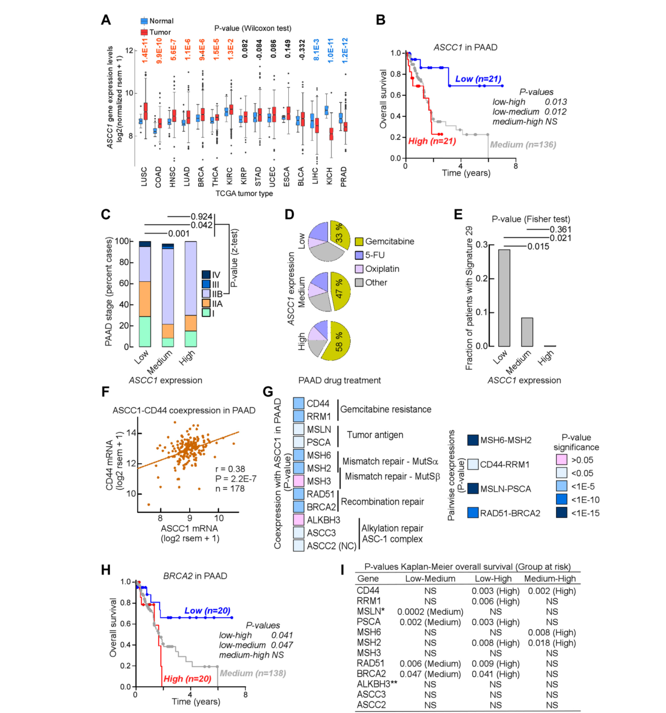

## Question

# Gene Research for Functional Annotation

## ⚠️ CRITICAL: Gene/Protein Identification Context

**BEFORE YOU BEGIN RESEARCH:** You MUST verify you are researching the CORRECT gene/protein. Gene symbols can be ambiguous, especially for less well-characterized genes from non-model organisms.

### Target Gene/Protein Identity (from UniProt):
- **UniProt Accession:** Q8N9N2
- **Protein Description:** RecName: Full=Activating signal cointegrator 1 complex subunit 1; AltName: Full=ASC-1 complex subunit p50 {ECO:0000303|PubMed:12077347}; AltName: Full=Trip4 complex subunit p50 {ECO:0000303|PubMed:12077347};
- **Gene Information:** Name=ASCC1; ORFNames=CGI-18;
- **Organism (full):** Homo sapiens (Human).
- **Protein Family:** Not specified in UniProt
- **Key Domains:** AKAP7-like_phosphoesterase. (IPR019510); ASCC1. (IPR009210); Cyclic_Pdiesterase. (IPR009097); KH-I_ASCC1. (IPR047538); KH_dom_type_1. (IPR004088)

### MANDATORY VERIFICATION STEPS:

1. **Check if the gene symbol "ASCC1" matches the protein description above**
2. **Verify the organism is correct:** Homo sapiens (Human).
3. **Check if protein family/domains align with what you find in literature**
4. **If you find literature for a DIFFERENT gene with the same or similar symbol, STOP**

### If Gene Symbol is Ambiguous or You Cannot Find Relevant Literature:

**DO NOT PROCEED WITH RESEARCH ON A DIFFERENT GENE.** Instead:
- State clearly: "The gene symbol 'ASCC1' is ambiguous or literature is limited for this specific protein"
- Explain what you found (e.g., "Found extensive literature on a different gene with the same symbol in a different organism")
- Describe the protein based ONLY on the UniProt information provided above
- Suggest that the protein function can be inferred from domain/family information

### Research Target:

Please provide a comprehensive research report on the gene **ASCC1** (gene ID: ASCC1, UniProt: Q8N9N2) in human.

The research report should be a detailed narrative explaining the function, biological processes, and localization of the gene product. Citations should be given for all claims.

You should prioritize authoritative reviews and primary scientific literature when conducting research. You can supplement
this with annotations you find in gene/protein databases, but these can be outdated or inaccurate.

We are specifically interested in the primary function of the gene - for enzymes, what reaction is catalyzed, and what is the substrate specificity? For transporters, what is the substrate? For structural proteins or adapters, what is the broader structural role? For signaling molecules, what is the role in the pathway.

We are interested in where in or outside the cell the gene product carries out its function.

We are also interested in the signaling or biochemical pathways in which the gene functions. We are less interested in broad pleiotropic effects, except where these elucidate the precise role.

Include evidence where possible. We are interested in both experimental evidence as well as inference from structure, evolution, or bioinformatic analysis. Precise studies should be prioritized over high-throughput, where available.

## Output

Question: You are an expert researcher providing comprehensive, well-cited information.

Provide detailed information focusing on:
1. Key concepts and definitions with current understanding
2. Recent developments and latest research (prioritize 2023-2024 sources)
3. Current applications and real-world implementations
4. Expert opinions and analysis from authoritative sources
5. Relevant statistics and data from recent studies

Format as a comprehensive research report with proper citations. Include URLs and publication dates where available.
Always prioritize recent, authoritative sources and provide specific citations for all major claims.

# Gene Research for Functional Annotation

## ⚠️ CRITICAL: Gene/Protein Identification Context

**BEFORE YOU BEGIN RESEARCH:** You MUST verify you are researching the CORRECT gene/protein. Gene symbols can be ambiguous, especially for less well-characterized genes from non-model organisms.

### Target Gene/Protein Identity (from UniProt):
- **UniProt Accession:** Q8N9N2
- **Protein Description:** RecName: Full=Activating signal cointegrator 1 complex subunit 1; AltName: Full=ASC-1 complex subunit p50 {ECO:0000303|PubMed:12077347}; AltName: Full=Trip4 complex subunit p50 {ECO:0000303|PubMed:12077347};
- **Gene Information:** Name=ASCC1; ORFNames=CGI-18;
- **Organism (full):** Homo sapiens (Human).
- **Protein Family:** Not specified in UniProt
- **Key Domains:** AKAP7-like_phosphoesterase. (IPR019510); ASCC1. (IPR009210); Cyclic_Pdiesterase. (IPR009097); KH-I_ASCC1. (IPR047538); KH_dom_type_1. (IPR004088)

### MANDATORY VERIFICATION STEPS:

1. **Check if the gene symbol "ASCC1" matches the protein description above**
2. **Verify the organism is correct:** Homo sapiens (Human).
3. **Check if protein family/domains align with what you find in literature**
4. **If you find literature for a DIFFERENT gene with the same or similar symbol, STOP**

### If Gene Symbol is Ambiguous or You Cannot Find Relevant Literature:

**DO NOT PROCEED WITH RESEARCH ON A DIFFERENT GENE.** Instead:
- State clearly: "The gene symbol 'ASCC1' is ambiguous or literature is limited for this specific protein"
- Explain what you found (e.g., "Found extensive literature on a different gene with the same symbol in a different organism")
- Describe the protein based ONLY on the UniProt information provided above
- Suggest that the protein function can be inferred from domain/family information

### Research Target:

Please provide a comprehensive research report on the gene **ASCC1** (gene ID: ASCC1, UniProt: Q8N9N2) in human.

The research report should be a detailed narrative explaining the function, biological processes, and localization of the gene product. Citations should be given for all claims.

You should prioritize authoritative reviews and primary scientific literature when conducting research. You can supplement
this with annotations you find in gene/protein databases, but these can be outdated or inaccurate.

We are specifically interested in the primary function of the gene - for enzymes, what reaction is catalyzed, and what is the substrate specificity? For transporters, what is the substrate? For structural proteins or adapters, what is the broader structural role? For signaling molecules, what is the role in the pathway.

We are interested in where in or outside the cell the gene product carries out its function.

We are also interested in the signaling or biochemical pathways in which the gene functions. We are less interested in broad pleiotropic effects, except where these elucidate the precise role.

Include evidence where possible. We are interested in both experimental evidence as well as inference from structure, evolution, or bioinformatic analysis. Precise studies should be prioritized over high-throughput, where available.

# Research report: Human **ASCC1** (UniProt Q8N9N2) functional annotation

## 1. Target verification (gene/protein identity)
The UniProt accession **Q8N9N2** corresponds to **human ASCC1**, described as **“Activating signal cointegrator 1 complex subunit 1”** and historically referred to as **ASC-1 complex subunit p50 (P50)** within the ASC-1/ASCC complex. Primary purification of the nuclear ASC-1 complex identified a “P50” subunit that contains a KH motif and is required for AP-1 transactivation, aligning with ASCC1’s KH-type RNA-binding features. (jung2002noveltranscriptioncoactivator pages 1-2, jung2002noveltranscriptioncoactivator pages 5-6)

## 2. Key concepts and definitions (current understanding)

### 2.1 The ASC-1/ASCC complex
ASC-1 was originally characterized as a transcriptional coactivator, and a **steady-state ASC-1 complex** purified from HeLa nuclei was shown to support transcriptional activation by multiple transcription factors (SRF, AP-1, NF-κB). (jung2002noveltranscriptioncoactivator pages 1-2)

In more recent DNA damage and translation-quality-control literature, “ASCC/ASC-1 complex” refers to a multi-subunit assembly containing **ASCC1, ASCC2, ASCC3, and TRIP4/ASC-1**, with context-dependent functions spanning transcriptional regulation, DNA alkylation-damage responses (via ALKBH3), and ribosome quality control. (soll2018rnaligaselikedomain pages 1-2, kito2023theasc‐1complex pages 1-2, miscicka2024ribosomalcollisionis pages 2-3)

### 2.2 ASCC1 domain architecture and terminology
ASCC1 is unusual in combining an N-terminal **KH-like nucleic-acid-binding module** with a C-terminal **2H phosphodiesterase (2H-PDE) / “RNA ligase-like”** module containing two conserved **HXT** motifs (the hallmark of 2H phosphodiesterases). A 2024 structural study describes a previously unrecognized KH-associated structural element named a **helix-clasp-helix (HCH)** that contributes to nucleotide recognition, and it defines a V-shaped PDE active-site channel. (chinnam2024ascc1structuresand pages 1-2, chinnam2024ascc1structuresand pages 2-4)

## 3. Molecular function: what ASCC1 does (best-supported)

### 3.1 Molecular activity 1 (validated): sequence-selective RNA binding
The strongest direct biochemical activity currently demonstrated for ASCC1 is **sequence-selective RNA binding**. Using EMSA with a panel of short RNAs, ASCC1 bound specifically to **CGCG-containing RNA** under stringent salt conditions, with detectable binding at ~60 nM protein. Mutation of the KH **GXXG** motif (GXXG→GDDG) abolished binding, and the analogous DNA sequence did not show a mobility shift, supporting RNA-selective recognition. (chinnam2024ascc1structuresand pages 9-11, chinnam2024ascc1structuresand pages 8-9)

Interpretation: ASCC1 likely functions as an RNA-binding regulatory subunit whose specificity and binding geometry may target the ASC-1/ASCC machinery to particular RNA contexts (e.g., specific sequence motifs or structured regions), but the physiologic endogenous RNA targets remain to be defined. (chinnam2024ascc1structuresand pages 9-11, chinnam2024ascc1structuresand pages 14-15)

### 3.2 Molecular activity 2 (structurally plausible but not yet substrate-validated): 2H phosphodiesterase-like chemistry
ASCC1’s C-terminal domain is structurally homologous to 2H phosphodiesterases, with two HXT motifs positioned in a V-shaped channel consistent with cyclic phosphate chemistry. (chinnam2024ascc1structuresand pages 1-2, chinnam2024ascc1structuresand pages 14-15)

However, direct enzymatic activity remains unresolved: a 2024 HPLC-based assay detected **no cleavage** of a tested 2-5A substrate (2′–5′ oligoadenylate analog) by human or Alvinella ASCC1, while a positive control PDE (rotavirus VP3-CTD) showed robust cleavage (>95%). This indicates either (i) a different physiological substrate, (ii) requirement for cofactors/partners, or (iii) a regulated/low-activity PDE state. (chinnam2024ascc1structuresand pages 9-11)

### 3.3 Key interaction partner: ASCC3 as a scaffold linking ASCC1 to ASCC2
In vitro pulldown and co-immunoprecipitation experiments support that ASCC1 **binds ASCC3 directly**, while ASCC1 and ASCC2 do not detectably bind each other in isolation; instead, ASCC3 mediates/scaffolds the ASCC1–ASCC2 association. (soll2018rnaligaselikedomain pages 1-2, soll2019theroleof pages 64-71)

## 4. Cellular localization and functional pathways

### 4.1 Nuclear speckles and alkylation damage response (ALKBH3–ASCC axis)
**Subcellular localization:** ASCC1 localizes constitutively to nuclear speckle-like foci and co-localizes with the spliceosomal component **PRP8**, supporting a nuclear role in RNA-linked processes. Upon alkylation damage (e.g., MMS), ASCC1 is removed from these foci. (soll2018rnaligaselikedomain pages 1-2, soll2019theroleof pages 64-71)

**Functional role in alkylation damage response:** Genetic and cell-biology evidence indicates ASCC1 is a **regulator of ASCC complex recruitment/assembly** during alkylation damage.

* ASCC1 knockout increases MMS-induced ASCC3 foci formation yet many such foci lack ASCC2, indicating dysregulated complex assembly. (soll2018rnaligaselikedomain pages 6-7, soll2019theroleof pages 71-85)
* ASCC1 knockout reduces ASCC2–ASCC3 association in co-IP assays and decreases ASCC2/ASCC3 co-localization after damage. (soll2019theroleof pages 71-85)
* ASCC1 knockout increases sensitivity to MMS in a manner **epistatic with ASCC3**, consistent with ASCC1 functioning within the same pathway rather than in a parallel repair route. (soll2019theroleof pages 71-85)

Mechanistic implication: ASCC1 appears to coordinate correct ASCC2–ASCC3 recruitment to damage-associated loci and thereby supports ALKBH3-coupled alkylation repair (where ALKBH3 reverses lesions such as 1-methyladenine and 3-methylcytosine on ssDNA/RNA), but ASCC1 itself is not the dealkylase. (soll2018rnaligaselikedomain pages 6-7, chinnam2024ascc1structuresand pages 1-2)

### 4.2 Transcriptional coactivation (historical “primary” function of ASC-1 complex)
A canonical primary study demonstrated that the nuclear ASC-1 complex stimulates transcriptional activation by SRF, AP-1, and NF-κB, and directly tested the necessity of the P50 subunit (ASCC1) for AP-1 activation in vivo.

Specifically, microinjection of an anti-P50 antibody nearly abolished TPA-induced AP-1 reporter activation; this inhibition was rescued by expressing wild-type P50, but not by a KH-mutant P50 that fails to interact properly within the complex. This provides direct functional evidence that ASCC1/P50 is **required for AP-1 transactivation** and that its RNA-binding KH region is functionally important. (jung2002noveltranscriptioncoactivator pages 5-6)

### 4.3 Ribosome quality control (RQC) and translation initiation (recent expansion of function)

**RQC (ribosome splitting) context:** The ASCC complex is now recognized as a key effector downstream of ZNF598-mediated ubiquitination of stalled/collided ribosomes. A 2024 reconstitution study emphasizes that ASCC-mediated dissociation can occur without ribosome collision provided ribosomes are ubiquitinated and have adequate 3′ mRNA overhang. (miscicka2024ribosomalcollisionis pages 2-3)

ASCC1’s role within this cytoplasmic RQC function appears limited: ASCC1 is reported as **dispensable** for dissociation of stalled ribosomes, while being essential for ASCC’s **nuclear DNA-repair** function. (miscicka2024ribosomalcollisionis pages 2-3)

**Translation initiation/scanning:** A 2023 EMBO Journal study reported that the ASC-1/ASCC complex associates with **scanning ribosomes**. Proteomics identified ASCC1 along with other ASCC components in eIF4A1-bound scanning ribosome preparations, supporting a physical presence of ASCC1 within scanning-ribosome-associated complexes, even though functional experiments highlighted ASCC3 knockdown effects on scanning dynamics. (kito2023theasc‐1complex pages 1-2)

## 5. Recent developments (prioritizing 2023–2024)

### 5.1 2024: ASCC1 structural and biochemical mechanism (RNA-binding motif + 2H-PDE active site)
A 2024 Journal of Biological Chemistry paper provided high-resolution structures and SAXS evidence defining ASCC1 as the first solved protein with a linked KH and 2H-PDE module in a relatively rigid arrangement. It also experimentally established **CGCG RNA sequence preference** and identified structural constraints suggesting a **noncanonical PDE substrate** (including an atypical conserved histidine rotamer in the second HXT motif). (chinnam2024ascc1structuresand pages 2-4, chinnam2024ascc1structuresand pages 9-11)

### 5.2 2024: ASCC-mediated RQC does not require collision (and ASCC1 is dispensable for ribosome splitting)
A 2024 Nucleic Acids Research study reconstituted ASCC activity and concluded that ribosome collision is not strictly required for ZNF598-mediated ubiquitination or for ASCC-mediated dissociation. Importantly for functional annotation, this work explicitly distinguishes ASCC1 as **dispensable for the ribosome-splitting activity** while noting its necessity for nuclear DNA repair function. (miscicka2024ribosomalcollisionis pages 2-3)

### 5.3 2023: ASCC1 in human bone biology and SMABF2 mechanism
A 2023 Frontiers in Endocrinology study investigated ASCC1 in the context of SMABF2, integrating patient genetics with functional assays. Key quantitative results included:

* In an SMABF2 case with a homozygous ASCC1 deletion, ASCC1 RNA and protein were “hardly expressed” in fibroblasts. (voraberger2023investigatingtherole pages 1-2)
* RUNX2 and SERPINF1 expression were reduced by >50% (p < 0.05), and TGF-β/SMAD signaling showed >40% reduction in SMAD3 phosphorylation after ligand stimulation (p < 0.01). (voraberger2023investigatingtherole pages 8-9)
* ASCC1 knockdown in human MSCs suppressed osteoblast differentiation with **>90% reduction in incorporated calcium** by day 25 and increased adipogenesis with **~50% more Oil Red O–positive cells**, including **2.5-fold increase in PPARG** expression at day 17. (voraberger2023investigatingtherole pages 8-9)
* The bone microenvironment showed marked marrow adiposity (adipocytes covering 19.9% of marrow area) and ~50% reduction in trabecular bone volume versus reference. (voraberger2023investigatingtherole pages 4-6)

These results support a model where ASCC1 is a **pro-osteoblastogenic and anti-adipogenic regulator**, linking a molecular defect in a transcription/RNA-associated complex to a bone fragility phenotype. (voraberger2023investigatingtherole pages 1-2, voraberger2023investigatingtherole pages 8-9)

## 6. Human genetics, disease associations, and real-world implementation

### 6.1 SMABF2 diagnosis and variant interpretation
ASCC1 biallelic loss-of-function variants cause **spinal muscular atrophy with congenital bone fractures 2 (SMABF2)**, a severe congenital disorder.

Clinical genetics implementation is well established in case reports/series:

* Whole-exome sequencing identified a homozygous frameshift (c.157dupG; p.Glu53Glyfs*19) and segregation confirmed autosomal recessive inheritance. (oliveira2017thenewneuromuscular pages 5-8)
* Whole genome sequencing plus parental cDNA studies were used to functionally validate a novel intronic splice-altering variant, demonstrating integration of sequencing with transcript-level assays in diagnosis. (rosano2021biallelicascc1variants pages 1-2)

A 2021 review summarized that ASCC1 mutations had been reported in **7 families** (12 patients) and that congenital bone fractures were part of the phenotype in all ASCC1-mutated patients described. (meunier2021inheriteddefectsof pages 5-6, meunier2021inheriteddefectsof pages 11-12)

A 2023 SMABF2-focused cohort summary reported **18 SMABF2 patients (17 with congenital bone fractures) from 13 unrelated families**, indicating growing case ascertainment and providing context for clinical interpretation of new ASCC1 variants. (voraberger2023investigatingtherole pages 2-3)

### 6.2 Cancer expression and prognosis (exploratory/biomarker-level)
A 2024 JBC study used TCGA-scale analyses (~7000 tumor samples) and reported that ASCC1 mRNA levels were significantly higher in tumors than matched controls in **7/15** tumor types examined. In pancreatic adenocarcinoma, high ASCC1 expression was associated with worse survival, with a reported **hazard ratio ~3.7** for poor prognosis in the high-expression group. (chinnam2024ascc1structuresand pages 2-4)

These analyses support ASCC1 as a candidate prognostic marker in some tumor contexts; however, they remain bioinformatic associations rather than a clinically qualified biomarker. (chinnam2024ascc1structuresand pages 2-4)

## 7. Expert synthesis and open questions

### 7.1 Primary function (most defensible functional phrasing)
Across the best-supported literature, ASCC1 is most defensibly annotated as a **regulatory RNA-binding subunit** of the ASC-1/ASCC complex that:

1) contributes to **transcriptional coactivation** (notably AP-1), (jung2002noveltranscriptioncoactivator pages 5-6)
2) regulates **nuclear ASCC complex organization** during the ALKBH3-associated alkylation damage response, (soll2018rnaligaselikedomain pages 1-2, soll2019theroleof pages 71-85)
3) participates (as a component of the larger complex) in translation-linked processes (scanning ribosomes), while being **dispensable for the core ribosome-splitting step** in some RQC reconstitution settings. (kito2023theasc‐1complex pages 1-2, miscicka2024ribosomalcollisionis pages 2-3)

### 7.2 Enzymology caution
Although ASCC1’s C-terminus has strong structural signatures of a 2H phosphodiesterase, the absence of activity on a tested substrate and the predicted noncanonical active-site configuration argue against asserting a specific catalytic reaction or substrate specificity at present. The most evidence-based statement is that ASCC1 contains a **2H-PDE-like domain with unresolved physiological substrate**, and that its validated activity is RNA binding (CGCG preference). (chinnam2024ascc1structuresand pages 9-11, chinnam2024ascc1structuresand pages 14-15)

## 8. Visual evidence from recent primary literature

* TCGA expression and survival association (including pancreatic adenocarcinoma survival curves) and supporting panels are shown in Chinnam et al. 2024 Figure 1. (chinnam2024ascc1structuresand media 43f11e65)
* KH/PDE domain organization and structural framework are shown in Chinnam et al. 2024 structural figures (domain architecture). (chinnam2024ascc1structuresand media 8de0a236)
* EMSA evidence for sequence-specific RNA binding (CGCG) and related structural panels are shown in Chinnam et al. 2024 Figure 6. (chinnam2024ascc1structuresand media e9b370fb)

## 9. Evidence map (quick reference)
| Aspect | Current best-supported conclusion | Key evidence (brief) | Representative primary sources (with year, journal) | URL/DOI |
|---|---|---|---|---|
| Identity / aliases | Human **ASCC1** encodes **activating signal cointegrator 1 complex subunit 1**, also known as **ASC-1 complex subunit p50**; it is a subunit of the ASC-1/ASCC complex rather than an independently validated catalytic repair enzyme. (jung2002noveltranscriptioncoactivator pages 1-2, soll2018rnaligaselikedomain pages 1-2) | Original purification identified a steady-state ASC-1 complex from HeLa nuclei containing P200, P100, and **P50**; later DNA-damage work defines ASCC as containing **ASCC1, ASCC2, ASCC3** associated with ALKBH3. (jung2002noveltranscriptioncoactivator pages 1-2, brickner2019activationandregulation pages 22-26, soll2018rnaligaselikedomain pages 1-2) | Jung et al., 2002, *Mol Cell Biol*; Soll et al., 2018, *J Biol Chem* | https://doi.org/10.1128/MCB.22.14.5203-5211.2002; https://doi.org/10.1074/jbc.RA117.000114 |
| Domain architecture (KH/HCH + 2H-PDE) | ASCC1 has an N-terminal **KH-like RNA-binding domain** that includes a newly defined **helix-clasp-helix (HCH)** nucleotide-binding motif, fused to a C-terminal **two-histidine phosphodiesterase (2H-PDE)/RNA ligase-like** domain with two HXT motifs. (chinnam2024ascc1structuresand pages 1-2, chinnam2024ascc1structuresand pages 2-4, chinnam2024ascc1structuresand pages 5-8) | Crystal structures and SAXS in 2024 showed a compact KH–PDE arrangement with limited flexibility; the PDE forms a V-shaped channel with two HXT motifs and unusual active-site geometry. (chinnam2024ascc1structuresand pages 1-2, chinnam2024ascc1structuresand pages 9-11, chinnam2024ascc1structuresand pages 8-9) | Chinnam et al., 2024, *J Biol Chem* | https://doi.org/10.1016/j.jbc.2024.107368 |
| Molecular activities: RNA binding specificity | Best-supported direct biochemical activity is **sequence-selective RNA binding**, with preference for **CGCG-containing RNA**; binding depends on the KH **GXXG** motif. (chinnam2024ascc1structuresand pages 9-11, chinnam2024ascc1structuresand pages 1-2) | EMSA with eight 12-nt RNAs found binding only to the CGCG-containing RNA under stringent salt; binding detectable at ~60 nM protein; GXXG→GDDG mutation abolished binding; corresponding DNA did not shift. (chinnam2024ascc1structuresand pages 9-11, chinnam2024ascc1structuresand pages 8-9) | Chinnam et al., 2024, *J Biol Chem* | https://doi.org/10.1016/j.jbc.2024.107368 |
| Molecular activities: PDE activity status | ASCC1’s C-terminal domain is structurally a **2H-PDE**, but **direct phosphodiesterase activity is not yet validated for the physiological substrate**; tested cleavage of 2-5A was negative, implying a different or regulated substrate. (chinnam2024ascc1structuresand pages 9-11, chinnam2024ascc1structuresand pages 1-2) | HPLC assays showed no detectable cleavage of 2-5A by human or *A. pompejana* ASCC1, while positive control VP3-CTD cleaved >95%; structural analysis still supports cyclic-phosphate chemistry potential. (chinnam2024ascc1structuresand pages 9-11, chinnam2024ascc1structuresand pages 14-15) | Chinnam et al., 2024, *J Biol Chem* | https://doi.org/10.1016/j.jbc.2024.107368 |
| Complex membership / partners | ASCC1 is a component of the **ASC-1/ASCC complex** with **ASCC2, ASCC3, and TRIP4/ASC-1**; in alkylation repair it functionally connects to the **ALKBH3–ASCC** pathway. Direct binding is strongest for **ASCC3**, which scaffolds ASCC1–ASCC2 association. (soll2019theroleof pages 64-71, soll2018rnaligaselikedomain pages 1-2, kito2023theasc‐1complex pages 1-2) | Recombinant pulldown: His-ASCC3 binds GST-ASCC1; ASCC1 and ASCC2 do not bind each other directly; co-IPs show ASCC3 bridges ASCC1 with ASCC2. Kito et al. detected ASCC1, ASCC2, ASCC3, TRIP4 on scanning ribosomes. (soll2019theroleof pages 64-71, soll2018rnaligaselikedomain pages 1-2, kito2023theasc‐1complex pages 1-2) | Soll et al., 2018, *J Biol Chem*; Kito et al., 2023, *EMBO J* | https://doi.org/10.1074/jbc.RA117.000114; https://doi.org/10.15252/embj.2022112869 |
| Subcellular localization and dynamics | ASCC1 is predominantly **nuclear**, localizes constitutively to **nuclear speckles** that overlap with **PRP8**, and **leaves these foci after alkylation damage**; unlike ASCC2/ASCC3, its basal speckle localization precedes damage. (soll2018rnaligaselikedomain pages 1-2, soll2019theroleof pages 64-71, soll2019theroleof pages 71-85) | IF microscopy showed HA-ASCC1 in nuclear speckles before damage and reduced speckle localization after MMS; ASCC1 KO increases ASCC3 foci yet reduces ASCC2–ASCC3 co-localization, indicating a regulatory role in assembly/recruitment. (soll2019theroleof pages 64-71, soll2019theroleof pages 95-99, soll2019theroleof pages 71-85) | Soll et al., 2018, *J Biol Chem* | https://doi.org/10.1074/jbc.RA117.000114 |
| Pathway: alkylation damage response | ASCC1 acts as a **regulatory/accessory factor** in the **ALKBH3–ASCC alkylation damage response**, helping proper recruitment/organization of ASCC2–ASCC3 at damaged sites rather than directly catalyzing dealkylation. (soll2019theroleof pages 64-71, soll2019theroleof pages 71-85, soll2018rnaligaselikedomain pages 6-7) | ASCC1 KO causes **MMS hypersensitivity** and is **epistatic with ASCC3**; loss of ASCC1 increases ASCC3 foci but many lack ASCC2; HXT-motif/C-terminal mutants fail to rescue proper ASCC2–ASCC3 co-localization. (soll2019theroleof pages 95-99, brickner2019activationandregulation pages 94-105, soll2019theroleof pages 71-85) | Soll et al., 2018, *J Biol Chem*; Dango et al., 2011, *Mol Cell* (pathway context for ALKBH3-ASCC) | https://doi.org/10.1074/jbc.RA117.000114; https://doi.org/10.1016/j.molcel.2011.08.039 |
| Pathway: transcriptional coactivation | The strongest classical evidence supports ASCC1/P50 as a **transcriptional coactivator component** required for **AP-1** transactivation, within an ASC-1 complex that also stimulates **SRF** and **NF-κB** signaling. (jung2002noveltranscriptioncoactivator pages 1-2, jung2002noveltranscriptioncoactivator pages 5-6, meunier2021inheriteddefectsof pages 6-8) | Anti-P50 microinjection nearly abolished TPA-induced AP-1 reporter activation; rescue occurred with WT P50 but not KH-mutant P50, arguing ASCC1 is functionally required in vivo for AP-1 transactivation. (jung2002noveltranscriptioncoactivator pages 5-6) | Jung et al., 2002, *Mol Cell Biol* | https://doi.org/10.1128/MCB.22.14.5203-5211.2002 |
| Pathway: ribosome quality control (RQC) | ASCC participates in mammalian RQC, but current evidence indicates **ASCC1 is dispensable for ribosome splitting/stall resolution in at least some cytoplasmic settings**, whereas **ASCC3 helicase** and likely **ASCC2 ubiquitin interactions** are the core required activities. (miscicka2024ribosomalcollisionis pages 2-3, meunier2021inheriteddefectsof pages 8-9, meunier2021inheriteddefectsof pages 6-8) | 2024 NAR and prior review evidence state ASCC1 is essential for nuclear DNA-repair function but dispensable for stalled-ribosome dissociation; ASCC can split ubiquitinated queues, monosomes, and 48S complexes when mRNA overhang and ubiquitin requirements are met. (miscicka2024ribosomalcollisionis pages 2-3) | Miścicka et al., 2024, *Nucleic Acids Res*; Meunier et al., 2021, *Int J Mol Sci* | https://doi.org/10.1093/nar/gkae087; https://doi.org/10.3390/ijms22116039 |
| Pathway: translation initiation / scanning | A 2023 advance suggests the ASC-1/ASCC complex also promotes **translation initiation by scanning ribosomes** on a subset of transcripts; ASCC1 is present in the scanning-ribosome-associated complex, although ASCC3 is the experimentally emphasized motor subunit. (kito2023theasc‐1complex pages 1-2, miscicka2024ribosomalcollisionis pages 2-3) | Sel-TCP-MS identified **ASCC1, ASCC2, ASCC3, and TRIP4** on eIF4A1-bound scanning ribosomes; ASCC3 knockdown impaired 43S loading/scanning dynamics and reduced translation efficiency for selected transcripts. (kito2023theasc‐1complex pages 1-2) | Kito et al., 2023, *EMBO J* | https://doi.org/10.15252/embj.2022112869 |
| Human disease: SMABF2 | Biallelic loss-of-function **ASCC1** variants cause **SMABF2** (spinal muscular atrophy with congenital bone fractures 2), a severe congenital neuromuscular/bone fragility disorder. (voraberger2023investigatingtherole pages 1-2, rosano2021biallelicascc1variants pages 1-2, meunier2021inheriteddefectsof pages 11-12) | WES/WGS and cDNA studies identified nonsense, frameshift, splice, and deletion alleles; patient fibroblasts showed near-absent ASCC1; functional work supports impaired osteoblastogenesis and enhanced adipogenesis. (rosano2021biallelicascc1variants pages 1-2, voraberger2023investigatingtherole pages 1-2) | Knierim et al., 2016, *Am J Hum Genet*; Rosano et al., 2021, *Am J Med Genet A*; Voraberger et al., 2023, *Front Endocrinol* | https://doi.org/10.1016/j.ajhg.2016.01.006; https://doi.org/10.1002/ajmg.a.62219; https://doi.org/10.3389/fendo.2023.1137573 |
| Cancer / prognostic biomarker data | ASCC1 is **not an established clinical biomarker**, but recent analyses suggest it may have **prognostic value**, especially in pancreatic cancer and some other tumor types; interpretation remains exploratory. (chinnam2024ascc1structuresand pages 2-4) | TCGA analysis across ~7000 tumor samples found ASCC1 mRNA higher in tumors in 7/15 tumor types and lower in 3/15; in pancreatic adenocarcinoma, high ASCC1 expression associated with poorer survival with **hazard ratio ~3.7**. (chinnam2024ascc1structuresand pages 2-4) | Chinnam et al., 2024, *J Biol Chem* | https://doi.org/10.1016/j.jbc.2024.107368 |
| Key quantitative statistics | Frequently cited current quantitative anchors: **CGCG RNA binding detectable at ~60 nM**; **2-5A cleavage undetectable** for ASCC1 in HPLC assay; **7/15** tumor types with higher ASCC1 expression; **PAAD HR ~3.7** for high ASCC1; **18 SMABF2 patients from 13 families** summarized in 2023 review context; in hMSCs, ASCC1 knockdown caused **>90% reduction in mineralization**, **~50% increase in adipogenesis**, **>40% reduction in SMAD3 phosphorylation**, and **>50% downregulation of RUNX2/SERPINF1**. (chinnam2024ascc1structuresand pages 9-11, voraberger2023investigatingtherole pages 8-9, voraberger2023investigatingtherole pages 2-3, chinnam2024ascc1structuresand pages 2-4) | These values come from biochemical EMSA/HPLC, TCGA survival/expression analysis, and disease-mechanism studies in patient cells/hMSCs. (chinnam2024ascc1structuresand pages 9-11, voraberger2023investigatingtherole pages 8-9, chinnam2024ascc1structuresand pages 2-4) | Chinnam et al., 2024, *J Biol Chem*; Voraberger et al., 2023, *Front Endocrinol* | https://doi.org/10.1016/j.jbc.2024.107368; https://doi.org/10.3389/fendo.2023.1137573 |

*Table: This table summarizes the best-supported functional annotation for human ASCC1 (UniProt Q8N9N2), including molecular function, complexes, pathways, disease relevance, and recent quantitative findings. It is designed as a concise evidence map for rapid reference in the full report.*

## Key sources (URLs; publication dates)
* Chinnam NB et al. **ASCC1 structures and bioinformatics reveal a novel helix-clasp-helix RNA-binding motif linked to a two-histidine phosphodiesterase**. *Journal of Biological Chemistry*. **Jun 2024**. https://doi.org/10.1016/j.jbc.2024.107368 (chinnam2024ascc1structuresand pages 2-4)
* Miścicka A et al. **Ribosomal collision is not a prerequisite for ZNF598-mediated ribosome ubiquitination and disassembly of ribosomal complexes by ASCC**. *Nucleic Acids Research*. **Feb 2024**. https://doi.org/10.1093/nar/gkae087 (miscicka2024ribosomalcollisionis pages 2-3)
* Voraberger B et al. **Investigating the role of ASCC1 in the causation of bone fragility**. *Frontiers in Endocrinology*. **30 Jun 2023**. https://doi.org/10.3389/fendo.2023.1137573 (voraberger2023investigatingtherole pages 1-2)
* Kito Y et al. **The ASC-1 complex promotes translation initiation by scanning ribosomes**. *The EMBO Journal*. **24 Apr 2023 (online)**. https://doi.org/10.15252/embj.2022112869 (kito2023theasc‐1complex pages 1-2)
* Soll JM et al. **RNA ligase-like domain in ASCC1 regulates ASCC complex function during alkylation damage**. *Journal of Biological Chemistry*. **Aug 2018**. https://doi.org/10.1074/jbc.RA117.000114 (soll2018rnaligaselikedomain pages 1-2)
* Jung D-J et al. **Novel Transcription Coactivator Complex Containing Activating Signal Cointegrator 1**. *Molecular and Cellular Biology*. **Jul 2002**. https://doi.org/10.1128/MCB.22.14.5203-5211.2002 (jung2002noveltranscriptioncoactivator pages 1-2)
* Knierim E et al. **Mutations in Subunits of the Activating Signal Cointegrator 1 Complex Are Associated with Prenatal Spinal Muscular Atrophy and Congenital Bone Fractures**. *American Journal of Human Genetics*. **Mar 2016**. https://doi.org/10.1016/j.ajhg.2016.01.006 (knierim2016mutationsinsubunits pages 8-9)

References

1. (jung2002noveltranscriptioncoactivator pages 1-2): Dong-Ju Jung, Hee-Sook Sung, Young-Wha Goo, Hyun Mi Lee, Ok Ku Park, Sung-Yun Jung, Janghoo Lim, Han-Jong Kim, Soo-Kyung Lee, Tae Sung Kim, Jae Woon Lee, and Young Chul Lee. Novel transcription coactivator complex containing activating signal cointegrator 1. Molecular and Cellular Biology, 22:5203-5211, Jul 2002. URL: https://doi.org/10.1128/mcb.22.14.5203-5211.2002, doi:10.1128/mcb.22.14.5203-5211.2002. This article has 164 citations and is from a domain leading peer-reviewed journal.

2. (jung2002noveltranscriptioncoactivator pages 5-6): Dong-Ju Jung, Hee-Sook Sung, Young-Wha Goo, Hyun Mi Lee, Ok Ku Park, Sung-Yun Jung, Janghoo Lim, Han-Jong Kim, Soo-Kyung Lee, Tae Sung Kim, Jae Woon Lee, and Young Chul Lee. Novel transcription coactivator complex containing activating signal cointegrator 1. Molecular and Cellular Biology, 22:5203-5211, Jul 2002. URL: https://doi.org/10.1128/mcb.22.14.5203-5211.2002, doi:10.1128/mcb.22.14.5203-5211.2002. This article has 164 citations and is from a domain leading peer-reviewed journal.

3. (soll2018rnaligaselikedomain pages 1-2): Jennifer M. Soll, Joshua R. Brickner, Miranda C. Mudge, and Nima Mosammaparast. Rna ligase-like domain in activating signal cointegrator 1 complex subunit 1 (ascc1) regulates ascc complex function during alkylation damage. Journal of Biological Chemistry, 293:13524-13533, Aug 2018. URL: https://doi.org/10.1074/jbc.ra117.000114, doi:10.1074/jbc.ra117.000114. This article has 39 citations and is from a domain leading peer-reviewed journal.

4. (kito2023theasc‐1complex pages 1-2): Yuki Kito, Akinobu Matsumoto, Kazuya Ichihara, Chisa Shiraishi, Ronghao Tang, Atsushi Hatano, Masaki Matsumoto, Peixun Han, Shintaro Iwasaki, and Keiichi I Nakayama. The asc‐1 complex promotes translation initiation by scanning ribosomes. The EMBO Journal, Apr 2023. URL: https://doi.org/10.15252/embj.2022112869, doi:10.15252/embj.2022112869. This article has 13 citations.

5. (miscicka2024ribosomalcollisionis pages 2-3): Anna Miścicka, Alexander G Bulakhov, Kazushige Kuroha, Alexandra Zinoviev, Christopher U T Hellen, and Tatyana V Pestova. Ribosomal collision is not a prerequisite for znf598-mediated ribosome ubiquitination and disassembly of ribosomal complexes by ascc. Nucleic Acids Research, 52:4627-4643, Feb 2024. URL: https://doi.org/10.1093/nar/gkae087, doi:10.1093/nar/gkae087. This article has 21 citations and is from a highest quality peer-reviewed journal.

6. (chinnam2024ascc1structuresand pages 1-2): Naga babu Chinnam, Roopa Thapar, Andrew S. Arvai, Altaf H. Sarker, Jennifer M. Soll, Tanmoy Paul, Aleem Syed, Daniel J. Rosenberg, Michal Hammel, Albino Bacolla, Panagiotis Katsonis, Abhishek Asthana, Miaw-Sheue Tsai, Ivaylo Ivanov, Olivier Lichtarge, Robert H. Silverman, Nima Mosammaparast, Susan E. Tsutakawa, and John A. Tainer. Ascc1 structures and bioinformatics reveal a novel helix-clasp-helix rna-binding motif linked to a two-histidine phosphodiesterase. Journal of Biological Chemistry, 300:107368, Jun 2024. URL: https://doi.org/10.1016/j.jbc.2024.107368, doi:10.1016/j.jbc.2024.107368. This article has 7 citations and is from a domain leading peer-reviewed journal.

7. (chinnam2024ascc1structuresand pages 2-4): Naga babu Chinnam, Roopa Thapar, Andrew S. Arvai, Altaf H. Sarker, Jennifer M. Soll, Tanmoy Paul, Aleem Syed, Daniel J. Rosenberg, Michal Hammel, Albino Bacolla, Panagiotis Katsonis, Abhishek Asthana, Miaw-Sheue Tsai, Ivaylo Ivanov, Olivier Lichtarge, Robert H. Silverman, Nima Mosammaparast, Susan E. Tsutakawa, and John A. Tainer. Ascc1 structures and bioinformatics reveal a novel helix-clasp-helix rna-binding motif linked to a two-histidine phosphodiesterase. Journal of Biological Chemistry, 300:107368, Jun 2024. URL: https://doi.org/10.1016/j.jbc.2024.107368, doi:10.1016/j.jbc.2024.107368. This article has 7 citations and is from a domain leading peer-reviewed journal.

8. (chinnam2024ascc1structuresand pages 9-11): Naga babu Chinnam, Roopa Thapar, Andrew S. Arvai, Altaf H. Sarker, Jennifer M. Soll, Tanmoy Paul, Aleem Syed, Daniel J. Rosenberg, Michal Hammel, Albino Bacolla, Panagiotis Katsonis, Abhishek Asthana, Miaw-Sheue Tsai, Ivaylo Ivanov, Olivier Lichtarge, Robert H. Silverman, Nima Mosammaparast, Susan E. Tsutakawa, and John A. Tainer. Ascc1 structures and bioinformatics reveal a novel helix-clasp-helix rna-binding motif linked to a two-histidine phosphodiesterase. Journal of Biological Chemistry, 300:107368, Jun 2024. URL: https://doi.org/10.1016/j.jbc.2024.107368, doi:10.1016/j.jbc.2024.107368. This article has 7 citations and is from a domain leading peer-reviewed journal.

9. (chinnam2024ascc1structuresand pages 8-9): Naga babu Chinnam, Roopa Thapar, Andrew S. Arvai, Altaf H. Sarker, Jennifer M. Soll, Tanmoy Paul, Aleem Syed, Daniel J. Rosenberg, Michal Hammel, Albino Bacolla, Panagiotis Katsonis, Abhishek Asthana, Miaw-Sheue Tsai, Ivaylo Ivanov, Olivier Lichtarge, Robert H. Silverman, Nima Mosammaparast, Susan E. Tsutakawa, and John A. Tainer. Ascc1 structures and bioinformatics reveal a novel helix-clasp-helix rna-binding motif linked to a two-histidine phosphodiesterase. Journal of Biological Chemistry, 300:107368, Jun 2024. URL: https://doi.org/10.1016/j.jbc.2024.107368, doi:10.1016/j.jbc.2024.107368. This article has 7 citations and is from a domain leading peer-reviewed journal.

10. (chinnam2024ascc1structuresand pages 14-15): Naga babu Chinnam, Roopa Thapar, Andrew S. Arvai, Altaf H. Sarker, Jennifer M. Soll, Tanmoy Paul, Aleem Syed, Daniel J. Rosenberg, Michal Hammel, Albino Bacolla, Panagiotis Katsonis, Abhishek Asthana, Miaw-Sheue Tsai, Ivaylo Ivanov, Olivier Lichtarge, Robert H. Silverman, Nima Mosammaparast, Susan E. Tsutakawa, and John A. Tainer. Ascc1 structures and bioinformatics reveal a novel helix-clasp-helix rna-binding motif linked to a two-histidine phosphodiesterase. Journal of Biological Chemistry, 300:107368, Jun 2024. URL: https://doi.org/10.1016/j.jbc.2024.107368, doi:10.1016/j.jbc.2024.107368. This article has 7 citations and is from a domain leading peer-reviewed journal.

11. (soll2019theroleof pages 64-71): Jennifer M. Soll. The role of the ascc complex in the alkylation damage response. ArXiv, 2019. URL: https://doi.org/10.7936/05nr-fv98, doi:10.7936/05nr-fv98. This article has 0 citations.

12. (soll2018rnaligaselikedomain pages 6-7): Jennifer M. Soll, Joshua R. Brickner, Miranda C. Mudge, and Nima Mosammaparast. Rna ligase-like domain in activating signal cointegrator 1 complex subunit 1 (ascc1) regulates ascc complex function during alkylation damage. Journal of Biological Chemistry, 293:13524-13533, Aug 2018. URL: https://doi.org/10.1074/jbc.ra117.000114, doi:10.1074/jbc.ra117.000114. This article has 39 citations and is from a domain leading peer-reviewed journal.

13. (soll2019theroleof pages 71-85): Jennifer M. Soll. The role of the ascc complex in the alkylation damage response. ArXiv, 2019. URL: https://doi.org/10.7936/05nr-fv98, doi:10.7936/05nr-fv98. This article has 0 citations.

14. (voraberger2023investigatingtherole pages 1-2): Barbara Voraberger, Johannes A. Mayr, Nadja Fratzl-Zelman, Stéphane Blouin, Suma Uday, Robert Kopajtich, Marijke Koedam, Helena Hödlmayr, Saskia B. Wortmann, Bernhard Csillag, Holger Prokisch, Bram C. J. van der Eerden, Ahmed El-Gazzar, and Wolfgang Högler. Investigating the role of ascc1 in the causation of bone fragility. Frontiers in Endocrinology, Jun 2023. URL: https://doi.org/10.3389/fendo.2023.1137573, doi:10.3389/fendo.2023.1137573. This article has 8 citations.

15. (voraberger2023investigatingtherole pages 8-9): Barbara Voraberger, Johannes A. Mayr, Nadja Fratzl-Zelman, Stéphane Blouin, Suma Uday, Robert Kopajtich, Marijke Koedam, Helena Hödlmayr, Saskia B. Wortmann, Bernhard Csillag, Holger Prokisch, Bram C. J. van der Eerden, Ahmed El-Gazzar, and Wolfgang Högler. Investigating the role of ascc1 in the causation of bone fragility. Frontiers in Endocrinology, Jun 2023. URL: https://doi.org/10.3389/fendo.2023.1137573, doi:10.3389/fendo.2023.1137573. This article has 8 citations.

16. (voraberger2023investigatingtherole pages 4-6): Barbara Voraberger, Johannes A. Mayr, Nadja Fratzl-Zelman, Stéphane Blouin, Suma Uday, Robert Kopajtich, Marijke Koedam, Helena Hödlmayr, Saskia B. Wortmann, Bernhard Csillag, Holger Prokisch, Bram C. J. van der Eerden, Ahmed El-Gazzar, and Wolfgang Högler. Investigating the role of ascc1 in the causation of bone fragility. Frontiers in Endocrinology, Jun 2023. URL: https://doi.org/10.3389/fendo.2023.1137573, doi:10.3389/fendo.2023.1137573. This article has 8 citations.

17. (oliveira2017thenewneuromuscular pages 5-8): Jorge Oliveira, Márcia Martins, R. P. Leite, M. Sousa, and Rosário Santos. The new neuromuscular disease related with defects in the asc‐1 complex: report of a second case confirms ascc1 involvement. Clinical Genetics, 92:434-439, Oct 2017. URL: https://doi.org/10.1111/cge.12997, doi:10.1111/cge.12997. This article has 43 citations and is from a peer-reviewed journal.

18. (rosano2021biallelicascc1variants pages 1-2): Kristen K. Rosano, Daniel J. Wegner, Marwan Shinawi, Dustin Baldridge, Robert C. Bucelli, Sonika Dahiya, Frances V. White, Marcia C. Willing, William McAllister, Ryan J. Taft, Krista Bluske, Amanda Buchanan, Francis Sessions Cole, and Jennifer A. Wambach. Biallelic ascc1 variants including a novel intronic variant result in expanded phenotypic spectrum of spinal muscular atrophy with congenital bone fractures 2 (smabf2). American Journal of Medical Genetics Part A, 185:2190-2197, May 2021. URL: https://doi.org/10.1002/ajmg.a.62219, doi:10.1002/ajmg.a.62219. This article has 15 citations.

19. (meunier2021inheriteddefectsof pages 5-6): Justine Meunier, Rocio-Nur Villar-Quiles, Isabelle Duband-Goulet, and Ana Ferreiro. Inherited defects of the asc-1 complex in congenital neuromuscular diseases. International Journal of Molecular Sciences, 22:6039, Jun 2021. URL: https://doi.org/10.3390/ijms22116039, doi:10.3390/ijms22116039. This article has 18 citations.

20. (meunier2021inheriteddefectsof pages 11-12): Justine Meunier, Rocio-Nur Villar-Quiles, Isabelle Duband-Goulet, and Ana Ferreiro. Inherited defects of the asc-1 complex in congenital neuromuscular diseases. International Journal of Molecular Sciences, 22:6039, Jun 2021. URL: https://doi.org/10.3390/ijms22116039, doi:10.3390/ijms22116039. This article has 18 citations.

21. (voraberger2023investigatingtherole pages 2-3): Barbara Voraberger, Johannes A. Mayr, Nadja Fratzl-Zelman, Stéphane Blouin, Suma Uday, Robert Kopajtich, Marijke Koedam, Helena Hödlmayr, Saskia B. Wortmann, Bernhard Csillag, Holger Prokisch, Bram C. J. van der Eerden, Ahmed El-Gazzar, and Wolfgang Högler. Investigating the role of ascc1 in the causation of bone fragility. Frontiers in Endocrinology, Jun 2023. URL: https://doi.org/10.3389/fendo.2023.1137573, doi:10.3389/fendo.2023.1137573. This article has 8 citations.

22. (chinnam2024ascc1structuresand media 43f11e65): Naga babu Chinnam, Roopa Thapar, Andrew S. Arvai, Altaf H. Sarker, Jennifer M. Soll, Tanmoy Paul, Aleem Syed, Daniel J. Rosenberg, Michal Hammel, Albino Bacolla, Panagiotis Katsonis, Abhishek Asthana, Miaw-Sheue Tsai, Ivaylo Ivanov, Olivier Lichtarge, Robert H. Silverman, Nima Mosammaparast, Susan E. Tsutakawa, and John A. Tainer. Ascc1 structures and bioinformatics reveal a novel helix-clasp-helix rna-binding motif linked to a two-histidine phosphodiesterase. Journal of Biological Chemistry, 300:107368, Jun 2024. URL: https://doi.org/10.1016/j.jbc.2024.107368, doi:10.1016/j.jbc.2024.107368. This article has 7 citations and is from a domain leading peer-reviewed journal.

23. (chinnam2024ascc1structuresand media 8de0a236): Naga babu Chinnam, Roopa Thapar, Andrew S. Arvai, Altaf H. Sarker, Jennifer M. Soll, Tanmoy Paul, Aleem Syed, Daniel J. Rosenberg, Michal Hammel, Albino Bacolla, Panagiotis Katsonis, Abhishek Asthana, Miaw-Sheue Tsai, Ivaylo Ivanov, Olivier Lichtarge, Robert H. Silverman, Nima Mosammaparast, Susan E. Tsutakawa, and John A. Tainer. Ascc1 structures and bioinformatics reveal a novel helix-clasp-helix rna-binding motif linked to a two-histidine phosphodiesterase. Journal of Biological Chemistry, 300:107368, Jun 2024. URL: https://doi.org/10.1016/j.jbc.2024.107368, doi:10.1016/j.jbc.2024.107368. This article has 7 citations and is from a domain leading peer-reviewed journal.

24. (chinnam2024ascc1structuresand media e9b370fb): Naga babu Chinnam, Roopa Thapar, Andrew S. Arvai, Altaf H. Sarker, Jennifer M. Soll, Tanmoy Paul, Aleem Syed, Daniel J. Rosenberg, Michal Hammel, Albino Bacolla, Panagiotis Katsonis, Abhishek Asthana, Miaw-Sheue Tsai, Ivaylo Ivanov, Olivier Lichtarge, Robert H. Silverman, Nima Mosammaparast, Susan E. Tsutakawa, and John A. Tainer. Ascc1 structures and bioinformatics reveal a novel helix-clasp-helix rna-binding motif linked to a two-histidine phosphodiesterase. Journal of Biological Chemistry, 300:107368, Jun 2024. URL: https://doi.org/10.1016/j.jbc.2024.107368, doi:10.1016/j.jbc.2024.107368. This article has 7 citations and is from a domain leading peer-reviewed journal.

25. (brickner2019activationandregulation pages 22-26): Joshua R. Brickner. Activation and regulation of the alkbh3-ascc alkylation repair pathway. ArXiv, 2019. URL: https://doi.org/10.7936/gavm-wj49, doi:10.7936/gavm-wj49. This article has 0 citations.

26. (chinnam2024ascc1structuresand pages 5-8): Naga babu Chinnam, Roopa Thapar, Andrew S. Arvai, Altaf H. Sarker, Jennifer M. Soll, Tanmoy Paul, Aleem Syed, Daniel J. Rosenberg, Michal Hammel, Albino Bacolla, Panagiotis Katsonis, Abhishek Asthana, Miaw-Sheue Tsai, Ivaylo Ivanov, Olivier Lichtarge, Robert H. Silverman, Nima Mosammaparast, Susan E. Tsutakawa, and John A. Tainer. Ascc1 structures and bioinformatics reveal a novel helix-clasp-helix rna-binding motif linked to a two-histidine phosphodiesterase. Journal of Biological Chemistry, 300:107368, Jun 2024. URL: https://doi.org/10.1016/j.jbc.2024.107368, doi:10.1016/j.jbc.2024.107368. This article has 7 citations and is from a domain leading peer-reviewed journal.

27. (soll2019theroleof pages 95-99): Jennifer M. Soll. The role of the ascc complex in the alkylation damage response. ArXiv, 2019. URL: https://doi.org/10.7936/05nr-fv98, doi:10.7936/05nr-fv98. This article has 0 citations.

28. (brickner2019activationandregulation pages 94-105): Joshua R. Brickner. Activation and regulation of the alkbh3-ascc alkylation repair pathway. ArXiv, 2019. URL: https://doi.org/10.7936/gavm-wj49, doi:10.7936/gavm-wj49. This article has 0 citations.

29. (meunier2021inheriteddefectsof pages 6-8): Justine Meunier, Rocio-Nur Villar-Quiles, Isabelle Duband-Goulet, and Ana Ferreiro. Inherited defects of the asc-1 complex in congenital neuromuscular diseases. International Journal of Molecular Sciences, 22:6039, Jun 2021. URL: https://doi.org/10.3390/ijms22116039, doi:10.3390/ijms22116039. This article has 18 citations.

30. (meunier2021inheriteddefectsof pages 8-9): Justine Meunier, Rocio-Nur Villar-Quiles, Isabelle Duband-Goulet, and Ana Ferreiro. Inherited defects of the asc-1 complex in congenital neuromuscular diseases. International Journal of Molecular Sciences, 22:6039, Jun 2021. URL: https://doi.org/10.3390/ijms22116039, doi:10.3390/ijms22116039. This article has 18 citations.

31. (knierim2016mutationsinsubunits pages 8-9): Ellen Knierim, Hiromi Hirata, Nicole I. Wolf, Susanne Morales-Gonzalez, Gudrun Schottmann, Yu Tanaka, Sabine Rudnik-Schöneborn, Mickael Orgeur, Klaus Zerres, Stefanie Vogt, Anne van Riesen, Esther Gill, Franziska Seifert, Angelika Zwirner, Janbernd Kirschner, Hans Hilmar Goebel, Christoph Hübner, Sigmar Stricker, David Meierhofer, Werner Stenzel, and Markus Schuelke. Mutations in subunits of the activating signal cointegrator 1 complex are associated with prenatal spinal muscular atrophy and congenital bone fractures. American journal of human genetics, 98 3:473-489, Mar 2016. URL: https://doi.org/10.1016/j.ajhg.2016.01.006, doi:10.1016/j.ajhg.2016.01.006. This article has 94 citations and is from a highest quality peer-reviewed journal.

## Artifacts

- [Edison artifact artifact-00](ASCC1-deep-research-falcon_artifacts/artifact-00.md)

## Citations

1. jung2002noveltranscriptioncoactivator pages 1-2
2. soll2019theroleof pages 71-85
3. jung2002noveltranscriptioncoactivator pages 5-6
4. miscicka2024ribosomalcollisionis pages 2-3
5. voraberger2023investigatingtherole pages 1-2
6. voraberger2023investigatingtherole pages 8-9
7. voraberger2023investigatingtherole pages 4-6
8. oliveira2017thenewneuromuscular pages 5-8
9. voraberger2023investigatingtherole pages 2-3
10. soll2018rnaligaselikedomain pages 1-2
11. knierim2016mutationsinsubunits pages 8-9
12. soll2019theroleof pages 64-71
13. soll2018rnaligaselikedomain pages 6-7
14. meunier2021inheriteddefectsof pages 5-6
15. meunier2021inheriteddefectsof pages 11-12
16. brickner2019activationandregulation pages 22-26
17. soll2019theroleof pages 95-99
18. brickner2019activationandregulation pages 94-105
19. meunier2021inheriteddefectsof pages 6-8
20. meunier2021inheriteddefectsof pages 8-9
21. https://doi.org/10.1128/MCB.22.14.5203-5211.2002;
22. https://doi.org/10.1074/jbc.RA117.000114
23. https://doi.org/10.1016/j.jbc.2024.107368
24. https://doi.org/10.1074/jbc.RA117.000114;
25. https://doi.org/10.15252/embj.2022112869
26. https://doi.org/10.1016/j.molcel.2011.08.039
27. https://doi.org/10.1128/MCB.22.14.5203-5211.2002
28. https://doi.org/10.1093/nar/gkae087;
29. https://doi.org/10.3390/ijms22116039
30. https://doi.org/10.1016/j.ajhg.2016.01.006;
31. https://doi.org/10.1002/ajmg.a.62219;
32. https://doi.org/10.3389/fendo.2023.1137573
33. https://doi.org/10.1016/j.jbc.2024.107368;
34. https://doi.org/10.1093/nar/gkae087
35. https://doi.org/10.1016/j.ajhg.2016.01.006
36. https://doi.org/10.1128/mcb.22.14.5203-5211.2002,
37. https://doi.org/10.1074/jbc.ra117.000114,
38. https://doi.org/10.15252/embj.2022112869,
39. https://doi.org/10.1093/nar/gkae087,
40. https://doi.org/10.1016/j.jbc.2024.107368,
41. https://doi.org/10.7936/05nr-fv98,
42. https://doi.org/10.3389/fendo.2023.1137573,
43. https://doi.org/10.1111/cge.12997,
44. https://doi.org/10.1002/ajmg.a.62219,
45. https://doi.org/10.3390/ijms22116039,
46. https://doi.org/10.7936/gavm-wj49,
47. https://doi.org/10.1016/j.ajhg.2016.01.006,