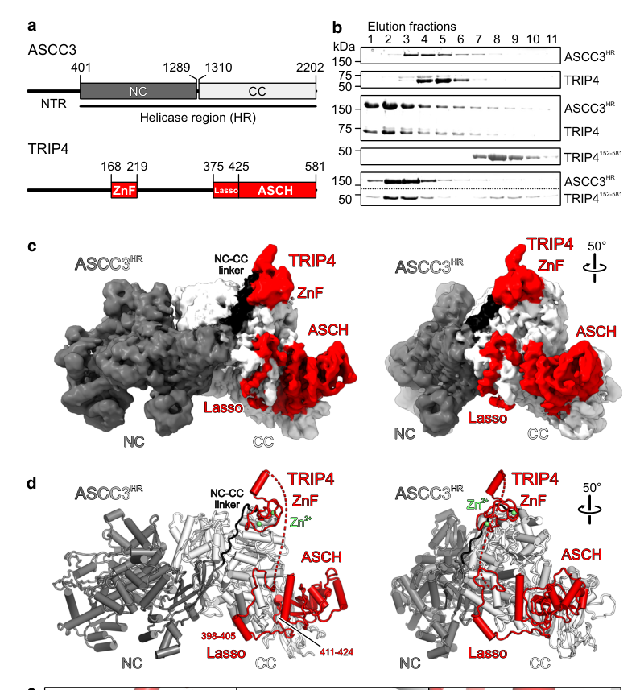

## Question

# Gene Research for Functional Annotation

## ⚠️ CRITICAL: Gene/Protein Identification Context

**BEFORE YOU BEGIN RESEARCH:** You MUST verify you are researching the CORRECT gene/protein. Gene symbols can be ambiguous, especially for less well-characterized genes from non-model organisms.

### Target Gene/Protein Identity (from UniProt):
- **UniProt Accession:** Q8N3C0
- **Protein Description:** RecName: Full=Activating signal cointegrator 1 complex subunit 3; EC=5.6.2.4 {ECO:0000269|PubMed:22055184}; AltName: Full=ASC-1 complex subunit p200 {ECO:0000303|PubMed:12077347}; Short=ASC1p200; AltName: Full=Helicase, ATP binding 1; AltName: Full=Trip4 complex subunit p200 {ECO:0000303|PubMed:12077347};
- **Gene Information:** Name=ASCC3; Synonyms=HELIC1, RQT2 {ECO:0000303|PubMed:32099016};
- **Organism (full):** Homo sapiens (Human).
- **Protein Family:** Belongs to the helicase family. .
- **Key Domains:** AAA+_ATPase. (IPR003593); ASCC3_N. (IPR058856); C2_domain_sf. (IPR035892); DEAD/DEAH_box_helicase_dom. (IPR011545); Hel308_SKI2-like. (IPR050474)

### MANDATORY VERIFICATION STEPS:

1. **Check if the gene symbol "ASCC3" matches the protein description above**
2. **Verify the organism is correct:** Homo sapiens (Human).
3. **Check if protein family/domains align with what you find in literature**
4. **If you find literature for a DIFFERENT gene with the same or similar symbol, STOP**

### If Gene Symbol is Ambiguous or You Cannot Find Relevant Literature:

**DO NOT PROCEED WITH RESEARCH ON A DIFFERENT GENE.** Instead:
- State clearly: "The gene symbol 'ASCC3' is ambiguous or literature is limited for this specific protein"
- Explain what you found (e.g., "Found extensive literature on a different gene with the same symbol in a different organism")
- Describe the protein based ONLY on the UniProt information provided above
- Suggest that the protein function can be inferred from domain/family information

### Research Target:

Please provide a comprehensive research report on the gene **ASCC3** (gene ID: ASCC3, UniProt: Q8N3C0) in human.

The research report should be a detailed narrative explaining the function, biological processes, and localization of the gene product. Citations should be given for all claims.

You should prioritize authoritative reviews and primary scientific literature when conducting research. You can supplement
this with annotations you find in gene/protein databases, but these can be outdated or inaccurate.

We are specifically interested in the primary function of the gene - for enzymes, what reaction is catalyzed, and what is the substrate specificity? For transporters, what is the substrate? For structural proteins or adapters, what is the broader structural role? For signaling molecules, what is the role in the pathway.

We are interested in where in or outside the cell the gene product carries out its function.

We are also interested in the signaling or biochemical pathways in which the gene functions. We are less interested in broad pleiotropic effects, except where these elucidate the precise role.

Include evidence where possible. We are interested in both experimental evidence as well as inference from structure, evolution, or bioinformatic analysis. Precise studies should be prioritized over high-throughput, where available.

## Output

Question: You are an expert researcher providing comprehensive, well-cited information.

Provide detailed information focusing on:
1. Key concepts and definitions with current understanding
2. Recent developments and latest research (prioritize 2023-2024 sources)
3. Current applications and real-world implementations
4. Expert opinions and analysis from authoritative sources
5. Relevant statistics and data from recent studies

Format as a comprehensive research report with proper citations. Include URLs and publication dates where available.
Always prioritize recent, authoritative sources and provide specific citations for all major claims.

# Gene Research for Functional Annotation

## ⚠️ CRITICAL: Gene/Protein Identification Context

**BEFORE YOU BEGIN RESEARCH:** You MUST verify you are researching the CORRECT gene/protein. Gene symbols can be ambiguous, especially for less well-characterized genes from non-model organisms.

### Target Gene/Protein Identity (from UniProt):
- **UniProt Accession:** Q8N3C0
- **Protein Description:** RecName: Full=Activating signal cointegrator 1 complex subunit 3; EC=5.6.2.4 {ECO:0000269|PubMed:22055184}; AltName: Full=ASC-1 complex subunit p200 {ECO:0000303|PubMed:12077347}; Short=ASC1p200; AltName: Full=Helicase, ATP binding 1; AltName: Full=Trip4 complex subunit p200 {ECO:0000303|PubMed:12077347};
- **Gene Information:** Name=ASCC3; Synonyms=HELIC1, RQT2 {ECO:0000303|PubMed:32099016};
- **Organism (full):** Homo sapiens (Human).
- **Protein Family:** Belongs to the helicase family. .
- **Key Domains:** AAA+_ATPase. (IPR003593); ASCC3_N. (IPR058856); C2_domain_sf. (IPR035892); DEAD/DEAH_box_helicase_dom. (IPR011545); Hel308_SKI2-like. (IPR050474)

### MANDATORY VERIFICATION STEPS:

1. **Check if the gene symbol "ASCC3" matches the protein description above**
2. **Verify the organism is correct:** Homo sapiens (Human).
3. **Check if protein family/domains align with what you find in literature**
4. **If you find literature for a DIFFERENT gene with the same or similar symbol, STOP**

### If Gene Symbol is Ambiguous or You Cannot Find Relevant Literature:

**DO NOT PROCEED WITH RESEARCH ON A DIFFERENT GENE.** Instead:
- State clearly: "The gene symbol 'ASCC3' is ambiguous or literature is limited for this specific protein"
- Explain what you found (e.g., "Found extensive literature on a different gene with the same symbol in a different organism")
- Describe the protein based ONLY on the UniProt information provided above
- Suggest that the protein function can be inferred from domain/family information

### Research Target:

Please provide a comprehensive research report on the gene **ASCC3** (gene ID: ASCC3, UniProt: Q8N3C0) in human.

The research report should be a detailed narrative explaining the function, biological processes, and localization of the gene product. Citations should be given for all claims.

You should prioritize authoritative reviews and primary scientific literature when conducting research. You can supplement
this with annotations you find in gene/protein databases, but these can be outdated or inaccurate.

We are specifically interested in the primary function of the gene - for enzymes, what reaction is catalyzed, and what is the substrate specificity? For transporters, what is the substrate? For structural proteins or adapters, what is the broader structural role? For signaling molecules, what is the role in the pathway.

We are interested in where in or outside the cell the gene product carries out its function.

We are also interested in the signaling or biochemical pathways in which the gene functions. We are less interested in broad pleiotropic effects, except where these elucidate the precise role.

Include evidence where possible. We are interested in both experimental evidence as well as inference from structure, evolution, or bioinformatic analysis. Precise studies should be prioritized over high-throughput, where available.

## Research report: Human **ASCC3** (UniProt **Q8N3C0**) — functional annotation and current understanding

### 0) Target verification (gene/protein identity)
The literature retrieved here consistently uses **ASCC3** to denote the **human** “Activating signal co-integrator 1 complex subunit 3”, a **Ski2-like** helicase/ATPase subunit within the **ASC-1/ASCC** complex, matching the provided UniProt entry (Q8N3C0) and distinguishing it from unrelated similarly named factors. ASCC is described as containing **ASCC1, ASCC2, ASCC3** and **TRIP4/ASC1**, with ASCC3 as the largest helicase subunit. (jia2020theinteractionof pages 1-2, kito2023theasc‐1complex pages 1-2)

### 1) Key concepts and definitions (current understanding)

#### 1.1 ASCC / ASC-1 complex and modularity
ASCC3 functions in a multi-protein assembly often called the **ASC-1 complex** or **ASCC**. In translation quality control contexts, ASCC is the mammalian counterpart of the yeast **RQT** (ribosome quality control trigger) complex and is recruited to ubiquitinated stalled ribosomes to catalyze splitting/disassembly. (juszkiewicz2020theasc1complex pages 1-3, miscicka2024ribosomalcollisionis pages 1-2)

In genome maintenance contexts, ASCC3 participates in an **ALKBH3–ASCC** dealkylation pathway, where ASCC3 helicase activity provides single-stranded nucleic-acid substrate for the dealkylase **ALKBH3** and other ASCC components regulate recruitment/assembly. (jia2020theinteractionof pages 1-2, soll2018rnaligaselikedomain pages 1-2)

A central unifying concept from recent structural work is that ASCC3 forms **process-specific submodules** by partnering with different factors; in particular, **TRIP4** can stimulate ASCC3 helicase activity and can direct ASCC3 toward distinct cellular processes compared with ALKBH3-associated repair. (jia2023extendeddnathreading pages 1-2, jia2023extendeddnathreading pages 8-9)

#### 1.2 ASCC3 as a Ski2-like tandem helicase (“dual-cassette”)
ASCC3 is a nucleic-acid-dependent NTPase/helicase with **two consecutive Ski2-like helicase cassettes** (often referred to as N-terminal cassette and C-terminal cassette). This dual-cassette architecture is central to its motor function in both DNA and RNA-associated processes. (jia2023extendeddnathreading pages 1-2, jia2023extendeddnathreading pages 8-9)

### 2) Primary molecular function: enzymatic activity, substrates, and mechanism

#### 2.1 Catalytic activity and directionality
ASCC3 is a **DNA translocase/helicase** with **3′→5′** directionality (as described in mechanistic studies of the ASCC3 system) and contains tandem Ski2-like NTPase/helicase cassettes. (jia2023extendeddnathreading pages 1-2)

Recent mechanistic analysis indicates that **both helicase cassettes are catalytically active ATPases/helicases**: inactivation of either cassette produces partial loss of overall helicase activity, supporting a “dual-engine” model rather than a single active cassette. (jia2023extendeddnathreading pages 8-9, jia2023extendeddnathreading pages 5-6)

#### 2.2 DNA threading mechanism through two helicase cassettes (2023 advance)
A major 2023 development was the cryo-EM and crosslinking/mass-spectrometry-based mechanism showing ASCC3 can **thread a DNA strand through both helicase cassettes** (an “extended threading” model). TRIP4 docks via a Zn-finger and positions an **ASCH** domain adjacent to the C-terminal helicase cassette, likely aiding substrate engagement and DNA exit. (jia2023extendeddnathreading pages 1-2, jia2023extendeddnathreading pages 8-9, jia2023extendeddnathreading pages 7-8)

Notably, TRIP4 enhances substrate engagement and helicase output without necessarily increasing ATPase rate, consistent with a coupling/engagement model rather than simple acceleration of hydrolysis. (jia2023extendeddnathreading pages 5-6, jia2023extendeddnathreading pages 6-6)

#### 2.3 DNA vs RNA substrates
Although ASCC3’s genome maintenance roles emphasize DNA, ASCC3 also has **RNA unwinding activity in vitro** (relevant to ribosome quality control), and TRIP4 can modulate RNA unwinding kinetics, albeit with lower activity than on DNA in reported assays. (jia2023extendeddnathreading pages 8-9, jia2023extendeddnathreading pages 6-6)

#### 2.4 Partner specificity: TRIP4 vs ALKBH3 are mutually exclusive
A key mechanistic regulatory principle is that **TRIP4 and ALKBH3 bind ASCC3 mutually exclusively**, providing a concrete mechanism for routing ASCC3 toward distinct processes (e.g., TRIP4-linked transcription/RQC functions versus ALKBH3-linked alkylation repair). (jia2023extendeddnathreading pages 1-2, jia2023extendeddnathreading pages 7-8, jia2023extendeddnathreading pages 2-3)

### 3) Biological roles and pathways

#### 3.1 Alkylation damage response / dealkylation repair (ALKBH3–ASCC axis)
In the alkylation damage response, ASCC3 is a core ASCC subunit functioning as a **DNA helicase** required for **ALKBH3-dependent dealkylation**, with ASCC3 proposed to generate **single-stranded substrate** needed for repair. (jia2020theinteractionof pages 1-2, soll2018rnaligaselikedomain pages 1-2)

**Localization and recruitment:** upon alkylation damage, **ASCC2 and ASCC3 form nuclear foci**; ASCC2 recognizes **non-proteasomal K63-linked ubiquitin** signals generated by the E3 ligase **RNF113A** and recruits ASCC3 and ALKBH3. (soll2018rnaligaselikedomain pages 1-2, brickner2019activationandregulation pages 139-144)

**Complex architecture in this pathway:** ASCC3 can function as a scaffold bridging ASCC1 and ASCC2 (loss of ASCC3 disrupts ASCC1–ASCC2 association), supporting its central organizational role beyond its motor activity. (soll2018rnaligaselikedomain pages 1-2)

#### 3.2 Ribosome-associated quality control (RQC): collided/stalled ribosome splitting
Foundational biochemical reconstitution in mammalian systems established that the ASC-1/ASCC complex containing ASCC3 **disassembles the leading ribosome in collided queues** in an **ATP-dependent** manner, producing 60S–nascent chain substrates for downstream RQC. (juszkiewicz2020theasc1complex pages 1-3)

**Upstream signal:** ASCC-mediated splitting depends on **ZNF598-mediated ubiquitination** of 40S ribosomal proteins at the mRNA entrance (e.g., uS10/eS10 in mammals), which triggers recruitment/activation of the splitting machinery. (miscicka2024ribosomalcollisionis pages 1-2, juszkiewicz2020theasc1complex pages 1-3)

**Recent mechanistic constraints (2024 advance):** in vitro reconstitution showed ASCC can dissociate multiple ribosomal states (polysomes, monosomes, even 48S initiation complexes) provided an overhanging mRNA region is available; a key quantitative requirement reported was **≥30–35 nt** of **3′ mRNA** downstream of the P site for efficient ASCC function. (miscicka2024ribosomalcollisionis pages 14-15)

#### 3.3 Translation initiation control by scanning ribosomes (2023 advance)
Beyond collision rescue, ASCC also associates with **scanning ribosomes**. Selective translation complex profiling approaches found ASCC3 localizes predominantly to **5′ UTRs**; ASCC3 knockdown impaired **43S preinitiation complex loading** and scanning dynamics, reducing translation efficiency for a subset of transcripts. (kito2023theasc‐1complex pages 1-2, kito2023theasc‐1complex pages 10-11)

A mechanistic interpretation proposed in this work is that ASCC3’s tandem cassette architecture (informed by RQT/ASCC models) could engage structured 5′ UTRs and modulate scanning or PIC loading for selected mRNAs. (kito2023theasc‐1complex pages 10-11)

### 4) Cellular localization and regulation

#### 4.1 Nuclear speckle/foci localization in alkylation response
ASCC3 participates in **damage-induced nuclear foci** during alkylation stress, with ASCC2-dependent recruitment via **K63-linked ubiquitin** signaling and RNF113A/UBC13 machinery. (soll2018rnaligaselikedomain pages 1-2, brickner2019activationandregulation pages 139-144)

#### 4.2 Translation machinery association
ASCC3 is detected on **eIF4A1-bound scanning ribosomes** and enriched in **5′ UTR** regions in profiling experiments, consistent with direct translation-initiation-related localization. (kito2023theasc‐1complex pages 1-2)

### 5) Human phenotypes and disease relevance

#### 5.1 Mendelian neurodevelopmental/neuromuscular syndrome (biallelic variants)
A 2024 clinical report describes **neuromuscular syndrome/developmental delay** associated with **biallelic ASCC3 variants** (MIM: 620700), analyzing 3 families and reviewing additional previously reported variants. Reported phenotypes include global developmental delay with intellectual disability, motor impairment, language retardation, reduced muscle tone/strength, and neonatal feeding difficulties/dysphagia in one proband. (li2024casereportsecond pages 1-2)

#### 5.2 Cancer: NSCLC immunosuppression and immunotherapy resistance (2023)
A 2023 study in *Journal for ImmunoTherapy of Cancer* reports ASCC3 is **upregulated in NSCLC**, including metastatic foci, and is associated with worse clinicopathological features and prognosis. Mechanistically, ASCC3 stabilized **STAT3** by recruiting **CAND1** and inhibiting STAT3 ubiquitination, impairing tumor cell **type I interferon** responses and fostering an immunosuppressive tumor microenvironment. (ao2023ascc3promotesthe pages 4-5, ao2023ascc3promotesthe pages 10-11)

**Quantitative/statistical highlights reported in the retrieved text:**
- Tumor immune infiltration analysis split tumors at **median ASCC3 expression cutoff 2.62** (TCGA analysis), with significant differences in immune populations between ASCC3-high and ASCC3-low tumors. (ao2023ascc3promotesthe pages 7-8)
- RNA-seq after ASCC3 knockdown identified **480** differentially affected genes (as summarized in the paper’s results text). (ao2023ascc3promotesthe pages 4-5)
- Functional assays report strong significance in places (e.g., ***p<0.001) for IFN-response phenotypes. (ao2023ascc3promotesthe pages 10-11)

### 6) Recent developments (prioritizing 2023–2024)

1. **Structural mechanism of the ASCC3 motor module (2023):** Cryo-EM/XL-MS define how ASCC3’s dual cassettes cooperate, and how TRIP4 stimulates the motor and routes function via mutually exclusive binding with ALKBH3. (jia2023extendeddnathreading pages 1-2, jia2023extendeddnathreading pages 8-9)
2. **Expanded translation function (2023):** Evidence that ASCC3 is present on scanning ribosomes and regulates translation initiation for a subset of structured 5′ UTR mRNAs. (kito2023theasc‐1complex pages 1-2, kito2023theasc‐1complex pages 10-11)
3. **RQC biochemical constraints (2024):** Reconstitution suggests collision is not strictly required; a key substrate constraint is ≥30–35 nt 3′ mRNA overhang, and multiple ribosomal states can be split after appropriate ubiquitination. (miscicka2024ribosomalcollisionis pages 14-15)
4. **Human genetics (2024):** Additional biallelic ASCC3 variant cases expand genotype–phenotype knowledge for neurodevelopmental/neuromuscular disease. (li2024casereportsecond pages 1-2)

### 7) Current applications and real-world implementations

#### 7.1 Biomarker and combination-therapy rationale in NSCLC
The NSCLC study explicitly positions ASCC3 as a **prognostic indicator** and suggests that ASCC3 inhibition could enhance **anti–PD-1** efficacy. In a cohort of **17 NSCLC patients**, higher ASCC3 expression was associated with progressive disease compared with SD/PR categories; preclinical models showed improved outcomes with ASCC3 knockdown combined with PD-1 blockade. (ao2023ascc3promotesthe pages 14-14, ao2023ascc3promotesthe pages 14-15)

#### 7.2 Translation/RQC pathway as a platform for mechanistic screens
The 2023–2024 mechanistic assays (Sel-TCP-seq/TCP-seq for scanning ribosomes; in vitro ribosome splitting reconstitutions with defined ubiquitin/mRNA requirements) provide concrete **experimental platforms** for interrogating ASCC3 function and could be leveraged in drug discovery or functional genomics to modulate proteostasis under stress. (kito2023theasc‐1complex pages 10-11, miscicka2024ribosomalcollisionis pages 14-15)

### 8) Expert interpretation and synthesis
ASCC3 is increasingly best understood as a **tunable dual-cassette helicase motor** whose biological outputs depend on **partner selection** and **substrate context**. Structural and biochemical data support a model in which ASCC3’s two Ski2-like cassettes can cooperate for extended substrate threading and force generation, with TRIP4 acting as an activity and substrate-engagement modulator, while ALKBH3-linked assemblies emphasize single-stranded substrate generation for dealkylation. (jia2023extendeddnathreading pages 8-9, soll2018rnaligaselikedomain pages 1-2)

A notable emerging theme is that ASCC3 sits at a crossroads between **genome maintenance** and **translation surveillance/control**, because the same core motor architecture can act on DNA (damage-associated contexts) or RNA/mRNP substrates (ribosome rescue and scanning control). (jia2023extendeddnathreading pages 8-9, kito2023theasc‐1complex pages 1-2)

### 9) Visual evidence (motor architecture)
Key cryo-EM figure regions and models illustrating ASCC3–TRIP4 architecture and DNA threading through the tandem helicase cassettes were retrieved from Jia et al. 2023. (jia2023extendeddnathreading media 4a9084d4, jia2023extendeddnathreading media 706dfc78)

### 10) Literature summary table (2023–2024 prioritized)
| Year | Reference (first author, journal) | Main ASCC3 function/claim | Evidence type | Key quantitative/detail | URL/DOI |
|---|---|---|---|---|---|
| 2024 | Miścicka, *Nucleic Acids Research* | ASCC disassembles stalled ribosomal complexes; ribosomal collision is not strictly required once ZNF598-dependent ubiquitination is in place, refining the ASCC3-mediated RQC model (miscicka2024ribosomalcollisionis pages 14-15, miscicka2024ribosomalcollisionis pages 8-9, miscicka2024ribosomalcollisionis pages 1-2) | In vitro reconstitution, ribosome splitting assays, toe-printing, ubiquitination biochemistry, mechanistic interpretation from cryo-EM-informed model | ASCC activity required an mRNA 3′ overhang of ≥30–35 nt downstream of the P site; K63R ubiquitin still allowed ~50% release of leading ribosomes in one assay context (miscicka2024ribosomalcollisionis pages 14-15, miscicka2024ribosomalcollisionis pages 8-9) | https://doi.org/10.1093/nar/gkae087 |
| 2024 | Li, *Frontiers in Genetics* | Biallelic human ASCC3 variants cause neurodevelopmental/neuromuscular syndrome with developmental delay and motor-language impairment, expanding the Mendelian disease spectrum (li2024casereportsecond pages 1-2) | Clinical case report, trio-WES, trio-CNV-seq, literature review | 3 new families; review of 11 previously reported variants; reported compound heterozygous variants included c.[489dup];[1897C>T], c.[2314C>T];[5002T>A], c.[5113G>T];[718delG] (li2024casereportsecond pages 1-2) | https://doi.org/10.3389/fgene.2024.1382275 |
| 2023 | Jia, *Nature Communications* | ASCC3 is a dual-engine Ski2-like helicase; TRIP4 stimulates helicase activity and helps route ASCC3 toward specific functions, with TRIP4 and ALKBH3 binding mutually exclusive (jia2023extendeddnathreading pages 1-2) | Cryo-EM, DNA–protein XL-MS, in vitro and cellular functional assays | Defined tandem N- and C-terminal Ski2-like helicase cassettes; showed TRIP4 positions an ASCH domain next to the C-terminal cassette and stimulates DNA threading/unwinding (jia2023extendeddnathreading pages 1-2) | https://doi.org/10.1038/s41467-023-37528-3 |
| 2023 | Kito, *The EMBO Journal* | ASCC3 associates with scanning ribosomes and promotes translation initiation/scanning on a subset of mRNAs, extending its role beyond collided-ribosome splitting (kito2023theasc‐1complex pages 10-11, kito2023theasc‐1complex pages 1-2) | Sel-TCP-MS, Sel-TCP-seq, TCP-seq, Ribo-seq, luciferase reporters | ASCC3 localized predominantly to 5′ UTRs; knockdown impaired 43S preinitiation complex loading and scanning dynamics for selected transcripts (kito2023theasc‐1complex pages 10-11, kito2023theasc‐1complex pages 1-2) | https://doi.org/10.15252/embj.2022112869 |
| 2023 | Ao, *Journal for ImmunoTherapy of Cancer* | In NSCLC, ASCC3 promotes tumor progression and immunosuppression by stabilizing STAT3 via CAND1 and dampening type I interferon responses; supports biomarker/combination-therapy relevance (ao2023ascc3promotesthe pages 10-11, ao2023ascc3promotesthe pages 1-1, ao2023ascc3promotesthe pages 4-5, ao2023ascc3promotesthe pages 5-7, ao2023ascc3promotesthe pages 3-4) | TCGA/GEO analyses, IHC, RNA-seq, Co-IP/MS, mouse models, flow cytometry | RNA-seq after ASCC3 knockdown identified 480 affected genes; TCGA immune analysis used ASCC3-high vs ASCC3-low split at median 2.62; experiments reported significance up to p<0.0001 (ao2023ascc3promotesthe pages 7-8, ao2023ascc3promotesthe pages 4-5, ao2023ascc3promotesthe pages 5-7) | https://doi.org/10.1136/jitc-2023-007766 |
| 2020 | Juszkiewicz, *Molecular Cell* | ASCC containing ASCC3 disassembles the leading ribosome in collided queues in an ATP-dependent manner, establishing ASCC3 as a mammalian RQC helicase (juszkiewicz2020theasc1complex pages 1-3) | Biochemical reconstitution in mammalian cell-free system | Showed ASCC-dependent splitting generates 60S–nascent chain complexes for downstream RQC and requires ZNF598-dependent 40S ubiquitination (juszkiewicz2020theasc1complex pages 1-3) | https://doi.org/10.1016/j.molcel.2020.06.006 |
| 2020 | Jia, *Nature Communications* | ASCC3 is the largest ASCC subunit, a dual-cassette Ski2-like helicase that provides ssDNA for ALKBH3-mediated alkylation damage repair; ASCC2–ASCC3 interfaces are altered by cancer mutations (jia2020theinteractionof pages 1-2) | Structural analysis, interaction mapping, biochemical affinity measurements, cancer-mutation analysis | Defined conserved ASCC2–ASCC3 interface and showed somatic cancer mutations reduce binding affinity; ASCC3 translocates 3′→5′ to support repair substrate generation (jia2020theinteractionof pages 1-2) | https://doi.org/10.1038/s41467-020-19221-x |
| 2018 | Soll, *Journal of Biological Chemistry* | ASCC3 is the DNA helicase/scaffold of the ASCC alkylation damage response, generating the single-stranded substrate required for ALKBH3-mediated dealkylation and coordinating ASCC assembly (soll2018rnaligaselikedomain pages 1-2) | Cell biology, co-IP, recombinant interaction assays, CRISPR/Cas9 knockout | ASCC3 and ASCC2 formed nuclear foci upon alkylation damage; ASCC1 knockout increased ASCC3 foci but many lacked ASCC2, indicating regulated complex assembly (soll2018rnaligaselikedomain pages 1-2) | https://doi.org/10.1074/jbc.RA117.000114 |

*Table: This table summarizes the most relevant ASCC3 papers identified in this run, prioritizing 2023-2024 while retaining foundational studies. It highlights ASCC3’s main validated functions in alkylation repair, ribosome quality control, translation initiation, and human disease or cancer relevance, with concise methodological and quantitative details.*

### References (URLs; publication dates)
The key retrieved sources include:
- Jia et al., *Nature Communications*, **Apr 2023**, https://doi.org/10.1038/s41467-023-37528-3 (jia2023extendeddnathreading pages 1-2)
- Miścicka et al., *Nucleic Acids Research*, **Feb 2024**, https://doi.org/10.1093/nar/gkae087 (miscicka2024ribosomalcollisionis pages 14-15)
- Kito et al., *The EMBO Journal*, **Apr 2023**, https://doi.org/10.15252/embj.2022112869 (kito2023theasc‐1complex pages 1-2)
- Ao et al., *Journal for ImmunoTherapy of Cancer*, **Dec 2023**, https://doi.org/10.1136/jitc-2023-007766 (ao2023ascc3promotesthe pages 1-1)
- Li et al., *Frontiers in Genetics*, **Sep 2024**, https://doi.org/10.3389/fgene.2024.1382275 (li2024casereportsecond pages 1-2)
- Juszkiewicz et al., *Molecular Cell*, **Aug 2020**, https://doi.org/10.1016/j.molcel.2020.06.006 (juszkiewicz2020theasc1complex pages 1-3)
- Jia et al., *Nature Communications*, **May 2020**, https://doi.org/10.1038/s41467-020-19221-x (jia2020theinteractionof pages 1-2)
- Soll et al., *Journal of Biological Chemistry*, **Aug 2018**, https://doi.org/10.1074/jbc.ra117.000114 (soll2018rnaligaselikedomain pages 1-2)

References

1. (jia2020theinteractionof pages 1-2): Junqiao Jia, Eva Absmeier, Nicole Holton, Agnieszka J. Pietrzyk-Brzezinska, Philipp Hackert, Katherine E. Bohnsack, Markus T. Bohnsack, and Markus C. Wahl. The interaction of dna repair factors ascc2 and ascc3 is affected by somatic cancer mutations. Nature Communications, May 2020. URL: https://doi.org/10.1038/s41467-020-19221-x, doi:10.1038/s41467-020-19221-x. This article has 29 citations and is from a highest quality peer-reviewed journal.

2. (kito2023theasc‐1complex pages 1-2): Yuki Kito, Akinobu Matsumoto, Kazuya Ichihara, Chisa Shiraishi, Ronghao Tang, Atsushi Hatano, Masaki Matsumoto, Peixun Han, Shintaro Iwasaki, and Keiichi I Nakayama. The asc‐1 complex promotes translation initiation by scanning ribosomes. The EMBO Journal, Apr 2023. URL: https://doi.org/10.15252/embj.2022112869, doi:10.15252/embj.2022112869. This article has 13 citations.

3. (juszkiewicz2020theasc1complex pages 1-3): Szymon Juszkiewicz, Shaun H. Speldewinde, Li Wan, Jesper Q. Svejstrup, and Ramanujan S. Hegde. The asc-1 complex disassembles collided ribosomes. Molecular Cell, 79:603-614.e8, Aug 2020. URL: https://doi.org/10.1016/j.molcel.2020.06.006, doi:10.1016/j.molcel.2020.06.006. This article has 234 citations and is from a highest quality peer-reviewed journal.

4. (miscicka2024ribosomalcollisionis pages 1-2): Anna Miścicka, Alexander G Bulakhov, Kazushige Kuroha, Alexandra Zinoviev, Christopher U T Hellen, and Tatyana V Pestova. Ribosomal collision is not a prerequisite for znf598-mediated ribosome ubiquitination and disassembly of ribosomal complexes by ascc. Nucleic Acids Research, 52:4627-4643, Feb 2024. URL: https://doi.org/10.1093/nar/gkae087, doi:10.1093/nar/gkae087. This article has 21 citations and is from a highest quality peer-reviewed journal.

5. (soll2018rnaligaselikedomain pages 1-2): Jennifer M. Soll, Joshua R. Brickner, Miranda C. Mudge, and Nima Mosammaparast. Rna ligase-like domain in activating signal cointegrator 1 complex subunit 1 (ascc1) regulates ascc complex function during alkylation damage. Journal of Biological Chemistry, 293:13524-13533, Aug 2018. URL: https://doi.org/10.1074/jbc.ra117.000114, doi:10.1074/jbc.ra117.000114. This article has 39 citations and is from a domain leading peer-reviewed journal.

6. (jia2023extendeddnathreading pages 1-2): Junqiao Jia, Tarek Hilal, Katherine E. Bohnsack, Aleksandar Chernev, Ning Tsao, Juliane Bethmann, Aruna Arumugam, Lane Parmely, Nicole Holton, Bernhard Loll, Nima Mosammaparast, Markus T. Bohnsack, Henning Urlaub, and Markus C. Wahl. Extended dna threading through a dual-engine motor module of the activating signal co-integrator 1 complex. Nature Communications, Apr 2023. URL: https://doi.org/10.1038/s41467-023-37528-3, doi:10.1038/s41467-023-37528-3. This article has 13 citations and is from a highest quality peer-reviewed journal.

7. (jia2023extendeddnathreading pages 8-9): Junqiao Jia, Tarek Hilal, Katherine E. Bohnsack, Aleksandar Chernev, Ning Tsao, Juliane Bethmann, Aruna Arumugam, Lane Parmely, Nicole Holton, Bernhard Loll, Nima Mosammaparast, Markus T. Bohnsack, Henning Urlaub, and Markus C. Wahl. Extended dna threading through a dual-engine motor module of the activating signal co-integrator 1 complex. Nature Communications, Apr 2023. URL: https://doi.org/10.1038/s41467-023-37528-3, doi:10.1038/s41467-023-37528-3. This article has 13 citations and is from a highest quality peer-reviewed journal.

8. (jia2023extendeddnathreading pages 5-6): Junqiao Jia, Tarek Hilal, Katherine E. Bohnsack, Aleksandar Chernev, Ning Tsao, Juliane Bethmann, Aruna Arumugam, Lane Parmely, Nicole Holton, Bernhard Loll, Nima Mosammaparast, Markus T. Bohnsack, Henning Urlaub, and Markus C. Wahl. Extended dna threading through a dual-engine motor module of the activating signal co-integrator 1 complex. Nature Communications, Apr 2023. URL: https://doi.org/10.1038/s41467-023-37528-3, doi:10.1038/s41467-023-37528-3. This article has 13 citations and is from a highest quality peer-reviewed journal.

9. (jia2023extendeddnathreading pages 7-8): Junqiao Jia, Tarek Hilal, Katherine E. Bohnsack, Aleksandar Chernev, Ning Tsao, Juliane Bethmann, Aruna Arumugam, Lane Parmely, Nicole Holton, Bernhard Loll, Nima Mosammaparast, Markus T. Bohnsack, Henning Urlaub, and Markus C. Wahl. Extended dna threading through a dual-engine motor module of the activating signal co-integrator 1 complex. Nature Communications, Apr 2023. URL: https://doi.org/10.1038/s41467-023-37528-3, doi:10.1038/s41467-023-37528-3. This article has 13 citations and is from a highest quality peer-reviewed journal.

10. (jia2023extendeddnathreading pages 6-6): Junqiao Jia, Tarek Hilal, Katherine E. Bohnsack, Aleksandar Chernev, Ning Tsao, Juliane Bethmann, Aruna Arumugam, Lane Parmely, Nicole Holton, Bernhard Loll, Nima Mosammaparast, Markus T. Bohnsack, Henning Urlaub, and Markus C. Wahl. Extended dna threading through a dual-engine motor module of the activating signal co-integrator 1 complex. Nature Communications, Apr 2023. URL: https://doi.org/10.1038/s41467-023-37528-3, doi:10.1038/s41467-023-37528-3. This article has 13 citations and is from a highest quality peer-reviewed journal.

11. (jia2023extendeddnathreading pages 2-3): Junqiao Jia, Tarek Hilal, Katherine E. Bohnsack, Aleksandar Chernev, Ning Tsao, Juliane Bethmann, Aruna Arumugam, Lane Parmely, Nicole Holton, Bernhard Loll, Nima Mosammaparast, Markus T. Bohnsack, Henning Urlaub, and Markus C. Wahl. Extended dna threading through a dual-engine motor module of the activating signal co-integrator 1 complex. Nature Communications, Apr 2023. URL: https://doi.org/10.1038/s41467-023-37528-3, doi:10.1038/s41467-023-37528-3. This article has 13 citations and is from a highest quality peer-reviewed journal.

12. (brickner2019activationandregulation pages 139-144): Joshua R. Brickner. Activation and regulation of the alkbh3-ascc alkylation repair pathway. ArXiv, 2019. URL: https://doi.org/10.7936/gavm-wj49, doi:10.7936/gavm-wj49. This article has 0 citations.

13. (miscicka2024ribosomalcollisionis pages 14-15): Anna Miścicka, Alexander G Bulakhov, Kazushige Kuroha, Alexandra Zinoviev, Christopher U T Hellen, and Tatyana V Pestova. Ribosomal collision is not a prerequisite for znf598-mediated ribosome ubiquitination and disassembly of ribosomal complexes by ascc. Nucleic Acids Research, 52:4627-4643, Feb 2024. URL: https://doi.org/10.1093/nar/gkae087, doi:10.1093/nar/gkae087. This article has 21 citations and is from a highest quality peer-reviewed journal.

14. (kito2023theasc‐1complex pages 10-11): Yuki Kito, Akinobu Matsumoto, Kazuya Ichihara, Chisa Shiraishi, Ronghao Tang, Atsushi Hatano, Masaki Matsumoto, Peixun Han, Shintaro Iwasaki, and Keiichi I Nakayama. The asc‐1 complex promotes translation initiation by scanning ribosomes. The EMBO Journal, Apr 2023. URL: https://doi.org/10.15252/embj.2022112869, doi:10.15252/embj.2022112869. This article has 13 citations.

15. (li2024casereportsecond pages 1-2): Wang Li, Zhongliang Li, Junhui Fu, Kaili Xu, Daoqi Mei, Xiaona Wang, Taisong Li, and Xilong Du. Case report: second report of neuromuscular syndrome caused by biallelic variants in ascc3. Frontiers in Genetics, Sep 2024. URL: https://doi.org/10.3389/fgene.2024.1382275, doi:10.3389/fgene.2024.1382275. This article has 1 citations and is from a peer-reviewed journal.

16. (ao2023ascc3promotesthe pages 4-5): Yong-Qiang Ao, Jian Gao, Chun Jin, Shuai Wang, Li-Cheng Zhang, Jie Deng, Zong-wei Chen, Hai-Kun Wang, Jia-Hao Jiang, and Jian-Yong Ding. Ascc3 promotes the immunosuppression and progression of non-small cell lung cancer by impairing the type i interferon response via cand1-mediated ubiquitination inhibition of stat3. Journal for ImmunoTherapy of Cancer, 11:e007766, Dec 2023. URL: https://doi.org/10.1136/jitc-2023-007766, doi:10.1136/jitc-2023-007766. This article has 28 citations and is from a domain leading peer-reviewed journal.

17. (ao2023ascc3promotesthe pages 10-11): Yong-Qiang Ao, Jian Gao, Chun Jin, Shuai Wang, Li-Cheng Zhang, Jie Deng, Zong-wei Chen, Hai-Kun Wang, Jia-Hao Jiang, and Jian-Yong Ding. Ascc3 promotes the immunosuppression and progression of non-small cell lung cancer by impairing the type i interferon response via cand1-mediated ubiquitination inhibition of stat3. Journal for ImmunoTherapy of Cancer, 11:e007766, Dec 2023. URL: https://doi.org/10.1136/jitc-2023-007766, doi:10.1136/jitc-2023-007766. This article has 28 citations and is from a domain leading peer-reviewed journal.

18. (ao2023ascc3promotesthe pages 7-8): Yong-Qiang Ao, Jian Gao, Chun Jin, Shuai Wang, Li-Cheng Zhang, Jie Deng, Zong-wei Chen, Hai-Kun Wang, Jia-Hao Jiang, and Jian-Yong Ding. Ascc3 promotes the immunosuppression and progression of non-small cell lung cancer by impairing the type i interferon response via cand1-mediated ubiquitination inhibition of stat3. Journal for ImmunoTherapy of Cancer, 11:e007766, Dec 2023. URL: https://doi.org/10.1136/jitc-2023-007766, doi:10.1136/jitc-2023-007766. This article has 28 citations and is from a domain leading peer-reviewed journal.

19. (ao2023ascc3promotesthe pages 14-14): Yong-Qiang Ao, Jian Gao, Chun Jin, Shuai Wang, Li-Cheng Zhang, Jie Deng, Zong-wei Chen, Hai-Kun Wang, Jia-Hao Jiang, and Jian-Yong Ding. Ascc3 promotes the immunosuppression and progression of non-small cell lung cancer by impairing the type i interferon response via cand1-mediated ubiquitination inhibition of stat3. Journal for ImmunoTherapy of Cancer, 11:e007766, Dec 2023. URL: https://doi.org/10.1136/jitc-2023-007766, doi:10.1136/jitc-2023-007766. This article has 28 citations and is from a domain leading peer-reviewed journal.

20. (ao2023ascc3promotesthe pages 14-15): Yong-Qiang Ao, Jian Gao, Chun Jin, Shuai Wang, Li-Cheng Zhang, Jie Deng, Zong-wei Chen, Hai-Kun Wang, Jia-Hao Jiang, and Jian-Yong Ding. Ascc3 promotes the immunosuppression and progression of non-small cell lung cancer by impairing the type i interferon response via cand1-mediated ubiquitination inhibition of stat3. Journal for ImmunoTherapy of Cancer, 11:e007766, Dec 2023. URL: https://doi.org/10.1136/jitc-2023-007766, doi:10.1136/jitc-2023-007766. This article has 28 citations and is from a domain leading peer-reviewed journal.

21. (jia2023extendeddnathreading media 4a9084d4): Junqiao Jia, Tarek Hilal, Katherine E. Bohnsack, Aleksandar Chernev, Ning Tsao, Juliane Bethmann, Aruna Arumugam, Lane Parmely, Nicole Holton, Bernhard Loll, Nima Mosammaparast, Markus T. Bohnsack, Henning Urlaub, and Markus C. Wahl. Extended dna threading through a dual-engine motor module of the activating signal co-integrator 1 complex. Nature Communications, Apr 2023. URL: https://doi.org/10.1038/s41467-023-37528-3, doi:10.1038/s41467-023-37528-3. This article has 13 citations and is from a highest quality peer-reviewed journal.

22. (jia2023extendeddnathreading media 706dfc78): Junqiao Jia, Tarek Hilal, Katherine E. Bohnsack, Aleksandar Chernev, Ning Tsao, Juliane Bethmann, Aruna Arumugam, Lane Parmely, Nicole Holton, Bernhard Loll, Nima Mosammaparast, Markus T. Bohnsack, Henning Urlaub, and Markus C. Wahl. Extended dna threading through a dual-engine motor module of the activating signal co-integrator 1 complex. Nature Communications, Apr 2023. URL: https://doi.org/10.1038/s41467-023-37528-3, doi:10.1038/s41467-023-37528-3. This article has 13 citations and is from a highest quality peer-reviewed journal.

23. (miscicka2024ribosomalcollisionis pages 8-9): Anna Miścicka, Alexander G Bulakhov, Kazushige Kuroha, Alexandra Zinoviev, Christopher U T Hellen, and Tatyana V Pestova. Ribosomal collision is not a prerequisite for znf598-mediated ribosome ubiquitination and disassembly of ribosomal complexes by ascc. Nucleic Acids Research, 52:4627-4643, Feb 2024. URL: https://doi.org/10.1093/nar/gkae087, doi:10.1093/nar/gkae087. This article has 21 citations and is from a highest quality peer-reviewed journal.

24. (ao2023ascc3promotesthe pages 1-1): Yong-Qiang Ao, Jian Gao, Chun Jin, Shuai Wang, Li-Cheng Zhang, Jie Deng, Zong-wei Chen, Hai-Kun Wang, Jia-Hao Jiang, and Jian-Yong Ding. Ascc3 promotes the immunosuppression and progression of non-small cell lung cancer by impairing the type i interferon response via cand1-mediated ubiquitination inhibition of stat3. Journal for ImmunoTherapy of Cancer, 11:e007766, Dec 2023. URL: https://doi.org/10.1136/jitc-2023-007766, doi:10.1136/jitc-2023-007766. This article has 28 citations and is from a domain leading peer-reviewed journal.

25. (ao2023ascc3promotesthe pages 5-7): Yong-Qiang Ao, Jian Gao, Chun Jin, Shuai Wang, Li-Cheng Zhang, Jie Deng, Zong-wei Chen, Hai-Kun Wang, Jia-Hao Jiang, and Jian-Yong Ding. Ascc3 promotes the immunosuppression and progression of non-small cell lung cancer by impairing the type i interferon response via cand1-mediated ubiquitination inhibition of stat3. Journal for ImmunoTherapy of Cancer, 11:e007766, Dec 2023. URL: https://doi.org/10.1136/jitc-2023-007766, doi:10.1136/jitc-2023-007766. This article has 28 citations and is from a domain leading peer-reviewed journal.

26. (ao2023ascc3promotesthe pages 3-4): Yong-Qiang Ao, Jian Gao, Chun Jin, Shuai Wang, Li-Cheng Zhang, Jie Deng, Zong-wei Chen, Hai-Kun Wang, Jia-Hao Jiang, and Jian-Yong Ding. Ascc3 promotes the immunosuppression and progression of non-small cell lung cancer by impairing the type i interferon response via cand1-mediated ubiquitination inhibition of stat3. Journal for ImmunoTherapy of Cancer, 11:e007766, Dec 2023. URL: https://doi.org/10.1136/jitc-2023-007766, doi:10.1136/jitc-2023-007766. This article has 28 citations and is from a domain leading peer-reviewed journal.

## Artifacts

- [Edison artifact artifact-00](ASCC3-deep-research-falcon_artifacts/artifact-00.md)

## Citations

1. jia2023extendeddnathreading pages 1-2
2. soll2018rnaligaselikedomain pages 1-2
3. miscicka2024ribosomalcollisionis pages 14-15
4. li2024casereportsecond pages 1-2
5. jia2020theinteractionof pages 1-2
6. miscicka2024ribosomalcollisionis pages 1-2
7. jia2023extendeddnathreading pages 8-9
8. jia2023extendeddnathreading pages 5-6
9. jia2023extendeddnathreading pages 7-8
10. jia2023extendeddnathreading pages 6-6
11. jia2023extendeddnathreading pages 2-3
12. brickner2019activationandregulation pages 139-144
13. miscicka2024ribosomalcollisionis pages 8-9
14. 489dup
15. 1897C>T
16. 2314C>T
17. 5002T>A
18. 5113G>T
19. 718delG
20. https://doi.org/10.1093/nar/gkae087
21. https://doi.org/10.3389/fgene.2024.1382275
22. https://doi.org/10.1038/s41467-023-37528-3
23. https://doi.org/10.15252/embj.2022112869
24. https://doi.org/10.1136/jitc-2023-007766
25. https://doi.org/10.1016/j.molcel.2020.06.006
26. https://doi.org/10.1038/s41467-020-19221-x
27. https://doi.org/10.1074/jbc.RA117.000114
28. https://doi.org/10.1074/jbc.ra117.000114
29. https://doi.org/10.1038/s41467-020-19221-x,
30. https://doi.org/10.15252/embj.2022112869,
31. https://doi.org/10.1016/j.molcel.2020.06.006,
32. https://doi.org/10.1093/nar/gkae087,
33. https://doi.org/10.1074/jbc.ra117.000114,
34. https://doi.org/10.1038/s41467-023-37528-3,
35. https://doi.org/10.7936/gavm-wj49,
36. https://doi.org/10.3389/fgene.2024.1382275,
37. https://doi.org/10.1136/jitc-2023-007766,