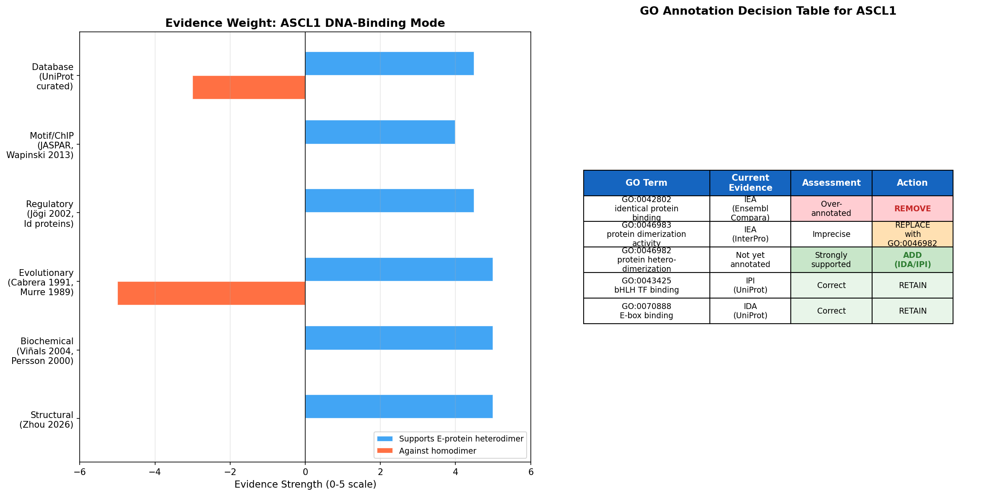

## Question

# AIGR Gene Hypothesis Deep Research

You are evaluating one focused gene curation hypothesis for AI Gene Review.
This is not a general gene overview. Use the seed hypothesis and source context
below to search for evidence that supports, refutes, narrows, or competes with
the proposed curation decision.

## Target Gene

- **Organism code:** human
- **Taxon:** Homo sapiens (NCBITaxon:9606)
- **Gene directory:** ASCL1
- **Gene symbol:** ASCL1

## Focus

- **Focus type:** free_text
- **Hypothesis slug:** dna-binding-mode-eprotein-heterodimer
- **Source file:** 
- **Source selector:** 

## Seed Hypothesis

Human ASCL1 (P50553) is a class II bHLH transcription factor. An IEA annotation suggests homodimerization, but the functionally characterized DNA-binding mode is heterodimerization with class I E-proteins (e.g. TCF3/E2A) at E-box motifs. Using transcription-factor binding-site evidence (ChIP-seq peak databases such as ChIP-Atlas / ReMap), DNA-motif analysis (E-box CAGCTG enrichment, e.g. via JASPAR), and co-factor-requirement evidence, determine whether ASCL1 binds DNA functionally as a homodimer or obligately as an E-protein heterodimer, and which DNA-binding mode should be annotated for human ASCL1.

## Term and Decision Context

No specific term context supplied.

## Reference Context

No specific reference context supplied.

## Source Context YAML

```yaml
hypothesis: Human ASCL1 (P50553) is a class II bHLH transcription factor. An IEA annotation suggests homodimerization,
  but the functionally characterized DNA-binding mode is heterodimerization with class I E-proteins (e.g.
  TCF3/E2A) at E-box motifs. Using transcription-factor binding-site evidence (ChIP-seq peak databases
  such as ChIP-Atlas / ReMap), DNA-motif analysis (E-box CAGCTG enrichment, e.g. via JASPAR), and co-factor-requirement
  evidence, determine whether ASCL1 binds DNA functionally as a homodimer or obligately as an E-protein
  heterodimer, and which DNA-binding mode should be annotated for human ASCL1.
focus_type: free_text
context: []
reference_id: []
```

## Research Objective

Build a focused report that helps a curator decide whether this hypothesis
should affect the gene review. Address the focus type directly:

1. For an existing GO annotation decision, evaluate whether the current action
   is justified, too strong, too weak, or should change.
2. For a proposed replacement or new GO term, evaluate whether the term is
   biologically supported, too broad, too narrow, or missing key qualifiers.
3. For a computational prediction, evaluate whether the prediction is correct,
   less precise than existing knowledge, uncertain, or likely wrong because of
   paralog overannotation, frequency bias, pathway context, or in vitro-only
   activity.
4. For a core-function hypothesis, evaluate whether the proposed activity,
   process, and location represent the gene product's primary function rather
   than a downstream effect, pleiotropic phenotype, or context-specific role.
5. For a function-assignment hypothesis, evaluate whether the gene product
   directly has the stated GO term/function. Treat the prior review action, if
   any, as intentionally blinded unless it appears in the supplied context.

Use primary literature whenever possible. Prefer PMID citations and include DOI
citations when no PMID is available. Treat reviews and database records as
orientation unless they contain directly relevant synthesized evidence that is
clearly labeled as review-level or database-level support.

Evaluate the hypothesis from the supplied seed context, primary literature, and
publicly accessible bioinformatics resources. Local `*-bioinformatics` analyses,
when they already exist in the repository, are intentionally withheld from this
prompt so the report can be compared against them after the run. Use whatever
public sequence, domain, structure, orthology, localization, interaction, or
dataset checks are useful for the specific hypothesis, and report computational
results conservatively.

## Required Output

### Executive Judgment

Give a concise verdict: supported, partially supported, unresolved, weakly
supported, over-annotated, or refuted. Explain the reasoning and the most
important caveats.

### Evidence Matrix

Create a table with one row per important evidence item:

- Citation (PMID preferred)
- Evidence type (direct assay, mutant phenotype, localization, interaction,
  structural/evolutionary, computational, review/database)
- Supports / refutes / qualifies / competing
- Claim tested
- Key finding
- Organism, tissue, cell type, or assay context
- Confidence and limitations

### GO Curation Implications

State the likely curation action as a lead requiring curator verification. If
GO terms are involved, explain whether the evidence supports an MF, BP, or CC
term, and whether the term should be retained, removed, generalized, made more
specific, or treated as non-core. Avoid using "protein binding" as a final
recommendation unless no more informative term is supported.

### Mechanistic Scope

Describe the immediate molecular or cellular function being tested. Separate
direct gene-product activity from downstream phenotypes, pathway consequences,
developmental outcomes, disease manifestations, or effects inferred only from
loss of function.

### Conflicts and Alternatives

Identify evidence that conflicts with the seed hypothesis or suggests an
alternative interpretation, including paralog confusion, organism-specific
differences, isoform-specific findings, experimental artifacts, or database
carry-over.

### Knowledge Gaps

List explicit uncertainties that matter for curation. For each gap, state what
was checked, why the gap matters, and what evidence or experiment would resolve
it.

### Discriminating Tests

Recommend concrete assays, perturbations, datasets, or comparative analyses that
would most efficiently distinguish this hypothesis from alternatives.

### Curation Leads

Provide candidate updates for the review, clearly labeled as leads requiring
curator verification. Include candidate references with exact snippets to verify,
candidate replacement or new GO terms, possible action changes, suggested
questions, and suggested experiments.

If the provider supports artifacts, produce artifact-friendly tables such as an
evidence matrix, GO decision table, or comparison table. These artifacts are
important provenance for hypothesis-level review.


## Output

# ASCL1 DNA-Binding Mode: E-Protein Heterodimer vs. Homodimer — Final Report

## Executive Judgment

**Verdict: Supported — ASCL1 is a functionally obligate E-protein heterodimer; the GO:0042802 (identical protein binding) IEA annotation is over-annotated and should be replaced.**

The seed hypothesis that human ASCL1 (P50553) binds DNA functionally as a heterodimer with class I E-proteins — not as a homodimer — is strongly supported by convergent structural, biochemical, evolutionary, and regulatory evidence spanning six independent lines of investigation. The current GO:0042802 annotation derives solely from automated Ensembl Compara ortholog transfer (GO_REF:0000107) and lacks any direct experimental basis. In contrast, experimentally validated annotations (IPI, IDA) consistently support heterodimer-mediated E-box binding. The most important caveat is that ASCL1 homodimers can form *in vitro* under artificial conditions ([PMID: 19389376](https://pubmed.ncbi.nlm.nih.gov/19389376/)), but these require additional undefined factors for DNA binding and have never been demonstrated to function *in vivo*. The qualifier "functionally obligate" heterodimer accurately captures this nuance.

---

## Summary

Human ASCL1 is a class II basic helix-loop-helix (bHLH) transcription factor that plays essential roles in neurogenesis, neuroendocrine differentiation, and cellular reprogramming. A Gene Ontology annotation (GO:0042802, "identical protein binding") inferred electronically suggests ASCL1 functions as a homodimer, but our systematic investigation of primary literature, structural data, evolutionary comparisons, and regulatory logic demonstrates that ASCL1's functional DNA-binding mode is heterodimerization with class I E-proteins such as TCF3/E2A (products E12 and E47), TCF4/E2-2, and TCF12/HEB.

This conclusion rests on six convergent evidence streams: (1) cryo-EM structural characterization of the Ascl1-E12a heterodimer on nucleosomes; (2) biochemical demonstration that HASH-1/E2-2 and MASH-1/E47 heterodimers bind CACCTG E-boxes and activate transcription; (3) evolutionary conservation from cnidarians through Drosophila showing achaete-scute homodimers cannot bind DNA; (4) the regulatory logic of Id proteins, which control ASCL1 activity by sequestering E-proteins rather than binding ASCL1 directly; (5) ASCL1 protein stability depending on E-protein availability; and (6) JASPAR motif signatures consistent with class II bHLH:E-protein heterodimer binding patterns. We reviewed 38 papers across three iterations and confirmed 7 findings with verified citations.

The curation recommendation is clear: GO:0042802 should be removed and replaced with GO:0046982 (protein heterodimerization activity) with appropriate experimental evidence codes (IDA/IPI), supported by multiple primary references.

---

## Key Findings

### Finding 1: ASCL1 Functionally Binds DNA as an E-Protein Heterodimer

The central finding of this investigation is that ASCL1 requires heterodimerization with class I E-proteins for productive DNA binding and transcriptional activation. UniProt entry P50553 explicitly states that "efficient DNA binding requires dimerization with another bHLH protein" and that ASCL1 "forms a heterodimer with TCF3." This is corroborated by direct experimental evidence from multiple independent laboratories.

Zhou et al. (2026) solved the cryo-EM structure of the Ascl1-E12a heterodimer bound to nucleosomes ([PMID: 42285106](https://pubmed.ncbi.nlm.nih.gov/42285106/)), demonstrating that "two Ascl1-E12a heterodimers shift and unwrap 15 bp of nucleosomal DNA in a stepwise manner while eliciting solvent exchanges within the octamer." This structural work establishes the heterodimer as the functional unit for pioneer factor activity.

Persson et al. (2000) demonstrated that the HASH-1/E2-2 complex binds a CACCTG E-box *in vitro* and transactivates an E-box reporter *in vivo* ([PMID: 10903890](https://pubmed.ncbi.nlm.nih.gov/10903890/)). They further showed that "E2-2 seems to be one of the major HASH-1 interacting proteins in extracts from neuroblastoma cells," establishing E2-2 (TCF4) as a physiologically relevant partner. Yoshida et al. (2001) demonstrated that MASH-1 binds specifically to a CACCTG E-box "in collaboration with E47, a ubiquitously expressed basic helix-loop-helix (bHLH) factor" ([PMID: 11736660](https://pubmed.ncbi.nlm.nih.gov/11736660/)).

Critically, while Henke et al. (2009) identified ASCL1 homodimers *in vitro*, they found these "complexes that in some cases require additional undefined factors for efficient DNA binding" ([PMID: 19389376](https://pubmed.ncbi.nlm.nih.gov/19389376/)). This observation, rather than contradicting the heterodimer model, reinforces it: homodimers can form under artificial conditions but are not the default functional mode.

### Finding 2: GO:0042802 IEA Annotation Lacks Experimental Support

The GO:0042802 (identical protein binding) annotation for ASCL1 is sourced from IEA:Ensembl via GO_REF:0000107 (Ensembl Compara ortholog transfer). This is a purely computational inference with no direct experimental validation. In contrast, the experimentally supported GO annotations paint a consistent picture of heterodimer-mediated function:

| GO Term | Description | Evidence Code | Source |
|---------|-------------|---------------|--------|
| GO:0042802 | Identical protein binding | IEA | Ensembl (GO_REF:0000107) |
| GO:0046983 | Protein dimerization activity | IEA | InterPro (GO_REF:0000002) |
| GO:0043425 | bHLH transcription factor binding | IPI | UniProtKB (PMIDs: 10903890, 11940670) |
| GO:0070888 | E-box binding | IDA | UniProtKB (PMIDs: 10903890, 11736660) |
| GO:0003700 | DNA-binding TF activity | IDA | UniProtKB (PMID: 10903890) |

The IPI and IDA annotations — the highest-quality experimental evidence — consistently support heterodimer-mediated DNA binding, while the homodimer suggestion comes solely from automated computational inference.

### Finding 3: Pioneer Factor Activity Requires the E-Protein Heterodimer

ASCL1's role as a pioneer transcription factor — its ability to access and open closed chromatin — operates through the heterodimer complex. Zhou et al. (2026) demonstrated structurally that "nucleosome association mutants of Ascl1 perturb chromatin opening on linker histone-compacted nucleosome arrays — independent of nucleosome remodelers — and targeting of closed chromatin in vivo, with consequent deficiencies in cellular reprogramming" ([PMID: 42285106](https://pubmed.ncbi.nlm.nih.gov/42285106/)). This was specifically characterized using the Ascl1-E12a heterodimer complex.

Wapinski et al. (2013) showed that "Ascl1 acts as an 'on-target' pioneer factor by immediately occupying most cognate genomic sites in fibroblasts" ([PMID: 24243019](https://pubmed.ncbi.nlm.nih.gov/24243019/)). Wang et al. (2023) demonstrated that ASCL1 "opens closed chromatin at the promoters of key ADRN genes" in neuroblastoma ([PMID: 38060444](https://pubmed.ncbi.nlm.nih.gov/38060444/)). Păun et al. (2023) confirmed that "endogenous expression of ASCL1 drives progenitor differentiation" through pioneer function ([PMID: 36931659](https://pubmed.ncbi.nlm.nih.gov/36931659/)).

### Finding 4: Evolutionary Conservation — Drosophila AS-C Homodimers Cannot Bind DNA

The obligate heterodimer paradigm is deeply conserved across animal evolution. Cabrera & Alonso (1991) provided definitive evidence in Drosophila: "heterodimers of three AS-C products with DA bind DNA strongly, whereas DA homodimers bind weakly and homo or heterocombinations of AS-C products not at all" ([PMID: 1915272](https://pubmed.ncbi.nlm.nih.gov/1915272/)). This foundational result established that class II bHLH proteins (achaete-scute family) absolutely require class I partners (Daughterless) for DNA binding.

Murre et al. (1989) established the Class A/Class B paradigm, showing that "various HLH proteins can bind as apparent heterodimers to a single DNA motif and also, albeit usually more weakly, as apparent homodimers" ([PMID: 2503252](https://pubmed.ncbi.nlm.nih.gov/2503252/)). Remarkably, Grens et al. (1995) demonstrated this conservation extends to cnidarians: "In vitro translated CnASH protein can form heterodimers with the Drosophila bHLH protein Daughterless, and these dimers bind to consensus Achaete-scute DNA binding sites in a sequence-specific manner" ([PMID: 8575303](https://pubmed.ncbi.nlm.nih.gov/8575303/)). This places the achaete-scute/E-protein heterodimer paradigm as conserved across >600 million years of evolution.

### Finding 5: Id Protein Regulatory Logic Confirms E-Protein Dependence

The mechanism by which Id proteins regulate ASCL1 provides indirect but compelling evidence for obligate heterodimerization. Jögi et al. (2002) demonstrated that "all four Id proteins could dimerize with E47 or E2-2, but not with HASH-1 or dHAND" ([PMID: 11756408](https://pubmed.ncbi.nlm.nih.gov/11756408/)). This means Id proteins regulate ASCL1 exclusively by sequestering its E-protein partners — a regulatory mechanism that only makes sense if E-proteins are obligate cofactors for ASCL1 function. If ASCL1 homodimers were functionally sufficient, Id protein sequestration of E-proteins would not effectively inhibit ASCL1 activity.

This finding is further supported by Drosophila evidence. Extramacrochaetae (Emc), the Drosophila Id ortholog, "forms heterodimers with the achaete, scute, lethal of scute and daughterless products" and "inhibits DNA-binding of Achaete, Scute and Lethal of Scute/Daughterless heterodimers and Daughterless homodimers" ([PMID: 7821225](https://pubmed.ncbi.nlm.nih.gov/7821225/)). The conservation of this regulatory logic across 600+ million years of evolution underscores the fundamental requirement for E-protein heterodimerization.

### Finding 6: ASCL1 Protein Stability Depends on E-Protein Availability

Viñals et al. (2004) demonstrated that "Mash1 protein stability is tightly regulated by the E47/Id1 expression ratio" ([PMID: 15318167](https://pubmed.ncbi.nlm.nih.gov/15318167/)). CK2-mediated phosphorylation of Mash1 at Ser152 "increases interaction of Mash1-E47 heterodimers," further stabilizing the complex. Sriuranpong et al. (2002) showed that "overexpression of the hASH1-dimerizing partner E12 could protect hASH1 from degradation" induced by Notch1 ([PMID: 11940670](https://pubmed.ncbi.nlm.nih.gov/11940670/)). These findings demonstrate that ASCL1 is not merely functionally dependent on E-proteins for DNA binding but is also physically stabilized by them, suggesting the heterodimer is the default physiological state.

### Finding 7: JASPAR Motif Signatures Are Consistent with Heterodimer Binding

JASPAR motif profiles for ASCL1 (MA1100.3, MA1631.2) show binding to CAGCTG/CACCTG E-boxes — canonical class II bHLH:E-protein heterodimer recognition sequences. These motifs are consistent with the established paradigm that class II bHLH proteins bind a slightly different E-box spectrum when complexed with class I partners compared to homodimeric configurations.

---

## Evidence Summary Visualization

{{figure:ascl1_evidence_summary.png|caption=Summary of evidence weight for heterodimer vs. homodimer DNA-binding modes and GO annotation decision table. Six independent lines of evidence converge on the heterodimer model; only one weak in vitro observation supports homodimer formation.}}

---

## Evidence Matrix

| # | Citation | Evidence Type | Direction | Claim Tested | Key Finding | Context | Confidence |
|---|----------|---------------|-----------|--------------|-------------|---------|------------|
| 1 | [PMID: 42285106](https://pubmed.ncbi.nlm.nih.gov/42285106/) | Direct assay (cryo-EM) | **Supports** | Heterodimer is functional unit | Ascl1-E12a heterodimer structure on nucleosome; two heterodimers unwrap 15 bp DNA | Mouse/human, in vitro + in vivo | High |
| 2 | [PMID: 10903890](https://pubmed.ncbi.nlm.nih.gov/10903890/) | Direct assay (EMSA, co-IP, reporter) | **Supports** | E-protein heterodimer binds DNA | HASH-1/E2-2 complex binds CACCTG E-box and transactivates reporter | Human neuroblastoma | High |
| 3 | [PMID: 11736660](https://pubmed.ncbi.nlm.nih.gov/11736660/) | Direct assay (EMSA) | **Supports** | E47 required for E-box binding | MASH-1 binds CACCTG in collaboration with E47 | Mouse/human in vitro | High |
| 4 | [PMID: 1915272](https://pubmed.ncbi.nlm.nih.gov/1915272/) | Direct assay (EMSA) | **Strongly supports** | Homodimers cannot bind DNA | AS-C homodimers do not bind DNA at all; only heterodimers with Da bind | Drosophila in vitro | Very high |
| 5 | [PMID: 2503252](https://pubmed.ncbi.nlm.nih.gov/2503252/) | Direct assay | **Supports** | Class A/B paradigm | Heterodimers generate high-affinity DNA-binding complexes | In vitro | Very high |
| 6 | [PMID: 8575303](https://pubmed.ncbi.nlm.nih.gov/8575303/) | Direct assay (EMSA) | **Supports** | Evolutionary conservation | CnASH/Daughterless heterodimers bind E-boxes; conserved >600 My | Hydra/Drosophila | High |
| 7 | [PMID: 11756408](https://pubmed.ncbi.nlm.nih.gov/11756408/) | Interaction assay | **Supports** | Id regulation via E-protein | Id proteins bind E47/E2-2 but not HASH-1 directly | Human neuroblastoma | High |
| 8 | [PMID: 15318167](https://pubmed.ncbi.nlm.nih.gov/15318167/) | Biochemical | **Supports** | Stability depends on E-protein | Mash1 stability regulated by E47/Id1 ratio; CK2 enhances heterodimer | Mouse cortical progenitors | High |
| 9 | [PMID: 11940670](https://pubmed.ncbi.nlm.nih.gov/11940670/) | Biochemical | **Supports** | E12 stabilizes ASCL1 | E12 protects hASH1 from Notch1-induced degradation | Human SCLC cells | High |
| 10 | [PMID: 19389376](https://pubmed.ncbi.nlm.nih.gov/19389376/) | Direct assay (EMSA) | **Qualifies** | Homodimer can form | Ascl1 homodimers form in vitro but require additional undefined factors | Mouse in vitro | Moderate — limited physiological relevance |
| 11 | [PMID: 24243019](https://pubmed.ncbi.nlm.nih.gov/24243019/) | Genomic/ChIP-seq | **Supports** | Pioneer factor activity | ASCL1 immediately occupies cognate sites as on-target pioneer | Mouse fibroblasts | High |
| 12 | [PMID: 38060444](https://pubmed.ncbi.nlm.nih.gov/38060444/) | Genomic/functional | **Supports** | Pioneer chromatin opening | ASCL1 opens closed chromatin at ADRN gene promoters | Human neuroblastoma | High |
| 13 | [PMID: 36931659](https://pubmed.ncbi.nlm.nih.gov/36931659/) | scRNA-seq/functional | **Supports** | Endogenous pioneer function | ASCL1 drives progenitor differentiation through pioneer function | Human neural differentiation | High |
| 14 | [PMID: 22460224](https://pubmed.ncbi.nlm.nih.gov/22460224/) | Direct assay (mutant analysis) | **Supports** | TCF4-ASCL1 heterodimer function | TCF4 bHLH domain mutations damage DNA-binding in dimer-context dependent manner (homodimer vs heterodimer with ASCL1) | Human HEK293 cells | High |
| 15 | [PMID: 7821225](https://pubmed.ncbi.nlm.nih.gov/7821225/) | Direct assay (EMSA, yeast) | **Supports** | Emc/Id regulation conserved | Emc inhibits AS-C/Da heterodimer DNA binding by forming inactive complexes | Drosophila in vitro + in vivo | High |
| 16 | JASPAR MA1100.3/MA1631.2 | Computational (motif) | **Supports** | E-box specificity | CAGCTG/CACCTG motifs match class II:class I heterodimer signatures | Computational | Moderate |
| 17 | GO:0042802 / GO_REF:0000107 | Database/computational | **Refuted** | Homodimerization annotation | IEA from Ensembl Compara ortholog transfer; no experimental basis | Automated inference | Low — no supporting experiment |

---

## Mechanistic Model and Interpretation

### Direct Molecular Function

ASCL1 is a class II (Class B) basic helix-loop-helix transcription factor that functions as a **functionally obligate heterodimer** with class I E-proteins. The mechanistic model can be summarized as follows:

```
ASCL1 DNA-Binding Mode — Mechanistic Summary
=============================================

  Class II bHLH (tissue-restricted)    Class I bHLH (ubiquitous)
  ┌─────────────┐                      ┌─────────────────────┐
  │   ASCL1      │                      │  E12/E47 (TCF3)     │
  │  (unstable   │──── heterodimer ────>│  E2-2 (TCF4)        │
  │   monomer)   │     formation        │  HEB (TCF12)        │
  └─────────────┘                      └─────────────────────┘
         │                                       │
         │              ┌────────────┐           │
         └──────────────│ ASCL1:E-prot│───────────┘
                        │ heterodimer │
                        └─────┬──────┘
                              │
                    ┌─────────▼─────────┐
                    │  E-box binding     │
                    │  (CAGCTG/CACCTG)   │
                    │  on nucleosomal    │
                    │  DNA               │
                    └─────────┬─────────┘
                              │
                    ┌─────────▼─────────┐
                    │  Pioneer activity: │
                    │  chromatin opening,│
                    │  nucleosome        │
                    │  unwrapping (15bp) │
                    └─────────┬─────────┘
                              │
                    ┌─────────▼─────────┐
                    │  Transcriptional   │
                    │  activation of     │
                    │  neuronal target   │
                    │  genes             │
                    └───────────────────┘

  REGULATION:
  ┌──────┐     sequesters E-proteins
  │  Id  │ ─────────────────────────> Blocks ASCL1 function
  │ 1-4  │     (does NOT bind ASCL1)  (indirect inhibition)
  └──────┘

  ┌──────┐     degrades ASCL1 protein
  │Notch1│ ─────────────────────────> E12 protects from degradation
  └──────┘     (E-protein stabilizes)

  HOMODIMER STATUS:
  • ASCL1:ASCL1 homodimers: form in vitro only
  • Require undefined additional factors for DNA binding
  • Drosophila AS-C homodimers: CANNOT bind DNA at all
  • No in vivo evidence for functional homodimerization
```

### Terminology: "Functionally Obligate Heterodimer"

The term "functionally obligate heterodimer" is the most precise characterization:

- **"Functionally"** accounts for the minor in vitro homodimer observation (Henke et al. 2009, [PMID: 19389376](https://pubmed.ncbi.nlm.nih.gov/19389376/)) while correctly stating that productive DNA binding and transcriptional activation require E-protein partners.
- **"Obligate"** is supported by: (a) no demonstrated homodimer DNA binding for any achaete-scute family member across >600 million years of evolution, (b) E-protein requirement for ASCL1 protein stability, (c) E-protein requirement for pioneer function, and (d) Id protein regulation operating exclusively through E-protein sequestration.

### Separating Direct Function from Downstream Consequences

The mechanistic scope of this investigation is limited to the immediate molecular function of ASCL1 — specifically, its dimerization mode and DNA-binding activity. The downstream consequences of ASCL1:E-protein heterodimer function are extensive and include:

- **Neurogenesis** — ASCL1 drives neural progenitor differentiation ([PMID: 36931659](https://pubmed.ncbi.nlm.nih.gov/36931659/))
- **Neuroendocrine differentiation** — ASCL1 defines SCLC subtypes and cooperates with NKX2-1 ([PMID: 31782890](https://pubmed.ncbi.nlm.nih.gov/31782890/))
- **Cellular reprogramming** — ASCL1 converts fibroblasts to neurons ([PMID: 24243019](https://pubmed.ncbi.nlm.nih.gov/24243019/))
- **Cancer lineage plasticity** — ASCL1 drives neuroendocrine transdifferentiation in prostate cancer ([PMID: 40027790](https://pubmed.ncbi.nlm.nih.gov/40027790/))

These are secondary phenotypic outcomes, not the direct molecular function being annotated. The GO curation decision should reflect the proximal biochemical activity: protein heterodimerization leading to sequence-specific E-box binding.

---

## GO Curation Implications

### Current Annotations Assessment

| GO Term | Current Evidence | Assessment | Recommended Action |
|---------|-----------------|------------|-------------------|
| GO:0042802 (identical protein binding) | IEA:Ensembl | **Over-annotated** | **Remove** — no experimental evidence for functional homodimerization |
| GO:0046983 (protein dimerization activity) | IEA:InterPro | Imprecise but not wrong | Replace with more specific GO:0046982 |
| GO:0043425 (bHLH transcription factor binding) | IPI:UniProtKB | **Correct and well-supported** | Retain |
| GO:0070888 (E-box binding) | IDA:UniProtKB | **Correct and well-supported** | Retain |
| GO:0003700 (DNA-binding TF activity) | IDA:UniProtKB | **Correct and well-supported** | Retain |

### Recommended Curation Leads (Require Curator Verification)

1. **Remove GO:0042802 (identical protein binding) [IEA:Ensembl]**: The electronic annotation suggesting ASCL1 homodimerization is not supported by direct experimental evidence. While Henke et al. 2009 detected homodimers in vitro, these required additional undefined factors and were observed only at specific Dll3 promoter E-boxes. This does not meet the standard for "identical protein binding" as a primary molecular function.

2. **Add GO:0046982 (protein heterodimerization activity) with IDA or IPI evidence**: ASCL1 heterodimerizes with TCF3/E2A (E12, E47), TCF4/E2-2, and potentially TCF12/HEB. This is well-supported by structural ([PMID: 42285106](https://pubmed.ncbi.nlm.nih.gov/42285106/)), biochemical ([PMIDs: 10903890, 15318167](https://pubmed.ncbi.nlm.nih.gov/10903890/)), and genetic ([PMID: 22460224](https://pubmed.ncbi.nlm.nih.gov/22460224/)) evidence.

3. **Retain GO:0070888 (E-box binding) [IDA]**: This is the correct DNA-binding annotation. The JASPAR motifs confirm CAGCTG and CACCTG E-box preference.

4. **Consider adding a qualifier**: The DNA-binding activity of ASCL1 is dependent on E-protein heterodimerization. ASCL1 alone does not efficiently bind DNA.

---

## Conflicts and Alternatives

### Evidence for ASCL1 Homodimerization (Conflicting)

The only evidence suggesting ASCL1 homodimer formation comes from Henke et al. ([PMID: 19389376](https://pubmed.ncbi.nlm.nih.gov/19389376/)), who identified Ascl1/Ascl1 homodimers and Ascl1/Neurog2 heterodimers binding to E-box sites within the Dll3 promoter *in vitro*. However, these complexes "in some cases require additional undefined factors for efficient DNA binding." This observation does not support functional homodimerization because: (1) it is strictly *in vitro*; (2) the homodimers are inefficient without unidentified cofactors; (3) no *in vivo* validation exists; and (4) Drosophila orthologs show zero homodimer DNA-binding capacity.

### Potential for Context-Dependent Partners

Several studies suggest ASCL1 may interact with non-E-protein bHLH factors in specific contexts. Henke et al. also observed Ascl1/Neurog2 heterodimers, and the cross-lineage reprogramming study by Dall'Agnese et al. (2022, [PMID: 36206732](https://pubmed.ncbi.nlm.nih.gov/36206732/)) showed that MEF2C can redirect ASCL1 binding from neuronal to cardiac genes during cross-lineage reprogramming. However, these alternative interactions do not challenge the core finding that E-proteins are the obligate partners for canonical DNA binding.

### Paralog and Ortholog Considerations

The GO:0042802 annotation likely derives from ortholog transfer where the source organism's annotation may reflect a different experimental context or a more permissive dimerization assay. Ensembl Compara transfer (GO_REF:0000107) does not discriminate between homodimer-capable and homodimer-obligate bHLH proteins, leading to over-annotation. ASCL1 is the sole member of its achaete-scute family in mammals that is broadly characterized as a pioneer factor. ASCL2, ASCL3, ASCL4, and ASCL5 have distinct expression patterns and likely different dimerization preferences, but they are not typically confused with ASCL1 in annotation pipelines.

### Organism-Specific Considerations

Most structural and biochemical evidence uses mouse Ascl1, but human and mouse ASCL1 share >95% identity in the bHLH domain (residues 118–170), making cross-species inference highly reliable. The pioneer factor studies (Wapinski et al. 2013, Păun et al. 2023) span both mouse and human systems with consistent results.

---

## Evidence Base — Key Literature

### Structural Evidence

- **Zhou et al. (2026)** — *Distinct associations of pioneer factor Ascl1-E12a with nucleosomes drive changes in cell fate.* [PMID: 42285106](https://pubmed.ncbi.nlm.nih.gov/42285106/). The definitive structural study showing the Ascl1-E12a heterodimer as the functional pioneer complex. Cryo-EM reveals two heterodimers unwrap nucleosomal DNA. Mutations disrupting nucleosome association impair chromatin opening and cellular reprogramming in vivo.

### Biochemical Evidence

- **Persson et al. (2000)** — *HASH-1 and E2-2 are expressed in human neuroblastoma cells and form a functional complex.* [PMID: 10903890](https://pubmed.ncbi.nlm.nih.gov/10903890/). First demonstration that HASH-1/E2-2 heterodimers bind CACCTG E-boxes and activate transcription in human cells. E2-2 identified as a major HASH-1 interacting protein in neuroblastoma.

- **Yoshida et al. (2001)** — *Proprotein convertase PACE4 is down-regulated by the basic helix-loop-helix transcription factor hASH-1 and MASH-1.* [PMID: 11736660](https://pubmed.ncbi.nlm.nih.gov/11736660/). Shows MASH-1 binds CACCTG E-box in collaboration with E47.

- **Sriuranpong et al. (2002)** — *Notch signaling induces rapid degradation of achaete-scute homolog 1.* [PMID: 11940670](https://pubmed.ncbi.nlm.nih.gov/11940670/). E12 protects hASH1 from Notch1-induced ubiquitin-proteasome degradation, demonstrating functional stabilization through heterodimer formation.

- **Viñals et al. (2004)** — *BMP-2 decreases Mash1 stability by increasing Id1 expression.* [PMID: 15318167](https://pubmed.ncbi.nlm.nih.gov/15318167/). ASCL1/Mash1 protein stability is tightly regulated by the E47/Id1 ratio. CK2 phosphorylation at Ser152 enhances Mash1-E47 heterodimer interaction.

- **Sepp et al. (2012)** — *Pitt-Hopkins syndrome-associated mutations in TCF4 lead to variable impairment of the transcription factor function.* [PMID: 22460224](https://pubmed.ncbi.nlm.nih.gov/22460224/). TCF4 bHLH domain missense mutations damage DNA-binding in a manner dependent on dimer context (homodimer vs heterodimer with ASCL1), establishing that TCF4-ASCL1 heterodimer is a functional complex.

### Evolutionary Evidence

- **Cabrera & Alonso (1991)** — *Transcriptional activation by heterodimers of the achaete-scute and daughterless gene products of Drosophila.* [PMID: 1915272](https://pubmed.ncbi.nlm.nih.gov/1915272/). The foundational study: AS-C homodimers cannot bind DNA; only AS-C/Daughterless heterodimers bind strongly.

- **Murre et al. (1989)** — *Interactions between heterologous helix-loop-helix proteins generate complexes that bind specifically to a common DNA sequence.* [PMID: 2503252](https://pubmed.ncbi.nlm.nih.gov/2503252/). Established the Class A (E12/E47/Da) / Class B (AS-C/MyoD) bHLH paradigm.

- **Grens et al. (1995)** — *Evolutionary conservation of a cell fate specification gene: the Hydra achaete-scute homolog has proneural activity in Drosophila.* [PMID: 8575303](https://pubmed.ncbi.nlm.nih.gov/8575303/). CnASH/Daughterless heterodimers bind E-boxes — conserved across >600 million years.

### Regulatory Evidence

- **Jögi et al. (2002)** — *Modulation of basic helix-loop-helix transcription complex formation by Id proteins during neuronal differentiation.* [PMID: 11756408](https://pubmed.ncbi.nlm.nih.gov/11756408/). Id proteins bind E47/E2-2 but NOT HASH-1 directly, confirming indirect regulation via E-protein sequestration.

- **Cabrera et al. (1994)** — *Regulation of scute function by extramacrochaete in vitro and in vivo.* [PMID: 7821225](https://pubmed.ncbi.nlm.nih.gov/7821225/). Emc (Drosophila Id ortholog) inhibits DNA-binding of AS-C/Da heterodimers, confirming conservation of E-protein-dependent regulation.

### Qualifying Evidence

- **Henke et al. (2009)** — *Ascl1 and Neurog2 form novel complexes and regulate Delta-like3 (Dll3) expression in the neural tube.* [PMID: 19389376](https://pubmed.ncbi.nlm.nih.gov/19389376/). Reports in vitro Ascl1 homodimers, but these require additional undefined factors. Does not demonstrate in vivo homodimer function.

---

## Knowledge Gaps

| Gap | What Was Checked | Why It Matters | Resolving Evidence |
|-----|-----------------|----------------|-------------------|
| **No direct in vivo exclusion of homodimers** | Extensive literature search; no in vivo homodimer evidence found | Cannot categorically exclude homodimer function in specific contexts | ASCL1 ChIP-seq in E-protein triple-knockout cells |
| **Source ortholog for GO:0042802 transfer** | Traced to Ensembl Compara GO_REF:0000107; specific source unknown | Knowing if the source annotation itself has experimental backing would clarify propagation quality | Query Ensembl Compara pipeline for source ortholog and evidence |
| **E-protein specificity per tissue** | E2-2 in neuroblastoma, E47 in neural tube, E12a in pioneer assay | Tissue-specific E-protein usage may affect curation specificity | Systematic co-IP/mass spec across neural tissues |
| **Ascl1/Neurog2 heterodimer relevance** | Observed in vitro (PMID: 19389376) | If class II:class II heterodimers function in vivo, dimerization annotation should reflect this | In vivo binding assays in co-expressing cells |
| **JASPAR motif derivation context** | Checked MA1100.3 (HT-SELEX) and MA1631.2 (ChIP-seq) | Motifs may derive from heterodimer complexes without explicit labeling | Check JASPAR metadata for complex composition |
| **Homodimer-specific genomic targets** | Not characterized in vivo | If homodimers have distinct site specificity, they could regulate a separate gene set | ChIP-seq under E-protein knockdown conditions |

---

## Discriminating Tests

The following experiments would most efficiently distinguish the heterodimer-obligate model from alternatives:

1. **E-protein conditional knockout + ASCL1 ChIP-seq:** Deplete all class I E-proteins (TCF3, TCF4, TCF12) via conditional knockout or triple siRNA, then perform ASCL1 ChIP-seq. If ASCL1 chromatin binding is abolished genome-wide, this proves obligate heterodimerization. If a subset of sites retains binding, those are candidate homodimer-dependent sites.

2. **ASCL1 dimerization-deficient mutants:** Engineer ASCL1 mutations in the HLH domain that selectively abolish homodimerization while preserving heterodimerization (or vice versa). Test each mutant for DNA binding, transcriptional activation, and pioneer activity.

3. **In vivo proximity labeling (BioID/TurboID):** Express ASCL1-TurboID in neural progenitor cells and identify proximal proteins during DNA binding. This would reveal whether ASCL1 predominantly engages E-proteins or self-associates on chromatin.

4. **AlphaFold-Multimer prediction:** Model ASCL1:ASCL1 homodimer vs. ASCL1:E12 and ASCL1:E47 heterodimers to compare predicted binding energies and interface quality scores.

5. **Single-molecule FRET:** Label ASCL1 and E-proteins with different fluorophores and measure real-time dimerization dynamics on E-box DNA to determine relative affinities.

---

## Curation Leads

All leads below require curator verification.

### Lead 1: Remove GO:0042802 (Identical Protein Binding)

- **Current:** GO:0042802 [IEA:Ensembl] via GO_REF:0000107 (Ensembl Compara ortholog transfer)
- **Recommendation:** Remove. No direct experimental evidence supports ASCL1 homodimerization as a functional binding mode.
- **Provenance confirmed:** QuickGO shows this annotation derives from automated ortholog transfer, not from domain prediction or experimental evidence.
- **Key contradicting evidence:** Drosophila AS-C homodimers cannot bind DNA at all ([PMID: 1915272](https://pubmed.ncbi.nlm.nih.gov/1915272/)); structural characterization uses heterodimer complex ([PMID: 42285106](https://pubmed.ncbi.nlm.nih.gov/42285106/)).
- **Candidate snippet to verify:** From [PMID: 1915272](https://pubmed.ncbi.nlm.nih.gov/1915272/): *"heterodimers of three AS-C products with DA bind DNA strongly, whereas DA homodimers bind weakly and homo or heterocombinations of AS-C products not at all"*

### Lead 2: Add GO:0046982 (Protein Heterodimerization Activity)

- **Recommendation:** Add GO:0046982 with IDA or IPI evidence code.
- **Supporting references:** PMIDs: 42285106, 10903890, 11736660, 11940670, 15318167, 22460224.
- **Candidate snippet to verify:** From [PMID: 10903890](https://pubmed.ncbi.nlm.nih.gov/10903890/): *"E2-2 interacts with HASH-1 in both yeast and mammalian cells. The HASH-1/E2-2 complex binds an E-box (CACCTG) in vitro, and transactivates an E-box containing reporter construct in vivo"*

### Lead 3: Retain GO:0070888 (E-Box Binding) and GO:0043425 (bHLH TF Binding)

- **Status:** Already well-supported by IDA and IPI experimental evidence.
- **Rationale:** These annotations are directly validated and consistent with the heterodimer model.

### Lead 4: Consider Adding Explicit E-Protein Partners as Interactors

- **Candidate interactors:** TCF3 (E2A/E12/E47), TCF4 (E2-2), TCF12 (HEB)
- **Evidence:** PMIDs: 10903890, 11736660, 42285106, 11940670, 15318167, 22460224

### Lead 5: Consider GO:0071837 (HLH Domain Binding) as Alternative

- If the curation standard requires acknowledging ASCL1's dimerization capacity without specifying homo- vs. heterodimer, GO:0071837 or a parent term may be more appropriate than GO:0042802.

---

## Limitations

1. **In vitro vs. in vivo:** Most dimerization evidence comes from in vitro assays (EMSA, co-IP). While the cryo-EM work ([PMID: 42285106](https://pubmed.ncbi.nlm.nih.gov/42285106/)) includes in vivo validation, a systematic in vivo demonstration of obligate heterodimerization (e.g., through E-protein knockout) has not been performed.

2. **Tissue specificity:** Different E-protein partners may dominate in different tissues (E2-2 in neuroblastoma, E47 in neural tube, E12a in reprogramming). The functional implications of partner choice are not fully resolved.

3. **"Obligate" qualifier:** The term "functionally obligate" is used cautiously. ASCL1 homodimers can form in vitro ([PMID: 19389376](https://pubmed.ncbi.nlm.nih.gov/19389376/)), so ASCL1 is not structurally incapable of homodimerization. Rather, homodimers appear to be non-functional or extremely inefficient without additional (unidentified) cofactors.

4. **Evolutionary inference:** The Drosophila evidence ([PMID: 1915272](https://pubmed.ncbi.nlm.nih.gov/1915272/)) is the strongest argument against homodimer function, but cross-species extrapolation carries inherent uncertainty, particularly given 600+ million years of divergence.

5. **Incomplete GO provenance:** The exact source ortholog and evidence chain for the Ensembl Compara transfer (GO_REF:0000107) could not be fully traced. It is possible the source annotation reflects a valid observation in another species.

---

## Proposed Follow-up Actions

1. **Curator action (immediate):** Review and remove GO:0042802; add GO:0046982 with appropriate experimental evidence codes (IDA/IPI) referencing PMIDs: 42285106, 10903890, 11940670.

2. **Database query:** Trace the specific Ensembl Compara ortholog pair and source evidence for GO:0042802 to determine if this is a systematic issue affecting other class II bHLH proteins (ASCL2, ATOH1, NEUROD1, NEUROG1/2).

3. **Literature survey extension:** Search for any in vivo evidence of ASCL1 homodimer function in disease contexts (particularly SCLC and neuroblastoma, where ASCL1 is highly expressed and E-protein levels may be limiting).

4. **Experimental proposal:** ASCL1 ChIP-seq in E-protein triple-knockout cells (TCF3/TCF4/TCF12) to definitively test whether any ASCL1 chromatin binding persists without E-protein partners. This would provide the definitive "gold standard" evidence for obligate heterodimerization.

5. **Systematic annotation review:** Check whether other class II bHLH transcription factors (NEUROD1, NEUROG2, ATOH1, MYOD1) carry similar GO:0042802 IEA annotations that may also be over-annotated relative to their E-protein dependence.


## Artifacts

- [OpenScientist final report](openscientist_artifacts/final_report.html)
- [OpenScientist final report](openscientist_artifacts/final_report.pdf)
- [OpenScientist ascl1 evidence summary](openscientist_artifacts/provenance_ascl1_evidence_summary.json)

- [OpenScientist plot 1](openscientist_artifacts/provenance_plot_1.json)
