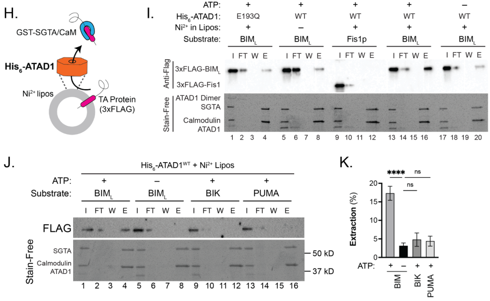

## Question

# Gene Research for Functional Annotation

## ⚠️ CRITICAL: Gene/Protein Identification Context

**BEFORE YOU BEGIN RESEARCH:** You MUST verify you are researching the CORRECT gene/protein. Gene symbols can be ambiguous, especially for less well-characterized genes from non-model organisms.

### Target Gene/Protein Identity (from UniProt):
- **UniProt Accession:** Q8NBU5
- **Protein Description:** RecName: Full=Outer mitochondrial transmembrane helix translocase {ECO:0000305}; EC=7.4.2.- {ECO:0000305|PubMed:24843043}; AltName: Full=ATPase family AAA domain-containing protein 1 {ECO:0000305}; Short=hATAD1 {ECO:0000303|PubMed:24843043}; AltName: Full=Thorase {ECO:0000250|UniProtKB:Q9D5T0};
- **Gene Information:** Name=ATAD1 {ECO:0000303|PubMed:24843043, ECO:0000312|HGNC:HGNC:25903}; ORFNames=FNP001 {ECO:0000303|Ref.1};
- **Organism (full):** Homo sapiens (Human).
- **Protein Family:** Belongs to the AAA ATPase family. MSP1 subfamily.
- **Key Domains:** AAA+_ATPase. (IPR003593); AAA_lid_3. (IPR041569); ATPase_AAA_core. (IPR003959); ATPase_AAA_CS. (IPR003960); Mito_OM_Translocase_MSP1. (IPR051701)

### MANDATORY VERIFICATION STEPS:

1. **Check if the gene symbol "ATAD1" matches the protein description above**
2. **Verify the organism is correct:** Homo sapiens (Human).
3. **Check if protein family/domains align with what you find in literature**
4. **If you find literature for a DIFFERENT gene with the same or similar symbol, STOP**

### If Gene Symbol is Ambiguous or You Cannot Find Relevant Literature:

**DO NOT PROCEED WITH RESEARCH ON A DIFFERENT GENE.** Instead:
- State clearly: "The gene symbol 'ATAD1' is ambiguous or literature is limited for this specific protein"
- Explain what you found (e.g., "Found extensive literature on a different gene with the same symbol in a different organism")
- Describe the protein based ONLY on the UniProt information provided above
- Suggest that the protein function can be inferred from domain/family information

### Research Target:

Please provide a comprehensive research report on the gene **ATAD1** (gene ID: ATAD1, UniProt: Q8NBU5) in human.

The research report should be a detailed narrative explaining the function, biological processes, and localization of the gene product. Citations should be given for all claims.

You should prioritize authoritative reviews and primary scientific literature when conducting research. You can supplement
this with annotations you find in gene/protein databases, but these can be outdated or inaccurate.

We are specifically interested in the primary function of the gene - for enzymes, what reaction is catalyzed, and what is the substrate specificity? For transporters, what is the substrate? For structural proteins or adapters, what is the broader structural role? For signaling molecules, what is the role in the pathway.

We are interested in where in or outside the cell the gene product carries out its function.

We are also interested in the signaling or biochemical pathways in which the gene functions. We are less interested in broad pleiotropic effects, except where these elucidate the precise role.

Include evidence where possible. We are interested in both experimental evidence as well as inference from structure, evolution, or bioinformatic analysis. Precise studies should be prioritized over high-throughput, where available.

## Output

Question: You are an expert researcher providing comprehensive, well-cited information.

Provide detailed information focusing on:
1. Key concepts and definitions with current understanding
2. Recent developments and latest research (prioritize 2023-2024 sources)
3. Current applications and real-world implementations
4. Expert opinions and analysis from authoritative sources
5. Relevant statistics and data from recent studies

Format as a comprehensive research report with proper citations. Include URLs and publication dates where available.
Always prioritize recent, authoritative sources and provide specific citations for all major claims.

# Gene Research for Functional Annotation

## ⚠️ CRITICAL: Gene/Protein Identification Context

**BEFORE YOU BEGIN RESEARCH:** You MUST verify you are researching the CORRECT gene/protein. Gene symbols can be ambiguous, especially for less well-characterized genes from non-model organisms.

### Target Gene/Protein Identity (from UniProt):
- **UniProt Accession:** Q8NBU5
- **Protein Description:** RecName: Full=Outer mitochondrial transmembrane helix translocase {ECO:0000305}; EC=7.4.2.- {ECO:0000305|PubMed:24843043}; AltName: Full=ATPase family AAA domain-containing protein 1 {ECO:0000305}; Short=hATAD1 {ECO:0000303|PubMed:24843043}; AltName: Full=Thorase {ECO:0000250|UniProtKB:Q9D5T0};
- **Gene Information:** Name=ATAD1 {ECO:0000303|PubMed:24843043, ECO:0000312|HGNC:HGNC:25903}; ORFNames=FNP001 {ECO:0000303|Ref.1};
- **Organism (full):** Homo sapiens (Human).
- **Protein Family:** Belongs to the AAA ATPase family. MSP1 subfamily.
- **Key Domains:** AAA+_ATPase. (IPR003593); AAA_lid_3. (IPR041569); ATPase_AAA_core. (IPR003959); ATPase_AAA_CS. (IPR003960); Mito_OM_Translocase_MSP1. (IPR051701)

### MANDATORY VERIFICATION STEPS:

1. **Check if the gene symbol "ATAD1" matches the protein description above**
2. **Verify the organism is correct:** Homo sapiens (Human).
3. **Check if protein family/domains align with what you find in literature**
4. **If you find literature for a DIFFERENT gene with the same or similar symbol, STOP**

### If Gene Symbol is Ambiguous or You Cannot Find Relevant Literature:

**DO NOT PROCEED WITH RESEARCH ON A DIFFERENT GENE.** Instead:
- State clearly: "The gene symbol 'ATAD1' is ambiguous or literature is limited for this specific protein"
- Explain what you found (e.g., "Found extensive literature on a different gene with the same symbol in a different organism")
- Describe the protein based ONLY on the UniProt information provided above
- Suggest that the protein function can be inferred from domain/family information

### Research Target:

Please provide a comprehensive research report on the gene **ATAD1** (gene ID: ATAD1, UniProt: Q8NBU5) in human.

The research report should be a detailed narrative explaining the function, biological processes, and localization of the gene product. Citations should be given for all claims.

You should prioritize authoritative reviews and primary scientific literature when conducting research. You can supplement
this with annotations you find in gene/protein databases, but these can be outdated or inaccurate.

We are specifically interested in the primary function of the gene - for enzymes, what reaction is catalyzed, and what is the substrate specificity? For transporters, what is the substrate? For structural proteins or adapters, what is the broader structural role? For signaling molecules, what is the role in the pathway.

We are interested in where in or outside the cell the gene product carries out its function.

We are also interested in the signaling or biochemical pathways in which the gene functions. We are less interested in broad pleiotropic effects, except where these elucidate the precise role.

Include evidence where possible. We are interested in both experimental evidence as well as inference from structure, evolution, or bioinformatic analysis. Precise studies should be prioritized over high-throughput, where available.

# Comprehensive research report: **ATAD1 (UniProt Q8NBU5; human Thorase/MSP1 homolog)**

## 0) Gene/protein verification (mandatory identity check)
The literature retrieved and cited here consistently describes **human ATAD1 (UniProt Q8NBU5)** as a **membrane-anchored AAA+ ATPase** (MSP1 subfamily) localized primarily to the **outer mitochondrial membrane (OMM)**, with well-established roles as a **membrane-protein extractase/dislocase** that removes mislocalized membrane proteins (notably tail-anchored proteins) and stalled import substrates. This matches the UniProt description (“Outer mitochondrial transmembrane helix translocase”; AAA ATPase family; Thorase synonym) and is not a different gene with an ambiguous symbol. (wang2020msp1atad1inprotein pages 1-2, wang2022conservedstructuralelements pages 1-2)

## 1) Key concepts and definitions (current understanding)

### 1.1 ATAD1 is an ATP-driven **membrane protein extractase**
ATAD1 belongs to the AAA+ ATPase family and functions by **hydrolyzing ATP to extract membrane proteins from the OMM** into the cytosol, where they can be **degraded** or **re-routed**. This “extractase/dislocase” concept is central: ATAD1/Msp1 recognizes substrates embedded in the lipid bilayer (often tail-anchored proteins) and mechanically pulls them through its central pore. (wang2020msp1atad1inprotein pages 1-2, winter2022collateraldeletionof pages 1-2, winter2022collateraldeletionof pages 8-9)

### 1.2 Tail-anchored (TA) protein targeting and “proofreading”
**Tail-anchored proteins** have a single C-terminal transmembrane helix and are post-translationally inserted into membranes. Targeting is not perfectly faithful, so ER-destined TA proteins can mislocalize to mitochondria. Msp1/ATAD1 provides a **proofreading** layer by extracting mislocalized TA proteins from the OMM; extracted proteins may be degraded or handed off for correct targeting (e.g., to ER insertion pathways). (wang2020msp1atad1inprotein pages 2-4, matsumoto2023msp1mediatedproofreadingmechanism pages 5-6, matsumoto2023msp1mediatedproofreadingmechanism pages 1-2)

### 1.3 “Outer mitochondrial transmembrane helix translocase” as a functional label
In functional-annotation terms, ATAD1 is best conceptualized as an **OMM transmembrane-helix removal/translocation factor** (an extractase) rather than a classic importer: it recognizes membrane-embedded helices and uses ATP to move them out of the membrane environment, protecting organelle proteostasis. (wang2020msp1atad1inprotein pages 1-2, wang2022conservedstructuralelements pages 1-2)

## 2) Molecular function, mechanism, and key substrates

### 2.1 Subcellular localization and architecture
ATAD1 is described as **membrane-anchored** (single N-terminal transmembrane anchor) with the AAA domain facing the cytosol; it is predominantly at the **OMM** and is also discussed in the context of **peroxisomal** quality control in the broader Msp1/ATAD1 family. (fresenius2023developmentofaa pages 19-23, fresenius2023developmentofab pages 19-23, wang2020msp1atad1inprotein pages 1-2)

Structurally, human ATAD1 forms a **hexameric** AAA+ assembly adopting a right-handed spiral/“lock-washer” during substrate engagement, consistent with pore-threading translocation mechanisms used by AAA+ unfoldases. (wang2022conservedstructuralelements pages 1-2, wang2022conservedstructuralelements pages 2-3)

### 2.2 Central-pore substrate grip: aromatic pore loops specialize ATAD1
Cryo-EM and mutational analyses indicate human ATAD1’s central pore has features adapted for gripping hydrophobic substrates: **pore-loop residues W166 and Y167** (among others) intercalate with substrate side chains, and mutations at these sites strongly reduce binding/activity (including reports of >100-fold reduced peptide binding for several mutants in vitro). (wang2022conservedstructuralelements pages 11-13, wang2022conservedstructuralelements pages 2-3)

### 2.3 Foundational substrates: mislocalized TA proteins (Pex15/PEX26; Gos1/GOS28)
A foundational function is removing **mislocalized TA proteins** from mitochondria. In yeast, canonical substrates include **Pex15** (peroxisomal TA) and **Gos1** (Golgi v-SNARE), discovered using genetic and “substrate-trap” AAA mutants. Conservation to mammals is supported by increased mitochondrial localization/levels of substrates such as **PEX26** and **GOS28** when ATAD1 is depleted. (chen2014msp1atad1maintainsmitochondrial pages 6-7, chen2014msp1atad1maintainsmitochondrial pages 10-11, chen2014msp1atad1maintainsmitochondrial pages 9-10)

### 2.4 Rerouting vs degradation: coupling to GET/TRC and ubiquitin–proteasome systems
Mechanistically, extracted TA proteins may be **rerouted to the ER** via TA targeting machinery (GET/TRC pathway) rather than obligatorily destroyed, creating an intracellular proofreading system. Evidence includes time-lapse microscopy and biochemical interaction (e.g., Msp1-dependent association of extracted substrates with Get3). (matsumoto2023msp1mediatedproofreadingmechanism pages 5-6, matsumoto2023msp1mediatedproofreadingmechanism pages 1-2)

In other cases, extraction feeds into **ubiquitination and proteasome-dependent degradation**; a 2023 synthesis describes models where Msp1 binds non-ubiquitinated substrates, followed by ubiquitination (e.g., Doa10-dependent in yeast), engagement by Cdc48, and proteasomal degradation. (matsumoto2023msp1mediatedproofreadingmechanism pages 3-4)

### 2.5 Import stress and removal of stalled import substrates
ATAD1/Msp1 also extracts proteins that become **stalled in the mitochondrial import channel/translocase**, helping maintain mitochondrial protein import capacity and linking ATAD1 to mitochondrial import-stress quality control frameworks. (wang2020msp1atad1inprotein pages 1-2, wang2022conservedstructuralelements pages 1-2)

### 2.6 Human ATAD1 apoptotic substrate: direct extraction of BIM
A key human-specific mechanistic finding is that ATAD1 directly extracts the pro-apoptotic BH3-only protein **BIM** from membranes/mitochondria. In a reconstituted liposome assay, extraction was **ATP-dependent**, required membrane anchoring, and showed **substrate selectivity** (BIM extracted, while related proteins such as PUMA/BIK were not, under the tested conditions). (winter2022collateraldeletionof pages 8-9, winter2022collateraldeletionof media 8a98eb16)

## 3) Recent developments and latest research (prioritizing 2023–2024)

### 3.1 2024: hydrophobic mismatch as a substrate-recognition principle (reconstituted quantitative assays)
A 2024 bioRxiv preprint reports a quantitative reconstituted extraction assay and proposes that Msp1 recognizes substrates via **hydrophobic mismatch** between a substrate’s transmembrane domain (TMD) and the surrounding lipid bilayer; importantly, the authors conclude that **TMD extraction from the bilayer is rate-limiting**. While centered on yeast Msp1, the work explicitly frames relevance to the human homolog ATAD1 and provides a mechanistic model applicable to ATAD1-family substrate selectivity. (fresenius2024theaaa+protein pages 1-3, fresenius2024theaaa+protein pages 13-21)

### 3.2 2023: updated model of TA protein localization proofreading
A 2023 peer-reviewed review consolidates the “proofreading” model: Msp1/ATAD1 extracts mislocalized TA proteins from the OMM and supports their **handoff to GET/TRC** for ER targeting or channels them to degradation pathways, situating ATAD1 within a multilayer organelle targeting QC network. (matsumoto2023msp1mediatedproofreadingmechanism pages 3-4, matsumoto2023msp1mediatedproofreadingmechanism pages 1-2)

### 3.3 2023: expanded functional landscape—ATAD1-family involvement in mitochondrial fission control
A 2023 PLOS Biology study of the fission yeast ATAD1 homolog (Yta4) reports a role in **preventing excessive mitochondrial fission**, including interaction with mitochondrial divisome components and ATPase/translocase-dependent delocalization of factors such as Fis1/Mdv1; while not human ATAD1 directly, it broadens mechanistic hypotheses about how ATAD1-family extractases can tune organelle dynamics beyond proteostasis. (he2023theaaaatpaseyta4atad1 pages 1-2)

### 3.4 2024: energetic and mechanistic plasticity in Msp1-family extraction
A 2024 bioRxiv preprint using covalently linked dimers suggests a **non-linear relationship** between ATP hydrolysis rate and membrane extraction efficiency and proposes a **minimum ATPase rate** for effective TMH extraction; these results are mechanistically informative for ATAD1 by orthology, though not yet direct human ATAD1 measurements in the retrieved set. (fresenius2024theaaa+protein pages 1-3)

## 4) Current applications and real-world implementations

### 4.1 Cancer vulnerability (“collateral lethality”) in PTEN/10q23 deletions
ATAD1 is near PTEN (10q23) and is frequently co-deleted with PTEN. The 2022 eLife study proposes a clinically actionable vulnerability: **ATAD1 loss sensitizes cells to proteasome dysfunction** through BIM-dependent apoptosis, and ATAD1-null cells/xenografts are hypersensitive to proteasome inhibitors. (winter2022collateraldeletionof pages 1-2, winter2022collateraldeletionof pages 11-13)

**Quantitative/implementation-relevant details from the study and supporting excerpts include:**
- PTEN deletion rates cited as >33% of metastatic prostate tumors and ~10% of melanoma and glioblastoma multiforme, contextualizing the prevalence of adjacent-locus deletions. (winter2022collateraldeletionof pages 1-2)
- Mouse xenografts: bortezomib dosing of **1 mg/kg** reduced growth of ATAD1-deleted PC3 tumors (but not controls in the excerpted comparison). (winter2022collateraldeletionof pages 11-13)
- Tumorigenicity shift in a glioma model: EV-transduced SW1088 cells formed **0/17** tumors, while ATAD1-transduced formed **20/21** tumors in NOD/SCID mice (suggesting ATAD1 can promote tumor growth/fitness in that context). (winter2022collateraldeletionof pages 11-13)

### 4.2 Clinical association: overall survival differences in mCRPC with ATAD1/PTEN co-deletion
Across the cited mCRPC context, median overall survival is reported as **77 months** for tumors that are **PTEN-null and ATAD1-null** vs **37 months** for PTEN-null or unaltered tumors. (winter2022collateraldeletionof pages 11-13, fresenius2023developmentofa pages 67-73)

### 4.3 Disease-modifier concept in Zellweger spectrum disorder (ZSD) models
In ZSD model systems, overexpression of ATAD1 (as a mitochondrial QC factor) was sufficient to rescue aspects of mitochondrial function, supporting an organelle-proteostasis “modifier” approach. (fresenius2023developmentofaa pages 19-23)

## 5) Expert opinions and authoritative synthesis

### 5.1 High-authority review perspective on core function and open questions
An authoritative 2020 Annual Review article synthesizes the field: ATAD1/Msp1 is a central **mitochondrial proteostasis** factor extracting mislocalized membrane proteins and import-stalled substrates; extracted clients are triaged to proteasomal degradation or rerouting, and the review highlights unresolved questions about substrate selection and how ATAD1’s specialization enables membrane extraction. (wang2020msp1atad1inprotein pages 1-2, wang2020msp1atad1inprotein pages 2-4)

### 5.2 Noncanonical neuronal role: AMPAR trafficking and synaptic plasticity
The same review compiles biochemical and neuronal data indicating ATAD1 (Thorase) can regulate synaptic receptor trafficking: ATAD1 forms complexes with GluR2 and GRIP1; ATAD1 can disassemble GluR2–GRIP1 in an ATP-dependent manner; perturbing ATAD1 changes surface AMPAR levels and affects activity-dependent synaptic downscaling (e.g., bicuculline-induced AMPAR internalization). (wang2020msp1atad1inprotein pages 18-20)

## 6) Relevant statistics and data highlights (recent and/or mechanistically informative)

### 6.1 Cancer prevalence and impact estimates (from 2023 mechanistic/translational synthesis)
A 2023 thesis-like source summarizes quantitative epidemiology and survival metrics related to ATAD1 loss in cancer:
- **ATAD1 deletion frequency: 4.1%** in gastric cancer; using global gastric cancer mortality (~800,000 deaths/year), the text estimates **~32,000 deaths/year** associated with ATAD1-deficient gastric cancer. (fresenius2023developmentofac pages 67-73, fresenius2023developmentofa pages 67-73)
- Median overall survival in mCRPC: **77 vs 37 months** (ATAD1/PTEN co-deleted vs PTEN-null/unaltered). (fresenius2023developmentofa pages 67-73, winter2022collateraldeletionof pages 11-13)

### 6.2 Mechanistic assay evidence (visual and biochemical)
Figure evidence from Winter et al. 2022 directly supports ATP-dependent and selective extraction of BIM by ATAD1 in a reconstituted system. (winter2022collateraldeletionof media 8a98eb16, winter2022collateraldeletionof media eae7fce6)

### 6.3 Disease association databases (hypothesis-generating)
Open Targets lists ATAD1 associations with terms including **hereditary hyperekplexia / hyperekplexia 4** and broader neurodegenerative disease categories. These associations are useful for prioritizing follow-up but should be interpreted cautiously without direct primary-study confirmation in the same evidence bundle. (OpenTargets Search: -ATAD1)

## 7) Practical functional annotation summary (for gene/protein annotation)

### 7.1 Primary function (best-supported)
**ATAD1 is an OMM AAA+ ATPase extractase/translocase that uses ATP hydrolysis to remove membrane-embedded proteins—especially mislocalized tail-anchored proteins and stalled import substrates—from the mitochondrial outer membrane, promoting rerouting and/or degradation to maintain organelle proteostasis.** (wang2020msp1atad1inprotein pages 1-2, wang2022conservedstructuralelements pages 1-2, chen2014msp1atad1maintainsmitochondrial pages 10-11)

### 7.2 Substrates and specificity
- Strong foundational substrate class: mislocalized TA proteins (Pex15/PEX26; Gos1/GOS28). (chen2014msp1atad1maintainsmitochondrial pages 10-11)
- Human apoptosis substrate: **BIM** extracted directly and selectively in vitro. (winter2022collateraldeletionof pages 8-9, winter2022collateraldeletionof media 8a98eb16)
- Selectivity determinants under active research: pore-loop aromatics for grip (human ATAD1) and hydrophobic mismatch models (Msp1; proposed generalizable principle). (wang2022conservedstructuralelements pages 11-13, fresenius2024theaaa+protein pages 1-3)

### 7.3 Localization
- Primary: **outer mitochondrial membrane** (cytosolic AAA domain). (wang2020msp1atad1inprotein pages 1-2, winter2022collateraldeletionof pages 1-2)
- Broader family context includes **peroxisomal** TA quality control and organelle cross-talk. (matsumoto2023msp1mediatedproofreadingmechanism pages 3-4)

## Evidence summary table
The following table consolidates key findings, evidence types, and DOI URLs:

| Functional aspect | Key findings | Evidence type | Key sources with year + DOI URL |
|---|---|---|---|
| Gene/protein identity | Human **ATAD1** = **Thorase**, ortholog of yeast **Msp1**; UniProt Q8NBU5. Literature consistently matches a membrane-anchored AAA+ ATPase/extractase rather than an unrelated gene symbol. Belongs to the MSP1 subfamily and functions in outer mitochondrial membrane protein quality control (wang2020msp1atad1inprotein pages 1-2, fresenius2023developmentofa pages 19-23, wang2022conservedstructuralelements pages 1-2) | Review, structure, database-aligned annotation | Wang & Walter 2020, doi: https://doi.org/10.1146/annurev-cellbio-031220-015840; Wang et al. 2022, doi: https://doi.org/10.7554/elife.73941 |
| Localization | ATAD1 is anchored by a single N-terminal transmembrane helix in the **outer mitochondrial membrane (OMM)** with the AAA domain exposed to the cytosol; several sources also note localization/function at **peroxisomes** for tail-anchored protein proofreading (wang2020msp1atad1inprotein pages 1-2, fresenius2023developmentofaa pages 19-23, fresenius2023developmentofab pages 19-23) | Review, cell biology, structural interpretation | Wang & Walter 2020, doi: https://doi.org/10.1146/annurev-cellbio-031220-015840; Chen et al. 2014, doi: https://doi.org/10.15252/embj.201487943 |
| Domain/oligomeric architecture | Human ATAD1 is a **hexameric AAA+ ATPase** that forms a right-handed spiral/lock-washer assembly during substrate engagement. Conserved pore loops and a C-terminal helix adapt it for membrane protein extraction (wang2022conservedstructuralelements pages 1-2, wang2022conservedstructuralelements pages 11-13, wang2022conservedstructuralelements pages 2-3) | Cryo-EM structure, mutagenesis | Wang et al. 2022, doi: https://doi.org/10.7554/elife.73941; Wang et al. 2020, doi: https://doi.org/10.7554/elife.54031 |
| Primary molecular activity | ATAD1 is an **ATP-driven membrane protein extractase/translocase** that removes mislocalized membrane proteins and proteins stalled in the mitochondrial import machinery; ATP hydrolysis is required for direct substrate removal from membranes (wang2020msp1atad1inprotein pages 1-2, winter2022collateraldeletionof pages 1-2, winter2022collateraldeletionof pages 8-9) | Review, biochemical reconstitution, cell biology | Wang & Walter 2020, doi: https://doi.org/10.1146/annurev-cellbio-031220-015840; Winter et al. 2022, doi: https://doi.org/10.7554/elife.82860 |
| Foundational substrate class: mistargeted tail-anchored proteins | The founding quality-control role is extraction of **mislocalized tail-anchored (TA) proteins** from mitochondria. In yeast, Pex15 and Gos1 are canonical substrates; mammalian conservation is supported by increased mitochondrial localization of **PEX26** and **GOS28** after ATAD1 depletion/knockdown (chen2014msp1atad1maintainsmitochondrial pages 6-7, chen2014msp1atad1maintainsmitochondrial pages 10-11, chen2014msp1atad1maintainsmitochondrial pages 9-10) | Genetics, substrate-trap biochemistry, microscopy | Chen et al. 2014, doi: https://doi.org/10.15252/embj.201487943 |
| Proofreading/rerouting pathway | Msp1/ATAD1-dependent extraction can **reroute mislocalized TA proteins from mitochondria to the ER** via the **GET/TRC pathway**, establishing an intracellular proofreading system rather than simple destruction in all cases (wang2020msp1atad1inprotein pages 2-4, matsumoto2023msp1mediatedproofreadingmechanism pages 5-6, matsumoto2023msp1mediatedproofreadingmechanism pages 1-2) | Time-lapse imaging, co-IP, review | Matsumoto et al. 2019, doi: https://doi.org/10.1016/j.molcel.2019.07.006; Matsumoto 2023, doi: https://doi.org/10.1093/jb/mvad025 |
| Degradation pathway coupling | For some substrates, extraction precedes **ubiquitination and proteasomal degradation**; evidence places Msp1/ATAD1 upstream of ubiquitin-dependent Cdc48/proteasome clearance for mislocalized TA substrates (matsumoto2023msp1mediatedproofreadingmechanism pages 3-4) | Genetics, inhibitor studies, biochemistry | Matsumoto 2023, doi: https://doi.org/10.1093/jb/mvad025 |
| Import-stress / translocase quality control | Beyond TA proteins, ATAD1/Msp1 extracts **stuck import substrates** from the mitochondrial outer membrane/translocase system, helping maintain mitochondrial protein import capacity and linking the protein to mitoCPR/import-stress pathways (wang2020msp1atad1inprotein pages 1-2, wang2022conservedstructuralelements pages 1-2, castanzo2020theaaa+atpase pages 1-2) | Review, genetics, mechanistic studies | Wang & Walter 2020, doi: https://doi.org/10.1146/annurev-cellbio-031220-015840; Castanzo et al. 2020, doi: https://doi.org/10.1073/pnas.1920109117 |
| Mechanism of substrate engagement | Structural work shows substrate threading through a **hydrophobic/aromatic central pore**. Human ATAD1 uses pore-loop residues including **W166/Y167** to grip substrate; mutations impair activity or peptide binding by >100-fold in some assays (wang2022conservedstructuralelements pages 11-13, wang2022conservedstructuralelements pages 2-3) | Cryo-EM, mutagenesis, peptide-binding assays | Wang et al. 2022, doi: https://doi.org/10.7554/elife.73941 |
| Processive unfoldase/translocase behavior | Msp1/ATAD1-family enzymes act as **processive protein translocases/unfoldases** that thread substrates through the pore; ATPase activity depends on oligomeric state, supporting a mechanical extraction model for hydrophobic membrane proteins (castanzo2020theaaa+atpase pages 1-2) | Biochemical reconstitution, EM | Castanzo et al. 2020, doi: https://doi.org/10.1073/pnas.1920109117 |
| Human apoptotic substrate: BIM | A key human ATAD1-specific finding is direct, specific extraction of **BIM** from membranes/mitochondria to inactivate this pro-apoptotic factor. In liposome assays, extraction is **ATP-dependent**, requires membrane anchoring, and is lost with the catalytic **E193Q** mutant (winter2022collateraldeletionof pages 1-2, winter2022collateraldeletionof pages 8-9, winter2022collateraldeletionof media 8a98eb16) | Reconstituted biochemistry, co-IP, genetics, figure-level assay evidence | Winter et al. 2022, doi: https://doi.org/10.7554/elife.82860 |
| Substrate selectivity in apoptosis | ATAD1 extraction is **selective**, not universal for BH3-only proteins: in the reported reconstitution, ATAD1 extracted **BIM** but not **BIK**, **PUMA**, or yeast **Fis1** under the same conditions (winter2022collateraldeletionof pages 8-9, winter2022collateraldeletionof media 8a98eb16) | Reconstituted biochemistry, figure quantification | Winter et al. 2022, doi: https://doi.org/10.7554/elife.82860 |
| Cancer relevance / collateral lethality | **ATAD1 is adjacent to PTEN on 10q23** and is often co-deleted with PTEN in tumors. ATAD1 loss sensitizes cells and xenografts to **proteasome inhibitors** by increasing BIM-dependent apoptotic priming, suggesting a therapeutic vulnerability in ATAD1-null cancers (winter2022collateraldeletionof pages 1-2, winter2022collateraldeletionof pages 8-9) | Cancer genetics, cell biology, xenografts | Winter et al. 2022, doi: https://doi.org/10.7554/elife.82860 |
| Disease/application concept | Proposed application: exploit **proteasome dysfunction/proteasome inhibitor sensitivity** in cancers with ATAD1 loss; this is a preclinical therapeutic concept rather than an approved ATAD1-targeted therapy (winter2022collateraldeletionof pages 1-2) | Preclinical translational study | Winter et al. 2022, doi: https://doi.org/10.7554/elife.82860 |
| Mitochondrial dynamics (newer role) | A 2023 study of the homolog **Yta4/ATAD1** identified a role in **inhibiting mitochondrial fission** by acting on divisome components (**Fis1, Mdv1, Dnm1**), expanding the conceptual landscape of ATAD1-family biology beyond proteostasis alone (he2023theaaaatpaseyta4atad1 pages 1-2) | Genetics, interaction assays, in vitro assembly assays | He et al. 2023, doi: https://doi.org/10.1371/journal.pbio.3002247 |
| 2023 conceptual update on proofreading | 2023 synthesis emphasized Msp1/ATAD1 as a **proofreading system** for TA protein localization, integrating extraction, GET-mediated rerouting, and selective degradation as a multilayer quality-control network (matsumoto2023msp1mediatedproofreadingmechanism pages 3-4, matsumoto2023msp1mediatedproofreadingmechanism pages 1-2) | Review | Matsumoto 2023, doi: https://doi.org/10.1093/jb/mvad025 |
| 2023-2024 reconstituted assay advance | New quantitative reconstituted assays using split-luciferase/defined proteoliposomes enabled controlled testing of **substrate selectivity** and membrane determinants of extraction, creating a more rigorous platform for ATAD1/Msp1 mechanism studies (fresenius2024theaaa+protein pages 1-3, fresenius2023developmentofac pages 110-116) | Method development, reconstitution | Fresenius et al. 2024, doi: https://doi.org/10.1101/2023.07.11.548587 |
| 2024 substrate-recognition model | 2024 work proposed that substrate recognition depends strongly on **hydrophobic mismatch** between the substrate transmembrane segment and the surrounding bilayer; extraction of a substrate TMD from the membrane appears to be the **rate-limiting step** (fresenius2024theaaa+protein pages 1-3, fresenius2024theaaa+protein pages 13-21) | Reconstituted biochemistry, membrane engineering | Fresenius et al. 2024, doi: https://doi.org/10.1101/2023.07.11.548587 |
| 2024 energetic/mechanistic direction | Emerging 2024 linked-dimer/energetic studies indicate a **minimum ATP hydrolysis rate** is needed for efficient TMH extraction and suggest **mechanistic plasticity** in subunit coordination during extraction; relevant to ATAD1 by homology but not yet a direct human ATAD1 paper in the retrieved evidence set (fresenius2024theaaa+protein pages 1-3) | Preprint mechanistic biochemistry (family-level inference) | Smith et al. 2024, doi: https://doi.org/10.1101/2024.09.23.614443 |
| Synaptic regulation | ATAD1/Thorase also has a noncanonical neuronal role in **AMPA receptor trafficking**. It forms complexes with **GluR2 and GRIP1**, can disassemble the GluR2–GRIP1 complex in an **ATP-dependent** manner, and is required for activity-dependent AMPAR internalization/downscaling (wang2020msp1atad1inprotein pages 1-2, wang2020msp1atad1inprotein pages 18-20) | Biochemistry, neuronal cell biology, mouse genetics | Wang & Walter 2020, doi: https://doi.org/10.1146/annurev-cellbio-031220-015840 |
| Neurological phenotypes | ATAD1 loss/function compromise is associated with **seizures**, impaired fear conditioning, worsened post-stroke deficits in mice, and severe human **encephalopathy/stiffness/arthrogryposis** in homozygous mutation cases; AMPAR antagonists reportedly ameliorated some defects (fresenius2023developmentofac pages 19-23, wang2020msp1atad1inprotein pages 18-20) | Mouse genetics, clinical association, review | Wang & Walter 2020, doi: https://doi.org/10.1146/annurev-cellbio-031220-015840 |
| Other disease associations / databases | Open Targets lists ATAD1 associations with **hereditary hyperekplexia/hyperekplexia 4** and broader neurodegenerative phenotypes, but these database-level links should be interpreted as hypothesis-generating unless supported by primary studies (OpenTargets Search: -ATAD1) | Database | Open Targets platform query (context evidence) |
| Organelle-disease modifier role | In Zellweger-spectrum models, **ATAD1 overexpression** was reported to rescue aspects of mitochondrial dysfunction caused by mislocalized peroxisomal proteins, suggesting a disease-modifier role in organelle proteostasis (fresenius2023developmentofaa pages 19-23) | Cell biology, disease-model study | Nuebel et al. 2021, doi: https://doi.org/10.15252/embr.202051991 |
| Overall functional annotation | Best-supported primary annotation for human ATAD1 is: **outer mitochondrial membrane AAA+ extractase/translocase that removes mislocalized TA proteins and stalled import substrates, coupling ATP hydrolysis to membrane protein extraction; additional metazoan-specialized roles include apoptosis control via BIM extraction and neuronal AMPAR trafficking** (wang2020msp1atad1inprotein pages 1-2, winter2022collateraldeletionof pages 1-2, wang2022conservedstructuralelements pages 1-2, wang2020msp1atad1inprotein pages 18-20) | Integrated review of structure, biochemistry, genetics, disease evidence | Chen et al. 2014, doi: https://doi.org/10.15252/embj.201487943; Wang & Walter 2020, doi: https://doi.org/10.1146/annurev-cellbio-031220-015840; Wang et al. 2022, doi: https://doi.org/10.7554/elife.73941; Winter et al. 2022, doi: https://doi.org/10.7554/elife.82860 |

*Table: This table summarizes the main functional annotation evidence for human ATAD1/Thorase (UniProt Q8NBU5), spanning localization, molecular mechanism, substrates, pathways, disease relevance, and translational implications. It highlights both foundational studies and newer 2023-2024 developments in substrate recognition and membrane-extraction mechanism.*

## Key figure support (extracted image)
Panels from Winter et al. 2022 eLife Figure 2 show ATP-dependent, selective extraction of BIM by ATAD1 in a reconstituted liposome assay. (winter2022collateraldeletionof media 8a98eb16, winter2022collateraldeletionof media eae7fce6)

## References (URLs + publication dates where available)
- Chen et al. *The EMBO Journal* (Publication: Jul 2014). https://doi.org/10.15252/embj.201487943 (chen2014msp1atad1maintainsmitochondrial pages 6-7, chen2014msp1atad1maintainsmitochondrial pages 10-11)
- Wang et al. *eLife* (Publication: Jan 2020). https://doi.org/10.7554/elife.54031 (wang2020structureofthe pages 1-2)
- Castanzo et al. *PNAS* (Publication: Jun 2020). https://doi.org/10.1073/pnas.1920109117 (castanzo2020theaaa+atpase pages 1-2)
- Wang & Walter *Annual Review of Cell and Developmental Biology* (Publication: Oct 2020). https://doi.org/10.1146/annurev-cellbio-031220-015840 (wang2020msp1atad1inprotein pages 1-2, wang2020msp1atad1inprotein pages 18-20)
- Wang et al. *eLife* (Publication: May 2022). https://doi.org/10.7554/elife.73941 (wang2022conservedstructuralelements pages 1-2, wang2022conservedstructuralelements pages 11-13)
- Winter et al. *eLife* (Publication: Nov 2022). https://doi.org/10.7554/elife.82860 (winter2022collateraldeletionof pages 1-2, winter2022collateraldeletionof pages 11-13)
- Matsumoto *Journal of Biochemistry* (Publication: Mar 2023). https://doi.org/10.1093/jb/mvad025 (matsumoto2023msp1mediatedproofreadingmechanism pages 3-4)
- He et al. *PLOS Biology* (Publication: Aug 2023). https://doi.org/10.1371/journal.pbio.3002247 (he2023theaaaatpaseyta4atad1 pages 1-2)
- Fresenius et al. *bioRxiv* (Posted/Publication: Jul 2024). https://doi.org/10.1101/2023.07.11.548587 (fresenius2024theaaa+protein pages 1-3, fresenius2024theaaa+protein pages 13-21)

References

1. (wang2020msp1atad1inprotein pages 1-2): Lan Wang and Peter Walter. Msp1/atad1 in protein quality control and regulation of synaptic activities. Annual Review of Cell and Developmental Biology, 36:141-164, Oct 2020. URL: https://doi.org/10.1146/annurev-cellbio-031220-015840, doi:10.1146/annurev-cellbio-031220-015840. This article has 62 citations and is from a domain leading peer-reviewed journal.

2. (wang2022conservedstructuralelements pages 1-2): Lan Wang, Hannah Toutkoushian, Vladislav Belyy, Claire Y Kokontis, and Peter Walter. Conserved structural elements specialize atad1 as a membrane protein extraction machine. May 2022. URL: https://doi.org/10.7554/elife.73941, doi:10.7554/elife.73941. This article has 27 citations and is from a domain leading peer-reviewed journal.

3. (winter2022collateraldeletionof pages 1-2): Jacob M Winter, Heidi L Fresenius, Corey N Cunningham, Peng Wei, Heather R Keys, Jordan Berg, Alex Bott, Tarun Yadav, Jeremy Ryan, Deepika Sirohi, Sheryl R Tripp, Paige Barta, Neeraj Agarwal, Anthony Letai, David M Sabatini, Matthew L Wohlever, and Jared Rutter. Collateral deletion of the mitochondrial aaa+ atpase atad1 sensitizes cancer cells to proteasome dysfunction. eLife, Nov 2022. URL: https://doi.org/10.7554/elife.82860, doi:10.7554/elife.82860. This article has 22 citations and is from a domain leading peer-reviewed journal.

4. (winter2022collateraldeletionof pages 8-9): Jacob M Winter, Heidi L Fresenius, Corey N Cunningham, Peng Wei, Heather R Keys, Jordan Berg, Alex Bott, Tarun Yadav, Jeremy Ryan, Deepika Sirohi, Sheryl R Tripp, Paige Barta, Neeraj Agarwal, Anthony Letai, David M Sabatini, Matthew L Wohlever, and Jared Rutter. Collateral deletion of the mitochondrial aaa+ atpase atad1 sensitizes cancer cells to proteasome dysfunction. eLife, Nov 2022. URL: https://doi.org/10.7554/elife.82860, doi:10.7554/elife.82860. This article has 22 citations and is from a domain leading peer-reviewed journal.

5. (wang2020msp1atad1inprotein pages 2-4): Lan Wang and Peter Walter. Msp1/atad1 in protein quality control and regulation of synaptic activities. Annual Review of Cell and Developmental Biology, 36:141-164, Oct 2020. URL: https://doi.org/10.1146/annurev-cellbio-031220-015840, doi:10.1146/annurev-cellbio-031220-015840. This article has 62 citations and is from a domain leading peer-reviewed journal.

6. (matsumoto2023msp1mediatedproofreadingmechanism pages 5-6): Shunsuke Matsumoto. Msp1-mediated proofreading mechanism for localization of tail-anchored membrane proteins. Journal of biochemistry, 174:13-20, Mar 2023. URL: https://doi.org/10.1093/jb/mvad025, doi:10.1093/jb/mvad025. This article has 4 citations and is from a peer-reviewed journal.

7. (matsumoto2023msp1mediatedproofreadingmechanism pages 1-2): Shunsuke Matsumoto. Msp1-mediated proofreading mechanism for localization of tail-anchored membrane proteins. Journal of biochemistry, 174:13-20, Mar 2023. URL: https://doi.org/10.1093/jb/mvad025, doi:10.1093/jb/mvad025. This article has 4 citations and is from a peer-reviewed journal.

8. (fresenius2023developmentofaa pages 19-23): H Fresenius. Development of a quantitative reconstituted system to study msp1/atad1 substrate selectivity and apoptotic regulation. Unknown journal, 2023.

9. (fresenius2023developmentofab pages 19-23): H Fresenius. Development of a quantitative reconstituted system to study msp1/atad1 substrate selectivity and apoptotic regulation. Unknown journal, 2023.

10. (wang2022conservedstructuralelements pages 2-3): Lan Wang, Hannah Toutkoushian, Vladislav Belyy, Claire Y Kokontis, and Peter Walter. Conserved structural elements specialize atad1 as a membrane protein extraction machine. May 2022. URL: https://doi.org/10.7554/elife.73941, doi:10.7554/elife.73941. This article has 27 citations and is from a domain leading peer-reviewed journal.

11. (wang2022conservedstructuralelements pages 11-13): Lan Wang, Hannah Toutkoushian, Vladislav Belyy, Claire Y Kokontis, and Peter Walter. Conserved structural elements specialize atad1 as a membrane protein extraction machine. May 2022. URL: https://doi.org/10.7554/elife.73941, doi:10.7554/elife.73941. This article has 27 citations and is from a domain leading peer-reviewed journal.

12. (chen2014msp1atad1maintainsmitochondrial pages 6-7): Yu‐Chan Chen, George K E Umanah, Noah Dephoure, Shaida A Andrabi, Steven P Gygi, Ted M Dawson, Valina L Dawson, and Jared Rutter. Msp1/atad1 maintains mitochondrial function by facilitating the degradation of mislocalized tail‐anchored proteins. The EMBO Journal, 33:1548-1564, Jul 2014. URL: https://doi.org/10.15252/embj.201487943, doi:10.15252/embj.201487943. This article has 267 citations.

13. (chen2014msp1atad1maintainsmitochondrial pages 10-11): Yu‐Chan Chen, George K E Umanah, Noah Dephoure, Shaida A Andrabi, Steven P Gygi, Ted M Dawson, Valina L Dawson, and Jared Rutter. Msp1/atad1 maintains mitochondrial function by facilitating the degradation of mislocalized tail‐anchored proteins. The EMBO Journal, 33:1548-1564, Jul 2014. URL: https://doi.org/10.15252/embj.201487943, doi:10.15252/embj.201487943. This article has 267 citations.

14. (chen2014msp1atad1maintainsmitochondrial pages 9-10): Yu‐Chan Chen, George K E Umanah, Noah Dephoure, Shaida A Andrabi, Steven P Gygi, Ted M Dawson, Valina L Dawson, and Jared Rutter. Msp1/atad1 maintains mitochondrial function by facilitating the degradation of mislocalized tail‐anchored proteins. The EMBO Journal, 33:1548-1564, Jul 2014. URL: https://doi.org/10.15252/embj.201487943, doi:10.15252/embj.201487943. This article has 267 citations.

15. (matsumoto2023msp1mediatedproofreadingmechanism pages 3-4): Shunsuke Matsumoto. Msp1-mediated proofreading mechanism for localization of tail-anchored membrane proteins. Journal of biochemistry, 174:13-20, Mar 2023. URL: https://doi.org/10.1093/jb/mvad025, doi:10.1093/jb/mvad025. This article has 4 citations and is from a peer-reviewed journal.

16. (winter2022collateraldeletionof media 8a98eb16): Jacob M Winter, Heidi L Fresenius, Corey N Cunningham, Peng Wei, Heather R Keys, Jordan Berg, Alex Bott, Tarun Yadav, Jeremy Ryan, Deepika Sirohi, Sheryl R Tripp, Paige Barta, Neeraj Agarwal, Anthony Letai, David M Sabatini, Matthew L Wohlever, and Jared Rutter. Collateral deletion of the mitochondrial aaa+ atpase atad1 sensitizes cancer cells to proteasome dysfunction. eLife, Nov 2022. URL: https://doi.org/10.7554/elife.82860, doi:10.7554/elife.82860. This article has 22 citations and is from a domain leading peer-reviewed journal.

17. (fresenius2024theaaa+protein pages 1-3): Heidi L. Fresenius, Deepika Gaur, Baylee Smith, Brian Acquaviva, and Matthew L. Wohlever. The aaa+ protein msp1 recognizes substrates by a hydrophobic mismatch. bioRxiv, Jul 2024. URL: https://doi.org/10.1101/2023.07.11.548587, doi:10.1101/2023.07.11.548587. This article has 5 citations.

18. (fresenius2024theaaa+protein pages 13-21): Heidi L. Fresenius, Deepika Gaur, Baylee Smith, Brian Acquaviva, and Matthew L. Wohlever. The aaa+ protein msp1 recognizes substrates by a hydrophobic mismatch. bioRxiv, Jul 2024. URL: https://doi.org/10.1101/2023.07.11.548587, doi:10.1101/2023.07.11.548587. This article has 5 citations.

19. (he2023theaaaatpaseyta4atad1 pages 1-2): Jiajia He, Ke Liu, Yifan Wu, Chenhui Zhao, Shuaijie Yan, Jia-Hui Chen, Lizhu Hu, Dongmei Wang, Fan Zheng, Wenfan Wei, Chao Xu, Chengdong Huang, Xing Liu, Xuebiao Yao, Lijun Ding, Zhiyou Fang, Ai-Hui Tang, and Chuanhai Fu. The aaa-atpase yta4/atad1 interacts with the mitochondrial divisome to inhibit mitochondrial fission. PLOS Biology, 21:e3002247, Aug 2023. URL: https://doi.org/10.1371/journal.pbio.3002247, doi:10.1371/journal.pbio.3002247. This article has 11 citations and is from a highest quality peer-reviewed journal.

20. (winter2022collateraldeletionof pages 11-13): Jacob M Winter, Heidi L Fresenius, Corey N Cunningham, Peng Wei, Heather R Keys, Jordan Berg, Alex Bott, Tarun Yadav, Jeremy Ryan, Deepika Sirohi, Sheryl R Tripp, Paige Barta, Neeraj Agarwal, Anthony Letai, David M Sabatini, Matthew L Wohlever, and Jared Rutter. Collateral deletion of the mitochondrial aaa+ atpase atad1 sensitizes cancer cells to proteasome dysfunction. eLife, Nov 2022. URL: https://doi.org/10.7554/elife.82860, doi:10.7554/elife.82860. This article has 22 citations and is from a domain leading peer-reviewed journal.

21. (fresenius2023developmentofa pages 67-73): H Fresenius. Development of a quantitative reconstituted system to study msp1/atad1 substrate selectivity and apoptotic regulation. Unknown journal, 2023.

22. (wang2020msp1atad1inprotein pages 18-20): Lan Wang and Peter Walter. Msp1/atad1 in protein quality control and regulation of synaptic activities. Annual Review of Cell and Developmental Biology, 36:141-164, Oct 2020. URL: https://doi.org/10.1146/annurev-cellbio-031220-015840, doi:10.1146/annurev-cellbio-031220-015840. This article has 62 citations and is from a domain leading peer-reviewed journal.

23. (fresenius2023developmentofac pages 67-73): H Fresenius. Development of a quantitative reconstituted system to study msp1/atad1 substrate selectivity and apoptotic regulation. Unknown journal, 2023.

24. (winter2022collateraldeletionof media eae7fce6): Jacob M Winter, Heidi L Fresenius, Corey N Cunningham, Peng Wei, Heather R Keys, Jordan Berg, Alex Bott, Tarun Yadav, Jeremy Ryan, Deepika Sirohi, Sheryl R Tripp, Paige Barta, Neeraj Agarwal, Anthony Letai, David M Sabatini, Matthew L Wohlever, and Jared Rutter. Collateral deletion of the mitochondrial aaa+ atpase atad1 sensitizes cancer cells to proteasome dysfunction. eLife, Nov 2022. URL: https://doi.org/10.7554/elife.82860, doi:10.7554/elife.82860. This article has 22 citations and is from a domain leading peer-reviewed journal.

25. (OpenTargets Search: -ATAD1): Open Targets Query (-ATAD1, 5 results). Buniello, A. et al. (2025). Open Targets Platform: facilitating therapeutic hypotheses building in drug discovery. Nucleic Acids Research.

26. (fresenius2023developmentofa pages 19-23): H Fresenius. Development of a quantitative reconstituted system to study msp1/atad1 substrate selectivity and apoptotic regulation. Unknown journal, 2023.

27. (castanzo2020theaaa+atpase pages 1-2): Dominic T. Castanzo, Benjamin LaFrance, and Andreas Martin. The aaa+ atpase msp1 is a processive protein translocase with robust unfoldase activity. Proceedings of the National Academy of Sciences, 117:14970-14977, Jun 2020. URL: https://doi.org/10.1073/pnas.1920109117, doi:10.1073/pnas.1920109117. This article has 41 citations and is from a highest quality peer-reviewed journal.

28. (fresenius2023developmentofac pages 110-116): H Fresenius. Development of a quantitative reconstituted system to study msp1/atad1 substrate selectivity and apoptotic regulation. Unknown journal, 2023.

29. (fresenius2023developmentofac pages 19-23): H Fresenius. Development of a quantitative reconstituted system to study msp1/atad1 substrate selectivity and apoptotic regulation. Unknown journal, 2023.

30. (wang2020structureofthe pages 1-2): Lan Wang, Alexander Myasnikov, Xingjie Pan, and Peter Walter. Structure of the aaa protein msp1 reveals mechanism of mislocalized membrane protein extraction. eLife, Jan 2020. URL: https://doi.org/10.7554/elife.54031, doi:10.7554/elife.54031. This article has 72 citations and is from a domain leading peer-reviewed journal.

## Artifacts

- [Edison artifact artifact-00](ATAD1-deep-research-falcon_artifacts/artifact-00.md)

## Citations

1. winter2022collateraldeletionof pages 1-2
2. winter2022collateraldeletionof pages 11-13
3. fresenius2023developmentofaa pages 19-23
4. wang2020structureofthe pages 1-2
5. wang2022conservedstructuralelements pages 1-2
6. winter2022collateraldeletionof pages 8-9
7. fresenius2023developmentofab pages 19-23
8. wang2022conservedstructuralelements pages 2-3
9. wang2022conservedstructuralelements pages 11-13
10. fresenius2023developmentofa pages 67-73
11. fresenius2023developmentofac pages 67-73
12. fresenius2023developmentofa pages 19-23
13. fresenius2023developmentofac pages 110-116
14. fresenius2023developmentofac pages 19-23
15. https://doi.org/10.1146/annurev-cellbio-031220-015840;
16. https://doi.org/10.7554/elife.73941
17. https://doi.org/10.15252/embj.201487943
18. https://doi.org/10.7554/elife.73941;
19. https://doi.org/10.7554/elife.54031
20. https://doi.org/10.7554/elife.82860
21. https://doi.org/10.1016/j.molcel.2019.07.006;
22. https://doi.org/10.1093/jb/mvad025
23. https://doi.org/10.1073/pnas.1920109117
24. https://doi.org/10.1371/journal.pbio.3002247
25. https://doi.org/10.1101/2023.07.11.548587
26. https://doi.org/10.1101/2024.09.23.614443
27. https://doi.org/10.1146/annurev-cellbio-031220-015840
28. https://doi.org/10.15252/embr.202051991
29. https://doi.org/10.15252/embj.201487943;
30. https://doi.org/10.1146/annurev-cellbio-031220-015840,
31. https://doi.org/10.7554/elife.73941,
32. https://doi.org/10.7554/elife.82860,
33. https://doi.org/10.1093/jb/mvad025,
34. https://doi.org/10.15252/embj.201487943,
35. https://doi.org/10.1101/2023.07.11.548587,
36. https://doi.org/10.1371/journal.pbio.3002247,
37. https://doi.org/10.1073/pnas.1920109117,
38. https://doi.org/10.7554/elife.54031,