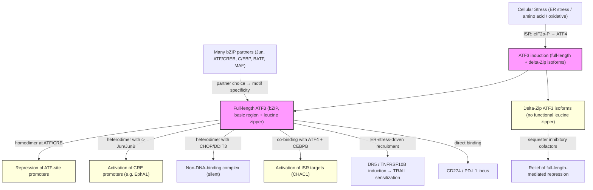

# Pathway Summary for ATF3

## Overview
ATF3 is a stress-inducible nuclear ATF/CREB-family bZIP transcription factor whose conserved core function is partner-dependent transcriptional regulation at CRE/ATF-like cis-regulatory sites in RNA polymerase II promoters [PMID:7515060, PMID:8622660, PMID:28186491, file:human/ATF3/ATF3-deep-research-falcon.md]. Full-length ATF3 binds DNA through its basic region/leucine zipper and most commonly represses ATF-site promoters as a homodimer, while heterodimerization with other bZIP partners (Jun, ATF/CREB, CHOP/DDIT3, C/EBP, BATF) reshapes DNA-binding specificity and can produce activation, silencing, or relief of repression depending on partner choice [PMID:1406655, PMID:8622660, PMID:2516827, PMID:28186491]. ATF3 is induced by integrated-stress-response (ISR) signaling, ER stress, and other cellular stress programs, and it functions as an output node that translates those inputs into reprogrammed transcription of CHOP/CHAC1-axis targets, death-receptor genes, and immune checkpoint loci [PMID:24939851, Reactome:R-HSA-9653893, Reactome:R-HSA-9909594, file:human/ATF3/ATF3-deep-research-falcon.md]. Delta-Zip splice isoforms that lack the leucine zipper localize to nuclei but cannot directly bind ATF/CRE DNA; they counteract full-length-mediated repression, likely by sequestering inhibitory cofactors [PMID:7515060, PMID:12034827].

## Core Pathways

### Partner-Dependent bZIP Transcriptional Regulation at ATF/CRE Sites
The canonical core function of full-length ATF3 is sequence-specific binding to ATF/CRE-like cis-regulatory elements as part of bZIP homo- and heterodimers, followed by partner-dependent regulation of RNA polymerase II transcription [PMID:7515060, PMID:2516827, PMID:28186491]. As a homodimer, ATF3 most commonly represses ATF-site promoters [PMID:7515060, PMID:8622660]. Heterodimer choice rewires this output: combination with c-Jun or JunB strongly activates CRE-containing promoters (the LRF-1 + Jun combination activates a reporter that c-Fos/Jun cannot) [PMID:1406655], while combination with CHOP/GADD153 produces a complex that fails to bind ATF/CRE DNA and does not repress transcription [PMID:8622660]. Genome-wide ATF3 occupancy and motif preference are best explained by considering many distinct ATF3-containing dimers rather than a single homodimeric specificity [PMID:28186491].

### Integrated Stress Response Output / Coupling Stress Inputs to Gene Programs
ATF3 acts as a downstream transcriptional output node of integrated-stress-response signaling, where ISR/eIF2α–ATF4 induction drives ATF3 expression and co-recruits ATF3 with ATF4 and CEBPB to ISR target promoters [Reactome:R-HSA-9653893, file:human/ATF3/ATF3-deep-research-falcon.md]. In this configuration, ATF3 contributes to transcriptional activation of canonical ISR targets such as the glutathione-degrading enzyme CHAC1 (ATF4/CEBPB/ATF3 cooperative binding at the CHAC1 promoter is captured as a Reactome event) [Reactome:R-HSA-9653893]. Under ER stress, ATF3 is required for induction of the death receptor DR5 (TNFRSF10B), which sensitizes p53-deficient cells to TRAIL-mediated apoptosis [PMID:24939851]. Additional ATF3-direct binding events include the immune checkpoint locus CD274/PD-L1 [Reactome:R-HSA-9909594] and the angiogenic receptor EphA1, where ATF3 stimulates EphA1 promoter activity by ~3.4-fold in an ATF3-dependent angiogenesis assay [PMID:18308734].

### Isoform Switching via Delta-Zip Forms (Relief of Repression)
The ATF3 locus produces multiple alternatively spliced delta-Zip isoforms (P18847-2, -3, -4) that lack or disrupt the leucine zipper required for canonical bZIP dimerization and direct ATF/CRE DNA binding. ATF3DeltaZip2 protein is stress-induced, localizes to nuclei, and counteracts the transcriptional repression mediated by full-length ATF3 [PMID:12034827]. The original alternative-splicing characterization showed that ATF3 delta Zip can stimulate transcription, in contrast to the repressive activity of full-length ATF3 [PMID:7515060]. Mechanistically these isoforms most likely act by titrating inhibitory cofactors away from full-length ATF3 rather than by binding DNA themselves, and they should be considered a regulatory layer on top of, rather than independent of, the partner-dependent core function.

## Pathway Diagram

## Molecular Architecture
- **Basic region / leucine zipper (bZIP)** in the C-terminal half mediates ATF/CRE-site DNA binding and homo-/heterodimerization with other bZIP factors [PMID:7515060, PMID:2516827, PMID:28186491]
- **Alternatively spliced delta-Zip isoforms** (P18847-2/-3/-4) lack or disrupt the leucine zipper and lose direct DNA binding, but retain nuclear localization and act as cofactor sponges that relieve full-length-mediated repression [PMID:7515060, PMID:12034827]
- **Stress-responsive promoter** drives rapid induction in response to ER stress, ISR signaling, and other cellular stress programs [PMID:8622660, PMID:24939851, file:human/ATF3/ATF3-deep-research-falcon.md]

## Upstream Inputs
- **Integrated stress response signaling** (eIF2α phosphorylation → ATF4 induction → ATF3 transcription) couples translational stress to ATF3-dependent gene expression [Reactome:R-HSA-9653893, file:human/ATF3/ATF3-deep-research-falcon.md]
- **ER stress** induces ATF3 and licenses ATF3-dependent DR5 promoter activation in p53-deficient cells [PMID:24939851]
- **Physiological stresses** (broadly induced ATF3 expression as a stress-inducible bZIP factor) [PMID:8622660]
- **Choice of bZIP heterodimer partner** (c-Jun, JunB, ATF4, DDIT3/CHOP, C/EBP, BATF, MAF family) is the proximal determinant of motif specificity and regulatory output for any given target promoter [PMID:1406655, PMID:8622660, PMID:28186491]

## Downstream Effects
- **Repression of ATF-site promoters** via full-length ATF3 homodimer binding [PMID:7515060, PMID:8622660]
- **Activation of CRE-containing promoters** when ATF3 dimerizes with c-Jun/JunB [PMID:1406655] or binds in cooperation with ATF4/CEBPB at ISR targets such as CHAC1 [Reactome:R-HSA-9653893]
- **ER-stress-driven DR5 induction and TRAIL sensitization** in p53-deficient cancer cells, an ATF3-required transcriptional output [PMID:24939851]
- **Angiogenesis-relevant EphA1 promoter activation** in an ATF3-dependent angiogenesis context [PMID:18308734]
- **Direct binding to the CD274/PD-L1 locus**, linking ATF3 to immune checkpoint expression [Reactome:R-HSA-9909594]
- **Relief of ATF3-mediated repression** when delta-Zip isoforms accumulate, as a counter-regulatory layer that fine-tunes the ATF3 transcriptional program [PMID:7515060, PMID:12034827]

## Non-Core Contexts
- **High-throughput interactome rows** from broad protein-interaction screens (BioPlex, Y2H, OpenCell, HuRI, Barcode Fusion Genetics, LuTHy, ISG interactome, NRF2 interactome, etc.) generate large numbers of generic `protein binding` annotations on ATF3. These are correctly flagged as `MARK_AS_OVER_ANNOTATED` in the merged review because the specific bZIP dimerization and transcription-factor-complex annotations capture the biologically meaningful interactions. Cited screen sources include PMID:18255255, PMID:25609649, PMID:27107012, PMID:28514442, PMID:29997244, PMID:30833792, PMID:31467278, PMID:32814053, PMID:32911434, PMID:33961781, PMID:35271311, PMID:37398436, PMID:38884001.
- **CHOP/GADD153 partnership as a "stress" output**: although CHOP is a key ER-stress regulator, the ATF3-CHOP heterodimer specifically does not bind ATF/CRE DNA and does not repress transcription [PMID:8622660]. The ATF3 stress role should be framed as transcriptional output to ISR targets via ATF4/CEBPB cooperation [Reactome:R-HSA-9653893], not as a CHOP-driven repression program.
- **Citations misattributed in source GOA rows**: PMID:16300731 is an ATF5 (not ATF3) cisplatin/cyclin D3 paper [PMID:16300731], and PMID:14685163 is a CHOP/GADD153 ER-stress review without direct ATF3 evidence [PMID:14685163]. The merged review correctly REMOVEs ATF3 annotations citing these papers; they are noted here only to avoid resurrecting them in downstream pathway summaries.

## Functional Integration
ATF3 is a single, conserved bZIP transcription factor whose biological versatility comes from one mechanism — partner-dependent ATF/CRE-site regulation — applied across many contexts:
1. **Homodimer-driven repression** of ATF-site promoters as the default activity of full-length ATF3 [PMID:7515060, PMID:8622660]
2. **Heterodimer-driven specificity switching** that turns ATF3 into an activator (with Jun/JunB) [PMID:1406655], a silent decoy (with CHOP) [PMID:8622660], or a context-specific partner of ISR transcription factors (with ATF4/CEBPB) [Reactome:R-HSA-9653893]
3. **Isoform-driven counter-regulation** in which delta-Zip ATF3 forms relieve full-length-mediated repression by titrating cofactors [PMID:7515060, PMID:12034827]

This pathway summary deliberately avoids enumerating every downstream context (inflammation, antiviral response, metabolism, neuronal injury) covered in the deep-research synthesis; those are biological consequences of the same partner-dependent transcription-factor function rather than separate molecular pathways. Where the merged ATF3 review demotes inflammation/apoptosis/metabolism BP terms to KEEP_AS_NON_CORE or MARK_AS_OVER_ANNOTATED, the framing here is consistent: the conserved core is transcription, and the various process-level outputs follow from which ATF3-containing dimer is recruited to which promoter under which stress condition.
