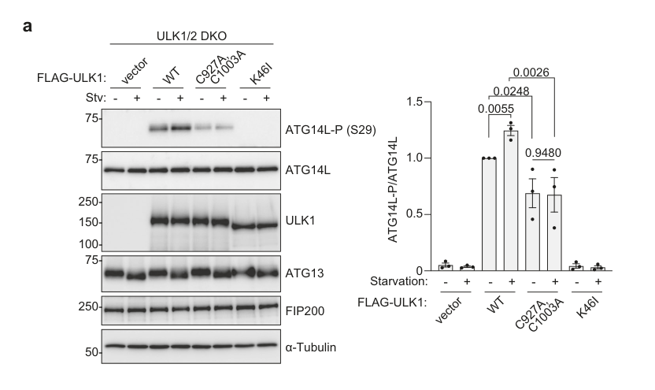

## Question

# Gene Research for Functional Annotation

## ⚠️ CRITICAL: Gene/Protein Identification Context

**BEFORE YOU BEGIN RESEARCH:** You MUST verify you are researching the CORRECT gene/protein. Gene symbols can be ambiguous, especially for less well-characterized genes from non-model organisms.

### Target Gene/Protein Identity (from UniProt):
- **UniProt Accession:** Q6ZNE5
- **Protein Description:** RecName: Full=Beclin 1-associated autophagy-related key regulator {ECO:0000303|PubMed:19050071}; Short=Barkor {ECO:0000303|PubMed:19050071}; AltName: Full=Autophagy-related protein 14-like protein {ECO:0000303|PubMed:19270696}; Short=Atg14L {ECO:0000303|PubMed:19270696};
- **Gene Information:** Name=ATG14 {ECO:0000303|PubMed:18843052}; Synonyms=ATG14L {ECO:0000303|PubMed:19270696}, KIAA0831;
- **Organism (full):** Homo sapiens (Human).
- **Protein Family:** Belongs to the ATG14 family. .
- **Key Domains:** UV_resistance/autophagy_Atg14. (IPR018791); ATG14 (PF10186)

### MANDATORY VERIFICATION STEPS:

1. **Check if the gene symbol "ATG14" matches the protein description above**
2. **Verify the organism is correct:** Homo sapiens (Human).
3. **Check if protein family/domains align with what you find in literature**
4. **If you find literature for a DIFFERENT gene with the same or similar symbol, STOP**

### If Gene Symbol is Ambiguous or You Cannot Find Relevant Literature:

**DO NOT PROCEED WITH RESEARCH ON A DIFFERENT GENE.** Instead:
- State clearly: "The gene symbol 'ATG14' is ambiguous or literature is limited for this specific protein"
- Explain what you found (e.g., "Found extensive literature on a different gene with the same symbol in a different organism")
- Describe the protein based ONLY on the UniProt information provided above
- Suggest that the protein function can be inferred from domain/family information

### Research Target:

Please provide a comprehensive research report on the gene **ATG14** (gene ID: ATG14, UniProt: Q6ZNE5) in human.

The research report should be a detailed narrative explaining the function, biological processes, and localization of the gene product. Citations should be given for all claims.

You should prioritize authoritative reviews and primary scientific literature when conducting research. You can supplement
this with annotations you find in gene/protein databases, but these can be outdated or inaccurate.

We are specifically interested in the primary function of the gene - for enzymes, what reaction is catalyzed, and what is the substrate specificity? For transporters, what is the substrate? For structural proteins or adapters, what is the broader structural role? For signaling molecules, what is the role in the pathway.

We are interested in where in or outside the cell the gene product carries out its function.

We are also interested in the signaling or biochemical pathways in which the gene functions. We are less interested in broad pleiotropic effects, except where these elucidate the precise role.

Include evidence where possible. We are interested in both experimental evidence as well as inference from structure, evolution, or bioinformatic analysis. Precise studies should be prioritized over high-throughput, where available.

## Output

Question: You are an expert researcher providing comprehensive, well-cited information.

Provide detailed information focusing on:
1. Key concepts and definitions with current understanding
2. Recent developments and latest research (prioritize 2023-2024 sources)
3. Current applications and real-world implementations
4. Expert opinions and analysis from authoritative sources
5. Relevant statistics and data from recent studies

Format as a comprehensive research report with proper citations. Include URLs and publication dates where available.
Always prioritize recent, authoritative sources and provide specific citations for all major claims.

# Gene Research for Functional Annotation

## ⚠️ CRITICAL: Gene/Protein Identification Context

**BEFORE YOU BEGIN RESEARCH:** You MUST verify you are researching the CORRECT gene/protein. Gene symbols can be ambiguous, especially for less well-characterized genes from non-model organisms.

### Target Gene/Protein Identity (from UniProt):
- **UniProt Accession:** Q6ZNE5
- **Protein Description:** RecName: Full=Beclin 1-associated autophagy-related key regulator {ECO:0000303|PubMed:19050071}; Short=Barkor {ECO:0000303|PubMed:19050071}; AltName: Full=Autophagy-related protein 14-like protein {ECO:0000303|PubMed:19270696}; Short=Atg14L {ECO:0000303|PubMed:19270696};
- **Gene Information:** Name=ATG14 {ECO:0000303|PubMed:18843052}; Synonyms=ATG14L {ECO:0000303|PubMed:19270696}, KIAA0831;
- **Organism (full):** Homo sapiens (Human).
- **Protein Family:** Belongs to the ATG14 family. .
- **Key Domains:** UV_resistance/autophagy_Atg14. (IPR018791); ATG14 (PF10186)

### MANDATORY VERIFICATION STEPS:

1. **Check if the gene symbol "ATG14" matches the protein description above**
2. **Verify the organism is correct:** Homo sapiens (Human).
3. **Check if protein family/domains align with what you find in literature**
4. **If you find literature for a DIFFERENT gene with the same or similar symbol, STOP**

### If Gene Symbol is Ambiguous or You Cannot Find Relevant Literature:

**DO NOT PROCEED WITH RESEARCH ON A DIFFERENT GENE.** Instead:
- State clearly: "The gene symbol 'ATG14' is ambiguous or literature is limited for this specific protein"
- Explain what you found (e.g., "Found extensive literature on a different gene with the same symbol in a different organism")
- Describe the protein based ONLY on the UniProt information provided above
- Suggest that the protein function can be inferred from domain/family information

### Research Target:

Please provide a comprehensive research report on the gene **ATG14** (gene ID: ATG14, UniProt: Q6ZNE5) in human.

The research report should be a detailed narrative explaining the function, biological processes, and localization of the gene product. Citations should be given for all claims.

You should prioritize authoritative reviews and primary scientific literature when conducting research. You can supplement
this with annotations you find in gene/protein databases, but these can be outdated or inaccurate.

We are specifically interested in the primary function of the gene - for enzymes, what reaction is catalyzed, and what is the substrate specificity? For transporters, what is the substrate? For structural proteins or adapters, what is the broader structural role? For signaling molecules, what is the role in the pathway.

We are interested in where in or outside the cell the gene product carries out its function.

We are also interested in the signaling or biochemical pathways in which the gene functions. We are less interested in broad pleiotropic effects, except where these elucidate the precise role.

Include evidence where possible. We are interested in both experimental evidence as well as inference from structure, evolution, or bioinformatic analysis. Precise studies should be prioritized over high-throughput, where available.

## Research report: Human **ATG14** (ATG14L/Barkor; UniProt **Q6ZNE5**)—functional annotation and current understanding

### 1) Key concepts and definitions (current understanding)

**Identity verification / nomenclature.** The literature captured here consistently uses **ATG14** synonym **ATG14L** (also “**Barkor**”) to denote the human Beclin 1–binding autophagy regulator that is the **autophagy-specific subunit of class III PI3-kinase complex I (PI3KC3-C1)**, matching UniProt Q6ZNE5 (human ATG14 family) and avoiding symbol ambiguity. (chen2025thehumanautophagyinitiating pages 12-13, chen2025thehumanautophagyinitiating pages 4-5, liu2023membranecurvaturethe pages 6-7)

**Primary biochemical function (what it “does”).** ATG14 is a **non-enzymatic regulatory/targeting subunit** of **PI3KC3-C1** (VPS34/PIK3C3 lipid kinase + VPS15/PIK3R4 + BECN1 + ATG14) that enables autophagy initiation by promoting **PI(3)P (PI3P) production** at early autophagosome formation sites. The enzyme catalysis (phosphorylation of phosphatidylinositol to PI3P) is performed by **VPS34**, but ATG14 is essential for complex identity, targeting, and activation in autophagy initiation. (chen2025thehumanautophagyinitiating pages 4-5, chen2025thehumanautophagyinitiating pages 12-13)

**Complex definitions.** Human PI3KC3 exists in two mutually exclusive assemblies: **PI3KC3-C1 (ATG14-containing)** functions primarily in **autophagy initiation**, whereas **PI3KC3-C2 (UVRAG-containing)** is linked to endolysosomal sorting and later autophagy-related trafficking. ATG14 is specifically associated with the complex I (C1) autophagy-initiating function. (chen2025thehumanautophagyinitiating pages 4-5, liu2023membranecurvaturethe pages 6-7)

**Omegasome / ER initiation site.** “Omegasomes” are PI3P-rich subdomains associated with the **endoplasmic reticulum (ER)** that act as sites for early autophagosome biogenesis; ATG14-containing PI3KC3-C1 is implicated in targeting/activating PI3P generation at these ER-associated initiation sites. (chen2025thehumanautophagyinitiating pages 12-13, liu2023membranecurvaturethe pages 6-7)

### 2) Molecular function, domains/motifs, and subcellular localization

**Domain-level functional model (ATG14 as a membrane-targeting and curvature-sensing subunit).** A 2023 review synthesizes evidence that mammalian ATG14L contains:
- an **N-terminal zinc finger**,
- a **central coiled-coil domain (CCD)**,
- and a **C-terminal BATS domain** (≈ last ~80 aa) that includes a **~19-aa amphipathic α-helix**.
Functionally, the **BATS domain** acts as a **membrane curvature sensor** and preferentially binds **highly curved** early isolation membranes, with affinity for membranes enriched in **PI3P** and **PI(4,5)P**. (liu2023membranecurvaturethe pages 6-7, liu2023membranecurvaturethe pages 7-8)

**ER targeting and omegasome localization.** The same 2023 synthesis describes ATG14L as targeted to the **ER** via an **N-terminal cysteine repeat sequence**, and reports co-localization with **DFCP1** (omegasome marker) and **ATG16L1** at early autophagic membranes, supporting a role at ER/omegasome initiation sites. (liu2023membranecurvaturethe pages 6-7, liu2023membranecurvaturethe pages 7-8)

**Complex architecture context.** A structural/biochemical synthesis describes PI3KC3-C1 as a ~**360 kDa** complex with **1:1:1:1** stoichiometry (VPS34:VPS15:BECN1:ATG14). Only ~**11%** of the complex mass corresponds to the VPS34 catalytic module, emphasizing that non-catalytic subunits (including ATG14) provide regulatory and targeting functions. (chen2025thehumanautophagyinitiating pages 4-5)

### 3) Pathways and mechanisms: ATG14 in autophagy initiation signaling

**Canonical pathway position.** ATG14 functions at the **nucleation step** of autophagy initiation by enabling PI3KC3-C1 recruitment/activation at ER-associated initiation sites to generate PI3P, which recruits PI3P-binding effectors that drive phagophore assembly. (chen2025thehumanautophagyinitiating pages 12-13, chen2025thehumanautophagyinitiating pages 4-5)

**Regulation by ULK1 via ATG14 Ser29 phosphorylation (site-specific mechanism).** A 2024 primary study in *Nature Communications* reports that **ULK1 phosphorylates ATG14L at Ser29**, and this modification is required for **activation of VPS34 lipid kinase**, **PI3P production** at autophagosome formation sites, and downstream autophagy initiation. Phospho-Ser29 is **absent** in ULK1/2 double knockout cells and in cells expressing **kinase-dead ULK1**, and is restored by wild-type ULK1 under starvation. (tabata2024palmitoylationofulk1 pages 7-8)

**New 2024 mechanism upstream of ULK1→ATG14: ULK1 palmitoylation control.** The same 2024 study shows that **ULK1 palmitoylation** (by ZDHHC13) is important for ULK1 signaling to ATG14: palmitoylation-deficient ULK1 mutants show markedly reduced ATG14L Ser29 phosphorylation; chemical inhibition of palmitoylation (2-bromopalmitate) suppresses starvation-induced ATG14 Ser29 phosphorylation. (tabata2024palmitoylationofulk1 pages 7-8, tabata2024palmitoylationofulk1 media d29506c2)

**mTORC1/AMPK axis (expert-level interpretation in recent primary work).** A 2023 *Nature Communications* study re-evaluates AMPK’s relationship to autophagy initiation signaling and supports that ATG14 is an upstream-kinase target in ULK1–ATG14–VPS34 signaling, placing ATG14 phosphorylation within nutrient/energy-stress kinase networks (ULK1, AMPK, mTORC1) that tune PI3KC3-C1 output. (park2023redefiningtherole pages 16-16)

### 4) Recent developments and latest research (prioritize 2023–2024)

**2023: Consolidation of ATG14 curvature sensing and ER targeting concepts.** The 2023 review in *Cells* provides a current conceptual model positioning ATG14’s **BATS** domain as a curvature sensor at early isolation membranes and tying ER targeting to an N-terminal cysteine-repeat element; it also frames feedback between PI3P enrichment, curvature, and ATG14 recruitment. (https://doi.org/10.3390/cells12081132; Apr 2023) (liu2023membranecurvaturethe pages 6-7, liu2023membranecurvaturethe pages 7-8)

**2024: Regulatory mechanisms governing the autophagy-initiating VPS34 complex (including ATG14 BATS as a membrane-binding determinant).** A 2024 review in *Biomolecules & Therapeutics* emphasizes ATG14 as the **Complex I-specific** subunit and highlights the **BATS** domain as a primary determinant for membrane binding and higher PI3KC3-C1 activity; swapping ATG14 BATS into UVRAG reportedly increases membrane binding/activity of the Complex II-like assembly, underscoring BATS as a modular activity determinant. (https://doi.org/10.4062/biomolther.2024.094; Oct 2024) (lee2024regulatorymechanismsgoverning pages 1-2)

**2024: ULK1 palmitoylation as a new control point for ATG14 Ser29 phosphorylation and PI3P generation.** Tabata et al. (2024) identifies a mechanistic bridge between membrane-proximal ULK1 regulation and ATG14 phosphorylation in the earliest stages of autophagy initiation. (https://doi.org/10.1038/s41467-024-51402-w; Aug 2024) (tabata2024palmitoylationofulk1 pages 7-8, tabata2024palmitoylationofulk1 media d29506c2)

### 5) Current applications and real-world implementations

**Experimental pharmacology and targetability of the ATG14/VPS34 initiation axis.** The 2024 VPS34-complex review highlights that autophagy initiation via VPS34 complex I has become a **drug discovery target**, discussing inhibitors of VPS34 and mentioning a **Beclin 1–ATG14L interaction inhibitor** as a chemical tool/lead concept for blocking autophagy initiation machinery. (lee2024regulatorymechanismsgoverning pages 1-2)

**Clinical implementation status (ATG14-specific).** Searches of ClinicalTrials.gov within the retrieved trial set did **not** identify interventional trials that directly target ATG14 as a drug target; the retrieved trials largely concern broader autophagy modulation contexts (e.g., hydroxychloroquine) rather than ATG14-specific perturbation. (clinical trials retrieved; see tool state summary) (lee2024regulatorymechanismsgoverning pages 1-2)

### 6) Disease associations, expert opinion, and authoritative-source analysis

**Database-backed disease links (hypothesis-generating).** Open Targets lists ATG14 disease associations (e.g., neurodegenerative disease, COVID-19, dengue disease, lysosomal storage disease) with underlying evidence entries tied to PubMed literature and CRISPRi/phenotyping screens; these should be interpreted as **association/evidence-of-involvement** rather than direct causal proof of mechanism in each disease. (OpenTargets Search: -ATG14)

**Mechanism-to-disease logic (expert interpretation grounded in evidence).** Since ATG14 is required for PI3KC3-C1–mediated PI3P generation at ER-associated initiation sites and is regulated by nutrient/energy-stress kinases, dysregulation of ATG14 abundance, localization, or PTMs would be expected to alter **autophagosome nucleation capacity**, impacting conditions where proteostasis, stress resilience, or pathogen handling relies on autophagy initiation efficiency. This inference is consistent with ATG14’s placement as an early “gatekeeper” subunit of PI3KC3-C1 and with its coupling to ULK1 signaling. (chen2025thehumanautophagyinitiating pages 12-13, chen2025thehumanautophagyinitiating pages 4-5, park2023redefiningtherole pages 16-16)

### 7) Relevant statistics and quantitative data from recent studies

- **Complex size/stoichiometry:** PI3KC3-C1 is described as ~**360 kDa**, **1:1:1:1** (VPS34:VPS15:BECN1:ATG14), with ~**11%** of mass catalytic and ~**89%** non-catalytic/regulatory, supporting the interpretation that ATG14’s main function is regulatory/targeting rather than enzymatic. (chen2025thehumanautophagyinitiating pages 4-5)
- **Regulatory PTM evidence (ULK1→ATG14 Ser29):** phospho-Ser29 ATG14 depends on ULK1 activity and is abolished in ULK1/2 DKO or kinase-dead ULK1 contexts; ULK1 palmitoylation deficiency diminishes ATG14 Ser29 phosphorylation and prevents its starvation-induced increase. (tabata2024palmitoylationofulk1 pages 7-8)
- **Membrane trafficking colocalization (related upstream mechanism):** ZDHHC13 co-precipitates with ATG9A membranes and colocalization values of **12.7%** and **62.0%** are reported in the Tabata et al. 2024 study, linking a palmitoylation enzyme and ATG9A-associated membranes to early autophagosome formation mechanisms upstream of ATG14 phosphorylation. (tabata2024palmitoylationofulk1 pages 7-8)

### 8) Visual evidence from primary literature

The following figure panels provide direct experimental evidence that **ULK1 palmitoylation is required for ULK1 kinase output toward ATG14 Ser29 phosphorylation**, which links membrane-proximal ULK1 regulation to PI3KC3-C1 activation in autophagy initiation. (tabata2024palmitoylationofulk1 media d29506c2, tabata2024palmitoylationofulk1 media c95ede9b)

### 9) Structured summary (mechanism-centric)

| Functional role (autophagy step) | Molecular mechanism | Key interaction partners/complex | Key localization | Regulatory PTMs/regulators | Representative recent sources (URL; publication month/year) | Evidence notes/quantitative data |
|---|---|---|---|---|---|---|
| Autophagy initiation / phagophore nucleation | ATG14 is the autophagy-specific subunit of PI3KC3-C1 and helps activate VPS34 lipid kinase to generate PI3P needed for early autophagosome formation (chen2025thehumanautophagyinitiating pages 12-13, chen2025thehumanautophagyinitiating pages 4-5, park2023redefiningtherole pages 16-16) | PI3KC3-C1 = VPS34/PIK3C3, VPS15/PIK3R4, BECN1, ATG14 (tabata2024palmitoylationofulk1 pages 7-8, chen2025thehumanautophagyinitiating pages 4-5) | ER-associated autophagosome formation sites / omegasomes (chen2025thehumanautophagyinitiating pages 12-13, liu2023membranecurvaturethe pages 6-7) | Positive regulation by ULK1 phosphorylation; negative regulation by mTORC1 on ATG14-containing VPS34 complexes; AMPK-linked pathway effects are context-dependent (park2023redefiningtherole pages 16-16, losier2025identificationofkinasemediated pages 24-28) | Tabata et al., *Nature Communications* (https://doi.org/10.1038/s41467-024-51402-w; Aug 2024); Lee et al., *Biomolecules & Therapeutics* (https://doi.org/10.4062/biomolther.2024.094; Oct 2024); Park et al., *Nature Communications* (https://doi.org/10.1038/s41467-023-38401-z; May 2023) | Human PI3KC3-C1 described as a ~360 kDa 1:1:1:1 heterotetramer; catalytic domain is ~11% of complex mass, emphasizing regulatory/non-catalytic roles of subunits including ATG14 (chen2025thehumanautophagyinitiating pages 4-5) |
| PI3P production downstream of ULK1 | ULK1 phosphorylates ATG14 at Ser29, which is required for VPS34 activation and PI3P production at autophagosome formation sites (tabata2024palmitoylationofulk1 pages 7-8, chen2025thehumanautophagyinitiating pages 4-5) | ULK1 complex functionally coupled to PI3KC3-C1 through ATG14 and BECN1 (tabata2024palmitoylationofulk1 pages 7-8, park2023redefiningtherole pages 16-16) | Autophagosome formation sites on ER/phagophore membranes (tabata2024palmitoylationofulk1 pages 7-8, chen2025thehumanautophagyinitiating pages 12-13) | ULK1 kinase activity; loss in ULK1/2 DKO or kinase-dead ULK1 blocks ATG14 Ser29 phosphorylation (tabata2024palmitoylationofulk1 pages 7-8) | Tabata et al., *Nature Communications* (https://doi.org/10.1038/s41467-024-51402-w; Aug 2024); Park et al., *Nature Communications* (https://doi.org/10.1038/s41467-023-38401-z; May 2023) | Phospho-Ser29 was absent in ULK1/2 double-KO and kinase-dead ULK1 settings; WT ULK1 restored starvation-induced phosphorylation (tabata2024palmitoylationofulk1 pages 7-8) |
| Membrane targeting and curvature sensing during early autophagosome biogenesis | ATG14 C-terminal BATS domain contains an amphiphilic helix and functions as a membrane curvature sensor; preferentially binds highly curved nascent isolation membranes and PI3P/PI(4,5)P-enriched membranes (liu2023membranecurvaturethe pages 6-7, liu2023membranecurvaturethe pages 7-8) | ATG14-containing PI3KC3-C1; Beclin1 recruitment to isolation membrane/ER (liu2023membranecurvaturethe pages 6-7) | Initiating isolation membrane, omegasome, tubular ER (liu2023membranecurvaturethe pages 6-7, liu2023membranecurvaturethe pages 7-8) | N-terminal cysteine-repeat sequence mediates ER targeting; membrane curvature and PI3P provide positive feedback for recruitment/activity (liu2023membranecurvaturethe pages 6-7, liu2023membranecurvaturethe pages 7-8) | Liu et al., *Cells* (https://doi.org/10.3390/cells12081132; Apr 2023); Lee et al., *Biomolecules & Therapeutics* (https://doi.org/10.4062/biomolther.2024.094; Oct 2024) | Review summarizes BATS as ~last 80 aa with a 19-aa amphipathic helix; ATG14 co-localizes with ATG16L1 and DFCP1 at omegasomes (liu2023membranecurvaturethe pages 6-7) |
| LC3 lipidation support downstream of PI3P | ATG14-dependent PI3KC3-C1 activity supports recruitment of WIPI2 and ATG2A, enabling efficient LC3 lipidation; complex II cannot substitute functionally in this assay (brier2019regulationoflc3 pages 14-22, brier2019regulationoflc3 pages 1-14) | PI3KC3-C1, WIPI2, ATG2A; distinguishes ATG14 complex I from UVRAG complex II (chen2025thehumanautophagyinitiating pages 4-5, brier2019regulationoflc3 pages 14-22) | ER-derived membranes / omegasome-associated early autophagic membranes (brier2019regulationoflc3 pages 14-22, brier2019regulationoflc3 pages 1-14) | Depends on VPS34 catalytic activity and ATG14 ALPS/BATS-like curvature-sensing element (brier2019regulationoflc3 pages 14-22, brier2019regulationoflc3 pages 1-14) | No 2023–2024 primary assay source in gathered context; supported by Brier et al., *Molecular Biology of the Cell* (https://doi.org/10.1091/mbc.e18-11-0743; Apr 2019) and discussed in later reviews (brier2019regulationoflc3 pages 14-22, brier2019regulationoflc3 pages 1-14) | In ATG14-knockout cytosol reconstitution, PI3KC3-C1 supported LC3 lipidation, whereas curvature-sensing/ALPS-defective derivatives failed to complement (brier2019regulationoflc3 pages 14-22, brier2019regulationoflc3 pages 1-14) |
| ER/omegasome targeting of the autophagy-initiation machinery | ATG14 is required for ER targeting of the class III PI3K complex and thereby for nucleation of PI3P-rich omegasomes (chen2025thehumanautophagyinitiating pages 12-13, liu2023membranecurvaturethe pages 6-7, brier2019regulationoflc3 pages 1-14) | BECN1-binding ATG14 subunit of PI3KC3-C1; mutually exclusive with UVRAG in complex II (chen2025thehumanautophagyinitiating pages 4-5, liu2023membranecurvaturethe pages 6-7) | ER, omegasomes, early isolation membrane (chen2025thehumanautophagyinitiating pages 12-13, liu2023membranecurvaturethe pages 6-7) | Competitive assembly with UVRAG affects pathway specificity between autophagy initiation and endolysosomal sorting (chen2025thehumanautophagyinitiating pages 4-5, liu2023membranecurvaturethe pages 6-7) | Lee et al., *Biomolecules & Therapeutics* (https://doi.org/10.4062/biomolther.2024.094; Oct 2024); Liu et al., *Cells* (https://doi.org/10.3390/cells12081132; Apr 2023) | Complex I (ATG14-containing) is linked to initiation, whereas complex II (UVRAG-containing) functions in endolysosomal sorting/later autophagy stages (chen2025thehumanautophagyinitiating pages 4-5) |
| Coupling upstream membrane delivery to PI3KC3-C1 activation | ULK1 palmitoylation by ZDHHC13 promotes ULK1 translocation and enhances phosphorylation of ATG14, increasing PI3P production and autophagy initiation (tabata2024palmitoylationofulk1 pages 7-8, tabata2024palmitoylationofulk1 media d29506c2) | ZDHHC13, ULK1, ATG14, ATG9A-associated membranes (tabata2024palmitoylationofulk1 pages 7-8) | Golgi/ATG9A vesicle-linked pathway feeding autophagosome formation sites (tabata2024palmitoylationofulk1 pages 7-8) | ULK1 palmitoylation; inhibitor 2-bromopalmitate suppresses ATG14 Ser29 phosphorylation (tabata2024palmitoylationofulk1 pages 7-8, tabata2024palmitoylationofulk1 media d29506c2) | Tabata et al., *Nature Communications* (https://doi.org/10.1038/s41467-024-51402-w; Aug 2024) | Reported colocalization values: endogenous ZDHHC13 with ATG9A membranes 12.7% and 62.0% in distinct measurements; palmitoylation-deficient ULK1 mutants showed markedly reduced ATG14 Ser29 phosphorylation (tabata2024palmitoylationofulk1 pages 7-8) |
| Pharmacologic targeting relevance | ATG14’s BATS domain is a major membrane-binding determinant of PI3KC3-C1; reviews discuss VPS34 inhibitors and a Beclin1–ATG14L interaction inhibitor as tools/therapeutic leads for autophagy-initiation blockade (lee2024regulatorymechanismsgoverning pages 1-2, brier2019regulationoflc3 pages 14-22) | PI3KC3-C1 / VPS34 pathway; Beclin1–ATG14 interface (lee2024regulatorymechanismsgoverning pages 1-2, brier2019regulationoflc3 pages 14-22) | Autophagy-initiation machinery at omegasomes (lee2024regulatorymechanismsgoverning pages 1-2) | VPS34 inhibitors; Beclin1-ATG14L interaction inhibitor 1 mentioned in review context (lee2024regulatorymechanismsgoverning pages 1-2) | Lee et al., *Biomolecules & Therapeutics* (https://doi.org/10.4062/biomolther.2024.094; Oct 2024) | Gathered evidence supports pathway-level rather than ATG14-specific clinical implementation; no direct ATG14-targeted clinical trials were identified in the searched trials context (lee2024regulatorymechanismsgoverning pages 1-2) |

*Table: This table summarizes experimentally supported functions, mechanisms, localization, and regulation of human ATG14/ATG14L in autophagy initiation. It emphasizes recent 2023–2024 sources where available and includes quantitative findings from the gathered evidence.*

### 10) Key takeaways (functional annotation summary)

1. **Primary role:** ATG14 is a **non-enzymatic targeting/regulatory subunit** that specifies **PI3KC3-C1** for autophagy initiation and is required for efficient **PI3P production** at ER-associated initiation sites. (chen2025thehumanautophagyinitiating pages 12-13, chen2025thehumanautophagyinitiating pages 4-5)
2. **Localization:** Functions at **ER/omegasome-associated** early autophagic membranes; ER targeting is linked to N-terminal features and early-membrane recruitment correlates with DFCP1/ATG16L1-marked initiation sites. (liu2023membranecurvaturethe pages 6-7, liu2023membranecurvaturethe pages 7-8)
3. **Domain/motif logic:** The **C-terminal BATS domain** contains an amphipathic helix and is a key determinant for membrane binding and curvature sensing, aligning with ATG14’s role in positioning/activating PI3KC3-C1 on nascent curved membranes. (liu2023membranecurvaturethe pages 6-7, lee2024regulatorymechanismsgoverning pages 1-2)
4. **Regulation:** A key, experimentally supported PTM is **ULK1-dependent ATG14 Ser29 phosphorylation**, with a 2024 mechanistic advance showing ULK1 palmitoylation as a control point for this signaling. (tabata2024palmitoylationofulk1 pages 7-8, tabata2024palmitoylationofulk1 media d29506c2)

### URLs and publication dates of key recent sources used

- Liu L. et al. *Cells* — “Membrane Curvature: The Inseparable Companion of Autophagy” (Apr 2023). https://doi.org/10.3390/cells12081132 (liu2023membranecurvaturethe pages 6-7)
- Park J.-M. et al. *Nature Communications* — “Redefining the role of AMPK in autophagy and the energy stress response” (May 2023). https://doi.org/10.1038/s41467-023-38401-z (park2023redefiningtherole pages 16-16)
- Tabata K. et al. *Nature Communications* — “Palmitoylation of ULK1 by ZDHHC13 plays a crucial role in autophagy” (Aug 2024). https://doi.org/10.1038/s41467-024-51402-w (tabata2024palmitoylationofulk1 pages 7-8)
- Lee Y. et al. *Biomolecules & Therapeutics* — “Regulatory Mechanisms Governing the Autophagy-Initiating VPS34 Complex and Its inhibitors” (Oct 2024). https://doi.org/10.4062/biomolther.2024.094 (lee2024regulatorymechanismsgoverning pages 1-2)

### Limitations of this evidence set

- While ATG14 is frequently discussed in disease contexts, the retrieved evidence set contains limited **ATG14-specific** human disease-causality experiments and no ATG14-targeted clinical trials; disease links here are primarily **association-level** (Open Targets) and **mechanism-to-disease inference** based on ATG14’s established role in autophagy initiation. (OpenTargets Search: -ATG14, lee2024regulatorymechanismsgoverning pages 1-2)

References

1. (chen2025thehumanautophagyinitiating pages 12-13): Minghao Chen and James H. Hurley. The human autophagy-initiating complexes ulk1c and pi3kc3-c1. Journal of Biological Chemistry, 301:110391, Jul 2025. URL: https://doi.org/10.1016/j.jbc.2025.110391, doi:10.1016/j.jbc.2025.110391. This article has 17 citations and is from a domain leading peer-reviewed journal.

2. (chen2025thehumanautophagyinitiating pages 4-5): Minghao Chen and James H. Hurley. The human autophagy-initiating complexes ulk1c and pi3kc3-c1. Journal of Biological Chemistry, 301:110391, Jul 2025. URL: https://doi.org/10.1016/j.jbc.2025.110391, doi:10.1016/j.jbc.2025.110391. This article has 17 citations and is from a domain leading peer-reviewed journal.

3. (liu2023membranecurvaturethe pages 6-7): Lei Liu, Yu Tang, Zijuan Zhou, Yuan Huang, Rui Zhang, Hao Lyu, Shuai Xiao, Dong Guo, Declan William Ali, Marek Michalak, Xing-Zhen Chen, Cefan Zhou, and Jingfeng Tang. Membrane curvature: the inseparable companion of autophagy. Cells, 12:1132, Apr 2023. URL: https://doi.org/10.3390/cells12081132, doi:10.3390/cells12081132. This article has 6 citations.

4. (liu2023membranecurvaturethe pages 7-8): Lei Liu, Yu Tang, Zijuan Zhou, Yuan Huang, Rui Zhang, Hao Lyu, Shuai Xiao, Dong Guo, Declan William Ali, Marek Michalak, Xing-Zhen Chen, Cefan Zhou, and Jingfeng Tang. Membrane curvature: the inseparable companion of autophagy. Cells, 12:1132, Apr 2023. URL: https://doi.org/10.3390/cells12081132, doi:10.3390/cells12081132. This article has 6 citations.

5. (tabata2024palmitoylationofulk1 pages 7-8): Keisuke Tabata, Kenta Imai, Koki Fukuda, Kentaro Yamamoto, Hayato Kunugi, Toshiharu Fujita, Tatsuya Kaminishi, Christian Tischer, Beate Neumann, Sabine Reither, Fatima Verissimo, Rainer Pepperkok, Tamotsu Yoshimori, and Maho Hamasaki. Palmitoylation of ulk1 by zdhhc13 plays a crucial role in autophagy. Nature Communications, Aug 2024. URL: https://doi.org/10.1038/s41467-024-51402-w, doi:10.1038/s41467-024-51402-w. This article has 42 citations and is from a highest quality peer-reviewed journal.

6. (tabata2024palmitoylationofulk1 media d29506c2): Keisuke Tabata, Kenta Imai, Koki Fukuda, Kentaro Yamamoto, Hayato Kunugi, Toshiharu Fujita, Tatsuya Kaminishi, Christian Tischer, Beate Neumann, Sabine Reither, Fatima Verissimo, Rainer Pepperkok, Tamotsu Yoshimori, and Maho Hamasaki. Palmitoylation of ulk1 by zdhhc13 plays a crucial role in autophagy. Nature Communications, Aug 2024. URL: https://doi.org/10.1038/s41467-024-51402-w, doi:10.1038/s41467-024-51402-w. This article has 42 citations and is from a highest quality peer-reviewed journal.

7. (park2023redefiningtherole pages 16-16): Ji-Man Park, Da-Hye Lee, and Do-Hyung Kim. Redefining the role of ampk in autophagy and the energy stress response. Nature Communications, May 2023. URL: https://doi.org/10.1038/s41467-023-38401-z, doi:10.1038/s41467-023-38401-z. This article has 280 citations and is from a highest quality peer-reviewed journal.

8. (lee2024regulatorymechanismsgoverning pages 1-2): Yongook Lee, Nguyen Minh Tuan, Gi Jeong Lee, Boram Kim, Jung Ho Park, and Chang Hoon Lee. Regulatory mechanisms governing the autophagy-initiating vps34 complex and its inhibitors. Biomolecules & Therapeutics, 32:723-735, Oct 2024. URL: https://doi.org/10.4062/biomolther.2024.094, doi:10.4062/biomolther.2024.094. This article has 17 citations and is from a peer-reviewed journal.

9. (OpenTargets Search: -ATG14): Open Targets Query (-ATG14, 5 results). Buniello, A. et al. (2025). Open Targets Platform: facilitating therapeutic hypotheses building in drug discovery. Nucleic Acids Research.

10. (tabata2024palmitoylationofulk1 media c95ede9b): Keisuke Tabata, Kenta Imai, Koki Fukuda, Kentaro Yamamoto, Hayato Kunugi, Toshiharu Fujita, Tatsuya Kaminishi, Christian Tischer, Beate Neumann, Sabine Reither, Fatima Verissimo, Rainer Pepperkok, Tamotsu Yoshimori, and Maho Hamasaki. Palmitoylation of ulk1 by zdhhc13 plays a crucial role in autophagy. Nature Communications, Aug 2024. URL: https://doi.org/10.1038/s41467-024-51402-w, doi:10.1038/s41467-024-51402-w. This article has 42 citations and is from a highest quality peer-reviewed journal.

11. (losier2025identificationofkinasemediated pages 24-28): T Losier. Identification of kinase-mediated signaling pathways regulating autophagy in response to cellular stresses. Unknown journal, 2025.

12. (brier2019regulationoflc3 pages 14-22): Livia W. Brier, Liang Ge, Goran Stjepanovic, Ashley M. Thelen, James H. Hurley, and Randy Schekman. Regulation of lc3 lipidation by the autophagy-specific class iii phosphatidylinositol-3 kinase complex. Molecular Biology of the Cell, 30:1098-1107, Apr 2019. URL: https://doi.org/10.1091/mbc.e18-11-0743, doi:10.1091/mbc.e18-11-0743. This article has 98 citations and is from a domain leading peer-reviewed journal.

13. (brier2019regulationoflc3 pages 1-14): Livia W. Brier, Liang Ge, Goran Stjepanovic, Ashley M. Thelen, James H. Hurley, and Randy Schekman. Regulation of lc3 lipidation by the autophagy-specific class iii phosphatidylinositol-3 kinase complex. Molecular Biology of the Cell, 30:1098-1107, Apr 2019. URL: https://doi.org/10.1091/mbc.e18-11-0743, doi:10.1091/mbc.e18-11-0743. This article has 98 citations and is from a domain leading peer-reviewed journal.

## Artifacts

- [Edison artifact artifact-00](ATG14-deep-research-falcon_artifacts/artifact-00.md)

## Citations

1. chen2025thehumanautophagyinitiating pages 4-5
2. park2023redefiningtherole pages 16-16
3. lee2024regulatorymechanismsgoverning pages 1-2
4. liu2023membranecurvaturethe pages 6-7
5. chen2025thehumanautophagyinitiating pages 12-13
6. liu2023membranecurvaturethe pages 7-8
7. losier2025identificationofkinasemediated pages 24-28
8. https://doi.org/10.3390/cells12081132;
9. https://doi.org/10.4062/biomolther.2024.094;
10. https://doi.org/10.1038/s41467-024-51402-w;
11. https://doi.org/10.1038/s41467-023-38401-z;
12. https://doi.org/10.1091/mbc.e18-11-0743;
13. https://doi.org/10.3390/cells12081132
14. https://doi.org/10.1038/s41467-023-38401-z
15. https://doi.org/10.1038/s41467-024-51402-w
16. https://doi.org/10.4062/biomolther.2024.094
17. https://doi.org/10.1016/j.jbc.2025.110391,
18. https://doi.org/10.3390/cells12081132,
19. https://doi.org/10.1038/s41467-024-51402-w,
20. https://doi.org/10.1038/s41467-023-38401-z,
21. https://doi.org/10.4062/biomolther.2024.094,
22. https://doi.org/10.1091/mbc.e18-11-0743,