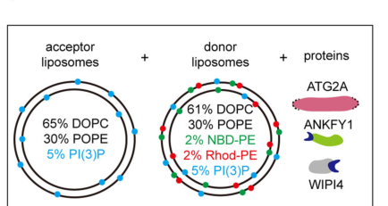

## Question

# Gene Research for Functional Annotation

## ⚠️ CRITICAL: Gene/Protein Identification Context

**BEFORE YOU BEGIN RESEARCH:** You MUST verify you are researching the CORRECT gene/protein. Gene symbols can be ambiguous, especially for less well-characterized genes from non-model organisms.

### Target Gene/Protein Identity (from UniProt):
- **UniProt Accession:** Q2TAZ0
- **Protein Description:** RecName: Full=Autophagy-related protein 2 homolog A {ECO:0000303|PubMed:21887408};
- **Gene Information:** Name=ATG2A {ECO:0000303|PubMed:21887408, ECO:0000312|HGNC:HGNC:29028}; Synonyms=KIAA0404 {ECO:0000303|PubMed:9455477};
- **Organism (full):** Homo sapiens (Human).
- **Protein Family:** Belongs to the ATG2 family. .
- **Key Domains:** ATG2. (IPR026849); ATG2_CAD (PF13329)

### MANDATORY VERIFICATION STEPS:

1. **Check if the gene symbol "ATG2A" matches the protein description above**
2. **Verify the organism is correct:** Homo sapiens (Human).
3. **Check if protein family/domains align with what you find in literature**
4. **If you find literature for a DIFFERENT gene with the same or similar symbol, STOP**

### If Gene Symbol is Ambiguous or You Cannot Find Relevant Literature:

**DO NOT PROCEED WITH RESEARCH ON A DIFFERENT GENE.** Instead:
- State clearly: "The gene symbol 'ATG2A' is ambiguous or literature is limited for this specific protein"
- Explain what you found (e.g., "Found extensive literature on a different gene with the same symbol in a different organism")
- Describe the protein based ONLY on the UniProt information provided above
- Suggest that the protein function can be inferred from domain/family information

### Research Target:

Please provide a comprehensive research report on the gene **ATG2A** (gene ID: ATG2A, UniProt: Q2TAZ0) in human.

The research report should be a detailed narrative explaining the function, biological processes, and localization of the gene product. Citations should be given for all claims.

You should prioritize authoritative reviews and primary scientific literature when conducting research. You can supplement
this with annotations you find in gene/protein databases, but these can be outdated or inaccurate.

We are specifically interested in the primary function of the gene - for enzymes, what reaction is catalyzed, and what is the substrate specificity? For transporters, what is the substrate? For structural proteins or adapters, what is the broader structural role? For signaling molecules, what is the role in the pathway.

We are interested in where in or outside the cell the gene product carries out its function.

We are also interested in the signaling or biochemical pathways in which the gene functions. We are less interested in broad pleiotropic effects, except where these elucidate the precise role.

Include evidence where possible. We are interested in both experimental evidence as well as inference from structure, evolution, or bioinformatic analysis. Precise studies should be prioritized over high-throughput, where available.

## Output

Question: You are an expert researcher providing comprehensive, well-cited information.

Provide detailed information focusing on:
1. Key concepts and definitions with current understanding
2. Recent developments and latest research (prioritize 2023-2024 sources)
3. Current applications and real-world implementations
4. Expert opinions and analysis from authoritative sources
5. Relevant statistics and data from recent studies

Format as a comprehensive research report with proper citations. Include URLs and publication dates where available.
Always prioritize recent, authoritative sources and provide specific citations for all major claims.

# Gene Research for Functional Annotation

## ⚠️ CRITICAL: Gene/Protein Identification Context

**BEFORE YOU BEGIN RESEARCH:** You MUST verify you are researching the CORRECT gene/protein. Gene symbols can be ambiguous, especially for less well-characterized genes from non-model organisms.

### Target Gene/Protein Identity (from UniProt):
- **UniProt Accession:** Q2TAZ0
- **Protein Description:** RecName: Full=Autophagy-related protein 2 homolog A {ECO:0000303|PubMed:21887408};
- **Gene Information:** Name=ATG2A {ECO:0000303|PubMed:21887408, ECO:0000312|HGNC:HGNC:29028}; Synonyms=KIAA0404 {ECO:0000303|PubMed:9455477};
- **Organism (full):** Homo sapiens (Human).
- **Protein Family:** Belongs to the ATG2 family. .
- **Key Domains:** ATG2. (IPR026849); ATG2_CAD (PF13329)

### MANDATORY VERIFICATION STEPS:

1. **Check if the gene symbol "ATG2A" matches the protein description above**
2. **Verify the organism is correct:** Homo sapiens (Human).
3. **Check if protein family/domains align with what you find in literature**
4. **If you find literature for a DIFFERENT gene with the same or similar symbol, STOP**

### If Gene Symbol is Ambiguous or You Cannot Find Relevant Literature:

**DO NOT PROCEED WITH RESEARCH ON A DIFFERENT GENE.** Instead:
- State clearly: "The gene symbol 'ATG2A' is ambiguous or literature is limited for this specific protein"
- Explain what you found (e.g., "Found extensive literature on a different gene with the same symbol in a different organism")
- Describe the protein based ONLY on the UniProt information provided above
- Suggest that the protein function can be inferred from domain/family information

### Research Target:

Please provide a comprehensive research report on the gene **ATG2A** (gene ID: ATG2A, UniProt: Q2TAZ0) in human.

The research report should be a detailed narrative explaining the function, biological processes, and localization of the gene product. Citations should be given for all claims.

You should prioritize authoritative reviews and primary scientific literature when conducting research. You can supplement
this with annotations you find in gene/protein databases, but these can be outdated or inaccurate.

We are specifically interested in the primary function of the gene - for enzymes, what reaction is catalyzed, and what is the substrate specificity? For transporters, what is the substrate? For structural proteins or adapters, what is the broader structural role? For signaling molecules, what is the role in the pathway.

We are interested in where in or outside the cell the gene product carries out its function.

We are also interested in the signaling or biochemical pathways in which the gene functions. We are less interested in broad pleiotropic effects, except where these elucidate the precise role.

Include evidence where possible. We are interested in both experimental evidence as well as inference from structure, evolution, or bioinformatic analysis. Precise studies should be prioritized over high-throughput, where available.

## Research report: Human ATG2A (UniProt Q2TAZ0) functional annotation (2023–2024 focus)

### 0) Gene/protein identity verification (required)
The target is **human ATG2A** (autophagy-related protein 2 homolog A; UniProt **Q2TAZ0**; synonym **KIAA0404**), a large rod-like **ATG2/RBG-family bridge lipid-transfer protein** implicated in autophagosome membrane expansion and other lipid-transfer contexts. This identity is consistent across recent reviews and primary literature describing ATG2A as a long, groove-containing bulk lipid transporter/tether that works with WIPI proteins and ATG9 scramblases. (duarte2023theorganizationand pages 4-5, chiduza2024atg9bisa pages 1-2, vliet2024exploringtheatg9a pages 1-3)

### 1) Key concepts and definitions (current understanding)

#### 1.1 Macroautophagy and the phagophore expansion problem
Macroautophagy (often “autophagy”) requires de novo growth of a cup-shaped precursor membrane, the **phagophore**, into a closed **autophagosome**. A major conceptual advance is that phagophore growth is driven not only by vesicle fusion but also by **non-vesicular bulk lipid transfer** at **ER–phagophore membrane contact sites (MCSs)**. ATG2 proteins (ATG2A/B in mammals) are central to this model. (duarte2023theorganizationand pages 9-10, duarte2023theorganizationand pages 13-14)

#### 1.2 Bridge-like (bulk) lipid transfer vs. shuttle lipid transfer
ATG2A is generally described as a **bridge-like/bulk lipid transfer protein**: a rod-like protein with a **long hydrophobic groove/cavity** that can accommodate lipid acyl chains and allow lipids to flow between membranes when the protein tethers them. This is contrasted with “shuttle” lipid transfer proteins that bind and carry single lipids. (duarte2023theorganizationand pages 13-14, duarte2023theorganizationand pages 4-5)

#### 1.3 Lipid transfer must be coupled to lipid scrambling
Because bridge transfer is expected to deliver lipids predominantly into the **cytosolic leaflet** of a target membrane, efficient phagophore growth also requires **lipid scrambling** to equilibrate lipids between leaflets. The core model therefore couples **ATG2A-mediated transfer** with **ATG9A/B scramblase activity**, and ER scramblases VMP1/TMEM41B on the donor side. (chiduza2024atg9bisa pages 1-2, vliet2024exploringtheatg9a pages 1-3)

### 2) Molecular function of ATG2A

#### 2.1 Core molecular function: tethering and bulk lipid transfer for phagophore growth
ATG2A is a **tether** and **lipid transfer** protein concentrated at phagophore extremities/rims where ER–phagophore contacts form. Purified ATG2-family proteins can tether membranes and transfer lipids between tethered membranes in vitro, and a principal lipid-transfer module has been mapped to the N-terminus (reported in recent synthesis as ATG2A aa 1–345). (duarte2023theorganizationand pages 5-7, duarte2023theorganizationand pages 9-10)

Structural synthesis describes ATG2A as a large rod (reported ~**20 nm** length) with a groove compatible with bulk phospholipid transport, fitting a “molecular highway/bridge” model for moving lipids from donor membranes (classically ER) to expanding phagophores. (duarte2023theorganizationand pages 13-14, duarte2023theorganizationand pages 4-5)

#### 2.2 ATG2A as a bulk lipid transfer factor outside canonical phagophore growth: lipid droplets
A 2023 mechanistic study extended ATG2A’s biology to **lipid droplets (LDs)**, showing ATG2A can catalyze bridge-like phospholipid transport from **phospholipid monolayers** (LD surfaces) and that bridge-like transport activity is required to prevent LD accumulation in cells. This work argues ATG2A is naturally recruited to monolayers and can transfer phospholipids more efficiently when one interacting surface is an LD-like monolayer. (korfhage2023atg2amediatedbridgelikelipid pages 1-2)

### 3) Key interaction partners and mechanistic roles

#### 3.1 WIPI4/WDR45 (PI3P effector) – targeting and directionality
At ER–phagophore MCSs, **WIPI4 (WDR45)** is described as an ATG2A partner that binds PI3P and supports recruitment/directionality of ATG2A toward PI3P-positive autophagic membranes; recent synthesis notes WIPI4 binds ATG2A more strongly than WIPI1/2. (duarte2023theorganizationand pages 5-7, duarte2023theorganizationand pages 9-10)

#### 3.2 ATG9A and ATG9B – scramblases coupled to ATG2A transfer
Recent reviews and primary literature converge on ATG2A forming a functional complex with **ATG9A**.
* A 2024 interactome-focused primary study frames ATG9A as a lipid scramblase whose scramblase function is “thought to require” interaction with ATG2A; ATG9A forms a complex with ATG2A and disrupting this complex inhibits autophagy, supporting cooperation in expanding the growing autophagosome. (vliet2024exploringtheatg9a pages 1-3)
* A 2024 mechanistic review of ATG9 paralogs describes ATG2A collaborating with ATG9A to transfer lipids to the growing autophagosome. It further summarizes structural modeling in which ATG2A’s C-terminus interacts with ATG9A to form a complex that couples ATG2A lipid transfer with ATG9 scramblase activity (described as essential for autophagosome biogenesis). (chiduza2024atg9bisa pages 1-2)
* A 2023 synthesis of ER–phagophore contact sites identifies two ATG9A-interacting sequences in ATG2A and reports that deleting the S2 region (mapped to the CLR, ~aa 1760–1779) reduces ATG2A–ATG9A binding and impairs autophagy progression. (duarte2023theorganizationand pages 5-7)

Together, these sources support the current consensus: **ATG2A (bridge transfer) + ATG9A/B (scrambling)** form a core lipid-supply machine for phagophore expansion. (duarte2023theorganizationand pages 5-7, chiduza2024atg9bisa pages 1-2, vliet2024exploringtheatg9a pages 1-3)

#### 3.3 VMP1 and TMEM41B – ER-side scramblases interacting with ATG2A
A 2024 review of ATG9B/ATG9A biology summarizes that ER-resident scramblases **VMP1** and **TMEM41B** interact with the **N-terminus of ATG2A**, and along with ATG9A are proposed to form a core lipid transfer/scrambling complex at ER–phagophore contact sites, with local ER lipid synthesis providing directionality. (chiduza2024atg9bisa pages 1-2)

A complementary biochemical synthesis also describes ATG2 N-terminal targeting to the ER through interactions with VMP1 and TMEM41B, placing these interactions in a mechanistic model for driving net lipid flux at the contact. (nguyen2023biochemicalreconstitutionof pages 134-138)

#### 3.4 GABARAP/ATG8 family – LIR-mediated interactions and late-stage biogenesis
ATG2A contains conserved **LIR** motifs and is described as interacting with **GABARAP-family ATG8 proteins**, which is functionally important for sustaining phagophore formation and/or autophagosome closure in starvation conditions (as summarized in a 2023 contact-site review and a 2023 high-authority autophagy-gene review). (duarte2023theorganizationand pages 4-5, yamamoto2023autophagygenesin pages 16-17)

In addition, in a 2023 primary study of lysosome damage responses (CASM; see Section 5), ATG2–ATG8 engagement upon lysosomal damage depended on the ATG2A LIR region (rather than the WIPI4-binding region) in ATG2A/B DKO reconstitution assays, supporting an ATG8-dependent recruitment mode for ATG2 under non-canonical autophagy stimuli. (cross2023lysosomedamagetriggers pages 6-7)

#### 3.5 ANKFY1 – 2024 discovery of an endosomal bridge for ATG2A lipid transfer
A key 2024 advance is identification of **ANKFY1** as an **ATG2A-binding** factor that is **endosome-localized** and promotes ATG2A-mediated lipid transfer from endosomes to phagophores.

Mechanistically, Wei et al. (Cell Discovery; published April 2024; https://doi.org/10.1038/s41421-024-00659-y) report:
* ANKFY1 depletion impairs autophagosome growth and reduces autophagy flux, largely phenocopying ATG2A/B depletion.
* Purified ANKFY1 binds **PI3P** via its **FYVE** domain and enhances ATG2A-mediated lipid transfer between PI3P-containing liposomes.
* The authors propose ANKFY1 recruits ATG2A to PI3P-enriched endosomes, enabling endosome-to-phagophore lipid donation.
(wei2024ankfy1bridgesatg2amediated pages 1-2)

A schematic model of the ANKFY1/WIPI4/ATG2A liposome-transfer assay and the proposed endosome→phagophore lipid-transfer concept is shown in the retrieved figure panel. (wei2024ankfy1bridgesatg2amediated media 2bca71a4)

### 4) Subcellular localization and pathway context

#### 4.1 ER–phagophore membrane contact sites (including omegasome-associated regions)
Current synthesis places ATG2A at **phagophore extremities/rims**, where it establishes/maintains close contacts with the ER (ER–phagophore MCSs) together with ATG9 and WIPI proteins. Recruitment is described as involving coincidence of **ATG9 binding** and **PI3P-dependent WIPI binding**, producing localization specificity to the right membrane subdomains. (duarte2023theorganizationand pages 5-7, duarte2023theorganizationand pages 9-10)

#### 4.2 Endosome–phagophore interfaces (2024 extension)
The ANKFY1 discovery supports a model in which ATG2A can also function at **endosome–phagophore interfaces**, transferring PI3P and other lipids from PI3P-enriched endosomes to the phagophore during autophagy. (wei2024ankfy1bridgesatg2amediated pages 1-2, wei2024ankfy1bridgesatg2amediated media 2bca71a4)

#### 4.3 Lipid droplets
ATG2A localizes to lipid droplets, and 2023 mechanistic work provides evidence that ATG2A’s bridge-like lipid transport regulates LD accumulation and that ATG2A has enhanced recruitment/activity on LD monolayers. (korfhage2023atg2amediatedbridgelikelipid pages 1-2)

### 5) Recent developments (prioritized 2023–2024)

#### 5.1 2023 authoritative reviews consolidated the bridge-transfer paradigm
Two influential 2023 reviews synthesized emerging structural and biochemical data into a now widely used conceptual framework: autophagosomal membrane expansion is driven by coordinated action of **bulk lipid transfer proteins** (ATG2 family) and **scramblases** (ATG9, VMP1, TMEM41B) at ER–phagophore contacts. (duarte2023theorganizationand pages 13-14, yamamoto2023autophagygenesin pages 16-17)

#### 5.2 2023–2024: Expansion beyond “ER-only” lipid donation
The 2024 ANKFY1 study provides direct evidence for a **non-ER** donor route, proposing **endosomes** as lipid sources for phagophore expansion via ATG2A when ANKFY1 recruits/activates the transfer on PI3P membranes. (wei2024ankfy1bridgesatg2amediated pages 1-2, wei2024ankfy1bridgesatg2amediated media 2bca71a4)

#### 5.3 2023: ATG2 engagement in non-canonical autophagy during lysosome damage
Cross et al. (J Cell Biol; October 2023; https://doi.org/10.1083/jcb.202303078) report that lysosome damage triggers ATG8 conjugation (CASM) and promotes ATG2 engagement. In their system, a robust GFP-LC3A–ATG2B interaction was induced by lysosomotropic damage (LLOMe) and depended on LC3A lipidation and CASM-specific ATG16L1 function. ATG2–LC3 engagement required the ATG2 LIR rather than WIPI4-binding region, supporting a distinct recruitment logic under lysosomal stress. (cross2023lysosomedamagetriggers pages 6-7)

#### 5.4 2024: Refining the “core lipid transfer complex” and paralog compensation
Chiduza et al. (Autophagy; online 2024; https://doi.org/10.1080/15548627.2023.2275905) describe ATG9B as a tissue-specific lipid scramblase that can compensate for ATG9A and reports that ATG9B can form a heteromeric complex with ATG2A, fitting the model of a coupled ATG2A–ATG9 scramblase module. (chiduza2024atg9bisa pages 1-2)

### 6) Relevant statistics and quantitative data (from recent studies)

* **Geometry/biophysics of ATG2A tethering/transfer**: ATG2A is described as ~**20 nm** rod-like protein; ATG2A and ATG2B share **44.5%** identity. (duarte2023theorganizationand pages 4-5)
* **Curvature preference**: In the ANKFY1 study, ATG2A is described as binding/tethering **~30 nm small unilamellar vesicles** better than **~100 nm large unilamellar vesicles**, consistent with preference for high curvature/packing defects. (wei2024ankfy1bridgesatg2amediated pages 1-2)
* **Lipid droplet transfer assays** (Korfhage et al., 2023 bioRxiv preprint; https://doi.org/10.1101/2023.08.14.553257): donor artificial LDs had median diameter ~**165 nm** (IQR **129–211 nm**), and inclusion of a monolayer donor accelerated lipid mixing by **≥4-fold** compared with ~100 nm liposomes of identical composition; a bridge-transport-dead ATG2A mutant failed to rescue LD accumulation in ATG2 KO cells. (korfhage2023atg2amediatedbridgelikelipid pages 1-2)

### 7) Current applications and real-world implementations

#### 7.1 Practical implementations in cell biology and drug discovery pipelines (research use)
ATG2A is routinely used as a **mechanistic handle** for autophagosome biogenesis and membrane contact site biology via:
* **ATG2A/B double knockout (DKO) systems** plus rescue with WT or mutant ATG2A (e.g., LIR-deficient) to test requirements for autophagosome maturation/closure and stress-induced recruitment modes. (cross2023lysosomedamagetriggers pages 6-7)
* Coupled assays with **ATG9A/B** to dissect lipid transfer/scrambling coupling and to model membrane expansion defects relevant to proteostasis, neurobiology, and metabolic homeostasis. (chiduza2024atg9bisa pages 1-2, vliet2024exploringtheatg9a pages 1-3)

These are “real-world” implementations in the sense of widely applied experimental platforms; however, this evidence set does not establish any ATG2A-targeting therapeutic currently used clinically.

#### 7.2 Translational relevance (current state)
High-authority reviews highlight that mutations in autophagy genes broadly contribute to human disease and emphasize lipid transfer at membrane contact sites as a key mechanism with disease relevance; ATG2-family function is central to this mechanistic theme. (duarte2023theorganizationand pages 13-14, yamamoto2023autophagygenesin pages 16-17)

Within the retrieved evidence, direct clinical applications (e.g., approved drugs targeting ATG2A) are not described; thus, translational relevance is primarily **mechanism-driven** (guiding target prioritization and pathway interpretation) rather than direct ATG2A intervention.

### 8) Expert opinions and analysis (authoritative synthesis)

1. **ATG2A as the central bridge lipid-transfer factor for autophagosome expansion**: 2023 reviews consolidate ATG2A as a core tether/transfer component at ER–phagophore contacts, analogous to VPS13-family bridge transfer proteins, establishing a prevailing “bulk lipid transfer + scramblase coupling” model for membrane growth. (duarte2023theorganizationand pages 13-14, yamamoto2023autophagygenesin pages 16-17)

2. **Mechanistic coupling is essential**: Synthesis of ATG2A–ATG9 interactions (including mapped binding sites such as the ATG2A CLR-associated S2) supports a view that physical coupling between transfer (ATG2A) and scrambling (ATG9) is required for productive bilayer expansion and autophagy progression. (duarte2023theorganizationand pages 5-7, chiduza2024atg9bisa pages 1-2)

3. **Multiple donor routes likely exist**: The ANKFY1 discovery provides evidence that ATG2A can be recruited to PI3P-positive endosomes and that endosomes may contribute lipids to phagophores. This suggests lipid sourcing is more flexible than an “ER-only” model and may be tuned by PI3P effectors and tethering factors. (wei2024ankfy1bridgesatg2amediated pages 1-2, wei2024ankfy1bridgesatg2amediated media 2bca71a4)

### 9) Visual evidence
The following retrieved figure shows the **ANKFY1/WIPI4-assisted ATG2A lipid transfer model** used in Wei et al. (2024), supporting the endosome-to-phagophore lipid donation concept.

(wei2024ankfy1bridgesatg2amediated media 2bca71a4)

### 10) Summary table (evidence map)
The table below provides a compact mapping of ATG2A identity, functions, partners, localization, quantitative findings, and 2023–2024 developments.

| Aspect | Key points |
|---|---|
| Identity/domains | - Verified target: human **ATG2A** (UniProt **Q2TAZ0**), autophagy-related protein 2 homolog A; member of the **ATG2/RBG bridge-like lipid transfer family** with a rod-like architecture (duarte2023theorganizationand pages 4-5, chiduza2024atg9bisa pages 1-2, vliet2024exploringtheatg9a pages 1-3)   - Contains an **N-terminal chorein/N_chorein** lipid-transfer module and a long hydrophobic groove/cavity consistent with bulk phospholipid transport (duarte2023theorganizationand pages 4-5, wei2024ankfy1bridgesatg2amediated pages 1-2)   - Has a **C-terminal CLR** with amphipathic helices for membrane association, plus conserved **LIR motifs** and ATG9-binding regions including an S2 site around aa 1760–1779 (duarte2023theorganizationand pages 5-7, duarte2023theorganizationand pages 4-5) |
| Core molecular function | - Primary function is **bulk/bridge-like lipid transfer** to support **phagophore expansion** during autophagosome biogenesis (duarte2023theorganizationand pages 9-10, yamamoto2023autophagygenesin pages 16-17, vliet2024exploringtheatg9a pages 1-3)   - Also acts as a **membrane tether** at ER–phagophore contact sites; purified ATG2 proteins tether highly curved membranes and transfer lipids between tethered membranes in vitro (duarte2023theorganizationand pages 5-7, wei2024ankfy1bridgesatg2amediated pages 1-2)   - Outside canonical autophagosome growth, ATG2A can mediate **bridge-like phospholipid transport on lipid droplet monolayers**, affecting lipid droplet homeostasis (korfhage2023atg2amediatedbridgelikelipid pages 1-2) |
| Key interaction partners | - **WIPI4/WDR45** is a strong ATG2A partner that helps target ATG2A toward **PI3P-rich** autophagic membranes and enhances tethering/lipid transfer directionality (duarte2023theorganizationand pages 5-7, duarte2023theorganizationand pages 9-10)   - **ATG9A/ATG9B** interact functionally and physically with ATG2A; the complex couples ATG2A lipid transfer to ATG9 scramblase activity and is essential for phagophore expansion (duarte2023theorganizationand pages 5-7, chiduza2024atg9bisa pages 1-2, vliet2024exploringtheatg9a pages 1-3)   - **VMP1** and **TMEM41B** interact with the ATG2A N terminus at the ER side of the contact, while **ANKFY1** was identified in 2024 as an endosomal ATG2A-binding factor that promotes PI3P-dependent lipid transfer from endosomes to phagophores (nguyen2023biochemicalreconstitutionof pages 134-138, wei2024ankfy1bridgesatg2amediated pages 1-2, chiduza2024atg9bisa pages 1-2) |
| Subcellular localization | - Enriched at **phagophore extremities/rims** and **ER–phagophore membrane contact sites**, including omegasome-associated regions during autophagosome formation (duarte2023theorganizationand pages 9-10, duarte2023theorganizationand pages 15-15)   - Localizes with **ATG9** and **WIPI4** on early autophagic membranes, with coincidence binding to PI3P and ATG9 helping recruitment/specificity (duarte2023theorganizationand pages 5-7, duarte2023theorganizationand pages 9-10)   - Additional pools localize to **lipid droplets** and, in 2024 work, to interfaces between **PI3P-positive endosomes and phagophores** via ANKFY1 (duarte2023theorganizationand pages 15-15, wei2024ankfy1bridgesatg2amediated pages 1-2, korfhage2023atg2amediatedbridgelikelipid pages 1-2) |
| Mechanistic model | - Current model: ATG2A forms a **lipid bridge/highway** between donor and acceptor membranes, transferring lipids from the **ER** to the expanding phagophore while scramblases equilibrate lipids across bilayer leaflets (duarte2023theorganizationand pages 13-14, chiduza2024atg9bisa pages 1-2)   - Directionality/specificity is thought to arise from the combination of **ATG2A with WIPI4, ATG9A, VMP1, and TMEM41B**, with local ER lipid synthesis proposed to help drive net lipid flow (nguyen2023biochemicalreconstitutionof pages 134-138, chiduza2024atg9bisa pages 1-2)   - A 2024 extension of this model proposes that **endosomes can also donate PI3P and other lipids** to phagophores through **ANKFY1-assisted ATG2A transfer** (wei2024ankfy1bridgesatg2amediated pages 1-2, wei2024ankfy1bridgesatg2amediated media 2bca71a4) |
| Quantitative/experimental data | - ATG2A is described as a rod-like protein of about **~20 nm** length; ATG2A and ATG2B share **44.5% identity** (duarte2023theorganizationand pages 4-5)   - Purified ATG2A binds/tethers **~30 nm small unilamellar vesicles** better than **~100 nm large unilamellar vesicles**, consistent with preference for highly curved/packing-defective membranes (wei2024ankfy1bridgesatg2amediated pages 1-2)   - In lipid-droplet assays, donor artificial LDs had median diameter **~165 nm (IQR 129–211 nm)** and monolayer-containing donors accelerated lipid mixing by **at least 4-fold** relative to comparable ~100 nm bilayer liposomes; transport-dead ATG2A failed to rescue LD accumulation in knockout cells (korfhage2023atg2amediatedbridgelikelipid pages 1-2) |
| Recent 2023-2024 developments | - **2023** reviews consolidated ATG2A as a central **RBG-family bulk lipid transporter/tether** in autophagosome biogenesis, integrating structural and biochemical findings into a more unified bridge-transfer model (duarte2023theorganizationand pages 9-10, yamamoto2023autophagygenesin pages 16-17)   - **2023** preprint work linked ATG2A bridge-like transport directly to **lipid droplet accumulation/homeostasis**, expanding its biology beyond phagophore growth (korfhage2023atg2amediatedbridgelikelipid pages 1-2)   - **2024** studies added new partners and contexts: **ANKFY1** as an endosomal recruiter/promoter of ATG2A-mediated transfer, and **ATG9B** as a tissue-specific scramblase that can also complex with ATG2A (wei2024ankfy1bridgesatg2amediated pages 1-2, chiduza2024atg9bisa pages 1-2) |
| Disease/physiology links | - ATG2A supports fundamental **cellular lipid homeostasis** through autophagosome biogenesis and lipid-droplet regulation, so perturbation is expected to impact stress adaptation and metabolism (korfhage2023atg2amediatedbridgelikelipid pages 1-2, yamamoto2023autophagygenesin pages 16-17)   - Reviews of ER membrane-contact-site biology and autophagy genes place ATG2-family bridge lipid transport within broader mechanisms relevant to **neurodegeneration and human disease**, although ATG2A-specific Mendelian disease evidence remains less developed than for some partner proteins (duarte2023theorganizationand pages 13-14, yamamoto2023autophagygenesin pages 16-17)   - Loss of ANKFY1 phenocopied ATG2A/B depletion for impaired autophagosome growth and reduced flux, underscoring the physiological importance of ATG2A-mediated membrane supply routes (wei2024ankfy1bridgesatg2amediated pages 1-2) |
| Non-canonical autophagy/lysosome damage | - In **2023**, lysosome damage was shown to trigger **CASM/non-canonical autophagy-dependent engagement of ATG2**, linking ATG2A/B to lysosomal stress responses beyond canonical phagophore expansion (cross2023lysosomedamagetriggers pages 6-7)   - In ATG2A/B double-knockout reconstitution experiments, ATG2–LC3 interaction during lysosome damage required the **ATG2A LIR** rather than the WIPI4-binding region, supporting a distinct ATG8-dependent recruitment mode (cross2023lysosomedamagetriggers pages 6-7)   - ATG2A and ATG2B were recovered on damaged lysosomes, and the study proposed a role in **lysosome repair** alongside other damage-response pathways (cross2023lysosomedamagetriggers pages 6-7) |

*Table: This table summarizes the verified identity, molecular function, partners, localization, and recent mechanistic advances for human ATG2A (UniProt Q2TAZ0). It is useful as a compact evidence map linking ATG2A's lipid-transfer role to canonical autophagy, lipid droplet biology, and lysosomal damage responses.*

### Key cited sources (URLs and publication dates)
* Duarte & Reggiori, **2023-01**. *The Organization and Function of the Phagophore-ER Membrane Contact Sites* (CONTACT). https://doi.org/10.1177/25152564231183898 (duarte2023theorganizationand pages 5-7, duarte2023theorganizationand pages 9-10, duarte2023theorganizationand pages 4-5)
* Yamamoto et al., **2023-01**. *Autophagy genes in biology and disease* (Nature Reviews Genetics). https://doi.org/10.1038/s41576-022-00562-w (yamamoto2023autophagygenesin pages 16-17)
* Cross et al., **2023-10**. *Lysosome damage triggers direct ATG8 conjugation and ATG2 engagement via non-canonical autophagy* (J Cell Biol). https://doi.org/10.1083/jcb.202303078 (cross2023lysosomedamagetriggers pages 6-7)
* van Vliet et al., **2024-02**. *Exploring the ATG9A interactome uncovers interaction with VPS13A* (J Cell Sci). https://doi.org/10.1242/jcs.261081 (vliet2024exploringtheatg9a pages 1-3)
* Wei et al., **2024-04**. *ANKFY1 bridges ATG2A-mediated lipid transfer from endosomes to phagophores* (Cell Discovery). https://doi.org/10.1038/s41421-024-00659-y (wei2024ankfy1bridgesatg2amediated pages 1-2, wei2024ankfy1bridgesatg2amediated media 2bca71a4)
* Chiduza et al., **2024** (online; issue lists 2024-11). *ATG9B is a tissue-specific homotrimeric lipid scramblase that can compensate for ATG9A* (Autophagy). https://doi.org/10.1080/15548627.2023.2275905 (chiduza2024atg9bisa pages 1-2)
* Korfhage et al., **2023-08** (preprint). *ATG2A-mediated bridge-like lipid transport regulates lipid droplet accumulation* (bioRxiv). https://doi.org/10.1101/2023.08.14.553257 (korfhage2023atg2amediatedbridgelikelipid pages 1-2)

References

1. (duarte2023theorganizationand pages 4-5): Prado Vargas Duarte and Fulvio Reggiori. The organization and function of the phagophore-er membrane contact sites. Contact, Jan 2023. URL: https://doi.org/10.1177/25152564231183898, doi:10.1177/25152564231183898. This article has 15 citations.

2. (chiduza2024atg9bisa pages 1-2): George N. Chiduza, Acely Garza-Garcia, Eugenia Almacellas, Stefano De Tito, Valerie E Pye, Alexander R. van Vliet, Peter Cherepanov, and Sharon A. Tooze. Atg9b is a tissue-specific homotrimeric lipid scramblase that can compensate for atg9a. Autophagy, 20:557-576, Nov 2024. URL: https://doi.org/10.1080/15548627.2023.2275905, doi:10.1080/15548627.2023.2275905. This article has 18 citations and is from a domain leading peer-reviewed journal.

3. (vliet2024exploringtheatg9a pages 1-3): Alexander R. van Vliet, Harold B. J. Jefferies, Peter A. Faull, Jessica Chadwick, Fairouz Ibrahim, Mark J. Skehel, and Sharon A. Tooze. Exploring the atg9a interactome uncovers interaction with vps13a. Journal of Cell Science, Feb 2024. URL: https://doi.org/10.1242/jcs.261081, doi:10.1242/jcs.261081. This article has 27 citations and is from a domain leading peer-reviewed journal.

4. (duarte2023theorganizationand pages 9-10): Prado Vargas Duarte and Fulvio Reggiori. The organization and function of the phagophore-er membrane contact sites. Contact, Jan 2023. URL: https://doi.org/10.1177/25152564231183898, doi:10.1177/25152564231183898. This article has 15 citations.

5. (duarte2023theorganizationand pages 13-14): Prado Vargas Duarte and Fulvio Reggiori. The organization and function of the phagophore-er membrane contact sites. Contact, Jan 2023. URL: https://doi.org/10.1177/25152564231183898, doi:10.1177/25152564231183898. This article has 15 citations.

6. (duarte2023theorganizationand pages 5-7): Prado Vargas Duarte and Fulvio Reggiori. The organization and function of the phagophore-er membrane contact sites. Contact, Jan 2023. URL: https://doi.org/10.1177/25152564231183898, doi:10.1177/25152564231183898. This article has 15 citations.

7. (korfhage2023atg2amediatedbridgelikelipid pages 1-2): Justin L. Korfhage, Neng Wan, Helin Elhan, Lisa Kauffman, Mia Pineda, Devin M. Fuller, Abdou Rachid Thiam, Karin M. Reinisch, and Thomas J. Melia. Atg2a-mediated bridge-like lipid transport regulates lipid droplet accumulation. bioRxiv, Aug 2023. URL: https://doi.org/10.1101/2023.08.14.553257, doi:10.1101/2023.08.14.553257. This article has 8 citations.

8. (nguyen2023biochemicalreconstitutionof pages 134-138): Ngo Minh Thang Nguyen. Biochemical reconstitution of human autophagy initiation. ArXiv, 2023. URL: https://doi.org/10.53846/goediss-9864, doi:10.53846/goediss-9864. This article has 0 citations.

9. (yamamoto2023autophagygenesin pages 16-17): Hayashi Yamamoto, Sidi Zhang, and Noboru Mizushima. Autophagy genes in biology and disease. Nature Reviews. Genetics, 24:382-400, Jan 2023. URL: https://doi.org/10.1038/s41576-022-00562-w, doi:10.1038/s41576-022-00562-w. This article has 688 citations.

10. (cross2023lysosomedamagetriggers pages 6-7): Jake Cross, Joanne Durgan, David G. McEwan, Matthew Tayler, Kevin M. Ryan, and Oliver Florey. Lysosome damage triggers direct atg8 conjugation and atg2 engagement via non-canonical autophagy. The Journal of Cell Biology, Oct 2023. URL: https://doi.org/10.1083/jcb.202303078, doi:10.1083/jcb.202303078. This article has 94 citations.

11. (wei2024ankfy1bridgesatg2amediated pages 1-2): Bin Wei, Yuhui Fu, Xiuzhi Li, Fang Chen, Yiqing Zhang, Hanmo Chen, Mindan Tong, Linsen Li, Yi Pan, Shen Zhang, She Chen, Xiaoxia Liu, and Qing Zhong. Ankfy1 bridges atg2a-mediated lipid transfer from endosomes to phagophores. Cell Discovery, Apr 2024. URL: https://doi.org/10.1038/s41421-024-00659-y, doi:10.1038/s41421-024-00659-y. This article has 13 citations and is from a peer-reviewed journal.

12. (wei2024ankfy1bridgesatg2amediated media 2bca71a4): Bin Wei, Yuhui Fu, Xiuzhi Li, Fang Chen, Yiqing Zhang, Hanmo Chen, Mindan Tong, Linsen Li, Yi Pan, Shen Zhang, She Chen, Xiaoxia Liu, and Qing Zhong. Ankfy1 bridges atg2a-mediated lipid transfer from endosomes to phagophores. Cell Discovery, Apr 2024. URL: https://doi.org/10.1038/s41421-024-00659-y, doi:10.1038/s41421-024-00659-y. This article has 13 citations and is from a peer-reviewed journal.

13. (duarte2023theorganizationand pages 15-15): Prado Vargas Duarte and Fulvio Reggiori. The organization and function of the phagophore-er membrane contact sites. Contact, Jan 2023. URL: https://doi.org/10.1177/25152564231183898, doi:10.1177/25152564231183898. This article has 15 citations.

## Artifacts

- [Edison artifact artifact-00](ATG2A-deep-research-falcon_artifacts/artifact-00.md)

## Citations

1. duarte2023theorganizationand pages 5-7
2. nguyen2023biochemicalreconstitutionof pages 134-138
3. cross2023lysosomedamagetriggers pages 6-7
4. duarte2023theorganizationand pages 4-5
5. yamamoto2023autophagygenesin pages 16-17
6. duarte2023theorganizationand pages 9-10
7. duarte2023theorganizationand pages 13-14
8. duarte2023theorganizationand pages 15-15
9. https://doi.org/10.1038/s41421-024-00659-y
10. https://doi.org/10.1083/jcb.202303078
11. https://doi.org/10.1080/15548627.2023.2275905
12. https://doi.org/10.1101/2023.08.14.553257
13. https://doi.org/10.1177/25152564231183898
14. https://doi.org/10.1038/s41576-022-00562-w
15. https://doi.org/10.1242/jcs.261081
16. https://doi.org/10.1177/25152564231183898,
17. https://doi.org/10.1080/15548627.2023.2275905,
18. https://doi.org/10.1242/jcs.261081,
19. https://doi.org/10.1101/2023.08.14.553257,
20. https://doi.org/10.53846/goediss-9864,
21. https://doi.org/10.1038/s41576-022-00562-w,
22. https://doi.org/10.1083/jcb.202303078,
23. https://doi.org/10.1038/s41421-024-00659-y,