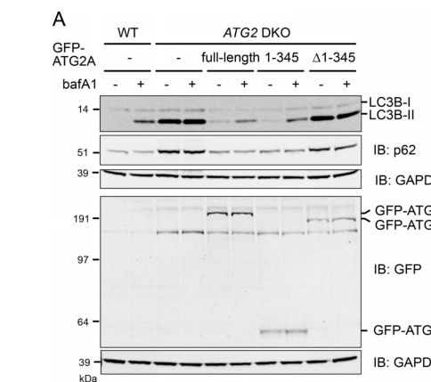

## Question

# Gene Research for Functional Annotation

## ⚠️ CRITICAL: Gene/Protein Identification Context

**BEFORE YOU BEGIN RESEARCH:** You MUST verify you are researching the CORRECT gene/protein. Gene symbols can be ambiguous, especially for less well-characterized genes from non-model organisms.

### Target Gene/Protein Identity (from UniProt):
- **UniProt Accession:** Q96BY7
- **Protein Description:** RecName: Full=Autophagy-related protein 2 homolog B {ECO:0000303|PubMed:22219374};
- **Gene Information:** Name=ATG2B {ECO:0000303|PubMed:22219374, ECO:0000312|HGNC:HGNC:20187}; Synonyms=C14orf103 {ECO:0000312|HGNC:HGNC:20187};
- **Organism (full):** Homo sapiens (Human).
- **Protein Family:** Belongs to the ATG2 family. .
- **Key Domains:** ATG2. (IPR026849); ATG2_CAD (PF13329)

### MANDATORY VERIFICATION STEPS:

1. **Check if the gene symbol "ATG2B" matches the protein description above**
2. **Verify the organism is correct:** Homo sapiens (Human).
3. **Check if protein family/domains align with what you find in literature**
4. **If you find literature for a DIFFERENT gene with the same or similar symbol, STOP**

### If Gene Symbol is Ambiguous or You Cannot Find Relevant Literature:

**DO NOT PROCEED WITH RESEARCH ON A DIFFERENT GENE.** Instead:
- State clearly: "The gene symbol 'ATG2B' is ambiguous or literature is limited for this specific protein"
- Explain what you found (e.g., "Found extensive literature on a different gene with the same symbol in a different organism")
- Describe the protein based ONLY on the UniProt information provided above
- Suggest that the protein function can be inferred from domain/family information

### Research Target:

Please provide a comprehensive research report on the gene **ATG2B** (gene ID: ATG2B, UniProt: Q96BY7) in human.

The research report should be a detailed narrative explaining the function, biological processes, and localization of the gene product. Citations should be given for all claims.

You should prioritize authoritative reviews and primary scientific literature when conducting research. You can supplement
this with annotations you find in gene/protein databases, but these can be outdated or inaccurate.

We are specifically interested in the primary function of the gene - for enzymes, what reaction is catalyzed, and what is the substrate specificity? For transporters, what is the substrate? For structural proteins or adapters, what is the broader structural role? For signaling molecules, what is the role in the pathway.

We are interested in where in or outside the cell the gene product carries out its function.

We are also interested in the signaling or biochemical pathways in which the gene functions. We are less interested in broad pleiotropic effects, except where these elucidate the precise role.

Include evidence where possible. We are interested in both experimental evidence as well as inference from structure, evolution, or bioinformatic analysis. Precise studies should be prioritized over high-throughput, where available.

## Output

Question: You are an expert researcher providing comprehensive, well-cited information.

Provide detailed information focusing on:
1. Key concepts and definitions with current understanding
2. Recent developments and latest research (prioritize 2023-2024 sources)
3. Current applications and real-world implementations
4. Expert opinions and analysis from authoritative sources
5. Relevant statistics and data from recent studies

Format as a comprehensive research report with proper citations. Include URLs and publication dates where available.
Always prioritize recent, authoritative sources and provide specific citations for all major claims.

# Gene Research for Functional Annotation

## ⚠️ CRITICAL: Gene/Protein Identification Context

**BEFORE YOU BEGIN RESEARCH:** You MUST verify you are researching the CORRECT gene/protein. Gene symbols can be ambiguous, especially for less well-characterized genes from non-model organisms.

### Target Gene/Protein Identity (from UniProt):
- **UniProt Accession:** Q96BY7
- **Protein Description:** RecName: Full=Autophagy-related protein 2 homolog B {ECO:0000303|PubMed:22219374};
- **Gene Information:** Name=ATG2B {ECO:0000303|PubMed:22219374, ECO:0000312|HGNC:HGNC:20187}; Synonyms=C14orf103 {ECO:0000312|HGNC:HGNC:20187};
- **Organism (full):** Homo sapiens (Human).
- **Protein Family:** Belongs to the ATG2 family. .
- **Key Domains:** ATG2. (IPR026849); ATG2_CAD (PF13329)

### MANDATORY VERIFICATION STEPS:

1. **Check if the gene symbol "ATG2B" matches the protein description above**
2. **Verify the organism is correct:** Homo sapiens (Human).
3. **Check if protein family/domains align with what you find in literature**
4. **If you find literature for a DIFFERENT gene with the same or similar symbol, STOP**

### If Gene Symbol is Ambiguous or You Cannot Find Relevant Literature:

**DO NOT PROCEED WITH RESEARCH ON A DIFFERENT GENE.** Instead:
- State clearly: "The gene symbol 'ATG2B' is ambiguous or literature is limited for this specific protein"
- Explain what you found (e.g., "Found extensive literature on a different gene with the same symbol in a different organism")
- Describe the protein based ONLY on the UniProt information provided above
- Suggest that the protein function can be inferred from domain/family information

### Research Target:

Please provide a comprehensive research report on the gene **ATG2B** (gene ID: ATG2B, UniProt: Q96BY7) in human.

The research report should be a detailed narrative explaining the function, biological processes, and localization of the gene product. Citations should be given for all claims.

You should prioritize authoritative reviews and primary scientific literature when conducting research. You can supplement
this with annotations you find in gene/protein databases, but these can be outdated or inaccurate.

We are specifically interested in the primary function of the gene - for enzymes, what reaction is catalyzed, and what is the substrate specificity? For transporters, what is the substrate? For structural proteins or adapters, what is the broader structural role? For signaling molecules, what is the role in the pathway.

We are interested in where in or outside the cell the gene product carries out its function.

We are also interested in the signaling or biochemical pathways in which the gene functions. We are less interested in broad pleiotropic effects, except where these elucidate the precise role.

Include evidence where possible. We are interested in both experimental evidence as well as inference from structure, evolution, or bioinformatic analysis. Precise studies should be prioritized over high-throughput, where available.

## Research report: Human **ATG2B** (UniProt: **Q96BY7**; gene: **ATG2B/C14orf103**) — functional annotation and current evidence

### 0) Scope, gene/protein identity verification, and ambiguity checks
ATG2B is a human autophagy gene encoding a large ATG2-family protein that acts in autophagosome biogenesis, particularly phagophore expansion. Mammals have two paralogs, **ATG2A and ATG2B**, which share substantial but incomplete sequence identity (~44.5%) and are frequently **functionally redundant**, such that single depletion often has limited effects while combined perturbation yields strong defects. (duarte2023theorganizationand pages 4-5)

**Critical limitation (identifier mapping):** In the retrieved full-text sources, an explicit statement mapping human ATG2B to UniProt accession **Q96BY7** was not found. Therefore, the **UniProt accession assignment is taken from the user-provided UniProt record**, while functional and mechanistic statements are supported by primary literature and reviews cited below. (duarte2023theorganizationand pages 4-5, bozic2020aconservedatg2‐gabarap pages 2-4)

### 1) Key concepts and definitions (current understanding)

#### 1.1 Macroautophagy, phagophore expansion, and membrane contact sites
Macroautophagy (“autophagy” in much of the mammalian literature) involves de novo formation of a double-membrane **phagophore/isolation membrane** that expands and closes into an autophagosome, which subsequently fuses with lysosomes for degradation. The expansion step requires large lipid input and is organized at **phagophore–ER membrane contact sites (MCSs)** that concentrate lipid-handling ATG proteins. (duarte2023theorganizationand pages 4-5, duarte2023theorganizationand pages 5-7)

#### 1.2 ATG2-family proteins as bulk lipid transfer “bridges”
A major conceptual advance of the past several years is that ATG2-family proteins (including ATG2A/ATG2B in mammals) are **rod-like lipid transfer/tether proteins** capable of transferring lipids between adjacent membranes. Reviews summarizing biochemical and structural evidence describe ATG2 proteins as having a long hydrophobic cavity/groove consistent with bulk phospholipid transport, functioning together with lipid scramblases (notably ATG9A) to expand autophagic membranes. (duarte2023theorganizationand pages 4-5, mcewan2022atg2andvps13 pages 7-7)

### 2) Molecular function of ATG2B: what does it do?

#### 2.1 Primary function: non-vesicular lipid transfer that enables phagophore expansion
Although many direct in vitro transfer assays are performed using ATG2A, mammalian ATG2A and ATG2B are generally treated as **redundant lipid-transfer modules** in cells. A 2023 review summarizes that ATG2 proteins transfer lipids between membranes and that the N-terminus associates with ER while C-terminal regions contribute to phagophore binding, placing ATG2-mediated lipid transfer at the **ER–phagophore interface** where expansion occurs. (duarte2023theorganizationand pages 5-7, duarte2023theorganizationand pages 4-5)

**Strong functional evidence from combined loss-of-function:** In human cells, deletion of **both ATG2A and ATG2B** (ATG2 DKO) blocks autophagic flux, with accumulation of LC3B-II and p62 and reduced lysosomal flux; re-expression of ATG2A rescues these phenotypes. (valverde2019atg2transportslipids pages 4-6)

**Lipid-transfer dependence:** A key mechanistic finding is that a lipid-transfer competent N-terminal fragment (“mini-ATG2A”, residues 1–345) can rescue autophagy in ATG2 DKO cells, whereas lipid-transport-defective mutants fail to rescue; near-complete rescue required ~10× endogenous-level expression of the mini-fragment. This supports a model in which ATG2’s essential cellular role is lipid transfer that provides membrane material for phagophore growth. (valverde2019atg2transportslipids pages 4-6)

**Figure evidence (direct experimental readout):** Immunoblot and imaging panels show the ATG2 DKO flux defect and rescue by full-length or mini-ATG2A, and failure of lipid-transport-dead mutants to rescue. (valverde2019atg2transportslipids media f607665f)

#### 2.2 ATG2B is not an enzyme catalyzing a classical reaction
ATG2B is best described as a **lipid transfer/tether protein** rather than a catalytic enzyme with a single defined reaction. Its “substrate” is bulk membrane lipid (phospholipids) transported between donor membranes (classically ER; increasingly also other organelles) and the expanding phagophore. (mcewan2022atg2andvps13 pages 7-7, duarte2023theorganizationand pages 4-5)

### 3) Subcellular localization: where does ATG2B act?

#### 3.1 ER–phagophore contact sites and early autophagy membranes
ATG2 proteins localize to ER–phagophore MCSs, consistent with their tethering and lipid transfer roles. A 2023 synthesis notes localization at the phagophore rim and ER MCSs, with the N-terminus engaging ER and C-terminal elements supporting phagophore association. (duarte2023theorganizationand pages 5-7)

#### 3.2 Direct ATG2B localization evidence
In mammalian starvation conditions, **endogenous ATG2B** co-localizes with GFP-ATG2A on punctate and ring-like LC3B-positive structures and with early autophagy markers including WIPI2 and ATG16L1, consistent with recruitment to early autophagic membranes/omegasome–isolation membrane structures. (bozic2020aconservedatg2‐gabarap pages 2-4)

### 4) Interaction partners and pathway placement

#### 4.1 WIPI4/WDR45 (Atg18 family)
ATG2 proteins interact with WIPI family PI3P effectors, including **WIPI4/WDR45**, which can recruit ATG2A to PI3P-containing membranes in vitro and is widely discussed as a targeting/tethering partner. (maeda2019theautophagicmembrane pages 12-14)

However, in mammalian cells, ATG2–WIPI4 binding appears **less critical** for autophagy flux than ATG2’s interaction with ATG8-family proteins: ATG2A mutants defective in WIPI4 binding can still restore autophagy flux, whereas mutants defective in GABARAP binding cannot. (bozic2020aconservedatg2‐gabarap pages 1-2, mcewan2022atg2andvps13 pages 7-7)

#### 4.2 ATG8-family proteins (GABARAP subfamily) via an ATG2 LIR
A major experimentally supported mechanism placing ATG2B in the pathway is binding to ATG8-family proteins (especially **GABARAP/GABARAP-L1**) through a conserved ATG2 **LC3-interaction region (LIR)**.

- ATG2A/ATG2B preferentially interact with GABARAP family members; starvation enhances ATG2–GABARAP co-precipitation, while LC3B interaction is comparatively weak in the cited experiments. (bozic2020aconservedatg2‐gabarap pages 2-4)
- Disrupting the ATG2–GABARAP interaction blocks phagophore formation/closure and phenocopies ATG2A/ATG2B double knockout. (bozic2020aconservedatg2‐gabarap pages 1-2)

These findings underpin an expert consensus that ATG2’s **GABARAP interaction is essential for late phagophore maturation/closure**, while WIPI4 may be a stabilizer/recruitment factor rather than the primary essential linkage in mammals. (mcewan2022atg2andvps13 pages 7-7, duarte2023theorganizationand pages 4-5)

#### 4.3 ATG9A and lipid scrambling
Autophagosome biogenesis requires coordination of lipid transfer with lipid scrambling; ATG9A is widely discussed as a scramblase that cooperates with ATG2-mediated bulk transfer. ATG9A also binds ATG2A in mammalian systems, consistent with a coupled lipid-handling module at phagophore–ER MCSs. (duarte2023theorganizationand pages 4-5, mcewan2022atg2andvps13 pages 7-7)

### 5) Recent developments and latest research (prioritizing 2023–2024)

#### 5.1 2023: Noncanonical ATG2 engagement after lysosome damage
A 2023 Journal of Cell Biology study reported that lysosome damage induces a **noncanonical ATG8 conjugation response** (CASM) in which ATG8s are directly conjugated to lysosomal single membranes. This response promotes robust **LC3A engagement with ATG2**, linking ATG2 lipid-transfer machinery to lysosomal damage responses and repair-associated pathways beyond canonical autophagosome formation. (cross2023lysosomedamagetriggers pages 1-2)

#### 5.2 2024: Endosomes as an additional lipid source for ATG2-mediated phagophore growth (ANKFY1)
A 2024 Cell Discovery paper identified **ANKFY1** as an endosome-localized ATG2A-binding protein that binds PI3P via a FYVE domain and enhances ATG2A-mediated lipid transfer between PI3P-containing liposomes. In cells, ANKFY1 depletion impaired autophagosome growth and reduced autophagy flux, **largely phenocopying ATG2A/B depletion**, and ANKFY1 co-localized with ATG2A between endosomes and phagophores. The authors propose that PI3P-enriched endosomes can donate lipids (including PI3P-associated lipid pools) to phagophores via ATG2-mediated transfer, extending the lipid-source model beyond ER-only. (wei2024ankfy1bridgesatg2amediated pages 1-2)

#### 5.3 2023: Updated expert synthesis of phagophore–ER contact site organization
A 2023 review focused on phagophore–ER MCSs emphasized that mammalian ATG2A and ATG2B are key phagophore expansion factors, are rod-like lipid transfer proteins, and function together with ATG9 and WIPI/PI3P machinery; it highlights remaining open questions regarding how ATG9, ATG2, and WIPI4 coordinate directionality and efficiency of lipid flux. (duarte2023theorganizationand pages 4-5)

### 6) Current applications and real-world implementations

#### 6.1 Clinical genetics: germline 14q32 duplication involving ATG2B and GSKIP
A highly actionable real-world context for ATG2B is **germline predisposition to myeloid malignancies** through copy-number duplication.

A 2015 Nature Genetics study identified an autosomal-dominant **~700-kb germline duplication on chromosome 14q32** that includes **ATG2B and GSKIP** and co-segregates with familial myeloid malignancies (including essential thrombocythemia and other MPNs, with progression in some cases to myelofibrosis or AML). Mechanistically, ATG2B/GSKIP overexpression in patient-derived systems increased progenitor differentiation and sensitivity to thrombopoietin and appeared to cooperate with common somatic MPN drivers (JAK2/MPL/CALR), consistent with a “germline fitness” effect that increases the likelihood of malignant evolution. (saliba2015germlineduplicationof pages 1-3, saliba2015germlineduplicationof pages 4-5)

A 2022 mechanistic genetics study in mice reported that combined loss of Atg2b and Gskip (but not either gene alone) causes severe hematopoietic defects (including reduced HSC pools), emphasizing that the locus has dosage-sensitive biology relevant to hematopoiesis, although effects in that model were described as not driven by canonical autophagy changes. (sakai2022lossofatg2b pages 1-2, sakai2022lossofatg2b pages 2-5)

**Implementation in practice:** The 14q32 duplication is used in hereditary hematologic malignancy workups and genetic counseling as part of germline predisposition evaluation; although management guidance was not directly retrieved here, the original Nature Genetics evidence supports its role as a familial predisposition allele. (saliba2015germlineduplicationof pages 1-3)

#### 6.2 Hypothesis-generating disease associations from Open Targets
Open Targets lists multiple disease associations for ATG2B (e.g., Sjögren syndrome, heart disease, neurodegenerative disease, colorectal carcinoma), each supported by limited evidence items and PubMed links; these associations can be used to prioritize follow-up but should not be interpreted as causal without reviewing the underlying studies. (OpenTargets Search: -ATG2B)

### 7) Relevant statistics and data points from recent/authoritative studies

- **ATG2 DKO autophagy flux defect and rescue:** ATG2A/ATG2B double knockout causes LC3B-II and p62 accumulation with reduced lysosomal flux; mini-ATG2A(1–345) can rescue, with **near-complete rescue requiring ~10× endogenous expression**. (valverde2019atg2transportslipids pages 4-6)
- **Clinical genetics functional impact (14q32 duplication):** Patient iPSC differentiation showed a **~10-fold increase in colony formation**, and patient megakaryocytes showed **~2–3× overexpression** of ATG2B/GSKIP; knockdown reduced CFU-MK output to **~40% of maximal** under TPO stimulation. (saliba2015germlineduplicationof pages 4-5, saliba2015germlineduplicationof pages 7-8)

### 8) Expert opinions and analysis (authoritative syntheses)
Two expert reviews provide a coherent interpretation of ATG2B’s role within modern autophagy models:

- ATG2A/ATG2B are described as “molecular highways” enabling bulk lipid transfer to drive membrane expansion and organelle communication, acting together with ATG9A scramblase activity and PI3P/WIPI scaffolding at ER–phagophore contact sites. (mcewan2022atg2andvps13 pages 7-7)
- A focused 2023 MCS review emphasizes the centrality of ATG2A/ATG2B at phagophore–ER MCSs while noting that mechanistic coupling among ATG9, ATG2, and WIPI4 and the directionality of lipid flux remain incompletely resolved. (duarte2023theorganizationand pages 4-5)

### 9) Summary table of evidence
The following table consolidates primary and review evidence for ATG2B functional annotation, including 2023–2024 developments and clinical genetics.

| Aspect | Key finding | Evidence type (review/primary) | System/model | Key experimental readout or statistic | Citation (first author year) | URL/DOI | Notes on ATG2A vs ATG2B specificity |
|---|---|---|---|---|---|---|---|
| Identity/family | Human ATG2B is the ATG2-family paralog of ATG2A; both are very large rod-like autophagy factors with conserved N-terminal chorein/VPS13-like region, ATG2_CAD, ATG_C, a C-terminal localization region, and a conserved LIR near the WIPI4-interaction region. | Review | Mammalian/yeast comparative literature synthesis | ATG2A is ~44.5% identical to ATG2B; single depletion of either paralog does not abolish autophagy. (duarte2023theorganizationand pages 4-5) | Duarte 2023 | https://doi.org/10.1177/25152564231183898 | Strong family-level evidence; most mechanistic papers test ATG2A directly and infer partial redundancy with ATG2B. |
| Function | ATG2 proteins act as lipid transfer proteins and membrane tethers that support phagophore expansion at ER–phagophore contact sites. | Review | Mammalian autophagy field overview | ATG2 transfers phospholipids from ER to phagophore; ATG9A scramblase activity complements transfer by equilibrating leaflets. (mcewan2022atg2andvps13 pages 7-7, duarte2023theorganizationand pages 5-7) | McEwan 2022 | https://doi.org/10.1111/febs.16280 | Function generally assigned to ATG2A/ATG2B together in mammals; direct in vitro assays are mostly with ATG2A. |
| Function | ATG2-mediated lipid transfer is sufficient to restore autophagy in ATG2A/ATG2B double-knockout cells when an active N-terminal ATG2A mini-fragment is expressed. | Primary | Human ATG2 DKO cells with rescue constructs | Mini-ATG2A(1–345) rescued autophagy; near-complete rescue required ~10× endogenous expression; lipid-transfer-defective mutants failed to rescue. (valverde2019atg2transportslipids pages 4-6, valverde2019atg2transportslipids media f607665f) | Valverde 2019 | https://doi.org/10.1083/jcb.201811139 | Rescue tested with ATG2A, but phenotype is defined in ATG2A/ATG2B DKO cells, supporting redundancy. |
| Interaction | A conserved ATG2 LIR mediates preferential binding to GABARAP-family proteins and is critical for phagophore maturation/closure. | Primary | Mammalian cells; biochemical binding assays | Mutation of the ATG2 LIR abolished ATG8-family binding and blocked phagophore formation/closure, phenocopying ATG2A/ATG2B DKO; starvation increased ATG2–GABARAP co-precipitation. (bozic2020aconservedatg2‐gabarap pages 2-4, bozic2020aconservedatg2‐gabarap pages 1-2) | Bozic 2020 | https://doi.org/10.15252/embr.201948412 | Demonstrated for both ATG2A and ATG2B family architecture; endogenous ATG2B co-localized with GFP-ATG2A. |
| Interaction | WIPI4/WDR45 binds mammalian ATG2 proteins, but ATG2–WIPI4 binding appears less essential than ATG2–GABARAP binding for autophagy flux in mammalian cells. | Primary + review | Mammalian cells; literature synthesis | WIPI4-binding mutants retained autophagy rescue, whereas GABARAP-binding mutants did not. (bozic2020aconservedatg2‐gabarap pages 1-2, mcewan2022atg2andvps13 pages 7-7) | Bozic 2020 | https://doi.org/10.15252/embr.201948412 | WIPI4 interacts with both ATG2A and ATG2B; functional importance may differ from yeast precedent. |
| Localization | ATG2 localizes to ER–phagophore/omegasome contact sites; N-terminus associates with ER and C-terminal regions contribute to phagophore binding. | Review | Mammalian/yeast literature synthesis | Overexpressed GFP-ATG2A localizes to phagophore rim and ER MCSs; coincidence binding to ATG9 and PI3P helps phagophore-edge association. (duarte2023theorganizationand pages 5-7) | Duarte 2023 | https://doi.org/10.1177/25152564231183898 | Localization model is derived mainly from ATG2A and yeast Atg2, but considered applicable to mammalian ATG2B as a redundant paralog. |
| Localization | Endogenous ATG2B and GFP-ATG2A co-localize on punctate/ring-like LC3B-positive starvation-induced structures together with early autophagy markers WIPI2 and ATG16L1. | Primary | Starved mammalian cells | Co-localization with LC3B, WIPI2, ATG16L1 on early autophagic structures. (bozic2020aconservedatg2‐gabarap pages 2-4) | Bozic 2020 | https://doi.org/10.15252/embr.201948412 | One of the clearer pieces of direct ATG2B localization evidence in human/mammalian cells. |
| Phenotype | Simultaneous loss of ATG2A and ATG2B causes accumulation of small, open, immature phagophores and blocks autophagic flux. | Primary | Mammalian double depletion/KO systems | LC3B-II, GABARAPL1, and p62 accumulate; bafilomycin A1 fails to further increase LC3B-II in ATG2 DKO; large LC3-positive structures accumulate. (valverde2019atg2transportslipids pages 4-6, valverde2019atg2transportslipids media f607665f, bozic2020aconservedatg2‐gabarap pages 2-4) | Valverde 2019 | https://doi.org/10.1083/jcb.201811139 | Strongest functional evidence is for combined ATG2A/ATG2B loss, indicating partial redundancy. |
| Phenotype | ATG2A/B deficiency can shift stress responses away from cytoprotective autophagy toward apoptosis/caspase-8 activation. | Primary | Mammalian cells | Combined ATG2A/B loss caused immature autophagosomal membrane accumulation and altered death signaling. (context from paper search result; summarized in retrieved metadata) | Tang 2017 | https://doi.org/10.1038/cdd.2017.133 | Study addresses combined deficiency, not ATG2B alone. |
| New mechanism (2024) | ANKFY1 is a new ATG2A-binding factor that recruits/promotes ATG2-mediated lipid transfer from PI3P-positive endosomes to phagophores, identifying endosomes as an additional lipid source. | Primary | Mammalian cells; purified proteins/liposomes | ANKFY1 depletion impaired autophagosome growth and autophagy flux and largely phenocopied ATG2A/B depletion; recombinant ANKFY1 enhanced ATG2A-mediated lipid transfer; UVRAG, ANKFY1, or ATG2A/B depletion reduced PI3P on phagophores. (wei2024ankfy1bridgesatg2amediated pages 1-2) | Wei 2024 | https://doi.org/10.1038/s41421-024-00659-y | Direct binding was shown for ATG2A, but authors state ATG2A and ATG2B are functionally redundant in mammalian autophagy. |
| New mechanism (2023) | Lysosome damage triggers non-canonical ATG8 conjugation that engages ATG2 in a repair-associated pathway, extending ATG2 function beyond canonical autophagosome biogenesis. | Primary | Mammalian lysosome damage model | CASM generated direct ATG8 conjugation to lysosomal membranes and promoted robust LC3A engagement with ATG2. (cross2023lysosomedamagetriggers pages 1-2) | Cross 2023 | https://doi.org/10.1083/jcb.202303078 | Study discusses mammalian ATG2A/ATG2B collectively; isoform-specific distinctions were not emphasized. |
| Pathway context | ATG2 functions with ATG9A scramblase and WIPI/PI3P machinery at phagophore–ER contact sites; GABARAP interaction is especially important for late phagophore maturation. | Review | Autophagy pathway synthesis | Integrates lipid transfer, ATG9A scrambling, PI3P/WIPI scaffolding, and ATG8-family interactions in autophagosome biogenesis. (duarte2023theorganizationand pages 4-5, mcewan2022atg2andvps13 pages 7-7) | Duarte 2023 | https://doi.org/10.1177/25152564231183898 | Pathway assignment applies to mammalian ATG2A and ATG2B together. |
| Disease genetics | A germline ~700-kb duplication at 14q32 including ATG2B and GSKIP segregates with familial myeloid malignancies. | Primary | Human pedigrees with familial MPN/AML spectrum | Duplication predisposed to ET/MPN and progression to AML/myelofibrosis/CMML; overexpression of ATG2B/GSKIP enhanced hematopoietic progenitor differentiation and cooperated with JAK2/MPL/CALR driver mutations. (saliba2015germlineduplicationof pages 1-3) | Saliba 2015 | https://doi.org/10.1038/ng.3380 | Disease association is not ATG2B-only because the duplicated interval also contains GSKIP. |
| Disease mechanism | In patient-derived models, increased ATG2B/GSKIP dosage promoted hematopoietic output and megakaryopoiesis. | Primary | Patient cells, iPSC differentiation, megakaryocyte assays | ~10-fold increase in colony formation in iPSC differentiation assays; two- to threefold overexpression in megakaryocytes; shRNA silencing reduced TPO-independent megakaryocyte formation and CFU-MK output to ~40% of maximal stimulated colonies. (saliba2015germlineduplicationof pages 4-5, saliba2015germlineduplicationof pages 7-8) | Saliba 2015 | https://doi.org/10.1038/ng.3380 | Mechanistic attribution remains shared between ATG2B and GSKIP. |
| Disease relevance/update | Mouse combined loss of Atg2b and Gskip impaired hematopoietic stem cell maintenance, supporting dosage-sensitive biology of the 14q32 locus, though effects were reported as autophagy-independent in that context. | Primary | Mouse knockout | Double knockout caused in utero lethality, decreased HSC pool size, and increased apoptosis; single knockouts showed little hematopoietic phenotype. (sakai2022lossofatg2b pages 1-2, sakai2022lossofatg2b pages 2-5) | Sakai 2022 | https://doi.org/10.1128/mcb.00024-21 | Again a locus-level effect (Atg2b + Gskip), not cleanly ATG2B-specific. |

*Table: This table summarizes the main functional, localization, interaction, phenotype, and disease-association evidence relevant to human ATG2B/Q96BY7. It emphasizes recent 2023-2024 studies while retaining foundational mechanistic and clinical genetics papers needed for a robust annotation.*

### 10) Conclusions (functional annotation)
**Best-supported primary function:** Human ATG2B (as part of the mammalian ATG2A/ATG2B module) is a core autophagy factor that supports **phagophore expansion** by **non-vesicular bulk lipid transfer** at **ER–phagophore membrane contact sites**, in coordination with lipid scrambling (ATG9A) and PI3P/WIPI scaffolding. (duarte2023theorganizationand pages 4-5, mcewan2022atg2andvps13 pages 7-7, duarte2023theorganizationand pages 5-7)

**Best-supported interaction logic:** A conserved ATG2 LIR mediating **GABARAP-family binding** is essential for phagophore maturation/closure and for productive autophagy flux in mammalian cells; WIPI4 binding is important for recruitment in vitro and is part of the canonical complex, but appears less essential than GABARAP engagement in mammalian flux assays. (bozic2020aconservedatg2‐gabarap pages 1-2, bozic2020aconservedatg2‐gabarap pages 2-4, mcewan2022atg2andvps13 pages 7-7)

**Most relevant 2023–2024 updates:** ATG2 engagement is implicated in lysosome damage responses via noncanonical ATG8 conjugation (2023), and endosome-to-phagophore lipid transfer via ATG2 can be promoted by ANKFY1, expanding the set of lipid donor organelles beyond the ER (2024). (cross2023lysosomedamagetriggers pages 1-2, wei2024ankfy1bridgesatg2amediated pages 1-2)

**Translational relevance:** Germline 14q32 duplication including ATG2B and GSKIP is a well-supported familial predisposition to myeloid malignancy spectrum disorders, with functional evidence for altered hematopoietic progenitor behavior. (saliba2015germlineduplicationof pages 1-3, saliba2015germlineduplicationof pages 4-5)

References

1. (duarte2023theorganizationand pages 4-5): Prado Vargas Duarte and Fulvio Reggiori. The organization and function of the phagophore-er membrane contact sites. Contact, Jan 2023. URL: https://doi.org/10.1177/25152564231183898, doi:10.1177/25152564231183898. This article has 15 citations.

2. (bozic2020aconservedatg2‐gabarap pages 2-4): Mihaela Bozic, Luuk van den Bekerom, Beth A Milne, Nicola Goodman, Lisa Roberston, Alan R Prescott, Thomas J Macartney, Nina Dawe, and David G McEwan. A conserved atg2‐gabarap family interaction is critical for phagophore formation. EMBO reports, Feb 2020. URL: https://doi.org/10.15252/embr.201948412, doi:10.15252/embr.201948412. This article has 113 citations and is from a highest quality peer-reviewed journal.

3. (duarte2023theorganizationand pages 5-7): Prado Vargas Duarte and Fulvio Reggiori. The organization and function of the phagophore-er membrane contact sites. Contact, Jan 2023. URL: https://doi.org/10.1177/25152564231183898, doi:10.1177/25152564231183898. This article has 15 citations.

4. (mcewan2022atg2andvps13 pages 7-7): David G. McEwan and Kevin M. Ryan. Atg2 and vps13 proteins: molecular highways transporting lipids to drive membrane expansion and organelle communication. The FEBS Journal, 289:7113-7127, Nov 2022. URL: https://doi.org/10.1111/febs.16280, doi:10.1111/febs.16280. This article has 26 citations.

5. (valverde2019atg2transportslipids pages 4-6): Diana P. Valverde, Shenliang Yu, Venkata Boggavarapu, Nikit Kumar, Joshua A. Lees, Thomas Walz, Karin M. Reinisch, and Thomas J. Melia. Atg2 transports lipids to promote autophagosome biogenesis. The Journal of Cell Biology, 218:1787-1798, Apr 2019. URL: https://doi.org/10.1083/jcb.201811139, doi:10.1083/jcb.201811139. This article has 598 citations.

6. (valverde2019atg2transportslipids media f607665f): Diana P. Valverde, Shenliang Yu, Venkata Boggavarapu, Nikit Kumar, Joshua A. Lees, Thomas Walz, Karin M. Reinisch, and Thomas J. Melia. Atg2 transports lipids to promote autophagosome biogenesis. The Journal of Cell Biology, 218:1787-1798, Apr 2019. URL: https://doi.org/10.1083/jcb.201811139, doi:10.1083/jcb.201811139. This article has 598 citations.

7. (maeda2019theautophagicmembrane pages 12-14): Shintaro Maeda, Chinatsu Otomo, and Takanori Otomo. The autophagic membrane tether atg2a transfers lipids between membranes. Jul 2019. URL: https://doi.org/10.7554/elife.45777, doi:10.7554/elife.45777. This article has 387 citations and is from a domain leading peer-reviewed journal.

8. (bozic2020aconservedatg2‐gabarap pages 1-2): Mihaela Bozic, Luuk van den Bekerom, Beth A Milne, Nicola Goodman, Lisa Roberston, Alan R Prescott, Thomas J Macartney, Nina Dawe, and David G McEwan. A conserved atg2‐gabarap family interaction is critical for phagophore formation. EMBO reports, Feb 2020. URL: https://doi.org/10.15252/embr.201948412, doi:10.15252/embr.201948412. This article has 113 citations and is from a highest quality peer-reviewed journal.

9. (cross2023lysosomedamagetriggers pages 1-2): Jake Cross, Joanne Durgan, David G. McEwan, Matthew Tayler, Kevin M. Ryan, and Oliver Florey. Lysosome damage triggers direct atg8 conjugation and atg2 engagement via non-canonical autophagy. The Journal of Cell Biology, Oct 2023. URL: https://doi.org/10.1083/jcb.202303078, doi:10.1083/jcb.202303078. This article has 94 citations.

10. (wei2024ankfy1bridgesatg2amediated pages 1-2): Bin Wei, Yuhui Fu, Xiuzhi Li, Fang Chen, Yiqing Zhang, Hanmo Chen, Mindan Tong, Linsen Li, Yi Pan, Shen Zhang, She Chen, Xiaoxia Liu, and Qing Zhong. Ankfy1 bridges atg2a-mediated lipid transfer from endosomes to phagophores. Cell Discovery, Apr 2024. URL: https://doi.org/10.1038/s41421-024-00659-y, doi:10.1038/s41421-024-00659-y. This article has 13 citations and is from a peer-reviewed journal.

11. (saliba2015germlineduplicationof pages 1-3): Joseph Saliba, Cécile Saint-Martin, Antonio Di Stefano, Gaëlle Lenglet, Caroline Marty, Boris Keren, Florence Pasquier, Véronique Della Valle, Lise Secardin, Gwendoline Leroy, Emna Mahfoudhi, Sarah Grosjean, Nathalie Droin, M'boyba Diop, Philippe Dessen, Sabine Charrier, Alberta Palazzo, Jane Merlevede, Jean-Côme Meniane, Christine Delaunay-Darivon, Pascal Fuseau, Françoise Isnard, Nicole Casadevall, Eric Solary, Najet Debili, Olivier A Bernard, Hana Raslova, Albert Najman, William Vainchenker, Christine Bellanné-Chantelot, and Isabelle Plo. Germline duplication of atg2b and gskip predisposes to familial myeloid malignancies. Nature Genetics, 47:1131-1140, Aug 2015. URL: https://doi.org/10.1038/ng.3380, doi:10.1038/ng.3380. This article has 163 citations and is from a highest quality peer-reviewed journal.

12. (saliba2015germlineduplicationof pages 4-5): Joseph Saliba, Cécile Saint-Martin, Antonio Di Stefano, Gaëlle Lenglet, Caroline Marty, Boris Keren, Florence Pasquier, Véronique Della Valle, Lise Secardin, Gwendoline Leroy, Emna Mahfoudhi, Sarah Grosjean, Nathalie Droin, M'boyba Diop, Philippe Dessen, Sabine Charrier, Alberta Palazzo, Jane Merlevede, Jean-Côme Meniane, Christine Delaunay-Darivon, Pascal Fuseau, Françoise Isnard, Nicole Casadevall, Eric Solary, Najet Debili, Olivier A Bernard, Hana Raslova, Albert Najman, William Vainchenker, Christine Bellanné-Chantelot, and Isabelle Plo. Germline duplication of atg2b and gskip predisposes to familial myeloid malignancies. Nature Genetics, 47:1131-1140, Aug 2015. URL: https://doi.org/10.1038/ng.3380, doi:10.1038/ng.3380. This article has 163 citations and is from a highest quality peer-reviewed journal.

13. (sakai2022lossofatg2b pages 1-2): Shun-suke Sakai, Atsushi Hasegawa, Ryosuke Ishimura, Naoki Tamura, Shun Kageyama, Satoko Komatsu-Hirota, Manabu Abe, Yiwei Ling, Shujiro Okuda, Manabu Funayama, Mika Kikkawa, Yoshiki Miura, Kenji Sakimura, Ichiei Narita, Satoshi Waguri, Ritsuko Shimizu, and Masaaki Komatsu. Loss of <i>atg2b</i> and <i>gskip</i> impairs the maintenance of the hematopoietic stem cell pool size. Jan 2022. URL: https://doi.org/10.1128/mcb.00024-21, doi:10.1128/mcb.00024-21. This article has 8 citations and is from a domain leading peer-reviewed journal.

14. (sakai2022lossofatg2b pages 2-5): Shun-suke Sakai, Atsushi Hasegawa, Ryosuke Ishimura, Naoki Tamura, Shun Kageyama, Satoko Komatsu-Hirota, Manabu Abe, Yiwei Ling, Shujiro Okuda, Manabu Funayama, Mika Kikkawa, Yoshiki Miura, Kenji Sakimura, Ichiei Narita, Satoshi Waguri, Ritsuko Shimizu, and Masaaki Komatsu. Loss of <i>atg2b</i> and <i>gskip</i> impairs the maintenance of the hematopoietic stem cell pool size. Jan 2022. URL: https://doi.org/10.1128/mcb.00024-21, doi:10.1128/mcb.00024-21. This article has 8 citations and is from a domain leading peer-reviewed journal.

15. (OpenTargets Search: -ATG2B): Open Targets Query (-ATG2B, 5 results). Buniello, A. et al. (2025). Open Targets Platform: facilitating therapeutic hypotheses building in drug discovery. Nucleic Acids Research.

16. (saliba2015germlineduplicationof pages 7-8): Joseph Saliba, Cécile Saint-Martin, Antonio Di Stefano, Gaëlle Lenglet, Caroline Marty, Boris Keren, Florence Pasquier, Véronique Della Valle, Lise Secardin, Gwendoline Leroy, Emna Mahfoudhi, Sarah Grosjean, Nathalie Droin, M'boyba Diop, Philippe Dessen, Sabine Charrier, Alberta Palazzo, Jane Merlevede, Jean-Côme Meniane, Christine Delaunay-Darivon, Pascal Fuseau, Françoise Isnard, Nicole Casadevall, Eric Solary, Najet Debili, Olivier A Bernard, Hana Raslova, Albert Najman, William Vainchenker, Christine Bellanné-Chantelot, and Isabelle Plo. Germline duplication of atg2b and gskip predisposes to familial myeloid malignancies. Nature Genetics, 47:1131-1140, Aug 2015. URL: https://doi.org/10.1038/ng.3380, doi:10.1038/ng.3380. This article has 163 citations and is from a highest quality peer-reviewed journal.

## Artifacts

- [Edison artifact artifact-00](ATG2B-deep-research-falcon_artifacts/artifact-00.md)

## Citations

1. duarte2023theorganizationand pages 4-5
2. duarte2023theorganizationand pages 5-7
3. maeda2019theautophagicmembrane pages 12-14
4. cross2023lysosomedamagetriggers pages 1-2
5. saliba2015germlineduplicationof pages 1-3
6. saliba2015germlineduplicationof pages 4-5
7. saliba2015germlineduplicationof pages 7-8
8. https://doi.org/10.1177/25152564231183898
9. https://doi.org/10.1111/febs.16280
10. https://doi.org/10.1083/jcb.201811139
11. https://doi.org/10.15252/embr.201948412
12. https://doi.org/10.1038/cdd.2017.133
13. https://doi.org/10.1038/s41421-024-00659-y
14. https://doi.org/10.1083/jcb.202303078
15. https://doi.org/10.1038/ng.3380
16. https://doi.org/10.1128/mcb.00024-21
17. https://doi.org/10.1177/25152564231183898,
18. https://doi.org/10.15252/embr.201948412,
19. https://doi.org/10.1111/febs.16280,
20. https://doi.org/10.1083/jcb.201811139,
21. https://doi.org/10.7554/elife.45777,
22. https://doi.org/10.1083/jcb.202303078,
23. https://doi.org/10.1038/s41421-024-00659-y,
24. https://doi.org/10.1038/ng.3380,
25. https://doi.org/10.1128/mcb.00024-21,