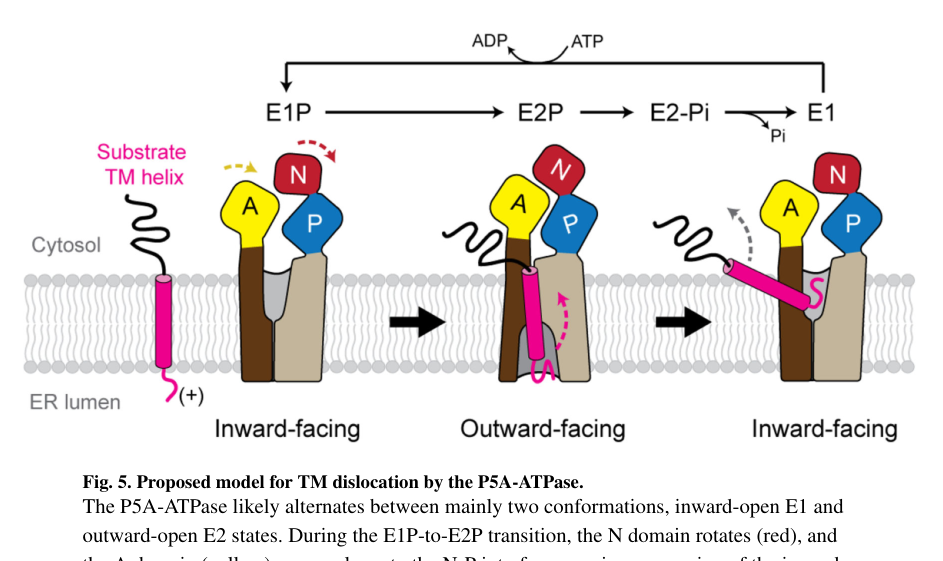

## Question

# Gene Research for Functional Annotation

## ⚠️ CRITICAL: Gene/Protein Identification Context

**BEFORE YOU BEGIN RESEARCH:** You MUST verify you are researching the CORRECT gene/protein. Gene symbols can be ambiguous, especially for less well-characterized genes from non-model organisms.

### Target Gene/Protein Identity (from UniProt):
- **UniProt Accession:** Q9HD20
- **Protein Description:** RecName: Full=Endoplasmic reticulum transmembrane helix translocase {ECO:0000305}; EC=7.4.2.- {ECO:0000269|PubMed:24392018}; AltName: Full=Endoplasmic reticulum P5A-ATPase {ECO:0000303|PubMed:32973005};
- **Gene Information:** Name=ATP13A1 {ECO:0000303|PubMed:32973005, ECO:0000312|HGNC:HGNC:24215}; Synonyms=ATP13A {ECO:0000312|HGNC:HGNC:24215}, KIAA1825 {ECO:0000303|PubMed:11347906}; ORFNames=CGI-152 {ECO:0000303|Ref.1};
- **Organism (full):** Homo sapiens (Human).
- **Protein Family:** Belongs to the cation transport ATPase (P-type) (TC 3.A.3)
- **Key Domains:** 2TM_P5A-ATPase. (IPR057255); ATPase_P-typ_cyto_dom_N. (IPR023299); ATPase_P-typ_P_site. (IPR018303); ATPase_P-typ_TM_dom_sf. (IPR023298); ATPase_P-typ_transduc_dom_A_sf. (IPR008250)

### MANDATORY VERIFICATION STEPS:

1. **Check if the gene symbol "ATP13A1" matches the protein description above**
2. **Verify the organism is correct:** Homo sapiens (Human).
3. **Check if protein family/domains align with what you find in literature**
4. **If you find literature for a DIFFERENT gene with the same or similar symbol, STOP**

### If Gene Symbol is Ambiguous or You Cannot Find Relevant Literature:

**DO NOT PROCEED WITH RESEARCH ON A DIFFERENT GENE.** Instead:
- State clearly: "The gene symbol 'ATP13A1' is ambiguous or literature is limited for this specific protein"
- Explain what you found (e.g., "Found extensive literature on a different gene with the same symbol in a different organism")
- Describe the protein based ONLY on the UniProt information provided above
- Suggest that the protein function can be inferred from domain/family information

### Research Target:

Please provide a comprehensive research report on the gene **ATP13A1** (gene ID: ATP13A1, UniProt: Q9HD20) in human.

The research report should be a detailed narrative explaining the function, biological processes, and localization of the gene product. Citations should be given for all claims.

You should prioritize authoritative reviews and primary scientific literature when conducting research. You can supplement
this with annotations you find in gene/protein databases, but these can be outdated or inaccurate.

We are specifically interested in the primary function of the gene - for enzymes, what reaction is catalyzed, and what is the substrate specificity? For transporters, what is the substrate? For structural proteins or adapters, what is the broader structural role? For signaling molecules, what is the role in the pathway.

We are interested in where in or outside the cell the gene product carries out its function.

We are also interested in the signaling or biochemical pathways in which the gene functions. We are less interested in broad pleiotropic effects, except where these elucidate the precise role.

Include evidence where possible. We are interested in both experimental evidence as well as inference from structure, evolution, or bioinformatic analysis. Precise studies should be prioritized over high-throughput, where available.

## Output

Question: You are an expert researcher providing comprehensive, well-cited information.

Provide detailed information focusing on:
1. Key concepts and definitions with current understanding
2. Recent developments and latest research (prioritize 2023-2024 sources)
3. Current applications and real-world implementations
4. Expert opinions and analysis from authoritative sources
5. Relevant statistics and data from recent studies

Format as a comprehensive research report with proper citations. Include URLs and publication dates where available.
Always prioritize recent, authoritative sources and provide specific citations for all major claims.

# Gene Research for Functional Annotation

## ⚠️ CRITICAL: Gene/Protein Identification Context

**BEFORE YOU BEGIN RESEARCH:** You MUST verify you are researching the CORRECT gene/protein. Gene symbols can be ambiguous, especially for less well-characterized genes from non-model organisms.

### Target Gene/Protein Identity (from UniProt):
- **UniProt Accession:** Q9HD20
- **Protein Description:** RecName: Full=Endoplasmic reticulum transmembrane helix translocase {ECO:0000305}; EC=7.4.2.- {ECO:0000269|PubMed:24392018}; AltName: Full=Endoplasmic reticulum P5A-ATPase {ECO:0000303|PubMed:32973005};
- **Gene Information:** Name=ATP13A1 {ECO:0000303|PubMed:32973005, ECO:0000312|HGNC:HGNC:24215}; Synonyms=ATP13A {ECO:0000312|HGNC:HGNC:24215}, KIAA1825 {ECO:0000303|PubMed:11347906}; ORFNames=CGI-152 {ECO:0000303|Ref.1};
- **Organism (full):** Homo sapiens (Human).
- **Protein Family:** Belongs to the cation transport ATPase (P-type) (TC 3.A.3)
- **Key Domains:** 2TM_P5A-ATPase. (IPR057255); ATPase_P-typ_cyto_dom_N. (IPR023299); ATPase_P-typ_P_site. (IPR018303); ATPase_P-typ_TM_dom_sf. (IPR023298); ATPase_P-typ_transduc_dom_A_sf. (IPR008250)

### MANDATORY VERIFICATION STEPS:

1. **Check if the gene symbol "ATP13A1" matches the protein description above**
2. **Verify the organism is correct:** Homo sapiens (Human).
3. **Check if protein family/domains align with what you find in literature**
4. **If you find literature for a DIFFERENT gene with the same or similar symbol, STOP**

### If Gene Symbol is Ambiguous or You Cannot Find Relevant Literature:

**DO NOT PROCEED WITH RESEARCH ON A DIFFERENT GENE.** Instead:
- State clearly: "The gene symbol 'ATP13A1' is ambiguous or literature is limited for this specific protein"
- Explain what you found (e.g., "Found extensive literature on a different gene with the same symbol in a different organism")
- Describe the protein based ONLY on the UniProt information provided above
- Suggest that the protein function can be inferred from domain/family information

### Research Target:

Please provide a comprehensive research report on the gene **ATP13A1** (gene ID: ATP13A1, UniProt: Q9HD20) in human.

The research report should be a detailed narrative explaining the function, biological processes, and localization of the gene product. Citations should be given for all claims.

You should prioritize authoritative reviews and primary scientific literature when conducting research. You can supplement
this with annotations you find in gene/protein databases, but these can be outdated or inaccurate.

We are specifically interested in the primary function of the gene - for enzymes, what reaction is catalyzed, and what is the substrate specificity? For transporters, what is the substrate? For structural proteins or adapters, what is the broader structural role? For signaling molecules, what is the role in the pathway.

We are interested in where in or outside the cell the gene product carries out its function.

We are also interested in the signaling or biochemical pathways in which the gene functions. We are less interested in broad pleiotropic effects, except where these elucidate the precise role.

Include evidence where possible. We are interested in both experimental evidence as well as inference from structure, evolution, or bioinformatic analysis. Precise studies should be prioritized over high-throughput, where available.

## Research report: Human **ATP13A1** (UniProt **Q9HD20**) — ER P5A-ATPase / transmembrane-helix translocase

### 0) Target verification (critical)
The UniProt entry **Q9HD20** corresponds to **human ATP13A1**, an **endoplasmic reticulum (ER)-resident P5A-type P-type ATPase**, orthologous to **yeast Spf1** and **C. elegans CATP-8**; these studies explicitly equate ATP13A1 with the conserved ER P5A-ATPase whose function is now best described as a **transmembrane-helix dislocase/translocase** involved in **protein targeting fidelity and quality control**. (mckenna2020theendoplasmicreticulum pages 1-2, mckenna2020theendoplasmicreticulum pages 8-9, mckenna2020theendoplasmicreticulum pages 2-4, li2024thestructureand pages 1-2)

### 1) Key concepts and definitions (current understanding)

#### 1.1 P5A-ATPases and “orphan” P-type ATPases
P-type ATPases are primary active transporters that couple ATP hydrolysis to substrate movement via a **covalent phosphoenzyme intermediate** (Post–Albers cycle). Historically, most known P-type ATPases transport ions (e.g., Na+/K+) or lipids (P4 flippases). P5A-ATPases were long considered “orphan” P-type ATPases because their transported substrate was unclear. (mckenna2020theendoplasmicreticulum pages 1-2, li2024thestructureand pages 1-2)

#### 1.2 A “transmembrane helix dislocase”
A dislocase (here) is an ATP-driven membrane machine that **extracts/dislocates transmembrane helices (TMs) or TM-like polypeptide segments** from the lipid bilayer, thereby correcting topogenesis/targeting errors and protecting organelle identity. McKenna et al. provided strong evidence that P5A-ATPases establish **polypeptides (TM helices)** as a distinct class of P-type ATPase substrate. (mckenna2020theendoplasmicreticulum pages 1-2, mckenna2020theendoplasmicreticulum pages 8-9)

#### 1.3 Tail-anchored (TA) proteins and targeting surveillance
Tail-anchored proteins have a single C-terminal TM. Because ER and mitochondrial outer membrane targeting signals overlap in physicochemical properties, TA proteins can mistarget; surveillance systems extract those that land in the wrong membrane. A 2023 review summarizes ATP13A1/Spf1 as an ER factor that **extracts mistargeted TA proteins** to maintain targeting specificity. (mckenna2020theendoplasmicreticulum pages 2-4)

### 2) Molecular function: substrate specificity, directionality, and catalytic mechanism

#### 2.1 Primary molecular function and substrate
The best-supported primary function of ATP13A1 is **ATP-dependent dislocation/extraction of transmembrane helices (polypeptide segments)** from the ER membrane.

* **Direct TM engagement:** Site-specific crosslinking detected UV-dependent adducts between a mitochondrial TA protein TM and ATP13A1, supporting direct physical interaction with TM substrates. (mckenna2020theendoplasmicreticulum pages 2-4)
* **Substrate classes:** Mistargeted **mitochondrial TA proteins** (e.g., OMP25, MAVS, MAOB are among the candidates discussed) and other misinserted/misoriented terminal helices (including certain signal sequences/type II TMs) are implicated as clients. (mckenna2020theendoplasmicreticulum pages 4-6)

#### 2.2 Direction: ER membrane → cytosol/soluble capture
In reconstituted extraction assays using ER-derived vesicles/microsomes, ATP13A1 mediates **ATP-dependent removal of a mitochondrial TM from the ER**, with dislocated substrates captured by cytosolic chaperone components (e.g., SGTA in the assay design), consistent with extraction from membrane into the cytosolic/soluble pool. (mckenna2020theendoplasmicreticulum pages 2-4)

#### 2.3 Catalysis is required (P-type ATPase chemistry)
ATP13A1 function requires its catalytic P-type ATPase activity.

* In knockout-rescue experiments, extraction/phenotypes are rescued by **WT ATP13A1** but not by a **catalytically inactive phosphorylation-site mutant** (e.g., **D533A**). (mckenna2020theendoplasmicreticulum pages 2-4)
* A hydrolysis-deficient mutant (e.g., **D533N**) can stabilize substrate interaction in mechanistic assays, consistent with cycle-dependent substrate handling. (yang2025atp13a1engagessec61 pages 6-7)

### 3) Subcellular localization and where ATP13A1 acts
ATP13A1 is an **ER membrane protein** whose core function is executed at the ER as part of membrane-protein targeting fidelity/quality control. (mckenna2020theendoplasmicreticulum pages 1-2, mckenna2020theendoplasmicreticulum pages 8-9, kulicke2022thep5typeatpase pages 10-12)

### 4) Mechanistic/structural insights (with recent emphasis)

#### 4.1 Structural basis for polypeptide/TM handling (foundational)
McKenna et al. determined cryo-EM structures of the yeast ortholog **Spf1** in multiple conformations and inferred a mechanism applicable to ATP13A1: a **large, membrane-accessible substrate-binding pocket** alternates accessibility toward lumen vs cytosol and remains laterally accessible from the bilayer, consistent with an ATP-driven alternating-access dislocation mechanism for helices. (mckenna2020theendoplasmicreticulum pages 1-2, mckenna2020theendoplasmicreticulum pages 8-9)

#### 4.2 2024 structural advance: transport intermediates and “Plug-domain”
A 2024 Nature Communications study reports multiple intermediates of the P5A transport cycle (E1→E2… states) and identifies a **membrane-spanning cleft** that can hold **polypeptide cargo** in E2P/E2.Pi states, alongside a **Plug-domain** that gates a cytosol-facing cavity in E1 and is displaced in phosphorylated intermediates. This work supports a mechanistic framework for how P5A-ATPases couple the P-type cycle to movement of polypeptide cargo within/through the membrane. (Publication date: Nov 2024; URL: https://doi.org/10.1038/s41467-024-53757-6) (li2024thestructureand pages 1-2)

#### 4.3 Human structural/mechanistic work linking to Sec61 (latest in corpus; 2025)
A 2025 study reports cryo-EM structures of **human ATP13A1** (3.40–3.87 Å) and proposes ATP13A1 can recognize certain **atypical/misoriented signal sequences** and facilitate their productive ER translocation by engaging **SEC61**.

* The substrate pocket is described as conserved and electronegative (including residues like **E492/E496**) and accommodates an α-helical substrate. (yang2025atp13a1engagessec61 pages 6-7)
* Mutations in pocket residues (e.g., **E492/E496**, **L499**) impair function in reported assays. (yang2025atp13a1engagessec61 pages 6-7)

Although outside the requested 2023–2024 window, this provides “latest mechanistic” context currently available in the retrieved corpus. (Publication date: Jun 2025; URL: https://doi.org/10.1126/sciadv.adt1346) (yang2025atp13a1engagessec61 pages 1-2, yang2025atp13a1engagessec61 pages 6-7)

### 5) Biological roles and pathways

#### 5.1 ER proteome safeguarding and organelle identity
ATP13A1 is a quality control factor that limits persistence of ectopically localized mitochondrial TMs in the ER. Loss of P5A-ATPase activity causes accumulation/mislocalization of mitochondrial TA proteins to the ER and broader ER dysfunction phenotypes in model systems, consistent with a safeguarding role for ER identity and proteostasis. (mckenna2020theendoplasmicreticulum pages 1-2, mckenna2020theendoplasmicreticulum pages 2-4, mckenna2020theendoplasmicreticulum pages 4-6)

#### 5.2 Innate immunity: MAVS/RIG-I pathway support
A 2022 study identified ATP13A1 in a genome-wide CRISPR–Cas9 screen as a regulator of the RIG-I pathway, concluding that ATP13A1 deficiency abolishes RIG-I-mediated antiviral responses due to compromised MAVS stability.

* **Screen scale/statistic:** The screen used **GeCKO v2** with **123,411 sgRNAs targeting ~19,050 genes**, and downstream experiments used standard significance thresholds (e.g., **p < 0.01 to p < 0.0001**). (zhang2022theendoplasmicreticulum pages 11-14)
* **Mechanistic assays:** ATP13A1 loss impaired IRF3 dimerization (native PAGE) and affected MAVS aggregation (SDD-AGE), linking ATP13A1 to MAVS activation/stability. (zhang2022theendoplasmicreticulum pages 11-14)
* **In vivo phenotype:** Homozygous Atp13a1 knockout mice show developmental retardation/embryonic lethality, motivating conditional knockouts; **myeloid-specific Atp13a1-deficient mice** were viable but **susceptible to RNA virus infection**. (zhang2022theendoplasmicreticulum pages 1-2)

(Advanced Science; publication date: Oct 2022; URL: https://doi.org/10.1002/advs.202203831) (zhang2022theendoplasmicreticulum pages 1-2)

#### 5.3 Antigen presentation: MR1/MAIT axis
ATP13A1 is implicated as a post-transcriptional determinant of MR1 abundance and MR1-mediated antigen presentation.

* **Genetic discovery:** A gene-trap screen in near-haploid HAP1 cells identified ATP13A1 among the most significant positive regulators of MR1 surface expression. (kulicke2022thep5typeatpase pages 1-3)
* **Causal validation:** CRISPR knockout of ATP13A1 in HAP1.MR1 and THP-1 caused a profound reduction in MR1 protein and a selective defect in MR1-mediated antigen presentation (with little effect on classical MHC I). (kulicke2022thep5typeatpase pages 1-3, kulicke2022thep5typeatpase pages 10-12)
* **Kinetic interpretation:** Pulse-chase labeling suggested reduced MR1 levels essentially immediately after synthesis (within minutes), interpreted as altered nascent synthesis rate or very early co-/post-translational stability rather than later accelerated degradation. (kulicke2022thep5typeatpase pages 10-12)

(Journal of Biological Chemistry; publication date: Feb 2022; URL: https://doi.org/10.1016/j.jbc.2021.101542) (kulicke2022thep5typeatpase pages 1-3)

### 6) Recent developments (prioritizing 2023–2024)

#### 6.1 2024: expanded structural cycle and cargo cleft model
The 2024 P5A structural work strengthens the mechanistic picture that P5A-ATPases can hold polypeptide cargo in a membrane-spanning cleft during phosphorylated intermediates, and introduces a Plug-domain concept for gating. (li2024thestructureand pages 1-2)

#### 6.2 2024: pathway extension to GET3/SEC61 (preprint)
A 2024 bioRxiv preprint proposes a substrate-specific translocation proofreading pathway in which atypical signal sequences insert in reverse orientation, are dislocated by ATP13A1, transferred to **GET3**, and then delivered to **SEC61** for further translocation. (Publication date: Feb 2024; URL: https://doi.org/10.1101/2024.02.12.579870) (yang2024atp13a1engagesget3 pages 1-5)

#### 6.3 2023: synthesis of TA surveillance frameworks
A 2023 review describes ATP13A1/Spf1/CATP-8 as part of TA-protein surveillance that removes mistargeted TA proteins from ER (and analogs from mitochondria), reflecting a consolidation of the “surveillance extractor” concept across systems. (Publication date: Jan 2023; URL: https://doi.org/10.59717/j.xinn-life.2023.100013) (mckenna2020theendoplasmicreticulum pages 2-4)

### 7) Current applications and real-world implementations

1. **Organelle targeting fidelity and membrane proteostasis research:** ATP13A1 knockout/rescue systems and in vitro extraction assays are now used as a testbed for understanding how cells correct mislocalization/topology errors for α-helical membrane proteins, complementing insertion factors (e.g., Sec61/EMC) with “removal/rectification” machinery. (mckenna2020theendoplasmicreticulum pages 1-2, mckenna2020theendoplasmicreticulum pages 2-4)
2. **Innate immunity host-factor studies:** ATP13A1 is a host factor whose loss destabilizes MAVS and blunts RIG-I signaling; conditional mouse knockouts provide an in vivo model for cell-type-specific susceptibility to RNA viruses. (zhang2022theendoplasmicreticulum pages 11-14, zhang2022theendoplasmicreticulum pages 1-2)
3. **Immunology tools for MR1/MAIT biology:** ATP13A1 perturbation (gene-trap and CRISPR KO in HAP1/THP-1) is used to dissect mechanisms controlling MR1 protein abundance and MR1-restricted antigen presentation, with specificity relative to classical MHC I. (kulicke2022thep5typeatpase pages 10-12, kulicke2022thep5typeatpase pages 1-3)

### 8) Expert interpretation and synthesis

**ATP13A1 appears to be an “ER membrane proofreading ATPase”**: rather than pumping a small molecule, it uses the P-type ATPase cycle to recognize and move **problematic hydrophobic polypeptide segments** (mislocalized TA proteins; misoriented signal sequences) out of the ER membrane (and potentially toward downstream pathways such as re-targeting or productive translocation). This reframes ATP13A1’s “substrate specificity” from ions/lipids to **defined classes of membrane helices plus short flanking segments** and emphasizes interplay with targeting factors and the Sec61 translocon. (mckenna2020theendoplasmicreticulum pages 1-2, mckenna2020theendoplasmicreticulum pages 8-9, yang2025atp13a1engagessec61 pages 6-7, li2024thestructureand pages 1-2)

A key open question raised by structural work is whether ATP13A1 is strictly a dislocase or can also facilitate insertion/secretion/topogenesis for selected clients under some contexts; the 2024 structural analysis explicitly notes insertion/secretion cannot be excluded, while the 2024–2025 pathway models propose coupling to GET3/SEC61 for substrate-specific routing. (yang2024atp13a1engagesget3 pages 1-5, li2024thestructureand pages 1-2)

### 9) Quantitative/statistical highlights (from cited studies)
* **Cryo-EM resolution (human ATP13A1):** 3.40–3.87 Å, enabling residue-level identification of substrate-pocket interactions with signal sequences. (yang2025atp13a1engagessec61 pages 1-2)
* **CRISPR screen scale (innate immunity study):** GeCKO v2 library with **123,411 sgRNAs targeting ~19,050 genes**. (zhang2022theendoplasmicreticulum pages 11-14)
* **Early MR1 biosynthesis timepoints:** pulse-chase experiments examined MR1 fate within minutes of translation (e.g., first ~4 min window noted), consistent with ATP13A1 acting at/near cotranslational stages. (kulicke2022thep5typeatpase pages 10-12)

### 10) Disease associations (curated and emerging)
Open Targets lists ATP13A1 disease associations including **neurodegenerative disease** and **Respiratory Syncytial Virus Infection**, with evidence derived from CRISPRi survival datasets linked to PubMed ID 34031600 in the Open Targets evidence rows (association scores modest for most diseases except a higher neurodegenerative disease score in that dataset context). These should be interpreted as hypothesis-generating rather than definitive causal human genetics. (OpenTargets Search: -ATP13A1)

### Visual evidence from primary literature
Cropped panels from McKenna et al. (Science 2020) include: (i) immunofluorescence mislocalization phenotype in ATP13A1 KO cells, (ii) cryo-EM views of the outward-open substrate pocket with putative TM density, and (iii) a proposed mechanistic model for TM dislocation across the ATPase cycle. (mckenna2020theendoplasmicreticulum media 0773d66a, mckenna2020theendoplasmicreticulum media a4a225ef, mckenna2020theendoplasmicreticulum media c903e7d2)

### Summary table (evidence map)
| Aspect | Summary |
|---|---|
| Identity | • ATP13A1 matches human UniProt Q9HD20 and is the ER-resident P5A-ATPase.   • It is the only P5A ATPase in human/mouse and is orthologous to yeast Spf1 and worm CATP-8. (mckenna2020theendoplasmicreticulum pages 1-2, li2024thestructureand pages 1-2, zhang2022theendoplasmicreticulum pages 1-2) |
| Localization | • Predominantly localized to the endoplasmic reticulum membrane.   • Functions at the ER in membrane protein targeting, topology correction, and quality control. (mckenna2020theendoplasmicreticulum pages 1-2, mckenna2020theendoplasmicreticulum pages 8-9, li2024thestructureand pages 1-2) |
| Primary molecular function & substrate | • Best-supported function is ATP-dependent dislocation/extraction of transmembrane helices or polypeptide segments from the ER membrane, not classical ion pumping.   • Substrates include mistargeted mitochondrial tail-anchored proteins, misinserted terminal helices, and some atypical or misoriented signal sequences.   • Supported direction is ER membrane to cytosolic/soluble pool during extraction. (mckenna2020theendoplasmicreticulum pages 1-2, mckenna2020theendoplasmicreticulum pages 8-9, mckenna2020theendoplasmicreticulum pages 2-4, yang2025atp13a1engagessec61 pages 6-7) |
| Mechanism & structure | • Cryo-EM studies show a large membrane-accessible substrate pocket/cleft that alternates between cytosol- and lumen-facing states in a canonical P-type ATPase cycle.   • Substrate preference favors moderately hydrophobic helices with short luminal hydrophilic or basic flanks; large luminal domains are disfavored.   • Recent structures highlight an electronegative pocket and a Plug-domain/gating element; residues such as E492/E496 and L499 contribute to substrate engagement. (mckenna2020theendoplasmicreticulum pages 8-9, mckenna2020theendoplasmicreticulum pages 2-4, yang2025atp13a1engagessec61 pages 6-7, li2024thestructureand pages 1-2, mckenna2020theendoplasmicreticulum media 0773d66a) |
| Key experimental systems & assays | • Core systems include human ATP13A1 knockout cells, yeast Spf1, and worm CATP-8.   • Evidence comes from site-specific crosslinking, cell-free reconstitution and extraction assays, proteomics, immunofluorescence mislocalization assays, and cryo-EM.   • Catalytic dependence was shown by rescue with WT but not phosphorylation-site mutants such as D533A or D533N. (mckenna2020theendoplasmicreticulum pages 1-2, mckenna2020theendoplasmicreticulum pages 2-4, mckenna2020theendoplasmicreticulum pages 4-6, yang2025atp13a1engagessec61 pages 6-7, mckenna2020theendoplasmicreticulum media a4a225ef) |
| Phenotypes & pathways (protein targeting QC, MAVS antiviral, MR1 antigen presentation) | • Protein targeting QC: ATP13A1 loss causes ER accumulation or mislocalization of mitochondrial tail-anchored proteins and broader ER proteostasis defects.   • MAVS antiviral pathway: deficiency compromises MAVS stability, IRF3 activation, and antiviral responses; myeloid-specific knockout mice are more susceptible to RNA virus infection.   • MR1 antigen presentation: ATP13A1 knockout lowers MR1 protein and surface expression and selectively impairs MR1-mediated MAIT-cell activation with little effect on classical MHC I. (mckenna2020theendoplasmicreticulum pages 1-2, zhang2022theendoplasmicreticulum pages 11-14, zhang2022theendoplasmicreticulum pages 1-2, kulicke2022thep5typeatpase pages 10-12, kulicke2022thep5typeatpase pages 1-3, kulicke2021thep5atpaseatp13a1 pages 13-17) |
| Key recent developments 2024-2025 | • 2024 structural work strengthened the model that P5A-ATPases transport polypeptide or helix cargo through a membrane-spanning cleft and identified a possible Plug-domain role.   • 2025 work proposed that human ATP13A1 can transfer atypical signal-sequence substrates to SEC61, extending its role to substrate-specific translocation proofreading.   • Recent expert perspectives place ATP13A1 among ER accessory factors that improve fidelity of membrane protein insertion and organelle identity. (yang2025atp13a1engagessec61 pages 1-2, yang2025atp13a1engagessec61 pages 6-7, li2024thestructureand pages 1-2) |
| Open questions | • Whether ATP13A1 acts only as a dislocase or can also directly support insertion, secretion, or topogenesis for selected substrates remains unresolved.   • The full human substrate spectrum, selection rules, and integration with GET3, SEC61, EMC, ERAD, and mitochondrial targeting pathways are still being defined.   • It remains unclear which immune and developmental phenotypes are direct client-specific effects versus secondary consequences of ER homeostasis failure. (yang2025atp13a1engagessec61 pages 1-2, yang2024atp13a1engagesget3 pages 1-5, li2024thestructureand pages 1-2) |

*Table: This table summarizes the current functional annotation of human ATP13A1 (UniProt Q9HD20), including identity, localization, molecular function, mechanism, experimental evidence, phenotypes, and recent advances. It provides a compact evidence map for the major claims about ATP13A1.*

### Key primary references (URLs and publication dates)
* McKenna MJ et al. **Science** (Sep 2020). “The endoplasmic reticulum P5A-ATPase is a transmembrane helix dislocase.” https://doi.org/10.1126/science.abc5809 (mckenna2020theendoplasmicreticulum pages 1-2)
* Li P et al. **Nature Communications** (Nov 2024). “The structure and function of P5A-ATPases.” https://doi.org/10.1038/s41467-024-53757-6 (li2024thestructureand pages 1-2)
* Yang X et al. **bioRxiv** (Feb 2024). “ATP13A1 engages GET3 to facilitate substrate-specific translocation.” https://doi.org/10.1101/2024.02.12.579870 (yang2024atp13a1engagesget3 pages 1-5)
* Zhang R et al. **Advanced Science** (Oct 2022). “The Endoplasmic Reticulum ATP13A1 is Essential for MAVS‐Mediated Antiviral Innate Immunity.” https://doi.org/10.1002/advs.202203831 (zhang2022theendoplasmicreticulum pages 1-2)
* Kulicke CA et al. **Journal of Biological Chemistry** (Feb 2022). “The P5-type ATPase ATP13A1 modulates MR1-mediated antigen presentation.” https://doi.org/10.1016/j.jbc.2021.101542 (kulicke2022thep5typeatpase pages 1-3)

### Limitations of this report (transparency)
The tool-accessible corpus contained strong 2024 structural work and 2023 surveillance synthesis, but fewer tool-retrievable 2023–2024 review articles explicitly focused on ATP13A1 than expected; therefore, some “expert opinion” sections rely primarily on interpretation from primary mechanistic/structural studies (plus one targeted 2023 review) rather than multiple independent recent reviews. (mckenna2020theendoplasmicreticulum pages 2-4, li2024thestructureand pages 1-2)

References

1. (mckenna2020theendoplasmicreticulum pages 1-2): Michael J. McKenna, Sue Im Sim, Alban Ordureau, Lianjie Wei, J. Wade Harper, Sichen Shao, and Eunyong Park. The endoplasmic reticulum p5a-atpase is a transmembrane helix dislocase. Science, Sep 2020. URL: https://doi.org/10.1126/science.abc5809, doi:10.1126/science.abc5809. This article has 161 citations and is from a highest quality peer-reviewed journal.

2. (mckenna2020theendoplasmicreticulum pages 8-9): Michael J. McKenna, Sue Im Sim, Alban Ordureau, Lianjie Wei, J. Wade Harper, Sichen Shao, and Eunyong Park. The endoplasmic reticulum p5a-atpase is a transmembrane helix dislocase. Science, Sep 2020. URL: https://doi.org/10.1126/science.abc5809, doi:10.1126/science.abc5809. This article has 161 citations and is from a highest quality peer-reviewed journal.

3. (mckenna2020theendoplasmicreticulum pages 2-4): Michael J. McKenna, Sue Im Sim, Alban Ordureau, Lianjie Wei, J. Wade Harper, Sichen Shao, and Eunyong Park. The endoplasmic reticulum p5a-atpase is a transmembrane helix dislocase. Science, Sep 2020. URL: https://doi.org/10.1126/science.abc5809, doi:10.1126/science.abc5809. This article has 161 citations and is from a highest quality peer-reviewed journal.

4. (li2024thestructureand pages 1-2): Ping Li, Viktoria Bågenholm, Per Hägglund, Karin Lindkvist-Petersson, Kaituo Wang, and Pontus Gourdon. The structure and function of p5a-atpases. Nature Communications, Nov 2024. URL: https://doi.org/10.1038/s41467-024-53757-6, doi:10.1038/s41467-024-53757-6. This article has 7 citations and is from a highest quality peer-reviewed journal.

5. (mckenna2020theendoplasmicreticulum pages 4-6): Michael J. McKenna, Sue Im Sim, Alban Ordureau, Lianjie Wei, J. Wade Harper, Sichen Shao, and Eunyong Park. The endoplasmic reticulum p5a-atpase is a transmembrane helix dislocase. Science, Sep 2020. URL: https://doi.org/10.1126/science.abc5809, doi:10.1126/science.abc5809. This article has 161 citations and is from a highest quality peer-reviewed journal.

6. (yang2025atp13a1engagessec61 pages 6-7): Xiaoyan Yang, Yi Li, Chengxi Yang, Tingting Li, Zhiyu Fang, Zhigang Feng, Jun Liao, and Yan Zou. Atp13a1 engages sec61 to facilitate substrate-specific translocation. Jun 2025. URL: https://doi.org/10.1126/sciadv.adt1346, doi:10.1126/sciadv.adt1346. This article has 2 citations and is from a highest quality peer-reviewed journal.

7. (kulicke2022thep5typeatpase pages 10-12): Corinna A. Kulicke, Erica De Zan, Zeynep Hein, Claudia Gonzalez-Lopez, Swapnil Ghanwat, Natacha Veerapen, Gurdyal S. Besra, Paul Klenerman, John C. Christianson, Sebastian Springer, Sebastian M. Nijman, Vincenzo Cerundolo, and Mariolina Salio. The p5-type atpase atp13a1 modulates major histocompatibility complex i-related protein 1 (mr1)-mediated antigen presentation. Feb 2022. URL: https://doi.org/10.1016/j.jbc.2021.101542, doi:10.1016/j.jbc.2021.101542. This article has 13 citations and is from a domain leading peer-reviewed journal.

8. (yang2025atp13a1engagessec61 pages 1-2): Xiaoyan Yang, Yi Li, Chengxi Yang, Tingting Li, Zhiyu Fang, Zhigang Feng, Jun Liao, and Yan Zou. Atp13a1 engages sec61 to facilitate substrate-specific translocation. Jun 2025. URL: https://doi.org/10.1126/sciadv.adt1346, doi:10.1126/sciadv.adt1346. This article has 2 citations and is from a highest quality peer-reviewed journal.

9. (zhang2022theendoplasmicreticulum pages 11-14): Rui Zhang, Xianteng Hou, Changwan Wang, Jiaxin Li, Junyan Zhu, Yingbo Jiang, and Fajian Hou. The endoplasmic reticulum atp13a1 is essential for mavs‐mediated antiviral innate immunity. Advanced Science, Oct 2022. URL: https://doi.org/10.1002/advs.202203831, doi:10.1002/advs.202203831. This article has 14 citations and is from a peer-reviewed journal.

10. (zhang2022theendoplasmicreticulum pages 1-2): Rui Zhang, Xianteng Hou, Changwan Wang, Jiaxin Li, Junyan Zhu, Yingbo Jiang, and Fajian Hou. The endoplasmic reticulum atp13a1 is essential for mavs‐mediated antiviral innate immunity. Advanced Science, Oct 2022. URL: https://doi.org/10.1002/advs.202203831, doi:10.1002/advs.202203831. This article has 14 citations and is from a peer-reviewed journal.

11. (kulicke2022thep5typeatpase pages 1-3): Corinna A. Kulicke, Erica De Zan, Zeynep Hein, Claudia Gonzalez-Lopez, Swapnil Ghanwat, Natacha Veerapen, Gurdyal S. Besra, Paul Klenerman, John C. Christianson, Sebastian Springer, Sebastian M. Nijman, Vincenzo Cerundolo, and Mariolina Salio. The p5-type atpase atp13a1 modulates major histocompatibility complex i-related protein 1 (mr1)-mediated antigen presentation. Feb 2022. URL: https://doi.org/10.1016/j.jbc.2021.101542, doi:10.1016/j.jbc.2021.101542. This article has 13 citations and is from a domain leading peer-reviewed journal.

12. (yang2024atp13a1engagesget3 pages 1-5): Xiaoyan Yang, Tingting Li, Zhiyu Fang, Zhigang Feng, and Yan Zou. Atp13a1 engages get3 to facilitate substrate-specific translocation. bioRxiv, Feb 2024. URL: https://doi.org/10.1101/2024.02.12.579870, doi:10.1101/2024.02.12.579870. This article has 2 citations.

13. (OpenTargets Search: -ATP13A1): Open Targets Query (-ATP13A1, 5 results). Buniello, A. et al. (2025). Open Targets Platform: facilitating therapeutic hypotheses building in drug discovery. Nucleic Acids Research.

14. (mckenna2020theendoplasmicreticulum media 0773d66a): Michael J. McKenna, Sue Im Sim, Alban Ordureau, Lianjie Wei, J. Wade Harper, Sichen Shao, and Eunyong Park. The endoplasmic reticulum p5a-atpase is a transmembrane helix dislocase. Science, Sep 2020. URL: https://doi.org/10.1126/science.abc5809, doi:10.1126/science.abc5809. This article has 161 citations and is from a highest quality peer-reviewed journal.

15. (mckenna2020theendoplasmicreticulum media a4a225ef): Michael J. McKenna, Sue Im Sim, Alban Ordureau, Lianjie Wei, J. Wade Harper, Sichen Shao, and Eunyong Park. The endoplasmic reticulum p5a-atpase is a transmembrane helix dislocase. Science, Sep 2020. URL: https://doi.org/10.1126/science.abc5809, doi:10.1126/science.abc5809. This article has 161 citations and is from a highest quality peer-reviewed journal.

16. (mckenna2020theendoplasmicreticulum media c903e7d2): Michael J. McKenna, Sue Im Sim, Alban Ordureau, Lianjie Wei, J. Wade Harper, Sichen Shao, and Eunyong Park. The endoplasmic reticulum p5a-atpase is a transmembrane helix dislocase. Science, Sep 2020. URL: https://doi.org/10.1126/science.abc5809, doi:10.1126/science.abc5809. This article has 161 citations and is from a highest quality peer-reviewed journal.

17. (kulicke2021thep5atpaseatp13a1 pages 13-17): Corinna A. Kulicke, Erica De Zan, Zeynep Hein, Claudia Gonzalez-Lopez, Swapnil Ghanwat, Natacha Veerapen, Gurdyal S. Besra, Paul Klenerman, John C. Christianson, Sebastian Springer, Sebastian Nijman, Vincenzo Cerundolo, and Mariolina Salio. The p5-atpase atp13a1 modulates mr1-mediated antigen presentation. bioRxiv, May 2021. URL: https://doi.org/10.1101/2021.05.26.445708, doi:10.1101/2021.05.26.445708. This article has 0 citations.

## Artifacts

- [Edison artifact artifact-00](ATP13A1-deep-research-falcon_artifacts/artifact-00.md)

## Citations

1. mckenna2020theendoplasmicreticulum pages 2-4
2. mckenna2020theendoplasmicreticulum pages 4-6
3. li2024thestructureand pages 1-2
4. zhang2022theendoplasmicreticulum pages 11-14
5. zhang2022theendoplasmicreticulum pages 1-2
6. mckenna2020theendoplasmicreticulum pages 1-2
7. mckenna2020theendoplasmicreticulum pages 8-9
8. https://doi.org/10.1038/s41467-024-53757-6
9. https://doi.org/10.1126/sciadv.adt1346
10. https://doi.org/10.1002/advs.202203831
11. https://doi.org/10.1016/j.jbc.2021.101542
12. https://doi.org/10.1101/2024.02.12.579870
13. https://doi.org/10.59717/j.xinn-life.2023.100013
14. https://doi.org/10.1126/science.abc5809
15. https://doi.org/10.1126/science.abc5809,
16. https://doi.org/10.1038/s41467-024-53757-6,
17. https://doi.org/10.1126/sciadv.adt1346,
18. https://doi.org/10.1016/j.jbc.2021.101542,
19. https://doi.org/10.1002/advs.202203831,
20. https://doi.org/10.1101/2024.02.12.579870,
21. https://doi.org/10.1101/2021.05.26.445708,