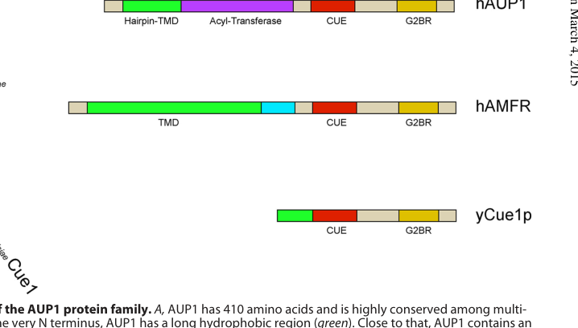

## Question

# Gene Research for Functional Annotation

## ⚠️ CRITICAL: Gene/Protein Identification Context

**BEFORE YOU BEGIN RESEARCH:** You MUST verify you are researching the CORRECT gene/protein. Gene symbols can be ambiguous, especially for less well-characterized genes from non-model organisms.

### Target Gene/Protein Identity (from UniProt):
- **UniProt Accession:** Q9Y679
- **Protein Description:** RecName: Full=Lipid droplet-regulating VLDL assembly factor AUP1 {ECO:0000312|HGNC:HGNC:891}; AltName: Full=Ancient ubiquitous protein 1 {ECO:0000303|PubMed:12042322};
- **Gene Information:** Name=AUP1 {ECO:0000312|HGNC:HGNC:891};
- **Organism (full):** Homo sapiens (Human).
- **Protein Family:** Belongs to the AUP1 family. .
- **Key Domains:** AUP1_CUE. (IPR048056); CUE. (IPR003892); CUE (PF02845)

### MANDATORY VERIFICATION STEPS:

1. **Check if the gene symbol "AUP1" matches the protein description above**
2. **Verify the organism is correct:** Homo sapiens (Human).
3. **Check if protein family/domains align with what you find in literature**
4. **If you find literature for a DIFFERENT gene with the same or similar symbol, STOP**

### If Gene Symbol is Ambiguous or You Cannot Find Relevant Literature:

**DO NOT PROCEED WITH RESEARCH ON A DIFFERENT GENE.** Instead:
- State clearly: "The gene symbol 'AUP1' is ambiguous or literature is limited for this specific protein"
- Explain what you found (e.g., "Found extensive literature on a different gene with the same symbol in a different organism")
- Describe the protein based ONLY on the UniProt information provided above
- Suggest that the protein function can be inferred from domain/family information

### Research Target:

Please provide a comprehensive research report on the gene **AUP1** (gene ID: AUP1, UniProt: Q9Y679) in human.

The research report should be a detailed narrative explaining the function, biological processes, and localization of the gene product. Citations should be given for all claims.

You should prioritize authoritative reviews and primary scientific literature when conducting research. You can supplement
this with annotations you find in gene/protein databases, but these can be outdated or inaccurate.

We are specifically interested in the primary function of the gene - for enzymes, what reaction is catalyzed, and what is the substrate specificity? For transporters, what is the substrate? For structural proteins or adapters, what is the broader structural role? For signaling molecules, what is the role in the pathway.

We are interested in where in or outside the cell the gene product carries out its function.

We are also interested in the signaling or biochemical pathways in which the gene functions. We are less interested in broad pleiotropic effects, except where these elucidate the precise role.

Include evidence where possible. We are interested in both experimental evidence as well as inference from structure, evolution, or bioinformatic analysis. Precise studies should be prioritized over high-throughput, where available.

## Output

Question: You are an expert researcher providing comprehensive, well-cited information.

Provide detailed information focusing on:
1. Key concepts and definitions with current understanding
2. Recent developments and latest research (prioritize 2023-2024 sources)
3. Current applications and real-world implementations
4. Expert opinions and analysis from authoritative sources
5. Relevant statistics and data from recent studies

Format as a comprehensive research report with proper citations. Include URLs and publication dates where available.
Always prioritize recent, authoritative sources and provide specific citations for all major claims.

# Gene Research for Functional Annotation

## ⚠️ CRITICAL: Gene/Protein Identification Context

**BEFORE YOU BEGIN RESEARCH:** You MUST verify you are researching the CORRECT gene/protein. Gene symbols can be ambiguous, especially for less well-characterized genes from non-model organisms.

### Target Gene/Protein Identity (from UniProt):
- **UniProt Accession:** Q9Y679
- **Protein Description:** RecName: Full=Lipid droplet-regulating VLDL assembly factor AUP1 {ECO:0000312|HGNC:HGNC:891}; AltName: Full=Ancient ubiquitous protein 1 {ECO:0000303|PubMed:12042322};
- **Gene Information:** Name=AUP1 {ECO:0000312|HGNC:HGNC:891};
- **Organism (full):** Homo sapiens (Human).
- **Protein Family:** Belongs to the AUP1 family. .
- **Key Domains:** AUP1_CUE. (IPR048056); CUE. (IPR003892); CUE (PF02845)

### MANDATORY VERIFICATION STEPS:

1. **Check if the gene symbol "AUP1" matches the protein description above**
2. **Verify the organism is correct:** Homo sapiens (Human).
3. **Check if protein family/domains align with what you find in literature**
4. **If you find literature for a DIFFERENT gene with the same or similar symbol, STOP**

### If Gene Symbol is Ambiguous or You Cannot Find Relevant Literature:

**DO NOT PROCEED WITH RESEARCH ON A DIFFERENT GENE.** Instead:
- State clearly: "The gene symbol 'AUP1' is ambiguous or literature is limited for this specific protein"
- Explain what you found (e.g., "Found extensive literature on a different gene with the same symbol in a different organism")
- Describe the protein based ONLY on the UniProt information provided above
- Suggest that the protein function can be inferred from domain/family information

### Research Target:

Please provide a comprehensive research report on the gene **AUP1** (gene ID: AUP1, UniProt: Q9Y679) in human.

The research report should be a detailed narrative explaining the function, biological processes, and localization of the gene product. Citations should be given for all claims.

You should prioritize authoritative reviews and primary scientific literature when conducting research. You can supplement
this with annotations you find in gene/protein databases, but these can be outdated or inaccurate.

We are specifically interested in the primary function of the gene - for enzymes, what reaction is catalyzed, and what is the substrate specificity? For transporters, what is the substrate? For structural proteins or adapters, what is the broader structural role? For signaling molecules, what is the role in the pathway.

We are interested in where in or outside the cell the gene product carries out its function.

We are also interested in the signaling or biochemical pathways in which the gene functions. We are less interested in broad pleiotropic effects, except where these elucidate the precise role.

Include evidence where possible. We are interested in both experimental evidence as well as inference from structure, evolution, or bioinformatic analysis. Precise studies should be prioritized over high-throughput, where available.

## Research report: Human AUP1 (UniProt Q9Y679) functional annotation

### 0) Gene/protein identity verification (mandatory)
The literature retrieved here consistently identifies **AUP1** as **Ancient ubiquitous protein 1** in **Homo sapiens**, corresponding to **UniProt Q9Y679**, a ~**410 aa** protein that localizes to the **endoplasmic reticulum (ER)** and **lipid droplets (LDs)** and links LD biology to **ubiquitin-dependent ER protein quality control (ERAD)**. (spandl2011ancientubiquitousprotein pages 3-4, klemm2011dualroleof pages 1-2)

Two frequently used functional descriptors are consistent with the UniProt entry you provided: (i) **lipid droplet-regulating** protein and (ii) a factor influencing **VLDL assembly** in liver/hepatocyte models. (zhang2017aup1(ancientubiquitous pages 1-2)

### 1) Key concepts and definitions (current understanding)

#### 1.1 Lipid droplets (LDs) and ER–LD continuity
LDs are neutral-lipid storage organelles bounded by a phospholipid **monolayer**, and many LD membrane proteins are inserted first into the ER and then partition to LDs. AUP1 is a prototypical ER/LD “dual-localized” protein, found in LD proteomes and also associated with ER quality-control machinery. (klemm2011dualroleof pages 1-2, spandl2011ancientubiquitousprotein pages 3-4)

#### 1.2 ER-associated degradation (ERAD)
ERAD is a protein quality control pathway in which misfolded or regulated ER proteins are **ubiquitinated** and then extracted for proteasomal degradation. AUP1 acts as an **ERAD accessory factor**, coupling substrate handling to the ubiquitination machinery. (klemm2011dualroleof pages 1-1, klemm2011dualroleof pages 11-12)

#### 1.3 AUP1 domain definitions (CUE and G2BR)
AUP1 contains two key functional modules:
- **CUE domain** (“coupling of ubiquitin conjugation to ER degradation”): a **ubiquitin-binding** domain that mediates interactions with ubiquitinated proteins and ER quality-control components. (klemm2011dualroleof pages 1-1, klemm2011dualroleof pages 4-5)
- **G2BR** (UBE2G2-binding region): a short C-terminal region that binds and regulates the E2 enzyme **UBE2G2** (also called UBC7). (smith2021astructurallyconserved pages 1-2, klemm2011dualroleof pages 11-12)

A schematic of this domain architecture and the LD recruitment concept is shown in the figures retrieved from Spandl et al. (JBC, 2011). (spandl2011ancientubiquitousprotein media 788c5e23, spandl2011ancientubiquitousprotein media ebcd1b79)

### 2) Molecular function and mechanism (what AUP1 does)

#### 2.1 Subcellular localization and membrane topology
AUP1 is enriched on LDs with additional reticular staining consistent with the ER; this has been supported by confocal microscopy, LD flotation, and immunoelectron microscopy. (spandl2011ancientubiquitousprotein pages 3-4)

Mechanistically, AUP1 is an integral membrane protein that inserts via an N-terminal hydrophobic region in a way that leaves **both termini cytosolic** (hairpin/monotopic insertion), consistent with its role in recruiting cytosolic ubiquitination factors to ER/LD surfaces. (klemm2011dualroleof pages 1-1)

#### 2.2 Recruitment and regulation of the ERAD E2 enzyme UBE2G2
A central, well-supported mechanism is that AUP1 recruits **UBE2G2** to ER/LD-associated membranes via its **G2BR**, enabling efficient ubiquitination during ERAD. (klemm2011dualroleof pages 11-12, klemm2011dualroleof pages 4-5)

High-resolution mechanistic work (structure-function) showed that AUP1’s **27-aa G2BR** binds the “backside” of UBE2G2 with **low-nanomolar affinity**, stabilizes UBE2G2 levels in cells, recruits it to the ER, and allosterically promotes ubiquitination with ERAD E3 ligases. (smith2021astructurallyconserved pages 1-2, smith2021astructurallyconserved pages 15-17)

#### 2.3 The CUE domain as a ubiquitin/substrate engagement and ERAD-complex interaction module
Klemm et al. (JBC, 2011) provides evidence that AUP1’s **CUE domain** regulates polyubiquitination and promotes interactions with the HRD1 complex and dislocation substrates; mutation of conserved CUE residues reduces AUP1 association with ERAD/dislocation components such as **p97/VCP, SEL1L, OS9, UBXD8, HRD1**. (klemm2011dualroleof pages 4-5, klemm2011dualroleof pages 11-12)

#### 2.4 AUP1 as a bridge between ER quality control and lipid droplet biology
AUP1 associates with the **HRD1–SEL1L** ER quality-control complex; AUP1 depletion impairs degradation of misfolded ER proteins, supporting a direct role in ERAD. (klemm2011dualroleof pages 1-1)

Concurrently, AUP1 localizes to LDs and influences LD abundance/behavior, supporting the concept that ER protein quality control and LD biology are functionally connected. (klemm2011dualroleof pages 1-2, klemm2011dualroleof pages 1-1)

### 3) Pathways involving AUP1

#### 3.1 Sterol-accelerated degradation of HMG-CoA reductase (cholesterol homeostasis)
Jo et al. (MBoC, 2013) provides direct functional evidence that AUP1 promotes sterol-induced ubiquitination and ERAD of **HMG-CoA reductase**, and affects ERAD of **Insig-1** and **SREBP** precursors. Mechanistically, AUP1 facilitates E2 recruitment/binding to E3 ligases including **gp78** and **Trc8**, and localizes this process to LD-associated ER membranes. (jo2013ancientubiquitousprotein1 pages 1-2)

#### 3.2 Hepatic ApoB/VLDL assembly and secretion (lipoprotein metabolism)
In hepatocyte models, AUP1 is reported to interact with **apoB100** and modulate its ubiquitination and proteasomal degradation, with downstream effects on VLDL output and LD size. (zhang2017aup1(ancientubiquitous pages 1-2, zamani2016roleofancienta pages 53-57)

#### 3.3 Lipophagy and infection-associated lipid remodeling (context for 2023–2024 developments)
Although much mechanistic AUP1 work predates 2023, recent biomedical literature increasingly frames AUP1 as part of an LD ubiquitination axis relevant to **lipophagy** and pathogen-driven lipid remodeling (often via the AUP1–UBE2G2 functional relationship). (zhu2024aup1transcriptionallyactivated pages 1-2, wu2024identificationandanalysis pages 1-2)

### 4) Recent developments (prioritizing 2023–2024)

#### 4.1 2024: AUP1 promotes ERAD/polyubiquitination of renal cotransporters (NKCC2, NCC)
A 2024 primary study in *Cells* identified AUP1 as a novel interactor of **NKCC2** (ER-resident form) and **OS9**. AUP1 overexpression decreased NKCC2 protein by enhancing ER retention and ERAD; this effect was **fully abolished** by ERAD inhibitors **MG132** (proteasome) or **kifunensine** (α-mannosidase inhibitor), and AUP1 knockdown/dominant-negative strongly reduced NKCC2 polyubiquitination while increasing NKCC2 levels. AUP1 also downregulated the related cotransporter **NCC**, suggesting a broader role as a regulator of sodium-dependent chloride cotransporters. (frachon2024aup1regulatesthe pages 1-2)

This work exemplifies how AUP1’s core ERAD function is being extended into clinically relevant membrane-protein proteostasis (e.g., Bartter syndrome context). (frachon2024aup1regulatesthe pages 1-2)

#### 4.2 2023–2024: AUP1 as a disease biomarker in cancer and inflammation-rich microenvironments
A 2023 glioma study integrated TCGA multi-omics and experimental validation, reporting that AUP1 is increased in tumor components and associated with tumor grade and inflammatory microenvironment features. The dataset scale was **TCGA n=690** with immunohistochemical validation on **78** clinical cases. Functionally, siRNA-mediated downregulation of AUP1 mainly impacted proliferation rather than measurable lipophagy activity in their U87MG assays. (chang2023ancientubiquitousprotein pages 1-2)

A 2024 cervical cancer study proposed a mechanism in which **KDM5B transcriptionally activates AUP1**, promoting lipid-metabolism reprogramming and malignant behaviors; AUP1 interference reduced malignant phenotypes and lipid-metabolic measures (e.g., LD staining/neutral lipid metrics), and KDM5B overexpression could counteract AUP1 knockdown effects. (zhu2024aup1transcriptionallyactivated pages 1-2)

#### 4.3 2024: COVID-19 computational biomarker studies implicate AUP1 as a lipophagy-related marker
A 2024 *Viruses* paper used multiple GEO datasets (bulk RNA-seq and scRNA-seq) and machine-learning feature selection to nominate AUP1 among **seven** lipophagy-related biomarkers/targets for COVID-19 and reported **47** lipophagy-related differentially expressed genes (DEGs; **27 down**, **20 up**) under criteria adj. p < 0.05 and log2FC > 0.5. This constitutes computational association rather than direct AUP1 mechanism in infection. (wu2024identificationandanalysis pages 4-7, wu2024identificationandanalysis pages 1-2)

### 5) Current applications and real-world implementations

#### 5.1 Experimental/biomedical applications
- **Proteostasis and ERAD model system**: AUP1 is used as a mechanistic handle to study how ERAD E2 enzymes are recruited and stabilized at membranes (e.g., structure/function of the AUP1–UBE2G2 interface; PDB noted in COVID-19 docking work). (smith2021astructurallyconserved pages 15-17, wu2024identificationandanalysis pages 4-7)
- **Membrane-protein folding disease research**: The NKCC2/NCC study demonstrates how perturbing AUP1 modulates ERAD of clinically relevant transporters; inhibitor rescue (MG132, kifunensine) is used to validate pathway assignment. (frachon2024aup1regulatesthe pages 1-2)

#### 5.2 Translational/clinical implications (emerging)
- **Cancer biomarker potential**: Glioma datasets suggest prognostic association and correlation with immune/inflammatory context, but mechanistic causality remains uncertain since lipophagy was not clearly altered by AUP1 knockdown in that study’s functional assays. (chang2023ancientubiquitousprotein pages 1-2)
- **Host-directed antiviral strategies targeting lipid droplet pathways**: Reviews and mechanistic infection studies emphasize LD remodeling and lipophagy dependence for viral life cycles; AUP1 is frequently cited as an LD factor in these contexts, though direct AUP1-targeted therapeutics are not yet established in the evidence retrieved here. (wu2024identificationandanalysis pages 1-2)

### 6) Expert opinions and analysis (authoritative synthesis)
Multiple primary studies converge on the view that AUP1 is a **multi-compartment adaptor/accessory factor** operating at ER/LD membranes, chiefly by recruiting and regulating ubiquitination machinery (notably UBE2G2) to enable ERAD and regulated degradation events that intersect lipid metabolism. (klemm2011dualroleof pages 1-2, smith2021astructurallyconserved pages 15-17, jo2013ancientubiquitousprotein1 pages 1-2)

A key expert-level mechanistic refinement from structural studies is that AUP1’s G2BR is not merely a tether: it binds UBE2G2 with high specificity/affinity and tunes E2 activity and stability—features that explain why AUP1 can be rate-limiting in specific ERAD branches and why its perturbation can have pronounced effects on membrane protein fate. (smith2021astructurallyconserved pages 15-17)

### 7) Relevant statistics and data (recent)
- **Glioma study cohorts**: **n=690** (TCGA) and **n=78** (IHC clinical validation). (chang2023ancientubiquitousprotein pages 1-2)
- **COVID-19 bioinformatics**: **47** lipophagy-related DEGs (**27 down**, **20 up**) using adj. p < 0.05 and log2FC > 0.5; **7** feature proteins were carried forward to docking analyses. (wu2024identificationandanalysis pages 4-7)
- **Cervical cancer global burden cited**: **604,000** new cases and **342,000** deaths in 2020 (as background epidemiology within the study). (zhu2024aup1transcriptionallyactivated pages 1-2)

Importantly, several 2023–2024 disease-focused papers accessible here provide cohort sizes and thresholds but do **not** expose key numerical effect sizes (e.g., hazard ratios, exact fold-changes of AUP1, or quantified rescue magnitudes) in the snippets available; where absent, this report does not infer them. (frachon2024aup1regulatesthe pages 1-2, chang2023ancientubiquitousprotein pages 1-2)

### 8) Consolidated evidence map
The following table summarizes core functional annotation and recent (2023–2024) applied contexts.

| Aspect | Key points | Representative evidence (with citation IDs) |
|---|---|---|
| Identity | Human **AUP1** corresponds to UniProt **Q9Y679**; also called **Ancient ubiquitous protein 1** and described as a **lipid droplet-regulating VLDL assembly factor**. It is a broadly expressed, conserved ~410 aa protein linked to ER protein quality control and lipid droplet biology. | (klemm2011dualroleof pages 1-2, spandl2011ancientubiquitousprotein pages 3-4, zhang2017aup1(ancientubiquitous pages 1-2) |
| Domains | Domain architecture includes an **N-terminal hydrophobic hairpin/membrane-inserting region**, a **putative acyltransferase domain** containing the conserved **HX4D** motif, a **CUE ubiquitin-binding domain**, and a **C-terminal G2BR/UBE2G2-binding region**. | (klemm2011dualroleof pages 1-1, spandl2011ancientubiquitousprotein pages 3-4, spandl2011ancientubiquitousprotein media 788c5e23) |
| Localization | AUP1 localizes to both the **endoplasmic reticulum (ER)** and **lipid droplets (LDs)**. Imaging, flotation, and immuno-EM studies show a major LD pool plus reticular ER staining. | (klemm2011dualroleof pages 1-2, spandl2011ancientubiquitousprotein pages 3-4) |
| Membrane topology | AUP1 is inserted in a **monotopic hairpin** topology, with both N- and C-termini facing the cytosol; this topology is important for ER-to-LD targeting. A transmembrane-converted mutant loses LD localization. | (klemm2011dualroleof pages 1-1, spandl2011ancientubiquitousprotein media 788c5e23) |
| Key interacting partners | Experimentally supported partners include **UBE2G2/UBC7**, **HRD1-SEL1L**, **p97/VCP**, **OS9**, **UBXD8**, **gp78/AMFR**, and **Trc8/RNF139**. AUP1 also interacts with disease-relevant clients such as **apoB100**, **NKCC2**, and **NCC** in specific contexts. | (klemm2011dualroleof pages 4-5, jo2013ancientubiquitousprotein1 pages 1-2, frachon2024aup1regulatesthe pages 1-2, zamani2016roleofancienta pages 53-57) |
| Core mechanism: CUE domain | The **CUE domain** mediates ubiquitin/substrate engagement and promotes interaction with ER quality-control/dislocation machinery. CUE mutations reduce AUP1 association with p97, SEL1L, UBXD8, OS9, UBC6e, and HRD1, and impair substrate-related ubiquitination behavior. | (klemm2011dualroleof pages 4-5, klemm2011dualroleof pages 11-12) |
| Core mechanism: G2BR domain | The **G2BR** directly binds **UBE2G2**, recruits it to ER membranes, stabilizes cellular UBE2G2, and allosterically activates ERAD ubiquitination. Structural work showed a conserved interface and **low-nanomolar affinity** for UBE2G2 binding. | (smith2021astructurallyconserved pages 1-2, smith2021astructurallyconserved pages 15-17, klemm2011dualroleof pages 11-12) |
| ERAD role | AUP1 is an **ERAD accessory factor** in the **HRD1-SEL1L** complex. It recruits E2 activity, supports ubiquitination of misfolded ER proteins, and is required for efficient degradation of selected ERAD substrates. | (klemm2011dualroleof pages 1-1, klemm2011dualroleof pages 11-12, klemm2011dualroleof pages 3-4) |
| Lipid droplet role | AUP1 links ubiquitination machinery to LDs and can influence **LD abundance, clustering, and protein composition**. Monoubiquitinated AUP1 promotes LD clustering, and AUP1 expression affects cellular LD levels. | (klemm2011dualroleof pages 1-2, spandl2011ancientubiquitousprotein pages 3-4, klemm2011dualroleof pages 1-1) |
| Sterol/cholesterol pathway | In lipid droplet-associated ER membranes, AUP1 promotes sterol-induced ubiquitination/ERAD of **HMG-CoA reductase**, **Insig-1**, and **SREBP precursors** by helping recruit E2 activity to **gp78** and **Trc8** complexes. | (jo2013ancientubiquitousprotein1 pages 1-2) |
| ApoB/VLDL pathway | In hepatocytes, AUP1 interacts with **apoB100**, promotes its ubiquitination/degradation, influences LD size, and thereby regulates **VLDL assembly and secretion**. Knockdown is associated with more **VLDL1-sized apoB100 particles** and increased TG in VLDL-sized fractions. | (zhang2017aup1(ancientubiquitous pages 1-2, zamani2016roleofancienta pages 53-57, zamani2016roleofancient pages 53-57) |
| 2023–2024 development: viral lipophagy | Recent work reinforced AUP1’s role in **virus-triggered lipophagy**, especially with **UBE2G2** in flaviviral infection. 2023 work showed UBE2G2 is required for replication organelle biogenesis and virus production in conjunction with AUP1. | (zhu2024aup1transcriptionallyactivated pages 1-2, wu2024identificationandanalysis pages 1-2) |
| 2023–2024 development: renal ERAD | A 2024 **Cells** study identified AUP1 as a regulator of **NKCC2** and **NCC** ERAD/polyubiquitination in renal cells. AUP1 co-expression lowered NKCC2, while **MG132** or **kifunensine** fully abolished the AUP1 effect. | (frachon2024aup1regulatesthe pages 1-2) |
| 2023–2024 application: glioma biomarker | A 2023 glioma study found AUP1 is a **poor-prognosis biomarker** associated with **tumor grade**, **TP53 status**, **tumor mutation burden**, proliferation, and inflamed microenvironments. Functional knockdown mainly affected proliferation rather than lipophagy in U87MG cells. | (chang2023ancientubiquitousprotein pages 1-2) |
| 2023–2024 application: cervical cancer | A 2024 study reported that **KDM5B transcriptionally activates AUP1**, promoting lipid-metabolism reprogramming and malignant progression in cervical cancer; AUP1 knockdown reduced malignant behaviors and lipid metabolic outputs. | (zhu2024aup1transcriptionallyactivated pages 1-2) |
| 2023–2024 application: COVID-19 bioinformatics | AUP1 was identified among **seven lipophagy-related biomarker/drug-target candidates** in COVID-19 transcriptomic analyses, where lipophagy appeared downregulated and lipid-droplet formation upregulated. This is currently computational rather than direct mechanistic validation for AUP1. | (wu2024identificationandanalysis pages 1-2, wu2024identificationandanalysis pages 4-7) |
| Quantitative data points | Explicit recent numbers available in accessible sources include: glioma study **TCGA n=690** plus **IHC n=78**; COVID-19 study identified **47** lipophagy-related DEGs (**27 down**, **20 up**) and selected **7** feature proteins; cervical cancer methods used **50 nmol/L** reagents in **3×10^5 cells/well** and viability assays with **2×10^4 cells/well**; cervical cancer burden cited **604,000** new cases and **342,000** deaths in 2020. | (zhu2024aup1transcriptionallyactivated pages 1-2, wu2024identificationandanalysis pages 4-7, chang2023ancientubiquitousprotein pages 1-2) |

*Table: This table summarizes the verified identity, domains, localization, mechanisms, pathways, and recent 2023–2024 applications of human AUP1 (UniProt Q9Y679). It is useful as a compact evidence map linking classic mechanistic studies with newer disease and biomarker contexts.*

### 9) Key references (URLs and publication dates)
- Spandl et al., *Journal of Biological Chemistry* (Feb 2011): AUP1 localizes to LDs and binds UBE2G2 via G2BR. https://doi.org/10.1074/jbc.M110.190785 (spandl2011ancientubiquitousprotein pages 3-4)
- Klemm et al., *Journal of Biological Chemistry* (Oct 2011): Dual role in LD accumulation and ER protein quality control; HRD1–SEL1L association; CUE/G2BR functions. https://doi.org/10.1074/jbc.M111.284794 (klemm2011dualroleof pages 1-1)
- Jo et al., *Molecular Biology of the Cell* (Feb 2013): AUP1 mediates sterol-induced ubiquitination/ERAD of HMGCR; links to gp78/Trc8. https://doi.org/10.1091/mbc.e12-07-0564 (jo2013ancientubiquitousprotein1 pages 1-2)
- Smith et al., *PLOS Biology* (Dec 2021): Structural/functional definition of AUP1 G2BR–UBE2G2 interaction; low-nM affinity; ERAD requirement. https://doi.org/10.1371/journal.pbio.3001474 (smith2021astructurallyconserved pages 1-2)
- Frachon et al., *Cells* (Feb 2024): AUP1 promotes NKCC2/NCC ERAD and polyubiquitination; inhibitor rescue with MG132/kifunensine. https://doi.org/10.3390/cells13050389 (frachon2024aup1regulatesthe pages 1-2)
- Chang et al., *Cancer Cell International* (Apr 2023): AUP1 as glioma prognostic biomarker; TCGA n=690; IHC n=78. https://doi.org/10.1186/s12935-023-02912-y (chang2023ancientubiquitousprotein pages 1-2)
- Zhu et al., *International Journal of Oncology* (Sep 2024): KDM5B activates AUP1; lipid metabolism reprogramming in cervical cancer. https://doi.org/10.3892/ijo.2024.5695 (zhu2024aup1transcriptionallyactivated pages 1-2)
- Wu et al., *Viruses* (Jun 2024): Bioinformatics identifies AUP1 among lipophagy-related COVID-19 biomarkers; 47 lipophagy DEGs. https://doi.org/10.3390/v16060923 (wu2024identificationandanalysis pages 1-2)

References

1. (spandl2011ancientubiquitousprotein pages 3-4): Johanna Spandl, Daniel Lohmann, Lars Kuerschner, Christine Moessinger, and Christoph Thiele. Ancient ubiquitous protein 1 (aup1) localizes to lipid droplets and binds the e2 ubiquitin conjugase g2 (ube2g2) via its g2 binding region. Journal of Biological Chemistry, 286:5599-5606, Feb 2011. URL: https://doi.org/10.1074/jbc.m110.190785, doi:10.1074/jbc.m110.190785. This article has 154 citations and is from a domain leading peer-reviewed journal.

2. (klemm2011dualroleof pages 1-2): Elizabeth J. Klemm, Eric Spooner, and Hidde L. Ploegh. Dual role of ancient ubiquitous protein 1 (aup1) in lipid droplet accumulation and endoplasmic reticulum (er) protein quality control. Journal of Biological Chemistry, 286:37602-37614, Oct 2011. URL: https://doi.org/10.1074/jbc.m111.284794, doi:10.1074/jbc.m111.284794. This article has 161 citations and is from a domain leading peer-reviewed journal.

3. (zhang2017aup1(ancientubiquitous pages 1-2): Jing Zhang, Mostafa Zamani, Christoph Thiele, Jennifer Taher, Mohsen Amir Alipour, Zemin Yao, and Khosrow Adeli. Aup1 (ancient ubiquitous protein 1) is a key determinant of hepatic very-low–density lipoprotein assembly and secretion. Arteriosclerosis, Thrombosis, and Vascular Biology, 37:633–642, Apr 2017. URL: https://doi.org/10.1161/atvbaha.117.309000, doi:10.1161/atvbaha.117.309000. This article has 24 citations and is from a domain leading peer-reviewed journal.

4. (klemm2011dualroleof pages 1-1): Elizabeth J. Klemm, Eric Spooner, and Hidde L. Ploegh. Dual role of ancient ubiquitous protein 1 (aup1) in lipid droplet accumulation and endoplasmic reticulum (er) protein quality control. Journal of Biological Chemistry, 286:37602-37614, Oct 2011. URL: https://doi.org/10.1074/jbc.m111.284794, doi:10.1074/jbc.m111.284794. This article has 161 citations and is from a domain leading peer-reviewed journal.

5. (klemm2011dualroleof pages 11-12): Elizabeth J. Klemm, Eric Spooner, and Hidde L. Ploegh. Dual role of ancient ubiquitous protein 1 (aup1) in lipid droplet accumulation and endoplasmic reticulum (er) protein quality control. Journal of Biological Chemistry, 286:37602-37614, Oct 2011. URL: https://doi.org/10.1074/jbc.m111.284794, doi:10.1074/jbc.m111.284794. This article has 161 citations and is from a domain leading peer-reviewed journal.

6. (klemm2011dualroleof pages 4-5): Elizabeth J. Klemm, Eric Spooner, and Hidde L. Ploegh. Dual role of ancient ubiquitous protein 1 (aup1) in lipid droplet accumulation and endoplasmic reticulum (er) protein quality control. Journal of Biological Chemistry, 286:37602-37614, Oct 2011. URL: https://doi.org/10.1074/jbc.m111.284794, doi:10.1074/jbc.m111.284794. This article has 161 citations and is from a domain leading peer-reviewed journal.

7. (smith2021astructurallyconserved pages 1-2): Christopher E Smith, Y. Tsai, Yu-He Liang, Domarin Khago, J. Mariano, ID JessLi, S. Tarasov, ID EmmaGergel, B. Tsai, ID MatthewVillaneuva, Michelle E. Clapp, ID ValentinMagidson, R. Chari, ID RAndrewByrd, ID XinhuaJi, ID AllanM.Weissman, and Raquel L. Lieberman. A structurally conserved site in aup1 binds the e2 enzyme ube2g2 and is essential for er-associated degradation. Dec 2021. URL: https://doi.org/10.1371/journal.pbio.3001474, doi:10.1371/journal.pbio.3001474. This article has 23 citations and is from a highest quality peer-reviewed journal.

8. (spandl2011ancientubiquitousprotein media 788c5e23): Johanna Spandl, Daniel Lohmann, Lars Kuerschner, Christine Moessinger, and Christoph Thiele. Ancient ubiquitous protein 1 (aup1) localizes to lipid droplets and binds the e2 ubiquitin conjugase g2 (ube2g2) via its g2 binding region. Journal of Biological Chemistry, 286:5599-5606, Feb 2011. URL: https://doi.org/10.1074/jbc.m110.190785, doi:10.1074/jbc.m110.190785. This article has 154 citations and is from a domain leading peer-reviewed journal.

9. (spandl2011ancientubiquitousprotein media ebcd1b79): Johanna Spandl, Daniel Lohmann, Lars Kuerschner, Christine Moessinger, and Christoph Thiele. Ancient ubiquitous protein 1 (aup1) localizes to lipid droplets and binds the e2 ubiquitin conjugase g2 (ube2g2) via its g2 binding region. Journal of Biological Chemistry, 286:5599-5606, Feb 2011. URL: https://doi.org/10.1074/jbc.m110.190785, doi:10.1074/jbc.m110.190785. This article has 154 citations and is from a domain leading peer-reviewed journal.

10. (smith2021astructurallyconserved pages 15-17): Christopher E Smith, Y. Tsai, Yu-He Liang, Domarin Khago, J. Mariano, ID JessLi, S. Tarasov, ID EmmaGergel, B. Tsai, ID MatthewVillaneuva, Michelle E. Clapp, ID ValentinMagidson, R. Chari, ID RAndrewByrd, ID XinhuaJi, ID AllanM.Weissman, and Raquel L. Lieberman. A structurally conserved site in aup1 binds the e2 enzyme ube2g2 and is essential for er-associated degradation. Dec 2021. URL: https://doi.org/10.1371/journal.pbio.3001474, doi:10.1371/journal.pbio.3001474. This article has 23 citations and is from a highest quality peer-reviewed journal.

11. (jo2013ancientubiquitousprotein1 pages 1-2): Youngah Jo, Isamu Z. Hartman, and Russell A. DeBose-Boyd. Ancient ubiquitous protein-1 mediates sterol-induced ubiquitination of 3-hydroxy-3-methylglutaryl coa reductase in lipid droplet–associated endoplasmic reticulum membranes. Molecular Biology of the Cell, 24:169-183, Feb 2013. URL: https://doi.org/10.1091/mbc.e12-07-0564, doi:10.1091/mbc.e12-07-0564. This article has 105 citations and is from a domain leading peer-reviewed journal.

12. (zamani2016roleofancienta pages 53-57): M Zamani. Role of ancient ubiquitous protein 1 in hepatic apob degradation and vldl production. Unknown journal, 2016.

13. (zhu2024aup1transcriptionallyactivated pages 1-2): Yingping Zhu, Wenjuan Yang, Xinyan Wang, and Mengmeng Chen. Aup1 transcriptionally activated by kdm5b reprograms lipid metabolism to promote the malignant progression of cervical cancer. International Journal of Oncology, Sep 2024. URL: https://doi.org/10.3892/ijo.2024.5695, doi:10.3892/ijo.2024.5695. This article has 6 citations and is from a peer-reviewed journal.

14. (wu2024identificationandanalysis pages 1-2): Yujia Wu, Zhenlin Wu, Qiying Jin, Jinyuan Liu, and Peiping Xu. Identification and analysis of biomarkers associated with lipophagy and therapeutic agents for covid-19. Viruses, 16:923, Jun 2024. URL: https://doi.org/10.3390/v16060923, doi:10.3390/v16060923. This article has 6 citations.

15. (frachon2024aup1regulatesthe pages 1-2): Nadia Frachon, Sylvie Demaretz, Elie Seaayfan, Lydia Chelbi, Dalal Bakhos-Douaihy, and Kamel Laghmani. Aup1 regulates the endoplasmic reticulum-associated degradation and polyubiquitination of nkcc2. Cells, 13:389, Feb 2024. URL: https://doi.org/10.3390/cells13050389, doi:10.3390/cells13050389. This article has 7 citations.

16. (chang2023ancientubiquitousprotein pages 1-2): Pei-Chi Chang, Yu-Chieh Lin, Hui-Ju Yen, Dueng-Yuan Hueng, Shih-Ming Huang, and Yao-Feng Li. Ancient ubiquitous protein 1 (aup1) is a prognostic biomarker connected with tp53 mutation and the inflamed microenvironments in glioma. Cancer Cell International, Apr 2023. URL: https://doi.org/10.1186/s12935-023-02912-y, doi:10.1186/s12935-023-02912-y. This article has 15 citations and is from a peer-reviewed journal.

17. (wu2024identificationandanalysis pages 4-7): Yujia Wu, Zhenlin Wu, Qiying Jin, Jinyuan Liu, and Peiping Xu. Identification and analysis of biomarkers associated with lipophagy and therapeutic agents for covid-19. Viruses, 16:923, Jun 2024. URL: https://doi.org/10.3390/v16060923, doi:10.3390/v16060923. This article has 6 citations.

18. (klemm2011dualroleof pages 3-4): Elizabeth J. Klemm, Eric Spooner, and Hidde L. Ploegh. Dual role of ancient ubiquitous protein 1 (aup1) in lipid droplet accumulation and endoplasmic reticulum (er) protein quality control. Journal of Biological Chemistry, 286:37602-37614, Oct 2011. URL: https://doi.org/10.1074/jbc.m111.284794, doi:10.1074/jbc.m111.284794. This article has 161 citations and is from a domain leading peer-reviewed journal.

19. (zamani2016roleofancient pages 53-57): M Zamani. Role of ancient ubiquitous protein 1 in hepatic apob degradation and vldl production. Unknown journal, 2016.

## Artifacts

- [Edison artifact artifact-00](AUP1-deep-research-falcon_artifacts/artifact-00.md)

## Citations

1. spandl2011ancientubiquitousprotein pages 3-4
2. klemm2011dualroleof pages 1-1
3. chang2023ancientubiquitousprotein pages 1-2
4. wu2024identificationandanalysis pages 1-2
5. smith2021astructurallyconserved pages 15-17
6. wu2024identificationandanalysis pages 4-7
7. smith2021astructurallyconserved pages 1-2
8. klemm2011dualroleof pages 1-2
9. klemm2011dualroleof pages 11-12
10. klemm2011dualroleof pages 4-5
11. zamani2016roleofancienta pages 53-57
12. klemm2011dualroleof pages 3-4
13. zamani2016roleofancient pages 53-57
14. https://doi.org/10.1074/jbc.M110.190785
15. https://doi.org/10.1074/jbc.M111.284794
16. https://doi.org/10.1091/mbc.e12-07-0564
17. https://doi.org/10.1371/journal.pbio.3001474
18. https://doi.org/10.3390/cells13050389
19. https://doi.org/10.1186/s12935-023-02912-y
20. https://doi.org/10.3892/ijo.2024.5695
21. https://doi.org/10.3390/v16060923
22. https://doi.org/10.1074/jbc.m110.190785,
23. https://doi.org/10.1074/jbc.m111.284794,
24. https://doi.org/10.1161/atvbaha.117.309000,
25. https://doi.org/10.1371/journal.pbio.3001474,
26. https://doi.org/10.1091/mbc.e12-07-0564,
27. https://doi.org/10.3892/ijo.2024.5695,
28. https://doi.org/10.3390/v16060923,
29. https://doi.org/10.3390/cells13050389,
30. https://doi.org/10.1186/s12935-023-02912-y,