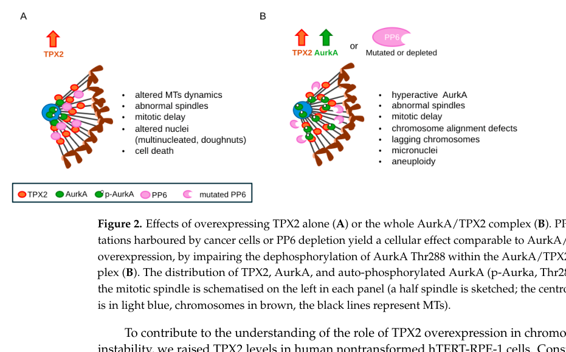

## Question

# Gene Research for Functional Annotation

## ⚠️ CRITICAL: Gene/Protein Identification Context

**BEFORE YOU BEGIN RESEARCH:** You MUST verify you are researching the CORRECT gene/protein. Gene symbols can be ambiguous, especially for less well-characterized genes from non-model organisms.

### Target Gene/Protein Identity (from UniProt):
- **UniProt Accession:** O14965
- **Protein Description:** RecName: Full=Aurora kinase A {ECO:0000312|HGNC:HGNC:11393}; EC=2.7.11.1 {ECO:0000269|PubMed:12237287, ECO:0000269|PubMed:16337122, ECO:0000269|PubMed:19140666, ECO:0000269|PubMed:19402633, ECO:0000269|PubMed:27192185, ECO:0000269|PubMed:27837025, ECO:0000269|PubMed:28218735}; AltName: Full=Aurora 2 {ECO:0000303|PubMed:10851084}; AltName: Full=Aurora/IPL1-related kinase 1 {ECO:0000303|PubMed:9153231}; Short=ARK-1 {ECO:0000303|PubMed:9153231}; Short=Aurora-related kinase 1 {ECO:0000303|PubMed:9514916}; AltName: Full=Breast tumor-amplified kinase {ECO:0000303|PubMed:11790771}; AltName: Full=Ipl1- and aurora-related kinase 1 {ECO:0000250|UniProtKB:P97477}; AltName: Full=Serine/threonine-protein kinase 15 {ECO:0000303|PubMed:15867347, ECO:0000303|PubMed:16011022}; AltName: Full=Serine/threonine-protein kinase 6 {ECO:0000303|PubMed:9771714}; AltName: Full=Serine/threonine-protein kinase Ayk1 {ECO:0000250|UniProtKB:P97477}; AltName: Full=Serine/threonine-protein kinase aurora-A {ECO:0000250|UniProtKB:P59241};
- **Gene Information:** Name=AURKA {ECO:0000312|HGNC:HGNC:11393}; Synonyms=AIK {ECO:0000303|PubMed:9153231}, AIRK1 {ECO:0000312|HGNC:HGNC:11393}, ARK1 {ECO:0000312|HGNC:HGNC:11393}, AURA {ECO:0000312|HGNC:HGNC:11393}, AYK1 {ECO:0000250|UniProtKB:P97477}, BTAK {ECO:0000303|PubMed:9771714}, IAK1 {ECO:0000250|UniProtKB:P97477}, STK15 {ECO:0000303|PubMed:15867347, ECO:0000303|PubMed:16011022}, STK6 {ECO:0000303|PubMed:9771714};
- **Organism (full):** Homo sapiens (Human).
- **Protein Family:** Belongs to the protein kinase superfamily. Ser/Thr protein
- **Key Domains:** Aur-like. (IPR030616); AURKA. (IPR030611); Kinase-like_dom_sf. (IPR011009); Prot_kinase_dom. (IPR000719); Protein_kinase_ATP_BS. (IPR017441)

### MANDATORY VERIFICATION STEPS:

1. **Check if the gene symbol "AURKA" matches the protein description above**
2. **Verify the organism is correct:** Homo sapiens (Human).
3. **Check if protein family/domains align with what you find in literature**
4. **If you find literature for a DIFFERENT gene with the same or similar symbol, STOP**

### If Gene Symbol is Ambiguous or You Cannot Find Relevant Literature:

**DO NOT PROCEED WITH RESEARCH ON A DIFFERENT GENE.** Instead:
- State clearly: "The gene symbol 'AURKA' is ambiguous or literature is limited for this specific protein"
- Explain what you found (e.g., "Found extensive literature on a different gene with the same symbol in a different organism")
- Describe the protein based ONLY on the UniProt information provided above
- Suggest that the protein function can be inferred from domain/family information

### Research Target:

Please provide a comprehensive research report on the gene **AURKA** (gene ID: AURKA, UniProt: O14965) in human.

The research report should be a detailed narrative explaining the function, biological processes, and localization of the gene product. Citations should be given for all claims.

You should prioritize authoritative reviews and primary scientific literature when conducting research. You can supplement
this with annotations you find in gene/protein databases, but these can be outdated or inaccurate.

We are specifically interested in the primary function of the gene - for enzymes, what reaction is catalyzed, and what is the substrate specificity? For transporters, what is the substrate? For structural proteins or adapters, what is the broader structural role? For signaling molecules, what is the role in the pathway.

We are interested in where in or outside the cell the gene product carries out its function.

We are also interested in the signaling or biochemical pathways in which the gene functions. We are less interested in broad pleiotropic effects, except where these elucidate the precise role.

Include evidence where possible. We are interested in both experimental evidence as well as inference from structure, evolution, or bioinformatic analysis. Precise studies should be prioritized over high-throughput, where available.

## Output

Question: You are an expert researcher providing comprehensive, well-cited information.

Provide detailed information focusing on:
1. Key concepts and definitions with current understanding
2. Recent developments and latest research (prioritize 2023-2024 sources)
3. Current applications and real-world implementations
4. Expert opinions and analysis from authoritative sources
5. Relevant statistics and data from recent studies

Format as a comprehensive research report with proper citations. Include URLs and publication dates where available.
Always prioritize recent, authoritative sources and provide specific citations for all major claims.

# Gene Research for Functional Annotation

## ⚠️ CRITICAL: Gene/Protein Identification Context

**BEFORE YOU BEGIN RESEARCH:** You MUST verify you are researching the CORRECT gene/protein. Gene symbols can be ambiguous, especially for less well-characterized genes from non-model organisms.

### Target Gene/Protein Identity (from UniProt):
- **UniProt Accession:** O14965
- **Protein Description:** RecName: Full=Aurora kinase A {ECO:0000312|HGNC:HGNC:11393}; EC=2.7.11.1 {ECO:0000269|PubMed:12237287, ECO:0000269|PubMed:16337122, ECO:0000269|PubMed:19140666, ECO:0000269|PubMed:19402633, ECO:0000269|PubMed:27192185, ECO:0000269|PubMed:27837025, ECO:0000269|PubMed:28218735}; AltName: Full=Aurora 2 {ECO:0000303|PubMed:10851084}; AltName: Full=Aurora/IPL1-related kinase 1 {ECO:0000303|PubMed:9153231}; Short=ARK-1 {ECO:0000303|PubMed:9153231}; Short=Aurora-related kinase 1 {ECO:0000303|PubMed:9514916}; AltName: Full=Breast tumor-amplified kinase {ECO:0000303|PubMed:11790771}; AltName: Full=Ipl1- and aurora-related kinase 1 {ECO:0000250|UniProtKB:P97477}; AltName: Full=Serine/threonine-protein kinase 15 {ECO:0000303|PubMed:15867347, ECO:0000303|PubMed:16011022}; AltName: Full=Serine/threonine-protein kinase 6 {ECO:0000303|PubMed:9771714}; AltName: Full=Serine/threonine-protein kinase Ayk1 {ECO:0000250|UniProtKB:P97477}; AltName: Full=Serine/threonine-protein kinase aurora-A {ECO:0000250|UniProtKB:P59241};
- **Gene Information:** Name=AURKA {ECO:0000312|HGNC:HGNC:11393}; Synonyms=AIK {ECO:0000303|PubMed:9153231}, AIRK1 {ECO:0000312|HGNC:HGNC:11393}, ARK1 {ECO:0000312|HGNC:HGNC:11393}, AURA {ECO:0000312|HGNC:HGNC:11393}, AYK1 {ECO:0000250|UniProtKB:P97477}, BTAK {ECO:0000303|PubMed:9771714}, IAK1 {ECO:0000250|UniProtKB:P97477}, STK15 {ECO:0000303|PubMed:15867347, ECO:0000303|PubMed:16011022}, STK6 {ECO:0000303|PubMed:9771714};
- **Organism (full):** Homo sapiens (Human).
- **Protein Family:** Belongs to the protein kinase superfamily. Ser/Thr protein
- **Key Domains:** Aur-like. (IPR030616); AURKA. (IPR030611); Kinase-like_dom_sf. (IPR011009); Prot_kinase_dom. (IPR000719); Protein_kinase_ATP_BS. (IPR017441)

### MANDATORY VERIFICATION STEPS:

1. **Check if the gene symbol "AURKA" matches the protein description above**
2. **Verify the organism is correct:** Homo sapiens (Human).
3. **Check if protein family/domains align with what you find in literature**
4. **If you find literature for a DIFFERENT gene with the same or similar symbol, STOP**

### If Gene Symbol is Ambiguous or You Cannot Find Relevant Literature:

**DO NOT PROCEED WITH RESEARCH ON A DIFFERENT GENE.** Instead:
- State clearly: "The gene symbol 'AURKA' is ambiguous or literature is limited for this specific protein"
- Explain what you found (e.g., "Found extensive literature on a different gene with the same symbol in a different organism")
- Describe the protein based ONLY on the UniProt information provided above
- Suggest that the protein function can be inferred from domain/family information

### Research Target:

Please provide a comprehensive research report on the gene **AURKA** (gene ID: AURKA, UniProt: O14965) in human.

The research report should be a detailed narrative explaining the function, biological processes, and localization of the gene product. Citations should be given for all claims.

You should prioritize authoritative reviews and primary scientific literature when conducting research. You can supplement
this with annotations you find in gene/protein databases, but these can be outdated or inaccurate.

We are specifically interested in the primary function of the gene - for enzymes, what reaction is catalyzed, and what is the substrate specificity? For transporters, what is the substrate? For structural proteins or adapters, what is the broader structural role? For signaling molecules, what is the role in the pathway.

We are interested in where in or outside the cell the gene product carries out its function.

We are also interested in the signaling or biochemical pathways in which the gene functions. We are less interested in broad pleiotropic effects, except where these elucidate the precise role.

Include evidence where possible. We are interested in both experimental evidence as well as inference from structure, evolution, or bioinformatic analysis. Precise studies should be prioritized over high-throughput, where available.

# Human AURKA (UniProt O14965): functional annotation and research report

**Identity verified.** The target is human **AURKA**, encoding **Aurora kinase A** (Aurora-A), also called **STK15, STK6, and BTAK**. Its conserved protein-kinase domain and activation-loop **Thr288** agree with the supplied UniProt annotation. It is distinct from Aurora-B (AURKB; activation-loop Thr232) and Aurora-C (AURKC; Thr195): Aurora-A is principally associated with centrosomes and spindle poles, whereas Aurora-B is the catalytic component of the chromosomal passenger complex. The nomenclature table in a centrosome-focused review explicitly maps STK15, STK6, and BTAK to Aurora-A. (lukasiewicz2009auroraacentrosome pages 7-8, willems2018thefunctionaldiversity pages 2-4, polverino2024contributionofaurkatpx2 pages 1-2)

## Primary biochemical function and substrate specificity

AURKA is an intracellular **ATP-dependent serine/threonine protein kinase** (EC 2.7.11.1). Its defining reaction is **ATP + protein–Ser/Thr → ADP + protein–phospho-Ser/Thr**. Its biologically important substrates are not specified adequately by a short sequence motif alone: substrate docking, local concentration, and distinct activating partners determine which proteins it phosphorylates at a particular cell-cycle stage and location. Autophosphorylation of Thr288 promotes activity, but structural and biochemical work shows that binding partners can also stabilize an active configuration without requiring that phosphorylation in every setting. (willems2018thefunctionaldiversity pages 2-4, tavernier2021boraphosphorylationsubstitutes pages 3-5, garrido2016noncentrosomaltpx2dependentregulation pages 2-4, garrido2016noncentrosomaltpx2dependentregulation pages 1-2)

Two especially well-characterized substrate reactions explain its central mitotic role:

* **PLK1 activation:** In late G2, cyclin-dependent-kinase-phosphorylated **Bora** activates AURKA and enables AURKA to phosphorylate **PLK1 Thr210** in its activation loop. Recombinant kinase assays and Bora-mutant rescue experiments connect this reaction to timely mitotic entry. Bora is a *cofactor* in this pathway, not simply another name for the PLK1 phosphosubstrate. Work published in 2026 further refines substrate specificity: in parallel biochemical assays, AURKA–Bora phosphorylated wild-type PLK1 Thr210, whereas AURKA alone or AURKA bound to TPX2 or CEP192 did not under the tested conditions. Thus, even an active AURKA complex does not necessarily phosphorylate every potential Aurora substrate. (tavernier2021boraphosphorylationsubstitutes pages 13-15, tavernier2021boraphosphorylationsubstitutes pages 3-5, espositoverza2026molecularrequirementsfor pages 3-5)
* **Spindle organization:** AURKA phosphorylates **TACC3 Ser558**, promoting its recruitment to mitotic spindle microtubules and its association with clathrin and the microtubule polymerase ch-TOG. This assembly helps crosslink and stabilize kinetochore fibres. In human-cell experiments, nonphosphorylatable TACC3-S558A disrupted astral microtubules and spindle-pole γ-tubulin-ring-complex organization, whereas phosphomimetic S558D preserved them. Structural and cell-based work also shows that TACC3 docks on—and can activate—AURKA; it is therefore both an interacting regulator and a demonstrated substrate. (burgess2015auroraadependentcontrolof pages 2-4, rajeev2019auroraasite pages 1-2, burgess2015auroraadependentcontrolof pages 1-2)

## Location, regulation, and biological pathways

**Centrosomes and spindle poles are the principal mitotic sites of action.** AURKA accumulates at centrosomes around G2/M, where CEP192-associated activation contributes to centrosome maturation and microtubule nucleation. Its activities support centrosome separation, bipolar-spindle assembly, chromosome alignment, and accurate segregation. These are its primary, best-established physiological functions—not a claim that AURKA itself is a structural microtubule component. (ong2020phospho‐regulationofmitotic pages 6-10, polverino2024contributionofaurkatpx2 pages 1-2, barr2007auroraathemaker pages 2-3)

**Spindle microtubules carry a distinct AURKA pool.** Chromosome-associated RanGTP releases the spindle-assembly factor **TPX2** from importins. Freed TPX2 binds, activates, and targets AURKA to spindle microtubules near chromosomes, allowing spindle assembly independently of centrosomal microtubule nucleation. TPX2 also protects an activating AURKA configuration; **protein phosphatase 6 (PP6)** counteracts phosphorylation of Thr288 in the TPX2-bound complex. The spatial distinction matters: a substrate or phenotype seen at a spindle pole should not automatically be assigned to the centrosomal pool, or vice versa. (garrido2016noncentrosomaltpx2dependentregulation pages 2-4, garrido2016noncentrosomaltpx2dependentregulation pages 1-2, polverino2024contributionofaurkatpx2 pages 5-7, polverino2024contributionofaurkatpx2 pages 7-8)

**The ciliary basal body is a validated nonmitotic site.** In quiescent or growth-stimulated ciliated cells, the scaffold **NEDD9/HEF1** activates basal-body AURKA, which phosphorylates and activates the tubulin deacetylase **HDAC6**. The resulting loss of axonemal tubulin acetylation promotes primary-cilium resorption. The founding study combined localization, perturbation, and inhibitor experiments and observed an early cilium-disassembly wave **1–2 hours** after serum stimulation, when cells were still predominantly in G1. This establishes that the pathway is not merely an indirect consequence of mitosis. (pugacheva2007hef1dependentauroraa pages 1-3, nikhil2024thesignificantothers pages 2-3)

**Additional, context-specific activities require separate annotation.** AURKA directly binds and protects **N-MYC** from efficient ubiquitin-dependent degradation in neuroblastoma; structural and biochemical evidence indicates that this protection can be **kinase-independent**, rather than establishing N-MYC as a necessary AURKA phosphosubstrate. Different ATP-site inhibitors differ in whether their induced AURKA conformations disrupt this complex. Experimental AURKA degradation has likewise produced an S-phase defect distinct from kinase inhibition, supporting a noncatalytic role in DNA replication. These findings qualify—but do not displace—the primary mitotic-kinase annotation. (richards2016structuralbasisof pages 3-4, boi2023whenjustone pages 6-7, nikhil2024thesignificantothers pages 1-2)

## Developments emphasized in 2023–2024

A **2024 review** argues that the *AURKA–TPX2 complex*, rather than AURKA abundance alone, is an important unit of mitotic dysregulation. In nontransformed RPE-1 cells, AURKA overexpression alone did not strongly hyperactivate the kinase or produce marked aneuploidy; co-overexpression with TPX2 did, producing lagging chromosomes and micronuclei. The review reports **approximately 200% increased activity** of TPX2-bound AURKA in cells carrying loss-of-function PP6 mutations. Low-dose alisertib or TPX2 depletion mitigated selected experimental chromosome-instability phenotypes. These are mechanistic cell-model findings, not evidence that the drug prevents cancer in patients. (polverino2024contributionofaurkatpx2 pages 7-8, polverino2024contributionofaurkatpx2 media 8fd71a2b)

A **January 2024 primary study** identified a therapeutically important exception to the assumption that inhibiting AURKA catalysis reproduces removal of the protein. Conditional *Aurka* deletion markedly suppressed renal cyst formation in **Pkd1**- and **Inpp5e**-mutant mice; reported reductions in cyst number were approximately **98.9%** and **90%**, respectively, in the specified models. AURKA associated with AKT and promoted AKT Thr308 phosphorylation even when kinase-dead AURKA was expressed, suggesting a noncatalytic regulatory role. In contrast, alisertib increased AURKA protein by approximately **1.5-fold** after 48 hours in the tested system, enhanced AKT signaling, and worsened cyst counts in one mouse disease model. Mouse genetics and drug effects therefore must not be treated as interchangeable, and these results do not establish a treatment for human polycystic kidney disease. (tham2024deletionofaurora pages 2-4, tham2024deletionofaurora pages 5-6, tham2024deletionofaurora pages 11-12)

In **August 2024**, a non-small-cell lung cancer (NSCLC) study detected AURKA by immunohistochemistry in **91.5% of 94** resected tumors; **34.0%** had moderate-to-strong staining. Alisertib or inducible AURKA depletion sensitized experimental NSCLC models to cisplatin and radiation; the study also observed increased PD-L1 and B7-H3 expression after inhibition. Tumor staining is observational, while sensitization was shown in cells and mouse xenografts—not in a clinical trial of the proposed combination. (liu2024aurorakinasea pages 5-8, liu2024aurorakinasea pages 1-2, liu2024aurorakinasea pages 8-12)

## Applications and clinical interpretation

AURKA is used as an **experimental mitotic target and pharmacodynamic readout**: inhibition of activating AURKA Thr288 phosphorylation and loss of TACC3 Ser558 phosphorylation can report engagement of the spindle pathway in suitable cellular assays. It is also a rationale for developing ATP-site inhibitors, AURKA–TPX2 interaction disruptors, conformational inhibitors of the AURKA–N-MYC interaction, and protein degraders. None of those experimental uses by itself establishes an approved AURKA-directed treatment; a September 2024 expert review states that **no AURKA-targeted drug had been approved**, citing toxicity and limited efficacy as a single agent. (rajeev2019auroraasite pages 13-13, polverino2024contributionofaurkatpx2 pages 9-11, richards2016structuralbasisof pages 3-4, nikhil2024thesignificantothers pages 1-2)

Clinical evidence illustrates that distinction. In the randomized **LUMIERE phase III** peripheral T-cell lymphoma study (**NCT01482962**), **271** patients received alisertib or investigator-choice treatment. Centrally assessed response was **33% versus 45%**, and median progression-free survival was **115 versus 104 days**; alisertib was **not statistically superior**. Anemia occurred in **53% versus 34%**, and neutropenia in **47% versus 31%**, respectively. In a smaller, uncontrolled phase II neuroblastoma cohort, alisertib combined with irinotecan and temozolomide produced **four partial responses among 19 evaluable patients (21%)** and estimated **one-year progression-free survival of 34%**; grade ≥3 neutropenia occurred in **14/20** treated patients. Because that regimen combines three drugs and lacks a randomized comparator, its responses cannot be attributed to AURKA inhibition alone. (o’connor2019randomizedphaseiii pages 1-2, NCT01482962 chunk 1, dubois2018phaseiitrial pages 6-8)

**Functional conclusion.** Human AURKA is best annotated as a *spatially regulated serine/threonine kinase that drives mitotic entry and constructs a functional bipolar spindle*, acting chiefly through partner-directed phosphorylation at centrosomes and spindle microtubules. Its basal-body AURKA–HDAC6 activity regulates cilium resorption, while demonstrated protein-binding roles show why catalytic inhibitors may not capture every effect of AURKA loss. Evidence for substrate specificity is strongest when a defined phosphorylation site is supported by biochemical assays and cellular perturbations; associations between AURKA expression and broad cancer phenotypes should not be interpreted as proof of a direct substrate relationship. (tavernier2021boraphosphorylationsubstitutes pages 3-5, rajeev2019auroraasite pages 1-2, pugacheva2007hef1dependentauroraa pages 1-3, tham2024deletionofaurora pages 5-6)

**Selected sources and links (publication dates):** Polverino *et al.*, *Cells*, **22 August 2024**, https://doi.org/10.3390/cells13161397; Nikhil and Shah, *Biomarker Research*, **September 2024**, https://doi.org/10.1186/s40364-024-00651-4; Tham *et al.*, *Nature Communications*, **January 2024**, https://doi.org/10.1038/s41467-023-44410-9; Liu *et al.*, *Cancers*, **August 2024**, https://doi.org/10.3390/cancers16162805; Tavernier *et al.*, *Nature Communications*, **March 2021**, https://doi.org/10.1038/s41467-021-21922-w; Pugacheva *et al.*, *Cell*, **29 June 2007**, https://doi.org/10.1016/j.cell.2007.04.035; O’Connor *et al.*, *Journal of Clinical Oncology*, **March 2019**, https://doi.org/10.1200/JCO.18.00899; trial record, https://clinicaltrials.gov/study/NCT01482962. (polverino2024contributionofaurkatpx2 pages 1-2, nikhil2024thesignificantothers pages 1-2, tham2024deletionofaurora pages 1-2, liu2024aurorakinasea pages 1-2, tavernier2021boraphosphorylationsubstitutes pages 3-5, pugacheva2007hef1dependentauroraa pages 1-3, o’connor2019randomizedphaseiii pages 1-2, NCT01482962 chunk 1)

References

1. (lukasiewicz2009auroraacentrosome pages 7-8): Kara B. Lukasiewicz and Wilma L. Lingle. Aurora a, centrosome structure, and the centrosome cycle. Environmental and Molecular Mutagenesis, 50:602-619, Oct 2009. URL: https://doi.org/10.1002/em.20533, doi:10.1002/em.20533. This article has 78 citations and is from a peer-reviewed journal.

2. (willems2018thefunctionaldiversity pages 2-4): Estelle Willems, Matthias Dedobbeleer, Marina Digregorio, Arnaud Lombard, Paul Noel Lumapat, and Bernard Rogister. The functional diversity of aurora kinases: a comprehensive review. Cell Division, Sep 2018. URL: https://doi.org/10.1186/s13008-018-0040-6, doi:10.1186/s13008-018-0040-6. This article has 531 citations and is from a peer-reviewed journal.

3. (polverino2024contributionofaurkatpx2 pages 1-2): Federica Polverino, Anna Mastrangelo, and Giulia Guarguaglini. Contribution of aurka/tpx2 overexpression to chromosomal imbalances and cancer. Cells, 13:1397, Aug 2024. URL: https://doi.org/10.3390/cells13161397, doi:10.3390/cells13161397. This article has 33 citations.

4. (tavernier2021boraphosphorylationsubstitutes pages 3-5): N. Tavernier, Y. Thomas, S. Vigneron, P. Maisonneuve, S. Orlicky, P. Mader, S. G. Regmi, L. Van Hove, N. M. Levinson, G. Gasmi-Seabrook, N. Joly, M. Poteau, G. Velez-Aguilera, O. Gavet, A. Castro, M. Dasso, T. Lorca, F. Sicheri, and L. Pintard. Bora phosphorylation substitutes in trans for t-loop phosphorylation in aurora a to promote mitotic entry. Nature Communications, Mar 2021. URL: https://doi.org/10.1038/s41467-021-21922-w, doi:10.1038/s41467-021-21922-w. This article has 61 citations and is from a highest quality peer-reviewed journal.

5. (garrido2016noncentrosomaltpx2dependentregulation pages 2-4): Georgina Garrido and Isabelle Vernos. Non-centrosomal tpx2-dependent regulation of the aurora a kinase: functional implications for healthy and pathological cell division. Frontiers in Oncology, Apr 2016. URL: https://doi.org/10.3389/fonc.2016.00088, doi:10.3389/fonc.2016.00088. This article has 52 citations.

6. (garrido2016noncentrosomaltpx2dependentregulation pages 1-2): Georgina Garrido and Isabelle Vernos. Non-centrosomal tpx2-dependent regulation of the aurora a kinase: functional implications for healthy and pathological cell division. Frontiers in Oncology, Apr 2016. URL: https://doi.org/10.3389/fonc.2016.00088, doi:10.3389/fonc.2016.00088. This article has 52 citations.

7. (tavernier2021boraphosphorylationsubstitutes pages 13-15): N. Tavernier, Y. Thomas, S. Vigneron, P. Maisonneuve, S. Orlicky, P. Mader, S. G. Regmi, L. Van Hove, N. M. Levinson, G. Gasmi-Seabrook, N. Joly, M. Poteau, G. Velez-Aguilera, O. Gavet, A. Castro, M. Dasso, T. Lorca, F. Sicheri, and L. Pintard. Bora phosphorylation substitutes in trans for t-loop phosphorylation in aurora a to promote mitotic entry. Nature Communications, Mar 2021. URL: https://doi.org/10.1038/s41467-021-21922-w, doi:10.1038/s41467-021-21922-w. This article has 61 citations and is from a highest quality peer-reviewed journal.

8. (espositoverza2026molecularrequirementsfor pages 3-5): Arianna Esposito-Verza, Duccio Conti, Paulo D Rodrigues Pedroso, Lina Oberste-Lehn, Carolin Koerner, Sabine Wohlgemuth, Artem Mansurkhodzhaev, Ingrid R Vetter, Marion E Pesenti, and Andrea Musacchio. Molecular requirements for plk1 activation by t-loop phosphorylation. The EMBO Journal, 45(5):1496-1536, Jan 2026. URL: https://doi.org/10.1038/s44318-025-00681-0, doi:10.1038/s44318-025-00681-0. This article has 7 citations.

9. (burgess2015auroraadependentcontrolof pages 2-4): Selena G. Burgess, Isabel Peset, Nimesh Joseph, Tommaso Cavazza, Isabelle Vernos, Mark Pfuhl, Fanni Gergely, and Richard Bayliss. Aurora-a-dependent control of tacc3 influences the rate of mitotic spindle assembly. Jul 2015. URL: https://doi.org/10.1371/journal.pgen.1005345, doi:10.1371/journal.pgen.1005345. This article has 65 citations and is from a domain leading peer-reviewed journal.

10. (rajeev2019auroraasite pages 1-2): Resmi Rajeev, Puja Singh, Ananya Asmita, Ushma Anand, and Tapas K. Manna. Aurora a site specific tacc3 phosphorylation regulates astral microtubule assembly by stabilizing γ-tubulin ring complex. BMC Molecular and Cell Biology, Dec 2019. URL: https://doi.org/10.1186/s12860-019-0242-z, doi:10.1186/s12860-019-0242-z. This article has 23 citations and is from a peer-reviewed journal.

11. (burgess2015auroraadependentcontrolof pages 1-2): Selena G. Burgess, Isabel Peset, Nimesh Joseph, Tommaso Cavazza, Isabelle Vernos, Mark Pfuhl, Fanni Gergely, and Richard Bayliss. Aurora-a-dependent control of tacc3 influences the rate of mitotic spindle assembly. Jul 2015. URL: https://doi.org/10.1371/journal.pgen.1005345, doi:10.1371/journal.pgen.1005345. This article has 65 citations and is from a domain leading peer-reviewed journal.

12. (ong2020phospho‐regulationofmitotic pages 6-10): Joseph Y. Ong, Michelle C. Bradley, and Jorge Z. Torres. Phospho‐regulation of mitotic spindle assembly. Cytoskeleton (Hoboken, N.j.), 77:558-578, Dec 2020. URL: https://doi.org/10.1002/cm.21649, doi:10.1002/cm.21649. This article has 26 citations.

13. (barr2007auroraathemaker pages 2-3): Alexis R. Barr and Fanni Gergely. Aurora-a: the maker and breaker of spindle poles. Journal of Cell Science, 120:2987-2996, Sep 2007. URL: https://doi.org/10.1242/jcs.013136, doi:10.1242/jcs.013136. This article has 612 citations and is from a domain leading peer-reviewed journal.

14. (polverino2024contributionofaurkatpx2 pages 5-7): Federica Polverino, Anna Mastrangelo, and Giulia Guarguaglini. Contribution of aurka/tpx2 overexpression to chromosomal imbalances and cancer. Cells, 13:1397, Aug 2024. URL: https://doi.org/10.3390/cells13161397, doi:10.3390/cells13161397. This article has 33 citations.

15. (polverino2024contributionofaurkatpx2 pages 7-8): Federica Polverino, Anna Mastrangelo, and Giulia Guarguaglini. Contribution of aurka/tpx2 overexpression to chromosomal imbalances and cancer. Cells, 13:1397, Aug 2024. URL: https://doi.org/10.3390/cells13161397, doi:10.3390/cells13161397. This article has 33 citations.

16. (pugacheva2007hef1dependentauroraa pages 1-3): Elena N. Pugacheva, Sandra A. Jablonski, Tiffiney R. Hartman, Elizabeth P. Henske, and Erica A. Golemis. Hef1-dependent aurora a activation induces disassembly of the primary cilium. Cell, 129:1351-1363, Jun 2007. URL: https://doi.org/10.1016/j.cell.2007.04.035, doi:10.1016/j.cell.2007.04.035. This article has 1132 citations and is from a highest quality peer-reviewed journal.

17. (nikhil2024thesignificantothers pages 2-3): Kumar Nikhil and Kavita Shah. The significant others of aurora kinase a in cancer: combination is the key. Biomarker Research, Sep 2024. URL: https://doi.org/10.1186/s40364-024-00651-4, doi:10.1186/s40364-024-00651-4. This article has 29 citations and is from a peer-reviewed journal.

18. (richards2016structuralbasisof pages 3-4): Mark W. Richards, Selena G. Burgess, Evon Poon, Anne Carstensen, Martin Eilers, Louis Chesler, and Richard Bayliss. Structural basis of n-myc binding by aurora-a and its destabilization by kinase inhibitors. Proceedings of the National Academy of Sciences, 113:13726-13731, Nov 2016. URL: https://doi.org/10.1073/pnas.1610626113, doi:10.1073/pnas.1610626113. This article has 245 citations and is from a highest quality peer-reviewed journal.

19. (boi2023whenjustone pages 6-7): Dalila Boi, Elisabetta Rubini, Sara Breccia, Giulia Guarguaglini, and Alessandro Paiardini. When just one phosphate is one too many: the multifaceted interplay between myc and kinases. International Journal of Molecular Sciences, 24:4746, Mar 2023. URL: https://doi.org/10.3390/ijms24054746, doi:10.3390/ijms24054746. This article has 24 citations.

20. (nikhil2024thesignificantothers pages 1-2): Kumar Nikhil and Kavita Shah. The significant others of aurora kinase a in cancer: combination is the key. Biomarker Research, Sep 2024. URL: https://doi.org/10.1186/s40364-024-00651-4, doi:10.1186/s40364-024-00651-4. This article has 29 citations and is from a peer-reviewed journal.

21. (polverino2024contributionofaurkatpx2 media 8fd71a2b): Federica Polverino, Anna Mastrangelo, and Giulia Guarguaglini. Contribution of aurka/tpx2 overexpression to chromosomal imbalances and cancer. Cells, 13:1397, Aug 2024. URL: https://doi.org/10.3390/cells13161397, doi:10.3390/cells13161397. This article has 33 citations.

22. (tham2024deletionofaurora pages 2-4): Ming Shen Tham, Denny L. Cottle, Allara K. Zylberberg, Kieran M. Short, Lynelle K. Jones, Perkin Chan, Sarah E. Conduit, Jennifer M. Dyson, Christina A. Mitchell, and Ian M. Smyth. Deletion of aurora kinase a prevents the development of polycystic kidney disease in mice. Nature Communications, Jan 2024. URL: https://doi.org/10.1038/s41467-023-44410-9, doi:10.1038/s41467-023-44410-9. This article has 19 citations and is from a highest quality peer-reviewed journal.

23. (tham2024deletionofaurora pages 5-6): Ming Shen Tham, Denny L. Cottle, Allara K. Zylberberg, Kieran M. Short, Lynelle K. Jones, Perkin Chan, Sarah E. Conduit, Jennifer M. Dyson, Christina A. Mitchell, and Ian M. Smyth. Deletion of aurora kinase a prevents the development of polycystic kidney disease in mice. Nature Communications, Jan 2024. URL: https://doi.org/10.1038/s41467-023-44410-9, doi:10.1038/s41467-023-44410-9. This article has 19 citations and is from a highest quality peer-reviewed journal.

24. (tham2024deletionofaurora pages 11-12): Ming Shen Tham, Denny L. Cottle, Allara K. Zylberberg, Kieran M. Short, Lynelle K. Jones, Perkin Chan, Sarah E. Conduit, Jennifer M. Dyson, Christina A. Mitchell, and Ian M. Smyth. Deletion of aurora kinase a prevents the development of polycystic kidney disease in mice. Nature Communications, Jan 2024. URL: https://doi.org/10.1038/s41467-023-44410-9, doi:10.1038/s41467-023-44410-9. This article has 19 citations and is from a highest quality peer-reviewed journal.

25. (liu2024aurorakinasea pages 5-8): Huijie Liu, Ayse Ece Cali Daylan, Jihua Yang, Ankit Tanwar, Alain Borczuk, Dongwei Zhang, Vincent Chau, Shenduo Li, Xuan Ge, Balazs Halmos, Xingxing Zang, and Haiying Cheng. Aurora kinase a inhibition potentiates platinum and radiation cytotoxicity in non-small-cell lung cancer cells and induces expression of alternative immune checkpoints. Cancers, 16(16):2805, Aug 2024. URL: https://doi.org/10.3390/cancers16162805, doi:10.3390/cancers16162805. This article has 13 citations.

26. (liu2024aurorakinasea pages 1-2): Huijie Liu, Ayse Ece Cali Daylan, Jihua Yang, Ankit Tanwar, Alain Borczuk, Dongwei Zhang, Vincent Chau, Shenduo Li, Xuan Ge, Balazs Halmos, Xingxing Zang, and Haiying Cheng. Aurora kinase a inhibition potentiates platinum and radiation cytotoxicity in non-small-cell lung cancer cells and induces expression of alternative immune checkpoints. Cancers, 16(16):2805, Aug 2024. URL: https://doi.org/10.3390/cancers16162805, doi:10.3390/cancers16162805. This article has 13 citations.

27. (liu2024aurorakinasea pages 8-12): Huijie Liu, Ayse Ece Cali Daylan, Jihua Yang, Ankit Tanwar, Alain Borczuk, Dongwei Zhang, Vincent Chau, Shenduo Li, Xuan Ge, Balazs Halmos, Xingxing Zang, and Haiying Cheng. Aurora kinase a inhibition potentiates platinum and radiation cytotoxicity in non-small-cell lung cancer cells and induces expression of alternative immune checkpoints. Cancers, 16(16):2805, Aug 2024. URL: https://doi.org/10.3390/cancers16162805, doi:10.3390/cancers16162805. This article has 13 citations.

28. (rajeev2019auroraasite pages 13-13): Resmi Rajeev, Puja Singh, Ananya Asmita, Ushma Anand, and Tapas K. Manna. Aurora a site specific tacc3 phosphorylation regulates astral microtubule assembly by stabilizing γ-tubulin ring complex. BMC Molecular and Cell Biology, Dec 2019. URL: https://doi.org/10.1186/s12860-019-0242-z, doi:10.1186/s12860-019-0242-z. This article has 23 citations and is from a peer-reviewed journal.

29. (polverino2024contributionofaurkatpx2 pages 9-11): Federica Polverino, Anna Mastrangelo, and Giulia Guarguaglini. Contribution of aurka/tpx2 overexpression to chromosomal imbalances and cancer. Cells, 13:1397, Aug 2024. URL: https://doi.org/10.3390/cells13161397, doi:10.3390/cells13161397. This article has 33 citations.

30. (o’connor2019randomizedphaseiii pages 1-2): Owen A. O’Connor, Muhit Özcan, Eric D. Jacobsen, Josep M. Roncero, Judith Trotman, Judit Demeter, Tamás Masszi, Juliana Pereira, Radhakrishnan Ramchandren, Anne Beaven, Dolores Caballero, Steven M. Horwitz, Anne Lennard, Mehmet Turgut, Nelson Hamerschlak, Francesco A. d’Amore, Francine Foss, Won-Seog Kim, John P. Leonard, Pier Luigi Zinzani, Carlos S. Chiattone, Eric D. Hsi, Lorenz Trümper, Hua Liu, Emily Sheldon-Waniga, Claudio Dansky Ullmann, Karthik Venkatakrishnan, E. Jane Leonard, and Andrei R. Shustov. Randomized phase iii study of alisertib or investigator’s choice (selected single agent) in patients with relapsed or refractory peripheral t-cell lymphoma. Mar 2019. URL: https://doi.org/10.1200/jco.18.00899, doi:10.1200/jco.18.00899. This article has 185 citations and is from a highest quality peer-reviewed journal.

31. (NCT01482962 chunk 1):  Alisertib (MLN8237) or Investigator's Choice in Patients With Relapsed/Refractory Peripheral T-Cell Lymphoma. Millennium Pharmaceuticals, Inc.. 2012. ClinicalTrials.gov Identifier: NCT01482962

32. (dubois2018phaseiitrial pages 6-8): Steven G. DuBois, Yael P. Mosse, Elizabeth Fox, Rachel A. Kudgus, Joel M. Reid, Renee McGovern, Susan Groshen, Rochelle Bagatell, John M. Maris, Clare J. Twist, Kelly Goldsmith, M. Meaghan Granger, Brian Weiss, Julie R. Park, Margaret E. Macy, Susan L. Cohn, Greg Yanik, Lars M. Wagner, Randall Hawkins, Jesse Courtier, Hollie Lai, Fariba Goodarzian, Hiroyuki Shimada, Najee Boucher, Scarlett Czarnecki, Chunqiao Luo, Denice Tsao-Wei, Katherine K. Matthay, and Araz Marachelian. Phase ii trial of alisertib in combination with irinotecan and temozolomide for patients with relapsed or refractory neuroblastoma. Dec 2018. URL: https://doi.org/10.1158/1078-0432.ccr-18-1381, doi:10.1158/1078-0432.ccr-18-1381. This article has 112 citations and is from a highest quality peer-reviewed journal.

33. (tham2024deletionofaurora pages 1-2): Ming Shen Tham, Denny L. Cottle, Allara K. Zylberberg, Kieran M. Short, Lynelle K. Jones, Perkin Chan, Sarah E. Conduit, Jennifer M. Dyson, Christina A. Mitchell, and Ian M. Smyth. Deletion of aurora kinase a prevents the development of polycystic kidney disease in mice. Nature Communications, Jan 2024. URL: https://doi.org/10.1038/s41467-023-44410-9, doi:10.1038/s41467-023-44410-9. This article has 19 citations and is from a highest quality peer-reviewed journal.

## Artifacts

## Citations

1. lukasiewicz2009auroraacentrosome pages 7-8
2. willems2018thefunctionaldiversity pages 2-4
3. tavernier2021boraphosphorylationsubstitutes pages 3-5
4. tavernier2021boraphosphorylationsubstitutes pages 13-15
5. espositoverza2026molecularrequirementsfor pages 3-5
6. burgess2015auroraadependentcontrolof pages 2-4
7. rajeev2019auroraasite pages 1-2
8. burgess2015auroraadependentcontrolof pages 1-2
9. barr2007auroraathemaker pages 2-3
10. nikhil2024thesignificantothers pages 2-3
11. richards2016structuralbasisof pages 3-4
12. boi2023whenjustone pages 6-7
13. nikhil2024thesignificantothers pages 1-2
14. tham2024deletionofaurora pages 2-4
15. tham2024deletionofaurora pages 5-6
16. tham2024deletionofaurora pages 11-12
17. liu2024aurorakinasea pages 5-8
18. liu2024aurorakinasea pages 1-2
19. liu2024aurorakinasea pages 8-12
20. rajeev2019auroraasite pages 13-13
21. dubois2018phaseiitrial pages 6-8
22. tham2024deletionofaurora pages 1-2
23. https://doi.org/10.3390/cells13161397;
24. https://doi.org/10.1186/s40364-024-00651-4;
25. https://doi.org/10.1038/s41467-023-44410-9;
26. https://doi.org/10.3390/cancers16162805;
27. https://doi.org/10.1038/s41467-021-21922-w;
28. https://doi.org/10.1016/j.cell.2007.04.035;
29. https://doi.org/10.1200/JCO.18.00899;
30. https://clinicaltrials.gov/study/NCT01482962.
31. https://doi.org/10.1002/em.20533,
32. https://doi.org/10.1186/s13008-018-0040-6,
33. https://doi.org/10.3390/cells13161397,
34. https://doi.org/10.1038/s41467-021-21922-w,
35. https://doi.org/10.3389/fonc.2016.00088,
36. https://doi.org/10.1038/s44318-025-00681-0,
37. https://doi.org/10.1371/journal.pgen.1005345,
38. https://doi.org/10.1186/s12860-019-0242-z,
39. https://doi.org/10.1002/cm.21649,
40. https://doi.org/10.1242/jcs.013136,
41. https://doi.org/10.1016/j.cell.2007.04.035,
42. https://doi.org/10.1186/s40364-024-00651-4,
43. https://doi.org/10.1073/pnas.1610626113,
44. https://doi.org/10.3390/ijms24054746,
45. https://doi.org/10.1038/s41467-023-44410-9,
46. https://doi.org/10.3390/cancers16162805,
47. https://doi.org/10.1200/jco.18.00899,
48. https://doi.org/10.1158/1078-0432.ccr-18-1381,