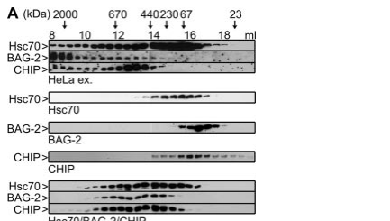

## Question

# Gene Research for Functional Annotation

## ⚠️ CRITICAL: Gene/Protein Identification Context

**BEFORE YOU BEGIN RESEARCH:** You MUST verify you are researching the CORRECT gene/protein. Gene symbols can be ambiguous, especially for less well-characterized genes from non-model organisms.

### Target Gene/Protein Identity (from UniProt):
- **UniProt Accession:** O95816
- **Protein Description:** RecName: Full=BAG family molecular chaperone regulator 2; Short=BAG-2; AltName: Full=Bcl-2-associated athanogene 2;
- **Gene Information:** Name=BAG2;
- **Organism (full):** Homo sapiens (Human).
- **Protein Family:** Not specified in UniProt
- **Key Domains:** BAG2. (IPR037689); BAG_domain. (IPR003103)

### MANDATORY VERIFICATION STEPS:

1. **Check if the gene symbol "BAG2" matches the protein description above**
2. **Verify the organism is correct:** Homo sapiens (Human).
3. **Check if protein family/domains align with what you find in literature**
4. **If you find literature for a DIFFERENT gene with the same or similar symbol, STOP**

### If Gene Symbol is Ambiguous or You Cannot Find Relevant Literature:

**DO NOT PROCEED WITH RESEARCH ON A DIFFERENT GENE.** Instead:
- State clearly: "The gene symbol 'BAG2' is ambiguous or literature is limited for this specific protein"
- Explain what you found (e.g., "Found extensive literature on a different gene with the same symbol in a different organism")
- Describe the protein based ONLY on the UniProt information provided above
- Suggest that the protein function can be inferred from domain/family information

### Research Target:

Please provide a comprehensive research report on the gene **BAG2** (gene ID: BAG2, UniProt: O95816) in human.

The research report should be a detailed narrative explaining the function, biological processes, and localization of the gene product. Citations should be given for all claims.

You should prioritize authoritative reviews and primary scientific literature when conducting research. You can supplement
this with annotations you find in gene/protein databases, but these can be outdated or inaccurate.

We are specifically interested in the primary function of the gene - for enzymes, what reaction is catalyzed, and what is the substrate specificity? For transporters, what is the substrate? For structural proteins or adapters, what is the broader structural role? For signaling molecules, what is the role in the pathway.

We are interested in where in or outside the cell the gene product carries out its function.

We are also interested in the signaling or biochemical pathways in which the gene functions. We are less interested in broad pleiotropic effects, except where these elucidate the precise role.

Include evidence where possible. We are interested in both experimental evidence as well as inference from structure, evolution, or bioinformatic analysis. Precise studies should be prioritized over high-throughput, where available.

## Output

Question: You are an expert researcher providing comprehensive, well-cited information.

Provide detailed information focusing on:
1. Key concepts and definitions with current understanding
2. Recent developments and latest research (prioritize 2023-2024 sources)
3. Current applications and real-world implementations
4. Expert opinions and analysis from authoritative sources
5. Relevant statistics and data from recent studies

Format as a comprehensive research report with proper citations. Include URLs and publication dates where available.
Always prioritize recent, authoritative sources and provide specific citations for all major claims.

# Gene Research for Functional Annotation

## ⚠️ CRITICAL: Gene/Protein Identification Context

**BEFORE YOU BEGIN RESEARCH:** You MUST verify you are researching the CORRECT gene/protein. Gene symbols can be ambiguous, especially for less well-characterized genes from non-model organisms.

### Target Gene/Protein Identity (from UniProt):
- **UniProt Accession:** O95816
- **Protein Description:** RecName: Full=BAG family molecular chaperone regulator 2; Short=BAG-2; AltName: Full=Bcl-2-associated athanogene 2;
- **Gene Information:** Name=BAG2;
- **Organism (full):** Homo sapiens (Human).
- **Protein Family:** Not specified in UniProt
- **Key Domains:** BAG2. (IPR037689); BAG_domain. (IPR003103)

### MANDATORY VERIFICATION STEPS:

1. **Check if the gene symbol "BAG2" matches the protein description above**
2. **Verify the organism is correct:** Homo sapiens (Human).
3. **Check if protein family/domains align with what you find in literature**
4. **If you find literature for a DIFFERENT gene with the same or similar symbol, STOP**

### If Gene Symbol is Ambiguous or You Cannot Find Relevant Literature:

**DO NOT PROCEED WITH RESEARCH ON A DIFFERENT GENE.** Instead:
- State clearly: "The gene symbol 'BAG2' is ambiguous or literature is limited for this specific protein"
- Explain what you found (e.g., "Found extensive literature on a different gene with the same symbol in a different organism")
- Describe the protein based ONLY on the UniProt information provided above
- Suggest that the protein function can be inferred from domain/family information

### Research Target:

Please provide a comprehensive research report on the gene **BAG2** (gene ID: BAG2, UniProt: O95816) in human.

The research report should be a detailed narrative explaining the function, biological processes, and localization of the gene product. Citations should be given for all claims.

You should prioritize authoritative reviews and primary scientific literature when conducting research. You can supplement
this with annotations you find in gene/protein databases, but these can be outdated or inaccurate.

We are specifically interested in the primary function of the gene - for enzymes, what reaction is catalyzed, and what is the substrate specificity? For transporters, what is the substrate? For structural proteins or adapters, what is the broader structural role? For signaling molecules, what is the role in the pathway.

We are interested in where in or outside the cell the gene product carries out its function.

We are also interested in the signaling or biochemical pathways in which the gene functions. We are less interested in broad pleiotropic effects, except where these elucidate the precise role.

Include evidence where possible. We are interested in both experimental evidence as well as inference from structure, evolution, or bioinformatic analysis. Precise studies should be prioritized over high-throughput, where available.

## Research report: Human **BAG2** (BAG cochaperone 2; UniProt **O95816**)—functional annotation and recent research

### 1) Identity verification, key concepts, and definitions
**Target identity.** The queried gene symbol **BAG2** corresponds to **Bcl-2–associated athanogene 2 (BAG-2)**, a human BAG-family co‑chaperone recovered as a major component of **CHIP/STUB1-containing complexes** in human cells. (arndt2005bag2actsas pages 1-2, arndt2005bag2actsas pages 2-3)

**Domain architecture (current understanding).** BAG2 contains (i) a **C‑terminal BAG domain** that binds the **ATPase (nucleotide-binding) domain** of Hsp70-family chaperones (Hsc70/Hsp70), consistent with BAG proteins functioning as **nucleotide exchange factors (NEFs)**, and (ii) an **N‑terminal coiled‑coil** implicated in **homodimerization**. (arndt2005bag2actsas pages 3-5, schonbuhler2016bag2interfereswith pages 1-3)

**Functional definition (protein triage context).** In proteostasis, “protein triage” refers to how chaperone systems decide whether a client protein is refolded, held, or targeted to degradation. BAG2 is best-supported as a **regulator of triage** within the **Hsp70/Hsc70–CHIP/STUB1 axis** by (a) accelerating the Hsp70 ATPase cycle (NEF activity) and (b) **inhibiting CHIP/STUB1 E3 ubiquitin ligase activity**, thereby shifting the balance away from ubiquitination-driven degradation for specific substrates/contexts. (schonbuhler2016bag2interfereswith pages 1-3, altinok2021withorwithout pages 12-13)

### 2) Experimentally supported molecular functions and mechanisms
#### 2.1 BAG2 as a NEF/co-chaperone for Hsp70/Hsc70
The BAG domain of BAG2 binds the Hsp70-family ATPase domain and facilitates nucleotide exchange, supporting a direct role in modulating Hsp70/Hsc70 client processing. (schonbuhler2016bag2interfereswith pages 1-3)

#### 2.2 BAG2 as an inhibitor of CHIP/STUB1 ubiquitin ligase activity
**Foundational biochemical evidence (in vitro + cell complexes).** Arndt et al. (2005) demonstrated that BAG2 forms ternary complexes with **Hsc70 and CHIP/STUB1** in human cells and that purified BAG2 **strongly inhibits CHIP-mediated ubiquitylation** of client proteins (e.g., **Raf‑1**) and also reduces ubiquitylation of Hsc70. (arndt2005bag2actsas pages 3-5)

The associated figure evidence shows dose-dependent suppression of CHIP-mediated ubiquitination of Raf‑1/Hsc70 by increasing BAG2 concentration. (arndt2005bag2actsas media 4ec539ab)

**Cellular evidence (Hsp70 family substrate stabilization).** In primary human fibroblasts, BAG2 prevents CHIP-mediated ubiquitination of **HSP72 (HSPA1A/HSPA1B)** and stabilizes HSP72 at the protein level without increasing HSP72 mRNA, consistent with post‑translational protection from CHIP-dependent ubiquitination. (schonbuhler2016bag2interfereswith pages 3-6)

Mechanistically, BAG2 inhibits CHIP activity by disrupting CHIP cooperation with E2 ubiquitin-conjugating enzymes (e.g., UBCH5A/UBCH5B described across these studies). (schonbuhler2016bag2interfereswith pages 1-3, schonbuhler2016bag2interfereswith pages 6-8)

#### 2.3 BAG2 participates in large proteostasis complexes (complex recruitment hypothesis)
Gel filtration and immunoprecipitation evidence indicates BAG2 co-fractionates with Hsc70 and CHIP in **high-molecular-mass complexes**, supporting a role in assembling/recruiting the Hsc70/CHIP machinery to distinct complexes or structures. (arndt2005bag2actsas pages 3-5)

Figure evidence supports co-fractionation of BAG2 with Hsc70 and CHIP in large complexes in vitro and in cell extracts. (arndt2005bag2actsas media 2bb89edf)

### 3) Subcellular localization and where BAG2 acts
Across the retrieved primary mechanistic studies, BAG2 is experimentally supported as a component of **large intracellular chaperone/E3-ligase complexes** containing Hsc70/Hsp70 and CHIP, but the excerpts do **not** provide a definitive compartment assignment (e.g., nucleus vs cytosol vs organellar localization) or high-resolution localization mapping. (arndt2005bag2actsas pages 3-5)

A 2024 fibrolamellar carcinoma model positions BAG2 within **DNAJ‑PKAc/Hsp70 signaling scaffolds** whose behavior includes cytosolic diffusion and altered interaction networks; BAG2 recruitment to DNAJ‑PKAc depends on an Hsp70-binding competent fusion protein, implicating BAG2 action in chaperone-linked signaling complexes in the cytosolic compartment in that model system. (lauer2024recruitmentofbag2 pages 5-9, lauer2024recruitmentofbag2 pages 17-21)

### 4) Pathways and biological processes
#### 4.1 Proteostasis and ubiquitin–proteasome system (UPS)
The best-supported pathway assignment for BAG2 is **proteostasis regulation** through the **Hsp70/Hsc70–CHIP/STUB1** axis, where BAG2 (i) modulates Hsp70 nucleotide cycling and (ii) inhibits CHIP ubiquitin ligase activity, altering whether chaperone-bound substrates proceed toward ubiquitination and degradation. (schonbuhler2016bag2interfereswith pages 1-3, arndt2005bag2actsas pages 3-5)

#### 4.2 Aging-associated proteostasis changes
In a cellular aging/senescence context, BAG2 and CHIP protein levels rise in senescent fibroblasts, while HSP72 ubiquitination is reduced—consistent with BAG2 counteracting increased CHIP abundance and contributing to altered proteostasis with age. (schonbuhler2016bag2interfereswith pages 6-8, schonbuhler2016bag2interfereswith pages 3-6)

#### 4.3 Apoptosis regulation (disease-context mechanistic pathway)
A 2024 gastric cancer study proposes a mechanistic axis in which BAG2 interacts with CHIP to inhibit HSP70 ubiquitination/degradation, increasing HSP70 association with **Apaf1** and reducing mitochondrial **cytochrome c** release, thereby suppressing intrinsic apoptosis (“BAG2–CHIP–HSP70–Apaf1–Cytc”). (liu2024blockageofbag2chip pages 1-5, liu2024blockageofbag2chip pages 8-10)

In a 2024 fibrolamellar carcinoma model, BAG2 supports survival and resistance to drug-induced apoptosis in cells driven by the DNAJ‑PKAc fusion, and BAG2 knockout restores apoptotic sensitivity to etoposide (e.g., increased PARP cleavage). (lauer2024recruitmentofbag2 pages 17-21)

#### 4.4 Autophagy/mitophagy and innate immunity—evidence status in this retrieval
Although CHIP is broadly discussed in the literature as participating in UPS and (contextually) autophagy-linked triage, the retrieved evidence set here does **not** provide direct BAG2-specific experimental evidence for autophagy/mitophagy regulation or innate immune pathway control. Claims in these areas should therefore be treated as **not established from the current retrieved excerpts** rather than inferred. (schonbuhler2016bag2interfereswith pages 1-3)

### 5) Recent developments (prioritizing 2023–2024)
#### 5.1 Neurodegeneration (computational network modeling; 2023)
A 2023 study analyzed Alzheimer’s disease (AD) microarray data and highlighted a “**BAG2–HSC70–STUB1–MAPT**” network as correlated with disease occurrence/progression; it reported that a neural network model predicting MMSE from gene expression achieved **accuracy up to 0.93**, and an SVM classifier achieved **accuracy 0.72**. This supports BAG2 as part of a proteostasis-associated expression signature in AD, but it is not direct biochemical mechanism. (OpenTargets Search: -BAG2)

#### 5.2 Malignant pleural mesothelioma (MPM; 2024)
Bisceglia et al. (published Sep 2024) identified BAG2 (ENSG00000112208) as significantly upregulated in MPM RNA-seq (example DE statistics reported: **log2FC 1.55**, **padj 0.0019**) and validated findings in an independent cohort of **211 MPM patients**; the study also analyzed a separate set of **40 MPM specimens** for subtype and IHC work. (bisceglia2024bag2mad2l1and pages 2-3, bisceglia2024bag2mad2l1and pages 1-2)

IHC evidence showed **moderate to strong BAG2 expression in MPM subtypes** with **no visible expression in hyperplastic mesothelium (RMP)** in representative analyses, supporting BAG2 as a candidate diagnostic adjunct marker (with the caveat that full sensitivity/specificity is not present in the provided excerpts). (bisceglia2024bag2mad2l1and pages 9-12)

#### 5.3 Liposarcoma prognostic associations (2024)
In liposarcoma, high BAG2 expression was associated with a higher-risk profile and immune microenvironment differences (e.g., increased M2 macrophage proportion and negative relationship with CD4+ T-cell infiltration) and correlates with transcriptional regulators (e.g., **PPARG r = −0.63, p < 2.2×10−16**; **NFKB1 r = 0.5, p = 3.1×10−10**). (lian2024decipheringtheprognostic pages 9-12)

#### 5.4 Fibrolamellar carcinoma (FLC) mechanistic expansion (2024)
A 2024 bioRxiv study identified BAG2 by proximity proteomics as enriched near the DNAJ‑PKAc fusion kinase and validated **Hsp70-dependent recruitment** of BAG2 (loss of BAG2 binding when an Hsp70-binding–defective DNAJ-PKAc mutant is used). BAG2 also showed evidence of phosphorylation (Ser20) consistent with basophilic kinase motifs in that system. (lauer2024recruitmentofbag2 pages 13-17)

The same study reported increased BAG2 protein levels in FLC versus adjacent normal liver and a trend toward higher levels in metastasis (as assessed by immunoblot/IHC/IF in a limited number of samples described in the excerpt). (lauer2024recruitmentofbag2 pages 13-17)

#### 5.5 Gastric cancer therapeutic axis proposal (2024)
A 2024 Research Square preprint integrated TCGA data (**n = 392**) and IHC on **152 paired** tumor/adjacent tissues to report elevated BAG2 and poor prognosis association in gastric cancer. Mechanistically, BAG2 knockout increased apoptosis (Annexin V/PI, TUNEL, apoptosome formation) and reduced xenograft tumor growth; the work proposes **FIIN‑2** as an inhibitor of the BAG2–CHIP complex, effective in GC cell lines, organoids, and CDX models. (liu2024blockageofbag2chip pages 8-10, liu2024blockageofbag2chip pages 1-5)

### 6) Current applications and real-world implementations
**Biomarker use cases (emerging).** Evidence supports BAG2 being investigated as a biomarker in multiple cancers: MPM vs RMP discrimination by IHC (2024), correlation with advanced disease/metastasis in FLC (2024 preprint), and prognostic association signatures in gastric cancer (2024 preprint) and liposarcoma (2024). (bisceglia2024bag2mad2l1and pages 9-12, lauer2024recruitmentofbag2 pages 13-17, liu2024blockageofbag2chip pages 8-10, lian2024decipheringtheprognostic pages 9-12)

**Therapeutic targeting (preclinical).** Two practical intervention angles are supported by 2024 studies: (i) direct targeting of the **BAG2–CHIP** interaction (FIIN‑2 proposed in gastric cancer), and (ii) exploiting BAG2-linked apoptosis resistance via **combination therapy** (etoposide + navitoclax) in a DNAJ‑PKAc-driven FLC cell model. (liu2024blockageofbag2chip pages 1-5, lauer2024recruitmentofbag2 pages 17-21)

### 7) Expert synthesis/interpretation (grounded in authoritative sources)
Across foundational and recent studies, the unifying mechanistic theme is that BAG2 acts as a **tunable brake on CHIP/STUB1-mediated ubiquitination** within Hsp70/Hsc70 client-handling pathways. This offers a plausible explanation for why BAG2 can be associated with **increased survival/chemoresistance** in several tumor contexts: stabilizing Hsp70-family chaperones and/or specific client proteins can favor stress tolerance and anti-apoptotic states. (arndt2005bag2actsas pages 3-5, schonbuhler2016bag2interfereswith pages 3-6, lauer2024recruitmentofbag2 pages 17-21)

At the same time, the same mechanism makes BAG2 biology **context-dependent**: inhibiting CHIP can protect certain proteins from degradation (pro-survival), but may also interfere with removal of damaged proteins in other contexts (proteostasis burden). The primary mechanistic literature supports this as a triage regulator rather than a single “pathway on/off” switch. (schonbuhler2016bag2interfereswith pages 1-3, altinok2021withorwithout pages 12-13)

### 8) Key quantitative/statistical highlights (recent)
- **MPM RNA-seq differential expression:** BAG2 upregulated with **log2FC 1.55**, **padj 0.0019** in one reported analysis; validation cohort **n = 211** and tissue cohort **n = 40** described. (bisceglia2024bag2mad2l1and pages 2-3, bisceglia2024bag2mad2l1and pages 1-2)
- **Gastric cancer cohorts:** TCGA analysis **n = 392**; IHC tissue microarrays **n = 152 paired** tumors/adjacent tissues; BAG2 KO increased apoptosis and reduced xenograft growth (quantitative details referenced to assays in excerpt). (liu2024blockageofbag2chip pages 8-10)
- **FLC proteomics and drug response:** proximity proteomics identified **1,174 proteins** (261 significant); combination etoposide+navitoclax reduced AML12DNAJ‑PKAc viability to **0.450 ± 0.042 vs etoposide** and **0.163 ± 0.012 vs vehicle** (SEM, n=3). (lauer2024recruitmentofbag2 pages 5-9, lauer2024recruitmentofbag2 pages 17-21)
- **Liposarcoma correlations:** **PPARG r = −0.63 (p < 2.2×10−16)**; **NFKB1 r = 0.5 (p = 3.1×10−10)** in association with BAG2 expression. (lian2024decipheringtheprognostic pages 9-12)

### 9) Evidence map (summary table)
The following table consolidates the main functional-annotation claims and where the strongest evidence lies.

| Category | Evidence summary | Key sources (year, journal, URL, context ids) |
|---|---|---|
| Identity/domains | Human BAG2 corresponds to BCL2-associated athanogene 2 / BAG family molecular chaperone regulator 2, a BAG-family co-chaperone identified in CHIP-containing complexes. Retrieved evidence supports a C-terminal BAG domain that binds the ATPase domain of Hsc70/Hsp70 and an N-terminal coiled-coil region that mediates homodimerization; BAG2 lacks the ubiquitin-like domain present in BAG1. Retrieved excerpts did not explicitly state UniProt O95816, but the protein identity, BAG-domain architecture, and human-cell context align with the requested target. (arndt2005bag2actsas pages 2-3, arndt2005bag2actsas pages 3-5, arndt2005bag2actsas pages 1-2, schonbuhler2016bag2interfereswith pages 1-3, heymann2019cterminusofhsp70 pages 24-27) | Arndt et al., 2005, *Molecular Biology of the Cell*, https://doi.org/10.1091/mbc.e05-07-0660 (arndt2005bag2actsas pages 2-3, arndt2005bag2actsas pages 3-5, arndt2005bag2actsas pages 1-2); Schönbühler et al., 2016, *International Journal of Molecular Sciences*, https://doi.org/10.3390/ijms18010069 (schonbuhler2016bag2interfereswith pages 1-3); Heymann, 2019, thesis/article excerpt, no journal metadata in excerpt (heymann2019cterminusofhsp70 pages 24-27) |
| Molecular function | BAG2 functions as an HSP70/HSC70 co-chaperone and nucleotide-exchange factor, promoting ADP/ATP exchange on HSP70-family chaperones. A core experimentally supported role is inhibition of CHIP/STUB1 E3 ligase activity, including disruption of CHIP–E2 cooperation and suppression of CHIP-mediated ubiquitination of HSP72 and Raf-1; BAG2 can also bind misfolded proteins and reduce aggregation, shifting protein triage toward stabilization/folding rather than degradation. (schonbuhler2016bag2interfereswith pages 6-8, schonbuhler2016bag2interfereswith pages 1-3, arndt2005bag2actsas pages 3-5, schonbuhler2016bag2interfereswith pages 3-6, altinok2021withorwithout pages 12-13, arndt2005bag2actsas media 4ec539ab) | Arndt et al., 2005, *Molecular Biology of the Cell*, https://doi.org/10.1091/mbc.e05-07-0660 (arndt2005bag2actsas pages 3-5, arndt2005bag2actsas media 4ec539ab); Schönbühler et al., 2016, *International Journal of Molecular Sciences*, https://doi.org/10.3390/ijms18010069 (schonbuhler2016bag2interfereswith pages 6-8, schonbuhler2016bag2interfereswith pages 1-3, schonbuhler2016bag2interfereswith pages 3-6); Altinok et al., 2021, *Cells*, https://doi.org/10.3390/cells10113121 (altinok2021withorwithout pages 12-13) |
| Key partners/clients | Strongest supported partners are Hsc70/Hsp70 family chaperones and CHIP/STUB1. BAG2 forms ternary complexes with Hsc70/Hsp70 and CHIP, and reported clients/substrates modulated through this axis include HSP72, Hsc70, Raf-1, CFTR maturation machinery, and in newer cancer studies HSP70/Apaf1/Cytochrome c signaling components. In fibrolamellar carcinoma, BAG2 recruitment to DNAJ-PKAc scaffolds is Hsp70-dependent; in gastric cancer, BAG2 forms a BAG2–CHIP–HSP70 complex affecting Apaf1/Cyt c apoptosis signaling. (schonbuhler2016bag2interfereswith pages 1-3, arndt2005bag2actsas pages 3-5, liu2024blockageofbag2chip pages 8-10, lauer2024recruitmentofbag2 pages 17-21, lauer2024recruitmentofbag2 pages 13-17) | Arndt et al., 2005, *Molecular Biology of the Cell*, https://doi.org/10.1091/mbc.e05-07-0660 (arndt2005bag2actsas pages 3-5); Schönbühler et al., 2016, *International Journal of Molecular Sciences*, https://doi.org/10.3390/ijms18010069 (schonbuhler2016bag2interfereswith pages 1-3); Liu et al., 2024, Research Square preprint, https://doi.org/10.21203/rs.3.rs-4285523/v1 (liu2024blockageofbag2chip pages 8-10); Lauer et al., 2024, *bioRxiv*, https://doi.org/10.1101/2023.06.28.546958 (lauer2024recruitmentofbag2 pages 17-21, lauer2024recruitmentofbag2 pages 13-17) |
| Pathways | BAG2 is most strongly linked to proteostasis/protein quality control, especially the HSP70/HSC70–CHIP axis and ubiquitin-proteasome triage. Evidence also connects BAG2 to chaperone-assisted maturation of CFTR, aging-associated proteostasis changes, mitochondrial/intrinsic apoptosis through HSP70–Apaf1–cytochrome c signaling in gastric cancer, and Hsp70-linked pro-survival scaffolding in fibrolamellar carcinoma. Retrieved excerpts mention autophagy as a CHIP-related context, but direct BAG2-specific autophagy/mitophagy evidence was limited in the retrieved texts. Innate-immunity regulation was not directly supported by the gathered excerpts. (liu2024blockageofbag2chip pages 1-5, schonbuhler2016bag2interfereswith pages 1-3, liu2024blockageofbag2chip pages 8-10, schonbuhler2016bag2interfereswith pages 3-6, arndt2005bag2actsas pages 1-2, lauer2024recruitmentofbag2 pages 1-5, lauer2024recruitmentofbag2 pages 17-21) | Arndt et al., 2005, *Molecular Biology of the Cell*, https://doi.org/10.1091/mbc.e05-07-0660 (arndt2005bag2actsas pages 1-2); Schönbühler et al., 2016, *International Journal of Molecular Sciences*, https://doi.org/10.3390/ijms18010069 (schonbuhler2016bag2interfereswith pages 1-3, schonbuhler2016bag2interfereswith pages 3-6); Liu et al., 2024, Research Square preprint, https://doi.org/10.21203/rs.3.rs-4285523/v1 (liu2024blockageofbag2chip pages 1-5, liu2024blockageofbag2chip pages 8-10); Lauer et al., 2024, *bioRxiv*, https://doi.org/10.1101/2023.06.28.546958 (lauer2024recruitmentofbag2 pages 1-5, lauer2024recruitmentofbag2 pages 17-21) |
| Localization/complexes | Retrieved evidence supports BAG2 existing in large cytosolic/high-molecular-mass protein complexes with Hsc70 and CHIP (reported by gel filtration and immunoprecipitation), and suggests BAG2 may recruit the Hsc70/CHIP machinery to distinct protein complexes or subcellular structures. In DNAJ-PKAc models, BAG2 is recruited into Hsp70-dependent signaling scaffolds. However, precise steady-state subcellular localization was not well specified in the retrieved excerpts and should be treated as incompletely resolved here. (arndt2005bag2actsas pages 3-5, arndt2005bag2actsas media 4ec539ab, lauer2024recruitmentofbag2 pages 13-17, lauer2024recruitmentofbag2 pages 5-9) | Arndt et al., 2005, *Molecular Biology of the Cell*, https://doi.org/10.1091/mbc.e05-07-0660 (arndt2005bag2actsas pages 3-5, arndt2005bag2actsas media 4ec539ab); Lauer et al., 2024, *bioRxiv*, https://doi.org/10.1101/2023.06.28.546958 (lauer2024recruitmentofbag2 pages 13-17, lauer2024recruitmentofbag2 pages 5-9) |
| 2023-2024 developments | Recent studies expand BAG2 beyond classical proteostasis: a 2023 AD network study linked BAG2-HSC70-STUB1-MAPT expression patterns to Alzheimer’s disease progression; 2024 studies implicated BAG2 as a prognostic/functional driver candidate in liposarcoma and malignant pleural mesothelioma, a pro-survival factor recruited to DNAJ-PKAc/Hsp70 scaffolds in fibrolamellar carcinoma, and an oncogenic regulator of the BAG2–CHIP–HSP70 axis in gastric cancer. These newer reports are more disease-contextual than foundational mechanistic studies but consistently reinforce BAG2 as a regulator of chaperone-dependent protein triage and apoptosis resistance. (liu2024blockageofbag2chip pages 8-10, lian2024decipheringtheprognostic pages 9-12, bisceglia2024bag2mad2l1and pages 2-3, bisceglia2024bag2mad2l1and pages 1-2, lauer2024recruitmentofbag2 pages 13-17, lauer2024recruitmentofbag2 pages 1-5, lauer2024recruitmentofbag2 pages 17-21) | Yang et al., 2023, *Frontiers in Aging Neuroscience*, https://doi.org/10.3389/fnagi.2023.1090400 (OpenTargets Search: -BAG2); Lian et al., 2024, *Scientific Reports*, https://doi.org/10.1038/s41598-024-67659-6 (lian2024decipheringtheprognostic pages 9-12); Bisceglia et al., 2024, *Cancer Gene Therapy*, https://doi.org/10.1038/s41417-024-00805-4 (bisceglia2024bag2mad2l1and pages 2-3, bisceglia2024bag2mad2l1and pages 1-2); Liu et al., 2024, Research Square preprint, https://doi.org/10.21203/rs.3.rs-4285523/v1 (liu2024blockageofbag2chip pages 8-10); Lauer et al., 2024, *bioRxiv*, https://doi.org/10.1101/2023.06.28.546958 (lauer2024recruitmentofbag2 pages 13-17, lauer2024recruitmentofbag2 pages 1-5, lauer2024recruitmentofbag2 pages 17-21) |
| Applications/biomarker/therapeutics | BAG2 is being explored as a biomarker and possible therapeutic target, particularly in cancers. In mesothelioma, BAG2 overexpression by IHC may help distinguish malignant pleural mesothelioma from reactive mesothelial proliferation. In liposarcoma, high BAG2 contributed to a 2-gene risk signature with BAG1. In gastric cancer, the BAG2–CHIP interaction was proposed as a druggable axis, with FIIN-2 reported as a small-molecule inhibitor of the BAG2–CHIP complex in preclinical models. In fibrolamellar carcinoma, BAG2 was proposed as a progression biomarker and chemoresistance factor linked to response to etoposide/navitoclax combinations. No approved BAG2-targeted therapies were identified in the gathered evidence. (liu2024blockageofbag2chip pages 1-5, lian2024decipheringtheprognostic pages 9-12, bisceglia2024bag2mad2l1and pages 1-2, bisceglia2024bag2mad2l1and pages 9-12, lauer2024recruitmentofbag2 pages 1-5, lauer2024recruitmentofbag2 pages 21-24) | Bisceglia et al., 2024, *Cancer Gene Therapy*, https://doi.org/10.1038/s41417-024-00805-4 (bisceglia2024bag2mad2l1and pages 1-2, bisceglia2024bag2mad2l1and pages 9-12); Lian et al., 2024, *Scientific Reports*, https://doi.org/10.1038/s41598-024-67659-6 (lian2024decipheringtheprognostic pages 9-12); Liu et al., 2024, Research Square preprint, https://doi.org/10.21203/rs.3.rs-4285523/v1 (liu2024blockageofbag2chip pages 1-5); Lauer et al., 2024, *bioRxiv*, https://doi.org/10.1101/2023.06.28.546958 (lauer2024recruitmentofbag2 pages 1-5, lauer2024recruitmentofbag2 pages 21-24) |
| Quantitative data highlights | Mesothelioma: independent RNA-seq validation cohort n=211; BAG2 upregulated with baseMean 1405.02, log2FC 1.55, lfcSE 0.45, stat 3.47, padj 0.0019; separate tissue cohort n=40 and BAG2 IHC showed moderate/strong staining in MPM but not RMP. Gastric cancer: TCGA RNA analysis n=392 and tissue microarray n=152 paired tumors/adjacent tissues showed BAG2 overexpression associated with poorer prognosis; BAG2 knockout reduced tumor growth and increased apoptotic markers. Fibrolamellar carcinoma: proximity proteomics identified 1,174 proteins with 261 significant interactors; combined etoposide+navitoclax reduced viability in AML12 DNAJ-PKAc cells to 0.450 ± 0.042 versus etoposide and 0.163 ± 0.012 versus vehicle (SEM, n=3). Liposarcoma: BAG2 correlated negatively with PPARG (r=-0.63, p<2.2×10−16) and positively with NFKB1 (r=0.5, p=3.1×10−10). (lian2024decipheringtheprognostic pages 9-12, liu2024blockageofbag2chip pages 8-10, bisceglia2024bag2mad2l1and pages 2-3, bisceglia2024bag2mad2l1and pages 9-12, lauer2024recruitmentofbag2 pages 17-21, lauer2024recruitmentofbag2 pages 5-9) | Bisceglia et al., 2024, *Cancer Gene Therapy*, https://doi.org/10.1038/s41417-024-00805-4 (bisceglia2024bag2mad2l1and pages 2-3, bisceglia2024bag2mad2l1and pages 9-12); Liu et al., 2024, Research Square preprint, https://doi.org/10.21203/rs.3.rs-4285523/v1 (liu2024blockageofbag2chip pages 8-10); Lauer et al., 2024, *bioRxiv*, https://doi.org/10.1101/2023.06.28.546958 (lauer2024recruitmentofbag2 pages 17-21, lauer2024recruitmentofbag2 pages 5-9); Lian et al., 2024, *Scientific Reports*, https://doi.org/10.1038/s41598-024-67659-6 (lian2024decipheringtheprognostic pages 9-12) |

*Table: This table summarizes the experimentally supported functional annotation of human BAG2, emphasizing its co-chaperone role in HSP70/HSC70–CHIP proteostasis networks, disease-linked 2023–2024 findings, and quantitative highlights. It is useful as a compact evidence map for identity, mechanism, pathways, localization limits, and translational relevance.*

### 10) Notes on scope limits of the retrieved evidence
- **Tau/APP mechanistic biochemistry:** This run retrieved AD-related BAG2 association mainly through expression/network modeling rather than direct biochemical demonstration of BAG2 acting on tau/APP. (OpenTargets Search: -BAG2)
- **Subcellular localization:** The retrieved excerpts support BAG2 participation in large intracellular complexes and Hsp70-dependent scaffolds but do not definitively map BAG2 to a single subcellular compartment under basal conditions. (arndt2005bag2actsas pages 3-5, lauer2024recruitmentofbag2 pages 17-21)

### 11) Key references (URLs and publication dates)
- Arndt V. et al. **“BAG-2 acts as an inhibitor of the chaperone-associated ubiquitin ligase CHIP.”** *Molecular Biology of the Cell* (Dec **2005**). https://doi.org/10.1091/mbc.e05-07-0660 (arndt2005bag2actsas pages 3-5)
- Schönbühler B. et al. **“BAG2 Interferes with CHIP-Mediated Ubiquitination of HSP72.”** *International Journal of Molecular Sciences* (Dec **2016**). https://doi.org/10.3390/ijms18010069 (schonbuhler2016bag2interfereswith pages 1-3)
- Yang X. et al. **“The relationship between protein modified folding molecular network and Alzheimer’s disease pathogenesis…”** *Frontiers in Aging Neuroscience* (May **2023**). https://doi.org/10.3389/fnagi.2023.1090400 (OpenTargets Search: -BAG2)
- Bisceglia L. et al. **“BAG2, MAD2L1, and MDK are cancer-driver genes…”** *Cancer Gene Therapy* (Sep **2024**). https://doi.org/10.1038/s41417-024-00805-4 (bisceglia2024bag2mad2l1and pages 2-3)
- Lian Y. et al. **“Deciphering the prognostic and therapeutic significance of BAG1 and BAG2…”** *Scientific Reports* (Oct **2024**). https://doi.org/10.1038/s41598-024-67659-6 (lian2024decipheringtheprognostic pages 9-12)
- Lauer S.M. et al. **“Recruitment of BAG2 to DNAJ-PKAc scaffolds…”** *bioRxiv* (Jun **2024**, preprint). https://doi.org/10.1101/2023.06.28.546958 (lauer2024recruitmentofbag2 pages 17-21)
- Liu Q. et al. **“Blockage of BAG2-CHIP Axis Combats Gastric Cancer…”** *Research Square* (Apr **2024**, preprint). https://doi.org/10.21203/rs.3.rs-4285523/v1 (liu2024blockageofbag2chip pages 1-5)

References

1. (arndt2005bag2actsas pages 1-2): Verena Arndt, Christina Daniel, Wolfgang Nastainczyk, Simon Alberti, and Jörg Höhfeld. Bag-2 acts as an inhibitor of the chaperone-associated ubiquitin ligase chip. Dec 2005. URL: https://doi.org/10.1091/mbc.e05-07-0660, doi:10.1091/mbc.e05-07-0660. This article has 277 citations and is from a domain leading peer-reviewed journal.

2. (arndt2005bag2actsas pages 2-3): Verena Arndt, Christina Daniel, Wolfgang Nastainczyk, Simon Alberti, and Jörg Höhfeld. Bag-2 acts as an inhibitor of the chaperone-associated ubiquitin ligase chip. Dec 2005. URL: https://doi.org/10.1091/mbc.e05-07-0660, doi:10.1091/mbc.e05-07-0660. This article has 277 citations and is from a domain leading peer-reviewed journal.

3. (arndt2005bag2actsas pages 3-5): Verena Arndt, Christina Daniel, Wolfgang Nastainczyk, Simon Alberti, and Jörg Höhfeld. Bag-2 acts as an inhibitor of the chaperone-associated ubiquitin ligase chip. Dec 2005. URL: https://doi.org/10.1091/mbc.e05-07-0660, doi:10.1091/mbc.e05-07-0660. This article has 277 citations and is from a domain leading peer-reviewed journal.

4. (schonbuhler2016bag2interfereswith pages 1-3): Bianca Schönbühler, Verena Schmitt, Heike Huesmann, Andreas Kern, Martin Gamerdinger, and Christian Behl. Bag2 interferes with chip-mediated ubiquitination of hsp72. International Journal of Molecular Sciences, 18:69, Dec 2016. URL: https://doi.org/10.3390/ijms18010069, doi:10.3390/ijms18010069. This article has 20 citations.

5. (altinok2021withorwithout pages 12-13): Selin Altinok, Rebekah Sanchez-Hodge, Mariah Stewart, Kaitlan Smith, and Jonathan C. Schisler. With or without you: co-chaperones mediate health and disease by modifying chaperone function and protein triage. Cells, 10:3121, Nov 2021. URL: https://doi.org/10.3390/cells10113121, doi:10.3390/cells10113121. This article has 34 citations.

6. (arndt2005bag2actsas media 4ec539ab): Verena Arndt, Christina Daniel, Wolfgang Nastainczyk, Simon Alberti, and Jörg Höhfeld. Bag-2 acts as an inhibitor of the chaperone-associated ubiquitin ligase chip. Dec 2005. URL: https://doi.org/10.1091/mbc.e05-07-0660, doi:10.1091/mbc.e05-07-0660. This article has 277 citations and is from a domain leading peer-reviewed journal.

7. (schonbuhler2016bag2interfereswith pages 3-6): Bianca Schönbühler, Verena Schmitt, Heike Huesmann, Andreas Kern, Martin Gamerdinger, and Christian Behl. Bag2 interferes with chip-mediated ubiquitination of hsp72. International Journal of Molecular Sciences, 18:69, Dec 2016. URL: https://doi.org/10.3390/ijms18010069, doi:10.3390/ijms18010069. This article has 20 citations.

8. (schonbuhler2016bag2interfereswith pages 6-8): Bianca Schönbühler, Verena Schmitt, Heike Huesmann, Andreas Kern, Martin Gamerdinger, and Christian Behl. Bag2 interferes with chip-mediated ubiquitination of hsp72. International Journal of Molecular Sciences, 18:69, Dec 2016. URL: https://doi.org/10.3390/ijms18010069, doi:10.3390/ijms18010069. This article has 20 citations.

9. (arndt2005bag2actsas media 2bb89edf): Verena Arndt, Christina Daniel, Wolfgang Nastainczyk, Simon Alberti, and Jörg Höhfeld. Bag-2 acts as an inhibitor of the chaperone-associated ubiquitin ligase chip. Dec 2005. URL: https://doi.org/10.1091/mbc.e05-07-0660, doi:10.1091/mbc.e05-07-0660. This article has 277 citations and is from a domain leading peer-reviewed journal.

10. (lauer2024recruitmentofbag2 pages 5-9): Sophia M Lauer, Mitchell H Omar, Martin G Golkowski, Heidi L Kenerson, Bryan C Pascual, Katherine Forbush, F Donelson Smith, John Gordan, Shao-En Ong, Raymond S Yeung, and John D Scott. Recruitment of bag2 to dnaj-pkac scaffolds promotes cell survival and resistance to drug-induced apoptosis in fibrolamellar carcinoma. bioRxiv, Jun 2024. URL: https://doi.org/10.1101/2023.06.28.546958, doi:10.1101/2023.06.28.546958. This article has 21 citations.

11. (lauer2024recruitmentofbag2 pages 17-21): Sophia M Lauer, Mitchell H Omar, Martin G Golkowski, Heidi L Kenerson, Bryan C Pascual, Katherine Forbush, F Donelson Smith, John Gordan, Shao-En Ong, Raymond S Yeung, and John D Scott. Recruitment of bag2 to dnaj-pkac scaffolds promotes cell survival and resistance to drug-induced apoptosis in fibrolamellar carcinoma. bioRxiv, Jun 2024. URL: https://doi.org/10.1101/2023.06.28.546958, doi:10.1101/2023.06.28.546958. This article has 21 citations.

12. (liu2024blockageofbag2chip pages 1-5): Qian Liu, Hong Wei, Baoyuan Tang, Binbin Tian, Zhijian Ma, Qianlin Gu, Xiaolu Su, Zeyuan Yu, Yuman Dong, Wengui Shi, and Changjiang Luo. Blockage of bag2-chip axis combats gastric cancer by inducing hsp70 ubiquitination-mediated apoptosis. Unknown journal, Apr 2024. URL: https://doi.org/10.21203/rs.3.rs-4285523/v1, doi:10.21203/rs.3.rs-4285523/v1.

13. (liu2024blockageofbag2chip pages 8-10): Qian Liu, Hong Wei, Baoyuan Tang, Binbin Tian, Zhijian Ma, Qianlin Gu, Xiaolu Su, Zeyuan Yu, Yuman Dong, Wengui Shi, and Changjiang Luo. Blockage of bag2-chip axis combats gastric cancer by inducing hsp70 ubiquitination-mediated apoptosis. Unknown journal, Apr 2024. URL: https://doi.org/10.21203/rs.3.rs-4285523/v1, doi:10.21203/rs.3.rs-4285523/v1.

14. (OpenTargets Search: -BAG2): Open Targets Query (-BAG2, 5 results). Buniello, A. et al. (2025). Open Targets Platform: facilitating therapeutic hypotheses building in drug discovery. Nucleic Acids Research.

15. (bisceglia2024bag2mad2l1and pages 2-3): Luisa Bisceglia, Federica Morani, Lara Guerrieri, Eric Santoni-Rugiu, Pınar Çakılkaya, Cristian Scatena, Rosa Scarpitta, Lars H. Engelholm, Niels Behrendt, Federica Gemignani, and Stefano Landi. Bag2, mad2l1, and mdk are cancer-driver genes and candidate targets for novel therapies in malignant pleural mesothelioma. Cancer Gene Therapy, 31:1708-1720, Sep 2024. URL: https://doi.org/10.1038/s41417-024-00805-4, doi:10.1038/s41417-024-00805-4. This article has 1 citations and is from a peer-reviewed journal.

16. (bisceglia2024bag2mad2l1and pages 1-2): Luisa Bisceglia, Federica Morani, Lara Guerrieri, Eric Santoni-Rugiu, Pınar Çakılkaya, Cristian Scatena, Rosa Scarpitta, Lars H. Engelholm, Niels Behrendt, Federica Gemignani, and Stefano Landi. Bag2, mad2l1, and mdk are cancer-driver genes and candidate targets for novel therapies in malignant pleural mesothelioma. Cancer Gene Therapy, 31:1708-1720, Sep 2024. URL: https://doi.org/10.1038/s41417-024-00805-4, doi:10.1038/s41417-024-00805-4. This article has 1 citations and is from a peer-reviewed journal.

17. (bisceglia2024bag2mad2l1and pages 9-12): Luisa Bisceglia, Federica Morani, Lara Guerrieri, Eric Santoni-Rugiu, Pınar Çakılkaya, Cristian Scatena, Rosa Scarpitta, Lars H. Engelholm, Niels Behrendt, Federica Gemignani, and Stefano Landi. Bag2, mad2l1, and mdk are cancer-driver genes and candidate targets for novel therapies in malignant pleural mesothelioma. Cancer Gene Therapy, 31:1708-1720, Sep 2024. URL: https://doi.org/10.1038/s41417-024-00805-4, doi:10.1038/s41417-024-00805-4. This article has 1 citations and is from a peer-reviewed journal.

18. (lian2024decipheringtheprognostic pages 9-12): Yingying Lian, Jiahao Chen, Jiayang Han, Binbin Zhao, Jialin Wu, Xinyu Li, Man Yue, Mengwen Hou, Tinggai Wu, Ting Ye, Xu Han, Tiantian Sun, Mengjie Tu, Kaifeng Zhang, Guangchao Liu, and Yang An. Deciphering the prognostic and therapeutic significance of bag1 and bag2 for predicting distinct survival outcome and effects on liposarcoma. Scientific Reports, Oct 2024. URL: https://doi.org/10.1038/s41598-024-67659-6, doi:10.1038/s41598-024-67659-6. This article has 0 citations and is from a peer-reviewed journal.

19. (lauer2024recruitmentofbag2 pages 13-17): Sophia M Lauer, Mitchell H Omar, Martin G Golkowski, Heidi L Kenerson, Bryan C Pascual, Katherine Forbush, F Donelson Smith, John Gordan, Shao-En Ong, Raymond S Yeung, and John D Scott. Recruitment of bag2 to dnaj-pkac scaffolds promotes cell survival and resistance to drug-induced apoptosis in fibrolamellar carcinoma. bioRxiv, Jun 2024. URL: https://doi.org/10.1101/2023.06.28.546958, doi:10.1101/2023.06.28.546958. This article has 21 citations.

20. (heymann2019cterminusofhsp70 pages 24-27): GS Heymann. C-terminus of hsp70 interacting protein as a regulator of parkin translocation. Unknown journal, 2019.

21. (lauer2024recruitmentofbag2 pages 1-5): Sophia M Lauer, Mitchell H Omar, Martin G Golkowski, Heidi L Kenerson, Bryan C Pascual, Katherine Forbush, F Donelson Smith, John Gordan, Shao-En Ong, Raymond S Yeung, and John D Scott. Recruitment of bag2 to dnaj-pkac scaffolds promotes cell survival and resistance to drug-induced apoptosis in fibrolamellar carcinoma. bioRxiv, Jun 2024. URL: https://doi.org/10.1101/2023.06.28.546958, doi:10.1101/2023.06.28.546958. This article has 21 citations.

22. (lauer2024recruitmentofbag2 pages 21-24): Sophia M Lauer, Mitchell H Omar, Martin G Golkowski, Heidi L Kenerson, Bryan C Pascual, Katherine Forbush, F Donelson Smith, John Gordan, Shao-En Ong, Raymond S Yeung, and John D Scott. Recruitment of bag2 to dnaj-pkac scaffolds promotes cell survival and resistance to drug-induced apoptosis in fibrolamellar carcinoma. bioRxiv, Jun 2024. URL: https://doi.org/10.1101/2023.06.28.546958, doi:10.1101/2023.06.28.546958. This article has 21 citations.

## Artifacts

- [Edison artifact artifact-00](BAG2-deep-research-falcon_artifacts/artifact-00.md)

## Citations

1. lian2024decipheringtheprognostic pages 9-12
2. altinok2021withorwithout pages 12-13
3. https://doi.org/10.1091/mbc.e05-07-0660
4. https://doi.org/10.3390/ijms18010069
5. https://doi.org/10.3390/cells10113121
6. https://doi.org/10.21203/rs.3.rs-4285523/v1
7. https://doi.org/10.1101/2023.06.28.546958
8. https://doi.org/10.3389/fnagi.2023.1090400
9. https://doi.org/10.1038/s41598-024-67659-6
10. https://doi.org/10.1038/s41417-024-00805-4
11. https://doi.org/10.1091/mbc.e05-07-0660,
12. https://doi.org/10.3390/ijms18010069,
13. https://doi.org/10.3390/cells10113121,
14. https://doi.org/10.1101/2023.06.28.546958,
15. https://doi.org/10.21203/rs.3.rs-4285523/v1,
16. https://doi.org/10.1038/s41417-024-00805-4,
17. https://doi.org/10.1038/s41598-024-67659-6,