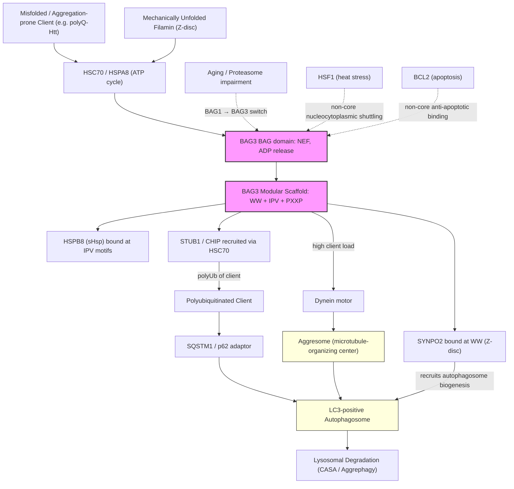

# Pathway Summary for BAG3

## Overview
BAG3 is a modular HSP70/HSC70 co-chaperone of the BAG-family that uses its C-terminal BAG domain to act as a nucleotide-exchange factor (NEF) for HSP70 and its N-terminal WW, IPV, and PXXP elements to assemble multi-chaperone complexes that route damaged or aggregation-prone clients to selective autophagy [PMID:24318877, PMID:27884606]. The BAG3-HSP70-HSPB8 axis is the core of chaperone-assisted selective autophagy (CASA), the pathway that delivers misfolded substrates and mechanically damaged Z-disc components to the autophagosome via STUB1/CHIP-mediated ubiquitination and SQSTM1/p62-LC3 capture, with dynein-dependent aggresome transport when load is high [PMID:20060297, PMID:18006506, PMID:21252941, PMID:23434281]. CASA via BAG3 is essential for striated-muscle Z-disc maintenance and contributes broadly to age-associated proteostasis through a BAG1-to-BAG3 switch that diverts HSP70 clients from proteasomal to autophagic disposal [PMID:19229298, PMID:21681022].

## Core Pathways

### HSP70 Nucleotide-Exchange and Client Release
BAG3 binds the HSP70/HSC70 nucleotide-binding domain through its BAG domain and accelerates ADP release, opening the substrate-binding domain and triggering client release in HSP70 ATPase cycles [PMID:24318877, Reactome:R-HSA-5252079]. This NEF activity is shared with other BAG-family proteins and HSPH1/HSP110, but BAG3 specifically biases the HSP70 cycle toward autophagic, rather than proteasomal, fates of the released substrate [PMID:19229298, PMID:21681022].

### Chaperone-Assisted Selective Autophagy (CASA) and Aggrephagy
BAG3 nucleates a stable cytosolic complex with HSC70/HSPA8 and the small heat-shock protein HSPB8, and recruits the chaperone-associated E3 ubiquitin ligase STUB1/CHIP and the autophagy adaptor SQSTM1/p62 to polyubiquitinate the bound client and capture it on LC3-decorated autophagosomes [PMID:20060297]. When client load exceeds local autophagosome capacity, BAG3 also engages dynein and routes HSP70 substrates along microtubules to the aggresome for bulk autophagic clearance [PMID:21252941]. The HSPB8–BAG3 module is required for autophagic clearance of poly-Q-expanded huntingtin and other aggregation-prone clients, establishing CASA as a major aggrephagy route [PMID:18006506].

### Mechanotransduction-Coupled Z-Disc Proteostasis
At the striated-muscle Z-disc, BAG3 in complex with HSC70 and HSPB8 senses mechanical unfolding of the actin-crosslinker filamin and, through its WW-domain interaction with the actin-bundling protein SYNPO2, recruits the autophagosome biogenesis machinery to nucleate autophagosomes that clear damaged filamin and other Z-disc components [PMID:23434281, PMID:20060297]. Loss of BAG3 or disease-causing BAG3 mutations (e.g., p.Pro209Leu) disrupt this CASA pathway and produce myofibrillar myopathy with Z-disc disintegration and ectopic protein aggregates/inclusions, demonstrating that CASA is essential for muscle Z-disc maintenance [PMID:19085932, PMID:20060297].

## Pathway Diagram

## Molecular Architecture
- **N-terminal WW domain**: binds PPxY-containing partners including SYNPO2, coupling BAG3 to Z-disc autophagosome biogenesis [PMID:23434281]
- **Two central IPV motifs**: docking sites for the small heat-shock proteins HSPB8 and HSPB6, defining the sHsp arm of CASA [PMID:27884606]
- **PXXP / proline-rich region**: scaffolds additional adaptors and signaling partners [PMID:27884606]
- **C-terminal BAG domain**: binds the HSP70/HSC70 nucleotide-binding domain and acts as the nucleotide-exchange factor that releases ADP and substrate [PMID:24318877, Reactome:R-HSA-5252079]

## Upstream Inputs
- **HSC70/HSPA8-bound misfolded clients** — primary CASA substrates routed to autophagy [PMID:20060297, PMID:18006506]
- **Mechanical strain on Z-disc filamin** — substrate signal that activates muscle-specific CASA [PMID:23434281]
- **Aging and proteasome insufficiency** — drive a BAG1-to-BAG3 ratio switch on HSP70, redirecting clients toward autophagic disposal [PMID:19229298, PMID:21681022]
- **Heat stress** — induces BAG3 expression and supports a non-core HSF1 nucleocytoplasmic shuttling role [PMID:26159920]

## Downstream Effects
- **Selective autophagic degradation** of misfolded, aggregation-prone, and mechanically damaged proteins [PMID:20060297, PMID:18006506]
- **Aggresome assembly and clearance** when soluble CASA capacity is exceeded [PMID:21252941]
- **Z-disc maintenance and muscle cell homeostasis** in striated muscle [PMID:20060297, PMID:23434281]
- **Sustained proteostasis during aging**, mitigating accumulation of insoluble HSP70 clients [PMID:19229298]

## Non-Core Contexts
- **HSF1 nucleocytoplasmic shuttling under heat stress**: BAG3 promotes nuclear translocation of HSF1 and modulates the heat-shock response, but this is condition-dependent and downstream of the core CASA scaffold function [PMID:26159920].
- **Anti-apoptotic interaction with BCL2**: BAG3/Bis directly binds BCL2 and synergizes with it to suppress Bax-induced and Fas-mediated apoptosis; this activity is engaged in disease and stress contexts but is not the conserved housekeeping role [PMID:10597216].

## Functional Integration
BAG3 integrates three layers of cytosolic proteostasis around a single modular scaffold:
1. **Chaperone cycling**: BAG-domain NEF activity tunes HSP70 client release [PMID:24318877, Reactome:R-HSA-5252079]
2. **Selective autophagy routing**: IPV/HSPB8 + WW/SYNPO2 + STUB1/p62 contacts direct HSP70 clients to autophagosomes rather than the proteasome, with dynein-aggresome backup for high load [PMID:20060297, PMID:18006506, PMID:21252941, PMID:23434281]
3. **Tissue-specific proteostasis**: the same scaffold is essential for Z-disc maintenance in striated muscle and contributes to whole-organism age-related quality control, explaining why BAG3 mutations cause severe myofibrillar myopathy and cardiomyopathy [PMID:19085932, PMID:21681022]
