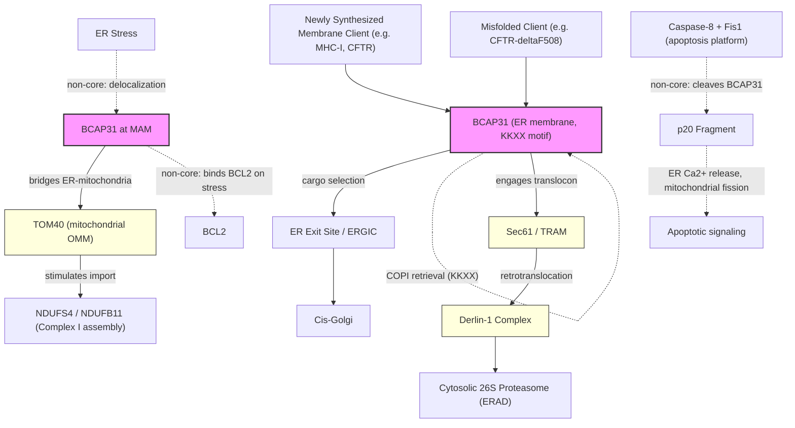

# Pathway Summary for BCAP31

## Overview
BCAP31 (also called BAP31) is an abundant polytopic ER-resident integral membrane protein with three transmembrane segments and a cytosolic C-terminal coiled-coil ending in a KKXX ER-retrieval motif [PMID:9334338, PMID:18555783]. It functions as a cargo receptor and chaperone for selective ER-to-Golgi export of membrane proteins (including MHC class I and several tetraspanins/membrane clients), and as a participant in ER-associated degradation (ERAD) through its association with the Sec61 translocon, TRAM, and the Derlin-1 retrotranslocation complex [PMID:18555783, Reactome:R-HSA-983138, Reactome:R-HSA-983142]. A third, mechanistically distinct core function is the formation of an ER-mitochondria bridging complex with Tom40 at mitochondria-associated ER membranes (MAMs) that supports import of nuclear-encoded Complex I subunits and acts as a stress sensor for mitochondrial respiration [PMID:31206022]. BCAP31 is also a caspase-8 substrate whose cleaved p20 fragment communicates apoptotic signals from the mitochondria-ER interface, but the intact protein's role is in housekeeping ER quality control rather than apoptosis initiation [PMID:9334338, PMID:21183955].

## Core Pathways

### Selective ER-to-Golgi Export of Membrane Cargo
BCAP31 binds newly synthesized integral membrane clients via its cytosolic coiled-coil region and routes them between the peripheral ER, ER exit sites, and the ER-Golgi intermediate compartment, controlling whether each client is exported, retained, or rerouted to ERAD [PMID:18555783]. A well-characterized class of clients is MHC class I: BCAP31 contributes to the MHC-I peptide loading complex on the lumenal side of the ER membrane and to ER-exit-site trafficking of assembled MHC-I heterotrimers en route to the Golgi [Reactome:R-HSA-983138, Reactome:R-HSA-983142, Reactome:R-HSA-8951499]. The KKXX motif provides COPI-dependent ER retrieval that allows BCAP31 to cycle back from ERGIC/cis-Golgi after delivering cargo, consistent with its itinerant distribution.

### ERAD via the Sec61/Derlin-1 Retrotranslocation Machinery
On encountering misfolded membrane clients, BCAP31 acts at the translocon to license their retrotranslocation to the cytosol for proteasomal disposal. Co-immunoprecipitation studies show BCAP31 associates with Sec61beta and TRAM at the translocon and with the Derlin-1 retrotranslocation complex; depletion of BCAP31 reduces proteasomal degradation of the model ERAD substrate CFTR-deltaF508, demonstrating that BCAP31 is required for efficient retrotranslocation [PMID:18555783]. This places BCAP31 in the ERAD pathway proper (GO:0036503) as an early-stage substrate-handling factor, not merely as an upstream regulator.

### ER-Mitochondria Bridging at MAMs Supporting Complex I Biogenesis
At mitochondria-associated ER membranes, BCAP31 forms a heterotypic bridging complex with the mitochondrial outer-membrane translocase subunit TOM40, generating a contact platform that stimulates translocation of Complex I subunits NDUFS4 and NDUFB11 from the cytosol into mitochondria for OXPHOS Complex I assembly [PMID:31206022]. Loss of BCAP31 lowers Complex I content and oxygen consumption, and the BCAP31-TOM40 complex itself functions as a stress sensor: under ER stress BCAP31 delocalizes from the bridge and binds BCL2, coupling ER proteostasis to mitochondrial respiratory adjustment [PMID:31206022].

## Pathway Diagram

## Molecular Architecture
- **Three transmembrane segments** with a short lumenal N-terminus and a large cytosolic C-terminal region [PMID:9334338]
- **Cytosolic coiled-coil / weak death-effector-homology region** that mediates cargo and partner binding [PMID:9334338]
- **C-terminal KKXX ER-retrieval motif** that supports COPI-dependent return from post-ER compartments to the ER, underlying the cycling phenotype between ER, ERGIC, and cis-Golgi [PMID:18555783]
- **Two caspase-8/-1 cleavage sites** flanking the coiled-coil, generating a membrane-anchored p20 N-terminal fragment during apoptosis [PMID:9334338, PMID:21183955]

## Upstream Inputs
- **Newly synthesized membrane clients** entering the secretory pathway (MHC-I heterotrimers, tetraspanins, CFTR) [PMID:18555783, Reactome:R-HSA-983138]
- **Misfolded ER membrane substrates** (e.g. CFTR-deltaF508) that engage Sec61/TRAM/Derlin-1 for retrotranslocation [PMID:18555783]
- **ER stress signals** that reorganize the BCAP31-TOM40 bridge at MAMs and shift BCAP31 to BCL2 binding [PMID:31206022]

## Downstream Effects
- **Productive ER-to-Golgi delivery of select membrane proteins**, including assembly and ER-exit of MHC-I peptide-loading complexes [Reactome:R-HSA-983138, Reactome:R-HSA-983142, Reactome:R-HSA-8951499]
- **Proteasomal degradation of misfolded ER membrane clients** through Sec61/Derlin-1-licensed retrotranslocation [PMID:18555783]
- **Mitochondrial Complex I assembly and respiratory capacity** via BCAP31-TOM40-mediated import of NDUFS4 and NDUFB11 [PMID:31206022]
- **Coupling of ER proteostasis to mitochondrial function**: ER stress repositions BCAP31 from the bridge to BCL2, modulating apoptotic threshold and respiration [PMID:31206022]

## Non-Core Contexts
- **Caspase-8 substrate / Fis1-Bap31 apoptosis platform**: Fis1 on the mitochondrial outer membrane and BAP31 on the ER form a bridging complex that recruits and activates caspase-8, which cleaves BCAP31 to a membrane-anchored pro-apoptotic p20 fragment [PMID:9334338, PMID:21183955, Reactome:R-HSA-351894]. The p20 fragment triggers ER Ca2+ release and mitochondrial fragmentation, but this reflects BCAP31's role as an apoptotic substrate; the intact protein's biology is ER quality control, not apoptosis initiation, and intrinsic-apoptosis annotations on full-length BCAP31 are correctly flagged as over-annotation in the merged review.
- **Surface-antigen (mAb 6C6) reactivity**: the original characterization detected BCAP31 at the cell surface of human breast cancer cells [PMID:8706661], but later work establishes ER/ERGIC residency as the steady-state biology; any plasma-membrane signal likely reflects trafficking intermediates or cargo-bound complexes rather than a constitutive surface pool.
- **RSV SH protein interaction**: respiratory syncytial virus small hydrophobic protein engages BCAP31 at the ER, coupling viral biology to the host cargo-receptor machinery [PMID:25854864]; tangential to core function.

## Functional Integration
BCAP31 sits at the confluence of three secretory- and mitochondrial-quality-control axes:
1. **Anterograde sorting** of select membrane clients out of the ER (most clearly the MHC-I trafficking and assembly route) [PMID:18555783, Reactome:R-HSA-983138]
2. **Retrograde disposal** of misfolded ER membrane substrates through the Sec61/TRAM/Derlin-1 retrotranslocation machinery [PMID:18555783]
3. **Inter-organelle proteostasis** at MAMs, where the BCAP31-TOM40 bridge supports Complex I biogenesis and senses ER stress to adjust mitochondrial respiration [PMID:31206022]

The same protein is also exploited by the Fis1-caspase-8 apoptotic platform as a regulated ER-anchored substrate whose p20 cleavage product transmits death signals to mitochondria, but this is a downstream consequence of apoptotic signaling rather than a regulatory function of the intact protein.
