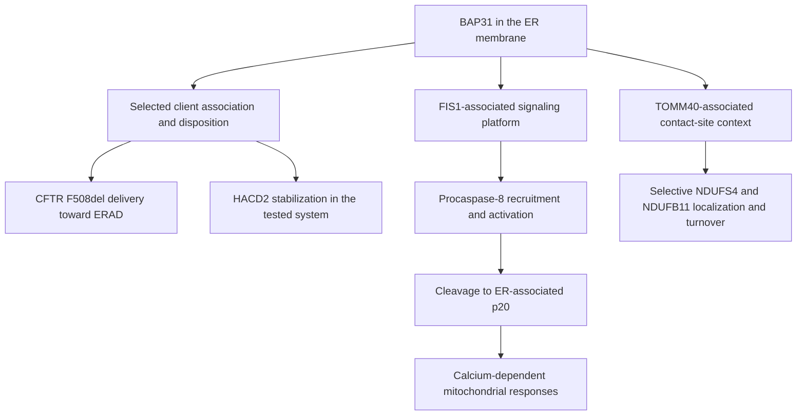

# BCAP31: membrane-protein handling and ER–mitochondria communication

BCAP31 encodes BAP31, a multipass endoplasmic reticulum (ER) membrane protein. Its roles include handling selected membrane-protein clients, participating in a FIS1-associated apoptotic signaling platform, and supporting the mitochondrial localization of selected respiratory-chain proteins. These roles depend on distinct clients and experimental contexts; they do not establish BAP31 as a universal export receptor or an autonomous translocation motor.

## Client handling and ER quality control

BAP31 associates with the N-terminal region of CFTR F508del and with Sec61/TRAM and Derlin-1 machinery. Depletion reduces degradation and permits some mutant CFTR to reach the cell surface. This supports client delivery and regulation of ER-associated degradation, without demonstrating that BAP31 itself forms a pore or performs an ATP-driven ratchet step [PMID:18555783]. The disposition of a bound protein is client dependent: BAP31 stabilizes PTPLB, now named HACD2, in the reported system. That interaction must not be described as promotion of HACD2 degradation [PMID:15024066].

MHC-I studies support binding and context-dependent export or quality-control effects. Mouse Bap29/Bap31 double-loss experiments and human BAP31 overexpression or deficiency experiments answer different questions; they do not establish an obligatory, universal human export mechanism [PMID:15187134; PMID:17056546]. Cellubrevin retention/export experiments provide another client-specific context [PMID:9396746]. The cytoplasmic region contains coiled-coil structure; its historical variant death-effector-domain name does not establish a canonical death-effector fold, nor does it assign all client recognition to that region [PMID:23967155].

## Apoptotic signaling at the ER–mitochondria interface

Intact BAP31 participates with FIS1 in a platform that recruits procaspase-8. Deleting the relevant BAP31 cytoplasmic segment disrupts recruitment. BAP31 therefore does some of the signaling work as well as serving as a caspase substrate. Cleavage generates ER-associated p20, which promotes calcium release and downstream mitochondrial responses [PMID:21183955]. Earlier association and cleavage experiments support this account but should not be described as having performed all the later FIS1-platform experiments [PMID:9334338].

The p20 fragment remains membrane associated. Reactome's separate cytosolic cleavage entity is the terminal residues 238–246 fragment, not p20 [Reactome:R-HSA-351894]. Proteolytic fragments are also distinct from the two alternatively spliced UniProt products P51572-1 and P51572-2; their numbering alone establishes no functional or RefSeq equivalence.

## Selective mitochondrial protein localization

In human U2OS cells, endogenous crosslinked co-immunoprecipitation supports association of BAP31 with TOMM40 and NDUFS4. BAP31 depletion changes mitochondrial distribution and turnover of NDUFS4 and NDUFB11. These data support a contribution to selective protein localization at ER–mitochondria contacts. They do not by themselves distinguish import rate from delivery, retention or degradation, or demonstrate a BAP31 import pore or motor. VDAC1 association does not show the same localization phenotype [PMID:31206022].

```mermaid
flowchart TD
    B[BAP31 in the ER membrane] --> C[Selected client association and disposition]
    C --> E[CFTR F508del delivery toward ERAD]
    C --> H[HACD2 stabilization in the tested system]
    B --> S[FIS1-associated signaling platform]
    S --> R[Procaspase-8 recruitment and activation]
    R --> P[Cleavage to ER-associated p20]
    P --> A[Calcium-dependent mitochondrial responses]
    B --> T[TOMM40-associated contact-site context]
    T --> L[Selective NDUFS4 and NDUFB11 localization and turnover]
```

Experimental cell-surface and lipid-droplet observations are retained as secondary localization contexts; predominant ER residence alone does not make them artifacts [PMID:8706661; PMID:14741744]. The scope of each source—including normal abstract-only caches and separately read original Results—is recorded in the review and notes. The existing provider report remains an unchanged secondary synthesis.
