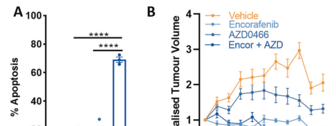

## Question

# Gene Research for Functional Annotation

## ⚠️ CRITICAL: Gene/Protein Identification Context

**BEFORE YOU BEGIN RESEARCH:** You MUST verify you are researching the CORRECT gene/protein. Gene symbols can be ambiguous, especially for less well-characterized genes from non-model organisms.

### Target Gene/Protein Identity (from UniProt):
- **UniProt Accession:** Q07817
- **Protein Description:** RecName: Full=Bcl-2-like protein 1; Short=Bcl2-L-1; AltName: Full=Apoptosis regulator Bcl-X;
- **Gene Information:** Name=BCL2L1; Synonyms=BCL2L, BCLX;
- **Organism (full):** Homo sapiens (Human).
- **Protein Family:** Belongs to the Bcl-2 family. .
- **Key Domains:** Apop_reg_BclX. (IPR013279); Bcl-2-like_sf. (IPR036834); Bcl-2_BH1-3. (IPR046371); Bcl-2_fam. (IPR026298); Bcl2-like. (IPR002475)

### MANDATORY VERIFICATION STEPS:

1. **Check if the gene symbol "BCL2L1" matches the protein description above**
2. **Verify the organism is correct:** Homo sapiens (Human).
3. **Check if protein family/domains align with what you find in literature**
4. **If you find literature for a DIFFERENT gene with the same or similar symbol, STOP**

### If Gene Symbol is Ambiguous or You Cannot Find Relevant Literature:

**DO NOT PROCEED WITH RESEARCH ON A DIFFERENT GENE.** Instead:
- State clearly: "The gene symbol 'BCL2L1' is ambiguous or literature is limited for this specific protein"
- Explain what you found (e.g., "Found extensive literature on a different gene with the same symbol in a different organism")
- Describe the protein based ONLY on the UniProt information provided above
- Suggest that the protein function can be inferred from domain/family information

### Research Target:

Please provide a comprehensive research report on the gene **BCL2L1** (gene ID: BCL2L1, UniProt: Q07817) in human.

The research report should be a detailed narrative explaining the function, biological processes, and localization of the gene product. Citations should be given for all claims.

You should prioritize authoritative reviews and primary scientific literature when conducting research. You can supplement
this with annotations you find in gene/protein databases, but these can be outdated or inaccurate.

We are specifically interested in the primary function of the gene - for enzymes, what reaction is catalyzed, and what is the substrate specificity? For transporters, what is the substrate? For structural proteins or adapters, what is the broader structural role? For signaling molecules, what is the role in the pathway.

We are interested in where in or outside the cell the gene product carries out its function.

We are also interested in the signaling or biochemical pathways in which the gene functions. We are less interested in broad pleiotropic effects, except where these elucidate the precise role.

Include evidence where possible. We are interested in both experimental evidence as well as inference from structure, evolution, or bioinformatic analysis. Precise studies should be prioritized over high-throughput, where available.

## Output

Question: You are an expert researcher providing comprehensive, well-cited information.

Provide detailed information focusing on:
1. Key concepts and definitions with current understanding
2. Recent developments and latest research (prioritize 2023-2024 sources)
3. Current applications and real-world implementations
4. Expert opinions and analysis from authoritative sources
5. Relevant statistics and data from recent studies

Format as a comprehensive research report with proper citations. Include URLs and publication dates where available.
Always prioritize recent, authoritative sources and provide specific citations for all major claims.

# Gene Research for Functional Annotation

## ⚠️ CRITICAL: Gene/Protein Identification Context

**BEFORE YOU BEGIN RESEARCH:** You MUST verify you are researching the CORRECT gene/protein. Gene symbols can be ambiguous, especially for less well-characterized genes from non-model organisms.

### Target Gene/Protein Identity (from UniProt):
- **UniProt Accession:** Q07817
- **Protein Description:** RecName: Full=Bcl-2-like protein 1; Short=Bcl2-L-1; AltName: Full=Apoptosis regulator Bcl-X;
- **Gene Information:** Name=BCL2L1; Synonyms=BCL2L, BCLX;
- **Organism (full):** Homo sapiens (Human).
- **Protein Family:** Belongs to the Bcl-2 family. .
- **Key Domains:** Apop_reg_BclX. (IPR013279); Bcl-2-like_sf. (IPR036834); Bcl-2_BH1-3. (IPR046371); Bcl-2_fam. (IPR026298); Bcl2-like. (IPR002475)

### MANDATORY VERIFICATION STEPS:

1. **Check if the gene symbol "BCL2L1" matches the protein description above**
2. **Verify the organism is correct:** Homo sapiens (Human).
3. **Check if protein family/domains align with what you find in literature**
4. **If you find literature for a DIFFERENT gene with the same or similar symbol, STOP**

### If Gene Symbol is Ambiguous or You Cannot Find Relevant Literature:

**DO NOT PROCEED WITH RESEARCH ON A DIFFERENT GENE.** Instead:
- State clearly: "The gene symbol 'BCL2L1' is ambiguous or literature is limited for this specific protein"
- Explain what you found (e.g., "Found extensive literature on a different gene with the same symbol in a different organism")
- Describe the protein based ONLY on the UniProt information provided above
- Suggest that the protein function can be inferred from domain/family information

### Research Target:

Please provide a comprehensive research report on the gene **BCL2L1** (gene ID: BCL2L1, UniProt: Q07817) in human.

The research report should be a detailed narrative explaining the function, biological processes, and localization of the gene product. Citations should be given for all claims.

You should prioritize authoritative reviews and primary scientific literature when conducting research. You can supplement
this with annotations you find in gene/protein databases, but these can be outdated or inaccurate.

We are specifically interested in the primary function of the gene - for enzymes, what reaction is catalyzed, and what is the substrate specificity? For transporters, what is the substrate? For structural proteins or adapters, what is the broader structural role? For signaling molecules, what is the role in the pathway.

We are interested in where in or outside the cell the gene product carries out its function.

We are also interested in the signaling or biochemical pathways in which the gene functions. We are less interested in broad pleiotropic effects, except where these elucidate the precise role.

Include evidence where possible. We are interested in both experimental evidence as well as inference from structure, evolution, or bioinformatic analysis. Precise studies should be prioritized over high-throughput, where available.

## Comprehensive Research Report: Human **BCL2L1** (UniProt **Q07817**) — Functional Annotation and Translational Context

### 0) Target verification (mandatory identity check)
The UniProt accession **Q07817** corresponds to human **BCL2L1** (also called **BCL-X**, protein **Bcl-2-like protein 1 / Bcl-xL**), a canonical **BCL-2 family** apoptosis regulator with BH domains and a C-terminal transmembrane anchor. In a recent interactome reference table, **BCL-XL** is explicitly mapped to **UniProt Q07817**, annotated with localization to **mitochondrial outer membrane** (MOM) and **endoplasmic reticulum** (ER)/nuclear membrane, and described functionally as an **inhibitor of cell death** with **BH1–BH4** plus a transmembrane domain. (ilyas2025exploringtherole pages 8-12)

### 1) Key concepts, definitions, and current understanding

#### 1.1 Gene product(s) and isoforms (alternative splicing)
**BCL2L1** is best understood as an apoptosis-regulatory gene whose primary functional outputs are two antagonistic splice isoforms:
- **Bcl-xL (long)**: ~**233 aa**, **anti-apoptotic/pro-survival**. (perezserna2025bcl2andbclxl pages 2-4, silva2026bcl2andbclxl pages 8-10)
- **Bcl-xS (short)**: ~**170 aa**, **pro-apoptotic**. (perezserna2025bcl2andbclxl pages 2-4, silva2026bcl2andbclxl pages 8-10)

This isoform switch is central to the gene’s biology and is directly exploited therapeutically (see §2.2). (dou2024modificationofbclx pages 1-2, dou2024modificationofbclx pages 3-5)

#### 1.2 Protein family, domains, and mechanistic definition
Bcl-xL is a **pro-survival BCL-2 family** member containing conserved **BH (Bcl-2 homology) domains** and a hydrophobic **C-terminal transmembrane region** enabling organellar membrane association. (ilyas2025exploringtherole pages 8-12, silva2026bcl2andbclxl pages 8-10, silva2026bcl2andbclxl pages 10-11)

Structurally, BH1–BH3 regions create a **hydrophobic BH3-binding groove** (surface pocket) that binds BH3 helices from pro-apoptotic partners. This binding underlies the defining biochemical function of Bcl-xL: **sequestering BH3-only activators/sensitizers and restraining pro-apoptotic effector activation (BAX/BAK)**. (perezserna2025bcl2andbclxl pages 2-4, perezserna2025bcl2andbclxl pages 4-6, silva2026bcl2andbclxl pages 2-3)

#### 1.3 Primary molecular function in intrinsic apoptosis
The **primary function** of Bcl-xL is to **prevent mitochondrial outer membrane permeabilization (MOMP)** by inhibiting BAX activity and/or sequestering BH3-only proteins, thereby blocking cytochrome c release and downstream caspase activation. (silva2026bcl2andbclxl pages 10-11, silva2026bcl2andbclxl pages 8-10, silva2026bcl2andbclxl pages 11-12, silva2026bcl2andbclxl pages 2-3)

A mechanistic example from a recent review highlights that BCL-xL can bind and restrain apoptosis activators, and that BH3-only proteins (e.g., PUMA) can competitively displace partners to free p53/BH3 proteins and allow BAX activation—illustrating how Bcl-xL’s anti-apoptotic function is executed through regulated protein–protein interactions. (silva2026bcl2andbclxl pages 10-11)

#### 1.4 Subcellular localization: where BCL2L1 acts
Bcl-xL localizes predominantly to the **outer mitochondrial membrane**, but is also found at **ER**, **cytosol**, and **nuclear outer membrane/nuclear membrane**, consistent with a role in apoptosis control at organelle membranes and contact sites. (ilyas2025exploringtherole pages 8-12, perezserna2025bcl2andbclxl pages 2-4, perezserna2025bcl2andbclxl pages 4-6)

Beyond canonical apoptosis suppression at mitochondria, Bcl-xL participates in ER–mitochondria functional coupling (including mitochondrial-associated ER membranes), integrating survival with **Ca2+ homeostasis** via interactions with ER Ca2+ channels (e.g., IP3R). (perezserna2025bcl2andbclxl pages 4-6, perezserna2025bcl2andbclxl pages 6-7)

### 2) Recent developments and latest research (prioritizing 2023–2024)

#### 2.1 2024: BCL-XL targeting to enhance apoptosis in **BRAFV600E colorectal cancer**
A 2024 Cell Death & Disease study tested the hypothesis that **high basal pro-survival BCL-XL and MCL-1** in BRAFV600E CRC raises the apoptotic threshold and limits response to BRAF-targeted therapy. (jenkins2024bclxlinhibitorsenhance pages 3-6, jenkins2024bclxlinhibitorsenhance pages 1-2)

Key quantitative findings:
- Clinically, BRAFV600E metastatic CRC represents ~**10%** of metastatic CRC; BRAF inhibitor monotherapy has ~**5%** objective responses, while **encorafenib + cetuximab** improves OS by **3.6 months** with ~**20%** objective responses—underscoring incomplete apoptosis induction in this disease setting. (jenkins2024bclxlinhibitorsenhance pages 1-2)
- In vitro, encorafenib or encorafenib+cetuximab induced **<25%** apoptosis across lines; combining encorafenib with the BCL-XL inhibitor **A-1331852** induced **>50%** apoptosis in **3/5** BRAFV600E CRC cell lines, while an MCL-1 inhibitor combination exceeded **20%** apoptosis in only **1/5** lines; BCL-2 inhibition did not improve apoptosis beyond **25%**. (jenkins2024bclxlinhibitorsenhance pages 3-6)
- Mechanistically, apoptosis induction by BRAF + BCL-XL inhibition was **BIM-dependent** (BIM deletion attenuated apoptosis). (jenkins2024bclxlinhibitorsenhance pages 3-6)

This work also evaluates platelet-toxicity mitigation strategies (see §3.2) using a **BCL-XL degrader (DT2216)** and a **dendrimer-conjugated BCL-2/BCL-XL inhibitor (AZD0466)**. (jenkins2024bclxlinhibitorsenhance pages 6-8, jenkins2024bclxlinhibitorsenhance pages 1-2)

#### 2.2 2024: Therapeutic **splicing redirection** of BCL2L1 in glioblastoma
A 2024 Cell Death & Disease study in GBM demonstrated that **BCLX/BCL2L1** is aberrantly spliced toward anti-apoptotic **Bcl-xL** in GBM cells and tested **splice-switching oligonucleotides (SSOs)** to shift isoform balance toward **Bcl-xS**. (dou2024modificationofbclx pages 1-2)

Key findings (mechanistic):
- SSOs/vivo-morpholinos targeting the exon junction shifted splicing to elevate **Bcl-xS at the expense of Bcl-xL**, activating apoptosis (CASP9/CASP3 activation) and inducing autophagy-related changes and mitochondrial damage, with antitumor effects in 2D/3D models and **radiosensitization**. (dou2024modificationofbclx pages 3-5, dou2024modificationofbclx pages 1-2)
- Radiation modality matters: low-energy **X-rays increased the Bcl-xL/Bcl-xS ratio** (potentially favoring resistance) whereas heavy (carbon) ions did not in the reported context. (dou2024modificationofbclx pages 1-2)

Quantitative details available from retrieved text include SSO/vMO concentrations (2–8 μM; often 4–8 μM for functional work) and timing (48 h harvest for splicing/protein readouts). (dou2024modificationofbclx pages 2-3)

#### 2.3 2024: BCL-XL dependency in high-risk pediatric AML subtype
A 2024 Blood Advances paper identifies **CBFA2T3::GLIS2 pediatric AMKL** as dependent on **BCL-XL (BCL2L1)** and sensitive to BCL-XL targeting by **navitoclax** and the BCL-XL degrader **DT2216**, including synergy with low-dose cytarabine in vivo. (gress2024cbfa2t3glis2pediatricacute pages 1-2)

Quantitative data in retrieved excerpts include:
- **Cytarabine IC50** across CG2 models: **1–7 nM** (in vitro). (gress2024cbfa2t3glis2pediatricacute pages 11-12)
- **DT2216** xenograft dosing: every **4 days for 4–6 weeks**, reducing leukemic burden and **significantly prolonging survival** in transplanted mouse models (without a numeric survival delta in the excerpt). (gress2024cbfa2t3glis2pediatricacute pages 11-12)

### 3) Current applications and real-world implementations

#### 3.1 Therapeutic targeting modalities (applications)
Current real-world implementations focus on BCL2L1/BCL-XL as a **drug target** in oncology, leveraging several strategies:
- **BH3 mimetics / small-molecule inhibitors** targeting the BH3-binding groove (e.g., **A-1331852**; broader inhibitors like **navitoclax** that bind BCL-XL among other BCL-2 family proteins). (gress2024cbfa2t3glis2pediatricacute pages 1-2, jenkins2024bclxlinhibitorsenhance pages 3-6)
- **PROTAC degraders** (e.g., **DT2216**) designed to degrade BCL-XL, motivated in part by improving the safety profile (platelet toxicity). (jenkins2024bclxlinhibitorsenhance pages 6-8, NCT04886622 chunk 1)
- **Controlled-delivery formulations** (e.g., **AZD0466**, a dendrimer-conjugate approach designed to reduce toxicity by altering exposure kinetics). (jenkins2024bclxlinhibitorsenhance pages 6-8)
- **RNA therapeutics** shifting BCL2L1 splicing toward Bcl-xS (SSOs/vivo-morpholinos). (dou2024modificationofbclx pages 3-5, dou2024modificationofbclx pages 1-2)

#### 3.2 Safety and the thrombocytopenia problem (on-mechanism toxicity)
A central practical limitation for BCL-XL inhibition is **thrombocytopenia**, because platelets depend on BCL-XL for survival. (jenkins2024bclxlinhibitorsenhance pages 6-8, jenkins2024bclxlinhibitorsenhance pages 1-2)

The 2024 BRAFV600E CRC study provides a mechanistic rationale for potential platelet sparing by DT2216: it recruits the E3 ligase **VHL**, which has **minimal expression in platelets**, potentially biasing BCL-XL degradation toward tumor cells and away from platelets. (jenkins2024bclxlinhibitorsenhance pages 6-8)

### 4) Clinical trials (DT2216) and implementation details

#### 4.1 Completed first-in-human DT2216 trial
ClinicalTrials.gov **NCT04886622** (Dialectic Therapeutics) is a **Phase 1**, open-label dose-escalation/cohort-expansion study in relapsed/refractory malignancies, listed as **COMPLETED**, enrolling **20** subjects. (NCT04886622 chunk 1)

Implementation details extracted from the record:
- DT2216 administered **IV over 30 minutes twice weekly**, continuous dosing, **28-day cycles**, starting dose **0.04 mg/kg** with escalation. (NCT04886622 chunk 1)
- Thrombocytopenia is prespecified as a DLT concern: DLT criteria include **Grade 4 thrombocytopenia** and **Grade 3 thrombocytopenia with clinically significant hemorrhage**, and platelet counts are explicitly monitored as a secondary/PD endpoint. (NCT04886622 chunk 1)

No efficacy outcomes or thrombocytopenia incidence rates are reported in the retrieved registry chunks; those require the linked clinical publication(s), which were not retrieved as full text here. (NCT04886622 chunk 3, NCT04886622 chunk 1)

#### 4.2 Ongoing recruiting DT2216 combination trials
- **NCT06620302** (Children’s Oncology Group): Phase I/II DT2216 + irinotecan in relapsed/refractory solid tumors and fibrolamellar carcinoma; recruiting; estimated enrollment **81**; PD includes PBMC Bcl-xL levels and optional paired tumor IHC (TUNEL, Bcl-xL, etc.). (NCT06620302 chunk 1)
- **NCT06964009**: Phase 1b DT2216 + weekly paclitaxel in platinum-resistant ovarian cancer; recruiting; estimated enrollment **~30**; primary endpoints include MTD/RP2D and DLTs. (NCT06964009 chunk 1)

### 5) Expert synthesis: pathway role and what should be annotated as “primary function”

**Functional annotation summary:** The most precise primary molecular function of BCL2L1 (Q07817) is that **Bcl-xL is a membrane-associated anti-apoptotic adaptor that binds BH3 motifs to inhibit activation/oligomerization of BAX/BAK and prevent MOMP**, operating primarily on the **mitochondrial outer membrane**, and secondarily at **ER and organelle contact sites** where it also influences Ca2+ signaling and bioenergetic homeostasis. (perezserna2025bcl2andbclxl pages 2-4, perezserna2025bcl2andbclxl pages 4-6, silva2026bcl2andbclxl pages 8-10, silva2026bcl2andbclxl pages 11-12, perezserna2025bcl2andbclxl pages 6-7)

**Why isoforms matter for annotation:** Because the same gene also produces the **pro-apoptotic Bcl-xS** isoform, functional annotation should explicitly distinguish splice isoforms and note that **cancer cells often favor Bcl-xL** production; therapeutic strategies increasingly aim to either **antagonize Bcl-xL** (BH3 mimetics/PROTACs) or **force isoform switching** toward Bcl-xS (SSOs). (dou2024modificationofbclx pages 1-2, dou2024modificationofbclx pages 3-5)

### 6) Visual evidence (in vivo implementation)
Figure evidence from Jenkins et al. (2024) shows that combining **encorafenib** with **AZD0466** in COLO201 xenografts yields stronger tumor suppression/regression than either agent alone, with associated endpoint tumor weights and excised tumor images. (jenkins2024bclxlinhibitorsenhance media f80a8fd4, jenkins2024bclxlinhibitorsenhance media 5fd567da)

### 7) Consolidated evidence table
| Topic | System/Indication | Intervention/Mechanism | Key quantitative findings | Key limitations/safety | Source (citation id) |
|---|---|---|---|---|---|
| Core function and localization of human BCL2L1/BCL-xL | Human BCL2L1 / BCL-xL protein | Anti-apoptotic BCL-2 family protein; BH1-BH4 domains plus C-terminal transmembrane anchor; BH3-binding groove sequesters BH3-only proteins and inhibits BAX/BAK, preventing MOMP/cytochrome c release; localizes mainly to mitochondrial outer membrane, also ER, cytosol, and nuclear membrane/outer nuclear membrane | Major isoforms: Bcl-xL ~233 aa (anti-apoptotic) and Bcl-xS ~170 aa (pro-apoptotic); Q07817 explicitly mapped to BCL-xL in recent interactome reference | Functionally important in normal cell survival; on-target inhibition can damage platelets because platelets depend on BCL-xL | (ilyas2025exploringtherole pages 8-12, perezserna2025bcl2andbclxl pages 2-4, silva2026bcl2andbclxl pages 10-11, silva2026bcl2andbclxl pages 8-10, silva2026bcl2andbclxl pages 2-3) |
| 2024 development: BRAF + BCL-XL targeting | BRAFV600E colorectal cancer | Encorafenib combined with BCL-XL inhibition/degradation (A-1331852, DT2216, AZD0466) to lower apoptotic threshold created by high basal BCL-XL/MCL-1 | Standard targeted therapy context: encorafenib + cetuximab gives ~20% objective responses and ~3.6-month OS benefit; encorafenib or encorafenib+cetuximab alone induced <25% apoptosis in cell lines; encorafenib + A-1331852 induced >50% apoptosis in 3/5 BRAFV600E CRC lines; MCL1 inhibitor combination exceeded 20% apoptosis in only 1/5 lines; encorafenib + AZD0466 caused significant xenograft suppression/regression and was well tolerated in mice | Some lines (HT29, RKO) were refractory; thrombocytopenia remains established on-target toxicity of BCL-XL inhibition; TUNEL signal not clearly different at sampled timepoint in vivo | (jenkins2024bclxlinhibitorsenhance pages 6-8, jenkins2024bclxlinhibitorsenhance pages 3-6, jenkins2024bclxlinhibitorsenhance pages 1-2, jenkins2024bclxlinhibitorsenhance media f80a8fd4) |
| 2024 development: splice-switching of BCL2L1 | Glioblastoma (GBM) | Splice-switching oligonucleotides / vivo-morpholino targeting BCLX pre-mRNA to shift splicing from anti-apoptotic Bcl-xL toward pro-apoptotic Bcl-xS | vMO/SSO tested at 2-8 uM (cells harvested 48 h; functional studies often 4-8 uM); shift lowered Bcl-xL/Bcl-xS ratio at mRNA and protein levels, triggered CASP9/CASP3-associated apoptosis, mitochondrial damage, autophagic flux, reduced 3D microsphere size, and enhanced radiosensitivity in 2D/3D GBM models | Quantitative percent splice-shift values were not given in the retrieved text; low-energy X-rays increased the Bcl-xL/Bcl-xS ratio, indicating some radiation regimens may favor the resistant isoform; normal astrocytes showed limited cytotoxicity in reported assays | (dou2024modificationofbclx pages 3-5, dou2024modificationofbclx pages 1-2, dou2024modificationofbclx pages 2-3) |
| 2024 development: BCL-XL dependency in pediatric leukemia | CBFA2T3::GLIS2 pediatric AMKL (also NUP98r AMKL models) | Genetic/functional vulnerability to BCL-XL targeted with navitoclax or selective BCL-XL PROTAC DT2216; combinations with low-dose cytarabine | Navitoclax or DT2216 induced apoptosis in vitro and in vivo; DT2216 dosed every 4 days for 4-6 weeks in xenograft models reduced circulating leukemic blasts and significantly prolonged survival; CG2 models were cytarabine-sensitive with IC50s of 1-7 nM; combinations further reduced leukemic burden | Retrieved text did not provide human response rates; navitoclax has known thrombocytopenia liability; DT2216 was developed to reduce this issue; minimal cross-toxicity reported on normal cord-blood CD34+ HSPCs in these models | (gress2024cbfa2t3glis2pediatricacute pages 1-2, gress2024cbfa2t3glis2pediatricacute pages 18-18, gress2024cbfa2t3glis2pediatricacute pages 11-12) |
| Clinical translation: first-in-human DT2216 monotherapy trial | Relapsed/refractory malignancies (solid + hematologic), NCT04886622 | Phase 1 open-label dose-escalation/cohort-expansion of IV DT2216, a BCL-XL PROTAC degrader | Enrollment 20; started 2021-08-25; completed June 2024; DT2216 IV over 30 min twice weekly on a continuous 28-day cycle; starting dose 0.04 mg/kg with escalation; PK/PD included Cmax, half-life, clearance, PBMC BCL-XL levels, serial platelet counts | DLT criteria explicitly included Grade 4 thrombocytopenia and Grade 3 thrombocytopenia with clinically significant hemorrhage; no efficacy outcomes were provided in the retrieved trial text | (NCT04886622 chunk 3, NCT04886622 chunk 1, NCT04886622 chunk 2) |
| Clinical translation: pediatric/AYA combination trial | Relapsed/refractory solid tumors and fibrolamellar carcinoma, NCT06620302 | Phase I/II DT2216 + irinotecan; BCL-xL degradation plus chemotherapy | Recruiting; estimated enrollment 81; DT2216 IV on days 1, 4, 8, 11, 15, 18 plus irinotecan on days 2-6 in cycle 1 then days 1-5 thereafter; 21-day cycles; PD includes PBMC Bcl-xL levels and paired tumor IHC when available | Primary goals are toxicity, MTD/RP2D, PK, preliminary activity; retrieved text did not include results or specific thrombocytopenia rates | (NCT06620302 chunk 1) |
| Clinical translation: ovarian cancer combination trial | Platinum-resistant ovarian cancer, NCT06964009 | Phase 1b dose-escalation of DT2216 + weekly paclitaxel | Recruiting; estimated enrollment ~30; primary aims are MTD/RP2D and DLTs during cycle 1/up to start of cycle 2 | DLTs include Grade >=3 non-hematologic and selected hematologic toxicities, treatment delays >14 days, death, or inability to receive >=75% of assigned doses; no outcome data yet in retrieved record | (NCT06964009 chunk 1) |
| Platelet-sparing rationale for PROTAC BCL-XL targeting | Cross-indication translational strategy | DT2216 links a BCL-XL-binding warhead to a VHL ligand so degradation is favored in VHL-expressing tumor cells, while platelets with minimal/low VHL expression are relatively spared | Preclinical rationale only in retrieved sources: DT2216 showed dose-dependent BCL-XL degradation in CRC models and was specifically designed/developed to limit thrombocytopenia | Human platelet-sparing efficacy still requires clinical confirmation; thrombocytopenia remains a prespecified safety concern and is closely monitored in trials | (jenkins2024bclxlinhibitorsenhance pages 6-8, gress2024cbfa2t3glis2pediatricacute pages 1-2) |

*Table: This table condenses the main functional annotation points for human BCL2L1/BCL-xL and highlights the most relevant 2024 mechanistic, therapeutic, and clinical-translation findings. It is useful as a quick reference linking core biology to current drug-development efforts and available quantitative evidence.*

### 8) Key URLs and publication dates (from retrieved sources)
- Jenkins et al., **Cell Death & Disease**, **Mar 2024**. https://doi.org/10.1038/s41419-024-06478-z (jenkins2024bclxlinhibitorsenhance pages 6-8)
- Dou et al., **Cell Death & Disease**, **Feb 2024**. https://doi.org/10.1038/s41419-024-06507-x (dou2024modificationofbclx pages 1-2)
- Gress et al., **Blood Advances**, **Dec 2024**. https://doi.org/10.1182/bloodadvances.2022008899 (gress2024cbfa2t3glis2pediatricacute pages 1-2)
- ClinicalTrials.gov NCT04886622 (DT2216 Phase 1; posted 2021; completed June 2024): https://clinicaltrials.gov/study/NCT04886622 (NCT04886622 chunk 1)
- ClinicalTrials.gov NCT06620302 (DT2216 + irinotecan; start 2025): https://clinicaltrials.gov/study/NCT06620302 (NCT06620302 chunk 1)
- ClinicalTrials.gov NCT06964009 (DT2216 + paclitaxel; 2025): https://clinicaltrials.gov/study/NCT06964009 (NCT06964009 chunk 1)

### 9) Limitations of this synthesis (transparency)
- Curated database pages (UniProt/InterPro/HGNC/NCBI Gene) were not directly retrieved as full-text evidence in this run; therefore, database-derived annotations are not quoted verbatim, and the report relies on peer-reviewed reviews and primary papers that explicitly map Q07817 and describe domains/localization/function. (ilyas2025exploringtherole pages 8-12, perezserna2025bcl2andbclxl pages 2-4)
- Several clinically important numeric outcomes for DT2216 (human toxicity rates, response rates) are not present in the ClinicalTrials.gov chunks retrieved here and were not available from the cited phase 1 publication within this run; only protocol-level endpoints/design are summarized. (NCT04886622 chunk 3, NCT04886622 chunk 1)

References

1. (ilyas2025exploringtherole pages 8-12): Sidra Ilyas and Donghun Lee. Exploring the role of bcl2 interactome in cancer: a protein/residue interaction network analysis. Biology, 14:261, Mar 2025. URL: https://doi.org/10.3390/biology14030261, doi:10.3390/biology14030261. This article has 1 citations.

2. (perezserna2025bcl2andbclxl pages 2-4): Atenea A. Perez-Serna, Daniel Guzman-Llorens, Reinaldo S. Dos Santos, and Laura Marroqui. Bcl-2 and bcl-xl in diabetes: contributions to endocrine pancreas viability and function. Biomedicines, 13:223, Jan 2025. URL: https://doi.org/10.3390/biomedicines13010223, doi:10.3390/biomedicines13010223. This article has 13 citations.

3. (silva2026bcl2andbclxl pages 8-10): João P. N. Silva, Bárbara Pinto, Patrícia M. A. Silva, and Hassan Bousbaa. Bcl-2 and bcl-xl in cancer: regulation, function, and therapeutic targeting. International Journal of Molecular Sciences, 27:1123, Jan 2026. URL: https://doi.org/10.3390/ijms27021123, doi:10.3390/ijms27021123. This article has 5 citations.

4. (dou2024modificationofbclx pages 1-2): Zhihui Dou, Huiwen Lei, Wei Su, Taotao Zhang, Xiaohua Chen, Boyi Yu, Xiaogang Zhen, Jing Si, Chao Sun, Hong Zhang, and Cuixia Di. Modification of bclx pre-mrna splicing has antitumor efficacy alone or in combination with radiotherapy in human glioblastoma cells. Cell Death &amp; Disease, Feb 2024. URL: https://doi.org/10.1038/s41419-024-06507-x, doi:10.1038/s41419-024-06507-x. This article has 12 citations and is from a peer-reviewed journal.

5. (dou2024modificationofbclx pages 3-5): Zhihui Dou, Huiwen Lei, Wei Su, Taotao Zhang, Xiaohua Chen, Boyi Yu, Xiaogang Zhen, Jing Si, Chao Sun, Hong Zhang, and Cuixia Di. Modification of bclx pre-mrna splicing has antitumor efficacy alone or in combination with radiotherapy in human glioblastoma cells. Cell Death &amp; Disease, Feb 2024. URL: https://doi.org/10.1038/s41419-024-06507-x, doi:10.1038/s41419-024-06507-x. This article has 12 citations and is from a peer-reviewed journal.

6. (silva2026bcl2andbclxl pages 10-11): João P. N. Silva, Bárbara Pinto, Patrícia M. A. Silva, and Hassan Bousbaa. Bcl-2 and bcl-xl in cancer: regulation, function, and therapeutic targeting. International Journal of Molecular Sciences, 27:1123, Jan 2026. URL: https://doi.org/10.3390/ijms27021123, doi:10.3390/ijms27021123. This article has 5 citations.

7. (perezserna2025bcl2andbclxl pages 4-6): Atenea A. Perez-Serna, Daniel Guzman-Llorens, Reinaldo S. Dos Santos, and Laura Marroqui. Bcl-2 and bcl-xl in diabetes: contributions to endocrine pancreas viability and function. Biomedicines, 13:223, Jan 2025. URL: https://doi.org/10.3390/biomedicines13010223, doi:10.3390/biomedicines13010223. This article has 13 citations.

8. (silva2026bcl2andbclxl pages 2-3): João P. N. Silva, Bárbara Pinto, Patrícia M. A. Silva, and Hassan Bousbaa. Bcl-2 and bcl-xl in cancer: regulation, function, and therapeutic targeting. International Journal of Molecular Sciences, 27:1123, Jan 2026. URL: https://doi.org/10.3390/ijms27021123, doi:10.3390/ijms27021123. This article has 5 citations.

9. (silva2026bcl2andbclxl pages 11-12): João P. N. Silva, Bárbara Pinto, Patrícia M. A. Silva, and Hassan Bousbaa. Bcl-2 and bcl-xl in cancer: regulation, function, and therapeutic targeting. International Journal of Molecular Sciences, 27:1123, Jan 2026. URL: https://doi.org/10.3390/ijms27021123, doi:10.3390/ijms27021123. This article has 5 citations.

10. (perezserna2025bcl2andbclxl pages 6-7): Atenea A. Perez-Serna, Daniel Guzman-Llorens, Reinaldo S. Dos Santos, and Laura Marroqui. Bcl-2 and bcl-xl in diabetes: contributions to endocrine pancreas viability and function. Biomedicines, 13:223, Jan 2025. URL: https://doi.org/10.3390/biomedicines13010223, doi:10.3390/biomedicines13010223. This article has 13 citations.

11. (jenkins2024bclxlinhibitorsenhance pages 3-6): Laura J. Jenkins, Ian Y. Luk, Fiona Chionh, Tao Tan, Kristen Needham, Jamieson Ayton, Camilla M. Reehorst, Natalia Vukelic, Oliver M. Sieber, Dmitri Mouradov, Peter Gibbs, David S. Williams, Niall C. Tebbutt, Jayesh Desai, Frédéric Hollande, Amardeep S. Dhillon, Erinna F. Lee, Delphine Merino, W. Douglas Fairlie, and John M. Mariadason. Bcl-xl inhibitors enhance the apoptotic efficacy of braf inhibitors in brafv600e colorectal cancer. Cell Death & Disease, Mar 2024. URL: https://doi.org/10.1038/s41419-024-06478-z, doi:10.1038/s41419-024-06478-z. This article has 10 citations and is from a peer-reviewed journal.

12. (jenkins2024bclxlinhibitorsenhance pages 1-2): Laura J. Jenkins, Ian Y. Luk, Fiona Chionh, Tao Tan, Kristen Needham, Jamieson Ayton, Camilla M. Reehorst, Natalia Vukelic, Oliver M. Sieber, Dmitri Mouradov, Peter Gibbs, David S. Williams, Niall C. Tebbutt, Jayesh Desai, Frédéric Hollande, Amardeep S. Dhillon, Erinna F. Lee, Delphine Merino, W. Douglas Fairlie, and John M. Mariadason. Bcl-xl inhibitors enhance the apoptotic efficacy of braf inhibitors in brafv600e colorectal cancer. Cell Death & Disease, Mar 2024. URL: https://doi.org/10.1038/s41419-024-06478-z, doi:10.1038/s41419-024-06478-z. This article has 10 citations and is from a peer-reviewed journal.

13. (jenkins2024bclxlinhibitorsenhance pages 6-8): Laura J. Jenkins, Ian Y. Luk, Fiona Chionh, Tao Tan, Kristen Needham, Jamieson Ayton, Camilla M. Reehorst, Natalia Vukelic, Oliver M. Sieber, Dmitri Mouradov, Peter Gibbs, David S. Williams, Niall C. Tebbutt, Jayesh Desai, Frédéric Hollande, Amardeep S. Dhillon, Erinna F. Lee, Delphine Merino, W. Douglas Fairlie, and John M. Mariadason. Bcl-xl inhibitors enhance the apoptotic efficacy of braf inhibitors in brafv600e colorectal cancer. Cell Death & Disease, Mar 2024. URL: https://doi.org/10.1038/s41419-024-06478-z, doi:10.1038/s41419-024-06478-z. This article has 10 citations and is from a peer-reviewed journal.

14. (dou2024modificationofbclx pages 2-3): Zhihui Dou, Huiwen Lei, Wei Su, Taotao Zhang, Xiaohua Chen, Boyi Yu, Xiaogang Zhen, Jing Si, Chao Sun, Hong Zhang, and Cuixia Di. Modification of bclx pre-mrna splicing has antitumor efficacy alone or in combination with radiotherapy in human glioblastoma cells. Cell Death &amp; Disease, Feb 2024. URL: https://doi.org/10.1038/s41419-024-06507-x, doi:10.1038/s41419-024-06507-x. This article has 12 citations and is from a peer-reviewed journal.

15. (gress2024cbfa2t3glis2pediatricacute pages 1-2): Verena Gress, Mathieu Roussy, Luc Boulianne, Mélanie Bilodeau, Sophie Cardin, Nehme El-Hachem, Véronique Lisi, Banafsheh Khakipoor, Alexandre Rouette, Azer Farah, Louis Théret, Léo Aubert, Furat Fatima, Éric Audemard, Pierre Thibault, Éric Bonneil, Jalila Chagraoui, Louise Laramée, Patrick Gendron, Loubna Jouan, Safa Jammali, Bastien Paré, Shawn M. Simpson, Thai Hoa Tran, Michel Duval, Pierre Teira, Henrique Bittencourt, Raoul Santiago, Frédéric Barabé, Guy Sauvageau, Martin A. Smith, Josée Hébert, Philippe P. Roux, Tanja A. Gruber, Vincent-Philippe Lavallée, Brian T. Wilhelm, and Sonia Cellot. Cbfa2t3::glis2 pediatric acute megakaryoblastic leukemia is sensitive to bcl-xl inhibition by navitoclax and dt2216. Dec 2024. URL: https://doi.org/10.1182/bloodadvances.2022008899, doi:10.1182/bloodadvances.2022008899. This article has 28 citations and is from a peer-reviewed journal.

16. (gress2024cbfa2t3glis2pediatricacute pages 11-12): Verena Gress, Mathieu Roussy, Luc Boulianne, Mélanie Bilodeau, Sophie Cardin, Nehme El-Hachem, Véronique Lisi, Banafsheh Khakipoor, Alexandre Rouette, Azer Farah, Louis Théret, Léo Aubert, Furat Fatima, Éric Audemard, Pierre Thibault, Éric Bonneil, Jalila Chagraoui, Louise Laramée, Patrick Gendron, Loubna Jouan, Safa Jammali, Bastien Paré, Shawn M. Simpson, Thai Hoa Tran, Michel Duval, Pierre Teira, Henrique Bittencourt, Raoul Santiago, Frédéric Barabé, Guy Sauvageau, Martin A. Smith, Josée Hébert, Philippe P. Roux, Tanja A. Gruber, Vincent-Philippe Lavallée, Brian T. Wilhelm, and Sonia Cellot. Cbfa2t3::glis2 pediatric acute megakaryoblastic leukemia is sensitive to bcl-xl inhibition by navitoclax and dt2216. Dec 2024. URL: https://doi.org/10.1182/bloodadvances.2022008899, doi:10.1182/bloodadvances.2022008899. This article has 28 citations and is from a peer-reviewed journal.

17. (NCT04886622 chunk 1):  A Study of DT2216 in Relapsed/Refractory Malignancies. Dialectic Therapeutics, Inc. 2021. ClinicalTrials.gov Identifier: NCT04886622

18. (NCT04886622 chunk 3):  A Study of DT2216 in Relapsed/Refractory Malignancies. Dialectic Therapeutics, Inc. 2021. ClinicalTrials.gov Identifier: NCT04886622

19. (NCT06620302 chunk 1):  Testing the Addition of an Anti-cancer Drug, DT2216, to the Usual Chemotherapy Treatment for Relapsed or Refractory Solid Tumors and Fibrolamellar Carcinoma. Children's Oncology Group. 2025. ClinicalTrials.gov Identifier: NCT06620302

20. (NCT06964009 chunk 1): Elizabeth Stover, MD, PhD. DT2216 + Paclitaxel in Platinum-Resistant Ovarian Cancer. Elizabeth Stover, MD, PhD. 2025. ClinicalTrials.gov Identifier: NCT06964009

21. (jenkins2024bclxlinhibitorsenhance media f80a8fd4): Laura J. Jenkins, Ian Y. Luk, Fiona Chionh, Tao Tan, Kristen Needham, Jamieson Ayton, Camilla M. Reehorst, Natalia Vukelic, Oliver M. Sieber, Dmitri Mouradov, Peter Gibbs, David S. Williams, Niall C. Tebbutt, Jayesh Desai, Frédéric Hollande, Amardeep S. Dhillon, Erinna F. Lee, Delphine Merino, W. Douglas Fairlie, and John M. Mariadason. Bcl-xl inhibitors enhance the apoptotic efficacy of braf inhibitors in brafv600e colorectal cancer. Cell Death & Disease, Mar 2024. URL: https://doi.org/10.1038/s41419-024-06478-z, doi:10.1038/s41419-024-06478-z. This article has 10 citations and is from a peer-reviewed journal.

22. (jenkins2024bclxlinhibitorsenhance media 5fd567da): Laura J. Jenkins, Ian Y. Luk, Fiona Chionh, Tao Tan, Kristen Needham, Jamieson Ayton, Camilla M. Reehorst, Natalia Vukelic, Oliver M. Sieber, Dmitri Mouradov, Peter Gibbs, David S. Williams, Niall C. Tebbutt, Jayesh Desai, Frédéric Hollande, Amardeep S. Dhillon, Erinna F. Lee, Delphine Merino, W. Douglas Fairlie, and John M. Mariadason. Bcl-xl inhibitors enhance the apoptotic efficacy of braf inhibitors in brafv600e colorectal cancer. Cell Death & Disease, Mar 2024. URL: https://doi.org/10.1038/s41419-024-06478-z, doi:10.1038/s41419-024-06478-z. This article has 10 citations and is from a peer-reviewed journal.

23. (gress2024cbfa2t3glis2pediatricacute pages 18-18): Verena Gress, Mathieu Roussy, Luc Boulianne, Mélanie Bilodeau, Sophie Cardin, Nehme El-Hachem, Véronique Lisi, Banafsheh Khakipoor, Alexandre Rouette, Azer Farah, Louis Théret, Léo Aubert, Furat Fatima, Éric Audemard, Pierre Thibault, Éric Bonneil, Jalila Chagraoui, Louise Laramée, Patrick Gendron, Loubna Jouan, Safa Jammali, Bastien Paré, Shawn M. Simpson, Thai Hoa Tran, Michel Duval, Pierre Teira, Henrique Bittencourt, Raoul Santiago, Frédéric Barabé, Guy Sauvageau, Martin A. Smith, Josée Hébert, Philippe P. Roux, Tanja A. Gruber, Vincent-Philippe Lavallée, Brian T. Wilhelm, and Sonia Cellot. Cbfa2t3::glis2 pediatric acute megakaryoblastic leukemia is sensitive to bcl-xl inhibition by navitoclax and dt2216. Dec 2024. URL: https://doi.org/10.1182/bloodadvances.2022008899, doi:10.1182/bloodadvances.2022008899. This article has 28 citations and is from a peer-reviewed journal.

24. (NCT04886622 chunk 2):  A Study of DT2216 in Relapsed/Refractory Malignancies. Dialectic Therapeutics, Inc. 2021. ClinicalTrials.gov Identifier: NCT04886622

## Artifacts

- [Edison artifact artifact-00](BCL2L1-deep-research-falcon_artifacts/artifact-00.md)

## Citations

1. ilyas2025exploringtherole pages 8-12
2. jenkins2024bclxlinhibitorsenhance pages 1-2
3. jenkins2024bclxlinhibitorsenhance pages 3-6
4. dou2024modificationofbclx pages 1-2
5. dou2024modificationofbclx pages 2-3
6. jenkins2024bclxlinhibitorsenhance pages 6-8
7. dou2024modificationofbclx pages 3-5
8. https://doi.org/10.1038/s41419-024-06478-z
9. https://doi.org/10.1038/s41419-024-06507-x
10. https://doi.org/10.1182/bloodadvances.2022008899
11. https://clinicaltrials.gov/study/NCT04886622
12. https://clinicaltrials.gov/study/NCT06620302
13. https://clinicaltrials.gov/study/NCT06964009
14. https://doi.org/10.3390/biology14030261,
15. https://doi.org/10.3390/biomedicines13010223,
16. https://doi.org/10.3390/ijms27021123,
17. https://doi.org/10.1038/s41419-024-06507-x,
18. https://doi.org/10.1038/s41419-024-06478-z,
19. https://doi.org/10.1182/bloodadvances.2022008899,