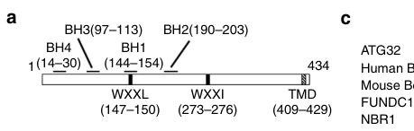

## Question

# Gene Research for Functional Annotation

## ⚠️ CRITICAL: Gene/Protein Identification Context

**BEFORE YOU BEGIN RESEARCH:** You MUST verify you are researching the CORRECT gene/protein. Gene symbols can be ambiguous, especially for less well-characterized genes from non-model organisms.

### Target Gene/Protein Identity (from UniProt):
- **UniProt Accession:** Q9BXK5
- **Protein Description:** RecName: Full=Bcl-2-like protein 13; Short=Bcl2-L-13; AltName: Full=Bcl-rambo; AltName: Full=Protein Mil1;
- **Gene Information:** Name=BCL2L13; Synonyms=MIL1; ORFNames=CD003;
- **Organism (full):** Homo sapiens (Human).
- **Protein Family:** Belongs to the Bcl-2 family. .
- **Key Domains:** Bcl-2-like_sf. (IPR036834); Bcl-2_BH1-3. (IPR046371); Bcl2-like. (IPR002475); BCL2L13. (IPR042398); Bcl-2 (PF00452)

### MANDATORY VERIFICATION STEPS:

1. **Check if the gene symbol "BCL2L13" matches the protein description above**
2. **Verify the organism is correct:** Homo sapiens (Human).
3. **Check if protein family/domains align with what you find in literature**
4. **If you find literature for a DIFFERENT gene with the same or similar symbol, STOP**

### If Gene Symbol is Ambiguous or You Cannot Find Relevant Literature:

**DO NOT PROCEED WITH RESEARCH ON A DIFFERENT GENE.** Instead:
- State clearly: "The gene symbol 'BCL2L13' is ambiguous or literature is limited for this specific protein"
- Explain what you found (e.g., "Found extensive literature on a different gene with the same symbol in a different organism")
- Describe the protein based ONLY on the UniProt information provided above
- Suggest that the protein function can be inferred from domain/family information

### Research Target:

Please provide a comprehensive research report on the gene **BCL2L13** (gene ID: BCL2L13, UniProt: Q9BXK5) in human.

The research report should be a detailed narrative explaining the function, biological processes, and localization of the gene product. Citations should be given for all claims.

You should prioritize authoritative reviews and primary scientific literature when conducting research. You can supplement
this with annotations you find in gene/protein databases, but these can be outdated or inaccurate.

We are specifically interested in the primary function of the gene - for enzymes, what reaction is catalyzed, and what is the substrate specificity? For transporters, what is the substrate? For structural proteins or adapters, what is the broader structural role? For signaling molecules, what is the role in the pathway.

We are interested in where in or outside the cell the gene product carries out its function.

We are also interested in the signaling or biochemical pathways in which the gene functions. We are less interested in broad pleiotropic effects, except where these elucidate the precise role.

Include evidence where possible. We are interested in both experimental evidence as well as inference from structure, evolution, or bioinformatic analysis. Precise studies should be prioritized over high-throughput, where available.

## Output

Question: You are an expert researcher providing comprehensive, well-cited information.

Provide detailed information focusing on:
1. Key concepts and definitions with current understanding
2. Recent developments and latest research (prioritize 2023-2024 sources)
3. Current applications and real-world implementations
4. Expert opinions and analysis from authoritative sources
5. Relevant statistics and data from recent studies

Format as a comprehensive research report with proper citations. Include URLs and publication dates where available.
Always prioritize recent, authoritative sources and provide specific citations for all major claims.

# Gene Research for Functional Annotation

## ⚠️ CRITICAL: Gene/Protein Identification Context

**BEFORE YOU BEGIN RESEARCH:** You MUST verify you are researching the CORRECT gene/protein. Gene symbols can be ambiguous, especially for less well-characterized genes from non-model organisms.

### Target Gene/Protein Identity (from UniProt):
- **UniProt Accession:** Q9BXK5
- **Protein Description:** RecName: Full=Bcl-2-like protein 13; Short=Bcl2-L-13; AltName: Full=Bcl-rambo; AltName: Full=Protein Mil1;
- **Gene Information:** Name=BCL2L13; Synonyms=MIL1; ORFNames=CD003;
- **Organism (full):** Homo sapiens (Human).
- **Protein Family:** Belongs to the Bcl-2 family. .
- **Key Domains:** Bcl-2-like_sf. (IPR036834); Bcl-2_BH1-3. (IPR046371); Bcl2-like. (IPR002475); BCL2L13. (IPR042398); Bcl-2 (PF00452)

### MANDATORY VERIFICATION STEPS:

1. **Check if the gene symbol "BCL2L13" matches the protein description above**
2. **Verify the organism is correct:** Homo sapiens (Human).
3. **Check if protein family/domains align with what you find in literature**
4. **If you find literature for a DIFFERENT gene with the same or similar symbol, STOP**

### If Gene Symbol is Ambiguous or You Cannot Find Relevant Literature:

**DO NOT PROCEED WITH RESEARCH ON A DIFFERENT GENE.** Instead:
- State clearly: "The gene symbol 'BCL2L13' is ambiguous or literature is limited for this specific protein"
- Explain what you found (e.g., "Found extensive literature on a different gene with the same symbol in a different organism")
- Describe the protein based ONLY on the UniProt information provided above
- Suggest that the protein function can be inferred from domain/family information

### Research Target:

Please provide a comprehensive research report on the gene **BCL2L13** (gene ID: BCL2L13, UniProt: Q9BXK5) in human.

The research report should be a detailed narrative explaining the function, biological processes, and localization of the gene product. Citations should be given for all claims.

You should prioritize authoritative reviews and primary scientific literature when conducting research. You can supplement
this with annotations you find in gene/protein databases, but these can be outdated or inaccurate.

We are specifically interested in the primary function of the gene - for enzymes, what reaction is catalyzed, and what is the substrate specificity? For transporters, what is the substrate? For structural proteins or adapters, what is the broader structural role? For signaling molecules, what is the role in the pathway.

We are interested in where in or outside the cell the gene product carries out its function.

We are also interested in the signaling or biochemical pathways in which the gene functions. We are less interested in broad pleiotropic effects, except where these elucidate the precise role.

Include evidence where possible. We are interested in both experimental evidence as well as inference from structure, evolution, or bioinformatic analysis. Precise studies should be prioritized over high-throughput, where available.

## Research Report: Human **BCL2L13** (UniProt **Q9BXK5**) — Functional Annotation, Biology, and Recent Research

### 1) Target identity verification (critical disambiguation)
The literature retrieved matches the UniProt target **Q9BXK5**: **Bcl-2-like protein 13 (BCL2L13)**, also termed **BCL-RAMBO / Bcl2-L-13 / MIL1**, a **Bcl-2 family** protein that localizes to mitochondria via a **C-terminal transmembrane (TM) domain** and contains Bcl-2 homology motifs plus an LC3-interacting region consistent with mitophagy receptor function (murakawa2015bcl2likeprotein13 pages 1-2, kataoka2022biologicalpropertiesof pages 4-6, kataoka2022biologicalpropertiesof pages 6-8). No evidence in the retrieved set suggested a different gene/protein with the same symbol in human.

### 2) Key concepts and definitions (current understanding)

#### 2.1 BCL2L13 as a mitochondrial outer-membrane (OMM) mitophagy receptor
**Mitophagy** is selective macroautophagy targeting mitochondria; **receptor-mediated (ubiquitin-independent) mitophagy** relies on OMM proteins containing **LIR motifs** that directly bind ATG8-family proteins (LC3/GABARAP) on forming autophagosomes (yamaguchi2016receptormediatedmitophagy. pages 4-5, kataoka2022biologicalpropertiesof pages 4-6). BCL2L13 is established as a **mammalian functional homologue of yeast Atg32** that can mediate mitophagy and mitochondrial fragmentation in mammalian cells (murakawa2015bcl2likeprotein13 pages 1-2).

Mechanistically, BCL2L13 contains **WXXL/I motifs**, one of which functions as a **LIR** enabling direct binding to **LC3B** (murakawa2015bcl2likeprotein13 pages 1-2). CCCP-induced mitochondrial damage increases the endogenous interaction between BCL2L13 and LC3 in HEK293 cells, and BCL2L13 knockdown attenuates CCCP-induced mitochondrial fragmentation and mitophagy (yamaguchi2016receptormediatedmitophagy. pages 4-5, murakawa2015bcl2likeprotein13 pages 1-2).

#### 2.2 Domain architecture and motifs (structure–function)
Primary and review sources converge on the following architecture:
- **BH1–BH4 domains** (Bcl-2 homology) (murakawa2015bcl2likeprotein13 pages 1-2, kataoka2022biologicalpropertiesof pages 4-6).
- **Two WXXL/I motifs**, with the **second motif (~273–276 in the mouse/human-aligned region)** serving as the key LIR for LC3 interaction (yamaguchi2016receptormediatedmitophagy. pages 4-5, murakawa2015bcl2likeprotein13 pages 1-2).
- In the focused review, human BCL2L13 is described as **485 aa** and includes a **BHNo region** containing an LIR with sequence **WQQI** (human residues **276–279**, mouse **273–276**) (kataoka2022biologicalpropertiesof pages 4-6).
- A **C-terminal TM domain** required for mitochondrial targeting/anchoring (yamaguchi2016receptormediatedmitophagy. pages 4-5, kataoka2022biologicalpropertiesof pages 6-8).

Image-based evidence from Murakawa et al. includes a schematic of BH domains, WXXL/I motifs, and TM domain, and experimental LC3-binding data dependent on the LIR (murakawa2015bcl2likeprotein13 media a5a4456b).

#### 2.3 Separation of functions: fragmentation vs mitophagy
A consistent theme is **functional modularity**:
- **BH domains** are required for **mitochondrial fragmentation**.
- The **LIR/WXXI motif** is required for **mitophagy** but not necessarily fragmentation.
This separation is explicitly described in both the primary study and the mitophagy review (yamaguchi2016receptormediatedmitophagy. pages 4-5, murakawa2015bcl2likeprotein13 pages 1-2).

#### 2.4 Parkin-independence and relationship to canonical PINK1/Parkin mitophagy
BCL2L13 can induce mitophagy in **Parkin-deficient** contexts, placing it within **ubiquitin-independent** pathways rather than relying on the classic PINK1/Parkin ubiquitin cascade (yamaguchi2016receptormediatedmitophagy. pages 4-5, murakawa2015bcl2likeprotein13 pages 1-2).

### 3) Subcellular localization and cellular roles

#### 3.1 Mitochondrial outer membrane localization
BCL2L13 is described as an **outer mitochondrial membrane** protein whose mitochondrial localization depends on its **C-terminal TM domain** (yamaguchi2016receptormediatedmitophagy. pages 4-5, murakawa2015bcl2likeprotein13 pages 1-2, kataoka2022biologicalpropertiesof pages 6-8). Murakawa et al. provide figure-level support for domain organization and mitochondrial function readouts (murakawa2015bcl2likeprotein13 media a5a4456b, murakawa2015bcl2likeprotein13 media c41d0676).

#### 3.2 ER–mitochondria contact sites (newer localization context)
A major 2024 development is the extension of BCL2L13 function beyond canonical mitophagy receptor activity into **ER–mitochondria contact site biology**. Grepper et al. report BCL2L13 localization across **mitochondria, ER, and mitochondria-associated membranes**, and show that altering BCL2L13 affects **Ca2+ handling** without changing the number of ER–mitochondria contacts (grepper2024bcl2l13atendoplasmic pages 1-2, grepper2024bcl2l13atendoplasmic pages 2-4, grepper2024bcl2l13atendoplasmic pages 8-11).

### 4) Molecular functions, pathways, and binding partners (evidence-based)

#### 4.1 LC3/GABARAP binding via LIR motif (core mitophagy mechanism)
BCL2L13 binds LC3 through the LIR/WXXI motif; mutation of the motif decreases LC3 interaction, and LIR integrity is required for mitophagy (murakawa2015bcl2likeprotein13 pages 1-2, murakawa2015bcl2likeprotein13 media a5a4456b). Phosphorylation near the LIR (Ser272 in mouse numbering) modulates LC3 binding and mitophagic activity (yamaguchi2016receptormediatedmitophagy. pages 4-5, kataoka2022biologicalpropertiesof pages 9-11).

#### 4.2 ULK1 complex recruitment and initiation of mitophagy
A focused review summarizes evidence that BCL2L13 can co-immunoprecipitate with **ULK1**, and “appears to recruit the ULK1 complex to the MOM” to support autophagosome formation during mitophagy (kataoka2022biologicalpropertiesof pages 9-11).

#### 4.3 Mitochondrial fragmentation/fission mechanisms (DRP1-independent vs DRP1-linked contexts)
Foundational work indicates BCL2L13 can induce fragmentation **independent of DRP1/DNM1L** (murakawa2015bcl2likeprotein13 pages 1-2, kataoka2022biologicalpropertiesof pages 9-11). However, recent cancer-specific work in glioblastoma indicates a distinct mechanism where BCL2L13 promotes mitochondrial fission through **DNM1L Ser616** regulation, coupled to increased mitophagy flux (wang2023bcl2l13promotesmitophagy pages 1-2). This suggests **context-dependent fission wiring**, where BCL2L13 may either bypass DRP1 in some systems or act upstream of DRP1 activation in others (murakawa2015bcl2likeprotein13 pages 1-2, wang2023bcl2l13promotesmitophagy pages 1-2).

#### 4.4 Additional interactors and modulators
Reviews summarize multiple reported interactions and modulators, including **PGAM5**, **ANT**, **VDAC**, **CERS2/CERS6**, LC3/GABARAP proteins, and ULK1, with PGAM5 also described as a negative regulator of BCL2L13-mediated mitophagy via dephosphorylation of a regulatory serine site (kataoka2022biologicalpropertiesof pages 11-12, kataoka2022biologicalpropertiesof pages 9-11, kataoka2022biologicalpropertiesof pages 6-8).

### 5) Recent developments (prioritizing 2023–2024)

#### 5.1 Glioblastoma: BCL2L13-driven fission–mitophagy supports tumor aggressiveness (2023)
Wang et al. (Cell Death & Disease; **Sep 2023**; https://doi.org/10.1038/s41419-023-06112-4) report that BCL2L13 is **upregulated in GBM** and associates with higher grade and mesenchymal subtype. Functional knockdown reduces viability, migration, invasion, and mitophagy markers, while overexpression increases LC3B-II and mitophagy phenotypes; autophagy inhibitors reverse pro-tumor phenotypes (wang2023bcl2l13promotesmitophagy pages 2-4). In an orthotopic mouse model, reported tumor bioluminescence was approximately **55 × 10^8 vs 30 × 10^8 photons/s** (control vs BCL2L13 knockdown), and Kaplan–Meier analysis indicated improved survival with knockdown (**P < 0.05**) (wang2023bcl2l13promotesmitophagy pages 8-11). Mechanistically, the study links BCL2L13 to **DNM1L Ser616** regulation and increased mitophagy flux (wang2023bcl2l13promotesmitophagy pages 1-2).

#### 5.2 Skeletal muscle & endurance biology: ER–mitochondria Ca2+ regulation (2024)
Grepper et al. (iScience; **Aug 2024**; https://doi.org/10.1016/j.isci.2024.110510) propose BCL2L13 as a regulator of **ER–mitochondria Ca2+ homeostasis** important for muscle function (grepper2024bcl2l13atendoplasmic pages 1-2). In bcl2l13 knockout zebrafish (n=16/group), KO animals were smaller and showed impaired locomotion and lower MO2max and Ucrit (grepper2024bcl2l13atendoplasmic pages 2-4). A striking histological statistic reported is **tubular aggregates in 11% of KO fibers vs 0% in WT**, consistent with disturbed SR/Ca2+ handling (grepper2024bcl2l13atendoplasmic pages 2-4). In C2C12-derived assays, Bcl2l13 knockdown **reduced SR Ca2+ release** and **increased mitochondrial Ca2+ uptake**; ER–mitochondria proximity reporters (SPLICS) and EM analyses indicate ERMC number/extent was not significantly altered, supporting a functional rather than purely structural contact-site effect (grepper2024bcl2l13atendoplasmic pages 8-11).

#### 5.3 Diabetic kidney disease: YME1L→BCL2L13 phosphorylation enhances mitophagy to suppress tubular senescence (2024)
Luo et al. (Biological Research; **Mar 2024**; https://doi.org/10.1186/s40659-024-00487-0) identify BCL2L13 as a **YME1L-interacting partner** by LC–MS/MS and confirm interaction by co-IP in HK2 renal tubular epithelial cells; high glucose weakens this interaction and reduces phosphorylated BCL2L13 (luo2024yme1lmediatedmitophagyprotects pages 12-15, luo2024yme1lmediatedmitophagyprotects pages 15-18). YME1L overexpression increases BCL2L13 phosphorylation and strengthens BCL2L13–LC3 binding, supporting enhanced mitophagy (luo2024yme1lmediatedmitophagyprotects pages 15-18, luo2024yme1lmediatedmitophagyprotects pages 18-20). Functionally, BCL2L13 knockdown abrogates YME1L-mediated improvements in mitophagy readouts (LC3II/COX IV and LC3II/TOM20 colocalization) and anti-senescence effects (SA-β-Gal positivity, P16/P21) (luo2024yme1lmediatedmitophagyprotects pages 15-18). The study reports in vivo group sizes **n=8–10** and typical cellular replicate sizes **n=3–4**, with standard significance thresholds (*p<0.05, **p<0.01, ***p<0.001) (luo2024yme1lmediatedmitophagyprotects pages 20-21).

#### 5.4 Hypoxic cardiomyocyte injury: miRNA targeting of BCL2L13 links to PI3K/AKT survival signaling (2024)
Jiang et al. (Applied Biochemistry and Biotechnology; **Apr 2024**; https://doi.org/10.1007/s12010-024-04931-5) show that in hypoxic AC16 human cardiomyocytes, miR-449b-5p is downregulated and BCL2L13 is validated as a **direct target** by dual-luciferase assays (jiang2024mir449b5pameliorateshypoxiainduced pages 3-6). Manipulations indicate that **BCL2L13 inhibition** reduces hypoxia-induced viability loss, LDH release, apoptosis, and oxidative stress; BCL2L13 overexpression negates miR-449b-5p protective effects, linking BCL2L13 to injury susceptibility (jiang2024mir449b5pameliorateshypoxiainduced pages 3-6, jiang2024mir449b5pameliorateshypoxiainduced pages 1-3). Reported experimental details include mimic/inhibitor concentrations and statistical analysis across three independent experiments (jiang2024mir449b5pameliorateshypoxiainduced pages 3-6).

### 6) Current applications and real-world implementations

#### 6.1 Cancer biomarker/target rationale
- **GBM**: BCL2L13 is proposed as a candidate therapeutic target because genetic knockdown reduces tumor aggressiveness and improves survival in vivo, and autophagy inhibitors reverse BCL2L13-driven phenotypes (wang2023bcl2l13promotesmitophagy pages 2-4, wang2023bcl2l13promotesmitophagy pages 8-11). The mechanistic framing is that BCL2L13 supports **protective mitophagy** that tumors exploit for survival under stress (wang2023bcl2l13promotesmitophagy pages 2-4).
- **Renal cell carcinoma**: Bioinformatic analyses and IHC indicate BCL2L13 downregulation correlates with poorer prognosis, and functional overexpression in ccRCC cells induces apoptosis and sensitizes to ABT-263 (navitoclax) (meng2021downregulationofbcl2l13 pages 7-10). While hazard ratios are not present in the retrieved excerpts, the paper explicitly positions BCL2L13 as an independent prognostic marker and mechanistically tied to mitochondrial apoptosis via SLC25A4/ANT (meng2021downregulationofbcl2l13 pages 1-2, meng2021downregulationofbcl2l13 pages 7-10).

#### 6.2 Metabolic and organ-protection directions
- **DKD**: The YME1L–BCL2L13 axis suggests a translational concept: enhancing receptor-mediated mitophagy via BCL2L13 phosphorylation to limit tubular senescence and preserve renal function (luo2024yme1lmediatedmitophagyprotects pages 15-18, luo2024yme1lmediatedmitophagyprotects pages 20-21).
- **Ischemic/hypoxic injury**: miRNA-based downregulation of BCL2L13 is proposed as protective in cardiomyocyte hypoxia models, implying potential nucleic-acid therapeutics or pathway modulation strategies (jiang2024mir449b5pameliorateshypoxiainduced pages 3-6, jiang2024mir449b5pameliorateshypoxiainduced pages 1-3).

### 7) Expert synthesis and analysis (authoritative perspectives)
Focused and mechanistic reviews emphasize that BCL2L13 is unusual among Bcl-2 family members because it participates in both **mitochondrial quality control (mitophagy)** and **mitochondria-mediated apoptosis signaling**, and that its outputs are highly **context- and cell-type-dependent**, likely governed by post-translational modifications (e.g., Ser272-adjacent phosphorylation), binding partners (e.g., PGAM5), and stress conditions (kataoka2022biologicalpropertiesof pages 11-12, kataoka2022biologicalpropertiesof pages 9-11, kataoka2022biologicalpropertiesof pages 6-8). The 2016 receptor-mitophagy review frames BCL2L13 as a receptor capable of driving mitophagy independently of Parkin and links its function to conserved Atg32-like design principles (LIR-mediated ATG8 binding plus mitochondrial anchoring) (yamaguchi2016receptormediatedmitophagy. pages 4-5).

### 8) Relevant statistics and data (recent studies)
Key quantitative/statistical items available in retrieved text:
- **GBM orthotopic model (2023):** tumor bioluminescence ~**55 × 10^8 vs 30 × 10^8 photons/s** (control vs BCL2L13 knockdown), and survival benefit **P < 0.05** (wang2023bcl2l13promotesmitophagy pages 8-11).
- **Skeletal muscle zebrafish KO (2024):** **n=16/group**; tubular aggregates present in **11%** of KO fibers and **0%** of WT fibers (grepper2024bcl2l13atendoplasmic pages 2-4). Cellular quantification for contact sensors used **n=30 cells** (grepper2024bcl2l13atendoplasmic pages 8-11).
- **DKD study (2024):** in vivo **n=8–10/group**, typical in vitro **n=3–4**, with reported significance thresholds (*p<0.05, **p<0.01, ***p<0.001) (luo2024yme1lmediatedmitophagyprotects pages 20-21).
- **Cardiomyocyte hypoxia study (2024):** experimental dosing and replicate structure reported (e.g., 50 nM mimics; 100 nM inhibitors; three independent experiments) (jiang2024mir449b5pameliorateshypoxiainduced pages 3-6).

### 9) Evidence map (embedded artifact)
The following table consolidates the evidence across foundational and recent sources.

| Study / source | Identity | Domains / motifs | Localization | Molecular functions | Key interactors | Pathway position | Physiological roles | Disease contexts | Recent 2023–2024 findings with citations and dates | Quantitative / statistical notes |
|---|---|---|---|---|---|---|---|---|---|---|
| Murakawa et al., 2015 | Human/mammalian BCL2L13, also called Bcl-rambo/Bcl2-L-13; identified as a mammalian functional homologue of yeast Atg32 (murakawa2015bcl2likeprotein13 pages 1-2) | BH1–BH4 domains; two WXXL/I motifs, with the second motif at 273–276 functioning as the LC3-interacting region required for mitophagy (murakawa2015bcl2likeprotein13 pages 1-2, murakawa2015bcl2likeprotein13 media a5a4456b) | Outer mitochondrial membrane protein with C-terminal transmembrane anchor (murakawa2015bcl2likeprotein13 pages 1-2, murakawa2015bcl2likeprotein13 media a5a4456b) | Induces mitochondrial fragmentation and mitophagy; BH domains required for fragmentation, LIR required for mitophagy; fragmentation can occur independent of Drp1 and mitophagy in Parkin-deficient cells (murakawa2015bcl2likeprotein13 pages 1-2) | LC3B binding shown by GST pull-down / yeast two-hybrid; LC3 interaction enhanced after CCCP (murakawa2015bcl2likeprotein13 pages 1-2, murakawa2015bcl2likeprotein13 media a5a4456b) | Receptor-mediated, ubiquitin-independent mitophagy at the mitochondrial outer membrane; engages core autophagy machinery (murakawa2015bcl2likeprotein13 pages 1-2) | Mitochondrial quality control; rescue of mitophagy in Atg32-deficient yeast supports conserved quality-control role (murakawa2015bcl2likeprotein13 pages 1-2) | Primarily mechanistic foundational study rather than disease-focused (murakawa2015bcl2likeprotein13 pages 1-2) | Foundational primary paper establishing BCL2L13 as a mitophagy receptor and fragmentation factor, July 2015 (murakawa2015bcl2likeprotein13 pages 1-2) | Motif positions 147–150 and 273–276 defined; figure evidence shows W273A/I276A mutation weakens LC3B binding and LIR-dependent mitophagy (murakawa2015bcl2likeprotein13 media a5a4456b) |
| Yamaguchi et al., 2016 review | Reviews BCL2L13/Bcl-rambo as a mammalian mitophagy receptor protein (yamaguchi2016receptormediatedmitophagy. pages 4-5) | Highlights second LIR motif at residues 273–276 and adjacent Ser272 phosphorylation site regulating LC3 binding (yamaguchi2016receptormediatedmitophagy. pages 4-5) | Outer mitochondrial membrane, TM-domain anchored (yamaguchi2016receptormediatedmitophagy. pages 4-5) | Separates mitochondrial fission and mitophagy functions: BH1–4 support fission, LIR/LC3 binding specifically supports mitophagy (yamaguchi2016receptormediatedmitophagy. pages 4-5) | LC3; core autophagy factor Atg7 required in yeast rescue experiments; Parkin not required (yamaguchi2016receptormediatedmitophagy. pages 4-5) | Places BCL2L13 within receptor-mediated mitophagy, distinct from PINK1/Parkin ubiquitin-driven pathway (yamaguchi2016receptormediatedmitophagy. pages 4-5) | Mitochondrial homeostasis under stress, especially damage-induced mitophagy after CCCP (yamaguchi2016receptormediatedmitophagy. pages 4-5) | Review links mitophagy dysregulation broadly to cardiac and other diseases but not with disease-specific BCL2L13 statistics (yamaguchi2016receptormediatedmitophagy. pages 4-5) | Review synthesis published June 2016; emphasizes Ser272-dependent tuning of LC3 interaction and mitophagic activity (yamaguchi2016receptormediatedmitophagy. pages 4-5) | S272A mutant retains fragmentation but shows reduced LC3 interaction and mitophagy; knockdown attenuates CCCP-induced fragmentation/mitophagy (yamaguchi2016receptormediatedmitophagy. pages 4-5) |
| Kataoka, 2022 review | Human BCL2L13/BCL-RAMBO described as a BCL-2 family protein involved in apoptosis, mitochondrial fragmentation, and mitophagy (kataoka2022biologicalpropertiesof pages 4-6, kataoka2022biologicalpropertiesof pages 1-2) | Human protein 485 aa; BH1–BH4, BHNo domain, C-terminal TM domain; human LIR sequence WQQI at residues 276–279; Ser272 phosphorylation promotes mitophagy (kataoka2022biologicalpropertiesof pages 4-6, kataoka2022biologicalpropertiesof pages 9-11, kataoka2022biologicalpropertiesof pages 6-8) | Integral mitochondrial outer membrane protein; N-terminal domains exposed to cytosol; TM domain needed for mitochondrial targeting and PGAM5 binding (kataoka2022biologicalpropertiesof pages 11-12, kataoka2022biologicalpropertiesof pages 6-8) | Context-dependent apoptosis regulation, mitochondrial fragmentation, mitophagy receptor activity, and likely ULK1 recruitment to the MOM (kataoka2022biologicalpropertiesof pages 9-11, kataoka2022biologicalpropertiesof pages 6-8) | PGAM5, ULK1, LC3/GABARAP family, ANT, VDAC, CERS2/CERS6; does not co-IP with many canonical BCL-2 family partners (kataoka2022biologicalpropertiesof pages 9-11, kataoka2022biologicalpropertiesof pages 15-16, kataoka2022biologicalpropertiesof pages 6-8) | Positioned as a MOM-anchored receptor in ubiquitin-independent mitophagy; may recruit ULK1 complex and ATG8-family proteins (kataoka2022biologicalpropertiesof pages 4-6, kataoka2022biologicalpropertiesof pages 9-11) | Broad expression, relatively high in heart, skeletal muscle, pancreas; roles proposed in embryonic development, adipocyte browning, and mitochondrial quality control (kataoka2022biologicalpropertiesof pages 11-12) | Review summarizes roles across cancer, ischemia/reperfusion injury, and metabolism, but notes mechanistic complexity and cell-type dependence (kataoka2022biologicalpropertiesof pages 9-11, kataoka2022biologicalpropertiesof pages 15-16) | State-of-the-field review published December 2022 consolidating apoptosis/mitophagy/fragmentation evidence (kataoka2022biologicalpropertiesof pages 4-6, kataoka2022biologicalpropertiesof pages 9-11) | Notes apparent SDS-PAGE migration around ~85 kDa despite predicted 485 aa size; limited precise effect sizes in excerpted review text (kataoka2022biologicalpropertiesof pages 4-6) |
| Wang et al., 2023 GBM | Human BCL2L13 investigated in glioblastoma as an upregulated mitochondrial quality-control factor (wang2023bcl2l13promotesmitophagy pages 2-4, wang2023bcl2l13promotesmitophagy pages 1-2) | Not a motif-mapping study, but functionally linked to DNM1L Ser616-driven mitochondrial fission and mitophagy flux (wang2023bcl2l13promotesmitophagy pages 1-2) | Acts at mitochondria in GBM cells, consistent with mitophagy receptor role (wang2023bcl2l13promotesmitophagy pages 2-4) | Promotes mitophagy, proliferation, migration, and invasion; knockdown increases apoptosis and impairs tumor growth (wang2023bcl2l13promotesmitophagy pages 2-4, wang2023bcl2l13promotesmitophagy pages 8-11) | DNM1L/Drp1, BECN1, LC3B, and mitophagy/autophagy factors including NDP52, PINK1, Parkin, OPTN, BNIP3L/NIX, BNIP3 (wang2023bcl2l13promotesmitophagy pages 2-4) | Supports pro-tumor mitochondrial fission–mitophagy axis in GBM; autophagy inhibitors reverse BCL2L13-driven phenotypes (wang2023bcl2l13promotesmitophagy pages 2-4, wang2023bcl2l13promotesmitophagy pages 8-11) | In tumor cells, BCL2L13 appears to maintain mitochondrial quality control that supports survival and invasiveness rather than cell death (wang2023bcl2l13promotesmitophagy pages 2-4) | GBM: expression higher than normal brain, associated with higher grade and mesenchymal subtype; proposed biomarker/therapeutic target (wang2023bcl2l13promotesmitophagy pages 2-4, wang2023bcl2l13promotesmitophagy pages 1-2) | Key 2023 advance: Cell Death & Disease study (Sep 2023) linked BCL2L13 mechanistically to DNM1L-mediated fission and protective mitophagy in GBM (wang2023bcl2l13promotesmitophagy pages 1-2, wang2023bcl2l13promotesmitophagy pages 8-11) | Orthotopic mouse tumor bioluminescence reported ~55 × 10^8 vs ~30 × 10^8 photons/s for control vs BCL2L13 knockdown, with Kaplan–Meier survival benefit after knockdown (P < 0.05) (wang2023bcl2l13promotesmitophagy pages 8-11) |
| Jiang et al., 2024 cardiomyocyte hypoxia | Human BCL2L13 identified as a direct target of miR-449b-5p in AC16 cardiomyocytes under hypoxia (jiang2024mir449b5pameliorateshypoxiainduced pages 3-6, jiang2024mir449b5pameliorateshypoxiainduced pages 1-3) | Study leverages 3'UTR targeting rather than structural mapping; prior BCL2L13 BH/TM/LIR architecture acknowledged in background (jiang2024mir449b5pameliorateshypoxiainduced pages 1-3) | Studied in human cardiomyocytes under hypoxic stress; mitochondrial/apoptotic role inferred from known biology and downstream apoptotic signaling changes (jiang2024mir449b5pameliorateshypoxiainduced pages 3-6, jiang2024mir449b5pameliorateshypoxiainduced pages 1-3) | BCL2L13 promotes hypoxia-induced injury/apoptosis and oxidative stress in this model; suppression is protective (jiang2024mir449b5pameliorateshypoxiainduced pages 3-6, jiang2024mir449b5pameliorateshypoxiainduced pages 1-3) | miR-449b-5p directly targets BCL2L13; downstream PI3K/AKT, Bcl-2, Bax altered (jiang2024mir449b5pameliorateshypoxiainduced pages 3-6, jiang2024mir449b5pameliorateshypoxiainduced pages 1-3) | Positions BCL2L13 upstream of stress injury signaling in hypoxic cardiomyocytes, intersecting apoptosis and PI3K/AKT survival pathways (jiang2024mir449b5pameliorateshypoxiainduced pages 1-3) | Suggests BCL2L13 contributes to cardiomyocyte vulnerability during hypoxia/ischemic stress (jiang2024mir449b5pameliorateshypoxiainduced pages 1-3) | Cardiomyocyte hypoxia / ischemic heart disease model; therapeutic implication is inhibition of BCL2L13 via miR-449b-5p (jiang2024mir449b5pameliorateshypoxiainduced pages 3-6, jiang2024mir449b5pameliorateshypoxiainduced pages 1-3) | Important 2024 paper (Apr 2024) showing miRNA-mediated repression of BCL2L13 ameliorates hypoxia injury in human cardiomyocytes (jiang2024mir449b5pameliorateshypoxiainduced pages 3-6, jiang2024mir449b5pameliorateshypoxiainduced pages 1-3) | miR mimic/inhibitor doses reported (50 nM mimic, 100 nM inhibitor; co-transfection with 2 µg pcDNA3.1-BCL2L13); statistics from three independent experiments with p < 0.05 threshold, though exact fold-changes not in excerpt (jiang2024mir449b5pameliorateshypoxiainduced pages 3-6) |
| Luo et al., 2024 DKD | Human/mammalian BCL2L13 implicated as a mitophagy receptor downstream of YME1L in diabetic kidney disease models (luo2024yme1lmediatedmitophagyprotects pages 12-15, luo2024yme1lmediatedmitophagyprotects pages 15-18, luo2024yme1lmediatedmitophagyprotects pages 1-2) | Focus on phosphorylation state rather than primary motif mapping; phosphorylated BCL2L13 decreases in HG/DKD and rises with YME1L overexpression (luo2024yme1lmediatedmitophagyprotects pages 15-18, luo2024yme1lmediatedmitophagyprotects pages 18-20) | Studied in HK2 renal tubular epithelial cells and diabetic mouse kidneys; mitochondrial outer membrane mitophagy receptor role is central (luo2024yme1lmediatedmitophagyprotects pages 12-15, luo2024yme1lmediatedmitophagyprotects pages 15-18) | BCL2L13 supports mitophagy that restrains renal tubular senescence; loss impairs LC3 recruitment and worsens senescence markers (luo2024yme1lmediatedmitophagyprotects pages 12-15, luo2024yme1lmediatedmitophagyprotects pages 15-18) | YME1L interacts with BCL2L13; BCL2L13-LC3 binding strengthened by YME1L-mediated phosphorylation (luo2024yme1lmediatedmitophagyprotects pages 12-15, luo2024yme1lmediatedmitophagyprotects pages 15-18) | Places BCL2L13 in a YME1L→BCL2L13 phosphorylation→LC3 binding→mitophagy pathway that protects tubules under diabetic stress (luo2024yme1lmediatedmitophagyprotects pages 15-18, luo2024yme1lmediatedmitophagyprotects pages 18-20) | Renal tubular mitochondrial quality control and anti-senescence function under high glucose (luo2024yme1lmediatedmitophagyprotects pages 12-15, luo2024yme1lmediatedmitophagyprotects pages 18-20) | Diabetic kidney disease; potential therapeutic axis through YME1L/BCL2L13-mediated mitophagy (luo2024yme1lmediatedmitophagyprotects pages 12-15, luo2024yme1lmediatedmitophagyprotects pages 20-21, luo2024yme1lmediatedmitophagyprotects pages 1-2) | Important 2024 advance (Mar 2024): Biological Research study connected BCL2L13 phosphorylation and mitophagy with protection from DKD-associated tubular senescence (luo2024yme1lmediatedmitophagyprotects pages 12-15, luo2024yme1lmediatedmitophagyprotects pages 15-18) | Cellular assays typically n = 3–4; in vivo groups n = 8–10; significance annotations reported (*p < 0.05, **p < 0.01, ***p < 0.001), but excerpt lacks exact effect sizes for LC3II, SA-β-Gal, UACR, creatinine (luo2024yme1lmediatedmitophagyprotects pages 20-21) |
| Grepper et al., 2024 skeletal muscle / ER-mito contacts | BCL2L13 studied as a mammalian ER–mitochondria contact-site protein in muscle, extending beyond its classic mitophagy annotation (grepper2024bcl2l13atendoplasmic pages 1-2, grepper2024bcl2l13atendoplasmic pages 2-4) | Not primarily a motif study; relies on known BCL2L13 identity while functionally mapping ERMC localization and calcium-regulatory role (grepper2024bcl2l13atendoplasmic pages 1-2, grepper2024bcl2l13atendoplasmic pages 2-4) | Localizes to mitochondria, ER, and mitochondria-associated membranes / ER–mitochondria contact sites (grepper2024bcl2l13atendoplasmic pages 1-2, grepper2024bcl2l13atendoplasmic pages 2-4) | Regulates calcium homeostasis, muscle bioenergetics, and muscle integrity; knockdown lowers cytosolic Ca2+ release and raises mitochondrial Ca2+ uptake without increasing ERMC number (grepper2024bcl2l13atendoplasmic pages 1-2, grepper2024bcl2l13atendoplasmic pages 2-4, grepper2024bcl2l13atendoplasmic pages 8-11) | Functional links to calcium-handling machinery and mitochondrial respiratory complexes; broader background notes connection to mitophagy and apoptosis (grepper2024bcl2l13atendoplasmic pages 1-2, grepper2024bcl2l13atendoplasmic pages 4-8) | Positions BCL2L13 at ER–mitochondria signaling interfaces controlling Ca2+ flux and downstream mitochondrial metabolism in skeletal muscle (grepper2024bcl2l13atendoplasmic pages 2-4, grepper2024bcl2l13atendoplasmic pages 8-11) | Maintains skeletal muscle function and endurance-associated mitochondrial physiology (grepper2024bcl2l13atendoplasmic pages 1-2, grepper2024bcl2l13atendoplasmic pages 2-4) | Skeletal muscle dysfunction phenotype in zebrafish KO model; potentially relevant to exercise adaptation and myopathy-like states (grepper2024bcl2l13atendoplasmic pages 2-4) | Major 2024 advance (Aug 2024): iScience study expanded BCL2L13 biology from mitophagy receptor to ER–mitochondria calcium regulator in muscle (grepper2024bcl2l13atendoplasmic pages 1-2, grepper2024bcl2l13atendoplasmic pages 2-4) | n = 16 fish/group for physiology; tubular aggregates in 11% of KO fibers and 0% of WT; ERMC SPLICS assays used n = 30 cells from four transfections; EM quantification used 27 micrographs/condition; significance range *p < 0.05 to ****p < 0.0001 (grepper2024bcl2l13atendoplasmic pages 2-4, grepper2024bcl2l13atendoplasmic pages 8-11, grepper2024bcl2l13atendoplasmic pages 4-8) |

*Table: This table summarizes core and recent evidence on human BCL2L13/Bcl-rambo, covering identity, domains, localization, molecular function, interactors, pathway role, physiology, and disease relevance. It is useful as a compact evidence map linking foundational mitophagy studies to newer 2023–2024 disease and physiology findings.*

### 10) Limitations of available evidence in this run
Some clinically important quantities (e.g., hazard ratios for RCC prognosis; fold-change values for expression shifts; exact MO2max/Ucrit values; full p-value tables) are likely present in figures/tables of the original articles but were not included in the retrieved text excerpts for this run. Where this occurred, conclusions are stated qualitatively and tied to the study’s described statistical significance reporting (luo2024yme1lmediatedmitophagyprotects pages 20-21, grepper2024bcl2l13atendoplasmic pages 2-4).

### Key URLs (publication date; journal)
- Murakawa et al. **2015-07**, Nature Communications: https://doi.org/10.1038/ncomms8527 (murakawa2015bcl2likeprotein13 pages 1-2)
- Yamaguchi et al. **2016-06**, Journal of Molecular and Cellular Cardiology (review): https://doi.org/10.1016/j.yjmcc.2016.03.010 (yamaguchi2016receptormediatedmitophagy. pages 4-5)
- Kataoka **2022-12**, Frontiers in Cell and Developmental Biology (review): https://doi.org/10.3389/fcell.2022.1065702 (kataoka2022biologicalpropertiesof pages 4-6)
- Wang et al. **2023-09**, Cell Death & Disease (GBM): https://doi.org/10.1038/s41419-023-06112-4 (wang2023bcl2l13promotesmitophagy pages 2-4)
- Luo et al. **2024-03**, Biological Research (DKD): https://doi.org/10.1186/s40659-024-00487-0 (luo2024yme1lmediatedmitophagyprotects pages 12-15)
- Jiang et al. **2024-04**, Applied Biochemistry and Biotechnology (hypoxic cardiomyocytes): https://doi.org/10.1007/s12010-024-04931-5 (jiang2024mir449b5pameliorateshypoxiainduced pages 3-6)
- Grepper et al. **2024-08**, iScience (muscle/ERMC Ca2+): https://doi.org/10.1016/j.isci.2024.110510 (grepper2024bcl2l13atendoplasmic pages 1-2)

References

1. (murakawa2015bcl2likeprotein13 pages 1-2): Tomokazu Murakawa, Osamu Yamaguchi, Ayako Hashimoto, Shungo Hikoso, Toshihiro Takeda, Takafumi Oka, Hiroki Yasui, Hiromichi Ueda, Yasuhiro Akazawa, Hiroyuki Nakayama, Manabu Taneike, Tomofumi Misaka, Shigemiki Omiya, Ajay M. Shah, Akitsugu Yamamoto, Kazuhiko Nishida, Yoshinori Ohsumi, Koji Okamoto, Yasushi Sakata, and Kinya Otsu. Bcl-2-like protein 13 is a mammalian atg32 homologue that mediates mitophagy and mitochondrial fragmentation. Nature Communications, Jul 2015. URL: https://doi.org/10.1038/ncomms8527, doi:10.1038/ncomms8527. This article has 542 citations and is from a highest quality peer-reviewed journal.

2. (kataoka2022biologicalpropertiesof pages 4-6): Takao Kataoka. Biological properties of the bcl-2 family protein bcl-rambo, which regulates apoptosis, mitochondrial fragmentation, and mitophagy. Frontiers in Cell and Developmental Biology, Dec 2022. URL: https://doi.org/10.3389/fcell.2022.1065702, doi:10.3389/fcell.2022.1065702. This article has 21 citations.

3. (kataoka2022biologicalpropertiesof pages 6-8): Takao Kataoka. Biological properties of the bcl-2 family protein bcl-rambo, which regulates apoptosis, mitochondrial fragmentation, and mitophagy. Frontiers in Cell and Developmental Biology, Dec 2022. URL: https://doi.org/10.3389/fcell.2022.1065702, doi:10.3389/fcell.2022.1065702. This article has 21 citations.

4. (yamaguchi2016receptormediatedmitophagy. pages 4-5): Osamu Yamaguchi, Tomokazu Murakawa, Kazuhiko Nishida, and Kinya Otsu. Receptor-mediated mitophagy. Journal of molecular and cellular cardiology, 95:50-6, Jun 2016. URL: https://doi.org/10.1016/j.yjmcc.2016.03.010, doi:10.1016/j.yjmcc.2016.03.010. This article has 96 citations and is from a domain leading peer-reviewed journal.

5. (murakawa2015bcl2likeprotein13 media a5a4456b): Tomokazu Murakawa, Osamu Yamaguchi, Ayako Hashimoto, Shungo Hikoso, Toshihiro Takeda, Takafumi Oka, Hiroki Yasui, Hiromichi Ueda, Yasuhiro Akazawa, Hiroyuki Nakayama, Manabu Taneike, Tomofumi Misaka, Shigemiki Omiya, Ajay M. Shah, Akitsugu Yamamoto, Kazuhiko Nishida, Yoshinori Ohsumi, Koji Okamoto, Yasushi Sakata, and Kinya Otsu. Bcl-2-like protein 13 is a mammalian atg32 homologue that mediates mitophagy and mitochondrial fragmentation. Nature Communications, Jul 2015. URL: https://doi.org/10.1038/ncomms8527, doi:10.1038/ncomms8527. This article has 542 citations and is from a highest quality peer-reviewed journal.

6. (murakawa2015bcl2likeprotein13 media c41d0676): Tomokazu Murakawa, Osamu Yamaguchi, Ayako Hashimoto, Shungo Hikoso, Toshihiro Takeda, Takafumi Oka, Hiroki Yasui, Hiromichi Ueda, Yasuhiro Akazawa, Hiroyuki Nakayama, Manabu Taneike, Tomofumi Misaka, Shigemiki Omiya, Ajay M. Shah, Akitsugu Yamamoto, Kazuhiko Nishida, Yoshinori Ohsumi, Koji Okamoto, Yasushi Sakata, and Kinya Otsu. Bcl-2-like protein 13 is a mammalian atg32 homologue that mediates mitophagy and mitochondrial fragmentation. Nature Communications, Jul 2015. URL: https://doi.org/10.1038/ncomms8527, doi:10.1038/ncomms8527. This article has 542 citations and is from a highest quality peer-reviewed journal.

7. (grepper2024bcl2l13atendoplasmic pages 1-2): Dogan Grepper, Cassandra Tabasso, Nadège Zanou, Axel K.F. Aguettaz, Mauricio Castro-Sepulveda, Dorian V. Ziegler, Sylviane Lagarrigue, Yoan Arribat, Adrien Martinotti, Ammar Ebrahimi, Jean Daraspe, Lluis Fajas, and Francesca Amati. Bcl2l13 at endoplasmic reticulum-mitochondria contact sites regulates calcium homeostasis to maintain skeletal muscle function. iScience, 27:110510, Aug 2024. URL: https://doi.org/10.1016/j.isci.2024.110510, doi:10.1016/j.isci.2024.110510. This article has 10 citations and is from a peer-reviewed journal.

8. (grepper2024bcl2l13atendoplasmic pages 2-4): Dogan Grepper, Cassandra Tabasso, Nadège Zanou, Axel K.F. Aguettaz, Mauricio Castro-Sepulveda, Dorian V. Ziegler, Sylviane Lagarrigue, Yoan Arribat, Adrien Martinotti, Ammar Ebrahimi, Jean Daraspe, Lluis Fajas, and Francesca Amati. Bcl2l13 at endoplasmic reticulum-mitochondria contact sites regulates calcium homeostasis to maintain skeletal muscle function. iScience, 27:110510, Aug 2024. URL: https://doi.org/10.1016/j.isci.2024.110510, doi:10.1016/j.isci.2024.110510. This article has 10 citations and is from a peer-reviewed journal.

9. (grepper2024bcl2l13atendoplasmic pages 8-11): Dogan Grepper, Cassandra Tabasso, Nadège Zanou, Axel K.F. Aguettaz, Mauricio Castro-Sepulveda, Dorian V. Ziegler, Sylviane Lagarrigue, Yoan Arribat, Adrien Martinotti, Ammar Ebrahimi, Jean Daraspe, Lluis Fajas, and Francesca Amati. Bcl2l13 at endoplasmic reticulum-mitochondria contact sites regulates calcium homeostasis to maintain skeletal muscle function. iScience, 27:110510, Aug 2024. URL: https://doi.org/10.1016/j.isci.2024.110510, doi:10.1016/j.isci.2024.110510. This article has 10 citations and is from a peer-reviewed journal.

10. (kataoka2022biologicalpropertiesof pages 9-11): Takao Kataoka. Biological properties of the bcl-2 family protein bcl-rambo, which regulates apoptosis, mitochondrial fragmentation, and mitophagy. Frontiers in Cell and Developmental Biology, Dec 2022. URL: https://doi.org/10.3389/fcell.2022.1065702, doi:10.3389/fcell.2022.1065702. This article has 21 citations.

11. (wang2023bcl2l13promotesmitophagy pages 1-2): Jiwei Wang, Anbin Chen, Zhiwei Xue, Junzhi Liu, Ying He, Guowei Liu, Zhimin Zhao, Wenjie Li, Qing Zhang, Anjing Chen, Jian Wang, Xingang Li, Xinyu Wang, and Bin Huang. Bcl2l13 promotes mitophagy through dnm1l-mediated mitochondrial fission in glioblastoma. Cell Death &amp; Disease, Sep 2023. URL: https://doi.org/10.1038/s41419-023-06112-4, doi:10.1038/s41419-023-06112-4. This article has 41 citations and is from a peer-reviewed journal.

12. (kataoka2022biologicalpropertiesof pages 11-12): Takao Kataoka. Biological properties of the bcl-2 family protein bcl-rambo, which regulates apoptosis, mitochondrial fragmentation, and mitophagy. Frontiers in Cell and Developmental Biology, Dec 2022. URL: https://doi.org/10.3389/fcell.2022.1065702, doi:10.3389/fcell.2022.1065702. This article has 21 citations.

13. (wang2023bcl2l13promotesmitophagy pages 2-4): Jiwei Wang, Anbin Chen, Zhiwei Xue, Junzhi Liu, Ying He, Guowei Liu, Zhimin Zhao, Wenjie Li, Qing Zhang, Anjing Chen, Jian Wang, Xingang Li, Xinyu Wang, and Bin Huang. Bcl2l13 promotes mitophagy through dnm1l-mediated mitochondrial fission in glioblastoma. Cell Death &amp; Disease, Sep 2023. URL: https://doi.org/10.1038/s41419-023-06112-4, doi:10.1038/s41419-023-06112-4. This article has 41 citations and is from a peer-reviewed journal.

14. (wang2023bcl2l13promotesmitophagy pages 8-11): Jiwei Wang, Anbin Chen, Zhiwei Xue, Junzhi Liu, Ying He, Guowei Liu, Zhimin Zhao, Wenjie Li, Qing Zhang, Anjing Chen, Jian Wang, Xingang Li, Xinyu Wang, and Bin Huang. Bcl2l13 promotes mitophagy through dnm1l-mediated mitochondrial fission in glioblastoma. Cell Death &amp; Disease, Sep 2023. URL: https://doi.org/10.1038/s41419-023-06112-4, doi:10.1038/s41419-023-06112-4. This article has 41 citations and is from a peer-reviewed journal.

15. (luo2024yme1lmediatedmitophagyprotects pages 12-15): Yuanyuan Luo, Lingxiao Zhang, Ning Su, Lerong Liu, and Tongfeng Zhao. Yme1l-mediated mitophagy protects renal tubular cells against cellular senescence under diabetic conditions. Biological Research, Mar 2024. URL: https://doi.org/10.1186/s40659-024-00487-0, doi:10.1186/s40659-024-00487-0. This article has 16 citations and is from a peer-reviewed journal.

16. (luo2024yme1lmediatedmitophagyprotects pages 15-18): Yuanyuan Luo, Lingxiao Zhang, Ning Su, Lerong Liu, and Tongfeng Zhao. Yme1l-mediated mitophagy protects renal tubular cells against cellular senescence under diabetic conditions. Biological Research, Mar 2024. URL: https://doi.org/10.1186/s40659-024-00487-0, doi:10.1186/s40659-024-00487-0. This article has 16 citations and is from a peer-reviewed journal.

17. (luo2024yme1lmediatedmitophagyprotects pages 18-20): Yuanyuan Luo, Lingxiao Zhang, Ning Su, Lerong Liu, and Tongfeng Zhao. Yme1l-mediated mitophagy protects renal tubular cells against cellular senescence under diabetic conditions. Biological Research, Mar 2024. URL: https://doi.org/10.1186/s40659-024-00487-0, doi:10.1186/s40659-024-00487-0. This article has 16 citations and is from a peer-reviewed journal.

18. (luo2024yme1lmediatedmitophagyprotects pages 20-21): Yuanyuan Luo, Lingxiao Zhang, Ning Su, Lerong Liu, and Tongfeng Zhao. Yme1l-mediated mitophagy protects renal tubular cells against cellular senescence under diabetic conditions. Biological Research, Mar 2024. URL: https://doi.org/10.1186/s40659-024-00487-0, doi:10.1186/s40659-024-00487-0. This article has 16 citations and is from a peer-reviewed journal.

19. (jiang2024mir449b5pameliorateshypoxiainduced pages 3-6): Yang Jiang, Zeyan Liu, Li Ye, Jinglin Cheng, and Jun Wan. Mir-449b-5p ameliorates hypoxia-induced cardiomyocyte injury through activating pi3k/akt pathway by targeting bcl2l13. Applied biochemistry and biotechnology, Apr 2024. URL: https://doi.org/10.1007/s12010-024-04931-5, doi:10.1007/s12010-024-04931-5. This article has 0 citations and is from a peer-reviewed journal.

20. (jiang2024mir449b5pameliorateshypoxiainduced pages 1-3): Yang Jiang, Zeyan Liu, Li Ye, Jinglin Cheng, and Jun Wan. Mir-449b-5p ameliorates hypoxia-induced cardiomyocyte injury through activating pi3k/akt pathway by targeting bcl2l13. Applied biochemistry and biotechnology, Apr 2024. URL: https://doi.org/10.1007/s12010-024-04931-5, doi:10.1007/s12010-024-04931-5. This article has 0 citations and is from a peer-reviewed journal.

21. (meng2021downregulationofbcl2l13 pages 7-10): Fei Meng, Luojin Zhang, Mingjun Zhang, Kaiqin Ye, Wei Guo, Yu Liu, Wulin Yang, Zhimin Zhai, Hongzhi Wang, Jun Xiao, and Haiming Dai. Down-regulation of bcl2l13 renders poor prognosis in clear cell and papillary renal cell carcinoma. Cancer Cell International, Jun 2021. URL: https://doi.org/10.1186/s12935-021-02039-y, doi:10.1186/s12935-021-02039-y. This article has 7 citations and is from a peer-reviewed journal.

22. (meng2021downregulationofbcl2l13 pages 1-2): Fei Meng, Luojin Zhang, Mingjun Zhang, Kaiqin Ye, Wei Guo, Yu Liu, Wulin Yang, Zhimin Zhai, Hongzhi Wang, Jun Xiao, and Haiming Dai. Down-regulation of bcl2l13 renders poor prognosis in clear cell and papillary renal cell carcinoma. Cancer Cell International, Jun 2021. URL: https://doi.org/10.1186/s12935-021-02039-y, doi:10.1186/s12935-021-02039-y. This article has 7 citations and is from a peer-reviewed journal.

23. (kataoka2022biologicalpropertiesof pages 1-2): Takao Kataoka. Biological properties of the bcl-2 family protein bcl-rambo, which regulates apoptosis, mitochondrial fragmentation, and mitophagy. Frontiers in Cell and Developmental Biology, Dec 2022. URL: https://doi.org/10.3389/fcell.2022.1065702, doi:10.3389/fcell.2022.1065702. This article has 21 citations.

24. (kataoka2022biologicalpropertiesof pages 15-16): Takao Kataoka. Biological properties of the bcl-2 family protein bcl-rambo, which regulates apoptosis, mitochondrial fragmentation, and mitophagy. Frontiers in Cell and Developmental Biology, Dec 2022. URL: https://doi.org/10.3389/fcell.2022.1065702, doi:10.3389/fcell.2022.1065702. This article has 21 citations.

25. (luo2024yme1lmediatedmitophagyprotects pages 1-2): Yuanyuan Luo, Lingxiao Zhang, Ning Su, Lerong Liu, and Tongfeng Zhao. Yme1l-mediated mitophagy protects renal tubular cells against cellular senescence under diabetic conditions. Biological Research, Mar 2024. URL: https://doi.org/10.1186/s40659-024-00487-0, doi:10.1186/s40659-024-00487-0. This article has 16 citations and is from a peer-reviewed journal.

26. (grepper2024bcl2l13atendoplasmic pages 4-8): Dogan Grepper, Cassandra Tabasso, Nadège Zanou, Axel K.F. Aguettaz, Mauricio Castro-Sepulveda, Dorian V. Ziegler, Sylviane Lagarrigue, Yoan Arribat, Adrien Martinotti, Ammar Ebrahimi, Jean Daraspe, Lluis Fajas, and Francesca Amati. Bcl2l13 at endoplasmic reticulum-mitochondria contact sites regulates calcium homeostasis to maintain skeletal muscle function. iScience, 27:110510, Aug 2024. URL: https://doi.org/10.1016/j.isci.2024.110510, doi:10.1016/j.isci.2024.110510. This article has 10 citations and is from a peer-reviewed journal.

## Artifacts

- [Edison artifact artifact-00](BCL2L13-deep-research-falcon_artifacts/artifact-00.md)

## Citations

1. kataoka2022biologicalpropertiesof pages 4-6
2. kataoka2022biologicalpropertiesof pages 9-11
3. kataoka2022biologicalpropertiesof pages 11-12
4. kataoka2022biologicalpropertiesof pages 6-8
5. kataoka2022biologicalpropertiesof pages 1-2
6. kataoka2022biologicalpropertiesof pages 15-16
7. https://doi.org/10.1038/s41419-023-06112-4
8. https://doi.org/10.1016/j.isci.2024.110510
9. https://doi.org/10.1186/s40659-024-00487-0
10. https://doi.org/10.1007/s12010-024-04931-5
11. https://doi.org/10.1038/ncomms8527
12. https://doi.org/10.1016/j.yjmcc.2016.03.010
13. https://doi.org/10.3389/fcell.2022.1065702
14. https://doi.org/10.1038/ncomms8527,
15. https://doi.org/10.3389/fcell.2022.1065702,
16. https://doi.org/10.1016/j.yjmcc.2016.03.010,
17. https://doi.org/10.1016/j.isci.2024.110510,
18. https://doi.org/10.1038/s41419-023-06112-4,
19. https://doi.org/10.1186/s40659-024-00487-0,
20. https://doi.org/10.1007/s12010-024-04931-5,
21. https://doi.org/10.1186/s12935-021-02039-y,