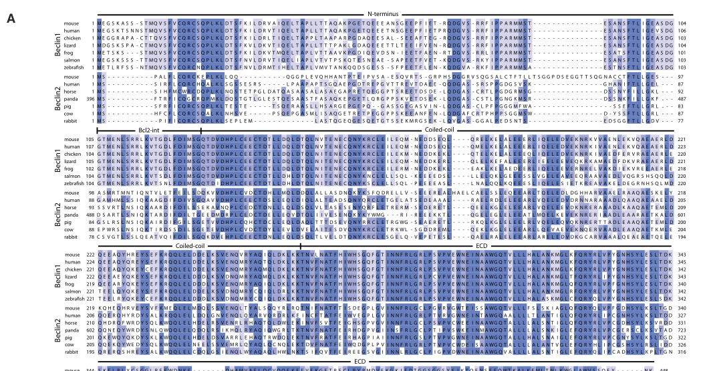

## Question

# Gene Research for Functional Annotation

## ⚠️ CRITICAL: Gene/Protein Identification Context

**BEFORE YOU BEGIN RESEARCH:** You MUST verify you are researching the CORRECT gene/protein. Gene symbols can be ambiguous, especially for less well-characterized genes from non-model organisms.

### Target Gene/Protein Identity (from UniProt):
- **UniProt Accession:** A8MW95
- **Protein Description:** RecName: Full=Beclin-2 {ECO:0000303|PubMed:23954414}; AltName: Full=Beclin-1 autophagy-related pseudogene 1 {ECO:0000312|HGNC:HGNC:38606}; AltName: Full=Beclin-1-like protein 1 {ECO:0000312|MIM:615687};
- **Gene Information:** Name=BECN2 {ECO:0000303|PubMed:23954414, ECO:0000312|HGNC:HGNC:38606}; Synonyms=BECN1L1 {ECO:0000312|MIM:615687}, BECN1P1;
- **Organism (full):** Homo sapiens (Human).
- **Protein Family:** Belongs to the beclin family. .
- **Key Domains:** Atg6/Beclin. (IPR007243); Atg6/Beclin_C_sf. (IPR038274); Atg6/beclin_CC. (IPR041691); Atg6_BARA. (IPR040455); APG6 (PF04111)

### MANDATORY VERIFICATION STEPS:

1. **Check if the gene symbol "BECN2" matches the protein description above**
2. **Verify the organism is correct:** Homo sapiens (Human).
3. **Check if protein family/domains align with what you find in literature**
4. **If you find literature for a DIFFERENT gene with the same or similar symbol, STOP**

### If Gene Symbol is Ambiguous or You Cannot Find Relevant Literature:

**DO NOT PROCEED WITH RESEARCH ON A DIFFERENT GENE.** Instead:
- State clearly: "The gene symbol 'BECN2' is ambiguous or literature is limited for this specific protein"
- Explain what you found (e.g., "Found extensive literature on a different gene with the same symbol in a different organism")
- Describe the protein based ONLY on the UniProt information provided above
- Suggest that the protein function can be inferred from domain/family information

### Research Target:

Please provide a comprehensive research report on the gene **BECN2** (gene ID: BECN2, UniProt: A8MW95) in human.

The research report should be a detailed narrative explaining the function, biological processes, and localization of the gene product. Citations should be given for all claims.

You should prioritize authoritative reviews and primary scientific literature when conducting research. You can supplement
this with annotations you find in gene/protein databases, but these can be outdated or inaccurate.

We are specifically interested in the primary function of the gene - for enzymes, what reaction is catalyzed, and what is the substrate specificity? For transporters, what is the substrate? For structural proteins or adapters, what is the broader structural role? For signaling molecules, what is the role in the pathway.

We are interested in where in or outside the cell the gene product carries out its function.

We are also interested in the signaling or biochemical pathways in which the gene functions. We are less interested in broad pleiotropic effects, except where these elucidate the precise role.

Include evidence where possible. We are interested in both experimental evidence as well as inference from structure, evolution, or bioinformatic analysis. Precise studies should be prioritized over high-throughput, where available.

## Output

Question: You are an expert researcher providing comprehensive, well-cited information.

Provide detailed information focusing on:
1. Key concepts and definitions with current understanding
2. Recent developments and latest research (prioritize 2023-2024 sources)
3. Current applications and real-world implementations
4. Expert opinions and analysis from authoritative sources
5. Relevant statistics and data from recent studies

Format as a comprehensive research report with proper citations. Include URLs and publication dates where available.
Always prioritize recent, authoritative sources and provide specific citations for all major claims.

# Gene Research for Functional Annotation

## ⚠️ CRITICAL: Gene/Protein Identification Context

**BEFORE YOU BEGIN RESEARCH:** You MUST verify you are researching the CORRECT gene/protein. Gene symbols can be ambiguous, especially for less well-characterized genes from non-model organisms.

### Target Gene/Protein Identity (from UniProt):
- **UniProt Accession:** A8MW95
- **Protein Description:** RecName: Full=Beclin-2 {ECO:0000303|PubMed:23954414}; AltName: Full=Beclin-1 autophagy-related pseudogene 1 {ECO:0000312|HGNC:HGNC:38606}; AltName: Full=Beclin-1-like protein 1 {ECO:0000312|MIM:615687};
- **Gene Information:** Name=BECN2 {ECO:0000303|PubMed:23954414, ECO:0000312|HGNC:HGNC:38606}; Synonyms=BECN1L1 {ECO:0000312|MIM:615687}, BECN1P1;
- **Organism (full):** Homo sapiens (Human).
- **Protein Family:** Belongs to the beclin family. .
- **Key Domains:** Atg6/Beclin. (IPR007243); Atg6/Beclin_C_sf. (IPR038274); Atg6/beclin_CC. (IPR041691); Atg6_BARA. (IPR040455); APG6 (PF04111)

### MANDATORY VERIFICATION STEPS:

1. **Check if the gene symbol "BECN2" matches the protein description above**
2. **Verify the organism is correct:** Homo sapiens (Human).
3. **Check if protein family/domains align with what you find in literature**
4. **If you find literature for a DIFFERENT gene with the same or similar symbol, STOP**

### If Gene Symbol is Ambiguous or You Cannot Find Relevant Literature:

**DO NOT PROCEED WITH RESEARCH ON A DIFFERENT GENE.** Instead:
- State clearly: "The gene symbol 'BECN2' is ambiguous or literature is limited for this specific protein"
- Explain what you found (e.g., "Found extensive literature on a different gene with the same symbol in a different organism")
- Describe the protein based ONLY on the UniProt information provided above
- Suggest that the protein function can be inferred from domain/family information

### Research Target:

Please provide a comprehensive research report on the gene **BECN2** (gene ID: BECN2, UniProt: A8MW95) in human.

The research report should be a detailed narrative explaining the function, biological processes, and localization of the gene product. Citations should be given for all claims.

You should prioritize authoritative reviews and primary scientific literature when conducting research. You can supplement
this with annotations you find in gene/protein databases, but these can be outdated or inaccurate.

We are specifically interested in the primary function of the gene - for enzymes, what reaction is catalyzed, and what is the substrate specificity? For transporters, what is the substrate? For structural proteins or adapters, what is the broader structural role? For signaling molecules, what is the role in the pathway.

We are interested in where in or outside the cell the gene product carries out its function.

We are also interested in the signaling or biochemical pathways in which the gene functions. We are less interested in broad pleiotropic effects, except where these elucidate the precise role.

Include evidence where possible. We are interested in both experimental evidence as well as inference from structure, evolution, or bioinformatic analysis. Precise studies should be prioritized over high-throughput, where available.

## Research Report: Human **BECN2 (Beclin-2)** functional annotation (UniProt **A8MW95**)

### Executive summary
**BECN2 (Beclin-2)** is a mammal-specific paralog of **BECN1 (Beclin-1)** that functions as (i) a **scaffolding subunit of class III PI3K (PI3KC3/VPS34) complexes** that support autophagy and membrane trafficking, and (ii) a **specialized endolysosomal sorting factor** required for lysosomal turnover of a subset of **GPRASP1/GASP1-associated GPCRs** through a direct N-terminal interaction with **GASP1**. In addition, BECN2 executes **ATG9A/ULK1-dependent, LC3- and ATG16L1-independent “noncanonical autophagy”** that targets innate immune signaling proteins (inflammasome sensors, TAK1, MEKK3) for lysosomal degradation, thereby restraining inflammatory signaling and lymphoma development in mouse models. (he2013beclin2functions pages 6-7, qiu2023thepotentbecn2atg14 pages 1-2, zhu2020beclin2negatively pages 1-2, deng2022becn2(beclin2) pages 1-3)

### 1) Key concepts and definitions (current understanding)

#### 1.1 Beclin-family proteins and PI3KC3 complexes
Beclin proteins (Atg6 orthologs) are best understood as **multi-domain scaffolds** that assemble PI3KC3 lipid kinase complexes, coordinating membrane trafficking steps relevant to autophagy and endolysosomal pathways. Beclin-2 shares canonical Beclin-family architecture (BH3-like region, central coiled-coil, C-terminal conserved/BARA-like region), consistent with a scaffolding role. (he2013beclin2functions pages 1-2, levine2015beclinorthologsintegrative pages 7-9)

#### 1.2 “Canonical” autophagy vs BECN2-linked noncanonical degradative routes
“Canonical” macroautophagy uses an LC3/ATG16L1-dependent conjugation system to form double-membrane autophagosomes. By contrast, multiple studies now support BECN2-driven **ATG9A- and ULK1-dependent but LC3/ATG16L1-independent** trafficking/degradation routes that still culminate in **lysosomal degradation** of specific signaling proteins, aligning with an “alternative/noncanonical autophagy” concept rather than classical LC3 lipidation-dependent autophagy. (deng2022becn2(beclin2) pages 12-13, deng2022becn2(beclin2) pages 1-3, zhu2020beclin2negatively pages 14-15)

#### 1.3 Specialized GPCR downregulation via GASP1/GPRASP1
A key definitional feature of Beclin-2 is its **direct binding to GPRASP1/GASP1** through the Beclin-2 N-terminus, which is required for **post-endosomal sorting** of select GPCRs for **lysosomal degradation** (rather than recycling). This distinguishes BECN2 from BECN1-centered autophagy initiation pathways. (he2013beclin2functions pages 6-7, levine2015beclinorthologsintegrative pages 7-9)

### 2) Gene/protein identity verification (critical disambiguation)
The literature retrieved and synthesized here is consistent with the UniProt-provided identity of **human BECN2 / Beclin-2** as a **Beclin-family** protein with an Atg6/Beclin-related domain architecture and mammal-specific paralogy to BECN1. Primary studies describe Beclin-2 as an intronless gene mapping to **chromosome 1q43** and as a protein of ~49 kDa predicted mass with an apparent ~53 kDa band on immunoblot; reported sequence lengths vary by annotation/construct (~431–447 aa), consistent with a single Beclin-family protein rather than a different gene/protein. (he2013beclin2functions pages 1-2, he2013beclin2functions pages 2-3, su2017becn2interactswith pages 1-5)

### 3) Molecular functions and pathways

#### 3.1 Autophagy-supporting scaffold function through PI3KC3 assemblies
Beclin-2 co-immunoprecipitates with core PI3KC3 complex components (including **VPS34/PI3KC3, p150/VPS15, ATG14, and UVRAG**), supporting a model in which it scaffolds PI3KC3 complexes analogous to Beclin-1 complexes, thereby contributing to autophagic flux and autophagosome biogenesis in cells and in vivo. (su2017becn2interactswith pages 1-5, qiu2023thepotentbecn2atg14 pages 1-2)

Mechanistically, the **BECN2 coiled-coil domain (CCD)** forms metastable homodimers and stable heterodimers with ATG14; structure-guided mutations that stabilize homodimerization reduce ATG14 binding, supporting a **structural basis for dynamic complex assembly**. (su2017becn2interactswith pages 1-5)

#### 3.2 Endolysosomal trafficking: GASP1-dependent GPCR degradation (BECN2 hallmark function)
The strongest, most distinctive functional evidence for BECN2 is its requirement for **agonist-induced endolysosomal degradation** of several GPCRs by binding **GASP1**.

* **Direct interaction:** Beclin-2 binds GASP1; a Beclin-2 N-terminal segment encompassing **aa 69–88** is required. GASP1-binding–defective Beclin-2 mutants (e.g., Δ69–88, I80S) fail to restore GPCR degradation in Beclin-2-depleted cells. (he2013beclin2functions pages 6-7)
* **Trafficking compartment logic:** When Beclin-2 is depleted, internalized δ-opioid receptor (DOR) accumulates in **EEA1+ early endosomes** and fails to reach **LAMP1+ lysosomes**, consistent with a post-endosomal sorting defect. (he2013beclin2functions pages 6-7)
* **Functional separability from canonical autophagy initiation:** In the same work, knockdown of **BECN1, VPS34, or ATG14** did not reproduce the GPCR degradation defect, and Beclin-2 mutants that cannot bind GASP1 still rescued starvation-induced autophagy, indicating separable molecular functions. (he2013beclin2functions pages 6-7)

Collectively, these results justify annotating BECN2 as a **GPCR post-endosomal sorting/lysosomal downregulation factor** in addition to an autophagy scaffold. (he2013beclin2functions pages 6-7, levine2015beclinorthologsintegrative pages 7-9)

#### 3.3 Innate immunity: BECN2-driven degradation of inflammasome sensors
BECN2 restrains inflammasome activity by targeting sensors for lysosomal degradation via a pathway that requires **ULK1 and ATG9A**, but is independent of the canonical Beclin-1/WIPI2/ATG16L1/LC3 axis.

Key findings include:
* **Loss-of-function increases inflammasome activity:** BECN2 deficiency enhances activity of **NLRP3, AIM2, NLRP1, NLRC4** inflammasomes after ligand stimulation; overexpression decreases IL1B production and CASP1 cleavage. (deng2022becn2(beclin2) pages 1-3)
* **Mechanism:** BECN2 interacts with inflammasome sensors and promotes their **lysosomal degradation**; degradation is blocked by lysosome inhibitors and does not require ATG16L1 or LC3. (deng2022becn2(beclin2) pages 4-7, deng2022becn2(beclin2) pages 7-10)
* **Compartment model:** BECN2 recruits sensors to **ATG9A+ vesicles** upon ULK1 activation; SNARE proteins **SEC22A, STX5, STX6** contribute to the membrane trafficking/fusion steps needed for sensor degradation. (deng2022becn2(beclin2) pages 10-11)

These data support a specific annotation: **BECN2 is a negative regulator of inflammasome signaling by targeting sensors for ATG9A-dependent lysosomal degradation.** (deng2022becn2(beclin2) pages 12-13, deng2022becn2(beclin2) pages 1-3)

#### 3.4 Innate immune signaling and cancer phenotypes: TAK1/MEKK3 turnover
A related BECN2-dependent noncanonical degradative mechanism targets the MAPK/NF-κB upstream kinases **TAK1 (MAP3K7)** and **MEKK3 (MAP3K3)**.

* **Post-transcriptional control:** BECN2 deficiency increases TAK1/MEKK3 protein without corresponding mRNA changes, while increased BECN2 expression reduces endogenous kinase protein levels. (zhu2020beclin2negatively pages 5-7)
* **Pathway dependencies:** MEKK3 degradation is blocked by ULK1 or ATG9A ablation and is described as independent of Beclin-1 and LC3/ATG16L-type conjugation. (zhu2020beclin2negatively pages 14-15)
* **In vivo outcomes:** Becn2-null mice show increased ERK/NF-κB signaling, elevated pro-inflammatory cytokines, splenomegaly/lymphadenopathy, and increased lymphoma incidence; myeloid-specific **MEKK3 ablation** rescues these phenotypes, tying BECN2’s tumor-suppressive effects to kinase degradation. (zhu2020beclin2negatively pages 1-2)

### 4) Subcellular localization and compartment context
BECN2’s experimentally supported compartment context tracks its distinct functions:

* **GPCR degradation route:** Early endosome (EEA1+) to lysosome (LAMP1+) trafficking is disrupted upon BECN2 depletion, indicating BECN2 acts in **post-endosomal sorting steps** for GPCR cargo. (he2013beclin2functions pages 6-7)
* **Noncanonical innate immune degradation:** BECN2 promotes loading of inflammasome sensors onto **ATG9A+ single-membrane vesicles** and their subsequent appearance in autophagosomes/amphisomes/lysosomal compartments, supported by confocal quantification and EM/APEX2 labeling. (deng2022becn2(beclin2) pages 10-11)
* **Mitophagy localization divergence:** In mitophagy, Beclin-1 (not Beclin-2) localizes to mitochondria–ER-associated membranes (MAMs), supporting functional specialization and arguing against a generic “Beclin redundancy” model. (quiles2023decipheringfunctionalroles pages 1-3)

### 5) Recent developments (prioritizing 2023–2024)

#### 5.1 2023: Structural and selective interaction insight + a selective modulation strategy
A 2023 Autophagy study solved crystal structures of the **BECN2 coiled-coil domain** and the **BECN2–ATG14 coiled-coil complex**, highlighting imperfect residues that reduce BECN2 homodimer stability and may facilitate heteromerization. This study provided functional evidence that the **BECN2–ATG14 interaction is selectively critical** for endolysosomal degradation of **GPRASP1-associated GPCRs** (notably DRD2/D2R), whereas EGFR degradation depends more on BECN1–UVRAG interactions. The authors also developed **stapled peptides** that selectively enhance BECN2–ATG14 interaction and boost BECN2-dependent autophagy and DRD2 degradation without affecting BECN1-dependent EGFR turnover—an important proof-of-concept for selective Beclin-paralog modulation. (qiu2023thepotentbecn2atg14 pages 1-2)

Publication: **Qiu et al.**, *Autophagy*, July 2023. DOI: **10.1080/15548627.2023.2233872**. URL: https://doi.org/10.1080/15548627.2023.2233872 (qiu2023thepotentbecn2atg14 pages 1-2)

#### 5.2 2023: Functional dissection of Beclin-1 vs Beclin-2 in mitophagy
A 2023 Science Signaling study found that although both homologs can contribute to autophagosome formation under some conditions, **mitophagy defects occurred only with BECN1 loss**, associated with Beclin-1 localization to MAMs and ULK1 phosphorylation of Beclin-1 Ser15. Beclin-2 did not localize to MAMs and was not required for mitophagy in those assays, clarifying division of labor between paralogs. (quiles2023decipheringfunctionalroles pages 1-3)

Publication: **Quiles et al.**, *Science Signaling*, Jan 2023. DOI: **10.1126/scisignal.abo4457**. URL: https://doi.org/10.1126/scisignal.abo4457 (quiles2023decipheringfunctionalroles pages 1-3)

#### 5.3 2024: Authoritative synthesis on nonautophagic roles of ATG proteins
A 2024 Autophagy review emphasizes that autophagy-related proteins can have **nonautophagic functions** in signaling and trafficking, and explicitly cites BECN2 among ATG factors with roles beyond canonical autophagy (including its N-terminal interaction with GPRASP1 and its involvement in signaling/immune regulation). This is useful expert framing for functional annotation and for interpreting BECN2 phenotypes that are not explained solely by LC3 lipidation–dependent autophagy. (maheshwari2025thebiologicalrole pages 39-39)

Publication: **Shang et al.**, *Autophagy*, online Sep 2024 (per citation metadata). DOI: **10.1080/15548627.2023.2254664**. URL: https://doi.org/10.1080/15548627.2023.2254664 (maheshwari2025thebiologicalrole pages 39-39)

#### 5.4 2024: Disease-model report proposing sesamin→BECN2 modulation in lumbar disc degeneration
A 2024 study in *Aging (Albany NY)* reported that **sesamin** increases BECN2 expression in an LPS-induced chondrocyte degeneration model (ATDC5) and associated in vivo lumbar disc degeneration phenotypes. The authors report that BECN2 overexpression improved viability and reduced apoptosis while decreasing markers they interpret as autophagy and inflammasome activation (including ATG14/VPS34/GASP1 and NLRP3/AIM2-related proteins). These results represent a recent disease-model “application” of BECN2 modulation, though directionality (increased BECN2 with decreased autophagy markers) should be interpreted cautiously alongside the foundational mechanistic literature that links BECN2 to autophagy support and lysosomal trafficking. (zhang2024sesaminmediatedhighexpression pages 1-2, he2013beclin2functions pages 6-7)

Publication: **Zhang et al.**, *Aging (Albany NY)*, Jan 2024. DOI: **10.18632/aging.205386**. URL: https://doi.org/10.18632/aging.205386 (zhang2024sesaminmediatedhighexpression pages 1-2)

### 6) Current applications and real-world implementations

1. **Selective pharmacologic modulation concepts (preclinical):** The 2023 stapled peptides that selectively enhance BECN2–ATG14 interactions represent a concrete strategy to modulate **BECN2-dependent GPCR downregulation** (e.g., DRD2/D2R) without broadly perturbing BECN1-dependent EGFR trafficking, suggesting a route toward more targeted autophagy/trafficking interventions. (qiu2023thepotentbecn2atg14 pages 1-2)

2. **Disease model targeting (preclinical):** Sesamin-mediated BECN2 upregulation has been proposed as a therapeutic mechanism in lumbar disc degeneration models, linking nutraceutical-like compounds to BECN2-regulated autophagy/inflammation pathways. (zhang2024sesaminmediatedhighexpression pages 1-2)

3. **Inflammation/cancer axis (mechanism-driven targets):** Genetic data in mice suggest that increasing BECN2 activity (or mimicking its ATG9A-dependent degradation of TAK1/MEKK3 and inflammasome sensors) could be a therapeutic concept for **inflammatory disease** or **inflammation-driven tumorigenesis**, though no BECN2-specific clinical interventions were identified in the retrieved evidence. (zhu2020beclin2negatively pages 1-2, deng2022becn2(beclin2) pages 1-3)

### 7) Expert opinions and authoritative synthesis
A highly cited Trends in Cell Biology review positions Beclin proteins as **integrative hubs** for membrane trafficking and signaling, and highlights Beclin-2’s unique role in lysosomal degradation of certain GPCRs via GASP1 that is not shared by other PI3KC3 complex members. (levine2015beclinorthologsintegrative pages 7-9)

Publication: **Levine et al.**, *Trends in Cell Biology*, Sep 2015. DOI: **10.1016/j.tcb.2015.05.004**. URL: https://doi.org/10.1016/j.tcb.2015.05.004 (levine2015beclinorthologsintegrative pages 7-9)

### 8) Statistics and data points from recent and foundational studies
* **Protein size/biochemistry:** Beclin-2 reported as a predicted ~49 kDa protein detected at ~53 kDa by immunoblot in the discovery study; sequence length annotations include ~447 aa (discovery context) and ~431 aa (structural work). (he2013beclin2functions pages 2-3, he2013beclin2functions pages 1-2, su2017becn2interactswith pages 1-5)
* **Defined functional motif interval:** GASP1 binding requires an N-terminal region including **aa 69–88**; mutants disrupting this region abolish GPCR degradation rescue. (he2013beclin2functions pages 6-7)
* **Defined compartment markers:** GPCR trafficking defect visualized as retention in **EEA1+** structures and failure to reach **LAMP1+** lysosomes. (he2013beclin2functions pages 6-7)
* **Defined pathway dependencies (innate immunity):** Inflammasome sensor degradation is **ULK1- and ATG9A-dependent**, but independent of **ATG16L1 and LC3** (and other canonical factors in the cited experiments). (deng2022becn2(beclin2) pages 1-3, deng2022becn2(beclin2) pages 7-10)

### 9) Figures (visual evidence)
The discovery paper includes schematics and microscopy images supporting domain architecture and trafficking models for Beclin-2:
* Domain architecture and alignment with Beclin-1; interaction schematics with GASP1; and microscopy showing EEA1-to-LAMP1 trafficking defects for GPCR cargo upon BECN2 loss. (he2013beclin2functions media 9cc1242f, he2013beclin2functions media 3a815a64, he2013beclin2functions media 17df886f, he2013beclin2functions media 4084183b)

### 10) Practical functional annotation (recommended text)
**Recommended primary-function annotation:**
BECN2 encodes Beclin-2, a Beclin-family scaffold that participates in PI3KC3 complexes supporting autophagy and endolysosomal trafficking and has a specialized role in post-endosomal sorting/lysosomal degradation of GPRASP1-associated GPCRs via direct GASP1 binding; additionally, BECN2 mediates ATG9A/ULK1-dependent noncanonical lysosomal degradation of specific innate immune signaling proteins (inflammasome sensors and MAP3K kinases), thereby restraining inflammatory signaling. (he2013beclin2functions pages 6-7, su2017becn2interactswith pages 1-5, zhu2020beclin2negatively pages 1-2, deng2022becn2(beclin2) pages 1-3)

---

### Embedded evidence map
| Function/process | Mechanism/complexes and key partners | Key experimental evidence (assay/model) | Notes on selectivity vs BECN1 | Primary citation with year, DOI, URL |
|---|---|---|---|---|
| Identity / core annotation | Human **BECN2 / Beclin-2** is a mammal-specific Beclin-family paralog of BECN1; reported as ~431 aa in structural work and ~447 aa/predicted ~49 kDa in the discovery paper; contains Beclin-family **BH3-like region, coiled-coil domain (CCD), and C-terminal evolutionarily conserved/BARA-like domain**; acts as a scaffold in membrane-trafficking/autophagy pathways (he2013beclin2functions pages 2-3, he2013beclin2functions pages 1-2, su2017becn2interactswith pages 1-5, levine2015beclinorthologsintegrative pages 7-9) | Sequence/domain comparison, immunoblot detection, phylogenetic/genomic analysis in human and mouse; co-IP with Beclin-network factors (he2013beclin2functions pages 2-3, su2017becn2interactswith pages 1-5) | Distinct from BECN1 by mammal-specific origin, divergent N-terminus, stronger AMBRA1 binding, lack of Rubicon binding, and constitutive BCL2 association under starvation conditions (zhang2014regulationofplasma pages 1-2, su2017becn2interactswith pages 1-5, levine2015beclinorthologsintegrative pages 7-9) | **He et al., 2013**. DOI: 10.1016/j.cell.2013.07.035. URL: https://doi.org/10.1016/j.cell.2013.07.035 (he2013beclin2functions pages 2-3, he2013beclin2functions pages 1-2) |
| Canonical/autophagy-supporting scaffold role | BECN2 associates with **class III PI3K/PtdIns3K complex** components including **PIK3C3/VPS34, PIK3R4/VPS15 (p150), ATG14, UVRAG, AMBRA1**, supporting autophagosome biogenesis and autophagic flux (qiu2023thepotentbecn2atg14 pages 1-2, su2017becn2interactswith pages 1-5) | Co-immunoprecipitation, structural CCD studies, Becn2 knockdown/knockout cells and mice showing reduced autophagy markers, reduced long-lived protein degradation, fewer autophagic structures, altered LC3/p62 readouts (he2013beclin2functions pages 6-7, su2017becn2interactswith pages 1-5) | BECN2 overlaps with BECN1 in autophagy initiation but is biochemically distinct: stronger AMBRA1 interaction, no Rubicon co-IP, and starvation does not disrupt BECN2-BCL2 interaction as reported for BECN1-regulated complexes (he2013beclin2functions pages 12-13, su2017becn2interactswith pages 1-5) | **Su et al., 2017**. DOI: 10.1002/pro.3140. URL: https://doi.org/10.1002/pro.3140 (su2017becn2interactswith pages 1-5) |
| Ligand-induced lysosomal degradation of select GPCRs | BECN2 binds **GPRASP1/GASP1** via an N-terminal region including aa 69-88 and promotes post-endosomal sorting of GASP1-associated GPCRs to **LAMP1+ lysosomes**; cargos include **OPRD1/DOR, CNR1/CB1R, DRD2/D2R** and other GASP1-regulated receptors (he2013beclin2functions pages 6-7, qiu2023thepotentbecn2atg14 pages 1-2, he2013beclin2functions media 9cc1242f) | Yeast two-hybrid and co-IP for BECN2-GASP1 binding; receptor internalization/degradation assays; microscopy showing receptor retention in **EEA1+ early endosomes** and failure to reach lysosomes after BECN2 loss; rescue by WT but not GASP1-binding-defective BECN2 mutants (he2013beclin2functions pages 6-7, he2013beclin2functions media 9cc1242f) | This GPCR-trafficking role is a major BECN2-specific distinction: **BECN1, VPS34, and ATG14 knockdown did not phenocopy BECN2 loss** in the original GPCR degradation assays, supporting a separable trafficking function beyond shared autophagy roles (he2013beclin2functions pages 6-7, levine2015beclinorthologsintegrative pages 7-9) | **He et al., 2013**. DOI: 10.1016/j.cell.2013.07.035. URL: https://doi.org/10.1016/j.cell.2013.07.035 (he2013beclin2functions pages 6-7, he2013beclin2functions media 9cc1242f) |
| Structural basis of autophagy/trafficking selectivity | BECN2 CCD forms a **metastable antiparallel homodimer** with imperfect interface residues and also a **BECN2-ATG14 heterodimer**; this structural plasticity supports selective assembly of BECN2-containing complexes for autophagy and endolysosomal trafficking (qiu2023thepotentbecn2atg14 pages 1-2) | Crystal structures of BECN2 CCD and BECN2-ATG14 CCD complex; mutational/biophysical analyses showing weaker homodimer but tighter ATG14 binding; function tested in receptor degradation assays (qiu2023thepotentbecn2atg14 pages 1-2, su2017becn2interactswith pages 1-5) | 2023 work argues **BECN2-ATG14** is especially important for BECN2-specific cargo handling, whereas **BECN1-UVRAG** is more important for EGFR trafficking; thus similar Beclin architectures support non-identical cargo selectivity (qiu2023thepotentbecn2atg14 pages 1-2) | **Qiu et al., 2023**. DOI: 10.1080/15548627.2023.2233872. URL: https://doi.org/10.1080/15548627.2023.2233872 (qiu2023thepotentbecn2atg14 pages 1-2) |
| Selective endolysosomal degradation of DRD2 and other GPRASP1-associated GPCRs | Potent **BECN2-ATG14** interaction is selectively required for degradation of **GPRASP1-associated GPCRs**, especially **DRD2/D2R**; BECN2 N-terminus binds GPRASP1 while the CCD engages ATG14 to support trafficking/degradation (qiu2023thepotentbecn2atg14 pages 1-2) | Functional mutagenesis plus receptor degradation assays in cells; comparison with EGFR cargo; stapled peptide enhancers of BECN2-ATG14 interaction tested for effects on autophagy and DRD2 turnover (qiu2023thepotentbecn2atg14 pages 1-2) | Clear cargo selectivity versus BECN1: **EGFR** depends more on **BECN1-UVRAG**, whereas **DRD2** depends more on **BECN2-ATG14** (qiu2023thepotentbecn2atg14 pages 1-2) | **Qiu et al., 2023**. DOI: 10.1080/15548627.2023.2233872. URL: https://doi.org/10.1080/15548627.2023.2233872 (qiu2023thepotentbecn2atg14 pages 1-2) |
| Chemical/biophysical modulation of BECN2 function | 2023 study designed **stapled peptides** that selectively bind the BECN2 CCD and enhance **BECN2-ATG14** interaction, increasing **BECN2-dependent autophagy** and **DRD2 degradation** without altering BECN1-dependent EGFR turnover (qiu2023thepotentbecn2atg14 pages 1-2) | Structural design, peptide binding, cellular autophagy assays, and cargo degradation assays for DRD2 versus EGFR (qiu2023thepotentbecn2atg14 pages 1-2) | Provides one of the first selective BECN2-directed modulatory strategies rather than pan-autophagy manipulation; experimental support is preclinical/cell-based (qiu2023thepotentbecn2atg14 pages 1-2) | **Qiu et al., 2023**. DOI: 10.1080/15548627.2023.2233872. URL: https://doi.org/10.1080/15548627.2023.2233872 (qiu2023thepotentbecn2atg14 pages 1-2) |
| Mitophagy and autophagosome formation: divergence from BECN1 | BECN2 contributes to basal/stress autophagosome formation in some settings, but **selective mitophagy** is chiefly a **BECN1** function linked to **ULK1-phosphorylated Ser15** and localization to **mitochondria-associated membranes (MAMs)**; BECN2 does not substitute for this mitophagy-specific role (quiles2023decipheringfunctionalroles pages 1-3) | BECN1/BECN2 knockout HeLa cells and MEFs; mitophagy assays after mitochondrial damage; localization analyses at MAMs; rescue experiments with BECN1 variants (quiles2023decipheringfunctionalroles pages 1-3) | Major 2023 clarification: BECN2 is not simply redundant with BECN1; **BECN1 loss impairs mitophagy**, whereas **BECN2 loss does not** in the same assays (quiles2023decipheringfunctionalroles pages 1-3) | **Quiles et al., 2023**. DOI: 10.1126/scisignal.abo4457. URL: https://doi.org/10.1126/scisignal.abo4457 (quiles2023decipheringfunctionalroles pages 1-3) |
| Noncanonical degradation of inflammasome sensors | BECN2 negatively regulates **NLRP3, AIM2, NLRP1, NLRC4** by promoting their lysosomal degradation through a **ULK1- and ATG9A-dependent, but BECN1/ATG16L1/LC3-independent** pathway; BECN2 recruits sensors to **ATG9A+ vesicles** and cooperates with **SEC22A, STX5, STX6** (deng2022becn2(beclin2) pages 12-13, deng2022becn2(beclin2) pages 1-3, deng2022becn2(beclin2) pages 10-11, deng2022becn2(beclin2) pages 7-10) | CRISPR/KO macrophages and THP-1 cells; co-IP and colocalization; half-life and inhibitor studies showing lysosome dependence; inflammasome activation readouts (IL1B, CASP1 cleavage); alum-induced peritonitis in mice (deng2022becn2(beclin2) pages 12-13, deng2022becn2(beclin2) pages 1-3, deng2022becn2(beclin2) pages 7-10) | This pathway is explicitly **noncanonical** and largely independent of canonical BECN1-LC3 autophagy machinery, underscoring a unique BECN2 degradative route in innate immunity (deng2022becn2(beclin2) pages 1-3, deng2022becn2(beclin2) pages 4-7, deng2022becn2(beclin2) pages 7-10) | **Deng et al., 2022**. DOI: 10.1080/15548627.2021.1934270. URL: https://doi.org/10.1080/15548627.2021.1934270 (deng2022becn2(beclin2) pages 12-13, deng2022becn2(beclin2) pages 1-3) |
| Negative regulation of MAPK/NF-kB inflammatory signaling | BECN2 targets **MEKK3/MAP3K3** and **TAK1/MAP3K7** for degradation via **ULK1-ATG9A**-dependent noncanonical autophagy; this suppresses **ERK1/2, NF-kB, and STAT3-linked inflammatory outputs** (zhu2020beclin2negatively pages 1-2, zhu2020beclin2negatively pages 14-15, zhu2020beclin2negatively pages 5-7) | Endogenous interaction assays; gain/loss of BECN2 in innate immune cells; protein-versus-mRNA comparisons showing post-translational control; lysosome/autophagy inhibitor studies; genetic rescue by myeloid **Map3k3** ablation (zhu2020beclin2negatively pages 1-2, zhu2020beclin2negatively pages 14-15, zhu2020beclin2negatively pages 5-7) | Again distinct from canonical BECN1 autophagy: degradation reported as **ATG9A-dependent but BECN1-, ATG16L-, and LC3-independent** (zhu2020beclin2negatively pages 1-2, zhu2020beclin2negatively pages 14-15) | **Zhu et al., 2020**. DOI: 10.1172/JCI133283. URL: https://doi.org/10.1172/jci133283 (zhu2020beclin2negatively pages 1-2, zhu2020beclin2negatively pages 14-15) |
| In vivo immune/tumor phenotypes | Loss of Becn2 in mice causes **splenomegaly, lymphadenopathy, increased inflammatory cytokines, persistent STAT3 activation, and higher lymphoma incidence**; BECN2 thus behaves as a suppressor of inflammation-driven tumorigenesis in these models (zhu2020beclin2negatively pages 1-2, zhu2020beclin2negatively pages 14-15) | Whole-animal knockout phenotyping, cytokine measurements, histology, and genetic rescue through **Map3k3** deletion in myeloid cells (zhu2020beclin2negatively pages 1-2) | These phenotypes have not been attributed equivalently to BECN1 in the cited work and are mechanistically tied to the BECN2-specific ATG9A route (zhu2020beclin2negatively pages 1-2) | **Zhu et al., 2020**. DOI: 10.1172/JCI133283. URL: https://doi.org/10.1172/jci133283 (zhu2020beclin2negatively pages 1-2) |
| Metabolic physiology / receptor homeostasis | Becn2 insufficiency impairs autophagy in vivo and increases brain **CB1R/CNR1** abundance with **hyperphagia, obesity, and insulin resistance**; metabolic effects are thought to relate in part to receptor turnover and autophagic regulation (su2017becn2interactswith pages 1-5, qiu2023thepotentbecn2atg14 pages 1-2) | Heterozygous and knockout mouse phenotyping; receptor abundance measurements and metabolic characterization (su2017becn2interactswith pages 1-5, qiu2023thepotentbecn2atg14 pages 1-2) | Phenotype highlights that BECN2 has physiologic roles not fully captured by BECN1-centric autophagy models, especially via selective GPCR regulation (levine2015beclinorthologsintegrative pages 7-9, qiu2023thepotentbecn2atg14 pages 1-2) | **He et al., 2013**. DOI: 10.1016/j.cell.2013.07.035. URL: https://doi.org/10.1016/j.cell.2013.07.035 (he2013beclin2functions pages 6-7) |
| 2024 disease-model application: cartilage endplate degeneration | In LPS-treated chondrocyte/ATDC5 and lumbar disc degeneration models, **sesamin** upregulated **BECN2**, improving viability and reducing apoptosis; reported downstream effects included lower **ATG14, VPS34, GASP1**, reduced autophagy markers, and lower inflammasome proteins (**NLRP3, NLRC4, NLRP1, AIM2**) (zhang2024sesaminmediatedhighexpression pages 1-2) | Transcriptomics, adenoviral BECN2 overexpression/knockdown, viability/apoptosis assays, autophagy readouts, and in vivo LDD model (zhang2024sesaminmediatedhighexpression pages 1-2) | Useful as a recent disease-model application, but interpretation should be cautious because some reported directionality (higher BECN2 with lower autophagy) differs from foundational BECN2 autophagy literature (zhang2024sesaminmediatedhighexpression pages 1-2, he2013beclin2functions pages 6-7) | **Zhang et al., 2024**. DOI: 10.18632/aging.205386. URL: https://doi.org/10.18632/aging.205386 (zhang2024sesaminmediatedhighexpression pages 1-2) |
| 2024 expert synthesis on nonautophagic ATG functions | Review literature positions BECN2 as an example of an autophagy-related protein with important **noncanonical/nonautophagic trafficking and immune functions**, especially GPCR sorting through GPRASP1 and inflammatory control beyond canonical LC3 pathways (maheshwari2025thebiologicalrole pages 39-39) | Narrative expert review integrating primary studies on GPCR trafficking, immune regulation, and signaling functions of ATG proteins (maheshwari2025thebiologicalrole pages 39-39) | Reinforces that BECN2 should not be annotated only as a generic autophagy factor; it has distinct cargo-sorting and signaling roles relative to BECN1 (maheshwari2025thebiologicalrole pages 39-39) | **Shang et al., 2024**. DOI: 10.1080/15548627.2023.2254664. URL: https://doi.org/10.1080/15548627.2023.2254664 (maheshwari2025thebiologicalrole pages 39-39) |

*Table: This table summarizes experimentally supported functions, mechanisms, selectivity, and recent updates for human BECN2/Beclin-2. It is useful as a compact evidence map linking core biology to specific assays, pathways, and citations.*

References

1. (he2013beclin2functions pages 6-7): Congcong He, Yongjie Wei, Kai Sun, Binghua Li, Xiaonan Dong, Zhongju Zou, Yang Liu, Lisa N. Kinch, Shaheen Khan, Sangita Sinha, Ramnik J. Xavier, Nick V. Grishin, Guanghua Xiao, Eeva-Liisa Eskelinen, Philipp E. Scherer, Jennifer L. Whistler, and Beth Levine. Beclin 2 functions in autophagy, degradation of g protein-coupled receptors, and metabolism. Cell, 154:1085-1099, Aug 2013. URL: https://doi.org/10.1016/j.cell.2013.07.035, doi:10.1016/j.cell.2013.07.035. This article has 177 citations and is from a highest quality peer-reviewed journal.

2. (qiu2023thepotentbecn2atg14 pages 1-2): Xianxiu Qiu, Na Li, Qifan Yang, Shuai Wu, Xiaohua Li, Xuehua Pan, Soh Yamamoto, Xiaozhe Zhang, Jincheng Zeng, Jiahao Liao, Congcong He, Renxiao Wang, and Yanxiang Zhao. The potent becn2-atg14 coiled-coil interaction is selectively critical for endolysosomal degradation of gprasp1/gasp1-associated gpcrs. Autophagy, 19:2884-2898, Jul 2023. URL: https://doi.org/10.1080/15548627.2023.2233872, doi:10.1080/15548627.2023.2233872. This article has 4 citations and is from a domain leading peer-reviewed journal.

3. (zhu2020beclin2negatively pages 1-2): Motao Zhu, Guangtong Deng, Peng Tan, Changsheng Xing, Cuiping Guan, Chongming Jiang, Yinlong Zhang, Bo Ning, Chaoran Li, Bingnan Yin, Kaifu Chen, Yuliang Zhao, Helen Y. Wang, Beth Levine, Guangjun Nie, and Rong-Fu Wang. Beclin 2 negatively regulates innate immune signaling and tumor development. The Journal of clinical investigation, 130:5349-5369, Aug 2020. URL: https://doi.org/10.1172/jci133283, doi:10.1172/jci133283. This article has 31 citations.

4. (deng2022becn2(beclin2) pages 1-3): Guangtong Deng, Chaoran Li, Lang Chen, Changsheng Xing, Chuntang Fu, Chen Qian, Xin Liu, Helen Y. Wang, Motao Zhu, and Rong-Fu Wang. Becn2 (beclin 2) negatively regulates inflammasome sensors through atg9a-dependent but atg16l1- and lc3-independent non-canonical autophagy. Autophagy, 18:340-356, Jun 2022. URL: https://doi.org/10.1080/15548627.2021.1934270, doi:10.1080/15548627.2021.1934270. This article has 33 citations and is from a domain leading peer-reviewed journal.

5. (he2013beclin2functions pages 1-2): Congcong He, Yongjie Wei, Kai Sun, Binghua Li, Xiaonan Dong, Zhongju Zou, Yang Liu, Lisa N. Kinch, Shaheen Khan, Sangita Sinha, Ramnik J. Xavier, Nick V. Grishin, Guanghua Xiao, Eeva-Liisa Eskelinen, Philipp E. Scherer, Jennifer L. Whistler, and Beth Levine. Beclin 2 functions in autophagy, degradation of g protein-coupled receptors, and metabolism. Cell, 154:1085-1099, Aug 2013. URL: https://doi.org/10.1016/j.cell.2013.07.035, doi:10.1016/j.cell.2013.07.035. This article has 177 citations and is from a highest quality peer-reviewed journal.

6. (levine2015beclinorthologsintegrative pages 7-9): Beth Levine, Rong Liu, Xiaonan Dong, and Qing Zhong. Beclin orthologs: integrative hubs of cell signaling, membrane trafficking, and physiology. Trends in Cell Biology, 25:533-544, Sep 2015. URL: https://doi.org/10.1016/j.tcb.2015.05.004, doi:10.1016/j.tcb.2015.05.004. This article has 200 citations and is from a domain leading peer-reviewed journal.

7. (deng2022becn2(beclin2) pages 12-13): Guangtong Deng, Chaoran Li, Lang Chen, Changsheng Xing, Chuntang Fu, Chen Qian, Xin Liu, Helen Y. Wang, Motao Zhu, and Rong-Fu Wang. Becn2 (beclin 2) negatively regulates inflammasome sensors through atg9a-dependent but atg16l1- and lc3-independent non-canonical autophagy. Autophagy, 18:340-356, Jun 2022. URL: https://doi.org/10.1080/15548627.2021.1934270, doi:10.1080/15548627.2021.1934270. This article has 33 citations and is from a domain leading peer-reviewed journal.

8. (zhu2020beclin2negatively pages 14-15): Motao Zhu, Guangtong Deng, Peng Tan, Changsheng Xing, Cuiping Guan, Chongming Jiang, Yinlong Zhang, Bo Ning, Chaoran Li, Bingnan Yin, Kaifu Chen, Yuliang Zhao, Helen Y. Wang, Beth Levine, Guangjun Nie, and Rong-Fu Wang. Beclin 2 negatively regulates innate immune signaling and tumor development. The Journal of clinical investigation, 130:5349-5369, Aug 2020. URL: https://doi.org/10.1172/jci133283, doi:10.1172/jci133283. This article has 31 citations.

9. (he2013beclin2functions pages 2-3): Congcong He, Yongjie Wei, Kai Sun, Binghua Li, Xiaonan Dong, Zhongju Zou, Yang Liu, Lisa N. Kinch, Shaheen Khan, Sangita Sinha, Ramnik J. Xavier, Nick V. Grishin, Guanghua Xiao, Eeva-Liisa Eskelinen, Philipp E. Scherer, Jennifer L. Whistler, and Beth Levine. Beclin 2 functions in autophagy, degradation of g protein-coupled receptors, and metabolism. Cell, 154:1085-1099, Aug 2013. URL: https://doi.org/10.1016/j.cell.2013.07.035, doi:10.1016/j.cell.2013.07.035. This article has 177 citations and is from a highest quality peer-reviewed journal.

10. (su2017becn2interactswith pages 1-5): Minfei Su, Yue Li, Shane Wyborny, David Neau, Srinivas Chakravarthy, Beth Levine, Christopher L. Colbert, and Sangita C. Sinha. Becn2 interacts with atg14 through a metastable coiled‐coil to mediate autophagy. Protein Science, 26:972-984, May 2017. URL: https://doi.org/10.1002/pro.3140, doi:10.1002/pro.3140. This article has 16 citations and is from a peer-reviewed journal.

11. (deng2022becn2(beclin2) pages 4-7): Guangtong Deng, Chaoran Li, Lang Chen, Changsheng Xing, Chuntang Fu, Chen Qian, Xin Liu, Helen Y. Wang, Motao Zhu, and Rong-Fu Wang. Becn2 (beclin 2) negatively regulates inflammasome sensors through atg9a-dependent but atg16l1- and lc3-independent non-canonical autophagy. Autophagy, 18:340-356, Jun 2022. URL: https://doi.org/10.1080/15548627.2021.1934270, doi:10.1080/15548627.2021.1934270. This article has 33 citations and is from a domain leading peer-reviewed journal.

12. (deng2022becn2(beclin2) pages 7-10): Guangtong Deng, Chaoran Li, Lang Chen, Changsheng Xing, Chuntang Fu, Chen Qian, Xin Liu, Helen Y. Wang, Motao Zhu, and Rong-Fu Wang. Becn2 (beclin 2) negatively regulates inflammasome sensors through atg9a-dependent but atg16l1- and lc3-independent non-canonical autophagy. Autophagy, 18:340-356, Jun 2022. URL: https://doi.org/10.1080/15548627.2021.1934270, doi:10.1080/15548627.2021.1934270. This article has 33 citations and is from a domain leading peer-reviewed journal.

13. (deng2022becn2(beclin2) pages 10-11): Guangtong Deng, Chaoran Li, Lang Chen, Changsheng Xing, Chuntang Fu, Chen Qian, Xin Liu, Helen Y. Wang, Motao Zhu, and Rong-Fu Wang. Becn2 (beclin 2) negatively regulates inflammasome sensors through atg9a-dependent but atg16l1- and lc3-independent non-canonical autophagy. Autophagy, 18:340-356, Jun 2022. URL: https://doi.org/10.1080/15548627.2021.1934270, doi:10.1080/15548627.2021.1934270. This article has 33 citations and is from a domain leading peer-reviewed journal.

14. (zhu2020beclin2negatively pages 5-7): Motao Zhu, Guangtong Deng, Peng Tan, Changsheng Xing, Cuiping Guan, Chongming Jiang, Yinlong Zhang, Bo Ning, Chaoran Li, Bingnan Yin, Kaifu Chen, Yuliang Zhao, Helen Y. Wang, Beth Levine, Guangjun Nie, and Rong-Fu Wang. Beclin 2 negatively regulates innate immune signaling and tumor development. The Journal of clinical investigation, 130:5349-5369, Aug 2020. URL: https://doi.org/10.1172/jci133283, doi:10.1172/jci133283. This article has 31 citations.

15. (quiles2023decipheringfunctionalroles pages 1-3): Justin M. Quiles, Rita H. Najor, Eileen Gonzalez, Monica Jeung, Wenjing Liang, Sarah M. Burbach, Erika A. Zumaya, Rachel Y. Diao, Mark A. Lampert, and Åsa B. Gustafsson. Deciphering functional roles and interplay between beclin1 and beclin2 in autophagosome formation and mitophagy. Science Signaling, Jan 2023. URL: https://doi.org/10.1126/scisignal.abo4457, doi:10.1126/scisignal.abo4457. This article has 55 citations and is from a domain leading peer-reviewed journal.

16. (maheshwari2025thebiologicalrole pages 39-39): Chinmay Maheshwari, Andrea Castiglioni, Uthman Walusimbi, Chiara Vidoni, Alessandra Ferraresi, Danny N. Dhanasekaran, and Ciro Isidoro. The biological role and clinical significance of beclin-1 in cancer. Unknown journal, Jul 2025. URL: https://doi.org/10.20944/preprints202507.2396.v1, doi:10.20944/preprints202507.2396.v1.

17. (zhang2024sesaminmediatedhighexpression pages 1-2): Baining Zhang, Zhiwei He, Jialin Guo, Feng Li, Zhi Huang, Wenkai Zheng, Wenhua Xing, Manglai Li, Yong Zhu, and Xuejun Yang. Sesamin-mediated high expression of becn2 ameliorates cartilage endplate degeneration by reducing autophagy and inflammation. Aging (Albany NY), 16:1145-1160, Jan 2024. URL: https://doi.org/10.18632/aging.205386, doi:10.18632/aging.205386. This article has 11 citations.

18. (he2013beclin2functions media 9cc1242f): Congcong He, Yongjie Wei, Kai Sun, Binghua Li, Xiaonan Dong, Zhongju Zou, Yang Liu, Lisa N. Kinch, Shaheen Khan, Sangita Sinha, Ramnik J. Xavier, Nick V. Grishin, Guanghua Xiao, Eeva-Liisa Eskelinen, Philipp E. Scherer, Jennifer L. Whistler, and Beth Levine. Beclin 2 functions in autophagy, degradation of g protein-coupled receptors, and metabolism. Cell, 154:1085-1099, Aug 2013. URL: https://doi.org/10.1016/j.cell.2013.07.035, doi:10.1016/j.cell.2013.07.035. This article has 177 citations and is from a highest quality peer-reviewed journal.

19. (he2013beclin2functions media 3a815a64): Congcong He, Yongjie Wei, Kai Sun, Binghua Li, Xiaonan Dong, Zhongju Zou, Yang Liu, Lisa N. Kinch, Shaheen Khan, Sangita Sinha, Ramnik J. Xavier, Nick V. Grishin, Guanghua Xiao, Eeva-Liisa Eskelinen, Philipp E. Scherer, Jennifer L. Whistler, and Beth Levine. Beclin 2 functions in autophagy, degradation of g protein-coupled receptors, and metabolism. Cell, 154:1085-1099, Aug 2013. URL: https://doi.org/10.1016/j.cell.2013.07.035, doi:10.1016/j.cell.2013.07.035. This article has 177 citations and is from a highest quality peer-reviewed journal.

20. (he2013beclin2functions media 17df886f): Congcong He, Yongjie Wei, Kai Sun, Binghua Li, Xiaonan Dong, Zhongju Zou, Yang Liu, Lisa N. Kinch, Shaheen Khan, Sangita Sinha, Ramnik J. Xavier, Nick V. Grishin, Guanghua Xiao, Eeva-Liisa Eskelinen, Philipp E. Scherer, Jennifer L. Whistler, and Beth Levine. Beclin 2 functions in autophagy, degradation of g protein-coupled receptors, and metabolism. Cell, 154:1085-1099, Aug 2013. URL: https://doi.org/10.1016/j.cell.2013.07.035, doi:10.1016/j.cell.2013.07.035. This article has 177 citations and is from a highest quality peer-reviewed journal.

21. (he2013beclin2functions media 4084183b): Congcong He, Yongjie Wei, Kai Sun, Binghua Li, Xiaonan Dong, Zhongju Zou, Yang Liu, Lisa N. Kinch, Shaheen Khan, Sangita Sinha, Ramnik J. Xavier, Nick V. Grishin, Guanghua Xiao, Eeva-Liisa Eskelinen, Philipp E. Scherer, Jennifer L. Whistler, and Beth Levine. Beclin 2 functions in autophagy, degradation of g protein-coupled receptors, and metabolism. Cell, 154:1085-1099, Aug 2013. URL: https://doi.org/10.1016/j.cell.2013.07.035, doi:10.1016/j.cell.2013.07.035. This article has 177 citations and is from a highest quality peer-reviewed journal.

22. (zhang2014regulationofplasma pages 1-2): Weiran Zhang and Congcong He. Regulation of plasma membrane receptors by a new autophagy-related becn/beclin family member. Autophagy, 10:1472-1473-99, Jun 2014. URL: https://doi.org/10.4161/auto.29414, doi:10.4161/auto.29414. This article has 7 citations and is from a domain leading peer-reviewed journal.

23. (he2013beclin2functions pages 12-13): Congcong He, Yongjie Wei, Kai Sun, Binghua Li, Xiaonan Dong, Zhongju Zou, Yang Liu, Lisa N. Kinch, Shaheen Khan, Sangita Sinha, Ramnik J. Xavier, Nick V. Grishin, Guanghua Xiao, Eeva-Liisa Eskelinen, Philipp E. Scherer, Jennifer L. Whistler, and Beth Levine. Beclin 2 functions in autophagy, degradation of g protein-coupled receptors, and metabolism. Cell, 154:1085-1099, Aug 2013. URL: https://doi.org/10.1016/j.cell.2013.07.035, doi:10.1016/j.cell.2013.07.035. This article has 177 citations and is from a highest quality peer-reviewed journal.

## Artifacts

- [Edison artifact artifact-00](BECN2-deep-research-falcon_artifacts/artifact-00.md)

## Citations

1. quiles2023decipheringfunctionalroles pages 1-3
2. maheshwari2025thebiologicalrole pages 39-39
3. zhang2024sesaminmediatedhighexpression pages 1-2
4. levine2015beclinorthologsintegrative pages 7-9
5. zhang2014regulationofplasma pages 1-2
6. https://doi.org/10.1080/15548627.2023.2233872
7. https://doi.org/10.1126/scisignal.abo4457
8. https://doi.org/10.1080/15548627.2023.2254664
9. https://doi.org/10.18632/aging.205386
10. https://doi.org/10.1016/j.tcb.2015.05.004
11. https://doi.org/10.1016/j.cell.2013.07.035
12. https://doi.org/10.1002/pro.3140
13. https://doi.org/10.1080/15548627.2021.1934270
14. https://doi.org/10.1172/jci133283
15. https://doi.org/10.1016/j.cell.2013.07.035,
16. https://doi.org/10.1080/15548627.2023.2233872,
17. https://doi.org/10.1172/jci133283,
18. https://doi.org/10.1080/15548627.2021.1934270,
19. https://doi.org/10.1016/j.tcb.2015.05.004,
20. https://doi.org/10.1002/pro.3140,
21. https://doi.org/10.1126/scisignal.abo4457,
22. https://doi.org/10.20944/preprints202507.2396.v1,
23. https://doi.org/10.18632/aging.205386,
24. https://doi.org/10.4161/auto.29414,