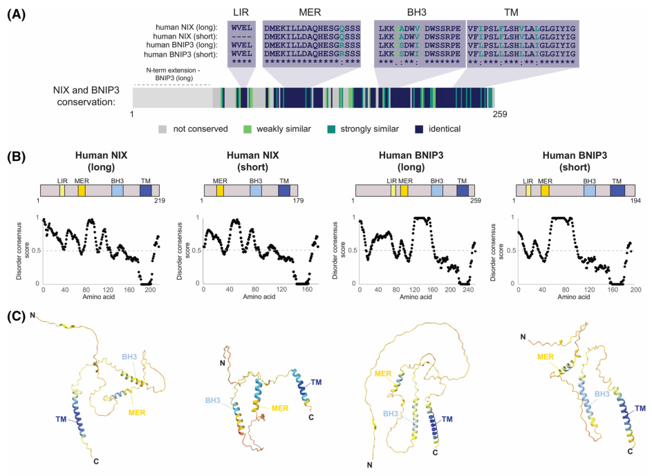

## Question

# Gene Research for Functional Annotation

## ⚠️ CRITICAL: Gene/Protein Identification Context

**BEFORE YOU BEGIN RESEARCH:** You MUST verify you are researching the CORRECT gene/protein. Gene symbols can be ambiguous, especially for less well-characterized genes from non-model organisms.

### Target Gene/Protein Identity (from UniProt):
- **UniProt Accession:** O60238
- **Protein Description:** RecName: Full=BCL2/adenovirus E1B 19 kDa protein-interacting protein 3-like; AltName: Full=Adenovirus E1B19K-binding protein B5; AltName: Full=BCL2/adenovirus E1B 19 kDa protein-interacting protein 3A; AltName: Full=NIP3-like protein X; Short=NIP3L;
- **Gene Information:** Name=BNIP3L; Synonyms=BNIP3A, BNIP3H, NIX;
- **Organism (full):** Homo sapiens (Human).
- **Protein Family:** Belongs to the NIP3 family. .
- **Key Domains:** BNIP3. (IPR010548); BNIP3 (PF06553)

### MANDATORY VERIFICATION STEPS:

1. **Check if the gene symbol "BNIP3L" matches the protein description above**
2. **Verify the organism is correct:** Homo sapiens (Human).
3. **Check if protein family/domains align with what you find in literature**
4. **If you find literature for a DIFFERENT gene with the same or similar symbol, STOP**

### If Gene Symbol is Ambiguous or You Cannot Find Relevant Literature:

**DO NOT PROCEED WITH RESEARCH ON A DIFFERENT GENE.** Instead:
- State clearly: "The gene symbol 'BNIP3L' is ambiguous or literature is limited for this specific protein"
- Explain what you found (e.g., "Found extensive literature on a different gene with the same symbol in a different organism")
- Describe the protein based ONLY on the UniProt information provided above
- Suggest that the protein function can be inferred from domain/family information

### Research Target:

Please provide a comprehensive research report on the gene **BNIP3L** (gene ID: BNIP3L, UniProt: O60238) in human.

The research report should be a detailed narrative explaining the function, biological processes, and localization of the gene product. Citations should be given for all claims.

You should prioritize authoritative reviews and primary scientific literature when conducting research. You can supplement
this with annotations you find in gene/protein databases, but these can be outdated or inaccurate.

We are specifically interested in the primary function of the gene - for enzymes, what reaction is catalyzed, and what is the substrate specificity? For transporters, what is the substrate? For structural proteins or adapters, what is the broader structural role? For signaling molecules, what is the role in the pathway.

We are interested in where in or outside the cell the gene product carries out its function.

We are also interested in the signaling or biochemical pathways in which the gene functions. We are less interested in broad pleiotropic effects, except where these elucidate the precise role.

Include evidence where possible. We are interested in both experimental evidence as well as inference from structure, evolution, or bioinformatic analysis. Precise studies should be prioritized over high-throughput, where available.

## Output

Question: You are an expert researcher providing comprehensive, well-cited information.

Provide detailed information focusing on:
1. Key concepts and definitions with current understanding
2. Recent developments and latest research (prioritize 2023-2024 sources)
3. Current applications and real-world implementations
4. Expert opinions and analysis from authoritative sources
5. Relevant statistics and data from recent studies

Format as a comprehensive research report with proper citations. Include URLs and publication dates where available.
Always prioritize recent, authoritative sources and provide specific citations for all major claims.

# Gene Research for Functional Annotation

## ⚠️ CRITICAL: Gene/Protein Identification Context

**BEFORE YOU BEGIN RESEARCH:** You MUST verify you are researching the CORRECT gene/protein. Gene symbols can be ambiguous, especially for less well-characterized genes from non-model organisms.

### Target Gene/Protein Identity (from UniProt):
- **UniProt Accession:** O60238
- **Protein Description:** RecName: Full=BCL2/adenovirus E1B 19 kDa protein-interacting protein 3-like; AltName: Full=Adenovirus E1B19K-binding protein B5; AltName: Full=BCL2/adenovirus E1B 19 kDa protein-interacting protein 3A; AltName: Full=NIP3-like protein X; Short=NIP3L;
- **Gene Information:** Name=BNIP3L; Synonyms=BNIP3A, BNIP3H, NIX;
- **Organism (full):** Homo sapiens (Human).
- **Protein Family:** Belongs to the NIP3 family. .
- **Key Domains:** BNIP3. (IPR010548); BNIP3 (PF06553)

### MANDATORY VERIFICATION STEPS:

1. **Check if the gene symbol "BNIP3L" matches the protein description above**
2. **Verify the organism is correct:** Homo sapiens (Human).
3. **Check if protein family/domains align with what you find in literature**
4. **If you find literature for a DIFFERENT gene with the same or similar symbol, STOP**

### If Gene Symbol is Ambiguous or You Cannot Find Relevant Literature:

**DO NOT PROCEED WITH RESEARCH ON A DIFFERENT GENE.** Instead:
- State clearly: "The gene symbol 'BNIP3L' is ambiguous or literature is limited for this specific protein"
- Explain what you found (e.g., "Found extensive literature on a different gene with the same symbol in a different organism")
- Describe the protein based ONLY on the UniProt information provided above
- Suggest that the protein function can be inferred from domain/family information

### Research Target:

Please provide a comprehensive research report on the gene **BNIP3L** (gene ID: BNIP3L, UniProt: O60238) in human.

The research report should be a detailed narrative explaining the function, biological processes, and localization of the gene product. Citations should be given for all claims.

You should prioritize authoritative reviews and primary scientific literature when conducting research. You can supplement
this with annotations you find in gene/protein databases, but these can be outdated or inaccurate.

We are specifically interested in the primary function of the gene - for enzymes, what reaction is catalyzed, and what is the substrate specificity? For transporters, what is the substrate? For structural proteins or adapters, what is the broader structural role? For signaling molecules, what is the role in the pathway.

We are interested in where in or outside the cell the gene product carries out its function.

We are also interested in the signaling or biochemical pathways in which the gene functions. We are less interested in broad pleiotropic effects, except where these elucidate the precise role.

Include evidence where possible. We are interested in both experimental evidence as well as inference from structure, evolution, or bioinformatic analysis. Precise studies should be prioritized over high-throughput, where available.

## Comprehensive research report: Human **BNIP3L** (NIX) — functional annotation (UniProt **O60238**)

### 1) Gene/protein identity verification (mandatory)
The literature consistently identifies **NIX** as the protein product of the human gene **BNIP3L** (a paralog of BNIP3), functioning as a selective autophagy/mitophagy receptor. A 2024 mini-review explicitly states that the BNIP3 pathway is mediated by BNIP3 and its paralog **NIX (gene name BNIP3L)**, and describes both as mitophagy receptors (niemi2024coordinatingbnip3nixmediatedmitophagy pages 1-3). Multiple 2023 sources similarly treat **NIX = BNIP3L** and distinguish it from **BNIP3** while emphasizing related domain organization and partial sequence homology (~50%) (nguyen‐dien2023fbxl4suppressesmitophagy pages 1-2). Therefore, the target entity is human **BNIP3L/NIX**, consistent with UniProt O60238, and not BNIP3 (niemi2024coordinatingbnip3nixmediatedmitophagy pages 1-3, nguyen‐dien2023fbxl4suppressesmitophagy pages 1-2).

### 2) Key concepts and definitions (current understanding)

#### 2.1 Receptor-mediated mitophagy
**Mitophagy** is selective autophagy targeting mitochondria for lysosomal degradation. Unlike ubiquitin-driven PINK1/Parkin mitophagy, **receptor-mediated mitophagy** uses outer mitochondrial membrane (OMM) receptors that directly recruit autophagy machinery (marinkovic2021abriefoverview pages 1-1, niemi2024coordinatingbnip3nixmediatedmitophagy pages 1-3). BNIP3L/NIX is among the most-studied mammalian receptors in this class and is central to developmental/programmed removal of mitochondria, particularly in erythroid maturation (marinkovic2021abriefoverview pages 1-1, niemi2024coordinatingbnip3nixmediatedmitophagy pages 1-3).

#### 2.2 BNIP3L/NIX protein class and topology
BNIP3 and NIX are described as **single-pass, C-terminal transmembrane** proteins localized to the **outer mitochondrial membrane** (tail-anchored topology), positioning most of the protein in the cytosol for interaction with autophagy proteins (delgado2023theermembrane pages 1-2, niemi2024coordinatingbnip3nixmediatedmitophagy pages 1-3). This topology is a defining structural feature underlying their receptor activity (delgado2023theermembrane pages 1-2, niemi2024coordinatingbnip3nixmediatedmitophagy pages 1-3).

#### 2.3 LIR (LC3-interacting region) and ATG8 proteins
A core concept in receptor-mediated autophagy is the **LC3-interacting region (LIR)**, a short motif in receptors that binds ATG8-family proteins on the growing autophagosomal membrane (LC3 and GABARAP families in humans) (nguyen‐dien2023fbxl4suppressesmitophagy pages 1-2, niemi2024coordinatingbnip3nixmediatedmitophagy pages 1-3). NIX contains a functional LIR enabling recruitment of LC3/GABARAP to mitochondria (bunker2023nixinteractswith pages 1-2, marinkovic2021abriefoverview pages 2-3).

#### 2.4 MER (minimal essential region)
Beyond the LIR, NIX contains an experimentally defined **minimal essential region (MER)**. A 2023 EMBO Journal study showed that the MER is mechanistically important and **interacts with the autophagy effector WIPI2**, recruiting WIPI2 to mitochondria (bunker2023nixinteractswith pages 1-2). This extended mechanism is now part of current understanding of how transmembrane mitophagy receptors can initiate autophagosome biogenesis downstream of canonical initiation complexes (bunker2023nixinteractswith pages 1-2).

#### 2.5 BH3-only domain (atypical)
BNIP3 and NIX contain an **atypical BH3-only domain** (BCL2 family–linked), historically connecting these proteins to apoptosis/cell-death biology, though its precise role in mitophagy regulation remains incompletely defined (niemi2024coordinatingbnip3nixmediatedmitophagy pages 1-3). Some sources connect BH3-family features to interactions with BCL2/Beclin-1 axis relevant to macroautophagy control (field2024theroleof pages 20-25).

### 3) Molecular function: what BNIP3L/NIX “does”

#### 3.1 Primary function: selective autophagy receptor for mitochondria
The primary molecular function of BNIP3L/NIX is to act as an OMM-embedded **selective autophagy receptor** that links mitochondria to the autophagy machinery to drive mitophagy (niemi2024coordinatingbnip3nixmediatedmitophagy pages 1-3, marinkovic2021abriefoverview pages 2-3). It recruits ATG8 proteins (LC3/GABARAP) via its LIR, enabling formation/expansion of autophagosomal membranes around mitochondria (nguyen‐dien2023fbxl4suppressesmitophagy pages 1-2, marinkovic2021abriefoverview pages 2-3).

#### 3.2 Dual mechanism: LIR + MER/WIPI2 for robust mitophagy (major 2023 advance)
A key mechanistic advance is the demonstration that **both** NIX’s LIR and MER contribute to robust mitophagy. Using chemically induced dimerization approaches, Bunker et al. (EMBO J, Aug 2023) showed that the **MER recruits WIPI2** to mitochondria and that the LIR helps reorganize WIPI2 into puncta even in the absence of ATG8 proteins, together enabling strong mitophagy (bunker2023nixinteractswith pages 1-2).

#### 3.3 Additional selective autophagy role: pexophagy (peroxisome autophagy)
BNIP3L/NIX is not restricted to mitochondria. A 2022 EMBO Journal paper provided direct evidence that NIX can **independently localize to peroxisomes** and drive **pexophagy** (selective degradation of peroxisomes), including under iron chelation and differentiation contexts (wilhelm2022bnip3lnixregulatesboth pages 1-2, wilhelm2022bnip3lnixregulatesboth pages 10-11). This is relevant to human physiology because CD34+ primary human erythroid cultures showed progressive loss of the peroxisomal marker PMP70 during differentiation, consistent with programmed peroxisome turnover in these contexts (wilhelm2022bnip3lnixregulatesboth pages 10-11).

### 4) Subcellular localization: where BNIP3L/NIX acts

* **Outer mitochondrial membrane (OMM):** Core receptor function for mitophagy occurs from the OMM; BNIP3 and NIX are described as OMM proteins targeted by a single C-terminal transmembrane domain (delgado2023theermembrane pages 1-2, niemi2024coordinatingbnip3nixmediatedmitophagy pages 1-3). 
* **Peroxisomes (subset/pool):** NIX can localize to peroxisomes independently and promote pexophagy, particularly under iron chelation/hypoxia-linked transcriptional programs (wilhelm2022bnip3lnixregulatesboth pages 1-2, wilhelm2022bnip3lnixregulatesboth pages 7-9).

### 5) Pathways and regulation (focus on 2023–2024)

#### 5.1 Transcriptional control by hypoxia signaling (HIF-1α) and VHL
BNIP3/NIX are described as transcriptional targets of **HIF-1α** and are induced under hypoxia or iron chelation (niemi2024coordinatingbnip3nixmediatedmitophagy pages 1-3, nguyen‐dien2023fbxl4suppressesmitophagy pages 1-2). FBXL4 and VHL-centered cullin-RING ligase pathways converge on restraining BNIP3/NIX: VHL limits HIF-1α activity (thereby limiting BNIP3/NIX transcription), while FBXL4 restricts receptor abundance post-translationally (elcocks2023fbxl4ubiquitinligase pages 1-2, nguyen‐dien2023fbxl4suppressesmitophagy pages 1-2).

#### 5.2 Post-translational “brakes” restricting basal mitophagy: FBXL4 and PPTC7
A major 2023–2024 theme is that cells actively prevent excessive receptor-mediated mitophagy by **controlling NIX protein abundance**.

* **FBXL4/SCF E3 ligase pathway (2023):** SCF(FBXL4) localizes to mitochondria in unstressed cells and constitutively ubiquitylates and degrades NIX and BNIP3, suppressing basal mitophagy (nguyen‐dien2023fbxl4suppressesmitophagy pages 1-2). Independent CRISPR screening of E3 ligases identified **VHL and FBXL4** as the strongest negative regulators of basal mitophagy, converging on BNIP3 and BNIP3L/NIX (elcocks2023fbxl4ubiquitinligase pages 1-2). FBXL4 pathogenic variants associated with mitochondrial disease fail to mediate BNIP3/NIX turnover (nguyen‐dien2023fbxl4suppressesmitophagy pages 1-2, nguyen‐dien2023fbxl4suppressesmitophagy pages 9-10).

* **PPTC7 as a cofactor/adapter limiting BNIP3/NIX (2024):** Two complementary 2024 studies place **PPTC7** as a negative regulator of BNIP3/NIX-mediated mitophagy. In Life Science Alliance (Jul 2024), PPTC7 is described as dual-localized (matrix and outer membrane fractions) and promotes ubiquitin-mediated turnover of BNIP3/NIX; **Pptc7 KO mice show fully penetrant perinatal lethality** with metabolic defects (wei2024duallocalizedpptc7limits pages 1-2). In EMBO Reports (Jul 2024), PPTC7’s catalytic integrity and binding interface are linked to BNIP3/NIX turnover, and an NIX Arg147-centered motif is required for PPTC7 binding and turnover (nguyendien2024pptc7antagonizesmitophagy pages 22-24).

#### 5.3 Phosphoregulation and dimerization
BNIP3L/NIX activity is regulated by phosphorylation and oligomerization. A review notes that phosphorylation of **Ser34/Ser35** in/near the LIR enhances recruitment of autophagosomes to mitochondria, while C-terminal phosphorylation state (e.g., **Ser212**) is linked to monomer–dimer equilibrium and stabilization of dimers (marinkovic2021abriefoverview pages 2-3). Dimerization through the transmembrane domain is repeatedly implicated as functionally important (niemi2024coordinatingbnip3nixmediatedmitophagy pages 1-3, marinkovic2021abriefoverview pages 2-3).

### 6) Physiological roles (precision over pleiotropy)

#### 6.1 Erythroid maturation and programmed mitochondrial clearance
A central, well-supported physiological role is **programmed removal of mitochondria during terminal erythroid differentiation**. Reviews emphasize BNIP3L/NIX as critical in reticulocyte/erythrocyte maturation and programmed mitochondrial elimination (marinkovic2021abriefoverview pages 1-1, niemi2024coordinatingbnip3nixmediatedmitophagy pages 1-3). This is often used as the canonical example of receptor-mediated mitophagy in mammals.

#### 6.2 Basal mitophagy and organelle homeostasis
BNIP3/NIX contribute not only to stress-induced mitophagy but also to basal mitophagic flux. Combined ablation of both receptors in HeLa cells is reported to nearly abolish steady-state mitophagy as measured by mito-mKeima (niemi2024coordinatingbnip3nixmediatedmitophagy pages 1-3). This supports a broader homeostatic role for BNIP3L/NIX in maintaining mitochondrial quality/quantity.

#### 6.3 Coordinated peroxisome turnover (pexophagy)
NIX-mediated pexophagy emerges as part of coordinated organelle remodeling under iron chelation and differentiation programs (wilhelm2022bnip3lnixregulatesboth pages 1-2, wilhelm2022bnip3lnixregulatesboth pages 3-4). Programmed peroxisome turnover was observed in primary human erythroid differentiation (PMP70 loss) (wilhelm2022bnip3lnixregulatesboth pages 10-11).

### 7) Recent developments (prioritize 2023–2024)

#### 7.1 2023: MER–WIPI2 mechanism clarifies how NIX initiates mitophagy
Bunker et al. (EMBO J; published online Aug 2023; https://doi.org/10.15252/embj.2023113491) showed that the NIX MER binds and recruits **WIPI2** to mitochondria and that robust mitophagy requires both MER and LIR (bunker2023nixinteractswith pages 1-2). This provides a mechanistic explanation for initiation steps beyond simple LC3 binding.

#### 7.2 2023: FBXL4 identified as a central suppressor of receptor-mediated mitophagy
Multiple 2023 studies converge on **FBXL4** as a negative regulator that restrains BNIP3/NIX by ubiquitin-mediated degradation. One study used a CRISPR/Cas9 E3 ligase screen targeting **606 E3 ligases** and identified VHL and FBXL4 as top negative regulators of basal mitophagy (elcocks2023fbxl4ubiquitinligase pages 1-2). Another study directly demonstrates SCF(FBXL4) constitutively ubiquitylates/degrades NIX/BNIP3, and that disease-associated FBXL4 variants impair this suppression (nguyen‐dien2023fbxl4suppressesmitophagy pages 1-2, nguyen‐dien2023fbxl4suppressesmitophagy pages 9-10).

#### 7.3 2024: PPTC7 emerges as a mechanistic cofactor regulating BNIP3/NIX turnover
Nguyen-Dien et al. (EMBO Reports; Jul 2024; https://doi.org/10.1038/s44319-024-00181-y) identified specific residue-level interactions underpinning PPTC7 control of NIX turnover: ITC measured binding of **PPTC7-D290N** to an NIX peptide (**35.9 ± 1.09**, units as reported), and PPTC7 variants (e.g., Y179D) abolished binding, while NIX mutants disrupting the PPTC7-binding motif increased basal mitophagy (nguyendien2024pptc7antagonizesmitophagy pages 22-24). This provides unusually concrete quantitative evidence for a BNIP3L regulatory interface.

#### 7.4 2024: pexophagy pharmacology via VHL inhibition and HIF-1α activation
Kim et al. (Molecules; published 18 Jan 2024; https://doi.org/10.3390/molecules29020482) report that the VHL inhibitor **VH298** induces pexophagy in HeLa cells, requiring canonical autophagy (ATG5) and the pexophagy adaptor **NBR1**, and depending on HIF-1α transcriptional activity (silencing HIF-1α blocks the effect) (kim2024inhibitionofvhl pages 1-2, kim2024inhibitionofvhl pages 2-4). The paper discusses BNIP3L/NIX as a HIF-1α-upregulated mitophagy receptor and notes its reported role in pexophagy, positioning BNIP3L/NIX as a plausible downstream effector in HIF-driven organelle autophagy programs (kim2024inhibitionofvhl pages 6-8).

### 8) Current applications and real-world implementations

#### 8.1 Experimental/biotech implementation: assays and models in current use
BNIP3L/NIX biology is operationalized using:

* **mt-mKeima** mitophagy reporter with flow cytometry and confocal microscopy (used in FBXL4 pathway studies) (nguyen‐dien2023fbxl4suppressesmitophagy pages 1-2, elcocks2023fbxl4ubiquitinligase pages 9-10).
* **mito-QC / pexo-QC** tandem fluorescent reporters to quantify delivery of mitochondria/peroxisomes to lysosomes (wilhelm2022bnip3lnixregulatesboth pages 1-2, wilhelm2022bnip3lnixregulatesboth pages 3-4).
* **CRISPR screens** to discover regulators of basal mitophagy (e.g., E3 ligase screens) (elcocks2023fbxl4ubiquitinligase pages 1-2).
* **Quantitative binding assays (ITC)** to resolve specific regulator–receptor interfaces (PPTC7–NIX) (nguyendien2024pptc7antagonizesmitophagy pages 22-24).

These are now standard toolkits for functional annotation and mechanistic dissection.

#### 8.2 Pharmacologic modulation of BNIP3L/NIX pathways (research tools; therapeutic hypotheses)
* **MLN4924 (neddylation inhibitor; cullin-RING ligase inhibition):** In RPE1 cells, MLN4924 increases BNIP3 and NIX levels and increases mitophagy measured by mt-mKeima flow cytometry, with statistical significance reported across multiple experiments (elcocks2023fbxl4ubiquitinligase pages 9-10). The work frames MLN4924 as a strong inducer of mitophagy and a candidate tool/agent for mitochondrial dysfunction contexts (elcocks2023fbxl4ubiquitinligase pages 1-2).
* **VHL inhibition (VH298) / HIF stabilization (roxadustat):** VHL inhibition induces HIF-dependent pexophagy (ATG5- and NBR1-dependent), illustrating how hypoxia pathway modulation can drive selective organelle autophagy programs; BNIP3L/NIX is cited as part of hypoxia-driven receptor biology and pexophagy literature (kim2024inhibitionofvhl pages 1-2, kim2024inhibitionofvhl pages 6-8).

These interventions constitute “real-world implementations” primarily as **research-enabled pathway modulation**, rather than approved BNIP3L-targeted therapies.

#### 8.3 Clinical trial landscape
A ClinicalTrials.gov search with “BNIP3L OR NIX AND mitophagy” did not yield a clearly relevant interventional trial specifically targeting BNIP3L/NIX in the retrieved clinical-trial output, suggesting no obvious BNIP3L/NIX-specific clinical program is captured by this query at present (kim2024inhibitionofvhl pages 1-2).

### 9) Expert opinions / authoritative synthesis (2024 perspective)
A 2024 Biochemical Society Transactions review emphasizes that BNIP3/NIX-mediated mitophagy requires careful **spatiotemporal regulation**, and highlights that identification of new negative regulators (FBXL4, PPTC7, TMEM11) indicates receptor-mediated mitophagy is actively suppressed under basal conditions to avoid pathological over-clearance of mitochondria (niemi2024coordinatingbnip3nixmediatedmitophagy pages 3-4, niemi2024coordinatingbnip3nixmediatedmitophagy pages 9-10). The same review emphasizes the severe consequences of dysregulation in animal models (perinatal lethality and metabolic dysfunction) and the link to human mitochondrial disease when turnover control fails (niemi2024coordinatingbnip3nixmediatedmitophagy pages 3-4).

### 10) Statistics and quantitative findings (from recent studies)

* **CRISPR screen size/design (2023):** Screen of **606 E3 ubiquitin ligases** (MOI 0.2; 1,000× coverage; four sgRNAs per gene; 243 non-targeting controls) identified VHL and FBXL4 as strongest negative regulators of basal mitophagy (elcocks2023fbxl4ubiquitinligase pages 1-2).
* **PPTC7–NIX binding (2024):** ITC binding to an NIX peptide reported as **35.9 ± 1.09** for PPTC7-D290N (units as reported), with Y179D variant non-binding; NIX Arg147-centered motif required for binding and turnover, and NIX mutants increased basal mitophagy (nguyendien2024pptc7antagonizesmitophagy pages 22-24).
* **In vivo severity (2024):** **Fully penetrant perinatal lethality** in Pptc7 knockout mice with metabolic defects (including hypoketotic hypoglycemia) underscores organismal importance of restricting BNIP3/NIX levels/mitophagy (wei2024duallocalizedpptc7limits pages 1-2).

### 11) Figures (visual evidence)
Key figure schematics from Niemi & Friedman (2024) illustrate (i) BNIP3/NIX **domain architecture** (LIR, MER, BH3, TM) and (ii) a **regulatory model** integrating FBXL4 and PPTC7 control of receptor abundance and TMEM11 spatial restriction of receptor-mediated mitophagy (niemi2024coordinatingbnip3nixmediatedmitophagy media af8c1d6a, niemi2024coordinatingbnip3nixmediatedmitophagy media c89f3902).

### 12) Summary of functional annotation (high-confidence)
Human **BNIP3L (NIX; UniProt O60238)** is a tail-anchored OMM selective-autophagy receptor whose primary role is to recruit autophagy machinery to mitochondria to execute receptor-mediated mitophagy, especially during programmed mitochondrial clearance in erythroid differentiation, and contributing to basal mitophagy. Mechanistically, it engages ATG8 proteins via a phosphorylation-regulated LIR and can recruit WIPI2 via an MER to promote robust mitophagy initiation/organization. Its abundance and activity are tightly controlled by hypoxia-driven transcription (HIF-1α; antagonized by VHL) and by ubiquitin/proteasome-mediated turnover via SCF(FBXL4) with PPTC7 as a critical regulator/cofactor; dysregulation is linked to mitochondrial disease phenotypes. BNIP3L/NIX can also localize to peroxisomes to promote pexophagy in defined contexts, underscoring a broader role in organelle quality control (bunker2023nixinteractswith pages 1-2, niemi2024coordinatingbnip3nixmediatedmitophagy pages 1-3, nguyen‐dien2023fbxl4suppressesmitophagy pages 1-2, wilhelm2022bnip3lnixregulatesboth pages 1-2, nguyendien2024pptc7antagonizesmitophagy pages 22-24).

---

### Embedded artifact
| Category | Details |
|---|---|
| Identity/Localization | **Human BNIP3L/NIX** corresponds to **BNIP3L** (UniProt **O60238**), a **BNIP3 paralog** and **single-pass C-terminal tail-anchored outer mitochondrial membrane (OMM) protein**; most of the protein faces the cytosol, enabling recruitment of autophagy machinery. It is distinct from **BNIP3**, although the two share ~50–65% homology and overlapping receptor functions (niemi2024coordinatingbnip3nixmediatedmitophagy pages 1-3, delgado2023theermembrane pages 1-2, nguyen‐dien2023fbxl4suppressesmitophagy pages 1-2). |
| Domains/Motifs | BNIP3L/NIX contains an **atypical BH3-only region**, a **canonical LIR motif** for ATG8-family binding, a **minimal essential region (MER)** important for mitophagy initiation, and a **C-terminal transmembrane domain** required for OMM targeting and dimerization. Phosphorylation of **Ser34/Ser35** enhances autophagosomal recruitment; **Ser212** is linked to monomer–dimer regulation (bunker2023nixinteractswith pages 1-2, niemi2024coordinatingbnip3nixmediatedmitophagy pages 1-3, marinkovic2021abriefoverview pages 2-3). |
| Core molecular function | Primary function is **receptor-mediated selective autophagy of mitochondria (mitophagy)**, largely **ubiquitin-independent** at the receptor level: NIX binds **LC3/GABARAP** through its LIR and recruits upstream autophagy effectors through its MER. Recent work shows the **MER binds WIPI2**, while the LIR organizes WIPI2 into puncta for robust mitophagy; both LIR and MER are required for strong activity in CID/reconstitution-style assays (bunker2023nixinteractswith pages 1-2). |
| Key regulators (2023–2024) | **FBXL4/SCF** is a major negative regulator that constitutively ubiquitylates/degrades NIX and BNIP3 to suppress basal mitophagy; **VHL** restrains NIX indirectly by degrading **HIF-1α**, thereby limiting hypoxia/iron-chelation-induced transcription; **PPTC7** promotes NIX/BNIP3 turnover and functionally cooperates with FBXL4; **TMEM11** spatially restricts BNIP3/NIX-mediated mitophagy. Hypoxia or iron chelation elevates NIX via **HIF-1α** signaling (niemi2024coordinatingbnip3nixmediatedmitophagy pages 3-4, niemi2024coordinatingbnip3nixmediatedmitophagy pages 9-10, elcocks2023fbxl4ubiquitinligase pages 1-2, wei2024duallocalizedpptc7limits pages 1-2, nguyen‐dien2023fbxl4suppressesmitophagy pages 1-2). |
| Key partners | Direct/functional partners include **LC3 and GABARAP** family proteins, **WIPI2**, **BCL2/Beclin-1** axis components, and the turnover machinery **FBXL4** and **PPTC7**. NIX and BNIP3 can **homo-/heterodimerize** via their TM domains, and dimerization promotes receptor activity (bunker2023nixinteractswith pages 1-2, field2024theroleof pages 20-25, marinkovic2021abriefoverview pages 2-3, nguyendien2024pptc7antagonizesmitophagy pages 22-24). |
| Physiological roles | Best-established physiological role is **programmed mitochondrial clearance during erythroid maturation/reticulocyte differentiation**; Nix-null models show defective mitochondrial removal and impaired erythrocyte maturation. BNIP3/NIX also contribute to **basal mitophagic flux**, mitochondrial remodeling in differentiation contexts, and NIX can additionally mediate **pexophagy**, including during erythrocyte and cardiomyocyte differentiation (marinkovic2021abriefoverview pages 1-1, niemi2024coordinatingbnip3nixmediatedmitophagy pages 1-3, wilhelm2022bnip3lnixregulatesboth pages 10-11, wilhelm2022bnip3lnixregulatesboth pages 1-2). |
| Disease links/applications | Dysregulated NIX turnover is linked to **FBXL4-associated mitochondrial DNA depletion syndrome (MTDPS13)** and related mitochondrial disease biology. In ischemic brain models, stabilizing BNIP3L/NIX can restore mitophagy and improve injury phenotypes. In cancer and other stress contexts, NIX has context-dependent biomarker/target potential through effects on mitophagy, oxidative stress handling, and survival. **MLN4924** is reported as a strong mitophagy inducer via cullin-RING ligase inhibition, making BNIP3L/NIX regulatory pathways experimentally and potentially therapeutically actionable (elcocks2023fbxl4ubiquitinligase pages 1-2, nguyen‐dien2023fbxl4suppressesmitophagy pages 1-2, wei2024duallocalizedpptc7limits pages 1-2). |
| Key quantitative data | Quantitative findings from recent studies include: CRISPR screen of **606 E3 ubiquitin ligases** identified **VHL** and **FBXL4** as strongest negative regulators of basal mitophagy; screen used **MOI 0.2**, **1,000× coverage**, **4 sgRNAs/gene**, and **243 non-targeting controls** (elcocks2023fbxl4ubiquitinligase pages 1-2). In the PPTC7 study, ITC measured binding of **PPTC7-D290N** to a NIX peptide at **35.9 ± 1.09** (units as reported), while a **Y179D** variant was non-binding; NIX mutants disrupting the PPTC7-binding motif increased basal mitophagy by Keima imaging (nguyendien2024pptc7antagonizesmitophagy pages 22-24). **Pptc7 KO mice** showed **fully penetrant perinatal lethality** with metabolic defects, highlighting physiologic importance of restraining NIX/BNIP3 signaling (wei2024duallocalizedpptc7limits pages 1-2). |

*Table: This table condenses the main functional annotation points for human BNIP3L/NIX, including identity, mechanism, regulators, partners, physiology, and translational relevance. It emphasizes 2023–2024 advances such as FBXL4-, VHL/HIF1α-, PPTC7-, and WIPI2-related regulation with supporting context-ID citations.*

References

1. (niemi2024coordinatingbnip3nixmediatedmitophagy pages 1-3): Natalie M. Niemi and Jonathan R. Friedman. Coordinating bnip3/nix-mediated mitophagy in space and time. Biochemical Society Transactions, 52:1969-1979, Oct 2024. URL: https://doi.org/10.1042/bst20221364, doi:10.1042/bst20221364. This article has 32 citations and is from a peer-reviewed journal.

2. (nguyen‐dien2023fbxl4suppressesmitophagy pages 1-2): Giang Thanh Nguyen‐Dien, Keri‐Lyn Kozul, Yi Cui, Brendan Townsend, Prajakta Gosavi Kulkarni, Soo Siang Ooi, Antonio Marzio, Nissa Carrodus, Steven Zuryn, Michele Pagano, Robert G Parton, Michael Lazarou, S Sean Millard, Robert W Taylor, Brett M Collins, Mathew JK Jones, and Julia K Pagan. <scp>fbxl4</scp> suppresses mitophagy by restricting the accumulation of <scp>nix</scp> and <scp>bnip3</scp> mitophagy receptors. The EMBO Journal, May 2023. URL: https://doi.org/10.15252/embj.2022112767, doi:10.15252/embj.2022112767. This article has 85 citations.

3. (marinkovic2021abriefoverview pages 1-1): Mija Marinković and Ivana Novak. A brief overview of bnip3l/nix receptor‐mediated mitophagy. FEBS Open Bio, 11:3230-3236, Oct 2021. URL: https://doi.org/10.1002/2211-5463.13307, doi:10.1002/2211-5463.13307. This article has 80 citations and is from a peer-reviewed journal.

4. (delgado2023theermembrane pages 1-2): Jose M Delgado, Logan Wallace Shepard, Sarah W Lamson, Samantha L Liu, and Christopher J Shoemaker. The er membrane protein complex restricts mitophagy by controlling bnip3 turnover. The EMBO Journal, 43:32-60, Dec 2023. URL: https://doi.org/10.1038/s44318-023-00006-z, doi:10.1038/s44318-023-00006-z. This article has 25 citations.

5. (bunker2023nixinteractswith pages 1-2): Eric N Bunker, François Le Guerroué, Chunxin Wang, Marie‐Paule Strub, Achim Werner, Nico Tjandra, and Richard J Youle. Nix interacts with wipi2 to induce mitophagy. The EMBO Journal, Aug 2023. URL: https://doi.org/10.15252/embj.2023113491, doi:10.15252/embj.2023113491. This article has 45 citations.

6. (marinkovic2021abriefoverview pages 2-3): Mija Marinković and Ivana Novak. A brief overview of bnip3l/nix receptor‐mediated mitophagy. FEBS Open Bio, 11:3230-3236, Oct 2021. URL: https://doi.org/10.1002/2211-5463.13307, doi:10.1002/2211-5463.13307. This article has 80 citations and is from a peer-reviewed journal.

7. (field2024theroleof pages 20-25): J Field. The role of nix in calcium signaling, gene expression, and oxidative phenotype of skeletal muscle. Unknown journal, 2024.

8. (wilhelm2022bnip3lnixregulatesboth pages 1-2): Léa P Wilhelm, Juan Zapata‐Muñoz, Beatriz Villarejo‐Zori, Stephanie Pellegrin, Catarina Martins Freire, Ashley M Toye, Patricia Boya, and Ian G Ganley. Bnip3l/nix regulates both mitophagy and pexophagy. The EMBO Journal, Oct 2022. URL: https://doi.org/10.15252/embj.2022111115, doi:10.15252/embj.2022111115. This article has 112 citations.

9. (wilhelm2022bnip3lnixregulatesboth pages 10-11): Léa P Wilhelm, Juan Zapata‐Muñoz, Beatriz Villarejo‐Zori, Stephanie Pellegrin, Catarina Martins Freire, Ashley M Toye, Patricia Boya, and Ian G Ganley. Bnip3l/nix regulates both mitophagy and pexophagy. The EMBO Journal, Oct 2022. URL: https://doi.org/10.15252/embj.2022111115, doi:10.15252/embj.2022111115. This article has 112 citations.

10. (wilhelm2022bnip3lnixregulatesboth pages 7-9): Léa P Wilhelm, Juan Zapata‐Muñoz, Beatriz Villarejo‐Zori, Stephanie Pellegrin, Catarina Martins Freire, Ashley M Toye, Patricia Boya, and Ian G Ganley. Bnip3l/nix regulates both mitophagy and pexophagy. The EMBO Journal, Oct 2022. URL: https://doi.org/10.15252/embj.2022111115, doi:10.15252/embj.2022111115. This article has 112 citations.

11. (elcocks2023fbxl4ubiquitinligase pages 1-2): Hannah Elcocks, Ailbhe J Brazel, Katy R McCarron, Manuel Kaulich, Koraljka Husnjak, Heather Mortiboys, Michael J Clague, and Sylvie Urbé. Fbxl4 ubiquitin ligase deficiency promotes mitophagy by elevating nix levels. The EMBO Journal, Apr 2023. URL: https://doi.org/10.15252/embj.2022112799, doi:10.15252/embj.2022112799. This article has 61 citations.

12. (nguyen‐dien2023fbxl4suppressesmitophagy pages 9-10): Giang Thanh Nguyen‐Dien, Keri‐Lyn Kozul, Yi Cui, Brendan Townsend, Prajakta Gosavi Kulkarni, Soo Siang Ooi, Antonio Marzio, Nissa Carrodus, Steven Zuryn, Michele Pagano, Robert G Parton, Michael Lazarou, S Sean Millard, Robert W Taylor, Brett M Collins, Mathew JK Jones, and Julia K Pagan. <scp>fbxl4</scp> suppresses mitophagy by restricting the accumulation of <scp>nix</scp> and <scp>bnip3</scp> mitophagy receptors. The EMBO Journal, May 2023. URL: https://doi.org/10.15252/embj.2022112767, doi:10.15252/embj.2022112767. This article has 85 citations.

13. (wei2024duallocalizedpptc7limits pages 1-2): Lianjie Wei, Mehmet Oguz Gok, Jordyn D Svoboda, Keri-Lyn Kozul, Merima Forny, Jonathan R Friedman, and Natalie M Niemi. Dual-localized pptc7 limits mitophagy through proximal and dynamic interactions with bnip3 and nix. Life Science Alliance, 7:e202402765, Jul 2024. URL: https://doi.org/10.26508/lsa.202402765, doi:10.26508/lsa.202402765. This article has 17 citations and is from a peer-reviewed journal.

14. (nguyendien2024pptc7antagonizesmitophagy pages 22-24): Giang Thanh Nguyen-Dien, Brendan Townsend, Prajakta Gosavi Kulkarni, Keri-Lyn Kozul, Soo Siang Ooi, Denaye N Eldershaw, Saroja Weeratunga, Meihan Liu, Mathew JK Jones, S Sean Millard, Dominic CH Ng, Michele Pagano, Alexis Bonfim-Melo, Tobias Schneider, David Komander, Michael Lazarou, Brett M Collins, and Julia K Pagan. Pptc7 antagonizes mitophagy by promoting bnip3 and nix degradation via scffbxl4. EMBO Reports, 25:3324-3347, Jul 2024. URL: https://doi.org/10.1038/s44319-024-00181-y, doi:10.1038/s44319-024-00181-y. This article has 22 citations and is from a highest quality peer-reviewed journal.

15. (wilhelm2022bnip3lnixregulatesboth pages 3-4): Léa P Wilhelm, Juan Zapata‐Muñoz, Beatriz Villarejo‐Zori, Stephanie Pellegrin, Catarina Martins Freire, Ashley M Toye, Patricia Boya, and Ian G Ganley. Bnip3l/nix regulates both mitophagy and pexophagy. The EMBO Journal, Oct 2022. URL: https://doi.org/10.15252/embj.2022111115, doi:10.15252/embj.2022111115. This article has 112 citations.

16. (kim2024inhibitionofvhl pages 1-2): Yong Hwan Kim, Na Yeon Park, Doo Sin Jo, Ji-Eun Bae, Joon Bum Kim, Kyuhee Park, Kwiwan Jeong, Pansoo Kim, Eunbyul Yeom, and Dong-Hyung Cho. Inhibition of vhl by vh298 accelerates pexophagy by activation of hif-1α in hela cells. Molecules, 29:482, Jan 2024. URL: https://doi.org/10.3390/molecules29020482, doi:10.3390/molecules29020482. This article has 0 citations.

17. (kim2024inhibitionofvhl pages 2-4): Yong Hwan Kim, Na Yeon Park, Doo Sin Jo, Ji-Eun Bae, Joon Bum Kim, Kyuhee Park, Kwiwan Jeong, Pansoo Kim, Eunbyul Yeom, and Dong-Hyung Cho. Inhibition of vhl by vh298 accelerates pexophagy by activation of hif-1α in hela cells. Molecules, 29:482, Jan 2024. URL: https://doi.org/10.3390/molecules29020482, doi:10.3390/molecules29020482. This article has 0 citations.

18. (kim2024inhibitionofvhl pages 6-8): Yong Hwan Kim, Na Yeon Park, Doo Sin Jo, Ji-Eun Bae, Joon Bum Kim, Kyuhee Park, Kwiwan Jeong, Pansoo Kim, Eunbyul Yeom, and Dong-Hyung Cho. Inhibition of vhl by vh298 accelerates pexophagy by activation of hif-1α in hela cells. Molecules, 29:482, Jan 2024. URL: https://doi.org/10.3390/molecules29020482, doi:10.3390/molecules29020482. This article has 0 citations.

19. (elcocks2023fbxl4ubiquitinligase pages 9-10): Hannah Elcocks, Ailbhe J Brazel, Katy R McCarron, Manuel Kaulich, Koraljka Husnjak, Heather Mortiboys, Michael J Clague, and Sylvie Urbé. Fbxl4 ubiquitin ligase deficiency promotes mitophagy by elevating nix levels. The EMBO Journal, Apr 2023. URL: https://doi.org/10.15252/embj.2022112799, doi:10.15252/embj.2022112799. This article has 61 citations.

20. (niemi2024coordinatingbnip3nixmediatedmitophagy pages 3-4): Natalie M. Niemi and Jonathan R. Friedman. Coordinating bnip3/nix-mediated mitophagy in space and time. Biochemical Society Transactions, 52:1969-1979, Oct 2024. URL: https://doi.org/10.1042/bst20221364, doi:10.1042/bst20221364. This article has 32 citations and is from a peer-reviewed journal.

21. (niemi2024coordinatingbnip3nixmediatedmitophagy pages 9-10): Natalie M. Niemi and Jonathan R. Friedman. Coordinating bnip3/nix-mediated mitophagy in space and time. Biochemical Society Transactions, 52:1969-1979, Oct 2024. URL: https://doi.org/10.1042/bst20221364, doi:10.1042/bst20221364. This article has 32 citations and is from a peer-reviewed journal.

22. (niemi2024coordinatingbnip3nixmediatedmitophagy media af8c1d6a): Natalie M. Niemi and Jonathan R. Friedman. Coordinating bnip3/nix-mediated mitophagy in space and time. Biochemical Society Transactions, 52:1969-1979, Oct 2024. URL: https://doi.org/10.1042/bst20221364, doi:10.1042/bst20221364. This article has 32 citations and is from a peer-reviewed journal.

23. (niemi2024coordinatingbnip3nixmediatedmitophagy media c89f3902): Natalie M. Niemi and Jonathan R. Friedman. Coordinating bnip3/nix-mediated mitophagy in space and time. Biochemical Society Transactions, 52:1969-1979, Oct 2024. URL: https://doi.org/10.1042/bst20221364, doi:10.1042/bst20221364. This article has 32 citations and is from a peer-reviewed journal.

## Artifacts

- [Edison artifact artifact-00](BNIP3L-deep-research-falcon_artifacts/artifact-00.md)

## Citations

1. bunker2023nixinteractswith pages 1-2
2. field2024theroleof pages 20-25
3. marinkovic2021abriefoverview pages 2-3
4. kim2024inhibitionofvhl pages 6-8
5. kim2024inhibitionofvhl pages 1-2
6. marinkovic2021abriefoverview pages 1-1
7. delgado2023theermembrane pages 1-2
8. kim2024inhibitionofvhl pages 2-4
9. https://doi.org/10.15252/embj.2023113491
10. https://doi.org/10.1038/s44319-024-00181-y
11. https://doi.org/10.3390/molecules29020482
12. https://doi.org/10.1042/bst20221364,
13. https://doi.org/10.15252/embj.2022112767,
14. https://doi.org/10.1002/2211-5463.13307,
15. https://doi.org/10.1038/s44318-023-00006-z,
16. https://doi.org/10.15252/embj.2023113491,
17. https://doi.org/10.15252/embj.2022111115,
18. https://doi.org/10.15252/embj.2022112799,
19. https://doi.org/10.26508/lsa.202402765,
20. https://doi.org/10.1038/s44319-024-00181-y,
21. https://doi.org/10.3390/molecules29020482,