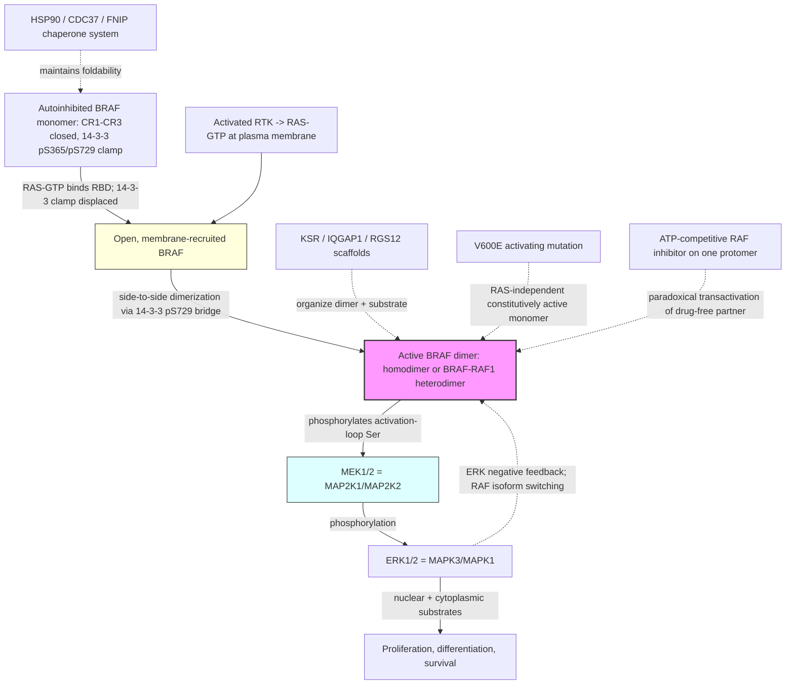

# Pathway Summary for BRAF

## Overview
BRAF is a RAF-family serine/threonine protein kinase (EC 2.7.11.1) that serves as the canonical mitogen-activated protein kinase kinase kinase (MAP3K) of the RAS-RAF-MEK-ERK cascade. In quiescent cells the kinase is held inactive by an intramolecular autoinhibitory interaction between its N-terminal regulatory region and the C-terminal kinase domain, reinforced by 14-3-3 dimers bridging phosphorylated regulatory and C-terminal sites and by the HSP90/CDC37 chaperone system [PMID:36931259, PMID:22939624, Reactome:R-HSA-5672950]. Mitogenic stimulation generates GTP-loaded RAS, which engages the BRAF RAS-binding domain (RBD), relieves autoinhibition, and recruits BRAF to the plasma membrane where it adopts an active, side-to-side dimeric conformation [PMID:26165597, PMID:24441586, PMID:19727074, Reactome:R-HSA-5672966]. Activated BRAF — most potently as a BRAF-RAF1 heterodimer — phosphorylates the activation-loop serines of MAP2K1/MAP2K2 (MEK1/MEK2), the committed step that propagates the signal through ERK1/ERK2 to control proliferation, differentiation and survival [PMID:29433126, PMID:25155755, Reactome:R-HSA-5672972, Reactome:R-HSA-5673001].

## Core Pathways

### Autoinhibition and RAS-GTP–Driven Release
In the basal state BRAF is a closed, autoinhibited monomer in which the N-terminal CR1/CR2 regulatory region folds back onto the CR3 kinase domain; 14-3-3 proteins clamp phosphorylated S365 (regulatory) and S729 (C-terminal) sites to stabilize this closed conformation [PMID:36931259, PMID:15161933, PMID:15778465]. Receptor-driven accumulation of RAS-GTP recruits BRAF to the membrane via the RBD; RBD occupancy is allosterically coupled to the kinase domain and, together with displacement of the inhibitory 14-3-3 bridge, opens the kinase for activation [PMID:26165597, PMID:24441586, PMID:16888650]. The N-terminal B-Raf–specific region additionally supports Ca2+/calmodulin-responsive membrane recruitment and dimerization, and diacylglycerol kinase eta potentiates B-Raf/C-Raf heterodimer formation in this step [PMID:16858395, PMID:18567582, PMID:19710016].

### Dimerization-Dependent Kinase Activation
RAF catalytic output is governed by side-to-side dimerization rather than by activation-loop phosphorylation alone: an intact dimer interface is required for activity of wild-type BRAF, and the relative activity of BRAF homodimers versus the more potent BRAF-RAF1 (CRAF) heterodimer sets pathway gain [PMID:19727074, PMID:22510884, PMID:37045861]. 14-3-3 proteins act as a central chaperone-like scaffold that bridges the C-terminal pS729 sites of partner protomers and stabilizes the active dimer once the autoinhibitory clamp is released [PMID:36931259]. The HSP90/CDC37 chaperone machinery, modulated by FNIP co-chaperones, maintains BRAF foldability and is required to keep the kinase competent for activation [PMID:22939624, PMID:27353360]. Scaffold proteins organize productive dimers and substrate presentation in specific contexts, including KSR (a pseudokinase that allosterically couples to BRAF), IQGAP1, and RGS12 [PMID:21441910, PMID:29433126, PMID:17563371, PMID:18567582, PMID:17380122].

### MEK1/2 Phosphorylation — The Committed MAP3K Step
The defining biochemical function of BRAF is phosphorylation of the activation-loop serines of MEK1/MEK2 (MAP2K1/MAP2K2). KSR pseudokinase undergoes a RAF-induced allosteric transition that stimulates MEK phosphorylation, and reciprocally MEK binding allosterically drives BRAF activation, forming a tightly coupled BRAF-KSR-MEK module [PMID:21441910, PMID:29433126]. The crystal structure of the BRAF-MEK complex shows a face-to-face arrangement that supports both catalytic and a kinase-activity-independent organizing role for BRAF in the module [PMID:25155755]. Phosphorylated MEK1/2 then activates ERK1/ERK2, translating the upstream RAS signal into nuclear and cytoplasmic substrate phosphorylation [Reactome:R-HSA-5672972, Reactome:R-HSA-5672973, Reactome:R-HSA-5672978, Reactome:R-HSA-5673001].

### Negative Feedback and Pathway Reset
The cascade is rate-limited by ERK-dependent negative feedback that phosphorylates and destabilizes RAF activation, and by feedback-driven RAF isoform switching (e.g. ERK/PDE4-controlled BRAF-to-CRAF switching in melanoma) [PMID:21478863, PMID:23153539, Reactome:R-HSA-5674130, Reactome:R-HSA-5675417]. Relief of this profound feedback inhibition underlies the paradoxical pathway activation seen when ATP-competitive RAF inhibitors bind one protomer and transactivate the drug-free partner in RAS-active, BRAF–wild-type cells [PMID:20130576, PMID:23680146, PMID:26466569]. These regulatory features explain context-dependent responses to MEK and RAF inhibition and to acquired-resistance mechanisms [PMID:22169110, PMID:23934108, PMID:24746704, PMID:25600339].

## Pathway Diagram

## Molecular Architecture
- **Conserved region 1 (CR1)** containing the RAS-binding domain (RBD) and cysteine-rich domain (CRD); RBD occupancy by RAS-GTP is allosterically coupled to the kinase domain and is the principal activation input [PMID:26165597, PMID:24441586]
- **Conserved region 2 (CR2)** a Ser/Thr-rich segment carrying the 14-3-3–binding regulatory phosphosite (S365) that, when clamped, enforces autoinhibition [PMID:36931259, PMID:15161933]
- **Conserved region 3 (CR3) kinase domain** the catalytic Ser/Thr protein kinase fold whose activity depends on side-to-side dimer formation; the activation-segment V600 position is the principal oncogenic hotspot [PMID:19727074, PMID:25437913]
- **C-terminal 14-3-3 site (S729)** which bridges the partner protomer in the active dimer and, when phosphorylated and 14-3-3–occupied in the closed state, contributes to autoinhibition [PMID:36931259, PMID:22510884]

## Upstream Inputs
- **Receptor-driven RAS-GTP** generated downstream of growth-factor and other receptors, recruiting BRAF to the membrane through the RBD [PMID:26165597, PMID:24441586, Reactome:R-HSA-5672966]
- **14-3-3 proteins** acting as bidirectional regulators — enforcing autoinhibition in the closed state and stabilizing the active dimer once released [PMID:36931259, PMID:15161933, PMID:15778465, PMID:16888650]
- **HSP90/CDC37/FNIP chaperone system** maintaining BRAF stability and activation competence [PMID:22939624, PMID:27353360]
- **Ca2+/calmodulin and lipid signals** (via the N-terminal B-Raf–specific region, IQGAP1, and diacylglycerol kinase eta) modulating dimerization and membrane recruitment [PMID:16858395, PMID:17563371, PMID:18567582, PMID:19710016]
- **Scaffold availability** (KSR, IQGAP1, RGS12) organizing where and with which partners BRAF assembles productive signaling complexes [PMID:21441910, PMID:29433126, PMID:17380122]

## Downstream Effects
- **MEK1/2 → ERK1/2 activation** the canonical MAP3K output controlling proliferation, differentiation, and survival gene-expression programs [PMID:29433126, PMID:25155755, Reactome:R-HSA-5672972, Reactome:R-HSA-5673001]
- **Heterodimer-dependent signal amplification** via the high-activity BRAF-RAF1 heterodimer, whose interactome is remodeled relative to monomers [PMID:37045861]
- **Developmental and survival requirements in vivo** — Braf is required for endothelial cell survival during mouse development, illustrating the non-redundant physiological role of this cascade node [PMID:9207797]

## Non-Core Contexts
- **Oncogenic activation by V600E and other kinase-domain mutations**: V600E renders BRAF a constitutively active, RAS-independent monomer; the BRAF kinase-domain monomer structure explains the allosteric basis of this activation, and kinase-dead BRAF can cooperate with oncogenic RAS by transactivating CRAF [PMID:25437913, PMID:20141835, PMID:22510884, Reactome:R-HSA-6802908, Reactome:R-HSA-6802911]. These are disease-mechanism consequences of the same dimerization-controlled switch the merged review captures as core function, not additional native roles.
- **Paradoxical MAPK activation by RAF inhibitors**: ATP-competitive RAF inhibitors transactivate the drug-free protomer and relieve feedback inhibition in RAS-active, BRAF–wild-type cells, driving paradoxical ERK activation and resistance; next-generation "paradox-breaker" inhibitors and combination strategies were developed to evade this [PMID:20130576, PMID:23680146, PMID:23153539, PMID:26466569, PMID:22169110, PMID:25600339]. This is a pharmacological perturbation of the normal dimerization mechanism.
- **Inhibitor-response and resistance context**: the mechanism of MEK inhibition and the requirement to disrupt CRAF-mediated MEK activation determine efficacy in BRAF- versus RAS-driven tumors [PMID:23934108, PMID:24746704]. These are therapeutic-context observations rather than direct BRAF biochemical activities.
- **Germline RASopathy biology**: cardiofaciocutaneous syndrome arises from constitutive RAF-MEK-ERK activation, including via a 14-3-3 (YWHAZ) variant that activates the cascade — a developmental-disease consequence of dysregulated core signaling [PMID:31024343].
- **Context-specific and non-canonical outputs**: B-RAF stimulates the Na+-coupled glucose transporter SGLT1 [PMID:23010278]; oncogenic Ras/B-Raf positively regulate death receptor 5 expression [PMID:22065586]; the EGFR network is extensively rewired in BRAF/RAS-mutant colorectal cancer cells [PMID:31980649]; and HERC2 deficiency redirects signaling through a C-RAF/MKK3/p38 axis [PMID:36241744]. These are downstream or context-restricted effects appropriately represented in the merged review's non-core / over-annotation decisions rather than promoted to gene-level core function.

## Functional Integration
BRAF occupies the RAF node of the RAS-RAF-MEK-ERK cascade and is gated by three orthogonal regulatory layers:
1. **Conformational state** — the autoinhibited closed monomer versus the open, activatable form, set by the CR1-CR3 intramolecular interaction and the 14-3-3 clamp [PMID:36931259, PMID:26165597]
2. **Dimerization** — side-to-side homo- and (more potently) BRAF-RAF1 heterodimerization, stabilized by 14-3-3 and the HSP90/CDC37 chaperone system, is the true determinant of catalytic output [PMID:19727074, PMID:22510884, PMID:37045861, PMID:22939624]
3. **Scaffold and substrate coupling** — KSR/IQGAP1/RGS12 scaffolds and the allosterically coupled BRAF-MEK module determine where, with which partners, and how efficiently the committed MEK-phosphorylation step occurs [PMID:21441910, PMID:29433126, PMID:25155755]

The convergence of these layers explains why oncogenic mutation (locking the kinase ON as a RAS-independent monomer) and pharmacological RAF inhibition (paradoxically transactivating partner protomers) both act through the same dimerization-controlled switch, and why effective therapeutic strategies must account for the dimer interface, CRAF cross-activation, and ERK-driven negative feedback that together tune signal flux through this node.
