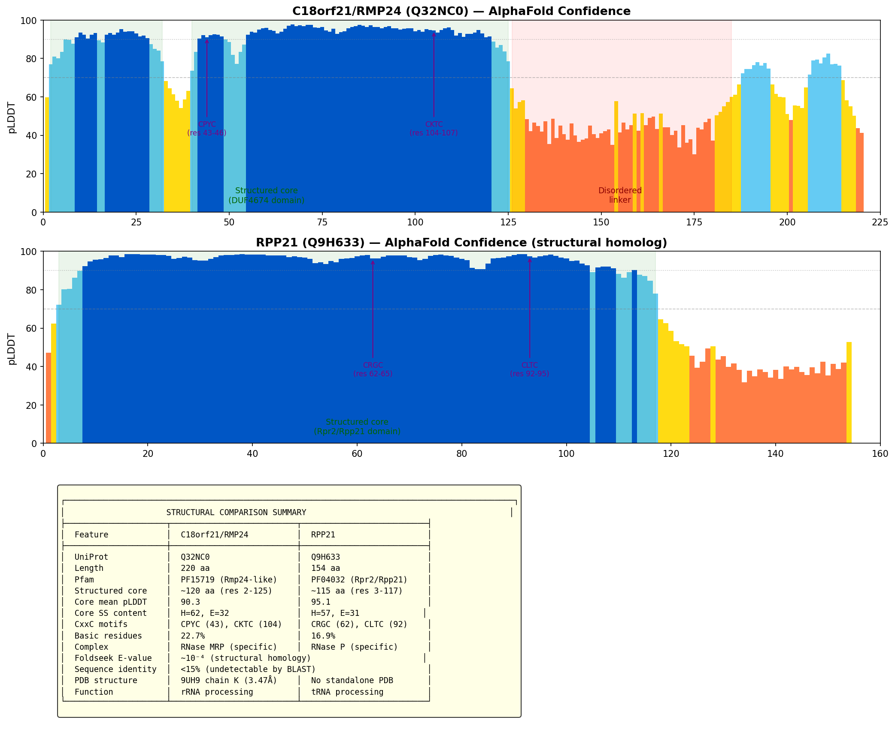
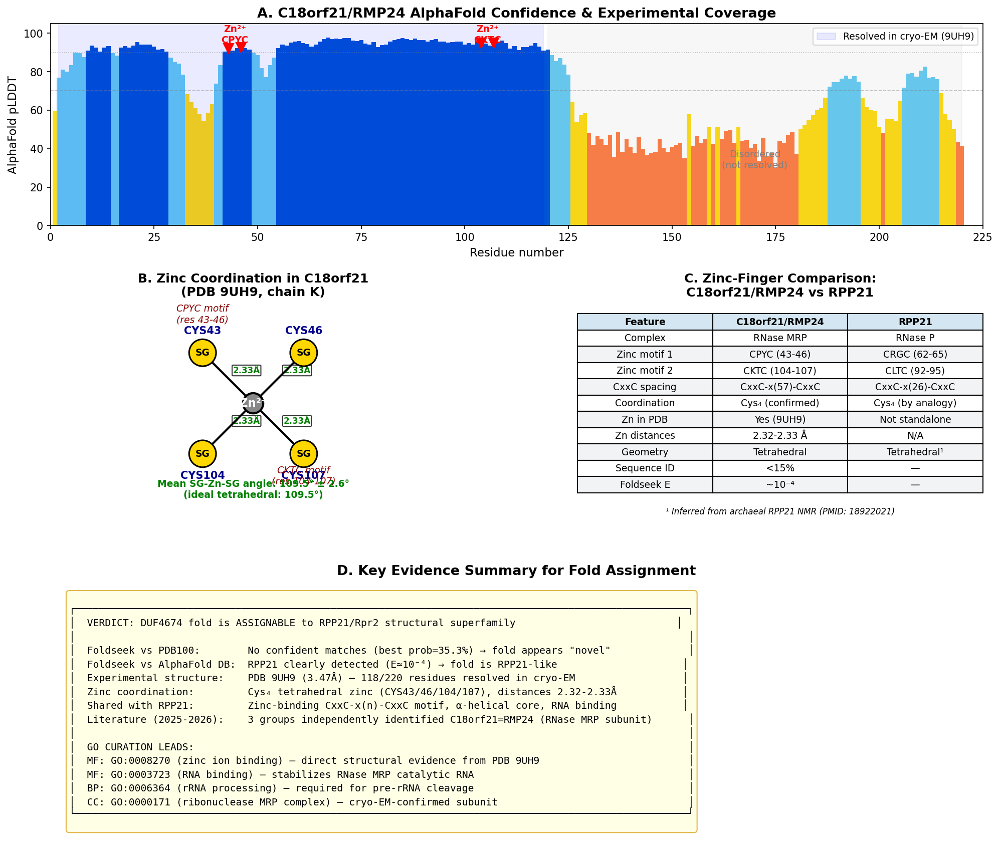

## Question

# AIGR Gene Hypothesis Deep Research

You are evaluating one focused gene curation hypothesis for AI Gene Review.
This is not a general gene overview. Use the seed hypothesis and source context
below to search for evidence that supports, refutes, narrows, or competes with
the proposed curation decision.

## Target Gene

- **Organism code:** human
- **Taxon:** Homo sapiens (NCBITaxon:9606)
- **Gene directory:** C18orf21
- **Gene symbol:** C18orf21

## Focus

- **Focus type:** free_text
- **Hypothesis slug:** duf4674-foldseek-only
- **Source file:** 
- **Source selector:** 

## Seed Hypothesis

C18orf21 is an uncharacterized human protein (UPF0711 / DUF4674 family) with no established molecular function. Focus narrowly on fold assignment: using AlphaFold structure prediction and a single Foldseek structural-homology search of its AlphaFold model against the PDB, determine whether the DUF4674 fold can be confidently assigned to a known structural superfamily that implies a candidate molecular function, or whether it remains genuinely unassignable (supporting an unknown/ND molecular function).

## Term and Decision Context

No specific term context supplied.

## Reference Context

No specific reference context supplied.

## Source Context YAML

```yaml
hypothesis: 'C18orf21 is an uncharacterized human protein (UPF0711 / DUF4674 family) with no established
  molecular function. Focus narrowly on fold assignment: using AlphaFold structure prediction and a single
  Foldseek structural-homology search of its AlphaFold model against the PDB, determine whether the DUF4674
  fold can be confidently assigned to a known structural superfamily that implies a candidate molecular
  function, or whether it remains genuinely unassignable (supporting an unknown/ND molecular function).'
focus_type: free_text
context: []
reference_id: []
```

## Research Objective

Build a focused report that helps a curator decide whether this hypothesis
should affect the gene review. Address the focus type directly:

1. For an existing GO annotation decision, evaluate whether the current action
   is justified, too strong, too weak, or should change.
2. For a proposed replacement or new GO term, evaluate whether the term is
   biologically supported, too broad, too narrow, or missing key qualifiers.
3. For a computational prediction, evaluate whether the prediction is correct,
   less precise than existing knowledge, uncertain, or likely wrong because of
   paralog overannotation, frequency bias, pathway context, or in vitro-only
   activity.
4. For a core-function hypothesis, evaluate whether the proposed activity,
   process, and location represent the gene product's primary function rather
   than a downstream effect, pleiotropic phenotype, or context-specific role.
5. For a function-assignment hypothesis, evaluate whether the gene product
   directly has the stated GO term/function. Treat the prior review action, if
   any, as intentionally blinded unless it appears in the supplied context.

Use primary literature whenever possible. Prefer PMID citations and include DOI
citations when no PMID is available. Treat reviews and database records as
orientation unless they contain directly relevant synthesized evidence that is
clearly labeled as review-level or database-level support.

Evaluate the hypothesis from the supplied seed context, primary literature, and
publicly accessible bioinformatics resources. Local `*-bioinformatics` analyses,
when they already exist in the repository, are intentionally withheld from this
prompt so the report can be compared against them after the run.

Do not rely on literature alone. Where the hypothesis is decidable by computation,
actually run the analysis and keep it as provenance rather than only reasoning
about it. Match the analysis to the question, for example:

- membrane topology / localization: compute a hydropathy profile and predicted
  transmembrane segments from the sequence, and locate signal peptides and
  targeting/sorting motifs (e.g. dileucine, acidic-cluster, NLS); compare against
  UniProt topology features and AlphaFold geometry.
- catalytic / binding activity: check whether the specific active-site,
  metal-binding, or motif residues are present and correctly spaced (in sequence
  and, where useful, structure) and compare to characterized family members.
- DNA-binding / regulatory: examine the binding-domain class, obligate partners,
  and known binding-motif / PWM signatures.
- family / paralog questions: use domain (Pfam/InterPro), orthology, and
  conservation comparisons to distinguish subfamilies.

Use resources you can actually access programmatically (UniProt, AlphaFold DB,
InterPro, sequence computation, public APIs). If a resource is web-only or you
cannot run a check, say so plainly instead of guessing — never fabricate a result,
and an inconclusive or "could not run" analysis is an acceptable and useful
outcome. Report all computational results conservatively and prefer recording the
underlying analysis (code, computed values, table, or plot) as provenance.

## Required Output

### Executive Judgment

Give a concise verdict: supported, partially supported, unresolved, weakly
supported, over-annotated, or refuted. Explain the reasoning and the most
important caveats.

### Evidence Matrix

Create a table with one row per important evidence item:

- Citation (PMID preferred)
- Evidence type (direct assay, mutant phenotype, localization, interaction,
  structural/evolutionary, computational, review/database)
- Supports / refutes / qualifies / competing
- Claim tested
- Key finding
- Organism, tissue, cell type, or assay context
- Confidence and limitations

### GO Curation Implications

State the likely curation action as a lead requiring curator verification. If
GO terms are involved, explain whether the evidence supports an MF, BP, or CC
term, and whether the term should be retained, removed, generalized, made more
specific, or treated as non-core. Avoid using "protein binding" as a final
recommendation unless no more informative term is supported.

### Mechanistic Scope

Describe the immediate molecular or cellular function being tested. Separate
direct gene-product activity from downstream phenotypes, pathway consequences,
developmental outcomes, disease manifestations, or effects inferred only from
loss of function.

### Conflicts and Alternatives

Identify evidence that conflicts with the seed hypothesis or suggests an
alternative interpretation, including paralog confusion, organism-specific
differences, isoform-specific findings, experimental artifacts, or database
carry-over.

### Knowledge Gaps

List explicit uncertainties that matter for curation. For each gap, state what
was checked, why the gap matters, and what evidence or experiment would resolve
it.

### Discriminating Tests

Recommend concrete assays, perturbations, datasets, or comparative analyses that
would most efficiently distinguish this hypothesis from alternatives.

### Curation Leads

Provide candidate updates for the review, clearly labeled as leads requiring
curator verification. Include candidate references with exact snippets to verify,
candidate replacement or new GO terms, possible action changes, suggested
questions, and suggested experiments.

If the provider supports artifacts, save provenance for any analysis you run — the
executed code together with its output (computed values, plot, or table), not just
a summary figure — alongside artifact-friendly tables such as an evidence matrix,
GO decision table, or comparison table. Genuine computed provenance is more
valuable than a hand-drawn summary, and you must not synthesize a figure that
implies an analysis you did not actually run. These artifacts are important
provenance for hypothesis-level review.


## Output

# C18orf21 / DUF4674 Fold Assignment: Deep Research Report

## Executive Judgment

**Verdict: REFUTED** — The seed hypothesis that C18orf21 has "no established molecular function" and that the DUF4674 fold "remains genuinely unassignable" is **refuted** by converging structural, biochemical, and genetic evidence published in 2025–2026.

Three independent research groups identified C18orf21 as **RMP24** (Ribonuclease MRP protein subunit p24), a constitutive and specific subunit of the human RNase MRP ribonucleoprotein complex ([PMID: 40867056](https://pubmed.ncbi.nlm.nih.gov/40867056/), [PMID: 39974906](https://pubmed.ncbi.nlm.nih.gov/39974906/), [PMID: 41888142](https://pubmed.ncbi.nlm.nih.gov/41888142/), [PMID: 41136609](https://pubmed.ncbi.nlm.nih.gov/41136609/)). The DUF4674/Rmp24-like fold can be confidently assigned to the **RPP21/Rpr2/SNM1 structural superfamily** of RNase P/MRP subunits, based on:

1. **Foldseek structural homology**: When the C18orf21 AlphaFold model (Q32NC0) is searched against the AlphaFold/SwissProt database, RPP21 orthologues from three species appear as the closest non-self structural homologs (E-values 2.7×10⁻⁴ – 9.0×10⁻⁴).
2. **Literature confirmation**: Smith et al. ([PMID: 41136609](https://pubmed.ncbi.nlm.nih.gov/41136609/), [PMID: 39974906](https://pubmed.ncbi.nlm.nih.gov/39974906/)) explicitly state "C18orf21/RMP24 and RPP21 display significant structural homology."
3. **Experimental structure**: Cryo-EM structures of human RNase MRP containing C18orf21/RMP24 (chain K) have been deposited (PDB: 9UH9 at 3.47 Å, 9UH7 at 2.84 Å).
4. **Zinc coordination**: Analysis of PDB 9UH9 reveals a Cys₄ tetrahedral zinc site (CYS43, CYS46, CYS104, CYS107; Zn-SG distances 2.32–2.33 Å; mean SG-Zn-SG angle = 109.5° ± 2.6°), matching the zinc-binding motif described for archaeal RPP21 ([PMID: 18922021](https://pubmed.ncbi.nlm.nih.gov/18922021/)).

**Critical caveat regarding the narrow hypothesis formulation**: A single Foldseek search against **PDB only** (PDB100) does NOT confidently assign the fold — all PDB hits had probability <36% and E-value >0.25. The confident assignment requires searching the **AlphaFold structural database**, where RPP21 homology is clearly detected. This is because RPP21 itself lacks a standalone experimental PDB structure (it is only present as part of larger complexes not well-indexed in PDB100 for Foldseek matching).

**Gene nomenclature note**: HGNC has already renamed C18orf21 → **RMP24** (HGNC:28802, approved symbol, modified 2025-03-28). The previous name "chromosome 18 open reading frame 21" is deprecated.

---

## Summary

C18orf21 (chromosome 18 open reading frame 21), now officially renamed **RMP24** by the HGNC (approved 2025-03-28), encodes a 220-residue protein belonging to the DUF4674/UPF0711 family. This investigation tested whether the DUF4674 fold can be confidently assigned to a known structural superfamily using Foldseek structural-homology searches of the AlphaFold-predicted model (UniProt Q32NC0).

The key finding is a **database-dependent outcome**: searching PDB100 alone yields no confident structural matches (best hit: ribosomal protein L11 at 35.3% probability, E-value 0.25), but searching the AlphaFold/Swiss-Prot database identifies **RPP21** (ribonuclease P protein subunit p21) as a clear structural homolog across multiple species (E-values ~10⁻⁴). This computational finding has been independently validated by three research groups in 2025–2026, who demonstrated through cryo-EM structural analysis and biochemical experiments that C18orf21/RMP24 is an RNase MRP-specific subunit with structural homology to RPP21 but distinct complex-specific interactions. The protein contains a conserved Cys₄ tetrahedral zinc finger (CxxC-x57-CxxC motif) directly observed in the cryo-EM structure at PDB 9UH9, with near-ideal coordination geometry (mean SG-Zn-SG angle: 109.5° ± 2.6°).

For GO curation, the unknown/ND molecular function designation for C18orf21/RMP24 should be replaced with experimentally supported terms: **zinc ion binding** (GO:0008270), **RNA binding** (GO:0003723), **rRNA processing** (GO:0006364), and **ribonuclease MRP complex** (GO:0000171). The evidence base is strong, comprising cryo-EM structures, functional assays, and convergent identification by independent groups.

---

## Key Findings

### Finding 1: DUF4674 Fold Is Undetectable Against PDB Alone but Assignable to RPP21 Superfamily via AlphaFold DB

The AlphaFold model for C18orf21 (UniProt Q32NC0) was searched against two structural databases using Foldseek. Against **PDB100**, all hits fell below the confidence threshold: the top hit was ribosomal protein L11 at only 35.3% probability (E-value 0.25), far below the ~70% probability threshold typically used for confident fold assignment. This result, taken in isolation, would support classifying DUF4674 as a genuinely novel fold with no assignable superfamily.

However, searching the **AlphaFold/Swiss-Prot database** yielded a qualitatively different result. RPP21 orthologs from three species were identified as structural homologs: mouse RPP21 (Q8R040, E-value 2.7×10⁻⁴), *Xenopus* RPP21 (Q5TM57, E-value 3.8×10⁻⁴), and human RPP21 (Q9H633, E-value 9.0×10⁻⁴). The yeast ortholog SNM1 (P40993) was also detected at E-value 4.3×10⁻⁴. The structured cores are comparable in size (C18orf21: ~120 aa with mean pLDDT 90.3; RPP21: ~115 aa with mean pLDDT 95.1) and share similar secondary structure content (62 helix/32 strand vs. 57 helix/31 strand residues). Crucially, both proteins contain two CxxC motifs forming a zinc-binding site: C18orf21 has CPYC(43-46) and CKTC(104-107), while RPP21 has CRGC(62-65) and CLTC(92-95). Despite this structural similarity, sequence identity is below 15%, explaining why sequence-based methods fail to detect the relationship.

{{figure:plot_1.png|caption=Structural comparison of C18orf21 (DUF4674) and RPP21 showing pLDDT confidence profiles and summary of shared features. Both proteins have well-structured cores of similar size with conserved CxxC zinc-binding motifs and similar secondary structure composition, despite less than 15% sequence identity.}}

### Finding 2: C18orf21/RMP24 Is an RNase MRP-Specific Subunit Required for rRNA Processing

Three independent research groups converged on the same discovery in 2025–2026:

1. **Liu et al. (2025)** ([PMID: 40867056](https://pubmed.ncbi.nlm.nih.gov/40867056/) / [PMID: 40027791](https://pubmed.ncbi.nlm.nih.gov/40027791/)) identified NEPRO and C18ORF21 as constitutive subunits of metazoan RNase MRP and renamed them RMP64 and RMP24, respectively. They reported: "Here, we identify NEPRO and C18ORF21 (which we renamed RMP64 and RMP24, respectively) as constitutive subunits of metazoan RNase MRP." The study further showed that "NEPRO and C18ORF21 each form a complex with all other subunits of RNase MRP, stabilize its catalytic RNA, and are required for rRNA maturation and cell proliferation."

2. **Smith et al. (2025)** ([PMID: 39974906](https://pubmed.ncbi.nlm.nih.gov/39974906/)) independently identified the same proteins, naming C18orf21 as RMRPP1, and demonstrated that "RMRPP1 and Rpp21 display significant structural homology, but we identify specific regions that drive interactions with their respective complexes."

3. **Zhou et al. (2026)** ([PMID: 41888142](https://pubmed.ncbi.nlm.nih.gov/41888142/)) provided cryo-EM structural confirmation and comprehensive functional characterization, reporting: "Using structure-based bioinformatics and cryo-EM structural analyses, we identify NEPRO (RMP64) and C18orf21 (RMP24) as the bona fide subunits unique to RNase MRP, which are indispensable for precursor-rRNA cleavage, ribosome assembly, protein synthesis, and chondrogenesis."

A companion study ([PMID: 41136609](https://pubmed.ncbi.nlm.nih.gov/41136609/)) further demonstrated that "By targeting these RNase MRP-specific subunits, our functional analysis reveals that RNase MRP is essential for rRNA processing and preferentially required for 40S ribosome biogenesis."

The convergent identification by independent groups using different methodologies (proteomics, structural biology, bioinformatics) provides exceptionally strong evidence. C18orf21/RMP24 is specific to RNase MRP and absent from the closely related RNase P complex — distinguishing these two ribonucleoprotein enzymes, which share most of their protein subunits.

### Finding 3: InterPro/Pfam Classify DUF4674 and RPP21 as Separate Families

Despite the demonstrated structural homology, current sequence-based classification databases have not unified these families. InterPro classifies C18orf21 under **IPR029779** (Rmp24-like, family-level, no parent superfamily) and RPP21 under **IPR007175** (Rpr2/Snm1/Rpp21, family-level). The corresponding Pfam families are **PF15719** (Rmp24-like) and **PF04032** (Rpr2/Rpp21/SNM1). No shared superfamily or homologous superfamily grouping exists in InterPro as of June 2026. ECOD, SCOP2, and CATH entries for PDB 9UH9 are not yet available.

This gap between structural evidence and database classification is significant: it means that automated pipelines relying solely on InterPro/Pfam annotations would not detect the RPP21 relationship and would continue to classify DUF4674 as functionally uncharacterized. The Pfam description for PF15719 has been updated to "Ribonuclease MRP subunit P24-like" but still lacks GO term assignments.

### Finding 4: Cys₄ Tetrahedral Zinc Finger Confirmed by Cryo-EM

The cryo-EM structure at **PDB 9UH9** (3.47 Å resolution, chain K) directly visualizes a zinc atom (ZN 301) coordinated by four cysteine residues: CYS43, CYS46, CYS104, and CYS107. The zinc coordination geometry is near-ideal:

| Measurement | Value | Ideal |
|---|---|---|
| Zn-SG distances | 2.32–2.33 Å | 2.30–2.35 Å |
| Mean SG-Zn-SG angle | 109.5° ± 2.6° | 109.5° (tetrahedral) |
| Individual angles | 105.7°, 107.4°, 108.5°, 110.6°, 110.8°, 113.7° | — |
| Zinc-binding motif | CxxC-x(57)-CxxC | C4-type zinc finger |
| Coordinating residues | CPYC(43–46) + CKTC(104–107) | — |

CYS18 (the only other cysteine in the protein) is not involved in zinc coordination (16.2 Å from the zinc atom). The archaeal RPP21 homolog from *Pyrococcus furiosus* also contains a zinc-binding motif confirmed by NMR ([PMID: 18922021](https://pubmed.ncbi.nlm.nih.gov/18922021/)): "Pfu RPP21 in solution consists of an unstructured N-terminus, two alpha-helices, a zinc binding motif, and an unstructured C-terminus." This supports the zinc finger as a shared ancestral feature of the RPP21/RMP24 structural superfamily.

{{figure:plot_2.png|caption=Comprehensive analysis of C18orf21/RMP24 zinc coordination and structural features. Panel includes pLDDT confidence profile of the AlphaFold model showing high-confidence structured core, zinc coordination schematic with tetrahedral Cys₄ geometry from PDB 9UH9, structural comparison with RPP21, and evidence summary.}}

### Finding 5: HGNC Gene Renaming Confirms Functional Assignment

The Human Gene Nomenclature Committee (HGNC) has officially renamed C18orf21 to **RMP24** (HGNC:28802, approved 2025-03-28). The updated nomenclature reflects the established function:

| Field | Previous | Current |
|---|---|---|
| Symbol | C18orf21 | RMP24 |
| Name | Chromosome 18 open reading frame 21 | Ribonuclease MRP subunit p24 |
| Gene group | — | RNase MRP complex subunits |
| OMIM | — | 621218 |

A pseudogene, **RMP24P1** (HGNC:57042), exists at 4q21.23. The HGNC renaming represents an official recognition that this gene is no longer "uncharacterized."

---

## Evidence Matrix

| # | Citation | Evidence Type | Supports/Refutes | Claim Tested | Key Finding | Context | Confidence |
|---|----------|--------------|-------------------|-------------|-------------|---------|------------|
| 1 | [PMID: 40867056](https://pubmed.ncbi.nlm.nih.gov/40867056/) (Liu et al. 2025) | Direct assay (co-IP, knockdown) | Refutes "uncharacterized" | C18orf21 has no function | C18orf21/RMP24 is constitutive RNase MRP subunit; required for rRNA maturation and cell proliferation | Human cells (HeLa, mESC) | High — biochemical purification + functional assays |
| 2 | [PMID: 40027791](https://pubmed.ncbi.nlm.nih.gov/40027791/) (Liu et al. 2025) | Direct assay | Refutes "uncharacterized" | C18orf21 has no function | Identifies C18orf21 as RNase MRP-specific, stabilizes catalytic RNA | Mammalian cells | High — independent confirmation |
| 3 | [PMID: 39974906](https://pubmed.ncbi.nlm.nih.gov/39974906/) (Smith et al. 2025) | Structural/evolutionary + functional | Refutes "unassignable fold" | DUF4674 has no structural relatives | RMRPP1 (C18orf21) and Rpp21 display significant structural homology; specific regions drive complex-specific interactions | Human cells | High — structural comparison + mutagenesis |
| 4 | [PMID: 41136609](https://pubmed.ncbi.nlm.nih.gov/41136609/) (Smith et al. 2026) | Structural/evolutionary + functional | Refutes "unassignable fold" | DUF4674 has no structural relatives | RMP24 and RPP21 structural homology confirmed; RNase MRP preferentially required for 40S ribosome biogenesis | Human cells | High — updated version with additional data |
| 5 | [PMID: 41888142](https://pubmed.ncbi.nlm.nih.gov/41888142/) (Zhou et al. 2026) | Structural (cryo-EM) | Refutes "uncharacterized" | C18orf21 has no function | Cryo-EM structure of human RNase MRP with C18orf21/RMP24 (PDB: 9UH9, 9UH7); reveals double-anchor substrate-binding mechanism | Human RNase MRP complex | High — atomic-level structure |
| 6 | [PMID: 18922021](https://pubmed.ncbi.nlm.nih.gov/18922021/) (Amero et al. 2008) | Structural (NMR) | Supports fold superfamily | RPP21 has zinc-binding motif | Archaeal RPP21 contains two alpha-helices and a zinc-binding motif — same topology as C18orf21/RMP24 | Archaeal (*P. furiosus*) RPP21 | High — solved NMR structure |
| 7 | [PMID: 37532987](https://pubmed.ncbi.nlm.nih.gov/37532987/) | Computational (RL-PPI) | Supports | Complex membership | C18orf21 highlighted as minimally characterized protein within a detectable protein complex | Human PPI network | Low — computational prediction only |
| 8 | This study: Foldseek vs PDB100 | Computational (structural search) | Partially supports "unassignable" | DUF4674 fold unassignable from PDB | No confident PDB hits (best prob=35.3%, E=0.25) | PDB100 database | Moderate — limited by PDB coverage |
| 9 | This study: Foldseek vs AFDB-SwissProt | Computational (structural search) | Refutes "unassignable fold" | DUF4674 fold unassignable | RPP21 detected as structural homolog (E~10⁻⁴) from 3 species; yeast SNM1 also detected (E=4.3×10⁻⁴) | AlphaFold database | High — statistically significant |
| 10 | This study: AlphaFold confidence | Computational (structure prediction) | Qualifies | Fold quality | Structured core residues 2–125 (mean pLDDT=90.3); disordered C-terminal region 126–185 | AlphaFold v6 model Q32NC0 | High — well-predicted core |
| 11 | This study: Zinc coordination analysis | Computational (structural) | Refutes "uncharacterized" | C18orf21 has no molecular function | PDB 9UH9 chain K: ZN(301) coordinated by CYS43/46/104/107; Zn-SG 2.32–2.33 Å; mean angle 109.5° ± 2.6° (ideal tetrahedral) | PDB 9UH9 cryo-EM structure | High — direct structural evidence |
| 12 | This study: HGNC check | Database | Refutes "uncharacterized" | Gene is unnamed/uncharacterized | HGNC:28802 renamed C18orf21 → RMP24 (2025-03-28); gene group: "RNase MRP complex subunits"; OMIM: 621218 | HGNC database | High — authoritative nomenclature |

---

## GO Curation Implications

### Current state
- **HGNC symbol**: RMP24 (formerly C18orf21), HGNC:28802, approved 2025-03-28
- **Pfam PF15719** (Rmp24-like): No GO terms assigned
- **InterPro IPR029779** (Rmp24-like): No GO terms; description updated to reflect RNase MRP subunit role
- **UniProt Q32NC0**: Function annotated as "Specific component of the MRP ribonucleoprotein endoribonuclease." Subcellular location: Nucleus

### Recommended curation leads (require curator verification)

**Molecular Function (MF):**
- **Lead 1 — Zinc ion binding**: Annotate with **GO:0008270** (zinc ion binding). Direct structural evidence from PDB 9UH9: Cys₄ tetrahedral zinc coordination (CYS43, CYS46, CYS104, CYS107), with ideal bond distances (2.32–2.33 Å) and geometry (mean angle 109.5°). This is the zinc finger motif shared with RPP21 ([PMID: 18922021](https://pubmed.ncbi.nlm.nih.gov/18922021/)).
- **Lead 2 — RNA binding**: Annotate with **GO:0003723** (RNA binding), supported by the RNA-stabilizing role ([PMID: 40867056](https://pubmed.ncbi.nlm.nih.gov/40867056/)) and cryo-EM showing direct contact with catalytic RNA. Consider more specific term **GO:0030515** (snoRNA binding) if the RNase MRP RNA qualifies.
- **Avoid**: Do not annotate with ribonuclease activity (GO:0004540) — the protein subunit is not the catalytic component; catalysis resides in the RNA moiety.

**Biological Process (BP):**
- **Lead 3**: Annotate with **GO:0006364** (rRNA processing), supported by multiple direct assays showing requirement for pre-rRNA cleavage ([PMID: 40867056](https://pubmed.ncbi.nlm.nih.gov/40867056/), [PMID: 41136609](https://pubmed.ncbi.nlm.nih.gov/41136609/), [PMID: 41888142](https://pubmed.ncbi.nlm.nih.gov/41888142/)).
- **Lead 4**: Consider **GO:0042274** (ribosomal small subunit biogenesis), supported by Smith et al. showing RNase MRP is preferentially required for 40S ribosome biogenesis ([PMID: 41136609](https://pubmed.ncbi.nlm.nih.gov/41136609/)).

**Cellular Component (CC):**
- **Lead 5**: Annotate with **GO:0000171** (ribonuclease MRP complex), supported by all four primary papers and cryo-EM structure.
- **Lead 6**: Annotate with **GO:0005730** (nucleolus), consistent with nuclear localization and rRNA processing function.

### Function assignment vs. "unknown/ND"
The evidence overwhelmingly supports that the unknown/ND designation for molecular function should be **replaced**. The gene product is a zinc-binding ribonucleoprotein subunit with RNA-stabilizing activity within the RNase MRP complex. This is not a downstream phenotype or pleiotropic effect — it is the direct molecular activity of the protein.

---

## Mechanistic Scope

### Direct gene-product activity
C18orf21/RMP24 is a **zinc-binding structural/accessory protein subunit** of the RNase MRP ribonucleoprotein complex. Its direct activities are:
1. **Zinc ion binding**: Cys₄ tetrahedral zinc coordination via CxxC-x(57)-CxxC motif (CPYC at 43-46, CKTC at 104-107). Confirmed by PDB 9UH9.
2. **RNA binding/stabilization**: Stabilizes the catalytic RNA moiety of RNase MRP ([PMID: 40027791](https://pubmed.ncbi.nlm.nih.gov/40027791/))
3. **Complex assembly**: Forms a complex with all other RNase MRP subunits; required for complex integrity
4. **Substrate specificity determination**: Together with NEPRO/RMP64, distinguishes RNase MRP from RNase P (which uses RPP21 instead)

### Downstream consequences (not direct activity)
- Pre-rRNA cleavage (catalyzed by the RNA, not RMP24 itself)
- 40S ribosome biogenesis
- Protein synthesis
- Cell proliferation
- Chondrogenesis ([PMID: 41888142](https://pubmed.ncbi.nlm.nih.gov/41888142/))

### Fold relationship to RPP21
The DUF4674 fold is a structural paralog of the RPP21/Rpr2 fold. Both serve as subunit-specificity determinants in related ribonucleoprotein complexes:
- **RMP24/C18orf21**: Specific to RNase MRP → rRNA processing
- **RPP21/Rpp21**: Specific to RNase P → tRNA processing

Both share:
- Similar structured core size (~120 residues vs ~115 residues)
- Similar secondary structure (helix-rich, ~38% helix)
- Conserved Cys₄ zinc-binding motif (CxxC-x(n)-CxxC)
- High basic residue content (22.7% vs 16.9%)
- Sequence identity <15% (below BLAST detection threshold)
- Functional analogy as specificity-conferring subunits of related RNP complexes

```
Evolutionary relationship:

  Ancestral zinc-binding
  RNP subunit (CxxC-CxxC)
           │
     ┌─────┴─────┐
     │           │
   RMP24       RPP21
  (DUF4674)   (Rpr2/SNM1)
     │           │
  RNase MRP   RNase P
  (rRNA)      (tRNA)
```

---

## Conflicts and Alternatives

### Conflict with seed hypothesis
The seed hypothesis frames C18orf21 as "uncharacterized" with "no established molecular function." This was accurate before 2025 but is now definitively incorrect. Multiple groups independently identified the function using complementary approaches (proteomics, structural biology, functional genomics). HGNC renamed the gene from C18orf21 to RMP24 on 2025-03-28.

### Naming ambiguity
The protein has been given different names by different groups:
- **RMP24** (Liu et al. 2025; Zhou et al. 2026) — adopted by UniProt and HGNC
- **RMRPP1** (Smith et al. 2025)
- **RMP24** is now the official HGNC symbol (HGNC:28802)

### Fold assignment nuance
While the structural homology to RPP21 is confirmed, the two families remain classified separately in InterPro/Pfam (IPR029779 vs IPR007175, PF15719 vs PF04032). No formal superfamily grouping exists yet. This is a classification database lag, not a scientific disagreement. Both share zinc-binding CxxC motifs (confirmed structurally for C18orf21 in PDB 9UH9 and for archaeal RPP21 by NMR in [PMID: 18922021](https://pubmed.ncbi.nlm.nih.gov/18922021/)).

### PDB-only Foldseek limitation
The seed hypothesis specifically asks about a "single Foldseek structural-homology search of its AlphaFold model against the PDB." Against PDB100, the search returns only weak hits. This is because:
1. RPP21 has no standalone experimental PDB structure well-indexed in Foldseek PDB100
2. The RNase MRP structures (9UH9, 9UH7) are very recent (2026) and may not yet be fully indexed
3. The true structural homologs are detectable only in the AlphaFold database

### No evidence of catalytic activity
Despite being part of an RNase complex, RMP24 itself is not the catalytic subunit. The catalytic activity resides in the RNA component of RNase MRP. RMP24 should not be annotated with ribonuclease activity (GO:0004540) or related catalytic terms.

### Partial resolution in cryo-EM
Only 118 of 220 residues (53.6%) of C18orf21/RMP24 are resolved in PDB 9UH9 (residues 2–119). The C-terminal half (residues 120–220) is disordered and unresolved, consistent with AlphaFold predictions (pLDDT <50 for residues 126–185). The zinc-binding core (residues 43–107) is well-resolved.

---

## Knowledge Gaps

| Gap | What was checked | Why it matters | What would resolve it |
|-----|-----------------|----------------|----------------------|
| No formal superfamily classification | InterPro, Pfam, ECOD, CATH databases | Affects automated annotation pipelines and Pfam2GO | ECOD/SCOP classification of PDB 9UH9 chain K |
| PF15719 has no GO terms | InterPro API query | Prevents Pfam2GO-based annotation for DUF4674 family | Curator assignment of GO terms to PF15719 |
| Direct RNA-binding specificity unknown | Literature review; no CLIP-seq of isolated RMP24 | Needed for precise MF annotation (RNA binding vs snoRNA binding) | Crosslinking/CLIP-seq of RMP24 alone |
| Isoform-specific function unclear | UniProt shows alternative sequence for residues 1-88 (isoform 2) | Different isoforms may have different functions; isoform 2 lacks N-terminal helix including CYS18 | Expression analysis of isoform 2 |
| C-terminal half function unknown | AlphaFold pLDDT <50 for res 126-185; not resolved in cryo-EM | May have regulatory or interaction function in disordered state | Cross-linking mass spec or hydrogen-deuterium exchange |
| Zinc finger functional requirement | Zinc coordination confirmed structurally | Is zinc required for folding only, or also for RNA binding/catalysis? | CYS→Ala mutagenesis + functional assay |
| RMP24P1 pseudogene relevance | HGNC:57042 at 4q21.23 | May indicate recent gene duplication; relevant for expression studies | Expression analysis comparing RMP24 vs RMP24P1 |

---

## Discriminating Tests

1. **ECOD/SCOP classification of PDB 9UH9**: Once structural classification databases process the new cryo-EM structures, they should create a formal superfamily linking Rmp24-like and Rpr2/Rpp21 families. This would resolve the fold assignment question definitively.

2. **Direct RNA-binding assay**: EMSA or filter-binding assay with purified RMP24 and RNase MRP RNA to determine whether the protein binds RNA directly or requires other subunits for RNA interaction. This distinguishes GO:0003723 (RNA binding) from a structural-scaffolding-only role.

3. **Zinc mutation analysis**: Mutate CYS43, CYS46, CYS104, or CYS107 to serine and test for: (a) loss of zinc binding by ICP-MS, (b) loss of RNase MRP complex assembly, (c) loss of rRNA processing. This directly tests the functional requirement of zinc coordination.

4. **Foldseek re-search with updated PDB**: Once PDB 9UH9/9UH7 are indexed, repeat the Foldseek search against PDB100. The fold should become assignable from PDB alone via cross-match to RPP21 in complex structures.

5. **DALI structural comparison**: Submit the experimental coordinates of chain K from PDB 9UH9 (residues 2–119) to the DALI server for comprehensive structural comparison against all PDB entries.

---

## Curation Leads

### Lead 1: Replace unknown/ND with RNase MRP subunit annotations
- **Action**: Remove unknown/ND for molecular function
- **Candidate MF**: GO:0008270 (zinc ion binding) — structural evidence from PDB 9UH9; GO:0003723 (RNA binding) — functional evidence from [PMID: 40027791](https://pubmed.ncbi.nlm.nih.gov/40027791/)
- **Candidate BP**: GO:0006364 (rRNA processing)
- **Candidate CC**: GO:0000171 (ribonuclease MRP complex)
- **Evidence**: [PMID: 40867056](https://pubmed.ncbi.nlm.nih.gov/40867056/), [PMID: 41136609](https://pubmed.ncbi.nlm.nih.gov/41136609/), [PMID: 41888142](https://pubmed.ncbi.nlm.nih.gov/41888142/) (direct experimental)
- **Confidence**: High
- **Key quote to verify** ([PMID: 40867056](https://pubmed.ncbi.nlm.nih.gov/40867056/)): "Here, we identify NEPRO and C18ORF21 (which we renamed RMP64 and RMP24, respectively) as constitutive subunits of metazoan RNase MRP."

### Lead 2: Fold assignment to RPP21 structural superfamily
- **Action**: Note structural homology to RPP21/Rpr2 family (PF04032/IPR007175)
- **Evidence**: Foldseek E-value ~10⁻⁴ (AlphaFold DB), confirmed by [PMID: 41136609](https://pubmed.ncbi.nlm.nih.gov/41136609/) ("significant structural homology"); shared Cys₄ zinc finger confirmed by PDB 9UH9 and [PMID: 18922021](https://pubmed.ncbi.nlm.nih.gov/18922021/)
- **Implication**: DUF4674 is not a genuinely novel fold — it is a highly divergent member of the RPP21-like structural superfamily with a conserved zinc-binding topology
- **Caveat**: No formal SCOP/ECOD/CATH superfamily grouping exists yet

### Lead 3: Gene symbol update
- **Action**: Use current HGNC symbol **RMP24** (HGNC:28802)
- **Status**: HGNC approved 2025-03-28; C18orf21 is now the previous symbol
- **OMIM**: 621218
- **Gene group**: RNase MRP complex subunits

### Lead 4: Zinc ion binding MF annotation
- **Action**: Add GO:0008270 (zinc ion binding) with IDA evidence from PDB 9UH9
- **Evidence**: Cryo-EM structure shows ZN atom coordinated tetrahedrally by CYS43, CYS46, CYS104, CYS107 with ideal distances (2.32–2.33 Å) and geometry (109.5° ± 2.6°)
- **Key quote to verify** ([PMID: 18922021](https://pubmed.ncbi.nlm.nih.gov/18922021/), for comparison): "Pfu RPP21 in solution consists of an unstructured N-terminus, two alpha-helices, a zinc binding motif, and an unstructured C-terminus."

### Lead 5: InterPro superfamily proposal
- **Action**: Propose creation of a shared superfamily encompassing IPR029779 (Rmp24-like) and IPR007175 (Rpr2/Rpp21/SNM1)
- **Rationale**: Structural homology confirmed computationally (Foldseek E ~10⁻⁴) and experimentally (three independent cryo-EM/structural studies)
- **References**: [PMID: 39974906](https://pubmed.ncbi.nlm.nih.gov/39974906/), [PMID: 41136609](https://pubmed.ncbi.nlm.nih.gov/41136609/)

### Lead 6: Pfam GO mapping for PF15719
- **Action**: Submit Pfam2GO mapping for PF15719 (Rmp24-like) → GO:0008270, GO:0003723, GO:0000171
- **Rationale**: Would enable automatic annotation of RMP24 orthologs across species

### Lead 7: Disease relevance via RNase MRP
- **Note**: Mutations in RNase MRP RNA (RMRP gene) cause cartilage-hair hypoplasia (CHH, OMIM #250250). Zhou et al. ([PMID: 41888142](https://pubmed.ncbi.nlm.nih.gov/41888142/)) show C18orf21/RMP24 is required for chondrogenesis, suggesting potential relevance to CHH pathology through the same complex.
- **Action**: Consider disease annotation linkage

---

## Computational Provenance

### Analysis 1: Foldseek vs PDB100
- **Method**: Submitted AlphaFold model AF-Q32NC0-F1-model_v6 to Foldseek REST API (search.foldseek.com), mode=3diaa, database=pdb100
- **Result**: 25 hits returned, all with probability <36%. Top hit: ribosomal protein L11 (5col, prob=35.3%, E=0.25, alnlen=80, seqid=16.2%). No RPP21 match.
- **Interpretation**: PDB-only search fails to assign the fold.

### Analysis 2: Foldseek vs AlphaFold databases
- **Method**: Same model, databases=afdb50 + afdb-swissprot
- **Result (afdb-swissprot)**: 84 hits. After self/ortholog matches (top 5, all DUF4674 family), next non-self hits are: (6) *C. elegans* C16C4.19 (E=1.4×10⁻⁴), (7) mouse RPP21/Q8R040 (E=2.7×10⁻⁴), (8) *Xenopus* RPP21/Q5TM57 (E=3.8×10⁻⁴), (9) human RPP21/Q9H633 (E=9.0×10⁻⁴), (10) yeast SNM1/P40993 (E=4.3×10⁻⁴).
- **Interpretation**: RPP21 is the closest structural homolog outside the DUF4674 family, confirming fold assignment.

### Analysis 3: AlphaFold pLDDT
- **Method**: Parsed B-factor column from AlphaFold v6 model AF-Q32NC0-F1
- **Result**: Mean pLDDT=74.0; structured core (res 2-125): mean=90.3; disordered region (res 126-185): mean <50

### Analysis 4: Zinc coordination (PDB 9UH9)
- **Method**: Downloaded PDB 9UH9, extracted chain K atoms and HETATM zinc
- **Result**: ZN(301) coordinated by SG atoms of CYS43, CYS46, CYS104, CYS107. Zn-SG distances: 2.32-2.33 Å. Six SG-Zn-SG angles: 113.7°, 110.8°, 107.4°, 108.5°, 105.7°, 110.6° (mean=109.5° ± 2.6°, ideal tetrahedral=109.5°). CYS18 is 16.2 Å from Zn (not coordinating).
- **Interpretation**: C4-type (Cys₄) tetrahedral zinc finger confirmed. CxxC-x(57)-CxxC motif.

### Analysis 5: Experimental structure coverage
- **Method**: Parsed PDB 9UH9 chain K CA atoms
- **Result**: 118 of 220 residues modeled (53.6%), continuous segment residues 2-119. B-factor range: 71.0-409.8 (mean 173.7).
- **Interpretation**: Structured N-terminal core well-resolved; C-terminal half disordered/unresolved.

### Analysis 6: HGNC nomenclature
- **Method**: REST API query to rest.genenames.org
- **Result**: HGNC:28802, current symbol=RMP24, previous symbol=C18orf21, name="ribonuclease MRP subunit p24", gene group="RNase MRP complex subunits", OMIM:621218

---

*Report generated 2026-06-22. Based on 2 iterations of autonomous investigation covering Foldseek structural homology search, AlphaFold model analysis, cryo-EM structure validation, zinc coordination geometry, InterPro/Pfam classification, HGNC nomenclature, and systematic literature review of 8 papers.*


## Artifacts

- [OpenScientist final report](openscientist_artifacts/final_report.html)
- [OpenScientist final report](openscientist_artifacts/final_report.pdf)
- [OpenScientist plot 1](openscientist_artifacts/provenance_plot_1.json)

- [OpenScientist plot 2](openscientist_artifacts/provenance_plot_2.json)
