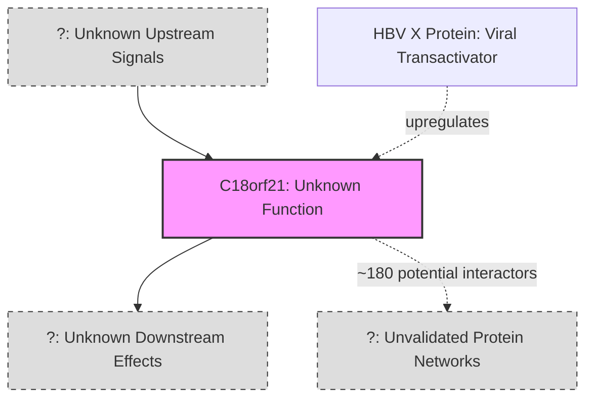

# Pathway Summary for C18orf21

## Overview
C18orf21 is an uncharacterized protein of the UPF0711 family with no defined pathway involvement. While originally identified as upregulated by Hepatitis B virus X protein (hence alias XTP13) and appearing in numerous CRISPR screens affecting cell fitness, its molecular function and pathway participation remain unknown [file:human/C18orf21/C18orf21-deep-research.md]. The protein contains a DUF4674 domain and shows both cytoplasmic and nuclear localization, but lacks any characterized biochemical activity or defined biological process involvement.

## Orphan Gene Status
C18orf21 represents an orphan gene with no established pathway connections. Despite evidence of protein expression and potential interactions with ~180 candidate proteins identified through affinity purification-mass spectrometry experiments [file:human/C18orf21/C18orf21-deep-research.md], no specific signaling cascades or metabolic pathways have been linked to this gene.

## Potential Viral Response Context
The only functional hint comes from its original identification as HBV X-transactivated protein 13 (XTP13), suggesting possible involvement in viral response pathways or cellular stress responses under HBV infection [file:human/C18orf21/C18orf21-deep-research.md]. However, the exact mechanism and pathway context remain undefined.

## Pathway Diagram

## Cellular Localization Pattern
C18orf21 is predicted to function intracellularly with localization in both cytoplasm and nucleus, potentially concentrating in nucleolar substructures [file:human/C18orf21/C18orf21-deep-research.md]. This subcellular distribution pattern suggests possible involvement in nuclear-cytoplasmic processes, though specific pathways remain unidentified.

## CRISPR Screen Phenotypes
The gene's repeated identification in CRISPR knockout screens implies participation in fundamental cellular networks essential for cell viability [file:human/C18orf21/C18orf21-deep-research.md], but the specific pathways affected have not been determined.

## Future Directions
Further experimental characterization is needed to:
- Identify validated protein interaction partners
- Determine the biochemical function of the DUF4674 domain
- Elucidate pathway involvement through functional studies
- Characterize the role in HBV infection response