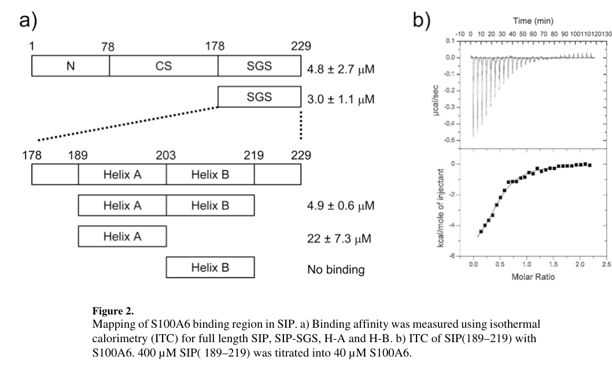

## Question

# Gene Research for Functional Annotation

## ⚠️ CRITICAL: Gene/Protein Identification Context

**BEFORE YOU BEGIN RESEARCH:** You MUST verify you are researching the CORRECT gene/protein. Gene symbols can be ambiguous, especially for less well-characterized genes from non-model organisms.

### Target Gene/Protein Identity (from UniProt):
- **UniProt Accession:** Q9HB71
- **Protein Description:** RecName: Full=Calcyclin-binding protein; Short=CacyBP; Short=hCacyBP; AltName: Full=S100A6-binding protein; AltName: Full=Siah-interacting protein;
- **Gene Information:** Name=CACYBP; Synonyms=S100A6BP, SIP; ORFNames=PNAS-107;
- **Organism (full):** Homo sapiens (Human).
- **Protein Family:** Not specified in UniProt
- **Key Domains:** CacyBP_N. (IPR037201); Calcyclin-binding_UBL-bridge. (IPR052289); CS_CacyBP. (IPR037893); CS_dom. (IPR007052); HSP20-like_chaperone. (IPR008978)

### MANDATORY VERIFICATION STEPS:

1. **Check if the gene symbol "CACYBP" matches the protein description above**
2. **Verify the organism is correct:** Homo sapiens (Human).
3. **Check if protein family/domains align with what you find in literature**
4. **If you find literature for a DIFFERENT gene with the same or similar symbol, STOP**

### If Gene Symbol is Ambiguous or You Cannot Find Relevant Literature:

**DO NOT PROCEED WITH RESEARCH ON A DIFFERENT GENE.** Instead:
- State clearly: "The gene symbol 'CACYBP' is ambiguous or literature is limited for this specific protein"
- Explain what you found (e.g., "Found extensive literature on a different gene with the same symbol in a different organism")
- Describe the protein based ONLY on the UniProt information provided above
- Suggest that the protein function can be inferred from domain/family information

### Research Target:

Please provide a comprehensive research report on the gene **CACYBP** (gene ID: CACYBP, UniProt: Q9HB71) in human.

The research report should be a detailed narrative explaining the function, biological processes, and localization of the gene product. Citations should be given for all claims.

You should prioritize authoritative reviews and primary scientific literature when conducting research. You can supplement
this with annotations you find in gene/protein databases, but these can be outdated or inaccurate.

We are specifically interested in the primary function of the gene - for enzymes, what reaction is catalyzed, and what is the substrate specificity? For transporters, what is the substrate? For structural proteins or adapters, what is the broader structural role? For signaling molecules, what is the role in the pathway.

We are interested in where in or outside the cell the gene product carries out its function.

We are also interested in the signaling or biochemical pathways in which the gene functions. We are less interested in broad pleiotropic effects, except where these elucidate the precise role.

Include evidence where possible. We are interested in both experimental evidence as well as inference from structure, evolution, or bioinformatic analysis. Precise studies should be prioritized over high-throughput, where available.

## Output

Question: You are an expert researcher providing comprehensive, well-cited information.

Provide detailed information focusing on:
1. Key concepts and definitions with current understanding
2. Recent developments and latest research (prioritize 2023-2024 sources)
3. Current applications and real-world implementations
4. Expert opinions and analysis from authoritative sources
5. Relevant statistics and data from recent studies

Format as a comprehensive research report with proper citations. Include URLs and publication dates where available.
Always prioritize recent, authoritative sources and provide specific citations for all major claims.

# Gene Research for Functional Annotation

## ⚠️ CRITICAL: Gene/Protein Identification Context

**BEFORE YOU BEGIN RESEARCH:** You MUST verify you are researching the CORRECT gene/protein. Gene symbols can be ambiguous, especially for less well-characterized genes from non-model organisms.

### Target Gene/Protein Identity (from UniProt):
- **UniProt Accession:** Q9HB71
- **Protein Description:** RecName: Full=Calcyclin-binding protein; Short=CacyBP; Short=hCacyBP; AltName: Full=S100A6-binding protein; AltName: Full=Siah-interacting protein;
- **Gene Information:** Name=CACYBP; Synonyms=S100A6BP, SIP; ORFNames=PNAS-107;
- **Organism (full):** Homo sapiens (Human).
- **Protein Family:** Not specified in UniProt
- **Key Domains:** CacyBP_N. (IPR037201); Calcyclin-binding_UBL-bridge. (IPR052289); CS_CacyBP. (IPR037893); CS_dom. (IPR007052); HSP20-like_chaperone. (IPR008978)

### MANDATORY VERIFICATION STEPS:

1. **Check if the gene symbol "CACYBP" matches the protein description above**
2. **Verify the organism is correct:** Homo sapiens (Human).
3. **Check if protein family/domains align with what you find in literature**
4. **If you find literature for a DIFFERENT gene with the same or similar symbol, STOP**

### If Gene Symbol is Ambiguous or You Cannot Find Relevant Literature:

**DO NOT PROCEED WITH RESEARCH ON A DIFFERENT GENE.** Instead:
- State clearly: "The gene symbol 'CACYBP' is ambiguous or literature is limited for this specific protein"
- Explain what you found (e.g., "Found extensive literature on a different gene with the same symbol in a different organism")
- Describe the protein based ONLY on the UniProt information provided above
- Suggest that the protein function can be inferred from domain/family information

### Research Target:

Please provide a comprehensive research report on the gene **CACYBP** (gene ID: CACYBP, UniProt: Q9HB71) in human.

The research report should be a detailed narrative explaining the function, biological processes, and localization of the gene product. Citations should be given for all claims.

You should prioritize authoritative reviews and primary scientific literature when conducting research. You can supplement
this with annotations you find in gene/protein databases, but these can be outdated or inaccurate.

We are specifically interested in the primary function of the gene - for enzymes, what reaction is catalyzed, and what is the substrate specificity? For transporters, what is the substrate? For structural proteins or adapters, what is the broader structural role? For signaling molecules, what is the role in the pathway.

We are interested in where in or outside the cell the gene product carries out its function.

We are also interested in the signaling or biochemical pathways in which the gene functions. We are less interested in broad pleiotropic effects, except where these elucidate the precise role.

Include evidence where possible. We are interested in both experimental evidence as well as inference from structure, evolution, or bioinformatic analysis. Precise studies should be prioritized over high-throughput, where available.

# Research Report: Human **CACYBP** (Calcyclin-binding protein; UniProt **Q9HB71**)

## 0) Target verification (mandatory)

The requested target is **human CACYBP** (UniProt **Q9HB71**), also widely referred to in the literature as **CacyBP/SIP** (calcyclin-binding protein / Siah-1–interacting protein) and as an **S100A6-binding protein**. Foundational structural and mechanistic studies define it as a **modular, multi-domain adaptor/scaffold protein** that binds **S100A6 (calcyclin)** in a **strictly Ca2+-dependent** manner and interfaces with **Siah-1** and **Skp1** in an **SCF-like E3 ubiquitin ligase** module (lee2008structureofthe pages 1-2, ning2012s100a6proteinnegatively pages 1-2). Because many early studies use mouse/rat tissues or rodent cell lines while using the same name/symbol, careful species/orthology checking is required; nevertheless, the molecular identity (S100A6 ligand; Siah-interacting; modular domains) is consistent across mammalian literature (wasik2013thecacybpsipprotein pages 1-2, filipek2018currentviewon pages 3-4).

## 1) Key concepts and current understanding (definitions + primary function)

### 1.1 What CACYBP is (conceptual definition)

**CACYBP** is best understood as a **Ca2+-regulated adaptor/scaffold** that integrates:

1) **Ca2+/S100 signaling** (via Ca2+-dependent binding to S100A6),
2) **ubiquitin-mediated proteostasis** (via association with Siah-1/Skp1-containing E3 ligase assemblies and modulation of β-catenin stability), and
3) **MAPK signaling control** (via reported phosphatase activity affecting ERK1/2-dependent transcriptional outputs) (filipek2018currentviewon pages 4-5, lee2008structureofthe pages 1-2, wasik2013thecacybpsipprotein pages 1-2).

Unlike enzymes with a well-defined small-molecule substrate, CACYBP’s “primary function” is **protein–protein interaction–driven scaffolding/regulation**, influencing substrate selection and signaling state through **complex assembly** and **post-translational modifications** (filipek2018currentviewon pages 4-5, lee2008structureofthe pages 1-2).

### 1.2 Domain architecture (mechanistic definition)

A key mechanistic advance is the domain-level mapping of CACYBP/SIP:

- **N-terminal helical hairpin domain** (M1–N78)
- **Central CS/p23-like domain** (Y79–K177)
- **C-terminal SGS region** (E178–F229), described as intrinsically disordered but forming helices upon binding S100A6 (lee2008structureofthe pages 1-2).

This architecture is depicted in the original structural paper’s figures (lee2008structureofthe media 3829c55f, lee2008structureofthe media 18fa429a).

### 1.3 Ca2+-dependent binding to S100A6 (calcyclin)

CACYBP/SIP was structurally characterized in complex with **Ca2+-loaded S100A6**, revealing that:

- S100A6 binds the **C-terminal SGS region** of SIP in a **strictly Ca2+-dependent** fashion.
- A **minimal binding fragment** mapped to **Ser189–Arg219**.
- NMR structural work shows this peptide adopts **two helices** that engage S100A6, including a **novel binding mode** across the S100A6 dimer interface (lee2008structureofthe pages 1-2).

These features support the view that CACYBP can act as a **Ca2+-regulated interaction hub** whose downstream effects may depend on intracellular Ca2+ and S100A6 activation state (lee2008structureofthe pages 1-2).

### 1.4 Ubiquitin–proteasome pathway: SCF-like E3 ligase module and β-catenin regulation

Multiple lines of evidence support CACYBP/SIP as a scaffold component in an **SCF-like E3 ubiquitin ligase context**:

- Structural/mechanistic framing proposes a **SCF-TBL1**–like E3 ligase assembly under genotoxic stress, with SIP/CACYBP linking **Siah-1** (E2-recruiting factor) to a **Skp1–TBL1** substrate-recruitment module, enabling **poly-ubiquitination and proteasome-dependent degradation of β-catenin** in a **phosphorylation-independent** manner (lee2008structureofthe pages 1-2).
- In gastric cancer models, CacyBP/SIP is described as part of an **Siah1–CacyBP/SIP–Skp1** E3 ligase complex promoting **degradation of unphosphorylated β-catenin**. Importantly, **proteasome inhibition (MG132)** reverses β-catenin reduction driven by a CacyBP/SIP construct lacking the S100-binding domain, supporting a **proteasome-dependent mechanism** (ning2012s100a6proteinnegatively pages 4-6).
- The same study provides domain mapping consistent with modular scaffolding: N-terminus for Siah1 binding, mid-region for Skp1 binding, and C-terminus for S100 binding; and demonstrates that removing the S100-binding domain can strengthen the anti-proliferative phenotype (ning2012s100a6proteinnegatively pages 1-2, ning2012s100a6proteinnegatively pages 4-6).

Collectively, current understanding supports CACYBP as a **regulator of β-catenin stability** via ubiquitin–proteasome complex assembly, with **S100A6 binding acting as a negative regulator** in some contexts (filipek2018currentviewon pages 4-5, ning2012s100a6proteinnegatively pages 4-6).

### 1.5 MAPK signaling: ERK1/2-associated phosphatase activity and regulation

CACYBP/SIP is repeatedly described as interacting with ERK1/2 and modulating downstream transcription:

- In neuroblastoma systems, CacyBP/SIP is reported to interact with **ERK1/2** and inhibit phosphorylation of **Elk-1**, an effect attributed to **CacyBP/SIP phosphatase activity toward ERK1/2** (wasik2013thecacybpsipprotein pages 1-2).
- A mechanistic review summarizes additional regulation by post-translational modifications: **PKC phosphorylation at Ser22/Thr23** increases phosphatase activity toward ERK1/2; **CKII phosphorylation at Thr184** is described, and Ca2+/S100A6 binding can inhibit Thr184 phosphorylation; **sumoylation at Lys16** also occurs (filipek2018currentviewon pages 4-5).

Taken together, CACYBP is positioned as a **signaling-state modulator** connecting Ca2+/S100 signaling and MAPK pathway output (filipek2018currentviewon pages 4-5, wasik2013thecacybpsipprotein pages 1-2).

### 1.6 Cytoskeleton interactions and cellular remodeling

CacyBP/SIP is a multi-ligand protein with reported binding partners including **tubulin, actin, tropomyosin, and tau** (filipek2018currentviewon pages 4-5, wasik2013thecacybpsipprotein pages 1-2). Reviews connect these interactions to neurite outgrowth, differentiation, and cytoskeletal organization (filipek2018currentviewon pages 3-4, filipek2018currentviewon pages 4-5). Although some of the most detailed cytoskeletal mechanistic primary papers were not directly retrievable in this run, the presence of these interactions is consistently cited and integrated into the functional model (ning2012s100a6proteinnegatively pages 8-8, filipek2018currentviewon pages 4-5).

## 2) Subcellular localization and where CACYBP acts in the cell

### 2.1 Basal localization and regulated translocation

CacyBP/SIP is described as **predominantly cytosolic** in mammalian cell models, but it can relocalize:

- A review summarizes that it can translocate to **perinuclear** regions and to the **nucleus** in response to increased intracellular **Ca2+**, **retinoic acid**, and **oxidative stress** (filipek2018currentviewon pages 4-5, filipek2018currentviewon pages 3-4).

### 2.2 SUMOylation and compartmentalization

Direct experimental evidence in NB2a cells shows that CacyBP/SIP is **SUMOylated**:

- CacyBP/SIP binds the SUMO E2 enzyme **Ubc9** and is SUMO1-modified.
- Mutational analysis identifies **Lys16** as the SUMO acceptor (K16R abolishes SUMOylation).
- Subcellular fractionation shows the SUMO-conjugated form (reported as an additional band at ~75 kDa) is present in the **cytoplasmic fraction** rather than the nuclear fraction, which is atypical for many SUMO-modified proteins (wasik2013thecacybpsipprotein pages 2-4, wasik2013thecacybpsipprotein pages 4-6).

### 2.3 Stress-related roles and nucleolar links

A review further connects CacyBP/SIP to stress response and nucleolar biology:

- Oxidative stressors (H2O2) and the Hsp90 inhibitor **radicicol** were reported to increase CacyBP/SIP protein levels by **~40–50%** in cited systems.
- CacyBP/SIP is described as required to maintain **NPM1** abundance and nucleolar structure under oxidative stress in NB2a cells (filipek2018currentviewon pages 5-6).

## 3) Recent developments (prioritizing 2023–2024)

### 3.1 2024 pan-cancer translational evidence: prognostic/predictive biomarker potential

A 2024 pan-cancer study (Mo et al., **Jan 2024**) compiled large TCGA/GTEx-centric analyses:

- **Sample sizes**: described as **18,787 total samples**, including **10,080** GTEx/TCGA-profiled samples (with TCGA: 9358 cancer, 722 controls) and GTEx normals (8671) (mo2024pananalysisrevealscacybp pages 1-2).
- **Expression patterns**: CACYBP upregulated in **14** cancer types and downregulated in **6** (P < 0.05) (mo2024pananalysisrevealscacybp pages 1-2).
- **Diagnostic performance**: CACYBP discriminated tumor vs normal with **AUC > 0.80** in **15/21** cancers; an overall AUC of **0.95 (95% CI 0.92–0.96)** is reported; some summaries note a **0.97** AUC (mo2024pananalysisrevealscacybp pages 5-10).
- **Clinical associations**: significant association with AJCC stage in nine cancers (P < 0.05) and multiple survival endpoints (OS/DSS/DFI/PFI) in cancer-type-specific directions (mo2024pananalysisrevealscacybp pages 5-10).
- **Immunogenomic context**: associations with **TMB**, **MSI**, neoantigen counts, and immune infiltration measures in selected tumor types (mo2024pananalysisrevealscacybp pages 5-10).
- **Protein-level validation**: Western blotting in **six paired LUAD** specimens showed higher CacyBP protein in tumor vs adjacent tissue (P < 0.05) (mo2024pananalysisrevealscacybp pages 1-2).

Interpretation: these data represent **real-world translational implementation** primarily as a **computational biomarker candidate** (diagnostic/prognostic/predictive), but causal mechanism remains context-dependent and requires targeted functional validation in each cancer type (mo2024pananalysisrevealscacybp pages 10-13).

### 3.2 2023 reviews on S100A6 biology integrate CACYBP as a central ligand/effector

Two 2023 reviews (International Journal of Molecular Sciences; Biomarker Research) synthesize S100A6 biology and repeatedly contextualize CacyBP/SIP as a key S100A6 ligand involved in intracellular networks, including competition with ERK1/2 for binding and the β-catenin ubiquitination axis (lesniak2023s100a6protein—expressionand pages 13-15, wang2023s100a6molecularfunction pages 1-2). These reviews function as **expert consensus summaries** that the S100A6–CACYBP interaction is Ca2+-dependent and mechanistically connected to broader proteostasis and signaling systems (wang2023s100a6molecularfunction pages 1-2, wang2023s100a6molecularfunction pages 11-12).

### 3.3 2024 neurodegeneration/proteostasis framing (expert review)

A 2024 review on Alzheimer’s disease chaperones positions CacyBP/SIP (discussed as an Hsp90 co-chaperone module) among proteins whose dysfunction is implicated in AD pathogenesis, within a broader discussion of proteostasis, Aβ toxicity, and tau aggregation as therapeutic targets (batko2024chaperones—anewclass pages 1-2). This source is **authoritative synthesis**, but the excerpt available in this run does not provide quantitative CACYBP-specific datasets.

## 4) Current applications and real-world implementations

### 4.1 Cancer biomarker research workflows

The Mo et al. 2024 study illustrates a typical modern pipeline for candidate biomarkers: combining TCGA/GTEx expression contrasts, survival modeling, ROC/AUC diagnostics, and immune deconvolution (TIMER/ESTIMATE) to nominate genes for follow-up (mo2024pananalysisrevealscacybp pages 1-2, mo2024pananalysisrevealscacybp pages 5-10). In real-world terms, CACYBP is being used as a **computationally derived candidate marker** and as a target for small-scale protein validation (mo2024pananalysisrevealscacybp pages 1-2).

### 4.2 Mechanism-informed cancer biology (β-catenin axis)

The gastric cancer study provides a mechanistic application that can inform functional annotation and therapeutic reasoning:

- Overexpression of CacyBP/SIP inhibited gastric cancer cell proliferation and tumorigenesis, and removing the S100-binding domain strengthened this phenotype.
- Effects on β-catenin and Tcf/LEF transcription were **proteasome-dependent**, as MG132 reversed β-catenin reduction (ning2012s100a6proteinnegatively pages 4-6).

This provides a concrete, mechanistically anchored use case of CACYBP as a **regulator of growth phenotypes via β-catenin proteostasis** (ning2012s100a6proteinnegatively pages 4-6).

### 4.3 Clinical trials and patents

- A search of ClinicalTrials.gov-style records returned **no clearly relevant interventional trials** directly targeting CACYBP (no relevant trials identified in the retrieved set).
- Patent retrieval in this run did not yield text evidence that the retrieved patents explicitly claim CACYBP as a core diagnostic marker or therapeutic target (no relevant evidence found in the extracted patent texts).

## 5) Expert opinions and synthesis (authoritative perspectives)

Expert review literature emphasizes that CacyBP/SIP sits at the intersection of **Ca2+-dependent S100 signaling**, **ubiquitin-mediated proteostasis**, **cytoskeletal remodeling**, and **stress response**. Reviews characterize it as a **multi-ligand, multi-domain hub** with context-dependent functional outputs, including regulated phosphatase activity and modulated participation in ubiquitin ligase assemblies; S100A6 binding is framed as a key regulatory input (filipek2018currentviewon pages 4-5, filipek2018currentviewon pages 3-4, wang2023s100a6molecularfunction pages 1-2).

## 6) Quantitative statistics and data highlights (recent + mechanistic)

- **Pan-cancer dataset sizes**: 18,787 total samples; 10,080 GTEx/TCGA-profiled samples (TCGA 9358 cancer, 722 controls; GTEx 8671 normals) (mo2024pananalysisrevealscacybp pages 1-2).
- **Diagnostic ROC performance**: overall AUC **0.95 (95% CI 0.92–0.96)** across 21 cancer types; AUC > 0.80 in 15/21 cancers (mo2024pananalysisrevealscacybp pages 5-10).
- **Protein-level validation**: n = **6 paired LUAD** specimens with higher CacyBP protein in tumor vs adjacent tissue (P < 0.05) (mo2024pananalysisrevealscacybp pages 1-2).
- **SUMOylation biochemical readout**: SUMO-conjugated CacyBP band observed at ~**75 kDa** and enriched in **cytoplasmic fraction**; K16R mutant abolishes this modification (wasik2013thecacybpsipprotein pages 2-4, wasik2013thecacybpsipprotein pages 4-6).
- **Stress-induced abundance change**: CacyBP/SIP protein level reportedly increases **~40–50%** under H2O2/radicicol conditions in cited systems (filipek2018currentviewon pages 5-6).

## 7) Visual evidence (structural/domain mapping)

The structural paper’s figures provide direct visual support for CACYBP’s modular architecture and S100A6 binding geometry:

- Domain schematic and mapping of S100A6-binding helices in the SGS region (lee2008structureofthe media 3829c55f)
- NMR structure of Ca2+-S100A6 dimer bound to SIP(189–219) peptides (lee2008structureofthe media 18fa429a)

## 8) Summary for functional annotation (concise)

**CACYBP (Q9HB71)** is a **cytosolic, Ca2+-responsive scaffold/adaptor** that binds **S100A6** via its C-terminal SGS region and participates in protein complex assembly affecting **β-catenin ubiquitin–proteasome turnover** and **MAPK (ERK1/2) signaling output**, with additional interactions with cytoskeletal proteins and stress/nucleolar pathways. Its regulated localization (cytosol ↔ perinuclear/nucleus) and PTMs (notably **SUMOylation at Lys16**) support dynamic, condition-dependent functions. Recent 2024 large-scale analyses highlight CACYBP’s potential value as a **multi-cancer diagnostic/prognostic marker** (lee2008structureofthe pages 1-2, ning2012s100a6proteinnegatively pages 4-6, wasik2013thecacybpsipprotein pages 1-2, filipek2018currentviewon pages 4-5, wasik2013thecacybpsipprotein pages 2-4, mo2024pananalysisrevealscacybp pages 5-10).

---

## Key sources (URLs; publication dates)

- Lee Y-T et al. **Biochemistry** (Oct 2008). *Structure of the S100A6 complex with a fragment from the C-terminal domain of Siah-1 interacting protein.* https://doi.org/10.1021/bi801233z (lee2008structureofthe pages 1-2)
- Ning X et al. **PLOS ONE** (Jan 2012). *S100A6 negatively regulates CacyBP/SIP-mediated inhibition of gastric cancer proliferation and tumorigenesis.* https://doi.org/10.1371/journal.pone.0030185 (ning2012s100a6proteinnegatively pages 4-6)
- Wasik U, Filipek A. **Neurochemical Research** (Sep 2013). *The CacyBP/SIP protein is sumoylated in neuroblastoma NB2a cells.* https://doi.org/10.1007/s11064-013-1155-4 (wasik2013thecacybpsipprotein pages 2-4)
- Filipek A, Leśniak W. **Postępy Biochemii** (Dec 2018). *Current view on cellular function of S100A6 and its ligands, CacyBP/SIP and Sgt1.* https://doi.org/10.18388/pb.2018_136 (filipek2018currentviewon pages 4-5)
- Wang Y et al. **Biomarker Research** (Sep 2023). *S100A6: molecular function and biomarker role.* https://doi.org/10.1186/s40364-023-00515-3 (wang2023s100a6molecularfunction pages 1-2)
- Leśniak W, Filipek A. **Int J Mol Sci** (Jan 2023). *S100A6 Protein—Expression and Function in Norm and Pathology.* https://doi.org/10.3390/ijms24021341 (lesniak2023s100a6protein—expressionand pages 13-15)
- Mo B et al. **Am J Transl Res** (Jan 2024). *Pan-analysis reveals CACYBP to be a novel prognostic and predictive marker for multiple cancers.* https://doi.org/10.62347/owvw7440 (mo2024pananalysisrevealscacybp pages 1-2)
- Batko J et al. **Int J Mol Sci** (Mar 2024). *Chaperones—A New Class of Potential Therapeutic Targets in Alzheimer’s Disease.* https://doi.org/10.3390/ijms25063401 (batko2024chaperones—anewclass pages 1-2)

| Major functional role | Mechanism / complexes | Key partners | Evidence type | Key citations (with year) |
|---|---|---|---|---|
| S100A6 Ca2+-dependent binding and domain mapping | CACYBP/CacyBP-SIP is a modular adaptor with N-terminal helical hairpin, central CS/p23-like domain, and C-terminal SGS region; S100A6 binds the C-terminal SGS region in a strictly Ca2+-dependent manner. Structural mapping localized a minimal S100A6-binding segment to Ser189-Arg219, with two helices engaging the S100A6 dimer, including a novel interface-spanning mode. | S100A6 (calcyclin); SGS/C-terminal region of CACYBP | Structural (NMR/PDB), biochemical (ITC, mutagenesis), cell-based functional assays | Lee et al., 2008; S100A6/CACYBP reviews 2018, 2023 (lee2008structureofthe pages 1-2, filipek2018currentviewon pages 1-2, wang2023s100a6molecularfunction pages 1-2) |
| SCF-TBL1 / Siah1 / Skp1 involvement and beta-catenin degradation | CACYBP/SIP functions as a scaffold in a putative SCF-like E3 ligase (often termed SCF-TBL1), linking Siah1 and Skp1/TBL1 modules and promoting ubiquitin-proteasome degradation of non-phosphorylated beta-catenin. S100A6 binding can antagonize this anti-beta-catenin function; deletion of the S100-binding region strengthens beta-catenin loss and growth suppression. | Siah1, Skp1, TBL1, beta-catenin, S100A6 | Structural, biochemical (co-IP, proteasome inhibition), cell assays (reporters, proliferation), animal xenograft | Lee et al., 2008; Ning et al., 2012; reviews 2018, 2023 (lee2008structureofthe pages 1-2, ning2012s100a6proteinnegatively pages 1-2, ning2012s100a6proteinnegatively pages 4-6, filipek2018currentviewon pages 4-5, wang2023s100a6molecularfunction pages 11-12) |
| ERK1/2 (and p38/tau) phosphatase activity, regulated by phosphorylation and S100A6 | CACYBP/SIP binds ERK1/2 and lowers downstream Elk-1 phosphorylation; review evidence also supports activity toward p38 and tau. Activity is modulated by PKC phosphorylation at Ser22/Thr23 (enhancing ERK1/2 phosphatase activity), CKII phosphorylation at Thr184, and Ca2+/S100A6 binding, which can inhibit Thr184 phosphorylation and alter phosphatase output. | ERK1/2, Elk-1, p38, tau, PKC, CKII, S100A6 | Biochemical, cell-based signaling assays, review synthesis of mechanistic studies | Wasik & Filipek, 2013; Filipek & Leśniak, 2018; S100A6 reviews 2023 (wasik2013thecacybpsipprotein pages 1-2, filipek2018currentviewon pages 4-5) |
| Cytoskeleton organization and neuronal/cell-shape functions | CACYBP/SIP binds cytoskeletal proteins and is proposed to couple microtubule and actin systems; reported roles include tubulin assembly/transport, actin polymerization, and tau association/co-localization, consistent with functions in neurite outgrowth and differentiation. | Tubulin, actin, tropomyosin, tau | Biochemical binding, cell imaging/localization, functional cell assays, review synthesis | Reviews 2018 and 2012 source synthesis; SUMO paper context 2013 (filipek2018currentviewon pages 3-4, ning2012s100a6proteinnegatively pages 8-8, wasik2013thecacybpsipprotein pages 1-2) |
| Stress, nucleolar roles, localization control, and SUMOylation at K16 | CACYBP/SIP is mainly cytosolic but can relocalize to perinuclear/nuclear compartments after increased intracellular Ca2+, retinoic acid, or oxidative stress. It interacts with nucleolar protein NPM1 and contributes to nucleolar integrity/stress responses. It is SUMOylated by Ubc9 at Lys16; the SUMO-conjugated form is unusually enriched in cytoplasm, and stress can raise CACYBP/SIP levels by ~40-50% in reported systems. | Ubc9, SUMO1, NPM1, S100A6, stress pathways | Biochemical (co-IP, mutagenesis, fractionation), cell localization, stress-response assays | Wasik & Filipek, 2013; Filipek & Leśniak, 2018 (wasik2013thecacybpsipprotein pages 1-2, wasik2013thecacybpsipprotein pages 2-4, wasik2013thecacybpsipprotein pages 4-6, filipek2018currentviewon pages 4-5, filipek2018currentviewon pages 5-6) |
| 2024 pan-cancer biomarker findings | Large integrative pan-cancer analysis found broad CACYBP dysregulation and prognostic/immune associations. Dataset comprised 18,787 samples overall, including 10,080 GTEx/TCGA-profiled samples in one analysis summary; CACYBP was upregulated in 14 cancers, associated with prognosis in 13 cancers, and discriminated 15 cancers with AUC > 0.80; overall AUC was reported as 0.95 (95% CI 0.92-0.96), with some summaries noting 0.97; six paired LUAD samples provided protein-level validation. | Multi-cancer cohorts, immune infiltration metrics, TMB, MSI, LUAD validation samples | Clinical-omics / bioinformatics with limited wet-lab validation | Mo et al., 2024 (mo2024pananalysisrevealscacybp pages 5-10, mo2024pananalysisrevealscacybp pages 1-2, mo2024pananalysisrevealscacybp pages 13-14, mo2024pananalysisrevealscacybp pages 10-13) |

*Table: This table summarizes the major experimentally supported and emerging roles of human CACYBP/CacyBP-SIP, organized by mechanism, partners, evidence type, and key citations. It is useful as a compact functional annotation reference spanning core biochemistry through recent 2024 translational findings.*

References

1. (lee2008structureofthe pages 1-2): Young-Tae Lee, Yoana N. Dimitrova, Gabriela Schneider, Whitney B. Ridenour, Shibani Bhattacharya, Sarah E. Soss, Richard M. Caprioli, Anna Filipek, and Walter J. Chazin. Structure of the s100a6 complex with a fragment from the c-terminal domain of siah-1 interacting protein: a novel mode for s100 protein target recognition. Biochemistry, 47 41:10921-32, Oct 2008. URL: https://doi.org/10.1021/bi801233z, doi:10.1021/bi801233z. This article has 80 citations and is from a peer-reviewed journal.

2. (ning2012s100a6proteinnegatively pages 1-2): Xiaoxuan Ning, Shiren Sun, Kun Zhang, Jie Liang, Yucai Chuai, Yuan Li, and Xiaoming Wang. S100a6 protein negatively regulates cacybp/sip-mediated inhibition of gastric cancer cell proliferation and tumorigenesis. PLoS ONE, 7:e30185, Jan 2012. URL: https://doi.org/10.1371/journal.pone.0030185, doi:10.1371/journal.pone.0030185. This article has 54 citations and is from a peer-reviewed journal.

3. (wasik2013thecacybpsipprotein pages 1-2): Urszula Wasik and Anna Filipek. The cacybp/sip protein is sumoylated in neuroblastoma nb2a cells. Neurochemical Research, 38:2427-2432, Sep 2013. URL: https://doi.org/10.1007/s11064-013-1155-4, doi:10.1007/s11064-013-1155-4. This article has 11 citations and is from a peer-reviewed journal.

4. (filipek2018currentviewon pages 3-4): Anna Filipek and Wiesława Leśniak. Current view on cellular function of s100a6 and its ligands, cacybp/sip and sgt1. Postepy biochemii, 64 3:242-252, Dec 2018. URL: https://doi.org/10.18388/pb.2018\_136, doi:10.18388/pb.2018\_136. This article has 19 citations.

5. (filipek2018currentviewon pages 4-5): Anna Filipek and Wiesława Leśniak. Current view on cellular function of s100a6 and its ligands, cacybp/sip and sgt1. Postepy biochemii, 64 3:242-252, Dec 2018. URL: https://doi.org/10.18388/pb.2018\_136, doi:10.18388/pb.2018\_136. This article has 19 citations.

6. (lee2008structureofthe media 3829c55f): Young-Tae Lee, Yoana N. Dimitrova, Gabriela Schneider, Whitney B. Ridenour, Shibani Bhattacharya, Sarah E. Soss, Richard M. Caprioli, Anna Filipek, and Walter J. Chazin. Structure of the s100a6 complex with a fragment from the c-terminal domain of siah-1 interacting protein: a novel mode for s100 protein target recognition. Biochemistry, 47 41:10921-32, Oct 2008. URL: https://doi.org/10.1021/bi801233z, doi:10.1021/bi801233z. This article has 80 citations and is from a peer-reviewed journal.

7. (lee2008structureofthe media 18fa429a): Young-Tae Lee, Yoana N. Dimitrova, Gabriela Schneider, Whitney B. Ridenour, Shibani Bhattacharya, Sarah E. Soss, Richard M. Caprioli, Anna Filipek, and Walter J. Chazin. Structure of the s100a6 complex with a fragment from the c-terminal domain of siah-1 interacting protein: a novel mode for s100 protein target recognition. Biochemistry, 47 41:10921-32, Oct 2008. URL: https://doi.org/10.1021/bi801233z, doi:10.1021/bi801233z. This article has 80 citations and is from a peer-reviewed journal.

8. (ning2012s100a6proteinnegatively pages 4-6): Xiaoxuan Ning, Shiren Sun, Kun Zhang, Jie Liang, Yucai Chuai, Yuan Li, and Xiaoming Wang. S100a6 protein negatively regulates cacybp/sip-mediated inhibition of gastric cancer cell proliferation and tumorigenesis. PLoS ONE, 7:e30185, Jan 2012. URL: https://doi.org/10.1371/journal.pone.0030185, doi:10.1371/journal.pone.0030185. This article has 54 citations and is from a peer-reviewed journal.

9. (ning2012s100a6proteinnegatively pages 8-8): Xiaoxuan Ning, Shiren Sun, Kun Zhang, Jie Liang, Yucai Chuai, Yuan Li, and Xiaoming Wang. S100a6 protein negatively regulates cacybp/sip-mediated inhibition of gastric cancer cell proliferation and tumorigenesis. PLoS ONE, 7:e30185, Jan 2012. URL: https://doi.org/10.1371/journal.pone.0030185, doi:10.1371/journal.pone.0030185. This article has 54 citations and is from a peer-reviewed journal.

10. (wasik2013thecacybpsipprotein pages 2-4): Urszula Wasik and Anna Filipek. The cacybp/sip protein is sumoylated in neuroblastoma nb2a cells. Neurochemical Research, 38:2427-2432, Sep 2013. URL: https://doi.org/10.1007/s11064-013-1155-4, doi:10.1007/s11064-013-1155-4. This article has 11 citations and is from a peer-reviewed journal.

11. (wasik2013thecacybpsipprotein pages 4-6): Urszula Wasik and Anna Filipek. The cacybp/sip protein is sumoylated in neuroblastoma nb2a cells. Neurochemical Research, 38:2427-2432, Sep 2013. URL: https://doi.org/10.1007/s11064-013-1155-4, doi:10.1007/s11064-013-1155-4. This article has 11 citations and is from a peer-reviewed journal.

12. (filipek2018currentviewon pages 5-6): Anna Filipek and Wiesława Leśniak. Current view on cellular function of s100a6 and its ligands, cacybp/sip and sgt1. Postepy biochemii, 64 3:242-252, Dec 2018. URL: https://doi.org/10.18388/pb.2018\_136, doi:10.18388/pb.2018\_136. This article has 19 citations.

13. (mo2024pananalysisrevealscacybp pages 1-2): Baosen Mo, Bijun Luo, and Yuesong Wu. Pan-analysis reveals cacybp to be a novel prognostic and predictive marker for multiple cancers. American journal of translational research, 16 1:12-26, Jan 2024. URL: https://doi.org/10.62347/owvw7440, doi:10.62347/owvw7440. This article has 6 citations and is from a peer-reviewed journal.

14. (mo2024pananalysisrevealscacybp pages 5-10): Baosen Mo, Bijun Luo, and Yuesong Wu. Pan-analysis reveals cacybp to be a novel prognostic and predictive marker for multiple cancers. American journal of translational research, 16 1:12-26, Jan 2024. URL: https://doi.org/10.62347/owvw7440, doi:10.62347/owvw7440. This article has 6 citations and is from a peer-reviewed journal.

15. (mo2024pananalysisrevealscacybp pages 10-13): Baosen Mo, Bijun Luo, and Yuesong Wu. Pan-analysis reveals cacybp to be a novel prognostic and predictive marker for multiple cancers. American journal of translational research, 16 1:12-26, Jan 2024. URL: https://doi.org/10.62347/owvw7440, doi:10.62347/owvw7440. This article has 6 citations and is from a peer-reviewed journal.

16. (lesniak2023s100a6protein—expressionand pages 13-15): Wiesława Leśniak and Anna Filipek. S100a6 protein—expression and function in norm and pathology. International Journal of Molecular Sciences, 24:1341, Jan 2023. URL: https://doi.org/10.3390/ijms24021341, doi:10.3390/ijms24021341. This article has 30 citations.

17. (wang2023s100a6molecularfunction pages 1-2): Yidian Wang, Xuewen Kang, Xin Kang, and Fengguang Yang. S100a6: molecular function and biomarker role. Biomarker Research, Sep 2023. URL: https://doi.org/10.1186/s40364-023-00515-3, doi:10.1186/s40364-023-00515-3. This article has 54 citations and is from a peer-reviewed journal.

18. (wang2023s100a6molecularfunction pages 11-12): Yidian Wang, Xuewen Kang, Xin Kang, and Fengguang Yang. S100a6: molecular function and biomarker role. Biomarker Research, Sep 2023. URL: https://doi.org/10.1186/s40364-023-00515-3, doi:10.1186/s40364-023-00515-3. This article has 54 citations and is from a peer-reviewed journal.

19. (batko2024chaperones—anewclass pages 1-2): Joanna Batko, Katarzyna Antosz, Weronika Miśków, Magdalena Pszczołowska, Kamil Walczak, and Jerzy Leszek. Chaperones—a new class of potential therapeutic targets in alzheimer’s disease. International Journal of Molecular Sciences, 25:3401, Mar 2024. URL: https://doi.org/10.3390/ijms25063401, doi:10.3390/ijms25063401. This article has 41 citations.

20. (filipek2018currentviewon pages 1-2): Anna Filipek and Wiesława Leśniak. Current view on cellular function of s100a6 and its ligands, cacybp/sip and sgt1. Postepy biochemii, 64 3:242-252, Dec 2018. URL: https://doi.org/10.18388/pb.2018\_136, doi:10.18388/pb.2018\_136. This article has 19 citations.

21. (mo2024pananalysisrevealscacybp pages 13-14): Baosen Mo, Bijun Luo, and Yuesong Wu. Pan-analysis reveals cacybp to be a novel prognostic and predictive marker for multiple cancers. American journal of translational research, 16 1:12-26, Jan 2024. URL: https://doi.org/10.62347/owvw7440, doi:10.62347/owvw7440. This article has 6 citations and is from a peer-reviewed journal.

## Artifacts

- [Edison artifact artifact-00](CACYBP-deep-research-falcon_artifacts/artifact-00.md)

## Citations

1. lee2008structureofthe pages 1-2
2. wasik2013thecacybpsipprotein pages 1-2
3. filipek2018currentviewon pages 4-5
4. filipek2018currentviewon pages 5-6
5. mo2024pananalysisrevealscacybp pages 1-2
6. mo2024pananalysisrevealscacybp pages 5-10
7. mo2024pananalysisrevealscacybp pages 10-13
8. wasik2013thecacybpsipprotein pages 2-4
9. filipek2018currentviewon pages 3-4
10. wasik2013thecacybpsipprotein pages 4-6
11. filipek2018currentviewon pages 1-2
12. mo2024pananalysisrevealscacybp pages 13-14
13. https://doi.org/10.1021/bi801233z
14. https://doi.org/10.1371/journal.pone.0030185
15. https://doi.org/10.1007/s11064-013-1155-4
16. https://doi.org/10.18388/pb.2018_136
17. https://doi.org/10.1186/s40364-023-00515-3
18. https://doi.org/10.3390/ijms24021341
19. https://doi.org/10.62347/owvw7440
20. https://doi.org/10.3390/ijms25063401
21. https://doi.org/10.1021/bi801233z,
22. https://doi.org/10.1371/journal.pone.0030185,
23. https://doi.org/10.1007/s11064-013-1155-4,
24. https://doi.org/10.18388/pb.2018\_136,
25. https://doi.org/10.62347/owvw7440,
26. https://doi.org/10.3390/ijms24021341,
27. https://doi.org/10.1186/s40364-023-00515-3,
28. https://doi.org/10.3390/ijms25063401,