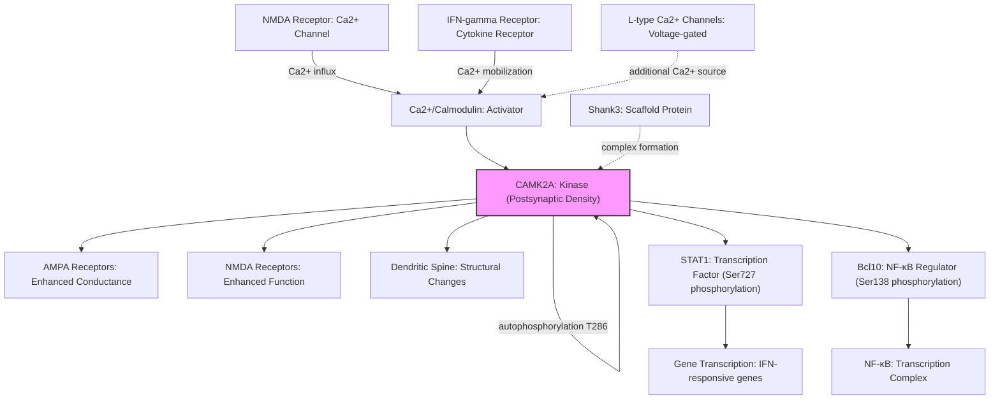

# Pathway Summary for CAMK2A

## Overview
CAMK2A encodes the alpha subunit of Ca2+/calmodulin-dependent protein kinase II (CaMKII), a central molecular switch in synaptic plasticity and memory formation. The kinase responds to calcium influx through NMDA receptors and undergoes autophosphorylation at Thr286, generating Ca2+-independent activity that persists after calcium levels return to baseline [PMID:28130356]. This unique property allows CAMK2A to store a molecular memory of synaptic activity, making it essential for long-term potentiation and learning.

## Core Signaling Pathways

### Synaptic Plasticity and LTP Pathway
CAMK2A is the primary effector of activity-dependent synaptic strengthening. Upon NMDA receptor activation and Ca2+ influx, Ca2+/calmodulin binds to CAMK2A, triggering kinase activation and autophosphorylation [PMID:28130356]. The activated kinase phosphorylates multiple synaptic substrates including AMPA and NMDA receptor subunits to enhance excitatory synaptic transmission [PMID:28130356, PMID:19453375].

### JAK-STAT Signaling Pathway
CAMK2A participates in interferon signaling by directly phosphorylating STAT1 at Ser727 in response to IFN-gamma [PMID:11972023]. This phosphorylation is required for maximal transcriptional activation of interferon-responsive genes. IFN-gamma induces rapid Ca2+ flux that activates CAMK2A, and inhibition of the kinase prevents STAT1 Ser727 phosphorylation and downstream gene activation [PMID:11972023].

### NF-κB Signaling Regulation
CAMK2A phosphorylates Bcl10 at Ser138, modulating NF-κB signaling cascades [PMID:17052756]. This phosphorylation event links calcium signaling to inflammatory and immune responses.

## Pathway Diagram

## Upstream Regulators
- **Calcium sources**: NMDA receptors (primary), L-type voltage-gated calcium channels, internal Ca2+ stores [PMID:28130356, PMID:11972023]
- **Calmodulin**: Essential Ca2+ sensor that activates CAMK2A upon calcium binding [PMID:20668654]
- **Cytokine receptors**: IFN-gamma receptor triggers Ca2+ mobilization for CAMK2A activation [PMID:11972023]

## Downstream Targets
- **Synaptic receptors**: AMPA receptor subunits (GluA1), NMDA receptor subunits (GluN2B/NR2B) [PMID:28130356, PMID:19453375]
- **Transcription factors**: STAT1 (Ser727), supporting interferon responses [PMID:11972023]
- **Signaling adaptors**: Bcl10 (Ser138), regulating NF-κB pathway [PMID:17052756]
- **Structural proteins**: Various postsynaptic density components affecting spine morphology [PMID:28130356]

## Clinical Significance
Mutations in CAMK2A cause intellectual disability (MRD53) and autism spectrum disorder. The E183V mutation identified in ASD patients reduces kinase activity, acts in a dominant-negative manner, and disrupts synaptic transmission [PMID:28130356]. This leads to decreased spine density, altered dendritic morphology, and behavioral phenotypes including hyperactivity, social deficits, and repetitive behaviors [PMID:28130356].

## Holoenzyme Assembly and Cooperative Activation
CAMK2A assembles into dodecameric holoenzymes that enable cooperative activation and intersubunit autophosphorylation [PMID:28130356]. This quaternary structure is essential for the kinase's function as a molecular switch, allowing sustained activity after transient calcium signals.

## Cross-pathway Integration
CAMK2A serves as a critical integration point between:
- Neuronal activity and synaptic strength (LTP pathway)
- Calcium signaling and immune responses (JAK-STAT pathway)
- Synaptic activity and inflammatory signaling (NF-κB pathway)

This positions CAMK2A as a master regulator linking neuronal plasticity with broader cellular signaling networks.