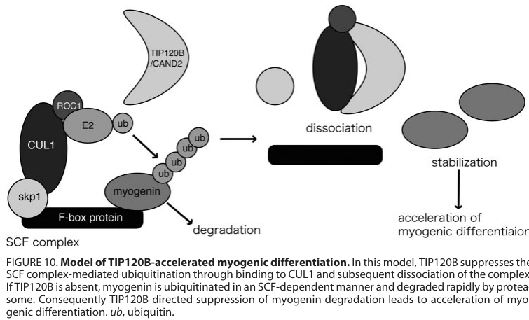

## Question

# Gene Research for Functional Annotation

## ⚠️ CRITICAL: Gene/Protein Identification Context

**BEFORE YOU BEGIN RESEARCH:** You MUST verify you are researching the CORRECT gene/protein. Gene symbols can be ambiguous, especially for less well-characterized genes from non-model organisms.

### Target Gene/Protein Identity (from UniProt):
- **UniProt Accession:** O75155
- **Protein Description:** RecName: Full=Cullin-associated NEDD8-dissociated protein 2; AltName: Full=Cullin-associated and neddylation-dissociated protein 2; AltName: Full=Epididymis tissue protein Li 169; AltName: Full=TBP-interacting protein of 120 kDa B; Short=TBP-interacting protein 120B; AltName: Full=p120 CAND2;
- **Gene Information:** Name=CAND2; Synonyms=KIAA0667, TIP120B;
- **Organism (full):** Homo sapiens (Human).
- **Protein Family:** Belongs to the CAND family. .
- **Key Domains:** ARM-like. (IPR011989); ARM-type_fold. (IPR016024); CAND1/CAND2. (IPR039852); TATA-bd_TIP120. (IPR013932); HEAT_EZ (PF13513)

### MANDATORY VERIFICATION STEPS:

1. **Check if the gene symbol "CAND2" matches the protein description above**
2. **Verify the organism is correct:** Homo sapiens (Human).
3. **Check if protein family/domains align with what you find in literature**
4. **If you find literature for a DIFFERENT gene with the same or similar symbol, STOP**

### If Gene Symbol is Ambiguous or You Cannot Find Relevant Literature:

**DO NOT PROCEED WITH RESEARCH ON A DIFFERENT GENE.** Instead:
- State clearly: "The gene symbol 'CAND2' is ambiguous or literature is limited for this specific protein"
- Explain what you found (e.g., "Found extensive literature on a different gene with the same symbol in a different organism")
- Describe the protein based ONLY on the UniProt information provided above
- Suggest that the protein function can be inferred from domain/family information

### Research Target:

Please provide a comprehensive research report on the gene **CAND2** (gene ID: CAND2, UniProt: O75155) in human.

The research report should be a detailed narrative explaining the function, biological processes, and localization of the gene product. Citations should be given for all claims.

You should prioritize authoritative reviews and primary scientific literature when conducting research. You can supplement
this with annotations you find in gene/protein databases, but these can be outdated or inaccurate.

We are specifically interested in the primary function of the gene - for enzymes, what reaction is catalyzed, and what is the substrate specificity? For transporters, what is the substrate? For structural proteins or adapters, what is the broader structural role? For signaling molecules, what is the role in the pathway.

We are interested in where in or outside the cell the gene product carries out its function.

We are also interested in the signaling or biochemical pathways in which the gene functions. We are less interested in broad pleiotropic effects, except where these elucidate the precise role.

Include evidence where possible. We are interested in both experimental evidence as well as inference from structure, evolution, or bioinformatic analysis. Precise studies should be prioritized over high-throughput, where available.

## Output

Question: You are an expert researcher providing comprehensive, well-cited information.

Provide detailed information focusing on:
1. Key concepts and definitions with current understanding
2. Recent developments and latest research (prioritize 2023-2024 sources)
3. Current applications and real-world implementations
4. Expert opinions and analysis from authoritative sources
5. Relevant statistics and data from recent studies

Format as a comprehensive research report with proper citations. Include URLs and publication dates where available.
Always prioritize recent, authoritative sources and provide specific citations for all major claims.

# Gene Research for Functional Annotation

## ⚠️ CRITICAL: Gene/Protein Identification Context

**BEFORE YOU BEGIN RESEARCH:** You MUST verify you are researching the CORRECT gene/protein. Gene symbols can be ambiguous, especially for less well-characterized genes from non-model organisms.

### Target Gene/Protein Identity (from UniProt):
- **UniProt Accession:** O75155
- **Protein Description:** RecName: Full=Cullin-associated NEDD8-dissociated protein 2; AltName: Full=Cullin-associated and neddylation-dissociated protein 2; AltName: Full=Epididymis tissue protein Li 169; AltName: Full=TBP-interacting protein of 120 kDa B; Short=TBP-interacting protein 120B; AltName: Full=p120 CAND2;
- **Gene Information:** Name=CAND2; Synonyms=KIAA0667, TIP120B;
- **Organism (full):** Homo sapiens (Human).
- **Protein Family:** Belongs to the CAND family. .
- **Key Domains:** ARM-like. (IPR011989); ARM-type_fold. (IPR016024); CAND1/CAND2. (IPR039852); TATA-bd_TIP120. (IPR013932); HEAT_EZ (PF13513)

### MANDATORY VERIFICATION STEPS:

1. **Check if the gene symbol "CAND2" matches the protein description above**
2. **Verify the organism is correct:** Homo sapiens (Human).
3. **Check if protein family/domains align with what you find in literature**
4. **If you find literature for a DIFFERENT gene with the same or similar symbol, STOP**

### If Gene Symbol is Ambiguous or You Cannot Find Relevant Literature:

**DO NOT PROCEED WITH RESEARCH ON A DIFFERENT GENE.** Instead:
- State clearly: "The gene symbol 'CAND2' is ambiguous or literature is limited for this specific protein"
- Explain what you found (e.g., "Found extensive literature on a different gene with the same symbol in a different organism")
- Describe the protein based ONLY on the UniProt information provided above
- Suggest that the protein function can be inferred from domain/family information

### Research Target:

Please provide a comprehensive research report on the gene **CAND2** (gene ID: CAND2, UniProt: O75155) in human.

The research report should be a detailed narrative explaining the function, biological processes, and localization of the gene product. Citations should be given for all claims.

You should prioritize authoritative reviews and primary scientific literature when conducting research. You can supplement
this with annotations you find in gene/protein databases, but these can be outdated or inaccurate.

We are specifically interested in the primary function of the gene - for enzymes, what reaction is catalyzed, and what is the substrate specificity? For transporters, what is the substrate? For structural proteins or adapters, what is the broader structural role? For signaling molecules, what is the role in the pathway.

We are interested in where in or outside the cell the gene product carries out its function.

We are also interested in the signaling or biochemical pathways in which the gene functions. We are less interested in broad pleiotropic effects, except where these elucidate the precise role.

Include evidence where possible. We are interested in both experimental evidence as well as inference from structure, evolution, or bioinformatic analysis. Precise studies should be prioritized over high-throughput, where available.

## Comprehensive research report: Human **CAND2** (UniProt **O75155**; gene **CAND2**, synonyms **TIP120B/KIAA0667**) 

### 0) Target verification (critical disambiguation)
The UniProt accession **O75155** corresponds to human **CAND2**, also called **TIP120B**, described as “cullin-associated and neddylation-dissociated protein 2.” Primary literature explicitly equates TIP120B with CAND2 and places it in the **CAND family** of large HEAT/ARM-repeat cullin-binding proteins involved in **cullin-RING ligase (CRL)** regulation (not an enzyme itself). The founding cullin-binding work also identifies **CAND2/TIP120B** as the muscle-enriched homolog of CAND1, consistent with the UniProt description (liu2002nedd8modificationof pages 1-2, shiraishi2007tbpinteractingprotein120b pages 1-2).

### 1) Key concepts and definitions (current understanding)

#### 1.1 Cullin-RING ligases (CRLs) and SCF complexes
CRLs are modular E3 ubiquitin ligases built around a **cullin scaffold** (e.g., **CUL1**) and a RING protein (e.g., **RBX1**) that recruits E2~ubiquitin, while variable substrate receptor modules provide target specificity. For the canonical **SCF** complex, **SKP1** links **CUL1–RBX1** to one of many **F-box proteins**, enabling recognition of specific substrates (wang2025molecularmechanismsof pages 1-2).

#### 1.2 Neddylation/deneddylation cycle (NEDD8 and CSN) and where CAND proteins fit
A central regulatory circuit for CRLs is the **NEDD8 cycle**:
- **Neddylation** (conjugation of NEDD8 to a cullin) promotes CRL activation.
- **Deneddylation** is catalyzed by the **COP9 signalosome (CSN)**, reversing NEDD8 attachment and shifting CRLs toward states compatible with remodeling.
CAND-family proteins (classically CAND1, by inference also CAND2) preferentially associate with **unneddylated** cullins; structural/mechanistic work emphasizes that **CAND-bound cullins cannot be neddylated**, and **neddylated cullins do not stably bind CAND** (wang2024cand1inhibitscullin2ring pages 1-3). Reviews integrate this into a dynamic model in which CSN-dependent deneddylation enables CAND-dependent remodeling/exchange of substrate receptor modules (harper2021cullinringubiquitinligase pages 20-21, zhang2024proteinneddylationand pages 8-10, wang2020assemblyandregulation pages 1-3).

#### 1.3 What CAND2 is (and is not)
CAND2 is best understood as a **protein–protein interaction scaffold/regulator** (HEAT/ARM-repeat protein) rather than a catalytic enzyme. Foundational work on CAND proteins reports extensive HEAT-repeat architecture (25 HEAT motifs described for human CAND proteins) consistent with flexible scaffolding roles in multi-protein complex control (liu2002nedd8modificationof pages 1-2).

### 2) Core molecular function of CAND2 (human): mechanistic evidence

#### 2.1 CAND2 binds CUL1 and associates with SCF complexes
In muscle-cell models (C2C12), TIP120B/CAND2 co-immunoprecipitates with **CUL1** under overexpression and at endogenous levels in differentiated cells; microscopy shows broad cellular distribution with **slight nuclear enrichment** and co-localization with CUL1 (shiraishi2007tbpinteractingprotein120b pages 6-7). These data establish a direct physical basis for CAND2’s effect on SCF activity.

#### 2.2 Substrate-level functional output: inhibition of SCF-mediated ubiquitination of myogenin
A key physiologic context where CAND2 was experimentally assigned a role is **myogenesis**. Shiraishi et al. (2007) report that TIP120B/CAND2:
- is induced during myogenic differentiation,
- **suppresses SCF-dependent ubiquitination** and degradation of **myogenin**, and
- accelerates myogenic differentiation, consistent with stabilization of a differentiation-driving transcription factor (shiraishi2007tbpinteractingprotein120b pages 1-2).
Mechanistically, the authors propose that CAND2 binding to CUL1 leads to **breakdown/dissociation of the SCF–myogenin complex**, thereby reducing myogenin ubiquitination and proteasomal turnover (shiraishi2007tbpinteractingprotein120b pages 1-2, shiraishi2007tbpinteractingprotein120b media bfb814a0).

#### 2.3 Updated mechanistic model: CAND2 as an F-box protein exchange factor (most direct modern evidence)
The most direct, up-to-date mechanistic dissection in the provided evidence base is a 2025 Nature Communications study (received Feb 2024) showing that human CAND2 can **promote SCF-mediated protein degradation** by functioning as an **F-box protein exchange factor** interacting with the CUL1·RBX1 core, analogous to CAND1 but less efficient (wang2025molecularmechanismsof pages 1-2).
Key quantitative findings from this study include:
- CAND2-catalyzed SCF disassembly shows **higher KM** (lower apparent exchange efficiency) than CAND1, while binding CUL1 with comparable structure/affinity (wang2025molecularmechanismsof pages 1-2, wang2025molecularmechanismsof pages 10-10).
- Kinetic parameters (mean ± SEM; n=5) reported: **CAND2 koff = 4.4 s−1; KM = 648 nM** vs **CAND1 koff = 2.5 s−1; KM = 355 nM** (wang2025molecularmechanismsof pages 10-10).
- Functional overlap with CAND1 is pathway-dependent: in CAND1/CAND2 double knockout (DKO) cells, **CAND2HA supplementation restored p-IκBα degradation**, demonstrating capacity to support an SCF pathway in cells (wang2025molecularmechanismsof pages 1-2).
- Nonredundant contribution is shown for another SCF: in the **SCFFBXL5–IRP2** pathway, IRP2 half-life increased **2.8-fold in DKO**, **1.7-fold in CAND1-KO**, and **1.8-fold in CAND2-KO**, indicating both proteins contribute to optimal SCF function in that context (wang2025molecularmechanismsof pages 1-2).

Interpretation: across historical and modern data, CAND2 appears capable of both **inhibitory** behavior in specific contexts (e.g., stabilizing myogenin by disrupting SCF targeting) and **pro-exchange/pro-turnover** behavior consistent with the broader CAND-family role in SCF dynamics. This apparent “paradox” is a known theme in CRL regulation and is framed in authoritative reviews as emerging from the requirement for dynamic receptor exchange and cycling (harper2021cullinringubiquitinligase pages 20-21, wang2020assemblyandregulation pages 1-3).

### 3) Localization and tissue context

#### 3.1 Tissue enrichment
Foundational cullin-binding work identifies CAND2/TIP120B as **specifically expressed in muscle tissues**, distinguishing it from more ubiquitous CAND1 (liu2002nedd8modificationof pages 1-2). The myogenesis-focused study operationalizes this in a skeletal muscle differentiation model (C2C12), showing induction with differentiation (shiraishi2007tbpinteractingprotein120b pages 1-2).

#### 3.2 Subcellular localization
CAND2 localization has been observed as broadly cellular with slight **nuclear enrichment** in C2C12 cells when visualized as GFP-TIP120B; CUL1 is present in both nucleus and cytoplasm and co-localizes with TIP120B (shiraishi2007tbpinteractingprotein120b pages 6-7). A recent mechanistic paper also reports database-supported localization for CAND2 in **cytosol and nuclear bodies** (wang2025molecularmechanismsof pages 10-10).

### 4) Pathways and interaction partners (functional annotation level)

#### 4.1 Primary pathway: SCF/CRL1 regulation within the NEDD8–CSN cycle
CAND2’s best-supported pathway placement is as a regulator of **CUL1-based SCF ligases**, whose dynamic assembly/remodeling is coupled to the **NEDD8** modification state and **CSN** deneddylation. While many mechanistic details are best established for CAND1, the same regulatory logic is used to interpret CAND2 function as a paralog capable of SCF remodeling (harper2021cullinringubiquitinligase pages 20-21, wang2024cand1inhibitscullin2ring pages 1-3, wang2020assemblyandregulation pages 1-3).

#### 4.2 Validated binding/functional partners and substrates from the provided evidence
- **CUL1**: binding and co-localization in muscle cells; required for CAND2-associated SCF regulation (shiraishi2007tbpinteractingprotein120b pages 6-7).
- **SCF complex components (e.g., SKP1)**: CAND2-mediated SCF complex breakdown/dissociation in the myogenin context (visual evidence includes dissociation assays and model figure) (shiraishi2007tbpinteractingprotein120b media bfb814a0).
- **Myogenin**: substrate stabilized by CAND2 through reduced SCF-dependent ubiquitination/degradation (shiraishi2007tbpinteractingprotein120b pages 1-2).
- **FBXL5/IRP2 axis**: genetic evidence from KO cells supports that CAND2 contributes to optimal SCFFBXL5-mediated IRP2 degradation (wang2025molecularmechanismsof pages 1-2).

### 5) Disease associations and real-world applications/implementations

#### 5.1 Atrial fibrillation (AF) genetics at the CAND2 locus (rs4642101)
CAND2 is implicated in AF susceptibility primarily through intronic variant **rs4642101** at the CAND2 locus:
- A large AF GWAS-integrative study reported rs4642101 as a novel AF risk locus in Europeans with **RR = 1.10 (95% CI 1.06–1.14; P = 9.8×10−9)**, with discovery including **6,707 AF cases and 52,426 controls** and further replication/meta-analytic support (sinner2014integratinggenetictranscriptional pages 9-12).
- Supplemental eQTL results reported significant eQTLs for **CAND2** in **skeletal muscle** (and also thyroid) for proxy SNPs linked to the rs4642101 signal, supporting a regulatory mechanism affecting CAND2 expression (sinner2014integratinggenetictranscriptional pages 63-64).

A clinically closer implementation setting is postoperative AF:
- A prospective two-stage nested case-control study among Chinese patients undergoing **CABG** (total **1,400 patients**) found rs4642101 associated with postoperative AF risk with pooled **OR = 1.21 (95% CI 1.08–1.36; P = 9.8×10−4)** per minor allele; genotype risks versus TT included **TG OR ≈ 1.24** and **GG OR ≈ 1.38** in pooled analyses (stage-specific genotype ORs were also reported) (wei2016neurlrs6584555and pages 1-2, wei2016neurlrs6584555and pages 2-5).
- The same study reports that the AF risk allele correlated with **increased CAND2 expression** in right atrial appendage samples (**P < 0.001**) (wei2016neurlrs6584555and pages 1-2, wei2016neurlrs6584555and pages 2-5).

Caveat on generalizability: replication in Chinese Han AF case-control cohorts has shown heterogeneity; one study reported no significant allelic association for rs4642101 with AF (OR around ~1.09 with CI spanning 1.0), suggesting population- and design-dependent detectability of this modest effect (wang2018genomicvariantsin pages 2-3).

#### 5.2 Cardiovascular remodeling linkage (mechanistic/functional)
In a cardiac remodeling model, Cand2 was reported to be translationally regulated by **mTORC1** and to promote adverse remodeling via a mechanism involving CUL1 and stabilization of GRK5. Quantitative findings include that neddylation inhibition (MLN4924) increased GRK5 protein ~2.5-fold, CUL1 knockdown increased GRK5 ~2-fold, and Cand2 overexpression increased GRK5 half-life from ~18 to ~27 hours (gorska2020musclespecifictranslational pages 7-8). Although this study is in mouse/cardiomyocyte contexts, it is widely cited as mechanistically linking Cand2 to cardiac pathology (diaz2022rolesofcullinring pages 20-21).

#### 5.3 “Applications” in practice
CAND2 is not currently a routine therapeutic target; the most concrete real-world uses supported by the provided evidence are:
- **Genetic risk stratification research** for AF/POAF via variants at the CAND2 locus (rs4642101) (wei2016neurlrs6584555and pages 1-2, sinner2014integratinggenetictranscriptional pages 9-12).
- **Pathway-informed interpretation** in drug discovery/chemical biology targeting the neddylation/CRL axis: although CAND1 is emphasized in 2023–2024 mechanistic advances, these works shape how CAND2 is interpreted as part of the same CRL-cycling circuitry (zhang2024proteinneddylationand pages 8-10, wang2024cand1inhibitscullin2ring pages 1-3).

### 6) Recent developments (prioritizing 2023–2024 sources, with explicit evidence limits)
The provided 2023–2024 literature capture contained limited *direct* primary human CAND2 experimentation; most 2023–2024 content was **indirect** (CAND1/CRL-cycle and neddylation pathway updates). The most relevant 2023–2024 sources for context include:
- A 2024 review synthesizing neddylation biology and reiterating the CAND–CSN–NEDD8 regulatory logic for CRLs (zhang2024proteinneddylationand pages 8-10).
- A 2024 Nature Structural & Molecular Biology study refining the concept that CAND-family regulation can be **cullin-specific** (e.g., inhibitory behavior for CRL2), emphasizing that CAND effects are not uniformly activating—important when inferring potential CAND2 behavior beyond SCF/CRL1 (wang2024cand1inhibitscullin2ring pages 1-3, wang2024cand1inhibitscullin2ring pages 8-9).
- A 2023 Cell commentary framing CAND1 (and homolog CAND2) as exchange-factor-like regulators in updated models of SCF repertoire control (wang2025molecularmechanismsof pages 10-10).

Because of this evidence gap, the newest direct mechanistic clarification for human CAND2 in the provided materials comes from 2025 publication (received 2024), which is included above for completeness (wang2025molecularmechanismsof pages 1-2).

### 7) Expert opinions / authoritative synthesis
Authoritative reviews in the CRL field emphasize that apparent inhibitory effects of CAND proteins in isolated assays coexist with in vivo requirements for **dynamic remodeling of CRLs**. This “regulatory circuit” framing—integrating **neddylation, CSN deneddylation, and CAND-mediated substrate receptor exchange**—is the prevailing conceptual model used to interpret CAND-family function, and provides the most robust basis for annotating CAND2 as a regulator of SCF/CRL dynamics rather than a simple inhibitor (harper2021cullinringubiquitinligase pages 20-21, wang2020assemblyandregulation pages 1-3).

### 8) Summary tables (evidence-based)
Two structured summaries are provided below:

| Claim/Function | Molecular mechanism | Key partners/substrates | Evidence type (biochemical/cell/animal/genetics/review) | Key quantitative data | Primary sources (include DOI URLs and year) |
|---|---|---|---|---|---|
| Human CAND2/TIP120B is the validated mammalian homolog/paralog of CAND1 and belongs to the cullin-associated, NEDD8-dissociated protein family | Foundational work identified CAND2/TIP120B as a highly related mammalian homolog of CAND1; CAND proteins are large HEAT-repeat cullin-binding factors associated with deneddylated cullins | CUL1 and other cullins; CAND family | Biochemical, review | CAND1/CAND2 share 63% sequence identity; human CAND proteins contain 25 HEAT motifs | Liu et al., 2002, https://doi.org/10.1016/S1097-2765(02)00783-9; Wang et al., 2025, https://doi.org/10.1038/s41467-025-57065-5 (liu2002nedd8modificationof pages 1-2, wang2025molecularmechanismsof pages 1-2) |
| CAND2 binds cullins, especially CUL1, and associates with SCF complexes in muscle cells | TIP120B/CAND2 physically associates with CUL1 under overexpression and endogenous conditions; both N- and C-terminal regions are required for efficient CUL1 association; this cullin binding underlies its regulatory effect on SCF | CUL1, SCF complex, SKP1 | Biochemical, cell | C-terminal truncation largely abolishes CUL1 binding; qualitative co-localization shows ubiquitous distribution with slight nuclear concentration | Shiraishi et al., 2007, https://doi.org/10.1074/jbc.M611513200 (shiraishi2007tbpinteractingprotein120b pages 1-2, shiraishi2007tbpinteractingprotein120b pages 6-7) |
| CAND2 inhibits SCF-dependent ubiquitination of myogenin and stabilizes myogenin during myogenic differentiation | By binding CUL1, CAND2 disrupts or breaks down the SCF-myogenin complex, reducing SCF-dependent ubiquitination and proteasomal degradation of myogenin, thereby accelerating differentiation | Myogenin, CUL1, SCF | Biochemical, cell, review | MyoD half-life cited as ~60 min for context; direct quantitative half-life for myogenin not provided in extracted text | Shiraishi et al., 2007, https://doi.org/10.1074/jbc.M611513200; Diaz et al., 2022, https://doi.org/10.3390/biom12030416 (shiraishi2007tbpinteractingprotein120b pages 1-2, shiraishi2007tbpinteractingprotein120b pages 6-7, diaz2022rolesofcullinring pages 20-21) |
| CAND2 is muscle-enriched/muscle-specific in expression | Primary and review sources describe CAND2/TIP120B as a muscle-specific isoform/paralog, distinguishing it from ubiquitously expressed CAND1 | Striated muscle tissues; skeletal/cardiac muscle | Biochemical, review | No absolute expression value in extracted text; described as muscle-specific and detected in striated muscle/testis in review summary | Liu et al., 2002, https://doi.org/10.1016/S1097-2765(02)00783-9; Shiraishi et al., 2007, https://doi.org/10.1074/jbc.M611513200; Diaz et al., 2022, https://doi.org/10.3390/biom12030416 (liu2002nedd8modificationof pages 1-2, shiraishi2007tbpinteractingprotein120b pages 1-2, diaz2022rolesofcullinring pages 20-21) |
| Subcellular localization of CAND2 includes cytosol and nucleus/nuclear bodies | In C2C12 cells, GFP-TIP120B is observed throughout the cell with slight nuclear enrichment and co-localizes with CUL1; recent summary cites Human Protein Atlas localization to cytosol and nuclear bodies | CUL1; nuclear bodies; cytosol | Cell, database-backed summary | Qualitative localization only in C2C12 assays; no percentages reported | Shiraishi et al., 2007, https://doi.org/10.1074/jbc.M611513200; Wang et al., 2025, https://doi.org/10.1038/s41467-025-57065-5 (shiraishi2007tbpinteractingprotein120b pages 6-7, wang2025molecularmechanismsof pages 10-10) |
| Current mechanistic understanding: CAND2 can promote SCF dynamics as an F-box protein exchange factor in human cells, but is less efficient than CAND1 | CAND2 binds the CUL1·RBX1 core similarly to CAND1 and promotes SCF-mediated protein degradation by catalyzing exchange/disassembly of SKP1·F-box modules; higher KM indicates lower exchange efficiency, potentially allowing longer retention of F-box proteins on CUL1 | CUL1, RBX1, SKP1·FBP modules, SCF | Biochemical, cell | CAND2 koff = 4.4 s^-1 and KM = 648 nM vs CAND1 koff = 2.5 s^-1 and KM = 355 nM (n = 5); weaker activity attributed to higher KM | Wang et al., 2025, https://doi.org/10.1038/s41467-025-57065-5 (wang2025molecularmechanismsof pages 10-10, wang2025molecularmechanismsof pages 1-2) |
| CAND2 can support SCF activity in cells and partially overlaps functionally with CAND1 | In CAND1/CAND2 double-knockout cells, ectopic CAND2 restores degradation of an SCF substrate, indicating that CAND2 is competent to promote SCF function in vivo, although CAND1 dominates some pathways | SCFβ-TrCP, phospho-IκBα | Cell | p-IκBα degradation rescued by CAND2HA in DKO cells; no defect in CAND2 single-KO for this pathway | Wang et al., 2025, https://doi.org/10.1038/s41467-025-57065-5 (wang2025molecularmechanismsof pages 1-2) |
| Both CAND1 and CAND2 are required for optimal activity of at least some SCF ligases | In the SCFFBXL5 pathway, loss of either CAND1 or CAND2 slows degradation of IRP2, indicating nonredundant contribution to optimal SCF function | FBXL5, IRP2, CUL1-based SCF | Cell | IRP2 half-life increased 2.8-fold in CAND1/CAND2 DKO, 1.7-fold in CAND1-KO, and 1.8-fold in CAND2-KO | Wang et al., 2025, https://doi.org/10.1038/s41467-025-57065-5 (wang2025molecularmechanismsof pages 1-2) |
| In cardiac muscle, Cand2 is translationally upregulated by mTORC1 and promotes adverse remodeling via Grk5 stabilization | Cand2 binds/sequesters unneddylated CUL1, altering the neddylated CUL1 pool and reducing Cul1-mediated degradation of Grk5; this links mTORC1-driven translational control to pathological cardiac growth | mTORC1, CUL1, GRK5 | Cell, animal, review | MLN4924 raises GRK5 protein ~2.5-fold; CUL1 knockdown raises GRK5 ~2-fold; Cand2 overexpression prolongs GRK5 half-life from ~18 h to ~27 h | Górska et al., 2021, https://doi.org/10.15252/embr.202052170; Diaz et al., 2022, https://doi.org/10.3390/biom12030416 (gorska2020musclespecifictranslational pages 7-8, diaz2022rolesofcullinring pages 20-21) |
| CAND2 has human cardiovascular genetics support, especially for atrial fibrillation/postoperative AF risk | AF-associated intronic variant rs4642101 near/in CAND2 is associated with higher CAND2 expression and increased AF/POAF susceptibility in human cohorts; functional zebrafish validation implicated the locus in atrial electrophysiology | rs4642101; atrial fibrillation; postoperative AF | Genetics | AF GWAS: RR 1.10, 95% CI 1.06–1.14, P = 9.8×10^-9; cis-eQTL P = 2.6×10^-19; zebrafish Cand2 knockdown prolonged atrial APD by 45%; POAF after CABG OR 1.21 per minor allele, 95% CI 1.08–1.36, P = 9.8×10^-4 | Sinner et al., 2014, https://doi.org/10.1161/CIRCULATIONAHA.114.009892; Wei et al., 2016, https://doi.org/10.18632/oncotarget.9422 (diaz2022rolesofcullinring pages 20-21) |
| CAND proteins are integrated into the CRL neddylation/deneddylation cycle that controls SCF remodeling | In the general CRL cycle, CAND proteins bind unneddylated cullins; neddylation prevents stable CAND binding, whereas CSN-mediated deneddylation restores a state permissive for CAND-dependent receptor exchange and remodeling | NEDD8, CSN, CUL1/RBX1, SKP1·F-box modules | Review, biochemical | For CAND1-CUL2, neddylation increased dissociation rate ~5-fold (t1/2 20 min to 4 min), illustrating the principle that neddylation destabilizes CAND-cullin binding | Harper & Schulman, 2021, https://doi.org/10.1146/annurev-biochem-090120-013613; Zhang et al., 2024, https://doi.org/10.1038/s41392-024-01800-9; Wang et al., 2024, https://doi.org/10.1038/s41594-023-01167-5; Wang et al., 2020, https://doi.org/10.1007/978-981-15-1025-0_3 (harper2021cullinringubiquitinligase pages 20-21, zhang2024proteinneddylationand pages 8-10, wang2024cand1inhibitscullin2ring pages 1-3, wang2024cand1inhibitscullin2ring pages 8-9, wang2020assemblyandregulation pages 1-3) |

*Table: This table summarizes validated functional annotation for human CAND2/TIP120B (UniProt O75155), including core molecular roles, key partners, localization, and disease-linked findings. It emphasizes primary-source evidence and quantitative data available from the provided context IDs.*

| Year | Study (first author) | Publication type | What’s new (1–2 sentences) | Relevance to CAND2 (direct/indirect) | Key data/metrics | URL/DOI |
|---|---|---|---|---|---|---|
| 2024 | Zhang | Review | Synthesizes the current neddylation field and reiterates the core regulatory logic that CAND proteins bind unneddylated cullins, while CSN-mediated deneddylation restores a CAND-accessible state. This is useful pathway context for interpreting how human CAND2 should function within CRL cycling, even though the review focuses mainly on CAND1. (zhang2024proteinneddylationand pages 8-10) | Indirect | Describes structural precedents for CAND1-cullin complexes and the CAND/CSN/NEDD8 cycle; no CAND2-specific quantitative dataset reported in the extracted context. (zhang2024proteinneddylationand pages 8-10) | https://doi.org/10.1038/s41392-024-01800-9 |
| 2024 | Wang | Primary research (Nature Structural & Molecular Biology) | Shows that CAND1 can inhibit CRL2 assembly/activity rather than simply acting as a universal exchange activator, refining the broader CRL regulatory model. This is important for CAND2 annotation because it argues that CAND-family effects are cullin-context dependent, not uniformly activating or inhibitory. (wang2024cand1inhibitscullin2ring pages 3-4, wang2024cand1inhibitscullin2ring pages 1-3, wang2024cand1inhibitscullin2ring pages 8-9) | Indirect | For CUL2·CAND1, neddylation increased dissociation ~5-fold, shortening t1/2 from ~20 min to ~4 min; MLN4924 stabilized a CRL2 substrate, and CSN inhibition mildly enhanced degradation in the reported system. (wang2024cand1inhibitscullin2ring pages 3-4, wang2024cand1inhibitscullin2ring pages 8-9) | https://doi.org/10.1038/s41594-023-01167-5 |
| 2023 | Xie | Commentary/News & Views-style article | Highlights 2023 advances establishing CAND1 as a dynamic CRL assembly/disassembly factor and explicitly notes that CAND1 and its homolog CAND2 can be viewed as exchange-factor-like regulators. It does not add new CAND2 experiments, but it frames how the field interprets CAND-family function. (wang2025molecularmechanismsof pages 10-10) | Indirect | No new primary CAND2 metrics in the extracted context; conceptual emphasis on exchange-factor behavior of CAND-family proteins. (wang2025molecularmechanismsof pages 10-10) | https://doi.org/10.1016/j.cell.2023.04.001 |
| 2023–2024 | No direct human CAND2 primary study identified in the provided 2023–2024 context IDs | Evidence gap statement | Within the provided 2023–2024 context, no direct primary study on human CAND2 itself was captured; most recent evidence is pathway-level or CAND1-centered and therefore must be used cautiously for inference. The strongest direct mechanistic human CAND2 study in the available context is from 2025, outside the user-prioritized 2023–2024 window. (wang2025molecularmechanismsof pages 10-10, zhang2024proteinneddylationand pages 8-10, wang2024cand1inhibitscullin2ring pages 3-4, wang2024cand1inhibitscullin2ring pages 1-3, wang2024cand1inhibitscullin2ring pages 8-9) | Direct evidence lacking in 2023–2024; indirect inference only | Key implication: current 2023–2024 annotation of human CAND2 relies mainly on CAND-family/CRL-cycle context rather than new CAND2-specific experiments in the provided evidence base. (wang2025molecularmechanismsof pages 10-10, zhang2024proteinneddylationand pages 8-10, wang2024cand1inhibitscullin2ring pages 3-4, wang2024cand1inhibitscullin2ring pages 1-3, wang2024cand1inhibitscullin2ring pages 8-9) | n/a |

*Table: This table summarizes the most relevant 2023–2024 studies in the provided evidence base for interpreting human CAND2 function and pathway context. It also makes explicit that direct human CAND2 primary evidence was not captured in the provided 2023–2024 contexts, so recent annotation depends largely on indirect CAND-family and CRL-cycle studies.*

### 9) Key figure evidence (visual support)
The mechanistic model and core biochemical evidence for CAND2/TIP120B disrupting SCF-dependent ubiquitination of myogenin are captured in figures retrieved from Shiraishi et al. 2007, including the proposed mechanism schematic and binding/ubiquitination/dissociation assays (shiraishi2007tbpinteractingprotein120b media bfb814a0, shiraishi2007tbpinteractingprotein120b media 11601d20, shiraishi2007tbpinteractingprotein120b media 792fadc0, shiraishi2007tbpinteractingprotein120b media c323ecb5).

### 10) Concise functional annotation statement (for databases / reports)
**CAND2 (TIP120B; UniProt O75155)** is a HEAT/ARM-repeat cullin-binding regulator enriched in striated muscle that modulates **CUL1-based SCF ubiquitin ligases** within the NEDD8/CSN CRL-cycling system. Experimentally, CAND2 binds **CUL1** and can suppress **SCF-dependent ubiquitination** of specific substrates (e.g., **myogenin**) in myogenic differentiation, while newer mechanistic work indicates it can also act as an **F-box protein exchange factor** that promotes SCF-mediated protein turnover in a pathway-dependent manner. Genetic evidence links regulatory variation at the **CAND2 locus (rs4642101)** to atrial fibrillation and postoperative atrial fibrillation risk, with eQTL support for altered CAND2 expression in relevant tissues (wang2025molecularmechanismsof pages 1-2, shiraishi2007tbpinteractingprotein120b pages 1-2, wei2016neurlrs6584555and pages 1-2, sinner2014integratinggenetictranscriptional pages 9-12).

References

1. (liu2002nedd8modificationof pages 1-2): Jidong Liu, Manabu Furukawa, Tomohiro Matsumoto, and Yue Xiong. Nedd8 modification of cul1 dissociates p120(cand1), an inhibitor of cul1-skp1 binding and scf ligases. Molecular cell, 10 6:1511-8, Dec 2002. URL: https://doi.org/10.1016/s1097-2765(02)00783-9, doi:10.1016/s1097-2765(02)00783-9. This article has 424 citations and is from a highest quality peer-reviewed journal.

2. (shiraishi2007tbpinteractingprotein120b pages 1-2): Seiji Shiraishi, Chang Zhou, Tsutomu Aoki, Naruki Sato, Tomoki Chiba, Keiji Tanaka, Shosei Yoshida, Yoko Nabeshima, Yo-ichi Nabeshima, and Taka-aki Tamura. Tbp-interacting protein 120b (tip120b)/cullin-associated and neddylation-dissociated 2 (cand2) inhibits scf-dependent ubiquitination of myogenin and accelerates myogenic differentiation*. Journal of Biological Chemistry, 282:9017-9028, Mar 2007. URL: https://doi.org/10.1074/jbc.m611513200, doi:10.1074/jbc.m611513200. This article has 57 citations and is from a domain leading peer-reviewed journal.

3. (wang2025molecularmechanismsof pages 1-2): Kankan Wang, Lihong Li, Sebastian Kenny, Dailin Gan, Justin M. Reitsma, Yun Zhou, Chittaranjan Das, and Xing Liu. Molecular mechanisms of cand2 in regulating scf ubiquitin ligases. Nature Communications, Feb 2025. URL: https://doi.org/10.1038/s41467-025-57065-5, doi:10.1038/s41467-025-57065-5. This article has 5 citations and is from a highest quality peer-reviewed journal.

4. (wang2024cand1inhibitscullin2ring pages 1-3): Kankan Wang, Stephanie Diaz, Lihong Li, Jeremy R. Lohman, and Xing Liu. Cand1 inhibits cullin-2-ring ubiquitin ligases for enhanced substrate specificity. Nature Structural & Molecular Biology, pages 1-13, Jan 2024. URL: https://doi.org/10.1038/s41594-023-01167-5, doi:10.1038/s41594-023-01167-5. This article has 6 citations and is from a highest quality peer-reviewed journal.

5. (harper2021cullinringubiquitinligase pages 20-21): J. Wade Harper and Brenda A. Schulman. Cullin-ring ubiquitin ligase regulatory circuits: a quarter century beyond the f-box hypothesis. Annual Review of Biochemistry, 90:403-429, Jun 2021. URL: https://doi.org/10.1146/annurev-biochem-090120-013613, doi:10.1146/annurev-biochem-090120-013613. This article has 297 citations and is from a domain leading peer-reviewed journal.

6. (zhang2024proteinneddylationand pages 8-10): Shizhen Zhang, Qing Yu, Zhijian Li, Yongchao Zhao, and Yi Sun. Protein neddylation and its role in health and diseases. Signal Transduction and Targeted Therapy, Apr 2024. URL: https://doi.org/10.1038/s41392-024-01800-9, doi:10.1038/s41392-024-01800-9. This article has 158 citations and is from a peer-reviewed journal.

7. (wang2020assemblyandregulation pages 1-3): Kankan Wang, Raymond J. Deshaies, and Xing Liu. Assembly and regulation of crl ubiquitin ligases. Advances in experimental medicine and biology, 1217:33-46, Jan 2020. URL: https://doi.org/10.1007/978-981-15-1025-0\_3, doi:10.1007/978-981-15-1025-0\_3. This article has 77 citations and is from a peer-reviewed journal.

8. (shiraishi2007tbpinteractingprotein120b pages 6-7): Seiji Shiraishi, Chang Zhou, Tsutomu Aoki, Naruki Sato, Tomoki Chiba, Keiji Tanaka, Shosei Yoshida, Yoko Nabeshima, Yo-ichi Nabeshima, and Taka-aki Tamura. Tbp-interacting protein 120b (tip120b)/cullin-associated and neddylation-dissociated 2 (cand2) inhibits scf-dependent ubiquitination of myogenin and accelerates myogenic differentiation*. Journal of Biological Chemistry, 282:9017-9028, Mar 2007. URL: https://doi.org/10.1074/jbc.m611513200, doi:10.1074/jbc.m611513200. This article has 57 citations and is from a domain leading peer-reviewed journal.

9. (shiraishi2007tbpinteractingprotein120b media bfb814a0): Seiji Shiraishi, Chang Zhou, Tsutomu Aoki, Naruki Sato, Tomoki Chiba, Keiji Tanaka, Shosei Yoshida, Yoko Nabeshima, Yo-ichi Nabeshima, and Taka-aki Tamura. Tbp-interacting protein 120b (tip120b)/cullin-associated and neddylation-dissociated 2 (cand2) inhibits scf-dependent ubiquitination of myogenin and accelerates myogenic differentiation*. Journal of Biological Chemistry, 282:9017-9028, Mar 2007. URL: https://doi.org/10.1074/jbc.m611513200, doi:10.1074/jbc.m611513200. This article has 57 citations and is from a domain leading peer-reviewed journal.

10. (wang2025molecularmechanismsof pages 10-10): Kankan Wang, Lihong Li, Sebastian Kenny, Dailin Gan, Justin M. Reitsma, Yun Zhou, Chittaranjan Das, and Xing Liu. Molecular mechanisms of cand2 in regulating scf ubiquitin ligases. Nature Communications, Feb 2025. URL: https://doi.org/10.1038/s41467-025-57065-5, doi:10.1038/s41467-025-57065-5. This article has 5 citations and is from a highest quality peer-reviewed journal.

11. (sinner2014integratinggenetictranscriptional pages 9-12): Moritz F. Sinner, Nathan R. Tucker, Kathryn L. Lunetta, Kouichi Ozaki, J. Gustav Smith, Stella Trompet, Joshua C. Bis, Honghuang Lin, Mina K. Chung, Jonas B. Nielsen, Steven A. Lubitz, Bouwe P. Krijthe, Jared W. Magnani, Jiangchuan Ye, Michael H. Gollob, Tatsuhiko Tsunoda, Martina Müller-Nurasyid, Peter Lichtner, Annette Peters, Elena Dolmatova, Michiaki Kubo, Jonathan D. Smith, Bruce M. Psaty, Nicholas L. Smith, J. Wouter Jukema, Daniel I. Chasman, Christine M. Albert, Yusuke Ebana, Tetsushi Furukawa, Peter W. Macfarlane, Tamara B. Harris, Dawood Darbar, Marcus Dörr, Anders G. Holst, Jesper H. Svendsen, Albert Hofman, Andre G. Uitterlinden, Vilmundur Gudnason, Mitsuaki Isobe, Rainer Malik, Martin Dichgans, Jonathan Rosand, David R. Van Wagoner, Emelia J. Benjamin, David J. Milan, Olle Melander, Susan R. Heckbert, Ian Ford, Yongmei Liu, John Barnard, Morten S. Olesen, Bruno H.C. Stricker, Toshihiro Tanaka, Stefan Kääb, and Patrick T. Ellinor. Integrating genetic, transcriptional, and functional analyses to identify 5 novel genes for atrial fibrillation. Circulation, 130(15):1225-1235, Oct 2014. URL: https://doi.org/10.1161/circulationaha.114.009892, doi:10.1161/circulationaha.114.009892. This article has 181 citations and is from a highest quality peer-reviewed journal.

12. (sinner2014integratinggenetictranscriptional pages 63-64): Moritz F. Sinner, Nathan R. Tucker, Kathryn L. Lunetta, Kouichi Ozaki, J. Gustav Smith, Stella Trompet, Joshua C. Bis, Honghuang Lin, Mina K. Chung, Jonas B. Nielsen, Steven A. Lubitz, Bouwe P. Krijthe, Jared W. Magnani, Jiangchuan Ye, Michael H. Gollob, Tatsuhiko Tsunoda, Martina Müller-Nurasyid, Peter Lichtner, Annette Peters, Elena Dolmatova, Michiaki Kubo, Jonathan D. Smith, Bruce M. Psaty, Nicholas L. Smith, J. Wouter Jukema, Daniel I. Chasman, Christine M. Albert, Yusuke Ebana, Tetsushi Furukawa, Peter W. Macfarlane, Tamara B. Harris, Dawood Darbar, Marcus Dörr, Anders G. Holst, Jesper H. Svendsen, Albert Hofman, Andre G. Uitterlinden, Vilmundur Gudnason, Mitsuaki Isobe, Rainer Malik, Martin Dichgans, Jonathan Rosand, David R. Van Wagoner, Emelia J. Benjamin, David J. Milan, Olle Melander, Susan R. Heckbert, Ian Ford, Yongmei Liu, John Barnard, Morten S. Olesen, Bruno H.C. Stricker, Toshihiro Tanaka, Stefan Kääb, and Patrick T. Ellinor. Integrating genetic, transcriptional, and functional analyses to identify 5 novel genes for atrial fibrillation. Circulation, 130(15):1225-1235, Oct 2014. URL: https://doi.org/10.1161/circulationaha.114.009892, doi:10.1161/circulationaha.114.009892. This article has 181 citations and is from a highest quality peer-reviewed journal.

13. (wei2016neurlrs6584555and pages 1-2): Tiemin Wei, Jingjing Song, Min Xu, Lingchun Lv, Chong Liu, Jiayi Shen, and Ying Huang. Neurl rs6584555 and cand2 rs4642101 contribute to postoperative atrial fibrillation: a prospective study among chinese population. Oncotarget, 7:42617-42624, May 2016. URL: https://doi.org/10.18632/oncotarget.9422, doi:10.18632/oncotarget.9422. This article has 14 citations.

14. (wei2016neurlrs6584555and pages 2-5): Tiemin Wei, Jingjing Song, Min Xu, Lingchun Lv, Chong Liu, Jiayi Shen, and Ying Huang. Neurl rs6584555 and cand2 rs4642101 contribute to postoperative atrial fibrillation: a prospective study among chinese population. Oncotarget, 7:42617-42624, May 2016. URL: https://doi.org/10.18632/oncotarget.9422, doi:10.18632/oncotarget.9422. This article has 14 citations.

15. (wang2018genomicvariantsin pages 2-3): Pengxia Wang, Weixi Qin, Pengyun Wang, Yufeng Huang, Ying Liu, Rongfeng Zhang, Sisi Li, Qin Yang, Xiaojing Wang, Feifei Chen, Jingqiu Liu, Bo Yang, Xiang Cheng, Yuhua Liao, Yanxia Wu, Tie Ke, Xin Tu, Xiang Ren, Yanzong Yang, Yunlong Xia, Xiaoping Luo, Mugen Liu, He Li, Jingyu Liu, Yi Xiao, Qiuyun Chen, Chengqi Xu, and Qing K. Wang. Genomic variants in neurl, gja1 and cux2 significantly increase genetic susceptibility to atrial fibrillation. Scientific Reports, Feb 2018. URL: https://doi.org/10.1038/s41598-018-21611-7, doi:10.1038/s41598-018-21611-7. This article has 30 citations and is from a peer-reviewed journal.

16. (gorska2020musclespecifictranslational pages 7-8): Agnieszka A. Gorska, Clara Sandmann, Eva Riechert, Christoph Hofmann, Ellen Malovrh, Eshita Varma, Vivien Kmietczyk, Lonny Jürgensen, Verena Kamuf-Schenk, Claudia Stroh, Jennifer Furkel, Matthias H. Konstandin, Carsten Sticht, Etienne Boileau, Christoph Dieterich, Hugo A. Katus, Shirin Doroudgar, and Mirko Völkers. Muscle specific translational control of cand2 by mtorc1 regulates adverse cardiac remodeling. BioRxiv, Dec 2020. URL: https://doi.org/10.1101/2020.11.29.403196, doi:10.1101/2020.11.29.403196. This article has 0 citations.

17. (diaz2022rolesofcullinring pages 20-21): Stephanie Diaz, Kankan Wang, Benita Sjögren, and Xing Liu. Roles of cullin-ring ubiquitin ligases in cardiovascular diseases. Biomolecules, 12:416, Mar 2022. URL: https://doi.org/10.3390/biom12030416, doi:10.3390/biom12030416. This article has 25 citations.

18. (wang2024cand1inhibitscullin2ring pages 8-9): Kankan Wang, Stephanie Diaz, Lihong Li, Jeremy R. Lohman, and Xing Liu. Cand1 inhibits cullin-2-ring ubiquitin ligases for enhanced substrate specificity. Nature Structural & Molecular Biology, pages 1-13, Jan 2024. URL: https://doi.org/10.1038/s41594-023-01167-5, doi:10.1038/s41594-023-01167-5. This article has 6 citations and is from a highest quality peer-reviewed journal.

19. (wang2024cand1inhibitscullin2ring pages 3-4): Kankan Wang, Stephanie Diaz, Lihong Li, Jeremy R. Lohman, and Xing Liu. Cand1 inhibits cullin-2-ring ubiquitin ligases for enhanced substrate specificity. Nature Structural & Molecular Biology, pages 1-13, Jan 2024. URL: https://doi.org/10.1038/s41594-023-01167-5, doi:10.1038/s41594-023-01167-5. This article has 6 citations and is from a highest quality peer-reviewed journal.

20. (shiraishi2007tbpinteractingprotein120b media 11601d20): Seiji Shiraishi, Chang Zhou, Tsutomu Aoki, Naruki Sato, Tomoki Chiba, Keiji Tanaka, Shosei Yoshida, Yoko Nabeshima, Yo-ichi Nabeshima, and Taka-aki Tamura. Tbp-interacting protein 120b (tip120b)/cullin-associated and neddylation-dissociated 2 (cand2) inhibits scf-dependent ubiquitination of myogenin and accelerates myogenic differentiation*. Journal of Biological Chemistry, 282:9017-9028, Mar 2007. URL: https://doi.org/10.1074/jbc.m611513200, doi:10.1074/jbc.m611513200. This article has 57 citations and is from a domain leading peer-reviewed journal.

21. (shiraishi2007tbpinteractingprotein120b media 792fadc0): Seiji Shiraishi, Chang Zhou, Tsutomu Aoki, Naruki Sato, Tomoki Chiba, Keiji Tanaka, Shosei Yoshida, Yoko Nabeshima, Yo-ichi Nabeshima, and Taka-aki Tamura. Tbp-interacting protein 120b (tip120b)/cullin-associated and neddylation-dissociated 2 (cand2) inhibits scf-dependent ubiquitination of myogenin and accelerates myogenic differentiation*. Journal of Biological Chemistry, 282:9017-9028, Mar 2007. URL: https://doi.org/10.1074/jbc.m611513200, doi:10.1074/jbc.m611513200. This article has 57 citations and is from a domain leading peer-reviewed journal.

22. (shiraishi2007tbpinteractingprotein120b media c323ecb5): Seiji Shiraishi, Chang Zhou, Tsutomu Aoki, Naruki Sato, Tomoki Chiba, Keiji Tanaka, Shosei Yoshida, Yoko Nabeshima, Yo-ichi Nabeshima, and Taka-aki Tamura. Tbp-interacting protein 120b (tip120b)/cullin-associated and neddylation-dissociated 2 (cand2) inhibits scf-dependent ubiquitination of myogenin and accelerates myogenic differentiation*. Journal of Biological Chemistry, 282:9017-9028, Mar 2007. URL: https://doi.org/10.1074/jbc.m611513200, doi:10.1074/jbc.m611513200. This article has 57 citations and is from a domain leading peer-reviewed journal.

## Artifacts

- [Edison artifact artifact-00](CAND2-deep-research-falcon_artifacts/artifact-00.md)
- [Edison artifact artifact-01](CAND2-deep-research-falcon_artifacts/artifact-01.md)

## Citations

1. wang2025molecularmechanismsof pages 1-2
2. wang2025molecularmechanismsof pages 10-10
3. sinner2014integratinggenetictranscriptional pages 9-12
4. sinner2014integratinggenetictranscriptional pages 63-64
5. wang2018genomicvariantsin pages 2-3
6. gorska2020musclespecifictranslational pages 7-8
7. diaz2022rolesofcullinring pages 20-21
8. zhang2024proteinneddylationand pages 8-10
9. harper2021cullinringubiquitinligase pages 20-21
10. wang2020assemblyandregulation pages 1-3
11. https://doi.org/10.1016/S1097-2765(02
12. https://doi.org/10.1038/s41467-025-57065-5
13. https://doi.org/10.1074/jbc.M611513200
14. https://doi.org/10.1074/jbc.M611513200;
15. https://doi.org/10.3390/biom12030416
16. https://doi.org/10.15252/embr.202052170;
17. https://doi.org/10.1161/CIRCULATIONAHA.114.009892;
18. https://doi.org/10.18632/oncotarget.9422
19. https://doi.org/10.1146/annurev-biochem-090120-013613;
20. https://doi.org/10.1038/s41392-024-01800-9;
21. https://doi.org/10.1038/s41594-023-01167-5;
22. https://doi.org/10.1007/978-981-15-1025-0_3
23. https://doi.org/10.1038/s41392-024-01800-9
24. https://doi.org/10.1038/s41594-023-01167-5
25. https://doi.org/10.1016/j.cell.2023.04.001
26. https://doi.org/10.1016/s1097-2765(02
27. https://doi.org/10.1074/jbc.m611513200,
28. https://doi.org/10.1038/s41467-025-57065-5,
29. https://doi.org/10.1038/s41594-023-01167-5,
30. https://doi.org/10.1146/annurev-biochem-090120-013613,
31. https://doi.org/10.1038/s41392-024-01800-9,
32. https://doi.org/10.1007/978-981-15-1025-0\_3,
33. https://doi.org/10.1161/circulationaha.114.009892,
34. https://doi.org/10.18632/oncotarget.9422,
35. https://doi.org/10.1038/s41598-018-21611-7,
36. https://doi.org/10.1101/2020.11.29.403196,
37. https://doi.org/10.3390/biom12030416,