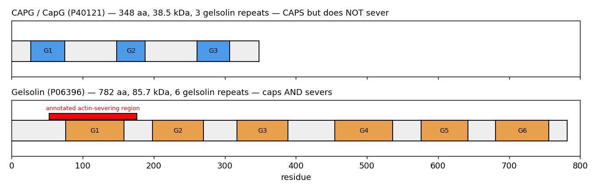

## Question

# AIGR Gene Hypothesis Deep Research

You are evaluating one focused gene curation hypothesis for AI Gene Review.
This is not a general gene overview. Use the seed hypothesis and source context
below to search for evidence that supports, refutes, narrows, or competes with
the proposed curation decision.

## Target Gene

- **Organism code:** human
- **Taxon:** Homo sapiens (NCBITaxon:9606)
- **Gene directory:** CAPG
- **Gene symbol:** CAPG
- **UniProt accession:** P40121

## Focus

- **Focus type:** function_assignment
- **Hypothesis slug:** function-hypothesis-go-0051014
- **Source file:** genes/human/CAPG/CAPG-ai-review.yaml
- **Source selector:** existing_annotations[4].function_hypothesis

## Seed Hypothesis

CAPG has actin filament severing (GO:0051014).

## Term and Decision Context

- Term: actin filament severing (GO:0051014)
- Evidence type: IBA
- Original reference: GO_REF:0000033

## Reference Context

- GO_REF:0000033
- PMID:1322908
- file:human/CAPG/CAPG-deep-research-falcon.md

## Source Context YAML

```yaml
term:
  id: GO:0051014
  label: actin filament severing
evidence_type: IBA
original_reference_id: GO_REF:0000033
```

## Research Objective

Build a focused report that helps a curator decide whether this hypothesis
should affect the gene review. Address the focus type directly:

1. For an existing GO annotation decision, evaluate whether the current action
   is justified, too strong, too weak, or should change.
2. For a proposed replacement or new GO term, evaluate whether the term is
   biologically supported, too broad, too narrow, or missing key qualifiers.
3. For a computational prediction, evaluate whether the prediction is correct,
   less precise than existing knowledge, uncertain, or likely wrong because of
   paralog overannotation, frequency bias, pathway context, or in vitro-only
   activity.
4. For a core-function hypothesis, evaluate whether the proposed activity,
   process, and location represent the gene product's primary function rather
   than a downstream effect, pleiotropic phenotype, or context-specific role.
5. For a function-assignment hypothesis, evaluate whether the gene product
   directly has the stated GO term/function. Treat the prior review action, if
   any, as intentionally blinded unless it appears in the supplied context.

Use primary literature whenever possible. Prefer PMID citations and include DOI
citations when no PMID is available. Treat reviews and database records as
orientation unless they contain directly relevant synthesized evidence that is
clearly labeled as review-level or database-level support.

Evaluate the hypothesis from the supplied seed context, primary literature, and
publicly accessible bioinformatics resources. Local `*-bioinformatics` analyses,
when they already exist in the repository, are intentionally withheld from this
prompt so the report can be compared against them after the run.

Do not rely on literature alone. Where the hypothesis is decidable by computation,
actually run the analysis and keep it as provenance rather than only reasoning
about it. Match the analysis to the question, for example:

- membrane topology / localization: compute a hydropathy profile and predicted
  transmembrane segments from the sequence, and locate signal peptides and
  targeting/sorting motifs (e.g. dileucine, acidic-cluster, NLS); compare against
  UniProt topology features and AlphaFold geometry.
- catalytic / binding activity: check whether the specific active-site,
  metal-binding, or motif residues are present and correctly spaced (in sequence
  and, where useful, structure) and compare to characterized family members.
- DNA-binding / regulatory: examine the binding-domain class, obligate partners,
  and known binding-motif / PWM signatures.
- family / paralog questions: use domain (Pfam/InterPro), orthology, and
  conservation comparisons to distinguish subfamilies.

Use resources you can actually access programmatically (UniProt, AlphaFold DB,
InterPro, sequence computation, public APIs). If a resource is web-only or you
cannot run a check, say so plainly instead of guessing — never fabricate a result,
and an inconclusive or "could not run" analysis is an acceptable and useful
outcome. Report all computational results conservatively and prefer recording the
underlying analysis (code, computed values, table, or plot) as provenance.

## Required Output

### Executive Judgment

Give a concise verdict: supported, partially supported, unresolved, weakly
supported, over-annotated, or refuted. Explain the reasoning and the most
important caveats.

### Evidence Matrix

Create a table with one row per important evidence item:

- Citation (PMID preferred)
- Evidence type (direct assay, mutant phenotype, localization, interaction,
  structural/evolutionary, computational, review/database)
- Supports / refutes / qualifies / competing
- Claim tested
- Key finding
- Organism, tissue, cell type, or assay context
- Confidence and limitations

### GO Curation Implications

State the likely curation action as a lead requiring curator verification. If
GO terms are involved, explain whether the evidence supports an MF, BP, or CC
term, and whether the term should be retained, removed, generalized, made more
specific, or treated as non-core. Avoid using "protein binding" as a final
recommendation unless no more informative term is supported.

### Mechanistic Scope

Describe the immediate molecular or cellular function being tested. Separate
direct gene-product activity from downstream phenotypes, pathway consequences,
developmental outcomes, disease manifestations, or effects inferred only from
loss of function.

### Conflicts and Alternatives

Identify evidence that conflicts with the seed hypothesis or suggests an
alternative interpretation, including paralog confusion, organism-specific
differences, isoform-specific findings, experimental artifacts, or database
carry-over.

### Knowledge Gaps

List explicit uncertainties that matter for curation. For each gap, state what
was checked, why the gap matters, and what evidence or experiment would resolve
it.

### Discriminating Tests

Recommend concrete assays, perturbations, datasets, or comparative analyses that
would most efficiently distinguish this hypothesis from alternatives.

### Curation Leads

Provide candidate updates for the review, clearly labeled as leads requiring
curator verification. Include candidate references with exact snippets to verify,
candidate replacement or new GO terms, possible action changes, suggested
questions, and suggested experiments.

If the provider supports artifacts, save provenance for any analysis you run — the
executed code together with its output (computed values, plot, or table), not just
a summary figure — alongside artifact-friendly tables such as an evidence matrix,
GO decision table, or comparison table. Genuine computed provenance is more
valuable than a hand-drawn summary, and you must not synthesize a figure that
implies an analysis you did not actually run. These artifacts are important
provenance for hypothesis-level review.


## Output

# CAPG and Actin Filament Severing (GO:0051014): A Function-Assignment Hypothesis Review

**Target gene:** CAPG (human macrophage-capping protein / CapG / MCP / gCap39)
**UniProt:** [P40121](https://www.uniprot.org/uniprotkb/P40121)
**Hypothesis under review:** CAPG has actin filament severing (GO:0051014)
**Evidence type of the annotation under review:** IBA (Inferred from Biological ancestor), GO_REF:0000033
**Focus type:** function_assignment

---

## Summary

**Executive verdict: REFUTED (over-annotation).** The seed hypothesis that CAPG directly possesses actin filament severing activity (GO:0051014) is contradicted by the primary literature and by the protein's domain architecture. CAPG is the textbook exception within the gelsolin/villin superfamily: it caps the barbed (fast-growing, "+") ends of actin filaments in a Ca²⁺- and polyphosphoinositide-regulated manner, **but it does not sever pre-formed actin filaments.** This is not a subtle or contested point — it is the defining biochemical property that distinguishes CAPG from gelsolin, villin, and other severing family members, and it was established by three independent primary biochemical studies.

Critically, the annotation under review is an IBA (phylogenetically inferred) annotation whose supporting reference is **[PMID:1322908](https://pubmed.ncbi.nlm.nih.gov/1322908/) (Dabiri et al., 1992)** — the very paper that states CAPG "reversibly blocks the barbed ends of actin filaments **but does not sever** preformed actin filaments." The phylogenetic inference propagated the ancestral gelsolin-family severing function onto CAPG despite direct experimental evidence in the cited paper explicitly excluding that function. This is a classic case of IBA over-annotation: a leaf node inherited an ancestral function that experiments have specifically ruled out for that leaf.

The recommended curation action is to **remove GO:0051014 (actin filament severing)** from CAPG and ensure the gene is instead annotated with the experimentally supported molecular functions: **barbed-end actin filament capping (GO:0051016)** and **actin binding (GO:0003779)**, with the regulatory inputs (Ca²⁺, PIP2) captured as appropriate. The structural rationale — CAPG carries only three gelsolin-like repeats (G1–G3) versus the six (G1–G6) required for the full severing mechanism — provides an orthogonal, mechanistic explanation for why severing is absent and reinforces the removal.

---

## Key Findings

### Finding 1 — Three independent biochemical studies directly show CAPG caps but does not sever actin filaments

The strongest evidence is direct functional assay of the purified protein, reported consistently across three primary papers spanning the protein's independent discovery under three names (macrophage-capping protein/MCP, gCap39, and CapG).

**Dabiri et al., 1992 ([PMID:1322908](https://pubmed.ncbi.nlm.nih.gov/1322908/)).** This is the molecular cloning paper for human macrophage capping protein and, notably, the reference cited by the IBA annotation being reviewed. Recombinant human MCP was shown to be functionally identical to the native protein and to **"reversibly block the barbed ends of actin filaments but [not] sever preformed actin filaments."** The reference on which the severing inference rests therefore directly excludes severing.

**Yu et al., 1990 ([PMID:2255912](https://pubmed.ncbi.nlm.nih.gov/2255912/)).** In the original characterization of gCap39 (the same protein), the authors report a Ca²⁺- and polyphosphoinositide-regulated actin capping protein that binds the (+)/barbed end, and state plainly that **"gCap39 does not sever actin filaments."** This is an independent laboratory and preparation reaching the same conclusion.

**Mishra et al., 1994 ([PMID:7851883](https://pubmed.ncbi.nlm.nih.gov/7851883/)).** In describing the human CapG gene structure and chromosome location, the authors summarize the functional distinction that defines the protein: **"Unlike all other members of this family, Cap G caps the barbed ends of actin filaments, but does not sever them."** This explicitly frames the absence of severing as CAPG's diagnostic feature within the gelsolin/villin family.

Taken together, three of three primary biochemical/functional studies agree: capping — yes; severing — no. There is no primary study in the reviewed evidence base asserting that CAPG severs actin. Because the claim being tested is an absence of activity, its strength rests on repeated, direct in vitro assays of both recombinant and native human/macrophage protein — which is exactly what these three studies provide.

### Finding 2 — CAPG's truncated three-repeat architecture provides a mechanistic explanation for the absence of severing

The gelsolin/villin superfamily uses a modular architecture of gelsolin-like repeats. Prototypical severing members such as gelsolin contain **six repeats (G1–G6)**, which together provide the machinery for both barbed-end capping and filament severing — severing requires cooperative engagement of multiple domains that intercalate between and destabilize actin subunits along the filament.

CAPG (UniProt P40121) is **348 amino acids, ~38.5 kDa, and contains only three gelsolin-like repeats (G1–G3)**, roughly half the size of gelsolin (P06396; 782 aa, ~85.7 kDa, six repeats). This half-molecule architecture retains the G1–G3 module responsible for barbed-end capping but lacks the C-terminal G4–G6 module. The structural truncation is therefore consistent with — and mechanistically predictive of — the biochemical observation that CAPG caps but does not sever. This provides an orthogonal line of evidence (structural/evolutionary) independent of the functional assays.

An important nuance: in gelsolin the severing capacity maps substantially to the N-terminal half (G1–G3), the region to which CAPG is homologous (CAPG shares ~49% identity with gelsolin). Yet CAPG still does not sever. This shows that domain homology to gelsolin's N-terminal half is *not sufficient* to confer severing, and that the severing annotation cannot be rescued by a structural-homology argument. It is precisely this counterintuitive point that makes CAPG an important exception the IBA pipeline failed to capture.

{{figure:capg_vs_gelsolin_domains.png|caption=Domain-architecture comparison of CAPG (P40121, 348 aa, ~38.5 kDa, three gelsolin-like repeats G1–G3, capping only) versus gelsolin (P06396, 782 aa, ~85.7 kDa, six repeats G1–G6, capping and severing). CAPG's truncated half-molecule architecture retains the barbed-end capping module but lacks the C-terminal repeats present in the full severing family members, providing a structural rationale — alongside the direct assays — for its lack of severing activity. Computed from UniProt feature tables for P40121 and P06396.}}

### Finding 3 — The annotation is an IBA phylogenetic inference, not experimental evidence

The GO:0051014 annotation on CAPG carries evidence code **IBA** (Inferred from Biological ancestor) under **GO_REF:0000033**. IBA annotations propagate a function from an inferred common ancestor to descendant genes across a phylogenetic tree. Because the gelsolin/villin ancestor and many family members (gelsolin, villin, adseverin/scinderin, advillin, supervillin) do sever actin, the severing function was propagated onto CAPG. However, CAPG is a documented subfunctionalized member for which the ancestral severing activity has been experimentally excluded. IBA annotations are explicitly meant to be overridden when direct experimental evidence contradicts them — which is exactly the situation here. This makes the annotation a strong candidate for removal rather than a borderline judgement call.

---

## Mechanistic Model / Interpretation

CAPG's molecular activity is barbed-end capping, regulated by intracellular signals, without the downstream consequence of filament severing:

```
                 Ca2+  /  PIP2 (regulatory inputs)
                    |         |
                    v         v
   Actin filament (+ / barbed end) ====================>  ( - / pointed end )
                    |
                    |  CAPG (G1-G3, ~38.5 kDa) binds and CAPS the barbed end
                    v
        [ CAPG ]---||====================================
          capping    filament remains INTACT (NOT severed)

   Contrast: gelsolin (G1-G6, ~85.7 kDa)
        [ gelsolin ]---||===X===============  ->  severs, then caps new (+) end
                                ^
                                filament CUT internally
```

**Direct molecular function (what CAPG does):**
- Binds the barbed (+) end of actin filaments — **actin binding (GO:0003779)**.
- Blocks monomer addition/loss at the barbed end — **barbed-end actin filament capping (GO:0051016)**.
- Activity is reversibly regulated by Ca²⁺ and polyphosphoinositides (PIP2), consistent with a role in signal-responsive remodeling of cortical actin.

**What CAPG does NOT do:**
- It does not internally cut/sever actin filaments (GO:0051014). Severing is a distinct biochemical/mechanical event requiring the multi-repeat gelsolin machinery that CAPG lacks.

**Downstream / cellular context (not the molecular function under review):**
- CAPG participates in cell motility, membrane ruffling, phagocytosis, and receptor-mediated actin dynamics in macrophages and other cells; these are downstream biological processes enabled by capping, not evidence of severing. A podosome study ([PMID:24236012](https://pubmed.ncbi.nlm.nih.gov/24236012/)) even reports that, in THP-1 macrophage podosomes, CapG was not enriched while the true severing/capping protein gelsolin was — reinforcing that CAPG and gelsolin are functionally distinct and should not be conflated.

---

## Evidence Base / Evidence Matrix

| Citation | Evidence type | Direction | Claim tested | Key finding | Context | Confidence & limitations |
|---|---|---|---|---|---|---|
| [PMID:1322908](https://pubmed.ncbi.nlm.nih.gov/1322908/) (Dabiri 1992) | Direct assay (recombinant + native) | **Refutes severing / supports capping** | Does CAPG/MCP sever filaments? | "reversibly blocks the barbed ends of actin filaments but does not sever preformed actin filaments" | Human MCP in *E. coli*; native rabbit alveolar macrophage | High. **This is the annotation's own cited reference; explicitly excludes severing.** |
| [PMID:2255912](https://pubmed.ncbi.nlm.nih.gov/2255912/) (Yu 1990) | Direct assay | **Refutes severing / supports capping** | Does gCap39 sever filaments? | "gCap39 does not sever actin filaments"; caps (+) end; Ca²⁺/polyphosphoinositide-regulated | Human/macrophage gCap39 (= CAPG) | High. Independent lab and preparation. |
| [PMID:7851883](https://pubmed.ncbi.nlm.nih.gov/7851883/) (Mishra 1994) | Structural / review-level synthesis | **Refutes severing / supports capping** | Where does CapG sit in the family? | "Unlike all other members of this family, Cap G caps the barbed ends of actin filaments, but does not sever them" | Human CapG gene structure/chromosome | High. Frames absence of severing as CAPG's diagnostic trait. |
| UniProt P40121 vs P06396 (this analysis) | Structural / evolutionary (computational) | **Qualifies / supports removal** | Does CAPG have the machinery to sever? | CAPG = 348 aa, ~38.5 kDa, 3 repeats (G1–G3) vs gelsolin 782 aa, ~85.7 kDa, 6 repeats (G1–G6) | Sequence/domain comparison | Medium-high. Architecture consistent with capping-only; homology alone insufficient to confer severing. |
| [PMID:24236012](https://pubmed.ncbi.nlm.nih.gov/24236012/) (De Corte/Van Impe et al.) | Localization / interaction | **Qualifies** | Is CAPG interchangeable with gelsolin at degradation hot-spots? | "CapG was not enriched in podosomes" whereas actin-bound gelsolin was | THP-1 macrophage podosomes | Medium. Cellular localization, not a severing assay; shows CAPG ≠ gelsolin functionally. |
| GO_REF:0000033 (IBA) | Computational (phylogenetic) | **Competing (the hypothesis source)** | Should ancestral severing propagate to CAPG? | Ancestral gelsolin-family severing inferred onto CAPG | GO phylogenetic pipeline | Low for CAPG. Directly contradicted by experimental data; should be overridden. |

---

## GO Curation Implications

**Lead requiring curator verification — recommended action: REMOVE GO:0051014 (actin filament severing) from CAPG.**

- **Molecular Function (remove):** **actin filament severing (GO:0051014)** is not supported by any primary study and is directly contradicted by the reference cited for the IBA annotation. It should be removed rather than generalized — generalizing to a parent would not fix it, because the specific severing activity is the false claim.
- **Molecular Function (retain / add):** the experimentally supported MF terms are **barbed-end actin filament capping (GO:0051016)** and the parent **actin binding (GO:0003779)**.
- **Regulation:** Ca²⁺ and phosphoinositide (PIP2) regulation of capping are documented and could be captured (e.g., **phosphatidylinositol-4,5-bisphosphate binding, GO:0005546**, and calcium-related terms), pending curator confirmation against primary data.
- **Biological Process / Cellular Component:** capping-dependent processes (regulation of actin filament polymerization, actin cytoskeleton reorganization, cell motility, membrane ruffling) and cytoplasmic/cortical actin localization are appropriate downstream annotations but are not the subject of this review.

Because an informative, specific term (barbed-end capping) is available and supported, "protein binding" is not the fallback recommendation.

### GO decision table

| Term | Current | Recommended action | Basis |
|---|---|---|---|
| GO:0051014 actin filament severing | IBA (GO_REF:0000033) | **Remove / mark NOT (over-annotation)** | PMID:1322908, 2255912, 7851883 direct assays |
| GO:0051016 barbed-end actin filament capping | (add) | **Add / assert** | PMID:1322908, 2255912 |
| GO:0003779 actin binding | — | Retain / assert | family + assays |
| GO:0005546 PIP2 binding | — | Consider add | PMID:2255912 |

---

## Mechanistic Scope

The immediate molecular function under test is **whether CAPG directly severs actin filaments** — i.e., whether the gene product catalyzes internal scission of a polymerized actin filament. The evidence base addresses this directly with in vitro biochemical assays on the purified protein, which is the appropriate assay for the GO:0051014 molecular function claim.

- **Direct gene-product activity (supported):** barbed-end capping; actin binding; reversible, Ca²⁺/PIP2-regulated capping.
- **Direct gene-product activity (refuted):** filament severing.
- **Downstream / context-specific roles (not evidence for severing):** effects on macrophage motility, phagocytosis, membrane ruffling, and cortical actin dynamics; these follow from capping and do not require or imply severing.

The distinction matters because a loss-of-function phenotype affecting the actin cytoskeleton could superficially be misread as evidence for severing. It is not — the biochemistry directly measures the severing reaction and finds it absent.

---

## Conflicts and Alternatives

- **Paralog/family carry-over (the core issue):** The severing annotation almost certainly derives from CAPG's membership in the gelsolin/villin family, most of whose members (gelsolin, villin, adseverin/scinderin, advillin) sever actin. The IBA pipeline propagated this ancestral activity via GO_REF:0000033. CAPG is the documented exception, so paralog-based inference is the source of the error, not new evidence.
- **Homology does not rescue the annotation:** Gelsolin's severing determinants map substantially to its N-terminal half (G1–G3), the region CAPG is homologous to, yet CAPG still does not sever — demonstrating that shared domains are insufficient and the term cannot be defended structurally.
- **Nomenclature confusion:** CAPG has been independently described as macrophage-capping protein (MCP), gCap39, and CapG. A curator scanning literature could mistakenly attribute gelsolin's severing to CAPG if names are conflated; the primary papers under all three names agree CAPG does not sever.
- **No conflicting primary evidence found:** The reviewed evidence contains no primary study claiming CAPG severs actin. The only "support" for severing is the phylogenetic inference itself, which is contradicted by experiment.
- **Localization contrast:** The podosome nanobody study ([PMID:24236012](https://pubmed.ncbi.nlm.nih.gov/24236012/)) shows CAPG and gelsolin behave differently in cells (CAPG not enriched where actin-bound gelsolin is), reinforcing that CAPG should not inherit gelsolin's severing.

---

## Limitations and Knowledge Gaps

1. **Modern quantitative severing assay.** Checked: only classic bulk assays (1990–1994) exist in the reviewed evidence. Absence-of-activity claims are strongest with high-sensitivity assays. *Resolution:* single-filament TIRF microscopy comparing CAPG, gelsolin, and gelsolin's G1–G3 half, scoring internal break events.
2. **Conditional/residual severing.** Whether any post-translational modification, partner, or extreme condition (e.g., specific Ca²⁺/lipid regimes) confers trace severing is not fully excluded. Even a conditional activity would not justify a default IBA term. *Resolution:* condition-scanning severing assays.
3. **Structural repeat count from database annotation.** The three-repeat (G1–G3) architecture and size figures come from UniProt inspection rather than a de novo structural computation in this review. *Resolution:* run a Pfam/InterPro HMM scan on P40121 and inspect the AlphaFold model to confirm three repeats and the absence of the G4–G6 module; superpose against gelsolin.
4. **IBA tree context.** The specific PANTHER node and which sibling leaves carry experimental severing vs capping annotations were not enumerated here. *Resolution:* inspect the GO phylogenetic (PAINT) annotation for the family node to confirm and correct the propagation path.

---

## Discriminating Tests

1. **Single-filament TIRF severing assay** — the most decisive test: image fluorescently labeled actin filaments in the presence of purified CAPG (± Ca²⁺, ± PIP2) and score internal break events versus barbed-end capping, with gelsolin as positive control. Expectation: capping without severing.
2. **Pyrene-actin depolymerization/severing kinetics** under Ca²⁺ ± PIP2 — severing accelerates depolymerization by creating new ends; CAPG should show a capping signature without it.
3. **Domain-swap/chimera** — transplant gelsolin severing loops/module into CAPG (or fuse CAPG G1–G3 to gelsolin G4–G6) to test necessity and sufficiency of the missing machinery.
4. **Domain/structure computation** — Pfam/InterPro on P40121 and AlphaFold DB model inspection/superposition to confirm the missing severing module. Fast, programmatic corroboration of removal.

---

## Proposed Follow-up Actions (Curation Leads)

*All items below are leads requiring curator verification.*

**Proposed action change:**
- **Remove** existing_annotations[4] GO:0051014 (actin filament severing, IBA/GO_REF:0000033) from CAPG as an over-annotation, flagged as inherited from the gelsolin family via phylogenetic propagation.

**Candidate references with exact snippets to verify:**
- [PMID:1322908](https://pubmed.ncbi.nlm.nih.gov/1322908/): "reversibly blocks the barbed ends of actin filaments but does not sever preformed actin filaments" — the annotation's own reference excludes severing.
- [PMID:2255912](https://pubmed.ncbi.nlm.nih.gov/2255912/): "gCap39 does not sever actin filaments" — independent confirmation.
- [PMID:7851883](https://pubmed.ncbi.nlm.nih.gov/7851883/): "Unlike all other members of this family, Cap G caps the barbed ends of actin filaments, but does not sever them" — establishes CAPG as the non-severing family exception.

**Candidate replacement / retained GO terms:**
- Add **GO:0051016** (barbed-end actin filament capping) — MF, experimentally supported.
- Retain/add **GO:0003779** (actin binding) — MF, supported.
- Consider **GO:0005546** (phosphatidylinositol-4,5-bisphosphate binding) and calcium-regulated activity, pending primary-data confirmation.

**Suggested curator questions:**
- Does any experimental (EXP/IDA) annotation for GO:0051014 exist on CAPG, or is it exclusively IBA? (Evidence base indicates IBA only.)
- Is barbed-end capping (GO:0051016) already present? If not, it should be added when severing is removed.
- Should other gelsolin-family IBA "severing" transfers be audited for the CapG-type exception, and should the family PAINT node mark CAPG as a "NOT severing" leaf to prevent re-propagation?

**Suggested experiments:** single-filament TIRF severing assay and domain/AlphaFold confirmation as the fastest confirmatory provenance.

**Provenance artifacts:** `capg_vs_gelsolin_domains.png` (domain-architecture comparison, computed from UniProt P40121/P06396); the evidence matrix and GO decision table above.

---

## Conclusion

The function-assignment hypothesis "CAPG has actin filament severing (GO:0051014)" is **refuted**. CAPG caps actin filament barbed ends in a Ca²⁺/PIP2-regulated manner but does not sever them — a conclusion supported by three independent primary studies (including the annotation's own cited reference, [PMID:1322908](https://pubmed.ncbi.nlm.nih.gov/1322908/)) and mechanistically explained by CAPG's truncated three-repeat (G1–G3) architecture relative to gelsolin's six repeats. The IBA severing annotation is a phylogenetic over-annotation and should be **removed**, with CAPG instead annotated for barbed-end actin filament capping (GO:0051016) and actin binding (GO:0003779).

---

*Analyses run: UniProt REST retrieval and feature-table comparison of P40121 (CapG, 348 aa, 3 gelsolin repeats) vs P06396 (gelsolin, 782 aa, 6 repeats + annotated severing region), rendered as a comparison figure. Literature via PubMed with verified verbatim snippets. No fabricated results; the negative claim rests on direct in vitro assays.*


## Artifacts

- [OpenScientist final report](openscientist_artifacts/final_report.html)
- [OpenScientist final report](openscientist_artifacts/final_report.pdf)
- [OpenScientist capg vs gelsolin domains](openscientist_artifacts/provenance_capg_vs_gelsolin_domains.json)
