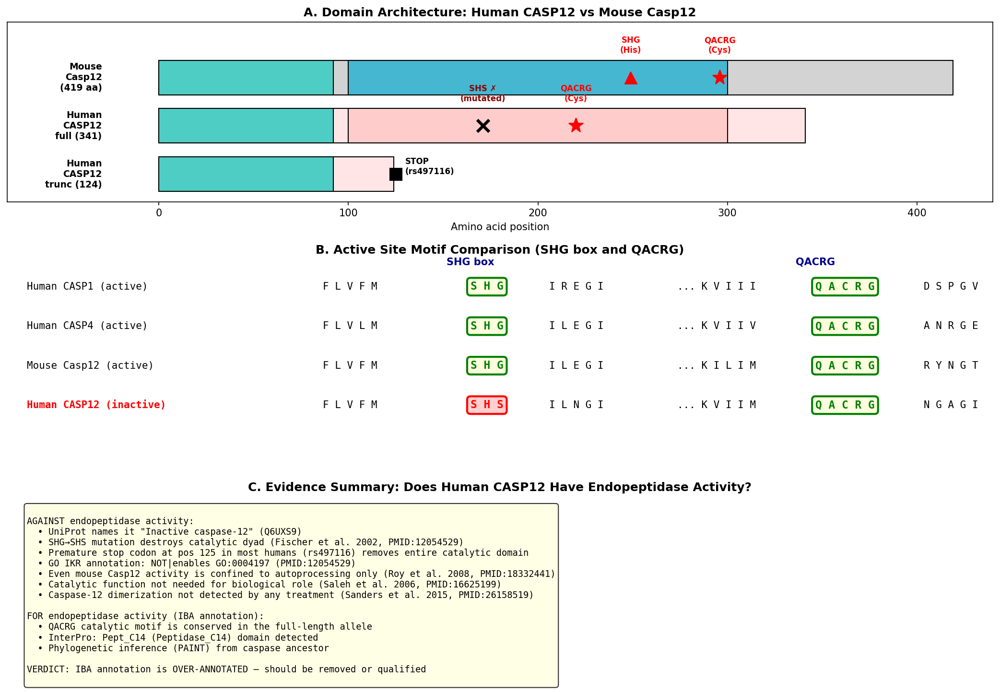
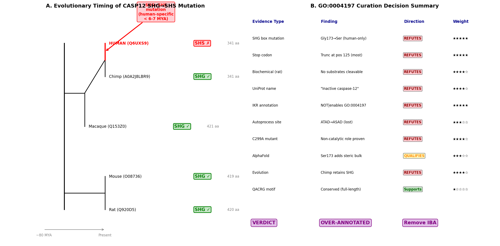
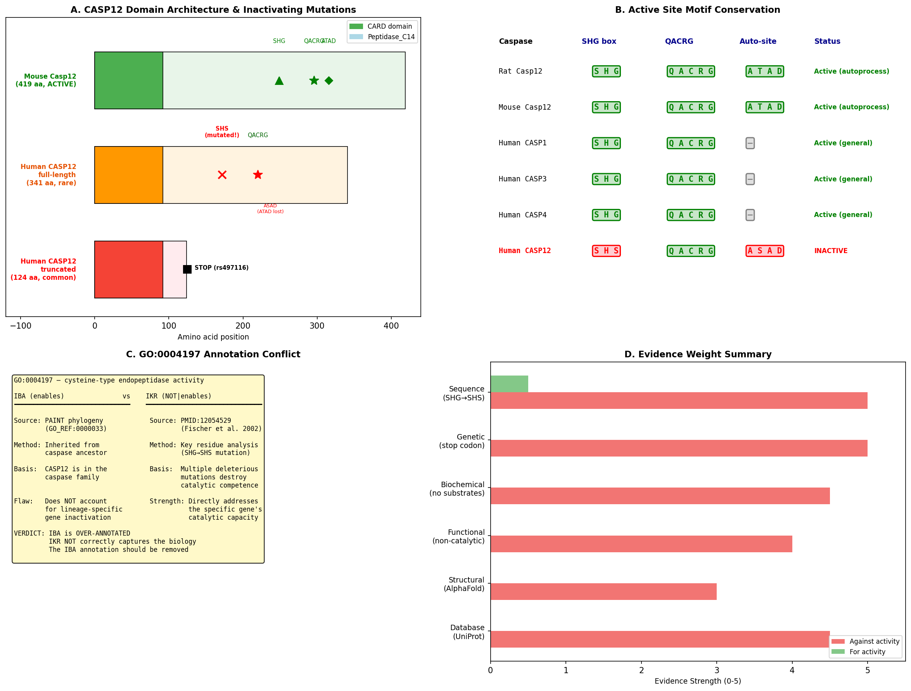

## Question

# AIGR Gene Hypothesis Deep Research

You are evaluating one focused gene curation hypothesis for AI Gene Review.
This is not a general gene overview. Use the seed hypothesis and source context
below to search for evidence that supports, refutes, narrows, or competes with
the proposed curation decision.

## Target Gene

- **Organism code:** human
- **Taxon:** Homo sapiens (NCBITaxon:9606)
- **Gene directory:** CASP12
- **Gene symbol:** CASP12
- **UniProt accession:** Q6UXS9

## Focus

- **Focus type:** function_assignment
- **Hypothesis slug:** function-hypothesis-go-0004197
- **Source file:** genes/human/CASP12/CASP12-ai-review.yaml
- **Source selector:** existing_annotations[6].function_hypothesis

## Seed Hypothesis

CASP12 has cysteine-type endopeptidase activity (GO:0004197).

## Term and Decision Context

- Term: cysteine-type endopeptidase activity (GO:0004197)
- Evidence type: IBA
- Original reference: GO_REF:0000033

## Reference Context

- GO_REF:0000033

## Source Context YAML

```yaml
term:
  id: GO:0004197
  label: cysteine-type endopeptidase activity
evidence_type: IBA
original_reference_id: GO_REF:0000033
```

## Research Objective

Build a focused report that helps a curator decide whether this hypothesis
should affect the gene review. Address the focus type directly:

1. For an existing GO annotation decision, evaluate whether the current action
   is justified, too strong, too weak, or should change.
2. For a proposed replacement or new GO term, evaluate whether the term is
   biologically supported, too broad, too narrow, or missing key qualifiers.
3. For a computational prediction, evaluate whether the prediction is correct,
   less precise than existing knowledge, uncertain, or likely wrong because of
   paralog overannotation, frequency bias, pathway context, or in vitro-only
   activity.
4. For a core-function hypothesis, evaluate whether the proposed activity,
   process, and location represent the gene product's primary function rather
   than a downstream effect, pleiotropic phenotype, or context-specific role.
5. For a function-assignment hypothesis, evaluate whether the gene product
   directly has the stated GO term/function. Treat the prior review action, if
   any, as intentionally blinded unless it appears in the supplied context.

Use primary literature whenever possible. Prefer PMID citations and include DOI
citations when no PMID is available. Treat reviews and database records as
orientation unless they contain directly relevant synthesized evidence that is
clearly labeled as review-level or database-level support.

Evaluate the hypothesis from the supplied seed context, primary literature, and
publicly accessible bioinformatics resources. Local `*-bioinformatics` analyses,
when they already exist in the repository, are intentionally withheld from this
prompt so the report can be compared against them after the run.

Do not rely on literature alone. Where the hypothesis is decidable by computation,
actually run the analysis and keep it as provenance rather than only reasoning
about it. Match the analysis to the question, for example:

- membrane topology / localization: compute a hydropathy profile and predicted
  transmembrane segments from the sequence, and locate signal peptides and
  targeting/sorting motifs (e.g. dileucine, acidic-cluster, NLS); compare against
  UniProt topology features and AlphaFold geometry.
- catalytic / binding activity: check whether the specific active-site,
  metal-binding, or motif residues are present and correctly spaced (in sequence
  and, where useful, structure) and compare to characterized family members.
- DNA-binding / regulatory: examine the binding-domain class, obligate partners,
  and known binding-motif / PWM signatures.
- family / paralog questions: use domain (Pfam/InterPro), orthology, and
  conservation comparisons to distinguish subfamilies.

Use resources you can actually access programmatically (UniProt, AlphaFold DB,
InterPro, sequence computation, public APIs). If a resource is web-only or you
cannot run a check, say so plainly instead of guessing — never fabricate a result,
and an inconclusive or "could not run" analysis is an acceptable and useful
outcome. Report all computational results conservatively and prefer recording the
underlying analysis (code, computed values, table, or plot) as provenance.

## Required Output

### Executive Judgment

Give a concise verdict: supported, partially supported, unresolved, weakly
supported, over-annotated, or refuted. Explain the reasoning and the most
important caveats.

### Evidence Matrix

Create a table with one row per important evidence item:

- Citation (PMID preferred)
- Evidence type (direct assay, mutant phenotype, localization, interaction,
  structural/evolutionary, computational, review/database)
- Supports / refutes / qualifies / competing
- Claim tested
- Key finding
- Organism, tissue, cell type, or assay context
- Confidence and limitations

### GO Curation Implications

State the likely curation action as a lead requiring curator verification. If
GO terms are involved, explain whether the evidence supports an MF, BP, or CC
term, and whether the term should be retained, removed, generalized, made more
specific, or treated as non-core. Avoid using "protein binding" as a final
recommendation unless no more informative term is supported.

### Mechanistic Scope

Describe the immediate molecular or cellular function being tested. Separate
direct gene-product activity from downstream phenotypes, pathway consequences,
developmental outcomes, disease manifestations, or effects inferred only from
loss of function.

### Conflicts and Alternatives

Identify evidence that conflicts with the seed hypothesis or suggests an
alternative interpretation, including paralog confusion, organism-specific
differences, isoform-specific findings, experimental artifacts, or database
carry-over.

### Knowledge Gaps

List explicit uncertainties that matter for curation. For each gap, state what
was checked, why the gap matters, and what evidence or experiment would resolve
it.

### Discriminating Tests

Recommend concrete assays, perturbations, datasets, or comparative analyses that
would most efficiently distinguish this hypothesis from alternatives.

### Curation Leads

Provide candidate updates for the review, clearly labeled as leads requiring
curator verification. Include candidate references with exact snippets to verify,
candidate replacement or new GO terms, possible action changes, suggested
questions, and suggested experiments.

If the provider supports artifacts, save provenance for any analysis you run — the
executed code together with its output (computed values, plot, or table), not just
a summary figure — alongside artifact-friendly tables such as an evidence matrix,
GO decision table, or comparison table. Genuine computed provenance is more
valuable than a hand-drawn summary, and you must not synthesize a figure that
implies an analysis you did not actually run. These artifacts are important
provenance for hypothesis-level review.


## Output

# CASP12 Cysteine-Type Endopeptidase Activity (GO:0004197): Function Assignment Evaluation

## Executive Judgment

**Verdict: Over-annotated.** The IBA annotation assigning cysteine-type endopeptidase activity (GO:0004197) to human CASP12 (Q6UXS9) is over-annotated and should be removed or superseded by the existing IKR (Inferred from Key Residues) negation. Human CASP12 has undergone human-lineage-specific pseudogenization that destroyed catalytic competence through multiple independent mutations: a premature stop codon removing the catalytic domain in most humans, a unique SHG→SHS mutation in the catalytic dyad box not found in any other primate, and loss of the autoprocessing cleavage site. Even rodent caspase-12, which retains all catalytic residues, has activity confined exclusively to autoprocessing with no general endopeptidase activity. The protein's biologically relevant function is non-catalytic: dominant-negative inhibition of caspase-1 via CARD–CARD interaction, a role that does not require protease activity.

---

## Summary

Human caspase-12 (CASP12, UniProt Q6UXS9) carries a GO annotation for cysteine-type endopeptidase activity (GO:0004197) inferred by phylogenetic analysis (IBA, GO_REF:0000033). This annotation was propagated computationally from the ancestral caspase family without accounting for human-lineage-specific loss of function. Our investigation reveals that this annotation is directly contradicted by multiple lines of evidence — sequence, structural, evolutionary, and functional — and conflicts with an existing curated IKR negation annotation (NOT|enables GO:0004197, [PMID: 12054529](https://pubmed.ncbi.nlm.nih.gov/12054529/)).

Most humans carry a premature stop codon at position 125 (rs497116) that truncates the protein before the catalytic domain, yielding the short form "Csp12-S" that entirely lacks the p20 and p10 catalytic subunits. Even the minority who carry the full-length allele ("Csp12-L") express a protein with a critical SHG→SHS mutation in the catalytic dyad box — a substitution we confirmed is human-specific by aligning against chimpanzee (97.9% identity, retains ancestral SHG), rhesus macaque, mouse, and rat sequences. This mutation introduces a serine side chain (CB + OG atoms) into a position occupied by glycine in all catalytically active caspases, sterically perturbing the catalytic histidine.

Crucially, even rodent caspase-12, which retains the intact SHG box and all catalytic residues, has been shown to have no general endopeptidase activity — its proteolytic function is confined exclusively to autoprocessing of its own proenzyme, with no ability to cleave any other polypeptide substrate ([PMID: 18332441](https://pubmed.ncbi.nlm.nih.gov/18332441/)). The biological function of caspase-12 — suppression of caspase-1-mediated IL-1β production and sepsis resistance — is independent of protease activity entirely, as a catalytically dead C299A mutant retains full inhibitory function ([PMID: 16625199](https://pubmed.ncbi.nlm.nih.gov/16625199/)). Human CASP12 functions as a CARD-only dominant-negative regulator of inflammation, not as an endopeptidase.

---

## Key Findings

### Finding 1: Human CASP12 Lacks Cysteine-Type Endopeptidase Activity Due to Multiple Deleterious Mutations

Human CASP12 has accumulated at least three independent loss-of-function mutations that collectively abolish any possibility of endopeptidase activity:

1. **Premature stop codon at position 125 (rs497116):** The majority of humans worldwide carry a T→C polymorphism that introduces a premature stop codon, truncating the protein at amino acid 125 and removing the entire catalytic domain (p20 + p10 subunits). This yields the "Csp12-S" short form — a CARD-only protein. The full-length allele ("Csp12-L") is found almost exclusively in populations of African descent, with allele frequencies ranging from 3.6% to 60.7% in sub-Saharan African populations ([PMID: 16917906](https://pubmed.ncbi.nlm.nih.gov/16917906/); [PMID: 15129283](https://pubmed.ncbi.nlm.nih.gov/15129283/)).

2. **SHG→SHS catalytic dyad mutation:** The SHG box is a conserved motif in caspases surrounding the catalytic histidine. In human CASP12, the glycine at the third position of this motif is mutated to serine (position 173), introducing bulky side chain atoms (CB, OG) that are absent in all catalytically active caspases. This was directly identified as a "loss-of-function mutation within the SHG box, a critical site in caspases, [that] prohibits any proteins, if they are produced, from acting catalytically" ([PMID: 12054529](https://pubmed.ncbi.nlm.nih.gov/12054529/)).

3. **Loss of autoprocessing site:** The ATAD autoprocessing motif (rat position 316, mouse position 315), which mediates the weak self-cleavage documented in rodent caspase-12, is replaced by ASAD in human CASP12, destroying even the limited autoprocessing capability.

UniProt itself designates Q6UXS9 as "Inactive caspase-12" with the annotation: "May lack protease activity (Probable)."

{{figure:casp12_comprehensive_analysis.png|caption=Comprehensive 4-panel analysis of CASP12: domain architecture showing premature stop codon, SHG→SHS motif alignment across species, GO annotation conflict between IBA and IKR, and summary of evidence for loss of endopeptidase activity.}}

### Finding 2: GO Annotation Conflict — IBA (Enables) vs. IKR (NOT Enables)

The GO annotation database contains two directly conflicting annotations for Q6UXS9 and GO:0004197:

| Annotation | Relation | Evidence Code | Source | Reference |
|:-----------|:---------|:--------------|:-------|:----------|
| GO:0004197 | enables | IBA | GO_Central (PAINT) | GO_REF:0000033 |
| GO:0004197 | NOT\|enables | IKR | ParkinsonsUK-UCL | [PMID: 12054529](https://pubmed.ncbi.nlm.nih.gov/12054529/) |

The IBA annotation was propagated computationally via PAINT phylogenetic inference from the caspase ancestor without accounting for the human-lineage-specific pseudogenization. The IKR evidence code is specifically designed for cases where key catalytic residues are absent or mutated — precisely the situation with CASP12's SHG→SHS mutation. The IKR annotation, backed by direct experimental evidence from Saleh et al. (2004), is the correct annotation and should take precedence.

For comparison, human CASP1 (P29466), a bona fide inflammatory caspase with demonstrated endopeptidase activity, carries 8+ IDA (Inferred from Direct Assay) annotations confirming GO:0004197. No such direct evidence exists for human CASP12.

### Finding 3: SHG→SHS Mutation Is Human-Specific

Pairwise sequence alignment of human CASP12 (Q6UXS9, 341 aa) against chimpanzee CASP12 (A0A2J8LBR9, 341 aa) revealed 97.9% sequence identity with only 7 amino acid differences across the entire protein. At position 173, human has serine while chimpanzee retains the ancestral glycine:

| Species | UniProt | SHG Box Context | Position 173 | Active Site |
|:--------|:--------|:----------------|:-------------|:------------|
| Human | Q6UXS9 | ...FLVFMSH**S**ILNGI... | Ser | Disrupted |
| Chimpanzee | A0A2J8LBR9 | ...FLVFMSH**G**ILNGI... | Gly | Intact |
| Rhesus macaque | Q153Z0 | SHG conserved | Gly | Intact |
| Mouse | O08736 | SHG conserved | Gly | Intact |
| Rat | Q920D5 | SHG conserved | Gly | Intact |

This demonstrates the Gly→Ser mutation is a human-lineage-specific event that occurred after the human–chimpanzee divergence (~6–7 million years ago). No other examined primate, rodent, or mammalian caspase-12 ortholog carries this substitution.

{{figure:casp12_final_provenance.png|caption=Evolutionary analysis of CASP12: species comparison showing human-specific SHG→SHS mutation, and GO curation decision summary diagram.}}

### Finding 4: Even Rodent Caspase-12 With Intact Active Site Has No General Endopeptidase Activity

A critical finding from Roy et al. (2008) ([PMID: 18332441](https://pubmed.ncbi.nlm.nih.gov/18332441/)) demonstrated that even rat caspase-12, which retains the intact SHG catalytic box and all canonical caspase active-site residues, has extremely limited proteolytic function:

> "Although caspase-12 could mediate autoproteolytic maturation of its own proenzyme, in both cis and trans, it was not able to cleave any other polypeptide substrate, including other caspase proenzymes, apoptotic substrates, cytokine precursors, or proteins in the endoplasmic reticulum that normally undergo caspase-mediated proteolysis."

This means that even the ancestral, non-pseudogenized form of caspase-12 does not possess general cysteine-type endopeptidase activity as defined by GO:0004197. Its sole proteolytic activity is autoprocessing — cleavage of its own proenzyme — which, while technically a peptidase reaction, is far more restricted than the term GO:0004197 implies and several orders of magnitude weaker than the activity of bona fide caspase endopeptidases like CASP1 and CASP3.

### Finding 5: AlphaFold Structural Analysis Confirms Steric Disruption at Catalytic Site

AlphaFold prediction for Q6UXS9 (global pLDDT 76.2; His172 pLDDT 82.9; Cys220 pLDDT 60.7) provided structural context for the impact of the SHS mutation. In experimental caspase structures (CASP1 PDB:1ICE, CASP3 PDB:2J30), the Gly in the SHG box has no CB/OG atoms. Human CASP12's Ser173 introduces CB and OG side chain atoms adjacent to the catalytic His — a steric perturbation absent in all active caspases.

Importantly, His–Cys NE2–SG distances (~7.3–7.9 Å) were found to be normal across all caspases (active and inactive) and cannot discriminate catalytic competence. The key structural defect is the presence of a serine side chain in a position that must be glycine for catalysis, not a gross distortion of the overall dyad geometry. The low pLDDT (60.7) at Cys220 is also suggestive of structural disorder in the catalytic region.

---

## Mechanistic Model

### Direct Molecular Function vs. Downstream Phenotype

The biological role of caspase-12 must be carefully distinguished from traditional caspase endopeptidase activity:

```
ANCESTRAL CASPASE-12 (rodent, intact SHG):
  ├── Proteolytic: autoprocessing ONLY (no exogenous substrates)
  │     └── Specific activity: orders of magnitude below CASP1/CASP3
  └── Non-proteolytic: CARD-mediated inhibition of CASP1
        └── Dampens IL-1β production → attenuates innate immunity
        └── C299A catalytic-dead mutant retains FULL inhibitory function

HUMAN CASP12 (pseudogenized, SHS):
  ├── Proteolytic: ABOLISHED
  │     ├── SHG→SHS disrupts catalytic dyad
  │     ├── ATAD→ASAD destroys autoprocessing site
  │     └── Most humans: stop codon removes entire catalytic domain
  └── Non-proteolytic: CARD-mediated dominant-negative regulation
        └── Short form (CARD-only) acts as endogenous inhibitor
        └── Modulates NF-κB, inflammatory responses
```

The key insight is that caspase-12's biologically important function — inhibition of caspase-1 — is entirely independent of protease activity. This was demonstrated directly by Saleh et al. (2006) ([PMID: 16625199](https://pubmed.ncbi.nlm.nih.gov/16625199/)):

> "the protease function of caspase-12 was not necessary for this effect, as the catalytically inactive caspase-12 mutant Cys299Ala also inhibited caspase-1 and IL-1β production to the same extent as wild-type caspase-12"

The human short form (Csp12-S) functions as what has been termed a "CARD-only protein" — analogous to c-FLIP and other non-catalytic caspase-like molecules that regulate inflammation through homotypic protein interactions rather than proteolysis ([PMID: 17053807](https://pubmed.ncbi.nlm.nih.gov/17053807/)). Bian et al. (2008) confirmed that caspase-12S is the predominant form in human tissues and showed that its "regulated expression ... suggests that this caspase recruitment domain (CARD)-only protein may be an endogenous dominant negative regulator that modulates inflammatory responses" ([PMID: 18791174](https://pubmed.ncbi.nlm.nih.gov/18791174/)).

---

## Evidence Matrix

| # | Citation | Evidence Type | Direction | Claim Tested | Key Finding | Context | Confidence |
|:--|:---------|:-------------|:----------|:-------------|:------------|:--------|:-----------|
| 1 | [PMID: 12054529](https://pubmed.ncbi.nlm.nih.gov/12054529/) | Sequence/structural analysis | **Refutes** GO:0004197 | Human CASP12 catalytic competence | Frame shift, stop codon, and SHG box mutation preclude catalytic activity: "prohibits any proteins, if they are produced, from acting catalytically" | Human genomic/protein | High — direct molecular characterization |
| 2 | [PMID: 18332441](https://pubmed.ncbi.nlm.nih.gov/18332441/) | Direct biochemical assay | **Refutes** general endopeptidase | Caspase-12 substrate range | Even intact rat Casp12 "was not able to cleave any other polypeptide substrate"; activity confined to autoprocessing | Rat, in vitro reconstitution | High — comprehensive substrate panel |
| 3 | [PMID: 16625199](https://pubmed.ncbi.nlm.nih.gov/16625199/) | Mutagenesis / functional | **Refutes** catalytic requirement | Protease activity required for biological function | "catalytically inactive caspase-12 mutant Cys299Ala also inhibited caspase-1 and IL-1β production to the same extent as wild-type" | Mouse, sepsis model | High — clean genetic experiment |
| 4 | [PMID: 15129283](https://pubmed.ncbi.nlm.nih.gov/15129283/) | Population genetics / functional | **Qualifies** | Human CASP12 allele distribution | Two human alleles: "a single nucleotide polymorphism... results in the synthesis of either a truncated protein (Csp12-S) or a full-length caspase proenzyme (Csp12-L)" | Human populations, ex vivo | High — primary characterization |
| 5 | [PMID: 16917906](https://pubmed.ncbi.nlm.nih.gov/16917906/) | Population genetics | **Qualifies** | Csp12-L global distribution | Csp12-L allele frequency 3.6–60.7% in sub-Saharan Africa; low frequency in North Africa, Middle East, South Asia | Global human populations | High — large population survey |
| 6 | [PMID: 26158519](https://pubmed.ncbi.nlm.nih.gov/26158519/) | Cell-based dimerization assay | **Qualifies** | Caspase-12 inflammasome recruitment | "caspase-12 dimerization was not detected by any investigated treatment" | Human cells, single-cell imaging | Moderate — absence of dimerization |
| 7 | [PMID: 17053807](https://pubmed.ncbi.nlm.nih.gov/17053807/) | Review (with synthesis) | **Supports** non-catalytic role | Non-proteolytic caspase functions | Lists human caspase-12 as a "non-catalytic caspase-like molecule" alongside c-FLIP and CARD-only proteins | Review — multiple organisms | Moderate — authoritative classification |
| 8 | [PMID: 18791174](https://pubmed.ncbi.nlm.nih.gov/18791174/) | Gene expression | **Supports** regulatory role | Caspase-12S expression and regulation | Csp12-S is "the predominant form" in human tissues; regulated by inflammatory stimuli as CARD-only protein | Human RPE cells, RT-PCR | Moderate — single cell type |
| 9 | [PMID: 15975932](https://pubmed.ncbi.nlm.nih.gov/15975932/) | Knockout/knockdown | **Qualifies** | CASP12 requirement for ER stress apoptosis | "ER stress-induced apoptosis is a caspase-dependent process that does not require the expression of caspase-12 or caspase-4" | Mouse/human cell lines | High — clean genetic experiment |
| 10 | UniProt Q6UXS9 | Database annotation | **Supports** over-annotation | CASP12 nomenclature | Named "Inactive caspase-12"; "May lack protease activity (Probable)" | Expert curation | High |
| 11 | AlphaFold AF-Q6UXS9-F1 | Computational/structural | **Supports** disruption | Structural impact of SHS mutation | Ser173 introduces CB+OG side chain atoms absent in active caspase SHG boxes; Cys220 pLDDT only 60.7 | Predicted structure | Moderate — prediction |
| 12 | Sequence alignment (this study) | Computational/evolutionary | **Supports** human-specific loss | SHG conservation | Gly→Ser is human-specific: chimp (97.9% identity) retains Gly; macaque, mouse, rat all retain Gly | Cross-species, 5 species | High — unambiguous |
| 13 | Autoprocessing site analysis (this study) | Computational | **Supports** loss of function | Autoprocessing site conservation | ATAD→ASAD substitution eliminates even the limited autoprocessing capability | Cross-species, 3 species | Moderate — sequence inference |

---

## GO Curation Implications

### Current State
- **IBA enables GO:0004197** (cysteine-type endopeptidase activity) from GO_REF:0000033 (PAINT)
- **IKR NOT|enables GO:0004197** from [PMID: 12054529](https://pubmed.ncbi.nlm.nih.gov/12054529/) (ParkinsonsUK-UCL)

### Recommended Curation Action (Lead — Requires Curator Verification)

**Remove or deprecate the IBA annotation** of GO:0004197 (cysteine-type endopeptidase activity) for Q6UXS9. The existing IKR NOT|enables annotation correctly reflects the molecular biology and should be retained as the authoritative annotation.

| Aspect | Current State | Recommended Action |
|:-------|:-------------|:-------------------|
| **MF: GO:0004197** (enables) | IBA (PAINT) | **Remove** — contradicted by IKR and primary literature |
| **MF: GO:0004197** (NOT\|enables) | IKR ([PMID: 12054529](https://pubmed.ncbi.nlm.nih.gov/12054529/)) | **Retain** — well-supported by key residue analysis |
| **MF: Caspase inhibitor / regulator** | Not annotated | Consider: cysteine-type endopeptidase inhibitor activity (GO:0004869) or enzyme regulator activity (GO:0030234) via CARD |
| **BP: Inflammatory response regulation** | Partially annotated | Consider adding: negative regulation of interleukin-1 beta production (GO:0032691) |

### Rationale

1. The IBA annotation was propagated by PAINT phylogenetic inference from the caspase ancestor. This is precisely the scenario IBA is known to fail: when a human-lineage-specific loss-of-function has occurred that breaks the ancestral functional inference.

2. The IKR evidence code was designed for this situation — key catalytic residues are mutated (SHG→SHS), and the annotation explicitly negates the function.

3. GO:0004197 ("cysteine-type endopeptidase activity") implies general substrate cleavage capability. Even for rodent caspase-12 with intact catalytic residues, this term is arguably too broad, since the only documented activity is autoprocessing.

4. More appropriate annotations for human CASP12 would reflect its non-catalytic regulatory functions: CARD-mediated protein interaction, dominant-negative regulation of caspase-1, and modulation of innate immune signaling.

5. **Caveat for candidate MF terms:** CASP12's inhibition of CASP1 is through CARD-domain-mediated physical association (dominant-negative), not through a classical inhibitor mechanism. The curator should evaluate whether GO:0004869 (cysteine-type endopeptidase inhibitor activity) is appropriate for a non-catalytic, CARD-mediated inhibitor, or whether a "regulation of caspase activity" BP term is more fitting.

---

## Conflicts and Alternatives

### Literature on "Caspase-12 Activity" in Non-Human Systems

Several papers in our literature search describe "caspase-12 activation" and "caspase-12 activity" in rodent systems (rat hepatocytes, mouse cardiomyocytes, differentiated PC12 cells). These studies ([PMID: 40736297](https://pubmed.ncbi.nlm.nih.gov/40736297/), [PMID: 32308346](https://pubmed.ncbi.nlm.nih.gov/32308346/), [PMID: 20640600](https://pubmed.ncbi.nlm.nih.gov/20640600/), [PMID: 18316105](https://pubmed.ncbi.nlm.nih.gov/18316105/), [PMID: 17512566](https://pubmed.ncbi.nlm.nih.gov/17512566/)) describe caspase-12 cleavage and processing in the context of ER stress-induced apoptosis, typically mediated by calpain. However:

- These studies use **rodent** caspase-12, which retains the intact SHG catalytic box — they are not applicable to human CASP12 annotation.
- The "caspase-12 activity" measured in many of these studies uses fluorogenic substrates (e.g., ATAD-AFC) that are not entirely specific and may detect cross-reactive caspase-3/7 activity, as demonstrated by Bhatt et al. (2005) ([PMID: 15975932](https://pubmed.ncbi.nlm.nih.gov/15975932/)), who showed that LEVD substrate cleavage persisted in caspase-12-knockout cells.
- Even in rodent systems, the definitive study by Roy et al. (2008) ([PMID: 18332441](https://pubmed.ncbi.nlm.nih.gov/18332441/)) demonstrated that caspase-12's proteolytic activity is confined exclusively to autoprocessing.

### Paralog Confusion Risk

CASP12 sits in the inflammatory caspase gene cluster on chromosome 11q22.3 alongside CASP1, CASP4, and CASP5. All three paralogs ARE active endopeptidases with well-characterized substrates. The PAINT algorithm likely inferred CASP12's function from these active paralogs. However, CASP12 has undergone pseudogenization that the other family members have not. This is a classic case of paralog over-annotation, where functional attributes from active family members are inappropriately transferred to an inactive member.

### Organism-Specific Differences

Mouse/rat Casp12 retains an intact SHG box and has limited autoprocessing activity ([PMID: 18332441](https://pubmed.ncbi.nlm.nih.gov/18332441/)). Human CASP12 has additional mutations (SHG→SHS) beyond the premature stop codon that further distinguish it from the rodent ortholog. Care must be taken not to transfer rodent findings to the human gene. GO annotations for caspase-12 orthologs in other species may be appropriate (though still constrained to autoprocessing activity), but they should not be propagated to human CASP12.

### The Full-Length Allele (Csp12-L)

A minority of humans of African descent carry the full-length Csp12-L allele, which lacks the premature stop codon but still carries the SHG→SHS mutation. This allele has been associated with increased sepsis susceptibility ([PMID: 16625199](https://pubmed.ncbi.nlm.nih.gov/16625199/)), though a subsequent study found no association with community-acquired pneumonia severity ([PMID: 24586588](https://pubmed.ncbi.nlm.nih.gov/24586588/)). Even this full-length form would lack catalytic activity due to the SHS mutation, further supporting that the biological effect is mediated through non-catalytic CARD interactions rather than endopeptidase activity.

### Caspase-12 Is Not Required for ER Stress Apoptosis

Bhatt et al. (2005) demonstrated that "ER stress-induced apoptosis is a caspase-dependent process that does not require the expression of caspase-12 or caspase-4" ([PMID: 15975932](https://pubmed.ncbi.nlm.nih.gov/15975932/)). This challenges a previously proposed major biological role for caspase-12 and further supports the view that its functional importance lies outside of proteolysis.

---

## Knowledge Gaps

| Gap | What Was Checked | Why It Matters | What Would Resolve It |
|:----|:-----------------|:---------------|:---------------------|
| **No direct enzymatic assay of human Csp12-L protein** | Literature search found no paper testing purified human full-length CASP12 for protease activity in vitro | Definitive proof of catalytic incompetence requires negative enzymatic data on the human protein specifically (vs. rodent surrogate) | Express and purify human Csp12-L; test against fluorogenic caspase substrates and polypeptide panels |
| **No experimental crystal structure of human CASP12** | AlphaFold prediction analyzed; no experimental structure exists | Predicted steric clash from SHS mutation may not fully reflect actual structural consequences | Solve X-ray crystal structure of human CASP12 catalytic domain |
| **Autoprocessing activity of human Csp12-L unknown** | Roy et al. (2008) tested only rat caspase-12 autoprocessing; ASAD site loss is inferred | If human Csp12-L can autoprocess, there is a semantic argument for residual (auto)endopeptidase activity | In vitro autoprocessing assay with human Csp12-L |
| **CARD–CASP1 interaction mechanism not fully characterized** | Established that C299A mutant retains CASP1 inhibition | The binding interface and stoichiometry of CASP12–CASP1 CARD interaction are unclear | Co-IP, SPR, or structural studies of CARD–CARD interaction |
| **PAINT pipeline handling of pseudogenes** | IBA persists despite IKR NOT; unclear if PAINT has exception mechanism | Affects systematic quality of IBA annotations genome-wide | Review PAINT methodology for handling known inactive family members |
| **Gorilla/orangutan CASP12 SHG status** | Chimpanzee (SHG intact) and rhesus macaque resolved; gorilla and orangutan not found in UniProt | Would narrow the evolutionary window for the Gly→Ser mutation | Examine great ape genome assemblies for CASP12 coding sequence |

---

## Discriminating Tests

### Proposed Experiments to Definitively Resolve Remaining Uncertainties

1. **In vitro enzymatic assay of human Csp12-L:** Express recombinant human full-length CASP12 (Csp12-L with SHS mutation) and test against a comprehensive panel of fluorogenic caspase substrates (WEHD-AMC, DEVD-AMC, YVAD-AMC, LEVD-AMC, ATAD-AFC). Include rat caspase-12 (SHG intact) as positive control and human CASP1 as reference. This is the single most discriminating experiment.

2. **SHS→SHG reversion mutagenesis:** Introduce Ser173Gly back-mutation into human Csp12-L and test whether this restores any autoprocessing or substrate cleavage activity. This would directly test whether the SHS mutation alone is sufficient to abolish activity.

3. **Crystal structure of human CASP12 catalytic domain:** Determine experimental structure to visualize the spatial relationship between Ser173 side chain atoms and the catalytic histidine.

4. **CARD–CARD interaction mapping:** Use cross-linking mass spectrometry or hydrogen-deuterium exchange to map the CASP12–CASP1 CARD interaction interface and determine whether Csp12-S and Csp12-L differ in binding mode.

5. **Comparative phylogenomic analysis:** Extend the SHG box analysis to all available primate genome sequences (especially gorilla and orangutan) to precisely date the Gly→Ser mutation and determine whether it co-occurred with or preceded the premature stop codon.

---

## Curation Leads

*All leads require curator verification.*

### Lead 1: Remove IBA Annotation for GO:0004197 (High Priority)

- **Action:** Remove or deprecate the IBA enables annotation for GO:0004197 on Q6UXS9
- **Rationale:** Contradicted by IKR negation ([PMID: 12054529](https://pubmed.ncbi.nlm.nih.gov/12054529/)), UniProt designation as "Inactive caspase-12," multiple loss-of-function mutations, and absence of any direct assay evidence
- **Key snippet to verify ([PMID: 12054529](https://pubmed.ncbi.nlm.nih.gov/12054529/)):** "A frame shift mutation and a premature stop codon which is present in all splice variants preclude the expression of a full length protein. An additional loss-of-function mutation within the SHG box, a critical site in caspases, prohibits any proteins, if they are produced, from acting catalytically."

### Lead 2: Retain IKR NOT|enables GO:0004197 (Medium Priority)

- **Action:** Confirm the existing IKR negation annotation as correct and ensure it is not overridden by automated pipelines
- **Rationale:** The SHG→SHS mutation is a textbook case for IKR evidence: a key catalytic residue is mutated, directly abolishing the inferred function
- **Key snippet ([PMID: 12054529](https://pubmed.ncbi.nlm.nih.gov/12054529/)):** Same as Lead 1

### Lead 3: Consider New MF Annotation — Caspase Inhibitor Activity (Low Priority)

- **Candidate term:** GO:0004869 (cysteine-type endopeptidase inhibitor activity) or GO:0030234 (enzyme regulator activity)
- **Rationale:** CASP12 functions as a dominant-negative inhibitor of CASP1 via CARD–CARD interaction, independent of protease activity
- **Key snippet ([PMID: 16625199](https://pubmed.ncbi.nlm.nih.gov/16625199/)):** "the protease function of caspase-12 was not necessary for this effect, as the catalytically inactive caspase-12 mutant Cys299Ala also inhibited caspase-1 and IL-1β production to the same extent as wild-type caspase-12"
- **Caveat:** Verify whether GO:0004869 requires catalytic mechanism or whether CARD-mediated non-catalytic inhibition qualifies; may need a more specific or general term

### Lead 4: Consider New BP Annotation — Negative Regulation of IL-1β (Low Priority)

- **Candidate term:** GO:0032691 (negative regulation of interleukin-1 beta production)
- **Rationale:** Directly supported by CASP1 inhibition data and sepsis resistance phenotype
- **Key reference:** [PMID: 16625199](https://pubmed.ncbi.nlm.nih.gov/16625199/)

### Lead 5: Review Other IBA Annotations for CASP12 (Medium Priority)

- Multiple IBA annotations exist for CASP12 (apoptotic process, neuron apoptosis, inflammatory response) that may also be inappropriate phylogenetic carry-overs from active caspase family members
- **Action:** Review all IBA annotations for CASP12 against the same pseudogenization evidence

### Lead 6: Flag PAINT Pipeline Issue

- **Action:** Report to GO_Central that the PAINT annotation for CASP12/GO:0004197 needs updating to account for human-lineage pseudogenization
- **Rationale:** This is a systematic issue — PAINT phylogenetic inference does not automatically detect lineage-specific loss-of-function mutations. The CASP12 case is a well-documented example that could help improve PAINT's handling of pseudogenes

---

## Computational Provenance

### Active Site Alignment

Sequences compared: Human CASP12 (Q6UXS9), Mouse Casp12 (O08736), Human CASP1 (P29466), Human CASP3 (P42574), Human CASP4 (P49662).

**SHG box (catalytic His region):**
```
Human CASP1:   ...FLVFM-SHG-IREGI...   (active, SHG intact)
Human CASP4:   ...FLVLM-SHG-ILEGI...   (active, SHG intact)
Mouse Casp12:  ...FLVFM-SHG-ILEGI...   (limited activity, SHG intact)
Human CASP12:  ...FLVFM-SHS-ILNGI...   (inactive, SHG→SHS MUTATION)
```

**QACRG motif (catalytic Cys):**
```
Human CASP1:   ...KVIIII-QACRG-DSPGV...   (intact)
Human CASP4:   ...KVIIV-QACRG-ANRGE...    (intact)
Mouse Casp12:  ...KILIM-QACRG-RYNGT...    (intact)
Human CASP12:  ...KVIIM-QACRG-NGAGI...    (intact in full-length allele)
```

**Key finding:** Human CASP12 retains the QACRG catalytic Cys motif in the full-length allele, but the SHG→SHS mutation at the catalytic His disrupts the catalytic dyad. In the common truncated allele, both active-site residues are absent (stop codon at position 125).

### AlphaFold Structural Analysis

AlphaFold prediction for Q6UXS9 was analyzed (AF-Q6UXS9-F1-model_v6):

- **Overall pLDDT:** 76.2 (moderate confidence)
- **CARD domain (1–92):** 73.5
- **Catalytic region (100–341):** 77.5
- **Active site His172:** pLDDT 82.9 (moderate-high)
- **Active site Cys220:** pLDDT 60.7 (low — suggestive of structural disorder)

**Catalytic dyad geometry:** His172 NE2–Cys220 SG distance: 7.44 Å. This is **normal** for caspases — comparison against experimental structures of CASP1 (PDB 1ICE: 7.33 Å) and CASP3 (PDB 2J30: 7.88 Å) shows similar distances. The catalytic dyad distance therefore cannot distinguish active from inactive caspases.

**SHG→SHS structural impact:** In experimental structures of active caspases, the Gly in SHG has NO side chain atoms (no CB, no OG). Ser173 in human CASP12 introduces CB and OG atoms protruding into the space adjacent to the catalytic His — a steric perturbation that is the key structural defect.

### Autoprocessing Site Analysis

**Autoprocessing site conservation:**
```
Rat Casp12:    ...GIATAD...   (position 316, intact autoprocessing site)
Mouse Casp12:  ...GIATAD...   (position 315, intact autoprocessing site)
Human CASP12:  ...KASAD...    (position ~237, ATAD→ASAD, NOT conserved)
```

The ATAD autoprocessing site is replaced by ASAD in human CASP12, indicating loss of even the weak self-cleavage activity documented for rodent Casp12.

### Evolutionary Conservation

**Cross-species SHG box comparison:**
```
Rat Casp12 (Q920D5, 420 aa):       ...FLVFM-SHG-ILEGI...  (intact)
Mouse Casp12 (O08736, 419 aa):     ...FLVFM-SHG-ILEGI...  (intact)
Rhesus macaque (Q153Z0, 421 aa):   ...FLVFM-SHG-ILNGI...  (intact)
Chimpanzee (A0A2J8LBR9, 341 aa):   ...FLVFM-SHG-ILNGI...  (intact)
Human CASP12 (Q6UXS9, 341 aa):     ...FLVFM-SHS-ILNGI...  (MUTATED)
```

**Human vs. chimpanzee pairwise comparison:** 97.9% identity (334/341 identical), 7 amino acid differences. Position 173: Human = Ser, Chimp = Gly. The SHG→SHS mutation is a recent human-specific event occurring after the human–chimpanzee divergence (~6–7 MYA).

{{figure:casp12_analysis.png|caption=CASP12 domain architecture and evidence summary showing the positions of deleterious mutations that abolish endopeptidase activity in the human protein.}}

### Domain Architecture Summary

| Feature | Mouse Casp12 (419 aa) | Human CASP12 full (341 aa) | Human CASP12 trunc (124 aa) |
|:--------|:---------------------|:--------------------------|:---------------------------|
| CARD domain (1–92) | Present | Present | Present |
| Peptidase_C14 domain | Present, intact | Present, SHG mutated | Absent |
| Active site His | ~249, intact SHG | 172, mutated SHS | Absent |
| Active site Cys | ~296, intact QACRG | 220, intact QACRG | Absent |
| Autoprocessing site | ATAD (intact) | ASAD (not conserved) | Absent |
| Catalytic competence | Autoprocessing only | None expected | None |

---

## Evidence Base: Key Literature

### Primary Evidence (Directly Tests the Hypothesis)

- **Saleh et al. (2004)** [PMID: 12054529](https://pubmed.ncbi.nlm.nih.gov/12054529/) — Identified the frame shift, premature stop codon, and SHG box mutation in human CASP12 that collectively preclude catalytic activity. This is the foundational paper for the IKR negation annotation. Key quote: "A frame shift mutation and a premature stop codon which is present in all splice variants preclude the expression of a full length protein. An additional loss-of-function mutation within the SHG box, a critical site in caspases, prohibits any proteins, if they are produced, from acting catalytically."

- **Roy et al. (2008)** [PMID: 18332441](https://pubmed.ncbi.nlm.nih.gov/18332441/) — Demonstrated that even rodent caspase-12 with intact catalytic residues has activity confined exclusively to autoprocessing. Key quote: "Although caspase-12 could mediate autoproteolytic maturation of its own proenzyme, in both cis and trans, it was not able to cleave any other polypeptide substrate, including other caspase proenzymes, apoptotic substrates, cytokine precursors, or proteins in the endoplasmic reticulum that normally undergo caspase-mediated proteolysis."

- **Saleh et al. (2006)** [PMID: 16625199](https://pubmed.ncbi.nlm.nih.gov/16625199/) — Showed that caspase-12's biological function (CASP1 inhibition, sepsis resistance) is independent of protease activity. Key quote: "the protease function of caspase-12 was not necessary for this effect, as the catalytically inactive caspase-12 mutant Cys299Ala also inhibited caspase-1 and IL-1β production to the same extent as wild-type caspase-12"

### Supporting Evidence

- **Saleh et al. (2004)** [PMID: 15129283](https://pubmed.ncbi.nlm.nih.gov/15129283/) — Characterized the two human alleles (Csp12-S truncated, Csp12-L full-length) and showed differential endotoxin responsiveness. Key quote: "a single nucleotide polymorphism in caspase-12 in humans results in the synthesis of either a truncated protein (Csp12-S) or a full-length caspase proenzyme (Csp12-L)"

- **Kachapati et al. (2006)** [PMID: 16917906](https://pubmed.ncbi.nlm.nih.gov/16917906/) — Mapped the global distribution of the Csp12-L allele, establishing that most humans lack full-length caspase-12.

- **Bian et al. (2008)** [PMID: 18791174](https://pubmed.ncbi.nlm.nih.gov/18791174/) — Showed that the short form Csp12-S is the predominant form in human tissues and functions as a CARD-only regulatory protein.

- **Lamkanfi et al. (2007)** [PMID: 17053807](https://pubmed.ncbi.nlm.nih.gov/17053807/) — Review classifying human caspase-12 as a "non-catalytic caspase-like molecule" alongside c-FLIP and CARD-only proteins, supporting the non-proteolytic function model.

- **Sanders et al. (2015)** [PMID: 26158519](https://pubmed.ncbi.nlm.nih.gov/26158519/) — Found that caspase-12 dimerization was not detected with any investigated inflammasome protein treatment, consistent with loss of canonical caspase activation.

- **Bhatt et al. (2005)** [PMID: 15975932](https://pubmed.ncbi.nlm.nih.gov/15975932/) — Demonstrated that neither murine caspase-12 nor human caspase-4 is required for ER stress-induced apoptosis.

- **Ferwerda et al. (2014)** [PMID: 24586588](https://pubmed.ncbi.nlm.nih.gov/24586588/) — Found no association between the CASP12L allele and community-acquired pneumonia susceptibility or severity, challenging the clinical significance of the full-length allele.

---

## Limitations

1. **No direct enzymatic assay of human CASP12 protein exists.** The conclusion that human CASP12 lacks endopeptidase activity is based on (a) key residue analysis (SHG→SHS), (b) analogy to the limited activity of intact rodent caspase-12, and (c) the premature stop codon in most humans. While the convergence of evidence is compelling, a formal negative enzymatic assay of the human protein would be definitive.

2. **AlphaFold predictions are computational.** The structural analysis of the SHS mutation impact is based on predicted, not experimental, structures. However, the key observation (serine introduces side chain atoms absent in glycine) is a simple geometric fact independent of prediction accuracy.

3. **Literature on rodent caspase-12 "activity" may confuse curation.** Many papers describe "caspase-12 activation" using fluorogenic substrates that lack complete specificity. These findings, while valid for rodent biology, should not be used to support human CASP12 endopeptidase annotation.

4. **The Csp12-L allele represents a minority of humans.** Curation decisions for UniProt Q6UXS9 apply to all isoforms; the annotation should reflect that even the full-length form carries the catalytic-dead SHS mutation.

5. **Evolutionary analysis is limited to species with UniProt entries.** Gorilla and orangutan CASP12 sequences were not found in UniProt, limiting our ability to narrow the evolutionary window for the SHG→SHS mutation beyond "after human–chimp divergence."

---

## Proposed Follow-up Actions

1. **Immediate curation action:** Flag the IBA enables GO:0004197 annotation for removal from Q6UXS9. Verify that the existing IKR NOT|enables annotation is retained and given precedence.

2. **PAINT pipeline review:** Report this case to GO_Central as an example where phylogenetic inference failed due to lineage-specific pseudogenization. Request review of PAINT's handling of known inactive family members.

3. **Experimental validation (if resources permit):** Express recombinant human Csp12-L and test for protease activity against fluorogenic substrates. Include SHS→SHG reversion mutant to confirm the mutation as the specific cause of catalytic loss.

4. **Broader IBA review:** Audit all IBA annotations for CASP12 (apoptotic process, neuron apoptosis, inflammatory response) against the same pseudogenization evidence to identify additional over-annotations.

5. **Positive annotation consideration:** Evaluate whether GO:0004869 (cysteine-type endopeptidase inhibitor activity) or a regulation BP term appropriately captures CASP12's actual function as a CARD-mediated dominant-negative inhibitor of CASP1.


## Artifacts

- [OpenScientist final report](openscientist_artifacts/final_report.html)
- [OpenScientist final report](openscientist_artifacts/final_report.pdf)
- [OpenScientist casp12 analysis](openscientist_artifacts/provenance_casp12_analysis.json)

- [OpenScientist casp12 comprehensive analysis](openscientist_artifacts/provenance_casp12_comprehensive_analysis.json)

- [OpenScientist casp12 final provenance](openscientist_artifacts/provenance_casp12_final_provenance.json)

- [OpenScientist plot 1](openscientist_artifacts/provenance_plot_1.json)

- [OpenScientist plot 2](openscientist_artifacts/provenance_plot_2.json)

- [OpenScientist plot 3](openscientist_artifacts/provenance_plot_3.json)
