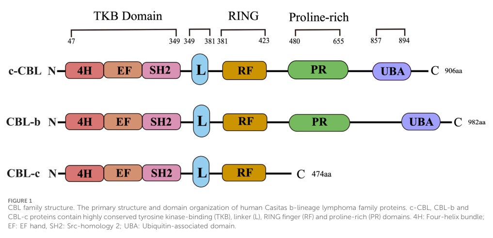

## Question

# Gene Research for Functional Annotation

## ⚠️ CRITICAL: Gene/Protein Identification Context

**BEFORE YOU BEGIN RESEARCH:** You MUST verify you are researching the CORRECT gene/protein. Gene symbols can be ambiguous, especially for less well-characterized genes from non-model organisms.

### Target Gene/Protein Identity (from UniProt):
- **UniProt Accession:** P22681
- **Protein Description:** RecName: Full=E3 ubiquitin-protein ligase CBL; EC=2.3.2.27 {ECO:0000269|PubMed:10514377, ECO:0000269|PubMed:14661060, ECO:0000269|PubMed:17509076, ECO:0000269|PubMed:40101708}; AltName: Full=Casitas B-lineage lymphoma proto-oncogene; AltName: Full=Proto-oncogene c-Cbl; AltName: Full=RING finger protein 55; AltName: Full=RING-type E3 ubiquitin transferase CBL {ECO:0000305}; AltName: Full=Signal transduction protein CBL;
- **Gene Information:** Name=CBL; Synonyms=CBL2, RNF55;
- **Organism (full):** Homo sapiens (Human).
- **Protein Family:** Not specified in UniProt
- **Key Domains:** Adaptor_Cbl. (IPR024162); Adaptor_Cbl_EF_hand-like. (IPR014741); Adaptor_Cbl_N_dom_sf. (IPR036537); Adaptor_Cbl_N_hlx. (IPR003153); Adaptor_Cbl_SH2-like. (IPR014742)

### MANDATORY VERIFICATION STEPS:

1. **Check if the gene symbol "CBL" matches the protein description above**
2. **Verify the organism is correct:** Homo sapiens (Human).
3. **Check if protein family/domains align with what you find in literature**
4. **If you find literature for a DIFFERENT gene with the same or similar symbol, STOP**

### If Gene Symbol is Ambiguous or You Cannot Find Relevant Literature:

**DO NOT PROCEED WITH RESEARCH ON A DIFFERENT GENE.** Instead:
- State clearly: "The gene symbol 'CBL' is ambiguous or literature is limited for this specific protein"
- Explain what you found (e.g., "Found extensive literature on a different gene with the same symbol in a different organism")
- Describe the protein based ONLY on the UniProt information provided above
- Suggest that the protein function can be inferred from domain/family information

### Research Target:

Please provide a comprehensive research report on the gene **CBL** (gene ID: CBL, UniProt: P22681) in human.

The research report should be a detailed narrative explaining the function, biological processes, and localization of the gene product. Citations should be given for all claims.

You should prioritize authoritative reviews and primary scientific literature when conducting research. You can supplement
this with annotations you find in gene/protein databases, but these can be outdated or inaccurate.

We are specifically interested in the primary function of the gene - for enzymes, what reaction is catalyzed, and what is the substrate specificity? For transporters, what is the substrate? For structural proteins or adapters, what is the broader structural role? For signaling molecules, what is the role in the pathway.

We are interested in where in or outside the cell the gene product carries out its function.

We are also interested in the signaling or biochemical pathways in which the gene functions. We are less interested in broad pleiotropic effects, except where these elucidate the precise role.

Include evidence where possible. We are interested in both experimental evidence as well as inference from structure, evolution, or bioinformatic analysis. Precise studies should be prioritized over high-throughput, where available.

## Output

Question: You are an expert researcher providing comprehensive, well-cited information.

Provide detailed information focusing on:
1. Key concepts and definitions with current understanding
2. Recent developments and latest research (prioritize 2023-2024 sources)
3. Current applications and real-world implementations
4. Expert opinions and analysis from authoritative sources
5. Relevant statistics and data from recent studies

Format as a comprehensive research report with proper citations. Include URLs and publication dates where available.
Always prioritize recent, authoritative sources and provide specific citations for all major claims.

# Gene Research for Functional Annotation

## ⚠️ CRITICAL: Gene/Protein Identification Context

**BEFORE YOU BEGIN RESEARCH:** You MUST verify you are researching the CORRECT gene/protein. Gene symbols can be ambiguous, especially for less well-characterized genes from non-model organisms.

### Target Gene/Protein Identity (from UniProt):
- **UniProt Accession:** P22681
- **Protein Description:** RecName: Full=E3 ubiquitin-protein ligase CBL; EC=2.3.2.27 {ECO:0000269|PubMed:10514377, ECO:0000269|PubMed:14661060, ECO:0000269|PubMed:17509076, ECO:0000269|PubMed:40101708}; AltName: Full=Casitas B-lineage lymphoma proto-oncogene; AltName: Full=Proto-oncogene c-Cbl; AltName: Full=RING finger protein 55; AltName: Full=RING-type E3 ubiquitin transferase CBL {ECO:0000305}; AltName: Full=Signal transduction protein CBL;
- **Gene Information:** Name=CBL; Synonyms=CBL2, RNF55;
- **Organism (full):** Homo sapiens (Human).
- **Protein Family:** Not specified in UniProt
- **Key Domains:** Adaptor_Cbl. (IPR024162); Adaptor_Cbl_EF_hand-like. (IPR014741); Adaptor_Cbl_N_dom_sf. (IPR036537); Adaptor_Cbl_N_hlx. (IPR003153); Adaptor_Cbl_SH2-like. (IPR014742)

### MANDATORY VERIFICATION STEPS:

1. **Check if the gene symbol "CBL" matches the protein description above**
2. **Verify the organism is correct:** Homo sapiens (Human).
3. **Check if protein family/domains align with what you find in literature**
4. **If you find literature for a DIFFERENT gene with the same or similar symbol, STOP**

### If Gene Symbol is Ambiguous or You Cannot Find Relevant Literature:

**DO NOT PROCEED WITH RESEARCH ON A DIFFERENT GENE.** Instead:
- State clearly: "The gene symbol 'CBL' is ambiguous or literature is limited for this specific protein"
- Explain what you found (e.g., "Found extensive literature on a different gene with the same symbol in a different organism")
- Describe the protein based ONLY on the UniProt information provided above
- Suggest that the protein function can be inferred from domain/family information

### Research Target:

Please provide a comprehensive research report on the gene **CBL** (gene ID: CBL, UniProt: P22681) in human.

The research report should be a detailed narrative explaining the function, biological processes, and localization of the gene product. Citations should be given for all claims.

You should prioritize authoritative reviews and primary scientific literature when conducting research. You can supplement
this with annotations you find in gene/protein databases, but these can be outdated or inaccurate.

We are specifically interested in the primary function of the gene - for enzymes, what reaction is catalyzed, and what is the substrate specificity? For transporters, what is the substrate? For structural proteins or adapters, what is the broader structural role? For signaling molecules, what is the role in the pathway.

We are interested in where in or outside the cell the gene product carries out its function.

We are also interested in the signaling or biochemical pathways in which the gene functions. We are less interested in broad pleiotropic effects, except where these elucidate the precise role.

Include evidence where possible. We are interested in both experimental evidence as well as inference from structure, evolution, or bioinformatic analysis. Precise studies should be prioritized over high-throughput, where available.

# Human CBL (c-Cbl; UniProt P22681): functional annotation

## Identity and principal function

**Identity verified.** Human **CBL** encodes **c-Cbl**, a RING-type E3 ubiquitin ligase and signaling adaptor. It is distinct from the human paralogs **CBLB** (Cbl-b) and **CBLC** (Cbl-c); findings concerning those proteins alone should not be assigned to P22681. A structural analysis explicitly identifies the human CBL sequence as UniProt **P22681**. The protein has an N-terminal tyrosine-kinase-binding (TKB) module comprising a four-helix bundle, EF-hand-like region and SH2-like phosphotyrosine-binding region, followed by a regulatory linker and E2-binding RING domain. Its C-terminal proline-rich and ubiquitin-associated regions provide additional interaction surfaces. The comparative domain layout is shown in Figure 1 of Ren and colleagues’ 2024 review. (bhowmick2013functionaldiversityand pages 9-11, ren2024theroleof pages 2-4, ren2024theroleof media 03485ed0)

**Primary biochemical role.** c-Cbl selects activated, tyrosine-phosphorylated signaling proteins and promotes transfer of **ubiquitin from an E2~ubiquitin conjugate to accessible lysine residues on the substrate**, forming a ubiquitin–substrate isopeptide bond. Thus, c-Cbl is an **E3**, not the kinase that phosphorylates its targets, a ubiquitin-activating E1, or a ubiquitin-conjugating E2. Its best-established physiological effect is to limit receptor-tyrosine-kinase signaling by promoting receptor sorting and degradation, particularly in lysosomes. The outcome of ubiquitination depends on substrate and cellular context; it is not synonymous with proteasomal degradation. (amacher2018phosphorylationcontrolof pages 1-5, umebayashi2008ubc45andccbl pages 1-2, tang2022negativeregulationof pages 1-2, ren2024theroleof pages 1-2)

## Reaction mechanism and substrate specificity

The TKB module recognizes **phosphotyrosine-containing docking sites** on activated kinases or their associated complexes, whereas the RING domain binds the ubiquitin-charged E2 and positions it for transfer. E2s implicated in cellular EGFR ubiquitination include **Ubc4/5-family enzymes**: localization, depletion and in-vitro activity experiments identified their functional cooperation with c-Cbl. The phosphotyrosine-dependent recruitment step gives c-Cbl specificity for *activated signaling complexes*, rather than for one universal substrate-lysine sequence. Experiments comparing human and evolutionarily distant Cbl proteins found that, once a kinase substrate is recruited, **lysine proximity and accessibility**, not an invariant lysine motif, largely determine which sites are modified. That inference derives from engineered kinase substrates and should not be read as a complete map of lysine choice on every native receptor. (umebayashi2008ubc45andccbl pages 1-2, amacher2018phosphorylationcontrolof pages 1-5, amacher2018phosphorylationcontrolof pages 5-9, amacher2018phosphorylationcontrolof pages 9-13)

Catalysis is itself coupled to kinase activation. Unphosphorylated c-Cbl adopts an autoinhibited arrangement of its TKB, linker and RING regions. Phosphorylation of **c-Cbl Tyr371** in the linker favors an open configuration that brings E2-bound ubiquitin into productive alignment with a TKB-bound substrate. In-vitro assays with the **human c-Cbl TKB–RING region** showed substrate ubiquitination with active Src but not kinase-inactive Src; comparative structural and biochemical work supports conservation of this phosphorylation-sensitive switch. This provides a negative-feedback mechanism: an active kinase recruits and helps activate the E3 that subsequently restrains its signaling. (amacher2018phosphorylationcontrolof pages 1-5, amacher2018phosphorylationcontrolof pages 5-9, amacher2018phosphorylationcontrolof pages 9-13)

The following table distinguishes direct mechanistic experiments from recent disease-associated observations. (amacher2018phosphorylationcontrolof pages 9-13, umebayashi2008ubc45andccbl pages 1-2, lim2024cblmutationsin pages 5-7, su2024psmd9promotesthe pages 8-11)

| Feature | Exact experimentally supported conclusion | Strongest source |
|---|---|---|
| Phosphotyrosine recognition and Tyr371 activation | The TKB module recruits phosphotyrosine-containing kinase substrates. In vitro, the human c-CBL TKB–RING region ubiquitinated Src-containing substrate constructs when Src was catalytically active, but not when Src was kinase-dead; phosphorylation of regulatory Tyr371 opens and activates c-CBL and promotes ubiquitin transfer. | Amacher et al., 2018, *Protein Science*. [DOI](https://doi.org/10.1002/pro.3397) (amacher2018phosphorylationcontrolof pages 1-5, amacher2018phosphorylationcontrolof pages 9-13) |
| E2 partner and endosomal localization | Localization, knockdown, and biochemical assays identified Ubc4/5, tested as UbcH5C, as a functional E2 partner of c-CBL. After EGF stimulation, both proteins moved first to the plasma membrane and then to Hrs-positive endosomes, where continued EGFR polyubiquitination supported Hrs-dependent lysosomal sorting. | Umebayashi et al., 2008, *Molecular Biology of the Cell*. [DOI](https://doi.org/10.1091/mbc.e07-10-0988) (umebayashi2008ubc45andccbl pages 1-2) |
| Substrate-lysine specificity | Experiments with engineered kinase substrates showed that human c-CBL can ubiquitinate multiple lysines; selection depended principally on lysine proximity and accessibility rather than a strict lysine-centered sequence motif or placement of the CBL-recruitment segment on one particular side of the kinase domain. | Amacher et al., 2018, *Protein Science*. [DOI](https://doi.org/10.1002/pro.3397) (amacher2018phosphorylationcontrolof pages 1-5, amacher2018phosphorylationcontrolof pages 5-9, amacher2018phosphorylationcontrolof pages 9-13) |
| CBL-mutant CMML cohort | In a **selected 24-patient PREACH-M trial cohort**, 11 patients had CBL variants and 7 of those 11 patients had multiple variants. These figures describe a small, enriched cohort and must not be interpreted as population prevalence; 9 of 11 also had TET2 variants, and CBL-mutant cases showed proliferative clinical features. | Lim et al., 2024, *PLOS ONE*. [DOI](https://doi.org/10.1371/journal.pone.0310641) (lim2024cblmutationsin pages 2-4, lim2024cblmutationsin pages 5-7, lim2024cblmutationsin pages 4-5) |
| PSMD9–c-CBL–EGFR routing (**HCC preclinical**) | In hepatocellular-carcinoma cell lines and mouse xenografts, PSMD9 interacted and colocalized with c-CBL, reduced c-CBL-dependent EGFR ubiquitination, and favored EGFR surface retention or recycling over EEA1-positive endosomal and LAMP1-positive lysosomal routing. PSMD9 depletion increased endosomal and lysosomal localization and sensitized models to erlotinib; this is preclinical HCC evidence, not established patient therapy. | Su et al., 2024, *Journal of Experimental & Clinical Cancer Research*. [DOI](https://doi.org/10.1186/s13046-024-03062-3) (su2024psmd9promotesthe pages 1-2, su2024psmd9promotesthe pages 8-11) |

*Table: Evidence table restricted to human c-CBL/CBL P22681, covering catalytic activation, substrate selection, endosomal function, and recent disease studies. Clinical-cohort enrichment and preclinical HCC evidence are explicitly distinguished from population prevalence and established therapy.*

## Where c-Cbl acts and which pathways it regulates

**Cellular location is dynamic.** c-Cbl acts on the **cytosolic face** of activated membrane-receptor complexes, rather than functioning as a secreted extracellular ligase. In EGF-stimulated cells, c-Cbl and Ubc4/5 were observed moving to the **plasma membrane** and subsequently to **Hrs-positive endosomes**. Continued EGFR ubiquitination after internalization supports recognition by endosomal sorting machinery and delivery toward lysosomes. Accordingly, assigning one permanent subcellular location to CBL obscures its ligand-dependent recruitment and trafficking. (umebayashi2008ubc45andccbl pages 1-2)

**EGFR is the clearest mechanistic example.** The c-Cbl TKB region binds activated EGFR at **phospho-Tyr1045**; adaptor-mediated recruitment through **GRB2** provides another route involving EGFR phosphotyrosines **Tyr1068/Tyr1086**. Ubiquitinated EGFR is directed into endosomal sorting pathways and eventually degraded in lysosomes, attenuating signaling through downstream **ERK/MAPK** and **PI3K–AKT** networks. The precise contribution of ubiquitination to the *initial* internalization step depends on experimental conditions: evidence strongly supports a role in **post-internalization lysosomal sorting**, but does not justify claiming that c-Cbl-dependent ubiquitination is universally necessary for all EGFR entry into cells. Other Cbl-family ligases can also contribute, so a family-level EGFR result is not automatically c-Cbl-specific. (tang2022negativeregulationof pages 2-3, tench2026targetingcblubiquitin pages 16-19, umebayashi2008ubc45andccbl pages 1-2, 19762008theegfrwithin pages 154-158, su2024psmd9promotesthe pages 8-11)

The broader supported substrate class includes activated receptor tyrosine kinases such as **MET/HGFR, PDGFR, FGFR2 and CSF1R**, in addition to EGFR; c-Cbl-dependent regulation can also extend to non-receptor tyrosine-kinase signaling. Recruitment routes and contributions from Cbl-b differ between receptors: for example, the reviewed evidence for **PDGFRβ** includes a Cbl-b-dependent route for c-Cbl association, rather than universal direct recognition by c-Cbl. c-Cbl also serves as an **adaptor** through its proline-rich and phosphorylated regions, meaning loss of RING-mediated ligase activity need not eliminate all receptor-complex binding or downstream signaling interactions. (tang2022negativeregulationof pages 2-3, tang2022negativeregulationof pages 1-2, ren2024theroleof pages 1-2, tench2026targetingcblubiquitin pages 16-19, ren2024theroleof pages 2-4)

## Developments in 2024 and clinical relevance

**CBL-mutant myeloid disease.** In a study published **19 September 2024**, Lim and colleagues sequenced a **selected, 24-patient CMML trial cohort**: **11/24** had a CBL variant, **7/11** CBL-mutant patients had multiple CBL variants, and **9/11** also had a TET2 variant. CBL-mutant cases showed higher marrow blasts, leukocyte counts and spleen measurements than the stated comparator group. Variants were enriched in the **RING domain** in CMML, in contrast to the linker-region emphasis reported for juvenile myelomonocytic leukemia (**P < 0.0001** for the domain-distribution comparison). These results illustrate the clinical relevance of disrupting E3 regulation, but **11/24 is not an estimate of CMML population prevalence**: the cohort was small and selected. The authors describe an approximately **15%** CBL-mutation frequency in CMML and JMML based on the wider literature, and propose receptor-directed targeting as a research direction—not an established CBL-specific treatment. (lim2024cblmutationsin pages 1-2, lim2024cblmutationsin pages 2-4, lim2024cblmutationsin pages 5-7, lim2024cblmutationsin pages 4-5)

**Altered EGFR trafficking in liver-cancer models.** A **May 2024** experimental study found that **PSMD9 interacts with c-Cbl**, suppresses EGFR ubiquitination and shifts EGFR trafficking away from endosomal/lysosomal degradation, accompanying increased ERK and AKT signaling in hepatocellular-carcinoma models. PSMD9 depletion increased EGFR association with **EEA1-positive endosomes and LAMP1-positive lysosomal compartments** and improved response to **erlotinib in cell and animal experiments**. Independently, a **2024** liver-cancer study reported that **SERPINE2 competes with c-Cbl for EGFR interaction**, limiting EGFR ubiquitination and degradation; its drug-sensitization observations were likewise experimental. These studies explain how tumors may preserve receptor signaling *without mutating CBL itself*, but neither demonstrates an approved CBL-directed therapy or patient-level treatment benefit from manipulating c-Cbl. (su2024psmd9promotesthe pages 1-2, su2024psmd9promotesthe pages 8-11, zhang2024serpine2promotesliver pages 1-2)

**Interpretation.** The strongest annotation for **human CBL/P22681** is a **phosphotyrosine-recruited, phosphorylation-activated RING E3 ligase that provides negative feedback on tyrosine-kinase signaling at the plasma membrane and endosomes**, with additional adaptor functions. Direct biochemical and trafficking experiments support that assignment more strongly than associations between CBL expression and broad cancer phenotypes. Because c-Cbl shares substrates and conserved domains with Cbl-b, substrate claims are strongest where experiments distinguish the two. (amacher2018phosphorylationcontrolof pages 1-5, umebayashi2008ubc45andccbl pages 1-2, ren2024theroleof pages 2-4, lim2024cblmutationsin pages 5-7)

### Selected sources and links

- **Amacher et al.**, *Protein Science*, **May 2018**: comparative structure–function and human-CBL substrate experiments. https://doi.org/10.1002/pro.3397 (amacher2018phosphorylationcontrolof pages 1-5, amacher2018phosphorylationcontrolof pages 9-13)
- **Umebayashi et al.**, *Molecular Biology of the Cell*, **August 2008**: c-Cbl/Ubc4–5 activity and plasma-membrane-to-endosome trafficking. https://doi.org/10.1091/mbc.e07-10-0988 (umebayashi2008ubc45andccbl pages 1-2)
- **Tang, Langdon and Zhang**, *Frontiers in Endocrinology*, **28 July 2022**: review of Cbl-family receptor substrates and receptor-specific qualifications. https://doi.org/10.3389/fendo.2022.971162 (tang2022negativeregulationof pages 2-3, tang2022negativeregulationof pages 1-2)
- **Ren et al.**, *Frontiers in Pharmacology*, **26 July 2024**: CBL-family domain comparison and cancer-focused review. https://doi.org/10.3389/fphar.2024.1432545 (ren2024theroleof pages 1-2, ren2024theroleof pages 2-4, ren2024theroleof media 03485ed0)
- **Lim et al.**, *PLOS ONE*, **19 September 2024**: CBL variants in a selected CMML cohort. https://doi.org/10.1371/journal.pone.0310641 (lim2024cblmutationsin pages 1-2, lim2024cblmutationsin pages 5-7)
- **Su et al.**, *Journal of Experimental & Clinical Cancer Research*, **May 2024**: PSMD9–c-Cbl–EGFR trafficking in liver-cancer models. https://doi.org/10.1186/s13046-024-03062-3 (su2024psmd9promotesthe pages 1-2, su2024psmd9promotesthe pages 8-11)
- **Zhang et al.**, *Cancer Communications*, **2024**: SERPINE2 competition with c-Cbl at EGFR in liver-cancer models. https://doi.org/10.1002/cac2.12527 (zhang2024serpine2promotesliver pages 1-2)

References

1. (bhowmick2013functionaldiversityand pages 9-11): Pallab Bhowmick, Rita Pancsa, Mainak Guharoy, and Peter Tompa. Functional diversity and structural disorder in the human ubiquitination pathway. PLoS ONE, 8:e65443, May 2013. URL: https://doi.org/10.1371/journal.pone.0065443, doi:10.1371/journal.pone.0065443. This article has 40 citations and is from a peer-reviewed journal.

2. (ren2024theroleof pages 2-4): Jiaqi Ren, Linlin Lv, Xufeng Tao, Xiaohan Zhai, Xuyang Chen, Hao Yu, Xinya Zhao, Xin Kong, Zhan Yu, Deshi Dong, and Jing Liu. The role of cbl family ubiquitin ligases in cancer progression and therapeutic strategies. Frontiers in Pharmacology, Jul 2024. URL: https://doi.org/10.3389/fphar.2024.1432545, doi:10.3389/fphar.2024.1432545. This article has 22 citations.

3. (ren2024theroleof media 03485ed0): Jiaqi Ren, Linlin Lv, Xufeng Tao, Xiaohan Zhai, Xuyang Chen, Hao Yu, Xinya Zhao, Xin Kong, Zhan Yu, Deshi Dong, and Jing Liu. The role of cbl family ubiquitin ligases in cancer progression and therapeutic strategies. Frontiers in Pharmacology, Jul 2024. URL: https://doi.org/10.3389/fphar.2024.1432545, doi:10.3389/fphar.2024.1432545. This article has 22 citations.

4. (amacher2018phosphorylationcontrolof pages 1-5): Jeanine F. Amacher, Helen T. Hobbs, Aaron C. Cantor, Lochan Shah, Marco‐Jose Rivero, Sarah A. Mulchand, and John Kuriyan. Phosphorylation control of the ubiquitin ligase cbl is conserved in choanoflagellates. Protein Science, 27:923-932, May 2018. URL: https://doi.org/10.1002/pro.3397, doi:10.1002/pro.3397. This article has 11 citations and is from a peer-reviewed journal.

5. (umebayashi2008ubc45andccbl pages 1-2): Kyohei Umebayashi, Harald Stenmark, and Tamotsu Yoshimori. Ubc4/5 and c-cbl continue to ubiquitinate egf receptor after internalization to facilitate polyubiquitination and degradation. Molecular biology of the cell, 19 8:3454-62, Aug 2008. URL: https://doi.org/10.1091/mbc.e07-10-0988, doi:10.1091/mbc.e07-10-0988. This article has 150 citations and is from a domain leading peer-reviewed journal.

6. (tang2022negativeregulationof pages 1-2): Rong Tang, Wallace Y. Langdon, and Jian Zhang. Negative regulation of receptor tyrosine kinases by ubiquitination: key roles of the cbl family of e3 ubiquitin ligases. Frontiers in Endocrinology, Jul 2022. URL: https://doi.org/10.3389/fendo.2022.971162, doi:10.3389/fendo.2022.971162. This article has 47 citations.

7. (ren2024theroleof pages 1-2): Jiaqi Ren, Linlin Lv, Xufeng Tao, Xiaohan Zhai, Xuyang Chen, Hao Yu, Xinya Zhao, Xin Kong, Zhan Yu, Deshi Dong, and Jing Liu. The role of cbl family ubiquitin ligases in cancer progression and therapeutic strategies. Frontiers in Pharmacology, Jul 2024. URL: https://doi.org/10.3389/fphar.2024.1432545, doi:10.3389/fphar.2024.1432545. This article has 22 citations.

8. (amacher2018phosphorylationcontrolof pages 5-9): Jeanine F. Amacher, Helen T. Hobbs, Aaron C. Cantor, Lochan Shah, Marco‐Jose Rivero, Sarah A. Mulchand, and John Kuriyan. Phosphorylation control of the ubiquitin ligase cbl is conserved in choanoflagellates. Protein Science, 27:923-932, May 2018. URL: https://doi.org/10.1002/pro.3397, doi:10.1002/pro.3397. This article has 11 citations and is from a peer-reviewed journal.

9. (amacher2018phosphorylationcontrolof pages 9-13): Jeanine F. Amacher, Helen T. Hobbs, Aaron C. Cantor, Lochan Shah, Marco‐Jose Rivero, Sarah A. Mulchand, and John Kuriyan. Phosphorylation control of the ubiquitin ligase cbl is conserved in choanoflagellates. Protein Science, 27:923-932, May 2018. URL: https://doi.org/10.1002/pro.3397, doi:10.1002/pro.3397. This article has 11 citations and is from a peer-reviewed journal.

10. (lim2024cblmutationsin pages 5-7): Kelly Lim, Winnie L. Kan, Pramod C. Nair, Monika Kutyna, Angel F. Lopez, Timothy Hercus, David M. Ross, Steven Lane, Chun Yew Fong, Anna Brown, Agnes Yong, David Yeung, Timothy Hughes, Devendra Hiwase, and Daniel Thomas. Cbl mutations in chronic myelomonocytic leukemia often occur in the ring domain with multiple subclones per patient: implications for targeting. PLOS ONE, 19:e0310641, Sep 2024. URL: https://doi.org/10.1371/journal.pone.0310641, doi:10.1371/journal.pone.0310641. This article has 6 citations and is from a peer-reviewed journal.

11. (su2024psmd9promotesthe pages 8-11): Yuting Su, Lili Meng, Chao Ge, Yuqi Liu, Chi Zhang, Yue Yang, Wei Tian, and Hua Tian. Psmd9 promotes the malignant progression of hepatocellular carcinoma by interacting with c-cbl to activate egfr signaling and recycling. Journal of Experimental & Clinical Cancer Research : CR, May 2024. URL: https://doi.org/10.1186/s13046-024-03062-3, doi:10.1186/s13046-024-03062-3. This article has 22 citations.

12. (lim2024cblmutationsin pages 2-4): Kelly Lim, Winnie L. Kan, Pramod C. Nair, Monika Kutyna, Angel F. Lopez, Timothy Hercus, David M. Ross, Steven Lane, Chun Yew Fong, Anna Brown, Agnes Yong, David Yeung, Timothy Hughes, Devendra Hiwase, and Daniel Thomas. Cbl mutations in chronic myelomonocytic leukemia often occur in the ring domain with multiple subclones per patient: implications for targeting. PLOS ONE, 19:e0310641, Sep 2024. URL: https://doi.org/10.1371/journal.pone.0310641, doi:10.1371/journal.pone.0310641. This article has 6 citations and is from a peer-reviewed journal.

13. (lim2024cblmutationsin pages 4-5): Kelly Lim, Winnie L. Kan, Pramod C. Nair, Monika Kutyna, Angel F. Lopez, Timothy Hercus, David M. Ross, Steven Lane, Chun Yew Fong, Anna Brown, Agnes Yong, David Yeung, Timothy Hughes, Devendra Hiwase, and Daniel Thomas. Cbl mutations in chronic myelomonocytic leukemia often occur in the ring domain with multiple subclones per patient: implications for targeting. PLOS ONE, 19:e0310641, Sep 2024. URL: https://doi.org/10.1371/journal.pone.0310641, doi:10.1371/journal.pone.0310641. This article has 6 citations and is from a peer-reviewed journal.

14. (su2024psmd9promotesthe pages 1-2): Yuting Su, Lili Meng, Chao Ge, Yuqi Liu, Chi Zhang, Yue Yang, Wei Tian, and Hua Tian. Psmd9 promotes the malignant progression of hepatocellular carcinoma by interacting with c-cbl to activate egfr signaling and recycling. Journal of Experimental & Clinical Cancer Research : CR, May 2024. URL: https://doi.org/10.1186/s13046-024-03062-3, doi:10.1186/s13046-024-03062-3. This article has 22 citations.

15. (tang2022negativeregulationof pages 2-3): Rong Tang, Wallace Y. Langdon, and Jian Zhang. Negative regulation of receptor tyrosine kinases by ubiquitination: key roles of the cbl family of e3 ubiquitin ligases. Frontiers in Endocrinology, Jul 2022. URL: https://doi.org/10.3389/fendo.2022.971162, doi:10.3389/fendo.2022.971162. This article has 47 citations.

16. (tench2026targetingcblubiquitin pages 16-19): Andrea J. Tench, Claire E. Martin, Craig D. Simpson, Leanne E. Wybenga-Groot, Diane Ly, Christopher Fladd, Melissa H. Elgie, Syed F. Ahmed, Roger Belizaire, Danny T. Huang, Anne-Claude Gingras, and C. Jane McGlade. Targeting cbl ubiquitin ligase activation to downregulate tyrosine kinase signalling. bioRxiv, Mar 2026. URL: https://doi.org/10.64898/2026.03.16.712190, doi:10.64898/2026.03.16.712190. This article has 0 citations.

17. (19762008theegfrwithin pages 154-158): 1976- Pennock, Steven. The egfr within: from endosomal signaling to cbl-mediated degradation. Text, 2008. URL: https://doi.org/10.7939/r3-8fc8-6107, doi:10.7939/r3-8fc8-6107. This article has 0 citations and is from a peer-reviewed journal.

18. (lim2024cblmutationsin pages 1-2): Kelly Lim, Winnie L. Kan, Pramod C. Nair, Monika Kutyna, Angel F. Lopez, Timothy Hercus, David M. Ross, Steven Lane, Chun Yew Fong, Anna Brown, Agnes Yong, David Yeung, Timothy Hughes, Devendra Hiwase, and Daniel Thomas. Cbl mutations in chronic myelomonocytic leukemia often occur in the ring domain with multiple subclones per patient: implications for targeting. PLOS ONE, 19:e0310641, Sep 2024. URL: https://doi.org/10.1371/journal.pone.0310641, doi:10.1371/journal.pone.0310641. This article has 6 citations and is from a peer-reviewed journal.

19. (zhang2024serpine2promotesliver pages 1-2): Shiyu Zhang, Xing Jia, Haojiang Dai, Xingxin Zhu, Wenfeng Song, Suchen Bian, Hao Wu, Shinuo Chen, Yangbo Tang, Junran Chen, Cheng Jin, Mengqiao Zhou, Haiyang Xie, Shusen Zheng, and Penghong Song. Serpine2 promotes liver cancer metastasis by inhibiting c‐cbl‐mediated egfr ubiquitination and degradation. Cancer Communications, 44:384-407, Feb 2024. URL: https://doi.org/10.1002/cac2.12527, doi:10.1002/cac2.12527. This article has 49 citations.

## Artifacts

- [Edison artifact artifact-00](CBL-deep-research-falcon_artifacts/artifact-00.md)

## Citations

1. bhowmick2013functionaldiversityand pages 9-11
2. ren2024theroleof pages 2-4
3. amacher2018phosphorylationcontrolof pages 1-5
4. tang2022negativeregulationof pages 1-2
5. ren2024theroleof pages 1-2
6. amacher2018phosphorylationcontrolof pages 5-9
7. amacher2018phosphorylationcontrolof pages 9-13
8. lim2024cblmutationsin pages 5-7
9. lim2024cblmutationsin pages 2-4
10. lim2024cblmutationsin pages 4-5
11. tang2022negativeregulationof pages 2-3
12. tench2026targetingcblubiquitin pages 16-19
13. lim2024cblmutationsin pages 1-2
14. DOI
15. https://doi.org/10.1002/pro.3397
16. https://doi.org/10.1091/mbc.e07-10-0988
17. https://doi.org/10.1371/journal.pone.0310641
18. https://doi.org/10.1186/s13046-024-03062-3
19. https://doi.org/10.3389/fendo.2022.971162
20. https://doi.org/10.3389/fphar.2024.1432545
21. https://doi.org/10.1002/cac2.12527
22. https://doi.org/10.1371/journal.pone.0065443,
23. https://doi.org/10.3389/fphar.2024.1432545,
24. https://doi.org/10.1002/pro.3397,
25. https://doi.org/10.1091/mbc.e07-10-0988,
26. https://doi.org/10.3389/fendo.2022.971162,
27. https://doi.org/10.1371/journal.pone.0310641,
28. https://doi.org/10.1186/s13046-024-03062-3,
29. https://doi.org/10.64898/2026.03.16.712190,
30. https://doi.org/10.7939/r3-8fc8-6107,
31. https://doi.org/10.1002/cac2.12527,