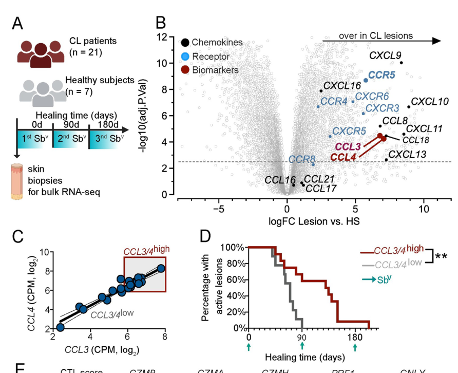

## Question

# Gene Research for Functional Annotation

## ⚠️ CRITICAL: Gene/Protein Identification Context

**BEFORE YOU BEGIN RESEARCH:** You MUST verify you are researching the CORRECT gene/protein. Gene symbols can be ambiguous, especially for less well-characterized genes from non-model organisms.

### Target Gene/Protein Identity (from UniProt):
- **UniProt Accession:** P13236
- **Protein Description:** RecName: Full=C-C motif chemokine 4; AltName: Full=G-26 T-lymphocyte-secreted protein; AltName: Full=HC21; AltName: Full=Lymphocyte activation gene 1 protein; Short=LAG-1; AltName: Full=MIP-1-beta(1-69); AltName: Full=Macrophage inflammatory protein 1-beta; Short=MIP-1-beta; AltName: Full=PAT 744; AltName: Full=Protein H400; AltName: Full=SIS-gamma; AltName: Full=Small-inducible cytokine A4; AltName: Full=T-cell activation protein 2; Short=ACT-2; Contains: RecName: Full=MIP-1-beta(3-69); Flags: Precursor;
- **Gene Information:** Name=CCL4; Synonyms=LAG1, MIP1B, SCYA4;
- **Organism (full):** Homo sapiens (Human).
- **Protein Family:** Belongs to the intercrine beta (chemokine CC) family.
- **Key Domains:** Chemokine_b/g/d. (IPR039809); Chemokine_CC_CS. (IPR000827); Chemokine_IL8-like_dom. (IPR001811); Interleukin_8-like_sf. (IPR036048); IL8 (PF00048)

### MANDATORY VERIFICATION STEPS:

1. **Check if the gene symbol "CCL4" matches the protein description above**
2. **Verify the organism is correct:** Homo sapiens (Human).
3. **Check if protein family/domains align with what you find in literature**
4. **If you find literature for a DIFFERENT gene with the same or similar symbol, STOP**

### If Gene Symbol is Ambiguous or You Cannot Find Relevant Literature:

**DO NOT PROCEED WITH RESEARCH ON A DIFFERENT GENE.** Instead:
- State clearly: "The gene symbol 'CCL4' is ambiguous or literature is limited for this specific protein"
- Explain what you found (e.g., "Found extensive literature on a different gene with the same symbol in a different organism")
- Describe the protein based ONLY on the UniProt information provided above
- Suggest that the protein function can be inferred from domain/family information

### Research Target:

Please provide a comprehensive research report on the gene **CCL4** (gene ID: CCL4, UniProt: P13236) in human.

The research report should be a detailed narrative explaining the function, biological processes, and localization of the gene product. Citations should be given for all claims.

You should prioritize authoritative reviews and primary scientific literature when conducting research. You can supplement
this with annotations you find in gene/protein databases, but these can be outdated or inaccurate.

We are specifically interested in the primary function of the gene - for enzymes, what reaction is catalyzed, and what is the substrate specificity? For transporters, what is the substrate? For structural proteins or adapters, what is the broader structural role? For signaling molecules, what is the role in the pathway.

We are interested in where in or outside the cell the gene product carries out its function.

We are also interested in the signaling or biochemical pathways in which the gene functions. We are less interested in broad pleiotropic effects, except where these elucidate the precise role.

Include evidence where possible. We are interested in both experimental evidence as well as inference from structure, evolution, or bioinformatic analysis. Precise studies should be prioritized over high-throughput, where available.

## Output

Question: You are an expert researcher providing comprehensive, well-cited information.

Provide detailed information focusing on:
1. Key concepts and definitions with current understanding
2. Recent developments and latest research (prioritize 2023-2024 sources)
3. Current applications and real-world implementations
4. Expert opinions and analysis from authoritative sources
5. Relevant statistics and data from recent studies

Format as a comprehensive research report with proper citations. Include URLs and publication dates where available.
Always prioritize recent, authoritative sources and provide specific citations for all major claims.

# Gene Research for Functional Annotation

## ⚠️ CRITICAL: Gene/Protein Identification Context

**BEFORE YOU BEGIN RESEARCH:** You MUST verify you are researching the CORRECT gene/protein. Gene symbols can be ambiguous, especially for less well-characterized genes from non-model organisms.

### Target Gene/Protein Identity (from UniProt):
- **UniProt Accession:** P13236
- **Protein Description:** RecName: Full=C-C motif chemokine 4; AltName: Full=G-26 T-lymphocyte-secreted protein; AltName: Full=HC21; AltName: Full=Lymphocyte activation gene 1 protein; Short=LAG-1; AltName: Full=MIP-1-beta(1-69); AltName: Full=Macrophage inflammatory protein 1-beta; Short=MIP-1-beta; AltName: Full=PAT 744; AltName: Full=Protein H400; AltName: Full=SIS-gamma; AltName: Full=Small-inducible cytokine A4; AltName: Full=T-cell activation protein 2; Short=ACT-2; Contains: RecName: Full=MIP-1-beta(3-69); Flags: Precursor;
- **Gene Information:** Name=CCL4; Synonyms=LAG1, MIP1B, SCYA4;
- **Organism (full):** Homo sapiens (Human).
- **Protein Family:** Belongs to the intercrine beta (chemokine CC) family.
- **Key Domains:** Chemokine_b/g/d. (IPR039809); Chemokine_CC_CS. (IPR000827); Chemokine_IL8-like_dom. (IPR001811); Interleukin_8-like_sf. (IPR036048); IL8 (PF00048)

### MANDATORY VERIFICATION STEPS:

1. **Check if the gene symbol "CCL4" matches the protein description above**
2. **Verify the organism is correct:** Homo sapiens (Human).
3. **Check if protein family/domains align with what you find in literature**
4. **If you find literature for a DIFFERENT gene with the same or similar symbol, STOP**

### If Gene Symbol is Ambiguous or You Cannot Find Relevant Literature:

**DO NOT PROCEED WITH RESEARCH ON A DIFFERENT GENE.** Instead:
- State clearly: "The gene symbol 'CCL4' is ambiguous or literature is limited for this specific protein"
- Explain what you found (e.g., "Found extensive literature on a different gene with the same symbol in a different organism")
- Describe the protein based ONLY on the UniProt information provided above
- Suggest that the protein function can be inferred from domain/family information

### Research Target:

Please provide a comprehensive research report on the gene **CCL4** (gene ID: CCL4, UniProt: P13236) in human.

The research report should be a detailed narrative explaining the function, biological processes, and localization of the gene product. Citations should be given for all claims.

You should prioritize authoritative reviews and primary scientific literature when conducting research. You can supplement
this with annotations you find in gene/protein databases, but these can be outdated or inaccurate.

We are specifically interested in the primary function of the gene - for enzymes, what reaction is catalyzed, and what is the substrate specificity? For transporters, what is the substrate? For structural proteins or adapters, what is the broader structural role? For signaling molecules, what is the role in the pathway.

We are interested in where in or outside the cell the gene product carries out its function.

We are also interested in the signaling or biochemical pathways in which the gene functions. We are less interested in broad pleiotropic effects, except where these elucidate the precise role.

Include evidence where possible. We are interested in both experimental evidence as well as inference from structure, evolution, or bioinformatic analysis. Precise studies should be prioritized over high-throughput, where available.

# Functional annotation of human CCL4 (UniProt P13236)

## Identity and primary function

**Identity verified.** Human **CCL4** encodes **C-C motif chemokine 4**, also called **macrophage inflammatory protein-1β (MIP-1β)**. A chemokine reference explicitly pairs CCL4/MIP-1β with UniProt **P13236** and distinguishes it from **CCL3/MIP-1α**; **CCL4L1** is a separate, closely related gene. The supplied intercrine-beta/CC-chemokine and IL-8-like domain annotations agree with the literature’s CC-chemokine classification. This report concerns human CCL4, not those paralogs or a similarly named protein in another organism. [Yoshie and Matsushima, 2017](https://doi.org/10.1002/9783527692156.ch25). (messinagraham2016roleofstat3 pages 16-22, yoshie2017chemokinesandchemotaxis pages 1-4)

CCL4 is a **secreted signaling ligand, not an enzyme or transporter**. Its best-established direct function is to activate **CCR5**, a cell-surface chemokine G-protein-coupled receptor, and thereby direct the positioning and recruitment of responsive immune cells toward sources of the ligand. Its effects depend on which cells express CCR5, where CCL4 is released, and whether the mature protein has been proteolytically processed. CCL3 and CCL5 also activate CCR5, so a phenotype produced by CCR5 blockade is not, by itself, evidence of an exclusive CCL4 effect. [Yoshie and Matsushima, 2017](https://doi.org/10.1002/9783527692156.ch25); [Mempel *et al.*, 2024](https://doi.org/10.1038/s41568-023-00635-w). (messinagraham2016roleofstat3 pages 16-22, yoshie2017chemokinesandchemotaxis pages 1-4, mempel2024howchemokinesorganize pages 2-4)

## Where the protein acts

CCL4 acts **outside its producing cell**, in secreted fluid and the extracellular environment of tissues, where it encounters CCR5 on other cells. This localization is demonstrated directly by purification of native MIP-1β from activated human lymphocyte **culture supernatants** and by measurement of CCL4 released from primary human natural-killer (NK) cells after target recognition. Activated human CD8⁺ T cells are another demonstrated source; production is therefore not confined to macrophages despite the historical name “macrophage inflammatory protein.” In NK-cell experiments, release was detectable within **one hour** of encountering target cells; the six-hour secretion profile involved **eight donors**, and secretion kinetics involved **five**. [Guan *et al.*, August 2002](https://doi.org/10.1074/jbc.m203077200); [Fauriat *et al.*, March 2010](https://doi.org/10.1182/blood-2009-08-238469); [Cocchi *et al.*, December 1995](https://doi.org/10.1126/science.270.5243.1811). (guan2002naturaltruncationof pages 1-3, cocchi1995identificationofrantes pages 1-2, fauriat2010regulationofhuman pages 1-2, fauriat2010regulationofhuman pages 2-3)

Extracellular chemokine interactions with **glycosaminoglycans (GAGs)** can retain ligands near cell surfaces or matrix and help organize directional cues rather than leaving all secreted protein uniformly dispersed. CCL4 forms concentration-dependent oligomeric or polymeric assemblies: structural and small-angle X-ray scattering work identified **rod-shaped MIP-1β polymers**, with a reported particle radius of approximately **47 Å** under the tested conditions. Such assemblies and GAG interactions are relevant to presentation and availability; they should not be equated with the receptor-activating molecular form in every setting. Notably, a specialist review identifies CCL4 as **acidic**, an exception to the common shorthand that chemokines are basic proteins. [Ren *et al.*, December 2010](https://doi.org/10.1038/emboj.2010.256); [Proudfoot *et al.*, August 2017](https://doi.org/10.3390/ph10030070). (proudfoot2017glycosaminoglycaninteractionswith pages 3-5, ren2010polymerizationofmip‐1 pages 6-7, ren2010polymerizationofmip‐1 pages 4-6, ren2010polymerizationofmip‐1 pages 1-2)

## Receptor specificity, processing, and signaling

The **CC** designation refers to adjacent conserved cysteines in the mature chemokine; the conserved chemokine fold is stabilized by two disulfide bonds. This architecture supports its annotation as an extracellular chemotactic cytokine, but receptor selectivity must be established experimentally rather than inferred from the domain alone. [Yoshie and Matsushima, 2017](https://doi.org/10.1002/9783527692156.ch25). (yoshie2017chemokinesandchemotaxis pages 1-4, yoshie2017chemokinesandchemotaxis pages 10-13)

A particularly informative human study purified naturally secreted CCL4 from activated peripheral-blood lymphocytes. Mass spectrometry identified **MIP-1β(3–69), 7,658 Da**: this form lacks the amino-terminal Ala-Pro dipeptide of **MIP-1β(1–69)**. At **5 nM**, both forms elicited intracellular Ca²⁺ responses in cells expressing recombinant **CCR5**. The truncated protein additionally elicited responses through **CCR1 and CCR2b** in receptor-expressing assay cells, whereas the full-length protein did not under those conditions. Both forms reduced cell-surface CCR5 and inhibited CCR5-mediated entry of the tested HIV-1 strain into T cells; the viral-entry comparison used **30 nM** chemokine. Subsequent experiments identified **CD26/DPP4** as an enzyme capable of removing the N-terminal dipeptide and showed that DPP4-inhibitory peptides reduced processing in activated lymphocyte cultures. Thus, “CCL4 binds only CCR5” is an inadequate annotation unless the **proteoform** and assay context are specified. [Guan *et al.*, August 2002](https://doi.org/10.1074/jbc.m203077200); [Guan *et al.*, May 2004](https://doi.org/10.1002/jcb.20041). (guan2002naturaltruncationof pages 1-3, guan2004amino‐terminalprocessingof pages 4-9, guan2002naturaltruncationof pages 3-4)

At the pathway level, CCR5 activation provides the connection from an **extracellular CCL4 cue** to receptor-dependent Ca²⁺ signaling, migration, and changes in receptor availability. Classical chemokine receptors commonly engage **Gαi-associated signaling**, second-messenger and cytoskeletal pathways, and phosphorylation/β-arrestin-associated receptor regulation. Those are useful pathway context, **not proof that every downstream branch has been measured specifically for human CCL4 in every responding cell**. Direct CCL4 evidence is strongest here for receptor-dependent Ca²⁺ responses and surface-CCR5 down-modulation. Receptor output can also differ by ligand: in primary human macrophages, HIV gp120—but **not CCL4**—activated the particular phosphatidylcholine-specific phospholipase C–NF-κB–CCL2 secretion response tested. [Mempel *et al.*, 2024](https://doi.org/10.1038/s41568-023-00635-w); [Guan *et al.*, August 2002](https://doi.org/10.1074/jbc.m203077200); [Fantuzzi *et al.*, April 2008](https://doi.org/10.1182/blood-2007-08-104901). (mempel2024howchemokinesorganize pages 2-4, fantuzzi2008phosphatidylcholinespecificphospholipasec pages 1-2, guan2002naturaltruncationof pages 1-3)

## Biological processes: what is established, and what is context-dependent

**Leukocyte recruitment and antitumor immune organization.** In a mechanistic melanoma model, tumor-intrinsic β-catenin signaling suppressed tumor **Ccl4** and impaired recruitment of **CD103⁺/BATF3-lineage dendritic cells**. CCR5 expression and migration toward CCL4 were examined in the dendritic-cell compartment. A subsequent **mouse** study delivered CCL4 fused to a collagen-binding domain to tumors and observed increased CD103⁺ dendritic-cell and CD8⁺ T-cell accumulation with improved checkpoint-therapy activity. In BATF3-deficient animals, the recruitment effect fell by **more than 80%**, and blocking **CXCR3** eliminated antitumor benefit. The supported sequence is therefore local **CCL4 → dendritic-cell recruitment → dendritic-cell-associated CXCL9/10 → CXCR3-dependent effector-T-cell recruitment**; it should not automatically be described as direct CCL4-driven homing of every infiltrating T cell. These intervention results are preclinical, not evidence that a CCL4 fusion treats human cancer. [Spranger *et al.*, May 2015](https://doi.org/10.1038/nature14404); [Williford *et al.*, December 2019](https://doi.org/10.1126/sciadv.aay1357); [Reschke *et al.*, June 2024](https://doi.org/10.3390/ijms25126532). (reschke2024chemokinesandcytokines pages 4-5, spranger2015melanomaintrinsicβcateninsignalling pages 4-4, williford2019recruitmentofcd103 pages 5-7)

**Recent human infection data, with causal limits.** In cutaneous leishmaniasis, a **May 2024** study compared lesion RNA sequencing from **21 patients and seven healthy controls**. CCR5 was the most differentially expressed receptor among those assessed, and **CCL3 and CCL4** were enriched in lesions; higher *combined* CCL3/CCL4 expression was associated with delayed healing and a cytolytic-cell signature. Peripheral-blood analyses compared **50 patients and 14 controls** and also found elevated CCL3/CCL4 expression. In complementary **mouse** experiments, approximately **10%** of lesion CD8⁺ T cells expressed CCR5 versus **less than 1%** in draining nodes or spleen; transfer of CCR5-deficient CD8⁺ cells or treatment with the CCR5 antagonist maraviroc reduced lesions **without reducing parasite burden**. These results support pathological **CCR5-dependent cell recruitment**, but the human measurements are observational and neither mouse intervention selectively removes CCL4: CCL3 is co-expressed and can use the same receptor. Figure 1 of the patient study shows the expression and healing analyses. [Sacramento *et al.*, May 6, 2024](https://doi.org/10.1371/journal.ppat.1012211). (sacramento2024ccr5promotesthe pages 2-4, sacramento2024ccr5promotesthe pages 4-6, sacramento2024ccr5promotesthe pages 6-8, sacramento2024ccr5promotesthe media dd99cc5a, sacramento2024ccr5promotesthe pages 13-14)

**Additional 2024 disease contexts.** A **December 2024** multimodal study of post-transplant lymphoproliferative disorders analyzed **60 human biopsies** (**42 EBV-positive, 18 EBV-negative**). EBV-positive B-lymphoma lines expressed and secreted CCL4 along with CCL3, and their conditioned media promoted monocyte-cell migration. Because multiple chemokines differed and **CCL4 itself was not selectively depleted or rescued**, the migration phenotype cannot be assigned uniquely to CCL4. Separately, a **November 2024** low-grade-glioma study identified Ccl4-expressing exhausted CD8⁺ cells in **mouse** optic-nerve tumors; combination checkpoint-antibody treatment reduced optic-nerve *Ccl4* mRNA by **75%**. Its human single-cell observations support relevance of an exhausted-T-cell state, but do not establish that human CCL4 causes glioma growth. Together these findings illustrate why the same chemokine can accompany favorable immune-cell organization in one tumor and a harmful cellular circuit in another. [Toh *et al.*, December 2024](https://doi.org/10.1016/j.xcrm.2024.101851); [Barakat *et al.*, November 2024](https://doi.org/10.1038/s41467-024-54569-4). (barakat2024humansinglecell pages 1-2, barakat2024humansinglecell pages 6-7, toh2024multimodalanalysisreveals pages 5-7, toh2024multimodalanalysisreveals pages 12-13, toh2024multimodalanalysisreveals pages 23-25)

**HIV entry inhibition.** CCL4’s engagement and down-modulation of CCR5 also explain a distinct, experimentally observed antiviral consequence: reduced entry of **CCR5-using HIV** in the tested cell systems. Foundational work found MIP-1β among chemokines released by primary CD8⁺ T cells and showed that **combined neutralization of MIP-1β, MIP-1α, and RANTES** removed HIV-suppressive activity from a CD8⁺-cell supernatant. That experiment establishes a shared contribution, not exclusive suppression by CCL4. [Cocchi *et al.*, December 1995](https://doi.org/10.1126/science.270.5243.1811); [Guan *et al.*, August 2002](https://doi.org/10.1074/jbc.m203077200). (cocchi1995identificationofrantes pages 1-2, guan2002naturaltruncationof pages 3-4)

## Applications and annotation judgment

**Current clinical implementation concerns CCR5, not a CCL4-selective drug.** **Maraviroc** is used clinically as a **CCR5-targeting HIV entry inhibitor**; a recorded Phase 2 study of CCR5-using HIV enrolled **37 adults** and assessed viral load and receptor occupancy. Its clinical use establishes receptor druggability but does **not** establish that neutralizing CCL4 is beneficial, since CCR5 also responds to other ligands. Tumor-localized CCL4 delivery and maraviroc for leishmaniasis remain the **preclinical applications described above**; the leishmaniasis authors explicitly cautioned that a clinical trial would be needed to establish patient benefit. [Nickoloff-Bybel *et al.*, August 2021](https://doi.org/10.1186/s12977-021-00569-x); [ClinicalTrials.gov NCT00634959](https://clinicaltrials.gov/study/NCT00634959); [Sacramento *et al.*, May 2024](https://doi.org/10.1371/journal.ppat.1012211); [Williford *et al.*, December 2019](https://doi.org/10.1126/sciadv.aay1357). (sacramento2024ccr5promotesthe pages 13-14, nickoloffbybel2021coreceptorsignalingin pages 1-2, williford2019recruitmentofcd103 pages 1-2, NCT00634959 chunk 1)

**Recommended functional annotation:** *Human CCL4/P13236 is an inducibly secreted CC chemokine that functions extracellularly primarily as a CCR5 agonist, helping establish local cues for immune-cell recruitment. CD26/DPP4-mediated N-terminal cleavage produces a naturally detected CCL4(3–69) proteoform that retains CCR5 activity and can additionally activate CCR1 and CCR2b in experimental systems. Tissue outcome depends on the recruited cell type and the accompanying chemokine network.* The identity, extracellular secretion, CCR5 activity, and proteoform-dependent receptor responses have direct human experimental support; claims of an exclusive CCL4 role in particular diseases or proven CCL4-directed clinical efficacy do not follow from the current evidence. (yoshie2017chemokinesandchemotaxis pages 1-4, guan2002naturaltruncationof pages 1-3, guan2004amino‐terminalprocessingof pages 4-9, fauriat2010regulationofhuman pages 1-2, sacramento2024ccr5promotesthe pages 2-4, toh2024multimodalanalysisreveals pages 12-13, williford2019recruitmentofcd103 pages 1-2)

The following evidence table separates direct human measurements from mouse interventions and shared-receptor interpretations.

| Question/experimental system | What was directly measured (with dates and numbers) | Inference/important limitation |
|---|---|---|
| **Identity: human CCL4/MIP-1β (P13236)** | Chemokine reference tables map **human CCL4** to **MIP-1β** and UniProt **P13236**, separately from CCL3/MIP-1α; CCR5 is its principal listed receptor. (messinagraham2016roleofstat3 pages 16-22, yoshie2017chemokinesandchemotaxis pages 1-4) | Confirms the requested target and CC-chemokine family assignment. CCL3, CCL4L1, and non-human *Ccl4* findings must not be treated as evidence about the same human gene product. |
| **Human biochemical pharmacology and processing** — Guan et al., 2002 and 2004 | Activated human lymphocyte supernatant yielded natural **MIP-1β(3–69)** at **7,658 Da**. At **5 nM**, CCL4(1–69) and CCL4(3–69) elicited Ca²⁺ flux through recombinant CCR5; only the truncated form additionally activated CCR1 and CCR2b. Both forms down-modulated surface CCR5 and, at **30 nM**, inhibited CCR5-mediated HIV-1 entry. The 2004 study identified **CD26/DPP4** removal of the N-terminal Ala-Pro dipeptide and inhibited processing with DPP4-inhibitory peptides. (guan2002naturaltruncationof pages 1-3, guan2004amino‐terminalprocessingof pages 4-9, guan2002naturaltruncationof pages 3-4) | Strong direct evidence for a secreted CCR5 agonist whose receptor specificity is altered by proteolysis. Ca²⁺ flux alone does not prove every proposed downstream pathway, such as Gi, PLCβ, PI3K, MAPK, or integrin activation. |
| **Primary human NK-cell secretion** — Fauriat et al., March 2010 | Freshly isolated human NK cells encountering susceptible K562 targets secreted CCL4/MIP-1β; release was detectable within **1 hour**. Multiplex assays used **8 donors** for the 6-hour secretion profile and **5 donors** for kinetics; CD16, 2B4, or NKG2D engagement could induce chemokine release. (fauriat2010regulationofhuman pages 1-2, fauriat2010regulationofhuman pages 2-3) | Establishes activated NK cells, especially the CD56-dim compartment in this system, as a rapid extracellular CCL4 source. It does not establish which receptor or responding cell mediates effects in vivo. |
| **Human cutaneous leishmaniasis plus mouse perturbation** — Sacramento et al., May 2024 | Human lesion RNA-seq compared **21 patients with 7 healthy controls**: CCR5 was the most differentially expressed tested chemokine receptor, CCL3 and CCL4 were enriched, and high combined CCL3/4 expression correlated with delayed healing and cytolytic genes. Blood RNA-seq compared **50 patients with 14 controls** and likewise found elevated CCL3/CCL4. In mice, about **10%** of lesion CD8⁺ T cells versus **less than 1%** in draining nodes or spleen expressed CCR5; transfer of CCR5-deficient CD8⁺ cells and maraviroc treatment reduced pathology without reducing parasite burden. (sacramento2024ccr5promotesthe pages 2-4, sacramento2024ccr5promotesthe pages 4-6, sacramento2024ccr5promotesthe pages 6-8) | Human evidence is associative; causal perturbations were in mice. Because CCL3 and CCL4 were co-expressed and maraviroc blocks **CCR5**, neither intervention isolates CCL4. Maraviroc was given before lesion development, limiting direct clinical extrapolation. (sacramento2024ccr5promotesthe pages 13-14) |
| **Human EBV-positive post-transplant lymphoproliferative disorder** — Toh et al., December 2024 | Integrated analysis included **60 primary PTLD biopsies**, comprising **42 EBV-positive and 18 EBV-negative** cases, and identified CCL4 within the EBV-positive inflammatory signature. Human EBV-positive B-lymphoma lines showed CCL3/CCL4 transcripts and secreted protein by ELISA or Luminex; their supernatants promoted THP-1 migration. (toh2024multimodalanalysisreveals pages 5-7, toh2024multimodalanalysisreveals pages 7-8, toh2024multimodalanalysisreveals pages 25-26, toh2024multimodalanalysisreveals pages 23-25) | Supports lymphoma-cell secretion and association with a monocyte-rich microenvironment, but no CCL4 neutralization, knockout, or rescue was performed. CCL3, CCL2, and other co-secreted factors prevent attribution of migration specifically to CCL4; the reported knockout targeted CD300A, not CCL4. (toh2024multimodalanalysisreveals pages 12-13, toh2024multimodalanalysisreveals pages 1-3) |
| **Tumor-targeted CCL4 delivery in mice** — Williford et al., December 2019 | Intravenous collagen-binding-domain–CCL4 at **25 μg CCL4 equivalent or 93 μg conjugate**, combined with checkpoint blockade, recruited CD103⁺ dendritic cells and T cells in mouse tumor models. EMT6 groups contained **7–9 mice**. In Batf3-deficient animals, recruitment fell by **more than 80%** and efficacy was lost; CXCR3 blockade also abolished benefit. (williford2019recruitmentofcd103 pages 7-8, williford2019recruitmentofcd103 pages 5-7, williford2019recruitmentofcd103 pages 3-4) | Supports a sequence of CCL4-mediated CCR5⁺ Batf3-lineage dendritic-cell recruitment followed by dendritic-cell-derived CXCL9/10 and CXCR3-dependent T-cell recruitment, rather than necessarily direct T-cell homing by CCL4. This is preclinical mouse evidence, not demonstrated human therapy. |
| **Low-grade glioma** — Barakat et al., November 2024 | Mouse optic-nerve exhausted CD8⁺ T cells preferentially expressed *Ccl4*; combination checkpoint-antibody treatment reduced optic-nerve *Ccl4* mRNA by **75%**. Relative enrichment included fold changes of **2.67** versus other optic-nerve T cells and **8.40** versus peripheral-blood T cells. (barakat2024humansinglecell pages 6-7, barakat2024humansinglecell pages 3-4) | Mechanistic tumor-growth experiments used Nf1-associated mouse optic-pathway glioma. Human evidence came from single-cell transcriptional datasets and does not establish CCL4 causality; checkpoint antibodies were not CCL4-specific. |
| **Clinical translation: maraviroc** | Maraviroc is a clinically used **CCR5 receptor** antagonist and HIV entry inhibitor. A Phase 2 HIV study enrolled **37 adults** and measured viral load and CCR5 occupancy; a Phase 4 switch study evaluated maraviroc in virologically suppressed adults. (nickoloffbybel2021coreceptorsignalingin pages 1-2, NCT00634959 chunk 1, NCT01384682 chunk 1) | This validates CCR5 as a druggable human receptor, not CCL4 as an approved drug target. Maraviroc blocks receptor use by HIV and signaling by multiple CCR5 ligands; it is **not** a direct or CCL4-selective inhibitor. No proven CCL4-directed clinical therapy was identified. (williford2019recruitmentofcd103 pages 1-2, moyano2011elucidatingthesignalling pages 41-44, sacramento2024ccr5promotesthe pages 13-14) |

*Table: Direct biochemical, cellular, disease-model, and clinical evidence for verified human CCL4/MIP-1β (P13236), with species and causal limitations made explicit.*

References

1. (messinagraham2016roleofstat3 pages 16-22): Steven V. Messina-Graham. Role of stat3 and sdf-1/cxcl12 in mitochondrial function in hematopoietic stem and progenitor cells. ArXiv, Aug 2016. URL: https://doi.org/10.7912/c2f01v, doi:10.7912/c2f01v. This article has 0 citations.

2. (yoshie2017chemokinesandchemotaxis pages 1-4): Osamu Yoshie and Kouji Matsushima. Chemokines and chemotaxis. ArXiv, pages 619-650, Oct 2017. URL: https://doi.org/10.1002/9783527692156.ch25, doi:10.1002/9783527692156.ch25. This article has 6 citations.

3. (mempel2024howchemokinesorganize pages 2-4): Thorsten R. Mempel, Julia K. Lill, and Lukas M. Altenburger. How chemokines organize the tumour microenvironment. Nature Reviews Cancer, 24:28-50, Dec 2024. URL: https://doi.org/10.1038/s41568-023-00635-w, doi:10.1038/s41568-023-00635-w. This article has 328 citations and is from a domain leading peer-reviewed journal.

4. (guan2002naturaltruncationof pages 1-3): Ennan Guan, Jinhai Wang, Gregory Roderiquez, and Michael A. Norcross. Natural truncation of the chemokine mip-1β/ccl4 affects receptor specificity but not anti-hiv-1 activity*. The Journal of Biological Chemistry, 277:32348-32352, Aug 2002. URL: https://doi.org/10.1074/jbc.m203077200, doi:10.1074/jbc.m203077200. This article has 82 citations.

5. (cocchi1995identificationofrantes pages 1-2): Fiorenza Cocchi, Anthony L. DeVico, Alfredo Garzino-Demo, Suresh K. Arya, Robert C. Gallo, and Paolo Lusso. Identification of rantes, mip-1α, and mip-1β as the major hiv-suppressive factors produced by cd8+ t cells. Science, 270:1811-1815, Dec 1995. URL: https://doi.org/10.1126/science.270.5243.1811, doi:10.1126/science.270.5243.1811. This article has 3990 citations and is from a highest quality peer-reviewed journal.

6. (fauriat2010regulationofhuman pages 1-2): Cyril Fauriat, Eric O. Long, Hans-Gustaf Ljunggren, and Yenan T. Bryceson. Regulation of human nk-cell cytokine and chemokine production by target cell recognition. Blood, 115 11:2167-76, Mar 2010. URL: https://doi.org/10.1182/blood-2009-08-238469, doi:10.1182/blood-2009-08-238469. This article has 1256 citations and is from a highest quality peer-reviewed journal.

7. (fauriat2010regulationofhuman pages 2-3): Cyril Fauriat, Eric O. Long, Hans-Gustaf Ljunggren, and Yenan T. Bryceson. Regulation of human nk-cell cytokine and chemokine production by target cell recognition. Blood, 115 11:2167-76, Mar 2010. URL: https://doi.org/10.1182/blood-2009-08-238469, doi:10.1182/blood-2009-08-238469. This article has 1256 citations and is from a highest quality peer-reviewed journal.

8. (proudfoot2017glycosaminoglycaninteractionswith pages 3-5): Amanda Proudfoot, Zoë Johnson, Pauline Bonvin, and Tracy Handel. Glycosaminoglycan interactions with chemokines add complexity to a complex system. Pharmaceuticals, 10:70, Aug 2017. URL: https://doi.org/10.3390/ph10030070, doi:10.3390/ph10030070. This article has 172 citations.

9. (ren2010polymerizationofmip‐1 pages 6-7): Min Ren, Qing Guo, Liang Guo, Martin Lenz, Feng Qian, Rory R Koenen, Hua Xu, Alexander B Schilling, Christian Weber, Richard D Ye, Aaron R Dinner, and Wei-Jen Tang. Polymerization of mip‐1 chemokine (ccl3 and ccl4) and clearance of mip‐1 by insulin‐degrading enzyme. The EMBO Journal, 29:3952-3966, Dec 2010. URL: https://doi.org/10.1038/emboj.2010.256, doi:10.1038/emboj.2010.256. This article has 214 citations.

10. (ren2010polymerizationofmip‐1 pages 4-6): Min Ren, Qing Guo, Liang Guo, Martin Lenz, Feng Qian, Rory R Koenen, Hua Xu, Alexander B Schilling, Christian Weber, Richard D Ye, Aaron R Dinner, and Wei-Jen Tang. Polymerization of mip‐1 chemokine (ccl3 and ccl4) and clearance of mip‐1 by insulin‐degrading enzyme. The EMBO Journal, 29:3952-3966, Dec 2010. URL: https://doi.org/10.1038/emboj.2010.256, doi:10.1038/emboj.2010.256. This article has 214 citations.

11. (ren2010polymerizationofmip‐1 pages 1-2): Min Ren, Qing Guo, Liang Guo, Martin Lenz, Feng Qian, Rory R Koenen, Hua Xu, Alexander B Schilling, Christian Weber, Richard D Ye, Aaron R Dinner, and Wei-Jen Tang. Polymerization of mip‐1 chemokine (ccl3 and ccl4) and clearance of mip‐1 by insulin‐degrading enzyme. The EMBO Journal, 29:3952-3966, Dec 2010. URL: https://doi.org/10.1038/emboj.2010.256, doi:10.1038/emboj.2010.256. This article has 214 citations.

12. (yoshie2017chemokinesandchemotaxis pages 10-13): Osamu Yoshie and Kouji Matsushima. Chemokines and chemotaxis. ArXiv, pages 619-650, Oct 2017. URL: https://doi.org/10.1002/9783527692156.ch25, doi:10.1002/9783527692156.ch25. This article has 6 citations.

13. (guan2004amino‐terminalprocessingof pages 4-9): Ennan Guan, Jinhai Wang, and Michael A. Norcross. Amino‐terminal processing of mip‐1β/ccl4 by cd26/dipeptidyl‐peptidase iv. Journal of Cellular Biochemistry, 92:53-64, May 2004. URL: https://doi.org/10.1002/jcb.20041, doi:10.1002/jcb.20041. This article has 49 citations and is from a peer-reviewed journal.

14. (guan2002naturaltruncationof pages 3-4): Ennan Guan, Jinhai Wang, Gregory Roderiquez, and Michael A. Norcross. Natural truncation of the chemokine mip-1β/ccl4 affects receptor specificity but not anti-hiv-1 activity*. The Journal of Biological Chemistry, 277:32348-32352, Aug 2002. URL: https://doi.org/10.1074/jbc.m203077200, doi:10.1074/jbc.m203077200. This article has 82 citations.

15. (fantuzzi2008phosphatidylcholinespecificphospholipasec pages 1-2): Laura Fantuzzi, Francesca Spadaro, Cristina Purificato, Serena Cecchetti, Franca Podo, Filippo Belardelli, Sandra Gessani, and Carlo Ramoni. Phosphatidylcholine-specific phospholipase c activation is required for ccr5-dependent, nf-kb–driven ccl2 secretion elicited in response to hiv-1 gp120 in human primary macrophages. Blood, 111:3355-3363, Apr 2008. URL: https://doi.org/10.1182/blood-2007-08-104901, doi:10.1182/blood-2007-08-104901. This article has 71 citations and is from a highest quality peer-reviewed journal.

16. (reschke2024chemokinesandcytokines pages 4-5): Robin Reschke, Alexander H. Enk, and Jessica C. Hassel. Chemokines and cytokines in immunotherapy of melanoma and other tumors: from biomarkers to therapeutic targets. Jun 2024. URL: https://doi.org/10.3390/ijms25126532, doi:10.3390/ijms25126532. This article has 59 citations.

17. (spranger2015melanomaintrinsicβcateninsignalling pages 4-4): Stefani Spranger, Riyue Bao, and Thomas F. Gajewski. Melanoma-intrinsic β-catenin signalling prevents anti-tumour immunity. Nature, 523:231-235, May 2015. URL: https://doi.org/10.1038/nature14404, doi:10.1038/nature14404. This article has 3323 citations and is from a highest quality peer-reviewed journal.

18. (williford2019recruitmentofcd103 pages 5-7): John-Michael Williford, Jun Ishihara, Ako Ishihara, Aslan Mansurov, Peyman Hosseinchi, Tiffany M. Marchell, Lambert Potin, Melody A. Swartz, and Jeffrey A. Hubbell. Recruitment of cd103 + dendritic cells via tumor-targeted chemokine delivery enhances efficacy of checkpoint inhibitor immunotherapy. Science Advances, Dec 2019. URL: https://doi.org/10.1126/sciadv.aay1357, doi:10.1126/sciadv.aay1357. This article has 154 citations and is from a highest quality peer-reviewed journal.

19. (sacramento2024ccr5promotesthe pages 2-4): Laís Amorim Sacramento, Camila Farias Amorim, Claudia G. Lombana, Daniel Beiting, Fernanda Novais, Lucas P. Carvalho, Edgar M. Carvalho, and Phillip Scott. Ccr5 promotes the migration of pathological cd8+ t cells to the leishmanial lesions. May 2024. URL: https://doi.org/10.1371/journal.ppat.1012211, doi:10.1371/journal.ppat.1012211. This article has 23 citations and is from a highest quality peer-reviewed journal.

20. (sacramento2024ccr5promotesthe pages 4-6): Laís Amorim Sacramento, Camila Farias Amorim, Claudia G. Lombana, Daniel Beiting, Fernanda Novais, Lucas P. Carvalho, Edgar M. Carvalho, and Phillip Scott. Ccr5 promotes the migration of pathological cd8+ t cells to the leishmanial lesions. May 2024. URL: https://doi.org/10.1371/journal.ppat.1012211, doi:10.1371/journal.ppat.1012211. This article has 23 citations and is from a highest quality peer-reviewed journal.

21. (sacramento2024ccr5promotesthe pages 6-8): Laís Amorim Sacramento, Camila Farias Amorim, Claudia G. Lombana, Daniel Beiting, Fernanda Novais, Lucas P. Carvalho, Edgar M. Carvalho, and Phillip Scott. Ccr5 promotes the migration of pathological cd8+ t cells to the leishmanial lesions. May 2024. URL: https://doi.org/10.1371/journal.ppat.1012211, doi:10.1371/journal.ppat.1012211. This article has 23 citations and is from a highest quality peer-reviewed journal.

22. (sacramento2024ccr5promotesthe media dd99cc5a): Laís Amorim Sacramento, Camila Farias Amorim, Claudia G. Lombana, Daniel Beiting, Fernanda Novais, Lucas P. Carvalho, Edgar M. Carvalho, and Phillip Scott. Ccr5 promotes the migration of pathological cd8+ t cells to the leishmanial lesions. May 2024. URL: https://doi.org/10.1371/journal.ppat.1012211, doi:10.1371/journal.ppat.1012211. This article has 23 citations and is from a highest quality peer-reviewed journal.

23. (sacramento2024ccr5promotesthe pages 13-14): Laís Amorim Sacramento, Camila Farias Amorim, Claudia G. Lombana, Daniel Beiting, Fernanda Novais, Lucas P. Carvalho, Edgar M. Carvalho, and Phillip Scott. Ccr5 promotes the migration of pathological cd8+ t cells to the leishmanial lesions. May 2024. URL: https://doi.org/10.1371/journal.ppat.1012211, doi:10.1371/journal.ppat.1012211. This article has 23 citations and is from a highest quality peer-reviewed journal.

24. (barakat2024humansinglecell pages 1-2): Rasha Barakat, Jit Chatterjee, Rui Mu, Xuanhe Qi, Xingxing Gu, Igor Smirnov, Olivia M Cobb, Karen Gao, Angelica Barnes, Jonathan Kipnis, and David H. Gutmann. Human single cell rna-sequencing reveals a targetable cd8+ exhausted t cell population that maintains mouse low-grade glioma growth. Nature Communications, Nov 2024. URL: https://doi.org/10.1038/s41467-024-54569-4, doi:10.1038/s41467-024-54569-4. This article has 25 citations and is from a highest quality peer-reviewed journal.

25. (barakat2024humansinglecell pages 6-7): Rasha Barakat, Jit Chatterjee, Rui Mu, Xuanhe Qi, Xingxing Gu, Igor Smirnov, Olivia M Cobb, Karen Gao, Angelica Barnes, Jonathan Kipnis, and David H. Gutmann. Human single cell rna-sequencing reveals a targetable cd8+ exhausted t cell population that maintains mouse low-grade glioma growth. Nature Communications, Nov 2024. URL: https://doi.org/10.1038/s41467-024-54569-4, doi:10.1038/s41467-024-54569-4. This article has 25 citations and is from a highest quality peer-reviewed journal.

26. (toh2024multimodalanalysisreveals pages 5-7): Jiaying Toh, Andrea J. Reitsma, Tetsuya Tajima, Sheren F. Younes, Chimere Ezeiruaku, Kayla C. Jenkins, Josselyn K. Peña, Shuchun Zhao, Xi Wang, Esmond Y.Z. Lee, Marla C. Glass, Laurynas Kalesinskas, Ananthakrishnan Ganesan, Irene Liang, Joy A. Pai, James T. Harden, Francesco Vallania, Edward A. Vizcarra, Govind Bhagat, Fiona E. Craig, Steven H. Swerdlow, Julie Morscio, Daan Dierickx, Thomas Tousseyn, Ansuman T. Satpathy, Sheri M. Krams, Yasodha Natkunam, Purvesh Khatri, and Olivia M. Martinez. Multi-modal analysis reveals tumor and immune features distinguishing ebv-positive and ebv-negative post-transplant lymphoproliferative disorders. Cell Reports Medicine, 5:101851, Dec 2024. URL: https://doi.org/10.1016/j.xcrm.2024.101851, doi:10.1016/j.xcrm.2024.101851. This article has 11 citations and is from a peer-reviewed journal.

27. (toh2024multimodalanalysisreveals pages 12-13): Jiaying Toh, Andrea J. Reitsma, Tetsuya Tajima, Sheren F. Younes, Chimere Ezeiruaku, Kayla C. Jenkins, Josselyn K. Peña, Shuchun Zhao, Xi Wang, Esmond Y.Z. Lee, Marla C. Glass, Laurynas Kalesinskas, Ananthakrishnan Ganesan, Irene Liang, Joy A. Pai, James T. Harden, Francesco Vallania, Edward A. Vizcarra, Govind Bhagat, Fiona E. Craig, Steven H. Swerdlow, Julie Morscio, Daan Dierickx, Thomas Tousseyn, Ansuman T. Satpathy, Sheri M. Krams, Yasodha Natkunam, Purvesh Khatri, and Olivia M. Martinez. Multi-modal analysis reveals tumor and immune features distinguishing ebv-positive and ebv-negative post-transplant lymphoproliferative disorders. Cell Reports Medicine, 5:101851, Dec 2024. URL: https://doi.org/10.1016/j.xcrm.2024.101851, doi:10.1016/j.xcrm.2024.101851. This article has 11 citations and is from a peer-reviewed journal.

28. (toh2024multimodalanalysisreveals pages 23-25): Jiaying Toh, Andrea J. Reitsma, Tetsuya Tajima, Sheren F. Younes, Chimere Ezeiruaku, Kayla C. Jenkins, Josselyn K. Peña, Shuchun Zhao, Xi Wang, Esmond Y.Z. Lee, Marla C. Glass, Laurynas Kalesinskas, Ananthakrishnan Ganesan, Irene Liang, Joy A. Pai, James T. Harden, Francesco Vallania, Edward A. Vizcarra, Govind Bhagat, Fiona E. Craig, Steven H. Swerdlow, Julie Morscio, Daan Dierickx, Thomas Tousseyn, Ansuman T. Satpathy, Sheri M. Krams, Yasodha Natkunam, Purvesh Khatri, and Olivia M. Martinez. Multi-modal analysis reveals tumor and immune features distinguishing ebv-positive and ebv-negative post-transplant lymphoproliferative disorders. Cell Reports Medicine, 5:101851, Dec 2024. URL: https://doi.org/10.1016/j.xcrm.2024.101851, doi:10.1016/j.xcrm.2024.101851. This article has 11 citations and is from a peer-reviewed journal.

29. (nickoloffbybel2021coreceptorsignalingin pages 1-2): E. Nickoloff-Bybel, L. Festa, O. Meucci, and P. Gaskill. Co-receptor signaling in the pathogenesis of neurohiv. Retrovirology, Aug 2021. URL: https://doi.org/10.1186/s12977-021-00569-x, doi:10.1186/s12977-021-00569-x. This article has 48 citations and is from a peer-reviewed journal.

30. (williford2019recruitmentofcd103 pages 1-2): John-Michael Williford, Jun Ishihara, Ako Ishihara, Aslan Mansurov, Peyman Hosseinchi, Tiffany M. Marchell, Lambert Potin, Melody A. Swartz, and Jeffrey A. Hubbell. Recruitment of cd103 + dendritic cells via tumor-targeted chemokine delivery enhances efficacy of checkpoint inhibitor immunotherapy. Science Advances, Dec 2019. URL: https://doi.org/10.1126/sciadv.aay1357, doi:10.1126/sciadv.aay1357. This article has 154 citations and is from a highest quality peer-reviewed journal.

31. (NCT00634959 chunk 1):  Effects Of Food And Dose Regimen On The Antiviral Effects Of Maraviroc (UK-427,857) In Patients With Human Immunodeficiency Virus. ViiV Healthcare. 2003. ClinicalTrials.gov Identifier: NCT00634959

32. (toh2024multimodalanalysisreveals pages 7-8): Jiaying Toh, Andrea J. Reitsma, Tetsuya Tajima, Sheren F. Younes, Chimere Ezeiruaku, Kayla C. Jenkins, Josselyn K. Peña, Shuchun Zhao, Xi Wang, Esmond Y.Z. Lee, Marla C. Glass, Laurynas Kalesinskas, Ananthakrishnan Ganesan, Irene Liang, Joy A. Pai, James T. Harden, Francesco Vallania, Edward A. Vizcarra, Govind Bhagat, Fiona E. Craig, Steven H. Swerdlow, Julie Morscio, Daan Dierickx, Thomas Tousseyn, Ansuman T. Satpathy, Sheri M. Krams, Yasodha Natkunam, Purvesh Khatri, and Olivia M. Martinez. Multi-modal analysis reveals tumor and immune features distinguishing ebv-positive and ebv-negative post-transplant lymphoproliferative disorders. Cell Reports Medicine, 5:101851, Dec 2024. URL: https://doi.org/10.1016/j.xcrm.2024.101851, doi:10.1016/j.xcrm.2024.101851. This article has 11 citations and is from a peer-reviewed journal.

33. (toh2024multimodalanalysisreveals pages 25-26): Jiaying Toh, Andrea J. Reitsma, Tetsuya Tajima, Sheren F. Younes, Chimere Ezeiruaku, Kayla C. Jenkins, Josselyn K. Peña, Shuchun Zhao, Xi Wang, Esmond Y.Z. Lee, Marla C. Glass, Laurynas Kalesinskas, Ananthakrishnan Ganesan, Irene Liang, Joy A. Pai, James T. Harden, Francesco Vallania, Edward A. Vizcarra, Govind Bhagat, Fiona E. Craig, Steven H. Swerdlow, Julie Morscio, Daan Dierickx, Thomas Tousseyn, Ansuman T. Satpathy, Sheri M. Krams, Yasodha Natkunam, Purvesh Khatri, and Olivia M. Martinez. Multi-modal analysis reveals tumor and immune features distinguishing ebv-positive and ebv-negative post-transplant lymphoproliferative disorders. Cell Reports Medicine, 5:101851, Dec 2024. URL: https://doi.org/10.1016/j.xcrm.2024.101851, doi:10.1016/j.xcrm.2024.101851. This article has 11 citations and is from a peer-reviewed journal.

34. (toh2024multimodalanalysisreveals pages 1-3): Jiaying Toh, Andrea J. Reitsma, Tetsuya Tajima, Sheren F. Younes, Chimere Ezeiruaku, Kayla C. Jenkins, Josselyn K. Peña, Shuchun Zhao, Xi Wang, Esmond Y.Z. Lee, Marla C. Glass, Laurynas Kalesinskas, Ananthakrishnan Ganesan, Irene Liang, Joy A. Pai, James T. Harden, Francesco Vallania, Edward A. Vizcarra, Govind Bhagat, Fiona E. Craig, Steven H. Swerdlow, Julie Morscio, Daan Dierickx, Thomas Tousseyn, Ansuman T. Satpathy, Sheri M. Krams, Yasodha Natkunam, Purvesh Khatri, and Olivia M. Martinez. Multi-modal analysis reveals tumor and immune features distinguishing ebv-positive and ebv-negative post-transplant lymphoproliferative disorders. Cell Reports Medicine, 5:101851, Dec 2024. URL: https://doi.org/10.1016/j.xcrm.2024.101851, doi:10.1016/j.xcrm.2024.101851. This article has 11 citations and is from a peer-reviewed journal.

35. (williford2019recruitmentofcd103 pages 7-8): John-Michael Williford, Jun Ishihara, Ako Ishihara, Aslan Mansurov, Peyman Hosseinchi, Tiffany M. Marchell, Lambert Potin, Melody A. Swartz, and Jeffrey A. Hubbell. Recruitment of cd103 + dendritic cells via tumor-targeted chemokine delivery enhances efficacy of checkpoint inhibitor immunotherapy. Science Advances, Dec 2019. URL: https://doi.org/10.1126/sciadv.aay1357, doi:10.1126/sciadv.aay1357. This article has 154 citations and is from a highest quality peer-reviewed journal.

36. (williford2019recruitmentofcd103 pages 3-4): John-Michael Williford, Jun Ishihara, Ako Ishihara, Aslan Mansurov, Peyman Hosseinchi, Tiffany M. Marchell, Lambert Potin, Melody A. Swartz, and Jeffrey A. Hubbell. Recruitment of cd103 + dendritic cells via tumor-targeted chemokine delivery enhances efficacy of checkpoint inhibitor immunotherapy. Science Advances, Dec 2019. URL: https://doi.org/10.1126/sciadv.aay1357, doi:10.1126/sciadv.aay1357. This article has 154 citations and is from a highest quality peer-reviewed journal.

37. (barakat2024humansinglecell pages 3-4): Rasha Barakat, Jit Chatterjee, Rui Mu, Xuanhe Qi, Xingxing Gu, Igor Smirnov, Olivia M Cobb, Karen Gao, Angelica Barnes, Jonathan Kipnis, and David H. Gutmann. Human single cell rna-sequencing reveals a targetable cd8+ exhausted t cell population that maintains mouse low-grade glioma growth. Nature Communications, Nov 2024. URL: https://doi.org/10.1038/s41467-024-54569-4, doi:10.1038/s41467-024-54569-4. This article has 25 citations and is from a highest quality peer-reviewed journal.

38. (NCT01384682 chunk 1):  Maraviroc Switch Collaborative Study. Kirby Institute. 2011. ClinicalTrials.gov Identifier: NCT01384682

39. (moyano2011elucidatingthesignalling pages 41-44): C Moyano. Elucidating the signalling mechanisms of the cc chemokine receptor 5 upon chemokine stimulation. Unknown journal, 2011.

## Artifacts

- [Edison artifact artifact-00](CCL4-deep-research-falcon_artifacts/artifact-00.md)

## Citations

1. yoshie2017chemokinesandchemotaxis pages 1-4
2. mempel2024howchemokinesorganize pages 2-4
3. guan2002naturaltruncationof pages 1-3
4. cocchi1995identificationofrantes pages 1-2
5. fauriat2010regulationofhuman pages 1-2
6. fauriat2010regulationofhuman pages 2-3
7. proudfoot2017glycosaminoglycaninteractionswith pages 3-5
8. yoshie2017chemokinesandchemotaxis pages 10-13
9. guan2002naturaltruncationof pages 3-4
10. fantuzzi2008phosphatidylcholinespecificphospholipasec pages 1-2
11. reschke2024chemokinesandcytokines pages 4-5
12. barakat2024humansinglecell pages 1-2
13. barakat2024humansinglecell pages 6-7
14. toh2024multimodalanalysisreveals pages 5-7
15. toh2024multimodalanalysisreveals pages 12-13
16. toh2024multimodalanalysisreveals pages 23-25
17. nickoloffbybel2021coreceptorsignalingin pages 1-2
18. toh2024multimodalanalysisreveals pages 7-8
19. toh2024multimodalanalysisreveals pages 25-26
20. toh2024multimodalanalysisreveals pages 1-3
21. barakat2024humansinglecell pages 3-4
22. moyano2011elucidatingthesignalling pages 41-44
23. Yoshie and Matsushima, 2017
24. Mempel *et al.*, 2024
25. Guan *et al.*, August 2002
26. Fauriat *et al.*, March 2010
27. Cocchi *et al.*, December 1995
28. Ren *et al.*, December 2010
29. Proudfoot *et al.*, August 2017
30. Guan *et al.*, May 2004
31. Fantuzzi *et al.*, April 2008
32. Spranger *et al.*, May 2015
33. Williford *et al.*, December 2019
34. Reschke *et al.*, June 2024
35. Sacramento *et al.*, May 6, 2024
36. Toh *et al.*, December 2024
37. Barakat *et al.*, November 2024
38. Nickoloff-Bybel *et al.*, August 2021
39. ClinicalTrials.gov NCT00634959
40. Sacramento *et al.*, May 2024
41. https://doi.org/10.1002/9783527692156.ch25
42. https://doi.org/10.1038/s41568-023-00635-w
43. https://doi.org/10.1074/jbc.m203077200
44. https://doi.org/10.1182/blood-2009-08-238469
45. https://doi.org/10.1126/science.270.5243.1811
46. https://doi.org/10.1038/emboj.2010.256
47. https://doi.org/10.3390/ph10030070
48. https://doi.org/10.1002/jcb.20041
49. https://doi.org/10.1182/blood-2007-08-104901
50. https://doi.org/10.1038/nature14404
51. https://doi.org/10.1126/sciadv.aay1357
52. https://doi.org/10.3390/ijms25126532
53. https://doi.org/10.1371/journal.ppat.1012211
54. https://doi.org/10.1016/j.xcrm.2024.101851
55. https://doi.org/10.1038/s41467-024-54569-4
56. https://doi.org/10.1186/s12977-021-00569-x
57. https://clinicaltrials.gov/study/NCT00634959
58. https://doi.org/10.7912/c2f01v,
59. https://doi.org/10.1002/9783527692156.ch25,
60. https://doi.org/10.1038/s41568-023-00635-w,
61. https://doi.org/10.1074/jbc.m203077200,
62. https://doi.org/10.1126/science.270.5243.1811,
63. https://doi.org/10.1182/blood-2009-08-238469,
64. https://doi.org/10.3390/ph10030070,
65. https://doi.org/10.1038/emboj.2010.256,
66. https://doi.org/10.1002/jcb.20041,
67. https://doi.org/10.1182/blood-2007-08-104901,
68. https://doi.org/10.3390/ijms25126532,
69. https://doi.org/10.1038/nature14404,
70. https://doi.org/10.1126/sciadv.aay1357,
71. https://doi.org/10.1371/journal.ppat.1012211,
72. https://doi.org/10.1038/s41467-024-54569-4,
73. https://doi.org/10.1016/j.xcrm.2024.101851,
74. https://doi.org/10.1186/s12977-021-00569-x,