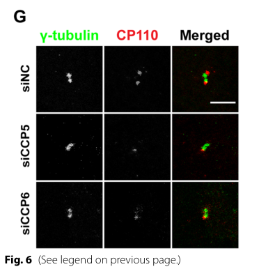

## Question

# Gene Research for Functional Annotation

## ⚠️ CRITICAL: Gene/Protein Identification Context

**BEFORE YOU BEGIN RESEARCH:** You MUST verify you are researching the CORRECT gene/protein. Gene symbols can be ambiguous, especially for less well-characterized genes from non-model organisms.

### Target Gene/Protein Identity (from UniProt):
- **UniProt Accession:** O43303
- **Protein Description:** RecName: Full=Centriolar coiled-coil protein of 110 kDa; AltName: Full=Centrosomal protein of 110 kDa; Short=CP110; Short=Cep110;
- **Gene Information:** Name=CCP110; Synonyms=CEP110, CP110, KIAA0419;
- **Organism (full):** Homo sapiens (Human).
- **Protein Family:** Not specified in UniProt
- **Key Domains:** CCP110. (IPR033207); CaM_bind (PF16025)

### MANDATORY VERIFICATION STEPS:

1. **Check if the gene symbol "CCP110" matches the protein description above**
2. **Verify the organism is correct:** Homo sapiens (Human).
3. **Check if protein family/domains align with what you find in literature**
4. **If you find literature for a DIFFERENT gene with the same or similar symbol, STOP**

### If Gene Symbol is Ambiguous or You Cannot Find Relevant Literature:

**DO NOT PROCEED WITH RESEARCH ON A DIFFERENT GENE.** Instead:
- State clearly: "The gene symbol 'CCP110' is ambiguous or literature is limited for this specific protein"
- Explain what you found (e.g., "Found extensive literature on a different gene with the same symbol in a different organism")
- Describe the protein based ONLY on the UniProt information provided above
- Suggest that the protein function can be inferred from domain/family information

### Research Target:

Please provide a comprehensive research report on the gene **CCP110** (gene ID: CCP110, UniProt: O43303) in human.

The research report should be a detailed narrative explaining the function, biological processes, and localization of the gene product. Citations should be given for all claims.

You should prioritize authoritative reviews and primary scientific literature when conducting research. You can supplement
this with annotations you find in gene/protein databases, but these can be outdated or inaccurate.

We are specifically interested in the primary function of the gene - for enzymes, what reaction is catalyzed, and what is the substrate specificity? For transporters, what is the substrate? For structural proteins or adapters, what is the broader structural role? For signaling molecules, what is the role in the pathway.

We are interested in where in or outside the cell the gene product carries out its function.

We are also interested in the signaling or biochemical pathways in which the gene functions. We are less interested in broad pleiotropic effects, except where these elucidate the precise role.

Include evidence where possible. We are interested in both experimental evidence as well as inference from structure, evolution, or bioinformatic analysis. Precise studies should be prioritized over high-throughput, where available.

## Output

Question: You are an expert researcher providing comprehensive, well-cited information.

Provide detailed information focusing on:
1. Key concepts and definitions with current understanding
2. Recent developments and latest research (prioritize 2023-2024 sources)
3. Current applications and real-world implementations
4. Expert opinions and analysis from authoritative sources
5. Relevant statistics and data from recent studies

Format as a comprehensive research report with proper citations. Include URLs and publication dates where available.
Always prioritize recent, authoritative sources and provide specific citations for all major claims.

# Gene Research for Functional Annotation

## ⚠️ CRITICAL: Gene/Protein Identification Context

**BEFORE YOU BEGIN RESEARCH:** You MUST verify you are researching the CORRECT gene/protein. Gene symbols can be ambiguous, especially for less well-characterized genes from non-model organisms.

### Target Gene/Protein Identity (from UniProt):
- **UniProt Accession:** O43303
- **Protein Description:** RecName: Full=Centriolar coiled-coil protein of 110 kDa; AltName: Full=Centrosomal protein of 110 kDa; Short=CP110; Short=Cep110;
- **Gene Information:** Name=CCP110; Synonyms=CEP110, CP110, KIAA0419;
- **Organism (full):** Homo sapiens (Human).
- **Protein Family:** Not specified in UniProt
- **Key Domains:** CCP110. (IPR033207); CaM_bind (PF16025)

### MANDATORY VERIFICATION STEPS:

1. **Check if the gene symbol "CCP110" matches the protein description above**
2. **Verify the organism is correct:** Homo sapiens (Human).
3. **Check if protein family/domains align with what you find in literature**
4. **If you find literature for a DIFFERENT gene with the same or similar symbol, STOP**

### If Gene Symbol is Ambiguous or You Cannot Find Relevant Literature:

**DO NOT PROCEED WITH RESEARCH ON A DIFFERENT GENE.** Instead:
- State clearly: "The gene symbol 'CCP110' is ambiguous or literature is limited for this specific protein"
- Explain what you found (e.g., "Found extensive literature on a different gene with the same symbol in a different organism")
- Describe the protein based ONLY on the UniProt information provided above
- Suggest that the protein function can be inferred from domain/family information

### Research Target:

Please provide a comprehensive research report on the gene **CCP110** (gene ID: CCP110, UniProt: O43303) in human.

The research report should be a detailed narrative explaining the function, biological processes, and localization of the gene product. Citations should be given for all claims.

You should prioritize authoritative reviews and primary scientific literature when conducting research. You can supplement
this with annotations you find in gene/protein databases, but these can be outdated or inaccurate.

We are specifically interested in the primary function of the gene - for enzymes, what reaction is catalyzed, and what is the substrate specificity? For transporters, what is the substrate? For structural proteins or adapters, what is the broader structural role? For signaling molecules, what is the role in the pathway.

We are interested in where in or outside the cell the gene product carries out its function.

We are also interested in the signaling or biochemical pathways in which the gene functions. We are less interested in broad pleiotropic effects, except where these elucidate the precise role.

Include evidence where possible. We are interested in both experimental evidence as well as inference from structure, evolution, or bioinformatic analysis. Precise studies should be prioritized over high-throughput, where available.

# Functional research report: human CCP110 (CP110)

## Identity and evidence standard

**CCP110, UniProt [O43303](https://www.uniprot.org/uniprotkb/O43303/entry), is the human centriolar coiled-coil protein CP110**, also called CEP110 or KIAA0419 in the identification supplied with this request. The literature independently identifies CP110 as the centriolar coiled-coil protein of 110 kDa. It must **not** be confused with CCP5 or CCP6: those are distinct cytosolic carboxypeptidases that interact functionally with CP110. The supplied CCP110 domain designation (InterPro IPR033207) and calmodulin-binding annotation (Pfam PF16025) are consistent with experimentally demonstrated coiled-coil interactions and direct calmodulin binding; they do not indicate carboxypeptidase activity in CP110. (wang2023ccp5andccp6 pages 17-18, spektor2007cep97andcp110 pages 2-4, tsang2006cp110cooperateswith pages 4-6, iyer2025centriolarcapproteins pages 8-10)

**Primary function.** CP110 is a structural and regulatory **microtubule-end cap at the distal end of centrioles**. It limits and organizes centriole elongation while helping determine whether a mother centriole remains a centrosomal centriole or becomes a cilium-forming basal body. It is not an enzyme or transporter: its relevant physical substrate is the **microtubule plus end**, rather than a metabolite or transported solute. Purified-protein experiments now demonstrate direct plus-end binding, strengthening what was originally inferred from cellular localization and perturbation. (schmidt2009controlofcentriole pages 1-2, spektor2007cep97andcp110 pages 1-2, iyer2025centriolarcapproteins pages 1-2, iyer2025centriolarcapproteins pages 2-4)

## Where CP110 acts and how it controls structure

In proliferating human cells, CP110 marks the **distal tips of both pre-existing centrioles and newly assembled procentrioles**, at the core of the intracellular centrosome. During primary-cilium assembly, CP110 is selectively lost from the **mature mother centriole**, which becomes the basal body, while remaining at the nonciliated daughter centriole. Thus its principal action is at the centriole tip, **not in the mature ciliary axoneme or outside the cell**. (schmidt2009controlofcentriole pages 1-2, schmidt2010humancpapand pages 33-37, song2022enkd1promotescp110 pages 1-2)

The centriolar protein **CPAP** promotes tubulin incorporation and centriole elongation, whereas CP110 restrains inappropriate extension. In human-cell experiments, normal procentrioles reached approximately **0.4–0.5 µm**; CPAP overexpression produced structures exceeding **1 µm**, and CP110 depletion generated abnormally extended centriolar microtubules. Crucially, these extensions should not automatically be called cilia: investigators distinguished them from genuine cilia using localization, ciliary markers such as IFT88, and ultrastructure. CP110 removal permits a cilium *only when the other steps of ciliogenesis are also coordinated*. (schmidt2009controlofcentriole pages 1-2, schmidt2010humancpapand pages 56-59, schmidt2009controlofcentriole pages 6-7)

A mechanistic advance published in **January 2025** directly reconstituted this activity. CP110 preferentially recognized microtubule **plus**, rather than minus, ends and could block plus-end extension; cryo-electron tomography placed CP110-containing caps toward the **luminal side** of microtubule ends. In one analysis, caps occurred at **78% of plus ends versus 9% of minus ends**. CPAP directly associates with a CP110 coiled-coil region and counteracts complete growth arrest: together, the proteins supported persistent growth at **0.05–0.1 µm/min**, about **20–40-fold slower** than the study’s control condition. **These growth rates are from purified-protein assays, not measurements of centriole growth inside cells.** Disrupting CPAP–CP110 association in cells impaired normal centriole elongation, linking the biochemical mechanism back to organelle assembly. (iyer2025centriolarcapproteins pages 1-2, iyer2025centriolarcapproteins pages 6-8, iyer2025centriolarcapproteins pages 10-12, iyer2025centriolarcapproteins pages 8-10)

## Ciliogenesis: a removable inhibitory gate

CP110 forms a functionally important complex with **CEP97**, which helps recruit or stabilize CP110 at centrosomes. In human-cell experiments, depletion of either component promoted **primary cilia in proliferating cells**, whereas enforced CP110 expression suppressed cilium formation in quiescent cells. These reciprocal manipulations support a causal role for the CP110–CEP97 complex as a brake on premature ciliogenesis, rather than merely a marker of nonciliated centrioles. Its removal specifically from the mother-centriole tip is an early permissive event in the centriole-to-basal-body transition. (spektor2007cep97andcp110 pages 1-2, spektor2007cep97andcp110 pages 2-4, schmidt2009controlofcentriole pages 1-2)

The gate is regulated by several distinguishable mechanisms. **KIF24** recruits **MPP9**, which binds CEP97 and helps localize the CP110–CEP97 complex to the mother centriole. At ciliogenesis onset, **TTBK2 phosphorylates MPP9**, principally at **Ser629**, promoting MPP9 removal through a ubiquitin–proteasome-associated process and facilitating CP110–CEP97 clearance. This study demonstrates **TTBK2 phosphorylation of MPP9; it should not be misreported as direct phosphorylation of CP110 by TTBK2**. Separately, **ENKD1 competes with CEP97 for binding to an N-terminal region of CP110**; reducing ENKD1 retains CP110 at the mother centriole, whereas codepleting CP110 alleviates the ENKD1-depletion ciliation defect. These findings define CP110 as the gate whose retention or release is regulated, not as the kinase catalyzing its own release. (huang2018mphasephosphoprotein9 pages 1-2, huang2018mphasephosphoprotein9 pages 6-7, song2022enkd1promotescp110 pages 8-11, song2022enkd1promotescp110 pages 1-2)

The particularly relevant **May 2023** study identified another retention mechanism in human **hTERT-RPE1 cells**. **CCP5 binds CP110 through CCP5’s noncatalytic N terminus**; both CCP5 and CCP6 help retain CP110 at centrioles. In cycling cultures, approximately **10%** of control cells were ciliated, compared with **30%** after depletion of either carboxypeptidase and **50%** after depletion of both. Two γ-tubulin-marked centrioles persisted, while the distribution shifted from two CP110-positive dots toward one, consistent with loss of CP110 from the mother centriole. Figure 6 directly illustrates the CP110-localization and ciliation readouts. The CCP5 effect on *initiation* of ciliogenesis persisted with catalytically inactive CCP5 mutants; this does **not** make CP110 a carboxypeptidase, nor does it mean CCP5’s separate effects on ciliary microtubule modification are enzyme-independent. These are cell-culture perturbation results, not population frequencies or clinical effect sizes. (wang2023ccp5andccp6 pages 10-12, wang2023ccp5andccp6 pages 8-10, wang2023ccp5andccp6 pages 4-8, wang2023ccp5andccp6 media d7b63e70)

## Cell-cycle regulation and molecular interactions

CP110 protein abundance rises around the **G1/S transition**, when centriole duplication begins. It is phosphorylated by cyclin-dependent kinases **in vitro and in human cells**; depletion impaired centrosome duplication, while sustained interference with its phosphorylation produced inappropriate centrosome separation and polyploidy. CP110 therefore participates in the cell-cycle control of centriole assembly as well as in limiting microtubule length. These studies establish a regulatory role; CP110 itself is **a CDK substrate, not a kinase**. (chen2002cp110acell pages 1-2)

CP110 also **directly binds calmodulin** through mapped binding regions and associates with the calcium-binding protein **centrin** in cellular complexes, although the centrin association appears indirect. A CP110 mutant with impaired calmodulin binding still localized to centrosomes and associated with centrin but increased **binucleate cells**, connecting the calmodulin interaction to completion of cytokinesis and genome stability. This provides experimental support for the supplied CaM-binding-domain annotation; it does not establish a separate catalytic calcium-signaling activity for CP110. (tsang2006cp110cooperateswith pages 4-6, tsang2006cp110cooperateswith pages 2-2, tsang2006cp110cooperateswith pages 8-10)

The following evidence map separates CP110’s direct actions from the actions of its binding partners and regulators.

| Mechanism | Precise evidence and data | Primary reference DOI and date |
|---|---|---|
| Distal centriole cap and length control | Human CP110 localizes at distal tips of parental centrioles and procentrioles. Normal procentrioles reach approximately 0.4–0.5 µm; CP110 depletion produces abnormal centriolar microtubule extensions, whereas CPAP-driven structures can exceed 1 µm. The extensions are distinct from genuine primary cilia, supporting a role for CP110 in limiting centriolar tubulin addition rather than axonemal length (schmidt2009controlofcentriole pages 1-2). | Schmidt et al., *Current Biology*; [10.1016/j.cub.2009.05.016](https://doi.org/10.1016/j.cub.2009.05.016); June 2009 |
| CEP97–CP110 cilia gate | CEP97 physically associates with CP110 and recruits or stabilizes it at centrosomes. Loss of either protein promotes primary-cilium formation in proliferating cells, whereas enforced CP110 expression suppresses ciliogenesis in quiescent cells. CP110–CEP97 therefore functions as a removable inhibitory gate rather than a constitutive component of the ciliary axoneme (spektor2007cep97andcp110 pages 1-2, spektor2007cep97andcp110 pages 2-4). | Spektor et al., *Cell*; [10.1016/j.cell.2007.06.027](https://doi.org/10.1016/j.cell.2007.06.027); August 2007 |
| Cell-cycle CDK regulation and CaM-dependent cytokinesis | CP110 abundance rises at G1/S and peaks in S phase; CDKs phosphorylate it in vitro and in vivo, and an eight-site phosphorylation-resistant mutant caused centrosome-separation and polyploidy phenotypes. CP110 also binds calmodulin directly through multiple regions; a CaM-binding-defective CP110 mutant still localized to centrosomes but increased binucleate cells, linking this interaction to cytokinesis and genome stability (chen2002cp110acell pages 1-2, tsang2006cp110cooperateswith pages 2-2, tsang2006cp110cooperateswith pages 8-10). | Chen et al., *Developmental Cell*; [10.1016/S1534-5807(02)00258-7](https://doi.org/10.1016/S1534-5807(02)00258-7); September 2002. Tsang et al., *Molecular Biology of the Cell*; [10.1091/mbc.e06-04-0371](https://doi.org/10.1091/mbc.e06-04-0371); August 2006 |
| TTBK2–MPP9 uncapping pathway | KIF24 recruits MPP9, which directly binds CEP97 and helps retain the CP110–CEP97 cap. At ciliogenesis onset, TTBK2 phosphorylates **MPP9—not CP110**—principally at S629; this promotes ubiquitin–proteasome-dependent MPP9 clearance and facilitates removal of CP110–CEP97 from the mother centriole (huang2018mphasephosphoprotein9 pages 9-10, huang2018mphasephosphoprotein9 pages 1-2, huang2018mphasephosphoprotein9 pages 6-7). | Huang et al., *Nature Communications*; [10.1038/s41467-018-06990-9](https://doi.org/10.1038/s41467-018-06990-9); October 2018 |
| CCP5/CCP6-dependent CP110 retention | CCP5 and CCP6 are separate **cytosolic carboxypeptidases**, not CCP110. In cycling human RPE-1 cells, ciliation rose from approximately 10% in controls to approximately 30% after depletion of either enzyme and approximately 50% after co-depletion. Cells retained two γ-tubulin-marked centrioles but shifted from two CP110 dots toward one, indicating selective loss of CP110 from the mother centriole. CCP5 binds CP110 through its noncatalytic N-terminal region, and its anti-ciliogenesis effect is independent of carboxypeptidase activity (wang2023ccp5andccp6 pages 10-12, wang2023ccp5andccp6 pages 8-10, wang2023ccp5andccp6 pages 4-8). | Wang et al., *BMC Biology*; [10.1186/s12915-023-01622-1](https://doi.org/10.1186/s12915-023-01622-1); May 2023 |
| Direct CP110–CPAP control of microtubule plus ends | **Purified-protein reconstitution, not an in-vivo rate measurement:** CP110 preferentially caps microtubule plus ends and suppresses growth; CPAP directly binds CP110 and converts blocking into persistent elongation at 0.05–0.1 µm/min, approximately 20–40-fold slower than control growth. Cryo-electron tomography places the CP110 cap on the luminal side of plus ends; disrupting the interaction increases short or incomplete centrioles in human cells (iyer2025centriolarcapproteins pages 6-8, iyer2025centriolarcapproteins pages 10-12, iyer2025centriolarcapproteins pages 15-17, iyer2025centriolarcapproteins pages 4-6). | Iyer et al., *Journal of Cell Biology*; [10.1083/jcb.202406061](https://doi.org/10.1083/jcb.202406061); January 2025 |

*Table: Compact evidence map for human CCP110/CP110 (UniProt O43303), separating direct CP110 findings from upstream regulators and similarly named CCP enzymes. Quantitative reconstitution results are explicitly distinguished from in-vivo measurements.*

## Recent context, applications, and limitations

CP110 immunostaining, CP110-dot counts, depletion/rescue assays, and purified-protein microtubule assays are **research implementations** for testing centriole uncapping, ciliogenesis initiation, and plus-end growth control; the 2023 RPE-1 experiment illustrates how a CP110 signal can distinguish retention at both centrioles from loss at the cilium-forming mother centriole. The results do not, by themselves, establish a clinical diagnostic test or an approved therapy targeting CCP110. (wang2023ccp5andccp6 pages 10-12, wang2023ccp5andccp6 media d7b63e70, iyer2025centriolarcapproteins pages 1-2)

A **December 2024** study of maturing **mouse cerebellar granule neurons** reported renewed mother-centriole capping after developmental cilium loss and proposed that limiting reciliation could reduce responsiveness to **Sonic hedgehog**. Its direct staining and developmental quantification concerned **CEP97**, however, **not CP110 itself**: approximately half of sampled postnatal-day-8 internal-granule-layer centrosomes had two CEP97 puncta, versus all sampled adult centrosomes. The suggested relevance to medulloblastoma is a **therapeutic hypothesis**, not a demonstrated CP110-targeting treatment or direct demonstration of CP110 function in those neurons. More generally, CP110 controls access to a cilium that can host signaling; available evidence here does not establish CP110 as a direct Hedgehog-pathway enzyme or receptor. (constable2024permanentcilialoss pages 7-8, constable2024permanentcilialoss pages 1-2)

**Human genetic evidence requires a separate caution.** Bibliographic search located a paper titled *“Biallelic loss-of-function variants in the centriolar protein CCP110 leads to a ciliopathy-like phenotype”* (Suzuki and colleagues, **August 2024**, [DOI: 10.1016/j.ejmg.2024.104955](https://doi.org/10.1016/j.ejmg.2024.104955)), but its primary text was not retrievable in this review. Consequently, its reported variants, patient count, phenotype, and strength of genotype–phenotype evidence **cannot be independently assessed here** and are not used to assert a specific clinical syndrome. The experimentally established cellular function remains the stronger basis for this functional annotation. (spektor2007cep97andcp110 pages 1-2, iyer2025centriolarcapproteins pages 1-2)

### Selected primary literature, with publication dates

- Chen *et al.* **September 2002**, *Developmental Cell*: CDK phosphorylation, human centrosome duplication, and cell-cycle phenotypes. https://doi.org/10.1016/S1534-5807(02)00258-7. (chen2002cp110acell pages 1-2)
- Tsang *et al.* **August 2006**, *Molecular Biology of the Cell*: direct calmodulin binding, centrin-associated complexes, and cytokinesis. https://doi.org/10.1091/mbc.e06-04-0371. (tsang2006cp110cooperateswith pages 4-6, tsang2006cp110cooperateswith pages 8-10)
- Spektor *et al.* **August 2007**, *Cell*: CEP97–CP110 association and experimental suppression of primary-cilium assembly. https://doi.org/10.1016/j.cell.2007.06.027. (spektor2007cep97andcp110 pages 1-2, spektor2007cep97andcp110 pages 2-4)
- Schmidt *et al.* **June 2009**, *Current Biology*: distal localization and antagonistic control of centriole length by CPAP and CP110. https://doi.org/10.1016/j.cub.2009.05.016. (schmidt2009controlofcentriole pages 1-2)
- Huang *et al.* **October 2018**, *Nature Communications*: KIF24–MPP9 recruitment and TTBK2-dependent MPP9 phosphorylation in CP110–CEP97 clearance. https://doi.org/10.1038/s41467-018-06990-9. (huang2018mphasephosphoprotein9 pages 1-2, huang2018mphasephosphoprotein9 pages 6-7)
- Song *et al.* **March 2022**, *EMBO Reports*: ENKD1 competition with CEP97 for CP110 binding. https://doi.org/10.15252/embr.202154090. (song2022enkd1promotescp110 pages 1-2, song2022enkd1promotescp110 pages 8-11)
- Wang *et al.* **May 2023**, *BMC Biology*: CCP5/CCP6-dependent retention of CP110 and quantitative ciliation experiments. https://doi.org/10.1186/s12915-023-01622-1. (wang2023ccp5andccp6 pages 10-12, wang2023ccp5andccp6 pages 8-10)
- Constable *et al.* **December 2024**, *PNAS*: developmental neuron cilium loss and **CEP97-measured** centriole recapping. https://doi.org/10.1073/pnas.2408083121. (constable2024permanentcilialoss pages 7-8, constable2024permanentcilialoss pages 1-2)
- Iyer *et al.* **January 2025**, *Journal of Cell Biology*: direct CP110 plus-end capping, CPAP association, structural analysis, and reconstituted slow growth. https://doi.org/10.1083/jcb.202406061. (iyer2025centriolarcapproteins pages 1-2, iyer2025centriolarcapproteins pages 10-12)

References

1. (wang2023ccp5andccp6 pages 17-18): Yujuan Wang, Yuan Zhang, Xinyu Guo, Yiqiang Zheng, Xinjie Zhang, Shanshan Feng, and Hui-Yuan Wu. Ccp5 and ccp6 retain cp110 and negatively regulate ciliogenesis. BMC Biology, May 2023. URL: https://doi.org/10.1186/s12915-023-01622-1, doi:10.1186/s12915-023-01622-1. This article has 11 citations and is from a domain leading peer-reviewed journal.

2. (spektor2007cep97andcp110 pages 2-4): Alexander Spektor, William Y. Tsang, David Khoo, and Brian David Dynlacht. Cep97 and cp110 suppress a cilia assembly program. Cell, 130:678-690, Aug 2007. URL: https://doi.org/10.1016/j.cell.2007.06.027, doi:10.1016/j.cell.2007.06.027. This article has 607 citations and is from a highest quality peer-reviewed journal.

3. (tsang2006cp110cooperateswith pages 4-6): William Y. Tsang, Alexander Spektor, Daniel J. Luciano, Vahan B. Indjeian, Zhihong Chen, Jeffery L. Salisbury, Irma Sánchez, and Brian David Dynlacht. Cp110 cooperates with two calcium-binding proteins to regulate cytokinesis and genome stability. Molecular biology of the cell, 17 8:3423-34, Aug 2006. URL: https://doi.org/10.1091/mbc.e06-04-0371, doi:10.1091/mbc.e06-04-0371. This article has 131 citations and is from a domain leading peer-reviewed journal.

4. (iyer2025centriolarcapproteins pages 8-10): Saishree S. Iyer, Fangrui Chen, Funso E. Ogunmolu, Shoeib Moradi, Vladimir A. Volkov, Emma J. van Grinsven, Chris van Hoorn, Jingchao Wu, Nemo Andrea, Shasha Hua, Kai Jiang, Ioannis Vakonakis, Mia Potočnjak, Franz Herzog, Benoît Gigant, Nikita Gudimchuk, Kelly E. Stecker, Marileen Dogterom, Michel O. Steinmetz, and Anna Akhmanova. Centriolar cap proteins cp110 and cpap control slow elongation of microtubule plus ends. The Journal of Cell Biology, Jan 2025. URL: https://doi.org/10.1083/jcb.202406061, doi:10.1083/jcb.202406061. This article has 28 citations.

5. (schmidt2009controlofcentriole pages 1-2): Thorsten I. Schmidt, Julia Kleylein-Sohn, Jens Westendorf, Mikael Le Clech, Sébastien B. Lavoie, York-Dieter Stierhof, and Erich A. Nigg. Control of centriole length by cpap and cp110. Current Biology, 19:1005-1011, Jun 2009. URL: https://doi.org/10.1016/j.cub.2009.05.016, doi:10.1016/j.cub.2009.05.016. This article has 480 citations and is from a highest quality peer-reviewed journal.

6. (spektor2007cep97andcp110 pages 1-2): Alexander Spektor, William Y. Tsang, David Khoo, and Brian David Dynlacht. Cep97 and cp110 suppress a cilia assembly program. Cell, 130:678-690, Aug 2007. URL: https://doi.org/10.1016/j.cell.2007.06.027, doi:10.1016/j.cell.2007.06.027. This article has 607 citations and is from a highest quality peer-reviewed journal.

7. (iyer2025centriolarcapproteins pages 1-2): Saishree S. Iyer, Fangrui Chen, Funso E. Ogunmolu, Shoeib Moradi, Vladimir A. Volkov, Emma J. van Grinsven, Chris van Hoorn, Jingchao Wu, Nemo Andrea, Shasha Hua, Kai Jiang, Ioannis Vakonakis, Mia Potočnjak, Franz Herzog, Benoît Gigant, Nikita Gudimchuk, Kelly E. Stecker, Marileen Dogterom, Michel O. Steinmetz, and Anna Akhmanova. Centriolar cap proteins cp110 and cpap control slow elongation of microtubule plus ends. The Journal of Cell Biology, Jan 2025. URL: https://doi.org/10.1083/jcb.202406061, doi:10.1083/jcb.202406061. This article has 28 citations.

8. (iyer2025centriolarcapproteins pages 2-4): Saishree S. Iyer, Fangrui Chen, Funso E. Ogunmolu, Shoeib Moradi, Vladimir A. Volkov, Emma J. van Grinsven, Chris van Hoorn, Jingchao Wu, Nemo Andrea, Shasha Hua, Kai Jiang, Ioannis Vakonakis, Mia Potočnjak, Franz Herzog, Benoît Gigant, Nikita Gudimchuk, Kelly E. Stecker, Marileen Dogterom, Michel O. Steinmetz, and Anna Akhmanova. Centriolar cap proteins cp110 and cpap control slow elongation of microtubule plus ends. The Journal of Cell Biology, Jan 2025. URL: https://doi.org/10.1083/jcb.202406061, doi:10.1083/jcb.202406061. This article has 28 citations.

9. (schmidt2010humancpapand pages 33-37): Human CPAP and CP110 in centriole elongation and ciliogenesis This article has 0 citations.

10. (song2022enkd1promotescp110 pages 1-2): Ting Song, Yunfan Yang, Peng Zhou, Jie Ran, Liang Zhang, Xiaofan Wu, Wei Xie, Tao Zhong, Hongbin Liu, Min Liu, Dengwen Li, Huijie Zhao, and Jun Zhou. Enkd1 promotes cp110 removal through competing with cep97 to initiate ciliogenesis. EMBO reports, Mar 2022. URL: https://doi.org/10.15252/embr.202154090, doi:10.15252/embr.202154090. This article has 30 citations and is from a highest quality peer-reviewed journal.

11. (schmidt2010humancpapand pages 56-59): Human CPAP and CP110 in centriole elongation and ciliogenesis This article has 0 citations.

12. (schmidt2009controlofcentriole pages 6-7): Thorsten I. Schmidt, Julia Kleylein-Sohn, Jens Westendorf, Mikael Le Clech, Sébastien B. Lavoie, York-Dieter Stierhof, and Erich A. Nigg. Control of centriole length by cpap and cp110. Current Biology, 19:1005-1011, Jun 2009. URL: https://doi.org/10.1016/j.cub.2009.05.016, doi:10.1016/j.cub.2009.05.016. This article has 480 citations and is from a highest quality peer-reviewed journal.

13. (iyer2025centriolarcapproteins pages 6-8): Saishree S. Iyer, Fangrui Chen, Funso E. Ogunmolu, Shoeib Moradi, Vladimir A. Volkov, Emma J. van Grinsven, Chris van Hoorn, Jingchao Wu, Nemo Andrea, Shasha Hua, Kai Jiang, Ioannis Vakonakis, Mia Potočnjak, Franz Herzog, Benoît Gigant, Nikita Gudimchuk, Kelly E. Stecker, Marileen Dogterom, Michel O. Steinmetz, and Anna Akhmanova. Centriolar cap proteins cp110 and cpap control slow elongation of microtubule plus ends. The Journal of Cell Biology, Jan 2025. URL: https://doi.org/10.1083/jcb.202406061, doi:10.1083/jcb.202406061. This article has 28 citations.

14. (iyer2025centriolarcapproteins pages 10-12): Saishree S. Iyer, Fangrui Chen, Funso E. Ogunmolu, Shoeib Moradi, Vladimir A. Volkov, Emma J. van Grinsven, Chris van Hoorn, Jingchao Wu, Nemo Andrea, Shasha Hua, Kai Jiang, Ioannis Vakonakis, Mia Potočnjak, Franz Herzog, Benoît Gigant, Nikita Gudimchuk, Kelly E. Stecker, Marileen Dogterom, Michel O. Steinmetz, and Anna Akhmanova. Centriolar cap proteins cp110 and cpap control slow elongation of microtubule plus ends. The Journal of Cell Biology, Jan 2025. URL: https://doi.org/10.1083/jcb.202406061, doi:10.1083/jcb.202406061. This article has 28 citations.

15. (huang2018mphasephosphoprotein9 pages 1-2): Ning Huang, Donghui Zhang, Fangyuan Li, Peiyuan Chai, Song Wang, Junlin Teng, and Jianguo Chen. M-phase phosphoprotein 9 regulates ciliogenesis by modulating cp110-cep97 complex localization at the mother centriole. Nature Communications, Oct 2018. URL: https://doi.org/10.1038/s41467-018-06990-9, doi:10.1038/s41467-018-06990-9. This article has 105 citations and is from a highest quality peer-reviewed journal.

16. (huang2018mphasephosphoprotein9 pages 6-7): Ning Huang, Donghui Zhang, Fangyuan Li, Peiyuan Chai, Song Wang, Junlin Teng, and Jianguo Chen. M-phase phosphoprotein 9 regulates ciliogenesis by modulating cp110-cep97 complex localization at the mother centriole. Nature Communications, Oct 2018. URL: https://doi.org/10.1038/s41467-018-06990-9, doi:10.1038/s41467-018-06990-9. This article has 105 citations and is from a highest quality peer-reviewed journal.

17. (song2022enkd1promotescp110 pages 8-11): Ting Song, Yunfan Yang, Peng Zhou, Jie Ran, Liang Zhang, Xiaofan Wu, Wei Xie, Tao Zhong, Hongbin Liu, Min Liu, Dengwen Li, Huijie Zhao, and Jun Zhou. Enkd1 promotes cp110 removal through competing with cep97 to initiate ciliogenesis. EMBO reports, Mar 2022. URL: https://doi.org/10.15252/embr.202154090, doi:10.15252/embr.202154090. This article has 30 citations and is from a highest quality peer-reviewed journal.

18. (wang2023ccp5andccp6 pages 10-12): Yujuan Wang, Yuan Zhang, Xinyu Guo, Yiqiang Zheng, Xinjie Zhang, Shanshan Feng, and Hui-Yuan Wu. Ccp5 and ccp6 retain cp110 and negatively regulate ciliogenesis. BMC Biology, May 2023. URL: https://doi.org/10.1186/s12915-023-01622-1, doi:10.1186/s12915-023-01622-1. This article has 11 citations and is from a domain leading peer-reviewed journal.

19. (wang2023ccp5andccp6 pages 8-10): Yujuan Wang, Yuan Zhang, Xinyu Guo, Yiqiang Zheng, Xinjie Zhang, Shanshan Feng, and Hui-Yuan Wu. Ccp5 and ccp6 retain cp110 and negatively regulate ciliogenesis. BMC Biology, May 2023. URL: https://doi.org/10.1186/s12915-023-01622-1, doi:10.1186/s12915-023-01622-1. This article has 11 citations and is from a domain leading peer-reviewed journal.

20. (wang2023ccp5andccp6 pages 4-8): Yujuan Wang, Yuan Zhang, Xinyu Guo, Yiqiang Zheng, Xinjie Zhang, Shanshan Feng, and Hui-Yuan Wu. Ccp5 and ccp6 retain cp110 and negatively regulate ciliogenesis. BMC Biology, May 2023. URL: https://doi.org/10.1186/s12915-023-01622-1, doi:10.1186/s12915-023-01622-1. This article has 11 citations and is from a domain leading peer-reviewed journal.

21. (wang2023ccp5andccp6 media d7b63e70): Yujuan Wang, Yuan Zhang, Xinyu Guo, Yiqiang Zheng, Xinjie Zhang, Shanshan Feng, and Hui-Yuan Wu. Ccp5 and ccp6 retain cp110 and negatively regulate ciliogenesis. BMC Biology, May 2023. URL: https://doi.org/10.1186/s12915-023-01622-1, doi:10.1186/s12915-023-01622-1. This article has 11 citations and is from a domain leading peer-reviewed journal.

22. (chen2002cp110acell pages 1-2): Zhihong Chen, Vahan B. Indjeian, Michael McManus, Leyu Wang, and Brian David Dynlacht. Cp110, a cell cycle-dependent cdk substrate, regulates centrosome duplication in human cells. Developmental cell, 3 3:339-50, Sep 2002. URL: https://doi.org/10.1016/s1534-5807(02)00258-7, doi:10.1016/s1534-5807(02)00258-7. This article has 424 citations and is from a highest quality peer-reviewed journal.

23. (tsang2006cp110cooperateswith pages 2-2): William Y. Tsang, Alexander Spektor, Daniel J. Luciano, Vahan B. Indjeian, Zhihong Chen, Jeffery L. Salisbury, Irma Sánchez, and Brian David Dynlacht. Cp110 cooperates with two calcium-binding proteins to regulate cytokinesis and genome stability. Molecular biology of the cell, 17 8:3423-34, Aug 2006. URL: https://doi.org/10.1091/mbc.e06-04-0371, doi:10.1091/mbc.e06-04-0371. This article has 131 citations and is from a domain leading peer-reviewed journal.

24. (tsang2006cp110cooperateswith pages 8-10): William Y. Tsang, Alexander Spektor, Daniel J. Luciano, Vahan B. Indjeian, Zhihong Chen, Jeffery L. Salisbury, Irma Sánchez, and Brian David Dynlacht. Cp110 cooperates with two calcium-binding proteins to regulate cytokinesis and genome stability. Molecular biology of the cell, 17 8:3423-34, Aug 2006. URL: https://doi.org/10.1091/mbc.e06-04-0371, doi:10.1091/mbc.e06-04-0371. This article has 131 citations and is from a domain leading peer-reviewed journal.

25. (huang2018mphasephosphoprotein9 pages 9-10): Ning Huang, Donghui Zhang, Fangyuan Li, Peiyuan Chai, Song Wang, Junlin Teng, and Jianguo Chen. M-phase phosphoprotein 9 regulates ciliogenesis by modulating cp110-cep97 complex localization at the mother centriole. Nature Communications, Oct 2018. URL: https://doi.org/10.1038/s41467-018-06990-9, doi:10.1038/s41467-018-06990-9. This article has 105 citations and is from a highest quality peer-reviewed journal.

26. (iyer2025centriolarcapproteins pages 15-17): Saishree S. Iyer, Fangrui Chen, Funso E. Ogunmolu, Shoeib Moradi, Vladimir A. Volkov, Emma J. van Grinsven, Chris van Hoorn, Jingchao Wu, Nemo Andrea, Shasha Hua, Kai Jiang, Ioannis Vakonakis, Mia Potočnjak, Franz Herzog, Benoît Gigant, Nikita Gudimchuk, Kelly E. Stecker, Marileen Dogterom, Michel O. Steinmetz, and Anna Akhmanova. Centriolar cap proteins cp110 and cpap control slow elongation of microtubule plus ends. The Journal of Cell Biology, Jan 2025. URL: https://doi.org/10.1083/jcb.202406061, doi:10.1083/jcb.202406061. This article has 28 citations.

27. (iyer2025centriolarcapproteins pages 4-6): Saishree S. Iyer, Fangrui Chen, Funso E. Ogunmolu, Shoeib Moradi, Vladimir A. Volkov, Emma J. van Grinsven, Chris van Hoorn, Jingchao Wu, Nemo Andrea, Shasha Hua, Kai Jiang, Ioannis Vakonakis, Mia Potočnjak, Franz Herzog, Benoît Gigant, Nikita Gudimchuk, Kelly E. Stecker, Marileen Dogterom, Michel O. Steinmetz, and Anna Akhmanova. Centriolar cap proteins cp110 and cpap control slow elongation of microtubule plus ends. The Journal of Cell Biology, Jan 2025. URL: https://doi.org/10.1083/jcb.202406061, doi:10.1083/jcb.202406061. This article has 28 citations.

28. (constable2024permanentcilialoss pages 7-8): Sandii Constable, Carolyn M. Ott, Andrew L. Lemire, Kevin White, Yu Xun, Amin Lim, Jennifer Lippincott-Schwartz, and Saikat Mukhopadhyay. Permanent cilia loss during cerebellar granule cell neurogenesis involves withdrawal of cilia maintenance and centriole capping. Proceedings of the National Academy of Sciences of the United States of America, Dec 2024. URL: https://doi.org/10.1073/pnas.2408083121, doi:10.1073/pnas.2408083121. This article has 13 citations and is from a highest quality peer-reviewed journal.

29. (constable2024permanentcilialoss pages 1-2): Sandii Constable, Carolyn M. Ott, Andrew L. Lemire, Kevin White, Yu Xun, Amin Lim, Jennifer Lippincott-Schwartz, and Saikat Mukhopadhyay. Permanent cilia loss during cerebellar granule cell neurogenesis involves withdrawal of cilia maintenance and centriole capping. Proceedings of the National Academy of Sciences of the United States of America, Dec 2024. URL: https://doi.org/10.1073/pnas.2408083121, doi:10.1073/pnas.2408083121. This article has 13 citations and is from a highest quality peer-reviewed journal.

## Artifacts

- [Edison artifact artifact-00](CCP110-deep-research-falcon_artifacts/artifact-00.md)

## Citations

1. schmidt2009controlofcentriole pages 1-2
2. iyer2025centriolarcapproteins pages 8-10
3. iyer2025centriolarcapproteins pages 1-2
4. iyer2025centriolarcapproteins pages 2-4
5. schmidt2010humancpapand pages 33-37
6. schmidt2010humancpapand pages 56-59
7. schmidt2009controlofcentriole pages 6-7
8. iyer2025centriolarcapproteins pages 6-8
9. iyer2025centriolarcapproteins pages 10-12
10. iyer2025centriolarcapproteins pages 15-17
11. iyer2025centriolarcapproteins pages 4-6
12. constable2024permanentcilialoss pages 7-8
13. constable2024permanentcilialoss pages 1-2
14. O43303
15. 10.1016/j.cub.2009.05.016
16. 10.1016/j.cell.2007.06.027
17. 10.1016/S1534-5807(02)00258-7
18. 10.1091/mbc.e06-04-0371
19. 10.1038/s41467-018-06990-9
20. 10.1186/s12915-023-01622-1
21. 10.1083/jcb.202406061
22. DOI: 10.1016/j.ejmg.2024.104955
23. https://www.uniprot.org/uniprotkb/O43303/entry
24. https://doi.org/10.1016/j.cub.2009.05.016
25. https://doi.org/10.1016/j.cell.2007.06.027
26. https://doi.org/10.1016/S1534-5807(02
27. https://doi.org/10.1091/mbc.e06-04-0371
28. https://doi.org/10.1038/s41467-018-06990-9
29. https://doi.org/10.1186/s12915-023-01622-1
30. https://doi.org/10.1083/jcb.202406061
31. https://doi.org/10.1016/j.ejmg.2024.104955
32. https://doi.org/10.1091/mbc.e06-04-0371.
33. https://doi.org/10.1016/j.cell.2007.06.027.
34. https://doi.org/10.1016/j.cub.2009.05.016.
35. https://doi.org/10.1038/s41467-018-06990-9.
36. https://doi.org/10.15252/embr.202154090.
37. https://doi.org/10.1186/s12915-023-01622-1.
38. https://doi.org/10.1073/pnas.2408083121.
39. https://doi.org/10.1083/jcb.202406061.
40. https://doi.org/10.1186/s12915-023-01622-1,
41. https://doi.org/10.1016/j.cell.2007.06.027,
42. https://doi.org/10.1091/mbc.e06-04-0371,
43. https://doi.org/10.1083/jcb.202406061,
44. https://doi.org/10.1016/j.cub.2009.05.016,
45. https://doi.org/10.15252/embr.202154090,
46. https://doi.org/10.1038/s41467-018-06990-9,
47. https://doi.org/10.1016/s1534-5807(02
48. https://doi.org/10.1073/pnas.2408083121,