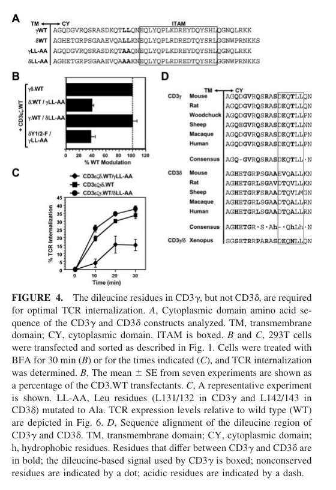

## Question

# Gene Research for Functional Annotation

## ⚠️ CRITICAL: Gene/Protein Identification Context

**BEFORE YOU BEGIN RESEARCH:** You MUST verify you are researching the CORRECT gene/protein. Gene symbols can be ambiguous, especially for less well-characterized genes from non-model organisms.

### Target Gene/Protein Identity (from UniProt):
- **UniProt Accession:** P09693
- **Protein Description:** RecName: Full=T-cell surface glycoprotein CD3 gamma chain; AltName: Full=T-cell receptor T3 gamma chain; AltName: CD_antigen=CD3g; Flags: Precursor;
- **Gene Information:** Name=CD3G; Synonyms=T3G;
- **Organism (full):** Homo sapiens (Human).
- **Protein Family:** Not specified in UniProt
- **Key Domains:** CD3_esu/gsu/dsu. (IPR015484); Ig-like_dom_sf. (IPR036179); Ig-like_fold. (IPR013783); Ig_4. (IPR032052); Ig_sub2. (IPR003598)

### MANDATORY VERIFICATION STEPS:

1. **Check if the gene symbol "CD3G" matches the protein description above**
2. **Verify the organism is correct:** Homo sapiens (Human).
3. **Check if protein family/domains align with what you find in literature**
4. **If you find literature for a DIFFERENT gene with the same or similar symbol, STOP**

### If Gene Symbol is Ambiguous or You Cannot Find Relevant Literature:

**DO NOT PROCEED WITH RESEARCH ON A DIFFERENT GENE.** Instead:
- State clearly: "The gene symbol 'CD3G' is ambiguous or literature is limited for this specific protein"
- Explain what you found (e.g., "Found extensive literature on a different gene with the same symbol in a different organism")
- Describe the protein based ONLY on the UniProt information provided above
- Suggest that the protein function can be inferred from domain/family information

### Research Target:

Please provide a comprehensive research report on the gene **CD3G** (gene ID: CD3G, UniProt: P09693) in human.

The research report should be a detailed narrative explaining the function, biological processes, and localization of the gene product. Citations should be given for all claims.

You should prioritize authoritative reviews and primary scientific literature when conducting research. You can supplement
this with annotations you find in gene/protein databases, but these can be outdated or inaccurate.

We are specifically interested in the primary function of the gene - for enzymes, what reaction is catalyzed, and what is the substrate specificity? For transporters, what is the substrate? For structural proteins or adapters, what is the broader structural role? For signaling molecules, what is the role in the pathway.

We are interested in where in or outside the cell the gene product carries out its function.

We are also interested in the signaling or biochemical pathways in which the gene functions. We are less interested in broad pleiotropic effects, except where these elucidate the precise role.

Include evidence where possible. We are interested in both experimental evidence as well as inference from structure, evolution, or bioinformatic analysis. Precise studies should be prioritized over high-throughput, where available.

## Output

Question: You are an expert researcher providing comprehensive, well-cited information.

Provide detailed information focusing on:
1. Key concepts and definitions with current understanding
2. Recent developments and latest research (prioritize 2023-2024 sources)
3. Current applications and real-world implementations
4. Expert opinions and analysis from authoritative sources
5. Relevant statistics and data from recent studies

Format as a comprehensive research report with proper citations. Include URLs and publication dates where available.
Always prioritize recent, authoritative sources and provide specific citations for all major claims.

# Gene Research for Functional Annotation

## ⚠️ CRITICAL: Gene/Protein Identification Context

**BEFORE YOU BEGIN RESEARCH:** You MUST verify you are researching the CORRECT gene/protein. Gene symbols can be ambiguous, especially for less well-characterized genes from non-model organisms.

### Target Gene/Protein Identity (from UniProt):
- **UniProt Accession:** P09693
- **Protein Description:** RecName: Full=T-cell surface glycoprotein CD3 gamma chain; AltName: Full=T-cell receptor T3 gamma chain; AltName: CD_antigen=CD3g; Flags: Precursor;
- **Gene Information:** Name=CD3G; Synonyms=T3G;
- **Organism (full):** Homo sapiens (Human).
- **Protein Family:** Not specified in UniProt
- **Key Domains:** CD3_esu/gsu/dsu. (IPR015484); Ig-like_dom_sf. (IPR036179); Ig-like_fold. (IPR013783); Ig_4. (IPR032052); Ig_sub2. (IPR003598)

### MANDATORY VERIFICATION STEPS:

1. **Check if the gene symbol "CD3G" matches the protein description above**
2. **Verify the organism is correct:** Homo sapiens (Human).
3. **Check if protein family/domains align with what you find in literature**
4. **If you find literature for a DIFFERENT gene with the same or similar symbol, STOP**

### If Gene Symbol is Ambiguous or You Cannot Find Relevant Literature:

**DO NOT PROCEED WITH RESEARCH ON A DIFFERENT GENE.** Instead:
- State clearly: "The gene symbol 'CD3G' is ambiguous or literature is limited for this specific protein"
- Explain what you found (e.g., "Found extensive literature on a different gene with the same symbol in a different organism")
- Describe the protein based ONLY on the UniProt information provided above
- Suggest that the protein function can be inferred from domain/family information

### Research Target:

Please provide a comprehensive research report on the gene **CD3G** (gene ID: CD3G, UniProt: P09693) in human.

The research report should be a detailed narrative explaining the function, biological processes, and localization of the gene product. Citations should be given for all claims.

You should prioritize authoritative reviews and primary scientific literature when conducting research. You can supplement
this with annotations you find in gene/protein databases, but these can be outdated or inaccurate.

We are specifically interested in the primary function of the gene - for enzymes, what reaction is catalyzed, and what is the substrate specificity? For transporters, what is the substrate? For structural proteins or adapters, what is the broader structural role? For signaling molecules, what is the role in the pathway.

We are interested in where in or outside the cell the gene product carries out its function.

We are also interested in the signaling or biochemical pathways in which the gene functions. We are less interested in broad pleiotropic effects, except where these elucidate the precise role.

Include evidence where possible. We are interested in both experimental evidence as well as inference from structure, evolution, or bioinformatic analysis. Precise studies should be prioritized over high-throughput, where available.

# Human CD3G (UniProt P09693): functional annotation research report

## Identity and principal function

**Gene identity verified.** Human **CD3G** encodes **CD3γ**, the gamma subunit of the invariant T-cell receptor–CD3 (TCR–CD3) complex. Its name must not be confused with the antigen-binding **TCRγ** chain of a γδ T-cell receptor: CD3γ is an associated receptor-assembly and signaling subunit, whereas TCRγ participates in antigen recognition. The supplied UniProt accession is [P09693](https://www.uniprot.org/uniprotkb/P09693/entry); human genetic and structural studies independently confirm that the relevant protein is CD3γ. Its extracellular immunoglobulin-like CD3 domain agrees with the supplied CD3/Ig-like domain annotations. CD3γ is **not an enzyme or transporter** and has no catalytic reaction or transported substrate to specify. (rowe2018patientswithcd3g pages 1-6, xu2020structuralunderstandingof pages 1-2, xin2024structuresofhuman pages 1-6)

CD3γ’s primary function is to **form the CD3γ–CD3ε signaling heterodimer, help assemble and maintain the surface TCR–CD3 complex, and provide a cytoplasmic signaling and trafficking tail**. Antigen recognition is performed by the TCR chains; CD3 subunits convey that recognition into the cell. This division of labor is supported both by receptor structures and by reduced surface TCR/CD3 expression in people with biallelic CD3G variants. (xu2020structuralunderstandingof pages 2-3, xu2020structuralunderstandingof pages 1-2, rowe2018patientswithcd3g pages 6-9)

## Localization and molecular architecture

CD3γ is a **single-pass membrane component of the T-cell surface receptor**. Its Ig-like region faces the extracellular space, its helix spans the plasma membrane, and its ITAM-containing tail faces the cytoplasm. TCR–CD3 subunits assemble before surface delivery; once at the membrane, the complex is positioned to couple extracellular antigen engagement to intracellular phosphorylation. The CD3γ tail also helps govern removal of receptors from the surface by endocytosis. (rowe2018patientswithcd3g pages 1-6, xu2020structuralunderstandingof pages 1-2, xin2024structuresofhuman pages 1-6, szymczak2005plasticityandrigidity pages 1-2)

A 2019 human αβ TCR–CD3 cryo-electron microscopy study resolved the receptor at **3.7 Å** and established an eight-chain complex with **1:1:1:1 stoichiometry** of TCRαβ, CD3γε, CD3δε, and CD3ζζ. The TCR constant/connecting regions pack against the extracellular CD3 dimers, while hydrophobic and oppositely charged transmembrane interactions organize the membrane-spanning assembly. This places CD3γ in a physical assembly module rather than at the antigen-binding tip of the TCR. Source: Dong *et al.*, *Nature*, published August 2019, [doi:10.1038/s41586-019-1537-0](https://doi.org/10.1038/s41586-019-1537-0). (xu2020structuralunderstandingof pages 1-2, xu2020structuralunderstandingof pages 2-3)

The architecture is not confined to αβ T cells. **2024 human γδ TCR–CD3 structures** also identified a CD3εγ module; the Vγ9Vδ2 complex was reconstructed at **3.4 Å** and was monomeric, whereas a Vγ5Vδ1 complex adopted an activation-relevant dimeric organization. These results extend CD3γ’s receptor context, but the differing receptor-level arrangements should not be interpreted as two independently proven functions of CD3γ itself. Source: Xin *et al.*, *Nature*, published April 2024, [doi:10.1038/s41586-024-07439-4](https://doi.org/10.1038/s41586-024-07439-4). (xin2024structuresofhuman pages 1-6, xin2024structuresofhuman pages 6-10)

## Signaling and receptor trafficking

The CD3γ cytoplasmic tail contains **one immunoreceptor tyrosine-based activation motif (ITAM)**. In the established TCR pathway, antigen engagement permits LCK-dependent phosphorylation of CD3 ITAMs; doubly phosphorylated motifs recruit ZAP-70, which activates a LAT/SLP-76-associated signaling network. PLCγ1-dependent calcium signaling and downstream ERK/MAPK and NFAT responses follow. These are **properties of the assembled TCR–CD3 signaling system**, not evidence that CD3γ alone initiates or uniquely controls every downstream branch. Source: Shah *et al.*, *Signal Transduction and Targeted Therapy*, published December 2021, [doi:10.1038/s41392-021-00823-w](https://doi.org/10.1038/s41392-021-00823-w). (shah2021tcellreceptor pages 3-4, shah2021tcellreceptor pages 7-8)

There is also **CD3γ-specific biochemical evidence**: doubly phosphorylated synthetic CD3γ ITAM peptides bound ZAP-70 and selected signaling proteins including Shc, Grb2, and the PI3K regulatory subunit p85. Peptide-affinity experiments demonstrate binding capacity, **not** that all these interactions occur with the same importance in intact human T cells. Source: Osman *et al.*, *European Journal of Immunology*, published May 1996, [doi:10.1002/eji.1830260516](https://doi.org/10.1002/eji.1830260516). (osman1996theproteininteractions pages 1-2)

CD3γ has a second, more distinctive role in **TCR surface trafficking**. In reconstituted receptor experiments, its cytoplasmic acidic dileucine signal—with critical **D127, K128, and L131/L132** residues—supported AP-2-dependent internalization. Mutating D127 or K128 abolished internalization in that assay; replacing L131/L132 reduced it by approximately **60%**. Other receptor-tail tyrosine signals also contributed, so this is not a single-signal uptake mechanism. These measurements used engineered receptors in 293T cells and should not be assumed to give the same percentages in primary T cells. The experimentally examined CD3γ-versus-CD3δ motif and uptake panels are available in Figure 4 of the source. Source: Szymczak and Vignali, *Journal of Immunology*, published April 2005, [doi:10.4049/jimmunol.174.7.4153](https://doi.org/10.4049/jimmunol.174.7.4153). (szymczak2005plasticityandrigidity pages 7-8, szymczak2005plasticityandrigidity pages 5-6, szymczak2005plasticityandrigidity media 8f604ad7)

## Human experimental and clinical evidence

Human loss-of-function observations make the assembly/signaling assignment particularly compelling. In a **six-patient** study of biallelic CD3G variants, CD4⁺ and CD8⁺ T cells had markedly reduced surface CD3 and TCRαβ and impaired proliferation after mitogen stimulation. T-cell development was **not wholly abolished**. Patient regulatory T cells had a restricted TCRβ repertoire—including approximately a **tenfold reduction in unique productive Treg TCRβ reads**—and impaired suppression of effector-cell proliferation; autoimmunity occurred in all six studied patients. These findings implicate insufficient TCR–CD3 expression/signaling in altered selection and immune tolerance, without proving that every clinical feature results directly from the CD3γ ITAM. Source: Rowe *et al.*, *Blood*, published May 2018, [doi:10.1182/blood-2018-02-835561](https://doi.org/10.1182/blood-2018-02-835561). (rowe2018patientswithcd3g pages 1-6, rowe2018patientswithcd3g pages 6-9, rowe2018patientswithcd3g pages 9-13)

The phenotype is **variable**, rather than invariably autoimmune. A reported patient with a CD3G deletion had nearly undetectable CD3γ, roughly **one-log lower surface CD3ε**, reduced TCRαβ, recurrent infections, and a common-variable-immunodeficiency-like presentation, yet retained measurable regulatory T-cell suppression and lacked recognized autoimmunity. This is a useful counterexample to treating Treg failure as universal. Source: Lee *et al.*, *Frontiers in Immunology*, published December 2019, [doi:10.3389/fimmu.2019.02833](https://doi.org/10.3389/fimmu.2019.02833). (lee2019anovelcd3g pages 4-6, lee2019anovelcd3g pages 1-2)

## Recent research and applications

The strongest **2024 mechanistic advance** is the direct visualization of CD3εγ within distinct human γδ TCR assemblies. In translational research, CD3-complex engagement is being investigated to improve tumor-reactive T-cell activation: a 2024 aptamer study used **CD3g-knockout cells** in binding experiments and found that selected CD3-directed aptamers lowered antigen-dependent calcium-activation thresholds in experimental T cells. Because removing one subunit can affect an assembled receptor, reduced aptamer staining after CD3g knockout does **not** establish that an aptamer directly binds CD3γ; these are preclinical experiments, not an established CD3G-specific therapy. Source: Menon *et al.*, *Molecular Therapy—Nucleic Acids*, published June 2024, [doi:10.1016/j.omtn.2024.102198](https://doi.org/10.1016/j.omtn.2024.102198). (xin2024structuresofhuman pages 1-6, menon2024cd3aptamerspromote pages 4-6, menon2024cd3aptamerspromote pages 2-3)

A separate **2024 exploratory biomarker** study associated lower CD3G expression with higher sepsis organ-failure scores in retrospective human transcriptomic analyses and observed lower expression in septic mice. Mouse cytokine correlations used only **three animals per group**; a prospective clinical cutoff, diagnostic accuracy, and causality were not established. CD3G expression may reflect the state or abundance of T cells rather than a new sepsis-specific molecular activity of CD3γ. Source: Li *et al.*, *International Journal of Molecular Sciences*, published January 2024, [doi:10.3390/ijms25020749](https://doi.org/10.3390/ijms25020749). (li2024immunerelatedmoleculescd3g pages 1-2, li2024immunerelatedmoleculescd3g pages 11-13)

The following table separates direct CD3γ findings from complex-level inference and records the main limitations of each evidence type. (osman1996theproteininteractions pages 1-2, szymczak2005plasticityandrigidity pages 7-8, rowe2018patientswithcd3g pages 1-6)

| Evidence source/year | CD3γ-specific conclusion | Limitation |
|---|---|---|
| Dong et al., *Nature* (2019), human αβ TCR–CD3 cryo-EM at 3.7 Å; [DOI](https://doi.org/10.1038/s41586-019-1537-0) | Establishes an octameric complex with 1:1:1:1 stoichiometry of TCRαβ:CD3γε:CD3δε:CD3ζζ. CD3γ pairs with CD3ε and contributes extracellular and transmembrane contacts that stabilize receptor assembly. (xu2020structuralunderstandingof pages 2-3) | The unresolved cytoplasmic tails prevent direct analysis of CD3γ ITAM activation or trafficking. Structural placement does not prove that every downstream TCR response uniquely requires CD3γ. |
| Xin et al., *Nature* (2024), human γδ TCR–CD3 cryo-EM; Vγ9Vδ2 at 3.4 Å and Vγ5Vδ1 dimer; [DOI](https://doi.org/10.1038/s41586-024-07439-4) | Confirms CD3εγ within human γδ TCR–CD3. Vγ9Vδ2 was monomeric and flexible, whereas Vγ5Vδ1 formed an activation-relevant dimer. Antigen-binding **TCRγ** is distinct from the accessory and signaling subunit **CD3γ (CD3G/P09693)**. (xin2024structuresofhuman pages 1-6, xin2024structuresofhuman pages 6-10) | Provides limited residue-level information specific to CD3γ and no direct measurement of its cytoplasmic signaling. Receptor-level findings should not be attributed solely to CD3γ. |
| Osman et al., *European Journal of Immunology* (1996), phosphorylated-ITAM peptide pulldown; [DOI](https://doi.org/10.1002/eji.1830260516) | Doubly phosphorylated CD3γ ITAM peptides bound ZAP-70 and selected Shc, Grb2, and PI3K regulatory subunit p85, supporting the capacity of the CD3γ tail to recruit signaling proteins. (osman1996theproteininteractions pages 1-2) | Synthetic phosphopeptide affinity assays test binding outside an intact receptor; they do not establish recruitment kinetics, physiological necessity, or the complete pathway in living human T cells. |
| Szymczak and Vignali, *Journal of Immunology* (2005), AP-2/internalization mutagenesis; [DOI](https://doi.org/10.4049/jimmunol.174.7.4153) | Identified a CD3γ-specific acidic dileucine trafficking signal involving D127, K128, and L131/L132. Mutation of D127 or K128 abolished internalization, while mutation of L131/L132 reduced it by about 60%, supporting position-dependent AP-2-mediated TCR uptake. (szymczak2005plasticityandrigidity pages 7-8, szymczak2005plasticityandrigidity pages 5-6, szymczak2005plasticityandrigidity pages 6-7) | Experiments used reconstituted, overexpressed receptors in 293T cells. Effects may differ for endogenous complexes in primary T cells, and AP-2 uptake also required redundant YxxØ signals. |
| Rowe et al., *Blood* (2018), six patients with biallelic **CD3G** variants; [DOI](https://doi.org/10.1182/blood-2018-02-835561) | CD3γ deficiency reduced surface CD3/TCRαβ expression and mitogen-induced proliferation. Patients had fewer regulatory T cells, an approximately log10 reduction in unique productive Treg TRB reads, restricted Treg repertoire diversity, and deficient suppression of effector-cell proliferation. (rowe2018patientswithcd3g pages 1-6, rowe2018patientswithcd3g pages 9-13, rowe2018patientswithcd3g pages 6-9) | This was a small, genetically heterogeneous rare-disease cohort. Associations among signaling, repertoire selection, Treg dysfunction, and autoimmunity do not establish a universal phenotype. |
| Lee et al., *Frontiers in Immunology* (2019), Taiwanese patient homozygous for c.del213A; [DOI](https://doi.org/10.3389/fimmu.2019.02833) | Nearly absent CD3γ accompanied an approximately one-log reduction in surface CD3ε and reduced TCRαβ, supporting complex assembly and stability. Unlike the 2018 cohort, this patient retained Treg suppression and lacked autoimmunity, demonstrating phenotypic variability. (lee2019anovelcd3g pages 4-6, lee2019anovelcd3g pages 1-2) | This is a single-patient counterexample with a CVID-like phenotype. Preserved assays under the tested conditions do not exclude subtler regulatory defects or establish genotype–phenotype rules. |
| Li et al., *International Journal of Molecular Sciences* (2024), human transcriptomic discovery plus CLP mouse validation; [DOI](https://doi.org/10.3390/ijms25020749) | Lower CD3G expression correlated with higher SOFA scores in discovery analyses and was reduced in septic mice. CD3G also correlated inversely with IL-1β and GRO/KC, supporting investigation as an exploratory marker of T-cell dysfunction and sepsis severity. (li2024immunerelatedmoleculescd3g pages 1-2, li2024immunerelatedmoleculescd3g pages 11-13) | Mouse cytokine correlations used only **N = 3 per group**, while human findings were retrospective and computational. No prospective cutoff, diagnostic performance, causal mechanism, clinically validated biomarker, or established treatment was demonstrated. |

*Table: Evidence linking human CD3G/P09693 to TCR–CD3 assembly, signaling, trafficking, immune deficiency, and exploratory biomarker applications. Limitations distinguish direct CD3γ evidence from whole-receptor inference and prevent overstating clinical readiness.*

**Functional annotation in one sentence:** Human CD3G/P09693 encodes the plasma-membrane CD3γ subunit, which pairs with CD3ε to support TCR–CD3 assembly and surface expression, supplies an intracellular ITAM capable of participating in antigen-triggered signaling, and contributes a cytoplasmic motif that regulates receptor internalization; its most direct physiological validation comes from human CD3G deficiency, whereas clinical biomarker and engineered-cell applications remain investigational. (xu2020structuralunderstandingof pages 1-2, rowe2018patientswithcd3g pages 6-9, osman1996theproteininteractions pages 1-2, szymczak2005plasticityandrigidity pages 7-8, li2024immunerelatedmoleculescd3g pages 11-13)

References

1. (rowe2018patientswithcd3g pages 1-6): Jared H. Rowe, Ottavia M. Delmonte, Sevgi Keles, Brian D. Stadinski, Adam K. Dobbs, Lauren A. Henderson, Yasuhiro Yamazaki, Luis M. Allende, Francisco A. Bonilla, Luis I. Gonzalez-Granado, Seyma Celikbilek Celik, Sukru N. Guner, Hasan Kapakli, Christina Yee, Sung-Yun Pai, Eric S. Huseby, Ismail Reisli, Jose R. Regueiro, and Luigi D. Notarangelo. Patients with cd3g mutations reveal a role for human cd3γ in treg diversity and suppressive function. Blood, 131 21:2335-2344, May 2018. URL: https://doi.org/10.1182/blood-2018-02-835561, doi:10.1182/blood-2018-02-835561. This article has 83 citations and is from a highest quality peer-reviewed journal.

2. (xu2020structuralunderstandingof pages 1-2): Xinyi Xu, Hua Li, and Chenqi Xu. Structural understanding of t cell receptor triggering. Cellular & Molecular Immunology, 17:193-202, Feb 2020. URL: https://doi.org/10.1038/s41423-020-0367-1, doi:10.1038/s41423-020-0367-1. This article has 96 citations and is from a peer-reviewed journal.

3. (xin2024structuresofhuman pages 1-6): Weizhi Xin, Bangdong Huang, Ximin Chi, Yuehua Liu, Mengjiao Xu, Yuanyuan Zhang, Xu Li, Qiang Su, and Qiang Zhou. Structures of human γδ t cell receptor–cd3 complex. Nature, 630:222-229, Apr 2024. URL: https://doi.org/10.1038/s41586-024-07439-4, doi:10.1038/s41586-024-07439-4. This article has 77 citations and is from a highest quality peer-reviewed journal.

4. (xu2020structuralunderstandingof pages 2-3): Xinyi Xu, Hua Li, and Chenqi Xu. Structural understanding of t cell receptor triggering. Cellular & Molecular Immunology, 17:193-202, Feb 2020. URL: https://doi.org/10.1038/s41423-020-0367-1, doi:10.1038/s41423-020-0367-1. This article has 96 citations and is from a peer-reviewed journal.

5. (rowe2018patientswithcd3g pages 6-9): Jared H. Rowe, Ottavia M. Delmonte, Sevgi Keles, Brian D. Stadinski, Adam K. Dobbs, Lauren A. Henderson, Yasuhiro Yamazaki, Luis M. Allende, Francisco A. Bonilla, Luis I. Gonzalez-Granado, Seyma Celikbilek Celik, Sukru N. Guner, Hasan Kapakli, Christina Yee, Sung-Yun Pai, Eric S. Huseby, Ismail Reisli, Jose R. Regueiro, and Luigi D. Notarangelo. Patients with cd3g mutations reveal a role for human cd3γ in treg diversity and suppressive function. Blood, 131 21:2335-2344, May 2018. URL: https://doi.org/10.1182/blood-2018-02-835561, doi:10.1182/blood-2018-02-835561. This article has 83 citations and is from a highest quality peer-reviewed journal.

6. (szymczak2005plasticityandrigidity pages 1-2): Andrea L Szymczak and Dario A A Vignali. Plasticity and rigidity in adaptor protein-2-mediated internalization of the tcr:cd3 complex. The Journal of Immunology, 174:4153-4160, Apr 2005. URL: https://doi.org/10.4049/jimmunol.174.7.4153, doi:10.4049/jimmunol.174.7.4153. This article has 26 citations.

7. (xin2024structuresofhuman pages 6-10): Weizhi Xin, Bangdong Huang, Ximin Chi, Yuehua Liu, Mengjiao Xu, Yuanyuan Zhang, Xu Li, Qiang Su, and Qiang Zhou. Structures of human γδ t cell receptor–cd3 complex. Nature, 630:222-229, Apr 2024. URL: https://doi.org/10.1038/s41586-024-07439-4, doi:10.1038/s41586-024-07439-4. This article has 77 citations and is from a highest quality peer-reviewed journal.

8. (shah2021tcellreceptor pages 3-4): K. Shah, A. Al-haidari, Jianmin Sun, and Julhash U. Kazi. T cell receptor (tcr) signaling in health and disease. Signal Transduction and Targeted Therapy, Dec 2021. URL: https://doi.org/10.1038/s41392-021-00823-w, doi:10.1038/s41392-021-00823-w. This article has 1010 citations and is from a peer-reviewed journal.

9. (shah2021tcellreceptor pages 7-8): K. Shah, A. Al-haidari, Jianmin Sun, and Julhash U. Kazi. T cell receptor (tcr) signaling in health and disease. Signal Transduction and Targeted Therapy, Dec 2021. URL: https://doi.org/10.1038/s41392-021-00823-w, doi:10.1038/s41392-021-00823-w. This article has 1010 citations and is from a peer-reviewed journal.

10. (osman1996theproteininteractions pages 1-2): Narin Osman, Helen Turner, Susan Lucas, Karin Reif, and Doreen A. Cantrell. The protein interactions of the immunoglobulin receptor family tyrosine‐based activation motifs present in the t cell receptor ζ subunits and the cd3 γ,δ and ϵ chains. European Journal of Immunology, 26:1063-1068, May 1996. URL: https://doi.org/10.1002/eji.1830260516, doi:10.1002/eji.1830260516. This article has 133 citations and is from a peer-reviewed journal.

11. (szymczak2005plasticityandrigidity pages 7-8): Andrea L Szymczak and Dario A A Vignali. Plasticity and rigidity in adaptor protein-2-mediated internalization of the tcr:cd3 complex. The Journal of Immunology, 174:4153-4160, Apr 2005. URL: https://doi.org/10.4049/jimmunol.174.7.4153, doi:10.4049/jimmunol.174.7.4153. This article has 26 citations.

12. (szymczak2005plasticityandrigidity pages 5-6): Andrea L Szymczak and Dario A A Vignali. Plasticity and rigidity in adaptor protein-2-mediated internalization of the tcr:cd3 complex. The Journal of Immunology, 174:4153-4160, Apr 2005. URL: https://doi.org/10.4049/jimmunol.174.7.4153, doi:10.4049/jimmunol.174.7.4153. This article has 26 citations.

13. (szymczak2005plasticityandrigidity media 8f604ad7): Andrea L Szymczak and Dario A A Vignali. Plasticity and rigidity in adaptor protein-2-mediated internalization of the tcr:cd3 complex. The Journal of Immunology, 174:4153-4160, Apr 2005. URL: https://doi.org/10.4049/jimmunol.174.7.4153, doi:10.4049/jimmunol.174.7.4153. This article has 26 citations.

14. (rowe2018patientswithcd3g pages 9-13): Jared H. Rowe, Ottavia M. Delmonte, Sevgi Keles, Brian D. Stadinski, Adam K. Dobbs, Lauren A. Henderson, Yasuhiro Yamazaki, Luis M. Allende, Francisco A. Bonilla, Luis I. Gonzalez-Granado, Seyma Celikbilek Celik, Sukru N. Guner, Hasan Kapakli, Christina Yee, Sung-Yun Pai, Eric S. Huseby, Ismail Reisli, Jose R. Regueiro, and Luigi D. Notarangelo. Patients with cd3g mutations reveal a role for human cd3γ in treg diversity and suppressive function. Blood, 131 21:2335-2344, May 2018. URL: https://doi.org/10.1182/blood-2018-02-835561, doi:10.1182/blood-2018-02-835561. This article has 83 citations and is from a highest quality peer-reviewed journal.

15. (lee2019anovelcd3g pages 4-6): Wen-I Lee, Wen-Lang Fan, Chun-Hao Lu, Shih-Hsiang Chen, Ming-Ling Kuo, Syh-Jae Lin, Weng-Sheng Tsai, Tang-Her Jaing, Li-Chen Chen, Kuo-Wei Yeh, Tsung-Chieh Yao, and Jing-Long Huang. A novel cd3g mutation in a taiwanese patient with normal t regulatory function presenting with the cvid phenotype free of autoimmunity—analysis of all genotypes and phenotypes. Frontiers in Immunology, Dec 2019. URL: https://doi.org/10.3389/fimmu.2019.02833, doi:10.3389/fimmu.2019.02833. This article has 22 citations and is from a peer-reviewed journal.

16. (lee2019anovelcd3g pages 1-2): Wen-I Lee, Wen-Lang Fan, Chun-Hao Lu, Shih-Hsiang Chen, Ming-Ling Kuo, Syh-Jae Lin, Weng-Sheng Tsai, Tang-Her Jaing, Li-Chen Chen, Kuo-Wei Yeh, Tsung-Chieh Yao, and Jing-Long Huang. A novel cd3g mutation in a taiwanese patient with normal t regulatory function presenting with the cvid phenotype free of autoimmunity—analysis of all genotypes and phenotypes. Frontiers in Immunology, Dec 2019. URL: https://doi.org/10.3389/fimmu.2019.02833, doi:10.3389/fimmu.2019.02833. This article has 22 citations and is from a peer-reviewed journal.

17. (menon2024cd3aptamerspromote pages 4-6): Ashwathi Puravankara Menon, Helena Villanueva, Daniel Meraviglia-Crivelli, Hisse M. van Santen, Joschka Hellmeier, Angelina Zheleva, Francesca Nonateli, Timo Peters, Tassilo L.A. Wachsmann, Mercedes Hernandez-Rueda, Johannes B. Huppa, Gerhard J. Schütz, Eva Sevcsik, Beatriz Moreno, and Fernando Pastor. Cd3 aptamers promote expansion and persistence of tumor-reactive t cells for adoptive t cell therapy in cancer. Jun 2024. URL: https://doi.org/10.1016/j.omtn.2024.102198, doi:10.1016/j.omtn.2024.102198. This article has 7 citations.

18. (menon2024cd3aptamerspromote pages 2-3): Ashwathi Puravankara Menon, Helena Villanueva, Daniel Meraviglia-Crivelli, Hisse M. van Santen, Joschka Hellmeier, Angelina Zheleva, Francesca Nonateli, Timo Peters, Tassilo L.A. Wachsmann, Mercedes Hernandez-Rueda, Johannes B. Huppa, Gerhard J. Schütz, Eva Sevcsik, Beatriz Moreno, and Fernando Pastor. Cd3 aptamers promote expansion and persistence of tumor-reactive t cells for adoptive t cell therapy in cancer. Jun 2024. URL: https://doi.org/10.1016/j.omtn.2024.102198, doi:10.1016/j.omtn.2024.102198. This article has 7 citations.

19. (li2024immunerelatedmoleculescd3g pages 1-2): Nanxi Li, Peng Ren, Jingya Wang, Xiao-Hui Zhu, Xuan Qiao, Zhirui Zeng, Tong Ye, Shanshan Wang, Zhiyun Meng, H. Gan, Shu-Chen Liu, Yun-Bo Sun, Xiaoxia Zhu, Gui-Fang Dou, and Ruo-Lan Gu. Immune-related molecules cd3g and fermt3: novel biomarkers associated with sepsis. International Journal of Molecular Sciences, 25:749, Jan 2024. URL: https://doi.org/10.3390/ijms25020749, doi:10.3390/ijms25020749. This article has 2 citations.

20. (li2024immunerelatedmoleculescd3g pages 11-13): Nanxi Li, Peng Ren, Jingya Wang, Xiao-Hui Zhu, Xuan Qiao, Zhirui Zeng, Tong Ye, Shanshan Wang, Zhiyun Meng, H. Gan, Shu-Chen Liu, Yun-Bo Sun, Xiaoxia Zhu, Gui-Fang Dou, and Ruo-Lan Gu. Immune-related molecules cd3g and fermt3: novel biomarkers associated with sepsis. International Journal of Molecular Sciences, 25:749, Jan 2024. URL: https://doi.org/10.3390/ijms25020749, doi:10.3390/ijms25020749. This article has 2 citations.

21. (szymczak2005plasticityandrigidity pages 6-7): Andrea L Szymczak and Dario A A Vignali. Plasticity and rigidity in adaptor protein-2-mediated internalization of the tcr:cd3 complex. The Journal of Immunology, 174:4153-4160, Apr 2005. URL: https://doi.org/10.4049/jimmunol.174.7.4153, doi:10.4049/jimmunol.174.7.4153. This article has 26 citations.

## Artifacts

- [Edison artifact artifact-00](CD3G-deep-research-falcon_artifacts/artifact-00.md)

## Citations

1. osman1996theproteininteractions pages 1-2
2. xu2020structuralunderstandingof pages 2-3
3. xu2020structuralunderstandingof pages 1-2
4. xin2024structuresofhuman pages 1-6
5. szymczak2005plasticityandrigidity pages 1-2
6. xin2024structuresofhuman pages 6-10
7. shah2021tcellreceptor pages 3-4
8. shah2021tcellreceptor pages 7-8
9. szymczak2005plasticityandrigidity pages 7-8
10. szymczak2005plasticityandrigidity pages 5-6
11. szymczak2005plasticityandrigidity pages 6-7
12. P09693
13. doi:10.1038/s41586-019-1537-0
14. doi:10.1038/s41586-024-07439-4
15. doi:10.1038/s41392-021-00823-w
16. doi:10.1002/eji.1830260516
17. doi:10.4049/jimmunol.174.7.4153
18. doi:10.1182/blood-2018-02-835561
19. doi:10.3389/fimmu.2019.02833
20. doi:10.1016/j.omtn.2024.102198
21. doi:10.3390/ijms25020749
22. DOI
23. https://www.uniprot.org/uniprotkb/P09693/entry
24. https://doi.org/10.1038/s41586-019-1537-0
25. https://doi.org/10.1038/s41586-024-07439-4
26. https://doi.org/10.1038/s41392-021-00823-w
27. https://doi.org/10.1002/eji.1830260516
28. https://doi.org/10.4049/jimmunol.174.7.4153
29. https://doi.org/10.1182/blood-2018-02-835561
30. https://doi.org/10.3389/fimmu.2019.02833
31. https://doi.org/10.1016/j.omtn.2024.102198
32. https://doi.org/10.3390/ijms25020749
33. https://doi.org/10.1182/blood-2018-02-835561,
34. https://doi.org/10.1038/s41423-020-0367-1,
35. https://doi.org/10.1038/s41586-024-07439-4,
36. https://doi.org/10.4049/jimmunol.174.7.4153,
37. https://doi.org/10.1038/s41392-021-00823-w,
38. https://doi.org/10.1002/eji.1830260516,
39. https://doi.org/10.3389/fimmu.2019.02833,
40. https://doi.org/10.1016/j.omtn.2024.102198,
41. https://doi.org/10.3390/ijms25020749,