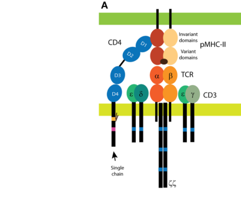

## Question

# Gene Research for Functional Annotation

## ⚠️ CRITICAL: Gene/Protein Identification Context

**BEFORE YOU BEGIN RESEARCH:** You MUST verify you are researching the CORRECT gene/protein. Gene symbols can be ambiguous, especially for less well-characterized genes from non-model organisms.

### Target Gene/Protein Identity (from UniProt):
- **UniProt Accession:** P01730
- **Protein Description:** RecName: Full=T-cell surface glycoprotein CD4; AltName: Full=T-cell surface antigen T4/Leu-3; AltName: CD_antigen=CD4; Flags: Precursor;
- **Gene Information:** Name=CD4;
- **Organism (full):** Homo sapiens (Human).
- **Protein Family:** Not specified in UniProt
- **Key Domains:** CD4. (IPR000973); CD4-extracel. (IPR015274); Ig-like_dom. (IPR007110); Ig-like_dom_sf. (IPR036179); Ig-like_fold. (IPR013783)

### MANDATORY VERIFICATION STEPS:

1. **Check if the gene symbol "CD4" matches the protein description above**
2. **Verify the organism is correct:** Homo sapiens (Human).
3. **Check if protein family/domains align with what you find in literature**
4. **If you find literature for a DIFFERENT gene with the same or similar symbol, STOP**

### If Gene Symbol is Ambiguous or You Cannot Find Relevant Literature:

**DO NOT PROCEED WITH RESEARCH ON A DIFFERENT GENE.** Instead:
- State clearly: "The gene symbol 'CD4' is ambiguous or literature is limited for this specific protein"
- Explain what you found (e.g., "Found extensive literature on a different gene with the same symbol in a different organism")
- Describe the protein based ONLY on the UniProt information provided above
- Suggest that the protein function can be inferred from domain/family information

### Research Target:

Please provide a comprehensive research report on the gene **CD4** (gene ID: CD4, UniProt: P01730) in human.

The research report should be a detailed narrative explaining the function, biological processes, and localization of the gene product. Citations should be given for all claims.

You should prioritize authoritative reviews and primary scientific literature when conducting research. You can supplement
this with annotations you find in gene/protein databases, but these can be outdated or inaccurate.

We are specifically interested in the primary function of the gene - for enzymes, what reaction is catalyzed, and what is the substrate specificity? For transporters, what is the substrate? For structural proteins or adapters, what is the broader structural role? For signaling molecules, what is the role in the pathway.

We are interested in where in or outside the cell the gene product carries out its function.

We are also interested in the signaling or biochemical pathways in which the gene functions. We are less interested in broad pleiotropic effects, except where these elucidate the precise role.

Include evidence where possible. We are interested in both experimental evidence as well as inference from structure, evolution, or bioinformatic analysis. Precise studies should be prioritized over high-throughput, where available.

## Output

Question: You are an expert researcher providing comprehensive, well-cited information.

Provide detailed information focusing on:
1. Key concepts and definitions with current understanding
2. Recent developments and latest research (prioritize 2023-2024 sources)
3. Current applications and real-world implementations
4. Expert opinions and analysis from authoritative sources
5. Relevant statistics and data from recent studies

Format as a comprehensive research report with proper citations. Include URLs and publication dates where available.
Always prioritize recent, authoritative sources and provide specific citations for all major claims.

# Gene Research for Functional Annotation

## ⚠️ CRITICAL: Gene/Protein Identification Context

**BEFORE YOU BEGIN RESEARCH:** You MUST verify you are researching the CORRECT gene/protein. Gene symbols can be ambiguous, especially for less well-characterized genes from non-model organisms.

### Target Gene/Protein Identity (from UniProt):
- **UniProt Accession:** P01730
- **Protein Description:** RecName: Full=T-cell surface glycoprotein CD4; AltName: Full=T-cell surface antigen T4/Leu-3; AltName: CD_antigen=CD4; Flags: Precursor;
- **Gene Information:** Name=CD4;
- **Organism (full):** Homo sapiens (Human).
- **Protein Family:** Not specified in UniProt
- **Key Domains:** CD4. (IPR000973); CD4-extracel. (IPR015274); Ig-like_dom. (IPR007110); Ig-like_dom_sf. (IPR036179); Ig-like_fold. (IPR013783)

### MANDATORY VERIFICATION STEPS:

1. **Check if the gene symbol "CD4" matches the protein description above**
2. **Verify the organism is correct:** Homo sapiens (Human).
3. **Check if protein family/domains align with what you find in literature**
4. **If you find literature for a DIFFERENT gene with the same or similar symbol, STOP**

### If Gene Symbol is Ambiguous or You Cannot Find Relevant Literature:

**DO NOT PROCEED WITH RESEARCH ON A DIFFERENT GENE.** Instead:
- State clearly: "The gene symbol 'CD4' is ambiguous or literature is limited for this specific protein"
- Explain what you found (e.g., "Found extensive literature on a different gene with the same symbol in a different organism")
- Describe the protein based ONLY on the UniProt information provided above
- Suggest that the protein function can be inferred from domain/family information

### Research Target:

Please provide a comprehensive research report on the gene **CD4** (gene ID: CD4, UniProt: P01730) in human.

The research report should be a detailed narrative explaining the function, biological processes, and localization of the gene product. Citations should be given for all claims.

You should prioritize authoritative reviews and primary scientific literature when conducting research. You can supplement
this with annotations you find in gene/protein databases, but these can be outdated or inaccurate.

We are specifically interested in the primary function of the gene - for enzymes, what reaction is catalyzed, and what is the substrate specificity? For transporters, what is the substrate? For structural proteins or adapters, what is the broader structural role? For signaling molecules, what is the role in the pathway.

We are interested in where in or outside the cell the gene product carries out its function.

We are also interested in the signaling or biochemical pathways in which the gene functions. We are less interested in broad pleiotropic effects, except where these elucidate the precise role.

Include evidence where possible. We are interested in both experimental evidence as well as inference from structure, evolution, or bioinformatic analysis. Precise studies should be prioritized over high-throughput, where available.

# Human CD4 (UniProt P01730): functional annotation research report

**Identity verified.** The target is **CD4**, the human (*Homo sapiens*) T-cell surface glycoprotein, not the similarly named CD4 proteins of other species or the unrelated HIV chemokine coreceptors. A 2024 human genetics study explicitly identifies canonical CD4 as **UniProt P01730**, a 458-amino-acid protein. Its four extracellular immunoglobulin-like domains, membrane-spanning segment, and intracellular LCK-binding region agree with the supplied domain annotations. CD4 is a **non-enzymatic receptor coreceptor**: its primary physiological role is to couple recognition of peptide–MHC class II by the T-cell receptor (TCR) to intracellular signaling. (guerin2024helpertcell pages 6-7, glatzova2019dualroleof pages 1-2)

## Molecular function and site of action

Canonical CD4 is a single-chain, type-I membrane glycoprotein. Its extracellular, membrane-distal **D1 domain** recognizes conserved surfaces of **HLA/MHC class II**, principally a pocket formed by its membrane-proximal α2 and β2 domains; it does **not** recognize the antigenic peptide as the TCR does. D2–D4 extend D1 from the T-cell membrane, while the cytoplasmic tail associates with the Src-family tyrosine kinase **LCK**. This architecture places the protein’s ligand-binding activity **outside the cell**, at the T-cell–antigen-presenting-cell interface, and its kinase-recruitment function **on the cytoplasmic side** of that interface. CD4 itself neither phosphorylates substrates nor transports molecules. Structural complexes and cellular proximity measurements place CD4 alongside TCR–CD3 bound to the **same peptide–MHC-II complex**, close to the CD3δε signaling subunits. (li2013structuralandbiophysical pages 4-5, glassman2016thecd4and pages 1-3, glatzova2019dualroleof pages 1-2)

The reviewed domain schematic, **Figure 1A** of Glatzová and Cebecauer (2019), depicts the four extracellular domains, the D1 MHC-binding region, and the intracellular LCK-binding and palmitoylation sites. It is a useful visual map of the experimentally studied protein, not evidence that every proposed membrane-organizing interaction has been established in living cells. (glatzova2019dualroleof media ade43fa1, glatzova2019dualroleof pages 7-8)

The principal ligand is **peptide-loaded MHC class II**, encompassing HLA-DR, -DP and -DQ. CD4 contacts comparatively conserved MHC-II regions, explaining broad class-II recognition rather than specificity for an individual peptide. Notably, recognition is extremely weak as an isolated molecular interaction: Jönsson *et al.* could not detect soluble CD4 binding to several human peptide–HLA-II complexes at concentrations up to **2.5 mM**, whereas multivalent CD4 beads bound MHC-II-expressing cells. They measured a two-dimensional dissociation constant of approximately **5,000 molecules/µm²** in a membrane system. Their modeling predicted roughly **threefold more TCR-complex phosphorylation** but only a **2–20% increase in effective TCR–peptide–MHC-II affinity** with CD4 engagement. Thus, kinase delivery and molecular positioning are better-supported explanations for CD4’s sensitivity-enhancing effect than simple strengthening of a single TCR–ligand bond; cell-surface organization may additionally enable adhesion, and the precise contributions remain under investigation. (li2013structuralandbiophysical pages 4-5, jonsson2016remarkablylowaffinity pages 1-1, jonsson2016remarkablylowaffinity pages 1-2, glatzova2019dualroleof pages 7-8)

The domain-level interpretation, including the shorter human isoform, is summarized below. (guerin2024helpertcell pages 9-10, glatzova2019dualroleof pages 1-2)

| Molecular region | Localization / architecture | Direct binding or process | Experimental evidence and limits |
|---|---|---|---|
| Extracellular D1 | Membrane-distal Ig-like domain of canonical human CD4 (UniProt P01730) | Contacts conserved surfaces in the HLA/MHC-II α2–β2 pocket; also binds HIV gp120, which subsequently enables viral CCR5 or CXCR4 engagement | Structural and mutational evidence maps MHC-II recognition to D1. The interaction is exceptionally weak (solution \(K_D>2.5\) mM), favoring an LCK-delivery rather than a simple adhesion-stabilization model. CD4 is the primary HIV receptor but **not** the viral chemokine coreceptor; CCR5/CXCR4 serves that role. (li2013structuralandbiophysical pages 4-5, jonsson2016remarkablylowaffinity pages 1-1, jonsson2016remarkablylowaffinity pages 1-2, faivre2024thechemokinereceptor pages 2-4) |
| Extracellular D2–D4 | Three additional Ig-like domains extending D1 above the plasma membrane; D4 is membrane-proximal | Support ectodomain geometry and formation of the TCR–pMHC-II–CD4 macrocomplex; D4-specific antibodies can detect proteins lacking distal domains | FRET and structural models place CD4 near CD3δε in a compact signaling macrocomplex. These domains are architectural rather than catalytic, and antibody detection can depend on which domain/epitope remains intact. (glassman2016thecd4and pages 1-3, glatzova2019dualroleof pages 1-2, guerin2024helpertcell pages 10-12) |
| Transmembrane and juxtamembrane region | Spans the plasma membrane; nearby cysteines can be palmitoylated and influence membrane organization | Supports membrane targeting, microvillar enrichment and spatial coupling to TCR signaling machinery | CD4 accumulates at T-cell microvillar tips, potentially aiding scanning of MHC-II-bearing cells. Palmitoylation/lipid-domain and stable oligomerization models remain incompletely established in living cells. (glatzova2019dualroleof pages 4-5, glatzova2019dualroleof pages 7-8) |
| Cytoplasmic LCK-binding tail | Intracellular, non-enzymatic tail | Binds the Src-family kinase LCK; recruited LCK phosphorylates CD3 ITAMs and ZAP70, initiating LAT/SLP-76/PLCγ1-dependent signaling | CD4 itself has **no catalytic activity**—LCK is the kinase. Co-immunoprecipitation and CD3/CD4-crosslinking experiments show CD4-associated LCK can enhance or sustain ZAP70 phosphorylation; patient variants unable to recruit LCK lose this CD4-dependent enhancement, although CD3-only signaling can remain intact. (rangarajan2014tcellreceptor pages 6-8, glatzova2019dualroleof pages 2-4, guerin2024helpertcell pages 10-12, guerin2024helpertcell pages 20-21) |
| Short D4-containing isoform (isoform 2) | Retains D4, transmembrane segment and intracellular tail but lacks distal D1–D3 | Can associate with LCK but does not bind HLA class II; therefore it cannot perform canonical pMHC-II coreceptor recognition | The 2024 human-deficiency study found isoform 2 expression and LCK association when its intracellular tail was intact. Because it lacks D1, it cannot substitute for canonical HLA-II binding; whether its observed in-vitro signaling contribution operates similarly in vivo remains unresolved. (guerin2024helpertcell pages 9-10, guerin2024helpertcell pages 1-2, guerin2024helpertcell pages 6-7, guerin2024helpertcell pages 10-12, guerin2024helpertcell pages 20-21) |

*Table: Domain-level functional map of human CD4 (UniProt P01730), distinguishing its extracellular ligand-binding, membrane-organizing and intracellular LCK-recruiting roles. It also separates CD4’s non-enzymatic coreceptor function from LCK catalysis and HIV chemokine-coreceptor usage.*

## Pathway and biological processes

At an immunological synapse, a peptide-specific TCR binds peptide–MHC-II on an antigen-presenting cell; CD4 binds a distinct, largely conserved site on that MHC-II molecule. CD4-associated **LCK phosphorylates CD3 immunoreceptor tyrosine-based activation motifs (ITAMs)** and promotes recruitment and activation of **ZAP70**. ZAP70 phosphorylation of **LAT** and other signaling proteins assembles complexes involving **SLP-76, PLCγ1 and Grb2/SOS**, propagating calcium- and MAPK-linked T-cell activation. The enzyme in the first phosphorylation step is **LCK, not CD4**. CD4 consequently raises the sensitivity of MHC-II-restricted antigen recognition, contributing to helper-T-cell development and function. A cellular FRET study directly supported proximity of CD4 and CD3δε in the signaling macrocomplex; this is stronger evidence for spatial coupling than for a particular fixed arrangement of all intracellular components. (rangarajan2014tcellreceptor pages 6-8, glassman2016thecd4and pages 1-3, glatzova2019dualroleof pages 2-4)

CD4’s predominant functional setting is the **plasma membrane of helper-lineage T cells**. In cultured resting T cells it accumulates at **microvillar tips**, candidate first-contact sites for MHC-II-bearing cells; upon antigen recognition, CD4 and its associated LCK can participate in TCR signaling assemblies. Its cytoplasmic juxtamembrane region contains reported palmitoylation sites that may affect membrane distribution, but stable CD4 oligomers or discrete ‘lipid-raft’ localization should not be treated as established universal requirements. CD4 is also found at lower levels on human macrophages. In primary macrophages, which lack the lymphocyte-associated LCK examined in one study, CD4 recycles constitutively and approximately **40–50% was intracellular at steady state**, versus approximately **90% surface localization in the lymphoid-cell comparison**. This intracellular fraction reflects trafficking, not a change in CD4’s principal extracellular ligand-binding role. (raposo2011proteomicbasedidentificationof pages 1-3, glatzova2019dualroleof pages 4-5, glatzova2019dualroleof pages 7-8)

## Recent human evidence: what CD4 deficiency does and does not establish

The most consequential **2024** functional study identified **seven people aged 5–61 years from five families** with inherited, biallelic deleterious **CD4** variants. None had conventionally detectable CD4-positive T cells, yet they had markedly expanded TCRαβ⁺CD4⁻CD8⁻ cells with helper-like phenotypes and transcriptional profiles. The mean frequency of these double-negative cells was **31.3% in patients versus 1.5% in healthy donors**; mean CD8-positive T-cell frequencies were **67.8% versus 34.5%**, respectively. Patient-derived cells still responded to HLA-II-restricted antigens and supported B-cell differentiation *in vitro*. In the five patients assessed for particular recall responses, **3/5** responded to tetanus antigen and **5/5** to *Candida*, although responses were generally two- to threefold lower than those of controls. These are direct human observations of substantial—but incomplete—functional compensation, not proof that CD4 is dispensable. (guerin2024helpertcell pages 1-2, guerin2024helpertcell pages 10-12, guerin2024helpertcell pages 15-17)

The same study distinguished the canonical protein from a **shorter, D4-containing CD4 isoform** lacking distal D1–D3. The shorter isoform could associate with LCK when its intracellular region was intact but did **not** provide canonical HLA-II binding. CD3/CD4 antibody crosslinking enhanced ZAP70 phosphorylation in cells with an LCK-binding CD4 product; a patient whose altered product could not bind LCK lacked that **CD4-dependent enhancement**, although CD3-triggered T-cell signaling persisted. The authors explicitly left open whether signaling attributable to the shorter product *in vitro* operates equivalently *in vivo*. Patients retained susceptibility to particular infections, notably **HPV-associated recalcitrant warts and Whipple’s disease**, and some helper-cell differentiation and cytokine responses were impaired. Conclusions about protection against individual pathogens are constrained by the small cohort and variable genotypes and clinical histories. (guerin2024helpertcell pages 9-10, guerin2024helpertcell pages 10-12, guerin2024helpertcell pages 17-19, guerin2024helpertcell pages 20-21)

## HIV relevance and real-world applications

**Pathogen exploitation is distinct from normal function.** HIV-1 envelope gp120 engages extracellular **CD4 D1** first; the resulting viral-envelope rearrangement permits engagement of **CCR5 or CXCR4**, followed by gp41-mediated membrane fusion. CD4 is therefore the initial cellular HIV receptor, whereas **CCR5/CXCR4 are the HIV entry coreceptors**. This distinction matters when annotating CD4 or interpreting entry-inhibitor mechanisms. (glatzova2019dualroleof pages 4-5, faivre2024thechemokinereceptor pages 2-4)

**Clinical monitoring:** Antibody-based enumeration of CD4-positive T cells informs assessment of HIV-associated immune compromise. A 2023 review defines **advanced HIV disease in adults as a CD4 count below 200 cells/µL** and describes CD4 testing as a gateway to opportunistic-infection screening and prophylaxis; it estimates that approximately **30%** of people presenting for HIV care have advanced disease. The count is a clinically useful cellular biomarker, **not** a direct measurement of CD4 receptor signaling. In the unusual inherited-deficiency setting, conventional CD4 staining can also fail to identify compensating helper-like CD4-negative T cells. (lehman2023advancedhivdisease pages 3-4, lehman2023advancedhivdisease pages 1-3, guerin2024helpertcell pages 1-2)

**CD4-directed treatment:** **Ibalizumab**, an anti-CD4 domain-2 antibody, is a post-attachment HIV entry inhibitor used **with other active antiretrovirals** for heavily treatment-experienced adults. Its target is the host CD4 protein, rather than viral gp120 or CCR5. In the completed, single-arm phase-III study **NCT02475629** (*n* = **40**), **33/40 (83%)** achieved at least a 0.5-log₁₀ decline in HIV RNA seven days after ibalizumab initiation; **17/40 (43%)** had HIV RNA below 50 copies/mL at week 25 while receiving ibalizumab plus an optimized background regimen. The latter outcome cannot be attributed to ibalizumab alone. A separate **June 2024** ex-vivo study of multidrug-resistant HIV found that **none of 93 tested viral isolates resisted UB-421**, an investigational antibody directed against CD4 D1; this is *ex-vivo susceptibility*, **not demonstrated patient-level efficacy**. (beran2024anarrativereview pages 2-3, rai2024exvivosensitivity pages 1-2, NCT02475629 chunk 1)

## Interpretation and evidence limits

**High-confidence annotation:** human CD4/P01730 is an extracellular MHC-II-binding, intracellular LCK-associating **TCR coreceptor** operating chiefly at the T-cell plasma membrane and immunological synapse. Structural binding studies, membrane biophysics, cellular signaling experiments and human loss-of-function genetics converge on this assignment. **Remaining questions** concern how its very weak individual MHC-II interaction achieves efficient signaling in particular membrane contexts, the contributions of adhesion and membrane organization, and the *in-vivo* functional importance of the shorter isoform. Results from CD4-deficient patients establish biological compensation but do not overturn the molecular mechanism of canonical CD4. (guerin2024helpertcell pages 1-2, glassman2016thecd4and pages 1-3, jonsson2016remarkablylowaffinity pages 1-1, guerin2024helpertcell pages 20-21, glatzova2019dualroleof pages 7-8)

### Principal sources and links

- Guérin A *et al.* **April 2024**. “Helper T cell immunity in humans with inherited CD4 deficiency.” *Journal of Experimental Medicine*. https://doi.org/10.1084/jem.20231044. (guerin2024helpertcell pages 1-2, guerin2024helpertcell pages 6-7)
- Jönsson P *et al.* **April 2016**. “Remarkably low affinity of CD4/peptide-major histocompatibility complex class II protein interactions.” *PNAS*. https://doi.org/10.1073/pnas.1513918113. (jonsson2016remarkablylowaffinity pages 1-1)
- Glassman CR *et al.* **June 2016**. “The CD4 and CD3δε Cytosolic Juxtamembrane Regions Are Proximal within a Compact TCR–CD3–pMHC–CD4 Macrocomplex.” *Journal of Immunology*. https://doi.org/10.4049/jimmunol.1502110. (glassman2016thecd4and pages 1-3)
- Glatzová D and Cebecauer M. **April 2019**. “Dual Role of CD4 in Peripheral T Lymphocytes.” *Frontiers in Immunology*. https://doi.org/10.3389/fimmu.2019.00618. (glatzova2019dualroleof pages 1-2, glatzova2019dualroleof media ade43fa1)
- Rai MA *et al.* **June 2024**. “Ex vivo sensitivity to broadly neutralizing antibodies and anti-CD4 antibody UB-421…” *eBioMedicine*. https://doi.org/10.1016/j.ebiom.2024.105151. (rai2024exvivosensitivity pages 1-2)
- Beran C *et al.* **July 2024**. “A Narrative Review of Novel Agents for Managing Heavily Treatment-Experienced People Living With HIV.” *Journal of Pharmacy Technology*. https://doi.org/10.1177/87551225241259894; phase-III registry: https://clinicaltrials.gov/study/NCT02475629. (beran2024anarrativereview pages 2-3, NCT02475629 chunk 1)
- Lehman A *et al.* **April 2023**. “Advanced HIV disease: A review of diagnostic and prophylactic strategies.” *HIV Medicine*. https://doi.org/10.1111/hiv.13487. (lehman2023advancedhivdisease pages 3-4, lehman2023advancedhivdisease pages 1-3)

References

1. (guerin2024helpertcell pages 6-7): Antoine Guérin, Marcela Moncada-Vélez, Katherine Jackson, Masato Ogishi, Jérémie Rosain, Mathieu Mancini, David Langlais, Andrea Nunez, Samantha Webster, Jesse Goyette, Taushif Khan, Nico Marr, Danielle T. Avery, Geetha Rao, Tim Waterboer, Birgitta Michels, Esmeralda Neves, Cátia Iracema Morais, Jonathan London, Stéphanie Mestrallet, Pierre Quartier dit Maire, Bénédicte Neven, Franck Rapaport, Yoann Seeleuthner, Atar Lev, Amos J. Simon, Jorge Montoya, Ortal Barel, Julio Gómez-Rodríguez, Julio C. Orrego, Anne-Sophie L’Honneur, Camille Soudée, Jessica Rojas, Alejandra C. Velez, Irini Sereti, Benjamin Terrier, Nancy Marin, Luis F. García, Laurent Abel, Stéphanie Boisson-Dupuis, Joel Reis, Antonio Marinho, Andrea Lisco, Emilia Faria, Christopher C. Goodnow, Julia Vasconcelos, Vivien Béziat, Cindy S. Ma, Raz Somech, Jean-Laurent Casanova, Jacinta Bustamante, Jose Luis Franco, and Stuart G. Tangye. Helper t cell immunity in humans with inherited cd4 deficiency. Journal of Experimental Medicine, Apr 2024. URL: https://doi.org/10.1084/jem.20231044, doi:10.1084/jem.20231044. This article has 15 citations and is from a highest quality peer-reviewed journal.

2. (glatzova2019dualroleof pages 1-2): Daniela Glatzová and Marek Cebecauer. Dual role of cd4 in peripheral t lymphocytes. Frontiers in Immunology, Apr 2019. URL: https://doi.org/10.3389/fimmu.2019.00618, doi:10.3389/fimmu.2019.00618. This article has 78 citations and is from a peer-reviewed journal.

3. (li2013structuralandbiophysical pages 4-5): Yili Li, Yiyuan Yin, and Roy A. Mariuzza. Structural and biophysical insights into the role of cd4 and cd8 in t cell activation. Frontiers in Immunology, May 2013. URL: https://doi.org/10.3389/fimmu.2013.00206, doi:10.3389/fimmu.2013.00206. This article has 177 citations and is from a peer-reviewed journal.

4. (glassman2016thecd4and pages 1-3): Caleb R. Glassman, Heather L. Parrish, Neha R. Deshpande, and Michael S. Kuhns. The cd4 and cd3δε cytosolic juxtamembrane regions are proximal within a compact tcr–cd3–pmhc–cd4 macrocomplex. The Journal of Immunology, 196:4713-4722, Jun 2016. URL: https://doi.org/10.4049/jimmunol.1502110, doi:10.4049/jimmunol.1502110. This article has 15 citations.

5. (glatzova2019dualroleof media ade43fa1): Daniela Glatzová and Marek Cebecauer. Dual role of cd4 in peripheral t lymphocytes. Frontiers in Immunology, Apr 2019. URL: https://doi.org/10.3389/fimmu.2019.00618, doi:10.3389/fimmu.2019.00618. This article has 78 citations and is from a peer-reviewed journal.

6. (glatzova2019dualroleof pages 7-8): Daniela Glatzová and Marek Cebecauer. Dual role of cd4 in peripheral t lymphocytes. Frontiers in Immunology, Apr 2019. URL: https://doi.org/10.3389/fimmu.2019.00618, doi:10.3389/fimmu.2019.00618. This article has 78 citations and is from a peer-reviewed journal.

7. (jonsson2016remarkablylowaffinity pages 1-1): Peter Jönsson, Jennifer H. Southcombe, Ana Mafalda Santos, Jiandong Huo, Ricardo A. Fernandes, James McColl, Melissa Lever, Edward J. Evans, Alexander Hudson, Veronica T. Chang, Tomáš Hanke, Andrew Godkin, Paul D. Dunne, Mathew H. Horrocks, Matthieu Palayret, Gavin R. Screaton, Jan Petersen, Jamie Rossjohn, Lars Fugger, Omer Dushek, Xiao-Ning Xu, Simon J. Davis, and David Klenerman. Remarkably low affinity of cd4/peptide-major histocompatibility complex class ii protein interactions. Proceedings of the National Academy of Sciences, 113:5682-5687, Apr 2016. URL: https://doi.org/10.1073/pnas.1513918113, doi:10.1073/pnas.1513918113. This article has 83 citations and is from a highest quality peer-reviewed journal.

8. (jonsson2016remarkablylowaffinity pages 1-2): Peter Jönsson, Jennifer H. Southcombe, Ana Mafalda Santos, Jiandong Huo, Ricardo A. Fernandes, James McColl, Melissa Lever, Edward J. Evans, Alexander Hudson, Veronica T. Chang, Tomáš Hanke, Andrew Godkin, Paul D. Dunne, Mathew H. Horrocks, Matthieu Palayret, Gavin R. Screaton, Jan Petersen, Jamie Rossjohn, Lars Fugger, Omer Dushek, Xiao-Ning Xu, Simon J. Davis, and David Klenerman. Remarkably low affinity of cd4/peptide-major histocompatibility complex class ii protein interactions. Proceedings of the National Academy of Sciences, 113:5682-5687, Apr 2016. URL: https://doi.org/10.1073/pnas.1513918113, doi:10.1073/pnas.1513918113. This article has 83 citations and is from a highest quality peer-reviewed journal.

9. (guerin2024helpertcell pages 9-10): Antoine Guérin, Marcela Moncada-Vélez, Katherine Jackson, Masato Ogishi, Jérémie Rosain, Mathieu Mancini, David Langlais, Andrea Nunez, Samantha Webster, Jesse Goyette, Taushif Khan, Nico Marr, Danielle T. Avery, Geetha Rao, Tim Waterboer, Birgitta Michels, Esmeralda Neves, Cátia Iracema Morais, Jonathan London, Stéphanie Mestrallet, Pierre Quartier dit Maire, Bénédicte Neven, Franck Rapaport, Yoann Seeleuthner, Atar Lev, Amos J. Simon, Jorge Montoya, Ortal Barel, Julio Gómez-Rodríguez, Julio C. Orrego, Anne-Sophie L’Honneur, Camille Soudée, Jessica Rojas, Alejandra C. Velez, Irini Sereti, Benjamin Terrier, Nancy Marin, Luis F. García, Laurent Abel, Stéphanie Boisson-Dupuis, Joel Reis, Antonio Marinho, Andrea Lisco, Emilia Faria, Christopher C. Goodnow, Julia Vasconcelos, Vivien Béziat, Cindy S. Ma, Raz Somech, Jean-Laurent Casanova, Jacinta Bustamante, Jose Luis Franco, and Stuart G. Tangye. Helper t cell immunity in humans with inherited cd4 deficiency. Journal of Experimental Medicine, Apr 2024. URL: https://doi.org/10.1084/jem.20231044, doi:10.1084/jem.20231044. This article has 15 citations and is from a highest quality peer-reviewed journal.

10. (faivre2024thechemokinereceptor pages 2-4): Natacha Faivre, Christel Verollet, and Fabrice Dumas. The chemokine receptor ccr5: multi-faceted hook for hiv-1. Retrovirology, Jan 2024. URL: https://doi.org/10.1186/s12977-024-00634-1, doi:10.1186/s12977-024-00634-1. This article has 42 citations and is from a peer-reviewed journal.

11. (guerin2024helpertcell pages 10-12): Antoine Guérin, Marcela Moncada-Vélez, Katherine Jackson, Masato Ogishi, Jérémie Rosain, Mathieu Mancini, David Langlais, Andrea Nunez, Samantha Webster, Jesse Goyette, Taushif Khan, Nico Marr, Danielle T. Avery, Geetha Rao, Tim Waterboer, Birgitta Michels, Esmeralda Neves, Cátia Iracema Morais, Jonathan London, Stéphanie Mestrallet, Pierre Quartier dit Maire, Bénédicte Neven, Franck Rapaport, Yoann Seeleuthner, Atar Lev, Amos J. Simon, Jorge Montoya, Ortal Barel, Julio Gómez-Rodríguez, Julio C. Orrego, Anne-Sophie L’Honneur, Camille Soudée, Jessica Rojas, Alejandra C. Velez, Irini Sereti, Benjamin Terrier, Nancy Marin, Luis F. García, Laurent Abel, Stéphanie Boisson-Dupuis, Joel Reis, Antonio Marinho, Andrea Lisco, Emilia Faria, Christopher C. Goodnow, Julia Vasconcelos, Vivien Béziat, Cindy S. Ma, Raz Somech, Jean-Laurent Casanova, Jacinta Bustamante, Jose Luis Franco, and Stuart G. Tangye. Helper t cell immunity in humans with inherited cd4 deficiency. Journal of Experimental Medicine, Apr 2024. URL: https://doi.org/10.1084/jem.20231044, doi:10.1084/jem.20231044. This article has 15 citations and is from a highest quality peer-reviewed journal.

12. (glatzova2019dualroleof pages 4-5): Daniela Glatzová and Marek Cebecauer. Dual role of cd4 in peripheral t lymphocytes. Frontiers in Immunology, Apr 2019. URL: https://doi.org/10.3389/fimmu.2019.00618, doi:10.3389/fimmu.2019.00618. This article has 78 citations and is from a peer-reviewed journal.

13. (rangarajan2014tcellreceptor pages 6-8): Sneha Rangarajan and Roy A. Mariuzza. T cell receptor bias for mhc: co-evolution or co-receptors? Cellular and Molecular Life Sciences, 71:3059-3068, Mar 2014. URL: https://doi.org/10.1007/s00018-014-1600-9, doi:10.1007/s00018-014-1600-9. This article has 66 citations and is from a domain leading peer-reviewed journal.

14. (glatzova2019dualroleof pages 2-4): Daniela Glatzová and Marek Cebecauer. Dual role of cd4 in peripheral t lymphocytes. Frontiers in Immunology, Apr 2019. URL: https://doi.org/10.3389/fimmu.2019.00618, doi:10.3389/fimmu.2019.00618. This article has 78 citations and is from a peer-reviewed journal.

15. (guerin2024helpertcell pages 20-21): Antoine Guérin, Marcela Moncada-Vélez, Katherine Jackson, Masato Ogishi, Jérémie Rosain, Mathieu Mancini, David Langlais, Andrea Nunez, Samantha Webster, Jesse Goyette, Taushif Khan, Nico Marr, Danielle T. Avery, Geetha Rao, Tim Waterboer, Birgitta Michels, Esmeralda Neves, Cátia Iracema Morais, Jonathan London, Stéphanie Mestrallet, Pierre Quartier dit Maire, Bénédicte Neven, Franck Rapaport, Yoann Seeleuthner, Atar Lev, Amos J. Simon, Jorge Montoya, Ortal Barel, Julio Gómez-Rodríguez, Julio C. Orrego, Anne-Sophie L’Honneur, Camille Soudée, Jessica Rojas, Alejandra C. Velez, Irini Sereti, Benjamin Terrier, Nancy Marin, Luis F. García, Laurent Abel, Stéphanie Boisson-Dupuis, Joel Reis, Antonio Marinho, Andrea Lisco, Emilia Faria, Christopher C. Goodnow, Julia Vasconcelos, Vivien Béziat, Cindy S. Ma, Raz Somech, Jean-Laurent Casanova, Jacinta Bustamante, Jose Luis Franco, and Stuart G. Tangye. Helper t cell immunity in humans with inherited cd4 deficiency. Journal of Experimental Medicine, Apr 2024. URL: https://doi.org/10.1084/jem.20231044, doi:10.1084/jem.20231044. This article has 15 citations and is from a highest quality peer-reviewed journal.

16. (guerin2024helpertcell pages 1-2): Antoine Guérin, Marcela Moncada-Vélez, Katherine Jackson, Masato Ogishi, Jérémie Rosain, Mathieu Mancini, David Langlais, Andrea Nunez, Samantha Webster, Jesse Goyette, Taushif Khan, Nico Marr, Danielle T. Avery, Geetha Rao, Tim Waterboer, Birgitta Michels, Esmeralda Neves, Cátia Iracema Morais, Jonathan London, Stéphanie Mestrallet, Pierre Quartier dit Maire, Bénédicte Neven, Franck Rapaport, Yoann Seeleuthner, Atar Lev, Amos J. Simon, Jorge Montoya, Ortal Barel, Julio Gómez-Rodríguez, Julio C. Orrego, Anne-Sophie L’Honneur, Camille Soudée, Jessica Rojas, Alejandra C. Velez, Irini Sereti, Benjamin Terrier, Nancy Marin, Luis F. García, Laurent Abel, Stéphanie Boisson-Dupuis, Joel Reis, Antonio Marinho, Andrea Lisco, Emilia Faria, Christopher C. Goodnow, Julia Vasconcelos, Vivien Béziat, Cindy S. Ma, Raz Somech, Jean-Laurent Casanova, Jacinta Bustamante, Jose Luis Franco, and Stuart G. Tangye. Helper t cell immunity in humans with inherited cd4 deficiency. Journal of Experimental Medicine, Apr 2024. URL: https://doi.org/10.1084/jem.20231044, doi:10.1084/jem.20231044. This article has 15 citations and is from a highest quality peer-reviewed journal.

17. (raposo2011proteomicbasedidentificationof pages 1-3): Rui André Saraiva Raposo, Benjamin Thomas, Gabriela Ridlova, and William James. Proteomic-based identification of cd4-interacting proteins in human primary macrophages. PLoS ONE, 6:e18690, Apr 2011. URL: https://doi.org/10.1371/journal.pone.0018690, doi:10.1371/journal.pone.0018690. This article has 20 citations and is from a peer-reviewed journal.

18. (guerin2024helpertcell pages 15-17): Antoine Guérin, Marcela Moncada-Vélez, Katherine Jackson, Masato Ogishi, Jérémie Rosain, Mathieu Mancini, David Langlais, Andrea Nunez, Samantha Webster, Jesse Goyette, Taushif Khan, Nico Marr, Danielle T. Avery, Geetha Rao, Tim Waterboer, Birgitta Michels, Esmeralda Neves, Cátia Iracema Morais, Jonathan London, Stéphanie Mestrallet, Pierre Quartier dit Maire, Bénédicte Neven, Franck Rapaport, Yoann Seeleuthner, Atar Lev, Amos J. Simon, Jorge Montoya, Ortal Barel, Julio Gómez-Rodríguez, Julio C. Orrego, Anne-Sophie L’Honneur, Camille Soudée, Jessica Rojas, Alejandra C. Velez, Irini Sereti, Benjamin Terrier, Nancy Marin, Luis F. García, Laurent Abel, Stéphanie Boisson-Dupuis, Joel Reis, Antonio Marinho, Andrea Lisco, Emilia Faria, Christopher C. Goodnow, Julia Vasconcelos, Vivien Béziat, Cindy S. Ma, Raz Somech, Jean-Laurent Casanova, Jacinta Bustamante, Jose Luis Franco, and Stuart G. Tangye. Helper t cell immunity in humans with inherited cd4 deficiency. Journal of Experimental Medicine, Apr 2024. URL: https://doi.org/10.1084/jem.20231044, doi:10.1084/jem.20231044. This article has 15 citations and is from a highest quality peer-reviewed journal.

19. (guerin2024helpertcell pages 17-19): Antoine Guérin, Marcela Moncada-Vélez, Katherine Jackson, Masato Ogishi, Jérémie Rosain, Mathieu Mancini, David Langlais, Andrea Nunez, Samantha Webster, Jesse Goyette, Taushif Khan, Nico Marr, Danielle T. Avery, Geetha Rao, Tim Waterboer, Birgitta Michels, Esmeralda Neves, Cátia Iracema Morais, Jonathan London, Stéphanie Mestrallet, Pierre Quartier dit Maire, Bénédicte Neven, Franck Rapaport, Yoann Seeleuthner, Atar Lev, Amos J. Simon, Jorge Montoya, Ortal Barel, Julio Gómez-Rodríguez, Julio C. Orrego, Anne-Sophie L’Honneur, Camille Soudée, Jessica Rojas, Alejandra C. Velez, Irini Sereti, Benjamin Terrier, Nancy Marin, Luis F. García, Laurent Abel, Stéphanie Boisson-Dupuis, Joel Reis, Antonio Marinho, Andrea Lisco, Emilia Faria, Christopher C. Goodnow, Julia Vasconcelos, Vivien Béziat, Cindy S. Ma, Raz Somech, Jean-Laurent Casanova, Jacinta Bustamante, Jose Luis Franco, and Stuart G. Tangye. Helper t cell immunity in humans with inherited cd4 deficiency. Journal of Experimental Medicine, Apr 2024. URL: https://doi.org/10.1084/jem.20231044, doi:10.1084/jem.20231044. This article has 15 citations and is from a highest quality peer-reviewed journal.

20. (lehman2023advancedhivdisease pages 3-4): Alice Lehman, Jayne Ellis, Elizabeth Nalintya, Nathan C. Bahr, Angela Loyse, and Radha Rajasingham. Advanced hiv disease: a review of diagnostic and prophylactic strategies. HIV medicine, 24:859-876, Apr 2023. URL: https://doi.org/10.1111/hiv.13487, doi:10.1111/hiv.13487. This article has 45 citations and is from a peer-reviewed journal.

21. (lehman2023advancedhivdisease pages 1-3): Alice Lehman, Jayne Ellis, Elizabeth Nalintya, Nathan C. Bahr, Angela Loyse, and Radha Rajasingham. Advanced hiv disease: a review of diagnostic and prophylactic strategies. HIV medicine, 24:859-876, Apr 2023. URL: https://doi.org/10.1111/hiv.13487, doi:10.1111/hiv.13487. This article has 45 citations and is from a peer-reviewed journal.

22. (beran2024anarrativereview pages 2-3): Christina Beran, Joan M. Duggan, and Eric G. Sahloff. A narrative review of novel agents for managing heavily treatment-experienced people living with hiv. Journal of Pharmacy Technology, 40:194-201, Jul 2024. URL: https://doi.org/10.1177/87551225241259894, doi:10.1177/87551225241259894. This article has 9 citations and is from a peer-reviewed journal.

23. (rai2024exvivosensitivity pages 1-2): M. Ali Rai, Jana Blazkova, Jesse S. Justement, Victoria Shi, Brooke D. Kennedy, Maegan R. Manning, Mary McLaughlin, Michael C. Sneller, Alice K. Pau, Susan Moir, and Tae-Wook Chun. Ex vivo sensitivity to broadly neutralizing antibodies and anti-cd4 antibody ub-421 of infectious viral isolates from people living with multidrug-resistant hiv. Jun 2024. URL: https://doi.org/10.1016/j.ebiom.2024.105151, doi:10.1016/j.ebiom.2024.105151. This article has 4 citations and is from a peer-reviewed journal.

24. (NCT02475629 chunk 1):  Ibalizumab Plus Optimized Background Regimen in Patient With Multi-Drug Resistant HIV. TaiMed Biologics Inc.. 2015. ClinicalTrials.gov Identifier: NCT02475629

## Artifacts

- [Edison artifact artifact-00](CD4-deep-research-falcon_artifacts/artifact-00.md)

## Citations

1. jonsson2016remarkablylowaffinity pages 1-1
2. rai2024exvivosensitivity pages 1-2
3. guerin2024helpertcell pages 6-7
4. glatzova2019dualroleof pages 1-2
5. li2013structuralandbiophysical pages 4-5
6. glatzova2019dualroleof pages 7-8
7. jonsson2016remarkablylowaffinity pages 1-2
8. guerin2024helpertcell pages 9-10
9. faivre2024thechemokinereceptor pages 2-4
10. guerin2024helpertcell pages 10-12
11. glatzova2019dualroleof pages 4-5
12. rangarajan2014tcellreceptor pages 6-8
13. glatzova2019dualroleof pages 2-4
14. guerin2024helpertcell pages 20-21
15. guerin2024helpertcell pages 1-2
16. raposo2011proteomicbasedidentificationof pages 1-3
17. guerin2024helpertcell pages 15-17
18. guerin2024helpertcell pages 17-19
19. lehman2023advancedhivdisease pages 3-4
20. lehman2023advancedhivdisease pages 1-3
21. beran2024anarrativereview pages 2-3
22. https://doi.org/10.1084/jem.20231044.
23. https://doi.org/10.1073/pnas.1513918113.
24. https://doi.org/10.4049/jimmunol.1502110.
25. https://doi.org/10.3389/fimmu.2019.00618.
26. https://doi.org/10.1016/j.ebiom.2024.105151.
27. https://doi.org/10.1177/87551225241259894;
28. https://clinicaltrials.gov/study/NCT02475629.
29. https://doi.org/10.1111/hiv.13487.
30. https://doi.org/10.1084/jem.20231044,
31. https://doi.org/10.3389/fimmu.2019.00618,
32. https://doi.org/10.3389/fimmu.2013.00206,
33. https://doi.org/10.4049/jimmunol.1502110,
34. https://doi.org/10.1073/pnas.1513918113,
35. https://doi.org/10.1186/s12977-024-00634-1,
36. https://doi.org/10.1007/s00018-014-1600-9,
37. https://doi.org/10.1371/journal.pone.0018690,
38. https://doi.org/10.1111/hiv.13487,
39. https://doi.org/10.1177/87551225241259894,
40. https://doi.org/10.1016/j.ebiom.2024.105151,