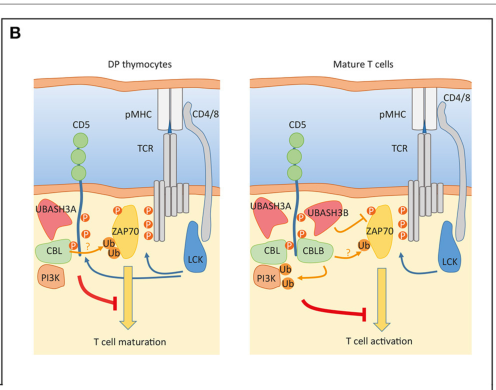

## Question

# Gene Research for Functional Annotation

## ⚠️ CRITICAL: Gene/Protein Identification Context

**BEFORE YOU BEGIN RESEARCH:** You MUST verify you are researching the CORRECT gene/protein. Gene symbols can be ambiguous, especially for less well-characterized genes from non-model organisms.

### Target Gene/Protein Identity (from UniProt):
- **UniProt Accession:** P06127
- **Protein Description:** RecName: Full=T-cell surface glycoprotein CD5; AltName: Full=Lymphocyte antigen T1/Leu-1; AltName: CD_antigen=CD5; Flags: Precursor;
- **Gene Information:** Name=CD5; Synonyms=LEU1;
- **Organism (full):** Homo sapiens (Human).
- **Protein Family:** Not specified in UniProt
- **Key Domains:** SRCR. (IPR001190); SRCR-like_dom_sf. (IPR036772); Tcell_CD5. (IPR003566); SRCR (PF00530)

### MANDATORY VERIFICATION STEPS:

1. **Check if the gene symbol "CD5" matches the protein description above**
2. **Verify the organism is correct:** Homo sapiens (Human).
3. **Check if protein family/domains align with what you find in literature**
4. **If you find literature for a DIFFERENT gene with the same or similar symbol, STOP**

### If Gene Symbol is Ambiguous or You Cannot Find Relevant Literature:

**DO NOT PROCEED WITH RESEARCH ON A DIFFERENT GENE.** Instead:
- State clearly: "The gene symbol 'CD5' is ambiguous or literature is limited for this specific protein"
- Explain what you found (e.g., "Found extensive literature on a different gene with the same symbol in a different organism")
- Describe the protein based ONLY on the UniProt information provided above
- Suggest that the protein function can be inferred from domain/family information

### Research Target:

Please provide a comprehensive research report on the gene **CD5** (gene ID: CD5, UniProt: P06127) in human.

The research report should be a detailed narrative explaining the function, biological processes, and localization of the gene product. Citations should be given for all claims.

You should prioritize authoritative reviews and primary scientific literature when conducting research. You can supplement
this with annotations you find in gene/protein databases, but these can be outdated or inaccurate.

We are specifically interested in the primary function of the gene - for enzymes, what reaction is catalyzed, and what is the substrate specificity? For transporters, what is the substrate? For structural proteins or adapters, what is the broader structural role? For signaling molecules, what is the role in the pathway.

We are interested in where in or outside the cell the gene product carries out its function.

We are also interested in the signaling or biochemical pathways in which the gene functions. We are less interested in broad pleiotropic effects, except where these elucidate the precise role.

Include evidence where possible. We are interested in both experimental evidence as well as inference from structure, evolution, or bioinformatic analysis. Precise studies should be prioritized over high-throughput, where available.

## Output

Question: You are an expert researcher providing comprehensive, well-cited information.

Provide detailed information focusing on:
1. Key concepts and definitions with current understanding
2. Recent developments and latest research (prioritize 2023-2024 sources)
3. Current applications and real-world implementations
4. Expert opinions and analysis from authoritative sources
5. Relevant statistics and data from recent studies

Format as a comprehensive research report with proper citations. Include URLs and publication dates where available.
Always prioritize recent, authoritative sources and provide specific citations for all major claims.

# Gene Research for Functional Annotation

## ⚠️ CRITICAL: Gene/Protein Identification Context

**BEFORE YOU BEGIN RESEARCH:** You MUST verify you are researching the CORRECT gene/protein. Gene symbols can be ambiguous, especially for less well-characterized genes from non-model organisms.

### Target Gene/Protein Identity (from UniProt):
- **UniProt Accession:** P06127
- **Protein Description:** RecName: Full=T-cell surface glycoprotein CD5; AltName: Full=Lymphocyte antigen T1/Leu-1; AltName: CD_antigen=CD5; Flags: Precursor;
- **Gene Information:** Name=CD5; Synonyms=LEU1;
- **Organism (full):** Homo sapiens (Human).
- **Protein Family:** Not specified in UniProt
- **Key Domains:** SRCR. (IPR001190); SRCR-like_dom_sf. (IPR036772); Tcell_CD5. (IPR003566); SRCR (PF00530)

### MANDATORY VERIFICATION STEPS:

1. **Check if the gene symbol "CD5" matches the protein description above**
2. **Verify the organism is correct:** Homo sapiens (Human).
3. **Check if protein family/domains align with what you find in literature**
4. **If you find literature for a DIFFERENT gene with the same or similar symbol, STOP**

### If Gene Symbol is Ambiguous or You Cannot Find Relevant Literature:

**DO NOT PROCEED WITH RESEARCH ON A DIFFERENT GENE.** Instead:
- State clearly: "The gene symbol 'CD5' is ambiguous or literature is limited for this specific protein"
- Explain what you found (e.g., "Found extensive literature on a different gene with the same symbol in a different organism")
- Describe the protein based ONLY on the UniProt information provided above
- Suggest that the protein function can be inferred from domain/family information

### Research Target:

Please provide a comprehensive research report on the gene **CD5** (gene ID: CD5, UniProt: P06127) in human.

The research report should be a detailed narrative explaining the function, biological processes, and localization of the gene product. Citations should be given for all claims.

You should prioritize authoritative reviews and primary scientific literature when conducting research. You can supplement
this with annotations you find in gene/protein databases, but these can be outdated or inaccurate.

We are specifically interested in the primary function of the gene - for enzymes, what reaction is catalyzed, and what is the substrate specificity? For transporters, what is the substrate? For structural proteins or adapters, what is the broader structural role? For signaling molecules, what is the role in the pathway.

We are interested in where in or outside the cell the gene product carries out its function.

We are also interested in the signaling or biochemical pathways in which the gene functions. We are less interested in broad pleiotropic effects, except where these elucidate the precise role.

Include evidence where possible. We are interested in both experimental evidence as well as inference from structure, evolution, or bioinformatic analysis. Precise studies should be prioritized over high-throughput, where available.

# Human CD5 (UniProt P06127): functional-annotation research report

**Identity verified.** The requested gene is human **CD5**, also called **Leu-1/LEU1**, encoding a ~67-kDa, type-I cell-surface glycoprotein; *Ly-1* is the historical mouse designation. Its three extracellular group-B scavenger receptor cysteine-rich (**SRCR**) domains match the supplied InterPro/Pfam annotations. CD5 is related to, but distinct from, CD6; the similarly named **CD5L/AIM gene product is not CD5**. The accession P06127 is the identifier supplied in the question; the literature independently corroborates the human name, topology and domain architecture. (freitas2018tcellcalcium pages 3-4, andres2020solublecd5and pages 1-3, vera2009thecd5ectodomain pages 1-2)

## Principal function and site of action

**The best-supported primary annotation is an antigen-receptor-associated signaling regulator, predominantly restraining the strength of T-cell receptor (TCR) signaling.** CD5 has no established catalytic reaction or transported substrate. Instead, its extracellular SRCR repeats extend outside the lymphocyte, its single membrane-spanning region anchors it at the **plasma membrane**, and its intracellular tail provides a phosphorylation-dependent platform for signaling proteins. It is expressed on developing thymocytes and mature T cells, and on selected B-cell populations; during T-cell activation it is recruited alongside TCR/CD3 to the **immunological synapse**, where signaling attenuation can occur. Surface CD5 can also undergo AP2-associated internalization; activation can release a soluble extracellular form detectable in blood. (andres2020solublecd5and pages 1-3, adegoke2024internalregulationbetween pages 1-2, lu2002ap2adaptorcomplexdependent pages 1-2, voisinne2018cd5anundercover pages 1-2)

In the thymus, CD5 abundance increases with signals received from self-peptide–MHC through the developing TCR. Mouse CD5-deficiency experiments show increased TCR-triggered phosphorylation, calcium mobilization and thymocyte responsiveness, supporting a role in setting the activation threshold during selection. **High CD5 expression is not, by itself, proof that a T cell is functionally suppressed**: it also marks stronger prior self-reactivity, which can predict greater responses to foreign antigen. Mouse developmental effects can confound interpretation of CD5 deletion in mature peripheral cells. (freitas2018tcellcalcium pages 3-4, voisinne2018cd5anundercover pages 1-2, voisinne2018cd5anundercover pages 2-3)

## Molecular mechanism and pathways

Following TCR engagement, Src-family kinases phosphorylate CD5’s cytoplasmic region. Reported sites in the **human** protein include Y429 and Y463; Y441 is another studied tail tyrosine, while C-terminal S459/S461 bind or are regulated by casein kinase 2 (**CK2**). These features make CD5 a **membrane signaling scaffold**, not a kinase. TCR-responsive CD5 complexes associate with the ubiquitin ligases **CBL and CBLB**, adaptor **GRB2**, and **CSK**. Recruitment of CBL-family proteins and consequent regulation of proximal effectors such as PI3K or ZAP70 is a supported mechanistic model; direct assignment of every downstream modification specifically to CD5, especially in unmodified human T cells, remains less certain. CSK-dependent inhibitory phosphorylation of Src kinases is another proposed route. Published work differs on whether the phosphatase **SHP-1** is required: association or recruitment in some systems should not be interpreted as universal SHP-1 dependence. CK2-linked signaling also illustrates why describing CD5 as an exclusively inhibitory switch would oversimplify its effects on survival and differentiation. (burguenobucio2019themultiplefaces pages 2-3, voisinne2018cd5anundercover pages 2-3, voisinne2018cd5anundercover pages 3-5, voisinne2018cd5anundercover pages 5-6, burguenobucio2019themultiplefaces pages 3-4)

A particularly relevant **2024 primary study** directly edited CD5 in human engineered T cells. CRISPR–Cas9 deletion exceeded **90% loss of detectable CD5 protein** in its manufacturing system. Compared with controls, CD5-null CAR T cells showed greater antigen-triggered **phospho-ERK1/2 and phospho-S6**, enrichment of PLCγ-associated calcium and DAG–IP₃ signaling programs, increased cytotoxic gene expression, and improved expansion and persistence in preclinical tumor models. These are experimentally observed downstream consequences of removing CD5, **not proof that CD5 directly binds PLCγ or catalyzes a reaction**. In an immunocompetent mouse lymphoma model, median survival increased from **13 to 18 days** after CD5 deletion in CAR T cells (*P* = 0.0321); in a separate pancreatic xenograft comparison, median survival was **46 versus 102 days**, but that contrast was **not statistically significant** (*P* = 0.14). Both require clinical validation. Patel *et al.*, *Science Immunology*, **July 2024**, https://doi.org/10.1126/sciimmunol.adn6509. (patel2024cd5deletionenhances pages 2-4, patel2024cd5deletionenhances pages 5-7, patel2024cd5deletionenhances pages 7-9)

**B-cell context.** CD5 can associate with the B-cell receptor (BCR) complex and attenuate BCR-induced calcium/ERK responses; studies of mouse B-1 cells and human leukemia models implicate its tail, including Y429, although SHP-1 dependence is disputed. CD5 also supports a distinguishable **BCR-independent** pathway: expressing CD5 in a human B-cell line increased basal extracellular calcium entry, **TRPC1** expression, constitutive **ERK1/2** activation and **IL-10** production. CD5 or TRPC1 knockdown in primary chronic lymphocytic leukemia (CLL) B cells reduced corresponding pathway measures or IL-10, lending patient-cell support. This is stronger evidence for a pathway in engineered cells and CLL than for its operation in every normal human CD5-positive B cell. Garaud *et al.*, *Cellular & Molecular Immunology*, **2018**, https://doi.org/10.1038/cmi.2016.42. (burguenobucio2019themultiplefaces pages 4-5, garaud2018cd5expressionpromotes pages 9-11, garaud2018cd5expressionpromotes pages 7-9)

## Extracellular recognition: demonstrated binding versus unsettled physiological ligands

The SRCR ectodomain has a second experimentally demonstrated activity: **fungal-pattern recognition**. Recombinant soluble **human** CD5 binds fungal cells and β-(1→3)-D-glucan phosphate, with an apparent **dissociation constant of 3.7 ± 0.2 nM** in the reported assay. β-glucan, but not mannan, competed for binding. The study detected binding to fungal preparations but not comparable binding to the tested *E. coli*, *S. aureus*, lipopolysaccharide, lipoteichoic acid or peptidoglycan; those negative results must **not** be replaced by the better-described bacterial-binding activities of the related receptor **CD6**. Membrane CD5 also supported zymosan-induced MAPK/cytokine responses. This establishes biochemical and cellular binding, while the extent of its contribution to antifungal defense **in humans** remains unquantified. Vera *et al.*, *PNAS*, **February 2009**, https://doi.org/10.1073/pnas.0805846106. (vera2009thecd5ectodomain pages 1-2, vera2009thecd5ectodomain pages 3-3, vera2009thecd5ectodomain pages 2-3)

**No unique, indispensable endogenous protein ligand has been established for CD5 in all physiological contexts.** An early purified-human-CD5 binding study proposed the B-cell protein **CD72**, whereas later binding experiments reported alternative cell-surface partners and, in one CD72-transfectant assay, failed to reproduce soluble-CD5 binding to CD72. A separate activated-lymphocyte binding activity was termed a “CD5 ligand” in older experiments; that descriptive name must not be equated automatically with the distinct **CD5L/AIM gene**. Moreover, experimental work indicates that the CD5 extracellular domain need not be engaged for inhibition of thymic TCR signaling, making ligand-independent, TCR-coupled scaffolding plausible. The appropriate annotation is therefore **reported CD72 interaction; physiological importance unresolved**, rather than “CD72 is the obligate CD5 ligand.” (adegoke2024internalregulationbetween pages 1-2, biancone1996identificationofa pages 2-3, biancone1996identificationofa pages 6-8, calvo1999interactionofrecombinant pages 5-7, breuning2016molecularmechanismsof pages 13-18)

## Recent developments and applications

The following table separates CD5’s established molecular role from context-specific and translational findings.

| Role and location | Key experimental result | Scope and limitation |
|---|---|---|
| **Primary annotation: TCR-inhibitory scaffold at the T-cell plasma membrane and immunological synapse** | CD5 associates with the TCR complex. After TCR engagement, its phosphorylated cytoplasmic tail organizes inhibitory regulators that restrain proximal signaling. In 2024, CRISPR–Cas9 deletion of **CD5** in human CAR- and TCR-engineered T cells increased ERK1/2 and S6 phosphorylation, cytotoxic programs, expansion and persistence; knockout efficiency exceeded 90%. Mouse genetic studies likewise show exaggerated TCR signaling without CD5. [Patel et al., 2024](https://doi.org/10.1126/sciimmunol.adn6509) (patel2024cd5deletionenhances pages 2-4, patel2024cd5deletionenhances pages 5-7, voisinne2018cd5anundercover pages 3-5) | This is the best-supported molecular function. CD5 lacks intrinsic catalytic activity and acts as a regulatory scaffold or co-receptor. CBL, CBLB, UBASH3 and CSK are plausible effectors; SHP1 contributes in some contexts but is not a universal or fully resolved mechanism. Therapeutic knockout evidence remains preclinical. |
| **B-cell signaling regulator: cell surface with downstream cytoplasmic ERK–TRPC1–Ca²⁺–IL-10 signaling** | Ectopic CD5 expression in a human B-cell line caused constitutive ERK1/2 activation, increased TRPC1 expression and extracellular Ca²⁺ entry, and promoted IL-10 production without BCR engagement. In primary CLL B cells, CD5 or TRPC1 knockdown reduced pathway components or IL-10, supporting a functional CD5–TRPC1–Ca²⁺–ERK axis. [Garaud et al., 2018](https://doi.org/10.1038/cmi.2016.42) (garaud2018cd5expressionpromotes pages 1-2, garaud2018cd5expressionpromotes pages 9-11, garaud2018cd5expressionpromotes pages 7-9) | This is direct evidence from engineered human B cells and primary CLL cells, but not definitive proof of the same mechanism in normal human B1-like cells. CD5 can also attenuate BCR-driven Ca²⁺, ERK and NF-κB signaling; leukemic survival effects and precise phosphotyrosine mediators remain context-dependent. |
| **Fungal-pattern recognition: extracellular SRCR ectodomain** | Recombinant soluble human CD5 bound and aggregated fungi and recognized β-(1→3)-D-glucan with an apparent **Kd of 3.7 ± 0.2 nM**. It did not comparably bind *E. coli*, *S. aureus*, LPS, lipoteichoic acid or peptidoglycan. Membrane CD5 supported zymosan-induced MAPK signaling. [Vera et al., 2009](https://doi.org/10.1073/pnas.0805846106) (vera2009thecd5ectodomain pages 3-3, vera2009thecd5ectodomain pages 1-2, vera2009thecd5ectodomain pages 2-3) | Biochemical and cell-based evidence supports fungal-glucan recognition, with additional protection data from mice, but its quantitative contribution to human antifungal immunity is unresolved. Human CD5-derived peptides inhibited *Cryptococcus* growth and virulence traits only **in vitro** in 2024 and are not clinically validated. [Mourglia-Ettlin et al., 2024](https://doi.org/10.3390/jof10100667) (mourgliaettlin2024invitroanalysis pages 1-2, mourgliaettlin2024invitroanalysis pages 5-7, mourgliaettlin2024invitroanalysis pages 7-9) |
| **Clinical cell-surface marker and therapeutic target: mature T-cell lymphomas** | A 2024 cohort found CD5 positivity in **122 of 194 cases (62.9%)**, including 46 of 49 TFH lymphomas, 34 of 41 PTCL-NOS cases and 7 of 9 ATLL cases. Separately, a nine-patient phase I study of **unedited autologous anti-CD5 CAR-T cells** reported **44% ORR** and **22% CR**, with no grade 3 or higher CRS, neurologic events or major infectious concerns. [Elghawy et al., 2024](https://doi.org/10.3390/cancers16193430) and [Hill et al., 2024](https://doi.org/10.1182/blood.2023022204) (shafagati2024antibodybasedtherapiesfor pages 9-10, elghawy2024prevalenceandprognostication pages 4-5, elghawy2024prevalenceandprognostication pages 5-7) | CD5 is an investigational target rather than a tumor-specific antigen because normal T cells also express it, creating risks of fratricide and T-cell aplasia. The nine-person clinical study targeted surface CD5 without deleting endogenous **CD5**; it is distinct from the 2024 preclinical **CD5-knockout CAR-T** strategy used to enhance function and prevent fratricide. |

*Table: Evidence-tier summary of human CD5’s signaling role, B-cell pathway activity, fungal-pattern recognition and emerging clinical use. It separates established functional annotation from context-dependent mechanisms and investigational applications.*

**Antifungal development (2024).** Synthetic tandem peptides incorporating short sequences from **human CD5 SRCR domains** reduced *Cryptococcus neoformans* growth in culture; the CD5-derived peptide approximately **halved colony-forming units** under tested conditions. At **50 µg/mL**, mean induced capsule width fell from **4.27 to 2.87 µm**, while the percentage of induced titan cells fell from **96.2% to 75.9%**. These are peptide effects **in vitro**, not evidence that administering intact CD5 treats cryptococcosis in people. Mourglia-Ettlin *et al.*, *Journal of Fungi*, **24 September 2024**, https://doi.org/10.3390/jof10100667. (mourgliaettlin2024invitroanalysis pages 1-2, mourgliaettlin2024invitroanalysis pages 5-7, mourgliaettlin2024invitroanalysis pages 7-9)

**T-cell tolerance (2024).** A mouse genetic study found that loss of the inhibitory receptor **BTLA** increased T-cell CD5 expression, including after induced deletion in adults, and linked constitutive inhibitory-receptor regulation to tolerance of recent thymic emigrants. This identifies a regulatory relationship affecting **CD5 abundance**, not a demonstrated direct BTLA–CD5 binding interaction or proof of the same causal pathway in humans. Adegoke *et al.*, *Open Biology*, **October 2024**, https://doi.org/10.1098/rsob.240178. (adegoke2024internalregulationbetween pages 1-2, adegoke2024internalregulationbetween pages 4-5)

**Diagnostic marker and cancer target.** Flow-cytometric or immunohistochemical measurement of surface CD5 helps characterize T-cell populations and CD5-positive lymphoid malignancies. In a **single-institution, retrospective 2024 cohort** of **194** mature T-cell lymphoma patients, **122/194 (62.9%)** tumors were CD5-positive: **46/49 (93.9%)** T-follicular-helper-cell lymphomas, **34/41 (82.9%)** PTCL-NOS and **7/9 (77.8%)** adult T-cell leukemia/lymphomas. CD5 status **did not significantly predict overall survival across the full cohort** (*P* = 0.69); adverse associations in particular subtypes (*P* = 0.04) require caution, especially for the nine-patient adult T-cell leukemia/lymphoma subgroup. These are biomarker associations, not evidence that CD5 itself causes those cancers. Elghawy *et al.*, *Cancers*, **October 2024**, https://doi.org/10.3390/cancers16193430. (elghawy2024prevalenceandprognostication pages 4-5, elghawy2024prevalenceandprognostication pages 5-7, elghawy2024prevalenceandprognostication pages 7-10)

CD5 is also an **investigational immunotherapy antigen**. A reported phase-I study of **unedited autologous anti-CD5 CAR T cells** treated **nine** patients with mature T-cell lymphoma and reported **44% overall response** and **22% complete response**; a 2024 review reported no grade ≥3 cytokine-release syndrome, neurologic events or major infectious concerns in that small group. This clinical strategy **targets CD5 on tumor cells**; it is distinct from the 2024 **preclinical strategy of deleting CD5 in therapeutic T cells** to relieve inhibition or avoid fratricide. Because healthy T cells themselves display CD5, fratricide, depletion of normal T cells, infections and long-term safety remain material concerns. Hill *et al.*, *Blood*, **March 2024**, https://doi.org/10.1182/blood.2023022204; Shafagati *et al.*, *Cancers*, **October 2024**, https://doi.org/10.3390/cancers16203489. The corresponding investigational trial is [NCT03081910](https://clinicaltrials.gov/study/NCT03081910); its registry explicitly says the CAR-T product is **not FDA-approved** and that its autologous arm has closed. (shafagati2024antibodybasedtherapiesfor pages 9-10, NCT03081910 chunk 1)

**Overall assessment.** CD5 is most confidently annotated as a **cell-surface, SRCR-containing signaling scaffold that calibrates antigen-receptor activation**, particularly at the T-cell immunological synapse. Human B-cell IL-10 signaling and extracellular fungal-glucan recognition are supported additional activities. Exact intracellular effector dependence, the physiological importance of proposed host ligands, and the clinical benefit–risk balance of CD5-directed or CD5-deleted cell therapies remain context-dependent questions rather than settled properties of every CD5-expressing cell. (andres2020solublecd5and pages 1-3, voisinne2018cd5anundercover pages 5-6, garaud2018cd5expressionpromotes pages 9-11, vera2009thecd5ectodomain pages 1-2, adegoke2024internalregulationbetween pages 1-2)

References

1. (freitas2018tcellcalcium pages 3-4): Claudia M. Tellez Freitas, Deborah K. Johnson, and K. Scott Weber. T cell calcium signaling regulation by the co-receptor cd5. International Journal of Molecular Sciences, 19:1295, Apr 2018. URL: https://doi.org/10.3390/ijms19051295, doi:10.3390/ijms19051295. This article has 39 citations.

2. (andres2020solublecd5and pages 1-3): María Velasco-de Andrés, Sergi Casadó-Llombart, Cristina Català, Alejandra Leyton-Pereira, Francisco Lozano, and Fernando Aranda. Soluble cd5 and cd6: lymphocytic class i scavenger receptors as immunotherapeutic agents. Cells, 9:2589, Dec 2020. URL: https://doi.org/10.3390/cells9122589, doi:10.3390/cells9122589. This article has 42 citations.

3. (vera2009thecd5ectodomain pages 1-2): Jorge Vera, Rafael Fenutría, Olga Cañadas, Maite Figueras, Rubén Mota, Maria-Rosa Sarrias, David L. Williams, Cristina Casals, José Yelamos, and Francisco Lozano. The cd5 ectodomain interacts with conserved fungal cell wall components and protects from zymosan-induced septic shock-like syndrome. Proceedings of the National Academy of Sciences, 106:1506-1511, Feb 2009. URL: https://doi.org/10.1073/pnas.0805846106, doi:10.1073/pnas.0805846106. This article has 197 citations and is from a highest quality peer-reviewed journal.

4. (adegoke2024internalregulationbetween pages 1-2): Adeolu O. Adegoke, Govindarajan Thangavelu, Ting-Fang Chou, Marcos I. Petersen, Kiyokazu Kakugawa, Julia F. May, Kevin Joannou, Qingyang Wang, Kristofor K. Ellestad, Louis Boon, Peter A. Bretscher, Hilde Cheroutre, Mitchell Kronenberg, Troy A. Baldwin, and Colin C. Anderson. Internal regulation between constitutively expressed t cell co-inhibitory receptors btla and cd5 and tolerance in recent thymic emigrants. Open Biology, Oct 2024. URL: https://doi.org/10.1098/rsob.240178, doi:10.1098/rsob.240178. This article has 2 citations and is from a peer-reviewed journal.

5. (lu2002ap2adaptorcomplexdependent pages 1-2): Xianghuai Lu, Robert C. Axtell, James F. Collawn, Andrew Gibson, Louis B. Justement, and Chander Raman. Ap2 adaptor complex-dependent internalization of cd5: differential regulation in t and b cells1. The Journal of Immunology, 168:5612-5620, Jun 2002. URL: https://doi.org/10.4049/jimmunol.168.11.5612, doi:10.4049/jimmunol.168.11.5612. This article has 42 citations.

6. (voisinne2018cd5anundercover pages 1-2): Guillaume Voisinne, Anne Gonzalez de Peredo, and Romain Roncagalli. Cd5, an undercover regulator of tcr signaling. Frontiers in Immunology, Dec 2018. URL: https://doi.org/10.3389/fimmu.2018.02900, doi:10.3389/fimmu.2018.02900. This article has 143 citations and is from a peer-reviewed journal.

7. (voisinne2018cd5anundercover pages 2-3): Guillaume Voisinne, Anne Gonzalez de Peredo, and Romain Roncagalli. Cd5, an undercover regulator of tcr signaling. Frontiers in Immunology, Dec 2018. URL: https://doi.org/10.3389/fimmu.2018.02900, doi:10.3389/fimmu.2018.02900. This article has 143 citations and is from a peer-reviewed journal.

8. (burguenobucio2019themultiplefaces pages 2-3): Erica Burgueño-Bucio, Carlos A Mier-Aguilar, and Gloria Soldevila. The multiple faces of cd5. Journal of Leukocyte Biology, 105:891-904, May 2019. URL: https://doi.org/10.1002/jlb.mr0618-226r, doi:10.1002/jlb.mr0618-226r. This article has 123 citations and is from a peer-reviewed journal.

9. (voisinne2018cd5anundercover pages 3-5): Guillaume Voisinne, Anne Gonzalez de Peredo, and Romain Roncagalli. Cd5, an undercover regulator of tcr signaling. Frontiers in Immunology, Dec 2018. URL: https://doi.org/10.3389/fimmu.2018.02900, doi:10.3389/fimmu.2018.02900. This article has 143 citations and is from a peer-reviewed journal.

10. (voisinne2018cd5anundercover pages 5-6): Guillaume Voisinne, Anne Gonzalez de Peredo, and Romain Roncagalli. Cd5, an undercover regulator of tcr signaling. Frontiers in Immunology, Dec 2018. URL: https://doi.org/10.3389/fimmu.2018.02900, doi:10.3389/fimmu.2018.02900. This article has 143 citations and is from a peer-reviewed journal.

11. (burguenobucio2019themultiplefaces pages 3-4): Erica Burgueño-Bucio, Carlos A Mier-Aguilar, and Gloria Soldevila. The multiple faces of cd5. Journal of Leukocyte Biology, 105:891-904, May 2019. URL: https://doi.org/10.1002/jlb.mr0618-226r, doi:10.1002/jlb.mr0618-226r. This article has 123 citations and is from a peer-reviewed journal.

12. (patel2024cd5deletionenhances pages 2-4): Ruchi P. Patel, Guido Ghilardi, Yunlin Zhang, Yi-Hao Chiang, Wei Xie, Puneeth Guruprasad, Ki Hyun Kim, Inkook Chun, Mathew G. Angelos, Raymone Pajarillo, Seok Jae Hong, Yong Gu Lee, Olga Shestova, Carolyn Shaw, Ivan Cohen, Aasha Gupta, Trang Vu, Dean Qian, Steven Yang, Aditya Nimmagadda, Adam E. Snook, Nicholas Siciliano, Antonia Rotolo, Arati Inamdar, Jaryse Harris, Ositadimma Ugwuanyi, Michael Wang, Alberto Carturan, Luca Paruzzo, Linhui Chen, Hatcher J. Ballard, Tatiana Blanchard, Chong Xu, Mohamed Abdel-Mohsen, Khatuna Gabunia, Maria Wysocka, Gerald P. Linette, Beatriz Carreno, David M. Barrett, David T. Teachey, Avery D. Posey, Daniel J. Powell, C. Tor Sauter, Stefano Pileri, Vinodh Pillai, John Scholler, Alain H. Rook, Stephen J. Schuster, Stefan K. Barta, Patrizia Porazzi, and Marco Ruella. Cd5 deletion enhances the antitumor activity of adoptive t cell therapies. Science Immunology, Jul 2024. URL: https://doi.org/10.1126/sciimmunol.adn6509, doi:10.1126/sciimmunol.adn6509. This article has 61 citations and is from a highest quality peer-reviewed journal.

13. (patel2024cd5deletionenhances pages 5-7): Ruchi P. Patel, Guido Ghilardi, Yunlin Zhang, Yi-Hao Chiang, Wei Xie, Puneeth Guruprasad, Ki Hyun Kim, Inkook Chun, Mathew G. Angelos, Raymone Pajarillo, Seok Jae Hong, Yong Gu Lee, Olga Shestova, Carolyn Shaw, Ivan Cohen, Aasha Gupta, Trang Vu, Dean Qian, Steven Yang, Aditya Nimmagadda, Adam E. Snook, Nicholas Siciliano, Antonia Rotolo, Arati Inamdar, Jaryse Harris, Ositadimma Ugwuanyi, Michael Wang, Alberto Carturan, Luca Paruzzo, Linhui Chen, Hatcher J. Ballard, Tatiana Blanchard, Chong Xu, Mohamed Abdel-Mohsen, Khatuna Gabunia, Maria Wysocka, Gerald P. Linette, Beatriz Carreno, David M. Barrett, David T. Teachey, Avery D. Posey, Daniel J. Powell, C. Tor Sauter, Stefano Pileri, Vinodh Pillai, John Scholler, Alain H. Rook, Stephen J. Schuster, Stefan K. Barta, Patrizia Porazzi, and Marco Ruella. Cd5 deletion enhances the antitumor activity of adoptive t cell therapies. Science Immunology, Jul 2024. URL: https://doi.org/10.1126/sciimmunol.adn6509, doi:10.1126/sciimmunol.adn6509. This article has 61 citations and is from a highest quality peer-reviewed journal.

14. (patel2024cd5deletionenhances pages 7-9): Ruchi P. Patel, Guido Ghilardi, Yunlin Zhang, Yi-Hao Chiang, Wei Xie, Puneeth Guruprasad, Ki Hyun Kim, Inkook Chun, Mathew G. Angelos, Raymone Pajarillo, Seok Jae Hong, Yong Gu Lee, Olga Shestova, Carolyn Shaw, Ivan Cohen, Aasha Gupta, Trang Vu, Dean Qian, Steven Yang, Aditya Nimmagadda, Adam E. Snook, Nicholas Siciliano, Antonia Rotolo, Arati Inamdar, Jaryse Harris, Ositadimma Ugwuanyi, Michael Wang, Alberto Carturan, Luca Paruzzo, Linhui Chen, Hatcher J. Ballard, Tatiana Blanchard, Chong Xu, Mohamed Abdel-Mohsen, Khatuna Gabunia, Maria Wysocka, Gerald P. Linette, Beatriz Carreno, David M. Barrett, David T. Teachey, Avery D. Posey, Daniel J. Powell, C. Tor Sauter, Stefano Pileri, Vinodh Pillai, John Scholler, Alain H. Rook, Stephen J. Schuster, Stefan K. Barta, Patrizia Porazzi, and Marco Ruella. Cd5 deletion enhances the antitumor activity of adoptive t cell therapies. Science Immunology, Jul 2024. URL: https://doi.org/10.1126/sciimmunol.adn6509, doi:10.1126/sciimmunol.adn6509. This article has 61 citations and is from a highest quality peer-reviewed journal.

15. (burguenobucio2019themultiplefaces pages 4-5): Erica Burgueño-Bucio, Carlos A Mier-Aguilar, and Gloria Soldevila. The multiple faces of cd5. Journal of Leukocyte Biology, 105:891-904, May 2019. URL: https://doi.org/10.1002/jlb.mr0618-226r, doi:10.1002/jlb.mr0618-226r. This article has 123 citations and is from a peer-reviewed journal.

16. (garaud2018cd5expressionpromotes pages 9-11): Soizic Garaud, Taher E Taher, Marjolaine Debant, Miguel Burgos, Sarra Melayah, Christian Berthou, Kaushal Parikh, Jacques-Olivier Pers, Damien Luque-Paz, Gilles Chiocchia, Maikel Peppelenbosch, David A Isenberg, Pierre Youinou, Olivier Mignen, Yves Renaudineau, and Rizgar A Mageed. Cd5 expression promotes il-10 production through activation of the mapk/erk pathway and upregulation of trpc1 channels in b lymphocytes. Cellular & Molecular Immunology, 15:158-170, Aug 2018. URL: https://doi.org/10.1038/cmi.2016.42, doi:10.1038/cmi.2016.42. This article has 69 citations and is from a peer-reviewed journal.

17. (garaud2018cd5expressionpromotes pages 7-9): Soizic Garaud, Taher E Taher, Marjolaine Debant, Miguel Burgos, Sarra Melayah, Christian Berthou, Kaushal Parikh, Jacques-Olivier Pers, Damien Luque-Paz, Gilles Chiocchia, Maikel Peppelenbosch, David A Isenberg, Pierre Youinou, Olivier Mignen, Yves Renaudineau, and Rizgar A Mageed. Cd5 expression promotes il-10 production through activation of the mapk/erk pathway and upregulation of trpc1 channels in b lymphocytes. Cellular & Molecular Immunology, 15:158-170, Aug 2018. URL: https://doi.org/10.1038/cmi.2016.42, doi:10.1038/cmi.2016.42. This article has 69 citations and is from a peer-reviewed journal.

18. (vera2009thecd5ectodomain pages 3-3): Jorge Vera, Rafael Fenutría, Olga Cañadas, Maite Figueras, Rubén Mota, Maria-Rosa Sarrias, David L. Williams, Cristina Casals, José Yelamos, and Francisco Lozano. The cd5 ectodomain interacts with conserved fungal cell wall components and protects from zymosan-induced septic shock-like syndrome. Proceedings of the National Academy of Sciences, 106:1506-1511, Feb 2009. URL: https://doi.org/10.1073/pnas.0805846106, doi:10.1073/pnas.0805846106. This article has 197 citations and is from a highest quality peer-reviewed journal.

19. (vera2009thecd5ectodomain pages 2-3): Jorge Vera, Rafael Fenutría, Olga Cañadas, Maite Figueras, Rubén Mota, Maria-Rosa Sarrias, David L. Williams, Cristina Casals, José Yelamos, and Francisco Lozano. The cd5 ectodomain interacts with conserved fungal cell wall components and protects from zymosan-induced septic shock-like syndrome. Proceedings of the National Academy of Sciences, 106:1506-1511, Feb 2009. URL: https://doi.org/10.1073/pnas.0805846106, doi:10.1073/pnas.0805846106. This article has 197 citations and is from a highest quality peer-reviewed journal.

20. (biancone1996identificationofa pages 2-3): By Luigi Biancone, Michael A. Bowen, Alice Lim, Alejandro Aruffo, Giuseppe Andres, and Ivan Stamenkovic. Identification of a novel inducible cell-surface ligand of cd5 on activated lymphocytes. The Journal of Experimental Medicine, 184:811-819, Sep 1996. URL: https://doi.org/10.1084/jem.184.3.811, doi:10.1084/jem.184.3.811. This article has 133 citations.

21. (biancone1996identificationofa pages 6-8): By Luigi Biancone, Michael A. Bowen, Alice Lim, Alejandro Aruffo, Giuseppe Andres, and Ivan Stamenkovic. Identification of a novel inducible cell-surface ligand of cd5 on activated lymphocytes. The Journal of Experimental Medicine, 184:811-819, Sep 1996. URL: https://doi.org/10.1084/jem.184.3.811, doi:10.1084/jem.184.3.811. This article has 133 citations.

22. (calvo1999interactionofrecombinant pages 5-7): Javier Calvo, Lourdes Places, Olga Padilla, Josep M. Vilà, Jordi Vives, Michael A. Bowen, and Francisco Lozano. Interaction of recombinant and natural soluble cd5 forms with an alternative cell surface ligand. European Journal of Immunology, 29:2119-2129, Jul 1999. URL: https://doi.org/10.1002/(sici)1521-4141(199907)29:07<2119::aid-immu2119>3.0.co;2-f, doi:10.1002/(sici)1521-4141(199907)29:07<2119::aid-immu2119>3.0.co;2-f. This article has 83 citations and is from a peer-reviewed journal.

23. (breuning2016molecularmechanismsof pages 13-18): J Breuning. Molecular mechanisms of immune regulation by the receptors cd5 and cd6. Unknown journal, 2016.

24. (garaud2018cd5expressionpromotes pages 1-2): Soizic Garaud, Taher E Taher, Marjolaine Debant, Miguel Burgos, Sarra Melayah, Christian Berthou, Kaushal Parikh, Jacques-Olivier Pers, Damien Luque-Paz, Gilles Chiocchia, Maikel Peppelenbosch, David A Isenberg, Pierre Youinou, Olivier Mignen, Yves Renaudineau, and Rizgar A Mageed. Cd5 expression promotes il-10 production through activation of the mapk/erk pathway and upregulation of trpc1 channels in b lymphocytes. Cellular & Molecular Immunology, 15:158-170, Aug 2018. URL: https://doi.org/10.1038/cmi.2016.42, doi:10.1038/cmi.2016.42. This article has 69 citations and is from a peer-reviewed journal.

25. (mourgliaettlin2024invitroanalysis pages 1-2): Gustavo Mourglia-Ettlin, María Clara González-Porcile, Violeta Planells-Romeo, Antonella Long-Albín, Laura Carrillo-Serradell, Sebastián Miles, Francisco Lozano, and María Velasco-de-Andrés. In vitro analysis of tandem peptides from human cd5 and cd6 scavenger receptors as potential anti-cryptococcal agents. Journal of Fungi, 10:667, Sep 2024. URL: https://doi.org/10.3390/jof10100667, doi:10.3390/jof10100667. This article has 1 citations.

26. (mourgliaettlin2024invitroanalysis pages 5-7): Gustavo Mourglia-Ettlin, María Clara González-Porcile, Violeta Planells-Romeo, Antonella Long-Albín, Laura Carrillo-Serradell, Sebastián Miles, Francisco Lozano, and María Velasco-de-Andrés. In vitro analysis of tandem peptides from human cd5 and cd6 scavenger receptors as potential anti-cryptococcal agents. Journal of Fungi, 10:667, Sep 2024. URL: https://doi.org/10.3390/jof10100667, doi:10.3390/jof10100667. This article has 1 citations.

27. (mourgliaettlin2024invitroanalysis pages 7-9): Gustavo Mourglia-Ettlin, María Clara González-Porcile, Violeta Planells-Romeo, Antonella Long-Albín, Laura Carrillo-Serradell, Sebastián Miles, Francisco Lozano, and María Velasco-de-Andrés. In vitro analysis of tandem peptides from human cd5 and cd6 scavenger receptors as potential anti-cryptococcal agents. Journal of Fungi, 10:667, Sep 2024. URL: https://doi.org/10.3390/jof10100667, doi:10.3390/jof10100667. This article has 1 citations.

28. (shafagati2024antibodybasedtherapiesfor pages 9-10): Nazila Shafagati, Suman Paul, Sima Rozati, and Cole H. Sterling. Antibody-based therapies for peripheral t-cell lymphoma. Oct 2024. URL: https://doi.org/10.3390/cancers16203489, doi:10.3390/cancers16203489. This article has 6 citations.

29. (elghawy2024prevalenceandprognostication pages 4-5): Omar Elghawy, Miao Cao, Jason Xu, Daniel J. Landsburg, Jakub Svoboda, Sunita D. Nasta, Elise A. Chong, Stephen J. Schuster, Colin J. Thomas, Jordan S. Carter, Montreh Tavakkoli, Marco Ruella, and Stefan K. Barta. Prevalence and prognostication of cd5+ mature t-cell lymphomas. Oct 2024. URL: https://doi.org/10.3390/cancers16193430, doi:10.3390/cancers16193430. This article has 6 citations.

30. (elghawy2024prevalenceandprognostication pages 5-7): Omar Elghawy, Miao Cao, Jason Xu, Daniel J. Landsburg, Jakub Svoboda, Sunita D. Nasta, Elise A. Chong, Stephen J. Schuster, Colin J. Thomas, Jordan S. Carter, Montreh Tavakkoli, Marco Ruella, and Stefan K. Barta. Prevalence and prognostication of cd5+ mature t-cell lymphomas. Oct 2024. URL: https://doi.org/10.3390/cancers16193430, doi:10.3390/cancers16193430. This article has 6 citations.

31. (adegoke2024internalregulationbetween pages 4-5): Adeolu O. Adegoke, Govindarajan Thangavelu, Ting-Fang Chou, Marcos I. Petersen, Kiyokazu Kakugawa, Julia F. May, Kevin Joannou, Qingyang Wang, Kristofor K. Ellestad, Louis Boon, Peter A. Bretscher, Hilde Cheroutre, Mitchell Kronenberg, Troy A. Baldwin, and Colin C. Anderson. Internal regulation between constitutively expressed t cell co-inhibitory receptors btla and cd5 and tolerance in recent thymic emigrants. Open Biology, Oct 2024. URL: https://doi.org/10.1098/rsob.240178, doi:10.1098/rsob.240178. This article has 2 citations and is from a peer-reviewed journal.

32. (elghawy2024prevalenceandprognostication pages 7-10): Omar Elghawy, Miao Cao, Jason Xu, Daniel J. Landsburg, Jakub Svoboda, Sunita D. Nasta, Elise A. Chong, Stephen J. Schuster, Colin J. Thomas, Jordan S. Carter, Montreh Tavakkoli, Marco Ruella, and Stefan K. Barta. Prevalence and prognostication of cd5+ mature t-cell lymphomas. Oct 2024. URL: https://doi.org/10.3390/cancers16193430, doi:10.3390/cancers16193430. This article has 6 citations.

33. (NCT03081910 chunk 1): Rayne Rouce. Autologous T-Cells Expressing a Second Generation CAR for Treatment of T-Cell Malignancies Expressing CD5 Antigen. Baylor College of Medicine. 2017. ClinicalTrials.gov Identifier: NCT03081910

## Artifacts

- [Edison artifact artifact-00](CD5-deep-research-falcon_artifacts/artifact-00.md)

## Citations

1. freitas2018tcellcalcium pages 3-4
2. adegoke2024internalregulationbetween pages 1-2
3. burguenobucio2019themultiplefaces pages 2-3
4. burguenobucio2019themultiplefaces pages 3-4
5. burguenobucio2019themultiplefaces pages 4-5
6. biancone1996identificationofa pages 2-3
7. biancone1996identificationofa pages 6-8
8. calvo1999interactionofrecombinant pages 5-7
9. breuning2016molecularmechanismsof pages 13-18
10. mourgliaettlin2024invitroanalysis pages 1-2
11. mourgliaettlin2024invitroanalysis pages 5-7
12. mourgliaettlin2024invitroanalysis pages 7-9
13. shafagati2024antibodybasedtherapiesfor pages 9-10
14. elghawy2024prevalenceandprognostication pages 4-5
15. elghawy2024prevalenceandprognostication pages 5-7
16. adegoke2024internalregulationbetween pages 4-5
17. elghawy2024prevalenceandprognostication pages 7-10
18. Patel et al., 2024
19. Garaud et al., 2018
20. Vera et al., 2009
21. Mourglia-Ettlin et al., 2024
22. Elghawy et al., 2024
23. Hill et al., 2024
24. NCT03081910
25. https://doi.org/10.1126/sciimmunol.adn6509.
26. https://doi.org/10.1038/cmi.2016.42.
27. https://doi.org/10.1073/pnas.0805846106.
28. https://doi.org/10.1126/sciimmunol.adn6509
29. https://doi.org/10.1038/cmi.2016.42
30. https://doi.org/10.1073/pnas.0805846106
31. https://doi.org/10.3390/jof10100667
32. https://doi.org/10.3390/cancers16193430
33. https://doi.org/10.1182/blood.2023022204
34. https://doi.org/10.3390/jof10100667.
35. https://doi.org/10.1098/rsob.240178.
36. https://doi.org/10.3390/cancers16193430.
37. https://doi.org/10.1182/blood.2023022204;
38. https://doi.org/10.3390/cancers16203489.
39. https://clinicaltrials.gov/study/NCT03081910
40. https://doi.org/10.3390/ijms19051295,
41. https://doi.org/10.3390/cells9122589,
42. https://doi.org/10.1073/pnas.0805846106,
43. https://doi.org/10.1098/rsob.240178,
44. https://doi.org/10.4049/jimmunol.168.11.5612,
45. https://doi.org/10.3389/fimmu.2018.02900,
46. https://doi.org/10.1002/jlb.mr0618-226r,
47. https://doi.org/10.1126/sciimmunol.adn6509,
48. https://doi.org/10.1038/cmi.2016.42,
49. https://doi.org/10.1084/jem.184.3.811,
50. https://doi.org/10.1002/(sici
51. https://doi.org/10.3390/jof10100667,
52. https://doi.org/10.3390/cancers16203489,
53. https://doi.org/10.3390/cancers16193430,