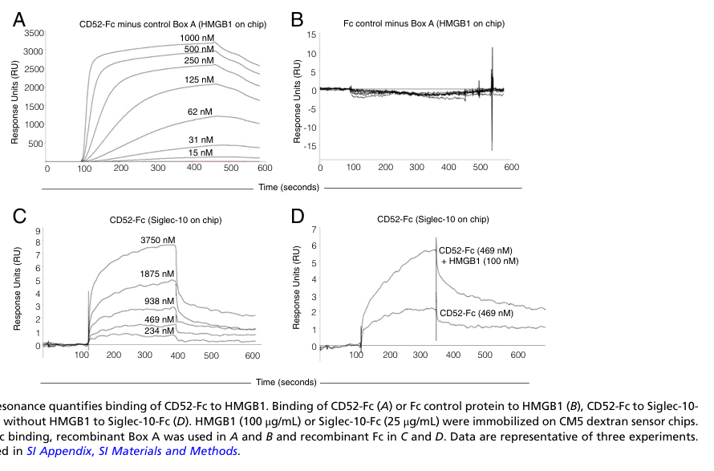

## Question

# Gene Research for Functional Annotation

## ⚠️ CRITICAL: Gene/Protein Identification Context

**BEFORE YOU BEGIN RESEARCH:** You MUST verify you are researching the CORRECT gene/protein. Gene symbols can be ambiguous, especially for less well-characterized genes from non-model organisms.

### Target Gene/Protein Identity (from UniProt):
- **UniProt Accession:** P31358
- **Protein Description:** RecName: Full=CAMPATH-1 antigen; AltName: Full=CDw52; AltName: Full=Cambridge pathology 1 antigen; AltName: Full=Epididymal secretory protein E5; AltName: Full=Human epididymis-specific protein 5; Short=He5; AltName: CD_antigen=CD52; Flags: Precursor;
- **Gene Information:** Name=CD52; Synonyms=CDW52, HE5;
- **Organism (full):** Homo sapiens (Human).
- **Protein Family:** Not specified in UniProt
- **Key Domains:** CAMPATH-1. (IPR026643); CD52 (PF15116)

### MANDATORY VERIFICATION STEPS:

1. **Check if the gene symbol "CD52" matches the protein description above**
2. **Verify the organism is correct:** Homo sapiens (Human).
3. **Check if protein family/domains align with what you find in literature**
4. **If you find literature for a DIFFERENT gene with the same or similar symbol, STOP**

### If Gene Symbol is Ambiguous or You Cannot Find Relevant Literature:

**DO NOT PROCEED WITH RESEARCH ON A DIFFERENT GENE.** Instead:
- State clearly: "The gene symbol 'CD52' is ambiguous or literature is limited for this specific protein"
- Explain what you found (e.g., "Found extensive literature on a different gene with the same symbol in a different organism")
- Describe the protein based ONLY on the UniProt information provided above
- Suggest that the protein function can be inferred from domain/family information

### Research Target:

Please provide a comprehensive research report on the gene **CD52** (gene ID: CD52, UniProt: P31358) in human.

The research report should be a detailed narrative explaining the function, biological processes, and localization of the gene product. Citations should be given for all claims.

You should prioritize authoritative reviews and primary scientific literature when conducting research. You can supplement
this with annotations you find in gene/protein databases, but these can be outdated or inaccurate.

We are specifically interested in the primary function of the gene - for enzymes, what reaction is catalyzed, and what is the substrate specificity? For transporters, what is the substrate? For structural proteins or adapters, what is the broader structural role? For signaling molecules, what is the role in the pathway.

We are interested in where in or outside the cell the gene product carries out its function.

We are also interested in the signaling or biochemical pathways in which the gene functions. We are less interested in broad pleiotropic effects, except where these elucidate the precise role.

Include evidence where possible. We are interested in both experimental evidence as well as inference from structure, evolution, or bioinformatic analysis. Precise studies should be prioritized over high-throughput, where available.

## Output

Question: You are an expert researcher providing comprehensive, well-cited information.

Provide detailed information focusing on:
1. Key concepts and definitions with current understanding
2. Recent developments and latest research (prioritize 2023-2024 sources)
3. Current applications and real-world implementations
4. Expert opinions and analysis from authoritative sources
5. Relevant statistics and data from recent studies

Format as a comprehensive research report with proper citations. Include URLs and publication dates where available.
Always prioritize recent, authoritative sources and provide specific citations for all major claims.

# Gene Research for Functional Annotation

## ⚠️ CRITICAL: Gene/Protein Identification Context

**BEFORE YOU BEGIN RESEARCH:** You MUST verify you are researching the CORRECT gene/protein. Gene symbols can be ambiguous, especially for less well-characterized genes from non-model organisms.

### Target Gene/Protein Identity (from UniProt):
- **UniProt Accession:** P31358
- **Protein Description:** RecName: Full=CAMPATH-1 antigen; AltName: Full=CDw52; AltName: Full=Cambridge pathology 1 antigen; AltName: Full=Epididymal secretory protein E5; AltName: Full=Human epididymis-specific protein 5; Short=He5; AltName: CD_antigen=CD52; Flags: Precursor;
- **Gene Information:** Name=CD52; Synonyms=CDW52, HE5;
- **Organism (full):** Homo sapiens (Human).
- **Protein Family:** Not specified in UniProt
- **Key Domains:** CAMPATH-1. (IPR026643); CD52 (PF15116)

### MANDATORY VERIFICATION STEPS:

1. **Check if the gene symbol "CD52" matches the protein description above**
2. **Verify the organism is correct:** Homo sapiens (Human).
3. **Check if protein family/domains align with what you find in literature**
4. **If you find literature for a DIFFERENT gene with the same or similar symbol, STOP**

### If Gene Symbol is Ambiguous or You Cannot Find Relevant Literature:

**DO NOT PROCEED WITH RESEARCH ON A DIFFERENT GENE.** Instead:
- State clearly: "The gene symbol 'CD52' is ambiguous or literature is limited for this specific protein"
- Explain what you found (e.g., "Found extensive literature on a different gene with the same symbol in a different organism")
- Describe the protein based ONLY on the UniProt information provided above
- Suggest that the protein function can be inferred from domain/family information

### Research Target:

Please provide a comprehensive research report on the gene **CD52** (gene ID: CD52, UniProt: P31358) in human.

The research report should be a detailed narrative explaining the function, biological processes, and localization of the gene product. Citations should be given for all claims.

You should prioritize authoritative reviews and primary scientific literature when conducting research. You can supplement
this with annotations you find in gene/protein databases, but these can be outdated or inaccurate.

We are specifically interested in the primary function of the gene - for enzymes, what reaction is catalyzed, and what is the substrate specificity? For transporters, what is the substrate? For structural proteins or adapters, what is the broader structural role? For signaling molecules, what is the role in the pathway.

We are interested in where in or outside the cell the gene product carries out its function.

We are also interested in the signaling or biochemical pathways in which the gene functions. We are less interested in broad pleiotropic effects, except where these elucidate the precise role.

Include evidence where possible. We are interested in both experimental evidence as well as inference from structure, evolution, or bioinformatic analysis. Precise studies should be prioritized over high-throughput, where available.

# Functional annotation of human CD52 (UniProt P31358)

## Identity and principal function

**Identity verified.** Human **CD52** is the CAMPATH-1 antigen, also called CDw52 and the epididymal protein HE5. Sequencing of a human sperm-surface antigen found an N terminus identical to leukocyte CD52; biochemical comparisons show that the male-genital-tract and lymphocyte products share a peptide backbone but carry different carbohydrate and lipid modifications. They should not be treated as different genes, nor confused with **CD24**, another glycosylated SIGLEC10 ligand. The supplied CAMPATH-1/CD52 domain annotations are consistent with this identity; CD52 is not established as an enzyme, transporter, or member of a conventional catalytic protein family. (focarelli1999asialoglycoproteingp20 pages 1-2, schroter1999malespecificmodificationof pages 1-1)

**Functional conclusion:** CD52 is a small, heavily glycosylated **extracellular membrane-surface glycopeptide**. Its clearest experimentally defined endogenous function is immune regulation: after release from activated T cells, appropriately glycosylated soluble CD52 engages an **HMGB1–SIGLEC10 inhibitory pathway** that restrains T-cell activation. A second, structurally distinct tissue context is the sperm glycocalyx, where CD52 is abundant but its indispensable physiological function in humans remains unproven. (bandalasanchez2018cd52glycanbinds pages 1-2, schroter1999malespecificmodificationof pages 1-1, yeung1997humanepididymalsecreted pages 3-4, yamaguchi2008cd52knownas pages 1-2)

## Molecular form, expression, and site of action

The mature human product has a **12-residue peptide backbone**, with an **N-linked glycan at Asn3** and a **glycosylphosphatidylinositol (GPI) anchor attached through C-terminal Ser12**. The GPI anchor places CD52 on the **outer face of the plasma membrane**, rather than providing a cytoplasmic signaling domain. Native seminal-plasma CD52 migrates as heterogeneous approximately **15–20-kDa** species despite its short peptide; PNGase F treatment reduces this apparent size to approximately **6 kDa**, illustrating the contribution of its N-glycan and anchor. Published text from the 1999 biochemical study prints inconsistent orders for the first four residues; the securely established annotation here is the peptide length and experimentally supported modification sites, rather than an unqualified transcription of that sequence. (schroter1999malespecificmodificationof pages 3-3, debono2025themolecularbasis pages 1-2, schroter1999malespecificmodificationof pages 1-1, xia1993structureofthe pages 4-5)

CD52 occurs on lymphocytes and several other immune-cell populations, including monocytes/macrophages, natural killer cells, and dendritic cells. **Activated T cells release a soluble form**, which acts in the extracellular environment and at the surface of SIGLEC10-bearing cells. In the reproductive tract, epididymal and deferent-duct epithelia produce CD52; it enters luminal secretions and is acquired by sperm **after** testicular development. Seminal-plasma/sperm CD52 differs from lymphocyte CD52 in its N-glycans and GPI-anchor composition: male-tract glycans include highly sialylated, sometimes polylactosamine-extended structures, and approximately **80%** of its analyzed anchors were inositol-acylated, predominantly with palmitate. These are **tissue-specific glycoforms**, not demonstrated genetically distinct CD52 isoforms. (kirchhoff2001newinsightsinto pages 5-5, schroter1999malespecificmodificationof pages 9-10, schroter1999malespecificmodificationof pages 1-1, bandalasanchez2018cd52glycanbinds pages 1-2)

## Defined immune-signaling pathway

Experiments with recombinant soluble **CD52–Fc** support a two-step mechanism. First, its glycan-dependent interaction sequesters the **pro-inflammatory Box B domain of extracellular HMGB1**; Box A does not substitute for Box B and can inhibit the interaction. Second, HMGB1 promotes engagement of CD52’s sialylated glycan with **SIGLEC10** on activated human T cells. SIGLEC10 becomes tyrosine-phosphorylated, associates with the T-cell receptor complex, and recruits the inhibitory phosphatase **SHP1**, thereby suppressing T-cell-receptor signaling and function. This identifies CD52 as a **ligand/scaffold for inhibitory signaling**, not as a receptor with intrinsic catalytic activity. (bandalasanchez2018cd52glycanbinds pages 6-6, bandalasanchez2018cd52glycanbinds pages 1-2, bandalasanchez2018cd52glycanbinds pages 2-3)

The mechanistic tests are unusually specific: suppression was lost under serum-free conditions; anti-HMGB1 antibody or HMGB1 Box A blocked activity; removing CD52–Fc sialic acids abolished relevant binding and suppression; and restoring **α2,3-linked sialic acid** restored suppression. Surface-plasmon-resonance experiments estimated dissociation constants of **130 nM for CD52–Fc binding HMGB1** and **565 nM for binding SIGLEC10–Fc** under their respective assay conditions. Those values characterize **recombinant fusion-protein assays**, not a measured affinity of native soluble CD52 in vivo. The retrieved cropped SPR figure provides the corresponding visual evidence. Effects on innate immune-cell inflammatory signaling have also been reported, but the HMGB1–SIGLEC10–SHP1 pathway in human T cells is the more precisely resolved annotation. (bandalasanchez2018cd52glycanbinds pages 5-6, bandalasanchez2018cd52glycanbinds pages 1-2, bandalasanchez2018cd52glycanbinds pages 2-3, bandalasanchez2018cd52glycanbinds media dcbbac41)

**Recent molecular refinement (published February 25, 2025).** High-resolution mass spectrometry localized **O-glycosylation to Thr8** in recombinant soluble CD52–Fc made in Expi293 cells. Average O-glycan occupancy was approximately **7.5%**; a doubly sialylated core-2 structure accounted for **55.5% of the O-glycome in the most active fraction**, itself only **0.75% of the total recombinant protein**. Molecular-dynamics modeling proposes that this Thr8 O-glycan contacts positively charged residues on HMGB1 Box B while the Asn3 N-glycan remains accessible to SIGLEC10. **The glycan localization is experimental; that atomistic binding arrangement is a model, not a solved structure or a demonstrated property of every native CD52 glycoform.** Earlier work on purified male-tract CD52 found its examined C-terminal serines essentially unoccupied, reinforcing the need not to generalize recombinant glycosylation across tissues. (debono2025themolecularbasis pages 6-7, schroter1999malespecificmodificationof pages 3-3, debono2025themolecularbasis pages 1-2)

## Human evidence in disease and reproduction

A **September 2024** human chronic-lymphocytic-leukemia (CLL) study found that CLL cells delay T-cell activation and impair CAR-T-cell function. CD40-stimulated CLL cells lost much of this suppressive effect in a **contact-dependent** experiment, accompanied by reduced CD24 and CD52 expression. Blocking **CD24 and/or CD52** improved activation and CAR-T target-cell killing; selected activation experiments used **6–9** samples and proximal phosphorylation experiments **four**. This supports participation of CLL-associated CD52 in a suppressive cell-contact setting, **but the investigators did not directly establish that CD52–SIGLEC10 binding caused the reduced TCR phosphorylation**, nor distinguish soluble from membrane-bound CD52 with a compartment-specific intervention. Combined CD24/CD52 antibody blockade and alemtuzumab exposure should not be read as CD52-specific genetic proof. (bruggen2024tcelldysfunctionin pages 1-2, bruggen2024tcelldysfunctionin pages 8-9, bruggen2024tcelldysfunctionin pages 10-11, bruggen2024tcelldysfunctionin pages 5-6)

On human ejaculated sperm, CD52 forms part of the external, negatively charged **glycocalyx**. In a 1997 study, **79.6 ± 2.8%** of viable sperm in normozoospermic samples stained with anti-CD52; across **109 semen samples**, staining correlated with motility (**r = 0.59** for viable sperm). Antibody exposure reduced measured motility by **9% after five minutes** and **21% after 3.5 hours**. A separate 1999 study found dose-dependent inhibition of sperm interaction with zona-free hamster eggs, but its anti-CD52 antibody also **agglutinated motile sperm**. Thus, these studies establish sperm-surface localization and an antibody-sensitive phenotype, **not** a specific indispensable role in gamete binding or fusion. For context only—not as evidence about the human gene—**mouse** Cd52-knockout males retained normal fertilization and litter-size outcomes in the cited experiments. (kirchhoff2001newinsightsinto pages 1-2, yeung1997humanepididymalsecreted pages 1-2, yeung1997humanepididymalsecreted pages 3-4, focarelli1999asialoglycoproteingp20 pages 2-3, yamaguchi2008cd52knownas pages 1-2)

## Applications, clinical evidence, and interpretation

**Alemtuzumab** is a humanized **anti-CD52 antibody** used to deplete CD52-bearing immune cells, with clinical applications including relapsing multiple sclerosis and hematologic disease. Its therapeutic depletion involves antibody-mediated effector mechanisms, including complement-dependent cytotoxicity and antibody-dependent cellular cytotoxicity; **these drug-induced effects should not be mistaken for CD52’s normal biochemical function**. In a **2024 meta-analysis of 37 studies** of alemtuzumab-treated multiple-sclerosis patients, pooled secondary autoimmune-event incidence was **28.24%** (95% CI **23.48–33.00%**) and pooled autoimmune thyroid-event incidence was **22.57%** (95% CI **18.10–27.03%**). Both estimates had substantial between-study heterogeneity (**I² = 94%**) and warrant cautious interpretation. (bielekova2010monoclonalantibodiesin pages 6-8, an2025alemtuzumabforhaematological pages 1-3, yang2024riskofsecondary pages 1-2)

Conversely, **editing CD52 out of donor CAR-T cells** is an investigational engineering strategy: it aims to spare infused cells while anti-CD52 conditioning depletes the recipient’s CD52-positive immune cells. This application exploits **surface-antigen expression and antibody susceptibility**, rather than demonstrating that absence of CD52 intrinsically improves T-cell signaling. Recombinant soluble CD52 with controlled glycosylation is being investigated as a possible anti-inflammatory agent; the 2025 finding that active glycoforms represent a small fraction of produced CD52–Fc highlights a manufacturing and mechanistic hurdle, not an established clinical therapy. (lonez2024allogeneiccarttherapy pages 7-8, lonez2024allogeneiccarttherapy pages 13-14, debono2025themolecularbasis pages 1-2)

The following evidence map separates experimentally observed properties from proposed functions and clinical consequences. (bandalasanchez2018cd52glycanbinds pages 6-6, bruggen2024tcelldysfunctionin pages 10-11, debono2025themolecularbasis pages 6-7, yang2024riskofsecondary pages 1-2)

| System | Direct evidence and quantitative measurements | Interpretation and critical limitation | Author/year/DOI |
|---|---|---|---|
| Surface architecture and localization | Biochemical analysis established a 12-residue mature peptide, an N-linked glycan at Asn3, and GPI attachment through C-terminal Ser12. Native male-genital-tract CD52 occurred as heterogeneous approximately 15–20-kDa species; PNGase F reduced these to approximately 6 kDa. Seminal and lymphocyte forms had different glycans and GPI anchors. (schroter1999malespecificmodificationof pages 1-1, schroter1999malespecificmodificationof pages 3-3, xia1993structureofthe pages 4-5) | **High-confidence structural evidence:** CD52 is a heavily glycosylated, extracellular GPI-anchored surface glycopeptide, not an enzyme or transmembrane receptor. Tissue forms share the peptide backbone but differ post-translationally; they are glycoforms, not proven genetically distinct isoforms. | Xia et al., 1993, *Biochemical Journal*. [DOI](https://doi.org/10.1042/bj2930633); Schröter et al., 1999, *JBC*. [DOI](https://doi.org/10.1074/jbc.274.42.29862) |
| Soluble-CD52 immune pathway | Activated human T cells release soluble CD52. CD52-Fc bound HMGB1 with estimated Kd of 130 nM and SIGLEC10-Fc with estimated Kd of 565 nM. HMGB1 Box B, but not Box A, promoted SIGLEC10 binding; neuraminidase abolished activity, whereas alpha-2,3-resialylation restored it. CD52-Fc induced SIGLEC10 phosphorylation, SHP1 recruitment, and association with the TCR complex. (bandalasanchez2018cd52glycanbinds pages 6-6, bandalasanchez2018cd52glycanbinds pages 5-6, bandalasanchez2018cd52glycanbinds pages 1-2, bandalasanchez2018cd52glycanbinds pages 2-3, bandalasanchez2018cd52glycanbinds pages 3-4, bandalasanchez2018cd52glycanbinds media dcbbac41) | **Strong mechanistic evidence:** soluble CD52 is a glycan-dependent immunoregulatory ligand that first sequesters pro-inflammatory HMGB1 Box B and then engages inhibitory SIGLEC10–ITIM–SHP1 signaling to suppress TCR function. Most experiments used recombinant CD52-Fc, whose glycosylation may not fully reproduce native soluble CD52. | Bandala-Sanchez et al., 2018, *PNAS*. [DOI](https://doi.org/10.1073/pnas.1722056115) |
| CLL–T-cell contact and blockade | CLL-cell suppression required direct contact and was reduced after CD40 stimulation. Combined CD24/CD52 antibody blockade increased T-cell activation, produced trends toward increased proximal CD3-zeta, ZAP70, and ERK phosphorylation, and improved CAR-T killing; activation studies used n = 6–9 and phosphorylation studies n = 4. Alemtuzumab also increased activation in CLL but not healthy samples. (bruggen2024tcelldysfunctionin pages 7-8, bruggen2024tcelldysfunctionin pages 1-2, bruggen2024tcelldysfunctionin pages 8-9, bruggen2024tcelldysfunctionin pages 10-11) | **Supportive but incomplete pathway evidence:** CLL-cell CD52, together with CD24, contributes to contact-dependent T-cell dysfunction. There was no CD52-specific genetic knockout, direct SIGLEC10 genetic proof, or experiment separating membrane-bound from soluble CD52; Fc or depletion effects of anti-CD52 antibodies remain potential confounders. | van Bruggen et al., 2024, *Blood Advances*. [DOI](https://doi.org/10.1182/bloodadvances.2023011934) |
| Human sperm surface | Across 109 semen samples, CD52 staining correlated with motility (r = 0.59 among viable sperm). In normozoospermic samples, 79.6 ± 2.8% of viable sperm stained positive. Anti-CD52 reduced motility by 9% at 5 minutes and 21% at 3.5 hours. CAMPATH-1 also dose-dependently inhibited zona-free hamster-egg penetration (P < 0.000005); 20% inhibition persisted at 1.2 micrograms/mL. (yeung1997humanepididymalsecreted pages 1-2, yeung1997humanepididymalsecreted pages 3-4, focarelli1999asialoglycoproteingp20 pages 2-3) | **Moderate human functional evidence:** epididymal CD52 is transferred to the sperm surface and contributes to the glycocalyx; abundance associates with motility. Antibody perturbation does not establish an essential physiological role because CAMPATH-1 also agglutinated sperm, potentially explaining impaired motility and egg interaction. | Yeung et al., 1997, *Molecular Human Reproduction*. [DOI](https://doi.org/10.1093/molehr/3.12.1045); Focarelli et al., 1999. [DOI](https://doi.org/10.1093/molehr/5.1.46) |
| Recombinant soluble-CD52 glycoforms | EThcD mass spectrometry localized O-glycosylation to Thr8 in Expi293-produced CD52-Fc. Mean O-glycan occupancy was approximately 7.5%; an extended, doubly alpha-2,3-sialylated core-2 glycan comprised 55.5% of the O-glycome in the most active fraction, which represented only 0.75% of total produced CD52-Fc. Molecular dynamics predicted O-glycan contacts with cationic HMGB1 Box-B residues while the N3 glycan remained exposed for SIGLEC10. (debono2025themolecularbasis pages 6-7, debono2025themolecularbasis pages 1-2) | **Direct glycoproteomics plus computational mechanism:** Thr8 O-glycosylation may help explain HMGB1 recognition, while the N3 glycan may mediate SIGLEC10 engagement. The atomistic binding arrangement is modeled, not an experimentally solved CD52–HMGB1–SIGLEC10 structure, and concerns recombinant material; native seminal CD52 was previously reported to have essentially unoccupied C-terminal serines. | DeBono et al., 2025, *JBC*; received November 18, 2024, published February 25, 2025. [DOI](https://doi.org/10.1016/j.jbc.2025.108350) |
| Clinical anti-CD52 risk | A meta-analysis of 37 studies found a pooled incidence of any secondary autoimmune event after alemtuzumab of 28.24% (95% CI 23.48–33.00; I-squared = 94%) and autoimmune thyroid events of 22.57% (95% CI 18.10–27.03; I-squared = 94%). Serious thyroid events occurred at 5.41% (95% CI 3.96–6.87; I-squared = 0%). (yang2024riskofsecondary pages 1-2, yang2024riskofsecondary pages 10-11) | **High-level clinical synthesis:** profound depletion of CD52-positive lymphocytes is effective but can be followed by clinically important secondary autoimmunity during immune reconstitution. Very high heterogeneity limits transfer of pooled estimates to an individual patient; these data quantify treatment consequences, not CD52’s endogenous physiological function. | Yang et al., 2024, *Frontiers in Immunology*. [DOI](https://doi.org/10.3389/fimmu.2024.1343971) |

*Table: Evidence hierarchy for functional annotation of human CD52 (UniProt P31358), spanning molecular architecture, immune signaling, sperm biology, recent glycoproteomics, and clinical targeting. Each row separates direct findings from interpretation and key limitations.*

### Principal source URLs and publication dates

- Bandala-Sanchez *et al.*, **July 2018**, *PNAS*, CD52–HMGB1–SIGLEC10 mechanism: https://doi.org/10.1073/pnas.1722056115. (bandalasanchez2018cd52glycanbinds pages 1-2)
- van Bruggen *et al.*, **September 2024**, *Blood Advances*, CLL-cell CD24/CD52 blockade: https://doi.org/10.1182/bloodadvances.2023011934. (bruggen2024tcelldysfunctionin pages 3-4, bruggen2024tcelldysfunctionin pages 10-11)
- DeBono *et al.*, **February 2025**, *Journal of Biological Chemistry*, CD52 glycoproteomics and modeling: https://doi.org/10.1016/j.jbc.2025.108350. (debono2025themolecularbasis pages 1-2)
- Schröter *et al.*, **October 1999**, *Journal of Biological Chemistry*, native male-tract CD52 structure: https://doi.org/10.1074/jbc.274.42.29862. (schroter1999malespecificmodificationof pages 1-1, schroter1999malespecificmodificationof pages 3-3)
- Yeung *et al.*, **December 1997**, *Molecular Human Reproduction*, human sperm CD52: https://doi.org/10.1093/molehr/3.12.1045. (yeung1997humanepididymalsecreted pages 3-4)
- Yang *et al.*, **April 2024**, *Frontiers in Immunology*, alemtuzumab safety meta-analysis: https://doi.org/10.3389/fimmu.2024.1343971. (yang2024riskofsecondary pages 1-2)

References

1. (focarelli1999asialoglycoproteingp20 pages 1-2): R. Focarelli, Sandro Francavilla, F. Francavilla, C. della Giovampaola, Anna Santucci, and Floriana Rosati. A sialoglycoprotein, gp20, of the human capacitated sperm surface is a homologue of the leukocyte cd52 antigen: analysis of the effect of anti-cd52 monoclonal antibody (campath-1) on capacitated spermatozoa. Molecular Human Reproduction, 5(1):46-51, Jan 1999. URL: https://doi.org/10.1093/molehr/5.1.46, doi:10.1093/molehr/5.1.46. This article has 30 citations and is from a peer-reviewed journal.

2. (schroter1999malespecificmodificationof pages 1-1): Sabine Schröter, Petra Derr, Harald S. Conradt, Manfred Nimtz, Geoffrey Hale, and Christiane Kirchhoff. Male-specific modification of human cd52*. The Journal of Biological Chemistry, 274:29862-29873, Oct 1999. URL: https://doi.org/10.1074/jbc.274.42.29862, doi:10.1074/jbc.274.42.29862. This article has 150 citations.

3. (bandalasanchez2018cd52glycanbinds pages 1-2): Esther Bandala-Sanchez, Naiara G. Bediaga, Ethan D. Goddard-Borger, Katrina Ngui, Gaetano Naselli, Natalie L. Stone, Alana M. Neale, Lesley A. Pearce, Ahmad Wardak, Peter Czabotar, Thomas Haselhorst, Andrea Maggioni, Lauren A. Hartley-Tassell, Timothy E. Adams, and Leonard C. Harrison. Cd52 glycan binds the proinflammatory b box of hmgb1 to engage the siglec-10 receptor and suppress human t cell function. Proceedings of the National Academy of Sciences of the United States of America, 115:7783-7788, Jul 2018. URL: https://doi.org/10.1073/pnas.1722056115, doi:10.1073/pnas.1722056115. This article has 110 citations and is from a highest quality peer-reviewed journal.

4. (yeung1997humanepididymalsecreted pages 3-4): C. Yeung, T. Cooper, and E. Nieschlag. Human epididymal secreted protein cd52 on ejaculated spermatozoa: correlations with semen characteristics and the effect of its antibody. Molecular human reproduction, 3 12:1045-51, Dec 1997. URL: https://doi.org/10.1093/molehr/3.12.1045, doi:10.1093/molehr/3.12.1045. This article has 51 citations and is from a peer-reviewed journal.

5. (yamaguchi2008cd52knownas pages 1-2): Ryo Yamaguchi, Kazuo Yamagata, Hidetoshi Hasuwa, Emiko Inano, Masahito Ikawa, and Masaru Okabe. Cd52, known as a major maturation‐associated sperm membrane antigen secreted from the epididymis, is not required for fertilization in the mouse. Genes to Cells, 13:851-861, Aug 2008. URL: https://doi.org/10.1111/j.1365-2443.2008.01210.x, doi:10.1111/j.1365-2443.2008.01210.x. This article has 39 citations and is from a peer-reviewed journal.

6. (schroter1999malespecificmodificationof pages 3-3): Sabine Schröter, Petra Derr, Harald S. Conradt, Manfred Nimtz, Geoffrey Hale, and Christiane Kirchhoff. Male-specific modification of human cd52*. The Journal of Biological Chemistry, 274:29862-29873, Oct 1999. URL: https://doi.org/10.1074/jbc.274.42.29862, doi:10.1074/jbc.274.42.29862. This article has 150 citations.

7. (debono2025themolecularbasis pages 1-2): Nicholas J. DeBono, Silvia D’Andrea, Esther Bandala-Sanchez, Ethan Goddard-Borger, Muhammad A. Zenaidee, Edward S.X. Moh, Elisa Fadda, Leonard C. Harrison, and Nicolle H. Packer. The molecular basis of immunosuppression by soluble cd52 is defined by interactions of n-linked and o-linked glycans with hmgb1 box b. Journal of Biological Chemistry, pages 108350, Feb 2025. URL: https://doi.org/10.1016/j.jbc.2025.108350, doi:10.1016/j.jbc.2025.108350. This article has 6 citations and is from a domain leading peer-reviewed journal.

8. (xia1993structureofthe pages 4-5): M Q Xia, G Hale, M R Lifely, M A J Ferguson, D Campbell, L Packman, and H Waldmann. Structure of the campath-1 antigen, a glycosylphosphatidylinositol-anchored glycoprotein which is an exceptionally good target for complement lysis. The Biochemical journal, 293 ( Pt 3):633-40, Aug 1993. URL: https://doi.org/10.1042/bj2930633, doi:10.1042/bj2930633. This article has 155 citations.

9. (kirchhoff2001newinsightsinto pages 5-5): Christiane Kirchhoff and Sabine Schröter. New insights into the origin, structure and role of cd52: a major component of the mammalian sperm glycocalyx. Cells Tissues Organs, 168:93-104, Nov 2001. URL: https://doi.org/10.1159/000016810, doi:10.1159/000016810. This article has 91 citations and is from a peer-reviewed journal.

10. (schroter1999malespecificmodificationof pages 9-10): Sabine Schröter, Petra Derr, Harald S. Conradt, Manfred Nimtz, Geoffrey Hale, and Christiane Kirchhoff. Male-specific modification of human cd52*. The Journal of Biological Chemistry, 274:29862-29873, Oct 1999. URL: https://doi.org/10.1074/jbc.274.42.29862, doi:10.1074/jbc.274.42.29862. This article has 150 citations.

11. (bandalasanchez2018cd52glycanbinds pages 6-6): Esther Bandala-Sanchez, Naiara G. Bediaga, Ethan D. Goddard-Borger, Katrina Ngui, Gaetano Naselli, Natalie L. Stone, Alana M. Neale, Lesley A. Pearce, Ahmad Wardak, Peter Czabotar, Thomas Haselhorst, Andrea Maggioni, Lauren A. Hartley-Tassell, Timothy E. Adams, and Leonard C. Harrison. Cd52 glycan binds the proinflammatory b box of hmgb1 to engage the siglec-10 receptor and suppress human t cell function. Proceedings of the National Academy of Sciences of the United States of America, 115:7783-7788, Jul 2018. URL: https://doi.org/10.1073/pnas.1722056115, doi:10.1073/pnas.1722056115. This article has 110 citations and is from a highest quality peer-reviewed journal.

12. (bandalasanchez2018cd52glycanbinds pages 2-3): Esther Bandala-Sanchez, Naiara G. Bediaga, Ethan D. Goddard-Borger, Katrina Ngui, Gaetano Naselli, Natalie L. Stone, Alana M. Neale, Lesley A. Pearce, Ahmad Wardak, Peter Czabotar, Thomas Haselhorst, Andrea Maggioni, Lauren A. Hartley-Tassell, Timothy E. Adams, and Leonard C. Harrison. Cd52 glycan binds the proinflammatory b box of hmgb1 to engage the siglec-10 receptor and suppress human t cell function. Proceedings of the National Academy of Sciences of the United States of America, 115:7783-7788, Jul 2018. URL: https://doi.org/10.1073/pnas.1722056115, doi:10.1073/pnas.1722056115. This article has 110 citations and is from a highest quality peer-reviewed journal.

13. (bandalasanchez2018cd52glycanbinds pages 5-6): Esther Bandala-Sanchez, Naiara G. Bediaga, Ethan D. Goddard-Borger, Katrina Ngui, Gaetano Naselli, Natalie L. Stone, Alana M. Neale, Lesley A. Pearce, Ahmad Wardak, Peter Czabotar, Thomas Haselhorst, Andrea Maggioni, Lauren A. Hartley-Tassell, Timothy E. Adams, and Leonard C. Harrison. Cd52 glycan binds the proinflammatory b box of hmgb1 to engage the siglec-10 receptor and suppress human t cell function. Proceedings of the National Academy of Sciences of the United States of America, 115:7783-7788, Jul 2018. URL: https://doi.org/10.1073/pnas.1722056115, doi:10.1073/pnas.1722056115. This article has 110 citations and is from a highest quality peer-reviewed journal.

14. (bandalasanchez2018cd52glycanbinds media dcbbac41): Esther Bandala-Sanchez, Naiara G. Bediaga, Ethan D. Goddard-Borger, Katrina Ngui, Gaetano Naselli, Natalie L. Stone, Alana M. Neale, Lesley A. Pearce, Ahmad Wardak, Peter Czabotar, Thomas Haselhorst, Andrea Maggioni, Lauren A. Hartley-Tassell, Timothy E. Adams, and Leonard C. Harrison. Cd52 glycan binds the proinflammatory b box of hmgb1 to engage the siglec-10 receptor and suppress human t cell function. Proceedings of the National Academy of Sciences of the United States of America, 115:7783-7788, Jul 2018. URL: https://doi.org/10.1073/pnas.1722056115, doi:10.1073/pnas.1722056115. This article has 110 citations and is from a highest quality peer-reviewed journal.

15. (debono2025themolecularbasis pages 6-7): Nicholas J. DeBono, Silvia D’Andrea, Esther Bandala-Sanchez, Ethan Goddard-Borger, Muhammad A. Zenaidee, Edward S.X. Moh, Elisa Fadda, Leonard C. Harrison, and Nicolle H. Packer. The molecular basis of immunosuppression by soluble cd52 is defined by interactions of n-linked and o-linked glycans with hmgb1 box b. Journal of Biological Chemistry, pages 108350, Feb 2025. URL: https://doi.org/10.1016/j.jbc.2025.108350, doi:10.1016/j.jbc.2025.108350. This article has 6 citations and is from a domain leading peer-reviewed journal.

16. (bruggen2024tcelldysfunctionin pages 1-2): Jaco A. C. van Bruggen, Fleur S. Peters, Morris Mes, Joanne M. Rietveld, Elisa Cerretani, Gaspard Cretenet, Roel van Kampen, Aldo Jongejan, Perry D. Moerland, J. Joseph Melenhorst, Gerritje J. W. van der Windt, Eric Eldering, and Arnon P. Kater. T-cell dysfunction in cll is mediated through expression of siglec-10 ligands cd24 and cd52 on cll cells. Aug 2024. URL: https://doi.org/10.1182/bloodadvances.2023011934, doi:10.1182/bloodadvances.2023011934. This article has 25 citations and is from a peer-reviewed journal.

17. (bruggen2024tcelldysfunctionin pages 8-9): Jaco A. C. van Bruggen, Fleur S. Peters, Morris Mes, Joanne M. Rietveld, Elisa Cerretani, Gaspard Cretenet, Roel van Kampen, Aldo Jongejan, Perry D. Moerland, J. Joseph Melenhorst, Gerritje J. W. van der Windt, Eric Eldering, and Arnon P. Kater. T-cell dysfunction in cll is mediated through expression of siglec-10 ligands cd24 and cd52 on cll cells. Aug 2024. URL: https://doi.org/10.1182/bloodadvances.2023011934, doi:10.1182/bloodadvances.2023011934. This article has 25 citations and is from a peer-reviewed journal.

18. (bruggen2024tcelldysfunctionin pages 10-11): Jaco A. C. van Bruggen, Fleur S. Peters, Morris Mes, Joanne M. Rietveld, Elisa Cerretani, Gaspard Cretenet, Roel van Kampen, Aldo Jongejan, Perry D. Moerland, J. Joseph Melenhorst, Gerritje J. W. van der Windt, Eric Eldering, and Arnon P. Kater. T-cell dysfunction in cll is mediated through expression of siglec-10 ligands cd24 and cd52 on cll cells. Aug 2024. URL: https://doi.org/10.1182/bloodadvances.2023011934, doi:10.1182/bloodadvances.2023011934. This article has 25 citations and is from a peer-reviewed journal.

19. (bruggen2024tcelldysfunctionin pages 5-6): Jaco A. C. van Bruggen, Fleur S. Peters, Morris Mes, Joanne M. Rietveld, Elisa Cerretani, Gaspard Cretenet, Roel van Kampen, Aldo Jongejan, Perry D. Moerland, J. Joseph Melenhorst, Gerritje J. W. van der Windt, Eric Eldering, and Arnon P. Kater. T-cell dysfunction in cll is mediated through expression of siglec-10 ligands cd24 and cd52 on cll cells. Aug 2024. URL: https://doi.org/10.1182/bloodadvances.2023011934, doi:10.1182/bloodadvances.2023011934. This article has 25 citations and is from a peer-reviewed journal.

20. (kirchhoff2001newinsightsinto pages 1-2): Christiane Kirchhoff and Sabine Schröter. New insights into the origin, structure and role of cd52: a major component of the mammalian sperm glycocalyx. Cells Tissues Organs, 168:93-104, Nov 2001. URL: https://doi.org/10.1159/000016810, doi:10.1159/000016810. This article has 91 citations and is from a peer-reviewed journal.

21. (yeung1997humanepididymalsecreted pages 1-2): C. Yeung, T. Cooper, and E. Nieschlag. Human epididymal secreted protein cd52 on ejaculated spermatozoa: correlations with semen characteristics and the effect of its antibody. Molecular human reproduction, 3 12:1045-51, Dec 1997. URL: https://doi.org/10.1093/molehr/3.12.1045, doi:10.1093/molehr/3.12.1045. This article has 51 citations and is from a peer-reviewed journal.

22. (focarelli1999asialoglycoproteingp20 pages 2-3): R. Focarelli, Sandro Francavilla, F. Francavilla, C. della Giovampaola, Anna Santucci, and Floriana Rosati. A sialoglycoprotein, gp20, of the human capacitated sperm surface is a homologue of the leukocyte cd52 antigen: analysis of the effect of anti-cd52 monoclonal antibody (campath-1) on capacitated spermatozoa. Molecular Human Reproduction, 5(1):46-51, Jan 1999. URL: https://doi.org/10.1093/molehr/5.1.46, doi:10.1093/molehr/5.1.46. This article has 30 citations and is from a peer-reviewed journal.

23. (bielekova2010monoclonalantibodiesin pages 6-8): Bibiana Bielekova and Brenda L. Becker. Monoclonal antibodies in ms. Neurology, 74:S31-S40, Jan 2010. URL: https://doi.org/10.1212/wnl.0b013e3181c97ed3, doi:10.1212/wnl.0b013e3181c97ed3. This article has 146 citations and is from a highest quality peer-reviewed journal.

24. (an2025alemtuzumabforhaematological pages 1-3): Ning An, Kangqi Bian, and Chunrui Li. Alemtuzumab for haematological malignancies. Annals of Hematology, 104:2593-2603, Apr 2025. URL: https://doi.org/10.1007/s00277-025-06344-8, doi:10.1007/s00277-025-06344-8. This article has 13 citations and is from a peer-reviewed journal.

25. (yang2024riskofsecondary pages 1-2): Jianguo Yang, Yuying Sun, Xinpeng Zhou, Di Zhang, Ziqi Xu, Jiaojiao Cao, and Bing Fan. Risk of secondary autoimmune diseases with alemtuzumab treatment for multiple sclerosis: a systematic review and meta-analysis. Apr 2024. URL: https://doi.org/10.3389/fimmu.2024.1343971, doi:10.3389/fimmu.2024.1343971. This article has 9 citations and is from a peer-reviewed journal.

26. (lonez2024allogeneiccarttherapy pages 7-8): Caroline Lonez and Eytan Breman. Allogeneic car-t therapy technologies: has the promise been met? Cells, Jan 2024. URL: https://doi.org/10.3390/cells13020146, doi:10.3390/cells13020146. This article has 129 citations.

27. (lonez2024allogeneiccarttherapy pages 13-14): Caroline Lonez and Eytan Breman. Allogeneic car-t therapy technologies: has the promise been met? Cells, Jan 2024. URL: https://doi.org/10.3390/cells13020146, doi:10.3390/cells13020146. This article has 129 citations.

28. (bandalasanchez2018cd52glycanbinds pages 3-4): Esther Bandala-Sanchez, Naiara G. Bediaga, Ethan D. Goddard-Borger, Katrina Ngui, Gaetano Naselli, Natalie L. Stone, Alana M. Neale, Lesley A. Pearce, Ahmad Wardak, Peter Czabotar, Thomas Haselhorst, Andrea Maggioni, Lauren A. Hartley-Tassell, Timothy E. Adams, and Leonard C. Harrison. Cd52 glycan binds the proinflammatory b box of hmgb1 to engage the siglec-10 receptor and suppress human t cell function. Proceedings of the National Academy of Sciences of the United States of America, 115:7783-7788, Jul 2018. URL: https://doi.org/10.1073/pnas.1722056115, doi:10.1073/pnas.1722056115. This article has 110 citations and is from a highest quality peer-reviewed journal.

29. (bruggen2024tcelldysfunctionin pages 7-8): Jaco A. C. van Bruggen, Fleur S. Peters, Morris Mes, Joanne M. Rietveld, Elisa Cerretani, Gaspard Cretenet, Roel van Kampen, Aldo Jongejan, Perry D. Moerland, J. Joseph Melenhorst, Gerritje J. W. van der Windt, Eric Eldering, and Arnon P. Kater. T-cell dysfunction in cll is mediated through expression of siglec-10 ligands cd24 and cd52 on cll cells. Aug 2024. URL: https://doi.org/10.1182/bloodadvances.2023011934, doi:10.1182/bloodadvances.2023011934. This article has 25 citations and is from a peer-reviewed journal.

30. (yang2024riskofsecondary pages 10-11): Jianguo Yang, Yuying Sun, Xinpeng Zhou, Di Zhang, Ziqi Xu, Jiaojiao Cao, and Bing Fan. Risk of secondary autoimmune diseases with alemtuzumab treatment for multiple sclerosis: a systematic review and meta-analysis. Apr 2024. URL: https://doi.org/10.3389/fimmu.2024.1343971, doi:10.3389/fimmu.2024.1343971. This article has 9 citations and is from a peer-reviewed journal.

31. (bruggen2024tcelldysfunctionin pages 3-4): Jaco A. C. van Bruggen, Fleur S. Peters, Morris Mes, Joanne M. Rietveld, Elisa Cerretani, Gaspard Cretenet, Roel van Kampen, Aldo Jongejan, Perry D. Moerland, J. Joseph Melenhorst, Gerritje J. W. van der Windt, Eric Eldering, and Arnon P. Kater. T-cell dysfunction in cll is mediated through expression of siglec-10 ligands cd24 and cd52 on cll cells. Aug 2024. URL: https://doi.org/10.1182/bloodadvances.2023011934, doi:10.1182/bloodadvances.2023011934. This article has 25 citations and is from a peer-reviewed journal.

## Artifacts

- [Edison artifact artifact-00](CD52-deep-research-falcon_artifacts/artifact-00.md)

## Citations

1. debono2025themolecularbasis pages 1-2
2. yeung1997humanepididymalsecreted pages 3-4
3. yang2024riskofsecondary pages 1-2
4. schroter1999malespecificmodificationof pages 1-1
5. schroter1999malespecificmodificationof pages 3-3
6. xia1993structureofthe pages 4-5
7. kirchhoff2001newinsightsinto pages 5-5
8. schroter1999malespecificmodificationof pages 9-10
9. debono2025themolecularbasis pages 6-7
10. bruggen2024tcelldysfunctionin pages 1-2
11. bruggen2024tcelldysfunctionin pages 8-9
12. bruggen2024tcelldysfunctionin pages 10-11
13. bruggen2024tcelldysfunctionin pages 5-6
14. kirchhoff2001newinsightsinto pages 1-2
15. yeung1997humanepididymalsecreted pages 1-2
16. bielekova2010monoclonalantibodiesin pages 6-8
17. an2025alemtuzumabforhaematological pages 1-3
18. lonez2024allogeneiccarttherapy pages 7-8
19. lonez2024allogeneiccarttherapy pages 13-14
20. bruggen2024tcelldysfunctionin pages 7-8
21. yang2024riskofsecondary pages 10-11
22. bruggen2024tcelldysfunctionin pages 3-4
23. DOI
24. https://doi.org/10.1042/bj2930633
25. https://doi.org/10.1074/jbc.274.42.29862
26. https://doi.org/10.1073/pnas.1722056115
27. https://doi.org/10.1182/bloodadvances.2023011934
28. https://doi.org/10.1093/molehr/3.12.1045
29. https://doi.org/10.1093/molehr/5.1.46
30. https://doi.org/10.1016/j.jbc.2025.108350
31. https://doi.org/10.3389/fimmu.2024.1343971
32. https://doi.org/10.1073/pnas.1722056115.
33. https://doi.org/10.1182/bloodadvances.2023011934.
34. https://doi.org/10.1016/j.jbc.2025.108350.
35. https://doi.org/10.1074/jbc.274.42.29862.
36. https://doi.org/10.1093/molehr/3.12.1045.
37. https://doi.org/10.3389/fimmu.2024.1343971.
38. https://doi.org/10.1093/molehr/5.1.46,
39. https://doi.org/10.1074/jbc.274.42.29862,
40. https://doi.org/10.1073/pnas.1722056115,
41. https://doi.org/10.1093/molehr/3.12.1045,
42. https://doi.org/10.1111/j.1365-2443.2008.01210.x,
43. https://doi.org/10.1016/j.jbc.2025.108350,
44. https://doi.org/10.1042/bj2930633,
45. https://doi.org/10.1159/000016810,
46. https://doi.org/10.1182/bloodadvances.2023011934,
47. https://doi.org/10.1212/wnl.0b013e3181c97ed3,
48. https://doi.org/10.1007/s00277-025-06344-8,
49. https://doi.org/10.3389/fimmu.2024.1343971,
50. https://doi.org/10.3390/cells13020146,