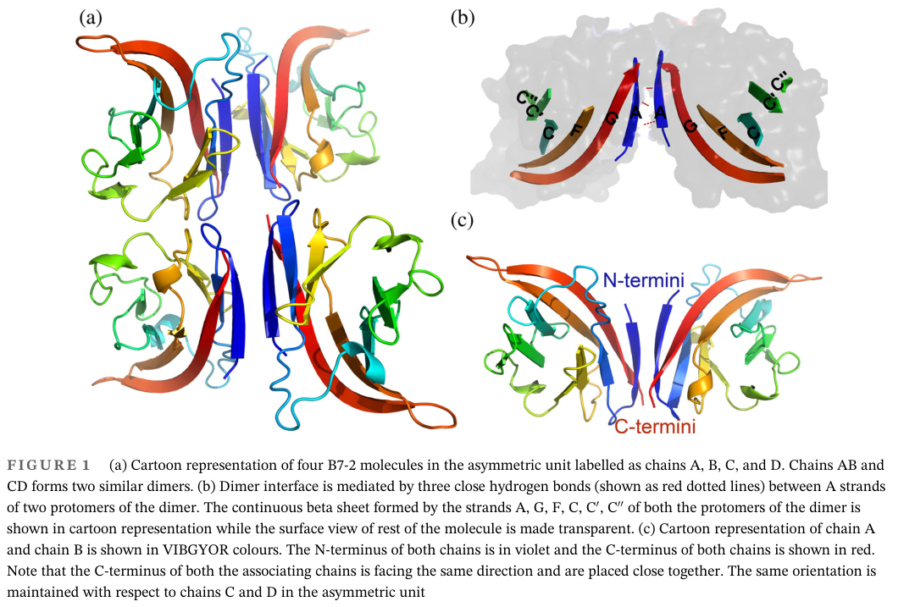

## Question

# Gene Research for Functional Annotation

## ⚠️ CRITICAL: Gene/Protein Identification Context

**BEFORE YOU BEGIN RESEARCH:** You MUST verify you are researching the CORRECT gene/protein. Gene symbols can be ambiguous, especially for less well-characterized genes from non-model organisms.

### Target Gene/Protein Identity (from UniProt):
- **UniProt Accession:** P42081
- **Protein Description:** RecName: Full=T-lymphocyte activation antigen CD86; AltName: Full=Activation B7-2 antigen; AltName: Full=B70; AltName: Full=BU63; AltName: Full=CTLA-4 counter-receptor B7.2; AltName: Full=FUN-1; AltName: CD_antigen=CD86; Flags: Precursor;
- **Gene Information:** Name=CD86; Synonyms=CD28LG2;
- **Organism (full):** Homo sapiens (Human).
- **Protein Family:** Not specified in UniProt
- **Key Domains:** CD86_IgV. (IPR037677); Ig-like_dom. (IPR007110); Ig-like_dom_sf. (IPR036179); Ig-like_fold. (IPR013783); Ig_sub. (IPR003599)

### MANDATORY VERIFICATION STEPS:

1. **Check if the gene symbol "CD86" matches the protein description above**
2. **Verify the organism is correct:** Homo sapiens (Human).
3. **Check if protein family/domains align with what you find in literature**
4. **If you find literature for a DIFFERENT gene with the same or similar symbol, STOP**

### If Gene Symbol is Ambiguous or You Cannot Find Relevant Literature:

**DO NOT PROCEED WITH RESEARCH ON A DIFFERENT GENE.** Instead:
- State clearly: "The gene symbol 'CD86' is ambiguous or literature is limited for this specific protein"
- Explain what you found (e.g., "Found extensive literature on a different gene with the same symbol in a different organism")
- Describe the protein based ONLY on the UniProt information provided above
- Suggest that the protein function can be inferred from domain/family information

### Research Target:

Please provide a comprehensive research report on the gene **CD86** (gene ID: CD86, UniProt: P42081) in human.

The research report should be a detailed narrative explaining the function, biological processes, and localization of the gene product. Citations should be given for all claims.

You should prioritize authoritative reviews and primary scientific literature when conducting research. You can supplement
this with annotations you find in gene/protein databases, but these can be outdated or inaccurate.

We are specifically interested in the primary function of the gene - for enzymes, what reaction is catalyzed, and what is the substrate specificity? For transporters, what is the substrate? For structural proteins or adapters, what is the broader structural role? For signaling molecules, what is the role in the pathway.

We are interested in where in or outside the cell the gene product carries out its function.

We are also interested in the signaling or biochemical pathways in which the gene functions. We are less interested in broad pleiotropic effects, except where these elucidate the precise role.

Include evidence where possible. We are interested in both experimental evidence as well as inference from structure, evolution, or bioinformatic analysis. Precise studies should be prioritized over high-throughput, where available.

## Output

Question: You are an expert researcher providing comprehensive, well-cited information.

Provide detailed information focusing on:
1. Key concepts and definitions with current understanding
2. Recent developments and latest research (prioritize 2023-2024 sources)
3. Current applications and real-world implementations
4. Expert opinions and analysis from authoritative sources
5. Relevant statistics and data from recent studies

Format as a comprehensive research report with proper citations. Include URLs and publication dates where available.
Always prioritize recent, authoritative sources and provide specific citations for all major claims.

# Gene Research for Functional Annotation

## ⚠️ CRITICAL: Gene/Protein Identification Context

**BEFORE YOU BEGIN RESEARCH:** You MUST verify you are researching the CORRECT gene/protein. Gene symbols can be ambiguous, especially for less well-characterized genes from non-model organisms.

### Target Gene/Protein Identity (from UniProt):
- **UniProt Accession:** P42081
- **Protein Description:** RecName: Full=T-lymphocyte activation antigen CD86; AltName: Full=Activation B7-2 antigen; AltName: Full=B70; AltName: Full=BU63; AltName: Full=CTLA-4 counter-receptor B7.2; AltName: Full=FUN-1; AltName: CD_antigen=CD86; Flags: Precursor;
- **Gene Information:** Name=CD86; Synonyms=CD28LG2;
- **Organism (full):** Homo sapiens (Human).
- **Protein Family:** Not specified in UniProt
- **Key Domains:** CD86_IgV. (IPR037677); Ig-like_dom. (IPR007110); Ig-like_dom_sf. (IPR036179); Ig-like_fold. (IPR013783); Ig_sub. (IPR003599)

### MANDATORY VERIFICATION STEPS:

1. **Check if the gene symbol "CD86" matches the protein description above**
2. **Verify the organism is correct:** Homo sapiens (Human).
3. **Check if protein family/domains align with what you find in literature**
4. **If you find literature for a DIFFERENT gene with the same or similar symbol, STOP**

### If Gene Symbol is Ambiguous or You Cannot Find Relevant Literature:

**DO NOT PROCEED WITH RESEARCH ON A DIFFERENT GENE.** Instead:
- State clearly: "The gene symbol 'CD86' is ambiguous or literature is limited for this specific protein"
- Explain what you found (e.g., "Found extensive literature on a different gene with the same symbol in a different organism")
- Describe the protein based ONLY on the UniProt information provided above
- Suggest that the protein function can be inferred from domain/family information

### Research Target:

Please provide a comprehensive research report on the gene **CD86** (gene ID: CD86, UniProt: P42081) in human.

The research report should be a detailed narrative explaining the function, biological processes, and localization of the gene product. Citations should be given for all claims.

You should prioritize authoritative reviews and primary scientific literature when conducting research. You can supplement
this with annotations you find in gene/protein databases, but these can be outdated or inaccurate.

We are specifically interested in the primary function of the gene - for enzymes, what reaction is catalyzed, and what is the substrate specificity? For transporters, what is the substrate? For structural proteins or adapters, what is the broader structural role? For signaling molecules, what is the role in the pathway.

We are interested in where in or outside the cell the gene product carries out its function.

We are also interested in the signaling or biochemical pathways in which the gene functions. We are less interested in broad pleiotropic effects, except where these elucidate the precise role.

Include evidence where possible. We are interested in both experimental evidence as well as inference from structure, evolution, or bioinformatic analysis. Precise studies should be prioritized over high-throughput, where available.

# Human CD86 (B7-2): functional annotation and research report

**Identity verified.** The target is human **CD86**, also called **B7-2, B70** and **CD28LG2** (UniProt **P42081**), not the related ligand CD80/B7-1. An early human-cell study established that antibodies recognizing CD86 also recognized B70/B7-2 expressed by transfected cells. A later structural study explicitly used the human CD86 sequence assigned to P42081. Its extracellular immunoglobulin-like architecture matches the specified IgV-domain annotation. [UniProt record](https://www.uniprot.org/uniprotkb/P42081/entry); Caux *et al.*, *Journal of Experimental Medicine*, November 1994, [DOI: 10.1084/jem.180.5.1841](https://doi.org/10.1084/jem.180.5.1841); Lankipalli *et al.*, *Protein Science*, 2021, [DOI: 10.1002/pro.4151](https://doi.org/10.1002/pro.4151). (caux1994b70b72isidentical pages 1-2, lankipalli2021crypticassociationof pages 4-5)

## Primary molecular function and site of action

CD86 is a **cell-surface, single-pass type-I membrane glycoprotein and intercellular signaling ligand**, not an enzyme, transporter or peptide-presenting MHC molecule. Its membrane-distal extracellular **IgV-like domain** mediates recognition of the T-cell receptors **CD28** and **CTLA-4 (CD152)**; a membrane-proximal **IgC-like domain** separates that binding region from the plasma membrane. A transmembrane segment anchors CD86, and a cytoplasmic tail lies inside the expressing cell. Thus, its principal physiological activity occurs **outside the cell at the antigen-presenting-cell (APC)–T-cell contact**, particularly the immunological synapse. Crystal analysis of the human IgV domain reached **1.90 Å resolution** (PDB **5YXK**), supporting the domain assignment; proposed zipper-like higher-order assemblies are less securely established as a native human-cell mechanism than the receptor-binding function itself. Lankipalli *et al.*, 2021, [DOI: 10.1002/pro.4151](https://doi.org/10.1002/pro.4151). (lankipalli2021crypticassociationof pages 2-4, lankipalli2021crypticassociationof pages 1-2, lankipalli2021crypticassociationof pages 4-5)

**CD28 engagement provides the activating “second signal.”** When a T-cell receptor recognizes peptide–MHC on an APC, APC-displayed CD86 can bind T-cell CD28 and reinforce T-cell activation, including IL-2 production and proliferation. The relevant intracellular activation pathways—among them PI3K–AKT and transcriptional responses—are principally **downstream of CD28 in the T cell**; they should not be annotated as catalytic reactions performed by CD86. Human dendritic/Langerhans-cell experiments directly support this ligand function: anti-CD86 reduced the alloreactive T-cell response by **70%** in that assay, combined anti-CD80/anti-CD86 blockade reduced it by **more than 90%**, and anti-CD28 inhibited the response in **9 of 11** tests. These are results of a specific *in-vitro alloreaction*, not population-wide effect estimates. Caux *et al.*, 1994, [DOI: 10.1084/jem.180.5.1841](https://doi.org/10.1084/jem.180.5.1841); Lotze *et al.*, *Nature Reviews Immunology*, 2024, [DOI: 10.1038/s41577-024-01061-1](https://doi.org/10.1038/s41577-024-01061-1). (caux1994b70b72isidentical pages 1-2, lotze2024cd28costimulationnovel pages 1-3)

**CTLA-4 engagement makes the same surface ligand available to a counter-regulatory pathway.** CTLA-4 competes with CD28 for CD86 and can remove CD86 from APC surfaces, thereby reducing the ligand available for subsequent CD28 costimulation. Human-cell and experimental-model work established CTLA-4-dependent **trans-endocytosis** of CD80 and CD86. A 2022 mechanistic study found that, after CD86 uptake, CD86 dissociates from CTLA-4 in acidic compartments and CTLA-4 can recycle for further ligand capture; CD80 more readily remains associated and accompanies CTLA-4 toward degradation. Qureshi *et al.*, *Science*, April 2011, [DOI: 10.1126/science.1202947](https://doi.org/10.1126/science.1202947); Kennedy *et al.*, *Nature Immunology*, August 2022, [DOI: 10.1038/s41590-022-01289-w](https://doi.org/10.1038/s41590-022-01289-w). (qureshi2011transendocytosisofcd80 pages 2-4, kennedy2022differencesincd80 pages 1-2)

A **2023 refinement** identifies another route by which CD86 can move between cells: in human T-cell/APC systems, CD28-dependent capture of APC membrane material can place CD86 on the T-cell surface, after which CTLA-4 removes acquired or endogenously expressed B7 ligands by **cis-endocytosis**. Direct trans-endocytosis and CD28-associated membrane capture followed by cis-endocytosis are distinct experimental mechanisms; neither result warrants describing CD86 itself as an endocytic enzyme. Xu *et al.*, *Journal of Experimental Medicine*, 2023, [DOI: 10.1084/jem.20221391](https://doi.org/10.1084/jem.20221391). (xu2023ctla4depletest pages 2-4, xu2023ctla4depletest pages 4-6, xu2023ctla4depletest pages 1-2)

## Expression, trafficking and extracellular variants

CD86 is present on **professional APCs**, notably dendritic cells, monocytes/macrophages and activated B cells. Human monocytes and dendritic cells can display it before strong activation, while activation can increase surface availability; expression therefore depends on cell state and should not be read as an unqualified measure of functional T-cell priming. On the expressing cell, its cytoplasmic tail and transmembrane segment govern trafficking rather than substituting for its extracellular receptor-binding function. Jeannin *et al.*, *Immunity*, September 2000, [DOI: 10.1016/S1074-7613(00)00030-3](https://doi.org/10.1016/S1074-7613(00)00030-3); Bandola-Simon and Roche, *Current Opinion in Immunology*, June 2023, [DOI: 10.1016/j.coi.2023.102325](https://doi.org/10.1016/j.coi.2023.102325). (jeannin2000solublecd86is pages 1-2, bandolasimon2023regulationofmhc pages 1-2)

One defined surface-control mechanism is **MARCH1-dependent ubiquitination**: this E3 ligase promotes CD86 removal and degradation, whereas reduced MARCH1 activity during APC maturation favors surface persistence. Mutational analysis of **human CD86** identified **Pro254 in its transmembrane region** as particularly important for recognition by human MARCH1. A Kaposi-sarcoma-herpesvirus ligase, MIR2, also downregulates CD86 but uses a different recognition determinant, centered on extracellular juxtamembrane **Asp244**. This identifies CD86 as the *substrate* of ubiquitin-dependent regulation, not as the ubiquitin ligase. Trenker *et al.*, *Journal of Biological Chemistry*, 2021, [DOI: 10.1016/j.jbc.2021.100900](https://doi.org/10.1016/j.jbc.2021.100900); Bandola-Simon and Roche, 2023, [DOI: 10.1016/j.coi.2023.102325](https://doi.org/10.1016/j.coi.2023.102325). (trenker2021humanandviral pages 1-3, bandolasimon2023regulationofmhc pages 1-2)

Membrane-anchored CD86 is the primary functional form, but a **human soluble splice variant** lacking the transmembrane-encoding exon has also been reported. In the original study, soluble immunoreactive CD86 was detected in **10 of 60** healthy-subject sera; resting monocytes expressed the splice form, and recombinant soluble CD86 bound CD28 and CTLA-4 and costimulated human T cells in culture. This establishes a possible extracellular activity without showing that soluble CD86 is the dominant physiological form or a validated clinical biomarker. Jeannin *et al.*, 2000, [DOI: 10.1016/S1074-7613(00)00030-3](https://doi.org/10.1016/S1074-7613(00)00030-3). (jeannin2000solublecd86is pages 1-2, jeannin2000solublecd86is pages 5-6)

## 2023–2024 developments and applications

Recent work reinforces the importance of **context and cell type**, rather than replacing the CD28/CTLA-4 ligand annotation. A **2023 mouse dendritic-cell CRISPR study** identified regulators of CD86 surface expression, including *Chd4, Stat5b, Egr2* and *Med12*, as candidates for engineering APC activity; it is not direct evidence that those perturbations work identically in human dendritic cells. Xia *et al.*, *Nature Communications*, October 2023, [DOI: 10.1038/s41467-023-41792-8](https://doi.org/10.1038/s41467-023-41792-8). (xia2023systematicidentificationof pages 1-3)

In a **2024 mouse model** of radiotherapy-treated, lymphocyte-depleted cancer, CD86—but not CD80—blockade curtailed an effector regulatory-T-cell response; adding CD86 blockade to PD-1 blockade improved tumor control in that experimental setting. This is a mechanistically informative **preclinical, context-specific** result, not evidence that blocking human CD86 generally benefits cancer patients. Frijlink *et al.*, *Journal of Clinical Investigation*, published February 13, 2024, [DOI: 10.1172/JCI171154](https://doi.org/10.1172/JCI171154). (frijlink2024pd1orctla4 pages 1-2)

A separate **2024 translational application** exploits CD80/CD86 as recognition cues: investigators observed upregulation of **CD80 and/or CD86** in tissue from some patients with relapsed/refractory diffuse large B-cell lymphoma and engineered an experimental anti-CD19 CAR T-cell system with a CTLA-4-based, 4-1BB-containing costimulatory switch. It improved efficacy and selectivity in the reported laboratory and mouse assays, **but is not an established clinical treatment**, and the findings do not isolate a CD86-only effect. Prinz *et al.*, *Cell Reports Medicine*, published February 20, 2024, [DOI: 10.1016/j.xcrm.2024.101421](https://doi.org/10.1016/j.xcrm.2024.101421). (prinz2024ananticd19ctla4switch pages 1-4)

The best-established **real-world exploitation of this ligand axis** is the use of CTLA-4–Ig proteins, including **abatacept** in autoimmune disease and **belatacept** in kidney-transplant immunosuppression: they occupy **both CD86 and CD80**, limiting access to T-cell CD28. Their clinical effects therefore validate targeting the *shared costimulatory pathway*, **not a CD86-selective intervention**. A 2024 authoritative review emphasizes that CD28 costimulation and its competition with CTLA-4 remain central to interpreting cancer immunotherapy; a transplant-focused review describes belatacept’s clinical use and limitations. Lotze *et al.*, 2024, [DOI: 10.1038/s41577-024-01061-1](https://doi.org/10.1038/s41577-024-01061-1); Iglesias *et al.*, *Frontiers in Immunology*, 2022, [DOI: 10.3389/fimmu.2022.926648](https://doi.org/10.3389/fimmu.2022.926648). (lotze2024cd28costimulationnovel pages 1-3, lankipalli2021crypticassociationof pages 1-2)

**Interpretive caution.** Published secondary accounts consulted here assign conflicting receptor labels to numerical CD86-binding dissociation constants. Because binding values depend on assay format and receptor valency, this report does **not** treat either disputed numerical assignment as definitive. The robust annotation is that CD86 binds **both CD28 and CTLA-4**, and that expression, ligand capture and receptor competition determine whether its presence supports activation or restraint. Similarly, biochemical reverse signaling into CD86-expressing B cells has been demonstrated in a **murine in-vitro system**, but should not be presented as the established primary function of human CD86. Kennedy *et al.*, 2022, [DOI: 10.1038/s41590-022-01289-w](https://doi.org/10.1038/s41590-022-01289-w); Kin and Sanders, *Journal of Immunology*, June 2006, [DOI: 10.4049/jimmunol.176.11.6727](https://doi.org/10.4049/jimmunol.176.11.6727). (girard2006roleofcd80 pages 59-63, kennedy2022differencesincd80 pages 1-2, lankipalli2021crypticassociationof pages 1-2, kin2006cd86stimulationon pages 1-2)

References

1. (caux1994b70b72isidentical pages 1-2): C. Caux, trice Vanbervliet, C. Massacrier, M. Azuma, K. Okumura, L. Lanier, and J. Banchereau. B70/b7-2 is identical to cd86 and is the major functional ligand for cd28 expressed on human dendritic cells. The Journal of Experimental Medicine, 180:1841-1847, Nov 1994. URL: https://doi.org/10.1084/jem.180.5.1841, doi:10.1084/jem.180.5.1841. This article has 474 citations.

2. (lankipalli2021crypticassociationof pages 4-5): Swetha Lankipalli, Mahadeva Swamy H S, Deepak Selvam, Dibyendu Samanta, Deepak Nair, and Udupi A. Ramagopal. Cryptic association of <scp>b7</scp>‐2 molecules and its implication for clustering. Protein Science, 30:1958-1973, Jul 2021. URL: https://doi.org/10.1002/pro.4151, doi:10.1002/pro.4151. This article has 7 citations and is from a peer-reviewed journal.

3. (lankipalli2021crypticassociationof pages 2-4): Swetha Lankipalli, Mahadeva Swamy H S, Deepak Selvam, Dibyendu Samanta, Deepak Nair, and Udupi A. Ramagopal. Cryptic association of <scp>b7</scp>‐2 molecules and its implication for clustering. Protein Science, 30:1958-1973, Jul 2021. URL: https://doi.org/10.1002/pro.4151, doi:10.1002/pro.4151. This article has 7 citations and is from a peer-reviewed journal.

4. (lankipalli2021crypticassociationof pages 1-2): Swetha Lankipalli, Mahadeva Swamy H S, Deepak Selvam, Dibyendu Samanta, Deepak Nair, and Udupi A. Ramagopal. Cryptic association of <scp>b7</scp>‐2 molecules and its implication for clustering. Protein Science, 30:1958-1973, Jul 2021. URL: https://doi.org/10.1002/pro.4151, doi:10.1002/pro.4151. This article has 7 citations and is from a peer-reviewed journal.

5. (lotze2024cd28costimulationnovel pages 1-3): Michael T. Lotze, Scott H. Olejniczak, and Dimitris Skokos. Cd28 co-stimulation: novel insights and applications in cancer immunotherapy. Nature reviews. Immunology, 24:878-895, Jul 2024. URL: https://doi.org/10.1038/s41577-024-01061-1, doi:10.1038/s41577-024-01061-1. This article has 100 citations.

6. (qureshi2011transendocytosisofcd80 pages 2-4): Omar S. Qureshi, Yong Zheng, Kyoko Nakamura, Kesley Attridge, Claire Manzotti, Emily M. Schmidt, Jennifer Baker, Louisa E. Jeffery, Satdip Kaur, Zoe Briggs, Tie Z. Hou, Clare E. Futter, Graham Anderson, Lucy S.K. Walker, and David M. Sansom. Trans-endocytosis of cd80 and cd86: a molecular basis for the cell-extrinsic function of ctla-4. Science, 332:600-603, Apr 2011. URL: https://doi.org/10.1126/science.1202947, doi:10.1126/science.1202947. This article has 2633 citations and is from a highest quality peer-reviewed journal.

7. (kennedy2022differencesincd80 pages 1-2): Alan Kennedy, Erin Waters, Behzad Rowshanravan, Claudia Hinze, Cayman Williams, Daniel Janman, Thomas A. Fox, Claire Booth, Anne M. Pesenacker, Neil Halliday, Blagoje Soskic, Satdip Kaur, Omar S. Qureshi, Emma C. Morris, Shinji Ikemizu, Christopher Paluch, Jiandong Huo, Simon J. Davis, Emmanuel Boucrot, Lucy S. K. Walker, and David M. Sansom. Differences in cd80 and cd86 transendocytosis reveal cd86 as a key target for ctla-4 immune regulation. Nature Immunology, 23:1365-1378, Aug 2022. URL: https://doi.org/10.1038/s41590-022-01289-w, doi:10.1038/s41590-022-01289-w. This article has 288 citations and is from a highest quality peer-reviewed journal.

8. (xu2023ctla4depletest pages 2-4): Xiaozheng Xu, Preston Dennett, Jibin Zhang, Alice Sherrard, Yunlong Zhao, Takeya Masubuchi, Jack D. Bui, Xu Chen, and Enfu Hui. Ctla4 depletes t cell endogenous and trogocytosed b7 ligands via cis-endocytosis. The Journal of Experimental Medicine, Apr 2023. URL: https://doi.org/10.1084/jem.20221391, doi:10.1084/jem.20221391. This article has 65 citations.

9. (xu2023ctla4depletest pages 4-6): Xiaozheng Xu, Preston Dennett, Jibin Zhang, Alice Sherrard, Yunlong Zhao, Takeya Masubuchi, Jack D. Bui, Xu Chen, and Enfu Hui. Ctla4 depletes t cell endogenous and trogocytosed b7 ligands via cis-endocytosis. The Journal of Experimental Medicine, Apr 2023. URL: https://doi.org/10.1084/jem.20221391, doi:10.1084/jem.20221391. This article has 65 citations.

10. (xu2023ctla4depletest pages 1-2): Xiaozheng Xu, Preston Dennett, Jibin Zhang, Alice Sherrard, Yunlong Zhao, Takeya Masubuchi, Jack D. Bui, Xu Chen, and Enfu Hui. Ctla4 depletes t cell endogenous and trogocytosed b7 ligands via cis-endocytosis. The Journal of Experimental Medicine, Apr 2023. URL: https://doi.org/10.1084/jem.20221391, doi:10.1084/jem.20221391. This article has 65 citations.

11. (jeannin2000solublecd86is pages 1-2): Pascale Jeannin, Giovanni Magistrelli, Jean-Pierre Aubry, Gersende Caron, Jean-François Gauchat, Toufic Renno, Nathalie Herbault, Liliane Goetsch, Aline Blaecke, Pierre-Yves Dietrich, Jean-Yves Bonnefoy, and Yves Delneste. Soluble cd86 is a costimulatory molecule for human t lymphocytes. Immunity, 13 3:303-12, Sep 2000. URL: https://doi.org/10.1016/s1074-7613(00)00030-3, doi:10.1016/s1074-7613(00)00030-3. This article has 163 citations and is from a highest quality peer-reviewed journal.

12. (bandolasimon2023regulationofmhc pages 1-2): Joanna Bandola-Simon and Paul A Roche. Regulation of mhc class ii and cd86 expression by march-i in immunity and disease. Jun 2023. URL: https://doi.org/10.1016/j.coi.2023.102325, doi:10.1016/j.coi.2023.102325. This article has 21 citations and is from a peer-reviewed journal.

13. (trenker2021humanandviral pages 1-3): Raphael Trenker, Xinyu Wu, Julie V. Nguyen, Stephen Wilcox, Alan F. Rubin, Matthew E. Call, and Melissa J. Call. Human and viral membrane–associated e3 ubiquitin ligases march1 and mir2 recognize different features of cd86 to downregulate surface expression. Journal of Biological Chemistry, 297:100900, Jul 2021. URL: https://doi.org/10.1016/j.jbc.2021.100900, doi:10.1016/j.jbc.2021.100900. This article has 16 citations and is from a domain leading peer-reviewed journal.

14. (jeannin2000solublecd86is pages 5-6): Pascale Jeannin, Giovanni Magistrelli, Jean-Pierre Aubry, Gersende Caron, Jean-François Gauchat, Toufic Renno, Nathalie Herbault, Liliane Goetsch, Aline Blaecke, Pierre-Yves Dietrich, Jean-Yves Bonnefoy, and Yves Delneste. Soluble cd86 is a costimulatory molecule for human t lymphocytes. Immunity, 13 3:303-12, Sep 2000. URL: https://doi.org/10.1016/s1074-7613(00)00030-3, doi:10.1016/s1074-7613(00)00030-3. This article has 163 citations and is from a highest quality peer-reviewed journal.

15. (xia2023systematicidentificationof pages 1-3): Lei Xia, Anastasia Komissarova, Arielle Jacover, Yehuda Shovman, Sebastian Arcila-Barrera, Sharona Tornovsky-Babeay, Milsee Mol Jaya Prakashan, Abdelmajeed Nasereddin, Inbar Plaschkes, Yuval Nevo, Idit Shiff, Oshri Yosefov-Levi, Tamara Izhiman, Eleonora Medvedev, Elad Eilon, Asaf Wilensky, Simon Yona, and Oren Parnas. Systematic identification of gene combinations to target in innate immune cells to enhance t cell activation. Nature Communications, Oct 2023. URL: https://doi.org/10.1038/s41467-023-41792-8, doi:10.1038/s41467-023-41792-8. This article has 12 citations and is from a highest quality peer-reviewed journal.

16. (frijlink2024pd1orctla4 pages 1-2): Elselien Frijlink, Douwe M.T. Bosma, Julia Busselaar, Thomas W. Battaglia, Mo D. Staal, Inge Verbrugge, and Jannie Borst. Pd-1 or ctla-4 blockade promotes cd86-driven treg responses upon radiotherapy of lymphocyte-depleted cancer in mice. The Journal of Clinical Investigation, Feb 2024. URL: https://doi.org/10.1172/jci171154, doi:10.1172/jci171154. This article has 38 citations.

17. (prinz2024ananticd19ctla4switch pages 1-4): Lars Fabian Prinz, Tobias Riet, Daniel Felix Neureuther, Simon Lennartz, Danuta Chrobok, Hanna Hübbe, Gregor Uhl, Nicole Riet, Petra Hofmann, Marianna Hösel, Adrian Georg Simon, Luis Tetenborg, Paul Segbers, Joji Shimono, Philipp Gödel, Hyatt Balke-Want, Ruth Flümann, Gero Knittel, Hans Christian Reinhardt, Christoph Scheid, Reinhard Büttner, Björn Chapuy, Roland Tillmann Ullrich, Michael Hallek, and Markus Martin Chmielewski. An anti-cd19/ctla-4 switch improves efficacy and selectivity of car t cells targeting cd80/86-upregulated dlbcl. Cell Reports Medicine, 5:101421, Feb 2024. URL: https://doi.org/10.1016/j.xcrm.2024.101421, doi:10.1016/j.xcrm.2024.101421. This article has 24 citations and is from a peer-reviewed journal.

18. (girard2006roleofcd80 pages 59-63): T Girard. Role of cd80 and cd86 cosignaling proteins functional domains in molecular structure and adaptive immune responses. Unknown journal, 2006.

19. (kin2006cd86stimulationon pages 1-2): Nicholas W. Kin and Virginia M. Sanders. Cd86 stimulation on a b cell activates the phosphatidylinositol 3-kinase/akt and phospholipase cγ2/protein kinase cαβ signaling pathways1. The Journal of Immunology, 176:6727-6735, Jun 2006. URL: https://doi.org/10.4049/jimmunol.176.11.6727, doi:10.4049/jimmunol.176.11.6727. This article has 43 citations.

## Artifacts

## Citations

1. xia2023systematicidentificationof pages 1-3
2. lankipalli2021crypticassociationof pages 4-5
3. lankipalli2021crypticassociationof pages 2-4
4. lankipalli2021crypticassociationof pages 1-2
5. bandolasimon2023regulationofmhc pages 1-2
6. trenker2021humanandviral pages 1-3
7. UniProt record
8. DOI: 10.1084/jem.180.5.1841
9. DOI: 10.1002/pro.4151
10. DOI: 10.1038/s41577-024-01061-1
11. DOI: 10.1126/science.1202947
12. DOI: 10.1038/s41590-022-01289-w
13. DOI: 10.1084/jem.20221391
14. DOI: 10.1016/S1074-7613(00)00030-3
15. DOI: 10.1016/j.coi.2023.102325
16. DOI: 10.1016/j.jbc.2021.100900
17. DOI: 10.1038/s41467-023-41792-8
18. DOI: 10.1172/JCI171154
19. DOI: 10.1016/j.xcrm.2024.101421
20. DOI: 10.3389/fimmu.2022.926648
21. DOI: 10.4049/jimmunol.176.11.6727
22. https://www.uniprot.org/uniprotkb/P42081/entry
23. https://doi.org/10.1084/jem.180.5.1841
24. https://doi.org/10.1002/pro.4151
25. https://doi.org/10.1038/s41577-024-01061-1
26. https://doi.org/10.1126/science.1202947
27. https://doi.org/10.1038/s41590-022-01289-w
28. https://doi.org/10.1084/jem.20221391
29. https://doi.org/10.1016/S1074-7613(00
30. https://doi.org/10.1016/j.coi.2023.102325
31. https://doi.org/10.1016/j.jbc.2021.100900
32. https://doi.org/10.1038/s41467-023-41792-8
33. https://doi.org/10.1172/JCI171154
34. https://doi.org/10.1016/j.xcrm.2024.101421
35. https://doi.org/10.3389/fimmu.2022.926648
36. https://doi.org/10.4049/jimmunol.176.11.6727
37. https://doi.org/10.1084/jem.180.5.1841,
38. https://doi.org/10.1002/pro.4151,
39. https://doi.org/10.1038/s41577-024-01061-1,
40. https://doi.org/10.1126/science.1202947,
41. https://doi.org/10.1038/s41590-022-01289-w,
42. https://doi.org/10.1084/jem.20221391,
43. https://doi.org/10.1016/s1074-7613(00
44. https://doi.org/10.1016/j.coi.2023.102325,
45. https://doi.org/10.1016/j.jbc.2021.100900,
46. https://doi.org/10.1038/s41467-023-41792-8,
47. https://doi.org/10.1172/jci171154,
48. https://doi.org/10.1016/j.xcrm.2024.101421,
49. https://doi.org/10.4049/jimmunol.176.11.6727,