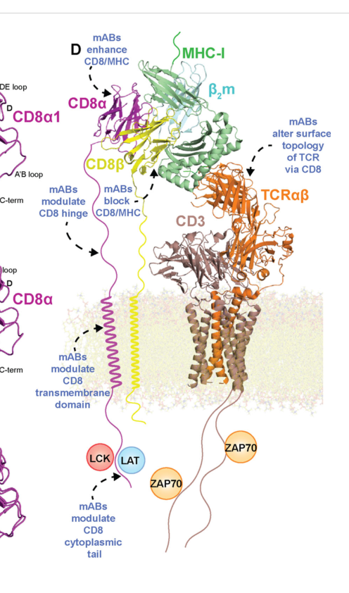

## Question

# Gene Research for Functional Annotation

## ⚠️ CRITICAL: Gene/Protein Identification Context

**BEFORE YOU BEGIN RESEARCH:** You MUST verify you are researching the CORRECT gene/protein. Gene symbols can be ambiguous, especially for less well-characterized genes from non-model organisms.

### Target Gene/Protein Identity (from UniProt):
- **UniProt Accession:** P10966
- **Protein Description:** RecName: Full=T-cell surface glycoprotein CD8 beta chain; AltName: CD_antigen=CD8b; Flags: Precursor;
- **Gene Information:** Name=CD8B; Synonyms=CD8B1;
- **Organism (full):** Homo sapiens (Human).
- **Protein Family:** Not specified in UniProt
- **Key Domains:** CD8B. (IPR042414); Ig-like_dom. (IPR007110); Ig-like_dom_sf. (IPR036179); Ig-like_fold. (IPR013783); Ig_sub. (IPR003599)

### MANDATORY VERIFICATION STEPS:

1. **Check if the gene symbol "CD8B" matches the protein description above**
2. **Verify the organism is correct:** Homo sapiens (Human).
3. **Check if protein family/domains align with what you find in literature**
4. **If you find literature for a DIFFERENT gene with the same or similar symbol, STOP**

### If Gene Symbol is Ambiguous or You Cannot Find Relevant Literature:

**DO NOT PROCEED WITH RESEARCH ON A DIFFERENT GENE.** Instead:
- State clearly: "The gene symbol 'CD8B' is ambiguous or literature is limited for this specific protein"
- Explain what you found (e.g., "Found extensive literature on a different gene with the same symbol in a different organism")
- Describe the protein based ONLY on the UniProt information provided above
- Suggest that the protein function can be inferred from domain/family information

### Research Target:

Please provide a comprehensive research report on the gene **CD8B** (gene ID: CD8B, UniProt: P10966) in human.

The research report should be a detailed narrative explaining the function, biological processes, and localization of the gene product. Citations should be given for all claims.

You should prioritize authoritative reviews and primary scientific literature when conducting research. You can supplement
this with annotations you find in gene/protein databases, but these can be outdated or inaccurate.

We are specifically interested in the primary function of the gene - for enzymes, what reaction is catalyzed, and what is the substrate specificity? For transporters, what is the substrate? For structural proteins or adapters, what is the broader structural role? For signaling molecules, what is the role in the pathway.

We are interested in where in or outside the cell the gene product carries out its function.

We are also interested in the signaling or biochemical pathways in which the gene functions. We are less interested in broad pleiotropic effects, except where these elucidate the precise role.

Include evidence where possible. We are interested in both experimental evidence as well as inference from structure, evolution, or bioinformatic analysis. Precise studies should be prioritized over high-throughput, where available.

## Output

Question: You are an expert researcher providing comprehensive, well-cited information.

Provide detailed information focusing on:
1. Key concepts and definitions with current understanding
2. Recent developments and latest research (prioritize 2023-2024 sources)
3. Current applications and real-world implementations
4. Expert opinions and analysis from authoritative sources
5. Relevant statistics and data from recent studies

Format as a comprehensive research report with proper citations. Include URLs and publication dates where available.
Always prioritize recent, authoritative sources and provide specific citations for all major claims.

# Gene Research for Functional Annotation

## ⚠️ CRITICAL: Gene/Protein Identification Context

**BEFORE YOU BEGIN RESEARCH:** You MUST verify you are researching the CORRECT gene/protein. Gene symbols can be ambiguous, especially for less well-characterized genes from non-model organisms.

### Target Gene/Protein Identity (from UniProt):
- **UniProt Accession:** P10966
- **Protein Description:** RecName: Full=T-cell surface glycoprotein CD8 beta chain; AltName: CD_antigen=CD8b; Flags: Precursor;
- **Gene Information:** Name=CD8B; Synonyms=CD8B1;
- **Organism (full):** Homo sapiens (Human).
- **Protein Family:** Not specified in UniProt
- **Key Domains:** CD8B. (IPR042414); Ig-like_dom. (IPR007110); Ig-like_dom_sf. (IPR036179); Ig-like_fold. (IPR013783); Ig_sub. (IPR003599)

### MANDATORY VERIFICATION STEPS:

1. **Check if the gene symbol "CD8B" matches the protein description above**
2. **Verify the organism is correct:** Homo sapiens (Human).
3. **Check if protein family/domains align with what you find in literature**
4. **If you find literature for a DIFFERENT gene with the same or similar symbol, STOP**

### If Gene Symbol is Ambiguous or You Cannot Find Relevant Literature:

**DO NOT PROCEED WITH RESEARCH ON A DIFFERENT GENE.** Instead:
- State clearly: "The gene symbol 'CD8B' is ambiguous or literature is limited for this specific protein"
- Explain what you found (e.g., "Found extensive literature on a different gene with the same symbol in a different organism")
- Describe the protein based ONLY on the UniProt information provided above
- Suggest that the protein function can be inferred from domain/family information

### Research Target:

Please provide a comprehensive research report on the gene **CD8B** (gene ID: CD8B, UniProt: P10966) in human.

The research report should be a detailed narrative explaining the function, biological processes, and localization of the gene product. Citations should be given for all claims.

You should prioritize authoritative reviews and primary scientific literature when conducting research. You can supplement
this with annotations you find in gene/protein databases, but these can be outdated or inaccurate.

We are specifically interested in the primary function of the gene - for enzymes, what reaction is catalyzed, and what is the substrate specificity? For transporters, what is the substrate? For structural proteins or adapters, what is the broader structural role? For signaling molecules, what is the role in the pathway.

We are interested in where in or outside the cell the gene product carries out its function.

We are also interested in the signaling or biochemical pathways in which the gene functions. We are less interested in broad pleiotropic effects, except where these elucidate the precise role.

Include evidence where possible. We are interested in both experimental evidence as well as inference from structure, evolution, or bioinformatic analysis. Precise studies should be prioritized over high-throughput, where available.

# Human CD8B (UniProt P10966): functional annotation research report

## Identity and principal function

**Identity verified.** CD8B, also called CD8B1, encodes the **human T-cell surface glycoprotein CD8 β chain**, not CD8A (the α chain) or mouse *Cd8b1*. The original human β-chain cloning study identified an extracellular immunoglobulin-like region, a membrane-proximal stalk, a transmembrane segment and alternatively spliced cytoplasmic tails. A 2024 structural review explicitly identifies the human β-chain sequence as UniProt **P10966**. Its Ig-like domain is consistent with the supplied InterPro annotations. [UniProt record: https://www.uniprot.org/uniprotkb/P10966/entry.] (norment1988asecondsubunit pages 3-4, norment1988asecondsubunit pages 2-3, srinivasan2024structurefunctionand pages 5-8)

**Primary molecular role:** CD8β is a *nonenzymatic cell-surface coreceptor subunit*. Together with CD8α, it forms the CD8αβ complex that assists a T-cell receptor (TCR) in recognizing an antigenic peptide presented by **MHC class I**—human leukocyte antigen class I (HLA-I) in humans. The TCR recognizes the peptide-bearing, membrane-distal portion of HLA-I; CD8αβ engages a comparatively conserved, membrane-proximal surface, particularly the HLA-I α3 domain. This pairing improves antigen-recognition sensitivity and organizes signaling at the T-cell–target-cell contact. CD8β is **not** a peptide receptor with its own defined peptide specificity, a transporter, or a catalytic enzyme. (srinivasan2024structurefunctionand pages 3-5, srinivasan2024structurefunctionand pages 5-8, srinivasan2024structurefunctionand pages 1-2)

The review’s Figure 1D illustrates CD8β within a proposed TCR–peptide–MHC-I synapse; **it is a model assembled partly from mouse structural data, not an experimentally solved complete human synapse**. (srinivasan2024structurefunctionand pages 3-5, srinivasan2024structurefunctionand media b6605dcf)

## Molecular architecture and where it acts

CD8β is synthesized through the secretory pathway and functions principally **at the plasma membrane**, with its Ig-like head and glycosylated stalk exposed *outside* the T cell and its short tail facing the cytosol. Its physiologically important site of action is the **immunological synapse**, where the extracellular CD8αβ head can contact HLA-I on an apposed cell while membrane-associated signaling proteins act on the T-cell side. The boundaries below describe the human sequence used by the 2024 review; alternatively spliced tails need not share the same endpoint. (norment1988asecondsubunit pages 3-4, norment1988asecondsubunit pages 2-3, srinivasan2024structurefunctionand pages 8-9)

| Region | Residues (review reference) | Location | Mechanistic role | Evidence strength / caveat |
|---|---:|---|---|---|
| Signal peptide / precursor segment | 1–21 | Secretory pathway; removed during maturation | Directs nascent CD8β into the ER for membrane-protein processing | Human cloning identified a hydrophobic leader and glycosylated precursor; exact cleavage assignment is annotation-dependent. (norment1988asecondsubunit pages 3-4) |
| Ig V-like ectodomain | 22–138 | Extracellular globular head of the CD8αβ coreceptor | As part of the **CD8αβ heterodimer**, contributes to peptide–HLA class I binding and stabilization of TCR–pHLA recognition | Human sequence architecture and the 2024 review support this role; it does **not** prove that isolated human CD8β binds HLA equivalently. (norment1988asecondsubunit pages 3-4, srinivasan2024structurefunctionand pages 3-5) |
| Hinge / stalk | 139–170 | Extracellular; between the Ig-like head and plasma membrane | O-glycosylated, Pro/Ser/Thr-rich spacer that regulates receptor reach, orientation and CD8αβ–MHC-I geometry; sialylation can tune affinity | Glycoform- and differentiation-dependent; some detailed mechanistic evidence comes from model systems. (srinivasan2024structurefunctionand pages 8-9) |
| Transmembrane domain | 171–191 | Single-pass plasma-membrane helix | Anchors CD8β, supports surface trafficking and CD8αβ assembly; a membrane-proximal cysteine contributes to disulfide stabilization | Human sequence-based assignment; no atomic structure of the human CD8β transmembrane region was available. (srinivasan2024structurefunctionand pages 8-9) |
| Canonical cytoplasmic tail | 192–210 | Cytosolic | Palmitoylation supports localization of CD8αβ in signaling-enriched membrane domains and indirectly improves coupling to TCR/CD3 signaling | CD8β lacks the **CxC Lck-binding motif**; direct Lck recruitment is supplied by CD8α. CD8β instead facilitates membrane and signaling organization. (srinivasan2024structurefunctionand pages 8-9) |
| Alternative human CD8B tails / isoforms | Isoform-dependent; not always 192–210 | Cytosolic, or absent from the membrane in a reported transmembrane-lacking transcript | Alternative splicing generates tails that regulate surface abundance, internalization, ubiquitination and functional responses; M4 predominates in effector-memory T cells | Four membrane-associated human isoforms have distinct tails. In one engineered human-cell assay, M4 produced about twice the frequency of MIP-1β-positive cells compared with M1; canonical boundaries should not be generalized to every isoform. (norment1988asecondsubunit pages 2-3, thakral2013thehumancd8β pages 1-2) |

*Table: Sequence-to-function summary for human CD8B (UniProt P10966), separating the β chain’s structural and membrane-organizing roles from direct Lck recruitment by CD8α. Residue boundaries follow the 2024 review, with isoform cautions from human primary studies.*

Importantly, the **direct LCK-binding CxC motif belongs to CD8α, not CD8β**. CD8β can nevertheless facilitate signaling through heterodimer assembly, its contribution to the HLA-binding head, glycosylation-dependent geometry, and palmitoylation-associated organization of membrane signaling domains. Describing CD8β itself as the LCK-binding catalytic signaling chain would misassign both the binding site and enzymatic activity. The 2024 review notes that the extent of coreceptor-associated LCK varies markedly across experimental measurements; lipid-raft and LCK-coupling models should not be treated as a fixed stoichiometry for every human T cell. (srinivasan2024structurefunctionand pages 8-9, srinivasan2024structurefunctionand pages 9-10)

## Experimental basis for molecular function

**Human expression and assembly.** Norment and Littman’s human cDNA-expression experiments (November 1988) found a β-associated cell-surface antibody epitope only when CD8α and CD8β were coexpressed. Approximately **90% of bright CD8α-positive peripheral-blood lymphocytes and CD8α-positive thymocytes** displayed this determinant. The authors could not establish whether the antibody recognized β alone or a conformation requiring both chains; the result establishes β-associated surface expression, not an exclusively β-defined epitope. [EMBO Journal, November 1988: https://doi.org/10.1002/j.1460-2075.1988.tb03217.x.] (norment1988asecondsubunit pages 1-2, norment1988asecondsubunit pages 5-6)

**Recognition of class-I-presented antigen.** In engineered **human peripheral-blood CD4 T cells** expressing HLA-I-restricted TCRs, adding both CD8α and CD8β—rather than CD8α alone—substantially improved responses to naturally presented antigens. For an HA-2-specific TCR, cells expressing intact or cytoplasmically truncated CD8αβ showed approximately **100-fold greater functional sensitivity** than CD8-negative or CD8αα-expressing comparators. Truncating the intracellular CD8 domains or mutating the α-chain LCK-binding motif did not abolish the enhanced cytokine production and proliferation *in this engineered helper-cell system*. These experiments establish a substantial **extracellular adhesion/coreceptor contribution**; they do not imply that LCK is generally dispensable for native cytotoxic-T-cell activation. [van Loenen *et al.*, PLOS ONE, May 2013: https://doi.org/10.1371/journal.pone.0065212.] (loenen2013extracellulardomainsof pages 1-2, loenen2013extracellulardomainsof pages 2-4)

**Binding geometry and specificity.** Structural and biophysical studies synthesized in the 2024 review place CD8β in the HLA-I-facing CD8αβ head. CD8–MHC-I binding is generally weak in solution—approximately **10–500 µM** dissociation constants across the reviewed interactions—and is usually much less dependent on the presented peptide than TCR recognition is. These are **ranges for CD8 complexes and different class-I ligands**, not a measured universal affinity of isolated human CD8β. The often-cited 2.4-Å CD8αβ structure and β-chain CDR2/CDR3 mutational evidence were obtained using **mouse CD8**, so they support conserved-mechanism inference rather than a direct atomic structure or mutational map of human P10966 bound to HLA. [Srinivasan *et al.*, *Frontiers in Immunology*, August 26, 2024: https://doi.org/10.3389/fimmu.2024.1412513; Chang *et al.*, *Immunity*, December 2005: https://doi.org/10.1016/j.immuni.2005.11.002.] (srinivasan2024structurefunctionand pages 5-8, chang2005structuralandmutational pages 1-2)

**Pathway placement.** The relevant pathway is **HLA-I–peptide recognition → TCR/CD3 activation → LCK-dependent CD3 ITAM phosphorylation → ZAP70 recruitment → LAT/SLP76-associated signaling → T-cell activation and effector responses**. CD8αβ contributes to engagement and signal amplification, especially when TCR–peptide–HLA binding alone is insufficient. The β chain supports the complex; LCK’s kinase reaction is performed by LCK and its coreceptor-binding motif is on CD8α. CD8αβ-dependent signals also contribute to thymic CD8-lineage selection, but much of the precise β-chain selection mechanism comes from animal or engineered-cell studies rather than selective disruption of human CD8B in vivo. (srinivasan2024structurefunctionand pages 2-3, srinivasan2024structurefunctionand pages 3-5, srinivasan2024structurefunctionand pages 8-9, srinivasan2024structurefunctionand pages 1-2)

**Human-specific tail regulation.** Human CD8B has multiple membrane-associated splice isoforms with distinct cytoplasmic tails. In a direct human-cell study, **M1** was associated predominantly with naïve T cells and **M4** with effector-memory cells. An M4 di-leucine-containing motif promoted receptor internalization; disrupting the relevant hydrophobic motif raised surface CD8β expression approximately **twofold** in the tested cells. In antigen-stimulated engineered primary human T cells, the frequency of **MIP-1β-producing cells was approximately twofold higher with M4 than M1**. These are isoform- and experimental-context-specific findings, not a general claim that CD8B produces the chemokine. [Thakral *et al.*, PLOS ONE, March 2013: https://doi.org/10.1371/journal.pone.0059374.] (thakral2013thehumancd8β pages 3-6, thakral2013thehumancd8β pages 1-2, thakral2013thehumancd8β pages 8-9)

## Cellular distribution, recent research and applications

Freshly isolated, sorted human blood populations in a **2024 quantitative-transcriptomics study** expressed CD8A and CD8B predominantly in **CD8-positive T cells**, with reported expression across the two genes of roughly **332–1,439 reads** in the sampled CD8-T-cell preparations; the sampled CD4 T cells, B cells and monocytes did not show comparable expression. This is a small sorted-cell transcriptomic comparison, not a universal frequency estimate or proof of surface protein abundance. [Akula *et al.*, *International Journal of Molecular Sciences*, December 2024: https://doi.org/10.3390/ijms252313050.] (akula2024characterizationoffreshly pages 9-11)

Independent protein-level human evidence sharpens the distinction between the two genes: CD8β was not detected on human monocytes that expressed CD8α; in 2024 experiments, an anti-*human CD8β* nanobody bound primary human CD8 T cells but not the tested NK or myeloid cells, unlike an anti-CD8α reagent. Thus, **CD8α positivity alone must not be interpreted as CD8B expression or as proof of a conventional CD8αβ T cell**. CD8αβ can also occur in less-conventional subsets, including a γδ T-cell population identified in pediatric T-cell acute lymphoblastic leukemia; that disease-context observation should not be generalized to normal circulating T cells. [Gibbings *et al.*, *BMC Immunology*, August 2007: https://doi.org/10.1186/1471-2172-8-12; De Groof *et al.*, September 2024: https://doi.org/10.1007/s00259-024-06896-3; Sumaria *et al.*, *Nature Immunology*, May 2024: https://doi.org/10.1038/s41590-024-01855-4.] (groof2024specificimagingof pages 4-6, sumaria2024perinatalthymicderivedcd8αβexpressing pages 1-2, gibbings2007cd8αisexpressed pages 1-2)

**Real-world research uses** include anti-CD8β flow-cytometric identification of αβ-coreceptor-bearing T cells, distinction from CD8α-only populations, and CD8αβ coexpression when engineering HLA-I-restricted TCR responses in human cells. A particularly recent translational application is a **human-CD8β-binding nanobody radiotracer** for SPECT/PET. The 2024 study found **low-nanomolar** binding to human CD8αβ, no detectable unwanted activation in its human-cell assays, and visualization of CD8-positive tissues approximately **1 hour** after injection in human-CD8-expressing mice. A proof-of-concept PET experiment imaged lymphoid organs in **two cynomolgus macaques** after injection of a copper-64-labelled version. Tumor-bearing mouse imaging tracked CD8-cell dynamics over **18 days**. These results are **preclinical**: the paper did not demonstrate diagnostic performance or improved immunotherapy outcomes in human patients. [De Groof *et al.*, published September 2024 in *European Journal of Nuclear Medicine and Molecular Imaging*: https://doi.org/10.1007/s00259-024-06896-3.] (groof2024specificimagingof pages 1-2, groof2024specificimagingof pages 4-6, groof2024specificimagingof pages 9-12)

## Interpretation and evidence limits

The strongest **gene-specific human evidence** establishes CD8B’s identity, extracellular contribution to CD8αβ-dependent HLA-I recognition, cell-surface distribution, and isoform-specific receptor trafficking. Expert synthesis additionally supports glycosylation- and membrane-organization mechanisms, but detailed bound structures and several thymic-selection or raft-mechanism experiments use nonhuman CD8. Reported familial CD8 deficiency caused by **CD8A** mutations demonstrates the importance of an intact αβ complex and α-dependent β trafficking; it must **not** be presented as a CD8B loss-of-function case. Likewise, possible CD8ββ assemblies are not sufficiently established as a principal physiological human function. The most defensible annotation is therefore: **human CD8B encodes the extracellular HLA-I-engaging and membrane-organizing β subunit of the CD8αβ T-cell coreceptor, which enhances TCR-dependent class-I antigen recognition and its associated signaling without itself catalyzing a reaction or directly binding LCK through the α-chain CxC motif**. (callemartin2001familialcd8deficiency pages 1-2, srinivasan2024structurefunctionand pages 8-9, loenen2013extracellulardomainsof pages 1-2, chang2005structuralandmutational pages 1-2, srinivasan2024structurefunctionand pages 3-5)

References

1. (norment1988asecondsubunit pages 3-4): A. M. Norment and D. R. Littman. A second subunit of cd8 is expressed in human t cells. The EMBO Journal, 7:3433-3439, Nov 1988. URL: https://doi.org/10.1002/j.1460-2075.1988.tb03217.x, doi:10.1002/j.1460-2075.1988.tb03217.x. This article has 222 citations.

2. (norment1988asecondsubunit pages 2-3): A. M. Norment and D. R. Littman. A second subunit of cd8 is expressed in human t cells. The EMBO Journal, 7:3433-3439, Nov 1988. URL: https://doi.org/10.1002/j.1460-2075.1988.tb03217.x, doi:10.1002/j.1460-2075.1988.tb03217.x. This article has 222 citations.

3. (srinivasan2024structurefunctionand pages 5-8): Shreyaa Srinivasan, Cheng Zhu, and Andrew C. McShan. Structure, function, and immunomodulation of the cd8 co-receptor. Frontiers in Immunology, Aug 2024. URL: https://doi.org/10.3389/fimmu.2024.1412513, doi:10.3389/fimmu.2024.1412513. This article has 33 citations and is from a peer-reviewed journal.

4. (srinivasan2024structurefunctionand pages 3-5): Shreyaa Srinivasan, Cheng Zhu, and Andrew C. McShan. Structure, function, and immunomodulation of the cd8 co-receptor. Frontiers in Immunology, Aug 2024. URL: https://doi.org/10.3389/fimmu.2024.1412513, doi:10.3389/fimmu.2024.1412513. This article has 33 citations and is from a peer-reviewed journal.

5. (srinivasan2024structurefunctionand pages 1-2): Shreyaa Srinivasan, Cheng Zhu, and Andrew C. McShan. Structure, function, and immunomodulation of the cd8 co-receptor. Frontiers in Immunology, Aug 2024. URL: https://doi.org/10.3389/fimmu.2024.1412513, doi:10.3389/fimmu.2024.1412513. This article has 33 citations and is from a peer-reviewed journal.

6. (srinivasan2024structurefunctionand media b6605dcf): Shreyaa Srinivasan, Cheng Zhu, and Andrew C. McShan. Structure, function, and immunomodulation of the cd8 co-receptor. Frontiers in Immunology, Aug 2024. URL: https://doi.org/10.3389/fimmu.2024.1412513, doi:10.3389/fimmu.2024.1412513. This article has 33 citations and is from a peer-reviewed journal.

7. (srinivasan2024structurefunctionand pages 8-9): Shreyaa Srinivasan, Cheng Zhu, and Andrew C. McShan. Structure, function, and immunomodulation of the cd8 co-receptor. Frontiers in Immunology, Aug 2024. URL: https://doi.org/10.3389/fimmu.2024.1412513, doi:10.3389/fimmu.2024.1412513. This article has 33 citations and is from a peer-reviewed journal.

8. (thakral2013thehumancd8β pages 1-2): Deepshi Thakral, Maria M. Coman, Arunima Bandyopadhyay, Sunil Martin, James L. Riley, and Paula B. Kavathas. The human cd8β m-4 isoform dominant in effector memory t cells has distinct cytoplasmic motifs that confer unique properties. PLoS ONE, 8:e59374, Mar 2013. URL: https://doi.org/10.1371/journal.pone.0059374, doi:10.1371/journal.pone.0059374. This article has 6 citations and is from a peer-reviewed journal.

9. (srinivasan2024structurefunctionand pages 9-10): Shreyaa Srinivasan, Cheng Zhu, and Andrew C. McShan. Structure, function, and immunomodulation of the cd8 co-receptor. Frontiers in Immunology, Aug 2024. URL: https://doi.org/10.3389/fimmu.2024.1412513, doi:10.3389/fimmu.2024.1412513. This article has 33 citations and is from a peer-reviewed journal.

10. (norment1988asecondsubunit pages 1-2): A. M. Norment and D. R. Littman. A second subunit of cd8 is expressed in human t cells. The EMBO Journal, 7:3433-3439, Nov 1988. URL: https://doi.org/10.1002/j.1460-2075.1988.tb03217.x, doi:10.1002/j.1460-2075.1988.tb03217.x. This article has 222 citations.

11. (norment1988asecondsubunit pages 5-6): A. M. Norment and D. R. Littman. A second subunit of cd8 is expressed in human t cells. The EMBO Journal, 7:3433-3439, Nov 1988. URL: https://doi.org/10.1002/j.1460-2075.1988.tb03217.x, doi:10.1002/j.1460-2075.1988.tb03217.x. This article has 222 citations.

12. (loenen2013extracellulardomainsof pages 1-2): Marleen M. van Loenen, Renate S. Hagedoorn, Renate de Boer, J. H. Frederik Falkenburg, and Mirjam H. M. Heemskerk. Extracellular domains of cd8α and cd8ß subunits are sufficient for hla class i restricted helper functions of tcr-engineered cd4+ t cells. PLoS ONE, 8:e65212, May 2013. URL: https://doi.org/10.1371/journal.pone.0065212, doi:10.1371/journal.pone.0065212. This article has 24 citations and is from a peer-reviewed journal.

13. (loenen2013extracellulardomainsof pages 2-4): Marleen M. van Loenen, Renate S. Hagedoorn, Renate de Boer, J. H. Frederik Falkenburg, and Mirjam H. M. Heemskerk. Extracellular domains of cd8α and cd8ß subunits are sufficient for hla class i restricted helper functions of tcr-engineered cd4+ t cells. PLoS ONE, 8:e65212, May 2013. URL: https://doi.org/10.1371/journal.pone.0065212, doi:10.1371/journal.pone.0065212. This article has 24 citations and is from a peer-reviewed journal.

14. (chang2005structuralandmutational pages 1-2): Hsiu-Ching Chang, Kemin Tan, Jing Ouyang, Emilio Parisini, Jin-huan Liu, Yi Le, Xiasong Wang, Ellis L. Reinherz, and Jia-huai Wang. Structural and mutational analyses of a cd8αβ heterodimer and comparison with the cd8αα homodimer. Immunity, 23:661-671, Dec 2005. URL: https://doi.org/10.1016/j.immuni.2005.11.002, doi:10.1016/j.immuni.2005.11.002. This article has 62 citations and is from a highest quality peer-reviewed journal.

15. (srinivasan2024structurefunctionand pages 2-3): Shreyaa Srinivasan, Cheng Zhu, and Andrew C. McShan. Structure, function, and immunomodulation of the cd8 co-receptor. Frontiers in Immunology, Aug 2024. URL: https://doi.org/10.3389/fimmu.2024.1412513, doi:10.3389/fimmu.2024.1412513. This article has 33 citations and is from a peer-reviewed journal.

16. (thakral2013thehumancd8β pages 3-6): Deepshi Thakral, Maria M. Coman, Arunima Bandyopadhyay, Sunil Martin, James L. Riley, and Paula B. Kavathas. The human cd8β m-4 isoform dominant in effector memory t cells has distinct cytoplasmic motifs that confer unique properties. PLoS ONE, 8:e59374, Mar 2013. URL: https://doi.org/10.1371/journal.pone.0059374, doi:10.1371/journal.pone.0059374. This article has 6 citations and is from a peer-reviewed journal.

17. (thakral2013thehumancd8β pages 8-9): Deepshi Thakral, Maria M. Coman, Arunima Bandyopadhyay, Sunil Martin, James L. Riley, and Paula B. Kavathas. The human cd8β m-4 isoform dominant in effector memory t cells has distinct cytoplasmic motifs that confer unique properties. PLoS ONE, 8:e59374, Mar 2013. URL: https://doi.org/10.1371/journal.pone.0059374, doi:10.1371/journal.pone.0059374. This article has 6 citations and is from a peer-reviewed journal.

18. (akula2024characterizationoffreshly pages 9-11): Srinivas Akula, Abigail Alvarado-Vazquez, Erika Haide Mendez Enriquez, Gürkan Bal, Kristin Franke, Sara Wernersson, Jenny Hallgren, Gunnar Pejler, Magda Babina, and Lars Hellman. Characterization of freshly isolated human peripheral blood b cells, monocytes, cd4+ and cd8+ t cells, and skin mast cells by quantitative transcriptomics. International Journal of Molecular Sciences, 25:13050, Dec 2024. URL: https://doi.org/10.3390/ijms252313050, doi:10.3390/ijms252313050. This article has 5 citations.

19. (groof2024specificimagingof pages 4-6): Timo W.M. De Groof, Yoline Lauwers, Tessa De Pauw, Mohit Saxena, Cécile Vincke, Jolien Van Craenenbroeck, Catherine Chapon, Roger Le Grand, Geert Raes, Thibaut Naninck, Jo A. Van Ginderachter, and Nick Devoogdt. Specific imaging of cd8 + t-cell dynamics with a nanobody radiotracer against human cd8β. European Journal of Nuclear Medicine and Molecular Imaging, 52:193-207, Sep 2024. URL: https://doi.org/10.1007/s00259-024-06896-3, doi:10.1007/s00259-024-06896-3. This article has 19 citations and is from a highest quality peer-reviewed journal.

20. (sumaria2024perinatalthymicderivedcd8αβexpressing pages 1-2): Nital Sumaria, Gina J. Fiala, Daniel Inácio, Marta Curado-Avelar, Ana Cachucho, Rúben Pinheiro, Robert Wiesheu, Shunsuke Kimura, Lucien Courtois, Birte Blankenhaus, Julie Darrigues, Tobias Suske, Afonso R. M. Almeida, Susana Minguet, Vahid Asnafi, Ludovic Lhermitte, Charles G. Mullighan, Seth B. Coffelt, Richard Moriggl, João T. Barata, Daniel J. Pennington, and Bruno Silva-Santos. Perinatal thymic-derived cd8αβ-expressing γδ t cells are innate ifn-γ producers that expand in il-7r–stat5b-driven neoplasms. Nature Immunology, 25:1207-1217, May 2024. URL: https://doi.org/10.1038/s41590-024-01855-4, doi:10.1038/s41590-024-01855-4. This article has 29 citations and is from a highest quality peer-reviewed journal.

21. (gibbings2007cd8αisexpressed pages 1-2): Derrick J Gibbings, Marcelo Marcet-Palacios, Yokananth Sekar, Marcus CY Ng, and A Dean Befus. Cd8α is expressed by human monocytes and enhances fcγr-dependent responses. BMC Immunology, 8:12-12, Aug 2007. URL: https://doi.org/10.1186/1471-2172-8-12, doi:10.1186/1471-2172-8-12. This article has 59 citations and is from a peer-reviewed journal.

22. (groof2024specificimagingof pages 1-2): Timo W.M. De Groof, Yoline Lauwers, Tessa De Pauw, Mohit Saxena, Cécile Vincke, Jolien Van Craenenbroeck, Catherine Chapon, Roger Le Grand, Geert Raes, Thibaut Naninck, Jo A. Van Ginderachter, and Nick Devoogdt. Specific imaging of cd8 + t-cell dynamics with a nanobody radiotracer against human cd8β. European Journal of Nuclear Medicine and Molecular Imaging, 52:193-207, Sep 2024. URL: https://doi.org/10.1007/s00259-024-06896-3, doi:10.1007/s00259-024-06896-3. This article has 19 citations and is from a highest quality peer-reviewed journal.

23. (groof2024specificimagingof pages 9-12): Timo W.M. De Groof, Yoline Lauwers, Tessa De Pauw, Mohit Saxena, Cécile Vincke, Jolien Van Craenenbroeck, Catherine Chapon, Roger Le Grand, Geert Raes, Thibaut Naninck, Jo A. Van Ginderachter, and Nick Devoogdt. Specific imaging of cd8 + t-cell dynamics with a nanobody radiotracer against human cd8β. European Journal of Nuclear Medicine and Molecular Imaging, 52:193-207, Sep 2024. URL: https://doi.org/10.1007/s00259-024-06896-3, doi:10.1007/s00259-024-06896-3. This article has 19 citations and is from a highest quality peer-reviewed journal.

24. (callemartin2001familialcd8deficiency pages 1-2): Oscar de la Calle-Martin, Manuel Hernandez, Jose Ordi, Natalia Casamitjana, Juan I. Arostegui, Isabel Caragol, Monserrat Ferrando, Moises Labrador, Jose L. Rodriguez-Sanchez, and Teresa Espanol. Familial cd8 deficiency due to a mutation in the cd8α gene. Jul 2001. URL: https://doi.org/10.1172/jci10993, doi:10.1172/jci10993. This article has 137 citations and is from a highest quality peer-reviewed journal.

## Artifacts

- [Edison artifact artifact-00](CD8B-deep-research-falcon_artifacts/artifact-00.md)

## Citations

1. norment1988asecondsubunit pages 3-4
2. srinivasan2024structurefunctionand pages 8-9
3. akula2024characterizationoffreshly pages 9-11
4. norment1988asecondsubunit pages 2-3
5. srinivasan2024structurefunctionand pages 5-8
6. srinivasan2024structurefunctionand pages 3-5
7. srinivasan2024structurefunctionand pages 1-2
8. srinivasan2024structurefunctionand pages 9-10
9. norment1988asecondsubunit pages 1-2
10. norment1988asecondsubunit pages 5-6
11. loenen2013extracellulardomainsof pages 1-2
12. loenen2013extracellulardomainsof pages 2-4
13. chang2005structuralandmutational pages 1-2
14. srinivasan2024structurefunctionand pages 2-3
15. groof2024specificimagingof pages 4-6
16. groof2024specificimagingof pages 1-2
17. groof2024specificimagingof pages 9-12
18. UniProt record: https://www.uniprot.org/uniprotkb/P10966/entry.
19. EMBO Journal, November 1988: https://doi.org/10.1002/j.1460-2075.1988.tb03217.x.
20. van Loenen *et al.*, PLOS ONE, May 2013: https://doi.org/10.1371/journal.pone.0065212.
21. Srinivasan *et al.*, *Frontiers in Immunology*, August 26, 2024: https://doi.org/10.3389/fimmu.2024.1412513; Chang *et al.*, *Immunity*, December 2005: https://doi.org/10.1016/j.immuni.2005.11.002.
22. Thakral *et al.*, PLOS ONE, March 2013: https://doi.org/10.1371/journal.pone.0059374.
23. Akula *et al.*, *International Journal of Molecular Sciences*, December 2024: https://doi.org/10.3390/ijms252313050.
24. Gibbings *et al.*, *BMC Immunology*, August 2007: https://doi.org/10.1186/1471-2172-8-12; De Groof *et al.*, September 2024: https://doi.org/10.1007/s00259-024-06896-3; Sumaria *et al.*, *Nature Immunology*, May 2024: https://doi.org/10.1038/s41590-024-01855-4.
25. De Groof *et al.*, published September 2024 in *European Journal of Nuclear Medicine and Molecular Imaging*: https://doi.org/10.1007/s00259-024-06896-3.
26. https://www.uniprot.org/uniprotkb/P10966/entry.]
27. https://doi.org/10.1002/j.1460-2075.1988.tb03217.x.]
28. https://doi.org/10.1371/journal.pone.0065212.]
29. https://doi.org/10.3389/fimmu.2024.1412513;
30. https://doi.org/10.1016/j.immuni.2005.11.002.]
31. https://doi.org/10.1371/journal.pone.0059374.]
32. https://doi.org/10.3390/ijms252313050.]
33. https://doi.org/10.1186/1471-2172-8-12;
34. https://doi.org/10.1007/s00259-024-06896-3;
35. https://doi.org/10.1038/s41590-024-01855-4.]
36. https://doi.org/10.1007/s00259-024-06896-3.]
37. https://doi.org/10.1002/j.1460-2075.1988.tb03217.x,
38. https://doi.org/10.3389/fimmu.2024.1412513,
39. https://doi.org/10.1371/journal.pone.0059374,
40. https://doi.org/10.1371/journal.pone.0065212,
41. https://doi.org/10.1016/j.immuni.2005.11.002,
42. https://doi.org/10.3390/ijms252313050,
43. https://doi.org/10.1007/s00259-024-06896-3,
44. https://doi.org/10.1038/s41590-024-01855-4,
45. https://doi.org/10.1186/1471-2172-8-12,
46. https://doi.org/10.1172/jci10993,