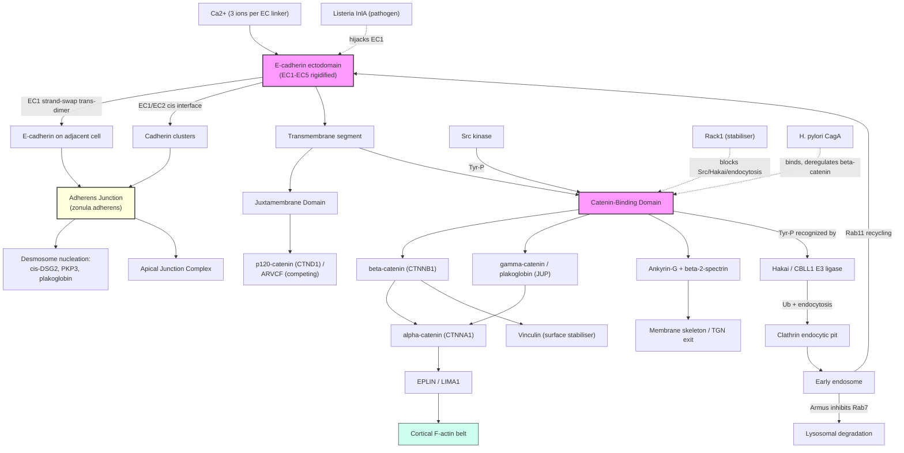

# Pathway Summary for CDH1

## Overview
CDH1 / E-cadherin is the prototypical type-I classical cadherin and the principal calcium-dependent cell-cell adhesion receptor of epithelia. Its five tandem extracellular cadherin (EC) repeats are rigidified by ~12 Ca2+ ions bound at the inter-domain linkers; the EC1 domain then mediates strand-swap trans-dimerisation with E-cadherin on adjacent cells, and EC1/EC2 cis contacts cluster cadherins into ordered junctions [PMID:21300292, PMID:19114658, PMID:19646884]. The short cytoplasmic tail nucleates the cadherin-catenin complex by binding beta-catenin (CTNNB1) and gamma-catenin/plakoglobin (JUP) at the catenin-binding domain and p120-catenin (CTNND1) at the juxtamembrane domain; alpha-catenin and adaptors such as EPLIN/LIMA1, vinculin and ankyrin-G/spectrin couple the complex to cortical F-actin and the membrane skeleton [PMID:1639850, PMID:18093941, PMID:17620337, PMID:20086044]. Together these activities build and maintain the epithelial adherens junction (zonula adherens), seed early desmosome assembly through recruitment of DSG2 and plakophilin-3, and underpin E-cadherin's roles as an invasion/tumour suppressor and as the cell-surface receptor exploited by *Listeria monocytogenes* internalin A [PMID:20859650, PMID:21724833, PMID:12526809, Reactome:R-HSA-418990, Reactome:R-HSA-525793].

## Core Pathways

### Calcium-dependent Homophilic Cell-Cell Adhesion
E-cadherin adhesion is strictly Ca2+-dependent: three Ca2+ ions bridge each successive pair of EC repeats and lock the ectodomain into the elongated, curved conformation that is competent for trans-binding [PMID:21300292]. Adhesion proceeds by a two-step, induced-fit mechanism — a weak Ca2+-dependent encounter complex between EC1 domains first forms, then strengthens by exchange of the N-terminal beta-strand bearing the conserved Trp2 to give the mature strand-swap dimer; cis EC1-to-EC2 contacts on the same cell are dispensable for adhesion per se but required to assemble ordered junctions [PMID:19646884, PMID:19114658]. The same force-loaded bonds behave as catch/slip/ideal bonds, allowing junctions to tune their mechanical strength to applied tension [PMID:21300292]. Core GO terms: GO:0005509 (calcium ion binding), GO:0045296 (cadherin binding), GO:0016339 (calcium-dependent cell-cell adhesion), GO:0007156 (homophilic cell adhesion via plasma membrane adhesion molecules).

### Cadherin-Catenin Complex Assembly and Linkage to Actin
The cytoplasmic catenin-binding domain of E-cadherin directly binds beta-catenin (CTNNB1), and gamma-catenin/plakoglobin (JUP) is a second, *bona fide* catenin that engages the same site; the juxtamembrane domain binds p120-catenin (CTNND1) and the related ARVCF competes for that site [PMID:18593713, PMID:1639850, PMID:10725230]. Beta-catenin recruits alpha-catenin (CTNNA1), and the assembled complex is coupled to cortical F-actin through adaptor proteins — most prominently EPLIN/LIMA1, which couples alpha-catenin to actin and is required to organise the circumferential adhesion belt — together with vinculin (which stabilises surface E-cadherin via beta-catenin), AF6/afadin and the ankyrin-G/beta-2-spectrin membrane-skeleton arm [PMID:18093941, PMID:20086044, PMID:16882694, PMID:17620337]. Core GO terms: GO:0008013 (beta-catenin binding), GO:0045294 (alpha-catenin binding), GO:0045295 (gamma-catenin binding), GO:0016342 (catenin complex), Reactome:R-HSA-418990.

### Adherens Junction Organisation and Desmosome Nucleation
Trans-engagement and clustering of E-cadherin at nascent epithelial contacts builds the zonula adherens — the principal site of E-cadherin residence and activity — and templates assembly of the broader apical junction complex [PMID:21724833, PMID:22294297]. E-cadherin additionally seeds desmosome formation: it makes a direct cis interaction with desmoglein-2 at its EC interface, and together with plakoglobin recruits plakophilin-3 to the cell border to initiate desmosome assembly; a CDH1/RAP1A/PKP3 complex is required for E-cadherin recruitment to mature desmosomes [PMID:20859650, PMID:18343367]. Core GO terms: GO:0034332 (adherens junction organization), GO:0007043 (cell-cell junction assembly), GO:0005912 (adherens junction), GO:0016328 (lateral plasma membrane), Reactome:R-HSA-419037.

### Trafficking, Turnover and Surface-Pool Control
Steady-state surface E-cadherin is set by a balance of biosynthetic delivery, clathrin-mediated endocytosis, endosomal recycling and lysosomal degradation. After Golgi processing, E-cadherin transits Rab11-positive recycling endosomes en route to the basolateral membrane, with ankyrin-G/beta-2-spectrin required for trans-Golgi exit [PMID:15689490, PMID:17620337]. The phosphotyrosine-binding E3 ligase CBLL1/Hakai recognises Src-phosphorylated E-cadherin and triggers its endocytosis and ubiquitin-dependent degradation; the Rac1 effector Armus (TBC1D2) inactivates Rab7 to route internalised E-cadherin to lysosomes during junction disassembly [PMID:22252131, PMID:20116244]. Counter-balancing stabilisers include Rack1 (which blocks Src phosphorylation, Hakai ubiquitination and endocytosis), Smad7 (which stabilises beta-catenin engagement at the complex), flotillin microdomains, and CRYAB [PMID:21685945, PMID:18593713]. N-glycosylation by MGAT3 (GnT-III) sets membrane retention of E-cadherin and is required for proper junctional localisation [PMID:19403558].

## Pathway Diagram

## Molecular Architecture
- **Extracellular EC1-EC5 repeats**: five seven-stranded beta-barrels in tandem; trans-adhesive strand-swap dimer mediated by EC1, with cis interface between EC1 and EC2 of the partner cadherin [PMID:21300292, PMID:19114658]
- **Inter-EC Ca2+-binding sites**: three Ca2+ ions per linker (~12 in total per ectodomain) rigidify the curved adhesion-competent conformation [PMID:21300292]
- **Single-pass transmembrane segment**: anchors E-cadherin at the lateral plasma membrane
- **Juxtamembrane cytoplasmic domain**: docking site for p120-catenin (CTNND1) and the related ARVCF (competing) [PMID:10725230]
- **C-terminal catenin-binding domain (CBD)**: binds beta-catenin (CTNNB1) and gamma-catenin/plakoglobin (JUP); a distinct conserved site binds ankyrin-G [PMID:18593713, PMID:1639850, PMID:17620337]
- **PTM regulation**: N-glycosylation (MGAT3/GnT-III) controls membrane retention; CK1 phosphorylation primes SCF-SKP2 ubiquitination; Src Tyr-phosphorylation is read by the Hakai/CBLL1 PTB-fold dimer to drive endocytosis [PMID:19403558, PMID:22252131]

## Upstream Inputs
- **Extracellular Ca2+**: obligate cofactor for adhesion; chelation abolishes trans-dimerisation [PMID:21300292]
- **Mechanical tension at junctions**: tunes E-cadherin bond lifetime via catch/slip/ideal bond modes, stabilising loaded contacts [PMID:21300292]
- **Tyrosine kinase signalling (Src, growth-factor-driven)**: phosphorylates the CBD and licenses Hakai-mediated endocytosis [PMID:22252131]
- **Polarity / membrane-trafficking machinery**: Rab11 recycling endosomes and ankyrin-G/beta-2-spectrin support basolateral delivery and TGN exit [PMID:15689490, PMID:17620337]
- **Glycosylation enzymes (e.g., MGAT3)**: determine membrane localisation [PMID:19403558]

## Downstream Effects
- **Epithelial cell-cell adhesion and zonula adherens formation** [PMID:21300292, PMID:21724833]
- **Mechanical coupling to the cortical actin cytoskeleton** via the cadherin-catenin-EPLIN-vinculin module [PMID:18093941, PMID:20086044, PMID:16882694]
- **Desmosome and apical-junction-complex assembly** through cis-recruitment of DSG2 and PKP3 [PMID:20859650, PMID:18343367]
- **Invasion / tumour suppression**: loss of E-cadherin promotes epithelial-to-mesenchymal transition and is causative in hereditary diffuse gastric cancer and lobular breast carcinoma; restoring E-cadherin suppresses invasion and migration [PMID:10868478, PMID:20189993]
- **Sequestration of cytoplasmic beta-catenin** at junctions, restraining its availability for Wnt/TCF transcriptional output [PMID:18593713]

## Non-Core Contexts
- **Endosomal and Golgi localisation**: real but reflect biosynthetic/recycling transit rather than sites of core adhesion activity [PMID:15689490]
- **Flotillin-microdomain recruitment (GO:0016600)**: E-cadherin is stabilised within flotillin-1/-2 microdomains but is not a flotillin-complex subunit — a microdomain association, not structural membership
- **Synapse assembly (GO:0007416)**: a classical-cadherin family role projected from broad PANTHER nodes; the canonical epithelial CDH1 function is not synaptic
- **Pathogen receptor activities**: *Listeria monocytogenes* internalin A binds EC1 to drive bacterial entry into epithelial cells; *Helicobacter pylori* CagA binds E-cadherin and dysregulates beta-catenin signalling [PMID:12526809, PMID:17715295, PMID:17237808, PMID:19604117] — host-pathogen contexts rather than core homeostatic function

## Functional Integration
E-cadherin integrates three layers of epithelial biology around a single modular receptor:

1. **Calcium-tuned homophilic adhesion**: a rigid Ca2+-bound ectodomain whose EC1 strand-swap and EC1/EC2 cis interfaces generate adhesive bonds whose mechanical character (catch / slip / ideal) is tuned by junctional tension [PMID:21300292, PMID:19114658, PMID:19646884].
2. **Cytoskeletal coupling via the cadherin-catenin complex**: the cytoplasmic tail nucleates beta-catenin/plakoglobin + p120-catenin engagement, alpha-catenin recruitment, and EPLIN/vinculin/ankyrin-G-mediated linkage to cortical F-actin and the membrane skeleton, converting adhesion into a mechanically and trafficking-competent junction [PMID:18593713, PMID:18093941, PMID:20086044, PMID:17620337].
3. **Junction patterning and tissue-level homeostasis**: clustered E-cadherin templates the zonula adherens, seeds desmosome assembly via DSG2 cis-recruitment and PKP3 docking, and — through Hakai-, Armus-, Rack1- and glycosylation-controlled trafficking — sets the surface pool that ultimately governs epithelial integrity, invasion suppression and pathogen susceptibility [PMID:20859650, PMID:18343367, PMID:22252131, PMID:20116244, PMID:21685945, PMID:19403558, PMID:12526809].
