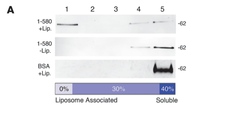

## Question

# Gene Research for Functional Annotation

## ⚠️ CRITICAL: Gene/Protein Identification Context

**BEFORE YOU BEGIN RESEARCH:** You MUST verify you are researching the CORRECT gene/protein. Gene symbols can be ambiguous, especially for less well-characterized genes from non-model organisms.

### Target Gene/Protein Identity (from UniProt):
- **UniProt Accession:** O15078
- **Protein Description:** RecName: Full=Centrosomal protein of 290 kDa; Short=Cep290; AltName: Full=Bardet-Biedl syndrome 14 protein; AltName: Full=Cancer/testis antigen 87; Short=CT87; AltName: Full=Nephrocystin-6; AltName: Full=Tumor antigen se2-2;
- **Gene Information:** Name=CEP290; Synonyms=BBS14, KIAA0373, NPHP6;
- **Organism (full):** Homo sapiens (Human).
- **Protein Family:** Not specified in UniProt
- **Key Domains:** Cep209_CC5. (IPR032321); Cep290. (IPR026201); Cep290_mid_CC. (IPR063631); Cep290_N. (IPR063695); CEP209_CC5 (PF16574)

### MANDATORY VERIFICATION STEPS:

1. **Check if the gene symbol "CEP290" matches the protein description above**
2. **Verify the organism is correct:** Homo sapiens (Human).
3. **Check if protein family/domains align with what you find in literature**
4. **If you find literature for a DIFFERENT gene with the same or similar symbol, STOP**

### If Gene Symbol is Ambiguous or You Cannot Find Relevant Literature:

**DO NOT PROCEED WITH RESEARCH ON A DIFFERENT GENE.** Instead:
- State clearly: "The gene symbol 'CEP290' is ambiguous or literature is limited for this specific protein"
- Explain what you found (e.g., "Found extensive literature on a different gene with the same symbol in a different organism")
- Describe the protein based ONLY on the UniProt information provided above
- Suggest that the protein function can be inferred from domain/family information

### Research Target:

Please provide a comprehensive research report on the gene **CEP290** (gene ID: CEP290, UniProt: O15078) in human.

The research report should be a detailed narrative explaining the function, biological processes, and localization of the gene product. Citations should be given for all claims.

You should prioritize authoritative reviews and primary scientific literature when conducting research. You can supplement
this with annotations you find in gene/protein databases, but these can be outdated or inaccurate.

We are specifically interested in the primary function of the gene - for enzymes, what reaction is catalyzed, and what is the substrate specificity? For transporters, what is the substrate? For structural proteins or adapters, what is the broader structural role? For signaling molecules, what is the role in the pathway.

We are interested in where in or outside the cell the gene product carries out its function.

We are also interested in the signaling or biochemical pathways in which the gene functions. We are less interested in broad pleiotropic effects, except where these elucidate the precise role.

Include evidence where possible. We are interested in both experimental evidence as well as inference from structure, evolution, or bioinformatic analysis. Precise studies should be prioritized over high-throughput, where available.

## Output

Question: You are an expert researcher providing comprehensive, well-cited information.

Provide detailed information focusing on:
1. Key concepts and definitions with current understanding
2. Recent developments and latest research (prioritize 2023-2024 sources)
3. Current applications and real-world implementations
4. Expert opinions and analysis from authoritative sources
5. Relevant statistics and data from recent studies

Format as a comprehensive research report with proper citations. Include URLs and publication dates where available.
Always prioritize recent, authoritative sources and provide specific citations for all major claims.

# Gene Research for Functional Annotation

## ⚠️ CRITICAL: Gene/Protein Identification Context

**BEFORE YOU BEGIN RESEARCH:** You MUST verify you are researching the CORRECT gene/protein. Gene symbols can be ambiguous, especially for less well-characterized genes from non-model organisms.

### Target Gene/Protein Identity (from UniProt):
- **UniProt Accession:** O15078
- **Protein Description:** RecName: Full=Centrosomal protein of 290 kDa; Short=Cep290; AltName: Full=Bardet-Biedl syndrome 14 protein; AltName: Full=Cancer/testis antigen 87; Short=CT87; AltName: Full=Nephrocystin-6; AltName: Full=Tumor antigen se2-2;
- **Gene Information:** Name=CEP290; Synonyms=BBS14, KIAA0373, NPHP6;
- **Organism (full):** Homo sapiens (Human).
- **Protein Family:** Not specified in UniProt
- **Key Domains:** Cep209_CC5. (IPR032321); Cep290. (IPR026201); Cep290_mid_CC. (IPR063631); Cep290_N. (IPR063695); CEP209_CC5 (PF16574)

### MANDATORY VERIFICATION STEPS:

1. **Check if the gene symbol "CEP290" matches the protein description above**
2. **Verify the organism is correct:** Homo sapiens (Human).
3. **Check if protein family/domains align with what you find in literature**
4. **If you find literature for a DIFFERENT gene with the same or similar symbol, STOP**

### If Gene Symbol is Ambiguous or You Cannot Find Relevant Literature:

**DO NOT PROCEED WITH RESEARCH ON A DIFFERENT GENE.** Instead:
- State clearly: "The gene symbol 'CEP290' is ambiguous or literature is limited for this specific protein"
- Explain what you found (e.g., "Found extensive literature on a different gene with the same symbol in a different organism")
- Describe the protein based ONLY on the UniProt information provided above
- Suggest that the protein function can be inferred from domain/family information

### Research Target:

Please provide a comprehensive research report on the gene **CEP290** (gene ID: CEP290, UniProt: O15078) in human.

The research report should be a detailed narrative explaining the function, biological processes, and localization of the gene product. Citations should be given for all claims.

You should prioritize authoritative reviews and primary scientific literature when conducting research. You can supplement
this with annotations you find in gene/protein databases, but these can be outdated or inaccurate.

We are specifically interested in the primary function of the gene - for enzymes, what reaction is catalyzed, and what is the substrate specificity? For transporters, what is the substrate? For structural proteins or adapters, what is the broader structural role? For signaling molecules, what is the role in the pathway.

We are interested in where in or outside the cell the gene product carries out its function.

We are also interested in the signaling or biochemical pathways in which the gene functions. We are less interested in broad pleiotropic effects, except where these elucidate the precise role.

Include evidence where possible. We are interested in both experimental evidence as well as inference from structure, evolution, or bioinformatic analysis. Precise studies should be prioritized over high-throughput, where available.

# Human CEP290: functional annotation and research report

## Identity and principal function

**Identity verified.** The subject is human **CEP290**, UniProt **[O15078](https://www.uniprot.org/uniprotkb/O15078/entry)**, also called **NPHP6**, **BBS14** and **KIAA0373**. The reported protein is approximately 290 kDa and 2,479 amino acids long. The CEP290/coiled-coil domain annotations supplied with the accession are consistent with a large architectural protein, not evidence that it belongs to an enzyme or transporter family. Here, *NPHP5/IQCB1* denotes a distinct protein that interacts with CEP290; results concerning similarly named CEP162 or CEP209 are not attributed to CEP290. Human renal-cell research independently identifies CEP290 as NPHP6 and a 290-kDa centrosomal protein, while biochemical experiments study human CEP290 through residue 2479. (srivastava2017ahumanpatientderived pages 1-2, drivas2013disruptionofcep290 pages 1-2, barbelanne2013pathogenicnphp5mutations pages 5-6)

**Primary functional annotation:** CEP290 is a **structural and protein-recruitment scaffold at the base of cilia**. It associates with both membranes and microtubules and helps organize the *transition zone*—the specialized interface between the mother-centriole-derived basal body and the ciliary axoneme. The transition zone contributes to maintaining the cilium as a distinct compartment with selected proteins. CEP290 has **no established catalytic reaction, enzymatic substrate, or transported substrate**; calling it a ciliary “gate” describes its contribution to gate architecture and protein localization, not a demonstrated pore or motor intrinsic to CEP290. (drivas2013disruptionofcep290 pages 4-7, moran2024transportandbarrier pages 5-6, moran2024transportandbarrier pages 3-5, park2022compositionorganizationand pages 6-8)

## Molecular mechanism: what has been demonstrated

In a primary structure–function study, purified **human CEP290 residues 1–580 bound liposomes directly**. Cell fractionation and membrane-isolation experiments localized strong *peripheral*, rather than integral, membrane association to residues **1–362**. A conserved predicted amphipathic helix at **257–292** offers a plausible membrane-binding element, although liposome binding by that isolated helix was not itself established. The cropped biochemical **Figure 3** shows liposome-dependent flotation of the N-terminal construct alongside the helix prediction and sequence alignment. [Drivas *et al.*, *Journal of Clinical Investigation*, October 2013](https://doi.org/10.1172/JCI69448). (drivas2013disruptionofcep290 pages 2-4, drivas2013disruptionofcep290 pages 4-7, drivas2013disruptionofcep290 media 95ca19b8)

A separate internal region, approximately **residues 1695–1966**, bound purified microtubules in concentration-dependent co-sedimentation experiments; the reported binding estimate was **Kd ≈100 nM** for the tested region. CEP290 fragments also associated with microtubule-containing fibers and increased microtubule bundling and acetylated-tubulin staining in cells. Its termini showed regulatory or autoinhibitory behavior in deletion and overexpression assays. Together these results support a *membrane–microtubule bridging model*, but fragment overexpression and purified-domain binding do not establish the full-length protein’s exact in-vivo geometry or binding stoichiometry. [Drivas *et al.*, October 2013](https://doi.org/10.1172/JCI69448). (drivas2013disruptionofcep290 pages 4-7, drivas2013disruptionofcep290 pages 10-12, drivas2013disruptionofcep290 pages 7-8)

The biochemical evidence is complemented by interaction mapping. **NPHP5/IQCB1 directly associates with CEP290**: reciprocal co-immunoprecipitation, far-western analysis and mutagenesis mapped an NPHP5-binding segment of CEP290 to **residues 790–816**. Depleting CEP290 impaired NPHP5 localization at centrosomes, whereas depleting NPHP5 did not similarly displace CEP290—evidence for an asymmetric assembly dependency. Separately, biochemical pull-downs in human cells and mouse retina associated CEP290’s N-terminal region with the **BBSome**, particularly BBS4; this supports cooperation with ciliary cargo-handling machinery, without implying that CEP290 itself transports cargo. [Barbelanne *et al.*, *Human Molecular Genetics*, June 2013](https://doi.org/10.1093/hmg/ddt100); [Zhang *et al.*, *Human Molecular Genetics*, 2014](https://doi.org/10.1093/hmg/ddt394). (barbelanne2013pathogenicnphp5mutations pages 5-6, zhang2014bbsmutationsmodify pages 2-4)

The following evidence map separates binding measurements, localization, genetic perturbations and early clinical translation.

| Functional feature | Direct observation and model | Interpretation and uncertainty | Source DOI + year | Citation IDs |
|---|---|---|---|---|
| Membrane binding | Purified human CEP290 aa 1–580 co-floated with liposomes; aa 1–362 was necessary and sufficient for peripheral-membrane association in hTERT-RPE1 cells. A conserved amphipathic helix at aa 257–292 was predicted. | **Direct biochemical/cellular evidence** for N-terminal membrane binding. The isolated helix itself was not shown to bind membranes directly, and truncation overexpression may not reproduce full-length regulation. | [10.1172/JCI69448](https://doi.org/10.1172/JCI69448), 2013 | (drivas2013disruptionofcep290 pages 4-7, drivas2013disruptionofcep290 media 95ca19b8) |
| Microtubule binding | Purified internal “region M” (aa 1695–1966) directly associated with microtubules in concentration-dependent co-sedimentation assays, with an estimated **Kd ≈100 nM**. | **Direct biochemical evidence** for an internal microtubule-binding region. Exact binding determinants and physiological full-length stoichiometry remain unresolved. | [10.1172/JCI69448](https://doi.org/10.1172/JCI69448), 2013 | (drivas2013disruptionofcep290 pages 4-7, drivas2013disruptionofcep290 pages 7-8) |
| Protein interactions | Reciprocal co-immunoprecipitation and far-western assays supported direct IQCB1/NPHP5–CEP290 association, mapping the NPHP5-binding site to CEP290 aa 790–816. Co-immunoprecipitation mapped BBSome binding to the CEP290 N-terminus and implicated BBS4. | **Direct interaction evidence** is strongest for IQCB1/NPHP5. CEP290–BBS4/BBSome association is biochemically supported, but complex context and exact binding stoichiometry remain uncertain. | [10.1093/hmg/ddt100](https://doi.org/10.1093/hmg/ddt100), 2013; [10.1093/hmg/ddt394](https://doi.org/10.1093/hmg/ddt394), 2014 | (barbelanne2013pathogenicnphp5mutations pages 5-6, zhang2014bbsmutationsmodify pages 2-4) |
| Cell-type-specific localization | Super-resolution microscopy placed CEP290 near axonemal doublets, between microtubules and membrane. It was restricted to the proximal transition zone in human RPE1 cilia but extended along the full mouse photoreceptor connecting cilium. | **Direct localization evidence** showing tissue specialization. Proximity to Y-links does not prove that CEP290 constitutes the anonymous densities visualized by electron microscopy. | [10.1172/jci.insight.145256](https://doi.org/10.1172/jci.insight.145256), 2021 | (potter2021superresolutionmicroscopyreveals pages 1-2) |
| Photoreceptor transition-zone architecture | In mouse Cep290 knockout photoreceptors, initial connecting cilia formed, but membrane architecture was abnormal; Y-links and the ciliary necklace became confined proximally. AHI1 and NPHP1 redistributed proximally, whereas NPHP8 and CEP89 were preserved. | **Genetic-loss and imaging evidence** supports maintenance/organization—not an absolute requirement for initial ciliogenesis. The data do not establish CEP290 as the molecular constituent of every Y-link or necklace bead. | [10.1242/jcs.263869](https://doi.org/10.1242/jcs.263869), 2025 | (moye2025subciliarylocalizationof pages 1-3) |
| Genotype-specific clinical translation | In BRILLIANCE, 14 participants received subretinal EDIT-101 targeting CEP290 IVS26. **9/14 (64%)** improved in at least one of visual acuity, red-light FST sensitivity, or mobility—not necessarily all outcomes; no treatment- or procedure-related serious adverse events or dose-limiting toxicities were recorded. | **Early phase 1–2 human evidence**, limited by small size, open-label design and no concurrent control. These findings do not establish efficacy or regulatory approval; EDIT-101 was investigational. | [10.1056/NEJMoa2309915](https://doi.org/10.1056/NEJMoa2309915), 2024 | (pierce2024geneeditingfor pages 1-3) |

*Table: Compact evidence map for human CEP290/O15078, distinguishing direct biochemical findings, model-dependent structural observations, and early clinical translation. It highlights key uncertainties to prevent overassigning CEP290 to anonymous transition-zone densities or overstating investigational efficacy.*

## Cellular location, cilium assembly and compartmentalization

**Site of action.** CEP290 is intracellular and concentrates at centrosomes, centriolar satellites, the ciliary basal body and transition zone. Super-resolution imaging positioned it near axonemal microtubule doublets, **between those doublets and the ciliary membrane**. Location differs by cell type: CEP290 was confined to the basal region of primary cilia in cultured **human RPE1** cells but extended along the **photoreceptor connecting cilium** in mouse retina. Thus, “transition-zone protein” does not imply an identical-length distribution in every human tissue. [Potter *et al.*, *JCI Insight*, October 2021](https://doi.org/10.1172/jci.insight.145256); [Moran *et al.*, *Nature Reviews Nephrology*, 2024](https://doi.org/10.1038/s41581-023-00773-2). (potter2021superresolutionmicroscopyreveals pages 1-2, moran2024transportandbarrier pages 5-6)

**Assembly and recruitment.** In cultured cells, CEP290–NPHP5 cooperation contributes to early ciliogenesis, including mother-centriole positioning or anchoring near the cell surface. SSX2IP depletion reduces CEP290 accumulation at the basal body and accompanies reduced ciliary BBSome entry, Rab8 accumulation and SSTR3 localization; these are cellular dependencies, **not proof that CEP290 directly binds Rab8 or SSTR3**. In vertebrate experiments, RPGRIP1L controls transition-zone CEP290 abundance and ciliary protein composition. A more specific CEP290-N-terminus→DZIP1→CBY/Rab8 transition-zone initiation sequence was demonstrated in **Drosophila**; its complete deletion phenotype should not be transferred unqualified to human photoreceptors. [Barbelanne *et al.*, 2013](https://doi.org/10.1093/hmg/ddt100); [Klinger *et al.*, *Molecular Biology of the Cell*, February 2014](https://doi.org/10.1091/mbc.e13-09-0526); [Wiegering *et al.*, *Molecular Biology of the Cell*, April 2021](https://doi.org/10.1091/mbc.e20-03-0190); [Wu *et al.*, *PLOS Biology*, December 2020](https://doi.org/10.1371/journal.pbio.3001034). (barbelanne2013pathogenicnphp5mutations pages 10-11, klinger2014thenovelcentriolar pages 1-2, wiegering2021rpgrip1lcontrolsciliary pages 1-2, wu2020cep290isessential pages 1-2)

**A structural gate, with an unresolved molecular mechanism.** Transition-zone *Y-links* join axonemal doublets to the surrounding membrane; the *ciliary necklace* is a repeated membrane-associated structure. Cryo-electron tomography of mouse photoreceptor cilia resolved continuous densities from doublet toward and through the membrane. In its architectural model, each broad Y-link occupies approximately **15°** of circumference, with approximately **25°** between neighboring links and **five globular surface ridges per link**. This 2024 structural result does **not** identify those densities as CEP290 molecules. [Zhang *et al.*, *Life Science Alliance*, 2024; accessible study DOI](https://doi.org/10.1101/2023.10.05.560879). (zhang2024centrioleandtransition pages 1-3, zhang2024centrioleandtransition pages 9-11)

More directly, a **2025 peer-reviewed mouse Cep290-knockout study** found that initial connecting cilia still formed, but their membranes were abnormal and Y-links and necklace structures became restricted largely to the proximal connecting cilium. AHI1 and NPHP1 redistributed proximally, whereas NPHP8 and CEP89 were relatively unaffected; outer-segment disc formation failed and extracellular vesicles accumulated. This refines a simple “CEP290 is universally required to make a cilium” description: in these photoreceptors, it is particularly important for **maturation, spatial organization and maintenance** of the specialized cilium and outer segment. Association with, and loss-dependent alteration of, Y-links does not prove that CEP290 comprises every Y-link. [Moye *et al.*, *Journal of Cell Science*, October 2025](https://doi.org/10.1242/jcs.263869); compare [Potter *et al.*, 2021](https://doi.org/10.1172/jci.insight.145256). (moye2025subciliarylocalizationof pages 1-3, moye2025subciliarylocalizationof pages 12-14, potter2021superresolutionmicroscopyreveals pages 1-2)

The authoritative transport-and-barrier review interprets CEP290 as an organizer within a **multicomponent** transition-zone system affecting selective membrane-protein localization. It explicitly leaves open the precise physical mechanism of the diffusion barrier and the direct role of Y-links in controlling soluble-protein passage. Accordingly, altered ciliary cargo distribution is a well-supported consequence of transition-zone defects, but **a specific CEP290-exclusive cargo, transport reaction or molecular pore has not been established**. [Moran *et al.*, *Nature Reviews Nephrology*, 2024](https://doi.org/10.1038/s41581-023-00773-2); [Park and Leroux, *EMBO Reports*, December 2022](https://doi.org/10.15252/embr.202255420). (moran2024transportandbarrier pages 5-6, moran2024transportandbarrier pages 3-5, park2022compositionorganizationand pages 6-8)

## Pathways and tissue-specific evidence

CEP290 acts **upstream of cilium-dependent signaling**, chiefly by establishing the architecture and composition needed for signaling proteins to occupy cilia. It is **not itself established as a Hedgehog receptor, Wnt-pathway enzyme or phototransduction catalyst**. Patient-derived, CEP290-deficient human renal epithelial cells had longer, disorganized cilia—approximately **7.7 μm versus 4.7 μm** in controls in one electron-microscopy comparison. CEP290 knockdown reproduced increased ciliary length; a Hedgehog-pathway agonist or CDK5 inhibition improved the patient-cell phenotype, while the measured GLI1 response was abnormal. These observations connect CEP290-dependent ciliary integrity to renal-cell Hedgehog responsiveness but do not show that CEP290 directly transduces Hedgehog signals. [Srivastava *et al.*, *Human Molecular Genetics*, September 2017](https://doi.org/10.1093/hmg/ddx347). (srivastava2017ahumanpatientderived pages 1-2, srivastava2017ahumanpatientderived pages 3-5)

A complementary **2025 human iPSC-derived brain-organoid** study found ventricular cilia with bulging membranes and splayed distal axonemal microtubules despite largely preserved organoid formation. TTR-positive choroid-plexus-like structures were observed in **11/43 CEP290-mutant versus 1/39 control organoids** in that experimental system. The authors found **no clear Hedgehog-pathway change** in their transcriptomic examination and did not establish a Wnt mechanism. This illustrates why signaling consequences should be reported as **tissue- and assay-dependent**, rather than treated as CEP290’s universal primary biochemical function. [Eschment *et al.*, *Journal of Cell Science*, October 2025](https://doi.org/10.1242/jcs.264092). (eschment2025cep290deficiencydisrupts pages 8-10, eschment2025cep290deficiencydisrupts pages 1-3, eschment2025cep290deficiencydisrupts pages 6-8)

## Human disease and practical applications

Biallelic pathogenic **CEP290** variants are associated with isolated severe early-onset retinal degeneration—often classified as **Leber congenital amaurosis type 10**—and with broader ciliopathies including **Joubert, Senior–Løken, Bardet–Biedl and Meckel–Gruber syndromes**. The spectrum fits differing requirements for ciliary architecture across photoreceptors, kidney and developing tissues; specific variant and tissue effects matter. The *rd16* mouse deletion disrupts the identified microtubule-binding region, impairs ciliation and produces retinal degeneration, but the deletion affects a larger sequence than a single minimal binding determinant, so it does not isolate one molecular defect as the cause of every human phenotype. [Drivas *et al.*, October 2013](https://doi.org/10.1172/JCI69448); [McDonald and Wijnholds, *International Journal of Molecular Sciences*, March 2024](https://doi.org/10.3390/ijms25052887). (drivas2013disruptionofcep290 pages 8-10, drivas2013disruptionofcep290 pages 1-2, mcdonald2024retinalciliopathiesand pages 7-8)

A clinically important **deep-intronic variant, c.2991+1655A>G**, activates cryptic-exon inclusion and reduces correctly expressed CEP290. The 2024 clinical report states that it occurs in **up to 77% of people with CEP290-associated inherited retinal degeneration in the United States**—*not* 77% of all retinal-disease patients or of the general population. Variant identification, splice analysis and patient-derived retinal organoids are practical ways of assessing this genotype-specific mechanism; experimental antisense correction has restored correctly spliced transcript and protein in patient-derived models. [Pierce *et al.*, *New England Journal of Medicine*, June 6, 2024](https://doi.org/10.1056/NEJMoa2309915); [Girach *et al.*, *Therapeutic Advances in Ophthalmology*, 2022](https://doi.org/10.1177/25158414221134602). (pierce2024geneeditingfor pages 1-3, girach2022rnabasedtherapiesin pages 8-10)

**Clinical translation remains investigational.** *Sepofarsen* is an intravitreal antisense oligonucleotide designed to suppress the variant-induced pseudoexon; despite encouraging earlier studies, the subsequent **36-participant randomized ILLUMINATE study did not meet its principal visual-acuity outcome**. *EDIT-101* instead uses subretinal AAV-delivered CRISPR components to excise the pathogenic intronic region. In the **2024 BRILLIANCE phase 1–2 report, 14 people received EDIT-101**: six improved on cone-mediated full-field stimulus testing, and **nine of 14 (64%)** improved on *at least one* of visual acuity, red-light sensitivity or mobility—not necessarily on every measure. No treatment- or procedure-related serious adverse events or dose-limiting toxic effects were reported in that small, open-label study. These results neither establish controlled efficacy nor amount to approval of a CEP290 therapy. [Ashworth *et al.*, *Genes*, May 2024](https://doi.org/10.3390/genes15060705); [Pierce *et al.*, June 6, 2024](https://doi.org/10.1056/NEJMoa2309915); [Bainbridge, accompanying *NEJM* editorial, June 2024](https://doi.org/10.1056/NEJMe2405256). Trial records: [ILLUMINATE, NCT03913143](https://clinicaltrials.gov/study/NCT03913143); [BRILLIANCE, NCT03872479](https://clinicaltrials.gov/study/NCT03872479). (ashworth2024inheritedretinaldiseases pages 4-5, pierce2024geneeditingfor pages 1-3, bainbridge2024successinsight pages 1-2)

**Conclusion.** The strongest functional assignment for human CEP290 is a **regulated ciliary membrane–microtubule scaffold and transition-zone assembly organizer**, with experimentally established binding surfaces and interactions, a specialized role across the photoreceptor connecting cilium, and indirect consequences for cargo compartmentalization and cilium-dependent signaling. The exact molecular composition of the Y-links, how CEP290’s full-length conformation is regulated in vivo, and which individual trafficking defects are primary remain important open questions. (drivas2013disruptionofcep290 pages 4-7, moran2024transportandbarrier pages 5-6, potter2021superresolutionmicroscopyreveals pages 1-2, moye2025subciliarylocalizationof pages 1-3)

References

1. (srivastava2017ahumanpatientderived pages 1-2): Shalabh Srivastava, Simon A Ramsbottom, Elisa Molinari, Sumaya Alkanderi, Andrew Filby, Kathryn White, Charline Henry, Sophie Saunier, Colin G Miles, and John A Sayer. A human patient-derived cellular model of joubert syndrome reveals ciliary defects which can be rescued with targeted therapies. Sep 2017. URL: https://doi.org/10.1093/hmg/ddx347, doi:10.1093/hmg/ddx347. This article has 84 citations and is from a domain leading peer-reviewed journal.

2. (drivas2013disruptionofcep290 pages 1-2): Theodore G. Drivas, Erika L.F. Holzbaur, and Jean Bennett. Disruption of cep290 microtubule/membrane-binding domains causes retinal degeneration. The Journal of clinical investigation, 123 10:4525-39, Oct 2013. URL: https://doi.org/10.1172/jci69448, doi:10.1172/jci69448. This article has 103 citations.

3. (barbelanne2013pathogenicnphp5mutations pages 5-6): Marine Barbelanne, Jenny Song, Mustafa Ahmadzai, and William Y. Tsang. Pathogenic nphp5 mutations impair protein interaction with cep290, a prerequisite for ciliogenesis. Human molecular genetics, 22 12:2482-94, Jun 2013. URL: https://doi.org/10.1093/hmg/ddt100, doi:10.1093/hmg/ddt100. This article has 92 citations and is from a domain leading peer-reviewed journal.

4. (drivas2013disruptionofcep290 pages 4-7): Theodore G. Drivas, Erika L.F. Holzbaur, and Jean Bennett. Disruption of cep290 microtubule/membrane-binding domains causes retinal degeneration. The Journal of clinical investigation, 123 10:4525-39, Oct 2013. URL: https://doi.org/10.1172/jci69448, doi:10.1172/jci69448. This article has 103 citations.

5. (moran2024transportandbarrier pages 5-6): Ailis L. Moran, Laura Louzao-Martinez, Dominic P. Norris, Dorien J. M. Peters, and Oliver E. Blacque. Transport and barrier mechanisms that regulate ciliary compartmentalization and ciliopathies. Nature Reviews Nephrology, 20:83-100, Oct 2024. URL: https://doi.org/10.1038/s41581-023-00773-2, doi:10.1038/s41581-023-00773-2. This article has 48 citations and is from a domain leading peer-reviewed journal.

6. (moran2024transportandbarrier pages 3-5): Ailis L. Moran, Laura Louzao-Martinez, Dominic P. Norris, Dorien J. M. Peters, and Oliver E. Blacque. Transport and barrier mechanisms that regulate ciliary compartmentalization and ciliopathies. Nature Reviews Nephrology, 20:83-100, Oct 2024. URL: https://doi.org/10.1038/s41581-023-00773-2, doi:10.1038/s41581-023-00773-2. This article has 48 citations and is from a domain leading peer-reviewed journal.

7. (park2022compositionorganizationand pages 6-8): Kwangjin Park and Michel R Leroux. Composition, organization and mechanisms of the transition zone, a gate for the cilium. EMBO reports, Nov 2022. URL: https://doi.org/10.15252/embr.202255420, doi:10.15252/embr.202255420. This article has 94 citations and is from a highest quality peer-reviewed journal.

8. (drivas2013disruptionofcep290 pages 2-4): Theodore G. Drivas, Erika L.F. Holzbaur, and Jean Bennett. Disruption of cep290 microtubule/membrane-binding domains causes retinal degeneration. The Journal of clinical investigation, 123 10:4525-39, Oct 2013. URL: https://doi.org/10.1172/jci69448, doi:10.1172/jci69448. This article has 103 citations.

9. (drivas2013disruptionofcep290 media 95ca19b8): Theodore G. Drivas, Erika L.F. Holzbaur, and Jean Bennett. Disruption of cep290 microtubule/membrane-binding domains causes retinal degeneration. The Journal of clinical investigation, 123 10:4525-39, Oct 2013. URL: https://doi.org/10.1172/jci69448, doi:10.1172/jci69448. This article has 103 citations.

10. (drivas2013disruptionofcep290 pages 10-12): Theodore G. Drivas, Erika L.F. Holzbaur, and Jean Bennett. Disruption of cep290 microtubule/membrane-binding domains causes retinal degeneration. The Journal of clinical investigation, 123 10:4525-39, Oct 2013. URL: https://doi.org/10.1172/jci69448, doi:10.1172/jci69448. This article has 103 citations.

11. (drivas2013disruptionofcep290 pages 7-8): Theodore G. Drivas, Erika L.F. Holzbaur, and Jean Bennett. Disruption of cep290 microtubule/membrane-binding domains causes retinal degeneration. The Journal of clinical investigation, 123 10:4525-39, Oct 2013. URL: https://doi.org/10.1172/jci69448, doi:10.1172/jci69448. This article has 103 citations.

12. (zhang2014bbsmutationsmodify pages 2-4): Yan Zhang, Seongjin Seo, Sajag Bhattarai, Kevin Bugge, Charles C. Searby, Qihong Zhang, Arlene V. Drack, Edwin M. Stone, and Val C. Sheffield. Bbs mutations modify phenotypic expression of cep290-related ciliopathies. Human molecular genetics, 23 1:40-51, Aug 2014. URL: https://doi.org/10.1093/hmg/ddt394, doi:10.1093/hmg/ddt394. This article has 107 citations and is from a domain leading peer-reviewed journal.

13. (potter2021superresolutionmicroscopyreveals pages 1-2): Valencia L. Potter, Abigail R. Moye, Michael A. Robichaux, and Theodore G. Wensel. Super-resolution microscopy reveals photoreceptor-specific subciliary location and function of ciliopathy-associated protein cep290. JCI Insight, Oct 2021. URL: https://doi.org/10.1172/jci.insight.145256, doi:10.1172/jci.insight.145256. This article has 30 citations and is from a domain leading peer-reviewed journal.

14. (moye2025subciliarylocalizationof pages 1-3): Abigail R. Moye, Michael A. Robichaux, Melina A. Agosto, Alexandre P. Moulin, Alexandra Graff-Meyer, Carlo Rivolta, and Theodore G. Wensel. Sub-ciliary localization of cep290 and effects of its loss in mouse photoreceptors during development. Journal of cell science, Jul 2025. URL: https://doi.org/10.1242/jcs.263869, doi:10.1242/jcs.263869. This article has 7 citations and is from a domain leading peer-reviewed journal.

15. (pierce2024geneeditingfor pages 1-3): Eric A. Pierce, Tomas S. Aleman, Kanishka T. Jayasundera, Bright S. Ashimatey, Keunpyo Kim, Alia Rashid, Michael C. Jaskolka, Rene L. Myers, Byron L. Lam, Steven T. Bailey, Jason I. Comander, Andreas K. Lauer, Albert M. Maguire, and Mark E. Pennesi. Gene editing for <i>cep290</i> -associated retinal degeneration. New England Journal of Medicine, 390:1972-1984, Jun 2024. URL: https://doi.org/10.1056/nejmoa2309915, doi:10.1056/nejmoa2309915. This article has 284 citations and is from a highest quality peer-reviewed journal.

16. (barbelanne2013pathogenicnphp5mutations pages 10-11): Marine Barbelanne, Jenny Song, Mustafa Ahmadzai, and William Y. Tsang. Pathogenic nphp5 mutations impair protein interaction with cep290, a prerequisite for ciliogenesis. Human molecular genetics, 22 12:2482-94, Jun 2013. URL: https://doi.org/10.1093/hmg/ddt100, doi:10.1093/hmg/ddt100. This article has 92 citations and is from a domain leading peer-reviewed journal.

17. (klinger2014thenovelcentriolar pages 1-2): Maren Klinger, Wenbo Wang, Stefanie Kuhns, Felix Bärenz, Stefanie Dräger-Meurer, Gislene Pereira, and Oliver J. Gruss. The novel centriolar satellite protein ssx2ip targets cep290 to the ciliary transition zone. Molecular Biology of the Cell, 25:495-507, Feb 2014. URL: https://doi.org/10.1091/mbc.e13-09-0526, doi:10.1091/mbc.e13-09-0526. This article has 78 citations and is from a domain leading peer-reviewed journal.

18. (wiegering2021rpgrip1lcontrolsciliary pages 1-2): Antonia Wiegering, Renate Dildrop, Christine Vesque, Hemant Khanna, Sylvie Schneider-Maunoury, and Christoph Gerhardt. Rpgrip1l controls ciliary gating by ensuring the proper amount of cep290 at the vertebrate transition zone. Molecular Biology of the Cell, 32:675-689, Apr 2021. URL: https://doi.org/10.1091/mbc.e20-03-0190, doi:10.1091/mbc.e20-03-0190. This article has 44 citations and is from a domain leading peer-reviewed journal.

19. (wu2020cep290isessential pages 1-2): Zhimao Wu, Nan Pang, Yingying Zhang, Huicheng Chen, Ying Peng, Jingyan Fu, and Qing Wei. Cep290 is essential for the initiation of ciliary transition zone assembly. PLOS Biology, 18:e3001034, Dec 2020. URL: https://doi.org/10.1371/journal.pbio.3001034, doi:10.1371/journal.pbio.3001034. This article has 70 citations and is from a highest quality peer-reviewed journal.

20. (zhang2024centrioleandtransition pages 1-3): Zhixian Zhang, Abigail Moye, Feng He, Muyuan Chen, Melina A. Agosto, and Theodore G. Wensel. Centriole and transition zone structures in photoreceptor cilia revealed by cryo-electron tomography. Life Science Alliance, Oct 2024. URL: https://doi.org/10.1101/2023.10.05.560879, doi:10.1101/2023.10.05.560879. This article has 20 citations and is from a peer-reviewed journal.

21. (zhang2024centrioleandtransition pages 9-11): Zhixian Zhang, Abigail Moye, Feng He, Muyuan Chen, Melina A. Agosto, and Theodore G. Wensel. Centriole and transition zone structures in photoreceptor cilia revealed by cryo-electron tomography. Life Science Alliance, Oct 2024. URL: https://doi.org/10.1101/2023.10.05.560879, doi:10.1101/2023.10.05.560879. This article has 20 citations and is from a peer-reviewed journal.

22. (moye2025subciliarylocalizationof pages 12-14): Abigail R. Moye, Michael A. Robichaux, Melina A. Agosto, Alexandre P. Moulin, Alexandra Graff-Meyer, Carlo Rivolta, and Theodore G. Wensel. Sub-ciliary localization of cep290 and effects of its loss in mouse photoreceptors during development. Journal of cell science, Jul 2025. URL: https://doi.org/10.1242/jcs.263869, doi:10.1242/jcs.263869. This article has 7 citations and is from a domain leading peer-reviewed journal.

23. (srivastava2017ahumanpatientderived pages 3-5): Shalabh Srivastava, Simon A Ramsbottom, Elisa Molinari, Sumaya Alkanderi, Andrew Filby, Kathryn White, Charline Henry, Sophie Saunier, Colin G Miles, and John A Sayer. A human patient-derived cellular model of joubert syndrome reveals ciliary defects which can be rescued with targeted therapies. Sep 2017. URL: https://doi.org/10.1093/hmg/ddx347, doi:10.1093/hmg/ddx347. This article has 84 citations and is from a domain leading peer-reviewed journal.

24. (eschment2025cep290deficiencydisrupts pages 8-10): Melanie Eschment, Olivier Mercey, Ellen M. Aarts, Ludovico Perego, Joana Figueiro-Silva, Michelle Mennel, Affef Abidi, Melanie Generali, Anita Rauch, Paul Guichard, Virginie Hamel, and Ruxandra Bachmann-Gagescu. <i>cep290</i> deficiency disrupts ciliary axonemal architecture in human ipsc-derived brain organoids. Journal of Cell Science, Oct 2025. URL: https://doi.org/10.1242/jcs.264092, doi:10.1242/jcs.264092. This article has 5 citations and is from a domain leading peer-reviewed journal.

25. (eschment2025cep290deficiencydisrupts pages 1-3): Melanie Eschment, Olivier Mercey, Ellen M. Aarts, Ludovico Perego, Joana Figueiro-Silva, Michelle Mennel, Affef Abidi, Melanie Generali, Anita Rauch, Paul Guichard, Virginie Hamel, and Ruxandra Bachmann-Gagescu. <i>cep290</i> deficiency disrupts ciliary axonemal architecture in human ipsc-derived brain organoids. Journal of Cell Science, Oct 2025. URL: https://doi.org/10.1242/jcs.264092, doi:10.1242/jcs.264092. This article has 5 citations and is from a domain leading peer-reviewed journal.

26. (eschment2025cep290deficiencydisrupts pages 6-8): Melanie Eschment, Olivier Mercey, Ellen M. Aarts, Ludovico Perego, Joana Figueiro-Silva, Michelle Mennel, Affef Abidi, Melanie Generali, Anita Rauch, Paul Guichard, Virginie Hamel, and Ruxandra Bachmann-Gagescu. <i>cep290</i> deficiency disrupts ciliary axonemal architecture in human ipsc-derived brain organoids. Journal of Cell Science, Oct 2025. URL: https://doi.org/10.1242/jcs.264092, doi:10.1242/jcs.264092. This article has 5 citations and is from a domain leading peer-reviewed journal.

27. (drivas2013disruptionofcep290 pages 8-10): Theodore G. Drivas, Erika L.F. Holzbaur, and Jean Bennett. Disruption of cep290 microtubule/membrane-binding domains causes retinal degeneration. The Journal of clinical investigation, 123 10:4525-39, Oct 2013. URL: https://doi.org/10.1172/jci69448, doi:10.1172/jci69448. This article has 103 citations.

28. (mcdonald2024retinalciliopathiesand pages 7-8): Andrew McDonald and Jan Wijnholds. Retinal ciliopathies and potential gene therapies: a focus on human ipsc-derived organoid models. International Journal of Molecular Sciences, 25:2887, Mar 2024. URL: https://doi.org/10.3390/ijms25052887, doi:10.3390/ijms25052887. This article has 15 citations.

29. (girach2022rnabasedtherapiesin pages 8-10): Aniz Girach, Isabelle Audo, David G. Birch, Rachel M. Huckfeldt, Byron L. Lam, Bart P. Leroy, Michel Michaelides, Stephen R. Russell, Juliana M.F. Sallum, Katarina Stingl, Stephen H. Tsang, and Paul Yang. Rna-based therapies in inherited retinal diseases. Therapeutic Advances in Ophthalmology, Jan 2022. URL: https://doi.org/10.1177/25158414221134602, doi:10.1177/25158414221134602. This article has 59 citations and is from a peer-reviewed journal.

30. (ashworth2024inheritedretinaldiseases pages 4-5): Kristen E. Ashworth, Jessica Weisbrod, and Brian G. Ballios. Inherited retinal diseases and retinal organoids as preclinical cell models for inherited retinal disease research. Genes, 15:705, May 2024. URL: https://doi.org/10.3390/genes15060705, doi:10.3390/genes15060705. This article has 22 citations.

31. (bainbridge2024successinsight pages 1-2): James W.B. Bainbridge. Success in sight for gene editing. The New England journal of medicine, 390 21:2025-2027, Jun 2024. URL: https://doi.org/10.1056/nejme2405256, doi:10.1056/nejme2405256. This article has 5 citations and is from a highest quality peer-reviewed journal.

## Artifacts

- [Edison artifact artifact-00](CEP290-deep-research-falcon_artifacts/artifact-00.md)

## Citations

1. potter2021superresolutionmicroscopyreveals pages 1-2
2. moye2025subciliarylocalizationof pages 1-3
3. pierce2024geneeditingfor pages 1-3
4. srivastava2017ahumanpatientderived pages 1-2
5. moran2024transportandbarrier pages 5-6
6. moran2024transportandbarrier pages 3-5
7. park2022compositionorganizationand pages 6-8
8. zhang2014bbsmutationsmodify pages 2-4
9. klinger2014thenovelcentriolar pages 1-2
10. zhang2024centrioleandtransition pages 1-3
11. zhang2024centrioleandtransition pages 9-11
12. moye2025subciliarylocalizationof pages 12-14
13. srivastava2017ahumanpatientderived pages 3-5
14. mcdonald2024retinalciliopathiesand pages 7-8
15. girach2022rnabasedtherapiesin pages 8-10
16. ashworth2024inheritedretinaldiseases pages 4-5
17. bainbridge2024successinsight pages 1-2
18. O15078
19. Drivas *et al.*, *Journal of Clinical Investigation*, October 2013
20. Drivas *et al.*, October 2013
21. Barbelanne *et al.*, *Human Molecular Genetics*, June 2013
22. Zhang *et al.*, *Human Molecular Genetics*, 2014
23. 10.1172/JCI69448
24. 10.1093/hmg/ddt100
25. 10.1093/hmg/ddt394
26. 10.1172/jci.insight.145256
27. 10.1242/jcs.263869
28. 10.1056/NEJMoa2309915
29. Potter *et al.*, *JCI Insight*, October 2021
30. Moran *et al.*, *Nature Reviews Nephrology*, 2024
31. Barbelanne *et al.*, 2013
32. Klinger *et al.*, *Molecular Biology of the Cell*, February 2014
33. Wiegering *et al.*, *Molecular Biology of the Cell*, April 2021
34. Wu *et al.*, *PLOS Biology*, December 2020
35. Zhang *et al.*, *Life Science Alliance*, 2024; accessible study DOI
36. Moye *et al.*, *Journal of Cell Science*, October 2025
37. Potter *et al.*, 2021
38. Park and Leroux, *EMBO Reports*, December 2022
39. Srivastava *et al.*, *Human Molecular Genetics*, September 2017
40. Eschment *et al.*, *Journal of Cell Science*, October 2025
41. McDonald and Wijnholds, *International Journal of Molecular Sciences*, March 2024
42. Pierce *et al.*, *New England Journal of Medicine*, June 6, 2024
43. Girach *et al.*, *Therapeutic Advances in Ophthalmology*, 2022
44. Ashworth *et al.*, *Genes*, May 2024
45. Pierce *et al.*, June 6, 2024
46. Bainbridge, accompanying *NEJM* editorial, June 2024
47. ILLUMINATE, NCT03913143
48. BRILLIANCE, NCT03872479
49. https://www.uniprot.org/uniprotkb/O15078/entry
50. https://doi.org/10.1172/JCI69448
51. https://doi.org/10.1093/hmg/ddt100
52. https://doi.org/10.1093/hmg/ddt394
53. https://doi.org/10.1172/jci.insight.145256
54. https://doi.org/10.1242/jcs.263869
55. https://doi.org/10.1056/NEJMoa2309915
56. https://doi.org/10.1038/s41581-023-00773-2
57. https://doi.org/10.1091/mbc.e13-09-0526
58. https://doi.org/10.1091/mbc.e20-03-0190
59. https://doi.org/10.1371/journal.pbio.3001034
60. https://doi.org/10.1101/2023.10.05.560879
61. https://doi.org/10.15252/embr.202255420
62. https://doi.org/10.1093/hmg/ddx347
63. https://doi.org/10.1242/jcs.264092
64. https://doi.org/10.3390/ijms25052887
65. https://doi.org/10.1177/25158414221134602
66. https://doi.org/10.3390/genes15060705
67. https://doi.org/10.1056/NEJMe2405256
68. https://clinicaltrials.gov/study/NCT03913143
69. https://clinicaltrials.gov/study/NCT03872479
70. https://doi.org/10.1093/hmg/ddx347,
71. https://doi.org/10.1172/jci69448,
72. https://doi.org/10.1093/hmg/ddt100,
73. https://doi.org/10.1038/s41581-023-00773-2,
74. https://doi.org/10.15252/embr.202255420,
75. https://doi.org/10.1093/hmg/ddt394,
76. https://doi.org/10.1172/jci.insight.145256,
77. https://doi.org/10.1242/jcs.263869,
78. https://doi.org/10.1056/nejmoa2309915,
79. https://doi.org/10.1091/mbc.e13-09-0526,
80. https://doi.org/10.1091/mbc.e20-03-0190,
81. https://doi.org/10.1371/journal.pbio.3001034,
82. https://doi.org/10.1101/2023.10.05.560879,
83. https://doi.org/10.1242/jcs.264092,
84. https://doi.org/10.3390/ijms25052887,
85. https://doi.org/10.1177/25158414221134602,
86. https://doi.org/10.3390/genes15060705,
87. https://doi.org/10.1056/nejme2405256,