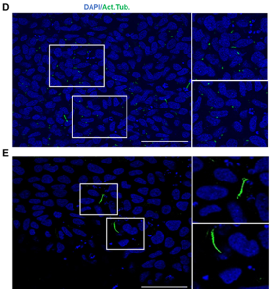

## Question

# Gene Research for Functional Annotation

## ⚠️ CRITICAL: Gene/Protein Identification Context

**BEFORE YOU BEGIN RESEARCH:** You MUST verify you are researching the CORRECT gene/protein. Gene symbols can be ambiguous, especially for less well-characterized genes from non-model organisms.

### Target Gene/Protein Identity (from UniProt):
- **UniProt Accession:** Q9Y592
- **Protein Description:** RecName: Full=Centrosomal protein of 83 kDa; Short=Cep83; AltName: Full=Coiled-coil domain-containing protein 41; AltName: Full=Renal carcinoma antigen NY-REN-58;
- **Gene Information:** Name=CEP83; Synonyms=CCDC41;
- **Organism (full):** Homo sapiens (Human).
- **Protein Family:** Belongs to the CEP83 family. .
- **Key Domains:** Centro_Cilium_Assembly. (IPR052116); CEP83_CC_1st. (IPR063547); CEP83_CC_2nd. (IPR063645); CEP83_CC_1st (PF30828); CEP83_CC_2nd (PF30835)

### MANDATORY VERIFICATION STEPS:

1. **Check if the gene symbol "CEP83" matches the protein description above**
2. **Verify the organism is correct:** Homo sapiens (Human).
3. **Check if protein family/domains align with what you find in literature**
4. **If you find literature for a DIFFERENT gene with the same or similar symbol, STOP**

### If Gene Symbol is Ambiguous or You Cannot Find Relevant Literature:

**DO NOT PROCEED WITH RESEARCH ON A DIFFERENT GENE.** Instead:
- State clearly: "The gene symbol 'CEP83' is ambiguous or literature is limited for this specific protein"
- Explain what you found (e.g., "Found extensive literature on a different gene with the same symbol in a different organism")
- Describe the protein based ONLY on the UniProt information provided above
- Suggest that the protein function can be inferred from domain/family information

### Research Target:

Please provide a comprehensive research report on the gene **CEP83** (gene ID: CEP83, UniProt: Q9Y592) in human.

The research report should be a detailed narrative explaining the function, biological processes, and localization of the gene product. Citations should be given for all claims.

You should prioritize authoritative reviews and primary scientific literature when conducting research. You can supplement
this with annotations you find in gene/protein databases, but these can be outdated or inaccurate.

We are specifically interested in the primary function of the gene - for enzymes, what reaction is catalyzed, and what is the substrate specificity? For transporters, what is the substrate? For structural proteins or adapters, what is the broader structural role? For signaling molecules, what is the role in the pathway.

We are interested in where in or outside the cell the gene product carries out its function.

We are also interested in the signaling or biochemical pathways in which the gene functions. We are less interested in broad pleiotropic effects, except where these elucidate the precise role.

Include evidence where possible. We are interested in both experimental evidence as well as inference from structure, evolution, or bioinformatic analysis. Precise studies should be prioritized over high-throughput, where available.

## Output

Question: You are an expert researcher providing comprehensive, well-cited information.

Provide detailed information focusing on:
1. Key concepts and definitions with current understanding
2. Recent developments and latest research (prioritize 2023-2024 sources)
3. Current applications and real-world implementations
4. Expert opinions and analysis from authoritative sources
5. Relevant statistics and data from recent studies

Format as a comprehensive research report with proper citations. Include URLs and publication dates where available.
Always prioritize recent, authoritative sources and provide specific citations for all major claims.

# Gene Research for Functional Annotation

## ⚠️ CRITICAL: Gene/Protein Identification Context

**BEFORE YOU BEGIN RESEARCH:** You MUST verify you are researching the CORRECT gene/protein. Gene symbols can be ambiguous, especially for less well-characterized genes from non-model organisms.

### Target Gene/Protein Identity (from UniProt):
- **UniProt Accession:** Q9Y592
- **Protein Description:** RecName: Full=Centrosomal protein of 83 kDa; Short=Cep83; AltName: Full=Coiled-coil domain-containing protein 41; AltName: Full=Renal carcinoma antigen NY-REN-58;
- **Gene Information:** Name=CEP83; Synonyms=CCDC41;
- **Organism (full):** Homo sapiens (Human).
- **Protein Family:** Belongs to the CEP83 family. .
- **Key Domains:** Centro_Cilium_Assembly. (IPR052116); CEP83_CC_1st. (IPR063547); CEP83_CC_2nd. (IPR063645); CEP83_CC_1st (PF30828); CEP83_CC_2nd (PF30835)

### MANDATORY VERIFICATION STEPS:

1. **Check if the gene symbol "CEP83" matches the protein description above**
2. **Verify the organism is correct:** Homo sapiens (Human).
3. **Check if protein family/domains align with what you find in literature**
4. **If you find literature for a DIFFERENT gene with the same or similar symbol, STOP**

### If Gene Symbol is Ambiguous or You Cannot Find Relevant Literature:

**DO NOT PROCEED WITH RESEARCH ON A DIFFERENT GENE.** Instead:
- State clearly: "The gene symbol 'CEP83' is ambiguous or literature is limited for this specific protein"
- Explain what you found (e.g., "Found extensive literature on a different gene with the same symbol in a different organism")
- Describe the protein based ONLY on the UniProt information provided above
- Suggest that the protein function can be inferred from domain/family information

### Research Target:

Please provide a comprehensive research report on the gene **CEP83** (gene ID: CEP83, UniProt: Q9Y592) in human.

The research report should be a detailed narrative explaining the function, biological processes, and localization of the gene product. Citations should be given for all claims.

You should prioritize authoritative reviews and primary scientific literature when conducting research. You can supplement
this with annotations you find in gene/protein databases, but these can be outdated or inaccurate.

We are specifically interested in the primary function of the gene - for enzymes, what reaction is catalyzed, and what is the substrate specificity? For transporters, what is the substrate? For structural proteins or adapters, what is the broader structural role? For signaling molecules, what is the role in the pathway.

We are interested in where in or outside the cell the gene product carries out its function.

We are also interested in the signaling or biochemical pathways in which the gene functions. We are less interested in broad pleiotropic effects, except where these elucidate the precise role.

Include evidence where possible. We are interested in both experimental evidence as well as inference from structure, evolution, or bioinformatic analysis. Precise studies should be prioritized over high-throughput, where available.

# Human CEP83 (Q9Y592): functional annotation and research report

**Identity verified.** The target is human **CEP83**, also called **CCDC41**, encoding the centrosomal protein of approximately 83 kDa—not the similarly named CEP89 or other centriole proteins. A human CEP83 study explicitly identifies UniProt **Q9Y592** and predicts two conserved coiled-coil regions; experimental work describes a 701-residue, predominantly coiled-coil protein. This agrees with the supplied CEP83-family and *Centro_Cilium_Assembly* annotations. The coiled coils support a structural role, but do not, on their own, establish precisely how CEP83 attaches to membrane. (kanie2025ahierarchicalpathway pages 5-8, failler2014mutationsofcep83 pages 3-5, lo2019phosphorylationofcep83 pages 1-2)

## Primary function and location

**CEP83 is an architectural organizer of the distal appendages of the mature mother centriole.** These ninefold-arranged projections become the transition fibers at the base of a primary cilium and enable the centriole to dock to a preciliary vesicle or the plasma membrane. CEP83 operates principally **inside the cell at the distal end of the mother centriole**, and remains near the basal body when a cilium forms; it is not distributed along the ciliary axoneme. A second, Golgi-associated CEP83/CCDC41 staining pool was reported in human retinal pigment epithelial cells, although its functional significance is less securely established than the centriolar pool. CEP83 is best annotated as a **structural scaffold/adaptor**, not an enzyme, transporter, or extracellular protein: no catalytic reaction or transported substrate is established. (joo2013ccdc41isrequired pages 1-3, kanie2025ahierarchicalpathway pages 1-5, joo2013ccdc41isrequired pages 4-5)

The experimentally supported assembly sequence is **distal-centriole organizers → CEP83 → other appendage components → membrane docking and cilium initiation**. In human cell experiments, loss of CEP83 prevents centriolar accumulation of SCLT1, CEP89, CEP164 and FBF1 without simply reducing their overall abundance. Loss-of-function and rescue experiments show loss and recovery, respectively, of appendage organization, preciliary-vesicle docking and ciliation. Electron microscopy in polarized kidney-derived cells further shows that CEP83-depleted centrioles approach the apical cortex but fail to dock to its membrane. Thus, CEP83 is required to build a docking-competent structure; these experiments do **not** establish that CEP83 itself binds lipid membranes directly. (tanos2013centrioledistalappendages pages 2-3, lo2019phosphorylationofcep83 pages 6-8, tanos2013centrioledistalappendages pages 3-4)

An upstream layer refines the description of CEP83 as the “first” appendage protein: a distal-centriolar complex containing CEP90, MNR and OFD1 recruits CEP83 before the CEP83-dependent appendage hierarchy. Thus, “upstream” refers to CEP83’s position **within appendage assembly**, not to its being the first protein recruited to a centriole. The relevant primary papers are Kumar *et al.*, *Journal of Cell Biology* (**July 2021**), https://doi.org/10.1083/jcb.202011133, and Le Borgne *et al.*, *PLOS Biology* (**September 2022**), https://doi.org/10.1371/journal.pbio.3001782. (mansour2021theroleof pages 7-9)

There is evidence that the scaffold is spatially extended, but its exact molecular conformation remains a model. In a super-resolution study of human retinal pigment epithelial cells, antibodies recognizing different regions of CEP83 gave ring diameters of **308.6 ± 4.9 nm** and **513.4 ± 9.0 nm**. Together with the predicted long coiled coils, this is consistent with CEP83 spanning part of an appendage; antibody geometry and other interpretations must be considered. The directly accessible version of this study is Kanie *et al.*, **bioRxiv preprint posted 10 January 2023**, https://doi.org/10.1101/2023.01.06.522944; its preprint findings should not be presented as a verified 2023 peer-reviewed structural determination. (kanie2025ahierarchicalpathway pages 5-8, kanie2025ahierarchicalpathway pages 1-5)

## Molecular pathway and experimental evidence

At ciliogenesis onset, CEP83-dependent appendages position proteins and membranes for several linked but distinguishable events. CEP164 recruits the kinase **TTBK2** to the appendages; TTBK2 phosphorylates CEP83, facilitating preciliary-vesicle docking and subsequent removal of the inhibitory **CP110** cap. This permits transition-zone assembly and axoneme growth. In human-cell biochemical experiments, purified TTBK2 phosphorylated CEP83, and mass spectrometry identified CEP83 **Ser29, Thr292, Thr527 and Ser698** as TTBK2-associated sites. In CEP83-knockout rescue experiments, a four-site nonphosphorylatable CEP83 mutant impaired ciliation, vesicle association and CP110 removal relative to wild-type protein, whereas a phosphomimetic supported these events. Importantly, phosphorylation-state mutants did **not** comparably disrupt appendage-protein assembly or initial TTBK2/IFT88 recruitment: phosphorylation regulates an early *functional step after scaffold assembly*, rather than simply creating the appendage. Lo *et al.*, *Journal of Cell Biology*, **27 August 2019**, https://doi.org/10.1083/jcb.201811142. (lo2019phosphorylationofcep83 pages 1-2, lo2019phosphorylationofcep83 pages 4-6, lo2019phosphorylationofcep83 pages 6-8, lo2019phosphorylationofcep83 pages 8-10)

The vesicle-trafficking connection is supported independently by CCDC41/CEP83–IFT20 co-immunoprecipitation, Golgi colocalization and reduced centrosomal IFT20 upon CEP83 depletion. In that 2013 study, CEP83 or IFT20 depletion reduced centriole-associated preciliary vesicles, whereas IFT88 depletion blocked later cilium formation without equivalently preventing early vesicle association. The authors proposed that CEP83 and IFT20 coordinate Golgi-to-centrosome traffic, but those localization and interaction experiments do not prove that CEP83 itself transports vesicles. Joo *et al.*, *PNAS*, **9 April 2013**, https://doi.org/10.1073/pnas.1220927110. (joo2013ccdc41isrequired pages 4-5, joo2013ccdc41isrequired pages 3-4)

The relevant signaling role is therefore primarily **enabling a cilium to form and function as a signaling compartment**, not directly transmitting an identified ligand signal. Ciliary Hedgehog signaling is one downstream example, but assigning CEP83 a direct Hedgehog-pathway enzymatic activity would exceed the evidence. Kanie and colleagues’ appendage-hierarchy analysis separates vesicle recruitment, intraflagellar-transport recruitment/initiation and CP110 removal, finding that the CEP83–SCLT1 backbone has broad structural importance while CEP89 has a narrower vesicle-recruitment role. These distinctions also caution against treating every CEP83-dependent process as a direct binding activity of CEP83. (kanie2025ahierarchicalpathway pages 1-5, kanie2025ahierarchicalpathway pages 8-11)

## Developments prioritized from 2023–2024

**2024 functional comparison.** Je and Ko experimentally depleted distal-appendage proteins in mouse NIH3T3 cells. CEP83, SCLT1 and CEP164 depletion **markedly lowered ciliation and disrupted basal-body membrane anchoring by electron microscopy**; CEP89 and FBF1 depletion did not comparably impair initial assembly in that system and instead delayed disassembly. The distinction strengthens the interpretation of CEP83 as primarily an *assembly/docking* factor, not principally a ciliary-disassembly regulator. These mouse-cell results should not be mistaken for a quantitative human CEP83 cohort. Je and Ko, *Cell Communication and Signaling*, **December 2024**, https://doi.org/10.1186/s12964-024-01962-7. (je2024distinctrolesof pages 3-5, je2024distinctrolesof pages 1-2)

**2023 architectural model and subsequent mechanistic clarification.** The Kanie *et al.* hierarchy work, available here as the **10 January 2023 preprint**, used human-cell knockouts and super-resolution microscopy to suggest that CEP83 and SCLT1 form an interdependent architectural module; this refines the simpler, one-way recruitment diagram obtained with earlier knockdowns. The distinction matters because residual protein after RNA interference can conceal reciprocal dependencies. https://doi.org/10.1101/2023.01.06.522944. A related **peer-reviewed article published 30 January 2025** identified myristoylated NCS1 downstream of CEP89 as a vesicle-capture factor. This suggests a more specific membrane-contact mechanism **downstream of the CEP83 scaffold**, not a demonstrated lipid-binding activity of CEP83 itself. Kanie *et al.*, *eLife*, https://doi.org/10.7554/eLife.85998. (kanie2025ahierarchicalpathway pages 8-11, kanie2025myristoylatedneuronalcalcium pages 1-2)

**Current interpretive boundary.** A 2023 review distinguishes distal appendages, which initiate ciliation, from subdistal appendages, which have other prominent centrosomal roles; it is a useful synthesis but not a substitute for the depletion and rescue experiments above. Ma *et al.*, *Journal of Cell Science*, **February 2023**, https://doi.org/10.1242/jcs.260560. (kanie2025ahierarchicalpathway pages 1-5, tanos2013centrioledistalappendages pages 2-3)

## Human disease, applications and quantitative observations

Human genetics independently validates the importance of this apparatus. Failler *et al.* identified **biallelic CEP83 variants in eight affected individuals from seven families** while screening individuals with nephronophthisis-related ciliopathy. All eight had early-onset renal disease and reached kidney failure at **1–4 years** in the reported cohort; **four of eight** had learning disability and/or hydrocephalus. Patient fibroblasts showed reduced centriolar CEP83 and abnormal CEP164 organization, and affected kidney tissue showed reduced CEP164-positive centrosomes (**50.1% versus 83.6% in controls** in the reported comparison). These observations directly connect CEP83 variation to appendage defects but should not be extrapolated into population-wide penetrance estimates. Failler *et al.*, *American Journal of Human Genetics*, **5 June 2014**, https://doi.org/10.1016/j.ajhg.2014.05.002. (failler2014mutationsofcep83 pages 1-2, failler2014mutationsofcep83 pages 5-8)

The phenotype is **not restricted to infantile kidney failure**: two unrelated children with biallelic CEP83 variants were described with retinal dystrophy or retinitis pigmentosa and **without impaired kidney function during childhood**. The authors advocate including CEP83 on inherited-retinal-disease diagnostic panels; an initially normal renal assessment should therefore not automatically exclude CEP83-related disease. This is an application in molecular diagnosis and clinical surveillance, **not** an established CEP83-targeted therapy. Veldman *et al.*, *American Journal of Medical Genetics Part A*, **2021**, https://doi.org/10.1002/ajmg.a.62225. (veldman2021beyondnephronophthisisretinal pages 1-2, veldman2021beyondnephronophthisisretinal pages 2-4)

Human kidney-lineage models provide an additional, experimentally tractable application. Across three independent CEP83-knockout and three control induced-pluripotent-stem-cell clones, **day-7 ciliation fell from about 30% to below 10%**; the cilia that remained were longer (**5–13 µm versus 2–5 µm** in controls). Knockout cells expressed fewer nephron-progenitor markers and later failed to generate recognizable nephron structures in organoids, instead showing broader lateral-plate-mesoderm programs. Hedgehog-associated transcripts were altered, but the study explicitly leaves open whether abnormal cilia or Hedgehog signaling *causes* the cell-fate change. The results therefore broaden CEP83’s developmental relevance without establishing a separate direct signaling reaction. Mansour *et al.*, *eLife*, **October 2022**, https://doi.org/10.7554/eLife.80165. **Cropped experimental images and quantification from its Figure 2** support the day-7 comparison. (mansour2022thecentrosomalprotein pages 2-5, mansour2022thecentrosomalprotein pages 9-12, mansour2022thecentrosomalprotein pages 12-14, mansour2022thecentrosomalprotein media 9c01894a)

**Functional-annotation conclusion:** Human CEP83/Q9Y592 is a coiled-coil, mother-centriole distal-appendage organizer. Its best-supported direct role is to establish and regulate the appendage scaffold that makes early ciliary membrane docking possible; CEP164-recruited TTBK2 phosphorylation then helps convert that structural platform into a ciliogenesis-competent site. Defective docking, CP110 removal, ciliation and cilium-dependent developmental signaling explain the renal, retinal and neurological associations more securely than do claims of direct membrane transport, an intrinsic kinase activity or a single dedicated downstream signaling pathway. (tanos2013centrioledistalappendages pages 2-3, lo2019phosphorylationofcep83 pages 6-8, je2024distinctrolesof pages 3-5, failler2014mutationsofcep83 pages 1-2)

References

1. (kanie2025ahierarchicalpathway pages 5-8): Tomoharu Kanie, Julia F. Love, Saxton D. Fisher, Anna-Karin Gustavsson, and Peter K. Jackson. A hierarchical pathway for assembly of the distal appendages that organize primary cilia. bioRxiv, Jan 2025. URL: https://doi.org/10.1101/2023.01.06.522944, doi:10.1101/2023.01.06.522944. This article has 37 citations.

2. (failler2014mutationsofcep83 pages 3-5): Marion Failler, Heon Yung Gee, Pauline Krug, Kwangsic Joo, Jan Halbritter, Lilya Belkacem, Emilie Filhol, Jonathan D. Porath, Daniela A. Braun, Markus Schueler, Amandine Frigo, Olivier Alibeu, Cécile Masson, Karine Brochard, Bruno Hurault de Ligny, Robert Novo, Christine Pietrement, Hulya Kayserili, Rémi Salomon, Marie-Claire Gubler, Edgar A. Otto, Corinne Antignac, Joon Kim, Alexandre Benmerah, Friedhelm Hildebrandt, and Sophie Saunier. Mutations of cep83 cause infantile nephronophthisis and intellectual disability. American journal of human genetics, 94 6:905-14, Jun 2014. URL: https://doi.org/10.1016/j.ajhg.2014.05.002, doi:10.1016/j.ajhg.2014.05.002. This article has 146 citations and is from a highest quality peer-reviewed journal.

3. (lo2019phosphorylationofcep83 pages 1-2): Chien-Hui Lo, I-Hsuan Lin, T. Tony Yang, Yen-Chun Huang, Barbara E. Tanos, Po-Chun Chou, Chih-Wei Chang, Yeou-Guang Tsay, Jung-Chi Liao, and Won-Jing Wang. Phosphorylation of cep83 by ttbk2 is necessary for cilia initiation. The Journal of Cell Biology, 218:3489-3505, Aug 2019. URL: https://doi.org/10.1083/jcb.201811142, doi:10.1083/jcb.201811142. This article has 58 citations.

4. (joo2013ccdc41isrequired pages 1-3): Kwangsic Joo, Chang Gun Kim, Mi-Sun Lee, Hyun-Yi Moon, Sang-Hee Lee, Mi Jeong Kim, Hee-Seok Kweon, Woong-Yang Park, Cheol-Hee Kim, Joseph G. Gleeson, and Joon Kim. Ccdc41 is required for ciliary vesicle docking to the mother centriole. Proceedings of the National Academy of Sciences, 110:5987-5992, Mar 2013. URL: https://doi.org/10.1073/pnas.1220927110, doi:10.1073/pnas.1220927110. This article has 202 citations and is from a highest quality peer-reviewed journal.

5. (kanie2025ahierarchicalpathway pages 1-5): Tomoharu Kanie, Julia F. Love, Saxton D. Fisher, Anna-Karin Gustavsson, and Peter K. Jackson. A hierarchical pathway for assembly of the distal appendages that organize primary cilia. bioRxiv, Jan 2025. URL: https://doi.org/10.1101/2023.01.06.522944, doi:10.1101/2023.01.06.522944. This article has 37 citations.

6. (joo2013ccdc41isrequired pages 4-5): Kwangsic Joo, Chang Gun Kim, Mi-Sun Lee, Hyun-Yi Moon, Sang-Hee Lee, Mi Jeong Kim, Hee-Seok Kweon, Woong-Yang Park, Cheol-Hee Kim, Joseph G. Gleeson, and Joon Kim. Ccdc41 is required for ciliary vesicle docking to the mother centriole. Proceedings of the National Academy of Sciences, 110:5987-5992, Mar 2013. URL: https://doi.org/10.1073/pnas.1220927110, doi:10.1073/pnas.1220927110. This article has 202 citations and is from a highest quality peer-reviewed journal.

7. (tanos2013centrioledistalappendages pages 2-3): Barbara E. Tanos, Hui-Ju Yang, Rajesh Soni, Won-Jing Wang, Frank P. Macaluso, John M. Asara, and Meng-Fu Bryan Tsou. Centriole distal appendages promote membrane docking, leading to cilia initiation. Genes & development, 27 2:163-8, Jan 2013. URL: https://doi.org/10.1101/gad.207043.112, doi:10.1101/gad.207043.112. This article has 529 citations and is from a highest quality peer-reviewed journal.

8. (lo2019phosphorylationofcep83 pages 6-8): Chien-Hui Lo, I-Hsuan Lin, T. Tony Yang, Yen-Chun Huang, Barbara E. Tanos, Po-Chun Chou, Chih-Wei Chang, Yeou-Guang Tsay, Jung-Chi Liao, and Won-Jing Wang. Phosphorylation of cep83 by ttbk2 is necessary for cilia initiation. The Journal of Cell Biology, 218:3489-3505, Aug 2019. URL: https://doi.org/10.1083/jcb.201811142, doi:10.1083/jcb.201811142. This article has 58 citations.

9. (tanos2013centrioledistalappendages pages 3-4): Barbara E. Tanos, Hui-Ju Yang, Rajesh Soni, Won-Jing Wang, Frank P. Macaluso, John M. Asara, and Meng-Fu Bryan Tsou. Centriole distal appendages promote membrane docking, leading to cilia initiation. Genes & development, 27 2:163-8, Jan 2013. URL: https://doi.org/10.1101/gad.207043.112, doi:10.1101/gad.207043.112. This article has 529 citations and is from a highest quality peer-reviewed journal.

10. (mansour2021theroleof pages 7-9): Fatma Mansour, Felix J. Boivin, Iman B. Shaheed, Markus Schueler, and Kai M. Schmidt-Ott. The role of centrosome distal appendage proteins (daps) in nephronophthisis and ciliogenesis. International Journal of Molecular Sciences, 22:12253, Nov 2021. URL: https://doi.org/10.3390/ijms222212253, doi:10.3390/ijms222212253. This article has 32 citations.

11. (lo2019phosphorylationofcep83 pages 4-6): Chien-Hui Lo, I-Hsuan Lin, T. Tony Yang, Yen-Chun Huang, Barbara E. Tanos, Po-Chun Chou, Chih-Wei Chang, Yeou-Guang Tsay, Jung-Chi Liao, and Won-Jing Wang. Phosphorylation of cep83 by ttbk2 is necessary for cilia initiation. The Journal of Cell Biology, 218:3489-3505, Aug 2019. URL: https://doi.org/10.1083/jcb.201811142, doi:10.1083/jcb.201811142. This article has 58 citations.

12. (lo2019phosphorylationofcep83 pages 8-10): Chien-Hui Lo, I-Hsuan Lin, T. Tony Yang, Yen-Chun Huang, Barbara E. Tanos, Po-Chun Chou, Chih-Wei Chang, Yeou-Guang Tsay, Jung-Chi Liao, and Won-Jing Wang. Phosphorylation of cep83 by ttbk2 is necessary for cilia initiation. The Journal of Cell Biology, 218:3489-3505, Aug 2019. URL: https://doi.org/10.1083/jcb.201811142, doi:10.1083/jcb.201811142. This article has 58 citations.

13. (joo2013ccdc41isrequired pages 3-4): Kwangsic Joo, Chang Gun Kim, Mi-Sun Lee, Hyun-Yi Moon, Sang-Hee Lee, Mi Jeong Kim, Hee-Seok Kweon, Woong-Yang Park, Cheol-Hee Kim, Joseph G. Gleeson, and Joon Kim. Ccdc41 is required for ciliary vesicle docking to the mother centriole. Proceedings of the National Academy of Sciences, 110:5987-5992, Mar 2013. URL: https://doi.org/10.1073/pnas.1220927110, doi:10.1073/pnas.1220927110. This article has 202 citations and is from a highest quality peer-reviewed journal.

14. (kanie2025ahierarchicalpathway pages 8-11): Tomoharu Kanie, Julia F. Love, Saxton D. Fisher, Anna-Karin Gustavsson, and Peter K. Jackson. A hierarchical pathway for assembly of the distal appendages that organize primary cilia. bioRxiv, Jan 2025. URL: https://doi.org/10.1101/2023.01.06.522944, doi:10.1101/2023.01.06.522944. This article has 37 citations.

15. (je2024distinctrolesof pages 3-5): Su-yeon Je and Hyuk Wan Ko. Distinct roles of centriole distal appendage proteins in ciliary assembly and disassembly. Cell Communication and Signaling : CCS, Dec 2024. URL: https://doi.org/10.1186/s12964-024-01962-7, doi:10.1186/s12964-024-01962-7. This article has 1 citations.

16. (je2024distinctrolesof pages 1-2): Su-yeon Je and Hyuk Wan Ko. Distinct roles of centriole distal appendage proteins in ciliary assembly and disassembly. Cell Communication and Signaling : CCS, Dec 2024. URL: https://doi.org/10.1186/s12964-024-01962-7, doi:10.1186/s12964-024-01962-7. This article has 1 citations.

17. (kanie2025myristoylatedneuronalcalcium pages 1-2): Tomoharu Kanie, Roy Ng, Keene L Abbott, Niaj Mohammad Tanvir, Esben Lorentzen, Olaf Pongs, and Peter K Jackson. Myristoylated neuronal calcium sensor-1 captures the preciliary vesicle at distal appendages. eLife, Jan 2025. URL: https://doi.org/10.7554/elife.85998, doi:10.7554/elife.85998. This article has 6 citations and is from a domain leading peer-reviewed journal.

18. (failler2014mutationsofcep83 pages 1-2): Marion Failler, Heon Yung Gee, Pauline Krug, Kwangsic Joo, Jan Halbritter, Lilya Belkacem, Emilie Filhol, Jonathan D. Porath, Daniela A. Braun, Markus Schueler, Amandine Frigo, Olivier Alibeu, Cécile Masson, Karine Brochard, Bruno Hurault de Ligny, Robert Novo, Christine Pietrement, Hulya Kayserili, Rémi Salomon, Marie-Claire Gubler, Edgar A. Otto, Corinne Antignac, Joon Kim, Alexandre Benmerah, Friedhelm Hildebrandt, and Sophie Saunier. Mutations of cep83 cause infantile nephronophthisis and intellectual disability. American journal of human genetics, 94 6:905-14, Jun 2014. URL: https://doi.org/10.1016/j.ajhg.2014.05.002, doi:10.1016/j.ajhg.2014.05.002. This article has 146 citations and is from a highest quality peer-reviewed journal.

19. (failler2014mutationsofcep83 pages 5-8): Marion Failler, Heon Yung Gee, Pauline Krug, Kwangsic Joo, Jan Halbritter, Lilya Belkacem, Emilie Filhol, Jonathan D. Porath, Daniela A. Braun, Markus Schueler, Amandine Frigo, Olivier Alibeu, Cécile Masson, Karine Brochard, Bruno Hurault de Ligny, Robert Novo, Christine Pietrement, Hulya Kayserili, Rémi Salomon, Marie-Claire Gubler, Edgar A. Otto, Corinne Antignac, Joon Kim, Alexandre Benmerah, Friedhelm Hildebrandt, and Sophie Saunier. Mutations of cep83 cause infantile nephronophthisis and intellectual disability. American journal of human genetics, 94 6:905-14, Jun 2014. URL: https://doi.org/10.1016/j.ajhg.2014.05.002, doi:10.1016/j.ajhg.2014.05.002. This article has 146 citations and is from a highest quality peer-reviewed journal.

20. (veldman2021beyondnephronophthisisretinal pages 1-2): Bram C. F. Veldman, Willemijn F. E. Kuper, Marc Lilien, Janneke H. M. Schuurs‐Hoeijmakers, Carlo Marcelis, Milan Phan, Ymkje Hettinga, Herman E. Talsma, Peter M. van Hasselt, and Hanneke A. Haijes. Beyond nephronophthisis: retinal dystrophy in the absence of kidney dysfunction in childhood expands the clinical spectrum of cep83 deficiency. American Journal of Medical Genetics. Part a, 185:2204-2210, May 2021. URL: https://doi.org/10.1002/ajmg.a.62225, doi:10.1002/ajmg.a.62225. This article has 9 citations and is from a peer-reviewed journal.

21. (veldman2021beyondnephronophthisisretinal pages 2-4): Bram C. F. Veldman, Willemijn F. E. Kuper, Marc Lilien, Janneke H. M. Schuurs‐Hoeijmakers, Carlo Marcelis, Milan Phan, Ymkje Hettinga, Herman E. Talsma, Peter M. van Hasselt, and Hanneke A. Haijes. Beyond nephronophthisis: retinal dystrophy in the absence of kidney dysfunction in childhood expands the clinical spectrum of cep83 deficiency. American Journal of Medical Genetics. Part a, 185:2204-2210, May 2021. URL: https://doi.org/10.1002/ajmg.a.62225, doi:10.1002/ajmg.a.62225. This article has 9 citations and is from a peer-reviewed journal.

22. (mansour2022thecentrosomalprotein pages 2-5): Fatma Mansour, Christian Hinze, Narasimha Swamy Telugu, Jelena Kresoja, Iman B Shaheed, Christian Mosimann, Sebastian Diecke, and Kai M Schmidt-Ott. The centrosomal protein 83 (cep83) regulates human pluripotent stem cell differentiation toward the kidney lineage. Oct 2022. URL: https://doi.org/10.7554/elife.80165, doi:10.7554/elife.80165. This article has 23 citations and is from a domain leading peer-reviewed journal.

23. (mansour2022thecentrosomalprotein pages 9-12): Fatma Mansour, Christian Hinze, Narasimha Swamy Telugu, Jelena Kresoja, Iman B Shaheed, Christian Mosimann, Sebastian Diecke, and Kai M Schmidt-Ott. The centrosomal protein 83 (cep83) regulates human pluripotent stem cell differentiation toward the kidney lineage. Oct 2022. URL: https://doi.org/10.7554/elife.80165, doi:10.7554/elife.80165. This article has 23 citations and is from a domain leading peer-reviewed journal.

24. (mansour2022thecentrosomalprotein pages 12-14): Fatma Mansour, Christian Hinze, Narasimha Swamy Telugu, Jelena Kresoja, Iman B Shaheed, Christian Mosimann, Sebastian Diecke, and Kai M Schmidt-Ott. The centrosomal protein 83 (cep83) regulates human pluripotent stem cell differentiation toward the kidney lineage. Oct 2022. URL: https://doi.org/10.7554/elife.80165, doi:10.7554/elife.80165. This article has 23 citations and is from a domain leading peer-reviewed journal.

25. (mansour2022thecentrosomalprotein media 9c01894a): Fatma Mansour, Christian Hinze, Narasimha Swamy Telugu, Jelena Kresoja, Iman B Shaheed, Christian Mosimann, Sebastian Diecke, and Kai M Schmidt-Ott. The centrosomal protein 83 (cep83) regulates human pluripotent stem cell differentiation toward the kidney lineage. Oct 2022. URL: https://doi.org/10.7554/elife.80165, doi:10.7554/elife.80165. This article has 23 citations and is from a domain leading peer-reviewed journal.

## Artifacts

## Citations

1. mansour2021theroleof pages 7-9
2. kanie2025ahierarchicalpathway pages 5-8
3. kanie2025ahierarchicalpathway pages 1-5
4. tanos2013centrioledistalappendages pages 2-3
5. tanos2013centrioledistalappendages pages 3-4
6. kanie2025ahierarchicalpathway pages 8-11
7. je2024distinctrolesof pages 3-5
8. je2024distinctrolesof pages 1-2
9. kanie2025myristoylatedneuronalcalcium pages 1-2
10. veldman2021beyondnephronophthisisretinal pages 1-2
11. veldman2021beyondnephronophthisisretinal pages 2-4
12. mansour2022thecentrosomalprotein pages 2-5
13. mansour2022thecentrosomalprotein pages 9-12
14. mansour2022thecentrosomalprotein pages 12-14
15. https://doi.org/10.1083/jcb.202011133,
16. https://doi.org/10.1371/journal.pbio.3001782.
17. https://doi.org/10.1101/2023.01.06.522944;
18. https://doi.org/10.1083/jcb.201811142.
19. https://doi.org/10.1073/pnas.1220927110.
20. https://doi.org/10.1186/s12964-024-01962-7.
21. https://doi.org/10.1101/2023.01.06.522944.
22. https://doi.org/10.7554/eLife.85998.
23. https://doi.org/10.1242/jcs.260560.
24. https://doi.org/10.1016/j.ajhg.2014.05.002.
25. https://doi.org/10.1002/ajmg.a.62225.
26. https://doi.org/10.7554/eLife.80165.
27. https://doi.org/10.1101/2023.01.06.522944,
28. https://doi.org/10.1016/j.ajhg.2014.05.002,
29. https://doi.org/10.1083/jcb.201811142,
30. https://doi.org/10.1073/pnas.1220927110,
31. https://doi.org/10.1101/gad.207043.112,
32. https://doi.org/10.3390/ijms222212253,
33. https://doi.org/10.1186/s12964-024-01962-7,
34. https://doi.org/10.7554/elife.85998,
35. https://doi.org/10.1002/ajmg.a.62225,
36. https://doi.org/10.7554/elife.80165,