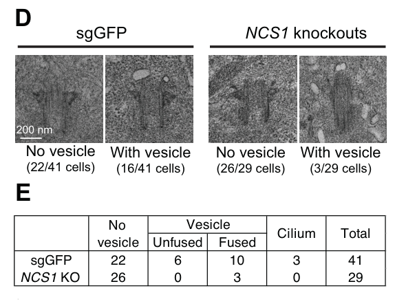

## Question

# Gene Research for Functional Annotation

## ⚠️ CRITICAL: Gene/Protein Identification Context

**BEFORE YOU BEGIN RESEARCH:** You MUST verify you are researching the CORRECT gene/protein. Gene symbols can be ambiguous, especially for less well-characterized genes from non-model organisms.

### Target Gene/Protein Identity (from UniProt):
- **UniProt Accession:** Q96ST8
- **Protein Description:** RecName: Full=Centrosomal protein of 89 kDa; Short=Cep89; AltName: Full=Centrosomal protein 123; Short=Cep123; AltName: Full=Coiled-coil domain-containing protein 123;
- **Gene Information:** Name=CEP89; Synonyms=CCDC123;
- **Organism (full):** Homo sapiens (Human).
- **Protein Family:** Not specified in UniProt
- **Key Domains:** CEP89. (IPR033545); CEP89 (PF28159)

### MANDATORY VERIFICATION STEPS:

1. **Check if the gene symbol "CEP89" matches the protein description above**
2. **Verify the organism is correct:** Homo sapiens (Human).
3. **Check if protein family/domains align with what you find in literature**
4. **If you find literature for a DIFFERENT gene with the same or similar symbol, STOP**

### If Gene Symbol is Ambiguous or You Cannot Find Relevant Literature:

**DO NOT PROCEED WITH RESEARCH ON A DIFFERENT GENE.** Instead:
- State clearly: "The gene symbol 'CEP89' is ambiguous or literature is limited for this specific protein"
- Explain what you found (e.g., "Found extensive literature on a different gene with the same symbol in a different organism")
- Describe the protein based ONLY on the UniProt information provided above
- Suggest that the protein function can be inferred from domain/family information

### Research Target:

Please provide a comprehensive research report on the gene **CEP89** (gene ID: CEP89, UniProt: Q96ST8) in human.

The research report should be a detailed narrative explaining the function, biological processes, and localization of the gene product. Citations should be given for all claims.

You should prioritize authoritative reviews and primary scientific literature when conducting research. You can supplement
this with annotations you find in gene/protein databases, but these can be outdated or inaccurate.

We are specifically interested in the primary function of the gene - for enzymes, what reaction is catalyzed, and what is the substrate specificity? For transporters, what is the substrate? For structural proteins or adapters, what is the broader structural role? For signaling molecules, what is the role in the pathway.

We are interested in where in or outside the cell the gene product carries out its function.

We are also interested in the signaling or biochemical pathways in which the gene functions. We are less interested in broad pleiotropic effects, except where these elucidate the precise role.

Include evidence where possible. We are interested in both experimental evidence as well as inference from structure, evolution, or bioinformatic analysis. Precise studies should be prioritized over high-throughput, where available.

## Output

Question: You are an expert researcher providing comprehensive, well-cited information.

Provide detailed information focusing on:
1. Key concepts and definitions with current understanding
2. Recent developments and latest research (prioritize 2023-2024 sources)
3. Current applications and real-world implementations
4. Expert opinions and analysis from authoritative sources
5. Relevant statistics and data from recent studies

Format as a comprehensive research report with proper citations. Include URLs and publication dates where available.
Always prioritize recent, authoritative sources and provide specific citations for all major claims.

# Gene Research for Functional Annotation

## ⚠️ CRITICAL: Gene/Protein Identification Context

**BEFORE YOU BEGIN RESEARCH:** You MUST verify you are researching the CORRECT gene/protein. Gene symbols can be ambiguous, especially for less well-characterized genes from non-model organisms.

### Target Gene/Protein Identity (from UniProt):
- **UniProt Accession:** Q96ST8
- **Protein Description:** RecName: Full=Centrosomal protein of 89 kDa; Short=Cep89; AltName: Full=Centrosomal protein 123; Short=Cep123; AltName: Full=Coiled-coil domain-containing protein 123;
- **Gene Information:** Name=CEP89; Synonyms=CCDC123;
- **Organism (full):** Homo sapiens (Human).
- **Protein Family:** Not specified in UniProt
- **Key Domains:** CEP89. (IPR033545); CEP89 (PF28159)

### MANDATORY VERIFICATION STEPS:

1. **Check if the gene symbol "CEP89" matches the protein description above**
2. **Verify the organism is correct:** Homo sapiens (Human).
3. **Check if protein family/domains align with what you find in literature**
4. **If you find literature for a DIFFERENT gene with the same or similar symbol, STOP**

### If Gene Symbol is Ambiguous or You Cannot Find Relevant Literature:

**DO NOT PROCEED WITH RESEARCH ON A DIFFERENT GENE.** Instead:
- State clearly: "The gene symbol 'CEP89' is ambiguous or literature is limited for this specific protein"
- Explain what you found (e.g., "Found extensive literature on a different gene with the same symbol in a different organism")
- Describe the protein based ONLY on the UniProt information provided above
- Suggest that the protein function can be inferred from domain/family information

### Research Target:

Please provide a comprehensive research report on the gene **CEP89** (gene ID: CEP89, UniProt: Q96ST8) in human.

The research report should be a detailed narrative explaining the function, biological processes, and localization of the gene product. Citations should be given for all claims.

You should prioritize authoritative reviews and primary scientific literature when conducting research. You can supplement
this with annotations you find in gene/protein databases, but these can be outdated or inaccurate.

We are specifically interested in the primary function of the gene - for enzymes, what reaction is catalyzed, and what is the substrate specificity? For transporters, what is the substrate? For structural proteins or adapters, what is the broader structural role? For signaling molecules, what is the role in the pathway.

We are interested in where in or outside the cell the gene product carries out its function.

We are also interested in the signaling or biochemical pathways in which the gene functions. We are less interested in broad pleiotropic effects, except where these elucidate the precise role.

Include evidence where possible. We are interested in both experimental evidence as well as inference from structure, evolution, or bioinformatic analysis. Precise studies should be prioritized over high-throughput, where available.

# Human CEP89: functional annotation and research evidence

## Identity and principal function

The target is **human CEP89** (the UniProt accession **Q96ST8** specified in the question), also called **CCDC123** or **CEP123**. These names identify the same centrosomal protein in the human distal-appendage literature, rather than a similarly named protein from another organism. The supplied InterPro **IPR033545** and Pfam **PF28159** labels identify CEP89-associated sequence annotations; they do not, by themselves, establish an enzymatic activity. The experimentally supported function is that of a **centriole-associated protein that organizes recruitment of a membrane-capturing partner during initiation of primary-cilium formation**. No reaction, catalytic substrate, or transported substrate has been established for CEP89. (mansour2021theroleof pages 12-13, tanos2013centrioledistalappendages pages 2-3, kanie2025myristoylatedneuronalcalcium pages 2-4)

The most precise current model is **CEP83-dependent placement of CEP89 at the mature mother centriole → CEP89-dependent recruitment of NCS1 → myristoylation-dependent capture of preciliary membrane vesicles**. Those vesicles contribute to formation of the ciliary vesicle, preceding remodeling of the centriole and growth of the cilium. CEP89 itself lacks an apparent membrane-binding motif; the evidence assigns the experimentally tested membrane-binding requirement to **NCS1**, not to CEP89. Thus, CEP89 is best described as an *adaptor or organizer of a vesicle-capture site*, rather than as a membrane receptor or a general scaffold required to build every distal-appendage component. (kanie2025myristoylatedneuronalcalcium pages 1-2, kanie2025myristoylatedneuronalcalcium pages 4-5, kanie2025ahierarchicalpathway pages 17-20, kanie2025myristoylatedneuronalcalcium pages 12-13)

## Cellular location and molecular mechanism

CEP89 concentrates at the **distal appendages of the mother centriole**, which becomes the **basal body** of the primary cilium. Imaging in human retinal pigment epithelial (RPE) cells also detected CEP89 near the **subdistal-appendage region**; consequently, a strictly distal-only description would overstate its spatial restriction. The function established most directly occurs on the **cytoplasmic side of the mother centriole**, where incoming preciliary vesicles encounter its appendages. Distal appendages participate in centriole–membrane docking, but the classic ultrastructural demonstration of failed docking after **CEP83** depletion should not be misrepresented as an ultrastructural CEP89-loss experiment. (kanie2025ahierarchicalpathway pages 5-8, tanos2013centrioledistalappendages pages 3-4, tanos2013centrioledistalappendages pages 1-2)

Foundational human-cell experiments placed CEP83 upstream of CEP89: CEP83 depletion prevented CEP89 recruitment, whereas CEP89 depletion left the SCLT1–CEP164 branch substantially intact. A subsequent analysis found additional interdependence among appendage proteins, including reduced CEP89 localization after SCLT1 knockout. The defensible conclusion is that **CEP83 is required for robust CEP89 localization**, while the assembly hierarchy is more interconnected than the original simple branching diagram. The CEP89 C-terminal segment, **residues 344–783**, is required for its centrosomal localization. (kanie2025ahierarchicalpathway pages 8-11, kanie2025myristoylatedneuronalcalcium pages 4-5, tanos2013centrioledistalappendages pages 2-3)

The direct molecular evidence comes from human hTERT-RPE cells. Tandem-affinity purification identified **NCS1** and **CEP15**, formerly **C3ORF14**, as prominent CEP89-associated proteins; endogenous CEP89–NCS1 co-immunoprecipitation and in-vitro binding assays supported a direct interaction. CEP89 bound NCS1 through its **N-terminal residues 1–343** and bound CEP15 independently; the tested CEP15 and NCS1 proteins did not bind one another directly. Structural modeling suggests that an N-terminal CEP89 helix occupies an NCS1 binding pocket, but the modeled atomic arrangement is not an experimentally solved CEP89-complex structure. (kanie2025myristoylatedneuronalcalcium pages 4-5, kanie2025myristoylatedneuronalcalcium pages 2-4)

Three-dimensional structured-illumination microscopy positioned NCS1 **between CEP89 and RAB34-marked centriole-associated vesicles**. Removing CEP89 eliminated mother-centriole localization of NCS1 and CEP15 without eliminating their expression, whereas removing NCS1 did not displace CEP89. Restoring CEP89 rescued NCS1 localization. Importantly, the **NCS1-G2A** mutation, which disrupts its N-terminal myristoylation site, preserved NCS1 recruitment to the centriole but failed to rescue efficient vesicle recruitment or cilium formation. This separates CEP89-mediated *positioning* of NCS1 from NCS1-mediated *membrane engagement*. Calcium-binding EF-hand mutations mainly affected NCS1 stability or interaction in the reported tests; a calcium-triggered membrane-capture switch was **not established**. (kanie2025myristoylatedneuronalcalcium pages 6-8, kanie2025myristoylatedneuronalcalcium pages 10-12, kanie2025myristoylatedneuronalcalcium pages 12-13)

## Biological pathway and strength of functional evidence

The relevant pathway is **mother-centriole maturation and intracellular primary ciliogenesis**, not an established CEP89-specific enzymatic or canonical signal-transduction cascade. In human RPE-cell knockout experiments, CEP89 loss selectively reduced recruitment of **RAB34-positive preciliary vesicles**, partially impeded removal of the centriolar cap protein **CP110**, and delayed cilium formation. In contrast, recruitment of **IFT88** and **CEP19** was not appreciably impaired, and the appendage structure was not broadly dismantled. This positions CEP89 primarily in the vesicle-recruitment arm of ciliogenesis, rather than in general intraflagellar-transport recruitment. Double-perturbation experiments found that NCS1 depletion worsened vesicle recruitment in several other appendage-protein knockout backgrounds but **not** in CEP89-knockout cells, supporting a shared CEP89–NCS1 functional pathway. (kanie2025myristoylatedneuronalcalcium pages 8-9, kanie2025ahierarchicalpathway pages 17-20)

The effect is consequential but **not an absolute requirement for every cilium**. In the human RPE experiments, the strongest delay in CEP89- or NCS1-deficient cells occurred early after serum withdrawal; ciliation substantially caught up by **48 hours**, although ciliary **ARL13B** signal remained reduced. ARL13B reduction raises the possibility of altered ciliary composition but does not, on its own, establish a particular downstream signaling defect. Earlier RNA-interference work reported a stronger block in human RPE ciliogenesis. The distinction between *efficient, timely initiation* and *eventual cilium formation* is therefore important when interpreting CEP89 loss. (kanie2025myristoylatedneuronalcalcium pages 6-8, kanie2025myristoylatedneuronalcalcium pages 8-9, kanie2025ahierarchicalpathway pages 17-20, tanos2013centrioledistalappendages pages 2-3)

A numerical measure of the **partner's**, rather than CEP89's, role comes from electron microscopy: preciliary vesicles were associated with **16/41 control mother centrioles (39%)**, versus **3/29 NCS1-knockout centrioles (10%)**. This supports the CEP89–NCS1 model, but these numbers must **not** be reported as a quantitative CEP89-knockout effect. Some NCS1-deficient centrioles retained fused vesicles, indicating impaired recruitment rather than a demonstrated block in vesicle fusion. The inspected primary-paper figure contains the images and counts. (kanie2025myristoylatedneuronalcalcium pages 8-9, kanie2025myristoylatedneuronalcalcium pages 9-10, kanie2025myristoylatedneuronalcalcium media d48748d6)

The following comparison puts the principal experiments and their differing interpretations in context. (kanie2025ahierarchicalpathway pages 17-20, je2024distinctrolesof pages 3-5, kanie2025myristoylatedneuronalcalcium pages 2-4)

| Study/date and DOI | Experimental system | CEP89-specific result | Interpretation/qualification |
|---|---|---|---|
| Tanos et al., January 2013; [10.1101/gad.207043.112](https://doi.org/10.1101/gad.207043.112) | Human RPE-1 cells; RNAi, rescue, proteomics and super-resolution imaging | Identified CEP89/CCDC123 as a distal-appendage protein. CEP83 was required for CEP89 recruitment, whereas CEP89 and SCLT1 formed independent downstream branches. CEP89 depletion blocked ciliogenesis, and an RNAi-resistant construct rescued the phenotype. (tanos2013centrioledistalappendages pages 2-3, tanos2013centrioledistalappendages pages 1-2) | Foundational evidence that CEP89 participates in distal-appendage-dependent ciliogenesis. The study did not isolate CEP89’s exact membrane-docking mechanism; ultrastructural docking experiments primarily tested CEP83 depletion. |
| Kanie et al., preprint posted January 10, 2023; updated 2025; [10.1101/2023.01.06.522944](https://doi.org/10.1101/2023.01.06.522944) | Human hTERT-RPE cells; CRISPR knockouts, fluorescence microscopy and functional ciliogenesis assays | CEP89 loss modestly but significantly reduced RAB34-positive preciliary-vesicle recruitment, partially inhibited CP110 removal and delayed ciliogenesis at 24 hours; ciliation largely recovered by 48 hours. IFT88 and CEP19 recruitment and distal-appendage structural integrity were not materially disrupted. (kanie2025ahierarchicalpathway pages 17-20, kanie2025ahierarchicalpathway pages 61-62) | Refines CEP89 from a general structural DAP into a selective vesicle-recruitment factor. Recovery by 48 hours indicates compensation or redundancy; the hierarchy study remained a preprint in the retrieved record. |
| Kanie et al., preprinted January 8, 2023; published January 30, 2025; [10.7554/eLife.85998](https://doi.org/10.7554/eLife.85998) | Human hTERT-RPE cells; affinity purification–mass spectrometry, direct binding assays, CRISPR knockout/rescue, 3D-SIM and TEM | CEP89 directly bound and recruited NCS1 and CEP15/C3ORF14; CEP89 residues 1–343 mediated NCS1 binding, while residues 344–783 were required for centrosomal localization. NCS1 occupied the space between CEP89 and RAB34-positive vesicles. NCS1 knockout reduced vesicle-bearing mother centrioles from 16/41 controls to 3/29; this is NCS1, not CEP89, quantitative evidence. Myristoylation-defective NCS1-G2A localized to centrioles but failed to rescue vesicle recruitment or ciliation. (kanie2025myristoylatedneuronalcalcium pages 1-2, kanie2025myristoylatedneuronalcalcium pages 2-4, kanie2025myristoylatedneuronalcalcium pages 9-10, kanie2025myristoylatedneuronalcalcium pages 12-13, kanie2025myristoylatedneuronalcalcium media d48748d6) | Supports a CEP89→NCS1→membrane-capture mechanism: CEP89 is the distal-appendage scaffold, and myristoylated NCS1 supplies membrane-binding activity. Residual docking and eventual ciliation imply additional compensating capture mechanisms. |
| Je and Ko, December 2024; [10.1186/s12964-024-01962-7](https://doi.org/10.1186/s12964-024-01962-7) | Cep89-mutant mouse embryonic fibroblasts, embryonic tissues and Cep89-siRNA NIH3T3 cells | Cep89 loss did not measurably impair cilium frequency or length but modestly delayed serum-triggered disassembly. About 40% of cells were initially ciliated; by 12 hours, approximately 60% of ciliated controls had deciliated, whereas Cep89-depleted cells retained significantly more cilia. CEP89 depletion reduced Aurora-A abundance and basal-body localization and increased G0/G1 retention. (je2024distinctrolesof pages 2-3, je2024distinctrolesof pages 3-5, je2024distinctrolesof pages 5-9, je2024distinctrolesof pages 9-10) | Adds a possible CEP89 role in Aurora-A-associated ciliary disassembly and cell-cycle re-entry. The effect was modest, and the authors acknowledged conflict with human RPE-cell assembly phenotypes; species, cell type, knockout design and compensatory mechanisms may explain the difference. |

*Table: Comparison of key CEP89 studies, experimental systems, direct findings and important qualifications. It distinguishes CEP89-specific results from quantitative evidence obtained for its downstream partner NCS1.*

## The 2024 development: possible role in ciliary disassembly

A **2024 mouse study** adds a distinct, less fully resolved function. Cep89-mutant embryonic tissues and mouse embryonic fibroblasts formed cilia with frequencies and lengths comparable to controls in the reported assays. Following serum readdition, however, mutant fibroblasts and Cep89-depleted NIH3T3 cells showed a **modest delay in ciliary disassembly**. Approximately **40%** of NIH3T3 cells were ciliated before serum treatment across conditions, and approximately **60% of initially ciliated control cells** had lost cilia by **12 hours**; Cep89-depleted cells retained significantly more. The authors also observed lower **Aurora A kinase abundance and basal-body localization**, alongside altered cell-cycle profiles. These results suggest a link between CEP89 and Aurora-A-associated ciliary resorption, but do **not** demonstrate that CEP89 directly binds or biochemically activates Aurora A: the authors discuss cell-cycle-state changes as a possible alternative explanation for reduced kinase abundance. (je2024distinctrolesof pages 2-3, je2024distinctrolesof pages 3-5, je2024distinctrolesof pages 5-9, je2024distinctrolesof pages 9-10)

The apparent assembly-versus-disassembly disagreement should therefore remain explicit. **Human RPE experiments** implicate CEP89 in efficient *early vesicle recruitment*; **mouse fibroblast and tissue experiments** found largely normal *steady-state ciliation* but delayed *serum-induced disassembly*. Differences in species, cellular pathway, observation time and perturbation design are plausible explanations, not established resolutions. Mouse Cep89 mutants in the 2024 report developed largely normally and lacked the prominent ciliopathy-like abnormalities discussed by its authors; this does not exclude more restricted human effects. (kanie2025myristoylatedneuronalcalcium pages 8-9, je2024distinctrolesof pages 2-3, je2024distinctrolesof pages 3-5)

## Applications, clinical relevance and outstanding questions

CEP89 is currently most useful as a **research target for dissecting the mother-centriole distal appendage and preciliary-vesicle docking**. CRISPR knockout/rescue, RAB34 vesicle imaging, ciliation time courses, super-resolution localization and binding assays provide experimentally demonstrated ways to distinguish its role from those of CEP83, CEP164 and other appendage proteins. The retrieved studies do **not** establish a CEP89-targeted therapy, diagnostic implementation, or a validated CEP89-specific human disease association; disorders caused by mutations in *other* distal-appendage genes should not be attributed to CEP89. More work is needed to identify compensating vesicle-capture mechanisms, determine how CEP89–NCS1 functions across human tissues, and test whether the mouse disassembly phenotype occurs in human cells. (mansour2021theroleof pages 12-13, kanie2025myristoylatedneuronalcalcium pages 8-9, je2024distinctrolesof pages 2-3, je2024distinctrolesof pages 9-10)

### Principal sources and publication chronology

- **Tanos et al.**, *Genes & Development*, **January 2013**, “Centriole distal appendages promote membrane docking, leading to cilia initiation”: https://doi.org/10.1101/gad.207043.112. Foundational identification and recruitment hierarchy; docking ultrastructure principally tests CEP83. (tanos2013centrioledistalappendages pages 2-3, tanos2013centrioledistalappendages pages 1-2)
- **Kanie et al.**, “A hierarchical pathway for assembly of the distal appendages that organize primary cilia”: https://doi.org/10.1101/2023.01.06.522944. The inspected manuscript identifies a **January 10, 2023 preprint version**; the retrieved bibliographic record labels it **2025**. Its preprint status should be retained rather than assumed to be peer-reviewed. (kanie2025ahierarchicalpathway pages 17-20)
- **Je and Ko**, *Cell Communication and Signaling*, **December 2024**, “Distinct roles of centriole distal appendage proteins in ciliary assembly and disassembly”: https://doi.org/10.1186/s12964-024-01962-7. Primary mouse-cell evidence for delayed ciliary disassembly. (je2024distinctrolesof pages 1-2, je2024distinctrolesof pages 5-9)
- **Kanie et al.**, *eLife*, **published January 30, 2025**, “Myristoylated Neuronal Calcium Sensor-1 captures the preciliary vesicle at distal appendages”: https://doi.org/10.7554/eLife.85998. **Preprinted January 8, 2023**; the subsequently published peer-reviewed study provides the detailed CEP89–NCS1 mechanism. (kanie2025myristoylatedneuronalcalcium pages 1-2, kanie2025myristoylatedneuronalcalcium pages 2-4)
- **Mansour et al.**, *International Journal of Molecular Sciences*, **November 2021**, “The Role of Centrosome Distal Appendage Proteins (DAPs) in Nephronophthisis and Ciliogenesis”: https://doi.org/10.3390/ijms222212253. Contextual review verifying the CEP89/CCDC123/CEP123 nomenclature; its proposals about broader trafficking relationships should be distinguished from the later direct NCS1 experiments. (mansour2021theroleof pages 12-13)

References

1. (mansour2021theroleof pages 12-13): Fatma Mansour, Felix J. Boivin, Iman B. Shaheed, Markus Schueler, and Kai M. Schmidt-Ott. The role of centrosome distal appendage proteins (daps) in nephronophthisis and ciliogenesis. International Journal of Molecular Sciences, 22:12253, Nov 2021. URL: https://doi.org/10.3390/ijms222212253, doi:10.3390/ijms222212253. This article has 32 citations.

2. (tanos2013centrioledistalappendages pages 2-3): Barbara E. Tanos, Hui-Ju Yang, Rajesh Soni, Won-Jing Wang, Frank P. Macaluso, John M. Asara, and Meng-Fu Bryan Tsou. Centriole distal appendages promote membrane docking, leading to cilia initiation. Genes & development, 27 2:163-8, Jan 2013. URL: https://doi.org/10.1101/gad.207043.112, doi:10.1101/gad.207043.112. This article has 529 citations and is from a highest quality peer-reviewed journal.

3. (kanie2025myristoylatedneuronalcalcium pages 2-4): Tomoharu Kanie, Roy Ng, Keene L Abbott, Niaj Mohammad Tanvir, Esben Lorentzen, Olaf Pongs, and Peter K Jackson. Myristoylated neuronal calcium sensor-1 captures the preciliary vesicle at distal appendages. eLife, Jan 2025. URL: https://doi.org/10.7554/elife.85998, doi:10.7554/elife.85998. This article has 6 citations and is from a domain leading peer-reviewed journal.

4. (kanie2025myristoylatedneuronalcalcium pages 1-2): Tomoharu Kanie, Roy Ng, Keene L Abbott, Niaj Mohammad Tanvir, Esben Lorentzen, Olaf Pongs, and Peter K Jackson. Myristoylated neuronal calcium sensor-1 captures the preciliary vesicle at distal appendages. eLife, Jan 2025. URL: https://doi.org/10.7554/elife.85998, doi:10.7554/elife.85998. This article has 6 citations and is from a domain leading peer-reviewed journal.

5. (kanie2025myristoylatedneuronalcalcium pages 4-5): Tomoharu Kanie, Roy Ng, Keene L Abbott, Niaj Mohammad Tanvir, Esben Lorentzen, Olaf Pongs, and Peter K Jackson. Myristoylated neuronal calcium sensor-1 captures the preciliary vesicle at distal appendages. eLife, Jan 2025. URL: https://doi.org/10.7554/elife.85998, doi:10.7554/elife.85998. This article has 6 citations and is from a domain leading peer-reviewed journal.

6. (kanie2025ahierarchicalpathway pages 17-20): Tomoharu Kanie, Julia F. Love, Saxton D. Fisher, Anna-Karin Gustavsson, and Peter K. Jackson. A hierarchical pathway for assembly of the distal appendages that organize primary cilia. bioRxiv, Jan 2025. URL: https://doi.org/10.1101/2023.01.06.522944, doi:10.1101/2023.01.06.522944. This article has 37 citations.

7. (kanie2025myristoylatedneuronalcalcium pages 12-13): Tomoharu Kanie, Roy Ng, Keene L Abbott, Niaj Mohammad Tanvir, Esben Lorentzen, Olaf Pongs, and Peter K Jackson. Myristoylated neuronal calcium sensor-1 captures the preciliary vesicle at distal appendages. eLife, Jan 2025. URL: https://doi.org/10.7554/elife.85998, doi:10.7554/elife.85998. This article has 6 citations and is from a domain leading peer-reviewed journal.

8. (kanie2025ahierarchicalpathway pages 5-8): Tomoharu Kanie, Julia F. Love, Saxton D. Fisher, Anna-Karin Gustavsson, and Peter K. Jackson. A hierarchical pathway for assembly of the distal appendages that organize primary cilia. bioRxiv, Jan 2025. URL: https://doi.org/10.1101/2023.01.06.522944, doi:10.1101/2023.01.06.522944. This article has 37 citations.

9. (tanos2013centrioledistalappendages pages 3-4): Barbara E. Tanos, Hui-Ju Yang, Rajesh Soni, Won-Jing Wang, Frank P. Macaluso, John M. Asara, and Meng-Fu Bryan Tsou. Centriole distal appendages promote membrane docking, leading to cilia initiation. Genes & development, 27 2:163-8, Jan 2013. URL: https://doi.org/10.1101/gad.207043.112, doi:10.1101/gad.207043.112. This article has 529 citations and is from a highest quality peer-reviewed journal.

10. (tanos2013centrioledistalappendages pages 1-2): Barbara E. Tanos, Hui-Ju Yang, Rajesh Soni, Won-Jing Wang, Frank P. Macaluso, John M. Asara, and Meng-Fu Bryan Tsou. Centriole distal appendages promote membrane docking, leading to cilia initiation. Genes & development, 27 2:163-8, Jan 2013. URL: https://doi.org/10.1101/gad.207043.112, doi:10.1101/gad.207043.112. This article has 529 citations and is from a highest quality peer-reviewed journal.

11. (kanie2025ahierarchicalpathway pages 8-11): Tomoharu Kanie, Julia F. Love, Saxton D. Fisher, Anna-Karin Gustavsson, and Peter K. Jackson. A hierarchical pathway for assembly of the distal appendages that organize primary cilia. bioRxiv, Jan 2025. URL: https://doi.org/10.1101/2023.01.06.522944, doi:10.1101/2023.01.06.522944. This article has 37 citations.

12. (kanie2025myristoylatedneuronalcalcium pages 6-8): Tomoharu Kanie, Roy Ng, Keene L Abbott, Niaj Mohammad Tanvir, Esben Lorentzen, Olaf Pongs, and Peter K Jackson. Myristoylated neuronal calcium sensor-1 captures the preciliary vesicle at distal appendages. eLife, Jan 2025. URL: https://doi.org/10.7554/elife.85998, doi:10.7554/elife.85998. This article has 6 citations and is from a domain leading peer-reviewed journal.

13. (kanie2025myristoylatedneuronalcalcium pages 10-12): Tomoharu Kanie, Roy Ng, Keene L Abbott, Niaj Mohammad Tanvir, Esben Lorentzen, Olaf Pongs, and Peter K Jackson. Myristoylated neuronal calcium sensor-1 captures the preciliary vesicle at distal appendages. eLife, Jan 2025. URL: https://doi.org/10.7554/elife.85998, doi:10.7554/elife.85998. This article has 6 citations and is from a domain leading peer-reviewed journal.

14. (kanie2025myristoylatedneuronalcalcium pages 8-9): Tomoharu Kanie, Roy Ng, Keene L Abbott, Niaj Mohammad Tanvir, Esben Lorentzen, Olaf Pongs, and Peter K Jackson. Myristoylated neuronal calcium sensor-1 captures the preciliary vesicle at distal appendages. eLife, Jan 2025. URL: https://doi.org/10.7554/elife.85998, doi:10.7554/elife.85998. This article has 6 citations and is from a domain leading peer-reviewed journal.

15. (kanie2025myristoylatedneuronalcalcium pages 9-10): Tomoharu Kanie, Roy Ng, Keene L Abbott, Niaj Mohammad Tanvir, Esben Lorentzen, Olaf Pongs, and Peter K Jackson. Myristoylated neuronal calcium sensor-1 captures the preciliary vesicle at distal appendages. eLife, Jan 2025. URL: https://doi.org/10.7554/elife.85998, doi:10.7554/elife.85998. This article has 6 citations and is from a domain leading peer-reviewed journal.

16. (kanie2025myristoylatedneuronalcalcium media d48748d6): Tomoharu Kanie, Roy Ng, Keene L Abbott, Niaj Mohammad Tanvir, Esben Lorentzen, Olaf Pongs, and Peter K Jackson. Myristoylated neuronal calcium sensor-1 captures the preciliary vesicle at distal appendages. eLife, Jan 2025. URL: https://doi.org/10.7554/elife.85998, doi:10.7554/elife.85998. This article has 6 citations and is from a domain leading peer-reviewed journal.

17. (je2024distinctrolesof pages 3-5): Su-yeon Je and Hyuk Wan Ko. Distinct roles of centriole distal appendage proteins in ciliary assembly and disassembly. Cell Communication and Signaling : CCS, Dec 2024. URL: https://doi.org/10.1186/s12964-024-01962-7, doi:10.1186/s12964-024-01962-7. This article has 1 citations.

18. (kanie2025ahierarchicalpathway pages 61-62): Tomoharu Kanie, Julia F. Love, Saxton D. Fisher, Anna-Karin Gustavsson, and Peter K. Jackson. A hierarchical pathway for assembly of the distal appendages that organize primary cilia. bioRxiv, Jan 2025. URL: https://doi.org/10.1101/2023.01.06.522944, doi:10.1101/2023.01.06.522944. This article has 37 citations.

19. (je2024distinctrolesof pages 2-3): Su-yeon Je and Hyuk Wan Ko. Distinct roles of centriole distal appendage proteins in ciliary assembly and disassembly. Cell Communication and Signaling : CCS, Dec 2024. URL: https://doi.org/10.1186/s12964-024-01962-7, doi:10.1186/s12964-024-01962-7. This article has 1 citations.

20. (je2024distinctrolesof pages 5-9): Su-yeon Je and Hyuk Wan Ko. Distinct roles of centriole distal appendage proteins in ciliary assembly and disassembly. Cell Communication and Signaling : CCS, Dec 2024. URL: https://doi.org/10.1186/s12964-024-01962-7, doi:10.1186/s12964-024-01962-7. This article has 1 citations.

21. (je2024distinctrolesof pages 9-10): Su-yeon Je and Hyuk Wan Ko. Distinct roles of centriole distal appendage proteins in ciliary assembly and disassembly. Cell Communication and Signaling : CCS, Dec 2024. URL: https://doi.org/10.1186/s12964-024-01962-7, doi:10.1186/s12964-024-01962-7. This article has 1 citations.

22. (je2024distinctrolesof pages 1-2): Su-yeon Je and Hyuk Wan Ko. Distinct roles of centriole distal appendage proteins in ciliary assembly and disassembly. Cell Communication and Signaling : CCS, Dec 2024. URL: https://doi.org/10.1186/s12964-024-01962-7, doi:10.1186/s12964-024-01962-7. This article has 1 citations.

## Artifacts

- [Edison artifact artifact-00](CEP89-deep-research-falcon_artifacts/artifact-00.md)

## Citations

1. kanie2025ahierarchicalpathway pages 17-20
2. mansour2021theroleof pages 12-13
3. tanos2013centrioledistalappendages pages 2-3
4. kanie2025myristoylatedneuronalcalcium pages 2-4
5. kanie2025myristoylatedneuronalcalcium pages 1-2
6. kanie2025myristoylatedneuronalcalcium pages 4-5
7. kanie2025myristoylatedneuronalcalcium pages 12-13
8. kanie2025ahierarchicalpathway pages 5-8
9. tanos2013centrioledistalappendages pages 3-4
10. tanos2013centrioledistalappendages pages 1-2
11. kanie2025ahierarchicalpathway pages 8-11
12. kanie2025myristoylatedneuronalcalcium pages 6-8
13. kanie2025myristoylatedneuronalcalcium pages 10-12
14. kanie2025myristoylatedneuronalcalcium pages 8-9
15. kanie2025myristoylatedneuronalcalcium pages 9-10
16. je2024distinctrolesof pages 3-5
17. kanie2025ahierarchicalpathway pages 61-62
18. je2024distinctrolesof pages 2-3
19. je2024distinctrolesof pages 5-9
20. je2024distinctrolesof pages 9-10
21. je2024distinctrolesof pages 1-2
22. 10.1101/gad.207043.112
23. 10.1101/2023.01.06.522944
24. 10.7554/eLife.85998
25. 10.1186/s12964-024-01962-7
26. https://doi.org/10.1101/gad.207043.112
27. https://doi.org/10.1101/2023.01.06.522944
28. https://doi.org/10.7554/eLife.85998
29. https://doi.org/10.1186/s12964-024-01962-7
30. https://doi.org/10.1101/gad.207043.112.
31. https://doi.org/10.1101/2023.01.06.522944.
32. https://doi.org/10.1186/s12964-024-01962-7.
33. https://doi.org/10.7554/eLife.85998.
34. https://doi.org/10.3390/ijms222212253.
35. https://doi.org/10.3390/ijms222212253,
36. https://doi.org/10.1101/gad.207043.112,
37. https://doi.org/10.7554/elife.85998,
38. https://doi.org/10.1101/2023.01.06.522944,
39. https://doi.org/10.1186/s12964-024-01962-7,