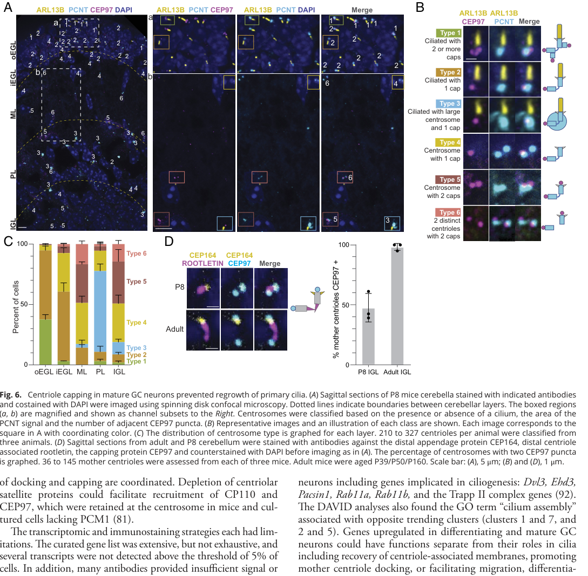

## Question

# Gene Research for Functional Annotation

## ⚠️ CRITICAL: Gene/Protein Identification Context

**BEFORE YOU BEGIN RESEARCH:** You MUST verify you are researching the CORRECT gene/protein. Gene symbols can be ambiguous, especially for less well-characterized genes from non-model organisms.

### Target Gene/Protein Identity (from UniProt):
- **UniProt Accession:** Q8IW35
- **Protein Description:** RecName: Full=Centrosomal protein of 97 kDa; Short=Cep97; AltName: Full=Leucine-rich repeat and IQ domain-containing protein 2;
- **Gene Information:** Name=CEP97; Synonyms=LRRIQ2;
- **Organism (full):** Homo sapiens (Human).
- **Protein Family:** Not specified in UniProt
- **Key Domains:** Cilia_flagella_integrity. (IPR050576); Leu-rich_rpt. (IPR001611); LRR_dom_sf. (IPR032675); LRR_9 (PF14580)

### MANDATORY VERIFICATION STEPS:

1. **Check if the gene symbol "CEP97" matches the protein description above**
2. **Verify the organism is correct:** Homo sapiens (Human).
3. **Check if protein family/domains align with what you find in literature**
4. **If you find literature for a DIFFERENT gene with the same or similar symbol, STOP**

### If Gene Symbol is Ambiguous or You Cannot Find Relevant Literature:

**DO NOT PROCEED WITH RESEARCH ON A DIFFERENT GENE.** Instead:
- State clearly: "The gene symbol 'CEP97' is ambiguous or literature is limited for this specific protein"
- Explain what you found (e.g., "Found extensive literature on a different gene with the same symbol in a different organism")
- Describe the protein based ONLY on the UniProt information provided above
- Suggest that the protein function can be inferred from domain/family information

### Research Target:

Please provide a comprehensive research report on the gene **CEP97** (gene ID: CEP97, UniProt: Q8IW35) in human.

The research report should be a detailed narrative explaining the function, biological processes, and localization of the gene product. Citations should be given for all claims.

You should prioritize authoritative reviews and primary scientific literature when conducting research. You can supplement
this with annotations you find in gene/protein databases, but these can be outdated or inaccurate.

We are specifically interested in the primary function of the gene - for enzymes, what reaction is catalyzed, and what is the substrate specificity? For transporters, what is the substrate? For structural proteins or adapters, what is the broader structural role? For signaling molecules, what is the role in the pathway.

We are interested in where in or outside the cell the gene product carries out its function.

We are also interested in the signaling or biochemical pathways in which the gene functions. We are less interested in broad pleiotropic effects, except where these elucidate the precise role.

Include evidence where possible. We are interested in both experimental evidence as well as inference from structure, evolution, or bioinformatic analysis. Precise studies should be prioritized over high-throughput, where available.

## Output

Question: You are an expert researcher providing comprehensive, well-cited information.

Provide detailed information focusing on:
1. Key concepts and definitions with current understanding
2. Recent developments and latest research (prioritize 2023-2024 sources)
3. Current applications and real-world implementations
4. Expert opinions and analysis from authoritative sources
5. Relevant statistics and data from recent studies

Format as a comprehensive research report with proper citations. Include URLs and publication dates where available.
Always prioritize recent, authoritative sources and provide specific citations for all major claims.

# Gene Research for Functional Annotation

## ⚠️ CRITICAL: Gene/Protein Identification Context

**BEFORE YOU BEGIN RESEARCH:** You MUST verify you are researching the CORRECT gene/protein. Gene symbols can be ambiguous, especially for less well-characterized genes from non-model organisms.

### Target Gene/Protein Identity (from UniProt):
- **UniProt Accession:** Q8IW35
- **Protein Description:** RecName: Full=Centrosomal protein of 97 kDa; Short=Cep97; AltName: Full=Leucine-rich repeat and IQ domain-containing protein 2;
- **Gene Information:** Name=CEP97; Synonyms=LRRIQ2;
- **Organism (full):** Homo sapiens (Human).
- **Protein Family:** Not specified in UniProt
- **Key Domains:** Cilia_flagella_integrity. (IPR050576); Leu-rich_rpt. (IPR001611); LRR_dom_sf. (IPR032675); LRR_9 (PF14580)

### MANDATORY VERIFICATION STEPS:

1. **Check if the gene symbol "CEP97" matches the protein description above**
2. **Verify the organism is correct:** Homo sapiens (Human).
3. **Check if protein family/domains align with what you find in literature**
4. **If you find literature for a DIFFERENT gene with the same or similar symbol, STOP**

### If Gene Symbol is Ambiguous or You Cannot Find Relevant Literature:

**DO NOT PROCEED WITH RESEARCH ON A DIFFERENT GENE.** Instead:
- State clearly: "The gene symbol 'CEP97' is ambiguous or literature is limited for this specific protein"
- Explain what you found (e.g., "Found extensive literature on a different gene with the same symbol in a different organism")
- Describe the protein based ONLY on the UniProt information provided above
- Suggest that the protein function can be inferred from domain/family information

### Research Target:

Please provide a comprehensive research report on the gene **CEP97** (gene ID: CEP97, UniProt: Q8IW35) in human.

The research report should be a detailed narrative explaining the function, biological processes, and localization of the gene product. Citations should be given for all claims.

You should prioritize authoritative reviews and primary scientific literature when conducting research. You can supplement
this with annotations you find in gene/protein databases, but these can be outdated or inaccurate.

We are specifically interested in the primary function of the gene - for enzymes, what reaction is catalyzed, and what is the substrate specificity? For transporters, what is the substrate? For structural proteins or adapters, what is the broader structural role? For signaling molecules, what is the role in the pathway.

We are interested in where in or outside the cell the gene product carries out its function.

We are also interested in the signaling or biochemical pathways in which the gene functions. We are less interested in broad pleiotropic effects, except where these elucidate the precise role.

Include evidence where possible. We are interested in both experimental evidence as well as inference from structure, evolution, or bioinformatic analysis. Precise studies should be prioritized over high-throughput, where available.

# Human CEP97 (LRRIQ2; UniProt Q8IW35): functional annotation

## Identity and principal function

**The target is human CEP97, not the unrelated ATPase VCP, also called p97.** The original human-cell study identified the protein under its former name **LRRIQ2** and named it CEP97 for its centrosomal localization and predicted mass of approximately 97 kDa. It describes an 865-amino-acid protein with leucine-rich repeats (LRRs), an IQ calmodulin-binding motif and a short coiled-coil region. Those features agree with the supplied UniProt LRR/domain annotations; the protein’s apparent migration near 140 kDa on SDS–PAGE does not indicate a different identity. CEP97 is best classified functionally as a **centriole-associated regulatory and adaptor protein**, not an enzyme or transporter: no reaction or transported substrate is established for CEP97. (spektor2007cep97andcp110 pages 1-2, spektor2007cep97andcp110 pages 2-4)

Its most firmly established role in human cells is to cooperate with **CP110 at the distal ends of centrioles**. The complex helps control distal centriolar microtubules and prevents inappropriate initiation of a primary cilium. CEP97 binds CP110 and supports its centrosomal abundance; when a mother centriole is licensed to form a cilium, the distal CP110–CEP97 complex is ordinarily removed so that basal-body remodeling and axoneme growth can proceed. This is a context-dependent gate, rather than a claim that CEP97 alone physically blocks tubulin addition. (spektor2007cep97andcp110 pages 2-4, cajanek2025ciliaatthe pages 4-5, spektor2007cep97andcp110 pages 4-6)

## Where CEP97 acts and what the experiments show

In human cells, immunostaining places endogenous CEP97 at **centrosomes and centrioles**, overlapping the centriolar marker centrin. Its localization persists after cytoplasmic microtubule depolymerization, supporting an intrinsic centrosomal association. CEP97 was detected at centrosomes across the cell cycle, although its overall abundance fell in serum-starved G0 cells. Reciprocal immunoprecipitation demonstrated an endogenous CEP97–CP110 association. CEP97 depletion reduced total CP110 and removed it from centrosomes; conversely, CP110 depletion removed CEP97 from centrosomes without comparably eliminating cellular CEP97. Thus, the proteins are **interdependent for centriolar localization**, while CEP97 also helps maintain CP110 abundance. The reported CEP97–calmodulin association is consistent with its IQ motif but does not establish a calcium-dependent catalytic function. (spektor2007cep97andcp110 pages 2-4, spektor2007cep97andcp110 pages 4-6)

The causal ciliogenesis evidence comes from depletion and expression experiments. In proliferating human RPE-1 cells, CEP97 or CP110 knockdown increased cells bearing acetylated-tubulin- and other ciliary-marker-positive projections; the control ciliation rate was **10.3%** across the reported acetylated-tubulin experiments, with at least **200 cells scored per experiment**. Distal extensions after CEP97 depletion also contained polyglutamylated tubulin and, in additional assays, the ciliary marker polycystin-2. CEP97 depletion was **80–90%** in the reported human-cell knockdowns. Conversely, CP110 overexpression strongly suppressed cilia formation in serum-starved mouse fibroblasts. These results establish an inhibitory **CEP97–CP110 pathway** in the tested cultured cells; they do not mean every CEP97-dependent projection is an anatomically normal mature cilium. (spektor2007cep97andcp110 pages 8-10, spektor2007cep97andcp110 pages 2-4, spektor2007cep97andcp110 pages 6-8, spektor2007cep97andcp110 pages 4-6)

A useful mechanistic refinement came from purified **human** proteins in 2025. CEP97 alone neither bound dynamic microtubules detectably nor changed their behavior in the reported reconstitution; adding up to **240 nM CEP97** did not alter plus-end blockade by **30 nM CP110**. CP110, in contrast, directly bound microtubule **plus ends** and blocked growth at concentrations above approximately **30 nM**. Cryo-electron tomography localized the CP110-containing cap to the luminal side of microtubule tips, while CPAP counteracted CP110 to support very slow, persistent growth. CEP97’s experimentally supported contribution is therefore **association, positioning and regulation of the distal cap**, not demonstrated autonomous microtubule-tip binding. A CEP97–CP110 *fusion* was useful for structural assays, but its measured tip-binding behavior must not be attributed to isolated CEP97. (iyer2025centriolarcapproteins pages 2-4, iyer2025centriolarcapproteins pages 1-2, iyer2025centriolarcapproteins pages 4-6)

## Biological pathways and context dependence

**Primary-cilium initiation.** Distal appendages and ciliary membrane trafficking coordinate removal of the CEP97–CP110 cap specifically from the **mother** centriole as it becomes a basal body. An expert review identifies TTBK2-dependent cap removal as a widely used marker of ciliogenesis, while emphasizing that the precise route from kinase activity to removal remains incompletely resolved. In particular, a proposed steric-cap model is useful but does not capture every tissue-specific role of CEP97 and CP110. CEP97 is a regulator of whether the centriole can support a ciliary signaling compartment; it is **not established as a direct Hedgehog signal-transducing protein**. (cajanek2025ciliaatthe pages 4-5)

**Cap removal and upstream regulation.** A 2023 human RPE-1 study showed that EHD1 promotes delivery of the E3 ligase HERC2 to the mother centriole and **ubiquitination of CP110**. After four hours of serum deprivation, mother-centriolar CP110 retention fell from over **80%** of cells to roughly **20%**; proteasome inhibition restored retention to approximately **80%**. These data inform removal of CEP97’s binding partner, but the experimentally identified HERC2 substrate in that study is **CP110, not CEP97**. A separate PCM1-loss study found that both CEP97 and CP110 persisted on mother centrioles in human RPE-1 cells lacking centriolar satellites. Its mouse fibroblast experiments also found cilia despite persisting mother-centriolar CP110, a caution against treating cap removal as universally sufficient or absolutely required in every cell type. The retrieved full text for this latter work identifies itself as a **2022 bioRxiv preprint**, notwithstanding a 2023 search-record date; its publication status should not be overstated. (xie2023ehd1promotescp110 pages 1-2, hall2023centriolarsatellitesexpedite pages 1-2, hall2023centriolarsatellitesexpedite pages 9-11)

**Motile multicilia: a distinct positive function.** Experiments mainly in *Xenopus* multiciliated epidermis found that DYRK1A interacts with and phosphorylates CEP97; in-vitro mapped sites were **Ser634, Ser643, Ser649 and Ser653** in the sequence examined. Phosphorylated CEP97 promoted association with PLK1, supporting a proposed **DYRK1A–CEP97–PLK1–Separase** pathway for disengaging newly formed centrioles from deuterosomes before their migration and docking as basal bodies. More than **90%** of control multiciliated cells completed disengagement, whereas more than **75%** of CEP97-depleted cells failed at the examined stage; phospho-null CEP97 did not effectively rescue the phenotype. An endogenous CEP97–DYRK1A association was also tested in human HEK293T cells, but the disengagement and multiciliation causality was demonstrated predominantly in frogs. Indeed, a different *Xenopus* monociliated tissue showed a different phosphorylation requirement. **CEP97 can consequently inhibit premature primary-cilium assembly while helping produce basal bodies for motile multicilia**; these results are not contradictory once cell type and developmental stage are specified. (lee2021cep97phosphorylationby pages 2-4, lee2021cep97phosphorylationby pages 1-2, lee2021cep97phosphorylationby pages 4-6, lee2021cep97phosphorylationby pages 6-8, lee2021cep97phosphorylationby pages 8-10)

**Centrosomal proteostasis.** Human-cell experiments identify a separate, stress-responsive role for a **CP110–CEP97–CEP290 module** at the centrosome. Under proteasome inhibition, the module was needed to organize an early phosphorylated-HSP27-associated aggresome structure; CEP97 depletion also impaired consolidation of mutant polyglutamine-expanded huntingtin aggregates into a large centrosomal inclusion. This is experimental evidence for participation in **aggresome assembly**, not evidence that CEP97 degrades huntingtin or catalyzes ubiquitination. Earlier CEP97 knockdowns also produced abnormal mitotic spindles and binucleate cells in human U2OS cells, consistent with centrosomal involvement, although those phenotypes do not by themselves specify a separate molecular reaction. (prosser2022aggresomeassemblyat pages 11-12, prosser2022aggresomeassemblyat pages 1-2, prosser2022aggresomeassemblyat pages 10-11, spektor2007cep97andcp110 pages 4-6)

## Recent physiological evidence and significance

A **December 20, 2024** *PNAS* study examined CEP97 protein in developing **mouse** cerebellar granule neurons. As these neurons lost their cilia during maturation, CEP97 appeared on previously uncapped mother centrioles. Approximately **half** of centrosomes in the postnatal-day-8 internal granule layer had two CEP97 puncta, compared with **100%** of those assessed in adult tissue; the adult comparison examined **36–145 mother centrioles per mouse across three mice**. The interpretation is that capping an unciliated, membrane-docked mother centriole may prevent cilium regrowth and thereby restrict subsequent Sonic-hedgehog responsiveness. Crucially, this study measured developmental **localization and association**; it did **not** genetically remove CEP97 to prove that CEP97 capping causes permanent neuronal cilia loss. Its suggested relevance to medulloblastoma is a research rationale, **not an implemented CEP97-targeting treatment**. The cropped primary-study Figure 6 provides the staining and quantification underlying this distinction. (constable2024permanentcilialoss pages 1-2, constable2024permanentcilialoss pages 7-8, constable2024permanentcilialoss media 2aa111ec, constable2024permanentcilialoss pages 9-10)

For a later human-cell signaling context, a **September 2, 2025** *PLOS Biology* study found that elevated Wnt/LRP6 activity delayed RPE-1 ciliogenesis alongside failed mother-centriolar CP110–CEP97 removal, disturbed distal appendages and reduced RAB8-vesicle docking; mTOR inhibition rescued ciliogenesis. It places cap remodeling within a broader Wnt–mTOR-dependent cellular state, **without showing CEP97 to be a direct Wnt or mTOR substrate**. Together, recent work supports using CEP97 localization and removal as **experimental readouts of centriole remodeling**, while the strongest CEP97-specific causal evidence remains the original human depletion experiments and the context-specific vertebrate multiciliation work. (yuan2025theinterplaybetween pages 1-2, cajanek2025ciliaatthe pages 4-5)

The following evidence summary separates direct human-cell results from animal-model mechanisms and observations. (spektor2007cep97andcp110 pages 1-2, lee2021cep97phosphorylationby pages 6-8, constable2024permanentcilialoss pages 9-10)

| Study | Model and manipulation | Localized function / key findings | Evidence scope |
|---|---|---|---|
| [Spektor et al., 2007](https://doi.org/10.1016/j.cell.2007.06.027) | Human U2OS and hTERT-RPE1 cells; CEP97 siRNA achieved **80–90% depletion**; interaction assays and immunofluorescence | Verified LRRIQ2 as the **865-aa, LRR/IQ-containing centrosomal protein CEP97**. CEP97 and CP110 interact and are mutually dependent for centriolar localization. CEP97 depletion removed CP110 from centrosomes and induced distal, cilium-like microtubule extensions. Control RPE1 ciliation was **10.3%** across pooled experiments (**11.0%** in one two-marker experiment; ≥200 cells per experiment), whereas CEP97 depletion substantially increased ciliary markers. (spektor2007cep97andcp110 pages 1-2, spektor2007cep97andcp110 pages 2-4, spektor2007cep97andcp110 pages 6-8, spektor2007cep97andcp110 pages 4-6) | **Direct human-cell causal evidence; foundational identity and primary-function study** |
| [Lee et al., 2021](https://doi.org/10.1083/jcb.202102110) | Primarily *Xenopus* multiciliated cells; morpholino/CRISPR perturbation, phosphomutant rescue, co-IP and microscopy; endogenous interaction also tested in human HEK293T cells | DYRK1A interacted with CEP97 and phosphorylated **Ser634, Ser643, Ser649 and Ser653** in vitro. In *Xenopus*, **>90%** of control multiciliated cells completed centriole disengagement, whereas **>75%** of CEP97-depleted cells failed; phospho-null CEP97 did not rescue effectively. Supports a context-specific **DYRK1A–CEP97–PLK1–Separase scaffold pathway** for centriole disengagement, migration and docking. (lee2021cep97phosphorylationby pages 2-4, lee2021cep97phosphorylationby pages 1-2, lee2021cep97phosphorylationby pages 6-8, lee2021cep97phosphorylationby pages 8-10) | **Strong vertebrate mechanism, but most functional causality is non-human and multiciliated-cell specific** |
| [Prosser et al., 2022](https://doi.org/10.1038/s41556-022-00869-0) | Human RPE1 and HFF-1 cells; CEP97/CP110/CEP290 depletion, proteasome inhibition and HTT-polyQ aggregation assays | Established a non-ciliary role for the **CP110–CEP97–CEP290 module** in centrosomal aggresome assembly. CEP97 depletion impaired expansion of the initial phospho-HSP27 seed and consolidation of mutant huntingtin aggregates into one large centrosomal inclusion. (prosser2022aggresomeassemblyat pages 11-12, prosser2022aggresomeassemblyat pages 1-2, prosser2022aggresomeassemblyat pages 10-11) | **Direct human-cell causal evidence for proteostasis; distinct from the distal-cap ciliogenesis function** |
| [Xie et al., 2023](https://doi.org/10.15252/embr.202256317) | Human RPE1 cells; serum starvation, EHD1/HERC2 perturbation, ubiquitination and proteasome assays | EHD1 transported HERC2-containing centriolar satellites to the mother centriole, promoting **CP110 ubiquitination and degradation**. CP110 occupied both centrioles in **>80%** of serum-fed cells, fell to about **20%** after 4 h serum starvation, and returned to about **80%** with MG132. CEP97 is the cap partner that must also be removed, but this study’s demonstrated HERC2 substrate was **CP110—not CEP97**. (xie2023ehd1promotescp110 pages 1-2) | **Recent upstream/removal mechanism; indirect for CEP97** |
| [Constable et al., 2024](https://doi.org/10.1073/pnas.2408083121) | Developing and adult mouse cerebellar granule neurons; immunostaining and developmental quantification, without CEP97 knockout | CEP97 was progressively recruited to unciliated mother centrioles during neuronal maturation. About **half** of P8 internal-granule-layer centrosomes had two CEP97 puncta, versus **100%** in adult neurons; **36–145 mother centrioles per mouse**, three mice, were assessed. This supports stable post-ciliary centriole capping that may prevent reciliation and SHH responsiveness. (constable2024permanentcilialoss pages 7-8, constable2024permanentcilialoss pages 8-9, constable2024permanentcilialoss pages 9-10) | **Recent in-vivo localization/correlation; mouse observational evidence, not CEP97 genetic causality** |
| [Iyer et al., 2025](https://doi.org/10.1083/jcb.202406061) | Purified human proteins from HEK293T cells; TIRF reconstitution, cryo-electron tomography and cell assays | Full-length human CEP97 showed **no direct microtubule binding or effect on dynamics**, including when tested up to **240 nM** with 30 nM CP110. In contrast, CP110 bound microtubule plus ends and blocked growth at concentrations above **30 nM**. A CEP97–CP110 fusion capped **78%** of plus ends versus **9%** of minus ends. Thus, CEP97 is best viewed as a cap-complex adaptor/stabilizer, while CP110 supplies direct microtubule-tip activity. (iyer2025centriolarcapproteins pages 2-4, iyer2025centriolarcapproteins pages 1-2, iyer2025centriolarcapproteins pages 4-6) | **Direct human-protein biochemical evidence refining the cap mechanism** |
| [Yuan et al., 2025](https://doi.org/10.1371/journal.pbio.3003369) | Human hTERT-RPE1 cells; Wnt/LRP6 and mTOR modulation | Excess Wnt/LRP6 activity delayed ciliogenesis, disrupted distal appendages, prevented CP110–CEP97 removal and reduced Rab8-vesicle docking; mTOR inhibition rescued ciliogenesis. This places CEP97-cap removal downstream of a **Wnt–mTOR–autophagy/centriolar-satellite regulatory state**, but does not show CEP97 to be the direct Wnt or mTOR substrate. (yuan2025theinterplaybetween pages 1-2) | **Recent human-cell upstream-pathway evidence; indirect for CEP97’s molecular action** |

*Table: Evidence supporting the identity and functions of human CEP97/LRRIQ2 (Q8IW35), ordered across direct human-cell studies, vertebrate models, in-vivo localization and biochemical reconstitution. The table distinguishes CEP97-specific causality from upstream or observational evidence.*

**Functional conclusion.** Human CEP97/Q8IW35 is principally a **centrosomal, distal-centriolar CP110 partner that regulates centriole-tip architecture and the transition to cilium formation**. Its LRR and IQ features fit a protein-interaction role; CP110—not isolated CEP97—has the demonstrated direct microtubule-tip activity. CEP97 also participates in centrosomal aggresome assembly, and ortholog studies identify a distinct scaffold role during motile-basal-body production. Disease-treatment proposals and cell-type-wide generalizations remain less secure than these experimentally defined molecular functions. (spektor2007cep97andcp110 pages 1-2, spektor2007cep97andcp110 pages 2-4, iyer2025centriolarcapproteins pages 2-4, lee2021cep97phosphorylationby pages 6-8, prosser2022aggresomeassemblyat pages 1-2)

References

1. (spektor2007cep97andcp110 pages 1-2): Alexander Spektor, William Y. Tsang, David Khoo, and Brian David Dynlacht. Cep97 and cp110 suppress a cilia assembly program. Cell, 130:678-690, Aug 2007. URL: https://doi.org/10.1016/j.cell.2007.06.027, doi:10.1016/j.cell.2007.06.027. This article has 607 citations and is from a highest quality peer-reviewed journal.

2. (spektor2007cep97andcp110 pages 2-4): Alexander Spektor, William Y. Tsang, David Khoo, and Brian David Dynlacht. Cep97 and cp110 suppress a cilia assembly program. Cell, 130:678-690, Aug 2007. URL: https://doi.org/10.1016/j.cell.2007.06.027, doi:10.1016/j.cell.2007.06.027. This article has 607 citations and is from a highest quality peer-reviewed journal.

3. (cajanek2025ciliaatthe pages 4-5): Lukáš Čajánek, Sindija Smite, Olha Ivashchenko, and Martina Huranova. Cilia at the crossroad: convergence of regulatory mechanisms to govern cilia dynamics during cell signaling and the cell cycle. Cell & Bioscience, Jun 2025. URL: https://doi.org/10.1186/s13578-025-01403-z, doi:10.1186/s13578-025-01403-z. This article has 11 citations and is from a peer-reviewed journal.

4. (spektor2007cep97andcp110 pages 4-6): Alexander Spektor, William Y. Tsang, David Khoo, and Brian David Dynlacht. Cep97 and cp110 suppress a cilia assembly program. Cell, 130:678-690, Aug 2007. URL: https://doi.org/10.1016/j.cell.2007.06.027, doi:10.1016/j.cell.2007.06.027. This article has 607 citations and is from a highest quality peer-reviewed journal.

5. (spektor2007cep97andcp110 pages 8-10): Alexander Spektor, William Y. Tsang, David Khoo, and Brian David Dynlacht. Cep97 and cp110 suppress a cilia assembly program. Cell, 130:678-690, Aug 2007. URL: https://doi.org/10.1016/j.cell.2007.06.027, doi:10.1016/j.cell.2007.06.027. This article has 607 citations and is from a highest quality peer-reviewed journal.

6. (spektor2007cep97andcp110 pages 6-8): Alexander Spektor, William Y. Tsang, David Khoo, and Brian David Dynlacht. Cep97 and cp110 suppress a cilia assembly program. Cell, 130:678-690, Aug 2007. URL: https://doi.org/10.1016/j.cell.2007.06.027, doi:10.1016/j.cell.2007.06.027. This article has 607 citations and is from a highest quality peer-reviewed journal.

7. (iyer2025centriolarcapproteins pages 2-4): Saishree S. Iyer, Fangrui Chen, Funso E. Ogunmolu, Shoeib Moradi, Vladimir A. Volkov, Emma J. van Grinsven, Chris van Hoorn, Jingchao Wu, Nemo Andrea, Shasha Hua, Kai Jiang, Ioannis Vakonakis, Mia Potočnjak, Franz Herzog, Benoît Gigant, Nikita Gudimchuk, Kelly E. Stecker, Marileen Dogterom, Michel O. Steinmetz, and Anna Akhmanova. Centriolar cap proteins cp110 and cpap control slow elongation of microtubule plus ends. The Journal of Cell Biology, Jan 2025. URL: https://doi.org/10.1083/jcb.202406061, doi:10.1083/jcb.202406061. This article has 28 citations.

8. (iyer2025centriolarcapproteins pages 1-2): Saishree S. Iyer, Fangrui Chen, Funso E. Ogunmolu, Shoeib Moradi, Vladimir A. Volkov, Emma J. van Grinsven, Chris van Hoorn, Jingchao Wu, Nemo Andrea, Shasha Hua, Kai Jiang, Ioannis Vakonakis, Mia Potočnjak, Franz Herzog, Benoît Gigant, Nikita Gudimchuk, Kelly E. Stecker, Marileen Dogterom, Michel O. Steinmetz, and Anna Akhmanova. Centriolar cap proteins cp110 and cpap control slow elongation of microtubule plus ends. The Journal of Cell Biology, Jan 2025. URL: https://doi.org/10.1083/jcb.202406061, doi:10.1083/jcb.202406061. This article has 28 citations.

9. (iyer2025centriolarcapproteins pages 4-6): Saishree S. Iyer, Fangrui Chen, Funso E. Ogunmolu, Shoeib Moradi, Vladimir A. Volkov, Emma J. van Grinsven, Chris van Hoorn, Jingchao Wu, Nemo Andrea, Shasha Hua, Kai Jiang, Ioannis Vakonakis, Mia Potočnjak, Franz Herzog, Benoît Gigant, Nikita Gudimchuk, Kelly E. Stecker, Marileen Dogterom, Michel O. Steinmetz, and Anna Akhmanova. Centriolar cap proteins cp110 and cpap control slow elongation of microtubule plus ends. The Journal of Cell Biology, Jan 2025. URL: https://doi.org/10.1083/jcb.202406061, doi:10.1083/jcb.202406061. This article has 28 citations.

10. (xie2023ehd1promotescp110 pages 1-2): Shuwei Xie, Naava Naslavsky, and Steve Caplan. Ehd1 promotes cp110 ubiquitination by centriolar satellite delivery of herc2 to the mother centriole. EMBO Reports, Apr 2023. URL: https://doi.org/10.15252/embr.202256317, doi:10.15252/embr.202256317. This article has 22 citations and is from a highest quality peer-reviewed journal.

11. (hall2023centriolarsatellitesexpedite pages 1-2): Emma A. Hall, Dhivya Kumar, Suzanna L. Prosser, Patricia L. Yeyati, Vicente Herranz Pérez, Jose Manuel García Verdugo, Lorraine Rose, Lisa McKie, Daniel O. Dodd, Peter A. Tennant, Roly Megaw, Laura C. Murphy, Marissa Ferreira, Graeme Grimes, Lucy Williams, Tooba Quidwai, Laurence Pelletier, Jeremy F. Reiter, and Pleasantine Mill. Centriolar satellites expedite mother centriole remodeling to promote ciliogenesis. bioRxiv, Apr 2023. URL: https://doi.org/10.1101/2022.04.04.486992, doi:10.1101/2022.04.04.486992. This article has 60 citations.

12. (hall2023centriolarsatellitesexpedite pages 9-11): Emma A. Hall, Dhivya Kumar, Suzanna L. Prosser, Patricia L. Yeyati, Vicente Herranz Pérez, Jose Manuel García Verdugo, Lorraine Rose, Lisa McKie, Daniel O. Dodd, Peter A. Tennant, Roly Megaw, Laura C. Murphy, Marissa Ferreira, Graeme Grimes, Lucy Williams, Tooba Quidwai, Laurence Pelletier, Jeremy F. Reiter, and Pleasantine Mill. Centriolar satellites expedite mother centriole remodeling to promote ciliogenesis. bioRxiv, Apr 2023. URL: https://doi.org/10.1101/2022.04.04.486992, doi:10.1101/2022.04.04.486992. This article has 60 citations.

13. (lee2021cep97phosphorylationby pages 2-4): Moonsup Lee, Kunio Nagashima, Jaeho Yoon, Jian Sun, Ziqiu Wang, Christina Carpenter, Hyun-Kyung Lee, Yoo-Seok Hwang, Christopher J. Westlake, and Ira O. Daar. Cep97 phosphorylation by dyrk1a is critical for centriole separation during multiciliogenesis. The Journal of Cell Biology, Nov 2021. URL: https://doi.org/10.1083/jcb.202102110, doi:10.1083/jcb.202102110. This article has 12 citations.

14. (lee2021cep97phosphorylationby pages 1-2): Moonsup Lee, Kunio Nagashima, Jaeho Yoon, Jian Sun, Ziqiu Wang, Christina Carpenter, Hyun-Kyung Lee, Yoo-Seok Hwang, Christopher J. Westlake, and Ira O. Daar. Cep97 phosphorylation by dyrk1a is critical for centriole separation during multiciliogenesis. The Journal of Cell Biology, Nov 2021. URL: https://doi.org/10.1083/jcb.202102110, doi:10.1083/jcb.202102110. This article has 12 citations.

15. (lee2021cep97phosphorylationby pages 4-6): Moonsup Lee, Kunio Nagashima, Jaeho Yoon, Jian Sun, Ziqiu Wang, Christina Carpenter, Hyun-Kyung Lee, Yoo-Seok Hwang, Christopher J. Westlake, and Ira O. Daar. Cep97 phosphorylation by dyrk1a is critical for centriole separation during multiciliogenesis. The Journal of Cell Biology, Nov 2021. URL: https://doi.org/10.1083/jcb.202102110, doi:10.1083/jcb.202102110. This article has 12 citations.

16. (lee2021cep97phosphorylationby pages 6-8): Moonsup Lee, Kunio Nagashima, Jaeho Yoon, Jian Sun, Ziqiu Wang, Christina Carpenter, Hyun-Kyung Lee, Yoo-Seok Hwang, Christopher J. Westlake, and Ira O. Daar. Cep97 phosphorylation by dyrk1a is critical for centriole separation during multiciliogenesis. The Journal of Cell Biology, Nov 2021. URL: https://doi.org/10.1083/jcb.202102110, doi:10.1083/jcb.202102110. This article has 12 citations.

17. (lee2021cep97phosphorylationby pages 8-10): Moonsup Lee, Kunio Nagashima, Jaeho Yoon, Jian Sun, Ziqiu Wang, Christina Carpenter, Hyun-Kyung Lee, Yoo-Seok Hwang, Christopher J. Westlake, and Ira O. Daar. Cep97 phosphorylation by dyrk1a is critical for centriole separation during multiciliogenesis. The Journal of Cell Biology, Nov 2021. URL: https://doi.org/10.1083/jcb.202102110, doi:10.1083/jcb.202102110. This article has 12 citations.

18. (prosser2022aggresomeassemblyat pages 11-12): Suzanna L. Prosser, Johnny Tkach, Ladan Gheiratmand, Jaeyoun Kim, Brian Raught, Ciaran G. Morrison, and Laurence Pelletier. Aggresome assembly at the centrosome is driven by cp110–cep97–cep290 and centriolar satellites. Nature Cell Biology, 24:483-496, Apr 2022. URL: https://doi.org/10.1038/s41556-022-00869-0, doi:10.1038/s41556-022-00869-0. This article has 56 citations and is from a highest quality peer-reviewed journal.

19. (prosser2022aggresomeassemblyat pages 1-2): Suzanna L. Prosser, Johnny Tkach, Ladan Gheiratmand, Jaeyoun Kim, Brian Raught, Ciaran G. Morrison, and Laurence Pelletier. Aggresome assembly at the centrosome is driven by cp110–cep97–cep290 and centriolar satellites. Nature Cell Biology, 24:483-496, Apr 2022. URL: https://doi.org/10.1038/s41556-022-00869-0, doi:10.1038/s41556-022-00869-0. This article has 56 citations and is from a highest quality peer-reviewed journal.

20. (prosser2022aggresomeassemblyat pages 10-11): Suzanna L. Prosser, Johnny Tkach, Ladan Gheiratmand, Jaeyoun Kim, Brian Raught, Ciaran G. Morrison, and Laurence Pelletier. Aggresome assembly at the centrosome is driven by cp110–cep97–cep290 and centriolar satellites. Nature Cell Biology, 24:483-496, Apr 2022. URL: https://doi.org/10.1038/s41556-022-00869-0, doi:10.1038/s41556-022-00869-0. This article has 56 citations and is from a highest quality peer-reviewed journal.

21. (constable2024permanentcilialoss pages 1-2): Sandii Constable, Carolyn M. Ott, Andrew L. Lemire, Kevin White, Yu Xun, Amin Lim, Jennifer Lippincott-Schwartz, and Saikat Mukhopadhyay. Permanent cilia loss during cerebellar granule cell neurogenesis involves withdrawal of cilia maintenance and centriole capping. Proceedings of the National Academy of Sciences of the United States of America, Dec 2024. URL: https://doi.org/10.1073/pnas.2408083121, doi:10.1073/pnas.2408083121. This article has 13 citations and is from a highest quality peer-reviewed journal.

22. (constable2024permanentcilialoss pages 7-8): Sandii Constable, Carolyn M. Ott, Andrew L. Lemire, Kevin White, Yu Xun, Amin Lim, Jennifer Lippincott-Schwartz, and Saikat Mukhopadhyay. Permanent cilia loss during cerebellar granule cell neurogenesis involves withdrawal of cilia maintenance and centriole capping. Proceedings of the National Academy of Sciences of the United States of America, Dec 2024. URL: https://doi.org/10.1073/pnas.2408083121, doi:10.1073/pnas.2408083121. This article has 13 citations and is from a highest quality peer-reviewed journal.

23. (constable2024permanentcilialoss media 2aa111ec): Sandii Constable, Carolyn M. Ott, Andrew L. Lemire, Kevin White, Yu Xun, Amin Lim, Jennifer Lippincott-Schwartz, and Saikat Mukhopadhyay. Permanent cilia loss during cerebellar granule cell neurogenesis involves withdrawal of cilia maintenance and centriole capping. Proceedings of the National Academy of Sciences of the United States of America, Dec 2024. URL: https://doi.org/10.1073/pnas.2408083121, doi:10.1073/pnas.2408083121. This article has 13 citations and is from a highest quality peer-reviewed journal.

24. (constable2024permanentcilialoss pages 9-10): Sandii Constable, Carolyn M. Ott, Andrew L. Lemire, Kevin White, Yu Xun, Amin Lim, Jennifer Lippincott-Schwartz, and Saikat Mukhopadhyay. Permanent cilia loss during cerebellar granule cell neurogenesis involves withdrawal of cilia maintenance and centriole capping. Proceedings of the National Academy of Sciences of the United States of America, Dec 2024. URL: https://doi.org/10.1073/pnas.2408083121, doi:10.1073/pnas.2408083121. This article has 13 citations and is from a highest quality peer-reviewed journal.

25. (yuan2025theinterplaybetween pages 1-2): Cheng Yuan, Annett Neuner, Johanna Streubel, Ayushi Bhanushali, Matias Simons, Sergio P. Acebrón, and Gislene Pereira. The interplay between wnt and mtor signaling modulates ciliogenesis in human retinal epithelial cells. PLOS Biology, 23:e3003369, Sep 2025. URL: https://doi.org/10.1371/journal.pbio.3003369, doi:10.1371/journal.pbio.3003369. This article has 0 citations and is from a highest quality peer-reviewed journal.

26. (constable2024permanentcilialoss pages 8-9): Sandii Constable, Carolyn M. Ott, Andrew L. Lemire, Kevin White, Yu Xun, Amin Lim, Jennifer Lippincott-Schwartz, and Saikat Mukhopadhyay. Permanent cilia loss during cerebellar granule cell neurogenesis involves withdrawal of cilia maintenance and centriole capping. Proceedings of the National Academy of Sciences of the United States of America, Dec 2024. URL: https://doi.org/10.1073/pnas.2408083121, doi:10.1073/pnas.2408083121. This article has 13 citations and is from a highest quality peer-reviewed journal.

## Artifacts

- [Edison artifact artifact-00](CEP97-deep-research-falcon_artifacts/artifact-00.md)

## Citations

1. cajanek2025ciliaatthe pages 4-5
2. yuan2025theinterplaybetween pages 1-2
3. iyer2025centriolarcapproteins pages 2-4
4. iyer2025centriolarcapproteins pages 1-2
5. iyer2025centriolarcapproteins pages 4-6
6. hall2023centriolarsatellitesexpedite pages 1-2
7. hall2023centriolarsatellitesexpedite pages 9-11
8. prosser2022aggresomeassemblyat pages 11-12
9. prosser2022aggresomeassemblyat pages 1-2
10. prosser2022aggresomeassemblyat pages 10-11
11. constable2024permanentcilialoss pages 1-2
12. constable2024permanentcilialoss pages 7-8
13. constable2024permanentcilialoss pages 9-10
14. constable2024permanentcilialoss pages 8-9
15. Spektor et al., 2007
16. Lee et al., 2021
17. Prosser et al., 2022
18. Xie et al., 2023
19. Constable et al., 2024
20. Iyer et al., 2025
21. Yuan et al., 2025
22. https://doi.org/10.1016/j.cell.2007.06.027
23. https://doi.org/10.1083/jcb.202102110
24. https://doi.org/10.1038/s41556-022-00869-0
25. https://doi.org/10.15252/embr.202256317
26. https://doi.org/10.1073/pnas.2408083121
27. https://doi.org/10.1083/jcb.202406061
28. https://doi.org/10.1371/journal.pbio.3003369
29. https://doi.org/10.1016/j.cell.2007.06.027,
30. https://doi.org/10.1186/s13578-025-01403-z,
31. https://doi.org/10.1083/jcb.202406061,
32. https://doi.org/10.15252/embr.202256317,
33. https://doi.org/10.1101/2022.04.04.486992,
34. https://doi.org/10.1083/jcb.202102110,
35. https://doi.org/10.1038/s41556-022-00869-0,
36. https://doi.org/10.1073/pnas.2408083121,
37. https://doi.org/10.1371/journal.pbio.3003369,