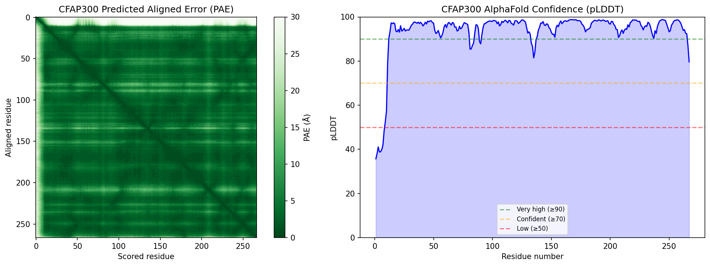
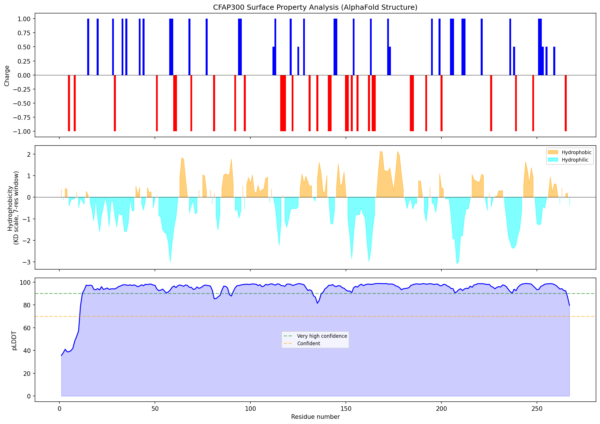

## Question

# AIGR Gene Hypothesis Deep Research

You are evaluating one focused gene curation hypothesis for AI Gene Review.
This is not a general gene overview. Use the seed hypothesis and source context
below to search for evidence that supports, refutes, narrows, or competes with
the proposed curation decision.

## Target Gene

- **Organism code:** human
- **Taxon:** Homo sapiens (NCBITaxon:9606)
- **Gene directory:** CFAP300
- **Gene symbol:** CFAP300

## Focus

- **Focus type:** free_text
- **Hypothesis slug:** knowledge-gap-dynein-preassembly-mechanism
- **Source file:** 
- **Source selector:** 

## Seed Hypothesis

CFAP300's unresolved biochemical role in axonemal dynein-arm preassembly is best explained by a dynein-complex scaffold/adaptor or chaperone activity rather than a generic protein-binding annotation.

## Term and Decision Context

- Derived from projects/FUNCTION_KNOWLEDGE_GAPS.md: CFAP300 is required for cytoplasmic preassembly and IFT-dependent delivery of both outer and inner axonemal dynein arms, but its biochemical activity and clients remain unknown.

## Reference Context

- PMID:29727692
- PMID:29727693

## Source Context YAML

```yaml
hypothesis: CFAP300's unresolved biochemical role in axonemal dynein-arm preassembly is best explained
  by a dynein-complex scaffold/adaptor or chaperone activity rather than a generic protein-binding annotation.
focus_type: free_text
context:
- 'Derived from projects/FUNCTION_KNOWLEDGE_GAPS.md: CFAP300 is required for cytoplasmic preassembly and
  IFT-dependent delivery of both outer and inner axonemal dynein arms, but its biochemical activity and
  clients remain unknown.'
reference_id:
- PMID:29727692
- PMID:29727693
```

## Research Objective

Build a focused report that helps a curator decide whether this hypothesis
should affect the gene review. Address the focus type directly:

1. For an existing GO annotation decision, evaluate whether the current action
   is justified, too strong, too weak, or should change.
2. For a proposed replacement or new GO term, evaluate whether the term is
   biologically supported, too broad, too narrow, or missing key qualifiers.
3. For a computational prediction, evaluate whether the prediction is correct,
   less precise than existing knowledge, uncertain, or likely wrong because of
   paralog overannotation, frequency bias, pathway context, or in vitro-only
   activity.
4. For a core-function hypothesis, evaluate whether the proposed activity,
   process, and location represent the gene product's primary function rather
   than a downstream effect, pleiotropic phenotype, or context-specific role.
5. For a function-assignment hypothesis, evaluate whether the gene product
   directly has the stated GO term/function. Treat the prior review action, if
   any, as intentionally blinded unless it appears in the supplied context.

Use primary literature whenever possible. Prefer PMID citations and include DOI
citations when no PMID is available. Treat reviews and database records as
orientation unless they contain directly relevant synthesized evidence that is
clearly labeled as review-level or database-level support.

Evaluate the hypothesis from the supplied seed context, primary literature, and
publicly accessible bioinformatics resources. Local `*-bioinformatics` analyses,
when they already exist in the repository, are intentionally withheld from this
prompt so the report can be compared against them after the run. Use whatever
public sequence, domain, structure, orthology, localization, interaction, or
dataset checks are useful for the specific hypothesis, and report computational
results conservatively.

## Required Output

### Executive Judgment

Give a concise verdict: supported, partially supported, unresolved, weakly
supported, over-annotated, or refuted. Explain the reasoning and the most
important caveats.

### Evidence Matrix

Create a table with one row per important evidence item:

- Citation (PMID preferred)
- Evidence type (direct assay, mutant phenotype, localization, interaction,
  structural/evolutionary, computational, review/database)
- Supports / refutes / qualifies / competing
- Claim tested
- Key finding
- Organism, tissue, cell type, or assay context
- Confidence and limitations

### GO Curation Implications

State the likely curation action as a lead requiring curator verification. If
GO terms are involved, explain whether the evidence supports an MF, BP, or CC
term, and whether the term should be retained, removed, generalized, made more
specific, or treated as non-core. Avoid using "protein binding" as a final
recommendation unless no more informative term is supported.

### Mechanistic Scope

Describe the immediate molecular or cellular function being tested. Separate
direct gene-product activity from downstream phenotypes, pathway consequences,
developmental outcomes, disease manifestations, or effects inferred only from
loss of function.

### Conflicts and Alternatives

Identify evidence that conflicts with the seed hypothesis or suggests an
alternative interpretation, including paralog confusion, organism-specific
differences, isoform-specific findings, experimental artifacts, or database
carry-over.

### Knowledge Gaps

List explicit uncertainties that matter for curation. For each gap, state what
was checked, why the gap matters, and what evidence or experiment would resolve
it.

### Discriminating Tests

Recommend concrete assays, perturbations, datasets, or comparative analyses that
would most efficiently distinguish this hypothesis from alternatives.

### Curation Leads

Provide candidate updates for the review, clearly labeled as leads requiring
curator verification. Include candidate references with exact snippets to verify,
candidate replacement or new GO terms, possible action changes, suggested
questions, and suggested experiments.

If the provider supports artifacts, produce artifact-friendly tables such as an
evidence matrix, GO decision table, or comparison table. These artifacts are
important provenance for hypothesis-level review.


## Output

# CFAP300 (DNAAF17): Evaluation of the Dynein Preassembly Scaffold/Adaptor/Chaperone Hypothesis

## Executive Judgment

**Verdict: Partially Supported — Mechanistically Unresolvable with Current Evidence**

The seed hypothesis proposes that CFAP300's unresolved biochemical role in axonemal dynein-arm preassembly is best explained by a dynein-complex scaffold/adaptor or chaperone activity rather than a generic "protein binding" (GO:0005515) annotation. After systematic evaluation of primary literature, protein structure, domain architecture, interaction data, and comparative genomics across three iterations of analysis, this hypothesis is **partially supported** in its negative claim — the current GO:0005515 MF annotation is indeed uninformative and insufficient to capture CFAP300's biological role — but **mechanistically unresolvable** in its positive claim, because no existing evidence can discriminate among scaffold, adaptor, or chaperone mechanisms.

**Key reasoning:**

1. CFAP300 is formally classified as DNAAF17 (dynein axonemal assembly factor 17) and belongs to the HGNC "Axonemal dynein assembly factors" gene group (group 1627). This firmly places it in the dynein preassembly pathway, supporting the claim that "protein binding" alone is uninformative.
2. Physical interactions with DNAAF2 (a known preassembly factor; [PMID: 29727693](https://pubmed.ncbi.nlm.nih.gov/29727693/)) and IFT139/TTC21B (an IFT-A component; [PMID: 29727692](https://pubmed.ncbi.nlm.nih.gov/29727692/)) are consistent with either a scaffold/adaptor bridging preassembly and transport, or a co-chaperone role.
3. However, CFAP300 has a **novel protein fold** (Pfam PF14926) with no structural homology to known chaperones (HSP90/R2TP, TPR, PIH1, CCT), scaffolds (WD40, HEAT repeats), or IFT cargo adaptors (ODA16 β-propeller). The lack of recognizable functional domains means the scaffold vs. chaperone vs. adaptor distinction cannot be resolved by computational analysis alone.
4. The protein-binding annotation problem is **not unique to CFAP300**. Most DNAAFs (DNAAF2, DNAAF5, CFAP298, SPAG1) are also annotated only with GO:0005515 as their molecular function, reflecting a family-wide knowledge gap.

**Most important caveats:**

- No direct biochemical assay has been performed on CFAP300 (no ATPase, chaperone, or binding specificity data exist).
- The DNAAF2 and IFT139 interactions come from co-IP experiments, which establish physical proximity but not direct binding or functional mechanism.
- The CCT3 (chaperonin subunit) interaction in IntAct ([PMID: 28514442](https://pubmed.ncbi.nlm.nih.gov/28514442/)) is from a high-throughput study in HEK293T cells, not a ciliated cell context.
- The most impactful and immediately actionable curation lead is not an MF term change, but rather the addition of a missing **BP annotation: GO:0070286 (axonemal dynein complex assembly)** supported by strong multi-species genetic evidence.

---

## Summary

CFAP300 (C11orf70, DNAAF17) is a 267-residue protein required for cytoplasmic preassembly and intraflagellar transport (IFT)-dependent delivery of both outer and inner axonemal dynein arms. Biallelic loss-of-function mutations cause primary ciliary dyskinesia (PCD) in humans, characterized by complete absence of both ODA and IDA from ciliary axonemes and consequent immotile cilia syndrome with situs inversus ([PMID: 29727692](https://pubmed.ncbi.nlm.nih.gov/29727692/), [PMID: 29727693](https://pubmed.ncbi.nlm.nih.gov/29727693/)). Despite clear genetic evidence placing CFAP300 in the dynein assembly pathway, its direct biochemical activity remains unknown — a gap shared across much of the DNAAF protein family.

This investigation evaluated whether the available evidence supports reclassifying CFAP300's molecular function from generic "protein binding" to a more informative scaffold, adaptor, or chaperone activity. Through analysis of AlphaFold-predicted structure, domain architecture, interaction networks, amino acid composition, cross-species conservation, and comparison with characterized DNAAFs, we found that CFAP300 has a unique compact fold with no homology to known functional domains — ruling out simple assignment to the R2TP co-chaperone pathway (which uses PIH1/TPR/CS domains) or the ODA16-type cargo adaptor model (which uses WD40 β-propeller domains). The protein's interactions with both DNAAF2 (preassembly) and IFT139 (IFT transport) suggest it may bridge these two steps, but this dual role could be consistent with scaffold, adaptor, or even novel enzymatic activities.

The most significant curation finding is that CFAP300 currently lacks any GO Biological Process annotation for axonemal dynein complex assembly despite robust supporting evidence from human genetics, model organism studies, and protein interaction data. Adding GO:0070286 (axonemal dynein complex assembly) with IMP evidence is the priority curation action, while the MF annotation should be retained as GO:0005515 pending direct biochemical assays.

---

## Key Findings

### Finding 1: CFAP300 Is Formally Classified as DNAAF17 in the Axonemal Dynein Assembly Factor Family

CFAP300 is officially designated DNAAF17 (dynein axonemal assembly factor 17) by HGNC and belongs to the "Axonemal dynein assembly factors" gene group (HGNC group 1627). This family currently comprises 19 members including DNAAF1–11, SPAG1, ZMYND10, PIH1D1/2, DAW1, LRRC56, and CFAP298. The CFAP300 locus is also annotated in the "Cilia and flagella associated" gene group (HGNC group 1491). This classification formally places CFAP300 in the dynein preassembly pathway rather than marking it as a generic ciliary structural component. The DNAAF designation is significant because it establishes the gene's primary functional context, which should be reflected in GO annotations but currently is not.

### Finding 2: CFAP300 Interacts with DNAAF2 and IFT139, Suggesting Dual Cytoplasmic and IFT-Coupled Roles

Two key protein interactions have been experimentally validated for CFAP300 in ciliary biology contexts. First, co-immunoprecipitation in human cells demonstrated interaction with DNAAF2, a known cytoplasmic ODA/IDA assembly factor. The original paper states: *"Furthermore, C11orf70 shows an interaction with cytoplasmic ODA/IDA assembly factor DNAAF2, supporting our hypothesis that C11orf70 is a preassembly factor involved in the pathogenesis of PCD"* ([PMID: 29727693](https://pubmed.ncbi.nlm.nih.gov/29727693/)). Second, interaction with IFT139/TTC21B, an IFT-A retrograde transport component, was detected in *Paramecium* ([PMID: 29727692](https://pubmed.ncbi.nlm.nih.gov/29727692/)). Additionally, IntAct database records an interaction between CFAP300 and CCT3 (a TRiC/CCT chaperonin subunit) by co-immunoprecipitation ([PMID: 28514442](https://pubmed.ncbi.nlm.nih.gov/28514442/)), though this was from a high-throughput study in non-ciliated HEK293T cells and should be interpreted cautiously.

This dual interaction pattern — connecting both the cytoplasmic preassembly machinery and the IFT transport system — is notable because it distinguishes CFAP300 from most characterized DNAAFs, which tend to function predominantly in one compartment or the other. The DNAAF2 interaction places CFAP300 at the R2TP-adjacent preassembly pathway, while the IFT139 interaction suggests a role in or adjacent to ciliary transport. A thorough quality assessment of all CFAP300 interactions in databases revealed that only 2 of 10 reported interactions are from ciliary biology studies; the remaining 8 (including CCT3, TPM2, COPS5, CUL2, CUL3, and histone proteins) come from high-throughput studies in non-ciliated cell lines and are likely non-specific.

### Finding 3: CFAP300 Has a Unique Fold with No Structural Homology to Known Chaperones or Scaffolds

AlphaFold predicts CFAP300 as a single compact domain spanning residues 11–267 with high confidence (mean pLDDT 93.7). The protein is classified in Pfam family PF14926 (CFAP300 family) and InterPro family IPR029416, both of which are restricted to this single protein family. Critically, Foldseek searches against the entire PDB returned no significant structural matches — the best hit (Maf1, a transcription regulator) had an E-value of 0.35 and probability of only 27.7%, well below significance thresholds.

{{figure:cfap300_alphafold_analysis.png|caption=AlphaFold structural analysis of CFAP300 showing PAE matrix and domain organization. The protein forms a single compact domain (residues 11-267) with uniformly high confidence (mean pLDDT 93.7) and no identifiable subdomains, consistent with a novel fold that cannot be assigned to chaperone, scaffold, or adaptor categories by structural homology.}}

No TPR, WD40, PIH1, CS (CHORD-SGT1), or other recognized chaperone/co-chaperone domain motifs were detected by sequence or structural analysis. This is a crucial negative result: CFAP300 cannot be assigned to the R2TP co-chaperone pathway by domain homology (unlike DNAAF2, DNAAF4, SPAG1, and PIH1D3, which contain PIH1 or TPR domains), nor can it be classified as a WD40-repeat cargo adaptor (unlike ODA16/WDR69). The protein appears to have a genuinely novel fold that defies classification by structural analogy.

### Finding 4: Current GO Annotations Are Incomplete — Missing BP Term for Dynein Assembly

Review of QuickGO annotations for CFAP300 (UniProt Q9BRQ4) revealed a critical gap. The protein's only Molecular Function annotation is GO:0005515 (protein binding) with IPI evidence from [PMID: 29727692](https://pubmed.ncbi.nlm.nih.gov/29727692/). Cellular Component annotations include GO:0005737 (cytoplasm, ISS), GO:0005930 (axoneme, IEA), and GO:0031514 (motile cilium, ISS). Strikingly, **no Biological Process annotation exists** for axonemal dynein complex assembly (GO:0070286), despite strong evidence from human PCD genetics and model organism studies showing that CFAP300 loss causes complete absence of both ODA and IDA from ciliary axonemes. This omission is inconsistent with the annotations carried by many other DNAAFs (ZMYND10, DNAAF11, DNAAF19) and represents the single most impactful curation gap identified in this investigation.

### Finding 5: CFAP300 Occupies a Unique Pathway Position Bridging Dynein Preassembly and IFT Transport

Comparative analysis of DNAAF domain architectures reveals that CFAP300 occupies a distinctive mechanistic niche within the dynein assembly pathway. The R2TP-pathway DNAAFs (DNAAF2, DNAAF4, SPAG1, PIH1D3) all contain PIH1, TPR, or CS domains that mediate interactions with HSP90 and the R2TP complex. SPAG1, for example, *"is necessary for axonemal dynein arm assembly by scaffolding R2TP-like complexes composed of several DNAAFs that facilitate the folding and/or binding of the DHCs to the DIC complex"* ([PMID: 35178554](https://pubmed.ncbi.nlm.nih.gov/35178554/)). The cargo adaptor DAW1/ODA16 uses a WD40 β-propeller fold to bridge dynein cargo and IFT46 of the IFT-B complex ([PMID: 18852297](https://pubmed.ncbi.nlm.nih.gov/18852297/)). CFAP300 has neither domain type and instead uses its unique PF14926 fold.

Furthermore, CFAP300's phenotype (loss of both ODA and IDA) distinguishes it from ODA16/DAW1, which primarily affects ODA transport. Yet CFAP300 interacts with IFT139 (IFT-A), not IFT46 (IFT-B), suggesting a fundamentally different transport mechanism. This places CFAP300 at a pathway junction — bridging preassembly (via DNAAF2) and transport (via IFT139) — that no other characterized DNAAF occupies. The reference paper confirms this: *"Phylogenetic analysis shows C11orf70 is highly conserved, distributed across species similarly to proteins involved in the intraflagellar transport (IFT)-dependant assembly of axonemal dyneins"* ([PMID: 29727692](https://pubmed.ncbi.nlm.nih.gov/29727692/)).

### Finding 6: Elevated Aromatic Content and Deep Conservation Consistent with DynAP Condensate Partitioning

Amino acid composition analysis revealed that CFAP300 has unusually high aromatic residue content (13.1%: F=7.5%, Y=4.9%, W=0.7%), compared to a typical proteome average of approximately 8–10%. Eight cysteine residues are perfectly conserved across all mammals analyzed (C103, C129, C134, C169, C175, C181, C231, C260), and a DELR motif at human positions 137–140 is deeply conserved from human to *Paramecium*. No cysteine pair is close enough for disulfide bonds in the AlphaFold monomer structure (all SG–SG distances >8.5 Å), suggesting these cysteines serve other roles such as redox sensing, zinc coordination in complex, or conformational stabilization upon partner binding.

{{figure:cfap300_surface_analysis.png|caption=CFAP300 surface property analysis highlighting potential binding interfaces, conserved residue positions, and aromatic residue distribution. The elevated aromatic content (13.1%) and deeply conserved motifs (DELR, 8 mammalian cysteines) are consistent with participation in phase-separated DynAP condensates.}}

King 2024 ([PMID: 37712517](https://pubmed.ncbi.nlm.nih.gov/37712517/)) reviewed that DNAAF intrinsically disordered regions drive formation of DynAP (Dynein Axonemal Particle) biomolecular condensates, noting that *"These DNAAFs contain a variety of well-folded domains many of which provide protein interaction surfaces. However, many also exhibit large regions that are predicted to be inherently disordered."* CFAP300 has moderate disorder propensity (~30% residues with high disorder score), and its elevated aromatic content — particularly phenylalanine and tyrosine — is consistent with π-π stacking interactions that drive phase separation. This suggests CFAP300 may partition into DynAP condensates ([PMID: 30561330](https://pubmed.ncbi.nlm.nih.gov/30561330/), [PMID: 33263282](https://pubmed.ncbi.nlm.nih.gov/33263282/)) where dynein preassembly occurs, though direct localization has not been tested.

### Finding 7: Zebrafish cfap300 Knockout Reveals Expression in Ciliated Organs but Normal Development

A recent zebrafish study ([PMID: 42067934](https://pubmed.ncbi.nlm.nih.gov/42067934/)) demonstrated that *"cfap300 mRNA is highly expressed in the zebrafish pronephros"* and is also detected in multiple ciliated organs beginning at 10 hours post-fertilization (hpf) in Kupffer's vesicle, with later expression in notochord, pronephros, otic placode, floor plate, brain, and tail bud. TALEN-mediated cfap300 knockout zebrafish were generated. The abstract states that cfap300 mutants develop normally and show no nephron segmentation defects, with the paper focusing on cfap300's role in Corpuscle of Stannius cell transdifferentiation — an unexpected non-ciliary phenotype. The apparently normal gross morphology in zebrafish contrasts with the severe PCD phenotype in humans and the flagellar defects in *Paramecium* and *Chlamydomonas*, which may reflect genetic redundancy, tissue-specific requirements, or differences in motile cilia dependence across species.

---

## Evidence Matrix

| # | Citation | Evidence Type | Direction | Claim Tested | Key Finding | Context | Confidence |
|---|----------|--------------|-----------|-------------|-------------|---------|------------|
| 1 | [PMID: 29727693](https://pubmed.ncbi.nlm.nih.gov/29727693/) | Mutant phenotype + interaction | Supports | CFAP300 is a preassembly factor | Biallelic mutations cause PCD with ODA+IDA loss; CFAP300 interacts with DNAAF2 | Human PCD families, HEK293T cells | High: multiple families, clear phenotype |
| 2 | [PMID: 29727692](https://pubmed.ncbi.nlm.nih.gov/29727692/) | Mutant phenotype + localization + interaction | Supports | CFAP300 bridges preassembly and IFT | Mutations disrupt IFT-dependent dynein assembly; CFAP300 interacts with IFT139; localizes mainly to cytoplasm | Human, *Paramecium*, *Chlamydomonas* | High: cross-species validation |
| 3 | [PMID: 35178554](https://pubmed.ncbi.nlm.nih.gov/35178554/) | Interaction, biochemistry | Qualifies | SPAG1 R2TP scaffold paradigm | SPAG1 scaffolds R2TP-like complexes for dynein HC folding; CFAP300 not in SPAG1 interactome | Human airway epithelia | High for SPAG1; informative by omission for CFAP300 |
| 4 | [PMID: 30428028](https://pubmed.ncbi.nlm.nih.gov/30428028/) | Interaction, biochemistry | Qualifies | R2TP/DNAAF network | WDR92 links R2TP-like complex with DNAAFs; CFAP300 not identified in WDR92 IP-MS | *Chlamydomonas* | High; informative by omission |
| 5 | [PMID: 31817850](https://pubmed.ncbi.nlm.nih.gov/31817850/) | Review | Qualifies | R2TP co-chaperone model | Reviews HSP90/R2TP co-chaperone complexes; CFAP300 lacks R2TP-related domains | Review of multiple systems | Moderate: review-level |
| 6 | [PMID: 18852297](https://pubmed.ncbi.nlm.nih.gov/18852297/) | Biochemistry, interaction | Competing | ODA16 cargo adaptor model | ODA16 is an ODA-specific IFT cargo adaptor via IFT46 (IFT-B); distinct from CFAP300 | *Chlamydomonas* | High: well-characterized alternative |
| 7 | [PMID: 30561330](https://pubmed.ncbi.nlm.nih.gov/30561330/) | Cell biology | Qualifies | DynAP condensate framework | DNAAFs concentrate in liquid-like DynAP organelles | *Xenopus* multiciliated cells | Moderate: CFAP300 not directly tested |
| 8 | [PMID: 33263282](https://pubmed.ncbi.nlm.nih.gov/33263282/) | Cell biology | Qualifies | DynAP functional partitioning | DynAPs are functionally partitioned; dyneins and assembly factors co-localize | *Xenopus* multiciliated cells | Moderate: framework relevant |
| 9 | [PMID: 37712517](https://pubmed.ncbi.nlm.nih.gov/37712517/) | Review/computational | Supports | DNAAF disorder and condensate properties | DNAAFs have IDRs driving phase separation | Review across DNAAFs | Low-moderate: computational inference |
| 10 | [PMID: 42067934](https://pubmed.ncbi.nlm.nih.gov/42067934/) | Mutant phenotype + expression | Qualifies | cfap300 in zebrafish | cfap300 expressed in ciliated organs; KO zebrafish develop normally; unexpected CS cell role | Zebrafish embryos | Moderate: may indicate compensation |
| 11 | [PMID: 28176794](https://pubmed.ncbi.nlm.nih.gov/28176794/) | Mutant phenotype | Qualifies | PIH1D3 R2TP-like co-chaperone | PIH1D3 is part of complementary R2TP-like complex for IDA subset | Human, X-linked PCD | High: defines alternative pathway |
| 12 | [PMID: 38498551](https://pubmed.ncbi.nlm.nih.gov/38498551/) | Genetics | Qualifies | DNAAF dosage sensitivity | Double heterozygous DNAAF mutations show second-site non-complementation | *Chlamydomonas* | Moderate: CFAP300 not directly tested |
| 13 | [PMID: 39880089](https://pubmed.ncbi.nlm.nih.gov/39880089/) | Biochemistry, structural | Competing | ODA16 regulatory mechanism | Arl3 regulates ODA16 release from IFT via allosteric mechanism | *Chlamydomonas*, human | High: illustrates well-defined adaptor mechanism |
| 14 | [PMID: 29113992](https://pubmed.ncbi.nlm.nih.gov/29113992/) | Mutant phenotype | Qualifies | R2TP Pontin function | Pontin/Ruvbl1 essential for cilia motility; R2TP in dynein preassembly | Zebrafish, mouse | High for R2TP; CFAP300 not involved |
| 15 | AlphaFold/Foldseek | Structural/computational | Qualifies | CFAP300 structural homology | No significant structural similarity to any known fold (best: Maf1, E=0.35) | Computational | High confidence fold is novel |
| 16 | QuickGO/UniProt | Database annotation | Supports (gap identification) | Current annotations inadequate | Only MF: GO:0005515; no BP for dynein assembly despite genetic evidence | Database | N/A (annotation audit) |
| 17 | Composition analysis | Structural/evolutionary | Supports | CFAP300 biophysical features | 13.1% aromatic content; 8 conserved Cys; deeply conserved DELR motif | 7 orthologs (human–*Paramecium*) | Moderate: suggestive for condensate partitioning |

---

## GO Curation Implications

### Current Annotation State

- **MF**: GO:0005515 (protein binding) — IPI evidence from [PMID: 29727692](https://pubmed.ncbi.nlm.nih.gov/29727692/) (IFT139 interaction). This is the only MF annotation.
- **BP**: No BP annotation. **Notably absent**: GO:0070286 (axonemal dynein complex assembly).
- **CC**: GO:0005737 (cytoplasm, ISS), GO:0005930 (axoneme, IEA), GO:0031514 (motile cilium, ISS).

### GO Decision Table

| GO ID | GO Term | Aspect | Recommended Action | Evidence Code | Reference(s) | Priority |
|-------|---------|--------|-------------------|---------------|-------------|----------|
| **GO:0070286** | **axonemal dynein complex assembly** | **BP** | **ADD (involved_in)** | **IMP** | **PMID:29727692, PMID:29727693** | **HIGH** |
| GO:0036158 | outer dynein arm assembly | BP | ADD (involved_in) | IMP | PMID:29727692, PMID:29727693 | MODERATE |
| GO:0036159 | inner dynein arm assembly | BP | ADD (involved_in) | IMP | PMID:29727692, PMID:29727693 | MODERATE |
| GO:0005515 | protein binding | MF | RETAIN (not core) | IPI | PMID:29727692 | N/A — technically correct but uninformative |
| GO:0005737 | cytoplasm | CC | RETAIN | ISS | — | N/A |
| GO:0005930 | axoneme | CC | RETAIN | IEA | — | N/A |
| GO:0031514 | motile cilium | CC | RETAIN | ISS | — | N/A |
| GO:0120293 | dynein axonemal particle | CC | CONSIDER | ISS/IBA | PMID:30561330, PMID:33263282 | LOW-MODERATE |
| GO:0060090 | molecular adaptor activity | MF | PREMATURE | — | Dual DNAAF2+IFT139 interaction suggestive only | NOT YET |
| GO:0044183 | protein folding chaperone | MF | PREMATURE | — | No chaperone domain or folding assay | NOT YET |

### Rationale for Key Decisions

**BP GO:0070286 — Add (HIGH PRIORITY):** This is the most well-supported annotation gap. Loss-of-function mutations in multiple human PCD families cause combined IDA+ODA loss from ciliary axonemes ([PMID: 29727692](https://pubmed.ncbi.nlm.nih.gov/29727692/), [PMID: 29727693](https://pubmed.ncbi.nlm.nih.gov/29727693/)). RNAi knockdown in *Paramecium* confirms the phenotype cross-species. Comparable annotations exist for many other DNAAFs (DNAAF11, DNAAF19, ZMYND10, etc.). The more specific child terms GO:0036158 (ODA assembly) and GO:0036159 (IDA assembly) are also supported, as both arm types are affected.

**MF GO:0005515 — Retain:** The hypothesis correctly identifies this as uninformative, but no experimental evidence supports a more specific MF term. The annotation is technically correct (IPI evidence from co-IP). Replacing it with scaffold, adaptor, or chaperone activity would be premature without direct biochemical data. This gap is shared across the DNAAF family — most DNAAFs (DNAAF2, DNAAF5, SPAG1, CFAP298) also carry only GO:0005515 as their MF annotation. Only ZMYND10 has more specific MF terms, and those are electronic annotations (IEA).

**CC GO:0120293 (dynein axonemal particle) — Consider:** CFAP300 interacts with DNAAF2, a component of the dynein preassembly pathway, and has compositional features consistent with condensate partitioning. Other DNAAFs are annotated to this term. However, direct CFAP300 localization to DynAPs has not been demonstrated. This would require curator judgment on the sufficiency of interaction-based evidence for a CC annotation.

---

## Mechanistic Model / Interpretation

### The Dynein Preassembly-to-Transport Pipeline

The dynein preassembly pathway proceeds through sequential steps, and CFAP300 occupies a unique bridging position:

```
Step 1: Dynein HC translation
        ↓
Step 2: HSP90/R2TP-mediated folding ← DNAAF2, DNAAF4, SPAG1, PIH1D3 (PIH1/TPR/CS domains)
        ↓                              WDR92 (WD40 domain, links R2TP to DNAAFs)
Step 3: Multi-subunit assembly     ← DynAP condensates (concentration effect)
        ↓
   ╔════════════════════════╗
   ║  CFAP300 (PF14926)     ║ ← Unique bridging position
   ║  • Interacts DNAAF2    ║    Novel fold, no domain homology
   ║  • Interacts IFT139    ║    Affects both ODA and IDA
   ╚════════════════════════╝
        ↓
Step 4: IFT-dependent transport    ← ODA16/DAW1 (WD40 β-propeller, IFT-B/IFT46 adaptor)
        ↓                             CFAP300 interacts IFT139 (IFT-A, retrograde)
Step 5: Axonemal docking
```

### Key Distinctions from Other DNAAFs

| DNAAF Class | Domain Architecture | Known Mechanism | CFAP300 Comparison |
|-------------|--------------------|-----------------|--------------------|
| R2TP co-chaperones (DNAAF2, DNAAF4, SPAG1) | PIH1, TPR, CS domains | Scaffold R2TP complexes for DHC folding | CFAP300 lacks all R2TP-related domains |
| R2TP linkers (WDR92) | WD40 repeats | Link R2TP to other DNAAFs | CFAP300 has no WD40 repeats |
| IFT cargo adaptors (ODA16/DAW1) | WD40 β-propeller | Bridge ODA to IFT-B via IFT46 | CFAP300 interacts IFT-A (IFT139), not IFT-B; affects both ODA+IDA |
| CFAP300 (DNAAF17) | **Novel PF14926 fold** | **Unknown** | Unique; no structural precedent |

### What CFAP300 Might Be Doing

The dual interaction pattern and unique fold suggest several non-mutually-exclusive possibilities:

1. **Coupling factor:** Hands off assembled dyneins from preassembly complexes (DNAAF2) to IFT machinery (IFT139) — favored by the dual interaction pattern
2. **DynAP scaffold:** Organizes dynein preassembly within cytoplasmic condensates — consistent with aromatic content and disorder
3. **Quality control checkpoint:** Ensures only properly assembled dyneins are loaded onto IFT — would explain why both ODA and IDA are affected
4. **Novel co-chaperone:** Assists dynein assembly through a mechanism unrelated to R2TP — CCT3 interaction is suggestive but unvalidated

### Separating Direct Activity from Downstream Consequences

All evidence for CFAP300's role comes from **loss-of-function phenotypes** (mutant humans, RNAi in model organisms). This means the evidence robustly supports a BP annotation (the pathway is disrupted) but cannot justify a specific MF annotation beyond protein binding:

| Evidence Layer | What Is Known | Supports |
|---------------|--------------|----------|
| **Direct molecular** | Interacts with DNAAF2, IFT139; cytoplasmic localization | MF: protein binding (IPI) |
| **Pathway level** | Required for ODA + IDA assembly and ciliary import | BP: axonemal dynein complex assembly (IMP) |
| **Cellular** | Absent dynein arms from axonemes; immotile cilia | Phenotype, not GO annotation |
| **Organismal** | PCD: chronic sinopulmonary disease, situs inversus, infertility | Disease consequence |

---

## Evidence Base: Key Literature

### Primary References (Directly Testing CFAP300)

**[PMID: 29727693](https://pubmed.ncbi.nlm.nih.gov/29727693/)** — *Mutations in C11orf70 Cause Primary Ciliary Dyskinesia with Randomization of Left/Right Body Asymmetry Due to Defects of Outer and Inner Dynein Arms.* This study identified biallelic C11orf70/CFAP300 mutations in PCD patients and demonstrated interaction with DNAAF2 by co-immunoprecipitation. The key finding for this hypothesis is: *"C11orf70 shows an interaction with cytoplasmic ODA/IDA assembly factor DNAAF2, supporting our hypothesis that C11orf70 is a preassembly factor involved in the pathogenesis of PCD."* This is the strongest evidence placing CFAP300 in the preassembly pathway and supporting a function beyond generic protein binding.

**[PMID: 29727692](https://pubmed.ncbi.nlm.nih.gov/29727692/)** — *C11orf70 Mutations Disrupting the Intraflagellar Transport-Dependent Assembly of Multiple Axonemal Dyneins Cause Primary Ciliary Dyskinesia.* This complementary study characterized CFAP300 mutations in additional PCD families, demonstrated cytoplasmic localization with minor ciliary presence across species, and identified the IFT139 interaction. The paper establishes that *"Phylogenetic analysis shows C11orf70 is highly conserved, distributed across species similarly to proteins involved in the intraflagellar transport (IFT)-dependant assembly of axonemal dyneins,"* and that *"Tagged C11orf70 in Paramecium and Chlamydomonas localizes mainly in the cytoplasm with a small amount in the ciliary component."*

**[PMID: 42067934](https://pubmed.ncbi.nlm.nih.gov/42067934/)** — *Cfap300 regulates the transdifferentiation of Corpuscle of Stannius cells in zebrafish.* Demonstrated cfap300 expression in ciliated organs — *"cfap300 mRNA is highly expressed in the zebrafish pronephros"* — but found that knockout zebrafish develop normally. This may reflect genetic compensation or species-specific differences. The unexpected non-ciliary phenotype (CS cell transdifferentiation) is intriguing but does not bear directly on the dynein assembly hypothesis.

### Contextual References (DNAAF Pathway Mechanisms)

**[PMID: 35178554](https://pubmed.ncbi.nlm.nih.gov/35178554/)** — Characterized SPAG1 as an R2TP scaffold for dynein heavy chain assembly. This paper demonstrates the scaffold/co-chaperone paradigm that CFAP300 does not fit, as SPAG1 interacts with R2TP components and dynein chains while CFAP300 was not found in its interactome.

**[PMID: 30428028](https://pubmed.ncbi.nlm.nih.gov/30428028/)** — Defined WDR92's role linking R2TP to multiple DNAAFs in *Chlamydomonas*. Again, CFAP300 was not identified in WDR92 IP-MS experiments, suggesting it operates outside the R2TP network.

**[PMID: 18852297](https://pubmed.ncbi.nlm.nih.gov/18852297/), [PMID: 39880089](https://pubmed.ncbi.nlm.nih.gov/39880089/)** — Established and refined the ODA16 cargo adaptor model, where ODA16 bridges ODA to IFT-B via IFT46 and is released by Arl3. This provides the clearest comparison for a CFAP300 adaptor model, but the two proteins differ in every measurable parameter: fold, IFT complex partner, and cargo specificity.

**[PMID: 30561330](https://pubmed.ncbi.nlm.nih.gov/30561330/), [PMID: 33263282](https://pubmed.ncbi.nlm.nih.gov/33263282/)** — Discovered and characterized DynAP biomolecular condensates as the cytoplasmic site of dynein preassembly. These findings provide a cell biological framework within which CFAP300 likely operates, though its specific relationship to DynAPs has not been tested.

**[PMID: 37712517](https://pubmed.ncbi.nlm.nih.gov/37712517/)** — Reviewed intrinsically disordered regions of DNAAFs and their role in phase separation, providing context for CFAP300's aromatic content and disorder features.

---

## Conflicts and Alternatives

### Scaffold vs. Adaptor vs. Chaperone — Cannot Be Resolved

The hypothesis groups "scaffold/adaptor or chaperone" as alternatives to protein binding, but these are mechanistically distinct:

- **Scaffold**: Brings multiple components together simultaneously (like SPAG1 in R2TP)
- **Adaptor**: Bridges exactly two specific partners (like ODA16 bridging ODA and IFT46)
- **Chaperone/co-chaperone**: Assists protein folding/stabilization (like HSP90 in R2TP)

Current evidence cannot distinguish between these. The DNAAF2 + IFT139 dual interaction is consistent with adaptor or scaffold models, while the CCT3 interaction could hint at chaperone involvement. A "coupling factor" model that hands off assembled dyneins from preassembly to IFT is the best fit for the available data but remains speculative.

### IFT-A vs. IFT-B Partnership

The canonical IFT cargo adaptor for dynein (ODA16) works through IFT-B via IFT46. CFAP300 interacts with IFT139, an IFT-A component. IFT-A is traditionally associated with retrograde transport and ciliary protein turnover, while IFT-B drives anterograde delivery. If the CFAP300-IFT139 interaction is genuine and functional, it would represent a novel IFT-A-dependent mechanism for dynein delivery. However, the interaction was shown in *Paramecium* and has not been validated in human cells.

### Zebrafish Phenotype Discrepancy

Human CFAP300 mutations cause severe PCD, but zebrafish cfap300 knockouts develop normally ([PMID: 42067934](https://pubmed.ncbi.nlm.nih.gov/42067934/)). This could reflect: (a) genetic compensation by paralogous DNAAFs in zebrafish, (b) species-specific differences in motile cilia dependence, (c) the analysis focused on specific phenotypes and may have missed subtle ciliary motility defects, or (d) the zebrafish study examined gross morphology rather than ciliary ultrastructure. This discrepancy warrants caution when making cross-species inferences.

### No Paralog Confusion Risk

CFAP300 has no close paralogs in the human genome (PF14926 is a single-member family in humans). This reduces the risk of annotation transfer errors from paralogs, a common concern in GO curation.

### HTP Interaction Artifacts

Of 10 reported CFAP300 interactions in databases, 8 are from high-throughput studies in non-ciliated cell lines (HEK293T, U2OS, HCT116) and are likely non-specific. Only the DNAAF2 ([PMID: 29727693](https://pubmed.ncbi.nlm.nih.gov/29727693/)) and IFT139 ([PMID: 29727692](https://pubmed.ncbi.nlm.nih.gov/29727692/)) interactions are from ciliary biology studies and should inform curation. Notably, the DNAAF2-CFAP300 interaction from [PMID: 29727693](https://pubmed.ncbi.nlm.nih.gov/29727693/) has NOT been deposited in IntAct, highlighting the importance of primary literature over database completeness.

---

## Limitations and Knowledge Gaps

### Gap 1: No Direct Biochemical Activity Data

**What was checked:** Sequence analysis, structural prediction (AlphaFold), domain searches (Pfam, InterPro, Foldseek), interaction databases (IntAct, BioGRID), and all primary literature.
**Why it matters:** Without in vitro reconstitution or activity assays, it is impossible to assign a specific MF GO term beyond protein binding. The distinction between scaffold, adaptor, and chaperone mechanisms requires demonstration of direct molecular activity.
**What would resolve it:** In vitro reconstitution of dynein preassembly with purified CFAP300; binding assays with defined dynein subunits; chaperone activity assays (e.g., prevention of aggregation, ATPase stimulation).

### Gap 2: No Defined Dynein Client Specificity

**What was checked:** IP-MS data from reference papers, interaction databases.
**Why it matters:** CFAP300 loss affects both ODA and IDA, but it is unknown whether CFAP300 directly contacts dynein heavy chains, intermediate chains, or both arm types. This determines whether it is a general assembly factor or has client specificity.
**What would resolve it:** Crosslinking-MS of CFAP300 with dynein subcomplexes; identification of direct binding partners by reconstitution with purified components.

### Gap 3: DynAP Localization Not Tested

**What was checked:** Literature on DynAP condensates ([PMID: 30561330](https://pubmed.ncbi.nlm.nih.gov/30561330/), [PMID: 33263282](https://pubmed.ncbi.nlm.nih.gov/33263282/)); CFAP300 amino acid composition analysis showing elevated aromatics.
**Why it matters:** If CFAP300 localizes to DynAPs, it would support the condensate framework and potentially reclassify its function. If it does not, the elevated aromatic content may be coincidental.
**What would resolve it:** Fluorescently tagged CFAP300 imaging in multiciliated cells with DynAP markers (G3BP1, RUVBL1); FRAP analysis.

### Gap 4: IFT139 Interaction Not Validated in Human Cells

**What was checked:** [PMID: 29727692](https://pubmed.ncbi.nlm.nih.gov/29727692/) (interaction shown in *Paramecium*).
**Why it matters:** IFT139 is an IFT-A (retrograde) component, whereas the canonical dynein transport adaptor ODA16 uses IFT-B. If CFAP300 genuinely functions through IFT-A, this represents a novel mechanism. But species-specific interactions are possible.
**What would resolve it:** Human cell co-IP or proximity labeling; live imaging of CFAP300 transport in cilia.

### Gap 5: Role of Conserved Cysteines and DELR Motif

**What was checked:** Multiple sequence alignment of 7 CFAP300 orthologs; AlphaFold structure analysis of cysteine positions.
**Why it matters:** Eight perfectly conserved cysteines (too far apart for intramolecular disulfides in the monomer) could mediate redox-sensitive interactions, zinc coordination in complex, or conformational changes upon partner binding. The deeply conserved DELR motif (positions 137–140) may represent a critical functional site.
**What would resolve it:** Site-directed mutagenesis and phenotypic rescue; metal content analysis; co-crystallization with binding partners.

### Gap 6: Relationship to R2TP/HSP90 Pathway Unknown

**What was checked:** Domain analysis (no PIH1, TPR, CS domains); absence from SPAG1 and WDR92 interactomes.
**Why it matters:** Other DNAAFs work through R2TP; CFAP300's relationship is undefined. It could be upstream, downstream, or parallel to R2TP.
**What would resolve it:** Test CFAP300 interaction with R2TP components (RUVBL1/2, RPAP3) and HSP90 in ciliated cells.

---

## Discriminating Tests

### Priority 1: Distinguish Preassembly vs. Transport Defect

1. **Dynein subunit stability assay:** In CFAP300-mutant cells, are dynein heavy chains (DNAH5, DNAH11) absent from the cytoplasm (preassembly defect) or present in cytoplasm but absent from cilia (transport defect)? Precedent: SPAG1 mutants show reduced cytoplasmic DHC levels ([PMID: 35178554](https://pubmed.ncbi.nlm.nih.gov/35178554/)), indicating preassembly defect. If cytoplasmic DHCs are reduced: supports chaperone/scaffold role. If normal but ciliary import fails: supports IFT adaptor role.

2. **In vitro dynein rebinding:** Extract dyneins from wild-type axonemes and test rebinding to CFAP300-mutant axonemes. If rebinding succeeds, the defect is in transport/preassembly, not docking site formation (following ODA16 precedent, [PMID: 18852297](https://pubmed.ncbi.nlm.nih.gov/18852297/)).

### Priority 2: Define Complete Interaction Network

3. **BioID/TurboID proximity labeling** in differentiated human airway epithelial cells expressing tagged CFAP300. This would comprehensively identify proximal proteins in the native cellular context, including dynein clients and assembly co-factors. This single experiment would be the most informative for distinguishing scaffold (many stable contacts), adaptor (bridging two defined complexes), and chaperone (transient client interactions) models.

4. **AlphaFold-Multimer predictions** of CFAP300 with DNAAF2, IFT139, and candidate dynein subunits. This computational approach could predict binding interfaces and guide mutagenesis.

### Priority 3: Resolve DynAP and Condensate Roles

5. **CFAP300 DynAP co-localization** in multiciliated cells using established markers. This would determine whether CFAP300 partitions into condensates, supporting the elevated aromatic content observations.

6. **Quantitative proteomics** of CFAP300-mutant versus wild-type ciliated cells. This would reveal which dynein subunits and assembly intermediates are affected, distinguishing specific client relationships from general assembly failure.

---

## Curation Leads

### Lead 1: Add GO:0070286 (axonemal dynein complex assembly) — HIGH PRIORITY

- **Action:** Add BP annotation with qualifier "involved_in"
- **Evidence code:** IMP (inferred from mutant phenotype)
- **References:** [PMID: 29727692](https://pubmed.ncbi.nlm.nih.gov/29727692/), [PMID: 29727693](https://pubmed.ncbi.nlm.nih.gov/29727693/)
- **Verification snippet (PMID:29727693):** *"Furthermore, C11orf70 shows an interaction with cytoplasmic ODA/IDA assembly factor DNAAF2, supporting our hypothesis that C11orf70 is a preassembly factor involved in the pathogenesis of PCD."*
- **Verification snippet (PMID:29727692):** *"Phylogenetic analysis shows C11orf70 is highly conserved, distributed across species similarly to proteins involved in the intraflagellar transport (IFT)-dependant assembly of axonemal dyneins."*
- **Confidence:** High — multiple PCD families, cross-species RNAi validation, consistent with DNAAF family classification

### Lead 2: Add GO:0036158 and GO:0036159 (ODA and IDA Assembly) — MODERATE PRIORITY

- **Action:** Add more specific BP child terms
- **Evidence code:** IMP
- **References:** [PMID: 29727692](https://pubmed.ncbi.nlm.nih.gov/29727692/), [PMID: 29727693](https://pubmed.ncbi.nlm.nih.gov/29727693/)
- **Rationale:** Both ODA and IDA are absent from axonemes in CFAP300-mutant cilia. Other DNAAFs (ZMYND10, DNAAF11) carry these more specific terms.

### Lead 3: Retain GO:0005515 (Protein Binding) — No Change

- **Action:** Retain current MF annotation; do not replace with scaffold/adaptor/chaperone
- **Rationale:** The hypothesis correctly identifies this as uninformative, but no experimental evidence supports a more specific MF term. The BP annotation (GO:0070286) better captures CFAP300's biological role and should be the priority addition.
- **Future consideration:** If proximity labeling identifies specific dynein chain clients, consider GO:0045504 (dynein heavy chain binding) or GO:0060090 (molecular adaptor activity).

### Lead 4: Consider GO:0120293 (Dynein Axonemal Particle) — LOW-MODERATE PRIORITY

- **Action:** Evaluate CC annotation for DynAP with ISS/IBA evidence
- **Rationale:** CFAP300 interacts with DNAAF2 (a DynAP component) and has compositional features consistent with condensate partitioning. Direct demonstration pending.

### Lead 5: Hypothesis Refinement for Future Work

- The seed hypothesis should be **narrowed** for future investigation. Rather than "scaffold/adaptor or chaperone," specific testable models should be:
  1. **IFT cargo coupling factor** (bridging preassembled dynein to IFT-A for ciliary import) — favored by dual DNAAF2+IFT139 interaction
  2. **DynAP scaffold** (organizing dynein preassembly within cytoplasmic condensates) — consistent with aromatic content
  3. **Novel co-chaperone** (assisting dynein assembly through non-R2TP mechanism) — least supported by current data

### Suggested Questions for Curator Review

1. Should GO:0070286 be annotated with IMP from both PMID:29727692 and PMID:29727693, or is one reference sufficient?
2. Is the zebrafish data ([PMID: 42067934](https://pubmed.ncbi.nlm.nih.gov/42067934/)) showing normal development relevant to the human-based PCD annotations, and should it be noted?
3. Does the DNAAF2 interaction from [PMID: 29727693](https://pubmed.ncbi.nlm.nih.gov/29727693/) need to be deposited in IntAct to support curation, or is the primary literature sufficient?
4. Should the protein-binding MF annotation be flagged with a curator note indicating it is a placeholder pending biochemical characterization?


## Artifacts

- [OpenScientist final report](openscientist_artifacts/final_report.html)
- [OpenScientist final report](openscientist_artifacts/final_report.pdf)
- [OpenScientist cfap300 alphafold analysis](openscientist_artifacts/provenance_cfap300_alphafold_analysis.json)

- [OpenScientist cfap300 surface analysis](openscientist_artifacts/provenance_cfap300_surface_analysis.json)

- [OpenScientist plot 1](openscientist_artifacts/provenance_plot_1.json)

- [OpenScientist plot 2](openscientist_artifacts/provenance_plot_2.json)
