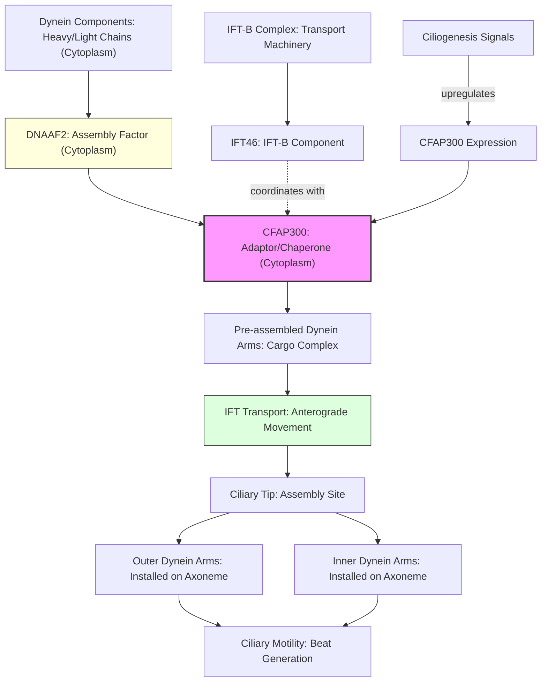

# Pathway Summary for CFAP300

## Overview
CFAP300 (Cilia And Flagella Associated Protein 300) is an essential cytoplasmic assembly factor and cargo adaptor for axonemal dynein arms in motile cilia and flagella. The protein functions at the intersection of dynein assembly and intraflagellar transport (IFT) pathways, linking pre-assembled dynein complexes to the IFT machinery for transport into cilia [PMID:29727692]. Mutations in CFAP300 cause Primary Ciliary Dyskinesia 38 (CILD38), characterized by complete loss of both outer and inner dynein arms, resulting in immotile cilia and associated clinical manifestations.

## Core Pathways

### Dynein Arm Assembly Pathway
CFAP300 functions as a preassembly factor in the cytoplasmic assembly of axonemal dynein arms, similar to other dynein assembly factors [PMID:29727693]. The protein interacts directly with DNAAF2, a key cytoplasmic assembly factor for outer and inner dynein arms [PMID:29727693]. This interaction supports the cytoplasmic pre-assembly of dynein complexes before their transport into the ciliary axoneme.

### Intraflagellar Transport (IFT) Pathway
CFAP300 serves as a critical cargo adaptor linking assembled dynein components to the IFT machinery. During ciliogenesis, CFAP300 accumulates at ciliary tips in a distribution similar to IFT-B protein IFT46, and its transport within cilia is IFT-dependent [PMID:29727692]. This positions CFAP300 as a bridge between cytoplasmic dynein assembly and ciliary transport systems.

## Pathway Diagram

## Upstream Regulation
- **Ciliogenesis signals**: CFAP300 expression is upregulated during ciliogenesis, similar to other cytoplasmic dynein assembly factors [PMID:29727693]
- **Assembly factor network**: Direct interaction with DNAAF2 positions CFAP300 within the dynein assembly factor network [PMID:29727693]

## Downstream Effects
- **Dynein arm assembly**: Essential for both outer (ODA) and inner (IDA) dynein arm assembly [PMID:29727692]
- **Ciliary motility**: Loss of CFAP300 results in complete absence of dynein arms and immotile cilia [PMID:29727692]
- **Sperm flagellar function**: Required for sperm motility, with mutations causing male infertility [file:human/CFAP300/CFAP300-deep-research.md]

## Molecular Interactions
- **DNAAF2**: Direct protein-protein interaction supporting dynein pre-assembly [PMID:29727693]
- **IFT machinery**: Functional coupling with IFT-B complex, particularly IFT46, for ciliary transport [PMID:29727692]
- **Dynein components**: Binds dynein subunits including components like DNAL1 and DNAH2 (inferred from functional studies) [file:human/CFAP300/CFAP300-deep-research.md]

## Clinical Significance
Mutations in CFAP300 cause Primary Ciliary Dyskinesia 38 (CILD38) with characteristic features [PMID:29727692]:
- **Respiratory manifestations**: Chronic respiratory infections due to impaired mucociliary clearance
- **Laterality defects**: Randomization of left-right body asymmetry (situs inversus)
- **Male infertility**: Complete sperm immotility due to flagellar dynein arm defects
- **Ciliary ultrastructure**: Complete absence of both inner and outer dynein arms

## Functional Integration
CFAP300 operates at a critical junction between two essential ciliary processes:
1. **Cytoplasmic phase**: Chaperone/assembly factor role in dynein arm pre-assembly
2. **Transport phase**: Cargo adaptor function linking assembled dyneins to IFT machinery

This dual functionality makes CFAP300 indispensable for generating motile cilia, as disruption at either phase prevents dynein arm installation and abolishes ciliary motility.