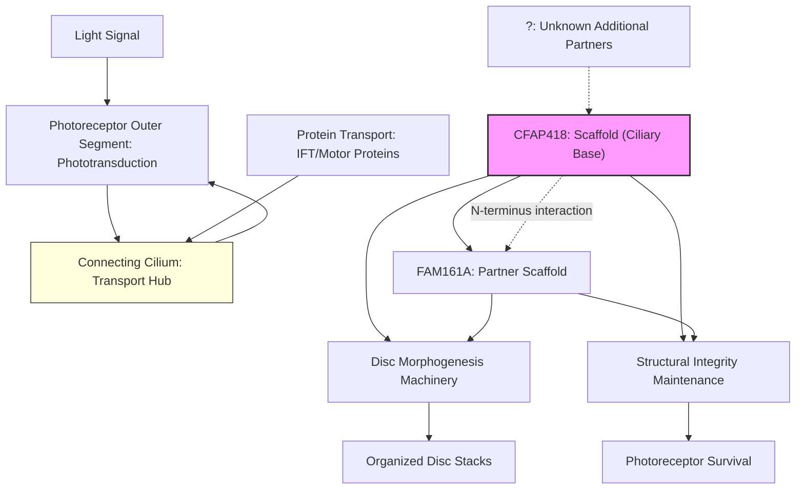

# Pathway Summary for CFAP418

## Overview
CFAP418 (C8orf37) is a ciliary scaffolding protein that functions at the photoreceptor connecting cilium base, where it is essential for outer segment disc morphogenesis and structural organization. The protein forms a complex with FAM161A at the ciliary base, contributing to photoreceptor structural integrity and survival [PMID:36233334]. Mutations in CFAP418 cause multiple retinal dystrophies including cone-rod dystrophy 16 (CORD16), retinitis pigmentosa 64 (RP64), and Bardet-Biedl syndrome 21 (BBS21) [PMID:22177090].

## Core Pathways

### Photoreceptor Outer Segment Morphogenesis Pathway
CFAP418 is critical for the proper formation and organization of photoreceptor outer segment discs. The protein localizes specifically at the connecting cilium base, the narrow bridge between inner and outer segments where disc morphogenesis occurs [PMID:22177090]. Loss of CFAP418 results in severely disorganized outer segment disc structure from early postnatal development, indicating its essential role in disc assembly and stacking.

### Ciliary Scaffold Complex Assembly
CFAP418 forms a protein complex with FAM161A through direct protein-protein interactions. The N-terminus of CFAP418 (amino acids 1-75) binds to FAM161A's UPF0564 domain (amino acids 341-517), creating a scaffold at the ciliary base [PMID:36233334]. This complex is essential for maintaining photoreceptor structural integrity and preventing degeneration.

## Pathway Diagram

## Molecular Architecture
CFAP418 contains extensive coiled-coil regions that support its scaffolding function:
- Major coiled-coil domain: positions 0-259
- Additional coiled-coil regions: positions 273-315 and 350-441
- Multiple protein interaction motifs including WD40-like repeats and TPR-like motifs [file:human/CFAP418/CFAP418-bioinformatics/RESULTS.md]

## Upstream Regulation
- **Developmental signals**: Expression and localization during photoreceptor development
- **Ciliary targeting signals**: VxPx-like motifs direct ciliary localization [file:human/CFAP418/CFAP418-bioinformatics/RESULTS.md]

## Downstream Effects
- **Outer segment disc organization**: Essential for proper disc stacking and membrane organization [PMID:22177090]
- **Photoreceptor survival**: Loss leads to progressive photoreceptor degeneration
- **Visual function**: Mutations cause cone-rod dystrophy and retinitis pigmentosa phenotypes [PMID:22177090]

## Protein Complex Partners
- **FAM161A**: Direct binding partner forming ciliary base scaffold complex [PMID:36233334]
- **Additional ciliary proteins**: Potential interactions with other CFAP family members and ciliary transport machinery (specific partners remain to be identified)

## Clinical Significance
Mutations in CFAP418 cause a spectrum of retinal dystrophies [PMID:22177090]:
- **Cone-rod dystrophy 16 (CORD16)**: Progressive loss of cone and rod photoreceptors
- **Retinitis pigmentosa 64 (RP64)**: Rod-predominant degeneration with early macular involvement
- **Bardet-Biedl syndrome 21 (BBS21)**: Syndromic ciliopathy with retinal degeneration

## Subcellular Organization
CFAP418 exhibits precise subcellular localization:
- **Primary site**: Base of connecting cilia in photoreceptors [PMID:22177090]
- **Secondary sites**: Base of primary cilia in retinal pigment epithelium cells [PMID:22177090]
- **Distribution**: Throughout inner segment with concentration at ciliary base

## Functional Integration
CFAP418 operates at the critical junction between photoreceptor compartments:
1. **Structural role**: Scaffolding protein maintaining ciliary base architecture
2. **Morphogenetic role**: Essential for outer segment disc assembly
3. **Maintenance role**: Required for long-term photoreceptor survival

The protein's position at the connecting cilium base places it at the nexus of protein trafficking between inner and outer segments, though specific transport pathway interactions remain to be fully characterized.