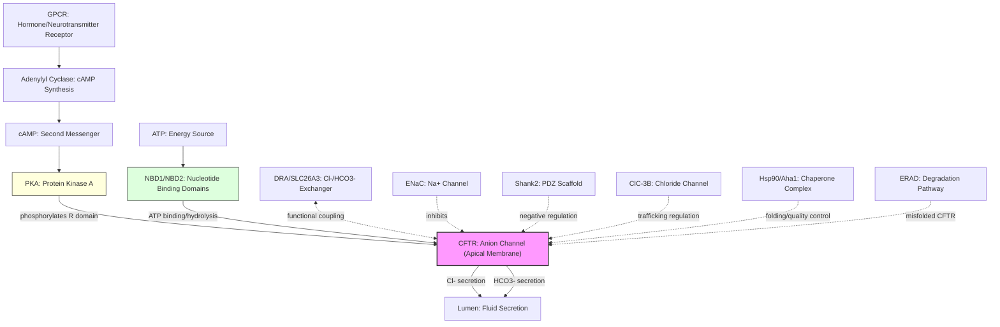

# Pathway Summary for CFTR

## Overview
CFTR (Cystic Fibrosis Transmembrane Conductance Regulator) is a unique ABC transporter that functions as a phosphorylation- and ATP-regulated anion channel rather than an active pump. It conducts chloride and bicarbonate ions across epithelial cell apical membranes, playing critical roles in fluid secretion, mucociliary clearance, and salt balance [PMID:11524016]. Channel activation requires PKA phosphorylation of the regulatory R domain and ATP binding/hydrolysis at nucleotide-binding domains, integrating cAMP signaling with epithelial ion transport.

## Core Signaling Pathways

### cAMP-PKA Signaling Pathway
CFTR activation is primarily controlled by the cAMP-PKA pathway. Hormones and neurotransmitters activate adenylyl cyclase, elevating cAMP levels which activate PKA. PKA phosphorylates multiple serine residues in CFTR's R domain, priming the channel for ATP-dependent gating [PMID:11524016]. This pathway is essential for regulated fluid secretion in airways, intestines, and exocrine glands.

### ATP-Dependent Channel Gating
CFTR channel gating requires ATP binding and hydrolysis at its two nucleotide-binding domains (NBD1 and NBD2). ATP binding promotes NBD dimerization triggering channel opening, while ATP hydrolysis at NBD2 drives channel closure [PMID:8910473]. This creates a gating cycle where the channel alternates between open and closed states in an ATP-dependent manner.

### Epithelial Ion Transport Network
CFTR functions within a coordinated network of epithelial ion transporters. It functionally couples with SLC26 anion exchangers (particularly DRA/SLC26A3) for chloride/bicarbonate exchange [PMID:12369822], and negatively regulates ENaC sodium channels to maintain proper ion and fluid balance across epithelia [PMID:15010471].

## Pathway Diagram

## Upstream Regulators
- **Hormonal signals**: VIP, secretin, prostaglandins activate adenylyl cyclase [PMID:11524016]
- **cAMP-PKA cascade**: PKA phosphorylation of R domain serine residues enables channel activation
- **ATP availability**: Intracellular ATP levels control channel gating frequency [PMID:8910473]

## Downstream Effects
- **Chloride secretion**: Primary anion conducted, drives transepithelial fluid secretion [PMID:11524016]
- **Bicarbonate secretion**: Important for pH regulation and mucin hydration [PMID:15010471]
- **ENaC inhibition**: Reduces sodium absorption to maintain ion balance
- **Fluid secretion**: Controls hydration of airway surface liquid, digestive secretions, and sweat

## Protein Interactions and Regulation
- **DRA/SLC26A3**: Functional coupling for coordinated Cl-/HCO3- exchange [PMID:12369822]
- **Shank2**: PDZ-domain scaffold that negatively regulates CFTR activity [PMID:14679199]
- **ClC-3B**: Golgi-localized chloride channel involved in CFTR trafficking [PMID:12471024]
- **Quality control machinery**: Hsp90/Aha1 chaperones and ERAD components process misfolded CFTR [PMID:16901789, PMID:17110338]

## Disease Pathways

### Cystic Fibrosis Pathogenesis
Loss-of-function mutations cause cystic fibrosis through multiple mechanisms:
- **ΔF508 mutation**: Protein misfolding and ER retention, most common CF mutation [PMID:16546175]
- **Defective chloride secretion**: Leads to thick, dehydrated mucus in airways
- **Pancreatic insufficiency**: Loss of digestive enzyme secretion
- **Male infertility**: Congenital bilateral absence of vas deferens

### Secretory Diarrhea
CFTR hyperactivation by bacterial toxins (e.g., cholera toxin) causes excessive fluid secretion. Lysophosphatidic acid can inhibit CFTR-mediated secretory diarrhea through protein interactions [PMID:16203867].

## Therapeutic Targets
- **CFTR modulators**: Potentiators enhance channel gating, correctors improve folding/trafficking
- **Chaperone modulation**: Targeting Hsp90/Aha1 to rescue misfolded CFTR [PMID:17110338]
- **Miglustat**: Alpha-glucosidase inhibitor that rescues ΔF508-CFTR function [PMID:16546175]

## Tissue-Specific Functions
- **Airways**: Mucociliary clearance through airway surface liquid hydration
- **Intestine**: Fluid secretion and pH regulation via HCO3- transport
- **Pancreas**: Digestive enzyme secretion and ductal fluid flow
- **Sweat glands**: Salt reabsorption (defective in CF leading to high sweat chloride)

## Integration with Cellular Processes
CFTR integrates multiple cellular signals:
1. **Hormonal regulation**: Responds to systemic signals via cAMP
2. **Metabolic state**: ATP-dependent gating links to cellular energy status
3. **Ion homeostasis**: Coordinates with other channels/transporters for epithelial ion balance
4. **Quality control**: Subject to extensive ER quality control and ERAD pathways